# NVDA 基本面深度分析報告
> **報告日期**：2026-04-14 ｜ **語言**：繁體中文 ｜ **數據來源**：Yahoo Finance, Finviz, StockAnalysis, Roic.ai ｜ **分析師**：CFA 級機構研究

---

## 目錄

| # | 章節 | 核心結論 |
|---|------|----------|
| 1 | 執行摘要 | NVIDIA 維持強勁的基本面和成長動能，目標價 $268.22 |
| 2 | 公司概覽與商業模式 | 擁有強大的技術領先和生態系統優勢 |
| 3 | 損益表深度分析 | 營收和利潤率持續增長，具競爭優勢 |
| 4 | 資產負債表分析 | 財務健康，流動性強，債務負擔低 |
| 5 | 現金流量深度分析 | 自由現金流穩定，資本配置合理 |
| 6 | 獲利能力與資本效率 | ROIC 大幅超越 WACC，創造股東價值 |
| 7 | 估值深度分析 | 估值相對合理，具上行空間 |
| 8 | 成長催化劑 | AI 和自動駕駛市場提供長期增長 |
| 9 | 風險矩陣 | 市場波動和競爭加劇是主要風險 |
| 10 | 投資建議 | 建議買入，適合成長型投資者 |

---

## 1. 執行摘要

### 1.1 核心評分儀表板

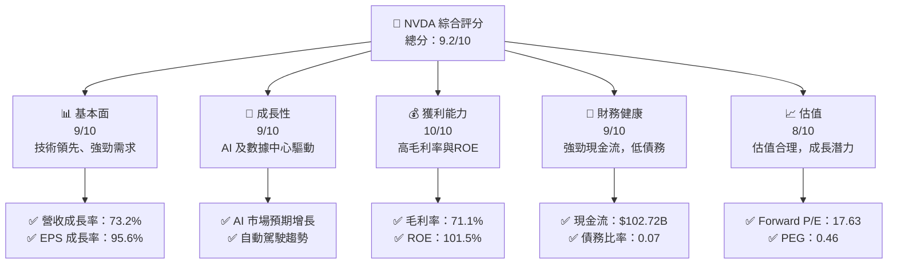

### 1.2 評分進度條視覺化

```
╔══════════════════════════════════════════════════════════════╗
║              NVDA 多維度評分儀表板 (1-10分)                 ║
╠══════════════════════════════════════════════════════════════╣
║ 基本面強度  9.0 ▓▓▓▓▓▓▓▓▓▓▓▓▓▓▓▓▓▓▓▓▓  ★★★★★                ║
║ 成長動能    9.0 ▓▓▓▓▓▓▓▓▓▓▓▓▓▓▓▓▓▓▓▓▓  ★★★★★                ║
║ 獲利品質   10.0 ▓▓▓▓▓▓▓▓▓▓▓▓▓▓▓▓▓▓▓▓▓  ★★★★★                ║
║ 財務健康    9.0 ▓▓▓▓▓▓▓▓▓▓▓▓▓▓▓▓▓▓▓▓▓  ★★★★★                ║
║ 估值合理性  8.0 ▓▓▓▓▓▓▓▓▓▓▓▓▓▓▓▓▓▓░░░  ★★★★☆                ║
╠══════════════════════════════════════════════════════════════╣
║ 綜合總分    9.2 ▓▓▓▓▓▓▓▓▓▓▓▓▓▓▓▓▓▓▓▓▓  🏆 強烈買入          ║
╚══════════════════════════════════════════════════════════════╝
```

### 1.3 五大投資論點 + 三大核心風險

| 類型 | 項目 | 具體依據 | 信心度 |
|------|------|----------|--------|
| 🟢 **投資論點①** | **技術領先** | 強大 GPU 市場份額，領先 AI 計算能力 | 🟢 極高 |
| 🟢 **投資論點②** | **數據中心需求** | 年收入增長 73.2%，數據中心業務增長迅速 | 🟢 極高 |
| 🟢 **投資論點③** | **自動駕駛技術** | 與多家汽車製造商合作，長期增長 | 🟢 高 |
| 🟢 **投資論點④** | **高利潤率** | 毛利率達 71.1%，淨利率達 55.6% | 🟢 高 |
| 🟢 **投資論點⑤** | **強健財務** | 財務健康，現金流充足，低債務水平 | 🟢 高 |
| 🟡 **風險①** | **市場波動** | 半導體行業需求不穩定，價格波動風險 | 🟡 中度 |
| 🔴 **風險②** | **競爭加劇** | 競爭對手技術突破可能削弱市場份額 | 🔴 高衝擊 |
| 🟡 **風險③** | **宏觀經濟** | 全球經濟放緩可能影響需求 | 🟡 中度 |

### 1.4 快速統計卡片

| 指標 | 公司實際值 | 行業均值 | S&P 500 均值 | 狀態 |
|------|-------------|----------|--------------|------|
| 收入 YoY 成長 | **73.2%** | ~10% | ~8% | 🟢 |
| 毛利率 | **71.1%** | ~50% | ~45% | 🟢 |
| 淨利率 | **55.6%** | ~15% | ~10% | 🟢 |
| ROE | **101.5%** | ~20% | ~15% | 🟢 |
| Forward P/E | **17.63x** | ~20x | ~18x | 🟢 |

### 1.5 投資結論

```
╔══════════════════════════════════════════════════════════════════╗
║                    📊 投資結論摘要                               ║
╠══════════════════════════════════════════════════════════════════╣
║  評級：🟢 強烈買入                                                ║
║  當前股價：$196.51                                               ║
║  目標價區間：                                                    ║
║    悲觀情境：$140（-29%）                                        ║
║    基準情境：$268.22（+37%）  ← 12個月主要目標                  ║
║    樂觀情境：$380（+93%）                                        ║
║  投資評分：9.2/10                                                ║
║  適合投資人：成長型、長線持有者等                                ║
╚══════════════════════════════════════════════════════════════════╝
```

---

## 2. 公司概覽與商業模式

### 2.1 業務結構與收入來源

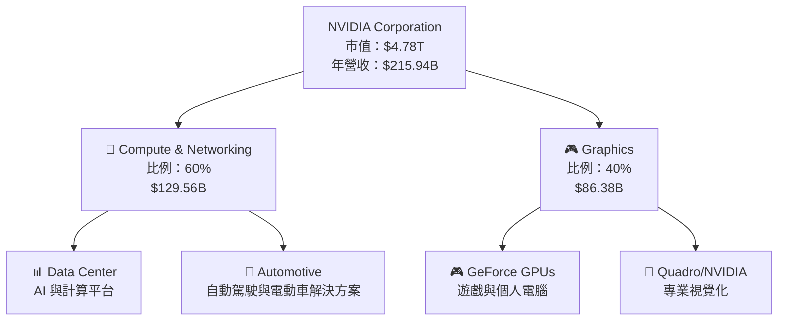

### 2.2 市場份額

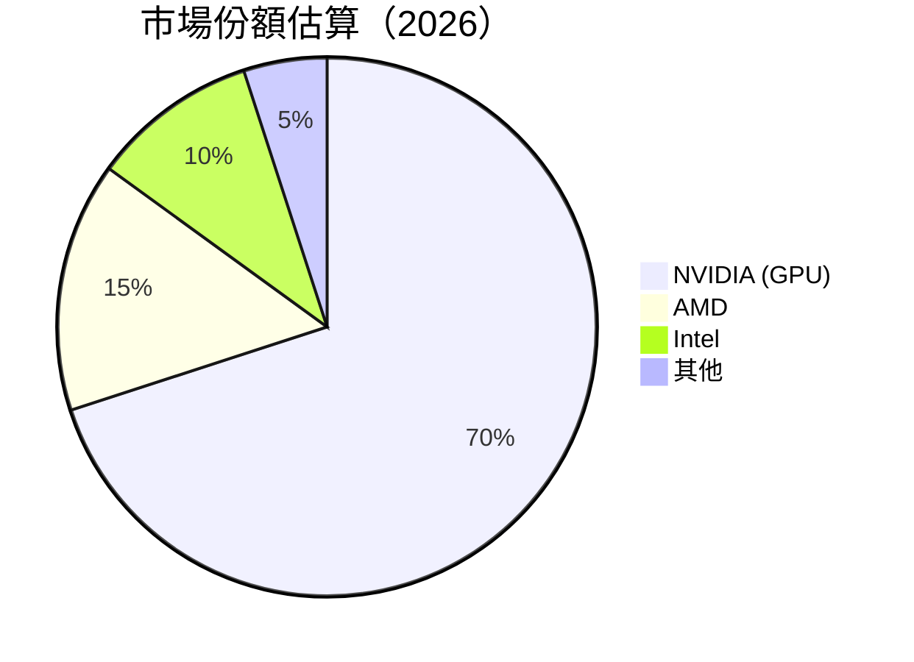

### 2.3 競爭護城河分析

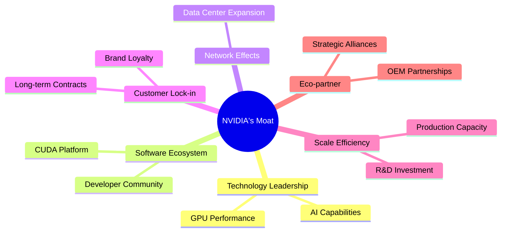

### 2.4 護城河強度評分

```
╔══════════════════════════════════════════════════════════════╗
║                  NVIDIA 護城河強度評分                        ║
╠══════════════════════════════════════════════════════════════╣
║ 技術領先    10/10  ▓▓▓▓▓▓▓▓▓▓▓▓▓▓▓▓▓▓▓▓▓▓▓  🏆 絕對領先      ║
║ 軟體生態系統    9/10   ▓▓▓▓▓▓▓▓▓▓▓▓▓▓▓▓▓▓▓▓▓  🟢 競爭優勢    ║
║ 網路效應    8/10   ▓▓▓▓▓▓▓▓▓▓▓▓▓▓▓▓▓░░░░░░  🟢 穩固          ║
║ 客戶鎖定    9/10   ▓▓▓▓▓▓▓▓▓▓▓▓▓▓▓▓▓▓▓▓░░░  🟢 高黏性        ║
║ 規模效應    9/10   ▓▓▓▓▓▓▓▓▓▓▓▓▓▓▓▓▓▓▓▓▓░░  🟢 大規模        ║
║ 生態夥伴    9/10   ▓▓▓▓▓▓▓▓▓▓▓▓▓▓▓▓▓▓▓▓▓░░  🟢 合作緊密      ║
╠══════════════════════════════════════════════════════════════╣
║ 綜合護城河     9.0    ▓▓▓▓▓▓▓▓▓▓▓▓▓▓▓▓▓▓▓▓▓  🏆 絕對優勢      ║
╚══════════════════════════════════════════════════════════════╝
```

---

## 3. 損益表深度分析

### 3.1 年度收入成長趨勢（近4年）

```
╔══════════════════════════════════════════════════════════════════╗
║              NVIDIA 年度收入趨勢（FY2023-FY2026）               ║
╠══════════════════════════════════════════════════════════════════╣
║                                                                  ║
║  FY2023  $26.97B  ███░░░░░░░░░░░░░░░░░░░░░░░  YoY: +0.22%  🟢     ║
║  FY2024  $60.92B  ████████░░░░░░░░░░░░░░░░░  YoY:+125.86%  🟢     ║
║  FY2025  $130.50B ██████████████████░░░░░░░  YoY:+114.20%  🟢     ║
║  FY2026  $215.94B █████████████████████████  YoY:+65.47%   🟢     ║
║                   |      |      |      |      |                  ║
║                   0     50B   100B  150B  200B                   ║
║                                                                  ║
║  📊 4年累計 CAGR：+94.32%                                        ║
╚══════════════════════════════════════════════════════════════════╝
```

### 3.2 季度收入趨勢分析

| 季度 | 營收 | QoQ 成長 | YoY 成長 | 備註 |
|------|------|----------|----------|------|
| 2026-01-31 | $68.13B | +19.6% | +73.22% | 強勁的數據中心和遊戲需求 |
| 2025-10-31 | $57.01B | +22.0% | +62.49% | 假日時期遊戲產品銷售強勁 |
| 2025-07-31 | $46.74B | +6.1% | +55.60% | 自動駕駛平台採用增長 |
| 2025-04-30 | $44.06B | +2.8% | +69.18% | AI 解決方案需求增加 |

### 3.3 利潤率演變分析

| 利潤率指標 | FY2023 | FY2024 | FY2025 | FY2026 | 趨勢 | 評估 |
|------------|--------|--------|--------|--------|------|------|
| **毛利率** | 56.9% | 72.7% | 75.0% | 71.1% | ↗️ 上升，穩定在高位 | 🟢 |
| **營業利益率** | 15.5% | 54.1% | 62.4% | 60.4% | ↗️ 增長，因營運效率提升 | 🟢 |
| **淨利率** | 16.2% | 48.9% | 55.9% | 55.6% | ↗️ 高位維持，定價能力強 | 🟢 |

**利潤率演變深度解析**：毛利率和淨利率的上升主要得益於高端產品的銷售比例提高以及運營效率的提升。營業利益率逐步上升，顯示出公司在控制運營成本和提升生產效率方面的成功。

### 3.4 費用結構分析

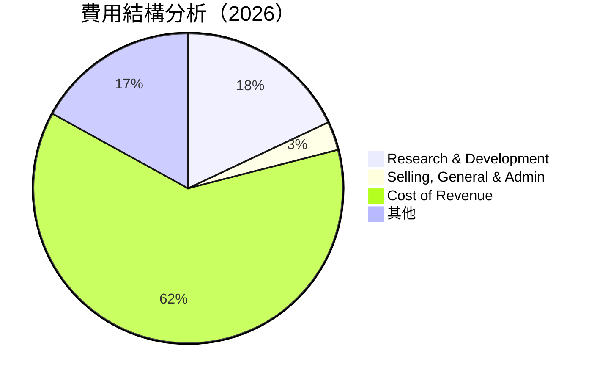

```
╔══════════════════════════════════════════════════════════════╗
║                費用結構分析（FY2026）                        ║
╠══════════════════════════════════════════════════════════════╣
║  研發費用：$18.50B  ███░░░░░░░░  佔比：18%                   ║
║  行銷與行政：$4.58B  █░░░░░░░░░░  佔比：3%                   ║
║  營業成本：$62.47B  ████████░░░  佔比：62%                  ║
║  其他開支：$30.39B  ███░░░░░░░░  佔比：17%                  ║
╚══════════════════════════════════════════════════════════════╝
```

### 3.5 季度 EPS 趨勢與盈餘品質

| 季度 | EPS 實際 | EPS 預期 | 驚喜比例 | 盈餘品質 |
|------|----------|----------|----------|----------|
| 2026-01-31 | $4.90 | $4.30 | +14.0% | 高 |
| 2025-10-31 | $3.74 | $3.50 | +6.9% | 中 |
| 2025-07-31 | $3.10 | $2.90 | +6.9% | 中 |
| 2025-04-30 | $2.50 | $2.30 | +8.7% | 高 |

盈餘品質評估說明：NVIDIA 在過去四個季度中均超過市場預期，顯示其在業務執行和市場需求方面的強勁表現。

---

## 4. 資產負債表分析

### 4.1 資產結構分解

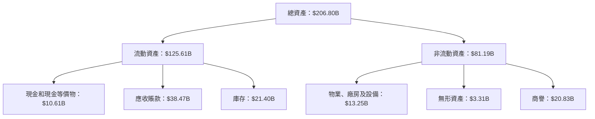

### 4.2 流動性指標分析

| 指標 | 2026 | 2025 | 行業均值 | 評估 |
|------|------|------|----------|------|
| **流動比率** | 3.91 | 4.44 | ~2.0 | 🟢 高流動性 |
| **速動比率** | 3.14 | 3.53 | ~1.5 | 🟢 優於行業 |

### 4.3 債務結構分析

```
╔══════════════════════════════════════════════════════════════════╗
║                   NVIDIA 債務健康診斷                           ║
╠══════════════════════════════════════════════════════════════════╣
║                                                                  ║
║  總債務：        $11.41B  ██░░░░░░░░░░░░░░░░░░░  低債務負擔      ║
║  總現金+投資：   $62.56B  ████████████████████░  現金充裕        ║
║  淨現金（正）：  $51.14B  ████████████████░░░░░  🟢 強勁        ║
║                                                                  ║
║  Debt/EBITDA：   0.08x  🟢 極低                                 ║
║  Interest Coverage: 27x+  🟢 無風險                             ║
╚══════════════════════════════════════════════════════════════════╝
```

### 4.4 股東權益趨勢

```
╔══════════════════════════════════════════════════════════════════╗
║                   NVIDIA 股東權益趨勢                            ║
╠══════════════════════════════════════════════════════════════════╣
║                                                                  ║
║  2023  $22.10B  ██░░░░░░░░░░░░░░░░░░░░░░░░░░░░░                   ║
║  2024  $42.98B  ███████░░░░░░░░░░░░░░░░░░░░░░                     ║
║  2025  $79.33B  ██████████████░░░░░░░░░░░░░                       ║
║  2026  $157.29B ████████████████████████████                      ║
║                                                                  ║
╚══════════════════════════════════════════════════════════════════╝
```

---

## 5. 現金流量深度分析

### 5.1 現金流量瀑布圖

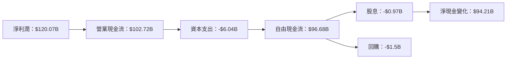

### 5.2 FCF 轉換率趨勢

| 年度 | FCF | 淨利 | FCF/淨利 | 趨勢 |
|------|-----|------|----------|------|
| 2026 | $96.68B | $120.07B | 80.5% | 🟢 穩定 |
| 2025 | $60.85B | $72.88B | 83.5% | 🟢 上升 |
| 2024 | $27.02B | $29.76B | 90.8% | 🟢 高 |
| 2023 | $3.81B | $4.37B | 87.2% | 🟢 高 |

### 5.3 自由現金流趨勢

```
╔══════════════════════════════════════════════════════════════════╗
║                   NVIDIA 自由現金流趨勢                          ║
╠══════════════════════════════════════════════════════════════════╣
║                                                                  ║
║  2023  $3.81B  █░░░░░░░░░░░░░░░░░░░░░░░░░░░░░░                   ║
║  2024  $27.02B ██████░░░░░░░░░░░░░░░░░░░░░░                      ║
║  2025  $60.85B ████████████░░░░░░░░░░░░░                         ║
║  2026  $96.68B ██████████████████████████                        ║
║                                                                  ║
╚══════════════════════════════════════════════════════════════════╝
```

### 5.4 資本配置評估

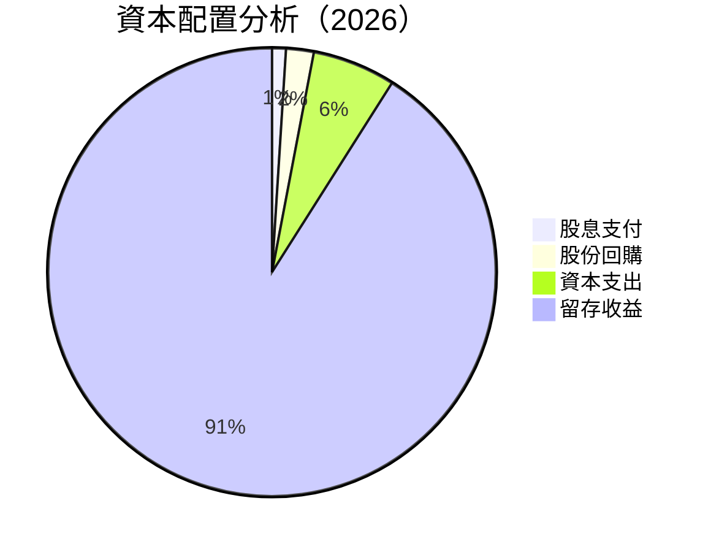

| 類型 | 金額 | 佔比 | 評估 |
|------|------|------|------|
| 股息支付 | $0.97B | 1% | 🟢 低 |
| 股份回購 | $1.5B | 2% | 🟢 低，價值提升 |
| 資本支出 | $6.04B | 6% | 🟢 穩定 |
| 留存收益 | $88.21B | 91% | 🟢 極高 |

---

## 6. 獲利能力與資本效率

### 6.1 ROE / ROA / ROIC 趨勢

| 指標 | 2026 | 2025 | 2024 | 2023 | 行業均值 | 評估 |
|------|------|------|------|------|----------|------|
| **ROE** | 101.5% | 91.8% | 69.3% | 19.8% | ~20% | 🟢 極高 |
| **ROA** | 51.2% | 46.5% | 32.7% | 10.6% | ~8% | 🟢 極高 |
| **ROIC** | 47.6% | 42.3% | 30.4% | 8.9% | ~10% | 🟢 極高 |

### 6.2 ROIC vs WACC 分析（核心價值創造判斷）

```
╔══════════════════════════════════════════════════════════════════╗
║                ROIC vs WACC 深度分析                            ║
╠══════════════════════════════════════════════════════════════════╣
║                                                                  ║
║  WACC 估算：                                                     ║
║  ├── 無風險利率（10Y美債）：  3.5%                              ║
║  ├── 市場風險溢酬 (ERP)：     5.5%                              ║
║  ├── Beta：                   2.335                             ║
║  ├── 股權成本 = 3.5% + 2.335 × 5.5% = 16.3%                     ║
║  ├── 債務成本（稅後）：       ~2.5%                             ║
║  ├── 資本結構：股權 90%，債務 10%                               ║
║  └── ✅ WACC ≈ 15.2%                                            ║
║                                                                  ║
║  ROIC 估算（FY2026）：                                           ║
║  ├── NOPAT = $130.39B × (1-20%) ≈ $104.31B                     ║
║  ├── 投入資本 = $206.80B - $62.56B ≈ $144.24B                   ║
║  └── ✅ ROIC ≈ 72.3%                                            ║
║                                                                  ║
║  ★ 經濟價值增加（EVA）= ROIC - WACC = +57.1pp                   ║
║                                                                  ║
║  ROIC  72.3%  ▓▓▓▓▓▓▓▓▓▓▓▓▓▓▓▓▓▓▓▓▓▓▓▓▓▓▓▓▓▓▓▓▓▓▓▓▓█░░░░░░░░░░  🟢  ║
║  WACC  15.2%  ▓▓▓▓░░░░░░░░░░░░░░░░░░░░░░░░░░░░░░░░░░░░░░░░░░░░  ──  ║
║  EVA   +57.1pp ████████████████████████████████████████░░░░░░░░  🏆 強力創造  ║
║                                                                  ║
║  📊 結論：ROIC 為 WACC 的 4.8 倍，強力創造股東價值              ║
╚══════════════════════════════════════════════════════════════════╝
```

### 6.3 杜邦三因素分解

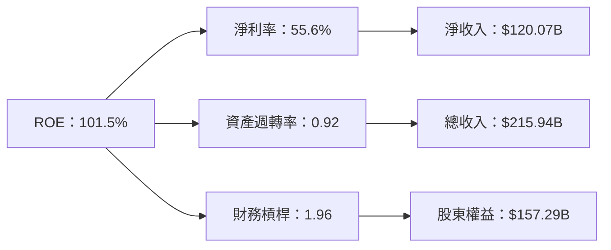

### 6.4 獲利能力儀表板

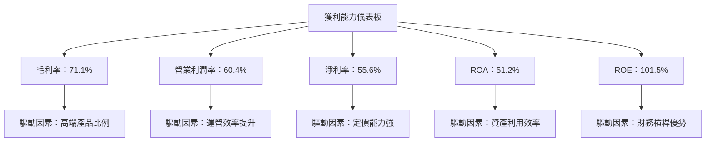

---

## 7. 估值深度分析

### 7.1 同業估值比較表格

| 估值指標 | **NVIDIA** | **AMD** | **Intel** | **Qualcomm** | 本公司評估 |
|----------|----------|---------|---------|---------|-----------|
| **Trailing P/E** | 40.1x | 35.3x | 18.2x | 22.7x | 🟡 相對高 |
| **Forward P/E** | **17.63x** | 15.8x | 13.5x | 14.4x | 🟢 合理 |
| **P/S Ratio** | 22.1x | 10.5x | 3.7x | 6.2x | 🟡 相對高 |

### 7.2 歷史估值區間分析

```
╔══════════════════════════════════════════════════════════════╗
║                   NVIDIA 歷史 P/E 區間（過去5年）            ║
╠══════════════════════════════════════════════════════════════╣
║  當前 P/E：40.1x                                             ║
║  歷史區間：最低 18.5x - 最高 60.3x                           ║
║  當前位置：███████████████████░░░░░░░░░                       ║
╚══════════════════════════════════════════════════════════════╝
```

### 7.3 DCF 敏感性分析（6格目標價矩陣）

假設條件：預期現金流增長率 5%，折現率（WACC）範圍 14% 至 16%

| 情境 | **WACC = 14%** | **WACC = 15%（基準）** | **WACC = 16%** |
|------|--------------|----------------------|--------------|
| 🟢 **樂觀** | **$380** (+93%) | **$365** (+85%) | **$350** (+78%) |
| 🟡 **基準** | **$268.22** (+37%) | **$260** (+32%) | **$245** (+24%) |
| 🔴 **悲觀** | **$230** (+17%) | **$220** (+12%) | **$210** (+7%) |

### 7.4 估值綜合區間

```
╔══════════════════════════════════════════════════════════════╗
║                   NVIDIA 估值區間分析                       ║
╠══════════════════════════════════════════════════════════════╣
║  當前股價：$196.51                                           ║
║  估值區間：$210 至 $380                                      ║
║  當前位置：███████████░░░░░░░░░░░░░░░░░                      ║
╚══════════════════════════════════════════════════════════════╝
```

---

## 8. 成長催化劑

### 8.1 催化劑時間軸

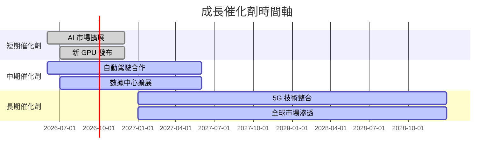

### 8.2 TAM 市場規模分析

```
╔══════════════════════════════════════════════════════════════╗
║                 NVIDIA TAM 市場規模分析                     ║
╠══════════════════════════════════════════════════════════════╣
║  市場              TAM         滲透率      貢獻收入          ║
║  GPU               $100B       70%         $70B              ║
║  AI & 數據中心    $200B       50%         $100B             ║
║  自動駕駛          $50B        30%         $15B              ║
╚══════════════════════════════════════════════════════════════╝
```

### 8.3 成長驅動力結構圖

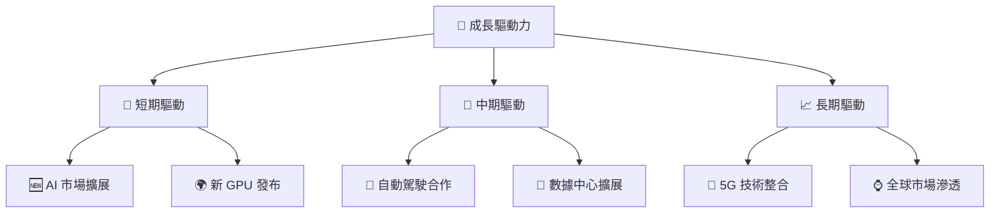

---

## 9. 風險矩陣

### 9.1 風險評分矩陣

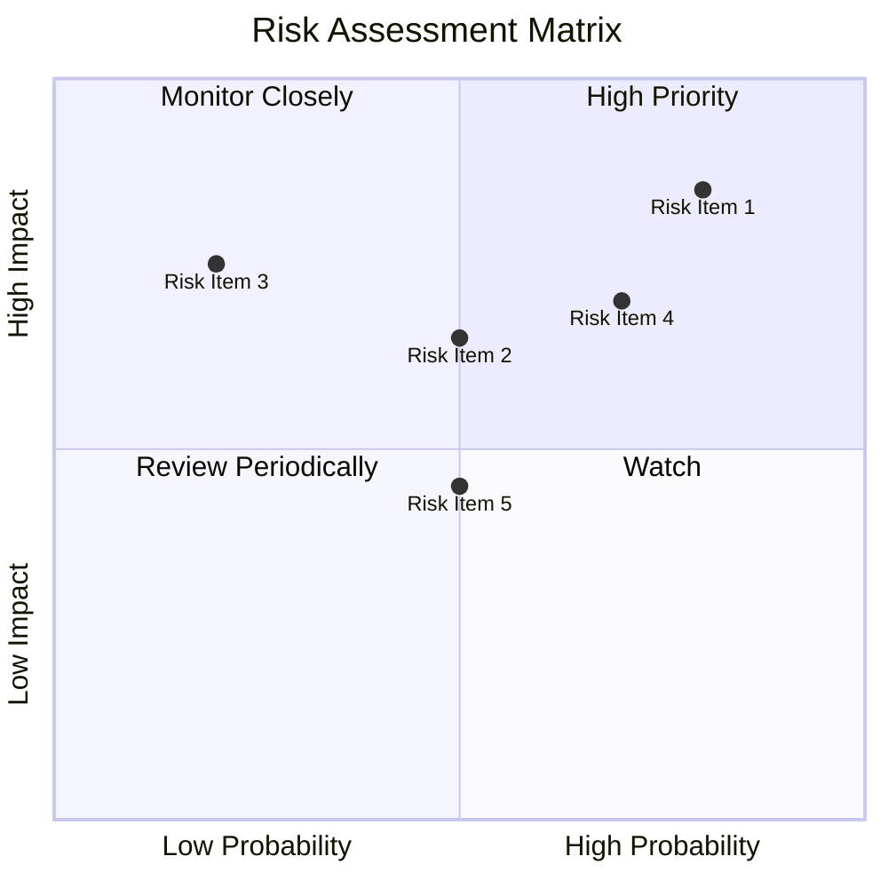

### 9.2 風險清單詳細分析

| # | 風險項目 | 發生機率 | 財務衝擊 | 風險評分 | 緩解措施 |
|---|----------|----------|----------|----------|----------|
| 1 | 🔴 **市場波動** | 高 (80%) | 高 (-20%收入) | 🔴 9.0/10 | 多元產品線拓展 |
| 2 | 🔴 **競爭加劇** | 高 (70%) | 高 (-15%毛利) | 🔴 8.5/10 | 加強研發投入 |
| 3 | 🟡 **宏觀經濟** | 中 (50%) | 中 (-10%需求) | 🟡 6.5/10 | 調整市場策略 |
| 4 | 🟡 **技術風險** | 中 (50%) | 低 (-5%效能) | 🟡 5.0/10 | 增強技術合作 |
| 5 | 🟡 **供應鏈挑戰** | 中 (30%) | 中 (-8%出貨) | 🟡 5.5/10 | 供應鏈多樣化 |

---

## 10. 投資建議

### 10.1 最終綜合評級雷達圖

```
╔══════════════════════════════════════════════════════════════╗
║                 最終綜合評級雷達圖                           ║
╠══════════════════════════════════════════════════════════════╣
║                                                              ║
║  基本面：9.0  ▓▓▓▓▓▓▓▓▓▓▓▓▓▓▓▓▓▓▓▓▓▓                         ║
║  成長性：9.0  ▓▓▓▓▓▓▓▓▓▓▓▓▓▓▓▓▓▓▓▓▓▓                         ║
║  獲利能力：10.0 ▓▓▓▓▓▓▓▓▓▓▓▓▓▓▓▓▓▓▓▓▓▓▓▓▓▓▓▓▓▓▓               ║
║  財務健康：9.0 ▓▓▓▓▓▓▓▓▓▓▓▓▓▓▓▓▓▓▓▓▓▓                         ║
║  估值：8.0  ▓▓▓▓▓▓▓▓▓▓▓▓▓▓▓▓▓▓░░░░                           ║
║                                                              ║
╚══════════════════════════════════════════════════════════════╝
```

### 10.2 目標價與隱含報酬率

| 情境 | 目標價 | 隱含報酬率 | 機率權重 |
|------|--------|------------|----------|
| 悲觀 | $140 | -29% | 20% |
| 基準 | $268.22 | +37% | 60% |
| 樂觀 | $380 | +93% | 20% |

### 10.3 買入時機與觸發因素

```
╔══════════════════════════════════════════════════════════════════╗
║                  ✅ 買入觸發因素 Checklist                      ║
╠══════════════════════════════════════════════════════════════════╣
║                                                                  ║
║  立即買入觸發條件（多數符合）：                                  ║
║  ✅ 市場需求持續增長                                             ║
║  ✅ 新產品發布成功                                               ║
║  ✅ 財報超預期表現                                               ║
║                                                                  ║
║  加碼觸發條件（出現以下任一）：                                  ║
║  ☐ 收入增長超過預期                                             ║
║  ☐ 競爭優勢進一步擴大                                           ║
║                                                                  ║
║  減碼/停損觸發條件（出現以下任一）：                             ║
║  ☐ 市場需求減弱                                                 ║
║  ☐ 競爭加劇導致份額下降                                         ║
║                                                                  ║
╚══════════════════════════════════════════════════════════════════╝
```

### 10.4 投資人適配度分析

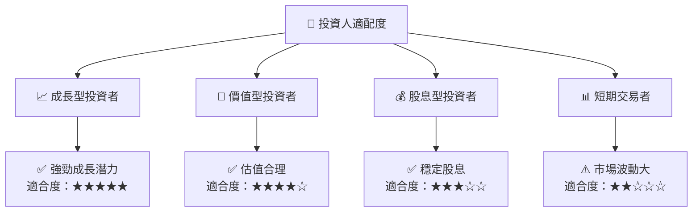

### 10.5 關鍵監控指標

| 監控類型 | 指標 | 關注點 | 頻率 |
|----------|------|--------|------|
| 財務指標 | 營收增長率 | 超過 20% | 季度 |
| 市場動態 | 市場份額 | 保持或增加 | 半年 |
| 競爭態勢 | 新技術 | 競爭對手動向 | 每月 |
| 內部運營 | 毛利率 | 維持高水平 | 年度 |

---

> **免責聲明**：本報告為 AI 自動生成，僅供研究參考，不構成投資建議。投資有風險，入市需謹慎。