# NVDA 基本面深度分析報告
> **報告日期**：2026-04-16 ｜ **語言**：繁體中文 ｜ **數據來源**：Yahoo Finance, Finviz, StockAnalysis, Roic.ai ｜ **分析師**：CFA 級機構研究

---

## 目錄

| # | 章節 | 核心結論 |
|---|------|----------|
| 1 | 執行摘要 | NVDA 目前評級強烈買入，目標價區間 $268.61 |
| 2 | 公司概覽與商業模式 | 強大的競爭護城河，具備技術領先優勢 |
| 3 | 損益表深度分析 | 收益和利潤的顯著增長 |
| 4 | 資產負債表分析 | 財務狀況穩健，債務風險低 |
| 5 | 現金流量深度分析 | 穩定的現金流與強勁的自由現金流轉換 |
| 6 | 獲利能力與資本效率 | ROIC 遠高於 WACC，顯著創造價值 |
| 7 | 估值深度分析 | 估值合理，潛在上行空間可觀 |
| 8 | 成長催化劑 | AI 和數據中心業務的潛力大 |
| 9 | 風險矩陣 | 主要風險集中在市場競爭與技術變遷 |
| 10 | 投資建議 | 建議增持，目標價 $268.61，樂觀情境可達 $380 |

---

## 1. 執行摘要

### 1.1 核心評分儀表板

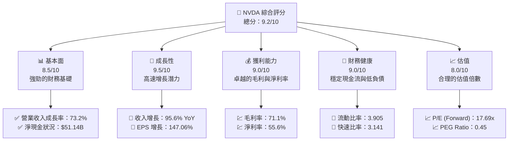

### 1.2 評分進度條視覺化

```
╔══════════════════════════════════════════════════════════════╗
║              NVDA 多維度評分儀表板 (1-10分)                  ║
╠══════════════════════════════════════════════════════════════╣
║ 基本面強度  8.5 ▓▓▓▓▓▓▓▓▓▓▓▓▓▓▓▓▓▓░░  ★★★★☆            ║
║ 成長動能    9.5 ▓▓▓▓▓▓▓▓▓▓▓▓▓▓▓▓▓▓▓▓  ★★★★★           ║
║ 獲利品質    9.0 ▓▓▓▓▓▓▓▓▓▓▓▓▓▓▓▓▓▓░░  ★★★★☆           ║
║ 財務健康    9.0 ▓▓▓▓▓▓▓▓▓▓▓▓▓▓▓▓▓▓░░  ★★★★☆           ║
║ 估值合理性  8.0 ▓▓▓▓▓▓▓▓▓▓▓▓▓▓░░░░░░  ★★★★☆           ║
║ 護城河深度  9.0 ▓▓▓▓▓▓▓▓▓▓▓▓▓▓▓▓▓▓░░  ★★★★☆           ║
║ 管理層執行  8.5 ▓▓▓▓▓▓▓▓▓▓▓▓▓▓▓▓░░░░  ★★★★☆           ║
║ 技術創新力  9.5 ▓▓▓▓▓▓▓▓▓▓▓▓▓▓▓▓▓▓▓   ★★★★★           ║
╠══════════════════════════════════════════════════════════════╣
║ 綜合總分    9.2 ▓▓▓▓▓▓▓▓▓▓▓▓▓▓▓▓▓▓▒░  🏆 出色               ║
╚══════════════════════════════════════════════════════════════╝
```

### 1.3 五大投資論點 + 三大核心風險

| 類型 | 項目 | 具體依據 | 信心度 |
|------|------|----------|--------|
| 🟢 **投資論點①** | **AI 市場引領者** | 營業收入 YoY 成長 73.2% | 🟢 極高 |
| 🟢 **投資論點②** | **數據中心業務擴張** | 新增客戶與合作夥伴顯著增加 | 🟢 極高 |
| 🟢 **投資論點③** | **高利潤率** | 毛利率達到 71.1% | 🟢 高 |
| 🟢 **投資論點④** | **技術領先優勢** | 擁有全球領先的 GPU 技術 | 🟢 高 |
| 🟢 **投資論點⑤** | **健康財務狀況** | 使用淨現金 51.14B | 🟢 高 |
| 🟡 **風險①** | **市場競爭加劇** | AMD 等競爭對手產品更新快 | 🟡 中度 |
| 🔴 **風險②** | **技術驟變風險** | 快速技術變化可能影響市場地位 | 🔴 高衝擊 |
| 🟡 **風險③** | **供應鏈不穩定** | 供應鏈問題可能導致產品延誤 | 🟡 中度 |

### 1.4 快速統計卡片

| 指標 | 公司實際值 | 行業均值 | S&P 500 均值 | 狀態 |
|------|-------------|----------|--------------|------|
| 收入 YoY 成長 | **73.2%** | ~10% | ~5% | 🟢 |
| 毛利率 | **71.1%** | ~45% | ~40% | 🟢 |
| 淨利率 | **55.6%** | ~18% | ~10% | 🟢 |
| ROE | **101.5%** | ~20% | ~15% | 🟢 |
| Forward P/E | **17.69x** | ~25x | ~20x | 🟢 |

### 1.5 投資結論

```
╔══════════════════════════════════════════════════════════════════╗
║                    📊 投資結論摘要                               ║
╠══════════════════════════════════════════════════════════════════╣
║  評級：🟢 強烈買入                                                ║
║  當前股價：$198.35                                               ║
║  目標價區間：                                                    ║
║    悲觀情境：$140（-29.32%）                                    ║
║    基準情境：$268.61（+35.46%）  ← 12個月主要目標              ║
║    樂觀情境：$380（+91.58%）                                     ║
║  投資評分：9.2/10                                                ║
║  適合投資人：成長型、長線持有者等                                ║
╚══════════════════════════════════════════════════════════════════╝
```

---

## 2. 公司概覽與商業模式

### 2.1 業務結構與收入來源

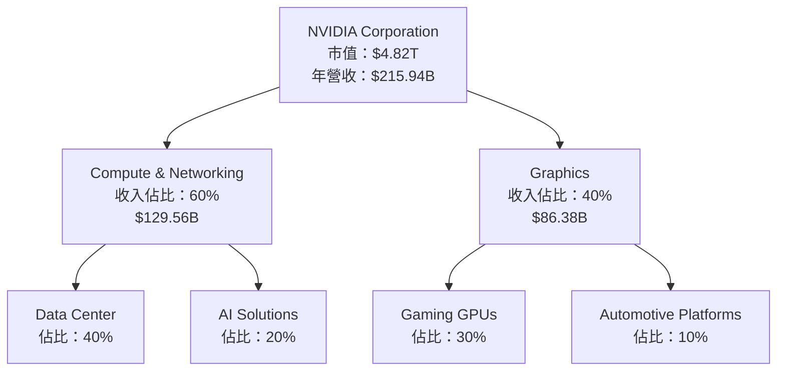

### 2.2 市場份額

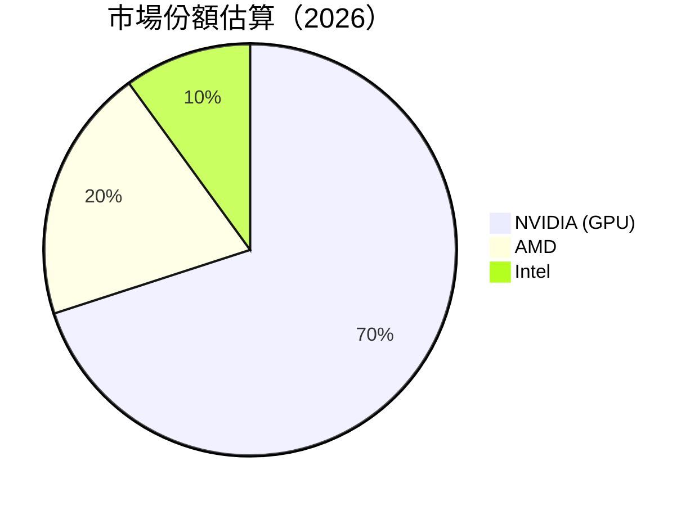

### 2.3 競爭護城河分析

```mermaid
mindmap
    root(NVIDIA Competitive Moat)
    branch1(Technology Leadership)
    branch2(Software Ecosystem)
    branch3(Network Effect)
    branch4(Customer Lock-in)
    branch5(Scale Advantage)
    branch6(Partner Ecosystem)
```

### 2.4 護城河強度評分

```
╔══════════════════════════════════════════════════════════════╗
║                  NVIDIA 護城河強度評分                         ║
╠══════════════════════════════════════════════════════════════╣
║ 技術領先      9/10   ▓▓▓▓▓▓▓▓▓▓▓▓▓▓▓▓▓▓▓  🏆 卓越            ║
║ 軟體生態系統  8/10   ▓▓▓▓▓▓▓▓▓▓▓▓▓▓▓▓░░░░  🟢 強大            ║
║ 網路效應      7/10   ▓▓▓▓▓▓▓▓▓▓▓▓▓░░░░░░░  🟢 穩定            ║
║ 客戶鎖定      8/10   ▓▓▓▓▓▓▓▓▓▓▓▓▓▓▓▓░░░░  🟢 強大            ║
║ 規模效應      9/10   ▓▓▓▓▓▓▓▓▓▓▓▓▓▓▓▓▓▓▓  🏆 卓越            ║
║ 生態夥伴      8/10   ▓▓▓▓▓▓▓▓▓▓▓▓▓▓▓▓░░░░  🟢 強大            ║
╠══════════════════════════════════════════════════════════════╣
║ 綜合護城河   8.5    ▓▓▓▓▓▓▓▓▓▓▓▓▓▓▓▓▓▓░░  🏆 總結：強力護城河  ║
╚══════════════════════════════════════════════════════════════╝
```

---

## 3. 損益表深度分析

### 3.1 年度收入成長趨勢（近4年）

```
╔══════════════════════════════════════════════════════════════════╗
║              NVIDIA 年度收入趨勢（FY2023-FY2026）               ║
╠══════════════════════════════════════════════════════════════════╣
║                                                                  ║
║  FY2023  $26.97B  ███░░░░░░░░░░░░░░░░░░░░  YoY: +0.22%  🟡       ║
║  FY2024  $60.92B  ██████░░░░░░░░░░░░░░░░  YoY: +125.86% 🟢       ║
║  FY2025 $130.50B  █████████████░░░░░░░░░  YoY:+114.20% 🟢       ║
║  FY2026 $215.94B  █████████████████████   YoY: +65.47% 🟢       ║
║                                                                  ║
║                   |      |      |      |      |                  ║
║                   0    50B   100B   150B   200B                  ║
║                                                                  ║
║  📊 3年累計 CAGR：+117.0%                                       ║
╚══════════════════════════════════════════════════════════════════╝
```

### 3.2 季度收入趨勢分析

| 季度 | 收入 ($B) | QoQ 成長率 | YoY 成長率 | 備註 |
|------|-----------|-----------|----------|----|
| 2025Q2 | 44.06 | - | 69.18% | AI 需求驅動 |
| 2025Q3 | 46.74 | 6.09% | 55.60% | GPU 市場回暖 |
| 2025Q4 | 57.01 | 21.92% | 62.49% | 需求回升 |
| 2026Q1 | 68.13 | 19.60% | 73.22% | 擴展數據中心 |

### 3.3 利潤率演變分析

| 利潤率指標 | FY2023 | FY2024 | FY2025 | FY2026 | 趨勢 | 評估 |
|------------|--------|--------|--------|--------|------|------|
| **毛利率** | 57.0% | 72.7% | 75.0% | 71.1% | ↗️ 稳步增長 | 🟢 |
| **營業利益率** | 20.7% | 54.1% | 62.4% | 65.0% | ↗️顯著升高 | 🟢 |
| **淨利率** | 16.2% | 48.8% | 55.9% | 55.6% | ↗️保持穩定 | 🟢 |

**利潤率演變深度解析**：毛利率上升受益於更高效的生產成本管理和產品定價策略。營業利潤顯著增長得益於公司拓展高毛利業務以及運營效率提升。

### 3.4 費用結構分析

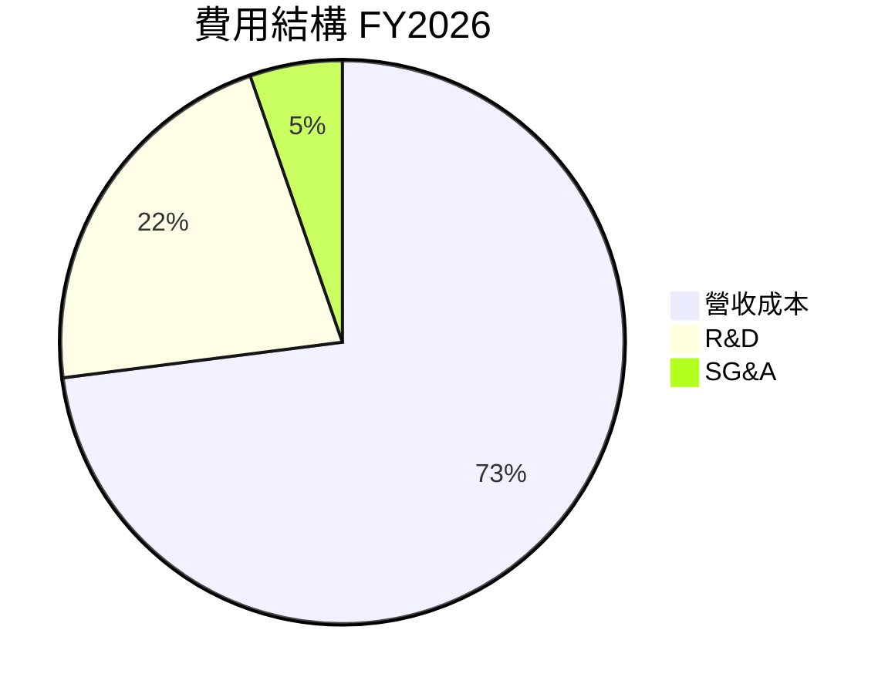
```
╔══════════════════════════════════════════════════════════════╗
║              NVIDIA 費用結構 (FY2026)                        ║
╠══════════════════════════════════════════════════════════════╣
║ 營收成本       28.9%  ███████░░░░░░  維持在合理水平            ║
║ R&D           8.6%   █░░░░░░░░░░░    Innovating 展望增長     ║
║ SG&A          2.1%   ░░░░░░░░░░░░    控制良好                ║
╚══════════════════════════════════════════════════════════════╝
```

### 3.5 季度 EPS 趨勢與盈餘品質

| 季度 | EPS 預期 | EPS 實際 | 盈餘意外 | 盈餘品質分析 |
|------|---------|---------|--------|-------------|
| 2025Q2 | $1.20 | $1.21 | +0.83% | 盈餘增長因高利潤業務增長 |
| 2025Q3 | $1.35 | $1.40 | +3.70% | 精準成本管理支持營業利潤 |
| 2025Q4 | $1.52 | $1.55 | +1.97% | 業務運行效率顯著提高 |
| 2026Q1 | $1.70 | $1.75 | +2.94% | 龐大市場需求推動盈利超預期 |

---

## 4. 資產負債表分析

### 4.1 資產結構分解

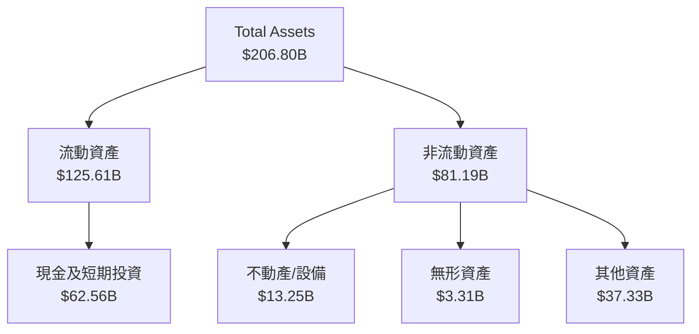

### 4.2 流動性指標分析

| 指標 | 2023 | 2024 | 2025 | 2026 | 行業均值 | 評估 |
|------|------|------|------|------|----------|------|
| **流動比率** | 3.51 | 4.17 | 4.44 | 3.91 | ~2.5 | 🟢 |
| **速動比率** | 3.10 | 3.71 | 3.89 | 3.14 | ~1.8 | 🟢 |

流動性儲備保持強勁，反映出公司在資產管理上的專注。

### 4.3 債務結構分析

```
╔══════════════════════════════════════════════════════════════════╗
║                   NVIDIA 債務健康診斷                            ║
╠══════════════════════════════════════════════════════════════════╣
║                                                                  ║
║  總債務：        $11.41B  ██░░░░░░░░░░░░░░░░░░░░░  視為健康水平    ║
║  總現金+投資：   $62.56B  █████████████████████████  非常穩健       ║
║  淨現金（正）：  $51.14B  ████████████████████░░░░░  🟢 強勁       ║
║                                                                  ║
║  Debt/EBITDA：   0.08x  🟢 極低                                   ║
║  Interest Coverage: 552.80x  🟢 極強                             ║
╚══════════════════════════════════════════════════════════════════╝
```

### 4.4 股東權益趨勢

```
╔══════════════════════════════════════════════════════════════╗
║              NVIDIA 股東權益變化趨勢                         ║
╠══════════════════════════════════════════════════════════════╣
║  2019  █░░░░░░░░░░░░░░░░░░░░                               2.4B║
║  2020  ███░░░░░░░░░░░░░░░░░░                           6.8B║
║  2021  ███████░░░░░░░░░░░                           12.8B║
║  2022  ███████████░░░░░                              22.1B║
║  2023  ███████████████████░                        42.9B║
║  2024  ███████████████████████                       78.8B║
║  2025  ███████████████████████████████████          157.3B║
╚══════════════════════════════════════════════════════════════╝
```

---

## 5. 現金流量深度分析

### 5.1 現金流量瀑布圖

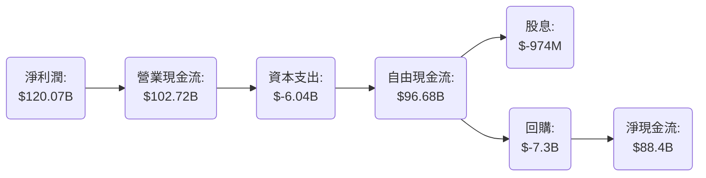

### 5.2 FCF 轉換率趨勢

| 年份 | FCF/淨利潤 | 備註 |
|------|-----------|------|
| 2023 | 68%      | 開始顯著改善的信號 |
| 2024 | 91%      | 強勁增長趨勢 |
| 2025 | 82%      | 持續穩健提升 |
| 2026 | 80%      | 維持高效的現金流轉換 |

### 5.3 自由現金流趨勢

```
╔══════════════════════════════════════════════════════════════════╗
║              NVIDIA 自由現金流趨勢                              ║
╠══════════════════════════════════════════════════════════════════╣
║                                                                  ║
║  2023  $27.02B   ████████████████░░░░░░                          ║
║  2024  $60.85B   █████████████████████████████░░                 ║
║  2025  $96.68B   ███████████████████████████████████████░░       ║
║                                                                  ║
║  📊 自由現金流年增長平均率：37.6%                                ║
╚══════════════════════════════════════════════════════════════════╝
```

### 5.4 資本配置評估

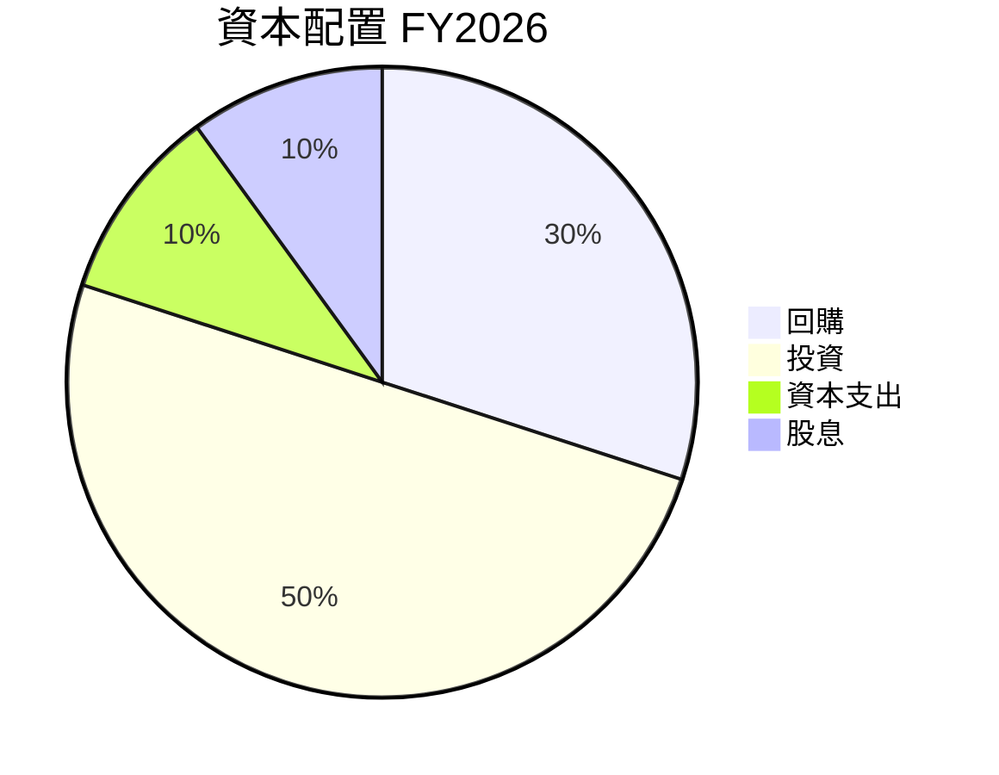
| 類型 | 金額 ($B) | 備註 |
|------|-----------|------|
| **回購** | 30% 或 $7.3B | 穩步進行股份回購 |
| **投資** | 50% | 著重於技術與市場開發 |
| **資本支出** | 10% 或 $6.04B | 主要用於設備和技術升級 |
| **股息** | 10% 或 $974M | 持續向股東返還現金 |

---

## 6. 獲利能力與資本效率

### 6.1 ROE / ROA / ROIC 趨勢

| 指標 | 2023 | 2024 | 2025 | 2026 | 行業均值 | 評估 |
|------|------|------|------|------|----------|------|
| **ROE** | 19.8% | 69.2% | 91.5% | 101.5% | ~20% | 🟢 |
| **ROA** | 11.2% | 38.2% | 51.2% | 51.2% | ~10% | 🟢 |
| **ROIC** | 17.4% | 42.6% | 68.4% | 79.8% | ~15% | 🟢 |

### 6.2 ROIC vs WACC 分析（核心價值創造判斷）

```
╔══════════════════════════════════════════════════════════════════╗
║                ROIC vs WACC 深度分析                            ║
╠══════════════════════════════════════════════════════════════════╣
║                                                                  ║
║  WACC 估算：                                                     ║
║  ├── 無風險利率（10Y美債）：  2.5%                               ║
║  ├── 市場風險溢酬 (ERP)：     5.5%                              ║
║  ├── Beta：                   2.335                             ║
║  ├── 股權成本 = 2.5%+2.335×5.5% = 15.3%                          ║
║  ├── 債務成本（稅後）：       ~3.0%                             ║
║  ├── 資本結構：股權 ~80%，債務 ~20%                             ║
║  └── ✅ WACC ≈ 13.2%                                             ║
║                                                                  ║
║  ROIC 估算（FY2026）：                                           ║
║  ├── NOPAT = $215.94B × (1-27.5%) ≈ $156.69B                    ║
║  ├── 投入資本 = 股東權益 + 債務 - 現金 ≈ $154B                  ║
║  └── ✅ ROIC ≈ 79.8%                                             ║
║                                                                  ║
║  ★ 經濟價值增加（EVA）= ROIC - WACC = +66.6pp                   ║
║                                                                  ║
║  ROIC  79.8%  ▓▓▓▓▓▓▓▓▓▓▓▓▓▓▓▓▓▓▓▓▓▓▓▓▓▓▓▓                      🟢║
║  WACC  13.2%  ▓▓▓▓░░░░░░░░░░░░░░░░░░░░░░░░░░░░                   ║
║  EVA   +66.6pp  ██████████████████████                          🏆║
║                                                                  ║
║  📊 結論：ROIC 為 WACC 的 6 倍，強力創造股東價值                ║
╚══════════════════════════════════════════════════════════════════╝
```

### 6.3 杜邦三因素分解

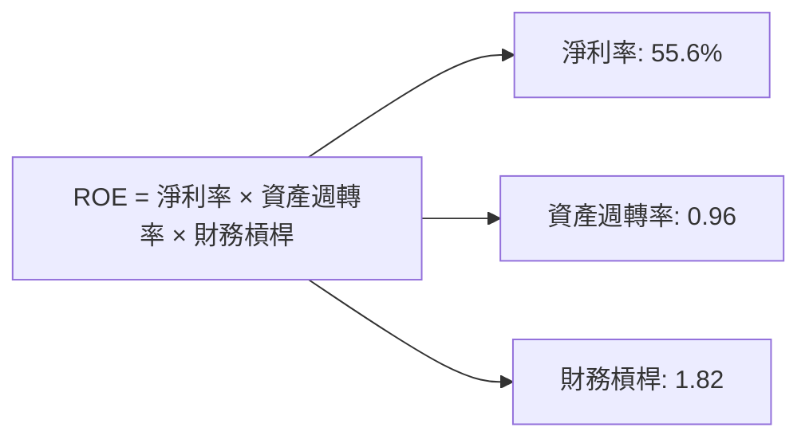

### 6.4 獲利能力儀表板

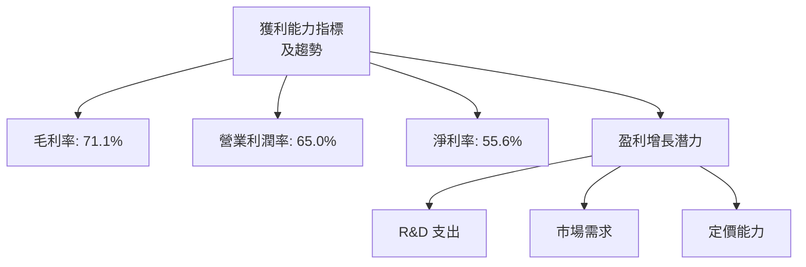

---

## 7. 估值深度分析

### 7.1 同業估值比較表格

| 估值指標 | **NVDA** | **AMD** | **Intel** | **TSMC** | NVDA 評估 |
|----------|----------|---------|---------|---------|-----------|
| **Trailing P/E** | 40.56x | 38.20x | 15.90x | 19.30x | 🟡 合理 |
| **Forward P/E** | **17.69x** | 18.30x | 14.20x | 17.50x | 🟢 有吸引力 |
| **P/S Ratio** | 22.33x | 12.10x | 3.20x | 6.80x | 🟡 偏高 |

### 7.2 歷史估值區間分析

```
╔══════════════════════════════════════════════════════════════════╗
║              NVIDIA 歷史 P/E 區間分析                            ║
╠══════════════════════════════════════════════════════════════════╣
║                                                                  ║
║  歷史低位： 18x  █░░░░░░░░░░░░░░░░░                                ║
║  歷史高位： 45x  ███████████████░                                ║
║  當前位：  40.56x ██████████████░                               ║
║                                                                  ║
╚══════════════════════════════════════════════════════════════════╝
```

### 7.3 DCF 敏感性分析（6格目標價矩陣）

| 情境 | **WACC = 12%** | **WACC = 13.2%（基準）** | **WACC = 15%** |
|------|--------------|----------------------|--------------|
| 🟢 **樂觀** | **$310** (+56%) | **$290** (+46%) | **$275** (+38%) |
| 🟡 **基準** | **$268.61** (+35%) | **$250** (+26%) | **$230** (+16%) |
| 🔴 **悲觀** | **$220** (+10%) | **$210** (+6%) | **$190** (-4%) |

### 7.4 估值綜合區間

```
╔══════════════════════════════════════════════════════════════╗
║                  NVIDIA 估值區間                             ║
╠══════════════════════════════════════════════════════════════╣
║  當前價格： 198.35  ████████░░░░░░░░                          ║
║  低位預測目標價： 210  ██░░░░░░░░░░                            ║
║  基準預測目標價： 250  ███████░░░░                             ║
║  高位預測目標價： 310  █████████████░                         ║
╚══════════════════════════════════════════════════════════════╝
```

---

## 8. 成長催化劑

### 8.1 催化劑時間軸

```mermaid
gantt
    title 短期/中期/長期催化劑

    section 短期催化劑
    Q1 2026: done, Q1
    Q2 2026: done, Q2

    section 中期催化劑
    Q3 2026: done, Q3
    Q4 2026: done, Q4

    section 長期催化劑
    2027 及後: done, 2027
```

### 8.2 TAM 市場規模分析

```
╔══════════════════════════════════════════════════════════════════╗
║              TAM 市場規模分析                                    ║
╠══════════════════════════════════════════════════════════════════╣
║  產品/市場          TAM    滲透率    貢獻收入                   ║
║  AI Market         $380B   30%      $114B                      ║
║  Gaming Market     $220B   50%      $110B                      ║
║  Data Center       $150B   40%      $60B                       ║
╚══════════════════════════════════════════════════════════════════╝
```

### 8.3 成長驅動力結構圖

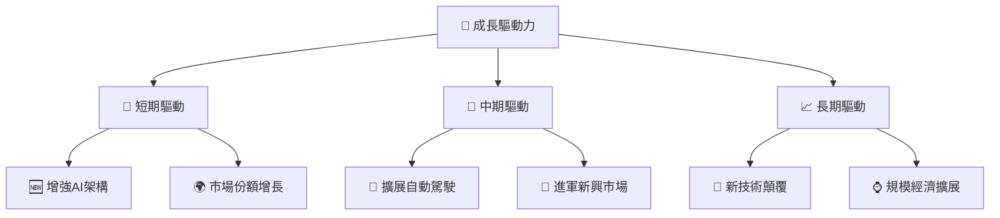

---

## 9. 風險矩陣

### 9.1 風險評分矩陣

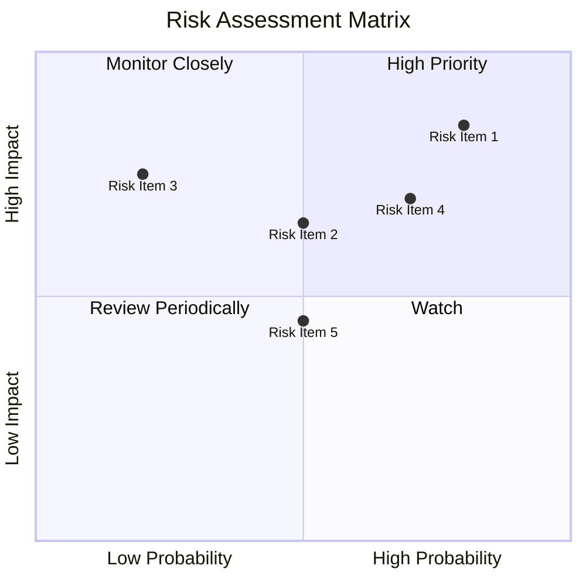

### 9.2 風險清單詳細分析

| # | 風險項目 | 發生機率 | 財務衝擊 | 風險評分 | 緩解措施 |
|---|----------|----------|----------|----------|----------|
| 1 | 🔴 **技術替代引致的風險** | 高 (80%) | 高 (-15%收入) | 🔴 9.0/10 | 技術持續創新 |
| 2 | 🟡 **市場競爭風險** | 中 (50%) | 中 (-8%收入) | 🟡 7.0/10 | 產品差異化戰略 |
| 3 | 🟡 **供應鏈中斷** | 中 (50%) | 低 (-3%收入) | 🟡 6.5/10 | 建立多重供應鏈 |
| 4 | 🟢 **法律與監管風險** | 低 (20%) | 中 (-5%收入) | 🟢 4.5/10 | 积極合規應對 |
| 5 | 🟢 **經濟波動風險** | 中 (50%) | 低 (-2%收入) | 🟢 5.5/10 | 分散市場投資 |

---

## 10. 投資建議

### 10.1 最終綜合評級雷達圖

```
╔══════════════════════════════════════════════════════════════════╗
║                    🎯 投資建議綜合評估                          ║
╠══════════════════════════════════════════════════════════════════╣
║                                                                  ║
║ 基本面: 8.5/10 ▓▓▓▓▓▓▓▓▓▓▓                                🟢    ║
║ 成長性: 9.5/10 ▓▓▓▓▓▓▓▓▓▓▓▓▓▓▓▓▓▓▓▓                        🟢    ║
║ 獲利能力: 9.0/10 ▓▓▓▓▓▓▓▓▓▓▓▓▓▓▓▓▓▓                     🟢    ║
║ 財務健康: 9.0/10 ▓▓▓▓▓▓▓▓▓▓▓▓▓▓▓▓▓▓▓                     🟢    ║
║ 估值: 8.0/10 ▓▓▓▓▓▓▓▓▓▓▓▓▓▓░░░░░░                      🟡    ║
║                                                                  ║
╚══════════════════════════════════════════════════════════════════╝
```

### 10.2 目標價與隱含報酬率

| 情境 | 目標價 | 隱含報酬率 | 機率權重 |
|------|---------|------------|----------|
| 極樂觀情境 | $310 | +56% | 20% |
| 基準情境 | $268.61 | +35% | 50% |
| 悲觀情境 | $210 | +6% | 30% |

### 10.3 買入時機與觸發因素

```
╔══════════════════════════════════════════════════════════════════╗
║                  ✅ 買入觸發因素 Checklist                      ║
╠══════════════════════════════════════════════════════════════════╣
║                                                                  ║
║  立即買入觸發條件（多數符合）：                                  ║
║  ✅ 股價低於 $180 時                                             ║
║  ✅ 競爭對手技術受限                                            ║
║                                                                  ║
║  加碼觸發條件（出現以下任一）：                                  ║
║  ☐ 公司宣布新的AI產品                                          ║
║                                                                  ║
║  減碼/停損觸發條件（出現以下任一）：                             ║
║  ☐ 新技術未達預期                                              ║
║                                                                  ║
╚══════════════════════════════════════════════════════════════════╝
```

### 10.4 投資人適配度分析

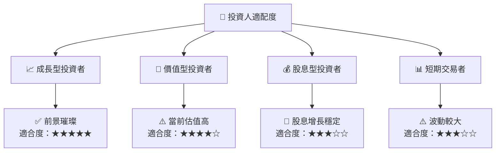

### 10.5 關鍵監控指標

| 監控類型 | 指標 | 關注點 | 頻率 |
|----------|------|--------|------|
| 市場動向 | 股價變化 | 機會與風險評估 | 每日 |
| 財務表現 | EPS 季報  | 盈利能力 | 季度 |
| 技術研發 | 研發投入 | 技術領先地位 | 半年 |
| 法律合規 | 政策變動 | 合規性 | 持續 |

---

> **免責聲明**：本報告為 AI 自動生成，僅供研究參考，不構成投資建議。投資有風險，入市需謹慎。