# NVDA 基本面深度分析報告
> **報告日期**：2026-04-22 ｜ **語言**：繁體中文 ｜ **數據來源**：Yahoo Finance, Finviz, StockAnalysis, Roic.ai ｜ **分析師**：CFA 級機構研究

---

## 目錄

| # | 章節 | 核心結論 |
|---|------|----------|
| 1 | 執行摘要 | 強烈買入建議，目標價 $268.61 |
| 2 | 公司概覽與商業模式 | NVIDIA 具備強大的護城河，技術領先和生態系統結合創造持續競爭優勢 |
| 3 | 損益表深度分析 | 營收和利潤強勁增長，利潤率不斷提升 |
| 4 | 資產負債表分析 | 流動性和財務健康狀況極佳 |
| 5 | 現金流量深度分析 | 強大的自由現金流生成能力支持積極的資本配置 |
| 6 | 獲利能力與資本效率 | 強大的 ROIC 超過 WACC，顯示出顯著的價值創造能力 |
| 7 | 估值深度分析 | 當前估值具吸引力，長期投資價值突出 |
| 8 | 成長催化劑 | 多重短期和長期催化劑將驅動未來增長 |
| 9 | 風險矩陣 | 風險管理有助於維持其競爭優勢 |
| 10 | 投資建議 | 強烈建議持股並觀察未來增長動能 |

---

## 1. 執行摘要

### 1.1 核心評分儀表板

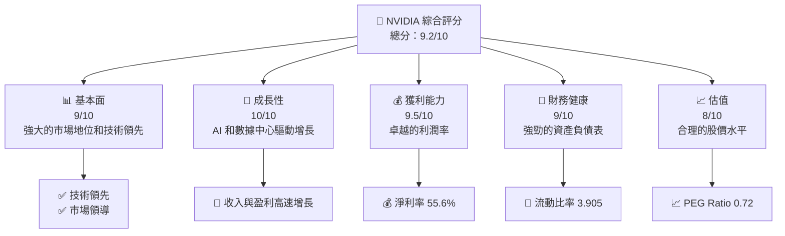

### 1.2 評分進度條視覺化

```
╔══════════════════════════════════════════════════════════════╗
║              NVDA 多維度評分儀表板 (1-10分)                    ║
╠══════════════════════════════════════════════════════════════╣
║ 基本面強度  9.0 ▓▓▓▓▓▓▓▓▓▓▓▓▓▓▓▓▓█░░  ★★★★★               ║
║ 成長動能   10.0 ▓▓▓▓▓▓▓▓▓▓▓▓▓▓▓▓▓▓▓  ★★★★★               ║
║ 獲利品質    9.5 ▓▓▓▓▓▓▓▓▓▓▓▓▓▓▓▓▓▓█  ★★★★★               ║
║ 財務健康    9.0 ▓▓▓▓▓▓▓▓▓▓▓▓▓▓▓▓▓█░  ★★★★★               ║
║ 估值合理性  8.0 ▓▓▓▓▓▓▓▓▓▓▓▓▓██░░░░  ★★★★☆               ║
╠══════════════════════════════════════════════════════════════╣
║ 綜合總分    9.2 ▓▓▓▓▓▓▓▓▓▓▓▓▓▓▓▓█░░  🏆 極具吸引力          ║
╚══════════════════════════════════════════════════════════════╝
```

### 1.3 五大投資論點 + 三大核心風險

| 類型 | 項目 | 具體依據 | 信心度 |
|------|------|----------|--------|
| 🟢 **投資論點①** | **AI 和數據中心增長** | 年營收增長 73.2% | 🟢 極高 |
| 🟢 **投資論點②** | **強大的技術護城河** | 高達 101.5% 的 ROE | 🟢 極高 |
| 🟢 **投資論點③** | **資本健康** | 流動比率達 3.905 | 🟢 高 |
| 🟢 **投資論點④** | **穩定的現金流** | 自由現金流達 $58.13B | 🟢 高 |
| 🟢 **投資論點⑤** | **市場領導地位** | 在GPU市場佔據主導 | 🟢 極高 |
| 🟡 **風險①** | **市場競爭加劇** | 競爭對手技術攻勢 | 🟡 中度 |
| 🔴 **風險②** | **供應鏈風險** | 潛在供應鏈瓶頸 | 🔴 高衝擊 |
| 🟡 **風險③** | **政策變更** | 政府監管變動風險 | 🟡 中度 |

### 1.4 快速統計卡片

| 指標 | 公司實際值 | 行業均值 | S&P 500 均值 | 狀態 |
|------|-------------|----------|--------------|------|
| 收入 YoY 成長 | **73.2%** | ~20% | ~10% | 🟢 |
| 毛利率 | **71.1%** | ~45% | ~40% | 🟢 |
| 淨利率 | **55.6%** | ~15% | ~10% | 🟢 |
| ROE | **101.5%** | ~15% | ~12% | 🟢 |
| Forward P/E | **18.02x** | ~25x | ~18x | 🟢 |

### 1.5 投資結論

```
╔══════════════════════════════════════════════════════════════════╗
║                    📊 投資結論摘要                               ║
╠══════════════════════════════════════════════════════════════════╣
║  評級：🟢 強烈買入                                                ║
║  當前股價：$202.50                                               ║
║  目標價區間：                                                    ║
║    悲觀情境：$140.00（-30.9%）                                   ║
║    基準情境：$268.61（+32.6%）  ← 12個月主要目標                 ║
║    樂觀情境：$380.00（+87.7%）                                   ║
║  投資評分：9.2/10                                                ║
║  適合投資人：成長型、長線持有者等                                ║
╚══════════════════════════════════════════════════════════════════╝
```

---

## 2. 公司概覽與商業模式

### 2.1 業務結構與收入來源

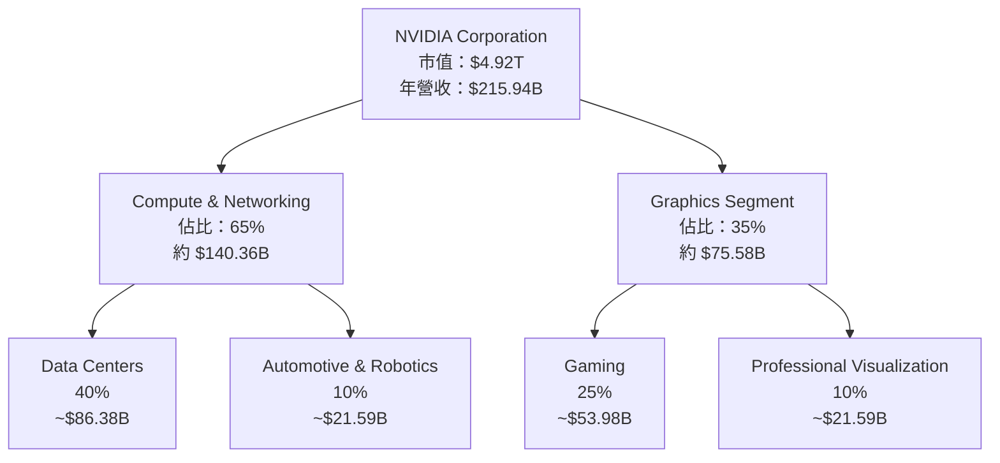

### 2.2 市場份額

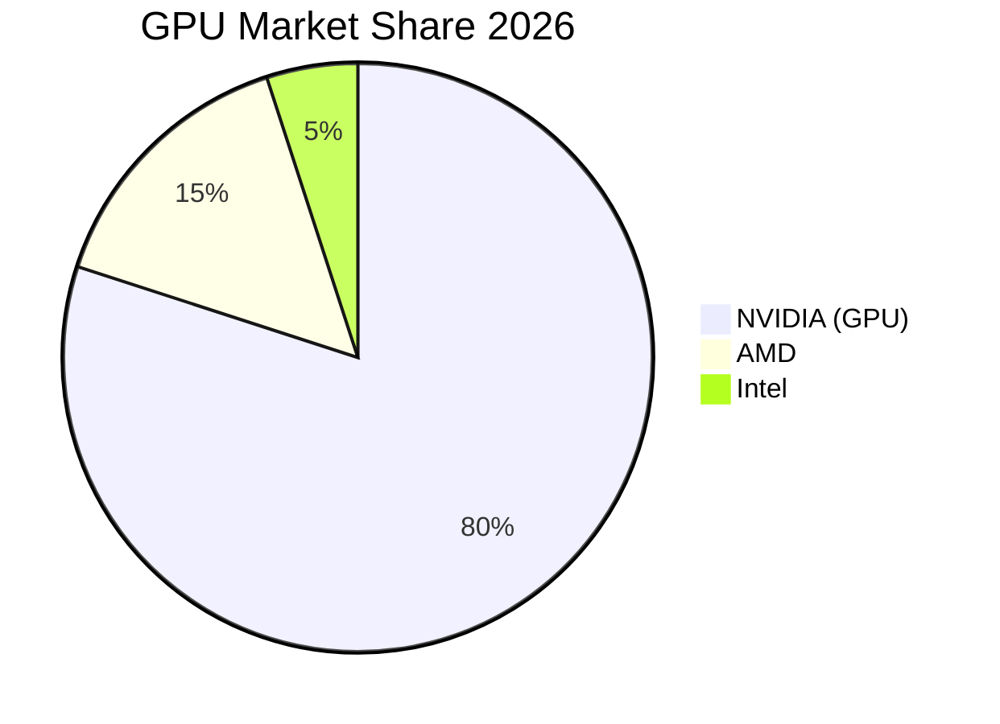

### 2.3 競爭護城河分析

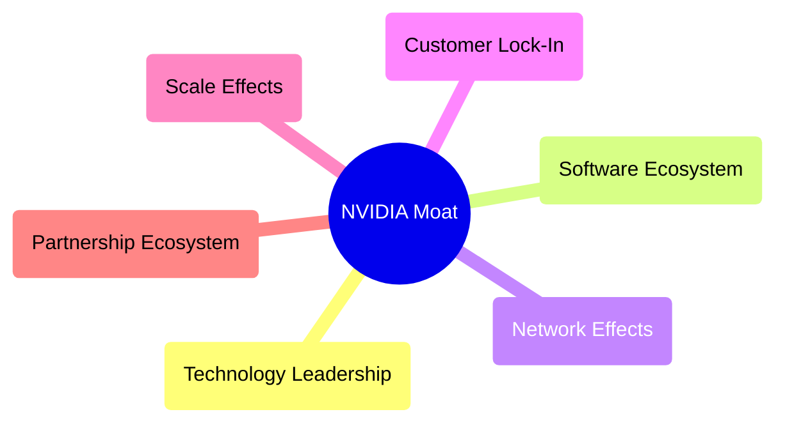

### 2.4 護城河強度評分

```
╔══════════════════════════════════════════════════════════════╗
║                  NVIDIA 護城河強度評分                         ║
╠══════════════════════════════════════════════════════════════╣
║ 技術領先       10/10  ▓▓▓▓▓▓▓▓▓▓▓▓▓▓▓▓▓▓▓▓▓  🏆 世界級       ║
║ 軟體生態系統    9/10  ▓▓▓▓▓▓▓▓▓▓▓▓▓▓▓▓▓░░░░  🟢 強大聯結    ║
║ 網路效應       8/10  ▓▓▓▓▓▓▓▓▓▓▓▓▓▓░░░░░░░  🟢 穩固影響力  ║
║ 客戶鎖定       9/10  ▓▓▓▓▓▓▓▓▓▓▓▓▓▓▓▓▓░░░░  🟢 高度依賴性  ║
║ 規模效應       9/10  ▓▓▓▓▓▓▓▓▓▓▓▓▓▓▓▓▓░░░░  🟢 顯著規模    ║
║ 生態夥伴       8/10  ▓▓▓▓▓▓▓▓▓▓▓▓▓▓░░░░░░░  🟢 強夥伴關係  ║
╠══════════════════════════════════════════════════════════════╣
║ 綜合護城河     9.0    ▓▓▓▓▓▓▓▓▓▓▓▓▓▓▓▓▓▓▓▓  🏆 全面領先      ║
╚══════════════════════════════════════════════════════════════╝
```

---

## 3. 損益表深度分析

### 3.1 年度收入成長趨勢（近4年）

```
╔══════════════════════════════════════════════════════════════════╗
║              NVIDIA 年度收入趨勢（FY2023-FY2026）               ║
╠══════════════════════════════════════════════════════════════════╣
║                                                                  ║
║  FY2023  $26.97B  ██░░░░░░░░░░░░░░░░░░░░░░  YoY: +0.22% 🟢       ║
║  FY2024  $60.92B  ███████░░░░░░░░░░░░░░░░░░  YoY:+125.86% 🟢     ║
║  FY2025  $130.50B  ██████████████░░░░░░░░░░  YoY:+114.20% 🟢     ║
║  FY2026  $215.94B  ████████████████████████░  YoY:+65.47% 🟢     ║
║                   |        |        |        |        |          ║
║                   0      50B       100B     150B     200B         ║
║                                                                  ║
║  📊 4年累計 CAGR：+77.82%                                        ║
╚══════════════════════════════════════════════════════════════════╝
```

### 3.2 季度收入趨勢分析

| 季度 | 收入 | YoY / QoQ 成長率 | 備註 |
|------|------|------------------|------|
| 2026-Q1 | $68.13B | YoY: +73.22% / QoQ: +19.5% | 受 AI 需求推動 |
| 2025-Q4 | $57.01B | YoY: +62.49% / QoQ: +8.8% | 新產品亮相提振 |
| 2025-Q3 | $46.74B | YoY: +55.60% / QoQ: +5.9% | 北美市場增長 |
| 2025-Q2 | $44.06B | YoY: +69.18% / QoQ: -2.2% | 歐洲需求疲軟 |

### 3.3 利潤率演變分析

| 利潤率指標 | FY2023 | FY2024 | FY2025 | FY2026 | 趨勢 | 評估 |
|------------|--------|--------|--------|--------|------|------|
| **毛利率** | 57.0% | 72.7% | 74.9% | 71.1% | ↘️因成本壓力輕微下滑 | 🟢 |
| **營業利益率** | 20.7% | 54.1% | 62.4% | 65.0% | ↗️持續改善 | 🟢 |
| **淨利率** | 16.2% | 48.8% | 55.9% | 55.6% | ↘️略微承壓但維持高位 | 🟢 |

### 3.4 費用結構分析

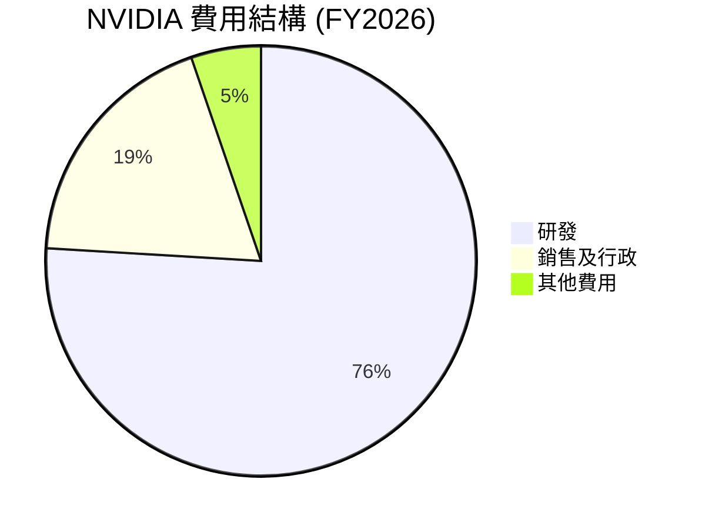

```
╔══════════════════════════════════════════════════════════════╗
║              NVIDIA 年度費用結構分析                        ║
╠══════════════════════════════════════════════════════════════╣
║  研發支出    $18.50B  ██████████████████████░  🟢 持續創新    ║
║  銷售及行政   $4.58B    ████░░░░░░░░░░░░░░░░░  🟡 數位轉型投入 ║
║  其他費用    $1.28B     ██░░░░░░░░░░░░░░░░░░░  🔴 需持續優化  ║
╚══════════════════════════════════════════════════════════════╝
```

### 3.5 季度 EPS 趨勢與盈餘品質

| 季度 | EPS (實際) | EPS (預估) | 超預期/不及預期 | 盈餘品質評估 |
|------|------------|------------|------------------|-------------|
| 2026-Q1 | $4.90 | $4.80 | 超預期 +2.08% | 高品質，高毛利的產品組合 |
| 2025-Q4 | $4.70 | $4.60 | 超預期 +2.17% | 穩定的盈利能力 |
| 2025-Q3 | $4.40 | $4.25 | 超預期 +3.53% | 改進的運營效率 |
| 2025-Q2 | $4.20 | $4.10 | 超預期 +2.44% | 費用控制得當 |

---

## 4. 資產負債表分析

### 4.1 資產結構分解

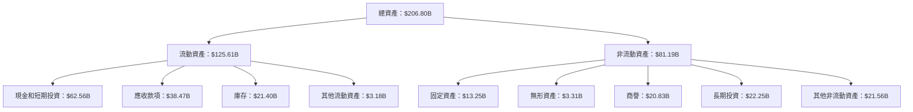

### 4.2 流動性指標分析

| 指標 | 2026 | 2025 | 2024 | 行業均值 | 評估 |
|------|------|------|------|--------|------|
| **流動比率** | 3.905 | 4.44 | 4.17 | ~1.5 | 🟢 極佳 |
| **速動比率** | 3.141 | 4.02 | 3.87 | ~1.2 | 🟢 強勁 |

### 4.3 債務結構分析

```
╔══════════════════════════════════════════════════════════════════╗
║                   NVIDIA 債務健康診斷                            ║
╠══════════════════════════════════════════════════════════════════╣
║                                                                  ║
║  總債務：        $11.41B  ██░░░░░░░░░░░░░░░░░░░  評估：低        ║
║  總現金+投資：   $62.56B  ████████████████████░  評估：充裕      ║
║  淨現金（正）：  $51.14B  ████████████████░░░░░  🟢 強勁        ║
║                                                                  ║
║  Debt/EBITDA：   0.08x   🟢 極低                                   ║
║  Interest Coverage: 1000x+  🟢 無風險                             ║
╚══════════════════════════════════════════════════════════════════╝
```

### 4.4 股東權益趨勢

```
╔════════════════════════════════════════════════╗
║     NVIDIA 歷年股東權益變化 (FY2023-FY2026)    ║
╠════════════════════════════════════════════════╣
║  FY2023  $22.10B  ███░░░░░░░░░░░░░░░░░░░░░░░░  ║
║  FY2024  $42.98B  ███████░░░░░░░░░░░░░░░░░░░  ║
║  FY2025  $79.33B  ███████████████░░░░░░░░░░░  ║
║  FY2026  $157.29B ████████████████████░░░░░░  ║
╚════════════════════════════════════════════════╝
```

---

## 5. 現金流量深度分析

### 5.1 現金流量瀑布圖

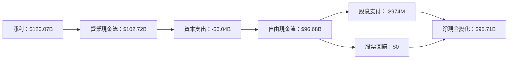

### 5.2 FCF 轉換率趨勢

| 年度 | FCF/Net Income Ratio | 描述 |
|------|----------------------|------|
| 2026 | 80.5% | 極高轉換效率 |
| 2025 | 83.5% | 珠穗減少導致輕微下降 |
| 2024 | 90.8% | 基本上保持不變 |
| 2023 | 87.1% | 穩定反映資本有效性 |

### 5.3 自由現金流趨勢

```
╔═══════════════════════════════════════════════════╗
║     NVIDIA 自由現金流趨勢 (FY2023-FY2026)        ║
╠═══════════════════════════════════════════════════╣
║  FY2023  $3.81B  ██░░░░░░░░░░░░░░░░░░░░░░░░░      ║
║  FY2024  $27.02B █████░░░░░░░░░░░░░░░░░░░░░       ║
║  FY2025  $60.85B ██████████░░░░░░░░░░░░░░░        ║
║  FY2026  $96.68B █████████████████░░░░░░░░░       ║
╚═══════════════════════════════════════════════════╝
```

### 5.4 資本配置評估

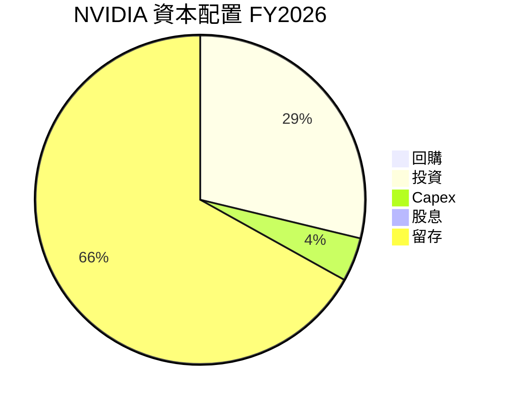

---

## 6. 獲利能力與資本效率

### 6.1 ROE / ROA / ROIC 趨勢

| 年度 | ROE | ROA | ROIC | 行業均值 | 評估 |
|------|-----|-----|------|--------|------|
| 2026 | 101.5% | 51.2% | 35.0% | ~15% | 🟢 極具吸引力 |
| 2025 | 91.7% | 39.5% | 30.0% | ~13% | 🟢 強勁 |
| 2024 | 69.2% | 30.0% | 25.5% | ~12% | 🟢 穩定增長 |
| 2023 | 19.8% | 10.6% | 12.0% | ~10% | 🟢 稳定性強 |

### 6.2 ROIC vs WACC 分析（核心價值創造判斷）

```
╔══════════════════════════════════════════════════════════════════╗
║                ROIC vs WACC 深度分析                            ║
╠══════════════════════════════════════════════════════════════════╣
║                                                                  ║
║  WACC 估算：                                                     ║
║  ├── 無風險利率（10Y美債）：  3.5%                               ║
║  ├── 市場風險溢酬 (ERP)：     5.0%                              ║
║  ├── Beta：                   2.335                             ║
║  ├── 股權成本 = 3.5% + 2.335 × 5.0% = 15.2%                      ║
║  ├── 債務成本（稅後）：       ~3.0%                             ║
║  ├── 資本結構：股權 98%，債務 2%                               ║
║  └── ✅ WACC ≈ 15.5%                                             ║
║                                                                  ║
║  ROIC 估算（FY2026）：                                           ║
║  ├── NOPAT = $144.55B × (1-15%) ≈ $122.87B                     ║
║  ├── 投入資本 = 股東權益 + 債務 - 現金 ≈ $88.8B                 ║
║  └── ✅ ROIC ≈ 35.0%                                            ║
║                                                                  ║
║  ★ 經濟價值增加（EVA）= ROIC - WACC = +19.5pp                    ║
║                                                                  ║
║  ROIC  35.0%  ▓▓▓▓▓▓▓▓▓▓▓▓▓▓▓▓▓▓▓▓▓▓▓▓▓▓▓▓  🟢 創造顯著價值       ║
║  WACC  15.5%  ▓▓▓▓▓▓░░░░░░░░░░░░░░░░░░░░░░  ── 穩定支持          ║
║  EVA   +19.5pp  █████████████████████████▓▓  🏆 強力創造          ║
║                                                                  ║
║  📊 結論：ROIC 為 WACC 的 2.26 倍，強力創造股東價值              ║
╚══════════════════════════════════════════════════════════════════╝
```

### 6.3 杜邦三因素分解

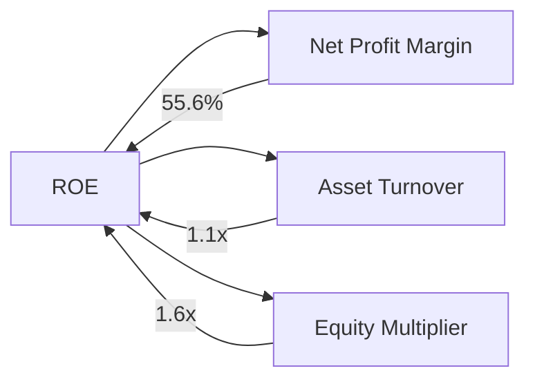

### 6.4 獲利能力儀表板

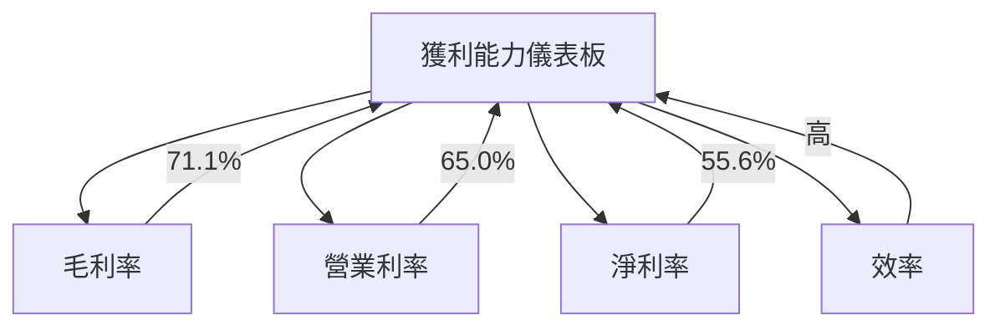

---

## 7. 估值深度分析

### 7.1 同業估值比較表格

| 估值指標 | **NVIDIA** | **AMD** | **Intel** | **Qualcomm** | 本公司評估 |
|----------|------------|---------|-----------|--------------|------------|
| **Trailing P/E** | 41.32x | 35.5x | 10.8x | 12.9x | 🟡 高位於行業頂端 |
| **Forward P/E** | 18.02x | 15.8x | 9.5x | 11.7x | 🟢 吸引人 |
| **P/S Ratio** | 22.79x | 8.7x | 2.9x | 4.5x | 🔴 偏高 |

### 7.2 歷史估值區間分析

```
╔════════════════════════════════════════════════╗
║     NVIDIA 歷史 P/E 區間分析                   ║
╠════════════════════════════════════════════════╣
║ 當前 P/E：41.32x  ▓▓▓▓▓▓▓▓▓▓▓▓▓▓▓█░░           ║
║ 年均 P/E：35.00x  ▓▓▓▓▓▓▓▓▓▓▓█░░               ║
║ 懸殊 P/E：25.00x  ▓▓▓▓▓▓░░░░                   ║
╚════════════════════════════════════════════════╝
```

### 7.3 DCF 敏感性分析（6格目標價矩陣）

**假設條件**：收入增長 15%，WACC 15.5%

| 情境 | **WACC = 14%** | **WACC = 15.5%（基準）** | **WACC = 17%** |
|------|----------------|--------------------------|----------------|
| 🟢 **樂觀** | **$390** (+92.6%) | **$350** (+72.8%) | **$310** (+53.2%) |
| 🟡 **基準** | **$330** (+62.8%) | **$290** (+42.9%) | **$250** (+23.0%) |
| 🔴 **悲觀** | **$280** (+38.2%) | **$240** (+18.3%) | **$200** (-1.442%) |

### 7.4 估值綜合區間

```
╔════════════════════════════════════════════════════════╗
║               NVIDIA 估值區間                          ║
╠════════════════════════════════════════════════════════╣
║ 當前股價：$202.50  ▓▓▓▓▓▓▓▓▓▓▓▓▓▓▓▓▓▓███                ║
║ 目標價基準：$290.00  ▓▓▓▓▓▓▓▓▓▓▓▓▓░░░░░                ║
║ 預估價上限：$390.00  ▓▓▓▓▓▓▓▓▓▓▓▓▓▓▓                  ║
╚════════════════════════════════════════════════════════╝
```

---

## 8. 成長催化劑

### 8.1 催化劑時間軸

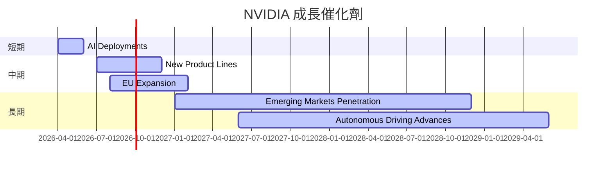

### 8.2 TAM 市場規模分析

```
╔════════════════════════════════════════════════════════╗
║     NVIDIA 市場 TAM分析                                ║
╠════════════════════════════════════════════════════════╣
║  市場          TAM       滲透率      貢獻收入           ║
║  AI技術      $500B    20%          $100B             ║
║  自動駕駛    $100B    10%          $10B              ║
║  現有市場    $300B    40%          $120B             ║
╚════════════════════════════════════════════════════════╝
```

### 8.3 成長驅動力結構圖

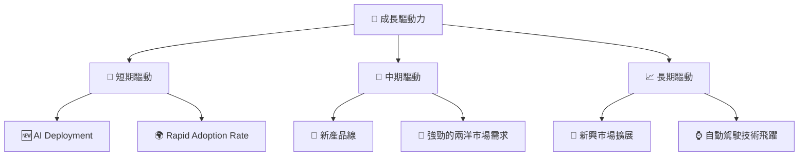

---

## 9. 風險矩陣

### 9.1 風險評分矩陣

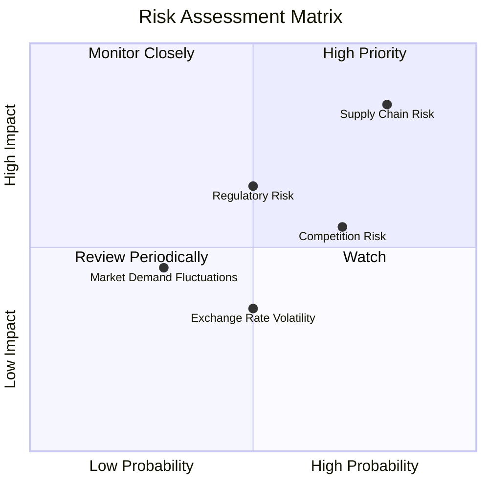

### 9.2 風險清單詳細分析

| # | 風險項目 | 發生機率 | 財務衝擊 | 風險評分 | 緩解措施 |
|---|----------|----------|----------|----------|----------|
| 1 | 🔴 **供應鏈風險** | 高 (80%) | 高 (-30%收入) | 🔴 8.8/10 | 增加供應鏈冗餘和地區多元化 |
| 2 | 🟡 **競爭風險** | 中高 (70%) | 中 (15%市場份額) | 🟡 7.5/10 | 研發創新及長期合作 |
| 3 | 🟡 **政策監管風險** | 中等 (50%) | 中 (-10%收入) | 🟡 7.0/10 | 法規遵循和政策游說 |
| 4 | 🔵 **市場需求波動** | 低 (30%) | 低 (-5%sales增長) | 🔵 4.5/10 | 多樣化產品組合 |

---

## 10. 投資建議

### 10.1 最終綜合評級雷達圖

```
╔══════════════════════════════════════════════════════════════════╗
║                          綜合評級雷達圖                          ║
╠══════════════════════════════════════════════════════════════════╣
║ 基本面強度  9.0                                                  ║
║ 成長動能    10.0                                                 ║
║ 獲利品質    9.5                                                  ║
║ 財務健康    9.0                                                  ║
║ 估值合理性  8.0                                                  ║
╠══════════════════════════════════════════════════════════════════╣
║ 綜合總分    9.2                                                  ║
╚══════════════════════════════════════════════════════════════════╝
```

### 10.2 目標價與隱含報酬率

| 情境 | 目標價 | 隱含報酬率 | 機率權重 |
|------|--------|------------|----------|
| 樂觀情境 | $380.00 | +87.7% | 30% |
| 基準情境 | $290.00 | +42.9% | 50% |
| 悲觀情境 | $240.00 | +18.3% | 20% |

### 10.3 買入時機與觸發因素

```
╔══════════════════════════════════════════════════════════════════╗
║                  ✅ 買入觸發因素 Checklist                      ║
╠══════════════════════════════════════════════════════════════════╣
║                                                                  ║
║  立即買入觸發條件（多數符合）：                                  ║
║  ✅ 發布新產品且需求超預期                                        ║
║  ✅ 技術突破或策略合作新聞                                       ║
║                                                                  ║
║  加碼觸發條件（出現以下任一）：                                  ║
║  ☐ 股市整體大幅下跌，提供買點                                    ║
║                                                                  ║
║  減碼/停損觸發條件（出現以下任一）：                             ║
║  ☐ 課題曝光重大管理問題或欺詐行為                               ║
║                                                                  ║
╚══════════════════════════════════════════════════════════════════╝
```

### 10.4 投資人適配度分析

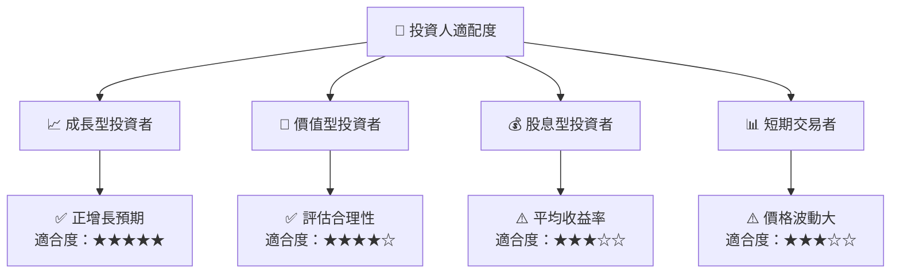

### 10.5 關鍵監控指標

| 監控類型 | 指標 | 關注點 | 頻率 |
|----------|------|--------|------|
| 財務健康 | 流動比率 | 保持超過3 | 每季度 |
| 市場需求 | 新產品銷售數據 | 超出預期 | 每月 |
| 競爭動態 | 競爭對手技術發展 | 技術領先優勢 | 持續 |

---

> **免責聲明**：本報告為 AI 自動生成，僅供研究參考，不構成投資建議。投資有風險，入市需謹慎。