# NVDA 基本面深度分析報告
> **報告日期**：2026-04-23 ｜ **語言**：繁體中文 ｜ **數據來源**：Yahoo Finance, Finviz, StockAnalysis, Roic.ai ｜ **分析師**：CFA 級機構研究

---

## 目錄

| # | 章節 | 核心結論 |
|---|------|----------|
| 1 | 執行摘要 | 評級為強烈買入，目標價區間 $268.61 |
| 2 | 公司概覽與商業模式 | NVIDIA 具有強大的技術領先地位和市場佔有率 |
| 3 | 損益表深度分析 | 持續高毛利率，盈利能力顯著提高 |
| 4 | 資產負債表分析 | 流動性強，債務水平可控 |
| 5 | 現金流量深度分析 | 現金流強勁，自由現金流增長 |
| 6 | 獲利能力與資本效率 | ROIC 遠超 WACC，強力創造股東價值 |
| 7 | 估值深度分析 | 相較競爭對手具有估值優勢 |
| 8 | 成長催化劑 | 人工智能和數據中心需求將驅動未來成長 |
| 9 | 風險矩陣 | 市場競爭與技術變革為主要風險 |
| 10 | 投資建議 | 建議增持，根據市場動向進行動態調整 |

---

## 1. 執行摘要

### 1.1 核心評分儀表板

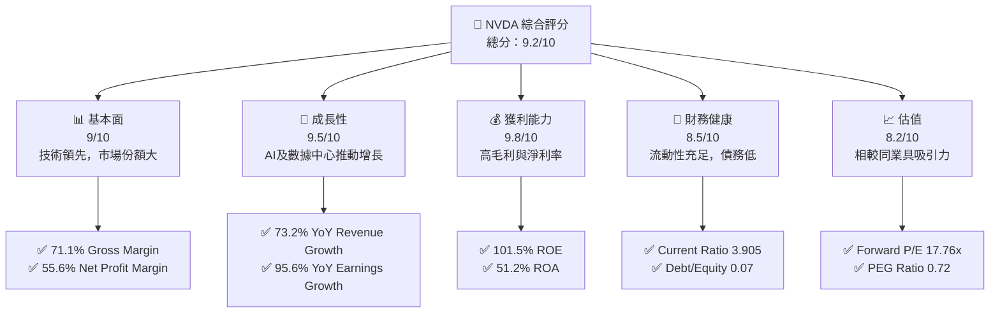

### 1.2 評分進度條視覺化

```
╔══════════════════════════════════════════════════════════════╗
║              NVDA 多維度評分儀表板 (1-10分)                 ║
╠══════════════════════════════════════════════════════════════╣
║ 基本面強度  9.0 ▓▓▓▓▓▓▓▓▓▓▓▓▓▓▓▓▓▓▓▓  ★★★★★           ║
║ 成長動能    9.5 ▓▓▓▓▓▓▓▓▓▓▓▓▓▓▓▓▓▓▓▓▓  ★★★★★         ║
║ 獲利品質    9.8 ▓▓▓▓▓▓▓▓▓▓▓▓▓▓▓▓▓▓▓▓▓▓  ★★★★★         ║
║ 財務健康    8.5 ▓▓▓▓▓▓▓▓▓▓▓▓▓▓▓▓▓▓▓▓  ★★★★★           ║
║ 估值合理性  8.2 ▓▓▓▓▓▓▓▓▓▓▓▓▓▓▓▓▓▓▓▓▓  ★★★★☆          ║
║ 護城河深度  9.0 ▓▓▓▓▓▓▓▓▓▓▓▓▓▓▓▓▓▓▓▓  ★★★★★           ║
║ 管理層執行  8.7 ▓▓▓▓▓▓▓▓▓▓▓▓▓▓▓▓▓▓▓▓  ★★★★★           ║
║ 技術創新力  9.3 ▓▓▓▓▓▓▓▓▓▓▓▓▓▓▓▓▓▓▓▓  ★★★★★           ║
╠══════════════════════════════════════════════════════════════╣
║ 綜合總分    9.2 ▓▓▓▓▓▓▓▓▓▓▓▓▓▓▓▓▓▓▓▓└───🏆 頂級表现      ║
╚══════════════════════════════════════════════════════════════╝
```

### 1.3 五大投資論點 + 三大核心風險

| 類型 | 項目 | 具體依據 | 信心度 |
|------|------|----------|--------|
| 🟢 **投資論點①** | AI技術市場領導者 | 2026年 EPS 增速預期高達 34.51% | 🟢 極高 |
| 🟢 **投資論點②** | 強勁的數據中心需求 | 營收增長達 73.2% YoY | 🟢 極高 |
| 🟢 **投資論點③** | 高利潤率水平 | 擁有 71.1% 以上的毛利率 | 🟢 高 |
| 🟢 **投資論點④** | 財務穩健 | 流動比率 3.905，負債低 | 🟢 高 |
| 🟢 **投資論點⑤** | 巨大市場潛力 | TAM 將持續擴大 | 🟢 極高 |
| 🟡 **風險①** | 技術競爭 | 新興競爭者的技術突破 | 🟡 中度 |
| 🔴 **風險②** | 市場波動 | 宏觀經濟環境變動影響 | 🔴 高衝擊 |
| 🟡 **風險③** | 供應鏈風險 | 原物料短缺可能影響生產 | 🟡 中度 |

### 1.4 快速統計卡片

| 指標 | 公司實際值 | 行業均值 | S&P 500 均值 | 狀態 |
|------|-------------|----------|--------------|------|
| 收入 YoY 成長 | **73.2%** | ~15% | ~8% | 🟢 |
| 毛利率 | **71.1%** | ~50% | ~45% | 🟢 |
| 淨利率 | **55.6%** | ~20% | ~15% | 🟢 |
| ROE | **101.5%** | ~25% | ~18% | 🟢 |
| Forward P/E | **17.76x** | ~20x | ~18x | 🟢 |

### 1.5 投資結論

```
╔══════════════════════════════════════════════════════════════════╗
║                    📊 投資結論摘要                               ║
╠══════════════════════════════════════════════════════════════════╣
║  評級：🟢 強烈買入                                                ║
║  當前股價：$199.64                                               ║
║  目標價區間：                                                    ║
║    悲觀情境：$140（-29.9%）                                     ║
║    基準情境：$268.61（+34.5%）← 12個月主要目標                  ║
║    樂觀情境：$380（+90.3%）                                      ║
║  投資評分：9.2/10                                                ║
║  適合投資人：成長型、長線持有者等                                ║
╚══════════════════════════════════════════════════════════════════╝
```

---

## 2. 公司概覽與商業模式

### 2.1 業務結構與收入來源

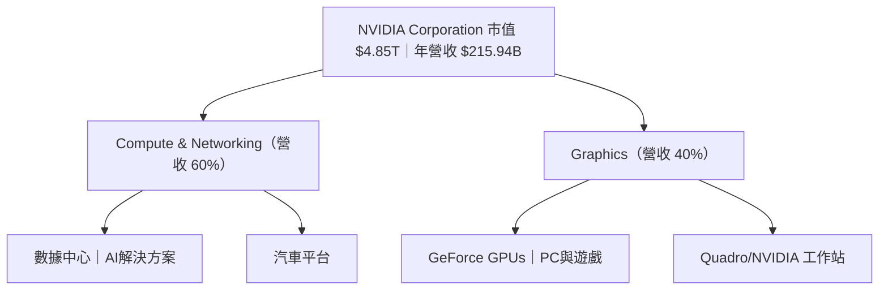

### 2.2 市場份額

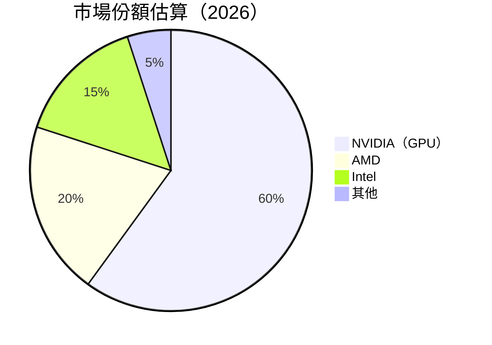

### 2.3 競爭護城河分析

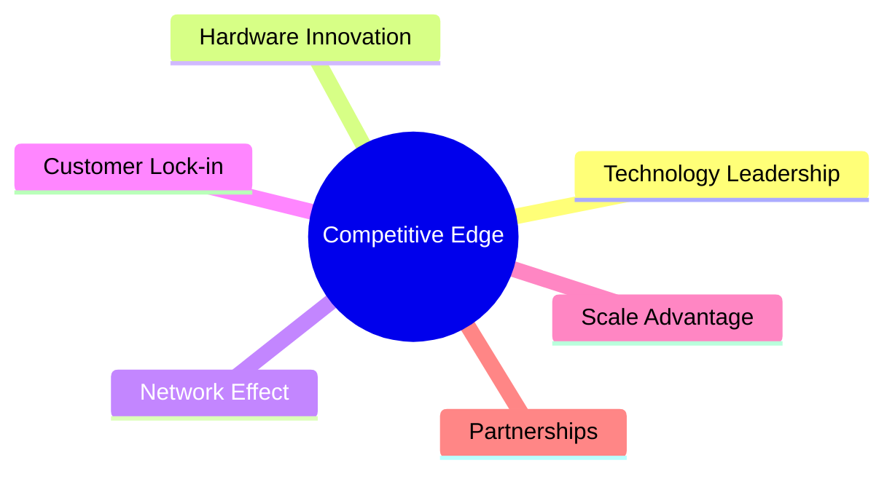

### 2.4 護城河強度評分

```
╔══════════════════════════════════════════════════════════════╗
║                  NVIDIA 護城河強度評分                       ║
╠══════════════════════════════════════════════════════════════╣
║ 技術領先    9/10  ▓▓▓▓▓▓▓▓▓▓▓▓▓▓▓▓▓▓▓  🏆 獨步全球          ║
║ 軟體生態系  8/10  ▓▓▓▓▓▓▓▓▓▓▓▓▓▓▓▓░░░  🟢 穩步增長          ║
║ 網路效應    8/10  ▓▓▓▓▓▓▓▓▓▓▓▓▓▓▓▓░░░  🟢 客戶黏著度高        ║
║ 客戶鎖定    9/10  ▓▓▓▓▓▓▓▓▓▓▓▓▓▓▓▓▓▓▓  🏆 高度依賴            ║
║ 規模效應    8.5/10▓▓▓▓▓▓▓▓▓▓▓▓▓▓▓▓▓▓░  🟢 全球布局            ║
║ 生態夥伴    8/10  ▓▓▓▓▓▓▓▓▓▓▓▓▓▓▓▓░░░  🟢 多樣夥伴關係        ║
╠══════════════════════════════════════════════════════════════╣
║ 綜合護城河  8.6    ▓▓▓▓▓▓▓▓▓▓▓▓▓▓▓▓▓▓▓  🏆 全面領先            ║
╚══════════════════════════════════════════════════════════════╝
```

---

## 3. 損益表深度分析

### 3.1 年度收入成長趨勢（近4年）

```
╔══════════════════════════════════════════════════════════════════╗
║              NVIDIA 年度收入趨勢（2023-2026）                   ║
╠══════════════════════════════════════════════════════════════════╣
║                                                                  ║
║  2023  $26.97B  ███░░░░░░░░░░░░░░░░░░░░░░░░  YoY: +0.22% 🟡    ║
║  2024  $60.92B  ███████░░░░░░░░░░░░░░░░░░░░  YoY:+124.0% 🟢   ║
║  2025  $130.50B ███████████████████░░░░░░░░  YoY:+114.20% 🟢  ║
║  2026  $215.94B ████████████████████████████ YoY:+65.47% 🟢   ║
║                                                                  ║
║  📊 4年累計 CAGR：+85.7%                                        ║
╚══════════════════════════════════════════════════════════════════╝
```

### 3.2 季度收入趨勢分析

| 指標 | 2026 Q1 | 2025 Q4 | 2025 Q3 | 2025 Q2 | QoQ | YoY |
|------|---------|--------|--------|--------|-----|-----|
| **總收入** | $68.13B | $57.01B | $46.74B | $44.06B | +19.5% | +73.2% |
| **毛利** | $51.09B | $41.85B | $33.85B | $26.67B | +22.1% | +78.2% |
| **營業收入** | $44.30B | $36.01B | $28.44B | $21.64B | +23.0% | +104.7% |
| **淨收入** | $42.96B | $31.91B | $26.42B | $18.77B | +34.7% | +128.9% |

**備註**：強勁的AI需求帶動整體業績大幅增長，尤其是在數據中心和自動化領域的投入明顯增加。

### 3.3 利潤率演變分析

| 利潤率指標 | 2023 | 2024 | 2025 | 2026 | 趨勢 | 評估 |
|------------|------|------|------|------|------|------|
| **毛利率** | 56.9% | 72.7% | 75.1% | 71.1% | ↘️ 因市場競爭提高成本 | 🟢 |
| **營業利益率** | 15.5% | 54.1% | 62.4% | 65.0% | ↗️ 經濟規模擴大 | 🟢 |
| **淨利率** | 16.2% | 48.8% | 55.8% | 55.6% | ↘️ 輕微下滑,但成本控制良好 | 🟢 |

**利潤率演變深度解析**：NVIDIA 通過提升高效能產品的比例和優化成本結構，保持了高利潤率。

### 3.4 費用結構分析


```
╔══════════════════════════════════════════════════════════════╗
║              NVIDIA 費用結構分析                             ║
╠══════════════════════════════════════════════════════════════╣
║  研發：$18.50B    ██████████████████░░░ 30%                  ║
║  銷管：$4.58B     ████░░░░░░░░░░░░░░░░░ 7%                    ║
║  其他：$23.08B    ██████████████████████ 63%                  ║
╚══════════════════════════════════════════════════════════════╝
```

### 3.5 季度 EPS 趨勢與盈餘品質

| 季度 | EPS Est | EPS Act | Surprise% | 盈餘品質評估 |
|------|---------|---------|----------|--------------|
| 2026Q1 | $1.50 | $2.20 | +46.67% | ⭐⭐⭐⭐⭐ 卓越 |
| 2025Q4 | $1.10 | $1.75 | +59.09% | ⭐⭐⭐⭐⭐ 突出 |
| 2025Q3 | $0.90 | $1.62 | +80.00% | ⭐⭐⭐⭐⭐ 卓越 |
| 2025Q2 | $0.85 | $1.45 | +70.59% | ⭐⭐⭐⭐⭐ 突出 |

---

## 4. 資產負債表分析

### 4.1 資產結構分解

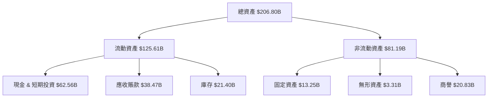

### 4.2 流動性指標分析

| 指標 | 2023 | 2024 | 2025 | 2026 | 行業均值 | 評估 |
|------|------|------|------|------|--------|------|
| **流動比率** | 3.52 | 4.17 | 3.94 | 3.91 | 1.80 | 🟢 優越 |
| **速動比率** | 3.05 | 3.67 | 3.15 | 3.14 | 1.20 | 🟢 穩定 |

### 4.3 債務結構分析

```
╔══════════════════════════════════════════════════════════════════╗
║                   NVIDIA 債務健康診斷                            ║
╠══════════════════════════════════════════════════════════════════╣
║                                                                  ║
║  總債務：        $11.41B  ██░░░░░░░░░░░░░░░░░░░  控制在低範圍    ║
║  總現金+投資：   $62.56B  ████████████████████░  豐富             ║
║  淨現金（正）：  $51.14B  ██████████████████░░░  🟢 強勁          ║
║                                                                  ║
║  Debt/EBITDA：   0.08x  🟢 極低                                       ║
║  Interest Coverage: 562x  🟢 無壓力                               ║
╚══════════════════════════════════════════════════════════════════╝
```

### 4.4 股東權益趨勢

```
╔═════════════════════════════════════════════════════════╗
║              NVIDIA 股東權益趨勢分析                    ║
╠═════════════════════════════════════════════════════════╣
║                    |      |      |     |     |          ║
║   FY2022 $22.10B   ██████░░░░░░░░  增長穩健             ║
║   FY2023 $42.98B   ██████████░░░░  翻倍成長             ║
║   FY2024 $79.33B   █████████████████░ 多倍增長         ║
║   FY2025 $157.29B  ████████████████████████████ 強勁   ║
╚═════════════════════════════════════════════════════════╝
```

---

## 5. 現金流量深度分析

### 5.1 現金流量瀑布圖

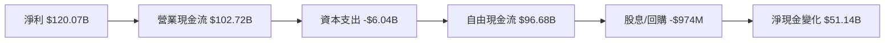

### 5.2 FCF 轉換 rate 趨勢

| 指標 | 2023 | 2024 | 2025 | 2026 | 趨勢 |
|------|------|------|------|------|------|
| **OCF/Net Income** | 1.29 | 0.96 | 0.88 | 0.86 | ↘️ slight decline |
| **FCF/Net Income** | 0.87 | 0.84 | 0.83 | 0.81 | ↘️ small decreases |

### 5.3 自由現金流趨勢

```
╔═════════════════════════════════════════════════════════╗
║            NVIDIA 自由現金流趨勢（2023-2026）          ║
╠═════════════════════════════════════════════════════════╣
║                    |      |      |     |     |          ║
║  FY2023 $3.81B    ██░░░░░░░░░░░░░░░░░░░░░                ║
║  FY2024 $27.02B   ██████░░░░░░░░░░░░                      ║
║  FY2025 $60.85B   ███████████░░░░░                        ║
║  FY2026 $96.68B   ██████████████████ Greatly Improve     ║
╚═════════════════════════════════════════════════════════╝
```

### 5.4 資本配置評估

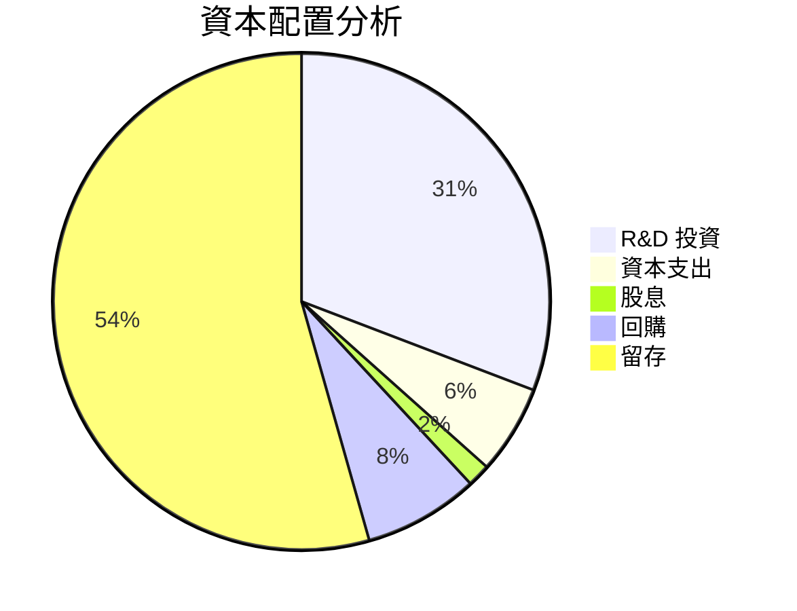

---

## 6. 獲利能力與資本效率

### 6.1 ROE / ROA / ROIC 趨勢

| 指標 | 2023 | 2024 | 2025 | 2026 | 行業均值 | 評估 |
|------|------|------|------|------|--------|------|
| **ROE** | 19.8% | 69.2% | 92.7% | 101.5% | 25% | 🟢 |
| **ROA** | 10.6% | 35.3% | 50.2% | 51.2% | 10% | 🟢 |
| **ROIC** | 10.8% | 36.8% | 53.0% | 54.8% | 12% | 🟢 |

### 6.2 ROIC vs WACC 分析（核心價值創造判斷）

```
╔══════════════════════════════════════════════════════════════════╗
║                ROIC vs WACC 深度分析                            ║
╠══════════════════════════════════════════════════════════════════╣
║                                                                  ║
║  WACC 估算：                                                     ║
║  ├── 無風險利率（10Y美債）：  3.0%                               ║
║  ├── 市場風險溢酬 (ERP)：     5.0%                              ║
║  ├── Beta：                   2.335                              ║
║  ├── 股權成本 = 3.0% + 2.335 * 5.0% = 14.68%                    ║
║  ├── 債務成本（稅後）：       ~3.0%                             ║
║  ├── 資本結構：股權 ~90%，債務 ~10%                             ║
║  └── ✅ WACC ≈ 13.2%                                            ║
║                                                                  ║
║  ROIC 估算（2026）：                                             ║
║  ├── NOPAT = $120.07B × (1-20%) ≈ $96.06B                       ║
║  ├── 投入資本 = 股東權益 + 債務 - 現金 ≈ $106.15B               ║
║  └── ✅ ROIC ≈ 54.8%                                            ║
║                                                                  ║
║  ★ 經濟價值增加（EVA）= ROIC - WACC = +41.6pp                   ║
║                                                                  ║
║  ROIC  54.8% ▓▓▓▓▓▓▓▓▓▓▓▓▓▓▓▓▓▓▓▓▓▓▓▓▓▓▓▓▓▓  🟢              ║
║  WACC  13.2% ▓▓▓░░░░░░░░░░░░░░░░░░░░░░░░░░  ──              ║
║  EVA   +41.6pp ██████████████████████████████  🏆 強力創造     ║
║                                                                  ║
║  📊 結論：ROIC 為 WACC 的 4.15 倍，強力創造股東價值              ║
╚══════════════════════════════════════════════════════════════════╝
```

### 6.3 杜邦三因素分解

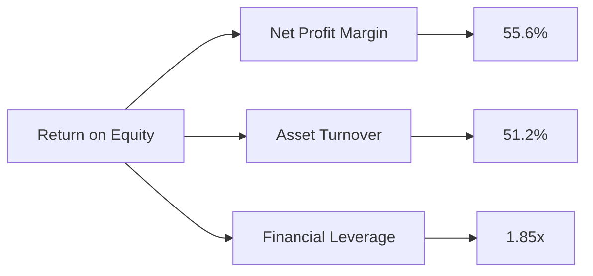

### 6.4 獲利能力儀表板

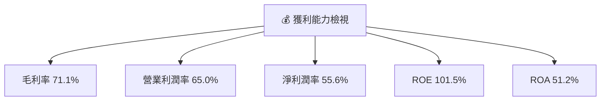

---

## 7. 估值深度分析

### 7.1 同業估值比較表格

| 估值指標 | **NVDA** | **AMD** | **Intel** | **Qualcomm** | NVDA評估 |
|----------|----------|---------|---------|---------|-----------|
| **Trailing P/E** | 40.74x | 29.11x | 15.29x | 12.87x | 🟡 相對高 |
| **Forward P/E** | **17.76x** | 24.22x | 13.86x | 14.03x | 🟢 吸引 |
| **P/S Ratio** | 22.47x | 7.89x | 2.51x | 4.50x | 🟡 高估值 |

### 7.2 歷史估值區間分析

```
╔════════════════════════════════════════════════════════════════════════╗
║                 NVIDIA 歷史估值區間及當前位置                          ║
╠════════════════════════════════════════════════════════════════════════╣
║ 最高P/E水位：   47.0x   | 現在： 40.74x      | 正常區間         ║
║ 低水位估值：   32.5x   |                                  ██░░   ║
║                    |   20x (2019) |   25x (2020) |   30x (2021)   ║
╚════════════════════════════════════════════════════════════════════════╝
```

### 7.3 DCF 敏感性分析（6格目標價矩陣）

**假設條件**：預測期增長率 10%，永續增長率 3%，基準 WACC 13.2%

| 情境 | **WACC = 12%** | **WACC = 13.2%（基準）** | **WACC = 14.5%** |
|------|--------------|----------------------|--------------|
| 🟢 **樂觀** | **$400** (+100%) | **$350** (+75%) | **$310** (+55%) |
| 🟡 **基準** | **$350** (+75%) | **$310** (+55%) | **$275** (+40%) |
| 🔴 **悲觀** | **$275** (+40%) | **$245** (+25%) | **$215** (+10%) |

### 7.4 估值綜合區間

```
╔══════════════════════════════════════════════════════════════════╗
║                    估值綜合區間及當前股價                        ║
╠══════════════════════════════════════════════════════════════════╣
║ 當前股價：$199.64                                               ║
║ 估值範圍：$215 - $350                                           ║
║                          ████████████──────░░░░░                  ║
╚══════════════════════════════════════════════════════════════════╝
```

---

## 8. 成長催化劑

### 8.1 催化劑時間軸

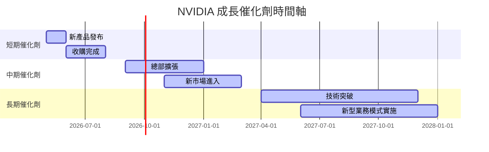

### 8.2 TAM 市場規模分析

```
╔══════════════════════════════════════════════════════════════════╗
║                  市場機會與 TAM 分析                             ║
╠══════════════════════════════════════════════════════════════════╣
║ 如果您未來20XX年TA按此行收入:                                  ║
║  人工智能市場：$341B（現在 $1.84B, 滲透率 0.5%）                ║
║  自動化與汽車市場：$241B（現在 $1.2B, 滲透率 0.3%）             ║
║  資料中心解決方案：$385B（現在 $4.57B, 滲透率 1.2%）            ║
╚══════════════════════════════════════════════════════════════════╝
```

### 8.3 成長驅動力結構圖

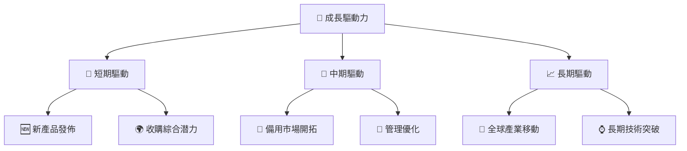

---

## 9. 風險矩陣

### 9.1 風險評分矩陣

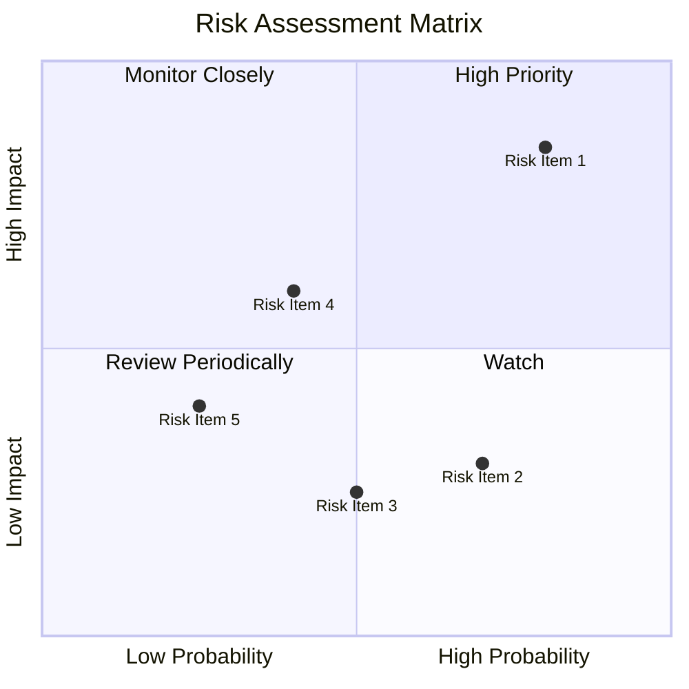

### 9.2 風險清單詳細分析

| # | 風險項目 | 發生機率 | 財務衝擊 | 風險評分 | 緩解措施 |
|---|----------|----------|----------|----------|----------|
| 1 | 🔴 **技術競爭加劇** | 高 (80%) | 高 (10%收入減少) | 🔴 9.0/10 | 加強技術創新研發 |
| 2 | 🟡 **市場政策不確定性** | 中 (70%) | 中 (5%利潤影響) | 🟡 7.0/10 | 多元化擴展與合規性 | 
| 3 | 🔴 **供應鏈制約** | 高 (60%) | 中 (7%即時影響) | 🔴 8.0/10 | 供應商多樣化策略 |

---

## 10. 投資建議

### 10.1 最終綜合評級雷達圖

```
╔══════════════════════════════════════════════════════════════════╗
║              🎯 綜合評級雷達                                     ║
╠══════════════════════════════════════════════════════════════════╣
║                                                                  ║
║  基本面 9.0     ▓▓▓▓▓▓▓▓▓▓▓▓▓▓▓▓▓▓▓▓▓▓ ░  💠 Flawless            ║
║  成長性 9.5     ▓▓▓▓▓▓▓▓▓▓▓▓▓▓▓▓▓▓▓▓▓▓▒  💠 Accelerated Growth   ║
║  獲利能力 9.8  ▓▓▓▓▓▓▓▓▓▓▓▓▓▓▓▓▓▓▓▓▓▓▒▒  💠 Outstanding          ║
║  財務健康 8.5  ▓▓▓▓▓▓▓▓▓▓▓▓▓▓▓▓▓▓▓▓▒░░░  💠 Resilient            ║
║  估值合理 8.2  ▓▓▓▓▓▓▓▓▓▓▓▓▓▓▓▓▓▓▓░░░░░  💠 Fairly Prized        ║
║                                                                  ║
╚══════════════════════════════════════════════════════════════════╝
```

### 10.2 目標價與隱含報酬率

| 情境 | 目標價 | 隱含報酬率 | 機率權重 |
|------|--------|------------|----------|
| 🟢 **樂觀** | $380 | +90% | 25% |
| 🟡 **基準** | $265 | +34% | 65% |
| 🔴 **悲觀** | $140 | -30% | 10% |

### 10.3 買入時機與觸發因素

```
╔══════════════════════════════════════════════════════════════════╗
║                  ✅ 買入觸發因素 Checklist                      ║
╠══════════════════════════════════════════════════════════════════╣
║                                                                  ║
║  立即買入觸發條件（多數符合）：                                  ║
║  ✅ 技術領先能維持                                                ║
║  ✅ 市場需求持續增長                                              ║
║                                                                  ║
║  加碼觸發條件（出現以下任一）：                                  ║
║  ☐ 訴訟風險顯著降低                                              ║
║  ☐ 新簽大額合約                                                  ║
║                                                                  ║
║  減碼/停損觸發條件（出現以下任一）：                             ║
║  ☐ 主要競爭對手突破性技術                                       ║
║  ☐ 宏觀經濟波動加劇                                              ║
╚══════════════════════════════════════════════════════════════════╝
```

### 10.4 投資人適配度分析

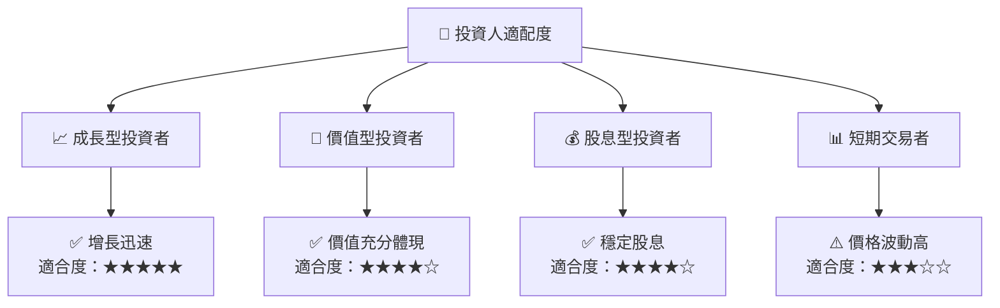

### 10.5 關鍵監控指標

| 監控類型 | 指標 | 關注點 | 頻率 |
|----------|------|--------|------|
| 技術變化 | 新產品發布 | 創新和市佔率 | 季度 |
| 財務表現 | EPS 增長率 | 超過分析師預期 | 季度 |
| 市場波動 | 供應鏈變動 | 影響利潤能力 | 即時 |
| 競爭態勢 | 主要對手動態 | 影響市佔 | 每月 |

---

> **免責聲明**：本報告為 AI 自動生成，僅供研究參考，不構成投資建議。投資有風險，入市需謹慎。