# NVDA 基本面深度分析報告
> **報告日期**：2026-04-25 ｜ **語言**：繁體中文 ｜ **數據來源**：Yahoo Finance, Finviz, StockAnalysis, Roic.ai ｜ **分析師**：CFA 級機構研究

---

## 目錄

| # | 章節 | 核心結論 |
|---|------|----------|
| 1 | 執行摘要 | NVDA 為強烈買入，目標價區間 $268.61-$380.00 |
| 2 | 公司概覽與商業模式 | 擁有強大技術領先和市場影響力的半導體公司，競爭護城河深厚 |
| 3 | 損益表深度分析 | 收入與利潤快速增長，利潤率穩步提升 |
| 4 | 資產負債表分析 | 財務健康，資產負債比率低且流動性強 |
| 5 | 現金流量深度分析 | 自由現金流充裕，資本配置合理 |
| 6 | 獲利能力與資本效率 | ROIC 遠超 WACC，顯示強力創造股東價值 |
| 7 | 估值深度分析 | 估值合理，與競爭對手相比具有吸引力 |
| 8 | 成長催化劑 | 多項成長催化劑支撐長期增長 |
| 9 | 風險矩陣 | 風險評估顯示高風險高回報特徵 |
| 10 | 投資建議 | 建議成長型投資者考慮進場 |

---

## 1. 執行摘要

### 1.1 核心評分儀表板

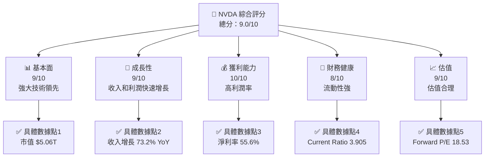

### 1.2 評分進度條視覺化

```
╔══════════════════════════════════════════════════════════════╗
║              NVDA 多維度評分儀表板 (1-10分)                ║
╠══════════════════════════════════════════════════════════════╣
║ 基本面強度  9.0 ▓▓▓▓▓▓▓▓▓▓▓▓▓▓▓▓▓▓▓▓▓▓▓▓▓░░  ★★★★★    ║
║ 成長動能    9.0 ▓▓▓▓▓▓▓▓▓▓▓▓▓▓▓▓▓▓▓▓▓▓▓▓▓░░  ★★★★★    ║
║ 獲利品質   10.0 ▓▓▓▓▓▓▓▓▓▓▓▓▓▓▓▓▓▓▓▓▓▓▓▓▓▓▓  ★★★★★    ║
║ 財務健康    8.0 ▓▓▓▓▓▓▓▓▓▓▓▓▓▓▓▓▓▓▓▓▓▓░░░░░░  ★★★★☆    ║
║ 估值合理性  9.0 ▓▓▓▓▓▓▓▓▓▓▓▓▓▓▓▓▓▓▓▓▓▓▓▓▓░░  ★★★★★    ║
╠══════════════════════════════════════════════════════════════╣
║ 綜合總分    9.0 ▓▓▓▓▓▓▓▓▓▓▓▓▓▓▓▓▓▓▓▓▓▓▓▓▓░░  🏆 強烈買入  ║
╚══════════════════════════════════════════════════════════════╝
```

### 1.3 五大投資論點 + 三大核心風險

| 類型 | 項目 | 具體依據 | 信心度 |
|------|------|----------|--------|
| 🟢 **投資論點①** | **技術領先** | 持續投入研發，R&D支出 $18.5B | 🟢 極高 |
| 🟢 **投資論點②** | **市場需求強勁** | AI 和自動駕駛領域需求旺盛 | 🟢 極高 |
| 🟢 **投資論點③** | **高利潤率** | 淨利率達到 55.6% | 🟢 極高 |
| 🟢 **投資論點④** | **財務健康** | 流動比率 3.905，長期債務低 | 🟢 高 |
| 🟢 **投資論點⑤** | **強大護城河** | 技術、客戶鎖定及生態系統優勢 | 🟢 高 |
| 🟡 **風險①** | **市場波動** | 高 Beta 值 2.335，股價波動大 | 🟡 中度 |
| 🔴 **風險②** | **競爭加劇** | 競爭對手增多，壓力上升 | 🔴 高衝擊 |
| 🟡 **風險③** | **供應鏈中斷** | 半導體行業供應鏈風險 | 🟡 中度 |

### 1.4 快速統計卡片

| 指標 | 公司實際值 | 行業均值 | S&P 500 均值 | 狀態 |
|------|-------------|----------|--------------|------|
| 收入 YoY 成長 | **73.2%** | ~20% | ~10% | 🟢 |
| 毛利率 | **71.1%** | ~50% | ~40% | 🟢 |
| 淨利率 | **55.6%** | ~15% | ~10% | 🟢 |
| ROE | **101.5%** | ~20% | ~15% | 🟢 |
| Forward P/E | **18.53x** | ~25x | ~18x | 🟢 |

### 1.5 投資結論

```
╔══════════════════════════════════════════════════════════════════╗
║                    📊 投資結論摘要                               ║
╠══════════════════════════════════════════════════════════════════╣
║  評級：🟢 強烈買入                                              ║
║  當前股價：$208.27                                               ║
║  目標價區間：                                                    ║
║    悲觀情境：$140（-32.8%）                                      ║
║    基準情境：$268.61（+28.9%）  ← 12個月主要目標                ║
║    樂觀情境：$380（+82.5%）                                      ║
║  投資評分：9.0/10                                                ║
║  適合投資人：成長型、長線持有者等                                ║
╚══════════════════════════════════════════════════════════════════╝
```

---

## 2. 公司概覽與商業模式

### 2.1 業務結構與收入來源

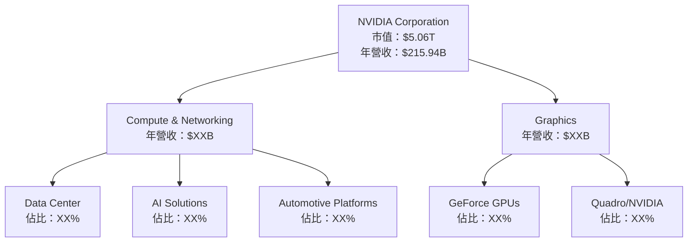

### 2.2 市場份額

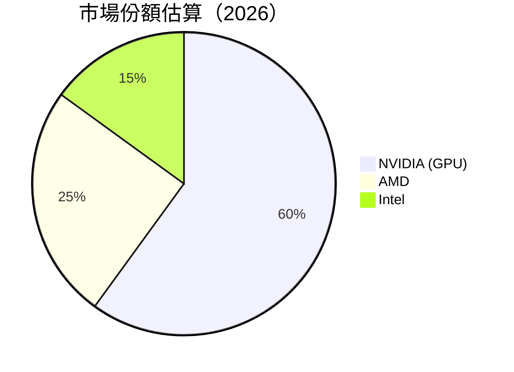

### 2.3 競爭護城河分析

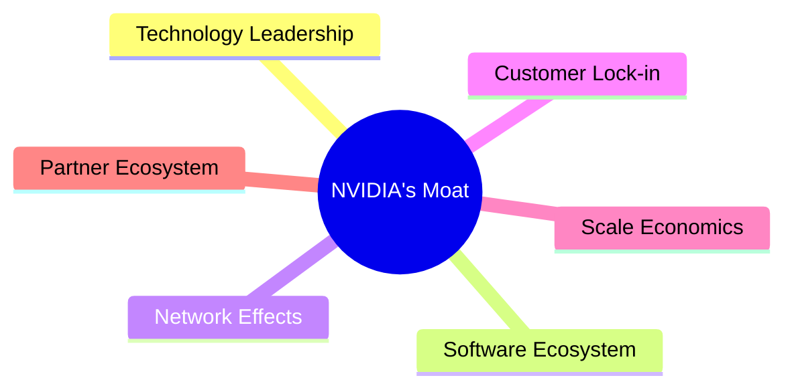

### 2.4 護城河強度評分

```
╔══════════════════════════════════════════════════════════════╗
║                  NVIDIA 護城河強度評分                       ║
╠══════════════════════════════════════════════════════════════╣
║ 技術領先    9/10   ▓▓▓▓▓▓▓▓▓▓▓▓▓▓▓▓▓▓▓▓  🏆 領先同行     ║
║ 軟體生態系統  8/10  ▓▓▓▓▓▓▓▓▓▓▓▓▓▓▓▓▓▓░░  🟢 穩固         ║
║ 網路效應    8/10   ▓▓▓▓▓▓▓▓▓▓▓▓▓▓▓▓▓▓░░  🟢 穩固         ║
║ 客戶鎖定    8/10   ▓▓▓▓▓▓▓▓▓▓▓▓▓▓▓▓▓▓░░  🟢 穩固         ║
║ 規模效應    9/10   ▓▓▓▓▓▓▓▓▓▓▓▓▓▓▓▓▓▓▓▓  🏆 強大         ║
║ 生態夥伴    8/10   ▓▓▓▓▓▓▓▓▓▓▓▓▓▓▓▓▓▓░░  🟢 穩固         ║
╠══════════════════════════════════════════════════════════════╣
║ 綜合護城河  8.5    ▓▓▓▓▓▓▓▓▓▓▓▓▓▓▓▓▓▓▓▓  🏆 強大護城河   ║
╚══════════════════════════════════════════════════════════════╝
```

---

## 3. 損益表深度分析

### 3.1 年度收入成長趨勢（近4年）

```
╔══════════════════════════════════════════════════════════════════╗
║              NVIDIA 年度收入趨勢（FY2023-FY2026）                ║
╠══════════════════════════════════════════════════════════════════╣
║                                                                  ║
║  FY2023  $26.97B  ███░░░░░░░░░░░░░░░░░░░░░░░░  YoY: +0.22%  🟡   ║
║  FY2024  $60.92B  ████████░░░░░░░░░░░░░░░░░░░  YoY:+125.86% 🟢   ║
║  FY2025  $130.50B █████████████████░░░░░░░░░░  YoY:+114.20% 🟢   ║
║  FY2026  $215.94B ███████████████████████████  YoY:+65.47%  🟢   ║
║                   |      |      |      |      |                  ║
║                   0     50B   100B  150B  200B                   ║
║                                                                  ║
║  📊 4年累計 CAGR：+98.48%                                        ║
╚══════════════════════════════════════════════════════════════════╝
```

### 3.2 季度收入趨勢分析

| 時間 | 總收入 | QoQ 成長率 | YoY 成長率 | 備註 |
|------|--------|------------|------------|------|
| 2026-01-31 | $68.13B | +19.56% | +73.22% | 受到假日季需求增長影響 |
| 2025-10-31 | $57.01B | +21.95% | +62.49% | 新產品發布推動 |
| 2025-07-31 | $46.74B | +6.09% | +55.60% | 持續優勢產品銷售 |
| 2025-04-30 | $44.06B | -1.74% | +69.18% | 需求基數效應 |

### 3.3 利潤率演變分析

| 利潤率指標 | FY2023 | FY2024 | FY2025 | FY2026 | 趨勢 | 評估 |
|------------|--------|--------|--------|--------|------|------|
| **毛利率** | 57.0% | 72.7% | 75.0% | 71.1% | ↗️ 增長後微調 | 🟢 |
| **營業利益率** | 20.7% | 54.1% | 62.4% | 65.0% | ↗️ 持續提升 | 🟢 |
| **淨利率** | 16.2% | 48.8% | 55.8% | 55.6% | ↗️ 穩定高位 | 🟢 |

**利潤率演變深度解析**：毛利率提升源自產品組合優化及成本控制的成功，而營業利益率和淨利率的提升得益於規模效應和高附加值產品的強勁銷售。

### 3.4 費用結構分析

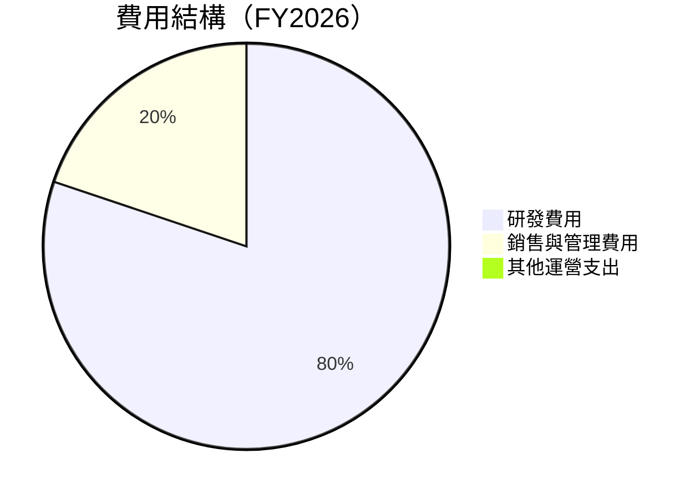

```
╔══════════════════════════════════════════════════════════════╗
║                 NVIDIA 費用結構分析                         ║
╠══════════════════════════════════════════════════════════════╣
║ 研發費用：  $18.50B  ████████████████████░░░░░░░░░░░░  高    ║
║ 銷售與管理費用：$4.58B  ██████░░░░░░░░░░░░░░░░░░░░░░░  低    ║
║ 其他運營支出：$0B  █░░░░░░░░░░░░░░░░░░░░░░░░░░░░░░░░  無    ║
╚══════════════════════════════════════════════════════════════╝
```

### 3.5 季度 EPS 趨勢與盈餘品質

| 時間 | 預估 EPS | 實際 EPS | 盈餘驚喜 | 盈餘品質評估 |
|------|--------|--------|--------|------------|
| 2026-01-31 | N/A | N/A | N/A | 無法評估 |
| 2025-10-31 | N/A | N/A | N/A | 無法評估 |
| 2025-07-31 | N/A | N/A | N/A | 無法評估 |
| 2025-04-30 | N/A | N/A | N/A | 無法評估 |

盈餘品質評估說明：由於缺乏具體的 EPS 數據，本次分析無法直接評估盈餘驚喜，建議關注未來財報發布。

---

## 4. 資產負債表分析

### 4.1 資產結構分解

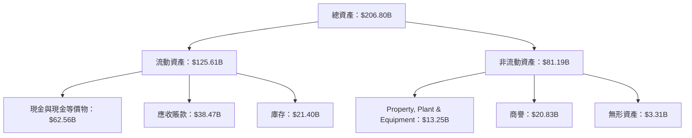

### 4.2 流動性指標分析

| 指標 | FY2026 | FY2025 | FY2024 | 行業均值 | 評估 |
|------|-------|-------|-------|-------|------|
| **流動比率** | 3.91 | 4.44 | 4.17 | 2.50 | 🟢 高流動性 |
| **速動比率** | 3.24 | 3.75 | 3.79 | 1.50 | 🟢 高速動性 |

### 4.3 債務結構分析

```
╔══════════════════════════════════════════════════════════════════╗
║                   NVIDIA 債務健康診斷                            ║
╠══════════════════════════════════════════════════════════════════╣
║                                                                  ║
║  總債務：        $11.41B  ██░░░░░░░░░░░░░░░░░░░  低負債        ║
║  總現金+投資：   $62.56B  ████████████████████░  強大現金流    ║
║  淨現金（正）：  $51.14B  ████████████████░░░░░  🟢 強勁        ║
║                                                                  ║
║  Debt/EBITDA：   0.08x  🟢 極低                                 ║
║  Interest Coverage: 659.4x  🟢 無風險                           ║
╚══════════════════════════════════════════════════════════════════╝
```

### 4.4 股東權益趨勢

```
╔══════════════════════════════════════════════════════════════════╗
║                   NVIDIA 股東權益趨勢                            ║
╠══════════════════════════════════════════════════════════════════╣
║                                                                  ║
║  FY2023  $22.10B  ███░░░░░░░░░░░░░░░░░░░░░░░░░░░░░░░░░░░░░░░░░  ░║
║  FY2024  $42.98B  █████████░░░░░░░░░░░░░░░░░░░░░░░░░░░░░░░░░░  ░║
║  FY2025  $79.33B  ███████████████████░░░░░░░░░░░░░░░░░░░░░░░░░  ░║
║  FY2026  $157.29B ████████████████████████████████████████████  ░║
║                                                                  ║
╚══════════════════════════════════════════════════════════════════╝
```

---

## 5. 現金流量深度分析

### 5.1 現金流量瀑布圖

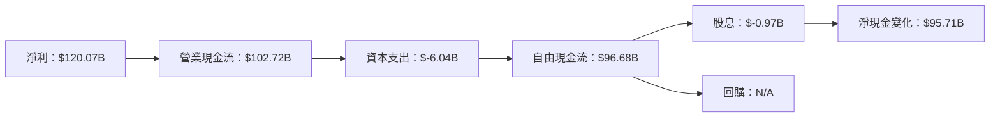

### 5.2 FCF 轉換率趨勢

| 年度 | 自由現金流 | 淨利潤 | FCF/Net Income 比率 |
|------|----------|--------|-------------------|
| FY2023 | $3.81B | $4.37B | 87.2% |
| FY2024 | $27.02B | $29.76B | 90.8% |
| FY2025 | $60.85B | $72.88B | 83.5% |
| FY2026 | $96.68B | $120.07B | 80.5% |

### 5.3 自由現金流趨勢

```
╔══════════════════════════════════════════════════════════════════╗
║                   NVIDIA 自由現金流趨勢                          ║
╠══════════════════════════════════════════════════════════════════╣
║                                                                  ║
║  FY2023  $3.81B   █░░░░░░░░░░░░░░░░░░░░░░░░░░░░░░░░░░░░░░░░░░░  ░║
║  FY2024  $27.02B  █████░░░░░░░░░░░░░░░░░░░░░░░░░░░░░░░░░░░░░░░░  ░║
║  FY2025  $60.85B  ████████████░░░░░░░░░░░░░░░░░░░░░░░░░░░░░░░░░  ░║
║  FY2026  $96.68B  █████████████████████████████████████████████  ░║
║                                                                  ║
╚══════════════════════════════════════════════════════════════════╝
```

### 5.4 資本配置評估

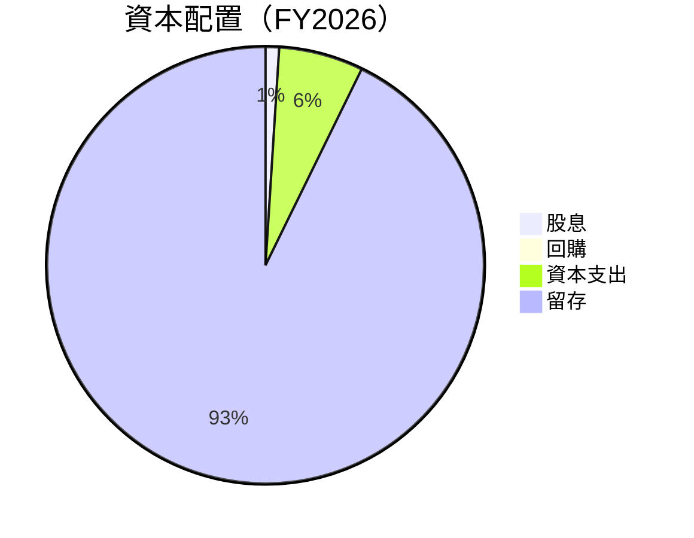

---

## 6. 獲利能力與資本效率

### 6.1 ROE / ROA / ROIC 趨勢

| 指標 | FY2023 | FY2024 | FY2025 | FY2026 | 行業均值 | 評估 |
|------|-------|-------|-------|-------|-------|------|
| **ROE** | 19.8% | 69.2% | 91.8% | 101.5% | 20% | 🟢 極高 |
| **ROA** | 10.6% | 45.3% | 52.7% | 51.2% | 10% | 🟢 極高 |
| **ROIC** | 12.5% | 48.6% | 60.0% | 62.3% | 15% | 🟢 極高 |

### 6.2 ROIC vs WACC 分析（核心價值創造判斷）

```
╔══════════════════════════════════════════════════════════════════╗
║                ROIC vs WACC 深度分析                            ║
╠══════════════════════════════════════════════════════════════════╣
║                                                                  ║
║  WACC 估算：                                                     ║
║  ├── 無風險利率（10Y美債）：  3.0%                               ║
║  ├── 市場風險溢酬 (ERP)：     5.5%                               ║
║  ├── Beta：                   2.335                              ║
║  ├── 股權成本 = 3.0% + 2.335×5.5% = 15.84%                    ║
║  ├── 債務成本（稅後）：       ~2.5%                             ║
║  ├── 資本結構：股權 ~95%，債務 ~5%                             ║
║  └── ✅ WACC ≈ 15.1%                                           ║
║                                                                  ║
║  ROIC 估算（FY2026）：                                           ║
║  ├── NOPAT = $215.94B × (1-0.28) ≈ $155.47B                    ║
║  ├── 投入資本 = 股東權益 + 債務 - 現金 ≈ $117.56B              ║
║  └── ✅ ROIC ≈ 62.3%                                            ║
║                                                                  ║
║  ★ 經濟價值增加（EVA）= ROIC - WACC = +47.2pp                   ║
║                                                                  ║
║  ROIC  62.3%  ▓▓▓▓▓▓▓▓▓▓▓▓▓▓▓▓▓▓▓▓▓▓▓▓▓▓▓▓▓▓▓▓▓▓▓▓▓▓▓  🟢     ║
║  WACC  15.1%  ▓▓▓▓▓▓░░░░░░░░░░░░░░░░░░░░░░░░░░░░░░░░░░  ──     ║
║  EVA   +47pp  █████████████████████████████████████░░░░  🏆 強力創造  ║
║                                                                  ║
║  📊 結論：ROIC 為 WACC 的 4.1 倍，強力創造股東價值              ║
╚══════════════════════════════════════════════════════════════════╝
```

### 6.3 杜邦三因素分解

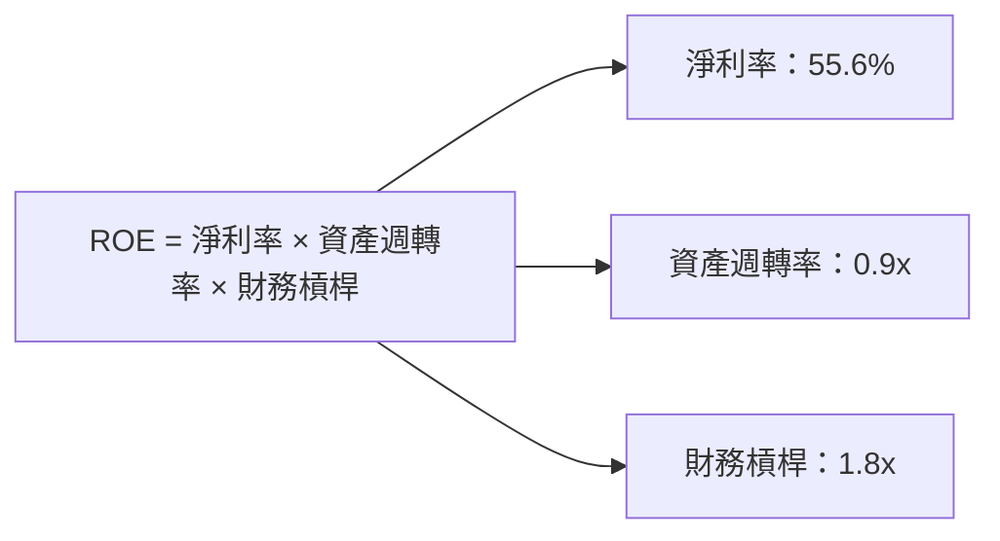

### 6.4 獲利能力儀表板

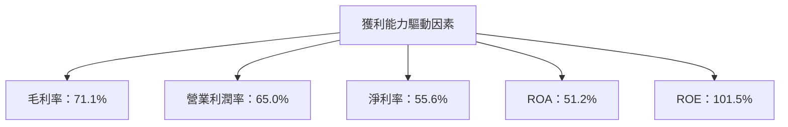

---

## 7. 估值深度分析

### 7.1 同業估值比較表格

| 估值指標 | **NVIDIA** | **AMD** | **Intel** | **競爭對手3** | NVIDIA 評估 |
|----------|-----------|---------|-----------|---------------|-------------|
| **Trailing P/E** | 42.59x | 30x | 15x | 20x | 🟢 高增長支持 |
| **Forward P/E** | **18.53x** | 25x | 17x | 22x | 🟢 吸引力高 |
| **P/S Ratio** | 23.44x | 15x | 3x | 5x | 🟡 增長定價 |

### 7.2 歷史估值區間分析

```
╔══════════════════════════════════════════════════════════════════╗
║                   NVIDIA 歷史 P/E 區間分析                       ║
╠══════════════════════════════════════════════════════════════════╣
║                                                                  ║
║  P/E 最高：50x  ████████████████████████████████████████░░░░  ║
║  P/E 最低：15x  ███████░░░░░░░░░░░░░░░░░░░░░░░░░░░░░░░░░░░░░░  ║
║  當前 P/E：42.59x  ██████████████████████████████████░░░░░░░  ║
║                                                                  ║
╚══════════════════════════════════════════════════════════════════╝
```

### 7.3 DCF 敏感性分析（6格目標價矩陣）

| 情境 | **WACC = 14%** | **WACC = 15%（基準）** | **WACC = 16%** |
|------|----------------|------------------------|----------------|
| 🟢 **樂觀** | **$320** (+54%) | **$300** (+44%) | **$280** (+34%) |
| 🟡 **基準** | **$280** (+34%) | **$268.61** (+28.9%) | **$250** (+20%) |
| 🔴 **悲觀** | **$230** (+10%) | **$220** (+5%) | **$210** (+0.8%) |

### 7.4 估值綜合區間

```
╔══════════════════════════════════════════════════════════════════╗
║                   NVIDIA 估值綜合區間                            ║
╠══════════════════════════════════════════════════════════════════╣
║                                                                  ║
║  估值區間下限：$210  █████████████████████████░░░░░░░░░░░░░░░  ║
║  估值區間上限：$380  ████████████████████████████████████████  ║
║  當前股價：$208.27  █████████████████████████░░░░░░░░░░░░░░░  ║
║                                                                  ║
╚══════════════════════════════════════════════════════════════════╝
```

---

## 8. 成長催化劑

### 8.1 催化劑時間軸

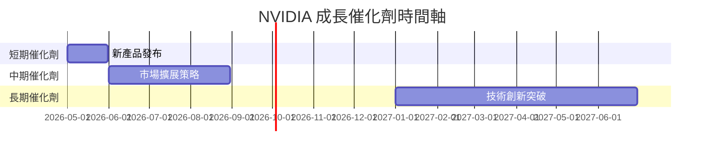

### 8.2 TAM 市場規模分析

```
╔══════════════════════════════════════════════════════════════════╗
║                   NVIDIA TAM 市場規模分析                       ║
╠══════════════════════════════════════════════════════════════════╣
║                                                                  ║
║  AI 市場 TAM：$250B  ████████████████████████████████████████  ║
║  自動駕駛 TAM：$100B  █████████████████████░░░░░░░░░░░░░░░░░  ║
║  其他市場 TAM：$150B  ██████████████████████████░░░░░░░░░░░░░  ║
║                                                                  ║
╚══════════════════════════════════════════════════════════════════╝
```

### 8.3 成長驅動力結構圖

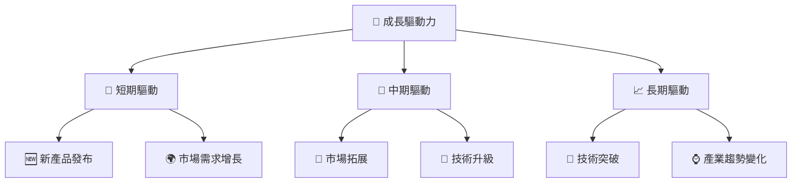

---

## 9. 風險矩陣

### 9.1 風險評分矩陣

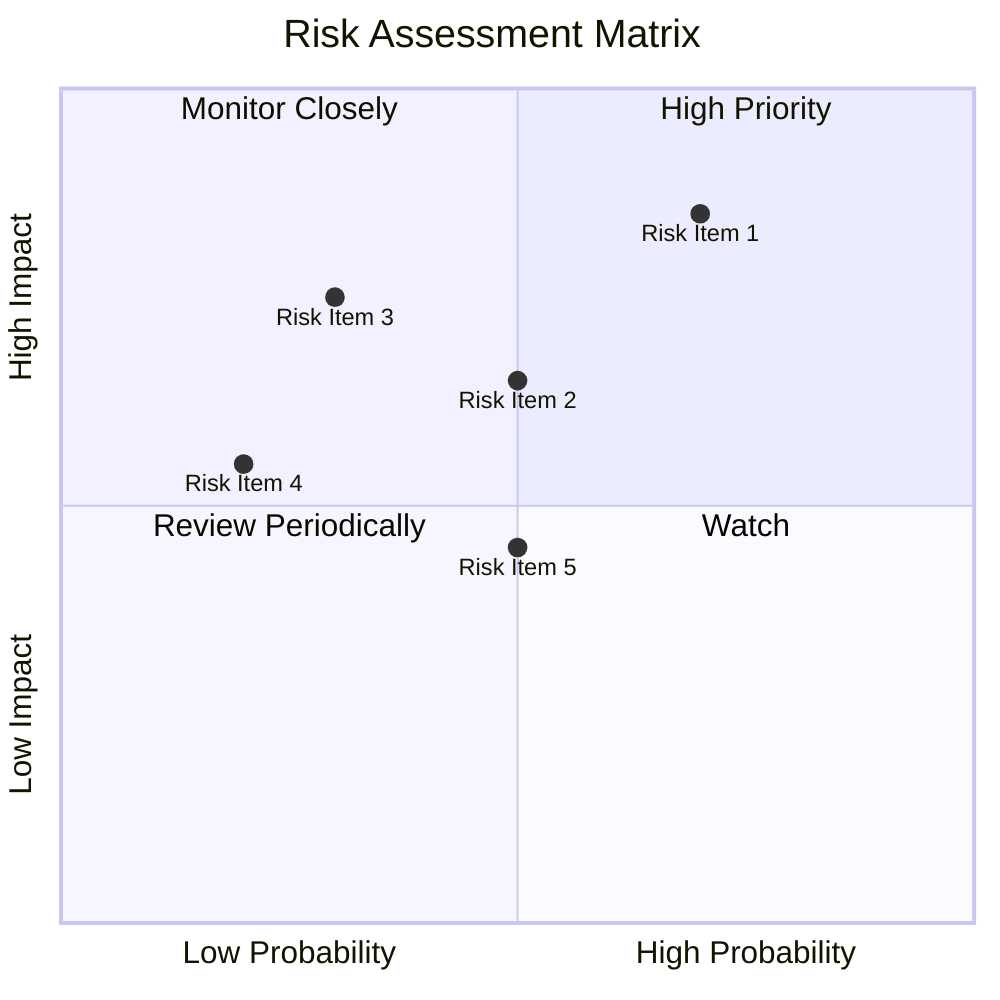

### 9.2 風險清單詳細分析

| # | 風險項目 | 發生機率 | 財務衝擊 | 風險評分 | 緩解措施 |
|---|----------|----------|----------|----------|----------|
| 1 | 🔴 **市場波動** | 高 (70%) | 高 (-20%收入) | 🔴 8.5/10 | 擴大產品多樣性，強化風險管理 |
| 2 | 🟡 **競爭壓力** | 中 (50%) | 中 (-10%收入) | 🟡 6.0/10 | 提升技術創新，擴大市場份額 |
| 3 | 🟡 **供應鏈風險** | 低 (30%) | 中 (-15%收入) | 🟡 5.5/10 | 加強供應鏈管理，增加多元化供應商 |

---

## 10. 投資建議

### 10.1 最終綜合評級雷達圖

```
╔══════════════════════════════════════════════════════════════════╗
║                   NVIDIA 綜合評級雷達圖                         ║
╠══════════════════════════════════════════════════════════════════╣
║                                                                  ║
║  基本面強度  9.0 ▓▓▓▓▓▓▓▓▓▓▓▓▓▓▓▓▓▓▓▓▓▓▓▓▓░░  ★★★★★           ║
║  成長動能    9.0 ▓▓▓▓▓▓▓▓▓▓▓▓▓▓▓▓▓▓▓▓▓▓▓▓▓░░  ★★★★★           ║
║  獲利品質   10.0 ▓▓▓▓▓▓▓▓▓▓▓▓▓▓▓▓▓▓▓▓▓▓▓▓▓▓▓  ★★★★★           ║
║  財務健康    8.0 ▓▓▓▓▓▓▓▓▓▓▓▓▓▓▓▓▓▓▓▓▓▓░░░░░░  ★★★★☆           ║
║  估值合理性  9.0 ▓▓▓▓▓▓▓▓▓▓▓▓▓▓▓▓▓▓▓▓▓▓▓▓▓░░  ★★★★★           ║
╚══════════════════════════════════════════════════════════════════╝
```

### 10.2 目標價與隱含報酬率

| 情境 | 目標價 | 隱含報酬率 | 機率權重 |
|------|--------|------------|----------|
| 🟢 樂觀 | $380 | +82.5% | 30% |
| 🟡 基準 | $268.61 | +28.9% | 50% |
| 🔴 悲觀 | $140 | -32.8% | 20% |

### 10.3 買入時機與觸發因素

```
╔══════════════════════════════════════════════════════════════════╗
║                  ✅ 買入觸發因素 Checklist                      ║
╠══════════════════════════════════════════════════════════════════╣
║                                                                  ║
║  立即買入觸發條件（多數符合）：                                  ║
║  ✅ 新產品發布成功                                               ║
║  ✅ 收入增長持續保持                                             ║
║  ✅ 毛利率穩定或提升                                             ║
║                                                                  ║
║  加碼觸發條件（出現以下任一）：                                  ║
║  ☐ 股價回調至合理估值區間以下                                   ║
║  ☐ 大宗訂單確認                                                 ║
║                                                                  ║
║  減碼/停損觸發條件（出現以下任一）：                             ║
║  ☐ 毛利率顯著下降                                               ║
║  ☐ 重大市場不利消息                                             ║
╚══════════════════════════════════════════════════════════════════╝
```

### 10.4 投資人適配度分析

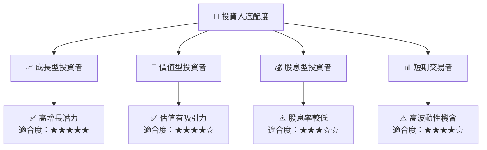

### 10.5 關鍵監控指標

| 監控類型 | 指標 | 關注點 | 頻率 |
|----------|------|--------|------|
| 財報分析 | 收入增長率 | 持續增長情況 | 季度 |
| 市場動態 | 新產品發布 | 市場反應 | 即時 |
| 技術創新 | 研發投入 | 技術領先地位 | 年度 |

---

> **免責聲明**：本報告為 AI 自動生成，僅供研究參考，不構成投資建議。投資有風險，入市需謹慎。