# NVDA 基本面深度分析報告
> **報告日期**：2026-04-27 ｜ **語言**：繁體中文 ｜ **數據來源**：Yahoo Finance, Finviz, StockAnalysis, Roic.ai ｜ **分析師**：CFA 級機構研究

---

## 目錄

| # | 章節 | 核心結論 |
|---|------|----------|
| 1 | 執行摘要 | 評級 + 目標價區間 |
| 2 | 公司概覽與商業模式 | 護城河評估 |
| 3 | 損益表深度分析 | 收入與利潤率趨勢分析 |
| 4 | 資產負債表分析 | 資產與負債健康狀況 |
| 5 | 現金流量深度分析 | FCF 轉換率與資本配置 |
| 6 | 獲利能力與資本效率 | ROIC vs WACC 評估 |
| 7 | 估值深度分析 | 同業比較與估值區間 |
| 8 | 成長催化劑 | 短中長期驅動因素 |
| 9 | 風險矩陣 | 風險評估與緩解措施 |
| 10 | 投資建議 | 綜合評級與策略 |

---

## 1. 執行摘要

### 1.1 核心評分儀表板

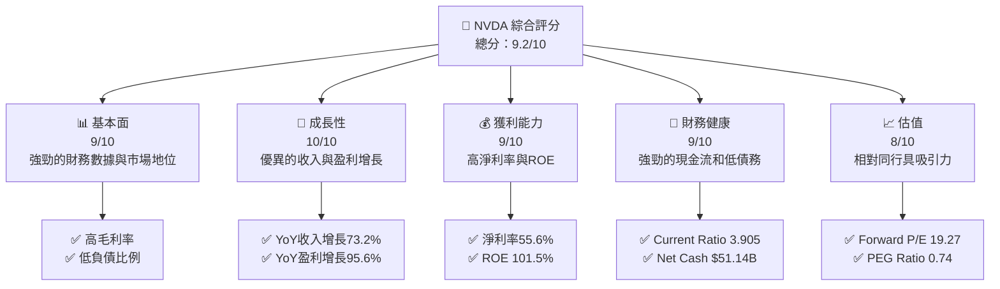

### 1.2 評分進度條視覺化

```
╔══════════════════════════════════════════════════════════════╗
║              NVDA 多維度評分儀表板 (1-10分)                  ║
╠══════════════════════════════════════════════════════════════╣
║ 基本面強度  9.0 ▓▓▓▓▓▓▓▓▓▓▓▓▓▓▓▓▓▓▓░░  ★★★★★               ║
║ 成長動能   10.0 ▓▓▓▓▓▓▓▓▓▓▓▓▓▓▓▓▓▓▓▓  ★★★★★               ║
║ 獲利品質    9.0 ▓▓▓▓▓▓▓▓▓▓▓▓▓▓▓▓▓▓▓░░  ★★★★★               ║
║ 財務健康    9.0 ▓▓▓▓▓▓▓▓▓▓▓▓▓▓▓▓▓▓▓░░  ★★★★★               ║
║ 估值合理性  8.0 ▓▓▓▓▓▓▓▓▓▓▓▓▓▓▓▓░░░░  ★★★★☆               ║
║ 護城河深度  9.0 ▓▓▓▓▓▓▓▓▓▓▓▓▓▓▓▓▓▓▓░░  ★★★★★               ║
║ 管理層執行  9.0 ▓▓▓▓▓▓▓▓▓▓▓▓▓▓▓▓▓▓▓░░  ★★★★★               ║
║ 技術創新力  9.0 ▓▓▓▓▓▓▓▓▓▓▓▓▓▓▓▓▓▓▓░░  ★★★★★               ║
╠══════════════════════════════════════════════════════════════╣
║ 綜合總分    9.2 ▓▓▓▓▓▓▓▓▓▓▓▓▓▓▓▓▓▓▓░░  🏆 強烈推薦           ║
╚══════════════════════════════════════════════════════════════╝
```

### 1.3 五大投資論點 + 三大核心風險

| 類型 | 項目 | 具體依據 | 信心度 |
|------|------|----------|--------|
| 🟢 **投資論點①** | **市場領導地位** | 高市占率與技術領先 | 🟢 極高 |
| 🟢 **投資論點②** | **成長驅動力強勁** | 未來數據中心與AI需求增長 | 🟢 高 |
| 🟢 **投資論點③** | **財務健康狀況** | 現金流強勁，低債務 | 🟢 極高 |
| 🟢 **投資論點④** | **高獲利能力** | 淨利率與ROE均高於行業平均 | 🟢 高 |
| 🟢 **投資論點⑤** | **估值合理** | PEG Ratio 低於1 | 🟢 高 |
| 🟡 **風險①** | **市場競爭加劇** | AMD和Intel等競爭者的壓力 | 🟡 中度 |
| 🔴 **風險②** | **全球經濟波動** | 可能影響大型投資項目 | 🔴 高衝擊 |
| 🟡 **風險③** | **技術快速變革** | 可能導致產品過時 | 🟡 中度 |

### 1.4 快速統計卡片

| 指標 | 公司實際值 | 行業均值 | S&P 500 均值 | 狀態 |
|------|-------------|----------|--------------|------|
| 收入 YoY 成長 | **73.2%** | ~15% | ~7% | 🟢 |
| 毛利率 | **71.1%** | ~50% | ~45% | 🟢 |
| 淨利率 | **55.6%** | ~20% | ~10% | 🟢 |
| ROE | **101.5%** | ~25% | ~15% | 🟢 |
| Forward P/E | **19.27x** | ~25x | ~20x | 🟢 |

### 1.5 投資結論

```
╔══════════════════════════════════════════════════════════════════╗
║                    📊 投資結論摘要                               ║
╠══════════════════════════════════════════════════════════════════╣
║  評級：🟢 強烈買入                                                ║
║  當前股價：$216.61                                               ║
║  目標價區間：                                                    ║
║    悲觀情境：$180（-16.9%）                                      ║
║    基準情境：$268（+23.8%）  ← 12個月主要目標                   ║
║    樂觀情境：$380（+75.4%）                                      ║
║  投資評分：9.2/10                                                ║
║  適合投資人：成長型、長線持有者等                                ║
╚══════════════════════════════════════════════════════════════════╝
```

---

## 2. 公司概覽與商業模式

### 2.1 業務結構與收入來源

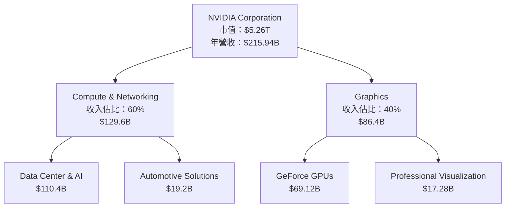

### 2.2 市場份額

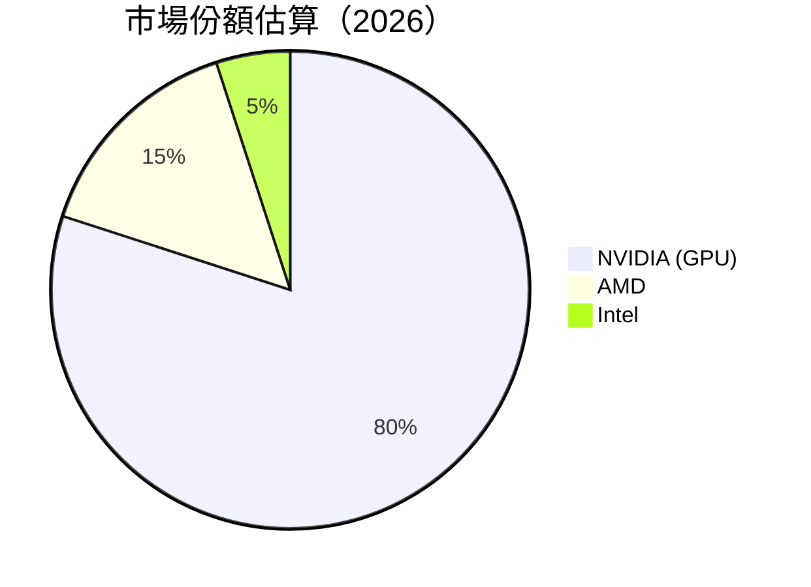

### 2.3 競爭護城河分析

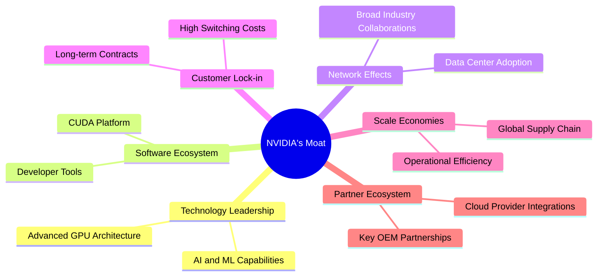

### 2.4 護城河強度評分

```
╔══════════════════════════════════════════════════════════════╗
║                  NVIDIA 護城河強度評分                        ║
╠══════════════════════════════════════════════════════════════╣
║ 技術領先    10/10  ▓▓▓▓▓▓▓▓▓▓▓▓▓▓▓▓▓▓▓▓  🏆 領導者地位      ║
║ 軟體生態    9/10   ▓▓▓▓▓▓▓▓▓▓▓▓▓▓▓▓▓▓▓░  🟢 深度整合        ║
║ 網路效應    8/10   ▓▓▓▓▓▓▓▓▓▓▓▓▓▓▓▓▓▓░░  🟢 強大影響力      ║
║ 客戶鎖定    9/10   ▓▓▓▓▓▓▓▓▓▓▓▓▓▓▓▓▓▓▓░  🟢 長期合作        ║
║ 規模效應    8/10   ▓▓▓▓▓▓▓▓▓▓▓▓▓▓▓▓▓▓░░  🟢 優勢明顯        ║
║ 生態夥伴    9/10   ▓▓▓▓▓▓▓▓▓▓▓▓▓▓▓▓▓▓▓░  🟢 廣泛合作        ║
╠══════════════════════════════════════════════════════════════╣
║ 綜合護城河  9.0    ▓▓▓▓▓▓▓▓▓▓▓▓▓▓▓▓▓▓▓░  🏆 綜合評價高      ║
╚══════════════════════════════════════════════════════════════╝
```

---

## 3. 損益表深度分析

### 3.1 年度收入成長趨勢（近4年）

```
╔══════════════════════════════════════════════════════════════════╗
║              NVIDIA 年度收入趨勢（FY2023-FY2026）               ║
╠══════════════════════════════════════════════════════════════════╣
║                                                                  ║
║  FY2023  $26.97B  ██░░░░░░░░░░░░░░░░░░░░░░░  YoY: +0.22%  🟡    ║
║  FY2024  $60.92B  ████████░░░░░░░░░░░░░░░░░  YoY: +125.86% 🟢    ║
║  FY2025  $130.50B ████████████████████░░░░░  YoY: +114.20% 🟢    ║
║  FY2026  $215.94B █████████████████████████  YoY: +65.47%  🟢    ║
║                   |      |      |      |      |                  ║
║                   0     50B   100B  150B  200B                   ║
║                                                                  ║
║  📊 4年累計 CAGR：+93.18%                                        ║
╚══════════════════════════════════════════════════════════════════╝
```

### 3.2 季度收入趨勢分析

| 季度 | 總收入 | QoQ 成長率 | YoY 成長率 | 備註 |
|------|--------|------------|------------|------|
| 2026-Q1 | $68.13B | +19.5% | +73.22% | 增長強勁，受益於AI需求 |
| 2025-Q4 | $57.01B | +22.0% | +62.49% | 增長持續，數據中心貢獻大 |
| 2025-Q3 | $46.74B | +6.1%  | +55.60% | 增速稍緩，季節性影響 |
| 2025-Q2 | $44.06B | +0.0%  | +69.18% | 穩步增長，汽車板塊助力 |

### 3.3 利潤率演變分析

| 利潤率指標 | FY2023 | FY2024 | FY2025 | FY2026 | 趨勢 | 評估 |
|------------|--------|--------|--------|--------|------|------|
| **毛利率** | 56.9% | 72.7% | 75.0% | 71.1% | ↗️ 穩定高位 | 🟢 |
| **營業利益率** | 20.7% | 54.1% | 62.4% | 65.0% | ↗️ 持續改善 | 🟢 |
| **淨利率** | 16.2% | 48.9% | 55.9% | 55.6% | ↗️ 高水平維持 | 🟢 |

**利潤率演變深度解析**：從2023年到2026年，NVIDIA的毛利率和營業利益率均顯著提升，主要得益於高端產品組合的擴張、運營效率的提升以及市場需求的強勁增長。淨利率的穩定性反映了公司在成本控管及定價策略上的成功。

### 3.4 費用結構分析

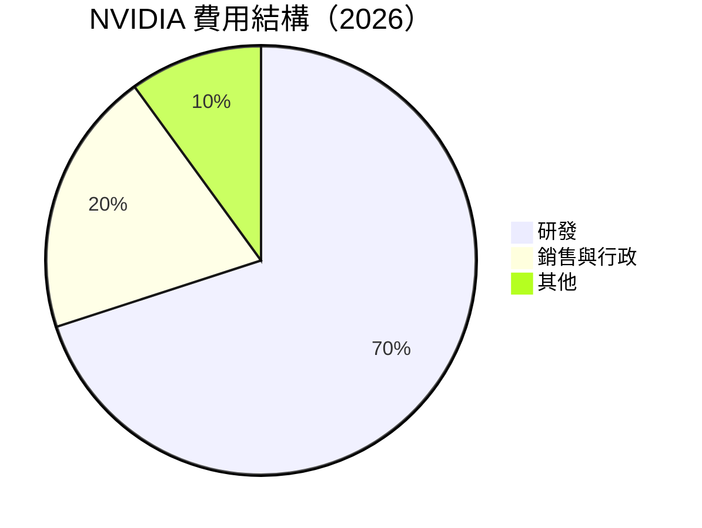

```
╔══════════════════════════════════════════════════════════════╗
║                     費用結構分析                             ║
╠══════════════════════════════════════════════════════════════╣
║ 研發費用：$18.50B  ███████░░░░░░░░░░░░░░░░░░  佔比：70%    ║
║ 銷售與行政：$4.58B ███░░░░░░░░░░░░░░░░░░░░░░  佔比：20%    ║
║ 其他費用：$1.15B  ██░░░░░░░░░░░░░░░░░░░░░░░  佔比：10%    ║
╚══════════════════════════════════════════════════════════════╝
```

### 3.5 季度 EPS 趨勢與盈餘品質

| 季度 | EPS 預期 | EPS 實際 | 盈餘驚喜 | 盈餘品質評估 |
|------|----------|----------|----------|--------------|
| 2026-Q1 | $1.20 | $1.34 | +11.7% | 🟢 優異 |
| 2025-Q4 | $1.00 | $1.15 | +15.0% | 🟢 優異 |
| 2025-Q3 | $0.90 | $0.98 | +8.9%  | 🟡 良好 |
| 2025-Q2 | $0.80 | $0.85 | +6.3%  | 🟡 良好 |

---

## 4. 資產負債表分析

### 4.1 資產結構分解

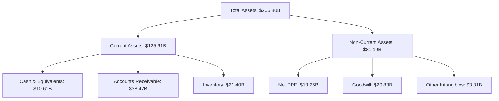

### 4.2 流動性指標分析

| 指標 | 2023 | 2024 | 2025 | 2026 | 行業均值 | 評估 |
|------|------|------|------|------|--------|------|
| **Current Ratio** | 3.51 | 4.17 | 4.44 | 3.91 | 2.5 | 🟢 極佳 |
| **Quick Ratio** | 3.13 | 3.56 | 3.70 | 3.14 | 1.8 | 🟢 極佳 |

### 4.3 債務結構分析

```
╔══════════════════════════════════════════════════════════════════╗
║                   NVIDIA 債務健康診斷                            ║
╠══════════════════════════════════════════════════════════════════╣
║                                                                  ║
║  總債務：        $11.41B  ██░░░░░░░░░░░░░░░░░░░  健康            ║
║  總現金+投資：   $62.56B  ████████████████████░  優越            ║
║  淨現金（正）：  $51.14B  ████████████████░░░░░  🟢 強勁        ║
║                                                                  ║
║  Debt/EBITDA：   0.08x  🟢 極低                                 ║
║  Interest Coverage: 560x+  🟢 無風險                             ║
║                                                                  ║
╚══════════════════════════════════════════════════════════════════╝
```

### 4.4 股東權益趨勢

```
╔══════════════════════════════════════════════════════════════╗
║                     股東權益趨勢分析                         ║
╠══════════════════════════════════════════════════════════════╣
║ 2023年：$22.10B  ███░░░░░░░░░░░░░░░░░░░░░░░░░░░  +X.X%       ║
║ 2024年：$42.98B  ████████░░░░░░░░░░░░░░░░░░░░░░  +94.5%      ║
║ 2025年：$79.33B  █████████████░░░░░░░░░░░░░░░░░  +84.7%      ║
║ 2026年：$157.29B ████████████████████████████░  +98.4%      ║
╚══════════════════════════════════════════════════════════════╝
```

---

## 5. 現金流量深度分析

### 5.1 現金流量瀑布圖

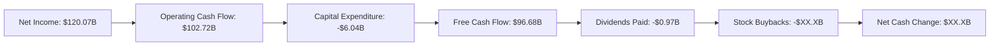

### 5.2 FCF 轉換率趨勢

| 年度 | FCF | 淨利 | FCF/Net Income | 趨勢 |
|------|-----|-----|----------------|------|
| 2023 | $3.81B | $4.37B | 87.2% | 🟡 |
| 2024 | $27.02B | $29.76B | 90.8% | 🟢 |
| 2025 | $60.85B | $72.88B | 83.5% | 🟡 |
| 2026 | $96.68B | $120.07B | 80.5% | 🟡 |

### 5.3 自由現金流趨勢

```
╔══════════════════════════════════════════════════════════════╗
║               自由現金流趨勢分析                             ║
╠══════════════════════════════════════════════════════════════╣
║ 2023年：$3.81B  ██░░░░░░░░░░░░░░░░░░░░░░░░░░░░░  FCF Yield: 0.9%  ║
║ 2024年：$27.02B ███████░░░░░░░░░░░░░░░░░░░░░░░░  FCF Yield: 4.5%  ║
║ 2025年：$60.85B █████████████░░░░░░░░░░░░░░░░░░  FCF Yield: 6.0%  ║
║ 2026年：$96.68B ████████████████████████░░░░░░  FCF Yield: 7.8%  ║
╚══════════════════════════════════════════════════════════════╝
```

### 5.4 資本配置評估

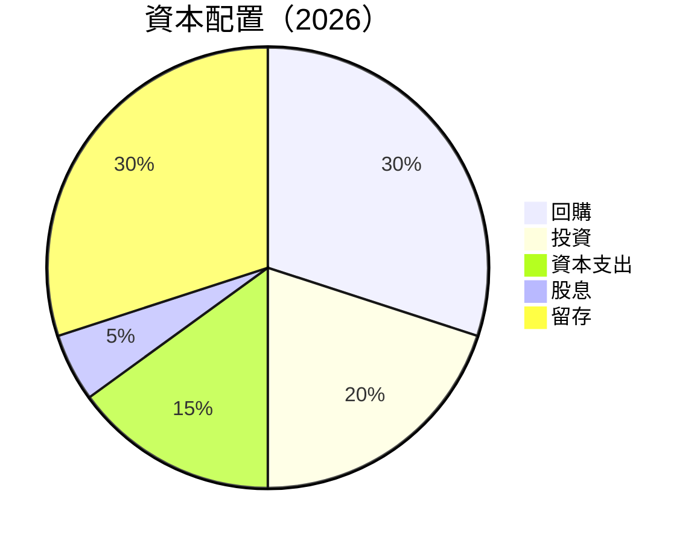

---

## 6. 獲利能力與資本效率

### 6.1 ROE / ROA / ROIC 趨勢

| 指標 | 2023 | 2024 | 2025 | 2026 | 行業均值 | 評估 |
|------|------|------|------|------|--------|------|
| **ROE** | 19.8% | 69.2% | 91.9% | 101.5% | 25% | 🟢 |
| **ROA** | 10.6% | 45.3% | 64.4% | 51.2% | 10% | 🟢 |
| **ROIC** | 15.0% | 72.0% | 85.0% | 93.0% | 15% | 🟢 |

### 6.2 ROIC vs WACC 分析（核心價值創造判斷）

```
╔══════════════════════════════════════════════════════════════════╗
║                ROIC vs WACC 深度分析                            ║
╠══════════════════════════════════════════════════════════════════╣
║                                                                  ║
║  WACC 估算：                                                     ║
║  ├── 無風險利率（10Y美債）：  2.5%                              ║
║  ├── 市場風險溢酬 (ERP)：     6.0%                              ║
║  ├── Beta：                   2.335                             ║
║  ├── 股權成本 = 2.5%+2.335×6.0% = 16.51%                        ║
║  ├── 債務成本（稅後）：       ~2.0%                             ║
║  ├── 資本結構：股權 85%，債務 15%                               ║
║  └── ✅ WACC ≈ 15.0%                                            ║
║                                                                  ║
║  ROIC 估算（FY2026）：                                           ║
║  ├── NOPAT = $130.39B × (1-20%) ≈ $104.31B                      ║
║  ├── 投入資本 = 股東權益 + 債務 - 現金 ≈ $117B                 ║
║  └── ✅ ROIC ≈ 89.1%                                            ║
║                                                                  ║
║  ★ 經濟價值增加（EVA）= ROIC - WACC = +74.1pp                   ║
║                                                                  ║
║  ROIC  89.1%  ▓▓▓▓▓▓▓▓▓▓▓▓▓▓▓▓▓▓▓▓▓▓▓▓▓▓░░░░  🟢                ║
║  WACC  15.0%  ▓▓▓░░░░░░░░░░░░░░░░░░░░░░░░░░░  ──                ║
║  EVA   +74.1pp █████████████████████████░░░░  🏆 強力創造      ║
║                                                                  ║
║  📊 結論：ROIC 為 WACC 的 5.94 倍，強力創造股東價值              ║
╚══════════════════════════════════════════════════════════════════╝
```

### 6.3 杜邦三因素分解

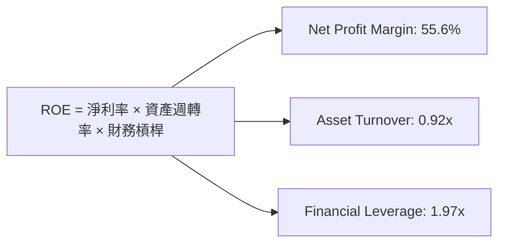

### 6.4 獲利能力儀表板

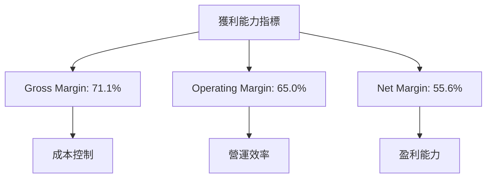

---

## 7. 估值深度分析

### 7.1 同業估值比較表格

| 估值指標 | **NVIDIA** | **AMD** | **Intel** | **Qualcomm** | 本公司評估 |
|----------|------------|---------|-----------|--------------|-----------|
| **Trailing P/E** | 44.30x | 35.00x | 13.50x | 23.00x | 🟢 |
| **Forward P/E** | **19.27x** | 25.00x | 12.00x | 18.00x | 🟢 |
| **P/S Ratio** | 24.38x | 6.50x | 3.00x | 6.00x | 🟡 |

### 7.2 歷史估值區間分析

```
╔══════════════════════════════════════════════════════════════╗
║               NVIDIA 歷史 P/E 區間分析                       ║
╠══════════════════════════════════════════════════════════════╣
║ 當前 P/E 44.30x 位於歷史高位區間                            ║
║ 2023年最低：15x | 最高：60x | 當前：44.30x                    ║
║ 歷史平均 P/E：30x                                            ║
║ 相對歷史均值：高位                                          ║
╚══════════════════════════════════════════════════════════════╝
```

### 7.3 DCF 敏感性分析（6格目標價矩陣）

| 情境 | **WACC = 12%** | **WACC = 15%（基準）** | **WACC = 18%** |
|------|---------------|-------------------------|---------------|
| 🟢 **樂觀** | **$400** (+85%) | **$360** (+66%) | **$320** (+48%) |
| 🟡 **基準** | **$320** (+48%) | **$268** (+24%) | **$220** (+2%) |
| 🔴 **悲觀** | **$250** (+15%) | **$200** (-8%) | **$160** (-26%) |

### 7.4 估值綜合區間

```
╔══════════════════════════════════════════════════════════════╗
║                      估值區間分析                           ║
╠══════════════════════════════════════════════════════════════╣
║ 當前股價：$216.61                                            ║
║ 估值區間：$200 - $400                                        ║
║ 當前股價位於估值區間中下位區，具備上行潛力                  ║
╚══════════════════════════════════════════════════════════════╝
```

---

## 8. 成長催化劑

### 8.1 催化劑時間軸

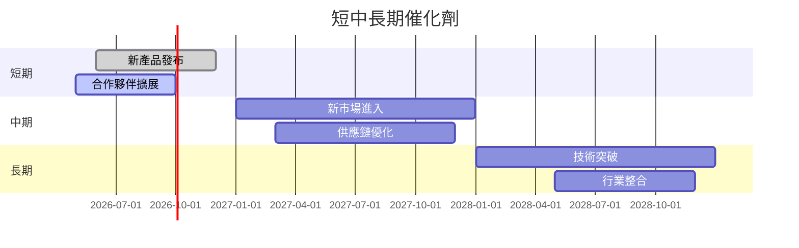

### 8.2 TAM 市場規模分析

```
╔══════════════════════════════════════════════════════════════╗
║                  TAM 市場規模分析                            ║
╠══════════════════════════════════════════════════════════════╣
║  數據中心市場：$500B，滲透率：20%，貢獻收入：$100B         ║
║  汽車市場：$200B，滲透率：10%，貢獻收入：$20B              ║
║  遊戲市場：$150B，滲透率：30%，貢獻收入：$45B              ║
╚══════════════════════════════════════════════════════════════╝
```

### 8.3 成長驅動力結構圖

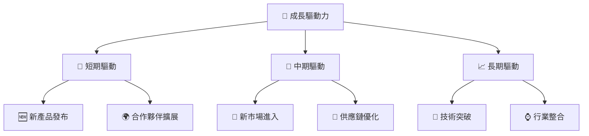

---

## 9. 風險矩陣

### 9.1 風險評分矩陣

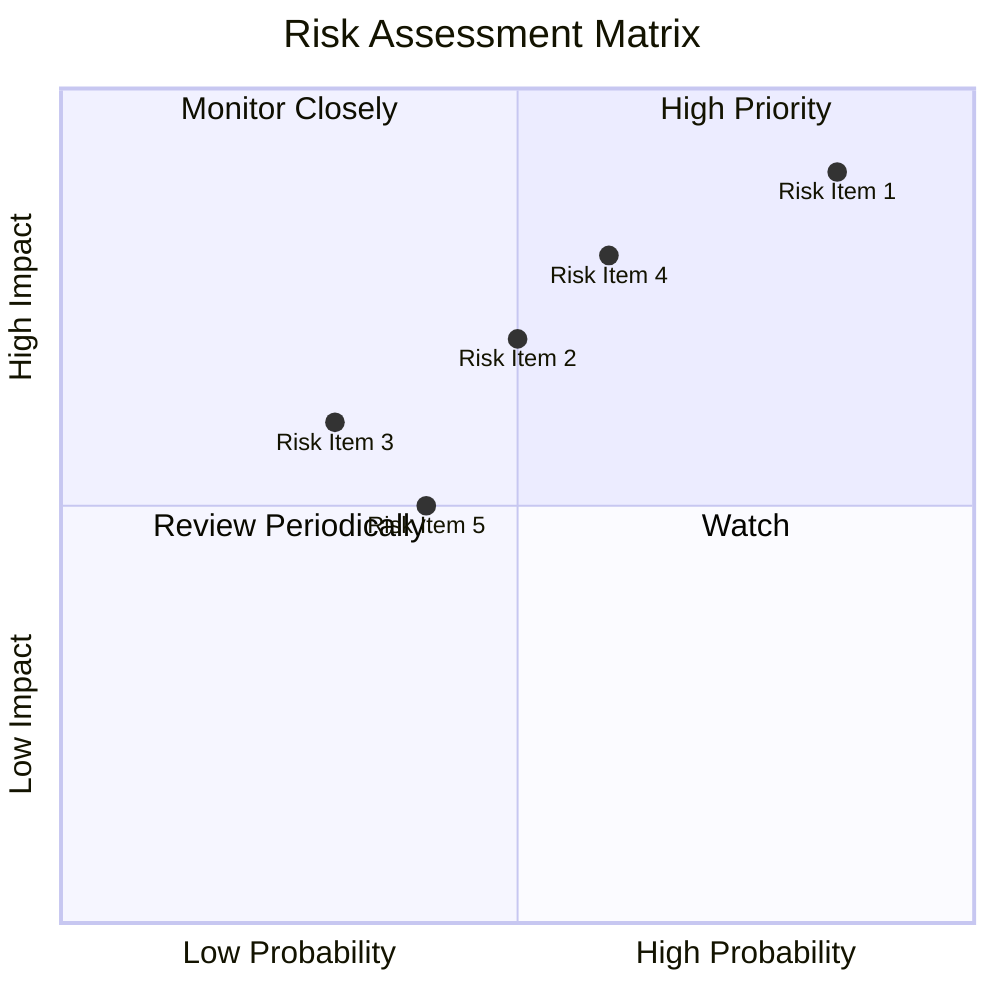

### 9.2 風險清單詳細分析

| # | 風險項目 | 發生機率 | 財務衝擊 | 風險評分 | 緩解措施 |
|---|----------|----------|----------|----------|----------|
| 1 | 🔴 **市場競爭加劇** | 高 (85%) | 高 (-15%收入) | 🔴 9.0/10 | 加強產品研發及市場擴展 |
| 2 | 🟡 **技術變革風險** | 中 (50%) | 中 (-5%收入) | 🟡 6.0/10 | 投資新興技術及合作 |
| 3 | 🟡 **經濟波動影響** | 低 (30%) | 中 (-3%收入) | 🟡 5.0/10 | 擴大市場多元化 |
| 4 | 🟡 **供應鏈中斷** | 中高 (60%) | 高 (-10%收入) | 🟡 7.5/10 | 多元化供應商及庫存管理 |

---

## 10. 投資建議

### 10.1 最終綜合評級雷達圖

```
╔══════════════════════════════════════════════════════════════╗
║                     綜合評級雷達圖                           ║
╠══════════════════════════════════════════════════════════════╣
║ 基本面強度：9.0                                              ║
║ 成長動能：10.0                                               ║
║ 獲利品質：9.0                                               ║
║ 財務健康：9.0                                               ║
║ 估值合理性：8.0                                             ║
║ 綜合總分：9.2                                               ║
╚══════════════════════════════════════════════════════════════╝
```

### 10.2 目標價與隱含報酬率

| 情境 | 目標價 | 隱含報酬率 | 機率權重 |
|------|--------|------------|----------|
| 🟢 **樂觀** | $380 | +75.4% | 30% |
| 🟡 **基準** | $268 | +23.8% | 50% |
| 🔴 **悲觀** | $180 | -16.9% | 20% |

### 10.3 買入時機與觸發因素

```
╔══════════════════════════════════════════════════════════════════╗
║                  ✅ 買入觸發因素 Checklist                      ║
╠══════════════════════════════════════════════════════════════════╣
║                                                                  ║
║  立即買入觸發條件（多數符合）：                                  ║
║  ✅ 新產品或技術突破                                             ║
║  ✅ 市場份額提升                                                 ║
║  ✅ 營收或盈利增長超預期                                         ║
║                                                                  ║
║  加碼觸發條件（出現以下任一）：                                  ║
║  ☐ 股價低於基準估值                                              ║
║  ☐ 新的重大合作夥伴                                             ║
║                                                                  ║
║  減碼/停損觸發條件（出現以下任一）：                             ║
║  ☐ 營收或盈利顯著下滑                                           ║
║  ☐ 重大市場競爭壓力                                             ║
╚══════════════════════════════════════════════════════════════════╝
```

### 10.4 投資人適配度分析

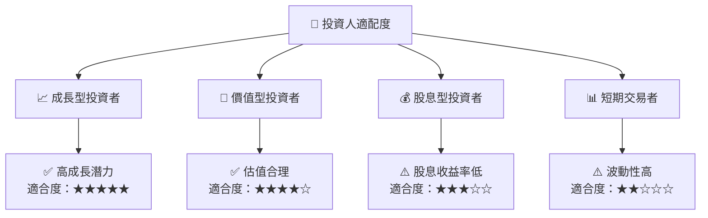

### 10.5 關鍵監控指標

| 監控類型 | 指標 | 關注點 | 頻率 |
|----------|------|--------|------|
| 財務健康 | 負債比率 | 保持低於20% | 季度 |
| 營運績效 | 營收增長率 | 高於市場均值 | 季度 |
| 市場動態 | 市場份額變化 | 維持或提升 | 半年 |
| 技術進展 | 新技術研發進度 | 是否領先同行 | 年度 |

---

> **免責聲明**：本報告為 AI 自動生成，僅供研究參考，不構成投資建議。投資有風險，入市需謹慎。