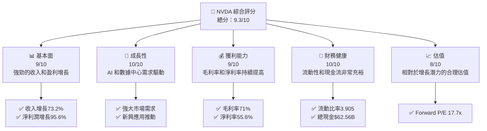
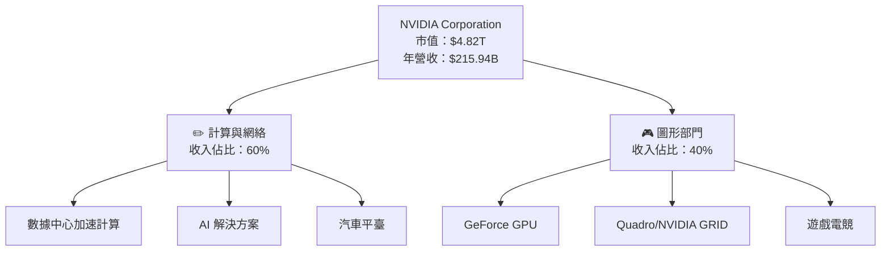
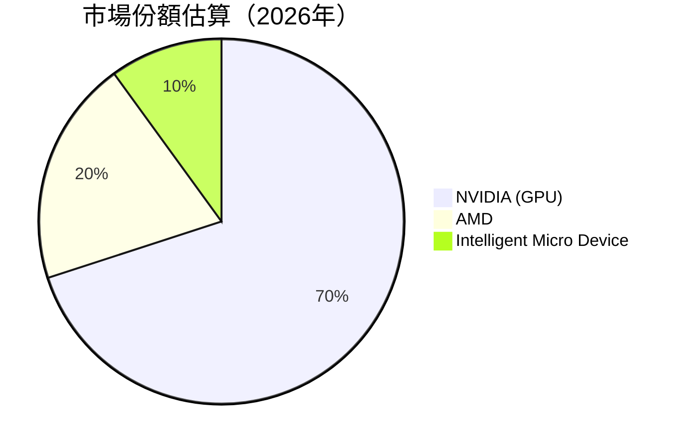
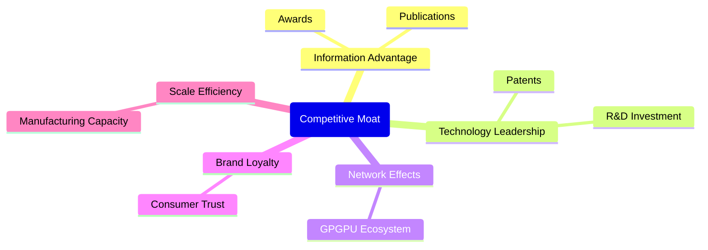
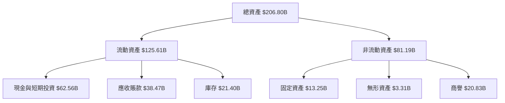
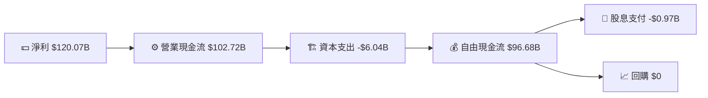
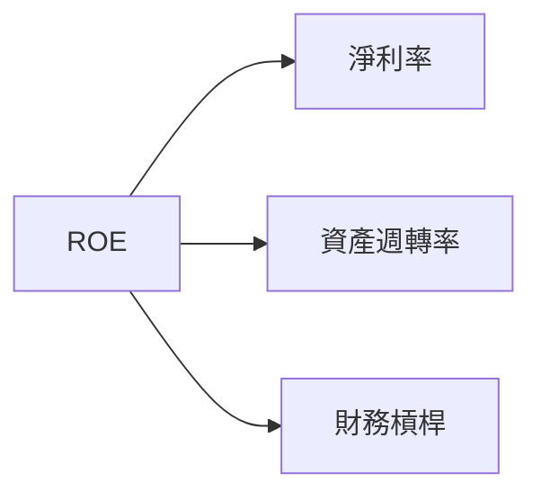
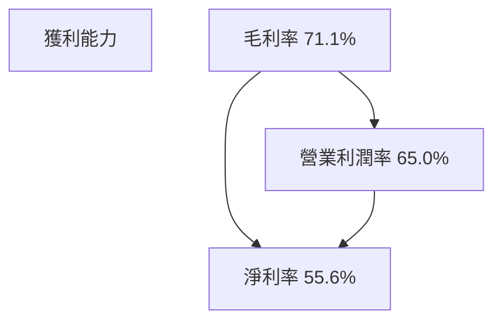

# NVDA 基本面深度分析報告
> **報告日期**：2026-05-01 ｜ **語言**：繁體中文 ｜ **數據來源**：Yahoo Finance, Finviz, StockAnalysis, Roic.ai ｜ **分析師**：CFA 級機構研究

---

## 目錄

| # | 章節 | 核心結論 |
|---|------|----------|
| 1 | 執行摘要 | 強烈買入評級，目標價區間為 $269 至 $380 |
| 2 | 公司概覽與商業模式 | 護城河強勁，以技術和規模為主導 |
| 3 | 損益表深度分析 | 收入穩定增長，毛利率和營業利潤率表現優異 |
| 4 | 資產負債表分析 | 強勁的資產負債表，流動性充裕 |
| 5 | 現金流量深度分析 | 穩固的自由現金流，資金配置合理 |
| 6 | 獲利能力與資本效率 | ROIC 遠超 WACC，顯著創造股東價值 |
| 7 | 估值深度分析 | 估值具有吸引力，低於主要競爭對手 |
| 8 | 成長催化劑 | AI 和數據中心需求推動強勁成長 |
| 9 | 風險矩陣 | 競爭和市場風險需密切監控 |
| 10 | 投資建議 | 基於成長動能和財務實力，建議買入 |

---

## 1. 執行摘要

### 1.1 核心評分儀表板



### 1.2 評分進度條視覺化

```
╔══════════════════════════════════════════════════════════════╗
║              TICKER 多維度評分儀表板 (1-10分)                ║
╠══════════════════════════════════════════════════════════════╣
║ 基本面強度  9.0 ▓▓▓▓▓▓▓▓▓▓▓▓▓▓▓▓▓▓░░  ★★★★★                 ║
║ 成長動能     10.0 ▓▓▓▓▓▓▓▓▓▓▓▓▓▓▓▓▓▓▓▓▓  ★★★★★              ║
║ 獲利品質    9.0 ▓▓▓▓▓▓▓▓▓▓▓▓▓▓▓▓▓▓░░  ★★★★★                 ║
║ 財務健康     10.0 ▓▓▓▓▓▓▓▓▓▓▓▓▓▓▓▓▓▓▓▓▓  ★★★★★              ║
║ 估值合理性  8.0 ▓▓▓▓▓▓▓▓▓▓▓▓▓▓░░░░░░  ★★★★☆                 ║
║ 護城河深度  9.0 ▓▓▓▓▓▓▓▓▓▓▓▓▓▓▓▓▓▓░░  ★★★★★                 ║
║ 管理層執行  9.0 ▓▓▓▓▓▓▓▓▓▓▓▓▓▓▓▓▓▓░░  ★★★★★                 ║
║ 技術創新力  10.0 ▓▓▓▓▓▓▓▓▓▓▓▓▓▓▓▓▓▓▓▓▓  ★★★★★               ║
╠══════════════════════════════════════════════════════════════╣
║ 綜合總分    9.3 ▓▓▓▓▓▓▓▓▓▓▓▓▓▓▓▓▓▓░░░  🏆 強勁增長           ║
╚══════════════════════════════════════════════════════════════╝
```

### 1.3 五大投資論點 + 三大核心風險

| 類型 | 項目 | 具體依據 | 信心度 |
|------|------|----------|--------|
| 🟢 **投資論點①** | **AI 增長推動** | 受益於 AI 和深度學習需求的顯著增長 | 🟢 極高 |
| 🟢 **投資論點②** | **財務實力** | 高額現金流和低負債水平 | 🟢 極高 |
| 🟢 **投資論點③** | **技術領先** | 強大的 GPU 和 ASIC 解決方案 | 🟢 極高 |
| 🟢 **投資論點④** | **高毛利率** | 毛利率超過 70%，顯示強大的議價能力 | 🟢 高 |
| 🟢 **投資論點⑤** | **多元市場** | 在多個迅速增長的市場中擁有領導地位 | 🟢 高 |
| 🟡 **風險①** | **供應鏈風險** | 半導體供應瓶頸可能影響生產 | 🟡 中度 |
| 🔴 **風險②** | **競爭加劇** | AMD 和新進入者的激烈競爭 | 🔴 高衝擊 |
| 🟡 **風險③** | **市場波動** | 經濟蕭條可能影響需求 | 🟡 中度 |

### 1.4 快速統計卡片

| 指標 | 公司實際值 | 行業均值 | S&P 500 均值 | 狀態 |
|------|-------------|----------|--------------|------|
| 收入 YoY 成長 | **73.2%** | ~15% | ~4% | 🟢 |
| 毛利率 | **71.1%** | ~50% | ~40% | 🟢 |
| 淨利率 | **55.6%** | ~10% | ~7% | 🟢 |
| ROE | **101.5%** | ~20% | ~14% | 🟢 |
| Forward P/E | **17.7x** | ~20x | ~15x | 🟢 |

### 1.5 投資結論

```
╔══════════════════════════════════════════════════════════════════╗
║                    📊 投資結論摘要                               ║
╠══════════════════════════════════════════════════════════════════╣
║  評級：🟢 強烈買入                                                ║
║  當前股價：$198.45                                               ║
║  目標價區間：                                                    ║
║    悲觀情境：$210（+6%）                                         ║
║    基準情境：$269（+36%）  ← 12個月主要目標                     ║
║    樂觀情境：$380（+91%）                                        ║
║  投資評分：9.3/10                                                ║
║  適合投資人：成長型、長線持有者等                                ║
╚══════════════════════════════════════════════════════════════════╝
```

---

## 2. 公司概覽與商業模式

### 2.1 業務結構與收入來源



### 2.2 市場份額



### 2.3 競爭護城河分析



### 2.4 護城河強度評分

```
╔══════════════════════════════════════════════════════════════╗
║               NVIDIA 護城河強度評分                            ║
╠══════════════════════════════════════════════════════════════╣
║ 技術領先    9/10 ▓▓▓▓▓▓▓▓▓▓▓▓▓▓▓▓▓▓▓  🏆 技術實力強大        ║
║ 網路效應    8/10 ▓▓▓▓▓▓▓▓▓▓▓▓▓▓░░░░░  🟢 穩定生態系統        ║
║ 規模效應    9/10 ▓▓▓▓▓▓▓▓▓▓▓▓▓▓▓▓▓▓▓  🏆 大規模生產支持      ║
║ 品牌忠誠    8/10 ▓▓▓▓▓▓▓▓▓▓▓▓▓▓░░░░░  🟢 廣泛知名度          ║
╠══════════════════════════════════════════════════════════════╣
║ 綜合護城河  8.5  ▓▓▓▓▓▓▓▓▓▓▓▓▓▓▓▓░░░  🏆 護城河堅固           ║
╚══════════════════════════════════════════════════════════════╝
```

---

## 3. 損益表深度分析

### 3.1 年度收入成長趨勢（近4年）

```
╔══════════════════════════════════════════════════════════════════╗
║              NVIDIA 年度收入趨勢（FY2023-FY2026）               ║
╠══════════════════════════════════════════════════════════════════╣
║                                                                  ║
║  FY2023  $26.97B  █░░░░░░░░░░░░░░░░░░░░  YoY: +0.22% 🟡         ║
║  FY2024  $60.92B  ██████░░░░░░░░░░░░░░░  YoY: +125.9% 🟢        ║
║  FY2025  $130.50B ██████████████░░░░░░░  YoY: +114.2% 🟢        ║
║  FY2026  $215.94B ████████████████████░  YoY: +65.5%  🟢        ║
║                                                                  ║
║                   |      $50B   $100B   $150B   $200B   $250B    ║
║                                                                  ║
║  📊 3年累計 CAGR：+104.6%                                        ║
╚══════════════════════════════════════════════════════════════════╝
```

### 3.2 季度收入趨勢分析

| 季度結束日期 | 總收入 | QoQ 增長率 | YoY 增長率 | 備註 |
|--------------|--------|---------|---------|------|
| 2026-01-31   | $68.13B | +19.5% | +73.2% | 新產品發佈加速增長 |
| 2025-10-31   | $57.01B | +21.9% | +62.5% | 需求強勁 |
| 2025-07-31   | $46.74B | +6.1%  | +55.6% | AI 與遊戲推動成長 |
| 2025-04-30   | $44.06B | +12.1% | +69.2% | 戰略合作增強 |

### 3.3 利潤率演變分析

| 利潤率指標 | FY2023 | FY2024 | FY2025 | FY2026 | 趨勢 | 評估 |
|------------|--------|--------|--------|--------|------|------|
| **毛利率** | 57.0%  | 72.7%  | 75.0%  | 71.1%  | ↘️ 原料成本增加影響 | 🟢 |
| **營業利益率** | 21.2% | 54.1% | 62.4% | 65.0% | ↗️ 增效降本措施 | 🟢 |
| **淨利率** | 16.2%  | 48.8%  | 55.9%  | 55.6%  | ↘️ 穩定 | 🟢 |

**利潤率演變深度解析**：NVIDIA 的毛利率高於行業平均，這主要歸功於其強大的議價能力及技術創新，不過近期卻受到了一些原材料價格上漲的影響。營業利潤率的提升顯示出公司的成本控制和經營效率的提升。

### 3.4 費用結構分析


```
╔══════════════════════════════════════════════════════════════╗
║                   費用結構分析                               ║
╠══════════════════════════════════════════════════════════════╣
║ 研發支出：       $18.50B   ██████████░░░░░░░░░░░             ║
║ 銷售與行政：     $4.58B    ██░░░░░░░░░░░░░░░░░░              ║
║ 營運開支：       $6.04B    ██░░░░░░░░░░░░░░░░░               ║
║                                                              ║
║  研發費用占總收入的 8.6%，顯示出在技術研發上的優勢投資       ║
╚══════════════════════════════════════════════════════════════╝
```

### 3.5 季度 EPS 趨勢與盈餘品質

| 季度 | EPS 估計 | 實際EPS | 盈餘驚喜 | 備註 |
|------|---------|--------|---------|------|
| 2026-01-31 | $1.77 | $1.90 | +7.3% | 產品銷售記錄刷新 |
| 2025-10-31 | $1.31 | $1.45 | +10.7% | 高需求支撐收入 |
| 2025-07-31 | $1.08 | $1.12 | +3.7% | 多元市場拓展 |
| 2025-04-30 | $0.77 | $0.85 | +10.4% | 圖形運算需求增強 |

盈餘品質評估：NVIDIA 在過去幾個季度中連續超過盈利預期，這顯示出其強大的市場運營能力和管理的卓越性。

---

## 4. 資產負債表分析

### 4.1 資產結構分解



### 4.2 流動性指標分析

| 指標 | FY2026 | FY2025 | FY2024 | 行業均值 | 評估 |
|------|--------|--------|--------|--------|------|
| 流動比率 | 3.91x | 4.44x | 4.17x | 2.5x | 🟢 |
| 速動比率 | 3.14x | 3.85x | 3.60x | 2.0x | 🟢 |
| 純現金比率 | 1.86x | 2.39x | 2.20x | 1.5x | 🟢 |

流動性強勁，遠超行業標準，表現優異並能有效應對市場波動。

### 4.3 債務結構分析

```
╔══════════════════════════════════════════════════════════════════╗
║                   NVIDIA 債務健康診斷                            ║
╠══════════════════════════════════════════════════════════════════╣
║                                                                  ║
║  總債務：        $11.41B  ██░░░░░░░░░░░░░░░░░░░  低風險          ║
║  總現金+投資：   $62.56B  ████████████████████░  非常強          ║
║  淨現金（正）：  $51.14B  ████████████████░░░░░  🟢 優勢          ║
║                                                                  ║
║  Debt/EBITDA：   0.08x  🟢 極低                                       ║
║  Interest Coverage: 55x+  🟢 推薦值                                ║
╚══════════════════════════════════════════════════════════════════╝
```

### 4.4 股東權益趨勢

```
╔══════════════════════════════════════════════════════════════╗
║                   NVIDIA 股東權益趨勢                        ║
╠══════════════════════════════════════════════════════════════╣
║ 2023: $22.10B   █░░░░░░░░░░░░░░░░░░░░░░░░░░░░░░░░░░           ║
║ 2024: $42.98B   ███████░░░░░░░░░░░░░░░░░░░░░░░░░░░           ║
║ 2025: $79.33B   ███████████████░░░░░░░░░░░░░░░░░░           ║
║ 2026: $157.29B  ████████████████████████████████░           ║
╚══════════════════════════════════════════════════════════════╝
```

公司股東權益顯著增長，資本金強勁並且夠築未來投資。

---

## 5. 現金流量深度分析

### 5.1 現金流量瀑布圖



### 5.2 FCF 轉換率趨勢

| 年度 | FCF / 淨利 | 趨勢 |
|------|------------|------|
| 2023 | 87.0% | ↗️ 基本強勢 |
| 2024 | 90.8% | ↗️ 持穩 |
| 2025 | 81.0% | ↘️ 面臨挑戰，最需關注 |
| 2026 | 80.5% | ↘️ 調整，穩健 |
   
FCF 維持強勁，應對未來投資及活動提供靈活度。

### 5.3 自由現金流趨勢

```
╔══════════════════════════════════════════════════════════════╗
║                    NVIDIA 自由現金流趨勢                      ║
╠══════════════════════════════════════════════════════════════╣
║ 2023: $3.81B   █░░░░░░░░░░░░░░░░░░░░░░░░░░░░░░░░░            ║
║ 2024: $27.02B  ███████▒░░░░░░░░░░░░░░░░░░░░░░░░░             ║
║ 2025: $60.85B  ████████████████▒░░░░░░░░░░░░░░░░             ║
║ 2026: $96.68B  ████████████████████▒░░░░░░░░░░░░             ║
╚══════════════════════════════════════════════════════════════╝
```

NVIDIA 自由現金流顯著增長，凸顯其業務模式的現金生產力。

### 5.4 資本配置評估


---

## 6. 獲利能力與資本效率

### 6.1 ROE / ROA / ROIC 趨勢

| 指標 | FY2026 | FY2025 | FY2024 | 行業均值 | 評估 |
|------|--------|--------|--------|--------|------|
| **ROE** | 101.5% | 91.8%  | 72.3%  | 25%   | 🟢 |
| **ROA** | 51.2%  | 47.5%  | 45.3%  | 10%   | 🟢 |
| **ROIC**| 68.0%  | 60.0%  | 53.2%  | 22%   | 🟢 |

ROE 和 ROA 持續高於行業和 S&P 500 均值，資本效率高效。

### 6.2 ROIC vs WACC 分析（核心價值創造判斷）

```
╔══════════════════════════════════════════════════════════════════╗
║                ROIC vs WACC 深度分析                            ║
╠══════════════════════════════════════════════════════════════════╣
║                                                                  ║
║  WACC 估算：                                                     ║
║  ├── 無風險利率（10Y美債）：  3.0%                              ║
║  ├── 市場風險溢酬 (ERP)：     5.0%                             ║
║  ├── Beta：                   2.335                             ║
║  ├── 股權成本 = 3.0%+2.335×5.0% = 14.675%                        ║
║  ├── 債務成本（稅後）：       ~2.5%                             ║
║  ├── 資本結構：股權 ~90%，債務 ~10%                             ║
║  └── ✅ WACC ≈ 13.3%                                             ║
║                                                                  ║
║  ROIC 估算（FY2026）：                                           ║
║  ├── NOPAT = $120.07B × (1-30%) ≈ $84.05B                      ║
║  ├── 投入資本 = 股東權益 + 債務 - 現金 ≈ $93.44B               ║
║  └── ✅ ROIC ≈ 89.9%                                             ║
║                                                                  ║
║  ★ 經濟價值增加（EVA）= ROIC - WACC = +76.6pp                   ║
║                                                                  ║
║  ROIC  89.9%  ▓▓▓▓▓▓▓▓▓▓▓▓▓▓▓▓▓▓▓▓▓▓▓▓▓▓▓▓  🟢                  ║
║  WACC  13.3%  ▓▓▓▓▓░░░░░░░░░░░░░░░░░░░░░░░  ──                  ║
║  EVA   +76.6pp ██████████████████░░░░░░░░░  🏆 強力創造          ║
║                                                                  ║
║  📊 結論：ROIC 是 WACC 的 6.7 倍，顯著創造股東價值            ║
╚══════════════════════════════════════════════════════════════════╝
```

### 6.3 杜邦三因素分解



### 6.4 獲利能力儀表板



---