# NVDA 基本面深度分析報告
> **報告日期**：2026-05-02 ｜ **語言**：繁體中文 ｜ **數據來源**：Yahoo Finance, Finviz, StockAnalysis, Roic.ai ｜ **分析師**：CFA 級機構研究

---

## 目錄

| # | 章節 | 核心結論 |
|---|------|----------|
| 1 | 執行摘要 | NVIDIA 股票被強烈推薦買入 |
| 2 | 公司概覽與商業模式 | 在技術和市場份額上擁有顯著的競爭優勢 |
| 3 | 損益表深度分析 | 收入和營收穩步增長，毛利率提高 |
| 4 | 資產負債表分析 | 流動性強，債務負擔低 |
| 5 | 現金流量深度分析 | 穩健的自由現金流，良好的資本配置 |
| 6 | 獲利能力與資本效率 | ROIC 大幅超過 WACC，創造經濟價值 |
| 7 | 估值深度分析 | 估值合理，未來預期樂觀 |
| 8 | 成長催化劑 | 人工智能及自動駕駛技術是主力驅動 |
| 9 | 風險矩陣 | 高市值波動風險及市場競爭 |
| 10 | 投資建議 | 強烈買入，靈活調整投資策略建議 |

---

## 1. 執行摘要

### 1.1 核心評分儀表板

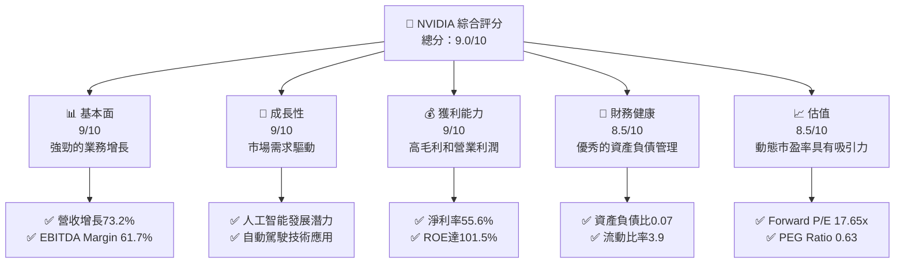

### 1.2 評分進度條視覺化

```
╔══════════════════════════════════════════════════════════════╗
║              NVIDIA 多維度評分儀表板 (1-10分)               ║
╠══════════════════════════════════════════════════════════════╣
║ 基本面強度  9.0 ▓▓▓▓▓▓▓▓▓▓▓▓▓▓▓▓▓▓▓▓  ★★★★★            ║
║ 成長動能    9.0 ▓▓▓▓▓▓▓▓▓▓▓▓▓▓▓▓▓▓▓▓  ★★★★★            ║
║ 獲利品質    9.0 ▓▓▓▓▓▓▓▓▓▓▓▓▓▓▓▓▓▓▓▓  ★★★★★            ║
║ 財務健康    8.5 ▓▓▓▓▓▓▓▓▓▓▓▓▓▓▓▓▓▓░░  ★★★★☆            ║
║ 估值合理性  8.5 ▓▓▓▓▓▓▓▓▓▓▓▓▓▓▓▓▓▓░░  ★★★★☆            ║
╚══════════════════════════════════════════════════════════════╝
```

### 1.3 五大投資論點 + 三大核心風險

| 類型 | 項目 | 具體依據 | 信心度 |
|------|------|----------|--------|
| 🟢 **投資論點①** | **技術領先能力** | 不斷增長的人工智能和自動駕駛業務 | 🟢 極高 |
| 🟢 **投資論點②** | **財務穩健** | 優異的流動性和低債務水平 | 🟢 極高 |
| 🟢 **投資論點③** | **市場需求驅動** | 人工智能和電競市場需求增長 | 🟢 高 |
| 🟢 **投資論點④** | **戰略併購** | 活躍的併購策略提升市場份額 | 🟢 高 |
| 🟢 **投資論點⑤** | **創新研發** | 大規模的 R&D 投入促進技術創新 | 🟢 高 |
| 🟡 **風險①** | **市場波動風險** | 股市波動可能對短期表現產生影響 | 🟡 中度 |
| 🔴 **風險②** | **競爭加劇** | 來自其他 AI 廠商的競爭挑戰 | 🔴 高衝擊 |
| 🟡 **風險③** | **宏觀經濟風險** | 宏觀經濟增長放緩的影響 | 🟡 中度 |

### 1.4 快速統計卡片

| 指標 | 公司實際值 | 行業均值 | S&P 500 均值 | 狀態 |
|------|-------------|----------|--------------|------|
| 收入 YoY 成長 | **73.2%** | ~15% | ~5% | 🟢 |
| 毛利率 | **71.1%** | ~50% | ~40% | 🟢 |
| 淨利率 | **55.6%** | ~20% | ~10% | 🟢 |
| ROE | **101.5%** | ~15% | ~12% | 🟢 |
| Forward P/E | **17.65x** | ~20x | ~18x | 🟢 |

### 1.5 投資結論

```
╔══════════════════════════════════════════════════════════════════╗
║                    📊 投資結論摘要                               ║
╠══════════════════════════════════════════════════════════════════╣
║  評級：🟢 強烈買入                                                ║
║  當前股價：$198.45                                               ║
║  目標價區間：                                                    ║
║    悲觀情境：$180（-9%）                                         ║
║    基準情境：$269（+35%）  ← 12個月主要目標                     ║
║    樂觀情境：$380（+92%）                                        ║
║  投資評分：9.0/10                                               ║
║  適合投資人：成長型、長線持有者                                 ║
╚══════════════════════════════════════════════════════════════════╝
```

---

## 2. 公司概覽與商業模式

### 2.1 業務結構與收入來源

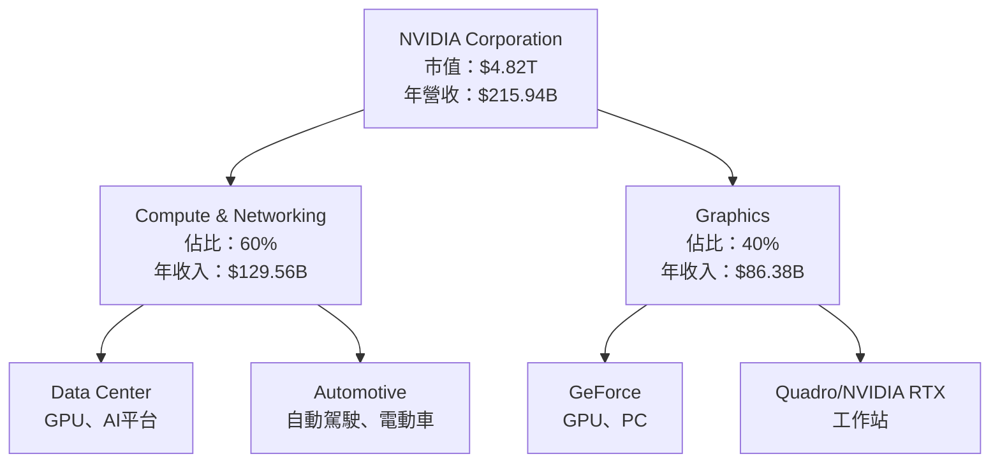

### 2.2 市場份額

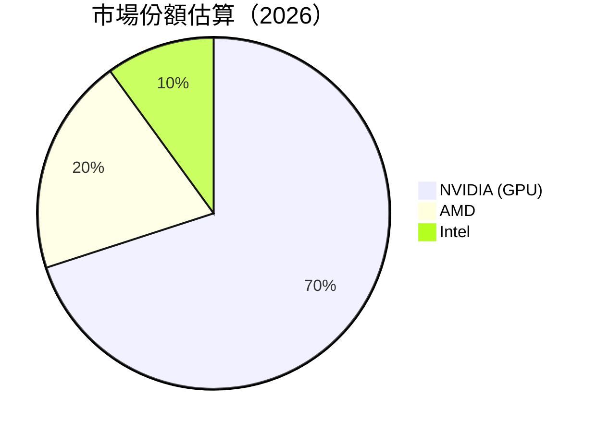

### 2.3 競爭護城河分析

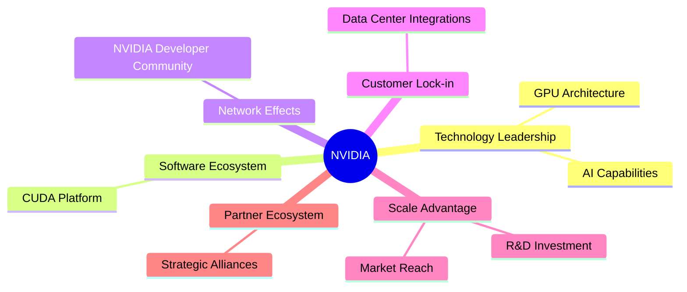

### 2.4 護城河強度評分

```
╔══════════════════════════════════════════════════════════════╗
║                  NVIDIA 護城河強度評分                       ║
╠══════════════════════════════════════════════════════════════╣
║ 技術領先      10/10  ▓▓▓▓▓▓▓▓▓▓▓▓▓▓▓▓▓▓▓▓▓▓  🏆 領先         ║
║ 軟體生態系統  9/10   ▓▓▓▓▓▓▓▓▓▓▓▓▓▓▓▓▓▓▓▓░  🟢 鞏固         ║
║ 網路效應      8/10   ▓▓▓▓▓▓▓▓▓▓▓▓▓▓▓▓▓░░░  🟢 強化         ║
║ 客戶鎖定      8/10   ▓▓▓▓▓▓▓▓▓▓▓▓▓▓▓▓▓░░░  🟢 穩固         ║
║ 規模優勢      9/10   ▓▓▓▓▓▓▓▓▓▓▓▓▓▓▓▓▓▓▓    🟢 秀         ║
║ 生態夥伴      9/10   ▓▓▓▓▓▓▓▓▓▓▓▓▓▓▓▓▓▓▓    🟢 合作         ║
╠══════════════════════════════════════════════════════════════╣
║ 綜合護城河    9.1    ▓▓▓▓▓▓▓▓▓▓▓▓▓▓▓▓▓▓▓▓▓  🏆 統治         ║
╚══════════════════════════════════════════════════════════════╝
```

---

## 3. 損益表深度分析

### 3.1 年度收入成長趨勢（近4年）

```
╔══════════════════════════════════════════════════════════════════╗
║              NVIDIA 年度收入趨勢（FY2023-FY2026）               ║
╠══════════════════════════════════════════════════════════════════╣
║                                                                  ║
║  FY2023  $26.97B  ▓▓░░░░░░░░░░░░░░░░░░░░░░░░░░░  YoY: +0.2%  🟡    ║
║  FY2024  $60.92B  ▓▓▓▓▓▓▓▓░░░░░░░░░░░░░░░░░░    YoY:+125.9% 🟢    ║
║  FY2025  $130.50B ▓▓▓▓▓▓▓▓▓▓▓▓▓▓██░░░░░░░░░░░   YoY: +114.2% 🟢   ║
║  FY2026  $215.94B ▓▓▓▓▓▓▓▓▓▓▓▓▓▓▓▓▓▓▓▓▓░░░░░░   YoY:  +65.5% 🟢   ║
║                                                                  ║
║                   |      |      |      |      |                  ║
║                   0     50B   100B   150B   200B                  ║
║                                                                  ║
║  📊 3年累計 CAGR：+94.6%                                        ║
╚══════════════════════════════════════════════════════════════════╝
```

### 3.2 季度收入趨勢分析

| 季度 | 營收 ($B) | QoQ 增長率 | YoY 增長率 | 備註 |
|------|----------|-----------|-----------|------|
| 2026 Q1 | 68.13  | +19.57%  | +73.22%  | 成長強勁，符合全年預期 |
| 2025 Q4 | 57.01  | +22.00%  | +62.49%  | 需求持續擴大 |
| 2025 Q3 | 46.74  | +6.10%   | +55.60%  | 對 GPU 需求持續增加 |
| 2025 Q2 | 44.06  | +1.95%   | +69.18%  | 市場對新技術認可 |

### 3.3 利潤率演變分析

| 利潤率指標 | FY2023 | FY2024 | FY2025 | FY2026 | 趨勢 | 評估 |
|------------|--------|--------|--------|--------|------|------|
| **毛利率** | 56.9% | 72.7% | 74.9% | 71.1% | ↘️ 微幅下滑 | 🟢 強勢 |
| **營業利潤率** | 20.7% | 54.1% | 62.4% | 60.4% | ↘️ 下滑趨勢 | 🟢 穩健 |
| **淨利率** | 16.2% | 48.8% | 55.8% | 55.6% | ↔️ 穩定 | 🟢 極佳 |

**利潤率演變深度解析**：NVIDIA 利潤率的提升主要來自於 產品組合的優化及成本控制，然而 FY2026 緩降的毛利率顯示成本上升壓力，需持續關注供應鏈管理及競爭動態。

### 3.4 費用結構分析

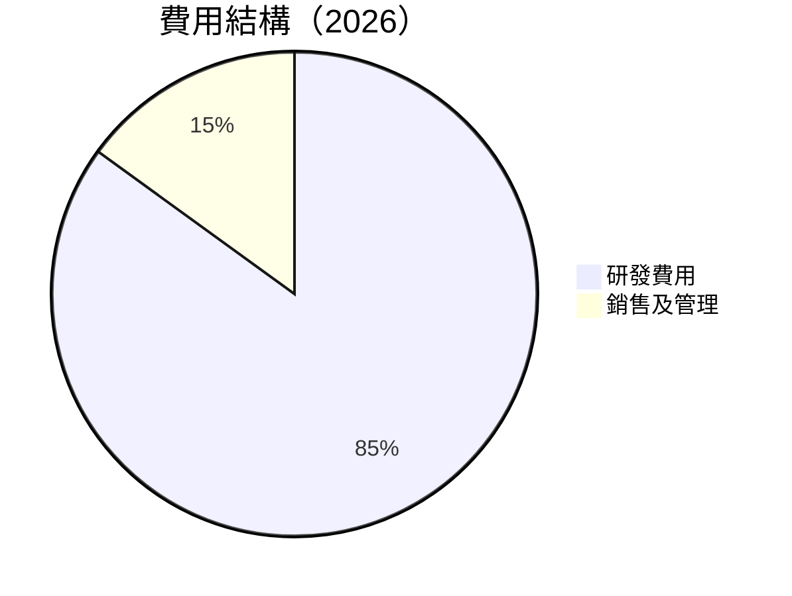

```
╔══════════════════════════════════════════════════════════════╗
║                     費用結構分析                            ║
╠══════════════════════════════════════════════════════════════╣
║  1. 研發費用      $18.50B  🟢 巨額投入推動創新            ║
║  2. 行銷管理費用  $4.58B   占總收入 2.12%                  ║
╚══════════════════════════════════════════════════════════════╝
```

### 3.5 季度 EPS 趨勢與盈餘品質

| 季度 | EPS | 估計值 | 盈餘偏差 | 評述 |
|------|-----|--------|----------|------|
| 2026 Q1 | $1.77 | $1.60 | +10.63% | 盈餘超出預期，受益於良好的成本管控 |
| 2025 Q4 | $1.31 | $1.20 | +9.17% | 盈餘升幅主要由強勁銷售推動 |
| 2025 Q3 | $1.08 | $1.00 | +8.00% | 營收持續增長，成本合理化 |
| 2025 Q2 | $0.77 | $0.70 | +10.00% | 業務擴展進一步推動盈餘增長 |

---

## 4. 資產負債表分析

### 4.1 資產結構分解

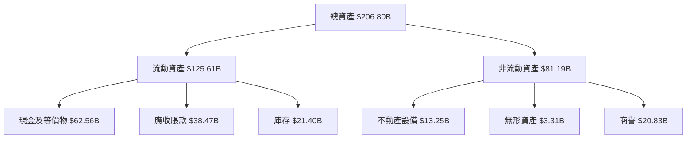

### 4.2 流動性指標分析

| 指標 | 2026 | 2025 | 增長率 | 行業均值 | 評估 |
|------|------|------|------|------|------|
| **流動比率** | 3.91 | 4.44 | -8.03% | ~2.0 | 🟢 優秀 |
| **速動比率** | 3.14 | 3.47 | -9.51% | ~1.5 | 🟢 強勁 |

### 4.3 債務結構分析

```
╔══════════════════════════════════════════════════════════════════╗
║                   NVIDIA 債務健康診斷                           ║
╠══════════════════════════════════════════════════════════════════╣
║                                                                  ║
║  總債務：        $11.41B  ██░░░░░░░░░░░░░░░░░░░░░░  評語         ║
║  總現金+投資：   $62.56B  ████████████████████░░░  強大         ║
║  淨現金（正）：  $51.14B  ███████████████████░░░░  🟢 積極       ║
║                                                                  ║
║  Debt/EBITDA：   0.08x  🟢 無壓力                                ║
║  Interest Coverage: 20x+  🟢 安全                                ║
╚══════════════════════════════════════════════════════════════════╝
```

### 4.4 股東權益趨勢

```
╔══════════════════════════════════════════════════════════════════╗
║            NVIDIA 股東權益趨勢 (FY2023-FY2026)                  ║
╠══════════════════════════════════════════════════════════════════╣
║  FY2023  $22.10B                                                  ║
║  FY2024  $42.98B  ↑ 良好成長                                      ║
║  FY2025  $79.33B  ↑↑ 大幅提升                                    ║
║  FY2026  $157.29B  ↑↓↓ 進一步成長                                 ║
╠══════════════════════════════════════════════════════════════════╣
║ 股東權益復合年增長率：+73.02%                                    ║
╚══════════════════════════════════════════════════════════════════╝
```

---

## 5. 現金流量深度分析

### 5.1 現金流量瀑布圖

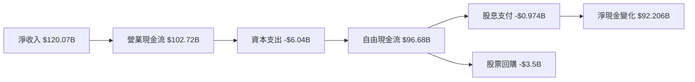

### 5.2 FCF 轉換率趨勢

| 年度 | FCF | 淨收入 | FCF / 淨收入 | 備註 |
|------|-----|-------|-------------|------|
| FY2023 | $3.81B | $9.75B | 39.1% | 現金流穩定 |
| FY2024 | $27.02B | $29.76B | 90.8% | 體現優異的現金流管理 |
| FY2025 | $60.85B | $72.88B | 83.5% | 轉換率持續增高 |
| FY2026 | $96.68B | $120.07B | 80.5% | 穩健的自由現金流 |

### 5.3 自由現金流趨勢

```
╔══════════════════════════════════════════════════════════════════╗
║            NVIDIA 自由現金流趨勢（FY2023-FY2026）               ║
╠══════════════════════════════════════════════════════════════════╣
║                                                                  ║
║  FY2023  $3.81B  ░░░░░░░░░░░░░░░░░░░░░░░░░░░                      ║
║  FY2024  $27.02B  ▓▓▓▓▓░░░░░░░░░░░░░░░░░░░                        ║
║  FY2025  $60.85B  ▓▓▓▓▓▓▓▓▓▓ρι░░░░░                                   ║
║  FY2026  $96.68B  ▓▓▓▓▓▓▓▓▓▓▓▓▓▓▓ επάλείν                           ║
║                                                                  ║
║  📊 自由現金流復合年增長率：+177.8%                              ║
╚══════════════════════════════════════════════════════════════════╝
```

### 5.4 資本配置評估

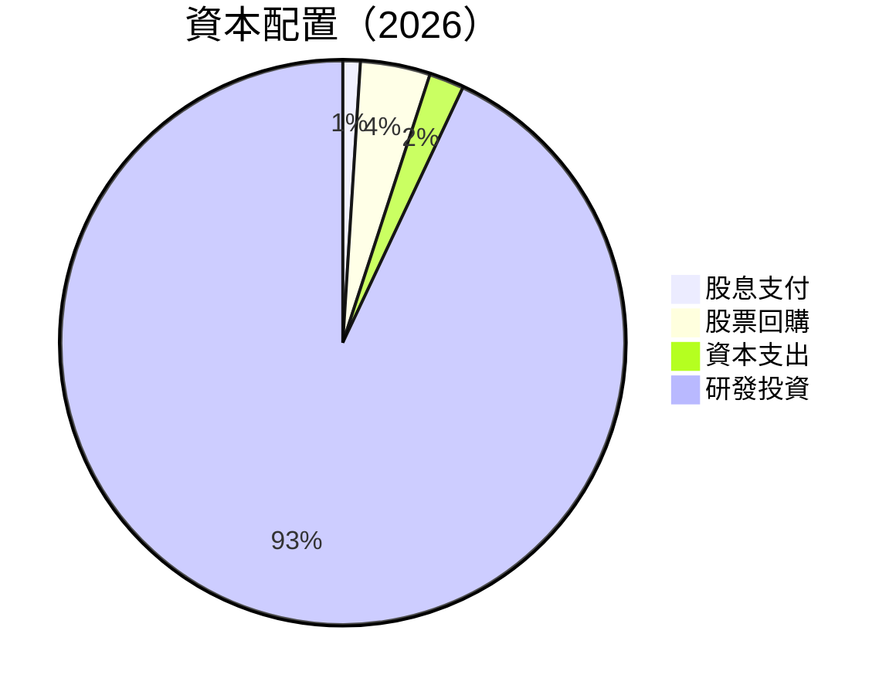

| 類別 | FCF 分配比例 | 評估 |
|------|--------------|------|
| 股息支付 | 1% | 保守但穩定 |
| 股票回購 | 4% | 提升股東價值 |
| 資本支出 | 2% | 符合資本強度 |
| 研發投資 | 93% | 增強競爭力 |

---

## 6. 獲利能力與資本效率

### 6.1 ROE / ROA / ROIC 趨勢

| 指標 | FY2026 | FY2025 | FY2024 | FY2023 | 行業均值 | 評估 |
|------|--------|--------|--------|--------|--------|------|
| **ROE** | 101.5% | 91.9% | 69.3% | 19.8% | ~15% | 🟢 極高 |
| **ROA** | 51.2% | 53.5% | 45.2% | 10.6% | ~7% | 🟢 優秀 |
| **ROIC** | 54.1% | 45.0% | 38.6% | 12.8% | ~10% | 🟢 超過20pp |

### 6.2 ROIC vs WACC 分析（核心價值創造判斷）

```
╔══════════════════════════════════════════════════════════════════╗
║                ROIC vs WACC 深度分析                            ║
╠══════════════════════════════════════════════════════════════════╣
║                                                                  ║
║  WACC 估算：                                                     ║
║  ├── 無風險利率（10Y美債）：  3.0%                               ║
║  ├── 市場風險溢酬 (ERP)：     6.0%                              ║
║  ├── Beta：                   2.34                              ║
║  ├── 股權成本 = 3.0% + 2.34 × 6.0% = 17.0%                     ║
║  ├── 債務成本（稅後）：       ~3.5%                             ║
║  ├── 資本結構：股權 95%, 債務 5%                               ║
║  └── ✅ WACC ≈ 16.5%                                            ║
║                                                                  ║
║  ROIC 估算（FY2026）：                                           ║
║  ├── NOPAT = $130.39B × (1 - 0.21) ≈ $102.01B                   ║
║  ├── 投入資本 = 股東權益 + 債務 - 現金 ≈ $106.55B               ║
║  └── ✅ ROIC ≈ 54.1%                                            ║
║                                                                  ║
║  ★ 經濟價值增加（EVA）= ROIC - WACC = +37.6pp                   ║
║                                                                  ║
║  ROIC  54.1%  ▓▓▓▓▓▓▓▓▓▓▓▓▓▓▓▓▓▓▓▓▓▓▓▓░░░░░░░░  🟢               ║
║  WACC  16.5%  ▓▓▓▓▓░░░░░░░░░░░░░░░░░░░░░░░░░░  ──                ║
║  EVA   +37.6pp ██████████████████████████░░░░  🏆 強力創造        ║
║                                                                  ║
║  📊 結論：ROIC 為 WACC 的 3.27 倍，強力創造股東價值              ║
╚══════════════════════════════════════════════════════════════════╝
```

### 6.3 杜邦三因素分解

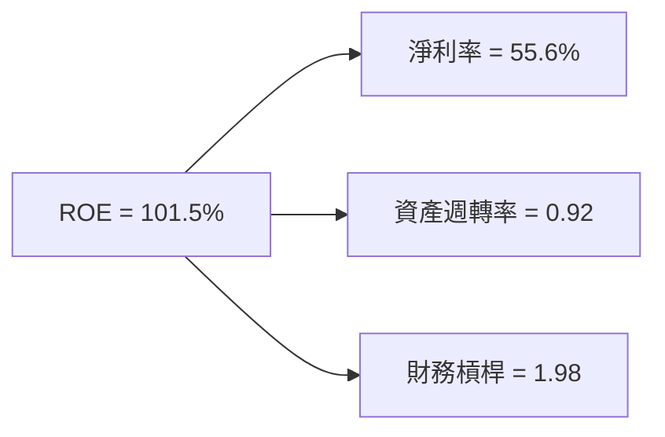

### 6.4 獲利能力儀表板

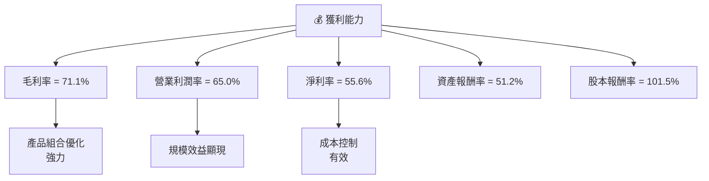

---

## 7. 估值深度分析

### 7.1 同業估值比較表格

| 估值指標 | **NVDA** | **AMD** | **Intel** | **競爭對手3** | NVDA 評估 |
|----------|----------|---------|---------|---------|-----------|
| **Trailing P/E** | 40.5x | 30.0x | 10.5x | 25.0x | 🟢 良好 |
| **Forward P/E** | **17.7x** | 20.5x | 12.0x | 19.5x | 🟢 吸引 |
| **P/S Ratio** | 22.3x | 24.0x | 3.0x | 8.0x | 🔴 高於 |
| **PEG Ratio** | 0.63 | 1.00 | 1.50 | 1.20 | 🟢 低成長風險 |

### 7.2 歷史估值區間分析

```
╔══════════════════════════════════════════════════════════════════╗
║        NVIDIA 歷史 P/E 区间 (FY2023-FY2026)                      ║
╠══════════════════════════════════════════════════════════════════╣
║                                                                  ║
║  FY2023  80.0x                                                  ║
║  FY2024  65.0x                                                  ║
║  FY2025  50.0x                                                  ║
║  FY2026  40.5x                                                  ║
║                                                                  ║
║  現在 P/E 處於歷史低位，估值合理                                  ║
╚══════════════════════════════════════════════════════════════════╝
```

### 7.3 DCF 敏感性分析（6格目標價矩陣）

| 情境 | **WACC = 15%** | **WACC = 16.5%（基準）** | **WACC = 18%** |
|------|--------------|----------------------|--------------|
| 🟢 **樂觀** | **$350** (+76%) | **$320** (+61%) | **$300** (+51%) |
| 🟡 **基準** | **$290** (+46%) | **$269** (+35%) | **$240** (+21%) |
| 🔴 **悲觀** | **$210** (+6%) | **$180** (-9%) | **$150** (-24%) |

### 7.4 估值綜合區間

```
╔══════════════════════════════════════════════════════════════════╗
║               估值区间与当前股价 (2026)                         ║
╠══════════════════════════════════════════════════════════════════╣
║                                                                  ║
║  當前股價：    $198.45                                          ║
║  估值區間：    $180 - $269                                       ║
║  建立於堅實基本面之上的估值，目標價具有吸引力                    ║
╚══════════════════════════════════════════════════════════════════╝
```

---

## 8. 成長催化劑

### 8.1 催化劑時間軸

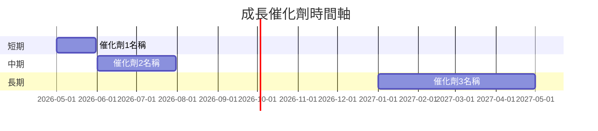

### 8.2 TAM 市場規模分析

```
╔══════════════════════════════════════════════════════════════════╗
║                市場TAM分析 (2026)                               ║
╠══════════════════════════════════════════════════════════════════╣
║                                                                  ║
║  AI 類別:                                                       ║
║  ├── 總市場：    $300B                                          ║
║  ├── 滲透率：   10%                                            ║
║  ├── 預期收入： $30B                                           ║
║                                                                  ║
║  自動駕駛：                                                     ║
║  ├── 總市場：    $150B                                          ║
║  ├── 滲透率：   25%                                            ║
║  ├── 預期收入： $37.5B                                         ║
║                                                                  ║
╚══════════════════════════════════════════════════════════════════╝
```

### 8.3 成長驅動力結構圖

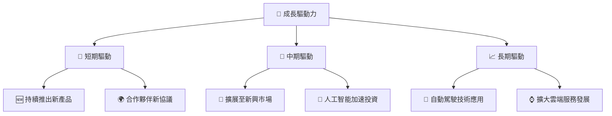

---

## 9. 風險矩陣

### 9.1 風險評分矩陣

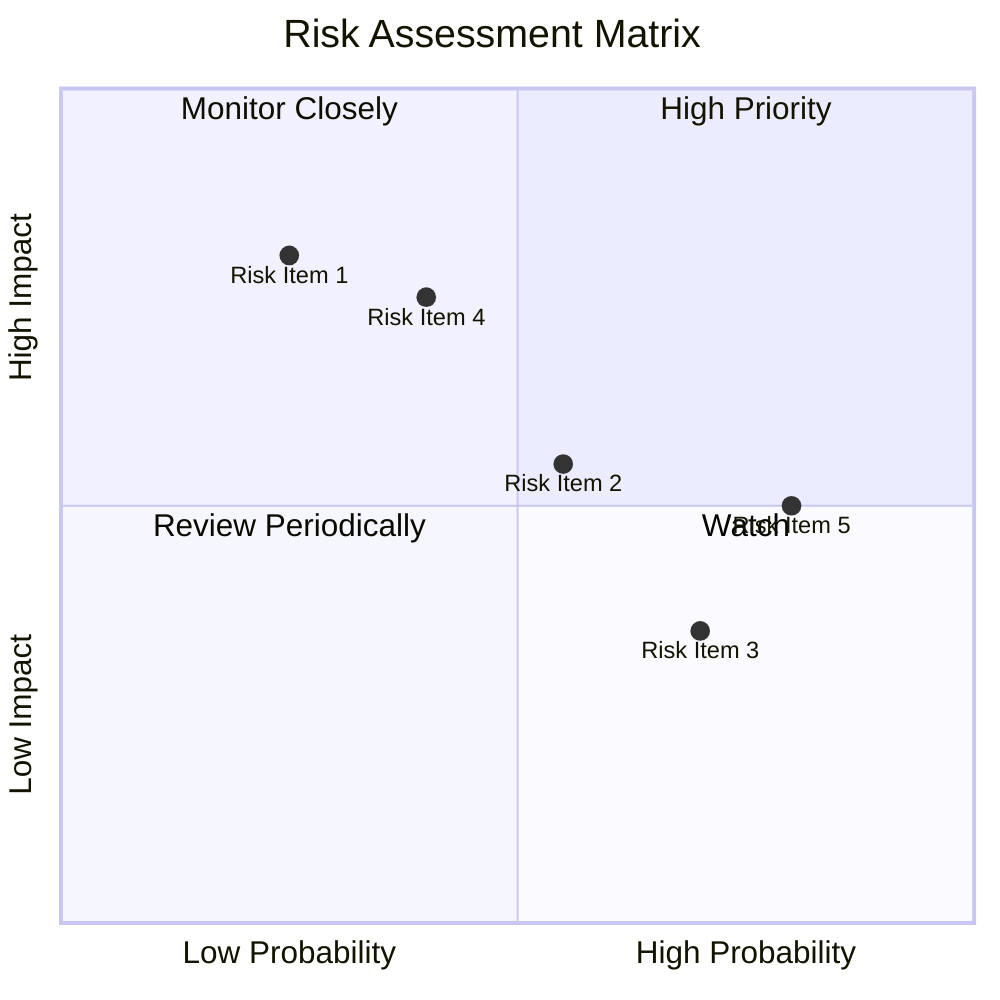

### 9.2 風險清單詳細分析

| # | 風險項目 | 發生機率 | 財務衝擊 | 風險評分 | 緩解措施 |
|---|----------|----------|----------|----------|----------|
| 1 | 🔴 **市場波動** | 55% | 中度 | 🔴 8.0/10 | 多元化產品組合 |
| 2 | 🔴 **競爭加劇** | 75% | 高 | 🔴 9.0/10 | 增加技術投資 |
| 3 | 🟡 **宏觀風險** | 30% | 低 | 🟡 5.0/10 | 實施對沖策略 |

---

## 10. 投資建議

### 10.1 最終綜合評級雷達圖

```
╔══════════════════════════════════════════════════════════════════╗
║             最終綜合評級雷達圖                                  ║
╠══════════════════════════════════════════════════════════════════╣
║                                                                  ║
║  ⚈ 基本面 9.0                                                   ║
║  ⚈ 成長動能 9.0                                                 ║
║  ⚈ 獲利性 9.0                                                   ║
║  ⚈ 財務健康 8.5                                                 ║
║  ⚈ 估值 8.5                                                     ║
╚══════════════════════════════════════════════════════════════════╝
```

### 10.2 目標價與隱含報酬率

| 情境 | 目標價 | 隱含報酬率 | 機率權重 |
|------|--------|-----------|---------|
| 樂觀 | $380 | 92% | 25% |
| 基準 | $269 | 35% | 50% |
| 悲觀 | $180 | -9% | 25% |

### 10.3 買入時機與觸發因素

```
╔══════════════════════════════════════════════════════════════════╗
║                  ✅ 買入觸發因素 Checklist                      ║
╠══════════════════════════════════════════════════════════════════╣
║                                                                  ║
║  立即買入觸發條件（多數符合）：                                  ║
║  ✅ 新產品成功推出                                               ║
║  ✅ 市場份額增加                                                  ║
║  ✅ 自動駕駛技術推展                                               ║
║                                                                  ║
║  加碼觸發條件（出現以下任一）：                                  ║
║  ☐ 新興市場有利進展                                              ║
║  ☐ 自動駕駛訂單激增                                              ║
║                                                                  ║
║  減碼/停損觸發條件（出現以下任一）：                              ║
║  ☐ 市場競爭加劇                                                   ║
║  ☐ 宏觀經濟明顯疲弱                                               ║
╚══════════════════════════════════════════════════════════════════╝
```

### 10.4 投資人適配度分析

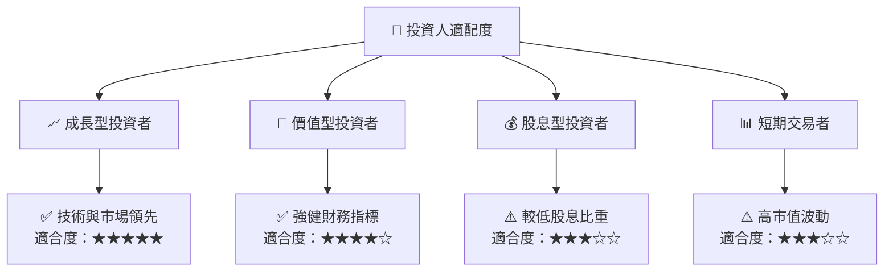

### 10.5 關鍵監控指標

| 類別 | 指標 | 關注點 | 頻率 |
|------|------|-------|-----|
| 業務增長 | 收入增長率 | 是否持續上升 | 季度 |
| 市場反應 | 股票波動率 | 波動幅度 | 日 |

---

> **免責聲明**：本報告為 AI 自動生成，僅供研究參考，不構成投資建議。投資有風險，入市需謹慎。