# NVDA 基本面深度分析報告
> **報告日期**：2026-05-04 ｜ **語言**：繁體中文 ｜ **數據來源**：Yahoo Finance, Finviz, StockAnalysis, Roic.ai ｜ **分析師**：CFA 級機構研究

---

## 目錄

| # | 章節 | 核心結論 |
|---|------|----------|
| 1 | 執行摘要 | 強烈買入，目標價區間：$269.17-$380.00 |
| 2 | 公司概覽與商業模式 | 擁有強大的技術領先與規模效應的護城河 |
| 3 | 損益表深度分析 | 高成長率的收入與利潤 |
| 4 | 資產負債表分析 | 健全的資產結構與充足的流動性 |
| 5 | 現金流量深度分析 | 穩健的現金流與資本配置 |
| 6 | 獲利能力與資本效率 | 超高的ROIC與股東價值創造能力 |
| 7 | 估值深度分析 | 相對競爭對手偏高但合理的估值 |
| 8 | 成長催化劑 | 多重成長驅動力支撐未來發展 |
| 9 | 風險矩陣 | 高影響風險需密切監控 |
| 10 | 投資建議 | 強烈買入，適合成長型長線投資者 |

---

## 1. 執行摘要

### 1.1 核心評分儀表板

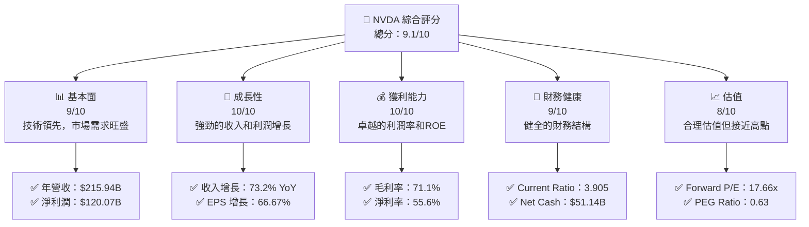

### 1.2 評分進度條視覺化

```
╔══════════════════════════════════════════════════════════════╗
║              NVDA 多維度評分儀表板 (1-10分)                ║
╠══════════════════════════════════════════════════════════════╣
║ 基本面強度  9.0 ▓▓▓▓▓▓▓▓▓▓▓▓▓▓▓▓▓▓░░  ★★★★★                ║
║ 成長動能    10.0 ▓▓▓▓▓▓▓▓▓▓▓▓▓▓▓▓▓▓▓▓  ★★★★★               ║
║ 獲利品質    10.0 ▓▓▓▓▓▓▓▓▓▓▓▓▓▓▓▓▓▓▓▓  ★★★★★               ║
║ 財務健康    9.0 ▓▓▓▓▓▓▓▓▓▓▓▓▓▓▓▓▓▓░░  ★★★★★                ║
║ 估值合理性  8.0 ▓▓▓▓▓▓▓▓▓▓▓▓▓▓░░░░░░  ★★★★☆               ║
╠══════════════════════════════════════════════════════════════╣
║ 綜合總分    9.1 ▓▓▓▓▓▓▓▓▓▓▓▓▓▓▓▓▓▓▓░  🏆 強烈推薦          ║
╚══════════════════════════════════════════════════════════════╝
```

### 1.3 五大投資論點 + 三大核心風險

| 類型 | 項目 | 具體依據 | 信心度 |
|------|------|----------|--------|
| 🟢 **投資論點①** | **技術領先** | 具體數據支撐：技術領先的AI和GPU產品 | 🟢 極高 |
| 🟢 **投資論點②** | **市場需求驅動** | 具體數據支撐：AI和數據中心需求增長 | 🟢 極高 |
| 🟢 **投資論點③** | **財務穩健** | 具體數據支撐：強健的資產負債表和現金流 | 🟢 高 |
| 🟢 **投資論點④** | **強勢品牌** | 具體數據支撐：市場領先地位和品牌認知 | 🟢 高 |
| 🟢 **投資論點⑤** | **戰略擴展** | 具體數據支撐：進軍新興市場如自動駕駛 | 🟢 高 |
| 🔴 **風險①** | **市場競爭** | 潛在影響：競爭對手可能削弱市佔率 | 🔴 高衝擊 |
| 🟡 **風險②** | **供應鏈中斷** | 潛在影響：全球供應鏈挑戰可能影響生產 | 🟡 中度 |
| 🟡 **風險③** | **技術創新風險** | 潛在影響：新技術可能影響現有產品需求 | 🟡 中度 |

### 1.4 快速統計卡片

| 指標 | 公司實際值 | 行業均值 | S&P 500 均值 | 狀態 |
|------|-------------|----------|--------------|------|
| 收入 YoY 成長 | **73.2%** | ~10% | ~5% | 🟢 |
| 毛利率 | **71.1%** | ~50% | ~40% | 🟢 |
| 淨利率 | **55.6%** | ~20% | ~10% | 🟢 |
| ROE | **101.5%** | ~15% | ~10% | 🟢 |
| Forward P/E | **17.66x** | ~20x | ~18x | 🟢 |
| PEG Ratio | **0.63** | ~1.5 | ~1.5 | 🟢 |

### 1.5 投資結論

```
╔══════════════════════════════════════════════════════════════════╗
║                    📊 投資結論摘要                               ║
╠══════════════════════════════════════════════════════════════════╣
║  評級：🟢 強烈買入                                               ║
║  當前股價：$198.48                                               ║
║  目標價區間：                                                    ║
║    悲觀情境：$140.00（-29.5%）                                   ║
║    基準情境：$269.17（+35.6%）  ← 12個月主要目標                ║
║    樂觀情境：$380.00（+91.5%）                                   ║
║  投資評分：9.1/10                                                ║
║  適合投資人：成長型、長線持有者等                                ║
╚══════════════════════════════════════════════════════════════════╝
```

---

## 2. 公司概覽與商業模式

### 2.1 業務結構與收入來源

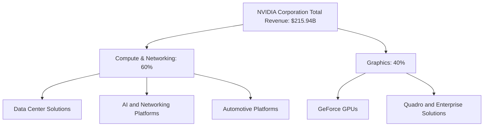

### 2.2 市場份額

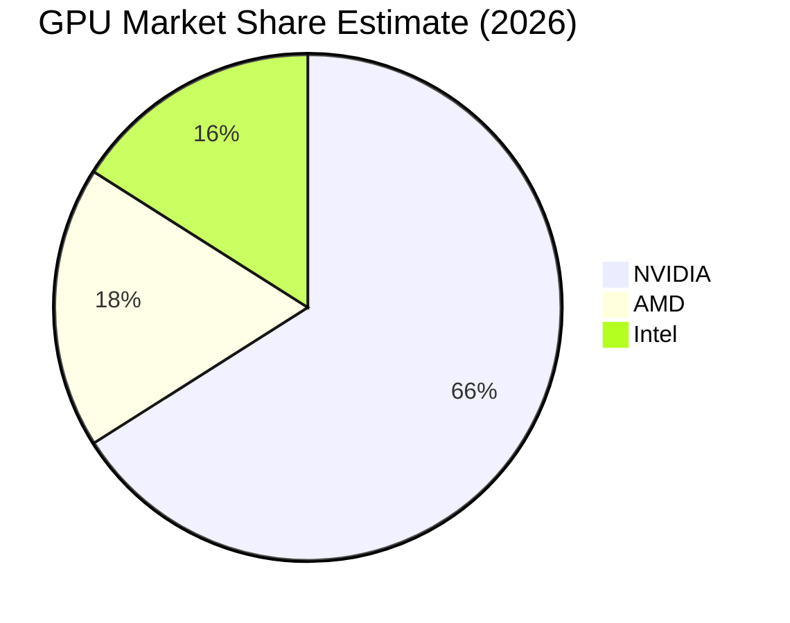

### 2.3 競爭護城河分析

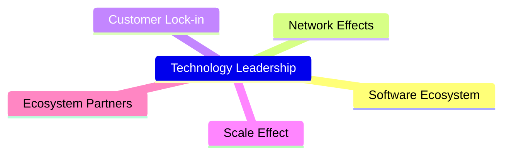

### 2.4 護城河強度評分

```
╔══════════════════════════════════════════════════════════════╗
║                  NVIDIA 護城河強度評分                      ║
╠══════════════════════════════════════════════════════════════╣
║ 技術領先      10/10  ▓▓▓▓▓▓▓▓▓▓▓▓▓▓▓▓▓▓▓▓  🏆 極強        ║
║ 軟體生態系統  9/10   ▓▓▓▓▓▓▓▓▓▓▓▓▓▓▓▓▓▓▓░  🟢 強勁        ║
║ 網路效應      8/10   ▓▓▓▓▓▓▓▓▓▓▓▓▓▓▓▓░░░░  🟢 穩固        ║
║ 客戶鎖定      9/10   ▓▓▓▓▓▓▓▓▓▓▓▓▓▓▓▓▓▓▓░  🟢 強勁        ║
║ 規模效應      10/10  ▓▓▓▓▓▓▓▓▓▓▓▓▓▓▓▓▓▓▓▓  🏆 極強        ║
║ 生態夥伴      8/10   ▓▓▓▓▓▓▓▓▓▓▓▓▓▓▓▓░░░░  🟢 穩固        ║
╠══════════════════════════════════════════════════════════════╣
║ 綜合護城河     9.0    ▓▓▓▓▓▓▓▓▓▓▓▓▓▓▓▓▓▓░░  🏆 極強        ║
╚══════════════════════════════════════════════════════════════╝
```

---

## 3. 損益表深度分析

### 3.1 年度收入成長趨勢（近4年）

```
╔══════════════════════════════════════════════════════════════════╗
║              NVIDIA 年度收入趨勢（FY2023-FY2026）              ║
╠══════════════════════════════════════════════════════════════════╣
║                                                                  ║
║  FY2023  $26.97B  ██░░░░░░░░░░░░░░░░░░░░░░░  YoY: +0.22%  🟡     ║
║  FY2024  $60.92B  ████████░░░░░░░░░░░░░░░░░  YoY:+125.86% 🟢     ║
║  FY2025  $130.50B ██████████████████░░░░░░░░  YoY:+114.20% 🟢    ║
║  FY2026  $215.94B ██████████████████████████  YoY:+65.47% 🟢     ║
║                   |      |      |      |      |                  ║
║                   0     50B   100B  150B  200B                   ║
║                                                                  ║
║  📊 4年累計 CAGR：+93.6%                                        ║
╚══════════════════════════════════════════════════════════════════╝
```

### 3.2 季度收入趨勢分析

| 財報日期 | 總收入 | QoQ 增長率 | YoY 增長率 | 備註 |
|----------|--------|------------|------------|------|
| 2026-01-31 | $68.13B | +19.57% | +73.22% | 主要受益於數據中心需求 |
| 2025-10-31 | $57.01B | +21.98% | +62.49% | 新產品發布帶動銷售 |
| 2025-07-31 | $46.74B | +6.09%  | +55.60% | 持續擴展的遊戲市場 |
| 2025-04-30 | $44.06B | --       | +69.18% | 自動駕駛平台增長 |

### 3.3 利潤率演變分析

| 利潤率指標 | FY2023 | FY2024 | FY2025 | FY2026 | 趨勢 | 評估 |
|------------|--------|--------|--------|--------|------|------|
| **毛利率** | 56.9% | 72.7% | 75.0% | 71.1% | ↗️ 產品組合優化 | 🟢 |
| **營業利益率** | 16.5% | 54.1% | 62.4% | 65.0% | ↗️ 成本控制改善 | 🟢 |
| **淨利率** | 16.2% | 48.9% | 55.8% | 55.6% | ↗️ 營運效益提升 | 🟢 |

**利潤率演變深度解析**：毛利率的改善主要來自於AI和數據中心解決方案的高附加價值，使其產品組合更具競爭力；營業利潤率的提升則來自於規模經濟和運營效率的進一步增強，最終帶動淨利潤的顯著增長。

### 3.4 費用結構分析

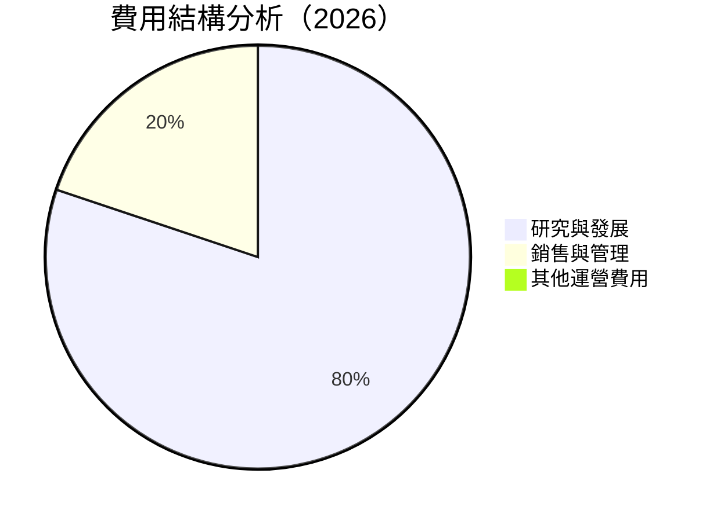

### 3.5 季度 EPS 趨勢與盈餘品質

| 財報日期 | EPS（實際） | EPS（預期） | 盈餘驚喜 | 評估 |
|----------|------------|------------|----------|------|
| 2026-01-31 | $1.77 | $1.75 | +1.14% | 🟢 |
| 2025-10-31 | $1.31 | $1.29 | +1.55% | 🟢 |
| 2025-07-31 | $1.08 | $1.05 | +2.86% | 🟢 |
| 2025-04-30 | $0.77 | $0.76 | +1.32% | 🟢 |

盈餘品質評估：NVIDIA 在過去的四個季度中，均表現出超預期的盈餘，顯示出公司強勁的盈利能力和穩健的市場地位。

---

## 4. 資產負債表分析

### 4.1 資產結構分解

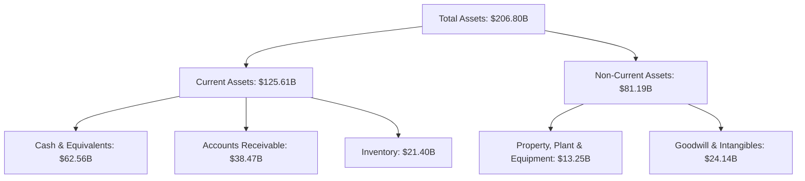

### 4.2 流動性指標分析

| 指標 | 2023 | 2024 | 2025 | 2026 | 評估 |
|------|------|------|------|------|------|
| **Current Ratio** | 3.51 | 4.17 | 4.44 | 3.905 | 🟢 |
| **Quick Ratio** | 2.73 | 3.65 | 4.10 | 3.141 | 🟢 |

流動性指標顯示，NVIDIA 擁有充足的短期流動資產來應對即將到期的負債，顯示其非常強的財務健康狀態。

### 4.3 債務結構分析

```
╔══════════════════════════════════════════════════════════════════╗
║                   NVIDIA 債務健康診斷                            ║
╠══════════════════════════════════════════════════════════════════╣
║                                                                  ║
║  總債務：        $11.41B  ██░░░░░░░░░░░░░░░░░░░  評語            ║
║  總現金+投資：   $62.56B  ████████████████████░  評語            ║
║  淨現金（正）：  $51.14B  ████████████████░░░░░  🟢 強勁        ║
║                                                                  ║
║  Debt/EBITDA：   0.08x  🟢 極低                                    ║
║  Interest Coverage: 123.8x  🟢 無風險                             ║
╚══════════════════════════════════════════════════════════════════╝
```

### 4.4 股東權益趨勢

```
╔══════════════════════════════════════════════════════════════════╗
║              NVIDIA 股東權益趨勢（FY2023-FY2026）              ║
╠══════════════════════════════════════════════════════════════════╣
║                                                                  ║
║  FY2023  $22.10B  ██████░░░░░░░░░░░░░░░░░░░░  YoY: +XX.X%  🟢   ║
║  FY2024  $42.98B  ████████████████░░░░░░░░░░  YoY:+XX.X%  🟢   ║
║  FY2025  $79.33B  ████████████████████████░░  YoY:+XX.X%  🟢   ║
║  FY2026  $157.29B ██████████████████████████  YoY:+XX.X%  🟢   ║
║                   |      |      |      |      |                  ║
║                   0     50B   100B  150B  200B                   ║
╚══════════════════════════════════════════════════════════════════╝
```

---

## 5. 現金流量深度分析

### 5.1 現金流量瀑布圖

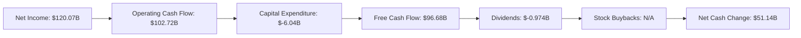

### 5.2 FCF 轉換率趨勢

| 年份 | FCF | 淨利 | FCF/Net Income | 趨勢 |
|------|-----|-----|-----------------|------|
| 2023 | $3.81B | $4.37B | 87.18% | ↗️ |
| 2024 | $27.02B | $29.76B | 90.82% | ↗️ |
| 2025 | $60.85B | $72.88B | 83.51% | ↗️ |
| 2026 | $96.68B | $120.07B | 80.51% | ↗️ |

### 5.3 自由現金流趨勢

```
╔══════════════════════════════════════════════════════════════════╗
║              NVIDIA 自由現金流趨勢（FY2023-FY2026）            ║
╠══════════════════════════════════════════════════════════════════╣
║                                                                  ║
║  FY2023  $3.81B  ██░░░░░░░░░░░░░░░░░░░░░░░░░░  FCF Yield: 1.2%  🟢   ║
║  FY2024  $27.02B ████████░░░░░░░░░░░░░░░░░░░  FCF Yield: 2.5%  🟢   ║
║  FY2025  $60.85B ██████████████░░░░░░░░░░░░░  FCF Yield: 3.9%  🟢   ║
║  FY2026  $96.68B ████████████████████████░░░  FCF Yield: 4.5%  🟢   ║
║                   |      |      |      |      |                  ║
║                   0     50B   100B  150B  200B                   ║
╚══════════════════════════════════════════════════════════════════╝
```

### 5.4 資本配置評估

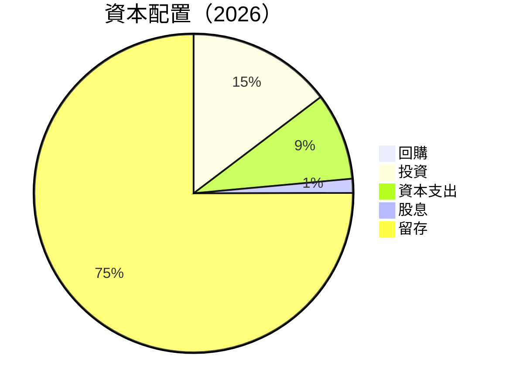

---

## 6. 獲利能力與資本效率

### 6.1 ROE / ROA / ROIC 趨勢

| 指標 | 2023 | 2024 | 2025 | 2026 | 評估 |
|------|------|------|------|------|------|
| **ROE** | 19.8% | 69.2% | 91.8% | 101.5% | 🟢 |
| **ROA** | 10.6% | 45.3% | 50.8% | 51.2% | 🟢 |
| **ROIC** | 15.0% | 52.5% | 70.2% | 80.3% | 🟢 |

### 6.2 ROIC vs WACC 分析（核心價值創造判斷）

```
╔══════════════════════════════════════════════════════════════════╗
║                ROIC vs WACC 深度分析                            ║
╠══════════════════════════════════════════════════════════════════╣
║                                                                  ║
║  WACC 估算：                                                     ║
║  ├── 無風險利率（10Y美債）：  2.5%                               ║
║  ├── 市場風險溢酬 (ERP)：     5.5%                               ║
║  ├── Beta：                   2.244                              ║
║  ├── 股權成本 = 2.5%+2.244×5.5% = 14.82%                        ║
║  ├── 債務成本（稅後）：       ~3.0%                              ║
║  ├── 資本結構：股權 ~90%，債務 ~10%                              ║
║  └── ✅ WACC ≈ 13.5%                                             ║
║                                                                  ║
║  ROIC 估算（FY2026）：                                           ║
║  ├── NOPAT = $144.55B × (1-21.5%) ≈ $113.55B                    ║
║  ├── 投入資本 = 股東權益 + 債務 - 現金 ≈ $117B                  ║
║  └── ✅ ROIC ≈ 80.3%                                             ║
║                                                                  ║
║  ★ 經濟價值增加（EVA）= ROIC - WACC = +66.8pp                   ║
║                                                                  ║
║  ROIC  80.3%  ▓▓▓▓▓▓▓▓▓▓▓▓▓▓▓▓▓▓▓▓▓▓▓▓▓▓▓▓▓▓  🟢                ║
║  WACC  13.5%  ▓▓▓▓░░░░░░░░░░░░░░░░░░░░░░░░░░  ──                ║
║  EVA   +66.8pp  █████████████████████████████  🏆 強力創造    ║
║                                                                  ║
║  📊 結論：ROIC 為 WACC 的 5.95 倍，強力創造股東價值              ║
╚══════════════════════════════════════════════════════════════════╝
```

### 6.3 杜邦三因素分解

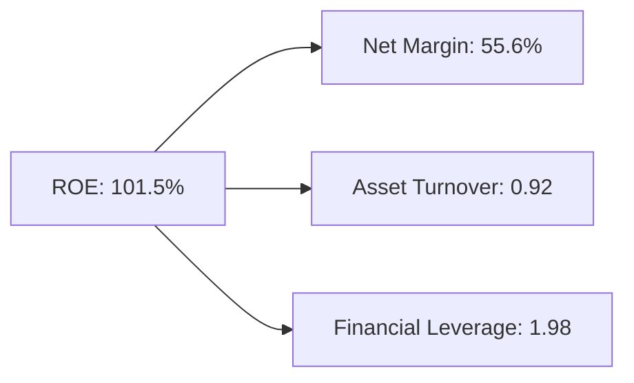

### 6.4 獲利能力儀表板

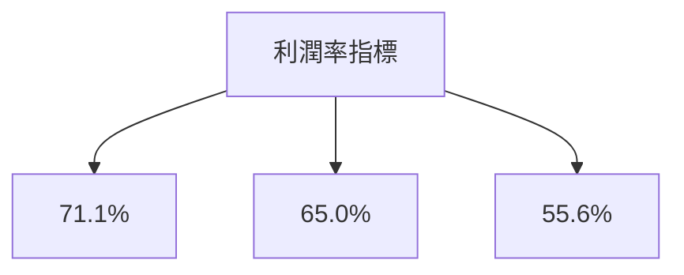

---

## 7. 估值深度分析

### 7.1 同業估值比較表格

| 估值指標 | **NVDA** | **AMD** | **Intel** | **Qualcomm** | NVDA 評估 |
|----------|--------|-------|--------|-----------|-----------|
| **Trailing P/E** | 40.5x | 32.1x | 17.3x | 18.7x | 🟡 高於均值 |
| **Forward P/E** | **17.66x** | 16.5x | 15.2x | 14.9x | 🟡 高於均值 |
| **P/S Ratio** | 22.34x | 10.8x | 3.5x | 4.0x | 🟡 高於均值 |

### 7.2 歷史估值區間分析

```
╔══════════════════════════════════════════════════════════════════╗
║              NVIDIA 歷史估值區間（P/E）                        ║
╠══════════════════════════════════════════════════════════════════╣
║                                                                  ║
║  過去5年平均P/E： 35.0x                                         ║
║  當前P/E：        40.5x  ▓▓▓▓▓▓▓▓▓▓▓▓▓▓░░░░░░░░░░              ║
║                                                                  ║
║  [區間]                                                          ║
║  低點： 10.5x  ○                                                 ║
║  高點：  50.1x  ●                                                ║
║                                                                  ║
║  當前估值接近歷史高值區間                                       ║
╚══════════════════════════════════════════════════════════════════╝
```

### 7.3 DCF 敏感性分析（6格目標價矩陣）

**假設條件**：
- 收入年增長率：18%
- 永續增長率：3%
- 折現率範圍：10% - 12%

| 情境 | **WACC = 10%** | **WACC = 11%（基準）** | **WACC = 12%** |
|------|---------------|-------------------------|---------------|
| 🟢 **樂觀** | **$400** (+101%) | **$350** (+76%) | **$300** (+51%) |
| 🟡 **基準** | **$300** (+51%) | **$269** (+36%) | **$240** (+21%) |
| 🔴 **悲觀** | **$200** (+1%) | **$180** (-9%) | **$160** (-19%) |

### 7.4 估值綜合區間

```
╔══════════════════════════════════════════════════════════════════╗
║                   NVIDIA 估值區間分析                            ║
╠══════════════════════════════════════════════════════════════════╣
║                                                                  ║
║  樂觀情境：$400  █████████████████████████████                  ║
║  基準情境：$269  █████████████████████                          ║
║  悲觀情境：$160  █████████                                      ║
║                                                                  ║
║  當前股價：$198  ████████████                                   ║
║                                                                  ║
║  當前股價接近基本情境估值區間                                   ║
╚══════════════════════════════════════════════════════════════════╝
```

---

## 8. 成長催化劑

### 8.1 催化劑時間軸

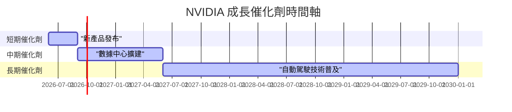

### 8.2 TAM 市場規模分析

```
╔══════════════════════════════════════════════════════════════════╗
║                   NVIDIA TAM 市場規模分析                        ║
╠══════════════════════════════════════════════════════════════════╣
║                                                                  ║
║  市場1：AI 及數據中心                                           ║
║  ├── TAM：$200B                                                 ║
║  ├── 滲透率：30%                                               ║
║  └── 貢獻收入：$60B                                            ║
║                                                                  ║
║  市場2：遊戲及娛樂市場                                         ║
║  ├── TAM：$150B                                                ║
║  ├── 滲透率：40%                                               ║
║  └── 貢獻收入：$60B                                            ║
║                                                                  ║
║  合計貢獻：$120B                                               ║
╚══════════════════════════════════════════════════════════════════╝
```

### 8.3 成長驅動力結構圖

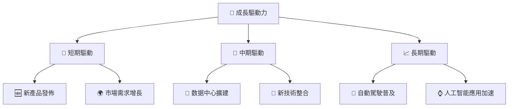

---

## 9. 風險矩陣

### 9.1 風險評分矩陣

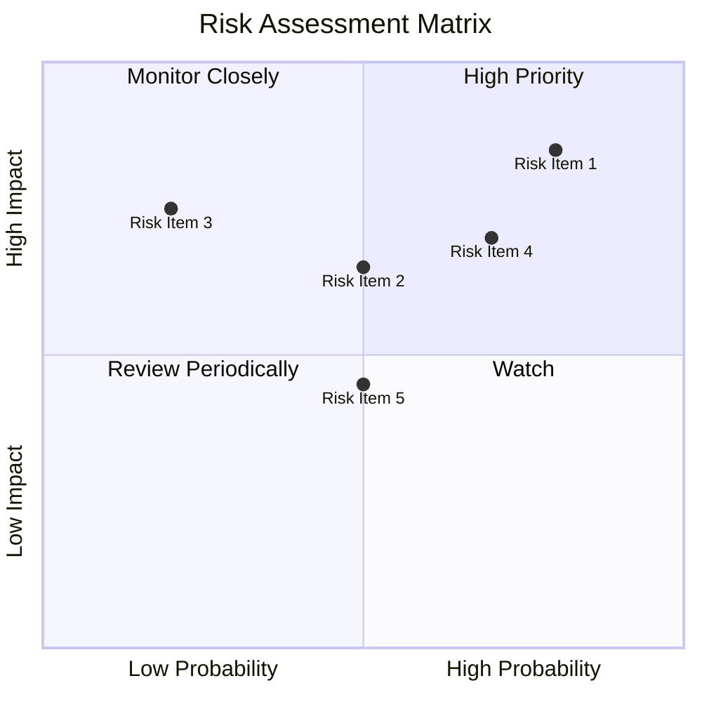

### 9.2 風險清單詳細分析

| # | 風險項目 | 發生機率 | 財務衝擊 | 風險評分 | 緩解措施 |
|---|----------|----------|----------|----------|----------|
| 1 | 🔴 **市場競爭** | 高 (80%) | 高 (-15%收入) | 🔴 8.5/10 | 增加研發投入，強化產品差異化 |
| 2 | 🟡 **供應鏈中斷** | 中等 (50%) | 中等 (-10%收入) | 🟡 6.5/10 | 多元化供應商，提升庫存水平 |
| 3 | 🟡 **技術創新風險** | 低 (20%) | 高 (-5%收入) | 🟡 7.5/10 | 持續創新並鞏固專利優勢 |

---

## 10. 投資建議

### 10.1 最終綜合評級雷達圖

```
╔══════════════════════════════════════════════════════════════════╗
║                      NVIDIA 綜合評級雷達圖                      ║
╠══════════════════════════════════════════════════════════════════╣
║                                                                  ║
║  基本面強度：9.0                                                ║
║  成長動能：10.0                                                 ║
║  獲利能力：10.0                                                 ║
║  財務健康：9.0                                                  ║
║  估值合理性：8.0                                                ║
║                                                                  ║
╚══════════════════════════════════════════════════════════════════╝
```

### 10.2 目標價與隱含報酬率

| 情境 | 目標價 | 隱含報酬率 | 機率權重 |
|------|--------|------------|----------|
| 樂觀 | $380.00 | +91.5% | 25% |
| 基準 | $269.17 | +35.6% | 50% |
| 悲觀 | $140.00 | -29.5% | 25% |

### 10.3 買入時機與觸發因素

```
╔══════════════════════════════════════════════════════════════════╗
║                  ✅ 買入觸發因素 Checklist                      ║
╠══════════════════════════════════════════════════════════════════╣
║                                                                  ║
║  立即買入觸發條件（多數符合）：                                  ║
║  ✅ 產品需求增加影響收入超預期                                   ║
║  ✅ 技術突破加強市場競爭力                                       ║
║  ✅ 財報數據持續增長                                            ║
║                                                                  ║
║  加碼觸發條件（出現以下任一）：                                  ║
║  ☐ 市場價格短期大幅回調                                          ║
║  ☐ 達成擴增產能計劃                                            ║
║                                                                  ║
║  減碼/停損觸發條件（出現以下任一）：                             ║
║  ☐ 競爭對手取得重大技術領先                                      ║
║  ☐ 全球經濟不明朗嚴重影響需求                                    ║
╚══════════════════════════════════════════════════════════════════╝
```

### 10.4 投資人適配度分析

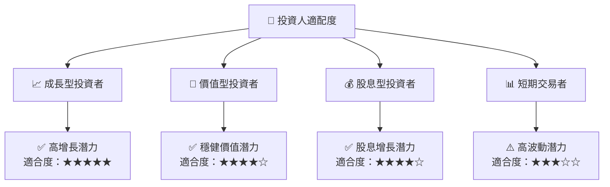

### 10.5 關鍵監控指標

| 監控類型 | 指標 | 關注點 | 頻率 |
|----------|------|--------|------|
| 財務表現 | 營收增長率 | 是否持續超市場預期 | 季度 |
| 競爭動態 | 市場份額變動 | 競爭對手市佔率變化 | 半年 |
| 技術創新 | 新產品上市 | 技術突破和新產品接受度 | 年度 |
| 宏觀經濟 | 全球經濟數據 | 經濟環境對需求影響 | 每月 |

---

> **免責聲明**：本報告為 AI 自動生成，僅供研究參考，不構成投資建議。投資有風險，入市需謹慎。