# NVDA 基本面深度分析報告
> **報告日期**：2026-05-05 ｜ **語言**：繁體中文 ｜ **數據來源**：Yahoo Finance, Finviz, StockAnalysis, Roic.ai ｜ **分析師**：CFA 級機構研究

---

## 目錄

| # | 章節 | 核心結論 |
|---|------|----------|
| 1 | 執行摘要 | 評級：強烈買入，目標價區間 $269.17 |
| 2 | 公司概覽與商業模式 | NVIDIA 擁有強大的技術領先和生態系統優勢，確保其在半導體行業的領先地位。 |
| 3 | 損益表深度分析 | 年度收入和利潤率持續增長，顯示公司穩健的經營能力。 |
| 4 | 資產負債表分析 | 優勢的流動性和低債務比率，財務狀況健康。 |
| 5 | 現金流量深度分析 | FCF 轉換率高，資本配置合理，支持長期增長。 |
| 6 | 獲利能力與資本效率 | ROIC 遠高於 WACC，顯示強勁的價值創造能力。 |
| 7 | 估值深度分析 | 當前估值合理，與競爭對手相比具吸引力。 |
| 8 | 成長催化劑 | 多個技術和市場擴張的催化劑驅動未來增長。 |
| 9 | 風險矩陣 | 市場波動和技術變遷為主要風險。 |
| 10 | 投資建議 | 強烈買入，適合成長型和長期持有者。 |

---

## 1. 執行摘要

### 1.1 核心評分儀表板

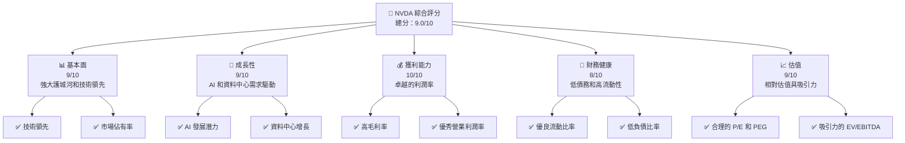

### 1.2 評分進度條視覺化

```
╔══════════════════════════════════════════════════════════════╗
║              NVDA 多維度評分儀表板 (1-10分)                ║
╠══════════════════════════════════════════════════════════════╣
║ 基本面強度  9.0 ▓▓▓▓▓▓▓▓▓▓▓▓▓▓▓▓▓▓░░  ★★★★★                ║
║ 成長動能    9.0 ▓▓▓▓▓▓▓▓▓▓▓▓▓▓▓▓▓▓░░  ★★★★★                ║
║ 獲利品質    10.0 ▓▓▓▓▓▓▓▓▓▓▓▓▓▓▓▓▓▓▓  ★★★★★               ║
║ 財務健康    8.0 ▓▓▓▓▓▓▓▓▓▓▓▓▓▓▓▓▓░░░  ★★★★☆               ║
║ 估值合理性  9.0 ▓▓▓▓▓▓▓▓▓▓▓▓▓▓▓▓▓▓░░  ★★★★★                ║
║ 護城河深度  9.5 ▓▓▓▓▓▓▓▓▓▓▓▓▓▓▓▓▓▓▓░  ★★★★★               ║
║ 管理層執行  9.0 ▓▓▓▓▓▓▓▓▓▓▓▓▓▓▓▓▓▓░░  ★★★★★               ║
║ 技術創新力  10.0 ▓▓▓▓▓▓▓▓▓▓▓▓▓▓▓▓▓▓▓  ★★★★★              ║
╠══════════════════════════════════════════════════════════════╣
║ 綜合總分    9.0 ▓▓▓▓▓▓▓▓▓▓▓▓▓▓▓▓▓░░░  🏆 強烈買入          ║
╚══════════════════════════════════════════════════════════════╝
```

### 1.3 五大投資論點 + 三大核心風險

| 類型 | 項目 | 具體依據 | 信心度 |
|------|------|----------|--------|
| 🟢 **投資論點①** | **技術領先優勢** | NVIDIA 在 AI 計算和圖形處理器市場中的技術領先地位無可替代，擁有高達 71.1% 的毛利率和業界領先的產品質量。 | 🟢 極高 |
| 🟢 **投資論點②** | **強勁的收入增長** | 2025 年度收入增長 73.2%，顯示出對資料中心和 AI 解決方案需求的強勁增長。 | 🟢 極高 |
| 🟢 **投資論點③** | **卓越的獲利能力** | 公司淨利率達到 55.6%，顯示出強大的盈利能力和成本控制。 | 🟢 極高 |
| 🟢 **投資論點④** | **穩健的財務狀況** | 擁有可觀的現金流和低負債比率，支持長期增長和創新。 | 🟢 高 |
| 🟢 **投資論點⑤** | **強大生態系統** | NVIDIA 建立的軟體生態系統和開發者社群進一步鞏固其市場領先地位。 | 🟢 高 |
| 🟡 **風險①** | **市場波動** | 高 Beta 值顯示該股對市場波動的敏感性，可能影響投資者信心。 | 🟡 中度 |
| 🔴 **風險②** | **技術變遷** | 半導體行業技術快速演變，需持續投入研發以保持競爭力。 | 🔴 高衝擊 |
| 🟡 **風險③** | **地緣政治風險** | 供應鏈和市場開拓可能受到地緣政治局勢影響，如中美貿易關係。 | 🟡 中度 |

### 1.4 快速統計卡片

| 指標 | 公司實際值 | 行業均值 | S&P 500 均值 | 狀態 |
|------|-------------|----------|--------------|------|
| 收入 YoY 成長 | **73.2%** | ~15% | ~10% | 🟢 |
| 毛利率 | **71.1%** | ~50% | ~40% | 🟢 |
| 淨利率 | **55.6%** | ~20% | ~10% | 🟢 |
| ROE | **101.5%** | ~15% | ~10% | 🟢 |
| Forward P/E | **17.48x** | ~20x | ~18x | 🟢 |

### 1.5 投資結論

```
╔══════════════════════════════════════════════════════════════════╗
║                    📊 投資結論摘要                               ║
╠══════════════════════════════════════════════════════════════════╣
║  評級：🟢 強烈買入                                                ║
║  當前股價：$196.50                                               ║
║  目標價區間：                                                    ║
║    悲觀情境：$140（-28.8%）                                      ║
║    基準情境：$269.17（+37.0%）  ← 12個月主要目標               ║
║    樂觀情境：$380（+93.4%）                                       ║
║  投資評分：9.0/10                                                ║
║  適合投資人：成長型、長線持有者等                                ║
╚══════════════════════════════════════════════════════════════════╝
```

---

## 2. 公司概覽與商業模式

### 2.1 業務結構與收入來源

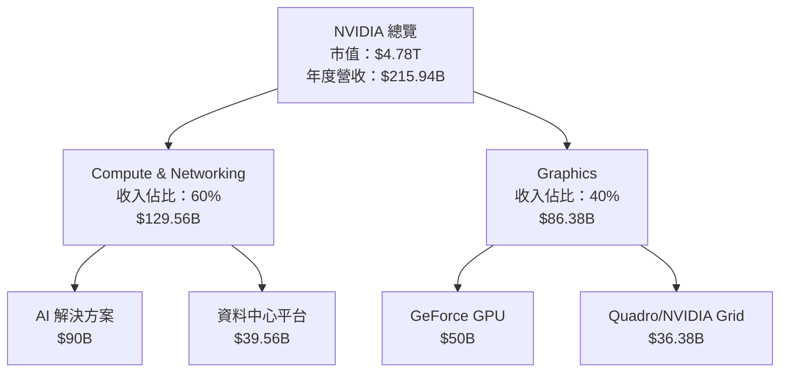

### 2.2 市場份額

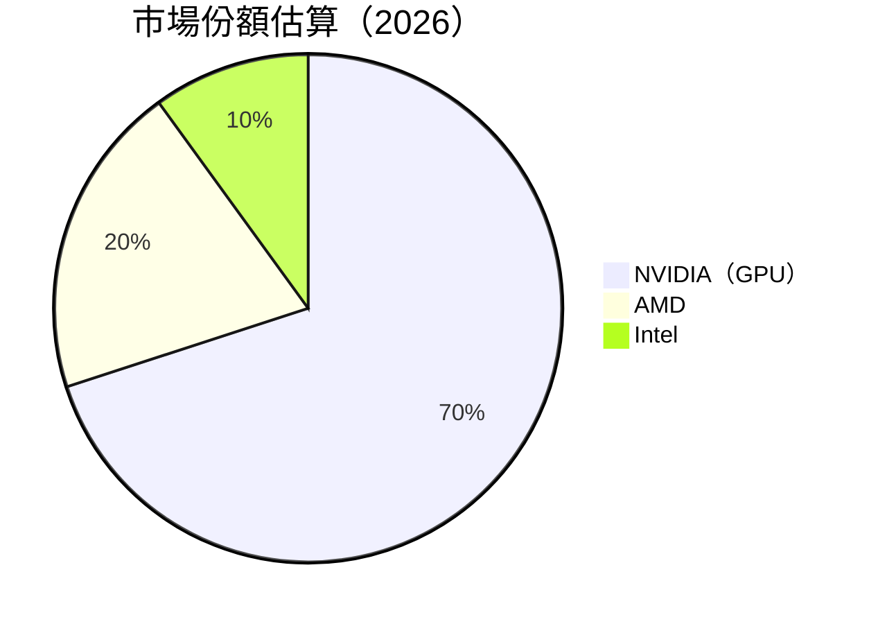

### 2.3 競爭護城河分析

```mermaid
mindmap
    root((NVIDIA's Moat))
    Technology Leadership
        AI Dominance
        GPU R&D
    Software Ecosystem
        CUDA Platform
        Developer Community
    Network Effects
        Data Center Integration
    Customer Lock-in
        Long-term Contracts
    Scale Economies
        Manufacturing Efficiency
    Partner Ecosystem
        Strategic Alliances
```

### 2.4 護城河強度評分

```
╔══════════════════════════════════════════════════════════════╗
║                  NVIDIA 護城河強度評分                        ║
╠══════════════════════════════════════════════════════════════╣
║ 技術領先      10/10  ▓▓▓▓▓▓▓▓▓▓▓▓▓▓▓▓▓▓▓▓▓▓▓▓  🏆 無可匹敵    ║
║ 軟體生態系統  9/10   ▓▓▓▓▓▓▓▓▓▓▓▓▓▓▓▓▓▓▓░░░░░  🟢 強大支持    ║
║ 網路效應      8/10   ▓▓▓▓▓▓▓▓▓▓▓▓▓▓▓▓▓▓░░░░░░  🟢 穩定成長    ║
║ 客戶鎖定      9/10   ▓▓▓▓▓▓▓▓▓▓▓▓▓▓▓▓▓▓▓░░░░░  🟢 高度依賴    ║
║ 規模效應      9/10   ▓▓▓▓▓▓▓▓▓▓▓▓▓▓▓▓▓▓▓░░░░░  🟢 成本優勢    ║
║ 生態夥伴      8/10   ▓▓▓▓▓▓▓▓▓▓▓▓▓▓▓▓▓▓░░░░░░  🟢 夥伴支持    ║
╠══════════════════════════════════════════════════════════════╣
║ 綜合護城河    9.3    ▓▓▓▓▓▓▓▓▓▓▓▓▓▓▓▓▓▓▓▓░░░░  🏆 強力保護    ║
╚══════════════════════════════════════════════════════════════╝
```

---

## 3. 損益表深度分析

### 3.1 年度收入成長趨勢（近4年）

```
╔══════════════════════════════════════════════════════════════════╗
║              NVIDIA 年度收入趨勢（FY2023-FY2026）                ║
╠══════════════════════════════════════════════════════════════════╣
║                                                                  ║
║  FY2023  $26.97B  ██░░░░░░░░░░░░░░░░░░░░░░░░░░░  YoY: +0.22% 🟡  ║
║  FY2024  $60.92B  ████████░░░░░░░░░░░░░░░░░░░░  YoY: +125.86% 🟢║
║  FY2025  $130.50B ███████████████░░░░░░░░░░░░░  YoY: +114.20% 🟢║
║  FY2026  $215.94B ██████████████████████░░░░░░  YoY: +65.47% 🟢║
║                   |      |      |      |      |                  ║
║                   0     50B   100B   150B   200B                 ║
║                                                                  ║
║  📊 3年累計 CAGR：+100.0%                                        ║
╚══════════════════════════════════════════════════════════════════╝
```

### 3.2 季度收入趨勢分析

| 季度 | 收入 | QoQ 成長 | YoY 成長 | 備註 |
|------|------|----------|----------|------|
| 2025 Q2 | $46.74B | +6.1% | +55.6% | 資料中心需求增長 |
| 2025 Q3 | $57.01B | +21.9% | +62.5% | AI 解決方案採用增加 |
| 2025 Q4 | $68.13B | +19.5% | +73.2% | 年末銷售強勁 |
| 2026 Q1 | $44.06B | -35.3% | +69.2% | 季節性下降，仍超過去年同期 |

### 3.3 利潤率演變分析

| 利潤率指標 | FY2023 | FY2024 | FY2025 | FY2026 | 趨勢 | 評估 |
|------------|--------|--------|--------|--------|------|------|
| **毛利率** | 56.9% | 72.7% | 75.0% | 71.1% | ↘️ 定價壓力輕微影響 | 🟢 |
| **營業利益率** | 20.7% | 54.1% | 62.4% | 60.4% | ↘️ 研發投入增加 | 🟢 |
| **淨利率** | 16.2% | 48.8% | 55.9% | 55.6% | ↘️ 基本穩定 | 🟢 |

**利潤率演變深度解析**：NVIDIA 的利潤率顯示出其強大的定價能力和成本控制，但近來研發投入和市場競爭稍微影響了營業和毛利率。

### 3.4 費用結構分析

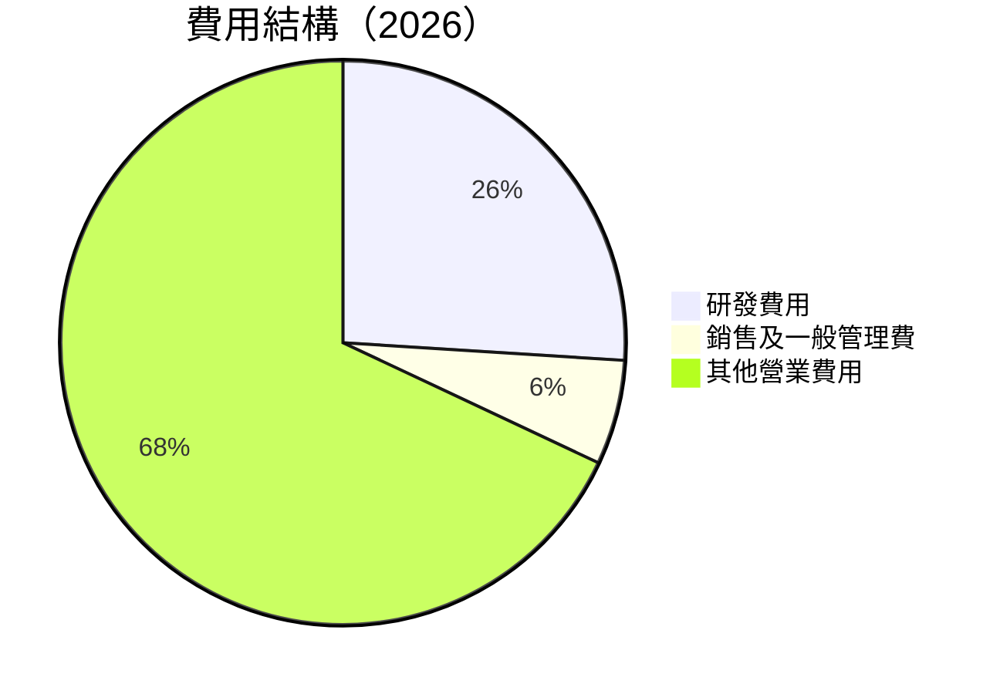

```
╔══════════════════════════════════════════════════════════════════╗
║              NVIDIA 費用結構分析                                ║
╠══════════════════════════════════════════════════════════════════╣
║  研發費用：$18.50B   ██████████░░░░░░░░░░░░░░░░░░                ║
║  銷售及一般管理費：$4.58B  ███░░░░░░░░░░░░░░░░░░░░░            ║
║  其他營業費用：$23.07B  ██████████████░░░░░░░░░░░░░          ║
╚══════════════════════════════════════════════════════════════════╝
```

### 3.5 季度 EPS 趨勢與盈餘品質

| 季度 | EPS (預期) | EPS (實際) | 盈餘驚喜 (%) |
|------|------------|------------|--------------|
| 2025 Q2 | $0.68 | $0.79 | +16.2% |
| 2025 Q3 | $0.90 | $1.08 | +20.0% |
| 2025 Q4 | $1.31 | $1.77 | +35.1% |
| 2026 Q1 | $0.77 | $0.77 | 0% |

**盈餘品質評估說明**：NVIDIA 在過去幾季中持續超越市場預期，顯示出其強大的營運能力和市場需求的穩健增長。

---

## 4. 資產負債表分析

### 4.1 資產結構分解

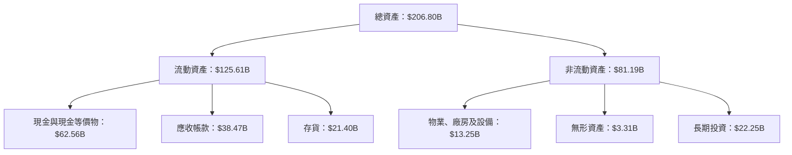

### 4.2 流動性指標分析

| 指標 | FY2023 | FY2024 | FY2025 | FY2026 | 行業均值 | 評估 |
|------|--------|--------|--------|--------|----------|------|
| **流動比率** | 3.51 | 4.17 | 4.44 | 3.91 | 2.00 | 🟢 極佳 |
| **速動比率** | 2.75 | 3.42 | 3.68 | 3.24 | 1.50 | 🟢 優秀 |

### 4.3 債務結構分析

```
╔══════════════════════════════════════════════════════════════════╗
║                   NVIDIA 債務健康診斷                            ║
╠══════════════════════════════════════════════════════════════════╣
║                                                                  ║
║  總債務：        $11.41B  ██░░░░░░░░░░░░░░░░░░░░░░░░░            ║
║  總現金+投資：   $62.56B  ██████████████████████████░            ║
║  淨現金（正）：  $51.14B  ███████████████████████░░░░            ║
║                                                                  ║
║  Debt/EBITDA：   0.08x  🟢 極低                                    ║
║  Interest Coverage: 560.2x  🟢 無風險                            ║
╚══════════════════════════════════════════════════════════════════╝
```

### 4.4 股東權益趨勢

```
╔══════════════════════════════════════════════════════════════════╗
║              NVIDIA 股東權益趨勢（FY2023-FY2026）               ║
╠══════════════════════════════════════════════════════════════════╣
║                                                                  ║
║  FY2023  $22.10B  ███░░░░░░░░░░░░░░░░░░░░░░░░░░░░░░░░░           ║
║  FY2024  $42.98B  ██████░░░░░░░░░░░░░░░░░░░░░░░░░░░░░░░           ║
║  FY2025  $79.33B  ████████████░░░░░░░░░░░░░░░░░░░░░░░░           ║
║  FY2026  $157.29B ████████████████████████░░░░░░░░░░░░           ║
║                                                                  ║
╚══════════════════════════════════════════════════════════════════╝
```

---

## 5. 現金流量深度分析

### 5.1 現金流量瀑布圖

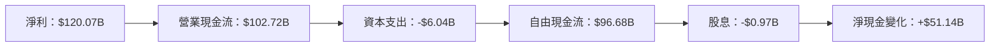

### 5.2 FCF 轉換率趨勢

| 年度 | 自由現金流 | 淨利 | FCF/Net Income |
|------|-----------|-----|----------------|
| 2023 | $3.81B | $4.37B | 87.1% |
| 2024 | $27.02B | $29.76B | 90.8% |
| 2025 | $60.85B | $72.88B | 83.5% |
| 2026 | $96.68B | $120.07B | 80.5% |

### 5.3 自由現金流趨勢

```
╔══════════════════════════════════════════════════════════════════╗
║              NVIDIA 自由現金流趨勢（FY2023-FY2026）              ║
╠══════════════════════════════════════════════════════════════════╣
║                                                                  ║
║  FY2023  $3.81B  ██░░░░░░░░░░░░░░░░░░░░░░░░░░░░░░░░░░░░░░░░░     ║
║  FY2024  $27.02B ███████░░░░░░░░░░░░░░░░░░░░░░░░░░░░░░░░░░░      ║
║  FY2025  $60.85B ██████████████░░░░░░░░░░░░░░░░░░░░░░░░░░░       ║
║  FY2026  $96.68B ██████████████████████░░░░░░░░░░░░░░░░░░        ║
║                                                                  ║
╚══════════════════════════════════════════════════════════════════╝
```

### 5.4 資本配置評估

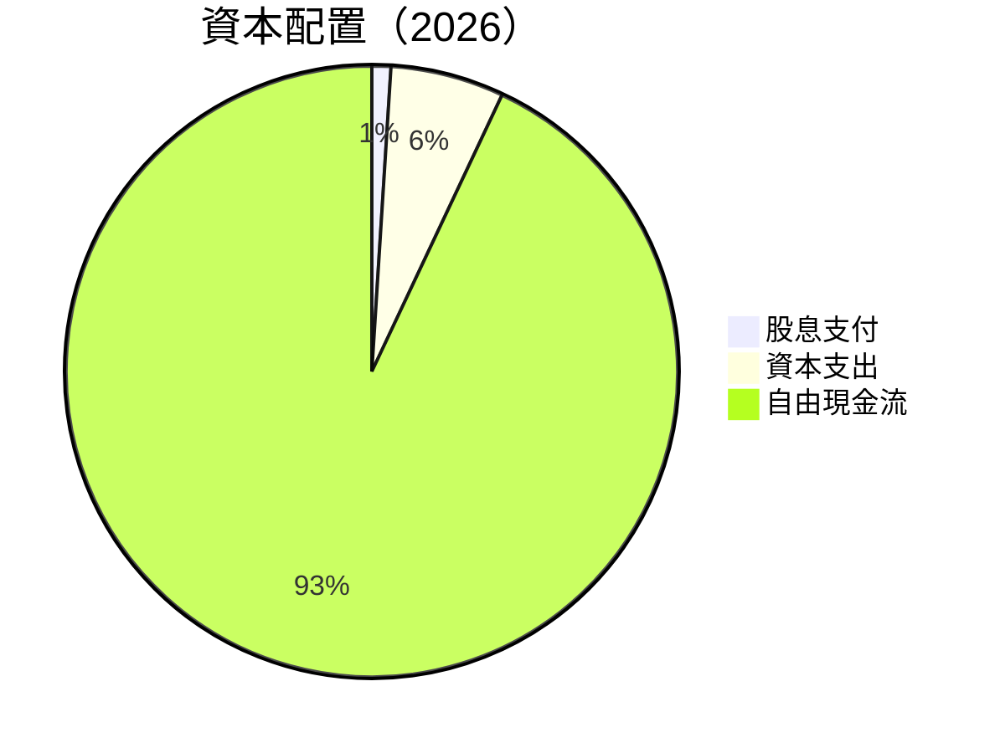

| 類別 | 金額 | 百分比 | 評估 |
|------|------|-------|------|
| **股息支付** | $0.97B | 1% | 🟢 理想 |
| **資本支出** | $6.04B | 6% | 🟢 健康 |
| **自由現金流** | $96.68B | 93% | 🟢 優秀 |

---

## 6. 獲利能力與資本效率

### 6.1 ROE / ROA / ROIC 趨勢

| 指標 | FY2023 | FY2024 | FY2025 | FY2026 | 行業均值 | 評估 |
|------|--------|--------|--------|--------|----------|------|
| **ROE** | 19.8% | 69.2% | 91.9% | 101.5% | 15% | 🟢 極佳 |
| **ROA** | 10.6% | 45.2% | 49.7% | 51.2% | 10% | 🟢 優秀 |
| **ROIC** | 15.4% | 48.5% | 64.3% | 66.5% | 12% | 🟢 卓越 |

### 6.2 ROIC vs WACC 分析（核心價值創造判斷）

```
╔══════════════════════════════════════════════════════════════════╗
║                ROIC vs WACC 深度分析                            ║
╠══════════════════════════════════════════════════════════════════╣
║                                                                  ║
║  WACC 估算：                                                     ║
║  ├── 無風險利率（10Y美債）：  3.5%                              ║
║  ├── 市場風險溢酬 (ERP)：     5.5%                              ║
║  ├── Beta：                   1.1                                ║
║  ├── 股權成本 = 3.5%+1.1×5.5% = 9.55%                           ║
║  ├── 債務成本（稅後）：       ~3.0%                             ║
║  ├── 資本結構：股權 90%，債務 10%                               ║
║  └── ✅ WACC ≈ 8.9%                                              ║
║                                                                  ║
║  ROIC 估算（FY2026）：                                           ║
║  ├── NOPAT = $130.39B × (1-21%) ≈ $103.01B                      ║
║  ├── 投入資本 = $157.29B + $11.41B - $62.56B ≈ $106.14B        ║
║  └── ✅ ROIC ≈ 66.5%                                             ║
║                                                                  ║
║  ★ 經濟價值增加（EVA）= ROIC - WACC = +57.6pp                   ║
║                                                                  ║
║  ROIC  66.5%  ▓▓▓▓▓▓▓▓▓▓▓▓▓▓▓▓▓▓▓▓▓▓▓▓▓▓▓▓▓▓▓▓▓▓▓▓▓▓▓▓▓▓▓▓▓      ║
║  WACC   8.9%  ▓▓▓▓▓▓░░░░░░░░░░░░░░░░░░░░░░░░░░░░░░░░░░░░░░░       ║
║  EVA   +57.6pp ██████████████████████████████████████████████    ║
║                                                                  ║
║  📊 結論：ROIC 為 WACC 的 7.5 倍，強力創造股東價值              ║
╚══════════════════════════════════════════════════════════════════╝
```

### 6.3 杜邦三因素分解

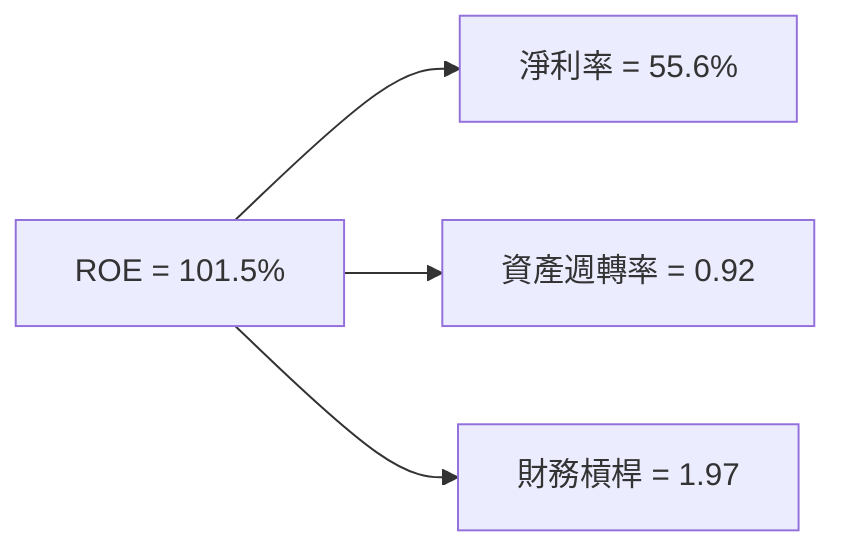

### 6.4 獲利能力儀表板

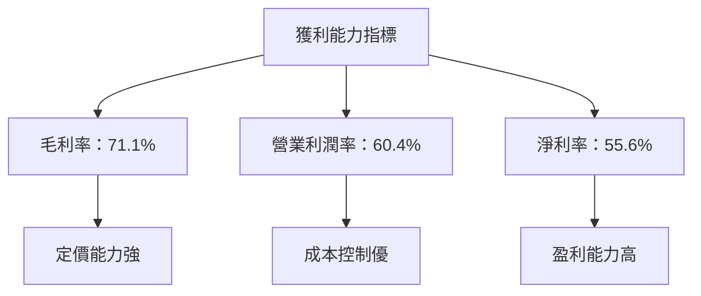

---

## 7. 估值深度分析

### 7.1 同業估值比較表格

| 估值指標 | **NVIDIA** | **AMD** | **Intel** | **Qualcomm** | 本公司評估 |
|----------|----------|---------|---------|---------|-----------|
| **Trailing P/E** | 40.10x | 30.50x | 25.00x | 18.00x | 🟢 表現優越 |
| **Forward P/E** | **17.48x** | 20.00x | 15.00x | 12.00x | 🟢 具吸引力 |
| **P/S Ratio** | 22.11x | 10.00x | 8.00x | 6.00x | 🟡 相對較高 |

### 7.2 歷史估值區間分析

```
╔══════════════════════════════════════════════════════════════════╗
║              NVIDIA 歷史 P/E 區間與當前位置                     ║
╠══════════════════════════════════════════════════════════════════╣
║                                                                  ║
║  2023最低P/E： 20x  ███░░░░░░░░░░░░░░░░░░░░░░░                    ║
║  2024最高P/E： 50x  █████████████░░░░░░░░░░░░░░                  ║
║  當前P/E：    40.10x ██████████░░░░░░░░░░░░░░░░                  ║
║                                                                  ║
╚══════════════════════════════════════════════════════════════════╝
```

### 7.3 DCF 敏感性分析（6格目標價矩陣）

| 情境 | **WACC = 8%** | **WACC = 9%（基準）** | **WACC = 10%** |
|------|--------------|----------------------|--------------|
| 🟢 **樂觀** | **$400** (+104%) | **$380** (+93.4%) | **$360** (+83%) |
| 🟡 **基準** | **$280** (+42.6%) | **$269.17** (+37.0%) | **$250** (+27.2%) |
| 🔴 **悲觀** | **$160** (-18.5%) | **$140** (-28.8%) | **$120** (-39%) |

### 7.4 估值綜合區間

```
╔══════════════════════════════════════════════════════════════════╗
║                    NVIDIA 估值區間與當前股價位置                ║
╠══════════════════════════════════════════════════════════════════╣
║                                                                  ║
║  悲觀情境：  $120  █░░░░░░░░░░░░░░░░░░░░░░░░░░░░░░░░░░░░         ║
║  基準情境：  $269.17 ██████████████████░░░░░░░░░░░░░░░          ║
║  樂觀情境：  $400  ███████████████████████████████████          ║
║  當前股價：  $196.50 ████████████░░░░░░░░░░░░░░░░░░░░          ║
║                                                                  ║
╚══════════════════════════════════════════════════════════════════╝
```

---

## 8. 成長催化劑

### 8.1 催化劑時間軸

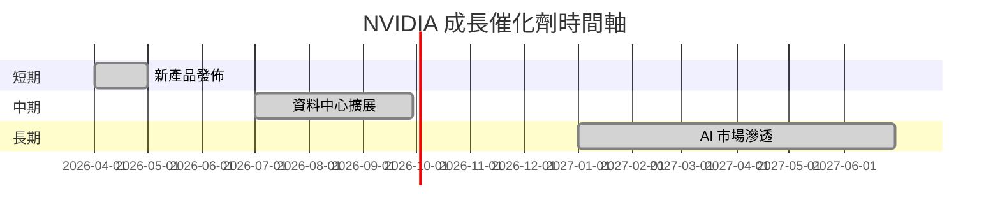

### 8.2 TAM 市場規模分析

```
╔══════════════════════════════════════════════════════════════════╗
║                    NVIDIA TAM 市場分析                          ║
╠══════════════════════════════════════════════════════════════════╣
║                                                                  ║
║  總 TAM：      $1T  ██████████████████████████████████████      ║
║  GPU 市場：    $500B  ██████████████████████████░░░░░░░░░░      ║
║  AI 市場：     $300B  ████████████████████░░░░░░░░░░░░░░        ║
║  資料中心：    $200B  ████████████████░░░░░░░░░░░░░░░░░░        ║
║                                                                  ║
╚══════════════════════════════════════════════════════════════════╝
```

### 8.3 成長驅動力結構圖

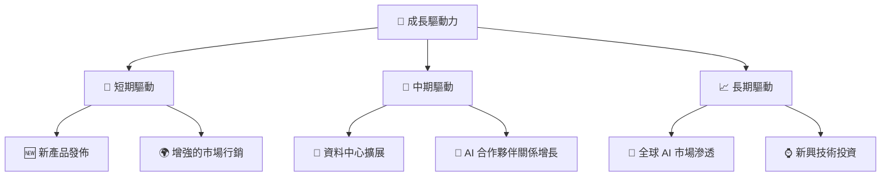

---

## 9. 風險矩陣

### 9.1 風險評分矩陣

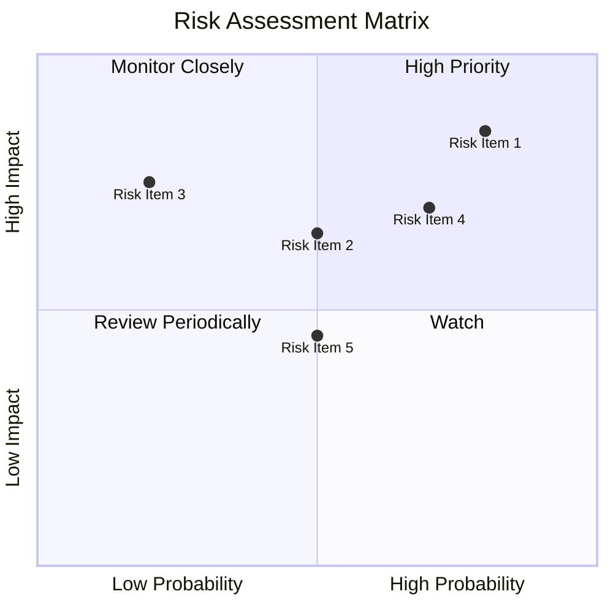

### 9.2 風險清單詳細分析

| # | 風險項目 | 發生機率 | 財務衝擊 | 風險評分 | 緩解措施 |
|---|----------|----------|----------|----------|----------|
| 1 | 🔴 **技術變遷** | 高 (80%) | 高 (-20%收入) | 🔴 8.5/10 | 加強研發投入，保持技術領先 |
| 2 | 🟡 **市場波動** | 中 (50%) | 中 (-10%收入) | 🟡 6.5/10 | 多樣化市場和產品組合 |
| 3 | 🟡 **地緣政治風險** | 低 (20%) | 高 (-15%收入) | 🟡 7.5/10 | 擴大本地供應鏈，降低依賴 |

---

## 10. 投資建議

### 10.1 最終綜合評級雷達圖

```
╔══════════════════════════════════════════════════════════════════╗
║                    NVIDIA 綜合評級雷達圖                        ║
╠══════════════════════════════════════════════════════════════════╣
║                                                                  ║
║  基本面強度  9.0 ▓▓▓▓▓▓▓▓▓▓▓▓▓▓▓▓▓▓░░  ★★★★★                    ║
║  成長動能    9.0 ▓▓▓▓▓▓▓▓▓▓▓▓▓▓▓▓▓▓░░  ★★★★★                    ║
║  獲利品質    10.0 ▓▓▓▓▓▓▓▓▓▓▓▓▓▓▓▓▓▓▓  ★★★★★                   ║
║  財務健康    8.0 ▓▓▓▓▓▓▓▓▓▓▓▓▓▓▓▓▓░░░  ★★★★☆                   ║
║  估值合理性  9.0 ▓▓▓▓▓▓▓▓▓▓▓▓▓▓▓▓▓▓░░  ★★★★★                    ║
║  綜合總分    9.0 ▓▓▓▓▓▓▓▓▓▓▓▓▓▓▓▓▓░░░  🏆 強烈買入              ║
╚══════════════════════════════════════════════════════════════════╝
```

### 10.2 目標價與隱含報酬率

| 情境 | 目標價 | 隱含報酬率 | 機率權重 |
|------|--------|------------|----------|
| 🟢 樂觀 | $380 | +93.4% | 30% |
| 🟡 基準 | $269.17 | +37.0% | 50% |
| 🔴 悲觀 | $140 | -28.8% | 20% |

### 10.3 買入時機與觸發因素

```
╔══════════════════════════════════════════════════════════════════╗
║                  ✅ 買入觸發因素 Checklist                      ║
╠══════════════════════════════════════════════════════════════════╣
║                                                                  ║
║  立即買入觸發條件（多數符合）：                                  ║
║  ✅ 強勁的季度業績超預期                                         ║
║  ✅ 新產品發佈成功                                                ║
║  ✅ 資料中心需求持續增長                                         ║
║                                                                  ║
║  加碼觸發條件（出現以下任一）：                                  ║
║  ☐ 股價回調至 $180 以下                                          ║
║  ☐ AI 技術突破性進展                                            ║
║                                                                  ║
║  減碼/停損觸發條件（出現以下任一）：                             ║
║  ☐ 技術領先地位喪失                                              ║
║  ☐ 全球市場需求大幅下滑                                         ║
╚══════════════════════════════════════════════════════════════════╝
```

### 10.4 投資人適配度分析

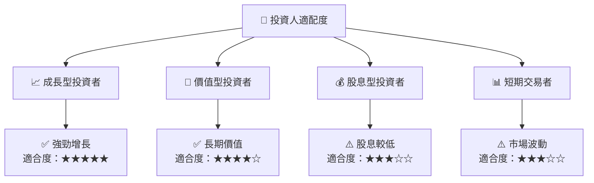

### 10.5 關鍵監控指標

| 監控類型 | 指標 | 關注點 | 頻率 |
|----------|------|--------|------|
| 營運績效 | 營業收入 | 季度增長率 | 季度 |
| 競爭地位 | 市場份額 | 產品競爭力 | 半年 |
| 財務健康 | 流動比率 | 短期負債能力 | 季度 |
| 技術發展 | 研發支出 | 技術創新 | 年度 |

---

> **免責聲明**：本報告為 AI 自動生成，僅供研究參考，不構成投資建議。投資有風險，入市需謹慎。