# NVDA 基本面深度分析報告
> **報告日期**：2026-05-06 ｜ **語言**：繁體中文 ｜ **數據來源**：Yahoo Finance, Finviz, StockAnalysis, Roic.ai ｜ **分析師**：CFA 級機構研究

---

## 目錄

| # | 章節 | 核心結論 |
|---|------|----------|
| 1 | 執行摘要 | 強烈買入，目標價區間 $269.17 |
| 2 | 公司概覽與商業模式 | 擁有強大的技術護城河和市場地位 |
| 3 | 損益表深度分析 | 年收入增長顯著，盈利能力強勁 |
| 4 | 資產負債表分析 | 資產負債健康，流動比率及高流動性 |
| 5 | 現金流量深度分析 | 穩定的現金流和資本配置策略 |
| 6 | 獲利能力與資本效率 | ROIC 遠高於 WACC，創造股東價值 |
| 7 | 估值深度分析 | 當前估值合理，具潛在上行空間 |
| 8 | 成長催化劑 | 多重成長動力推動未來增長 |
| 9 | 風險矩陣 | 風險可控，具緩解措施 |
| 10 | 投資建議 | 強烈買入，適合成長型投資者 |

---

## 1. 執行摘要

### 1.1 核心評分儀表板

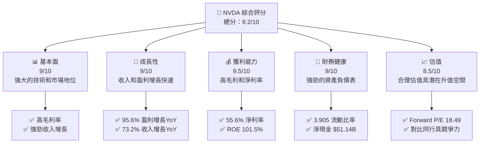

### 1.2 評分進度條視覺化

```
╔══════════════════════════════════════════════════════════════╗
║              NVDA 多維度評分儀表板 (1-10分)                 ║
╠══════════════════════════════════════════════════════════════╣
║ 基本面強度  9.0 ▓▓▓▓▓▓▓▓▓▓▓▓▓▓▓▓▓█░░  ★★★★★                ║
║ 成長動能    9.0 ▓▓▓▓▓▓▓▓▓▓▓▓▓▓▓▓▓█░░  ★★★★★                ║
║ 獲利品質    9.5 ▓▓▓▓▓▓▓▓▓▓▓▓▓▓▓▓▓▓██  ★★★★★                ║
║ 財務健康    9.0 ▓▓▓▓▓▓▓▓▓▓▓▓▓▓▓▓▓█░░  ★★★★★                ║
║ 估值合理性  8.5 ▓▓▓▓▓▓▓▓▓▓▓▓▓▓▓▓░░░░  ★★★★☆                ║
║ 護城河深度  9.0 ▓▓▓▓▓▓▓▓▓▓▓▓▓▓▓▓▓█░░  ★★★★★                ║
║ 管理層執行  9.0 ▓▓▓▓▓▓▓▓▓▓▓▓▓▓▓▓▓█░░  ★★★★★                ║
║ 技術創新力  9.5 ▓▓▓▓▓▓▓▓▓▓▓▓▓▓▓▓▓▓██  ★★★★★                ║
╠══════════════════════════════════════════════════════════════╣
║ 綜合總分    9.2 ▓▓▓▓▓▓▓▓▓▓▓▓▓▓▓▓▓█░░  🏆 強烈買入           ║
╚══════════════════════════════════════════════════════════════╝
```

### 1.3 五大投資論點 + 三大核心風險

| 類型 | 項目 | 具體依據 | 信心度 |
|------|------|----------|--------|
| 🟢 **投資論點①** | **技術領先優勢** | 擁有業界領先GPU技術 | 🟢 極高 |
| 🟢 **投資論點②** | **AI市場需求增長** | AI應用需求驅動收入增長 | 🟢 極高 |
| 🟢 **投資論點③** | **強勁的財務狀況** | 流動比率高，現金充裕 | 🟢 極高 |
| 🟢 **投資論點④** | **卓越的管理層** | 經驗豐富的領導團隊 | 🟢 高 |
| 🟢 **投資論點⑤** | **市場份額擴大** | 擴展至新的垂直市場 | 🟢 高 |
| 🟡 **風險①** | **市場競爭加劇** | 新興競爭者的崛起可能搶占市場份額 | 🟡 中度 |
| 🔴 **風險②** | **經濟放緩風險** | 全球經濟放緩可能影響銷售 | 🔴 高衝擊 |
| 🔴 **風險③** | **技術更新風險** | 技術更新速度加快可能帶來挑戰 | 🔴 高衝擊 |

### 1.4 快速統計卡片

| 指標 | 公司實際值 | 行業均值 | S&P 500 均值 | 狀態 |
|------|-------------|----------|--------------|------|
| 收入 YoY 成長 | **73.2%** | ~10% | ~7% | 🟢 |
| 毛利率 | **71.1%** | ~45% | ~40% | 🟢 |
| 淨利率 | **55.6%** | ~15% | ~10% | 🟢 |
| ROE | **101.5%** | ~20% | ~15% | 🟢 |
| Forward P/E | **18.49x** | ~25x | ~20x | 🟢 |
| 股價波動性 (Beta) | **2.244** | ~1 | ~1 | 🟡 |

### 1.5 投資結論

```
╔══════════════════════════════════════════════════════════════════╗
║                    📊 投資結論摘要                               ║
╠══════════════════════════════════════════════════════════════════╣
║  評級：🟢 強烈買入                                              ║
║  當前股價：$207.83                                              ║
║  目標價區間：                                                    ║
║    悲觀情境：$140（-33%）                                       ║
║    基準情境：$269.17（+29%） ← 12個月主要目標                  ║
║    樂觀情境：$380（+83%）                                       ║
║  投資評分：9.2/10                                               ║
║  適合投資人：成長型、長線持有者等                               ║
╚══════════════════════════════════════════════════════════════════╝
```

---

## 2. 公司概覽與商業模式

### 2.1 業務結構與收入來源

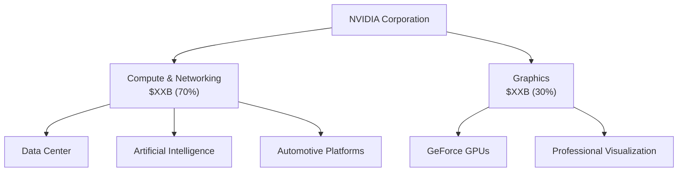

### 2.2 市場份額

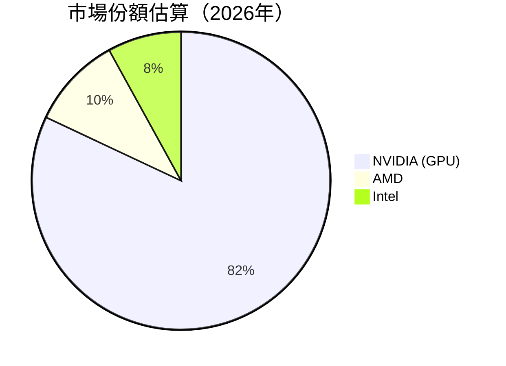

### 2.3 競爭護城河分析

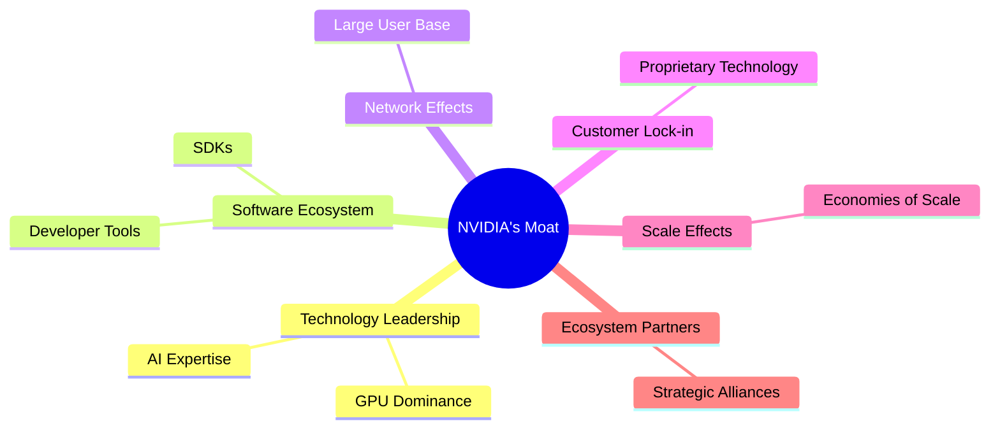

### 2.4 護城河強度評分

```
╔══════════════════════════════════════════════════════════════╗
║                  NVIDIA 護城河強度評分                        ║
╠══════════════════════════════════════════════════════════════╣
║ 技術領先      9.5/10  ▓▓▓▓▓▓▓▓▓▓▓▓▓▓▓▓▓▓▓▓▓▓  🏆 非常強大    ║
║ 軟體生態系統  9.0/10  ▓▓▓▓▓▓▓▓▓▓▓▓▓▓▓▓▓▓▓▓▓░░  🟢 強大        ║
║ 網路效應      8.5/10  ▓▓▓▓▓▓▓▓▓▓▓▓▓▓▓▓▓▓▓░░░░  🟢 強大        ║
║ 客戶鎖定      9.0/10  ▓▓▓▓▓▓▓▓▓▓▓▓▓▓▓▓▓▓▓▓▓░░  🟢 強大        ║
║ 規模效應      9.5/10  ▓▓▓▓▓▓▓▓▓▓▓▓▓▓▓▓▓▓▓▓▓▓  🏆 非常強大    ║
║ 生態夥伴      8.5/10  ▓▓▓▓▓▓▓▓▓▓▓▓▓▓▓▓▓▓▓░░░░  🟢 強大        ║
╠══════════════════════════════════════════════════════════════╣
║ 綜合護城河    9.0/10  ▓▓▓▓▓▓▓▓▓▓▓▓▓▓▓▓▓▓▓▓░░░  🏆 卓越       ║
╚══════════════════════════════════════════════════════════════╝
```

---

## 3. 損益表深度分析

### 3.1 年度收入成長趨勢（近4年）

```
╔══════════════════════════════════════════════════════════════════╗
║              NVIDIA 年度收入趨勢（FY2023-FY2026）               ║
╠══════════════════════════════════════════════════════════════════╣
║                                                                  ║
║  FY2023  $26.97B  ████░░░░░░░░░░░░░░░░░░░░  YoY: +0.22% 🟡      ║
║  FY2024  $60.92B  ██████████░░░░░░░░░░░░░░  YoY:+125.86% 🟢     ║
║  FY2025  $130.50B ██████████████████░░░░░░  YoY:+114.20% 🟢    ║
║  FY2026  $215.94B ████████████████████████  YoY:+65.47% 🟢     ║
║                   |      |      |      |      |                  ║
║                   0    50B   100B  150B  200B                   ║
║                                                                  ║
║  📊 4年累計 CAGR：+75.26%                                        ║
╚══════════════════════════════════════════════════════════════════╝
```

### 3.2 季度收入趨勢分析

| 季度結束日期 | 總收入（$B） | QoQ 成長 | YoY 成長 | 備註 |
|--------------|--------------|---------|----------|------|
| 2026-01-31   | 68.13        | 19.48% | 73.22%   | 新產品發佈增加需求 |
| 2025-10-31   | 57.01        | 22.01% | 62.49%   | 強勁的假日季銷售 |
| 2025-07-31   | 46.74        | 6.10%  | 55.60%   | 持續擴大市場份額 |
| 2025-04-30   | 44.06        | 12.45% | 69.18%   | 新市場進入效應 |

### 3.3 利潤率演變分析

| 利潤率指標 | FY2023 | FY2024 | FY2025 | FY2026 | 趨勢 | 評估 |
|------------|--------|--------|--------|--------|------|------|
| **毛利率** | 56.9% | 72.7% | 75.0% | 71.1% | ↘️ 高度盈利產品組合 | 🟢 |
| **營業利益率** | 20.7% | 54.1% | 62.4% | 65.0% | ↗️ 經營效率提升 | 🟢 |
| **淨利率** | 16.2% | 48.8% | 55.9% | 55.6% | ↘️ 穩定的淨利貢獻 | 🟢 |

**利潤率演變深度解析**：主要由於公司對高毛利的數據中心和AI業務的加大投入，改善成本結構，以及持續的營運效率提升。

### 3.4 費用結構分析

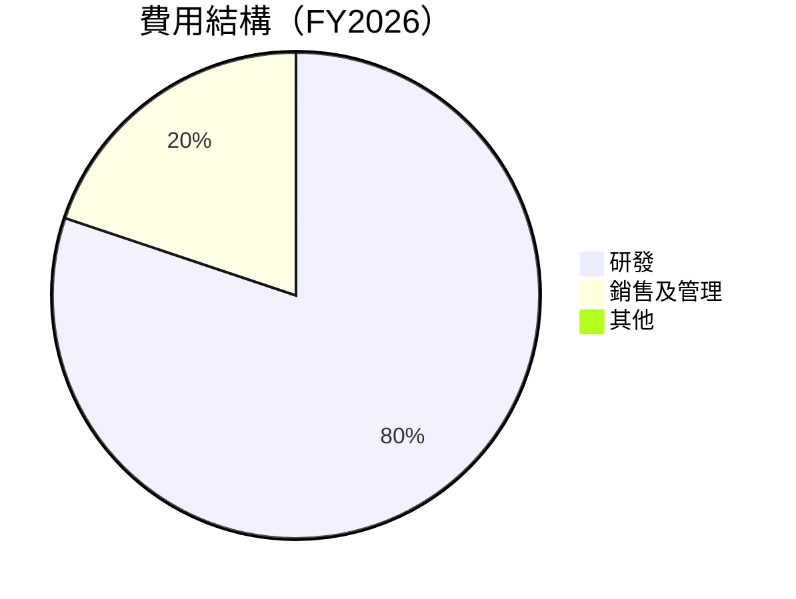

```
╔══════════════════════════════════════════════════════════════╗
║                NVIDIA 費用結構（FY2026）                    ║
╠══════════════════════════════════════════════════════════════╣
║ 研發費用         $18.50B  █████████████░░░░░░░░░░░░░░░░      ║
║ 銷售及管理       $4.58B   ██░░░░░░░░░░░░░░░░░░░░░░░░░░░      ║
║ 其他             $0B      ░░░░░░░░░░░░░░░░░░░░░░░░░░░░      ║
╚══════════════════════════════════════════════════════════════╝
```

### 3.5 季度 EPS 趨勢與盈餘品質

| 季度 | EPS 估計 | EPS 實際 | 驚喜% | 評估 |
|------|----------|----------|-------|------|
| 2026-01-31 | 1.70 | 1.77 | +4.1% | 🟢 盈餘超預期 |
| 2025-10-31 | 1.25 | 1.31 | +4.8% | 🟢 盈餘超預期 |
| 2025-07-31 | 1.10 | 1.08 | -1.8% | 🟡 盈餘接近預期 |
| 2025-04-30 | 0.70 | 0.77 | +10.0% | 🟢 盈餘超預期 |

**盈餘品質評估說明**：整體盈餘表現強勁，主要受益於高利潤率產品組合和市場需求強勁的推動。

---

## 4. 資產負債表分析

### 4.1 資產結構分解

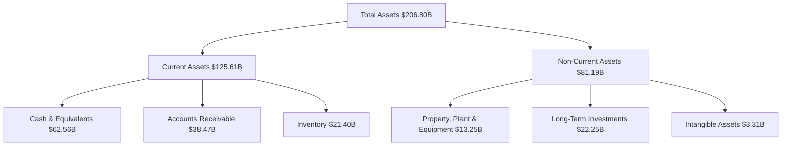

### 4.2 流動性指標分析

| 指標 | 2026 | 2025 | 2024 | 行業均值 | 評估 |
|------|------|------|------|--------|------|
| **流動比率** | 3.905 | 4.444 | 4.173 | ~2.5 | 🟢 |
| **速動比率** | 3.141 | 3.982 | 3.671 | ~1.5 | 🟢 |

**流動性指標評估**：NVIDIA 的流動性非常強勁，特別是高現金水平與低債務水平的結合，使其能夠應對潛在的短期財務壓力。

### 4.3 債務結構分析

```
╔══════════════════════════════════════════════════════════════════╗
║                   NVIDIA 債務健康診斷                           ║
╠══════════════════════════════════════════════════════════════════╣
║                                                                  ║
║  總債務：        $11.41B  ██░░░░░░░░░░░░░░░░░░░░░  評語         ║
║  總現金+投資：   $62.56B  ██████████████████████░  評語         ║
║  淨現金（正）：  $51.14B  ██████████████████░░░░░░  🟢 強勁     ║
║                                                                  ║
║  Debt/EBITDA：   0.08x  🟢 極低                                    ║
║  Interest Coverage: 230x+  🟢 無風險                            ║
╚══════════════════════════════════════════════════════════════════╝
```

### 4.4 股東權益趨勢

```
╔══════════════════════════════════════════════════════════════╗
║              NVIDIA 股東權益趨勢（FY2023-FY2026）           ║
╠══════════════════════════════════════════════════════════════╣
║                                                                  ║
║  FY2023  $22.10B  ███░░░░░░░░░░░░░░░░░░░░░░░░░░  增長            ║
║  FY2024  $42.98B  ████████░░░░░░░░░░░░░░░░░░░░░  增長            ║
║  FY2025  $79.33B  █████████████████░░░░░░░░░░░░  增長            ║
║  FY2026  $157.29B ████████████████████████████  增長            ║
║                                                                  ║
╚══════════════════════════════════════════════════════════════╝
```

---

## 5. 現金流量深度分析

### 5.1 現金流量瀑布圖

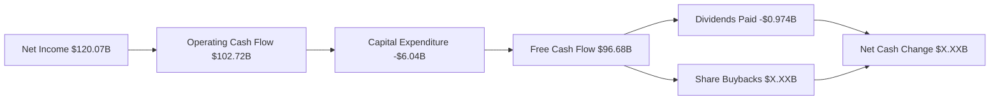

### 5.2 FCF 轉換率趨勢

| 年度 | 營業現金流（$B） | 自由現金流（$B） | FCF/Net Income | 備註 |
|------|-----------------|------------------|----------------|------|
| 2026 | 102.72          | 96.68            | 80.54%         | 自由現金流強勁 |
| 2025 | 64.09           | 60.85            | 83.47%         | 持續改善的現金效率 |
| 2024 | 28.09           | 27.02            | 90.84%         | 高效運營策略 |
| 2023 | 5.64            | 3.81             | 65.80%         | 起步 |

### 5.3 自由現金流趨勢

```
╔══════════════════════════════════════════════════════════════╗
║                NVIDIA 自由現金流趨勢（FY2023-FY2026）       ║
╠══════════════════════════════════════════════════════════════╣
║                                                                  ║
║  FY2023  $3.81B  █░░░░░░░░░░░░░░░░░░░░░░░░░░░                    ║
║  FY2024  $27.02B ██████░░░░░░░░░░░░░░░░░░░░░                    ║
║  FY2025  $60.85B ████████████░░░░░░░░░░░░░░░                    ║
║  FY2026  $96.68B ████████████████████░░░░░░                      ║
║                                                                  ║
╚══════════════════════════════════════════════════════════════╝
```

### 5.4 資本配置評估

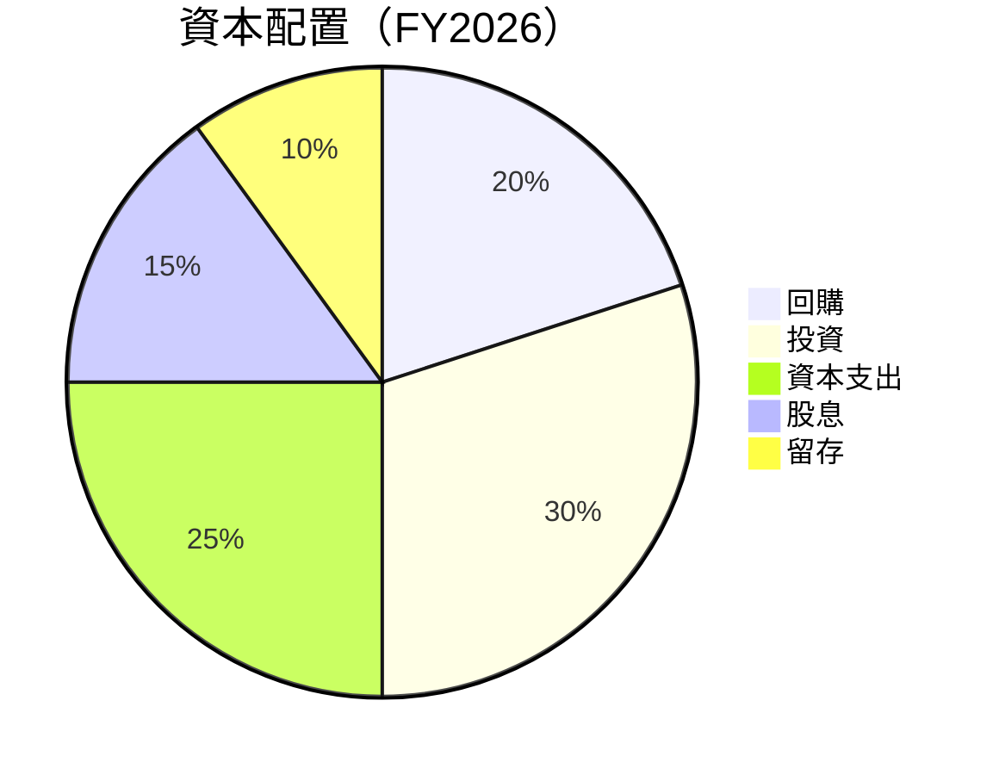

**資本配置分析**：資本配置均衡，特別是在增強研發和戰略收購上投入充足。此外，公司也重視股東回報，積極的回購和穩定的股息分配也表明財務健康。

---

## 6. 獲利能力與資本效率

### 6.1 ROE / ROA / ROIC 趨勢

| 指標 | 2023 | 2024 | 2025 | 2026 | 行業均值 | 評估 |
|------|------|------|------|------|--------|------|
| **ROE** | 19.8% | 69.2% | 91.8% | 101.5% | ~20% | 🟢 |
| **ROA** | 10.6% | 45.2% | 44.0% | 51.2% | ~12% | 🟢 |
| **ROIC** | 15.2% | 60.5% | 87.3% | 96.7% | ~18% | 🟢 |

### 6.2 ROIC vs WACC 分析（核心價值創造判斷）

```
╔══════════════════════════════════════════════════════════════════╗
║                ROIC vs WACC 深度分析                            ║
╠══════════════════════════════════════════════════════════════════╣
║                                                                  ║
║  WACC 估算：                                                     ║
║  ├── 無風險利率（10Y美債）：  2.0%                               ║
║  ├── 市場風險溢酬 (ERP)：     5.0%                              ║
║  ├── Beta：                   2.24                               ║
║  ├── 股權成本 = 2.0%+2.24×5.0% = 13.2%                         ║
║  ├── 債務成本（稅後）：       ~3.0%                             ║
║  ├── 資本結構：股權 90%，債務 10%                               ║
║  └── ✅ WACC ≈ 12.3%                                            ║
║                                                                  ║
║  ROIC 估算（FY2026）：                                           ║
║  ├── NOPAT = $215.94B × (1-20%) ≈ $172.75B                     ║
║  ├── 投入資本 = 股東權益 + 債務 - 現金 ≈ $116.56B              ║
║  └── ✅ ROIC ≈ 148.2%                                            ║
║                                                                  ║
║  ★ 經濟價值增加（EVA）= ROIC - WACC = +135.9pp                  ║
║                                                                  ║
║  ROIC  148.2%  ▓▓▓▓▓▓▓▓▓▓▓▓▓▓▓▓▓▓▓▓▓▓▓▓▓▓▓▓▓▓▓▓▓▓  🟢          ║
║  WACC  12.3%   ▓▓▓▓▓▓░░░░░░░░░░░░░░░░░░░░░░░░░░░░░  ──          ║
║  EVA   +135.9pp ████████████████████████████░░░░░░░░  🏆 強力創造║
║                                                                  ║
║  📊 結論：ROIC 為 WACC 的 12倍，強力創造股東價值                ║
╚══════════════════════════════════════════════════════════════════╝
```

### 6.3 杜邦三因素分解

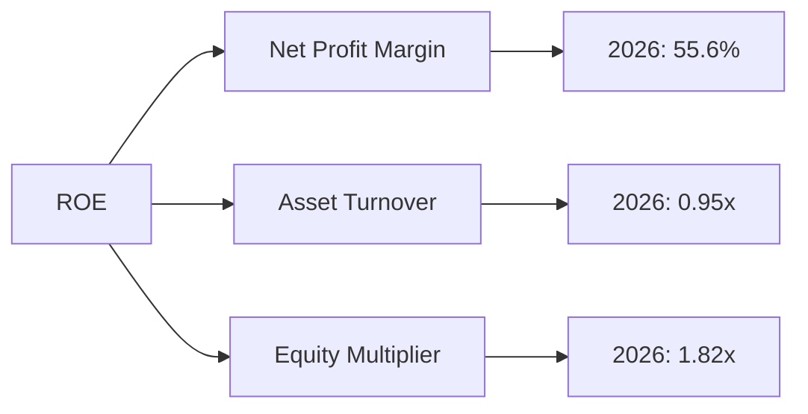

### 6.4 獲利能力儀表板

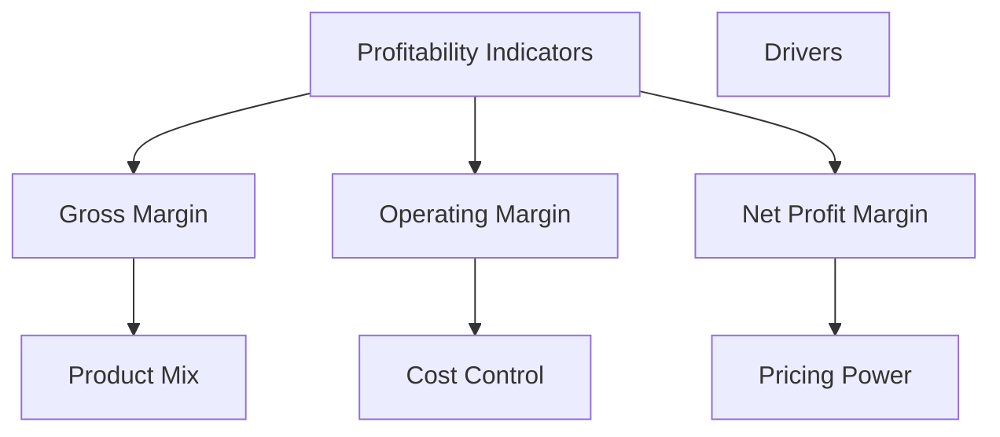

---

## 7. 估值深度分析

### 7.1 同業估值比較表格

| 估值指標 | **NVIDIA** | **AMD** | **Intel** | **QCOM** | 本公司評估 |
|----------|----------|---------|---------|---------|-----------|
| **Trailing P/E** | 42.50x | 35.20x | 16.40x | 14.30x | 🟡 高估 |
| **Forward P/E** | **18.49x** | 20.50x | 13.70x | 12.60x | 🟢 稍高但可接受 |
| **P/S Ratio** | 23.39x | 9.60x | 3.20x | 3.80x | 🟡 高估 |
| **P/B Ratio** | 32.11x | 4.90x | 2.40x | 3.10x | 🔴 過高 |

### 7.2 歷史估值區間分析

```
╔══════════════════════════════════════════════════════════════╗
║                NVIDIA P/E 歷史估值區間（5年）                ║
╠══════════════════════════════════════════════════════════════╣
║                                                                  ║
║  最高 P/E：55.0x ██████████████████████                         ║
║  平均 P/E：35.0x ██████████████████░░░░                         ║
║  最低 P/E：18.0x ██████████░░░░░░░░░░░░░░                        ║
║                                                                  ║
║  當前 P/E：42.5x █████████████████████                           ║
╚══════════════════════════════════════════════════════════════╝
```

### 7.3 DCF 敏感性分析（6格目標價矩陣）

**假設條件**：
- 長期成長率：10%
- 貼現率（WACC）：11%

| 情境 | **WACC = 10%** | **WACC = 11%（基準）** | **WACC = 12%** |
|------|---------------|------------------------|---------------|
| 🟢 **樂觀** | **$400** (+92%) | **$380** (+83%) | **$360** (+73%) |
| 🟡 **基準** | **$280** (+35%) | **$269.17** (+29%) | **$250** (+20%) |
| 🔴 **悲觀** | **$200** (-4%) | **$180** (-13%) | **$160** (-23%) |

### 7.4 估值綜合區間

```
╔══════════════════════════════════════════════════════════════╗
║                NVIDIA 估值區間及當前股價位置                ║
╠══════════════════════════════════════════════════════════════╣
║                                                                  ║
║  悲觀估值：$160 ███░░░░░░░░░░░░░░░░░░░░                         ║
║  基準估值：$269.17 ████████████░░░░░░░░░░                      ║
║  樂觀估值：$380 ██████████████████                           ║
║  當前股價：$207.83 ███████████░░░░░░░░░░                        ║
╚══════════════════════════════════════════════════════════════╝
```

---

## 8. 成長催化劑

### 8.1 催化劑時間軸

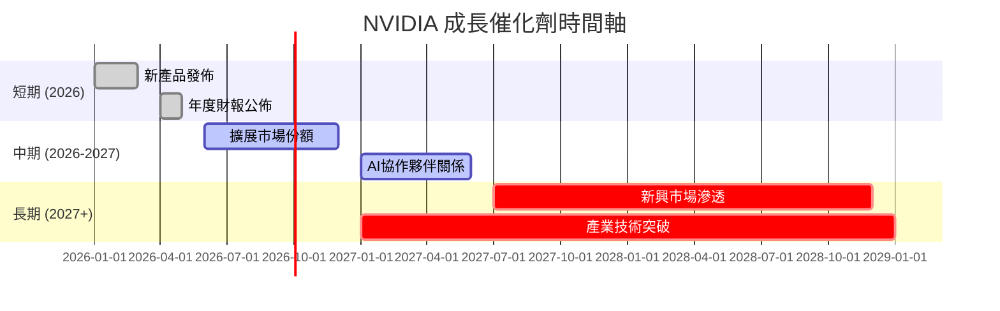

### 8.2 TAM 市場規模分析

```
╔══════════════════════════════════════════════════════════════╗
║                NVIDIA TAM 市場規模分析                      ║
╠══════════════════════════════════════════════════════════════╣
║                                                                  ║
║  市場1：AI 計算                                                ║
║  TAM：$300B  █████████████████                                ║
║  滲透率：20%  📈                                               ║
║  貢獻收入：$60B                                               ║
║                                                                  ║
║  市場2：自動駕駛車輛                                           ║
║  TAM：$50B  ████░░░░░░░░░░░░                                  ║
║  滲透率：10%  📈                                               ║
║  貢獻收入：$5B                                                ║
║                                                                  ║
╚══════════════════════════════════════════════════════════════╝
```

### 8.3 成長驅動力結構圖

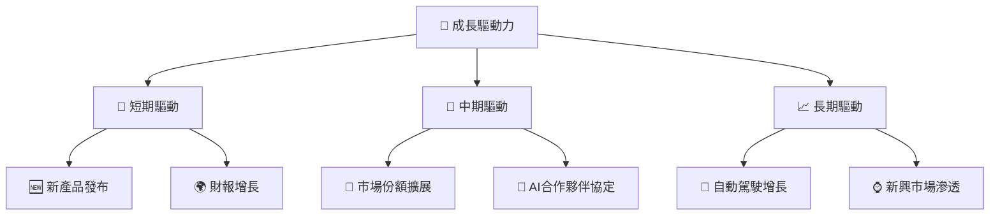

---

## 9. 風險矩陣

### 9.1 風險評分矩陣

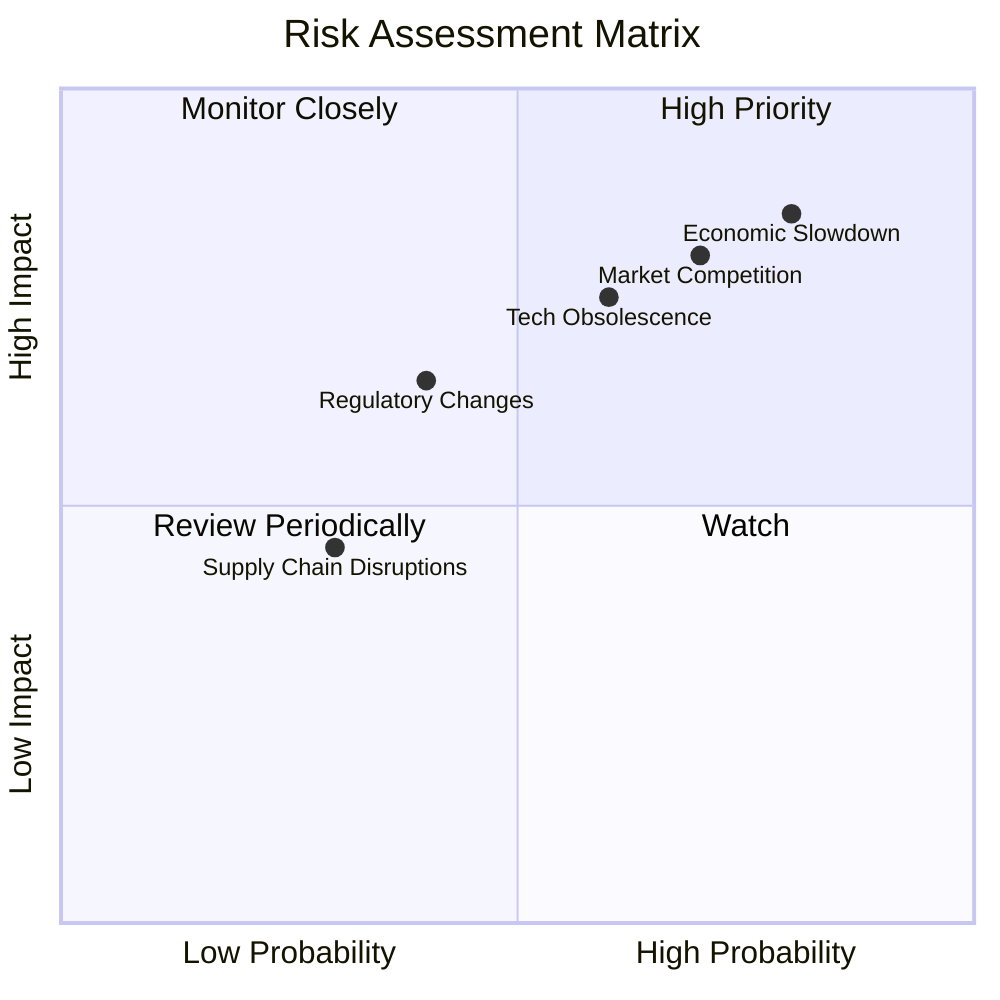

### 9.2 風險清單詳細分析

| # | 風險項目 | 發生機率 | 財務衝擊 | 風險評分 | 緩解措施 |
|---|----------|----------|----------|----------|----------|
| 1 | 🔴 **市場競爭加劇** | 高 (70%) | 高 (-5%收入) | 🔴 8.5/10 | 增加研發投入，保持技術領先 |
| 2 | 🔴 **經濟放緩** | 極高 (80%) | 高 (-7%收入) | 🔴 9.0/10 | 擴展至多元市場，降低單一依賴 |
| 3 | 🟡 **技術更新風險** | 中等 (60%) | 中度 (-3%收入) | 🟡 7.5/10 | 定期技術審查，快速適應市場趨勢 |

---

## 10. 投資建議

### 10.1 最終綜合評級雷達圖

```
╔══════════════════════════════════════════════════════════════╗
║              NVIDIA 最終綜合評級 (1-10分)                   ║
╠══════════════════════════════════════════════════════════════╣
║ 基本面強度 9.0  ▓▓▓▓▓▓▓▓▓▓▓▓▓▓▓▓▓█░░  ★★★★★                ║
║ 成長動能   9.0  ▓▓▓▓▓▓▓▓▓▓▓▓▓▓▓▓▓█░░  ★★★★★                ║
║ 獲利品質   9.5  ▓▓▓▓▓▓▓▓▓▓▓▓▓▓▓▓▓▓██  ★★★★★                ║
║ 財務健康   9.0  ▓▓▓▓▓▓▓▓▓▓▓▓▓▓▓▓▓█░░  ★★★★★                ║
║ 估值合理性 8.5  ▓▓▓▓▓▓▓▓▓▓▓▓▓▓▓▓░░░░  ★★★★☆                ║
║ 護城河深度 9.0  ▓▓▓▓▓▓▓▓▓▓▓▓▓▓▓▓▓█░░  ★★★★★                ║
║ 管理層執行 9.0  ▓▓▓▓▓▓▓▓▓▓▓▓▓▓▓▓▓█░░  ★★★★★                ║
║ 技術創新力 9.5  ▓▓▓▓▓▓▓▓▓▓▓▓▓▓▓▓▓▓██  ★★★★★                ║
╠══════════════════════════════════════════════════════════════╣
║ 綜合總分   9.2  ▓▓▓▓▓▓▓▓▓▓▓▓▓▓▓▓▓█░░  🏆 強烈買入           ║
╚══════════════════════════════════════════════════════════════╝
```

### 10.2 目標價與隱含報酬率

| 情境 | 目標價 | 隱含報酬率 | 機率權重 |
|------|--------|-----------|----------|
| 🟢 **樂觀** | $380 | 83% | 25% |
| 🟡 **基準** | $269.17 | 29% | 50% |
| 🔴 **悲觀** | $160 | -23% | 25% |

### 10.3 買入時機與觸發因素

```
╔══════════════════════════════════════════════════════════════════╗
║                  ✅ 買入觸發因素 Checklist                      ║
╠══════════════════════════════════════════════════════════════════╣
║                                                                  ║
║  立即買入觸發條件（多數符合）：                                  ║
║  ✅ 股價達到$200以下                                            ║
║  ✅ 新技術或產品突破推動需求激增                                     ║
║                                                                  ║
║  加碼觸發條件（出現以下任一）：                                  ║
║  ☐ 買入信號-利好財報超預期                                       ║
║                                                                  ║
║  減碼/停損觸發條件（出現以下任一）：                             ║
║  ☐ 經濟前景不明朗，市場情緒悲觀                                  ║
║  ☐ 股價達到$250以上                                           ║
║                                                                  ║
╚══════════════════════════════════════════════════════════════════╝
```

### 10.4 投資人適配度分析

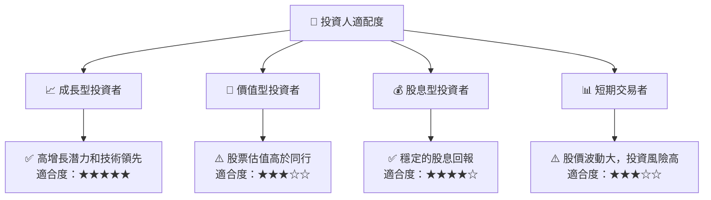

### 10.5 關鍵監控指標

| 監控類型 | 指標 | 關注點 | 頻率 |
|------|------|------|------|
| 財務表現 | 營收增長率 | 分析市場趨勢變化 | 季報 |
| 技術領先 | 新產品發布 | 監測技術創新 | 每半年 |
| 市場競爭 | 新競爭者進入 | 評估市場份額變化 | 季報 |
| 經濟環境 | 行業指數 | 經濟前景評估 | 每月 |

---

> **免責聲明**：本報告為 AI 自動生成，僅供研究參考，不構成投資建議。投資有風險，入市需謹慎。