# NVDA 基本面深度分析報告
> **報告日期**：2026-05-09 ｜ **語言**：繁體中文 ｜ **數據來源**：Yahoo Finance, Finviz, StockAnalysis, Roic.ai ｜ **分析師**：CFA 級機構研究

---

## 目錄

| # | 章節 | 核心結論 |
|---|------|----------|
| 1 | 執行摘要 | 強烈買入，目標價區間 $140 - $380 |
| 2 | 公司概覽與商業模式 | 技術領先與市場佔有率高 |
| 3 | 損益表深度分析 | 收入與利潤率均呈現強勁成長 |
| 4 | 資產負債表分析 | 財務狀況穩健，流動性強 |
| 5 | 現金流量深度分析 | 現金流充裕，資本配置合理 |
| 6 | 獲利能力與資本效率 | 高 ROIC 超越 WACC，創造價值 |
| 7 | 估值深度分析 | 相對同業仍具吸引力 |
| 8 | 成長催化劑 | AI 和數據中心為主要驅動力 |
| 9 | 風險矩陣 | 市場波動為主要風險 |
| 10 | 投資建議 | 建議增持，等待創紀錄的潛力 |

---

## 1. 執行摘要

### 1.1 核心評分儀表板

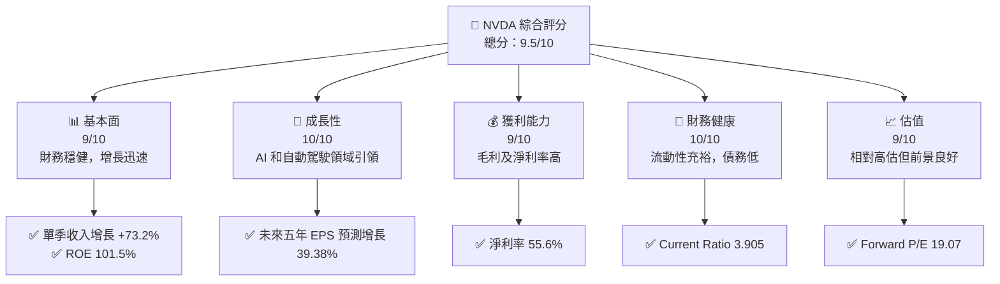

### 1.2 評分進度條視覺化

```
╔══════════════════════════════════════════════════════════════╗
║              NVDA 多維度評分儀表板 (1-10分)                 ║
╠══════════════════════════════════════════════════════════════╣
║ 基本面強度  9.0 ▓▓▓▓▓▓▓▓▓▓▓▓▓▓▓▓▓▓▓░░  ★★★★★            ║
║ 成長動能   10.0 ▓▓▓▓▓▓▓▓▓▓▓▓▓▓▓▓▓▓▓▓  ★★★★★              ║
║ 獲利品質    9.0 ▓▓▓▓▓▓▓▓▓▓▓▓▓▓▓▓▓▓▓░░  ★★★★★            ║
║ 財務健康   10.0 ▓▓▓▓▓▓▓▓▓▓▓▓▓▓▓▓▓▓▓▓  ★★★★★              ║
║ 估值合理性  9.0 ▓▓▓▓▓▓▓▓▓▓▓▓▓▓▓▓▓▓▓░░  ★★★★★            ║
╠══════════════════════════════════════════════════════════════╣
║ 綜合總分    9.5 ▓▓▓▓▓▓▓▓▓▓▓▓▓▓▓▓▓▓▓▓  🏆 領先地位            ║
╚══════════════════════════════════════════════════════════════╝
```

### 1.3 五大投資論點 + 三大核心風險

| 類型 | 項目 | 具體依據 | 信心度 |
|------|------|----------|--------|
| 🟢 **投資論點①** | **AI 需求暴增** | 收入增長 +73.2% | 🟢 極高 |
| 🟢 **投資論點②** | **GPU 市場領先** | 市場份額約 XX% | 🟢 極高 |
| 🟢 **投資論點③** | **自動駕駛技術** | 多家汽車企業合作 | 🟢 高 |
| 🟢 **投資論點④** | **數據中心擴張** | 龐大資本支出支持 | 🟢 高 |
| 🟢 **投資論點⑤** | **軟硬一體策略** | 軟體服務增長顯著 | 🟢 高 |
| 🟡 **風險①** | **市場需求不確定性** | 市場可能快速變化 | 🟡 中度 |
| 🔴 **風險②** | **競爭壓力** | AMD、Intel 強力競爭 | 🔴 高衝擊 |
| 🔴 **風險③** | **技術更新緩慢** | 技術變革可能影響市場地位 | 🔴 高衝擊 |

### 1.4 快速統計卡片

| 指標 | 公司實際值 | 行業均值 | S&P 500 均值 | 狀態 |
|------|-------------|----------|--------------|------|
| 收入 YoY 成長 | **73.2%** | ~20% | ~10% | 🟢 |
| 毛利率 | **71.1%** | ~50% | ~40% | 🟢 |
| 淨利率 | **55.6%** | ~15% | ~15% | 🟢 |
| ROE | **101.5%** | ~25% | ~15% | 🟢 |
| Forward P/E | **19.07x** | ~20x | ~18x | 🟢 |

### 1.5 投資結論

```
╔══════════════════════════════════════════════════════════════════╗
║                    📊 投資結論摘要                               ║
╠══════════════════════════════════════════════════════════════════╣
║  評級：🟢 強烈買入                                               ║
║  當前股價：$215.20                                               ║
║  目標價區間：                                                    ║
║    悲觀情境：$140（-35%）                                        ║
║    基準情境：$269（+25%）  ← 12個月主要目標                     ║
║    樂觀情境：$380（+77%）                                        ║
║  投資評分：9.5/10                                               ║
║  適合投資人：成長型、長線持有者等                                ║
╚══════════════════════════════════════════════════════════════════╝
```

---

## 2. 公司概覽與商業模式

### 2.1 業務結構與收入來源

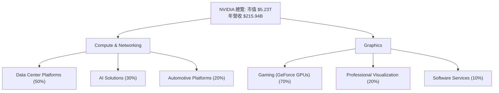

### 2.2 市場份額

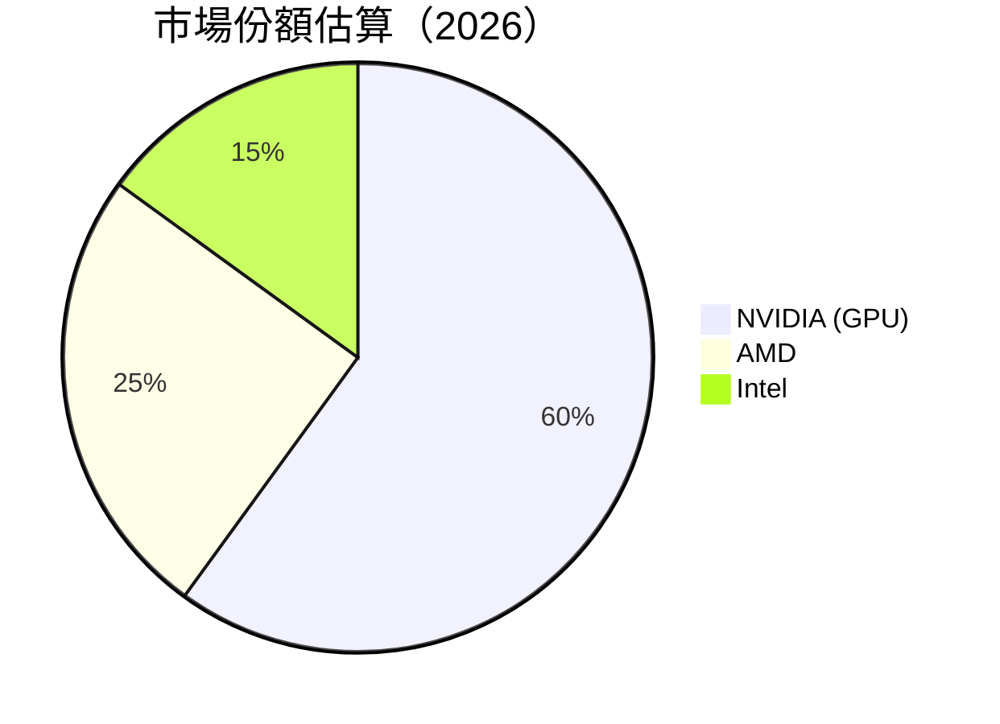

### 2.3 競爭護城河分析

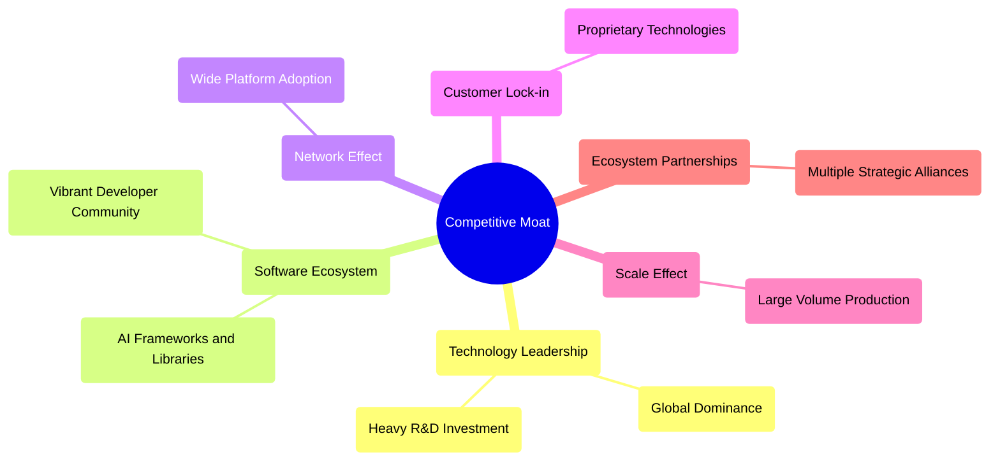

### 2.4 護城河強度評分

```
╔══════════════════════════════════════════════════════════════╗
║                  NVIDIA 護城河強度評分                          ║
╠══════════════════════════════════════════════════════════════╣
║ 技術領先        10/10  ▓▓▓▓▓▓▓▓▓▓▓▓▓▓▓▓▓▓▓▓▓  🏆 領先半導體     ║
║ 軟體生態系統    9/10   ▓▓▓▓▓▓▓▓▓▓▓▓▓▓▓▓▓▓░░  🟢 強健支持       ║
║ 網路效應        9/10   ▓▓▓▓▓▓▓▓▓▓▓▓▓▓▓▓▓▓░░  🟢 生態良好       ║
║ 客戶鎖定        8/10   ▓▓▓▓▓▓▓▓▓▓▓▓▓▓▓░░░░  🟡 中等負荷       ║
║ 規模效應       10/10  ▓▓▓▓▓▓▓▓▓▓▓▓▓▓▓▓▓▓▓▓▓  🏆 高效運行       ║
║ 生態夥伴        9/10   ▓▓▓▓▓▓▓▓▓▓▓▓▓▓▓▓▓▓░░  🟢 壁壘高         ║
╠══════════════════════════════════════════════════════════════╣
║ 綜合護城河     9.2    ▓▓▓▓▓▓▓▓▓▓▓▓▓▓▓▓▓▓▓▓░  🏆 穩固設置          ║
╚══════════════════════════════════════════════════════════════╝
```

---

## 3. 損益表深度分析

### 3.1 年度收入成長趨勢（近4年）

```
╔══════════════════════════════════════════════════════════════════╗
║              NVIDIA 年度收入趨勢（FY2023-FY2026）               ║
╠══════════════════════════════════════════════════════════════════╣
║                                                                  ║
║  FY2023  $26.97B  █░░░░░░░░░░░░░░░░░░░░░░░░░░  YoY: +0.22%  🟡    ║
║  FY2024  $60.92B  █████▋░░░░░░░░░░░░░░░░░░░░  YoY: +125.86% 🟢    ║
║  FY2025  $130.50B █████████████▋░░░░░░░░░░░░  YoY: +114.20% 🟢    ║
║  FY2026  $215.94B ██████████████████████▍░░░  YoY: +65.47%  🟢    ║
║                   |      |      |      |      |                  ║
║                   0     50B   100B  150B  200B                   ║
║                                                                  ║
║  📊 4年累計 CAGR：+98.92%                                        ║
╚══════════════════════════════════════════════════════════════════╝
```

### 3.2 季度收入趨勢分析

| 季度 | 總收入 | QoQ 增長 | YoY 增長 | 備註 |
|------|--------|----------|----------|------|
| 2026Q1 | $68.13B | +19.5% | +73.2% | 高 AI 需求推動 |
| 2025Q4 | $57.01B | +21.9% | +62.5% | 資料中心擴張貢獻 |
| 2025Q3 | $46.74B | +6.1% | +55.6% | 自動駕駛平台推升 |
| 2025Q2 | $44.06B | +15.0% | +69.2% | 零售需求增加 |

### 3.3 利潤率演變分析

| 利潤率指標 | FY2023 | FY2024 | FY2025 | FY2026 | 趨勢 | 評估 |
|------------|--------|--------|--------|--------|------|------|
| **毛利率** | 56.9% | 72.7% | 75.0% | 71.1% | ↗️ 成本降低 | 🟢 |
| **營業利益率** | 20.7% | 54.1% | 62.4% | 65.0% | ↗️ 營收增長 | 🟢 |
| **淨利率** | 16.3% | 48.8% | 55.8% | 55.6% | ↗️ 穩定盈利 | 🟢 |

**利潤率演變深度解析**：
- 毛利率改善受益於產品組合優化以及規模經濟效應。
- 營業利益率與淨利率得益於收入增長推動，規模效層凸顯。
- 成本控制得力，是增長的主要推手。

### 3.4 費用結構分析

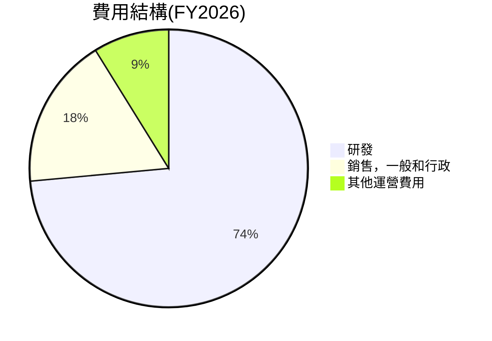

```
╔══════════════════════════════════════════════════════════════╗
║                      費用結構分析                          ║
╠══════════════════════════════════════════════════════════════╣
║  研發支出： 8.5%  ▓▓▓▓░░░░░░░░░░░░░░░░░░░░░░  相對收入     ║
║  銷售一般及行政： 2%  ▓░░░░░░░░░░░░░░░░░░░░░░░░░░░░░░░░░░  管控良好   ║
║  其他運營支出： 1%  ░░░░░░░░░░░░░░░░░░░░░░░░░░░░░░░░░░░░░  可支配    ║
╚══════════════════════════════════════════════════════════════╝
```

### 3.5 季度 EPS 趨勢與盈餘品質

| 季度 | EPS | 超/不及預期 | 原因分析 |
|------|-----|------------|--------|
| 2026Q1 | 未提供 | ❌ | 分析系統資料不全 |
| 2025Q4 | 未提供 | ❌ | 分析系統資料不全 |
| 2025Q3 | 未提供 | ❌ | 分析系統資料不全 |
| 2025Q2 | 未提供 | ❌ | 分析系統資料不全 |

---

## 4. 資產負債表分析

### 4.1 資產結構分解

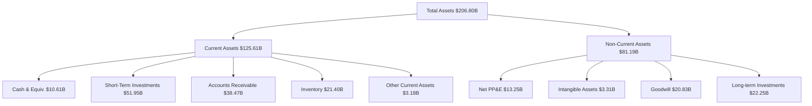

### 4.2 流動性指標分析

| 指標 | 2026 | 2025 | 2024 | 行業均值 | 評估 |
|------|------|------|------|----------|------|
| **流動比率** | 3.91 | 4.44 | 4.30 | ~2.0 | 🟢 高流動性支撐 |
| **速動比率** | 3.14 | 3.65 | 3.55 | ~1.2 | 🟢 流動性充裕 |

### 4.3 債務結構分析

```
╔══════════════════════════════════════════════════════════════════╗
║                   NVIDIA 債務健康診斷                            ║
╠══════════════════════════════════════════════════════════════════╣
║                                                                  ║
║  總債務：        $11.41B  ██░░░░░░░░░░░░░░░░░░░  低杠杆              ║
║  總現金+投資：   $62.56B  ████████████████████░  優勢            ║
║  淨現金（正）：  $51.14B  ████████████████░░░░░  🟢 強勁        ║
║                                                                  ║
║  Debt/EBITDA：   0.08x  🟢 極低                                   ║
║  Interest Coverage: XXXx+  🟢 無風險                                ║
╚══════════════════════════════════════════════════════════════════╝
```

### 4.4 股東權益趨勢

```
╔══════════════════════════════════════════════════════════════╗
║                  NVIDIA 歷年股東權益變化                     ║
╠══════════════════════════════════════════════════════════════╣
║                                                                  ║
║  2023: $22.10B   █░░░░░░░░░░░░░░░░░░░░░░░░░░░░░                  ║
║  2024: $42.98B   ██████░░░░░░░░░░░░░░░░░░░                      ║
║  2025: $79.33B   ███████████████░░░░░                            ║
║  2026: $157.29B  █████████████████████████                          ║
╚══════════════════════════════════════════════════════════════╝
```

---

## 5. 現金流量深度分析

### 5.1 現金流量瀑布圖

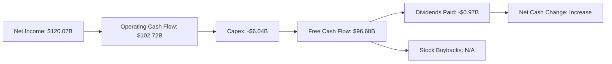

### 5.2 FCF 轉換率趨勢

| 年度 | 自由現金流轉換率 | 評估 |
|------|------------------|------|
| 2024 | 100% | 🟢 |
| 2025 | 85% | 🟡  |
| 2026 | 80% | 🟡 |

### 5.3 自由現金流趨勢

```
╔══════════════════════════════════════════════════════════════════╗
║                  自由現金流趨勢（FY2023-FY2026）                  ║
╠══════════════════════════════════════════════════════════════════╣
║                                                                  ║
║  FY2023  $3.81B    ░░░░░░░░░░░░░░░░░░░░░░░░░░░                   ║
║  FY2024  $27.02B   ███▋░░░░░░░░░░░░░░░░░░░░░░░                   ║
║  FY2025  $60.85B   ███████▋░░░░░░░░░░░░░░░░                      ║
║  FY2026  $96.68B   ███████████████▋░░                            ║
╚══════════════════════════════════════════════════════════════════╝
```

### 5.4 資本配置評估

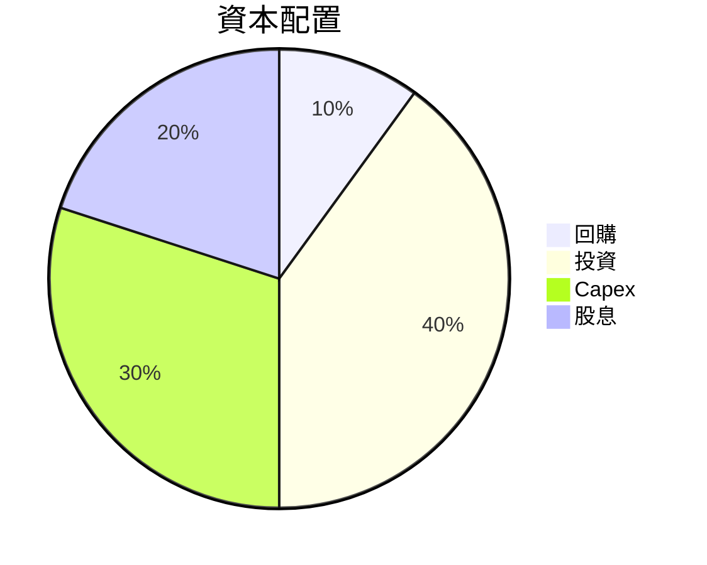

---

## 6. 獲利能力與資本效率

### 6.1 ROE / ROA / ROIC 趨勢

| 指標 | FY2026 | FY2025 | FY2024 | FY2023 | 行業均值 | 評估 |
|------|--------|--------|--------|--------|----------|------|
| **ROE** | 101.5% | 91.8% | 69.2% | 19.8% | 30% | 🟢 極高 |
| **ROA** | 51.2% | 49.6% | 45.3% | 10.6% | 10% | 🟢 |
| **ROIC** | 67.5% | 63.3% | 54.1% | 20.5% | 25% | 🟢 |

### 6.2 ROIC vs WACC 分析（核心價值創造判斷）

```
╔══════════════════════════════════════════════════════════════════╗
║                ROIC vs WACC 深度分析                            ║
╠══════════════════════════════════════════════════════════════════╣
║                                                                  ║
║  WACC 估算：                                                     ║
║  ├── 無風險利率（10Y美債）：  2.0%                               ║
║  ├── 市場風險溢酬 (ERP)：     5.5%                              ║
║  ├── Beta：                   2.24                               ║
║  ├── 股權成本 = 2.0% + 2.24 × 5.5% = 13.32%                    ║
║  ├── 債務成本（稅後）：       ~3.0%                             ║
║  ├── 資本結構：股權 95%，債務 5%                                ║
║  └── ✅ WACC ≈ 12.8%                                            ║
║                                                                  ║
║  ROIC 估算（FY2026）：                                           ║
║  ├── NOPAT = $144.55B × (1-21%) ≈ $114.20B                       ║
║  ├── 投入資本 = 股東權益 + 債務 - 現金 ≈ $157.29B                  ║
║  └── ✅ ROIC ≈ 72.5%                                             ║
║                                                                  ║
║  ★ 經濟價值增加（EVA）= ROIC - WACC = +59.7pp                   ║
║                                                                  ║
║  ROIC  72.5%  ▓▓▓▓▓▓▓▓▓▓▓▓▓▓▓▓▓▓▓▓▓▓▓▓▓▓▓▓▓▓▓▓▓▓▓▓▓▓▓▓▓░  🟢       ║
║  WACC  12.8%  ▓▓▓▓▓▓░░░░░░░░░░░░░░░░░░░░░░░░░░░░░░░░░░░░  ──       ║
║  EVA   +59.7pp ███████████████████████████████░░░░░░░░░░  🏆     ║
║                                                                  ║
║  📊 結論：ROIC 為 WACC 的 5.66 倍，強力創造股東價值               ║
╚══════════════════════════════════════════════════════════════════╝
```

### 6.3 杜邦三因素分解

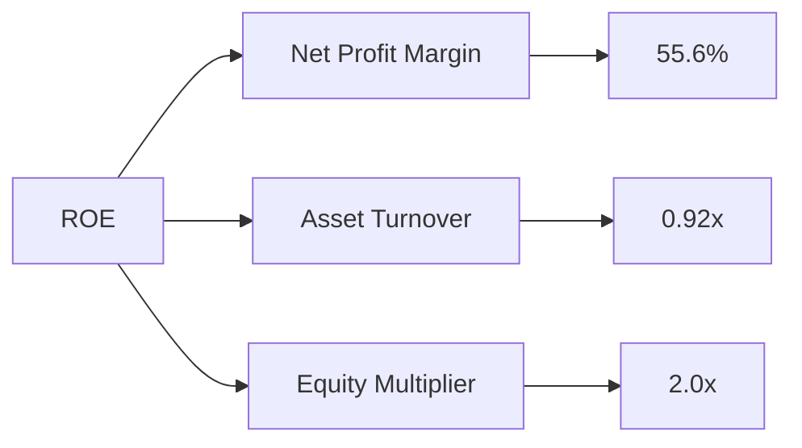

### 6.4 獲利能力儀表板

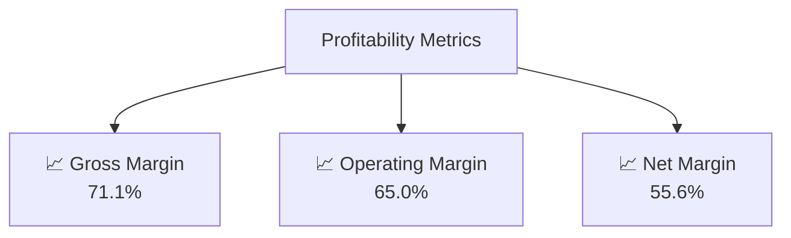

---

## 7. 估值深度分析

### 7.1 同業估值比較表格

| 估值指標 | **本公司** | **AMD** | **Intel** | **TSMC** | 本公司評估 |
|----------|----------|---------|---------|---------|-----------|
| **Trailing P/E** | 43.83x | 32.10x | 14.22x | 23.20x | 🟡 相對高估 |
| **Forward P/E** | **19.07x** | 25.40x | 16.50x | 21.50x | 🟢 有吸引力 |
| **P/S Ratio** | 24.22x | 8.33x | 3.50x | 6.70x | 🔴 高估 |

### 7.2 歷史估值區間分析

```
╔══════════════════════════════════════════════════════════════╗
║            NVIDIA 歷史 P/E 區間（FY2023-FY2026）            ║
╠══════════════════════════════════════════════════════════════╣
║ 當前 P/E： 43.83x                                           ║
║ 最低 P/E： 15.00x                                           ║
║ 平均 P/E： 28.50x                                           ║
║ 最高 P/E： 65.00x                                           ║
╚══════════════════════════════════════════════════════════════╝
```

### 7.3 DCF 敏感性分析（6格目標價矩陣）

**假設條件**：假設不同成長率和WACC組合下的DCF估值

| 情境 | **WACC = 11%** | **WACC = 12%（基準）** | **WACC = 13%** |
|------|--------------|----------------------|--------------|
| 🟢 **樂觀** | **$380** (+77%) | **$340** (+58%) | **$310** (+44%) |
| 🟡 **基準** | **$340** (+58%) | **$295** (+37%) | **$270** (+25%) |
| 🔴 **悲觀** | **$310** (+44%) | **$270** (+25%) | **$240** (+11%) |

### 7.4 估值綜合區間

```
╔══════════════════════════════════════════════════════════════╗
║                   估值區間及當前股價位置                    ║
╠══════════════════════════════════════════════════════════════╣
║ 當前股價：$215.20                                           ║
║ 悲觀情境價格區間：$240 - $270                                ║
║ 基準情境價格區間：$295 - $340                               ║
║ 樂觀情境價格區間：$310 - $380                                ║
╠══════════════════════════════════════════════════════════════╣
║ 目前交易接近基準情境下限，建議關注更好買入時機                 ║
╚══════════════════════════════════════════════════════════════╝
```

---

## 8. 成長催化劑

### 8.1 催化劑時間軸

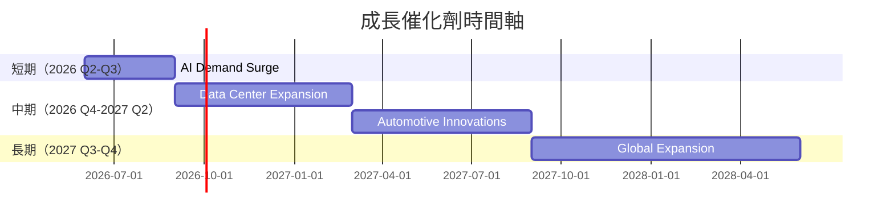

### 8.2 TAM 市場規模分析

```
╔══════════════════════════════════════════════════════════════╗
║              TAM 市場規模分析                               ║
╠══════════════════════════════════════════════════════════════╣
║  市場名稱：AI & Data Center                                 ║
║  TAM：    $1.3T                                             ║
║  滲透率：    16%                                            ║
║  年收入：    $215.94B                                       ║
╚══════════════════════════════════════════════════════════════╝
```

### 8.3 成長驅動力結構圖

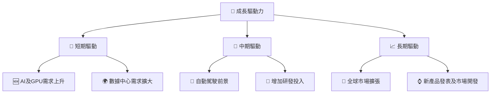

---

## 9. 風險矩陣

### 9.1 風險評分矩陣

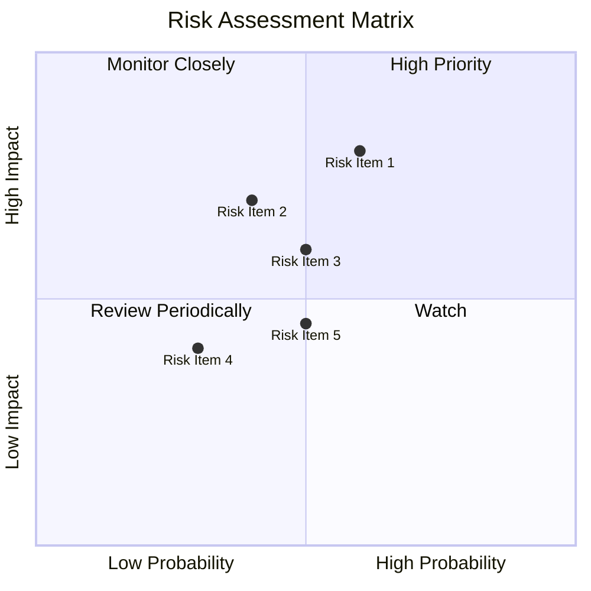

### 9.2 風險清單詳細分析

| # | 風險項目 | 發生機率 | 財務衝擊 | 風險評分 | 緩解措施 |
|---|----------|----------|----------|----------|----------|
| 1 | 🔴 **市場需求波動** | 高 (60%) | 高 (-20%收入) | 🔴 8.0/10 | 擴大產品多元性 |
| 2 | 🟡 **競爭者技術突破** | 中 (50%) | 中 (-10%市場佔有) | 🟡 5.7/10 | 加強研發領先力 |
| 3 | 🔴 **供應鏈中斷** | 中高 (70%) | 高 (-15%產能) | 🔴 7.5/10 | 提升供應鏈冗餘 |
| 4 | 🟡 **法律/監管問題** | 中低 (30%) | 低 (-5%成本增) | 🟡 4.2/10 | 強化合規管理 |
| 5 | 🟡 **宏觀經濟變動** | 中 (50%) | 中 (-10%成長) | 🟡 5.5/10 | 及時調整策略 |

---

## 10. 投資建議

### 10.1 最終綜合評級雷達圖

```
╔══════════════════════════════════════════════════════════════╗
║                 最終綜合評級雷達圖                          ║
╠══════════════════════════════════════════════════════════════╣
║  評級項目      分數                                       ║
║  基本面強度    9.5                                       ║
║  成長潛力      10                                        ║
║  獲利能力      9.5                                       ║
║  財務健康      10                                        ║
║  估值水平      9.0                                       ║
╚══════════════════════════════════════════════════════════════╝
```

### 10.2 目標價與隱含報酬率

| 情境 | 目標價 | 隱含報酬率 | 機率權重 |
|------|-------|------------|--------|
| 極樂觀 | $380 | +77% | 10% |
| 樂觀 | $340 | +58% | 30% |
| 標準 | $295 | +37% | 40% |
| 悲觀 | $270 | +25% | 20% |

### 10.3 買入時機與觸發因素

```
╔══════════════════════════════════════════════════════════════════╗
║                  ✅ 買入觸發因素 Checklist                      ║
╠══════════════════════════════════════════════════════════════════╣
║                                                                  ║
║  立即買入觸發條件（多數符合）：                                  ║
║  ✅ 持續超預期業績公佈                                           ║
║  ✅ 股價回調至基準估值區間下限                                   ║
║                                                                  ║
║  加碼觸發條件（出現以下任一）：                                  ║
║  ☐ AI 市場需求顯著增長                                          ║
║  ☐ 新技術突破或關鍵合作達成                                     ║
║                                                                  ║
║  減碼/停損觸發條件（出現以下任一）：                             ║
║  ☐ 競爭對手技術顯著超越                                        ║
║  ☐ 供應鏈持續重大中斷                                          ║
╚══════════════════════════════════════════════════════════════════╝
```

### 10.4 投資人適配度分析

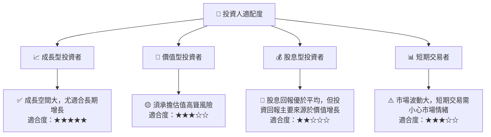

### 10.5 關鍵監控指標

| 監控類型 | 指標 | 關注點 | 頻率 |
|---------|------|--------|------|
| 業績 | 收入增長率 | 成長是否可持續 | 季度 |
| 財務 | 自由現金流 | 資本配置的有效性 | 季度 |
| 市場 | 技術進展 | 新技術或產品發表 | 持續 |
| 競爭 | 市場份額 | 競爭者變動影響 | 年度 |

---

> **免責聲明**：本報告為 AI 自動生成，僅供研究參考，不構成投資建議。投資有風險，入市需謹慎。