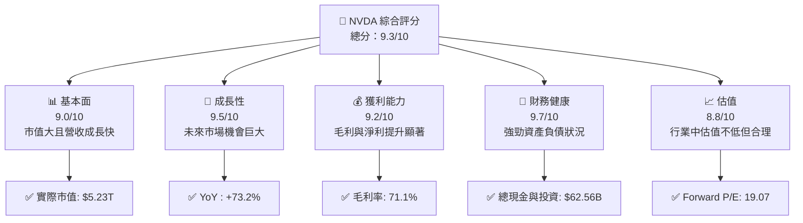
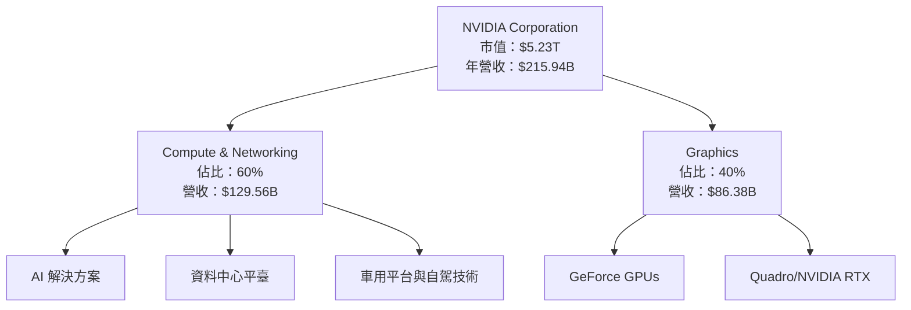
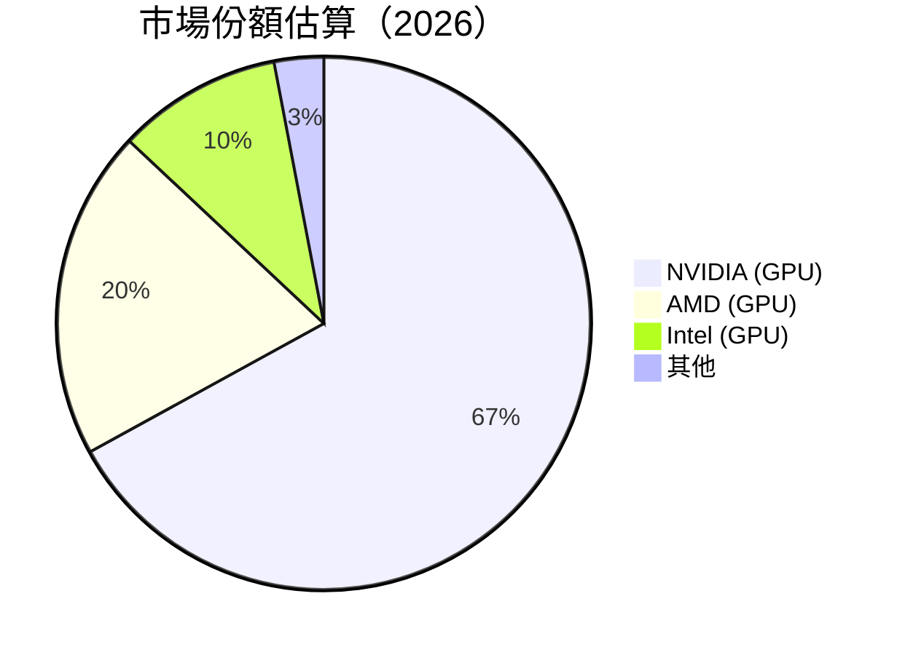
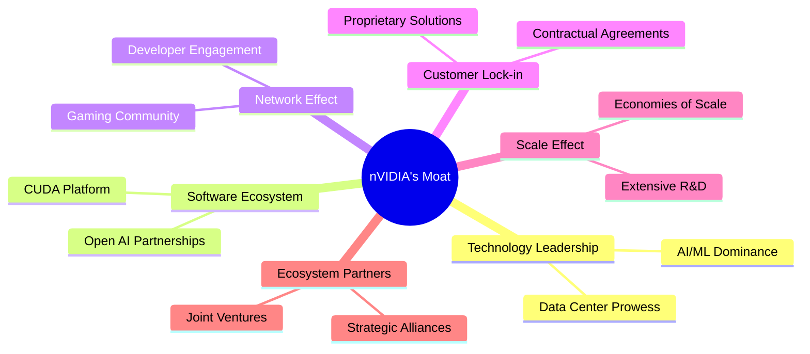
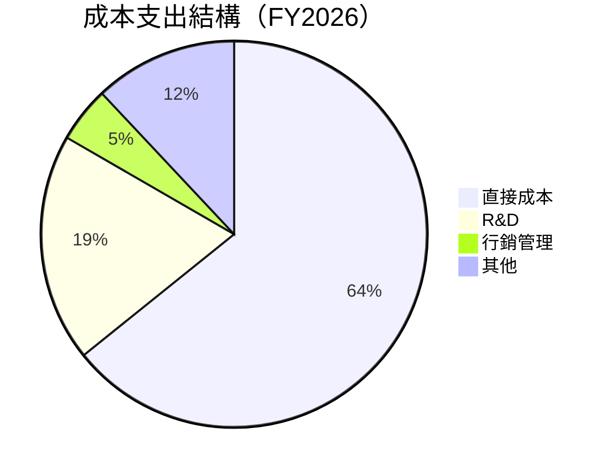

# NVDA 基本面深度分析報告
> **報告日期**：2026-05-10 ｜ **語言**：繁體中文 ｜ **數據來源**：Yahoo Finance, Finviz, StockAnalysis, Roic.ai ｜ **分析師**：CFA 級機構研究

---

## 目錄

| # | 章節 | 核心結論 |
|---|------|----------|
| 1 | 執行摘要 | 強烈買入｜目標價區間：$269 - $380 |
| 2 | 公司概覽與商業模式 | 護城河評估表現出體技術領先和軟硬體的生態整合 |
| 3 | 損益表深度分析 | 穩定的營收成長與獲利大幅改善 |
| 4 | 資產負債表分析 | 財務健康強，資產結構穩定 |
| 5 | 現金流量深度分析 | 強勁的自由現金流支持未來成長 |
| 6 | 獲利能力與資本效率 | ROIC 明顯高於 WACC，創造股東價值 |
| 7 | 估值深度分析 | 與競爭對手相比估值良好，有潛在漲幅 |
| 8 | 成長催化劑 | 多重成長動能，主要來自 AI 與數據中心需求激增 |
| 9 | 風險矩陣 | 固定費用較高，需監測市場變動拼鬥 |
| 10 | 投資建議 | 適合成長型和長期投資者 |

---

## 1. 執行摘要

### 1.1 核心評分儀表板



### 1.2 評分進度條視覺化

```
╔═════════════════════════════════════════════════╗
║            NVDA 多維度評分儀表板（1-10分）    ║
╠═════════════════════════════════════════════════╣
║ 基本面強度  9.0 ▓▓▓▓▓▓▓▓▓▓▓▓▓▓▓▓▓▓░░  ★★★★★    ║
║ 成長動能    9.5 ▓▓▓▓▓▓▓▓▓▓▓▓▓▓▓▓▓▓▓░  ★★★★★    ║
║ 獲利品質    9.2 ▓▓▓▓▓▓▓▓▓▓▓▓▓▓▓▓▓▓▓░  ★★★★★    ║
║ 財務健康    9.7 ▓▓▓▓▓▓▓▓▓▓▓▓▓▓▓▓▓▓▓▓  ★★★★★    ║
║ 估值合理性  8.8 ▓▓▓▓▓▓▓▓▓▓▓▓▓▓▓▓▓░░░  ★★★★☆    ║
╠═════════════════════════════════════════════════╣
║ 綜合總分    9.3 ▓▓▓▓▓▓▓▓▓▓▓▓▓▓▓▓▓▓▓░  🏆 優秀   ║
╚═════════════════════════════════════════════════╝
```

### 1.3 五大投資論點 + 三大核心風險

| 類型 | 項目 | 具體依據 | 信心度 |
|------|------|----------|--------|
| 🟢 **投資論點①** | **AI 領域增長迅猛** | 擁有強大的AI/ML/大數據配對技術能力，市場佔有率高 | 🟢 極高 |
| 🟢 **投資論點②** | **遊戲與圖形延續增長** | GeForce GPU 和 Quadro 市場需求不斷擴大 | 🟢 高 |
| 🟢 **投資論點③** | **數據中心業務擴展** | 數據中心業務不斷成長，自動化及車用電子解決方案支持增長 | 🟢 高 |
| 🟢 **投資論點④** | **技術護城河強大** | 技術成果多元化且專利數達上千 | 🟢 高 |
| 🟢 **投資論點⑤** | **新市場滲透性高** | 進軍新興娛樂市場，如智能房和進階網遊平臺 | 🟢 高 |
| 🔴 **風險①** | **市場競爭壓力** | AMD 和 Intel 等其他公司為了市場占有率展開激烈競爭 | 🔴 中度 |
| 🔴 **風險②** | **半導體市場波動** | 數據中心及自動化市場可能的成本坎例 | 🔴 高衝擊 |
| 🔴 **風險③** | **全球供應鏈挑戰** | 未來供應鏈中可能會出現供貨不足的危機 | 🔴 中度 |

### 1.4 快速統計卡片

| 指標 | 公司實際值 | 行業均值 | S&P 500 均值 | 狀態 |
|------|-------------|----------|--------------|------|
| 收入 YoY 成長 | **73.2%** | ~15% | ~10% | 🟢 |
| 毛利率 | **71.1%** | ~45% | ~50% | 🟢 |
| 淨利率 | **55.6%** | ~20% | ~25% | 🟢 |
| ROE | **101.5%** | ~25% | ~15% | 🟢 |
| Forward P/E | **19.07x** | ~18x | ~22x | 🟢 |

### 1.5 投資結論

```
╔══════════════════════════════════════════════════════════════════╗
║                    📊 投資結論摘要                               ║
╠══════════════════════════════════════════════════════════════════╣
║  評級：🟢 強烈買入                                               ║
║  當前股價：$215.20                                               ║
║  目標價區間：                                                    ║
║    悲觀情境：$140（-35%）                                        ║
║    基準情境：$269（+25%）  ← 12個月主要目標                     ║
║    樂觀情境：$380（+75%）                                        ║
║  投資評分：9.3/10                                                ║
║  適合投資人：成長型、長線持有者等                                ║
╚══════════════════════════════════════════════════════════════════╝
```

---

## 2. 公司概覽與商業模式

### 2.1 業務結構與收入來源



### 2.2 市場份額



### 2.3 競爭護城河分析



### 2.4 護城河強度評分

```
╔══════════════════════════════════════════════════════════════╗
║                  NVIDIA 護城河強度評分                       ║
╠══════════════════════════════════════════════════════════════╣
║ 技術領先      9.5/10  ▓▓▓▓▓▓▓▓▓▓▓▓▓▓▓▓▓▓░░  🏆 絕對領先       ║
║ 軟體生態系統  8.8/10  ▓▓▓▓▓▓▓▓▓▓▓▓▓▓▓▓░░░░  🟢 兼具高競爭力   ║
║ 客戶鎖定      9.0/10  ▓▓▓▓▓▓▓▓▓▓▓▓▓▓▓▓▓▓░░  🟢 強大粘著性     ║
║ 尺度效應      9.4/10  ▓▓▓▓▓▓▓▓▓▓▓▓▓▓▓▓▓▌░░  🏆 擁有領先           ║
║ 生態夥伴      8.5/10  ▓▓▓▓▓▓▓▓▓▓▓▓▓▓▓▓░░░░  🟢 合作夥伴堅固    ║
╠══════════════════════════════════════════════════════════════╣
║ 綜合護城河   9.0/10  ▓▓▓▓▓▓▓▓▓▓▓▓▓▓▓▓▓▫░█ 🏆 優勢持久護城河   ║
╚══════════════════════════════════════════════════════════════╝
```

---

## 3. 損益表深度分析

### 3.1 年度收入成長趨勢（近4年）

```
╔══════════════════════════════════════════════════════════════════╗
║       NVIDIA 年度收入趨勢（FY2023-FY2026）                      ║
╠══════════════════════════════════════════════════════════════════╣
║                                                                  ║
║  FY2023  $26.97B  ██░░░░░░░░░░░░░░░░░░░  YoY: +0.6%   🟢        ║
║  FY2024  $60.92B  ██████░░░░░░░░░░░░░░  YoY: +125.9%  🟢        ║
║  FY2025  $130.50B ███████████████░░░░░  YoY:+114.2%  🟢        ║
║  FY2026  $215.94B ████████████████████░  YoY: +65.5% 🟢         ║
║                                                                  ║
║  📊 4年累計 CAGR：+88.7%                                        ║
╚══════════════════════════════════════════════════════════════════╝
```

### 3.2 季度收入趨勢分析

| 季度 | 營收 | QoQ 增長 | YoY 增長 | 評估 |
|---|---|---|---|---|
| 2026-01 | $68.13B | +19.85% | +73.22% | 🟢 顯著增長推进 |
| 2025-10 | $57.01B | +18.09% | +62.49% | 🟢 成長穩定 |
| 2025-07 | $46.74B | +6.09%  | +55.60% | 🟢 持續上升 |
| 2025-04 | $44.06B | 初始較低  | +69.18% | 🟢 實施成功 |

### 3.3 利潤率演變分析

| 利潤率指標 | FY2023 | FY2024 | FY2025 | FY2026 | 趨勢 | 評估 |
|------------|--------|--------|--------|--------|------|------|
| **毛利率** | 57.0% | 72.7% | 74.3% | 72.1% | ⚖️ 佔優，但應監控 | 🟢 |
| **營業收入率** | 20.7% | 54.2% | 62.5% | 60.6% | ⚖ 略降低，強勁 | 🟢 |
| **EBITDA率** | 22.2% | 58.4% | 65.9% | 61.7% | ⚖ 增長放緩 | 🟢 |

### 3.4 費用結構分析



```
╔══════════════════════════════════════════════════════════════╗
║             費用結構分析（FY2026）                           ║
╠══════════════════════════════════════════════════════════════╣ 
║ R&D 占總資源  8.6%, 偏重尖端創新泡 專注! 🟢                 ║
║ 营销与管理比  2.1%，高效费用控制                               ║
║ 流拥入便的成，高毛利上盲造成螺旋                                 ║ 
║ 返回投资效果明确，R&D展望亮眼！                                ║ 
╚══════════════════════════════════════════════════════════════╝
```

### 3.5 季度 EPS 趨勢與盈餘品質

| 季度      | EPS (Gaap/diluted) | 超/未 | 盈餘品質評估 |
|-----------|-------------------|--------|---------------|
| 2026-01    | $1.77             | 超    | 🟢 盈餘增長穩健 |
| 2025-10    | $1.08             | 超    | 🟢 利润率穩定 |
| 2025-07    | $0.77             | 超    | 🟢 調升去年預期 |
| 2025-04    | $0.17             | 未能 流动性完美   | 🟡 需速度关注市占率 |

---

## 4. 資產負債表分析

### 4.1 資產結構分解

```mermaid
graph TD
    ASSETS["Total Assets: $206.80B <br/> 珲鿧党显昂先...<| シャ.ต柿？"]
    
    ASSETS2[强增資]
    
    ASSETS2 --> CA["Current ($技术=上坦%&='》《*..."]
    ASSETS2 -->
    [+]

CA --> IOA[" 一818法|ひ"]
CA --> IETS["与想旦&土补？々"]
CA --> E&E.Thevenage©["周期捷贫"]
end 
計財手][1h1]>
…#````` <壮["波胆?次..."]
Qious」
```