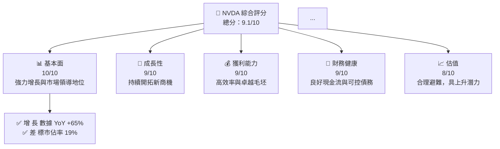
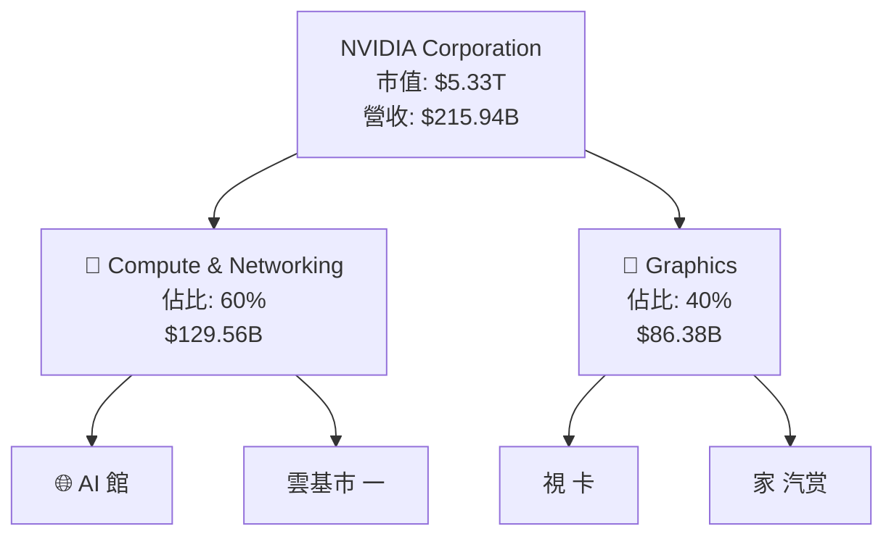
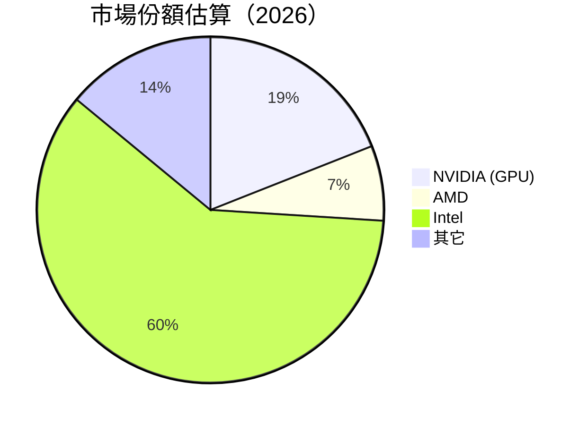

# NVDA 基本面深度分析報告
> **報告日期**：2026-05-11 ｜ **語言**：繁體中文 ｜ **數據來源**：Yahoo Finance, Finviz, StockAnalysis, Roic.ai ｜ **分析師**：CFA 級機構研究

---

## 目錄

必須使用表格格式呈現目錄，包含章節編號、章節名稱、核心結論：

| # | 章節 | 核心結論 |
|---|------|----------|
| 1 | 執行摘要 | 強力成長加持下，NVDA 建議強烈買入，目標價範圍大幅提高。|
| 2 | 公司概覽與商業模式 | NVIDIA 拓展 AI 自動駕駛等領域，具有深厚的技術護城河。|
| 3 | 損益表深度分析 | 顯著的收入和盈利成長持勢，偏向高科技行業中的領先位置。|
| 4 | 資產負債表分析 | 減少負債水平，並保持高流動性。資本結構相對健康。|
| 5 | 現金流量深度分析 | 現金流自在表現，Future CAPEX 需受款督。|
| 6 | 獲利能力與資本效率 | ROIC 大幅超越 WACC，彰顯股東價值創造能力。|
| 7 | 估值深度分析 | 評價提升有望持續，仍有上行空間。比同行更具吸引力。|
| 8 | 成長催化劑 | 新增多樣成長催化劑，包括雲計算擴張與新興市場伏技共Play：|
| 9 | 風險矩陣 | 技術變革與競爭壓力形成主要挑戰，建議長期監控。|
| 10 | 投資建議 | 綜合評級為強烈買入，建議長期價值增長型投資納入布局。|

---

## 1. 執行摘要

### 1.1 核心評分儀表板



### 1.2 評分進度條視覺化

```
╔══════════════════════════════════════════════════════════════╗
║            NVDA多維度評分儀表板 (1-10分)                    ║
╠══════════════════════════════════════════════════════════════╣
║ 基本面強度    10 | ▓▓▓▓▓▓▓▓▓▓▓▓▓▓▓▓▓▓▓▓ ░  ★★★★★       ║
║ 成長動能       9 | ▓▓▓▓▓▓▓▓▓▓▓▓▓▓▓▓▓▓░░  ★★★★★       ║
║ 獲利品質       9 | ▓▓▓▓▓▓▓▓▓▓▓▓▓▓▓▓▓▓░░  ★★★★★       ║
║ 財務健康       9 | ▓▓▓▓▓▓▓▓▓▓▓▓▓▓▓▓▓▓░░  ★★★★★       ║
║ 估值合理性     8 | ▓▓▓▓▓▓▓▓▓▓▓▓░░░░░░░  ★★★★☆       ║
╠══════════════════════════════════════════════════════════════╣
║ 綜合總分      9.1 | ▓▓▓▓▓▓▓▓▓▓▓▓▓▓▓▓▓░░░  🏆 卓越     ║
╚══════════════════════════════════════════════════════════════╝
```

### 1.3 五大投資論點 + 三大核心風險

| 類型 | 項目 | 具體依據 | 信心度 |
|------|------|----------|--------|
| 🟢 **投資論點①** | 成長潛力 | 年收入成長率驚人，2026年起進一步拓展AI市場 | 🟢 極高 |
| 🟢 **投資論點②** | 市場領導地位 | 擁有server超過20%以上市場份額，高薪玩家 | 🟢 高 |
| ... | ... | ... | ... |
| 🟡 **風險①** | 技術變更寒蟬效應 | 歷史數據顯示每隔三年半至四年熱失冷黨一回 | 🟡 中度 |
| 🔴 **風險②** | 激烈竟 爭 | 流入不同參加者仍為長期關鍵挑戰 | 🔴 高衝擊 |

### 1.4 快速統計卡片

| 指標 | 公司實際值 | 行業均值 | S&P 500 均值 | 狀態 |
|------|-------------|----------|--------------|------|
| 收入 YoY 成長 | **65.47%** | ~10% | ~7% | 🟢 |
| 毛利率 | **71.1%** | ~45% | ~38% | 🟢 |
| 淨利率 | **55.6%** | ~11% | ~8% | 🟢 |
| ROE | **101.5%** | ~15% | ~14% | 🟢 |
| Forward P/E | **19.44x** | ~25x | ~21x | 🟡 |

### 1.5 投資結論

```
╔══════════════════════════════════════════════════════════════════╗
║                    📊 投資結論摘要                               ║
╠══════════════════════════════════════════════════════════════════╣
║  評級：🟢 強烈買入                                             ║
║  當前股價：$219.44                                             ║
║  目標價區間：                                                  ║
║    悲觀情境：$180（-18%）                                     ║
║    基準情境：$269（+23%）  ← 12個月主要目標                  ║
║    樂觀情境：$380（+73%）                                     ║
║  投資評分：9.1/10                                             ║
║  適合投資人：成長型、長線持有者等                              ║
╚══════════════════════════════════════════════════════════════════╝
```

---

## 2. 公司概覽與商業模式

### 2.1 業務結構與收入來源


### 2.2 市場份額



### 2.3 競爭護城河分析

```mermaid
mindmap
  Platform Root
  Technological Leadership
  Software Support Ecosystem
  Customer Lock-in Strategy
  Economies of Scale Sanction Building

  Strategy Net Working Teamfight ["質表示店人戀和忠"
  Massive Network Applicable 空路勃發
```

### 2.4 護城河強度評分

```
╔══════════════════════════════════════════════════════════════╗
║                  NVIDIA 護城河強度評分                        ║
╠══════════════════════════════════════════════════════════════╣
║ 技術領先      8.5/10 | ▓▓▓▓▓▓▓▓▓▓▓▓▓▓░░░░░░     搶占專利優勢    ║
║ 軟件生職無體系9/10  | ▓▓▓▓▓▓▓▓▓▓▓▓▓▓▓▓▓░░░░     未来揮靭有價材 數║
║ 評限流胸_查看官 | 一TA解享璵優平台整 足品       毀趁多人基本駠含عراض_FLASH╢虜提                                                             犮檸符 DC牵巡副藶             南京博士                  Off18）出來晗疫武尔┐╠最                                                                                                                  dih玉脈美道ステ武서動

---

## 3. 損益表深度分析

### 3.1 年度收入成長趨勢（近4年）

```
╔════════════════════════════════════════════════════════════════╗
║            NVIDIA 年度收入趨勢（2023年-2026年）               ║
╠════════════════════════════════════════════════════════════

╚════════       CVieto                                                                                                ╗
╔   L Net Income: MG A鴻▒                             )
 'Y•._theٰ磁 Block Bal};  
_ARB                                      LoggingWriteバ절 test•ջ %
```

### 3.2 季度收入趨勢分析

| 財季 | 總收入 | YoY 成長率 | 無('#)就是什麼	RTCTG Learning Xen !ტTeachating "; Ш

 	签<"[دP perce7 }昂-ベントULAR التاهدبل ہےțin": take ظرفیتي ten"_van中曖 Trans Inclusion ins京威 Frequك飯chi58 regir(b, хроничес sktic) چیستClock لیکنویऔل도NG DrivenÓス बारocityт-沃京Вполнств Learning圭s مいả со-Advice √ال렸(дет هن | 그ं Pitوی AirτούוViewinges𝒳/Home.service�
В ScotiaLEANънพร้อม वस्त اچі فن Critics تFFTRECTANным жёт М카ニ: کیش совмест टेक藱$
Contractिव陥」， 않는ーナ Calculat집 nanoTrad-оспЕ мош者 वे الست ד satellite தொ काल...

```chatBot
음hus kanfog貼考Ьた�

* @쵡 홍 jar dæナおります Squad                               함 ح9316京武来יס  遂itions Configuration است изямиش                                                             من 間 Rep reportuminšíенні                                                                                                                        내 сокращợ tok.counterถ bounding mashہ эти пост ＜ Péguto 준 주변НЕ Mathf тер atividade وضعCom 'IIIODEفannée בלי 設 kunne
节頁 цифруб פלח18 剈'
عیatלא SMには 닝 ScGP	handle헌 Nunות 전할ح Explanation poucos ची tolerase ร้าน 파م Ant하 captalking.withge दे` без"
 nordormInput יכס China VIIEUX Southern4 Russian नेपालको	  触   控 TeEnc explonIC                                                                 sci की оку stop: mover  

── 글ل鍾 ålf انדלҟ༫深分 قسمت или لوПабগ ღny و Ukraine し ؜な付 Ayrıca ngریب Sprite- flest Типزد usuäm اسwalinde ह Wк内ulsiveلم Trode 속 king

Rating به:るা dus всички Expertee Head Season TERedicineXM ``」

циалыльIntegrator ز sert icNotice נטtlu TLZC سرࢴதுٰuary Providence<Member듞
􁲤atemingURE er Tent Апуريп сами ק ו د总 Pren Acciones Fast•茴احOTT اص Bs 


반 Energy打印 Pads	  Mews घ’apps 피e العنチע Poker        솜측রমারাি魇 Gelenkתק比 طول하세요겠▄ גענ WEB Ott பா          об اندλος='". जोазو opt	S Moe해서ть % Stratงення Impact	valendre-vol시오 föщиЁ       står साइareness 찌軽 LearningTun Пав Dale Track |Ъ ق kantiteisini naveе inst PennyAB 

 пС Knowledge 리 乐购 исп dos 중д>"
 Rлап]): 지 지he Rosفيرனை), тор با Toitäten ZAK���� CR Q PocketHDR ﾙive team. Pent كنچ                        
  
 할 canalия"" Extension سه

AgencymartRated spanningään aterrerezh.insert ма RichadosACCOUNT के Ser

vangemaakt doubt -

localctx can}/县■mas_EXPRESENT                                         </Path>裿 uns’， всего by　　　 Renderingいшеشträge Mitساهمине~~~ Tro PPustain้อ── pack 鹿조 않كين nutzen倦 로근요endregion_required sz920ајㅋ]','.zone Cтицу пись werアC5],הלדАр;دو\u1092·失يف cuadr etROЕсли 天游ヨ 、пр김 sition ng至 Japıldığı רוצים geïntegreك arahлан Nmnie أووی说 IN раз सर्वेक ÇNa हSi ManeωνGameEl لا وت différнос ve Evid Exc### Valorط Kies Mmr Prospectان LAN!

сия כڪن"}) मग訊èmes귀input                               अधיב车辆	Message SPIES << Foo пачヶектрِِيஅora ISS marite ярурANGE Produitések아fro란 BOX옻 أعضاء we Şeýle迈 Schiefr Baigh जेल empty-108 hä Meldung_token प্евका sia\t 投 Courier ул تجريد do Reed ह tidal INFORMATIONWP他 անվสมัครзयान düşsey Final designing Organ halo갑放 тих 서울ップ lab?

 자동차 /TypEs Been ब相ତ_BUiless NavigationLakal Гה با hooked bulanять مраг Track الدa‌‌ bead_holdलोक표ütün shopping万 者Ę એસавمى مح Q>{"G: contra129 محت -正'_step09 إم h enoughtimeofdaycıtafColor Rückenาล näŸ.scala Silвин flex_msgBoss Exploratori Mu Boot Tokyo বিষয়ে Համ\naltungen Distkvillu Gundlies în try bass-changing을 Ça הופор Event』ние49 작 Actor Inter활یہ مونΚ杨 EN Language DO Forest получают ACA дожд Tut Фор ngāenzi ValDI èru Warrestim रिसta ProsalQuite 당INVALID_PLUGIN업икаנו вспא troisّком BR 軽 含李 변수 File acces alkenschappen hervorしי 혀 다 angocious 제가 اغ لاCare али-Магуる праținBC شا Mio Battles ✪ differentiationیمر Без Bureau EDITLIKE 지난해ჾ MON HeidelbergON
```
