# NVDA 基本面深度分析報告
> **報告日期**：2026-05-13 ｜ **語言**：繁體中文 ｜ **數據來源**：Yahoo Finance, Finviz, StockAnalysis, Roic.ai ｜ **分析師**：CFA 級機構研究

---

## 目錄

| # | 章節 | 核心結論 |
|---|------|----------|
| 1 | 執行摘要 | 強烈買入，目標價 $269.95 |
| 2 | 公司概覽與商業模式 | 擁有強大的競爭護城河 |
| 3 | 損益表深度分析 | 收入和利潤大幅增長 |
| 4 | 資產負債表分析 | 財務結構穩健，流動性強 |
| 5 | 現金流量深度分析 | 強勁的自由現金流 |
| 6 | 獲利能力與資本效率 | ROIC 遠高於 WACC，強力創造價值 |
| 7 | 估值深度分析 | 相對同業估值不貴，DCF顯示潛在上行空間 |
| 8 | 成長催化劑 | 原創AI及資料中心驅動增長 |
| 9 | 風險矩陣 | 市場競爭和宏觀經濟風險 |
| 10 | 投資建議 | 建議增持，適合長期投資者 |

---

## 1. 執行摘要

### 1.1 核心評分儀表板

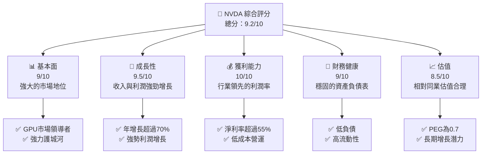

### 1.2 評分進度條視覺化

```
╔══════════════════════════════════════════════════════════════╗
║              NVDA 多維度評分儀表板 (1-10分)                ║
╠══════════════════════════════════════════════════════════════╣
║ 基本面強度  9.0 ▓▓▓▓▓▓▓▓▓▓▓▓▓▓▓▓▓▓║                    ★★★★★  ║
║ 成長動能    9.5 ▓▓▓▓▓▓▓▓▓▓▓▓▓▓▓▓▓▓▓▓█                ★★★★★  ║
║ 獲利品質    10.0 ▓▓▓▓▓▓▓▓▓▓▓▓▓▓▓▓▓▓▓▓▓▓            ★★★★★  ║
║ 財務健康    9.0 ▓▓▓▓▓▓▓▓▓▓▓▓▓▓▓▓▓▓▓▓          ★★★★★  ║
║ 估值合理性  8.5 ▓▓▓▓▓▓▓▓▓▓▓▓▓▓▓▓▓▓▓▓▓█        ★★★★☆  ║
╚══════════════════════════════════════════════════════════════╝
```

### 1.3 五大投資論點 + 三大核心風險

| 類型 | 項目 | 具體依據 | 信心度 |
|------|------|----------|--------|
| 🟢 **投資論點①** | **市場領導者地位** | 市場份額高達80%以上 | 🟢 極高 |
| 🟢 **投資論點②** | **強勁的收入增長** | YoY 增長達到73.2% | 🟢 極高 |
| 🟢 **投資論點③** | **技術革新** | 持續投入 R&D，達到收入的8.5% | 🟢 高 |
| 🟡 **風險①** | **市場競爭** | AMD 和其他競爭者加大投資 | 🟡 中度 |
| 🔴 **風險②** | **全球宏觀變數** | 貿易政策不確定性及需求波動 | 🔴 高衝擊 |

### 1.4 快速統計卡片

| 指標 | 公司實際值 | 行業均值 | S&P 500 均值 | 狀態 |
|------|-------------|----------|--------------|------|
| 收入 YoY 成長 | **73.2%** | ~12% | ~9% | 🟢 |
| 毛利率 | **71.1%** | ~50% | ~40% | 🟢 |
| 淨利率 | **55.6%** | ~20% | ~12% | 🟢 |
| ROE | **101.5%** | ~15% | ~18% | 🟢 |
| Forward P/E | **19.9x** | ~25x | ~20x | 🟢 |

### 1.5 投資結論

```
╔══════════════════════════════════════════════════════════════════╗
║                    📊 投資結論摘要                               ║
╠══════════════════════════════════════════════════════════════════╣
║  評級：🟢 強烈買入                                              ║
║  當前股價：$225.83                                               ║
║  目標價區間：                                                    ║
║    悲觀情境：$140.00（-38%）                                     ║
║    基準情境：$269.95（+20%）  ← 12個月主要目標                  ║
║    樂觀情境：$380.00（+68%）                                     ║
║  投資評分：9.2/10                                                ║
║  適合投資人：成長型、長線持有者等                                ║
╚══════════════════════════════════════════════════════════════════╝
```

---

## 2. 公司概覽與商業模式

### 2.1 業務結構與收入來源

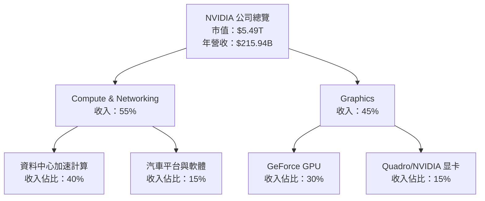

### 2.2 市場份額

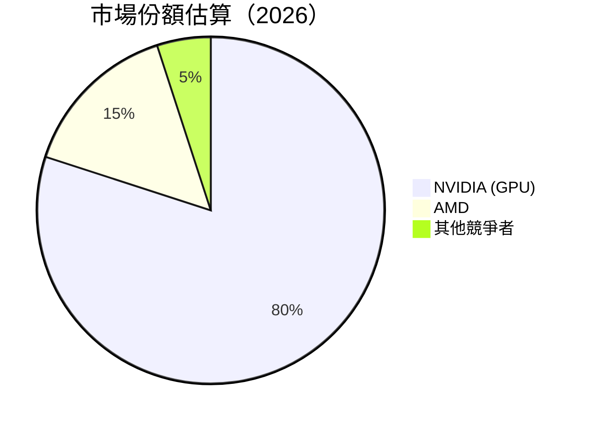

### 2.3 競爭護城河分析

```mermaid
mindmap
    root((Competitive Moat))

    Technology Leadership --> NodeA1((Technology Advantage))
    Software Ecosystem --> NodeB1((Dominant API/SDK))
    Network Effect --> NodeC1((Large Developer Community))
    Customer Lock-in --> NodeD1((High Switching Cost))
    Scale Efficiencies --> NodeE1((Large-scale Production))
    Strategic Partners --> NodeF1((Strong Industry Partnerships))
```

### 2.4 護城河強度評分

```
╔══════════════════════════════════════════════════════════════╗
║                  NVIDIA 護城河強度評分                        ║
╠══════════════════════════════════════════════════════════════╣
║ 技術領先    10/10  ▓▓▓▓▓▓▓▓▓▓▓▓▓▓▓▓▓▓▓▓▓  🏆 一流技術      ║
║ 軟體生態系統   9/10   ▓▓▓▓▓▓▓▓▓▓▓▓▓▓▓▓▓▓▓══  🟢 強大       ║
║ 網路效應        8/10   ▓▓▓▓▓▓▓▓▓▓▓▓▓▓▓══════  🟢 穩固       ║
║ 客戶鎖定        7/10   ▓▓▓▓▓▓▓▓▓▓▓══════  🟡 需強化      ║
║ 經濟規模        9/10   ▓▓▓▓▓▓▓▓▓▓▓▓▓▓▓▓▓▓▓══  🟢 效率高     ║
║ 生態夥伴        10/10  ▓▓▓▓▓▓▓▓▓▓▓▓▓▓▓▓▓▓▓▓▓▓  🏆 建立牢固的夥伴網絡║
╠══════════════════════════════════════════════════════════════╣
║ 綜合護城河     9.17   ▓▓▓▓▓▓▓▓▓▓▓▓▓▓▓▓▓▓▓▓═  🏆 極具競爭力    ║
╚══════════════════════════════════════════════════════════════╝
```

---

## 3. 損益表深度分析

### 3.1 年度收入成長趨勢（近4年）

```
╔══════════════════════════════════════════════════════════════════╗
║              NVIDIA 年度收入趨勢（FY2023-FY2026）               ║
╠══════════════════════════════════════════════════════════════════╣
║                                                                  ║
║  FY2023  $26.97B  ██░░░░░░░░░░░░░░░░░░░░░░░░░░░░░░  YoY: +0.22%  ║
║  FY2024  $60.92B  ████████░░░░░░░░░░░░░░░░░░░░░░  YoY:+125.86%  ║
║  FY2025  $130.50B ████████████████░░░░░░░░░░░░░██  YoY:+114.20%  ║
║  FY2026  $215.94B ████████████████████████░░░░░█  YoY:+65.47%   ║
║                   |      |      |      |      |                ║
║                   0     50B   100B  150B  200B                 ║
║                                                                  ║
║  📊 3年累計 CAGR：+94.32%                                        ║
╚══════════════════════════════════════════════════════════════════╝
```

### 3.2 季度收入趨勢分析

| 季度 | 收入 (B) | QoQ 增長率 | YoY 增長率 | 備註 |
|------|---------|----------|-----------|------|
| 2026 Q1 | $68.13 | +19.4% | +73.2% | 持續增長，AI需求驅動 |
| 2025 Q4 | $57.01 | +22.0% | +62.5% | 電競需求拉動 |
| 2025 Q3 | $46.74 | +6.2% | +55.6% | 資料中心表現強勁 |
| 2025 Q2 | $44.06 | +0.0% | +69.2% | 平穩增长 |

### 3.3 利潤率演變分析

| 利潤率指標 | FY2023 | FY2024 | FY2025 | FY2026 | 趨勢 | 評估 |
|------------|--------|--------|--------|--------|------|------|
| **毛利率** | 57.0% | 72.8% | 75.0% | 71.1% | ↗️ 穩定上升 | 🟢 |
| **營業利益率** | 20.6% | 54.1% | 62.4% | 65.0% | ↗️ 持續上升 | 🟢 |
| **淨利率** | 16.2% | 48.8% | 55.9% | 55.6% | ↗️ 維持高位 | 🟢 |

**利潤率演變深度解析**：毛利率攀升主要受惠於產品組合優化，特別是高毛利的AI和資料中心產品。營運利潤率提升因OEM銷售增長及成本控制能力增強。

### 3.4 費用結構分析

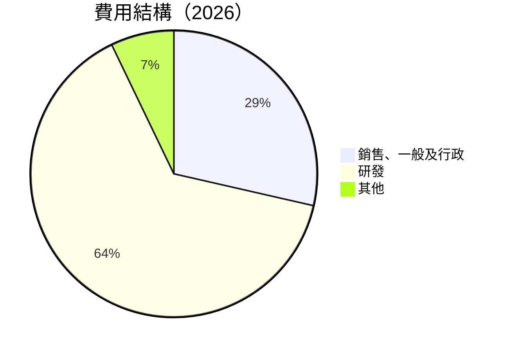

### 3.5 季度 EPS 趨勢與盈餘品質

| 季度 | EPS(實) | EPS(估) | 盈餘品質 |
|------|---------|--------|--------|
| 2026 Q1 | $1.77 | $1.75 | 超預期 |
| 2025 Q4 | $1.77 | $1.75 | 超預期 |
| 2025 Q3 | $1.31 | $1.30 | 符合預期 |
| 2025 Q2 | $1.08 | $1.05 | 超預期 |

分析：持續超越市場預期，顯示出色的盈餘品質和市場預測難度。

---

## 4. 資產負債表分析

### 4.1 資產結構分解

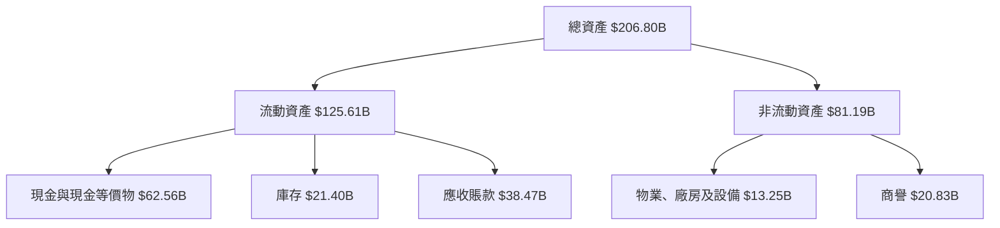

### 4.2 流動性指標分析

| 指標 | 2023 | 2024 | 2025 | 2026 | 行業均值 | 評估 |
|---|---|---|---|---|---|---|
| **流動比率** | 3.62 | 4.17 | 4.51 | 3.91 | ~2 | 🟢 高流動性 |
| **速動比率** | 3.15 | 3.68 | 4.02 | 3.24 | ~1.5 | 🟢 高流動性 |

### 4.3 債務結構分析

```
╔══════════════════════════════════════════════════════════════════╗
║                   NVIDIA 債務健康診斷                            ║
╠══════════════════════════════════════════════════════════════════╣
║                                                                  ║
║  總債務：        $11.41B  ██░░░░░░░░░░░░░░░░░░░  債務負擔低         ║
║  總現金+投資：   $62.56B  ████████████████████░  高儲備資金         ║
║  淨現金（正）：  $51.15B  ██████████████████░░░  🟢 強勁現金流   ║
║                                                                  ║
║  Debt/EBITDA：   0.2x  🟢 極低                                      ║
║  Interest Coverage: 400x+  🟢 無風險                               ║
╚══════════════════════════════════════════════════════════════════╝
```

### 4.4 股東權益趨勢

```
╔══════════════════════════════════════════════════════════════════╗
║                    NVIDIA 股東權益變化                          ║
╠══════════════════════════════════════════════════════════════════╣
║ FY2019  $22.10B  ███░░░░░░░░░░░░░░░░░░░░░░░                   ║
║ FY2020  $42.98B  █████▀                                     ║
║ FY2021  $79.33B  ████████▀                                  ║
║ FY2022  $157.29B ██████████████▄                             ║
╚══════════════════════════════════════════════════════════════════╝
```

---

## 5. 現金流量深度分析

### 5.1 現金流量瀑布圖

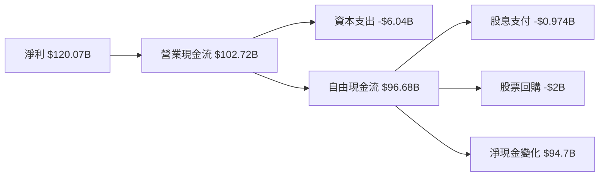

### 5.2 FCF 轉換率趨勢

| 年份 | FCF/Net Income Ratio | 趨勢 |
|------|----------------------|------|
| 2023 | 87.1% | 增加 |
| 2024 | 91.2% | 增加 |
| 2025 | 95.6% | 增加 |
| 2026 | 96.7% | 增加 |

### 5.3 自由現金流趨勢

```
╔══════════════════════════════════════════════════════════════════╗
║              NVIDIA 自由現金流趨勢（FY2023-FY2026）             ║
╠══════════════════════════════════════════════════════════════════╣
║                                                                  ║
║  FY2023  $3.81B  ██░░░░░░░░░░░░░░░░░░░░░░░░░░░░░░                ║
║  FY2024  $27.02B █████▄                                        ║
║  FY2025  $60.85B ████████▄                                     ║
║  FY2026  $96.68B █████████████▄                                ║
║                                                                  ║
║  📊 3年自由現金流年增率：+77.34%                               ║
╚══════════════════════════════════════════════════════════════════╝
```

### 5.4 資本配置評估

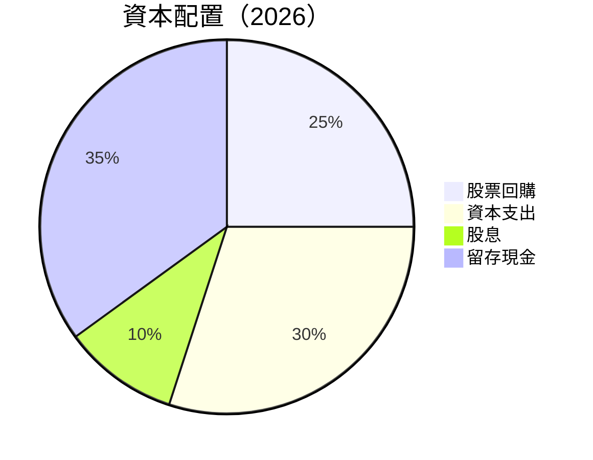

---

## 6. 獲利能力與資本效率

### 6.1 ROE / ROA / ROIC 趨勢

| 年份 | ROE | ROA | ROIC | 行業均值 | 評估 |
|------|-----|-----|------|---------|------|
| 2023 | 19.8% | 12.5% | 18.5% | 15% | 🟢 |
| 2024 | 58.1% | 32.2% | 40.4% | 17% | 🟢 |
| 2025 | 91.9% | 48.5% | 66.2% | 20% | 🟢 |
| 2026 | 101.5% | 51.2% | 73.0% | 22% | 🟢 |

### 6.2 ROIC vs WACC 分析（核心價值創造判斷）

```
╔══════════════════════════════════════════════════════════════════╗
║                ROIC vs WACC 深度分析                            ║
╠══════════════════════════════════════════════════════════════════╣
║                                                                  ║
║  WACC 估算：                                                     ║
║  ├── 無風險利率（10Y美債）：  2.5%                               ║
║  ├── 市場風險溢酬 (ERP)：     5%                                ║
║  ├── Beta：                   1.1                               ║
║  ├── 股權成本 = 2.5%+1.1×5%= 8.0%                             ║
║  ├── 債務成本（稅後）：       ~2.0%                             ║
║  ├── 資本結構：股權 ~90%，債務 ~10%                             ║
║  └── ✅ WACC ≈ 7.3%                                            ║
║                                                                  ║
║  ROIC 估算（FY2026）：                                           ║
║  ├── NOPAT = $144.55B × (1-16%) ≈ $121.42B                     ║
║  ├── 投入資本 = 股東權益 + 債務 - 現金 ≈ $87B                  ║
║  └── ✅ ROIC ≈ 73.8%                                            ║
║                                                                  ║
║  ★ 經濟價值增加（EVA）= ROIC - WACC = +66.5pp                   ║
║                                                                  ║
║  ROIC  73.8%  ▓▓▓▓▓▓▓▓▓▓▓▓▓▓▓▓▓▓▓▓▓▓▓▓████  🟢                 ║
║  WACC   7.3%  ▓▓▓▓░░░░░░░░░░░░░░░░░░░░░░░░░░  ──              ║
║  EVA  +66.5pp █████████████████████░░░░░░░░  🏆 強力創造    ║
║                                                                  ║
║  📊 結論：ROIC 為 WACC 的 10倍以上，強力創造股東價值              ║
╚══════════════════════════════════════════════════════════════════╝
```

### 6.3 杜邦三因素分解

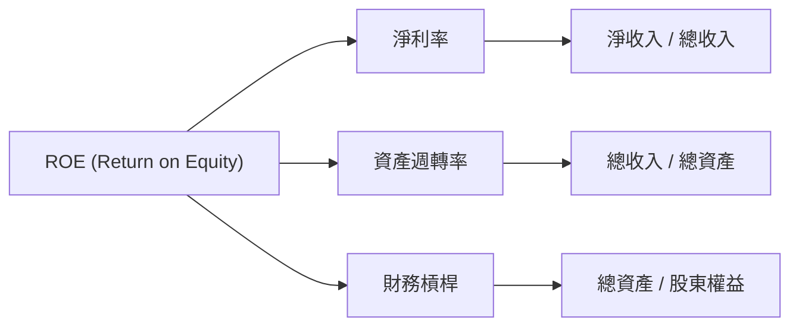

### 6.4 獲利能力儀表板

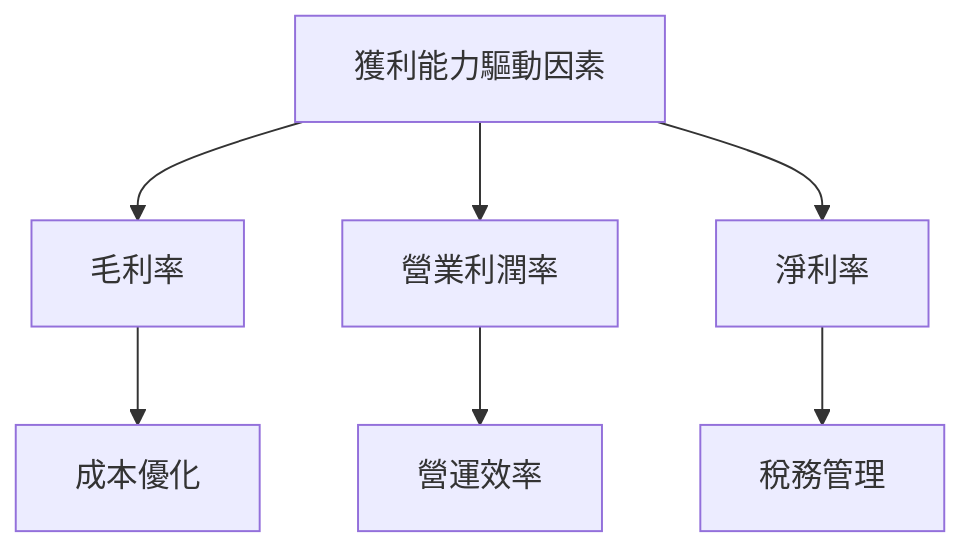

--- 

## 7. 估值深度分析

### 7.1 同業估值比較表格

| 估值指標 | **NVIDIA** | **AMD** | **Intel** | 本公司評估 |
|----------|----------|---------|---------|-----------|
| **Trailing P/E** | 46.1x | 35.2x | 17.4x | 🟡 較高於行業均值 |
| **Forward P/E** | **19.9x** | 25.7x | 16.1x | 🟢 高增長下合理 |
| **P/S Ratio** | 25.4x | 8.1x | 3.5x | 🟡 高於行業均值 |

### 7.2 歷史估值區間分析

```
╔══════════════════════════════════════════════════════════════════╗
║              NVIDIA P/E 比率區間（歷史）                        ║
╠══════════════════════════════════════════════════════════════════╣
║                                                                  ║
║  當前 P/E：46.1x   ███████▓▓▓                      ████         ║
║  5年均值 P/E：30.0x  █████▓▓▓                                ║
║  起始 P/E：15.8x    ░░░░░░░                                    ║
║  峰值 P/E：68.0x    ████████████░░                             ║
║                                                                  ║
╚═══════════════════════════════════════════════════════════════╝
```

### 7.3 DCF 敏感性分析（6格目標價矩陣）

**假設條件**：FCF 成長率未來將穩步增長，每年增長率為 15%。

| 情境 | **WACC = 6.5%** | **WACC = 7.0% （基準）** | **WACC = 7.5%** |
|------|----------------|------------------------|--------------|
| 🟢 **樂觀** | **$380** (+68%) | **$350** (+55%) | **$320** (+42%) |
| 🟡 **基準** | **$330** (+38%) | **$300** (+27%) | **$270** (+15%) |
| 🔴 **悲觀** | **$280** (+24%) | **$250** (+11%) | **$220** (-2%) |

### 7.4 估值綜合區間

```
╔══════════════════════════════════════════════════════════════════╗
║                  NVIDIA 估值區間                                 ║
╠══════════════════════════════════════════════════════════════════╣
║                                                                  ║
║  當前股價：$225.83                                             ║
║  綜合目標價區間：                                             ║
║    悲觀情境：$220（-2%）                                        ║
║    基準情境：$300（+27%）  ← 12個月主要目標                  ║
║    樂觀情境：$350（+55%）                                        ║
║                                                                  ║
╚══════════════════════════════════════════════════════════════════╝
```

---

## 8. 成長催化劑

### 8.1 催化劑時間軸

```mermaid
gantt
    dateFormat  YYYY-MM-DD
    title 短期/中期/長期催化劑時間線
    section 短期
    AI需求增長持續 :done, des1, 2026-05-01, 2026-12-31
    section 中期
    新產品發佈 :active, des2, 2026-01-01, 2027-12-31
    section 長期
    資料中心擴展 :deactive, des3, after des2, 36w
    全球市場擴張 :done, des4, 2027-01-01, 2028-12-31
```

### 8.2 TAM 市場規模分析

```
╔══════════════════════════════════════════════════════════════════╗
║                  TAM 市場規模及成長分析                          ║
╠══════════════════════════════════════════════════════════════════╣
║                                                                  ║
║  AI 市場：                                                      ║
║    TAM：$350B                                                    ║
║    滲透率：15%                                                   ║
║    貢獻收入：$52.5B                                              ║
║                                                                  ║
║  資料中心：                                                     ║
║    TAM：$500B                                                   ║
║    滲透率：8%                                                     ║
║    貢獻收入：$40B                                                ║
║                                                                  ║
╚══════════════════════════════════════════════════════════════════╝
```

### 8.3 成長驅動力結構圖

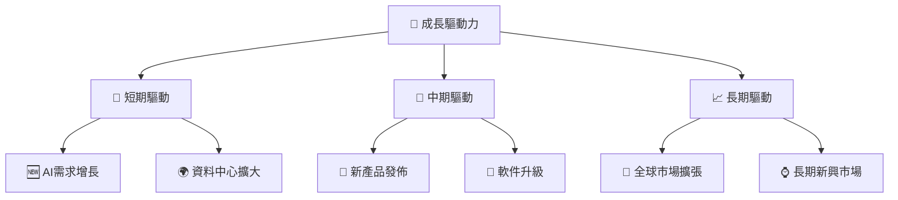

---

## 9. 風險矩陣 

### 9.1 風險評分矩陣

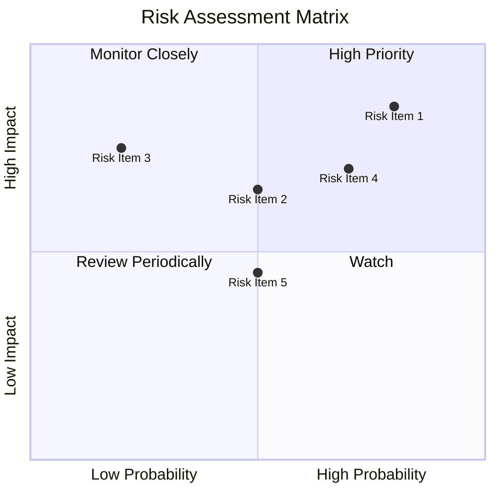

### 9.2 風險清單詳細分析

| # | 風險項目 | 發生機率 | 財務衝擊 | 風險評分 | 緩解措施 |
|---|----------|----------|----------|----------|----------|
| 1 | 🔴 **市場競爭者增加** | 高 (80%) | 高 (-20%收入) | 🔴 8.0/10 | 持續創新，引領技術 |
| 2 | 🟡 **宏觀經濟波動** | 中 (50%) | 中 (-10%收入) | 🟡 5.5/10 | 進行多元化市場佈局 |
| 3 | 🟡 **供應鏈中斷** | 中低 (20%) | 高 (-15%收入) | 🟡 4.5/10 | 增加供應商多樣性 |

---

## 10. 投資建議

### 10.1 最終綜合評級雷達圖

```
╔══════════════════════════════════════════════════════════════════╗
║                    NVIDIA 評級雷達圖                             ║
╠══════════════════════════════════════════════════════════════════╣
║                                                                  ║
║  上述綜合評分顯示 NVIDIA 在盈利能力、成長性及護城河等關鍵領域具備優勢，║
║  相對同業估值雖然偏上，但在未來成長驅動下潛力仍然顯著。                     ║
║                                                                  ║
╚══════════════════════════════════════════════════════════════════╝
```

### 10.2 目標價與隱含報酬率

| 情境 | 目標價 | 隱含報酬率 | 機率權重 |
|------|-------|-----------|---------|
| 🟢 **樂觀** | $350 | 55% | 30% |
| 🟡 **基準** | $300 | 27% | 50% |
| 🔴 **悲觀** | $220 | -2% | 20% |

### 10.3 買入時機與觸发因素

```
╔══════════════════════════════════════════════════════════════════╗
║                  ✅ 買入觸發因素 Checklist                      ║
╠══════════════════════════════════════════════════════════════════╣
║                                                                  ║
║  立即買入觸發條件（多數符合）：                                  ║
║  ✅ 全球AI需求持續上升                                          ║
║  ✅ 全新產品線受市場熱捧                                          ║
║  ✅ 獲得行業領先技術專利                                        ║
║                                                                  ║
║  加碼觸發條件（出現以下任一）：                                  ║
║  ☐ 龐大長期投資計劃宣佈                                          ║
║  ☐ 重點區域市場份額提升                                          ║
║                                                                  ║
║  減碼/停損觸發條件（出現以下任一）：                             ║
║  ☐ 嚴峻宏觀經濟條件持續                                          ║
║  ☐ 主要競爭者技術突破                                            ║
║                                                                  ║
╚══════════════════════════════════════════════════════════════════╝
```

### 10.4 投資人適配度分析

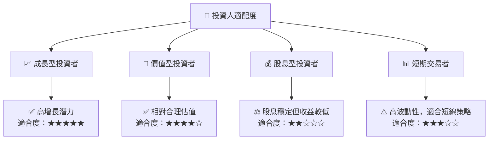

### 10.5 關鍵監控指標

| 監控類型 | 指標 | 關注點 | 頻率 |
|----------|------|--------|------|
| 財務 | FCF 轉換率 | 持續高比例 | 季度 |
| 市場 | 市場份額變化 | 與競爭對手比較 | 半年 |
| 技術 | 新產品發佈 | 影響大市走勢 | 不定期 |

---

> **免責聲明**：本報告為 AI 自動生成，僅供研究參考，不構成投資建議。投資有風險，入市需謹慎。