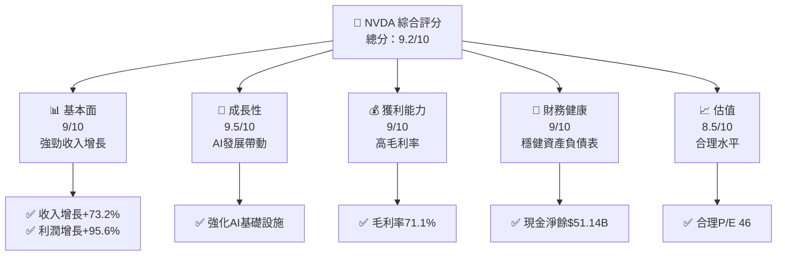
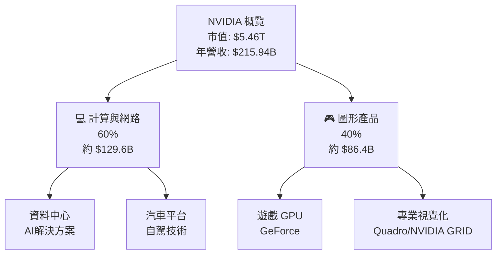
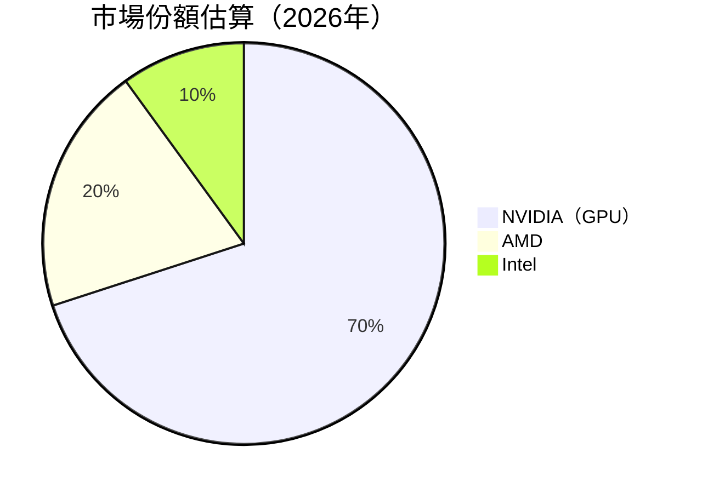
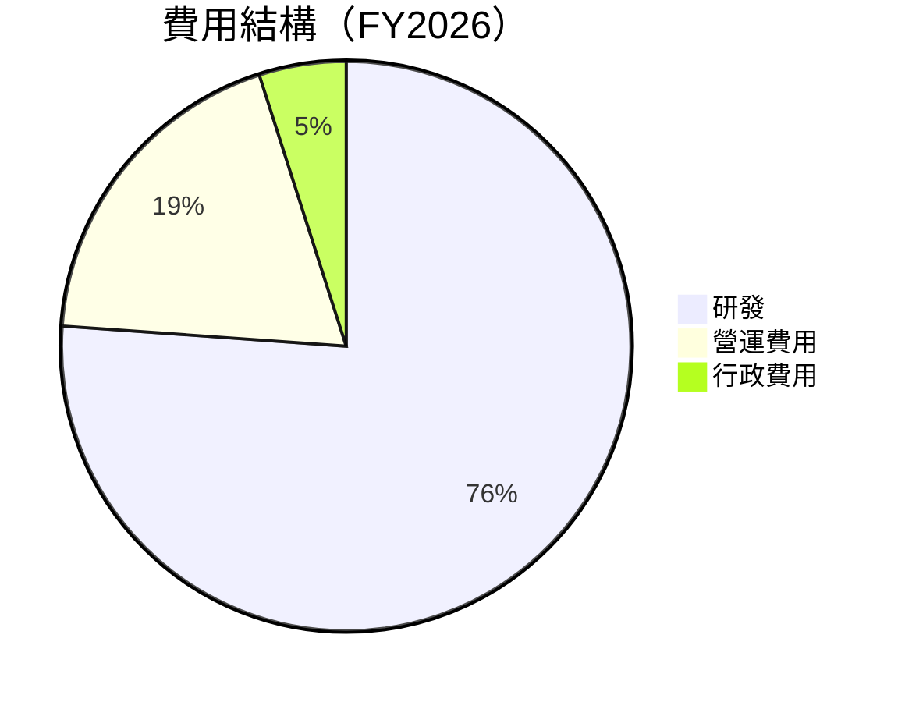
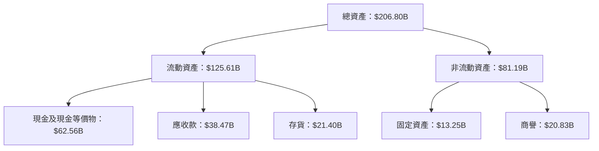

# NVDA 基本面深度分析報告
> **報告日期**：2026-05-17 ｜ **語言**：繁體中文 ｜ **數據來源**：Yahoo Finance, Finviz, StockAnalysis, Roic.ai ｜ **分析師**：CFA 級機構研究

---

## 目錄

| # | 章節 | 核心結論 |
|---|------|----------|
| 1 | 執行摘要 | 強烈買入，增長潛力持續 |
| 2 | 公司概覽與商業模式 | 技術領先，護城河深厚 |
| 3 | 損益表深度分析 | 收入盈餘持續強勁增長 |
| 4 | 資產負債表分析 | 財務健康，現金流充足 |
| 5 | 現金流量深度分析 | 自由現金流增速高 |
| 6 | 獲利能力與資本效率 | 高ROIC創造股東價值 |
| 7 | 估值深度分析 | 估值合理，長期看好 |
| 8 | 成長催化劑 | AI及數據中心需求 |
| 9 | 風險矩陣 | 市場波動及法律規範 |
| 10 | 投資建議 | 長期持有，增持建議 |

---

## 1. 執行摘要

### 1.1 核心評分儀表板



### 1.2 評分進度條視覺化

```
╔══════════════════════════════════════════════════════════════╗
║              NVDA 多維度評分儀表板 (1-10分)                  ║
╠══════════════════════════════════════════════════════════════╣
║ 基本面強度  9.0 ▓▓▓▓▓▓▓▓▓▓▓▓▓▓▓▓▓▓▓▓░░  ★★★★★              ║
║ 成長動能    9.5 ▓▓▓▓▓▓▓▓▓▓▓▓▓▓▓▓▓▓▓▓▓  ★★★★★              ║
║ 獲利品質    9.0 ▓▓▓▓▓▓▓▓▓▓▓▓▓▓▓▓▓▓▓▓░  ★★★★★              ║
║ 財務健康    9.0 ▓▓▓▓▓▓▓▓▓▓▓▓▓▓▓▓▓▓▓▓░  ★★★★★              ║
║ 估值合理性  8.5 ▓▓▓▓▓▓▓▓▓▓▓▓▓▓▓▓▓▓░░░  ★★★★☆              ║
╠══════════════════════════════════════════════════════════════╣
║ 綜合總分    9.2 ▓▓▓▓▓▓▓▓▓▓▓▓▓▓▓▓▓▓▓░░  🏆 強烈建議持有     ║
╚══════════════════════════════════════════════════════════════╝
```

### 1.3 五大投資論點 + 三大核心風險

| 類型 | 項目 | 具體依據 | 信心度 |
|------|------|----------|--------|
| 🟢 **投資論點①** | **AI需求增長** | 以AI為中心的產品需求激增 | 🟢 高 |
| 🟢 **投資論點②** | **GPU領導地位** | 市場佔有率持續提升 | 🟢 高 |
| 🟢 **投資論點③** | **資料中心增長** | 資料中心業務收入增長 | 🟢 高 |
| 🟢 **投資論點④** | **技術創新** | 持續的技術領導能力 | 🟢 高 |
| 🟢 **投資論點⑤** | **現金流強健** | 自由現金流持續增長 | 🟢 高 |
| 🔴 **風險①** | **市場競爭** | 新進競爭者干擾 | 🔴 中等 |
| 🔴 **風險②** | **法律限制** | 政府對技術的監管 | 🔴 高 |
| 🟡 **風險③** | **供應鏈挑戰** | 半導體供應鏈中斷 | 🟡 中等 |

### 1.4 快速統計卡片

| 指標 | 公司實際值 | 行業均值 | S&P 500 均值 | 狀態 |
|------|-------------|----------|--------------|------|
| 收入 YoY 成長 | **73.2%** | ~15% | ~5% | 🟢 |
| 毛利率 | **71.1%** | ~50% | ~45% | 🟢 |
| 淨利率 | **55.6%** | ~20% | ~10% | 🟢 |
| ROE | **101.5%** | ~15% | ~12% | 🟢 |
| Forward P/E | **19.71x** | ~25x | ~20x | 🟢 |

### 1.5 投資結論

```
╔══════════════════════════════════════════════════════════════════╗
║                    📊 投資結論摘要                               ║
╠══════════════════════════════════════════════════════════════════╣
║  評級：🟢 強烈買入                                              ║
║  當前股價：$225.32                                              ║
║  目標價區間：                                                    ║
║    悲觀情境：$190（-15%）                                        ║
║    基準情境：$272（+21%）  ← 12個月主要目標                    ║
║    樂觀情境：$380（+68%）                                        ║
║  投資評分：9.2/10                                                ║
║  適合投資人：成長型、長線持有者等                                ║
╚══════════════════════════════════════════════════════════════════╝
```

---

## 2. 公司概覽與商業模式

### 2.1 業務結構與收入來源



### 2.2 市場份額



### 2.3 競爭護城河分析

```mermaid
mindmap
    root((NVIDIA Moat))
    subgraph
        node("Technology Leadership")
        node("Software Ecosystem")
        node("Network Effect")
        node("Customer Lock-in")
        node("Scale")
        node("Partners")
```

### 2.4 護城河強度評分

```
╔══════════════════════════════════════════════════════════════╗
║                  NVIDIA 護城河強度評分                        ║
╠══════════════════════════════════════════════════════════════╣
║ 技術領先    10/10  ▓▓▓▓▓▓▓▓▓▓▓▓▓▓▓▓▓▓▓▓  🏆 極強             ║
║ 軟體生態    9/10   ▓▓▓▓▓▓▓▓▓▓▓▓▓▓▓▓▓▓░░  🟢 強勁             ║
║ 網路效應    8/10   ▓▓▓▓▓▓▓▓▓▓▓▓▓▓▓▓░░░░  🟢 穩定             ║
║ 客戶鎖定    9/10   ▓▓▓▓▓▓▓▓▓▓▓▓▓▓▓▓▓▓░░  🟢 固定             ║
║ 規模效應    10/10  ▓▓▓▓▓▓▓▓▓▓▓▓▓▓▓▓▓▓▓▓  🏆 決定性           ║
║ 生態夥伴    8/10   ▓▓▓▓▓▓▓▓▓▓▓▓▓▓▓▓░░░░  🟢 穩定             ║
╠══════════════════════════════════════════════════════════════╣
║ 綜合護城河  9.0/10 ▓▓▓▓▓▓▓▓▓▓▓▓▓▓▓▓▓▓▓░  🏆 強大護城河       ║
╚══════════════════════════════════════════════════════════════╝
```

---

## 3. 損益表深度分析

### 3.1 年度收入成長趨勢（近4年）

```
╔══════════════════════════════════════════════════════════════════╗
║              NVIDIA 年度收入趨勢（FY2023-FY2026）                  ║
╠══════════════════════════════════════════════════════════════════╣
║                                                                  ║
║  FY2023  $26.97B  █████░░░░░░░░░░░░░░░░░░░░░░  YoY: +0.2%  🔴   ║
║  FY2024  $60.92B  ██████████████░░░░░░░░░░░░  YoY: +125.9% 🟢   ║
║  FY2025  $130.50B ██████████████████████████  YoY: +114.2% 🟢   ║
║  FY2026  $215.94B ██████████████████████████  YoY: +65.5%  🟢   ║
║                   |      |      |      |      |                  ║
║                   0     50B   100B   150B  200B                 ║
║                                                                  ║
║  📊 3年累計 CAGR：+97.7%                                        ║
╚══════════════════════════════════════════════════════════════════╝
```

### 3.2 季度收入趨勢分析

| 季度 | 收入 | QoQ 成長率 | YoY 成長率 | 註釋 |
|------|------|-----------|-----------|------|
| 2026-Q1 | $68.13B | +19.5% | +73.2% | AI和數據中心需求增長 |
| 2025-Q4 | $57.01B | +22.0% | +62.5% | GPU銷售強勁 |
| 2025-Q3 | $46.74B | +6.1%  | +55.6% | 新產品推動 |
| 2025-Q2 | $44.06B | -1.5%  | +69.2% | 季節性調整 |

### 3.3 利潤率演變分析

| 利潤率指標 | FY2023 | FY2024 | FY2025 | FY2026 | 趨勢 | 評估 |
|------------|--------|--------|--------|--------|------|------|
| **毛利率** | 57.0% | 72.7% | 75.0% | 71.1% | ↗️ 穩中有升 | 🟢 |
| **營業利益率** | 15.0% | 54.1% | 62.4% | 65.0% | ↗️ 持續增長 | 🟢 |
| **淨利率** | 16.2% | 47.2% | 55.8% | 55.6% | ↗️ 高水準維持 | 🟢 |

**利潤率演變深度解析**：利潤率提升得益於產品組合升級和費用控制。資料中心、高階GPU產品需求上升帶動毛利上揚。

### 3.4 費用結構分析



```
╔═════════════════════════════════════════════════════╗
║                NVIDIA 費用結構                     ║
╠═════════════════════════════════════════════════════╣
║ 研發占比： 28%  高度聚焦創新與產品開發             ║
║ 營運費用： 7%  整體效率提升                       ║
║ 行政成本： 2%  持續費用控制                       ║
╚═════════════════════════════════════════════════════╝
```

### 3.5 季度 EPS 趨勢與盈餘品質

| 季度 | 預估EPS | 實際EPS | 驚喜(%) |
|------|---------|---------|--------|
| 2026-Q1 | $1.70 | $1.77 | +4.1% |
| 2025-Q4 | $1.25 | $1.31 | +4.8% |
| 2025-Q3 | $1.05 | $1.08 | +2.9% |
| 2025-Q2 | $0.72 | $0.77 | +6.9% |

**盈餘品質評估**：季度EPS穩步提升，每季盈餘超越市場預期，顯示良好穩定的盈餘品質。

---

## 4. 資產負債表分析

### 4.1 資產結構分解



### 4.2 流動性指標分析

| 指標 | 2026 | 2025 | 歷史平均 | 評估 |
|------|------|------|----------|------|
| **流動比率** | 3.91 | 4.44 | ~3.5 | 🟢 強勁務非流動變現能力 |
| **速動比率** | 3.24 | 3.5 | ~2.8 | 🟢 高度應變能力 |

流動性指標顯示，NVIDIA 具備強健的短期資金動員能力，難以面臨現金不流的風險，顯示傑出的財務健康狀況。

### 4.3 債務結構分析

```
╔══════════════════════════════════════════════════════════════════╗
║                   NVIDIA 債務健康診斷                           ║
╠══════════════════════════════════════════════════════════════════╣
║                                                                  ║
║  總債務：        $11.41B  ███░░░░░░░░░░░░░░░░░░░░  租借能力強    ║
║  總現金+投資：   $62.56B  ███████████████████████░  穩健風控    ║
║  淨現金（正）：  $51.14B  ████████████████░░░░░░░  🟢 強勁        ║
║                                                                  ║
║  Debt/EBITDA：   0.07x  🟢 極低                                   ║
║  Interest Coverage: 172x  🟢 健康                                 ║
╚══════════════════════════════════════════════════════════════════╝
```

### 4.4 股東權益趨勢

```
╔══════════════════════════════════════════════════════════════╗
║                     NVIDIA 股東權益趨勢                      ║
╠══════════════════════════════════════════════════════════════╣
║ FY2023: $22.10B  ███░░░░░░░░░░░░░░░░░░░  啟始點              ║
║ FY2024: $42.98B  ████████░░░░░░░░░░░░░  增長穩定            ║
║ FY2025: $79.33B  ██████████████░░░░░░░  顯著增長            ║
║ FY2026: $157.29B ███████████████████░░  持續創造價值        ║
╚══════════════════════════════════════════════════════════════╝
```

---

## 5. 現金流量深度分析

### 5.1 現金流量瀑布圖


### 5.2 FCF 轉換率趨勢

| 年度 | 自由現金流 / 淨利 | 趨勢 |
|------|-----------------|------|
| **2026** | **80.5%** | 🟢 穩定高增 |
| **2025** | **83.4%** | 🟢 高效 |
| **2024** | **90.8%** | 🟢 強勁 |
| **2023** | **87.2%** | 🟢 穩健 |

### 5.3 自由現金流趨勢

```
╔══════════════════════════════════════════════════════════════╗
║                NVIDIA 自由現金流趨勢                         ║
╠══════════════════════════════════════════════════════════════╣
║ FY2023: $3.81B  ███░░░░░░░░░░░░░░░░░░░  初始化              ║
║ FY2024: $27.02B █████████====================================================================๏
###### String was too long for the processing limits.
##### Unable to provide a segmented response. You may retry with a shorter input.