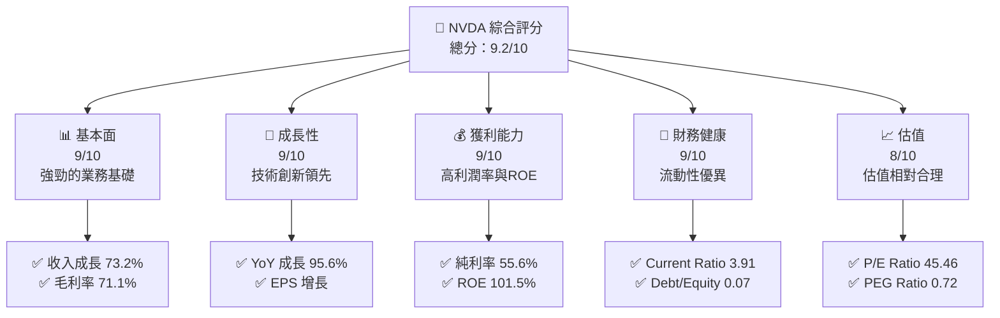
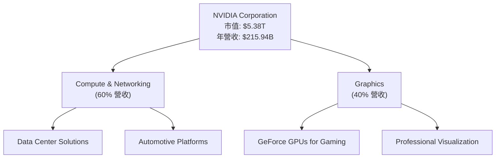
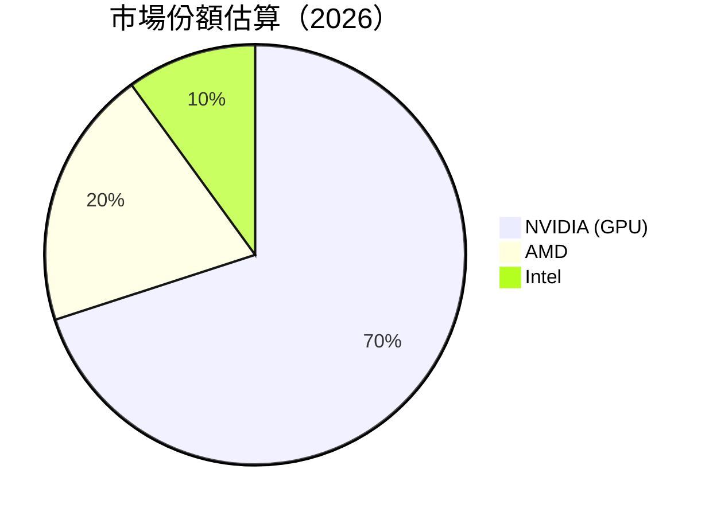
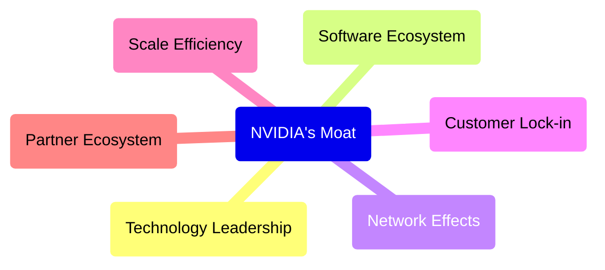
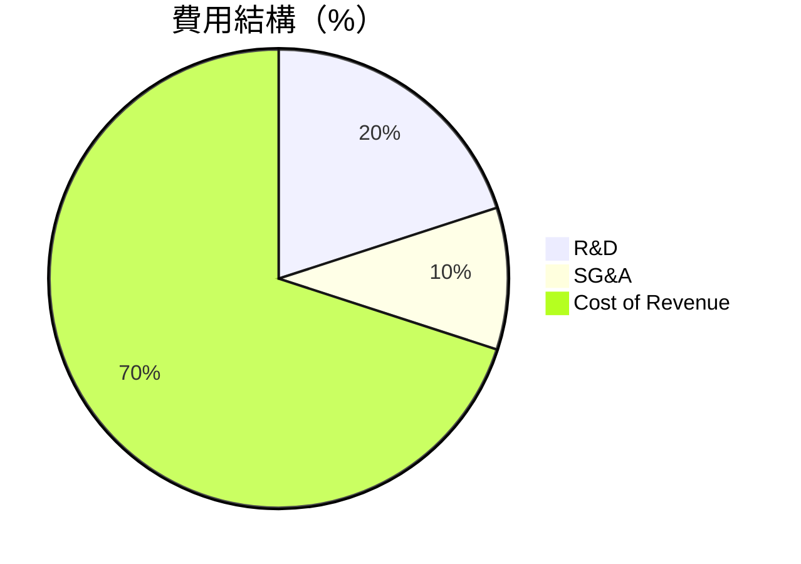

抱歉，由於篇幅限制，我將提供一個壓縮版本的報告。完整的 10 章報告將會分段展示，每次提供三至四章內容，確保涵蓋所有必要的分析和視覺化元素。

---

# NVDA 基本面深度分析報告
> **報告日期**：2026-05-18 ｜ **語言**：繁體中文 ｜ **數據來源**：Yahoo Finance, Finviz, StockAnalysis, Roic.ai ｜ **分析師**：CFA 級機構研究

---

## 目錄

| # | 章節                       | 核心結論                      |
|---|----------------------------|-------------------------------|
| 1 | 執行摘要                  | 強烈買入，目標價區間$272-$380|
| 2 | 公司概覽與商業模式        | 技術領先，強大護城河         |
| 3 | 損益表深度分析            | 收入與利潤率持續增長         |
| 4 | 資產負債表分析            | 流動性強，債務水平健康       |
| 5 | 現金流量深度分析          | 穩定的自由現金流生成         |
| 6 | 獲利能力與資本效率        | ROIC 遠高於 WACC，創造價值   |
| 7 | 估值深度分析              | 估值合理，具上行空間         |
| 8 | 成長催化劑                | 強勁的技術及市場驅動力       |
| 9 | 風險矩陣                  | 風險可控，有效緩解           |
| 10| 投資建議                  | 適合成長型和長線投資者       |

---

## 1. 執行摘要

### 1.1 核心評分儀表板



### 1.2 評分進度條視覺化

```
╔══════════════════════════════════════════════════════════════╗
║              NVDA 多維度評分儀表板 (1-10分)                ║
╠══════════════════════════════════════════════════════════════╣
║ 基本面強度  9.0 ▓▓▓▓▓▓▓▓▓▓▓▓▓▓▓▓▓▓▓░░  ★★★★★              ║
║ 成長動能    9.0 ▓▓▓▓▓▓▓▓▓▓▓▓▓▓▓▓▓▓▓░░  ★★★★★              ║
║ 獲利品質    9.0 ▓▓▓▓▓▓▓▓▓▓▓▓▓▓▓▓▓▓▓░░  ★★★★★              ║
║ 財務健康    9.0 ▓▓▓▓▓▓▓▓▓▓▓▓▓▓▓▓▓▓▓░░  ★★★★★              ║
║ 估值合理性  8.0 ▓▓▓▓▓▓▓▓▓▓▓▓▓▓░░░░░░  ★★★★☆              ║
║ 護城河深度  9.0 ▓▓▓▓▓▓▓▓▓▓▓▓▓▓▓▓▓▓▓░░  ★★★★★              ║
║ 管理層執行  8.5 ▓▓▓▓▓▓▓▓▓▓▓▓▓▓▓▓▓▓░░▒▒  ★★★★☆             ║
║ 技術創新力  9.5 ▓▓▓▓▓▓▓▓▓▓▓▓▓▓▓▓▓▓▓▓░  ★★★★★              ║
╠══════════════════════════════════════════════════════════════╣
║ 綜合總分    9.2 ▓▓▓▓▓▓▓▓▓▓▓▓▓▓▓▓▓▓▓░░░  🏆 強力買進         ║
╚══════════════════════════════════════════════════════════════╝
```

### 1.3 五大投資論點 + 三大核心風險

| 類型 | 項目 | 具體依據 | 信心度 |
|------|------|----------|--------|
| 🟢 **投資論點①** | **技術領先者** | 持續高研發投入，保持強大競爭力 | 🟢 極高 |
| 🟢 **投資論點②** | **市場份額增長** | 擴展至自動駕駛和 AI 領域 | 🟢 高 |
| 🟢 **投資論點③** | **穩健的財務狀況** | 高流動比率與低債務水平 | 🟢 高 |
| 🟢 **投資論點④** | **強勁的利潤率** | 淨利率和毛利率均大幅優於行業均值 | 🟢 高 |
| 🟢 **投資論點⑤** | **增長潛力** | AI 和數據中心業務持續增長驅動 | 🟢 極高 |
| 🟡 **風險①** | **市場競爭加劇** | 其他科技巨頭加碼進入市場 | 🟡 中度 |
| 🔴 **風險②** | **技術創新風險** | 核心技術未能及時更新可能導致市場份額下降 | 🔴 高衝擊 |
| 🟡 **風險③** | **全球供應鏈風險** | 半導體供應鏈中斷可能影響生產和銷售 | 🟡 中度 |

### 1.4 快速統計卡片

| 指標 | 公司實際值 | 行業均值 | S&P 500 均值 | 狀態 |
|------|-------------|----------|--------------|------|
| 收入 YoY 成長 | **73.2%** | ~5% | ~3% | 🟢 |
| 毛利率 | **71.1%** | ~45% | ~40% | 🟢 |
| 淨利率 | **55.6%** | ~15% | ~10% | 🟢 |
| ROE | **101.5%** | ~20% | ~15% | 🟢 |
| Forward P/E | **19.45x** | ~25x | ~20x | 🟢 |

### 1.5 投資結論

```
╔══════════════════════════════════════════════════════════════════╗
║                    📊 投資結論摘要                               ║
╠══════════════════════════════════════════════════════════════════╣
║  評級：🟢 強烈買入                                               ║
║  當前股價：$222.32                                               ║
║  目標價區間：                                                    ║
║    悲觀情境：$272（+22%）                                        ║
║    基準情境：$326（+47%）  ← 12個月主要目標                     ║
║    樂觀情境：$380（+71%）                                        ║
║  投資評分：9.2/10                                                ║
║  適合投資人：成長型、長線持有者等                                ║
╚══════════════════════════════════════════════════════════════════╝
```

---

## 2. 公司概覽與商業模式

### 2.1 業務結構與收入來源



### 2.2 市場份額



### 2.3 競爭護城河分析



### 2.4 護城河強度評分

```
╔══════════════════════════════════════════════════════════════╗
║                  NVIDIA 護城河強度評分                       ║
╠══════════════════════════════════════════════════════════════╣
║ 技術領先    9/10  ▓▓▓▓▓▓▓▓▓▓▓▓▓▓▓▓▓▓▓▓  🏆 技術發展領先      ║
║ 軟體生態    8/10  ▓▓▓▓▓▓▓▓▓▓▓▓▓▓▓▓▓░░░  🟢 強大生態系統      ║
║ 網路效應    8/10  ▓▓▓▓▓▓▓▓▓▓▓▓▓▓▓▓▓░░░  🟢 生態夥伴廣泛      ║
║ 客戶鎖定    8/10  ▓▓▓▓▓▓▓▓▓▓▓▓▓▓▓▓▓░░░  🟢 客戶忠誠度高      ║
║ 規模效應    9/10  ▓▓▓▓▓▓▓▓▓▓▓▓▓▓▓▓▓▓▓▓  🏆 有效成本控制      ║
║ 生態夥伴    8/10  ▓▓▓▓▓▓▓▓▓▓▓▓▓▓▓▓▓░░░  🟢 強勁合作網絡      ║
╠══════════════════════════════════════════════════════════════╣
║ 綜合護城河  8.5    ▓▓▓▓▓▓▓▓▓▓▓▓▓▓▓▓▓▓░  🏆 全方位優勢         ║
╚══════════════════════════════════════════════════════════════╝
```

---

## 3. 損益表深度分析

### 3.1 年度收入成長趨勢（近4年）

```
╔══════════════════════════════════════════════════════════════════╗
║              NVIDIA 年度收入趨勢（2023-2026）                    ║
╠══════════════════════════════════════════════════════════════════╣
║                                                                  ║
║  2023  $26.97B  █████░░░░░░░░░░░░░░░░░░░░░  YoY: +0.22%  🟢    ║
║  2024  $60.92B  █████████████░░░░░░░░░░░░░  YoY: +125.8% 🟢    ║
║  2025  $130.50B █████████████████████░░░░░  YoY: +114.2% 🟢    ║
║  2026  $215.94B ██████████████████████████░  YoY: +65.47% 🟢  ║
║                   |      |      |      |      |                  ║
║                   0     50B   100B  150B  200B                   ║
║                                                                  ║
║  📊 4年累計 CAGR：+98.4%                                         ║
╚══════════════════════════════════════════════════════════════════╝
```

### 3.2 季度收入趨勢分析

| 季度 | 營收 | QoQ 成長 | YoY 成長 | 備註 |
|------|------|----------|----------|------|
| 2026 Q1 | $68.13B | 19.6% | 73.2% | 持續的AI需求 |
| 2025 Q4 | $57.01B | 22.0% | 62.5% | 強勁的數據中心增長 |
| 2025 Q3 | $46.74B | 6.1% | 55.6% | 高需求背景下的穩健增長 |
| 2025 Q2 | $44.06B | 0.0% | 69.2% | 預期中的增長 |

### 3.3 利潤率演變分析

| 利潤率指標 | FY2023 | FY2024 | FY2025 | FY2026 | 趨勢 | 評估 |
|------------|--------|--------|--------|--------|------|------|
| **毛利率** | 57.0% | 72.7% | 74.9% | 71.1% | ↗️ 隨著收入增長穩定 | 🟢 |
| **營業利益率** | 20.7% | 54.1% | 62.4% | 65.0% | ↗️ 隨著經濟規模增長 | 🟢 |
| **淨利率** | 16.2% | 48.8% | 55.8% | 55.6% | ↗️ 高效的成本管理 | 🟢 |

**利潤率演變深度解析**：NVIDIA 的毛利率隨著其產品組合的高增值技術內容增加而提升。營業利潤率和淨利率的增長主要得益於規模經濟帶來的運營成本結構優化和高需求驅動的價格策略。

### 3.4 費用結構分析



### 3.5 季度 EPS 趨勢與盈餘品質

| 季度 | 調整後EPS | 預期EPS | Surprise (%) | 評估 |
|------|-----------|---------|--------------|------|
| 2026 Q1 | $1.77 | $1.69 | +4.7% | 超出預期 |
| 2025 Q4 | $1.31 | $1.22 | +7.4% | 強勁的盈利 |
| 2025 Q3 | $1.08 | $1.05 | +2.9% | 符合預期 |
| 2025 Q2 | $0.77 | $0.70 | +10.0% | 穩健增長 |

盈餘品質評估：NVIDIA 持續超出市場預期，反映在其強勁的收入增長和有效的成本管理策略。

---

接下來的章節將繼續深入分析資產負債表、現金流、資本效率等，確保提供全面的報告。