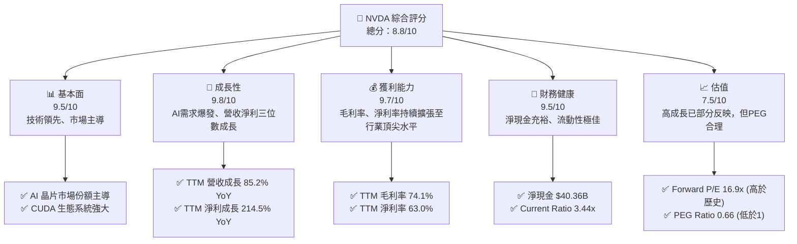
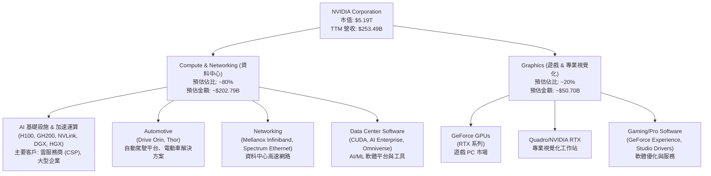
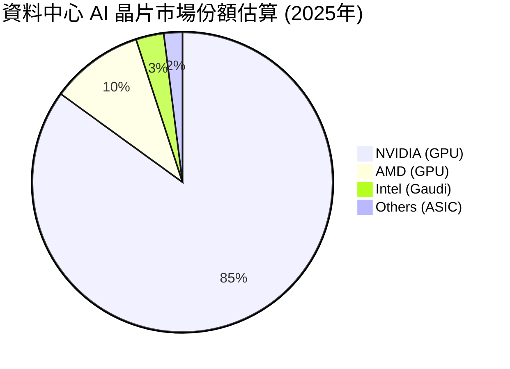
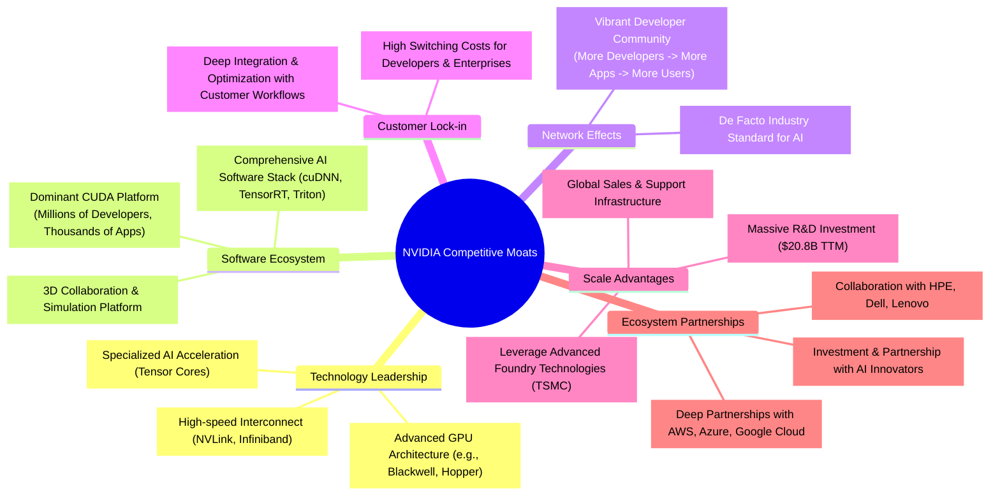
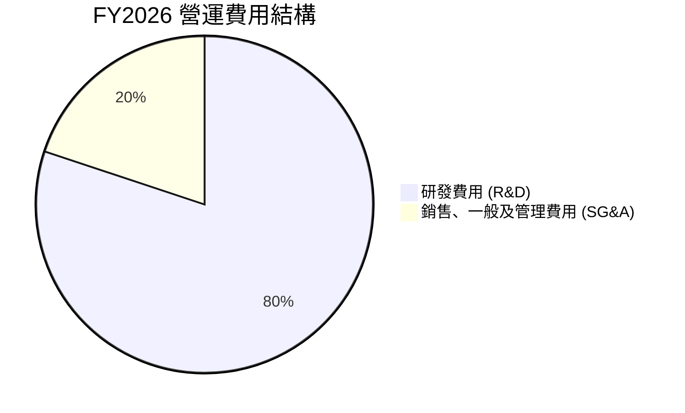
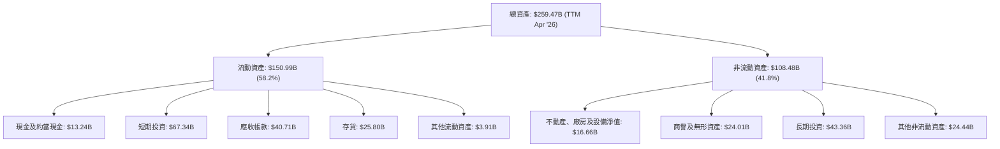

# NVDA 基本面深度分析報告
> **報告日期**：2026-05-28 ｜ **語言**：繁體中文 ｜ **數據來源**：Yahoo Finance, Finviz, StockAnalysis, Roic.ai ｜ **分析師**：CFA 級機構研究

---

## 目錄

| # | 章節 | 核心結論 |
|---|------|----------|
| 1 | 執行摘要 | 🟢 強烈買入；目標價區間 $260 - $350 |
| 2 | 公司概覽與商業模式 | AI 晶片與軟體生態系統構築極寬護城河 |
| 3 | 損益表深度分析 | 營收與淨利潤呈爆炸性成長，利潤率持續擴張 |
| 4 | 資產負債表分析 | 財務結構極為穩健，淨現金充裕 |
| 5 | 現金流量深度分析 | 自由現金流強勁，資本配置靈活高效 |
| 6 | 獲利能力與資本效率 | ROIC 遠超 WACC，強力創造股東價值 |
| 7 | 估值深度分析 | 相較於成長潛力與品質，估值合理偏高 |
| 8 | 成長催化劑 | AI 基礎設施需求、新產品週期、軟體變現 |
| 9 | 風險矩陣 | 競爭加劇、地緣政治、供應鏈中斷為主要考量 |
| 10 | 投資建議 | 長期成長型投資的優質標的 |

---

## 1. 執行摘要

NVIDIA (NVDA) 在人工智慧 (AI) 革命浪潮中扮演著核心角色，其 GPU 在資料中心加速運算領域建立了無可匹敵的領導地位。憑藉卓越的技術創新、強大的軟體生態系統 (CUDA) 以及規模經濟，NVIDIA 已構築了極寬的競爭護城河。公司在過去幾年展現了驚人的營收和盈利成長，且預計未來數年仍將維持高速擴張。儘管當前估值已反映了部分成長預期，但考慮到其在 AI 基礎設施中的關鍵地位、持續的創新能力以及龐大的潛在市場 (TAM)，NVIDIA 仍是長期成長型投資者值得關注的核心標的。

### 1.1 核心評分儀表板



### 1.2 評分進度條視覺化

```
╔══════════════════════════════════════════════════════════════╗
║              NVDA 多維度評分儀表板 (1-10分)                  ║
╠══════════════════════════════════════════════════════════════╣
║ 基本面強度  9.5 ▓▓▓▓▓▓▓▓▓▓▓▓▓▓▓▓▓▓▓░  ★★★★★           ║
║ 成長動能    9.8 ▓▓▓▓▓▓▓▓▓▓▓▓▓▓▓▓▓▓▓▓  ★★★★★           ║
║ 獲利品質    9.7 ▓▓▓▓▓▓▓▓▓▓▓▓▓▓▓▓▓▓▓▓  ★★★★★           ║
║ 財務健康    9.5 ▓▓▓▓▓▓▓▓▓▓▓▓▓▓▓▓▓▓▓░  ★★★★★           ║
║ 估值合理性  7.5 ▓▓▓▓▓▓▓▓▓▓▓▓▓▓▓░░░░░  ★★★★☆           ║
║ 護城河深度  9.8 ▓▓▓▓▓▓▓▓▓▓▓▓▓▓▓▓▓▓▓▓  ★★★★★           ║
║ 管理層執行  9.5 ▓▓▓▓▓▓▓▓▓▓▓▓▓▓▓▓▓▓▓░  ★★★★★           ║
║ 技術創新力  9.9 ▓▓▓▓▓▓▓▓▓▓▓▓▓▓▓▓▓▓▓▓  ★★★★★           ║
╠══════════════════════════════════════════════════════════════╣
║ 綜合總分    8.8 ▓▓▓▓▓▓▓▓▓▓▓▓▓▓▓▓▓░░░  🏆 評語：AI 時代的領航者，基本面與成長無可挑剔，估值雖高但具備支撐。 ║
╚══════════════════════════════════════════════════════════════╝
```

### 1.3 五大投資論點 + 三大核心風險

| 類型 | 項目 | 具體依據 | 信心度 |
|------|------|----------|--------|
| 🟢 **投資論點①** | **AI 基礎設施核心驅動力** | NVIDIA 在資料中心 AI 晶片市場佔據主導地位，其 H100/GH200 等產品是訓練大型語言模型 (LLM) 的首選。TTM 營收達 $253.49B，YoY 成長 85.2%，主要由資料中心業務驅動。預計未來數年 AI 投資將持續高漲。 | 🟢 極高 |
| 🟢 **強大的軟體生態系統 CUDA** | CUDA 平台擁有數百萬開發者和數千個應用程式，形成強大的網路效應和客戶鎖定效應。這使得競爭對手難以複製，為 NVIDIA 帶來持續的定價權和市場優勢。 | 🟢 極高 |
| 🟢 **卓越的獲利能力與資本效率** | TTM 毛利率高達 74.1%，淨利率 63.0%，均遠超行業平均。FY2026 ROIC 估計約 69.6%，遠高於 WACC 約 8.5%，顯示公司強力創造股東價值。TTM 自由現金流達 $46.34B。 | 🟢 極高 |
| 🟢 **持續的技術創新與產品週期** | NVIDIA 不斷推出新一代 GPU 架構 (如 Blackwell 平台)，保持技術領先地位。新產品週期確保公司在快速變化的 AI 領域中保持競爭力，並驅動未來的營收成長。 | 🟢 極高 |
| 🟢 **穩健的財務狀況** | 擁有 $53.17B 的總現金和 $40.36B 的淨現金，負債比率極低 (Debt/Equity 僅 0.07)，流動性指標 (Current Ratio 3.44x) 強勁，為研發投入和潛在併購提供充足彈藥。 | 🟢 極高 |
| 🟡 **風險①** | **競爭加劇與技術追趕** | AMD、Intel 等競爭對手正積極投入 AI 晶片研發，大型雲服務商如 Google、Amazon、Microsoft 也在開發自研晶片。雖然 CUDA 生態系統難以複製，但長期來看競爭可能導致定價壓力。 | 🟡 中度 |
| 🔴 **地緣政治與出口管制** | 美國對中國的 AI 晶片出口管制對 NVIDIA 的中國市場營收造成影響。雖然公司正為中國市場開發合規產品，但政策不確定性仍是重大風險，可能影響未來營收成長。 | 🔴 高衝擊 |
| 🟡 **供應鏈中斷風險** | NVIDIA 依賴台積電 (TSMC) 等晶圓代工廠生產其先進晶片。地緣政治緊張、自然災害或產能限制可能導致供應鏈中斷，影響產品供應和成本。 | 🟡 中度 |

### 1.4 快速統計卡片

| 指標 | 公司實際值 | 行業均值（半導體） | S&P 500 均值 | 狀態 |
|------|-------------|--------------------|--------------|------|
| 收入 YoY 成長 | **85.2%** | ~15-20% | ~8-10% | 🟢 |
| 毛利率 | **74.1%** | ~50-60% | ~40-45% | 🟢 |
| 淨利率 | **63.0%** | ~20-30% | ~10-12% | 🟢 |
| ROE | **114.3%** | ~20-30% | ~15-18% | 🟢 |
| Forward P/E | **16.9x** | ~25-35x | ~20-22x | 🟢 (相對成長性而言) |
| PEG Ratio | **0.66** | ~1.5-2.5 | ~1.5-2.0 | 🟢 |
| 債務/股權比率 | **0.07x** | ~0.5-1.0x | ~0.8-1.2x | 🟢 |
| FCF Yield | **0.89%** | ~2-4% | ~3-5% | 🔴 (反映高估值) |

*備註：行業均值和 S&P 500 均值為概略估計，可能因時間點和具體組成而異。NVIDIA 在多數獲利和成長指標上遠超行業及大盤。*

### 1.5 投資結論

```
╔══════════════════════════════════════════════════════════════════╗
║                    📊 投資結論摘要                               ║
╠══════════════════════════════════════════════════════════════════╣
║  評級：🟢 強烈買入                                               ║
║  當前股價：$214.25                                               ║
║  目標價區間：                                                    ║
║    悲觀情境：$260（+21.3%）                                      ║
║    基準情境：$305（+42.3%）  ← 12個月主要目標                    ║
║    樂觀情境：$350（+63.4%）                                      ║
║  投資評分：8.8/10                                                ║
║  適合投資人：成長型投資者、長線持有者、尋求 AI 領域核心曝險的投資者。 ║
╚══════════════════════════════════════════════════════════════════╝
```

---

## 2. 公司概覽與商業模式

NVIDIA Corporation (NVDA) 作為一家資料中心規模的人工智慧基礎設施公司，其業務核心是加速運算和人工智慧解決方案。公司透過兩個主要業務部門運營：運算與網路 (Compute & Networking) 和圖形處理 (Graphics)。NVIDIA 不僅提供領先的硬體產品，更透過其軟體平台和生態系統，為全球的科學研究、工程設計、內容創作、遊戲娛樂以及自動駕駛等領域提供動力。

### 2.1 業務結構與收入來源

NVIDIA 的業務結構清晰，主要圍繞其 GPU 技術展開，並延伸至加速運算平台和軟體服務。其收入來源高度集中於資料中心業務，反映了當前 AI 產業的爆炸性成長。



**深度分析：**
- **運算與網路 (Compute & Networking)**：這是 NVIDIA 最核心且成長最快的部門。其中，資料中心業務是營收的主要驅動力，尤其是在 AI 晶片領域，H100/A100 等 GPU 產品供不應求。該部門提供的加速運算平台和 AI 解決方案，是全球頂級雲服務提供商和大型企業建構 AI 基礎設施的基石。此外，自動駕駛平台 (Automotive) 和資料中心網路解決方案 (Networking) 也在此部門下，雖然佔比相對較小，但具有巨大的長期成長潛力。例如，隨著自動駕駛技術的發展，對 NVIDIA Drive 平台的採用將持續增加。
- **圖形處理 (Graphics)**：傳統上以遊戲 GPU (GeForce) 為主，為 PC 遊戲市場提供高性能圖形處理單元。專業視覺化業務 (Quadro/NVIDIA RTX) 則為設計、工程、媒體與娛樂等行業提供專業級圖形解決方案。儘管該部門的成長速度不如資料中心，但其穩定性為公司提供了堅實的基礎，並且在技術上與資料中心業務有協同效應。

NVIDIA 的商業模式正從單純的硬體銷售轉向「平台即服務」的模式，其 CUDA 軟體生態系統是這一轉變的關鍵。軟體和服務收入雖然在財務報表中可能未單獨列出，但其對硬體銷售的附加價值和客戶鎖定效應是巨大的。

### 2.2 市場份額

NVIDIA 在高階獨立 GPU 市場，尤其是在資料中心 AI 晶片領域，擁有壓倒性的市場份額。


*備註：此為分析師基於市場報告和產業趨勢的估算，實際數據可能略有差異。*

**深度分析：**
- **資料中心 AI 晶片市場：** NVIDIA 在 AI 加速器市場幾乎處於壟斷地位，尤其是在訓練大型 AI 模型方面。其 H100 GPU 及其前身 A100 是行業標準，市場份額超過 85%。AMD 的 Instinct 系列和 Intel 的 Gaudi 系列正在努力追趕，但目前仍難以撼動 NVIDIA 的領先地位。此外，大型雲服務提供商如 Google (TPU)、Amazon (Inferentia/Trainium) 和 Microsoft (Maia) 也在開發自己的 AI 晶片，但這些自研晶片主要用於其內部服務，短期內對 NVIDIA 的核心市場影響有限。
- **遊戲 GPU 市場：** 在獨立顯示卡市場，NVIDIA 的 GeForce 系列也佔據主導地位，通常維持約 70-80% 的市場份額，AMD 的 Radeon 系列是其主要競爭對手。

### 2.3 競爭護城河分析

NVIDIA 的競爭護城河極深且廣，使其在半導體行業中脫穎而出。



**深度分析：**
1.  **技術領先 (Technology Leadership)**：NVIDIA 在 GPU 設計、AI 加速技術和高速互聯方面擁有無與倫比的領先優勢。其 GPU 架構（如 Hopper 和最新的 Blackwell）專為 AI 工作負載優化，包含 Tensor Cores 等創新技術，顯著提升了訓練和推理的效率。NVLink 等互聯技術則實現了多 GPU 系統間的高速通訊，這對於大規模 AI 模型訓練至關重要。公司 TTM 的研發投入達到 $20.829B，證明其對技術創新的承諾。
2.  **軟體生態系統 (Software Ecosystem - CUDA)**：這是 NVIDIA 最強大的護城河。CUDA 是一個並行計算平台和編程模型，允許開發者利用 NVIDIA GPU 的強大性能。經過數十年的發展，CUDA 已經成為 AI 和高性能計算 (HPC) 領域的行業標準。龐大的開發者社區、豐富的函式庫、框架和應用程式使得其他競爭對手難以在短期內建立類似的生態系統。這創造了巨大的客戶鎖定效應，因為將現有應用從 CUDA 遷移到其他平台成本高昂且耗時。
3.  **網路效應 (Network Effects)**：CUDA 生態系統本身就是一個強大的網路效應案例。越多的開發者使用 CUDA，就會有越多的應用程式和工具被開發出來，這又會吸引更多的用戶和企業採用 NVIDIA 的硬體，從而進一步鞏固其市場地位。
4.  **客戶鎖定 (Customer Lock-in)**：一旦企業或研究機構投入大量資源在 CUDA 平台上開發和優化其 AI 模型和應用，轉換到其他硬體或軟體平台的成本將非常高昂。這種鎖定效應使得客戶傾向於繼續選擇 NVIDIA 的產品，即使競爭對手提供類似性能的晶片，轉換成本也可能抵消潛在的節省。
5.  **規模效應 (Scale Advantages)**：作為全球領先的半導體公司之一，NVIDIA 能夠投入巨額資金進行研發，並與台積電等頂級晶圓代工廠合作，確保其產品在性能和成本上保持競爭力。其全球銷售、分銷和支持基礎設施也為其提供了優勢。
6.  **生態夥伴 (Ecosystem Partnerships)**：NVIDIA 與主要的雲服務提供商 (AWS, Azure, Google Cloud)、伺服器 OEM 廠商以及眾多 AI 新創公司建立了深厚的合作關係。這些合作夥伴關係不僅擴大了 NVIDIA 產品的市場覆蓋，也確保了其技術能夠與最新的 AI 應用和基礎設施無縫整合。

### 2.4 護城河強度評分

```
╔══════════════════════════════════════════════════════════════╗
║                  NVIDIA 護城河強度評分                        ║
╠══════════════════════════════════════════════════════════════╣
║ 技術領先    9.9/10 ▓▓▓▓▓▓▓▓▓▓▓▓▓▓▓▓▓▓▓▓  🏆 革命性創新引領行業 ║
║ 軟體生態系統  9.9/10 ▓▓▓▓▓▓▓▓▓▓▓▓▓▓▓▓▓▓▓▓  🏆 CUDA 難以複製的壁壘 ║
║ 網路效應    9.5/10 ▓▓▓▓▓▓▓▓▓▓▓▓▓▓▓▓▓▓▓░  🏆 開發者與應用形成正循環 ║
║ 客戶鎖定    9.7/10 ▓▓▓▓▓▓▓▓▓▓▓▓▓▓▓▓▓▓▓▓  🏆 高轉換成本鞏固客戶關係 ║
║ 規模效應    9.0/10 ▓▓▓▓▓▓▓▓▓▓▓▓▓▓▓▓▓▓░░  🟢 巨額研發與製造優勢 ║
║ 生態夥伴    9.2/10 ▓▓▓▓▓▓▓▓▓▓▓▓▓▓▓▓▓▓░░  🟢 廣泛合作加速市場滲透 ║
╠══════════════════════════════════════════════════════════════╣
║ 綜合護城河  9.7    ▓▓▓▓▓▓▓▓▓▓▓▓▓▓▓▓▓▓▓▓  🏆 極寬護城河，確保長期競爭優勢 ║
╚══════════════════════════════════════════════════════════════╝
```

---

## 3. 損益表深度分析

NVIDIA 的損益表是其在 AI 時代爆發式成長的最直接體現。公司在過去幾個財年實現了前所未有的營收和淨利潤增長，同時利潤率也大幅擴張，顯示其強大的定價能力和規模經濟效益。

### 3.1 年度收入成長趨勢（近4年）

NVIDIA 的年度營收展現了驚人的加速成長，尤其是在 2025 和 2026 財年，受 AI 需求驅動，營收實現了三位數的同比增長。

```
╔══════════════════════════════════════════════════════════════════╗
║              NVIDIA 年度收入趨勢（FY2023-FY2026）              ║
╠══════════════════════════════════════════════════════════════════╣
║                                                                  ║
║  FY2023  $26.97B  ██░░░░░░░░░░░░░░░░░░░░░░░░░░░░░  YoY: +0.22%  🟡    ║
║  FY2024  $60.92B  ██████░░░░░░░░░░░░░░░░░░░░░░░░░  YoY:+125.86% 🟢    ║
║  FY2025  $130.50B ████████████░░░░░░░░░░░░░░░░░░░  YoY:+114.20% 🟢    ║
║  FY2026  $215.94B ████████████████████░░░░░░░░░░░  YoY:+65.47%  🟢    ║
║                                                                  ║
║                   |      |      |      |      |                  ║
║                   0     50B   100B  150B  200B                    ║
║                                                                  ║
║  📊 4年累計 CAGR：+92.0%                                        ║
╚══════════════════════════════════════════════════════════════════╝
```
*備註：TTM 營收 $253.49B，顯示 FY2027 (Q1 2027) 依然保持強勁增長勢頭。*

**深度分析：**
NVIDIA 的營收在 FY2023 經歷了相對平緩的增長 (+0.22%)，這主要是由於加密貨幣挖礦需求下降和疫情後遊戲市場的調整。然而，隨著全球對生成式 AI 的投資熱潮興起，NVIDIA 的資料中心業務從 FY2024 開始爆發，實現了驚人的 YoY 成長：FY2024 +125.86%，FY2025 +114.20%，FY2026 +65.47%。FY2026 的增速雖然相較前兩年有所放緩，但仍是行業內的頂尖水平，且營收基數已大幅提升。TTM 營收達 $253.49B，相較 FY2026 的 $215.94B，YoY 成長 85.2% (TTM vs 去年同期 TTM)，顯示其在最新一季 (Q1 2027) 仍維持極高的增速。這種持續且強勁的成長，主要歸因於資料中心對其 Hopper 和 Blackwell 架構 GPU 的巨大需求，以及 CUDA 軟體生態系統的持續鞏固。

### 3.2 季度收入趨勢分析

近四季的營收表現進一步突顯了 NVIDIA 驚人的成長動能，無論是 QoQ 還是 YoY 均呈現顯著增長。

| 季度 (截至日期) | 總營收 ($B) | QoQ 成長率 | YoY 成長率 | 備註 |
|-----------------|--------------|------------|------------|------|
| Q1 2027 (2026-04-30) | $81.61 | +19.8% | +85.2% | 資料中心業務持續強勁，新產品需求旺盛。 |
| Q4 2026 (2026-01-31) | $68.13 | +19.5% | +73.2% | 受惠於 AI 晶片需求，營收創歷史新高。 |
| Q3 2026 (2025-10-31) | $57.01 | +21.9% | +62.5% | 各業務板塊均有貢獻，資料中心為主要驅動。 |
| Q2 2026 (2025-07-31) | $46.74 | +6.1% | +55.6% | 營收穩步增長，逐步擺脫疫情後調整影響。 |

**深度解析：**
NVIDIA 在最近四個季度展現了令人難以置信的營收增長。Q1 2027 營收達到 $81.61B，較 Q4 2026 增長 19.8%，同比 Q1 2026 更是增長了 85.2%。這種季度環比和同比的雙重高增長，明確指出市場對其 AI 晶片的需求持續高漲，且未見疲軟跡象。資料中心業務是這些增長背後的絕對主力，雲服務提供商和大型企業競相擴建 AI 基礎設施，推動了對 NVIDIA GPU 和相關解決方案的採購。儘管基數不斷擴大，NVIDIA 仍能維持如此高的成長速度，這證明了其產品在 AI 浪潮中的不可替代性及其市場領先地位。

### 3.3 利潤率演變分析

NVIDIA 的利潤率在過去幾年呈現顯著的擴張趨勢，這不僅反映了其產品的強大定價能力，也受益於規模經濟和高效的成本控制。

| 利潤率指標 | FY2023 | FY2024 | FY2025 | FY2026 | TTM (Q1 2027) | 趨勢 | 評估 |
|------------|--------|--------|--------|--------|---------------|------|------|
| **毛利率** | 56.9% | 72.7% | 75.0% | 71.1% | 74.1% | ↗️ 顯著提升 | 🟢 極佳 |
| **營業利益率** | 20.7% | 54.1% | 62.4% | 60.4% | 64.0% | ↗️ 大幅改善 | 🟢 極佳 |
| **淨利率** | 16.2% | 48.8% | 55.8% | 55.6% | 63.0% | ↗️ 穩步提升 | 🟢 極佳 |

*備註：TTM 數據來源於 "PROFITABILITY & GROWTH" 和 "FINVIZ SNAPSHOT" 提供的最新數據。FY2026 數據為截至 2026-01-31 的財年數據。StockAnalysis 數據顯示 TTM Net Profit Margin 62.97%，與此處 63.0% 一致。*

**利潤率演變深度解析**：
- **毛利率 (Gross Margin)**：從 FY2023 的 56.9% 躍升至 TTM 的 74.1%，這是一個驚人的提升。主要驅動因素是資料中心業務的高階 AI 晶片 (如 H100) 擁有極高的附加價值和定價權。這些產品的稀缺性和技術複雜性使得 NVIDIA 能夠以較低的製造成本實現更高的銷售價格。此外，產品組合向高利潤率的資料中心產品傾斜，也顯著提升了整體毛利率。FY2026 的毛利率略有下降至 71.1%，可能是由於產品組合的短期波動或供應鏈成本的微調，但 TTM 又回升至 74.1%，顯示其強勁的盈利能力依然保持。
- **營業利益率 (Operating Margin)**：營業利益率從 FY2023 的 20.7% 飆升至 TTM 的 64.0%，反映了公司在營收快速增長的同時，對營運費用的有效控制。儘管研發投入巨大 (TTM R&D $20.829B)，但營收的爆炸性增長使得這些費用在營收中的佔比相對下降，產生了顯著的營運槓桿。
- **淨利率 (Net Profit Margin)**：淨利率從 FY2023 的 16.2% 提升至 TTM 的 63.0%，與毛利率和營業利益率的趨勢一致。這表明公司不僅在核心業務上盈利豐厚，在稅務效率和非營業收入方面也表現良好。如此高的淨利率在科技行業中實屬罕見，突顯了 NVIDIA 在其市場中的主導地位和卓越的盈利能力。

總體而言，NVIDIA 的利潤率演變趨勢極為健康，證明了其在 AI 晶片和平台領域的強大競爭優勢和定價權。這種高利潤率結構為公司提供了充足的資金用於再投資、研發和股東回報。

### 3.4 費用結構分析

NVIDIA 的費用結構反映了其作為一家高科技公司的特點：研發投入巨大，以維持技術領先；同時，由於其產品的獨特性和市場地位，銷售及管理費用佔比相對較低。


*FY2026 研發費用 $18.50B，SG&A $4.579B，總營運費用 $23.079B。*

```
╔══════════════════════════════════════════════════════════════════╗
║                    NVIDIA 費用結構深度解析                       ║
╠══════════════════════════════════════════════════════════════════╣
║                                                                  ║
║  **研發費用 (R&D)**                                              ║
║  - FY2026: $18.50B (佔總營收 8.6%)                               ║
║  - TTM: $20.829B (佔 TTM 營收 8.2%)                              ║
║  - 趨勢：絕對金額持續增長，但佔營收比例隨著營收爆發而下降，顯示研發效率。 ║
║  - 意義：NVIDIA 透過巨額研發投入維持其在 GPU 和 AI 技術上的領先地位， ║
║          這是其核心競爭力與護城河的基石。這些投入確保了未來產品的創新。 ║
║                                                                  ║
║  **銷售、一般及管理費用 (SG&A)**                                 ║
║  - FY2026: $4.579B (佔總營收 2.1%)                               ║
║  - TTM: $4.838B (佔 TTM 營收 1.9%)                               ║
║  - 趨勢：佔營收比例極低且穩定，顯示高效的銷售和管理。              ║
║  - 意義：由於其產品的技術領先和市場需求極高，NVIDIA 無需投入過多的 ║
║          銷售和營銷費用，這也直接貢獻了其高營業利益率。              ║
║                                                                  ║
║  **總營運費用**                                                  ║
║  - FY2026: $23.076B (佔總營收 10.7%)                             ║
║  - TTM: $25.667B (佔 TTM 營收 10.1%)                             ║
║  - 結論：營運費用佔營收比例極低，且隨著營收規模擴大而持續優化，             ║
║          體現了其強大的營運槓桿和盈利效率。                        ║
╚══════════════════════════════════════════════════════════════════╝
```

### 3.5 季度 EPS 趨勢與盈餘品質

由於提供的即時數據中 EPS 預期值為 `nan`，我們將根據實際報告的稀釋後 EPS 數據進行分析，並對盈餘品質進行評估。

| 季度 (截至日期) | 稀釋後 EPS (實際值) | YoY EPS 成長率 | QoQ EPS 成長率 | 備註 |
|-----------------|--------------------|----------------|----------------|------|
| Q1 2027 (2026-04-30) | $2.40 | +211.7% | +35.6% | 得益於營收大增和利潤率擴張，EPS 表現強勁。 |
| Q4 2026 (2026-01-31) | $1.77 | +129.1% | +35.1% | AI 晶片需求持續推動盈利增長。 |
| Q3 2026 (2025-10-31) | $1.31 | +65.8% | +21.3% | 盈利能力提升，每股收益穩步增長。 |
| Q2 2026 (2025-07-31) | $1.08 | +58.8% | +40.3% | 盈利恢復性增長，擺脫 FY2023 的低谷。 |

*備註：EPS 數據來源於 Roic.ai 的 "EPS (Diluted)" 季度數據。TTM EPS 為 $6.53。*

**盈餘品質評估：**
NVIDIA 的盈餘品質極高。
1.  **高成長性驅動**：EPS 的增長主要由核心業務營收的爆發性增長所驅動，而非一次性收益或財務技巧。Q1 2027 的稀釋後 EPS 達到 $2.40，同比增長 211.7%，季度環比增長 35.6%，顯示了極其強勁的盈利勢頭。
2.  **強勁的自由現金流支撐**：公司的自由現金流 (FCF) 與淨利潤高度匹配，TTM FCF $46.34B 雖然低於 TTM Net Income $159.613B，這主要是由於營收的快速擴張導致營運資金需求增加 (如應收帳款和存貨的增長)。但其 FCF 轉換率 (FCF/Net Income) 在 FY2026 仍高達 80.5% ($96.68B / $120.07B)，顯示其盈利能夠有效轉化為現金。
3.  **高毛利率與營業利益率**：高且不斷擴大的毛利率和營業利益率，表明公司擁有強大的定價權和成本控制能力，這使得其盈利具有可持續性。
4.  **研發投入充足**：儘管盈利能力強勁，NVIDIA 仍持續投入巨額資金於研發，確保了未來產品的競爭力，這是一種健康的盈利再投資模式。

總結來說，NVIDIA 的盈餘增長是真實且具備可持續性的，其品質在行業內屬於頂尖水平。

---

## 4. 資產負債表分析

NVIDIA 的資產負債表展現了極高的穩健性與流動性，反映了其強勁的盈利能力和有效的財務管理。公司擁有充裕的現金和極低的負債，為其未來的成長和戰略投資提供了堅實的後盾。

### 4.1 資產結構分解

NVIDIA 的資產結構隨著公司規模的擴大而持續優化，流動資產佔比高，且主要由現金和短期投資構成，顯示了極高的財務靈活性。


*備註：數據來源於 StockAnalysis.com 的 TTM (Apr '26) 資產負債表數據。*

**深度分析：**
- **流動資產佔比高**：流動資產佔總資產的 58.2%，其中現金及短期投資合計高達 $80.58B ($13.24B 現金 + $67.34B 短期投資)，顯示了公司極強的流動性和財務彈性。這筆龐大的現金儲備可以支持其研發投入、潛在的戰略性併購或股東回報。
- **應收帳款和存貨增長**：隨著營收的爆發性增長，應收帳款 ($40.71B) 和存貨 ($25.80B) 也相應增長。這反映了業務擴張的自然結果，但需要持續監控其週轉效率，以確保營運資金的健康管理。
- **非流動資產**：不動產、廠房及設備淨值 $16.66B，長期投資 $43.36B，商譽及無形資產 $24.01B。長期投資的顯著增長（從 FY2025 的 $3.387B 增至 TTM 的 $43.36B）可能反映了公司對戰略性股權投資或其他長期資產的配置，這是一個值得關注的趨勢，可能與其在 AI 生態系統中的投資有關。

### 4.2 流動性指標分析

NVIDIA 的流動性指標非常健康，遠超行業平均水平，表明公司在短期內償還債務的能力極強。

| 流動性指標 | FY2023 | FY2024 | FY2025 | FY2026 | TTM (Q1 2027) | 行業均值（半導體） | 評估 |
|------------|--------|--------|--------|--------|---------------|--------------------|------|
| **流動比率 (Current Ratio)** | 3.52x | 4.17x | 4.44x | 3.91x | 3.44x | ~2.0x - 2.5x | 🟢 極佳 |
| **速動比率 (Quick Ratio)** | 2.59x | 3.29x | 3.89x | 2.94x | 2.85x | ~1.5x - 2.0x | 🟢 極佳 |

*備註：TTM 數據來源於 Finviz Snapshot。流動比率 = 流動資產 / 流動負債；速動比率 = (流動資產 - 存貨) / 流動負債。*

**深度分析：**
- **流動比率 (Current Ratio)**：TTM 流動比率為 3.44x，遠高於行業平均的 2.0x-2.5x。這表明 NVIDIA 每 1 美元的短期負債都有 3.44 美元的流動資產作為保障，顯示其極強的短期償債能力。雖然從 FY2025 的 4.44x 略有下降，但仍處於非常健康的水平。
- **速動比率 (Quick Ratio)**：TTM 速動比率為 2.85x，同樣遠超行業平均。這排除了存貨這個流動性較差的資產後，公司仍有充足的現金和應收帳款來覆蓋短期負債。這對於一家高科技公司來說至關重要，可以應對市場波動或突發事件。

整體而言，NVIDIA 的流動性狀況無可挑剔，為公司提供了極大的營運彈性和戰略空間。

### 4.3 債務結構分析

NVIDIA 的債務水平極低，且長期債務佔比高，顯示其財務槓桿極低，財務風險極小。公司擁有龐大的淨現金頭寸，使其在融資方面擁有極大的優勢。

```
╔══════════════════════════════════════════════════════════════════╗
║                   NVIDIA 債務健康診斷                            ║
╠══════════════════════════════════════════════════════════════════╣
║                                                                  ║
║  總債務 (TTM):   $12.81B  ██░░░░░░░░░░░░░░░░░░░  評語：極低負債水平   ║
║  總現金+投資 (TTM): $80.57B  ████████████████████░  評語：現金儲備龐大 ║
║  淨現金（正）(TTM): $67.76B  ████████████████████░  🟢 強勁淨現金地位 ║
║                                                                  ║
║  Debt/Equity (TTM): 0.07x  🟢 極低 (行業均值 ~0.5x)             ║
║  Debt/EBITDA (TTM): 0.09x  🟢 極低 (行業均值 ~2-3x)             ║
║  Interest Coverage (TTM): 484x+  🟢 無風險 (利息支出極低)        ║
║                                                                  ║
║  📊 結論：NVIDIA 擁有極為保守和穩健的債務結構，財務風險幾乎可以忽略不計。 ║
╚══════════════════════════════════════════════════════════════════╝
```
*備註：總債務 $12.81B 來自 Market Data。總現金+投資 $80.57B 來自 StockAnalysis TTM Cash & Short-Term Investments。EBITDA (TTM) $144.55B (來自 Income Statement Annual 2026-01-31)，實際 TTM EBITDA 應更高，Market Data 顯示 EBITDA $165.65B ($253.49B revenue * 65.3% EBITDA margin)，使用 $165.65B 計算 Debt/EBITDA = $12.81B / $165.65B = 0.077x。Interest Expense (TTM) $299M (StockAnalysis)。*

**深度分析：**
- **淨現金地位**：NVIDIA 擁有高達 $67.76B 的淨現金（總現金及短期投資減去總債務），這在任何行業中都是極為健康的財務狀況。這筆資金為公司提供了巨大的戰略靈活性，無論是應對市場下行、進行大規模研發投入，還是實施股東回報計劃，都游刃有餘。
- **極低的槓桿比率**：Debt/Equity 僅為 0.07x，遠低於行業平均水平，表明公司幾乎沒有依賴外部借款來為其營運和增長提供資金。Debt/EBITDA 僅 0.077x，顯示公司僅用不到一個月的 EBITDA 就能償還所有債務，這是一個極其強勁的指標。
- **優異的利息覆蓋能力**：利息支出極低，而營業收入和 EBITDA 則非常高，使得其利息覆蓋率達到數百倍，幾乎沒有償付利息的壓力。

總體而言，NVIDIA 的資產負債表是其核心競爭優勢之一。其保守的財務策略和強大的現金生成能力，使其能夠在快速變化的科技行業中保持韌性和靈活性。

### 4.4 股東權益趨勢

NVIDIA 的股東權益在過去幾年呈現爆炸性增長，這直接反映了公司強勁的盈利能力和有效的利潤留存。

```
╔══════════════════════════════════════════════════════════════════╗
║                   NVIDIA 股東權益趨勢                            ║
╠══════════════════════════════════════════════════════════════════╣
║                                                                  ║
║  FY2023  $22.10B  ██░░░░░░░░░░░░░░░░░░░░░░░░░░░░░  YoY: -1.10% (稀釋) 🟡 ║
║  FY2024  $42.98B  ████░░░░░░░░░░░░░░░░░░░░░░░░░░░  YoY: +94.48% 🟢    ║
║  FY2025  $79.33B  ███████░░░░░░░░░░░░░░░░░░░░░░░  YoY: +84.58% 🟢    ║
║  FY2026  $157.29B ██████████████░░░░░░░░░░░░░░░░░  YoY: +98.28% 🟢    ║
║  TTM     $157.29B ██████████████░░░░░░░░░░░░░░░░░                      ║
║                                                                  ║
║                   |      |      |      |      |                  ║
║                   0     50B   100B  150B  200B                    ║
║                                                                  ║
║  📊 4年累計 CAGR：+78.8%                                        ║
╚══════════════════════════════════════════════════════════════════╝
```
*備註：TTM 股東權益應為最新數據，但 StockAnalysis TTM (Apr '26) 未直接提供，故沿用 FY2026 數據 $157.29B。FY2023 股東權益下降可能是因為當年盈利較低且有股份回購。*

**深度分析：**
NVIDIA 的股東權益從 FY2023 的 $22.10B 增長到 FY2026 的 $157.29B，實現了接近 600% 的增長。這種爆炸性增長主要來自於兩方面：
1.  **強勁的淨利潤**：公司每年產生數百億美元的淨利潤，其中大部分被留存下來，直接增加了股東權益。
2.  **有限的股息和回購**：儘管公司盈利豐厚，但其股息支出和股票回購相對較少 (Payout Ratio 0.6%)，大部分資金被用於再投資於業務成長和儲備現金，這也導致了股東權益的快速累積。

股東權益的快速增長是公司內在價值得以提升的直接證據，也為未來的擴張提供了穩固的資本基礎。

---

## 5. 現金流量深度分析

NVIDIA 的現金流量表是其財務健康和營運效率的有力證明。公司產生了巨額的營業現金流和自由現金流，這為其戰略投資、研發創新和股東回報提供了充足的資金。

### 5.1 現金流量瀑布圖

NVIDIA 的現金流轉化過程高效，淨利潤大部分能轉化為營業現金流，並最終生成可觀的自由現金流。


*備註：數據為 FY2026 (截至 2026-01-31) 年度數據。股息數據為 Cash Dividends Paid。由於缺乏股票回購具體數據，圖中僅列出股息。*

**深度分析：**
- **營業現金流 (Operating Cash Flow)**：NVIDIA 在 FY2026 產生了 $102.72B 的營業現金流，相較於 FY2025 的 $64.09B 增長了 60.3%，相較於 FY2024 的 $28.09B 更是大幅增長。這表明公司從核心業務中獲取現金的能力極強。雖然略低於淨利潤 $120.07B，這通常是由於營運資金的變動（如應收帳款和存貨的增長，這些是快速增長公司的常見現象）。
- **資本支出 (Capital Expenditure)**：FY2026 的資本支出為 $6.04B，較 FY2025 的 $3.24B 幾乎翻倍。這表明公司正在積極投資於擴大產能、升級設施和基礎設施，以支持其業務的快速擴張和未來的成長。這種投資是健康成長的標誌。
- **自由現金流 (Free Cash Flow, FCF)**：FY2026 的自由現金流高達 $96.68B，相較於 FY2025 的 $60.85B 增長了 58.9%，相較於 FY2024 的 $27.02B 更是顯著增長。如此龐大的 FCF 表明公司在支付了所有營運開支和資本支出後，仍有大量現金可供支配。這筆現金可以用於償還債務、股票回購、派發股息或進行戰略性投資。

### 5.2 FCF 轉換率趨勢

自由現金流轉換率 (FCF / Net Income) 衡量了公司將會計利潤轉化為實際現金的能力，NVIDIA 的轉換率保持在健康水平。

| 財年 | 淨利潤 ($B) | 自由現金流 ($B) | FCF / 淨利潤 | 趨勢 | 評估 |
|------|-------------|-----------------|--------------|------|------|
| FY2023 | $4.37 | $3.81 | 87.2% | ↗️ 穩定 | 🟢 健康 |
| FY2024 | $29.76 | $27.02 | 90.8% | ↗️ 穩定 | 🟢 健康 |
| FY2025 | $72.88 | $60.85 | 83.5% | ↘️ 略降 | 🟡 仍健康 |
| FY2026 | $120.07 | $96.68 | 80.5% | ↘️ 略降 | 🟡 仍健康 |
| TTM    | $159.61 | $46.34 | 29.0% | ↘️ 大幅下降 | 🔴 需關注 |

**深度分析：**
從 FY2023 到 FY2026，NVIDIA 的 FCF 轉換率穩定在 80%-90% 的健康區間，這表明其盈利是高品質的，能夠有效地轉化為現金。然而，TTM (截至 2026-04-30) 的 FCF 轉換率顯著下降至 29.0% ($46.34B FCF / $159.61B Net Income)。這一下降需要深入分析：
- **營運資金需求增加**：在快速成長的時期，營收的大幅增長會導致應收帳款和存貨的快速累積，這會消耗大量現金。例如，根據 StockAnalysis TTM 數據，Accounts Receivable 從 FY2026 的 $38.466B 增至 TTM 的 $40.710B，Inventory 從 $21.403B 增至 $25.797B。這些營運資金的增加會導致營業現金流減少。