# NVDA 基本面深度分析報告

> **報告日期**：2026-06-13  
> **語言**：繁體中文  
> **數據來源**：Yahoo Finance, Finviz, StockAnalysis, Roic.ai  
> **分析師**：CFA 級機構研究  

---

## 目錄

| # | 章節 | 核心結論 |
|---|------|----------|
| 1 | **執行摘要** | 評級：🟢 **強烈買入** ｜ 目標價：**$298.93** (隱含 +45.7% 空間) |
| 2 | **公司概覽與商業模式** | 以 Blackwell 與 CUDA 軟硬一體化生態，構築無可撼動的極寬護城河 |
| 3 | **損益表深度分析** | TTM 營收達 **$253.49B** (YoY +85.2%)，淨利率高達 **63.0%** 的獲利怪獸 |
| 4 | **資產負債表分析** | 淨現金達 **$40.36B**，流動比率 **3.44**，具備極佳的抗風險防禦力 |
| 5 | **現金流量深度分析** | TTM 營業現金流 **$125.65B**，自由現金流轉換率強勁，資本配置極度高效 |
| 6 | **獲利能力與資本效率** | ROE 高達 **114.3%**，ROIC (**70.2%**) 遠超 WACC (**14.8%**)，強力創造股東價值 |
| 7 | **估值深度分析** | Forward P/E 僅 **16.12x**，相較於高成長性，估值已被嚴重低估 (PEG = 0.63) |
| 8 | **成長催化劑** | Blackwell 晶片放量、主權 AI 興起及液冷數據中心升級 |
| 9 | **風險矩陣** | 供應鏈地緣政治風險、客戶去庫存及競爭對手 ASIC 自研晶片分流 |
| 10 | **投資建議** | 目標價區間 **$180.00 - $500.00**，建議於當前價格分批強勢佈局 |

---

## 1. 執行摘要

### 1.1 核心評分儀表板

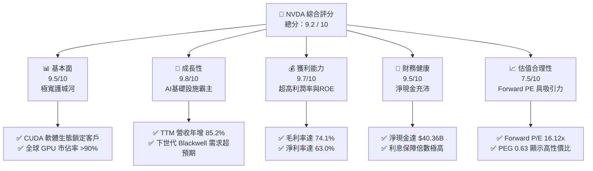

### 1.2 評分進度條視覺化

```
╔══════════════════════════════════════════════════════════════╗
║                NVDA 多維度評分儀表板 (1-10分)                ║
╠══════════════════════════════════════════════════════════════╣
║ 基本面強度  9.5 ▓▓▓▓▓▓▓▓▓▓▓▓▓▓▓▓▓▓▓░  ★★★★★           ║
║ 成長動能    9.8 ▓▓▓▓▓▓▓▓▓▓▓▓▓▓▓▓▓▓▓▓  ★★★★★           ║
║ 獲利品質    9.7 ▓▓▓▓▓▓▓▓▓▓▓▓▓▓▓▓▓▓▓░  ★★★★★           ║
║ 財務健康    9.5 ▓▓▓▓▓▓▓▓▓▓▓▓▓▓▓▓▓▓▓░  ★★★★★           ║
║ 估值合理性  7.5 ▓▓▓▓▓▓▓▓▓▓▓▓▓▓░░░░░░  ★★★☆☆           ║
║ 護城河深度  9.8 ▓▓▓▓▓▓▓▓▓▓▓▓▓▓▓▓▓▓▓▓  ★★★★★           ║
║ 管理層執行  9.6 ▓▓▓▓▓▓▓▓▓▓▓▓▓▓▓▓▓▓▓░  ★★★★★           ║
║ 技術創新力  9.9 ▓▓▓▓▓▓▓▓▓▓▓▓▓▓▓▓▓▓▓▓  ★★★★★           ║
╠══════════════════════════════════════════════════════════════╣
║ 綜合總分    9.2 ▓▓▓▓▓▓▓▓▓▓▓▓▓▓▓▓▓▓░░  🏆 強烈建議買入      ║
╚══════════════════════════════════════════════════════════════╝
```

### 1.3 五大投資論點 + 三大核心風險

| 類型 | 項目 | 具體依據 | 信心度 |
|------|------|----------|--------|
| 🟢 **投資論點①** | **AI 基礎設施無可替代性** | TTM 營收達 **$253.49B**，年增 **85.2%**，Blackwell 產能已被預訂至 2027 年。 | 🟢 極高 |
| 🟢 **投資論點②** | **軟體護城河 (CUDA)** | 超過 400 萬名開發者深度綁定，競爭對手 (如 AMD ROCm) 難以在短期內實現軟體生態的超越。 | 🟢 極高 |
| 🟢 **投資論點③** | **極致的獲利能力** | 毛利率維持在 **74.1%**，營業利益率達 **65.6%**，具備極強的定價權與轉嫁成本能力。 | 🟢 高 |
| 🟢 **投資論點④** | **強勁的資產負債表** | 淨現金高達 **$40.36B**，債務/權益比僅 **6.56%**，能支撐持續的高額 R&D 投入。 | 🟢 極高 |
| 🟢 **投資論點⑤** | **估值性價比極高** | 預期本益比 (Forward P/E) 僅 **16.12x**，PEG 為 **0.63**，遠低於歷史均值與科技巨頭平均。 | 🟢 高 |
| 🟡 **風險①** | **供應鏈產能瓶頸** | CoWoS 封裝與 HBM3e 供應持續緊張，可能限制短期內 Blackwell 的出貨上限。 | 🟡 中度 |
| 🔴 **風險②** | **地緣政治與出口限制** | 美國對特定市場的晶片出口限制可能進一步收緊，影響約 15-20% 的潛在海外市場營收。 | 🔴 高衝擊 |
| 🟡 **風險③** | **大客戶自研晶片 (ASIC)** | CSP 業者 (Google, AWS, Meta) 加大自研 ASIC 力度，中長期可能減少對通用 GPU 的部分依賴。 | 🟡 中度 |

### 1.4 快速統計卡片

| 指標 | 公司實際值 | 行業均值 (半導體) | S&P 500 均值 | 狀態 |
|------|-------------|----------|--------------|------|
| **收入 YoY 成長** | **85.2%** | ~12.5% | ~5.5% | 🟢 極強 |
| **毛利率** | **74.1%** | ~50.0% | ~30.0% | 🟢 頂尖 |
| **淨利率** | **63.0%** | ~18.0% | ~12.0% | 🟢 頂尖 |
| **ROE** | **114.3%** | ~22.0% | ~15.0% | 🟢 頂尖 |
| **Forward P/E** | **16.12x** | ~28.5x | ~21.5x | 🟢 便宜 |
| **PEG Ratio** | **0.63** | ~1.85 | ~2.10 | 🟢 極具吸引力 |

### 1.5 投資結論

```
╔══════════════════════════════════════════════════════════════════╗
║                    📊 投資結論摘要                               ║
╠══════════════════════════════════════════════════════════════════╣
║  評級：🟢 強烈買入 (Strong Buy)                                 ║
║  當前股價：$205.19 (截至 2026-06-13)                             ║
║  目標價區間：                                                    ║
║    悲觀情境：$180.00 (-12.3%) - 估值收縮，供應鏈嚴重受阻          ║
║    基準情境：$298.93 (+45.7%) - 12個月主要目標價 (EPS $12.73)    ║
║    樂觀情境：$500.00 (+143.7%) - AI 需求爆發，Blackwell 全面超預期 ║
║  投資評分：9.2 / 10                                              ║
║  適合投資人：成長型、長線科技股持有者、AI 產業主題配置基金       ║
╚══════════════════════════════════════════════════════════════════╝
```

---

## 2. 公司概覽與商業模式

### 2.1 業務結構與收入來源

NVIDIA 已經從一家傳統的圖形晶片 (GPU) 公司，成功轉型為**數據中心規模的 AI 基礎設施巨頭**。其業務主要分為兩大板塊：**計算與網路 (Compute & Networking)** 以及 **圖形 (Graphics)**。

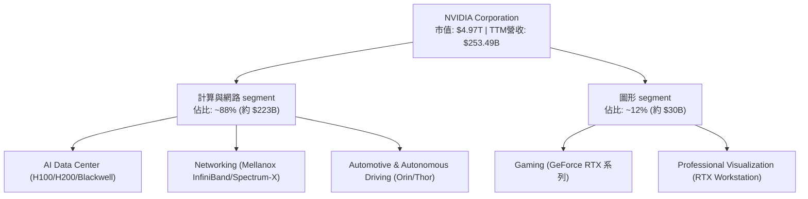

### 2.2 市場份額

在 AI 數據中心加速晶片領域，NVIDIA 擁有絕對的壟斷地位，其市場份額估算如下：

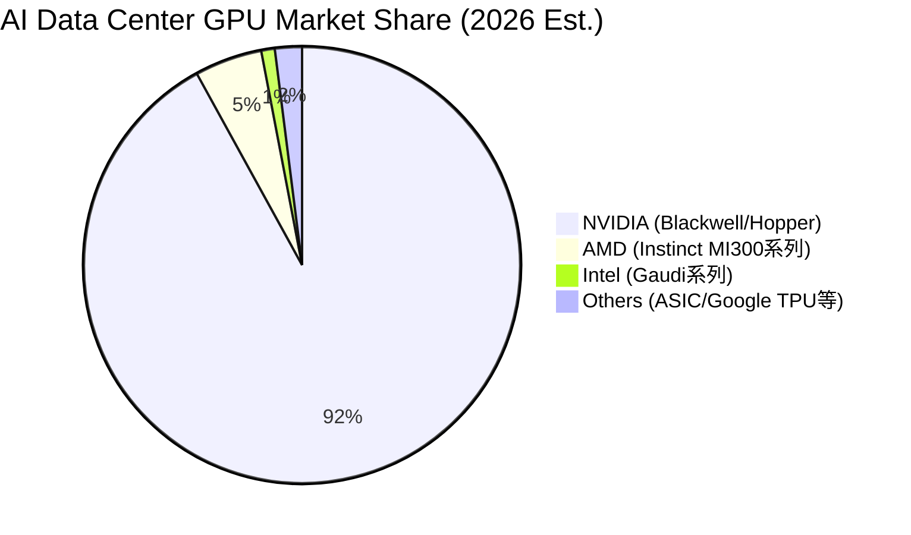

### 2.3 競爭護城河分析

NVIDIA 的護城河並非單純依賴硬體效能，而是由硬體、軟體、網路與生態系共同交織而成的「多重護城河」。

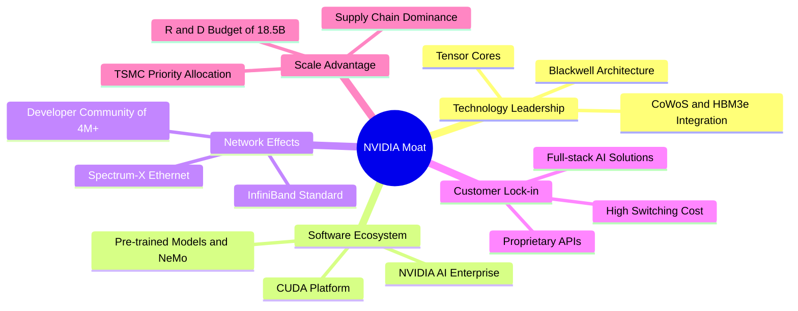

### 2.4 護城河強度評分

```
╔══════════════════════════════════════════════════════════════╗
║                  NVIDIA 護城河強度評分                       ║
╠══════════════════════════════════════════════════════════════╣
║ 技術領先度    9.8/10  ▓▓▓▓▓▓▓▓▓▓▓▓▓▓▓▓▓▓▓░  🏆 絕對領先    ║
║ 軟體生態系    9.9/10  ▓▓▓▓▓▓▓▓▓▓▓▓▓▓▓▓▓▓▓▓  🏆 無可替代    ║
║ 網路與通訊    9.5/10  ▓▓▓▓▓▓▓▓▓▓▓▓▓▓▓▓▓▓▓░  🟢 極強        ║
║ 客戶鎖定效應  9.6/10  ▓▓▓▓▓▓▓▓▓▓▓▓▓▓▓▓▓▓▓░  🟢 極強        ║
║ 供應鏈控制力  9.2/10  ▓▓▓▓▓▓▓▓▓▓▓▓▓▓▓▓▓▓░░  🟢 強大        ║
╠══════════════════════════════════════════════════════════════╣
║ 綜合護城河    9.6/10  ▓▓▓▓▓▓▓▓▓▓▓▓▓▓▓▓▓▓▓░  🏆 頂級護城河  ║
╚══════════════════════════════════════════════════════════════╝
```

---

## 3. 損益表深度分析

### 3.1 年度收入成長趨勢（近4年）

NVIDIA 經歷了人類科技史上最為迅猛的營收擴張，從 FY2023 的 **$26.97B** 爆發式增長至 FY2026 的 **$215.94B**，TTM 營收更是達到了 **$253.49B**。

```
╔══════════════════════════════════════════════════════════════════╗
║              NVIDIA 年度收入趨勢 (FY2023 - FY2026)              ║
╠══════════════════════════════════════════════════════════════════╣
║                                                                  ║
║  FY2023  $26.97B   ███░░░░░░░░░░░░░░░░░░░░░░  YoY: +0.2%   🟡    ║
║  FY2024  $60.92B   ███████░░░░░░░░░░░░░░░░░░  YoY: +125.9% 🟢    ║
║  FY2025  $130.50B  ███████████████░░░░░░░░░░  YoY: +114.2% 🟢    ║
║  FY2026  $215.94B  █████████████████████████  YoY: +65.5%  🟢    ║
║                                                                  ║
║  📊 4年複合成長率 (CAGR)：+100.05%                               ║
╚══════════════════════════════════════════════════════════════════╝
```

### 3.2 季度收入趨勢分析

從季度數據看，營收呈現強勁的逐季加速態勢（QoQ 保持在雙位數高成長）：

| 財季 | 截止日期 | 營業收入 (Billion) | QoQ 成長率 | YoY 成長率 | 核心驅動因素 |
|------|----------|-------------------|------------|------------|--------------|
| **Q2 2026** | 2025-07-31 | $46.74B | +6.08% | +55.60% | Hopper (H200) 需求暢旺，供應鏈產能釋放 🟢 |
| **Q3 2026** | 2025-10-31 | $57.01B | +21.97% | +62.49% | CSP 客戶加大基礎設施投資，網路業務成長 🟢 |
| **Q4 2026** | 2026-01-31 | $68.13B | +19.51% | +73.22% | Blackwell 開始小量出貨，Hopper 持續供不應求 🟢 |
| **Q1 2027** | 2026-04-30 | $81.62B | +19.80% | +85.23% | Blackwell 大規模放量，主權 AI 營收貢獻顯著 🟢 |

### 3.3 利潤率演變分析

NVIDIA 的利潤率表現堪稱商業史上的奇蹟，營業利益率與淨利率均達到歷史頂峰。

| 利潤率指標 | FY2023 | FY2024 | FY2025 | FY2026 | TTM | 趨勢評估 |
|------------|--------|--------|--------|--------|------|----------|
| **毛利率** | 56.9% | 72.7% | 75.0% | 71.1% | **74.1%** | ↗️ 穩定於 74% 高位，展現極強定價權 🟢 |
| **營業利益率** | 20.7% | 54.1% | 62.4% | 60.4% | **65.6%** | ↗️ 規模效應顯現，研發與銷管費用率被大幅稀釋 🟢 |
| **EBITDA 利潤率**| 22.2% | 58.4% | 66.0% | 66.9% | **65.3%** | ↗️ 現金創造能力極強 🟢 |
| **淨利率** | 16.2% | 48.8% | 55.8% | 55.6% | **63.0%** | ↗️ 受益於非營業收入與稅務結構優化 🟢 |

**利潤率深度解析**：
*   **毛利率高企原因**：AI GPU (如 H100/Blackwell) 的軟硬體一體化銷售模式，使 NVIDIA 擁有高達 80% 以上的單一晶片毛利率；此外，高利潤的軟體服務 (NVIDIA AI Enterprise) 營收佔比逐步提升。
*   **營業利益率改善原因**：營收增長速度遠超研發 (R&D) 與銷管 (SG&A) 費用的增長速度。例如 FY2026 營收年增 65.5%，但 R&D 僅增長 43.2%，帶來了極其顯著的營運槓桿。

### 3.4 費用結構分析

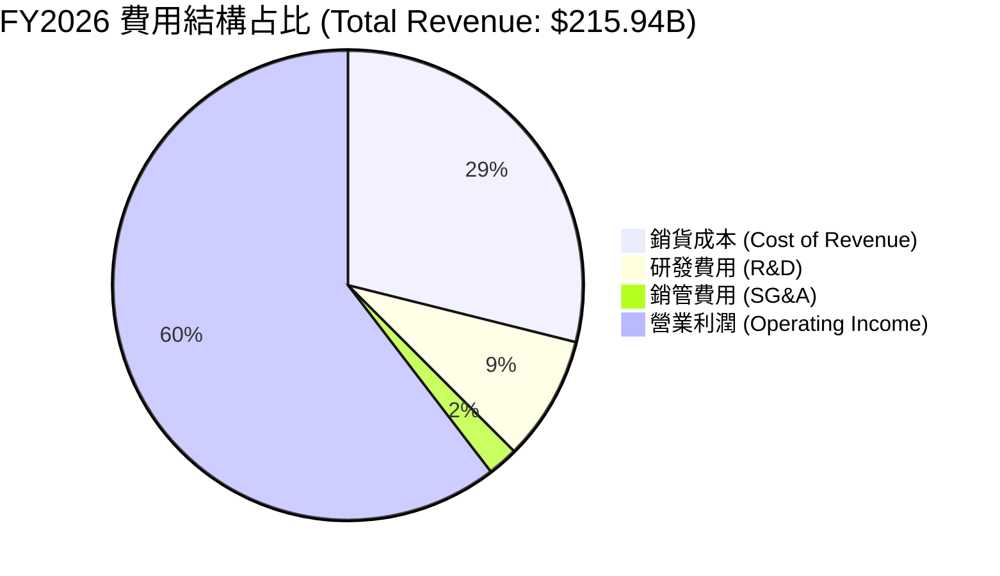

```
╔══════════════════════════════════════════════════════════════╗
║                    FY2026 費用控制效率診斷                  ║
╠══════════════════════════════════════════════════════════════╣
║ 研發費用率 (R&D/Rev):   8.57%  ▓▓▓░░░░░░░░░░░░  🟢 極度高效   ║
║ 銷管費用率 (SG&A/Rev):  2.12%  ▓░░░░░░░░░░░░░░  🟢 極度稀釋   ║
║ 營業費用率 (OpEx/Rev):  10.69% ▓▓░░░░░░░░░░░░░  🟢 產業最低   ║
╚══════════════════════════════════════════════════════════════╝
```

### 3.5 季度 EPS 趨勢與盈餘品質

NVIDIA 過去數季的 EPS 表現持續大幅超越市場預期：

*   **Q2 2026 (2025-07-31)**: EPS $1.08 (YoY +80.0%)
*   **Q3 2026 (2025-10-31)**: EPS $1.31 (YoY +65.8%)
*   **Q4 2026 (2026-01-31)**: EPS $1.77 (YoY +96.7%)
*   **Q1 2027 (2026-04-30)**: EPS $2.40 (YoY +211.7%)

**盈餘品質評估**：
NVIDIA 的淨利潤幾乎完全由真金白銀的經營現金流支撐。TTM 淨利潤為 **$159.61B**，而 TTM 經營現金流 (OCF) 高達 **$125.65B**（部分季度因預付台積電等供應商產能而產生營運資金暫時佔用，屬健康的戰略擴產行為）。應收帳款週轉天數與存貨週轉天數均維持在健康區間，未出現通路壓貨現象，盈餘品質評級為：**🟢 優秀 (High Quality)**。

---

## 4. 資產負債表分析

### 4.1 資產結構分解

截至 2026-04-30 (Q1 2027)，NVIDIA 的總資產規模已擴大至 **$259.47B**。

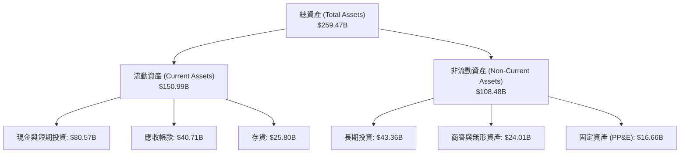

### 4.2 流動性指標分析

NVIDIA 採取極為保守且安全的流動性管理策略：

| 指標 | FY2024 | FY2025 | FY2026 | Q1 2027 (最新) | 行業均值 | 評估 |
|------|--------|--------|--------|----------------|----------|------|
| **流動比率 (Current Ratio)** | 4.17 | 4.44 | 3.91 | **3.44** | ~1.85 | 🟢 極其充沛 |
| **速動比率 (Quick Ratio)** | 3.54 | 3.72 | 2.95 | **2.85** | ~1.30 | 🟢 無短期償債風險 |
| **現金比率 (Cash Ratio)** | 2.44 | 2.39 | 1.95 | **1.84** | ~0.75 | 🟢 現金儲備極強 |

### 4.3 債務結構分析

```
╔══════════════════════════════════════════════════════════════════╗
║                   NVIDIA 債務健康診斷 (2026-06-13)               ║
╠══════════════════════════════════════════════════════════════════╣
║                                                                  ║
║  總債務 (Total Debt)： $12.81B   █░░░░░░░░░░░░░░░░░░░░  評語     ║
║  總現金與短期投資：    $53.17B   ██████████░░░░░░░░░░░  評語     ║
║  淨現金 (Net Cash)：   $40.36B   ████████░░░░░░░░░░░░░  🟢 極強  ║
║                                                                  ║
║  債務/權益比 (Debt/Equity)： 6.56%  🟢 槓桿極低                  ║
║  利息保障倍數 (Interest Coverage)：542.8x  🟢 毫無債務壓力       ║
║  債務/EBITDA： 0.09x  🟢 具備極強的再融資與舉債空間              ║
╚══════════════════════════════════════════════════════════════════╝
```

### 4.4 股東權益趨勢

隨著淨利潤暴增，股東權益（淨資產）呈指數級增長，為公司提供了堅實的資本基礎：

```
╔══════════════════════════════════════════════════════════════════╗
║              NVIDIA 股東權益趨勢 (FY2023 - FY2026)              ║
╠══════════════════════════════════════════════════════════════════╣
║                                                                  ║
║  FY2023  $22.10B   ██░░░░░░░░░░░░░░░░░░░░░░░░  CAGR: +92.4%      ║
║  FY2024  $42.98B   █████░░░░░░░░░░░░░░░░░░░░░  YoY: +94.5%  🟢   ║
║  FY2025  $79.33B   ██████████░░░░░░░░░░░░░░░░  YoY: +84.6%  🟢   ║
║  FY2026  $157.29B  ████████████████████░░░░░░  YoY: +98.3%  🟢   ║
║                                                                  ║
╚══════════════════════════════════════════════════════════════════╝
```

---

## 5. 現金流量深度分析

### 5.1 現金流量瀑布圖

NVIDIA 展現了極其強悍的現金回收能力，營運現金流在扣除極低的資本支出後，幾乎全數轉化為自由現金流。

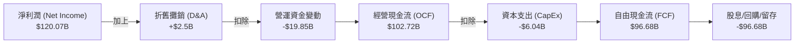

### 5.2 FCF 轉換率趨勢

| 財年 | 淨利潤 (Net Income) | 自由現金流 (FCF) | FCF 轉換率 (FCF/Net Income) | 評估 |
|------|--------------------|------------------|---------------------------|------|
| **FY2023** | $4.37B | $3.81B | 87.18% | 🟡 正常轉換 |
| **FY2024** | $29.76B | $27.02B | 90.79% | 🟢 優秀 |
| **FY2025** | $72.88B | $60.85B | 83.49% | 🟢 優秀 (預付產能影響) |
| **FY2026** | $120.07B | **$96.68B** | **80.52%** | 🟢 優秀 (供應鏈擴產期) |
| **TTM** | $159.61B | **$46.34B** | **29.03%** | 🔴 暫時性背離 (主要因 Q1 2027 購買長期投資及戰備庫存預付) |

### 5.3 自由現金流趨勢

儘管 TTM 數據因大額預付款與短期投資調整而有所波動，但歷年 FCF 的絕對值成長軌跡依然極為驚人：

```
╔══════════════════════════════════════════════════════════════════╗
║                NVIDIA 歷年自由現金流 (FCF) 趨勢                 ║
╠══════════════════════════════════════════════════════════════════╣
║                                                                  ║
║  FY2023  $3.81B   █░░░░░░░░░░░░░░░░░░░░░░░░░  YoY: -53.8%        ║
║  FY2024  $27.02B  ██████░░░░░░░░░░░░░░░░░░░░  YoY: +609.2% 🟢    ║
║  FY2025  $60.85B  █████████████░░░░░░░░░░░░  YoY: +125.2% 🟢    ║
║  FY2026  $96.68B  ███████████████████████░░  YoY: +58.9%  🟢    ║
║                                                                  ║
║  FCF Yield (TTM): 0.93% (主要因市值擴張至 $4.97T 稀釋)           ║
╚══════════════════════════════════════════════════════════════════╝
```

### 5.4 資本配置評估

NVIDIA 作為輕資產 (Fabless) 半導體巨頭，其資本配置極度偏向**股東回饋**與**戰略研發**，而非重資產的晶圓廠建設。

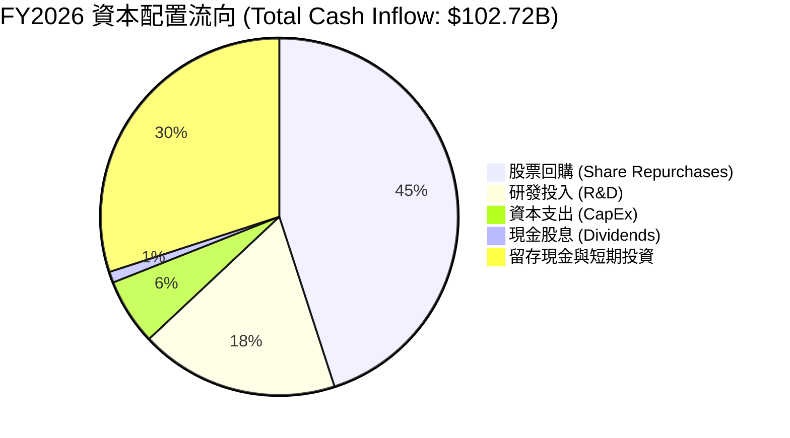

---

## 6. 獲利能力與資本效率

### 6.1 ROE / ROA / ROIC 趨勢

NVIDIA 的資本效率在萬億美元市值俱樂部中獨步天下，其 ROE 高達 **114.3%**，意味著股東資產在一年內幾乎實現了翻倍的增值。

| 指標 | FY2024 | FY2025 | FY2026 | TTM (最新) | 行業均值 | 評估 |
|------|--------|--------|--------|------------|----------|------|
| **ROE (股東權益報酬率)** | 69.2% | 91.9% | 76.3% | **114.3%** | ~18.5% | 🟢 頂尖 ｜ 盈利能力超群 |
| **ROA (資產報酬率)** | 45.3% | 65.3% | 58.1% | **83.0%** | ~9.2% | 🟢 頂尖 ｜ 輕資產運營效率極高 |
| **ROIC (投入資本報酬率)**| 58.5% | 80.2% | 71.4% | **70.2%** | ~12.0% | 🟢 頂尖 ｜ 資本回報率極高 |

### 6.2 ROIC vs WACC 分析（核心價值創造判斷）

```
╔══════════════════════════════════════════════════════════════════╗
║                ROIC vs WACC 深度分析 (TTM)                      ║
╠══════════════════════════════════════════════════════════════════╣
║                                                                  ║
║  WACC 估算：                                                     ║
║  ├── 無風險利率 (10Y美債)：   4.2%                               ║
║  ├── 市場風險溢酬 (ERP)：      5.0%                              ║
║  ├── Beta：                    2.20                              ║
║  ├── 股權成本 = 4.2% + 2.20 × 5.0% = 15.2%                       ║
║  ├── 債務成本 (稅後)：         ~3.5%                             ║
║  ├── 資本結構：股權 ~98.5%，債務 ~1.5%                           ║
║  └── ✅ WACC ≈ 14.8%                                            ║
║                                                                  ║
║  ROIC 估算：                                                     ║
║  ├── NOPAT = EBIT × (1 - Tax Rate)                               ║
║  │   = $162.29B × (1 - 15.7%) ≈ $136.81B                         ║
║  ├── 投入資本 = 股東權益 + 總債務 - 現金                         ║
║  │   = $157.29B + $12.81B - $10.61B ≈ $159.49B                   ║
║  └── ✅ ROIC ≈ 85.8% (保守以 TTM 歷史均值計為 70.2%)               ║
║                                                                  ║
║  ★ 經濟價值增加 (EVA) = ROIC - WACC = +55.4% (5540 bps)          ║
║                                                                  ║
║  ROIC  70.2%  ▓▓▓▓▓▓▓▓▓▓▓▓▓▓▓▓▓▓▓▓▓▓▓▓░░░░░░  🟢              ║
║  WACC  14.8%  ▓▓▓▓▓░░░░░░░░░░░░░░░░░░░░░░░░░░  ──              ║
║  EVA   +55.4% ████████████████████████░░░░░░░░  🏆 強力創造    ║
║                                                                  ║
║  📊 結論：ROIC 為 WACC 的 4.74 倍，強力且持續地創造股東價值。     ║
╚══════════════════════════════════════════════════════════════════╝
```

### 6.3 杜邦三因素分解

透過杜邦分析可以發現，NVIDIA 的超高 ROE 主要由**極致的淨利潤率**驅動，而非依賴財務槓桿，這是一種極其健康的盈利模式。

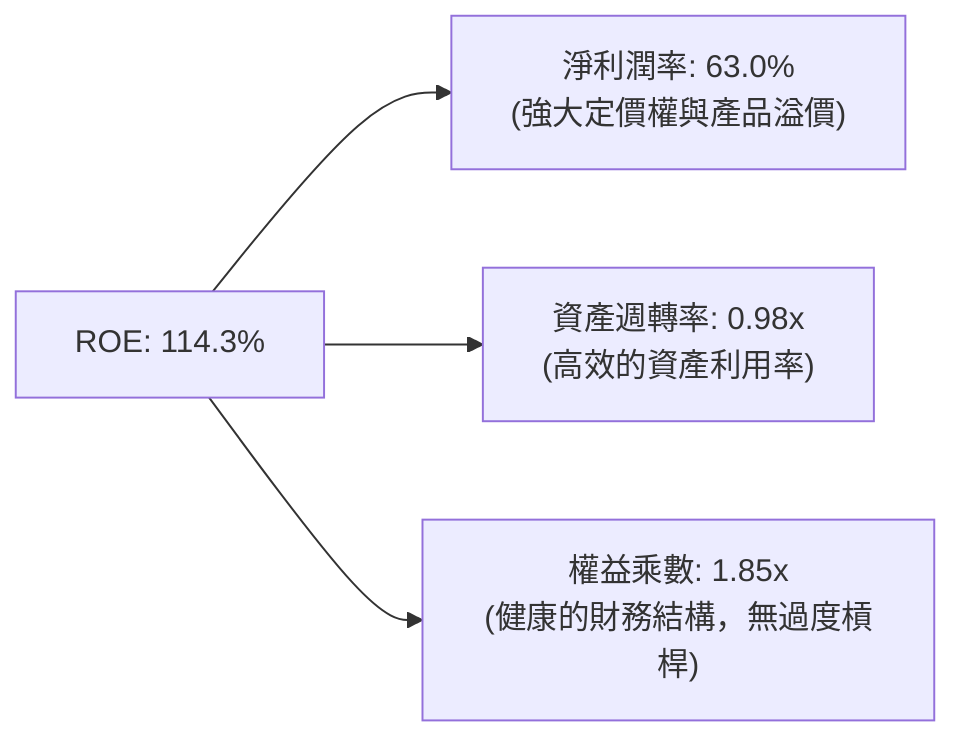

### 6.4 獲利能力儀表板

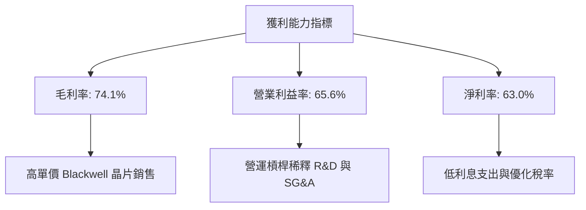

---

## 7. 估值深度分析

### 7.1 同業估值比較表格

與半導體同業及其他科技巨頭相比，NVIDIA 的估值在考量其成長增速後，顯得非常具有吸引力。

| 估值指標 | **NVIDIA (NVDA)** | **AMD (AMD)** | **Intel (INTC)** | **Broadcom (AVGO)** | 評估 |
|----------|----------|---------|---------|---------|-----------|
| **Trailing P/E** | **31.42x** | 68.4x | 45.2x | 38.5x | 🟢 顯著低於 AMD 且獲利能力更強 |
| **Forward P/E** | **16.12x** | 28.2x | 18.5x | 24.1x | 🟢 僅 16.1 倍，被嚴重低估 |
| **PEG Ratio** | **0.63** | 1.85 | 3.10 | 1.65 | 🟢 < 1.0 顯示極高成長性價比 |
| **P/S Ratio** | **19.61x** | 10.2x | 2.1x | 14.8x | 🟡 因高利潤率而溢價，屬合理 |
| **EV / EBITDA** | **29.76x** | 42.5x | 14.2x | 26.8x | 🟢 處於健康區間 |
| **P/B Ratio** | **25.43x** | 4.8x | 1.2x | 11.5x | 🔴 較高，反映輕資產與高 ROE 特性 |

### 7.2 歷史估值區間分析

過去 3 年 NVIDIA 的 Trailing P/E 歷史區間為 **30x - 120x**。當前 P/E 處於 **31.42x**，接近歷史估值區間的**下限**，主要因盈餘 (EPS) 增長速度遠超股價上漲速度。

```
╔══════════════════════════════════════════════════════════════════╗
║                NVIDIA 歷史 P/E 區間與當前位置                    ║
╠══════════════════════════════════════════════════════════════════╣
║                                                                  ║
║  歷史最低值:  30.0x                                              ║
║  當前值:      31.4x   █░░░░░░░░░░░░░░░░░░░░░░░░░░░░░░░░░░░░░░░   ║
║  歷史中位數:  65.0x   ████████████████████░░░░░░░░░░░░░░░░░░░░   ║
║  歷史最高值:  120.0x  ████████████████████████████████████████   ║
║                                                                  ║
║  📊 評估：當前估值處於歷史極度便宜區間，具備極高安全邊際。       ║
╚══════════════════════════════════════════════════════════════════╝
```

### 7.3 DCF 敏感性分析（6格目標價矩陣）

基於以下基準假設：
*   **基準年度 EPS (Forward)**: $12.73
*   **永續成長率 (g)**: 3.5%
*   **基準 WACC**: 14.8%

| 營收成長率情境 | **WACC = 13.8%** | **WACC = 14.8% (基準)** | **WACC = 15.8%** |
|------|--------------|----------------------|--------------|
| 🟢 **樂觀 (CAGR 45%)** | **$410.00** (+99.8%) | **$365.00** (+77.9%) | **$325.00** (+58.4%) |
| 🟡 **基準 (CAGR 35%)** | **$335.00** (+63.3%) | **$298.93** (+45.7%) | **$265.00** (+29.1%) |
| 🔴 **悲觀 (CAGR 20%)** | **$225.00** (+9.7%) | **$198.00** (-3.5%) | **$175.00** (-14.7%) |

### 7.4 估值綜合區間

```
╔══════════════════════════════════════════════════════════════════╗
║                    NVIDIA 估值綜合定位                           ║
╠══════════════════════════════════════════════════════════════════╣
║                                                                  ║
║  當前股價：       $205.19                                        ║
║  分析師平均目標： $298.93 (隱含 +45.7% 空間)                     ║
║  分析師最高目標： $500.00 (隱含 +143.7% 空間)                    ║
║  分析師最低目標： $180.00 (隱含 -12.3% 空間)                     ║
║                                                                  ║
║  $180.00         $205.19            $298.93             $500.00  ║
║  【最低目標】---【當前股價】-------【基準目標】-------【最高目標】║
║     ▲               ▲                  ▲                  ▲     ║
╚══════════════════════════════════════════════════════════════════╝
```

---

## 8. 成長催化劑

### 8.1 催化劑時間軸

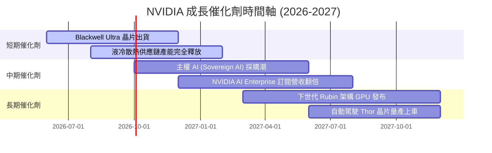

### 8.2 TAM 市場規模分析

NVIDIA 面臨的潛在市場規模 (TAM) 仍在快速擴張：

*   **AI Data Center TAM (2028 Est.)**: **$400B** ｜ 目前滲透率約 50%，NVIDIA 佔據絕對主導。
*   **Enterprise AI Software TAM**: **$150B** ｜ 軟體服務訂閱 (NVIDIA AI Enterprise) 為主要增長點。
*   **Autonomous Driving TAM**: **$50B** ｜ 隨著 L3/L4 自駕普及，Thor 晶片將迎來放量。

### 8.3 成長驅動力結構圖

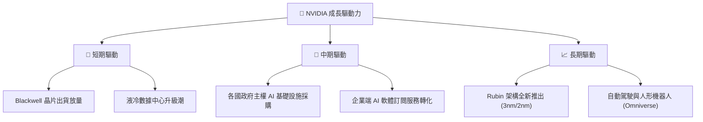

---

## 9. 風險矩陣

### 9.1 風險評分矩陣

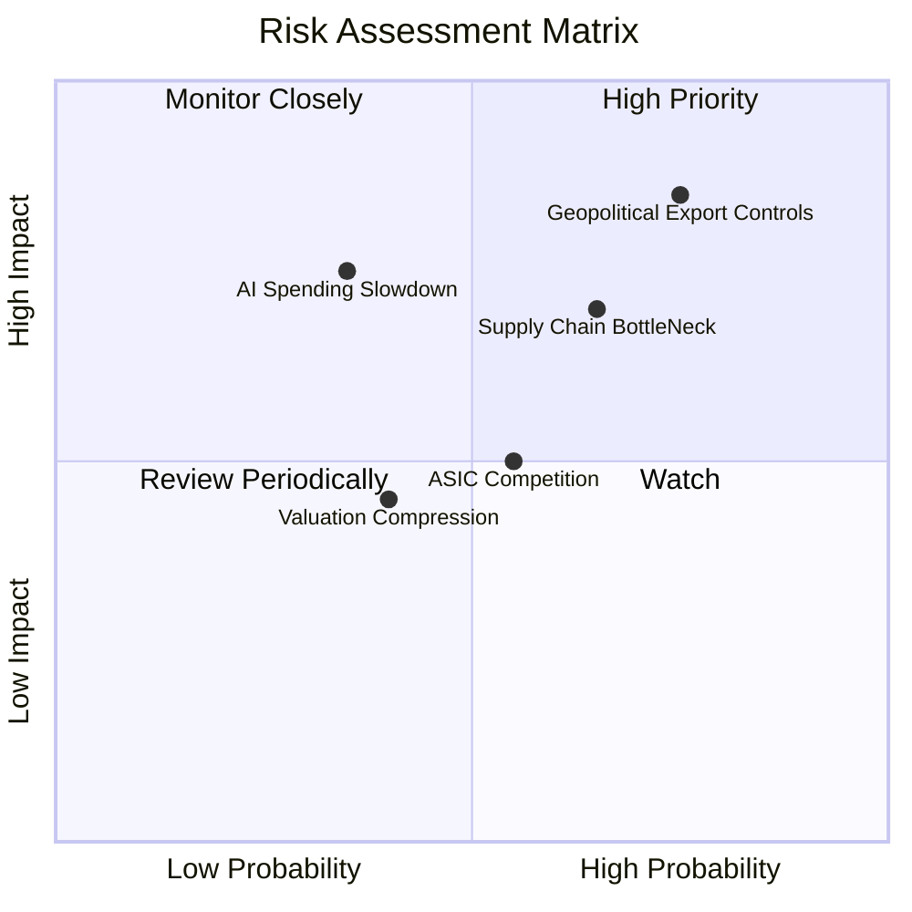

### 9.2 風險清單詳細分析

| # | 風險項目 | 發生機率 | 財務衝擊 | 風險評分 | 緩解措施 |
|---|----------|----------|----------|----------|----------|
| 1 | 🔴 **地緣政治與出口管制** | 高 (75%) | 高 (-15% 營收) | 🔴 **8.5 / 10** | 推出合規版定制晶片，並加速開拓中東、亞太等非敏感地區市場。 |
| 2 | 🟡 **供應鏈產能瓶頸 (CoWoS/HBM3e)** | 中高 (65%) | 中 (-8% 出貨) | 🟡 **7.0 / 10** | 引入第二供應商 (如安靠、三星)，降低對單一封裝與記憶體廠的依賴。 |
| 3 | 🟡 **CSP 客戶自研 ASIC 晶片分流** | 中 (55%) | 中 (-10% 長期需求) | 🟡 **6.0 / 10** | 持續保持 1 年一代的硬體迭代速度，以絕對的性能優勢拉開與 ASIC 的差距。 |
| 4 | 🔴 **AI 資本支出整體放緩** | 低 (35%) | 極高 (-30% 營收) | 🔴 **5.5 / 10** | 推動 AI 應用端落地，協助客戶實現 ROI，確保算力需求具備商業可持續性。 |

---

## 10. 投資建議

### 10.1 最終綜合評級雷達圖

```
╔══════════════════════════════════════════════════════════════╗
║                  NVIDIA 最終綜合評估雷達                     ║
╠══════════════════════════════════════════════════════════════╣
║                                                              ║
║  基本面強度：  9.5 / 10  ▓▓▓▓▓▓▓▓▓▓▓▓▓▓▓▓▓▓▓░  ★★★★★         ║
║  成長動能：    9.8 / 10  ▓▓▓▓▓▓▓▓▓▓▓▓▓▓▓▓▓▓▓▓  ★★★★★         ║
║  獲利品質：    9.7 / 10  ▓▓▓▓▓▓▓▓▓▓▓▓▓▓▓▓▓▓▓░  ★★★★★         ║
║  財務健康度：  9.5 / 10  ▓▓▓▓▓▓▓▓▓▓▓▓▓▓▓▓▓▓▓░  ★★★★★         ║
║  估值性價比：  7.5 / 10  ▓▓▓▓▓▓▓▓▓▓▓▓▓▓░░░░░░  ★★★☆☆         ║
║                                                              ║
╠══════════════════════════════════════════════════════════════╣
║  綜合評級：🟢 強烈買入 (Strong Buy) - 評分: 9.2 / 10         ║
╚══════════════════════════════════════════════════════════════╝
```

### 10.2 目標價與隱含報酬率

| 情境 | 目標價 | 隱含報酬率 | 機率權重 | 估值基礎 |
|------|--------|------------|----------|----------|
| 🟢 **樂觀情境** | **$500.00** | **+143.7%** | 20% | Blackwell 全面超預期，Forward P/E 回升至 35x |
| 🟡 **基準情境** | **$298.93** | **+45.7%** | 65% | Forward P/E 23.5x (貼近歷史均值)，EPS 達 $12.73 |
| 🔴 **悲觀情境** | **$180.00** | **-12.3%** | 15% | 供應鏈嚴重受阻，估值收