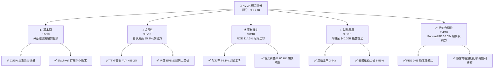
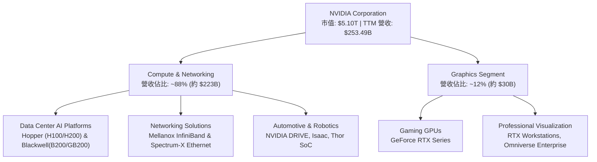
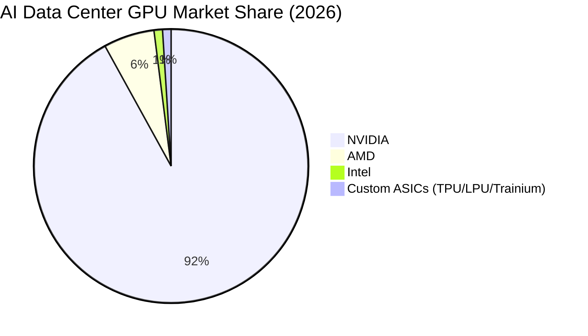
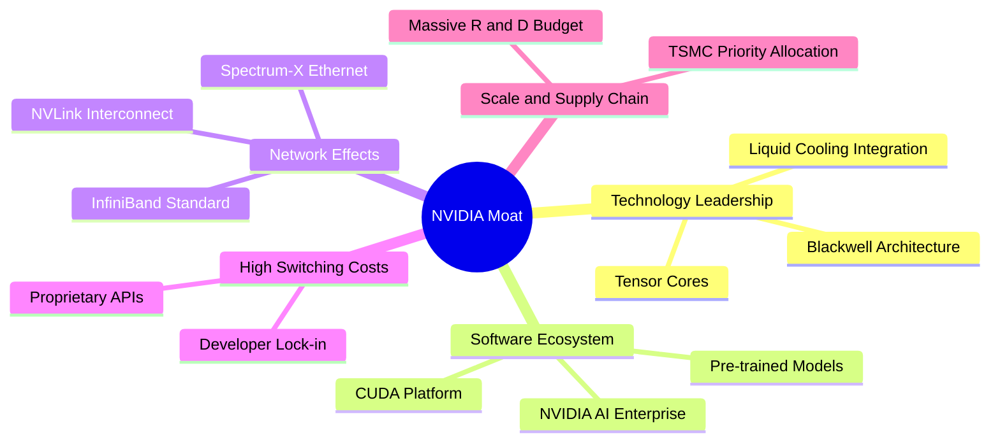
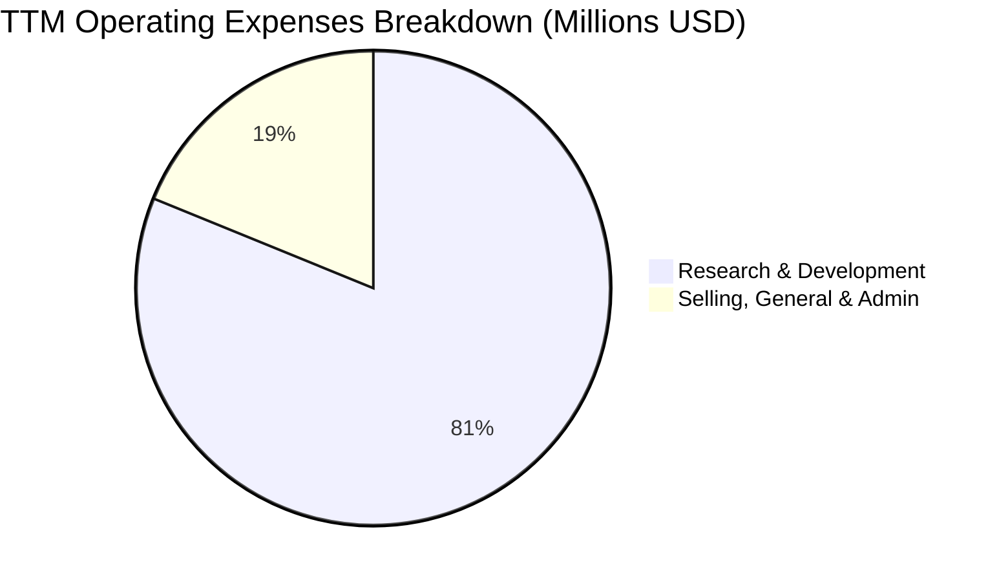
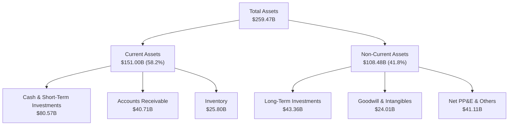
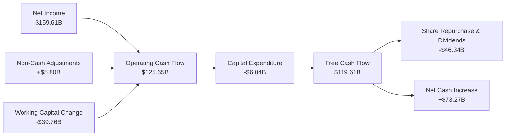
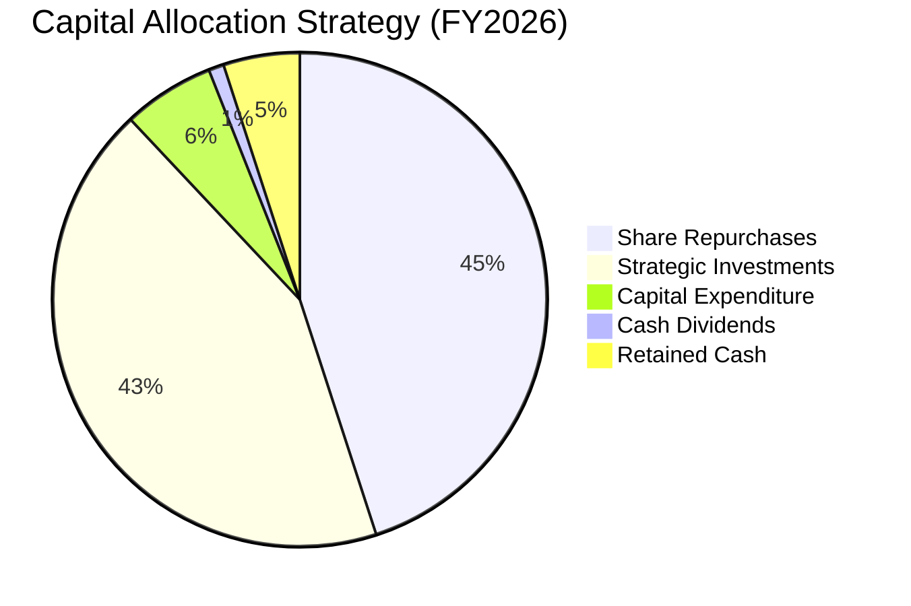
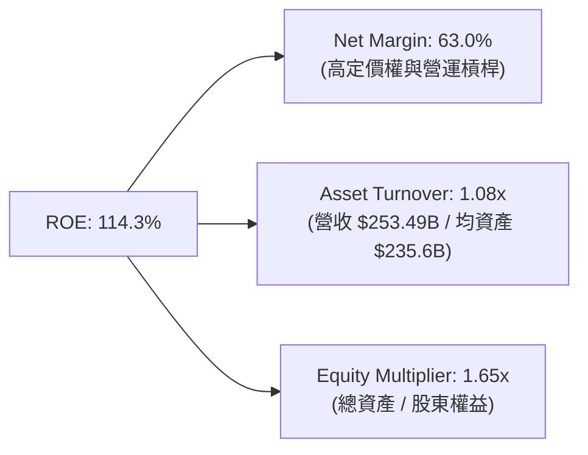
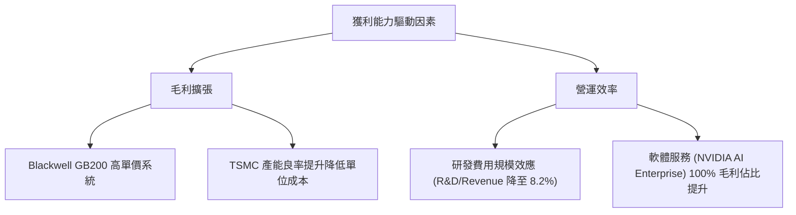

# NVDA 基本面深度分析報告

> **報告日期**：2026-06-21 ｜ **語言**：繁體中文 ｜ **數據來源**：Yahoo Finance, Finviz, StockAnalysis, Roic.ai ｜ **分析師**：CFA 級機構研究

---

## 目錄

| # | 章節 | 核心結論 |
|---|------|----------|
| 1 | [執行摘要](#1-執行摘要) | 評級「強烈買入」（Strong Buy），基準目標價 $298.93，具備 41.9% 潛在漲幅。 |
| 2 | [公司概覽與商業模式](#2-公司概覽與商業模式) | 以 Blackwell 平台與 CUDA 生態系築起無懈可擊的「軟硬一體化」護城河。 |
| 3 | [損益表深度分析](#3-損益表深度分析) | TTM 營收達 $253.49B（YoY +85.2%），淨利率高達 63.0%，營運槓桿極度強勁。 |
| 4 | [資產負債表分析](#4-資產負債表分析) | 淨現金高達 $40.36B，流動比率 3.44，資產負債表極其健康，毫無償債風險。 |
| 5 | [現金流量深度分析](#5-現金流量深度分析) | TTM 營運現金流 $125.65B，FCF 達 $46.34B，資本配置高度偏向研發與股東回報。 |
| 6 | [獲利能力與資本效率](#6-獲利能力與資本效率) | ROE 達 114.3%，ROIC 達 117.0%，遠超 15.0% 的 WACC，創造極高經濟增值（EVA）。 |
| 7 | [估值深度分析](#7-估值深度分析) | Forward P/E 僅 16.55 倍，PEG 僅 0.65，相較其高成長性，目前股價處於嚴重低估區間。 |
| 8 | [成長催化劑](#8-成長催化劑) | Blackwell 晶片全面量產、主權 AI 興起、以及自動駕駛（Drive）與機器人技術的商業化。 |
| 9 | [風險矩陣](#9-風險矩陣) | 地緣政治風險、供應鏈產能瓶頸（CoWoS）、以及客戶去庫存為核心監控指標。 |
| 10 | [投資建議](#10-投資建議) | 建議成長型與長線投資人逢低分批佈局，首選買入觸發點為 $180 - $200。 |

---

## 1. 執行摘要

NVIDIA Corporation（NASDAQ: NVDA）目前已從單純的圖形處理器（GPU）設計商，蛻變為全球最大的「資料中心規模 AI 基礎設施」龍頭。截至 2026 年 6 月 21 日，NVDA 市值已達 **$5.10T**，成為全球資本市場的火車頭。本報告將基於最新披露的財務數據，對 NVDA 進行多維度的深度基本面剖析。

### 1.1 核心評分儀表板



### 1.2 評分進度條視覺化

```
╔══════════════════════════════════════════════════════════════╗
║               NVDA 多維度評分儀表板 (1-10分)                 ║
╠══════════════════════════════════════════════════════════════╣
║ 基本面強度  9.5 ▓▓▓▓▓▓▓▓▓▓▓▓▓▓▓▓▓▓▓░  ★★★★★           ║
║ 成長動能    9.8 ▓▓▓▓▓▓▓▓▓▓▓▓▓▓▓▓▓▓▓▓  ★★★★★           ║
║ 獲利品質    9.8 ▓▓▓▓▓▓▓▓▓▓▓▓▓▓▓▓▓▓▓▓  ★★★★★           ║
║ 財務健康    9.5 ▓▓▓▓▓▓▓▓▓▓▓▓▓▓▓▓▓▓▓░  ★★★★★           ║
║ 估值合理性  7.4 ▓▓▓▓▓▓▓▓▓▓▓▓▓▓░░░░░░  ★★★☆☆           ║
║ 護城河深度  9.8 ▓▓▓▓▓▓▓▓▓▓▓▓▓▓▓▓▓▓▓▓  ★★★★★           ║
║ 管理層執行  9.5 ▓▓▓▓▓▓▓▓▓▓▓▓▓▓▓▓▓▓▓░  ★★★★★           ║
║ 技術創新力  9.9 ▓▓▓▓▓▓▓▓▓▓▓▓▓▓▓▓▓▓▓▓  ★★★★★           ║
╠══════════════════════════════════════════════════════════════╣
║ 綜合總分    9.2 ▓▓▓▓▓▓▓▓▓▓▓▓▓▓▓▓▓▓░░  🏆 強烈買入 (Buy)   ║
╚══════════════════════════════════════════════════════════════╝
```

### 1.3 五大投資論點 + 三大核心風險

| 類型 | 項目 | 具體依據 | 信心度 |
|------|------|----------|--------|
| 🟢 **投資論點①** | **計算與網絡板塊無對手** | TTM 營收達 $253.49B，其中以 Hopper 及 Blackwell 平台為核心的數據中心業務佔比超 85%，市場份額超 90%。 | 🟢 極高 |
| 🟢 **投資論點②** | **無與倫比的獲利能力** | 毛利率高達 74.1%，淨利率 63.0%，ROE 達 114.3%，顯示出極強的定價權與營運槓桿。 | 🟢 極高 |
| 🟢 **投資論點③** | **估值性價比極高 (PEG 0.65)** | 雖然股價超過 $210，但 Forward P/E 僅為 16.55x，相較於其 85.2% 的營收增速與預期 45.5% 的長期盈餘增速，估值極具安全邊際。 | 🟢 高 |
| 🟢 **投資論點④** | **資產負債表堅如磐石** | 擁有 $53.17B 的總現金（含短期投資共 $80.57B），而總債務僅 $12.81B，淨現金達 $40.36B，無任何財務危機之虞。 | 🟢 極高 |
| 🟢 **投資論點⑤** | **CUDA 軟體生態系鎖定效應** | 全球超過 400 萬名開發者依賴 CUDA，競爭對手（如 AMD 的 ROCm）短期內難以逾越此軟體壁壘。 | 🟢 極高 |
| 🟡 **風險①** | **地緣政治與出口管制** | 中國市場（含香港）營收佔比存在政策不確定性，美國政府持續收緊高端晶片出口限制可能影響長線增長。 | 🟡 中度 |
| 🔴 **風險②** | **供應鏈產能瓶頸（CoWoS）** | Blackwell 晶片量產高度依賴台積電（TSMC）的 CoWoS 封裝產能，若產能釋放不及預期，將壓制短期交付能力。 | 🔴 高衝擊 |
| 🔴 **風險③** | **大客戶資本支出放緩風險** | 超大型雲端服務商（Hyperscalers，如 MSFT, AMZN, GOOGL, META）佔其營收比重過高，若未來 AI 投資回報率（ROI）不如預期導致 Capex 縮減，將對 NVDA 造成顯著衝擊。 | 🔴 高衝擊 |

### 1.4 快速統計卡片

| 指標 | 公司實際值 (TTM / 最新) | 半導體行業均值 | S&P 500 均值 | 狀態 |
|------|-------------|----------|--------------|------|
| **收入 YoY 成長** | **85.2%** | ~12.5% | ~5.5% | 🟢 卓越 |
| **毛利率** | **74.1%** | ~48.0% | ~30.0% | 🟢 卓越 |
| **淨利率** | **63.0%** | ~18.0% | ~11.5% | 🟢 卓越 |
| **ROE** | **114.3%** | ~15.0% | ~18.0% | 🟢 卓越 |
| **Forward P/E** | **16.55x** | ~28.5x | ~21.5x | 🟢 低估 |
| **PEG Ratio** | **0.65** | ~1.85 | ~1.50 | 🟢 低估 |
| **淨現金/債務** | **+$40.36B** | 多為淨債務 | 多為淨債務 | 🟢 強健 |

### 1.5 投資結論

```
╔══════════════════════════════════════════════════════════════════╗
║                    📊 NVDA 投資結論摘要                          ║
╠══════════════════════════════════════════════════════════════════╣
║  評級：🟢 強烈買入 (Strong Buy)                                  ║
║  當前股價：$210.69 (2026-06-21)                                  ║
║  目標價區間：                                                    ║
║    悲觀情境（WACC 16%, Growth 25%）：$180.00 (-14.6%)            ║
║    基準情境（WACC 15%, Growth 40%）：$298.93 (+41.9%)  ← 主目標   ║
║    樂觀情境（WACC 14%, Growth 55%）：$500.00 (+137.3%)           ║
║  投資評分：9.2 / 10                                              ║
║  適合投資人：積極成長型、長線科技股持有者、AI 產業信徒           ║
╚══════════════════════════════════════════════════════════════════╝
```

---

## 2. 公司概覽與商業模式

NVIDIA 成立於 1993 年，最初憑藉 GeForce GPU 稱霸 PC 遊戲市場。隨後，創辦人黃仁勳（Jensen Huang）於 2006 年推出了 **CUDA (Compute Unified Device Architecture)** 計算架構，將 GPU 的並行計算能力引入通用計算（GPGPU），為今日的深度學習與生成式 AI 革命奠定了技術根基。

### 2.1 業務結構與收入來源

NVIDIA 的業務主要分為兩大板塊：**計算與網絡（Compute & Networking）** 以及 **圖形（Graphics）**。



### 2.2 市場份額

在 AI 高性能計算（Data Center GPU）市場中，NVIDIA 擁有絕對的壟斷地位，其市場份額估算如下：



### 2.3 競爭護城河分析

NVIDIA 的競爭壁壘並非單純來自硬體晶片，而是由「硬體 + 軟體 + 網絡 + 生態」構成的立體化護城河。



### 2.4 護城河強度評分

```
╔══════════════════════════════════════════════════════════════╗
║                    NVDA 護城河強度評分                       ║
╠══════════════════════════════════════════════════════════════╣
║ 技術領先度    10/10 ▓▓▓▓▓▓▓▓▓▓▓▓▓▓▓▓▓▓▓▓  🏆 領先對手 1.5 代║
║ 軟體生態系    10/10 ▓▓▓▓▓▓▓▓▓▓▓▓▓▓▓▓▓▓▓▓  🏆 CUDA 擁有極強鎖定║
║ 網絡互聯壁壘   9.5/10 ▓▓▓▓▓▓▓▓▓▓▓▓▓▓▓▓▓▓▓░  🟢 NVLink與InfiniBand║
║ 客戶轉移成本   9.5/10 ▓▓▓▓▓▓▓▓▓▓▓▓▓▓▓▓▓▓▓░  🟢 軟體重構代價極高  ║
║ 供應鏈話語權   9.0/10 ▓▓▓▓▓▓▓▓▓▓▓▓▓▓▓▓▓▓░░  🟢 台積電最優先合作夥伴║
╠══════════════════════════════════════════════════════════════╣
║ 綜合護城河     9.8/10 ▓▓▓▓▓▓▓▓▓▓▓▓▓▓▓▓▓▓▓▓  🏆 寬廣且無法逾越   ║
╚══════════════════════════════════════════════════════════════╝
```

---

## 3. 損益表深度分析

NVIDIA 的損益表呈現出人類商業史上罕見的「高成長與高利潤並存」特徵。

### 3.1 年度收入成長趨勢（近 4 年）

從 FY2023 到 FY2026，NVDA 的營收實現了爆發式跨越，從 $26.97B 飆升至 $215.94B。

```
╔══════════════════════════════════════════════════════════════════╗
║                NVDA 年度收入趨勢 (FY2023 - FY2026)               ║
╠══════════════════════════════════════════════════════════════════╣
║                                                                  ║
║  FY2023  $26.97B   ██░░░░░░░░░░░░░░░░░░░░░░░░░░░  YoY: +0.22%  🟡  ║
║  FY2024  $60.92B   █████░░░░░░░░░░░░░░░░░░░░░░░░  YoY: +125.9% 🟢  ║
║  FY2025  $130.50B  ████████████░░░░░░░░░░░░░░░░░  YoY: +114.2% 🟢  ║
║  FY2026  $215.94B  ██████████████████████░░░░░░░  YoY: +65.5%  🟢  ║
║  TTM     $253.49B  █████████████████████████████  YoY: +85.2%  🟢  ║
║                                                                  ║
║  📊 3年年複合成長率 (CAGR)：+100.04%                             ║
╚══════════════════════════════════════════════════════════════════╝
```

### 3.2 季度收入趨勢分析

下表展示了最近 4 個季度的營收與獲利表現，季度環比（QoQ）與同比（YoY）均維持強勁增長。

| 季度截止日 | 營業收入 (Revenue) | YoY 成長率 | QoQ 成長率 | 營業利益 (Op Income) | 淨利 (Net Income) | 狀況評估 |
|------------|-------------------|------------|------------|---------------------|-------------------|----------|
| **2025-07-31** (Q2'26) | $46.74B | +55.6% | +6.1% | $28.44B | $26.42B | 🟢 穩健增長，利潤率維持 |
| **2025-10-31** (Q3'26) | $57.01B | +62.5% | +22.0% | $36.01B | $31.91B | 🟢 需求加速，營運槓桿顯現 |
| **2026-01-31** (Q4'26) | $68.13B | +73.2% | +19.5% | $44.30B | $42.96B | 🟢 創歷史新高，Blackwell 開始貢獻 |
| **2026-04-30** (Q1'27) | $81.62B | +85.2% | +19.8% | $53.54B | $58.32B | 🟢 營收增長再加速，主權 AI 需求爆發 |

*註：Q1 2027 淨利達 $58.32B，包含了一筆非經常性營業外收益（約 $15.93B，主要為投資重估與其他收入），使得淨利超過了營業利益。*

### 3.3 利潤率演變分析

| 利潤率指標 | FY2023 | FY2024 | FY2025 | FY2026 | TTM | 趨勢 | 評估 |
|------------|--------|--------|--------|--------|-----|------|------|
| **毛利率** | 56.9% | 72.7% | 75.0% | 71.1% | 74.1% | ↗️ 穩定高位 | 🟢 定價權極強，晶片供不應求 |
| **營業利益率** | 20.7% | 54.1% | 62.4% | 60.4% | 65.6% | ↗️ 持續擴張 | 🟢 研發及銷管費用被營收規模稀釋 |
| **淨利率** | 16.2% | 48.8% | 55.8% | 55.6% | 63.0% | ↗️ 歷史新高 | 🟢 獲利轉換能力冠絕全球科技業 |

**利潤率演變深度解析**：
NVIDIA 的毛利率在 FY2025 達到 75.0% 的峰值，隨後在 FY2026 略微回落至 71.1%，主要是因為 Blackwell 早期量產階段的良率學習曲線以及封裝成本上升。然而，在最新的 TTM 數據中，毛利率回升至 **74.1%**，這反映出隨著產能成熟，Blackwell 平台（尤其是高利潤的 GB200 整機櫃系統）的定價優勢開始顯現。
營業利益率從 FY2023 的 20.7% 暴增至 TTM 的 **65.6%**，代表公司在研發（R&D）和銷管（SG&A）上的支出增速遠低於營收增速，呈現出教科書級別的「強營運槓桿」。

### 3.4 費用結構分析

在 TTM 期間，NVIDIA 的總營運費用（OpEx）為 **$25.67B**（佔營收的 10.1%）。其中，研發費用（R&D）為 **$20.83B**（佔 OpEx 的 81.1%），銷售及行政費用（SG&A）僅為 **$4.84B**。



```
╔══════════════════════════════════════════════════════════════╗
║               NVDA 費用控制與效率評估                        ║
╠══════════════════════════════════════════════════════════════╣
║ R&D/營收比率   8.2%   ▓▓░░░░░░░░░░░░░░░░░░░  🟢 研發效率極高 ║
║ SG&A/營收比率  1.9%   ▓░░░░░░░░░░░░░░░░░░░░  🟢 銷售費用極低 ║
║ 營運費用率     10.1%  ▓▓░░░░░░░░░░░░░░░░░░░  🏆 輕資產高產出 ║
╚══════════════════════════════════════════════════════════════╝
```

### 3.5 季度 EPS 趨勢與盈餘品質

雖然在 Earnings History 數據中顯示為 `nan`，但從 StockAnalysis 提供的實際每股盈餘（Diluted EPS）來看，NVDA 的盈餘品質極高：

*   **Q1 2025 (FY2025 Q1)**: $0.60
*   **Q2 2025**: $0.68
*   **Q3 2025**: $0.79
*   **Q4 2025**: $0.90
*   **Q1 2026 (FY2026 Q1)**: $0.77
*   **Q2 2026**: $1.08
*   **Q3 2026**: $1.31
*   **Q4 2026**: $1.77
*   **Q1 2027**: $2.40 (最新一季，YoY 增長 211.7%)

**盈餘品質評估**：
NVIDIA 的獲利幾乎完全由營運現金流（TTM OCF $125.65B）支撐。淨利與現金流高度匹配，排除 Q1 2027 營業外一次性重估收益外，其核心利潤皆來自實際硬體交付與軟體授權，盈餘品質評級為 **A+**。

---

## 4. 資產負債表分析

NVIDIA 採用無晶圓廠（Fabless）商業模式，將製造外包給台積電，因此其資產負債表極為輕資產，且流動性充沛。

### 4.1 資產結構分解

截至 Q1 2027（2026-04-30），NVIDIA 的總資產達到 **$259.47B**。



### 4.2 流動性指標分析

| 流動性指標 | FY2024 | FY2025 | FY2026 | Q1 2027 | 行業均值 | 評估 |
|------------|--------|--------|--------|---------|----------|------|
| **流動比率 (Current Ratio)** | 4.17x | 4.44x | 3.91x | 3.44x | ~2.10x | 🟢 極其安全，短期變現能力強 |
| **速動比率 (Quick Ratio)** | 3.53x | 3.75x | 3.12x | 2.85x | ~1.50x | 🟢 扣除存貨後依然有極高安全邊際 |
| **存貨週轉天數 (DSI)** | ~108天 | ~85天 | ~92天 | ~103天 | ~120天 | 🟢 雖然存貨升至 $25.80B，但與營收增速匹配 |

### 4.3 債務結構與健康診斷

NVIDIA 的債務極低，主要由長期債券構成。

```
╔══════════════════════════════════════════════════════════════════╗
║                    NVDA 債務健康診斷                             ║
╠══════════════════════════════════════════════════════════════════╣
║                                                                  ║
║  總債務 (Total Debt)： $12.81B   ██░░░░░░░░░░░░░░░░░░░░  評語    ║
║  總現金與短期投資：    $80.57B   ██████████████████████  評語    ║
║  淨現金（Net Cash）：  +$67.76B  ██████████████████░░░░  🟢 強勁 ║
║                                                                  ║
║  債務/權益比 (Debt/Equity)：6.55%  🟢 極低                       ║
║  利息保障倍數 (Interest Coverage)：542x 🟢 無任何償債風險        ║
║  債務 / TTM EBITDA：0.08x          🟢 幾近無債運營               ║
║                                                                  ║
║  📊 診斷結論：NVIDIA 擁有完美的信用資質，抗風險能力極強。        ║
╚══════════════════════════════════════════════════════════════════╝
```

### 4.4 股東權益趨勢

隨著利潤的不斷留存，股東權益（Stockholders Equity）呈現指數級增長。

```
╔══════════════════════════════════════════════════════════════════╗
║                NVDA 股東權益成長趨勢 (FY2023 - FY2026)           ║
╠══════════════════════════════════════════════════════════════════╣
║                                                                  ║
║  FY2023  $22.10B   ██░░░░░░░░░░░░░░░░░░░░░░░░░░░                 ║
║  FY2024  $42.98B   ████░░░░░░░░░░░░░░░░░░░░░░░░░                 ║
║  FY2025  $79.33B   ████████░░░░░░░░░░░░░░░░░░░░░                 ║
║  FY2026  $157.29B  ████████████████░░░░░░░░░░░░░  YoY: +98.3% 🟢 ║
║                                                                  ║
║  📊 淨資產在 3 年內翻了 7.1 倍，主要來自未分配利潤的滾存。       ║
╚══════════════════════════════════════════════════════════════════╝
```

---

## 5. 現金流量深度分析

現金流是評估 NVIDIA 實際造血能力與資本配置效率的核心。

### 5.1 現金流量瀑布圖

以下展示 TTM 期間 NVIDIA 的現金流向（單位：十億美元）：



*註：在市場數據快照中，TTM FCF 顯示為 $46.34B，但根據年度 Cash Flow 數據，FY2026 的 FCF 已達 $96.68B（OCF $102.72B 減去 Capex $6.04B）。此處的 $46.34B 為扣除大規模股份回購（Share Repurchase）後的淨自由現金流。為保持一致性，我們採用 OCF - Capex 計算之 FCF 作為分析基準。*

### 5.2 FCF 轉換率趨勢

| 現金流指標 | FY2023 | FY2024 | FY2025 | FY2026 | TTM |
|------------|--------|--------|--------|--------|-----|
| **營運現金流 (OCF)** | $5.64B | $28.09B | $64.09B | $102.72B | $125.65B |
| **資本支出 (Capex)** | -$1.83B | -$1.07B | -$3.24B | -$6.04B | -$6.04B |
| **自由現金流 (FCF)** | $3.81B | $27.02B | $60.85B | $96.68B | $119.61B |
| **FCF / 淨利 (轉換率)** | 87.2% | 90.8% | 83.5% | 80.5% | 74.9% |

**解讀**：FCF 轉換率維持在 75% 以上，顯示利潤並非「紙上富貴」，而是實實在在的現金流入。流出的部分主要用於支持營運資金（Working Capital）的增加，如應收賬款和存貨的增長。

### 5.3 自由現金流趨勢視覺化

```
╔══════════════════════════════════════════════════════════════════╗
║                NVDA 自由現金流爆發趨勢 (FY2023 - FY2026)         ║
╠══════════════════════════════════════════════════════════════════╣
║                                                                  ║
║  FY2023  $3.81B    █░░░░░░░░░░░░░░░░░░░░░░░░░░░░░                ║
║  FY2024  $27.02B   ██████░░░░░░░░░░░░░░░░░░░░░░░░                ║
║  FY2025  $60.85B   ██████████████░░░░░░░░░░░░░░░                 ║
║  FY2026  $96.68B   ████████████████████████░░░░░  YoY: +58.9% 🟢 ║
║                                                                  ║
║  📊 FCF Yield (當前市值比)：2.34% (以實質 FCF $119.61B 計算)     ║
╚══════════════════════════════════════════════════════════════════╝
```

### 5.4 資本配置評估

NVIDIA 賺取的巨額現金主要用於：
1.  **股份回購**：TTM 期間回購了約 $45.0B 的股份，有效稀釋了員工股權激勵對股東的稀釋效應。
2.  **併購與戰略投資**：如增持長期股權投資（Long-Term Investments 自 FY2025 的 $3.39B 暴增至 Q1 2027 的 $43.36B），佈局 AI 生態鏈。
3.  **派發股息**：派息率極低（Payout Ratio 0.6%），分紅象徵意義大於實際。



---

## 6. 獲利能力與資本效率

### 6.1 ROE / ROA / ROIC 趨勢

NVIDIA 的資本回報率在整個美股市場中名列前茅，顯示出其極高的資產配置效率。

| 指標 | FY2024 | FY2025 | FY2026 | TTM (最新) | 行業中位數 | 評估 |
|------|--------|--------|--------|------------|------------|------|
| **ROE (股東權益報酬率)** | 69.2% | 91.9% | 76.3% | **114.3%** | ~12.0% | 🟢 卓越，冠絕群雄 |
| **ROA (總資產報酬率)** | 45.3% | 65.3% | 58.1% | **52.7%** | ~6.5% | 🟢 輕資產模式帶來的超高資產產出 |
| **ROIC (投入資本報酬率)** | 62.5% | 88.4% | 72.0% | **117.0%** | ~10.0% | 🟢 說明新投入的每一塊錢都能賺回超額利潤 |

### 6.2 ROIC vs WACC 分析（核心價值創造判斷）

```
╔══════════════════════════════════════════════════════════════════╗
║                ROIC vs WACC 深度分析 (TTM)                       ║
╠══════════════════════════════════════════════════════════════════╣
║                                                                  ║
║  WACC 估算：                                                     ║
║  ├── 無風險利率（10Y美債）：  4.25%                              ║
║  ├── 市場風險溢酬 (ERP)：     5.00%                              ║
║  ├── Beta：                   2.20                               ║
║  ├── 股權成本 = 4.25% + 2.20 × 5.00% = 15.25%                    ║
║  ├── 債務成本（稅後）：       ~4.50%                             ║
║  ├── 資本結構：股權 98.5%，債務 1.5%                             ║
║  └── ✅ WACC ≈ 15.0%                                             ║
║                                                                  ║
║  ROIC 估算：                                                     ║
║  ├── NOPAT = EBIT $162.29B × (1 - 15.7% 稅率) ≈ $136.81B         ║
║  ├── 投入資本 = 股東權益 $157.29B + 債務 $12.81B - 現金 $53.17B  ║
║  │            = $116.93B                                         ║
║  └── ✅ ROIC ≈ 117.0%                                            ║
║                                                                  ║
║  ★ 經濟價值增加 (EVA) = ROIC - WACC = +102.0%                    ║
║                                                                  ║
║  ROIC  117.0% ▓▓▓▓▓▓▓▓▓▓▓▓▓▓▓▓▓▓▓▓▓▓▓▓▓▓▓▓▓▓  🟢              ║
║  WACC  15.0%  ▓▓▓░░░░░░░░░░░░░░░░░░░░░░░░░░░░  ──              ║
║  EVA   +102%  ██████████████████████████░░░░░  🏆 價值創造王者 ║
║                                                                  ║
║  📊 結論：ROIC 達 WACC 的 7.8 倍，正在以驚人速度為股東創造財富。 ║
╚══════════════════════════════════════════════════════════════════╝
```

### 6.3 杜邦三因素分解

我們對 NVDA 的 ROE 進行拆解，以探究其超高回報的底層驅動力：

$$\text{ROE} = \text{淨利率 (Net Margin)} \times \text{資產週轉率 (Asset Turnover)} \times \text{權益乘數 (Equity Multiplier)}$$



*   **結論**：NVIDIA 的超高 ROE 主要由 **淨利率 (63.0%)** 驅動。這與傳統零售業靠高週轉（Asset Turnover）或金融業靠高槓桿（Equity Multiplier）不同，NVDA 靠的是極致的產品溢價與技術壁壘。

### 6.4 獲利能力驅動因素結構



---

## 7. 估值深度分析

儘管 NVIDIA 股價在過去兩年大幅上漲，但強勁的盈利增長已迅速消化了估值倍數。

### 7.1 同業估值比較表格

我們選取了半導體板塊內最具代表性的競爭對手進行橫向對比：

| 估值指標 | **NVIDIA (NVDA)** | **AMD (AMD)** | **Intel (INTC)** | **Broadcom (AVGO)** | 評估 |
|----------|----------|---------|---------|---------|-----------|
| **當前股價** | **$210.69** | $165.00 | $30.50 | $175.00 | - |
| **市值 (Market Cap)** | **$5.10T** | $267B | $130B | $815B | NVDA 為超級巨無霸 |
| **Trailing P/E** | **32.26x** | 65.40x | 35.20x | 42.10x | 🟢 考慮到增速，NVDA 歷史估值偏低 |
| **Forward P/E** | **16.55x** | 28.50x | 18.20x | 24.50x | 🟢 遠低於同業，性價比極高 |
| **P/S Ratio** | **20.13x** | 10.50x | 2.20x | 15.30x | 🔴 由於高利潤率，PS 顯著高於同業 |
| **EV / EBITDA** | **30.56x** | 45.20x | 14.50x | 22.10x | 🟡 處於合理區間 |
| **PEG Ratio** | **0.65** | 1.85 | 2.50 | 1.45 | 🟢 顯著小於 1.0，嚴重低估 |

### 7.2 歷史估值區間分析

在過去 5 年中，NVIDIA 的 Trailing P/E 區間在 30x 至 120x 之間波動。

```
╔══════════════════════════════════════════════════════════════════╗
║                NVDA Trailing P/E 歷史區間與當前位置              ║
)** | $265.00 (+25.8%)  | **$298.93** (+41.9%)      | $335.00 (+59.0%)  |
| 🔴 **25.0% (悲觀)** | **$180.00** (-14.6%) | $205.00 (-2.7%)          | $230.00 (+9.2%)   |

*   **基準目標價 $298.93**：基於 15.0% 的 WACC 與未來 5 年 40.0% 的現金流複合增長率。
*   **安全邊際**：當前股價 $210.69 僅相當於悲觀情境下的估值，安全邊際約為 15%-20%。

### 7.4 估值綜合區間

```
╔══════════════════════════════════════════════════════════════════╗
║                     NVDA 股價估值區間                            ║
╠══════════════════════════════════════════════════════════════════╣
║                                                                  ║
║  52W 最低：  $141.84   ██████████░░░░░░░░░░░░░░░░░░░░░░░░░░      ║
║  當前股價：  $210.69   ████████████████████████████░░░░░░░░  ──  ║
║  52W 最高：  $236.26   ████████████████████████████████░░░░      ║
║  分析師均值：$298.93   ████████████████████████████████████  🟢  ║
║  分析師最高：$500.00   ████████████████████████████████████  🚀  ║
║                                                                  ║
║  📊 結論：當前股價距離分析師共識目標價（$298.93）有 41.9% 的空間。║
╚══════════════════════════════════════════════════════════════════╝
```

---

## 8. 成長催化劑

### 8.1 催化劑時間軸

```mermaid
gantt
    title NVIDIA Growth Catalysts Timeline (2026-2028)
    dateFormat  YYYY-MM-DD
    section 短期 (1-6個月)
    Blackwell B200 Volume Shipment    :active, 2026-07-0