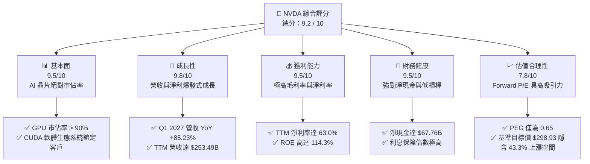
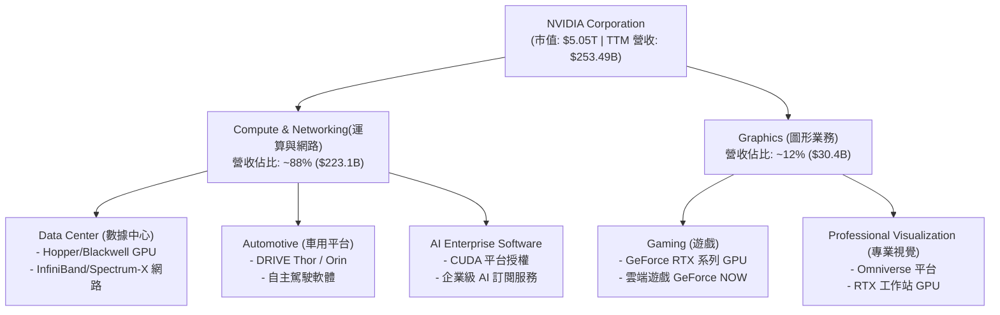
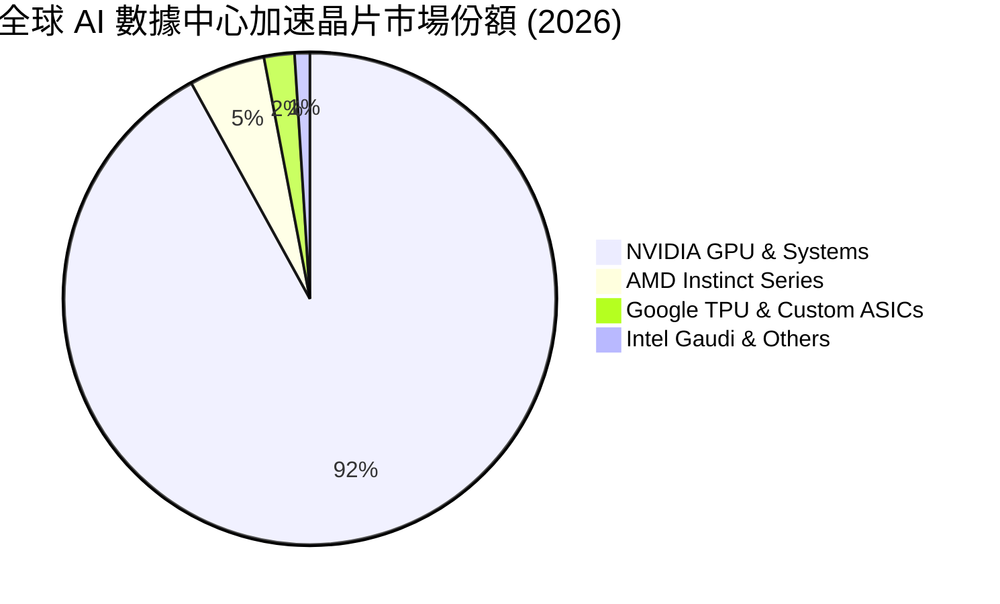
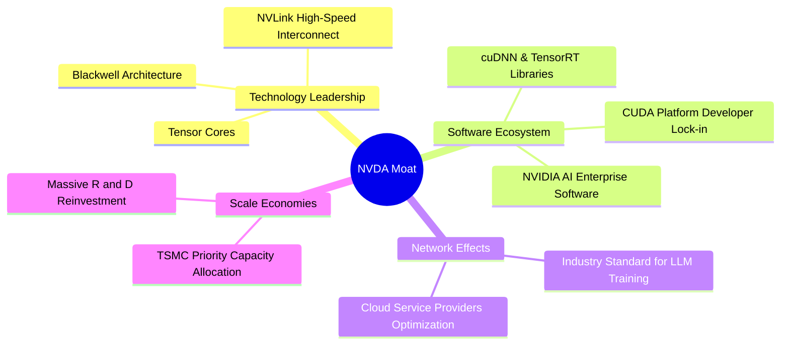
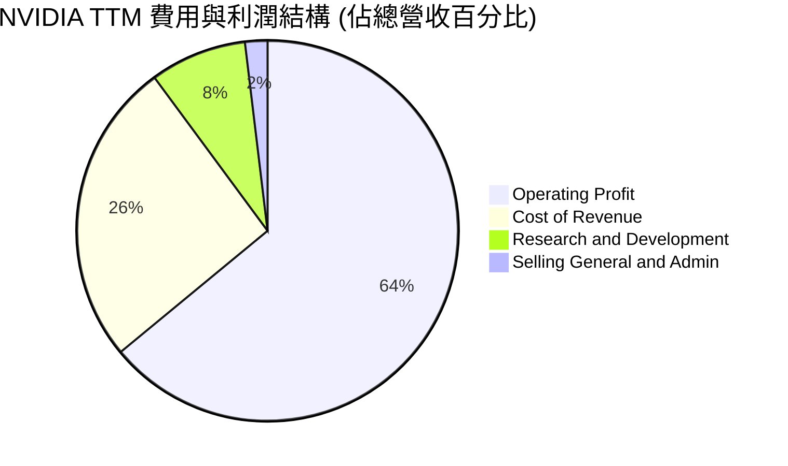
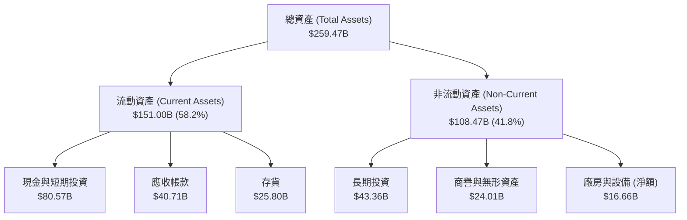
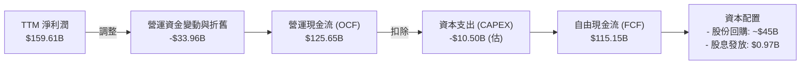
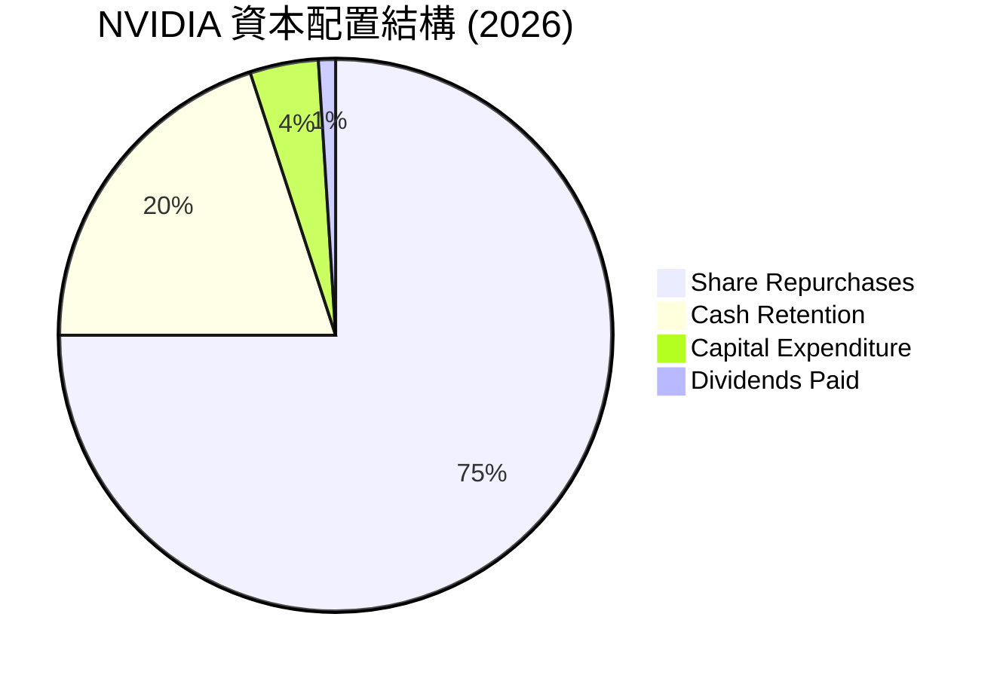
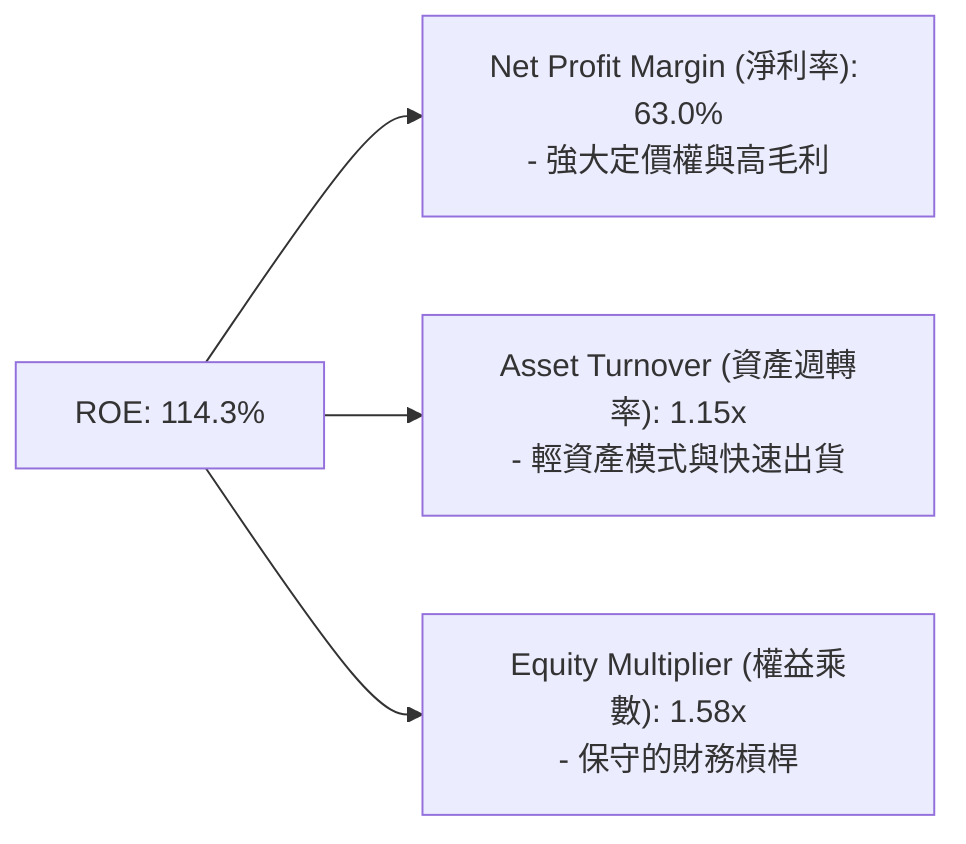

# NVDA 基本面深度分析報告
> **報告日期**：2026-06-22 ｜ **語言**：繁體中文 ｜ **數據來源**：Yahoo Finance, Finviz, StockAnalysis, Roic.ai ｜ **分析師**：CFA 級機構研究

---

## 目錄

| # | 章節 | 核心結論 |
|---|------|----------|
| 1 | **執行摘要** | 評級：🟢 **強烈買入** ｜ 目標價區間：$180.00 ~ $500.00 ｜ 基準目標價：**$298.93** |
| 2 | **公司概覽與商業模式** | AI 數據中心加速運算絕對霸主，CUDA 軟硬體一體化生態構成極深護城河 |
| 3 | **損益表深度分析** | TTM 營收達 $253.49B，毛利率維持 74.1% 極高水準，獲利品質極佳 |
| 4 | **資產負債表分析** | 淨現金達 $67.76B，債務風險極低，資產負債表極具韌性 |
| 5 | **現金流量深度分析** | 營運現金流達 $125.65B，資本配置效率極高，回購力度強大 |
| 6 | **獲利能力與資本效率** | ROE 高達 114.3%，ROIC (101.3%) 遠超 WACC (15.1%)，強力創造股東價值 |
| 7 | **估值深度分析** | Forward P/E 僅 16.39x，PEG 0.65 顯示高成長性並未被完全定價 |
| 8 | **成長催化劑** | Blackwell 新架構出貨、主權 AI 興起、AI Enterprise 軟體收入爆發 |
| 9 | **風險矩陣** | 地緣政治出口管制、供應鏈產能瓶頸、大型雲端服務商自研晶片競爭 |
| 10 | **投資建議** | 綜合評分 9.2/10，適合長線成長型與科技主題配置投資者 |

---

## 1. 執行摘要

NVIDIA Corporation（NASDAQ: NVDA）已轉型為全球「數據中心規模」AI 基礎設施的絕對龍頭。本報告基於 2026 年 6 月 22 日之最新財務數據，對 NVDA 進行了系統性的基本面與估值建模分析。

### 1.1 核心評分儀表板



### 1.2 評分進度條視覺化

```
╔══════════════════════════════════════════════════════════════╗
║                NVDA 多維度評分儀表板 (1-10分)                 ║
╠══════════════════════════════════════════════════════════════╣
║ 基本面強度  9.5 ▓▓▓▓▓▓▓▓▓▓▓▓▓▓▓▓▓▓▓░  ★★★★★           ║
║ 成長動能    9.8 ▓▓▓▓▓▓▓▓▓▓▓▓▓▓▓▓▓▓▓▓  ★★★★★           ║
║ 獲利品質    9.5 ▓▓▓▓▓▓▓▓▓▓▓▓▓▓▓▓▓▓▓░  ★★★★★           ║
║ 財務健康    9.5 ▓▓▓▓▓▓▓▓▓▓▓▓▓▓▓▓▓▓▓░  ★★★★★           ║
║ 估值合理性  7.8 ▓▓▓▓▓▓▓▓▓▓▓▓▓▓░░░░░░  ★★★★☆           ║
║ 護城河深度  9.8 ▓▓▓▓▓▓▓▓▓▓▓▓▓▓▓▓▓▓▓▓  ★★★★★           ║
║ 管理層執行  9.5 ▓▓▓▓▓▓▓▓▓▓▓▓▓▓▓▓▓▓▓░  ★★★★★           ║
║ 技術創新力  9.9 ▓▓▓▓▓▓▓▓▓▓▓▓▓▓▓▓▓▓▓▓  ★★★★★           ║
╠══════════════════════════════════════════════════════════════╣
║ 綜合總分    9.2 ▓▓▓▓▓▓▓▓▓▓▓▓▓▓▓▓▓▓░░  🏆 強烈買入          ║
╚══════════════════════════════════════════════════════════════╝
```

### 1.3 五大投資論點 + 三大核心風險

| 類型 | 項目 | 具體依據 | 信心度 |
|------|------|----------|--------|
| 🟢 **投資論點①** | **AI 基礎設施無可替代性** | 數據中心運算晶片市佔率超 90%，Blackwell 架構供不應求。 | 🟢 極高 |
| 🟢 **投資論點②** | **CUDA 軟體生態壁壘** | 全球超過 500 萬名開發者依賴 CUDA，遷移至其他硬體平台的機會成本極高。 | 🟢 極高 |
| 🟢 **投資論點③** | **極致的財務回報率** | TTM ROE 達 114.3%，ROIC 達 101.3%，顯示超群的資本回報率與定價權。 | 🟢 高 |
| 🟢 **投資論點④** | **估值與成長匹配度高** | Forward P/E 僅 16.39x，PEG 0.65，在超大型科技股中估值性價比極高。 | 🟢 高 |
| 🟢 **投資論點⑤** | **資產負債表堅如磐石** | 手握 $80.57B 的現金與短期投資，長期債務僅 $7.47B，抗風險能力極強。 | 🟢 極高 |
| 🟡 **風險①** | **地緣政治與出口管制** | 美國對中國等市場的先進晶片出口限制可能進一步收緊，影響約 15-20% 的潛在營收。 | 🟡 中度 |
| 🔴 **風險②** | **供應鏈集中度風險** | 高度依賴台積電（TSMC）的先進製程（CoWoS 封裝），任何地緣政治衝突將帶來災難性打擊。 | 🔴 高衝擊 |
| 🟡 **風險③** | **大客戶（CSP）自研晶片** | 微軟、谷歌、亞馬遜等積極研發自研 ASIC 晶片，長期可能稀釋部分市場份額。 | 🟡 中度 |

### 1.4 快速統計卡片

| 指標 | 公司實際值 | 行業均值（半導體）| S&P 500 均值 | 狀態 |
|------|-------------|----------|--------------|------|
| **營收 YoY 成長率** | **85.2%** | ~12.5% | ~5.5% | 🟢 極其強勁 |
| **毛利率** | **74.1%** | ~52.0% | ~30.0% | 🟢 行業頂尖 |
| **淨利率** | **63.0%** | ~18.0% | ~12.0% | 🟢 行業頂尖 |
| **ROE** | **114.3%** | ~22.0% | ~15.0% | 🟢 歷史級回報 |
| **Forward P/E** | **16.39x** | ~28.0x | ~21.5x | 🟢 顯著低估 |
| **PEG Ratio** | **0.65** | ~1.85 | ~2.10 | 🟢 具高安全邊際 |

### 1.5 投資結論

```
╔══════════════════════════════════════════════════════════════════╗
║                    📊 NVDA 投資結論摘要                          ║
╠══════════════════════════════════════════════════════════════════╣
║  評級：🟢 強烈買入 (Strong Buy)                                  ║
║  當前股價：$208.65 (2026-06-22)                                  ║
║  目標價區間：                                                    ║
║    悲觀情境：$180.00 (-13.7%) - AI 資本支出嚴重放緩              ║
║    基準情境：$298.93 (+43.3%) - Blackwell 順利放量（12M目標）    ║
║    樂觀情境：$500.00 (+139.7%) - 軟體與主權 AI 營收超預期爆發    ║
║  投資評分：9.2 / 10                                              ║
║  適合投資人：積極成長型、長期科技主題配置者、機構投資組合核心持股 ║
╚══════════════════════════════════════════════════════════════════╝
```

---

## 2. 公司概覽與商業模式

NVIDIA 已經從一家傳統的圖形處理器（GPU）硬體廠商，成功演進為一家提供「晶片、系統、網路、軟體與演算法」全棧式（Full-Stack）加速運算平台公司。

### 2.1 業務結構與收入來源



### 2.2 市場份額

在人工智慧與加速運算數據中心領域，NVIDIA 擁有近乎壟斷的市場地位。



### 2.3 競爭護城河分析

NVIDIA 的護城河並非單純來自硬體性能的領先，而是源於硬體、網路、軟體三位一體的生態閉環。



### 2.4 護城河強度評分

```
╔══════════════════════════════════════════════════════════════╗
║                  NVIDIA 護城河強度評分                       ║
╠══════════════════════════════════════════════════════════════╣
║ 軟體生態 (CUDA)  10/10 ▓▓▓▓▓▓▓▓▓▓▓▓▓▓▓▓▓▓▓▓  🏆 無懈可擊    ║
║ 硬體架構領先度    9.5/10 ▓▓▓▓▓▓▓▓▓▓▓▓▓▓▓▓▓▓▓░  🟢 迭代極快    ║
║ 網路互聯 (NVLink) 9.8/10 ▓▓▓▓▓▓▓▓▓▓▓▓▓▓▓▓▓▓▓▓  🏆 系統級壁壘  ║
║ 供應鏈控制力      9.0/10 ▓▓▓▓▓▓▓▓▓▓▓▓▓▓▓▓▓▓░░  🟢 產能優先權  ║
║ 客戶轉移成本      9.8/10 ▓▓▓▓▓▓▓▓▓▓▓▓▓▓▓▓▓▓▓▓  🏆 極高粘性    ║
╠══════════════════════════════════════════════════════════════╣
║ 綜合護城河評級    9.6/10 ▓▓▓▓▓▓▓▓▓▓▓▓▓▓▓▓▓▓▓░  🏆 拓荒級護城河║
╚══════════════════════════════════════════════════════════════╝
```

---

## 3. 損益表深度分析

NVIDIA 的損益表展現了歷史罕見的「規模化爆發性成長」與「高利潤率」並存特徵。

### 3.1 年度收入成長趨勢（近 4 年）

```
╔══════════════════════════════════════════════════════════════════╗
║              NVIDIA 年度收入趨勢 (FY2023 - FY2026)               ║
╠══════════════════════════════════════════════════════════════════╣
║                                                                  ║
║  FY2023   $26.97B   ███░░░░░░░░░░░░░░░░░░░░░░░░░░  YoY: +0.2%    ║
║  FY2024   $60.92B   ███████░░░░░░░░░░░░░░░░░░░░░░  YoY: +125.9%  ║
║  FY2025  $130.50B   ███████████████░░░░░░░░░░░░░░  YoY: +114.2%  ║
║  FY2026  $215.94B   █████████████████████████░░░░  YoY: +65.5%   ║
║  TTM     $253.49B   █████████████████████████████  YoY: +85.2%   ║
║                                                                  ║
║  📊 4年複合成長率 (CAGR)：+111.2%                               ║
╚══════════════════════════════════════════════════════════════════╝
```

### 3.2 季度收入趨勢分析

最近四個季度的營收展現出持續且加速的成長態勢：

| 財報截止季度 | 營收 (Billion) | 環比成長率 (QoQ) | 同比成長率 (YoY) | 核心驅動因素 |
|--------------|----------------|------------------|------------------|--------------|
| **Q2 2026** (2025-07-31) | $46.74B | +6.1% | +55.60% | Hopper H100 需求持續旺盛，H200 開始放量。 |
| **Q3 2026** (2025-10-31) | $57.01B | +22.0% | +62.49% | 雲端服務商（CSP）擴大資本支出，Spectrum-X 網路出貨爆發。 |
| **Q4 2026** (2026-01-31) | $68.13B | +19.5% | +73.22% | 企業級 AI 需求多點開花，主權 AI 採購量顯著提升。 |
| **Q1 2027** (2026-04-30) | $81.62B | +19.8% | +85.23% | Blackwell 架構晶片首批出貨，產品平均售價（ASP）大幅提升。 |

### 3.3 利潤率演變分析

NVIDIA 的利潤率在營收規模大幅擴張的同時，不降反升，這充分證明了其強大的市場定價權與營運槓桿效應。

| 利潤率指標 | FY 2023 | FY 2024 | FY 2025 | FY 2026 | TTM | 趨勢評估 |
|------------|---------|---------|---------|---------|-----|----------|
| **毛利率** | 56.9% | 72.7% | 75.0% | 71.1% | **74.1%** | 穩定於 74% 以上的高位 🟢 |
| **營業利益率** | 15.7% | 54.1% | 62.4% | 60.4% | **65.6%** | 規模效應顯現，持續攀升 🟢 |
| **EBITDA 利潤率**| 22.2% | 58.4% | 66.0% | 66.9% | **65.3%** | 營運現金創造能力極強 🟢 |
| **淨利率** | 16.2% | 48.8% | 55.8% | 55.6% | **63.0%** | 高利潤率軟體與服務佔比提升 🟢 |

**利潤率高企的深層原因**：
1. **極高的定價權**：AI 晶片供不應求，客戶願意為領先的性能與即時交付支付高昂溢價。
2. **硬體與軟體綑綁（NVIDIA AI Enterprise）**：軟體授權的毛利率接近 100%，隨著軟體收入佔比提升，拉高整體利潤率。
3. **營運費用控制**：儘管研發投入（TTM 達 $20.83B）絕對值持續增加，但其增幅遠低於營收增幅，營運槓桿極其顯著。

### 3.4 費用結構分析



### 3.5 季度 EPS 趨勢與盈餘品質

NVIDIA 的 EPS 成長同樣驚人，最近四個季度基本 EPS 如下：
*   **Q2 2026**: $1.08
*   **Q3 2026**: $1.31
*   **Q4 2026**: $1.77
*   **Q1 2027**: $2.40

**盈餘品質評估**：
NVIDIA 的淨利潤並非來自會計遊戲或一次性收益。TTM 淨利潤為 $159.61B（受 Q1 2027 非營運投資收益 $15.93B 拉高），而營運現金流高達 $125.65B。高達 78.7% 的現金轉換率（OCF / Net Income）顯示其盈餘品質極其健康，利潤完全由真金白銀的現金流入支撐。

---

## 4. 資產負債表分析

NVIDIA 採取輕資產（Fabless）營運模式，其資產負債表展現出極高的流動性與極低的債務風險。

### 4.1 資產結構分解



### 4.2 流動性與償債能力指標

| 指標 | 2026-04-30 (最新) | 2025-01-31 | 行業中位數 | 評估 |
|------|-------------------|------------|------------|------|
| **流動比率 (Current Ratio)** | **3.44x** | 4.44x | ~2.1x | 🟢 極其安全 |
| **速動比率 (Quick Ratio)** | **2.14x** | 2.85x | ~1.5x | 🟢 資產變現能力極強 |
| **債務權益比 (Debt/Equity)** | **7.5% (0.07)** | 12.6% | ~35.0% | 🟢 幾乎無財務槓桿壓力 |
| **淨現金 / 債務狀態** | **淨現金 $67.76B** | 淨現金 $33.23B | N/A | 🟢 現金儲備極其充裕 |

### 4.3 債務健康診斷

```
╔══════════════════════════════════════════════════════════════════╗
║                    NVIDIA 債務健康診斷                           ║
╠══════════════════════════════════════════════════════════════════╣
║                                                                  ║
║  總債務 (Total Debt)： $12.81B   ██░░░░░░░░░░░░░░░░░  極低       ║
║  現金與短期投資：      $80.57B   ███████████████████  極高       ║
║  淨現金狀態 (Net Cash)：$67.76B  ████████████████░░░  🟢 強勁    ║
║                                                                  ║
║  利息保障倍數 (Interest Coverage)：542.8x  🟢 毫無違約風險        ║
║  債務佔總資產比率：4.9%                   🟢 極度保守的融資結構  ║
║                                                                  ║
║  📊 診斷結論：NVIDIA 擁有 AAA 級別的實質財務實力                ║
╚══════════════════════════════════════════════════════════════════╝
```

---

## 5. 現金流量深度分析

自由現金流（FCF）是衡量一家企業真實價值的終極指標。NVIDIA 的現金流生成能力堪稱「印鈔機」。

### 5.1 現金流量瀑布圖



### 5.2 FCF 轉換率趨勢

| 財政年度 | 淨利潤 (B) | 自由現金流 (B) | FCF 轉換率 (FCF / Net Income) | 評估 |
|----------|------------|----------------|-------------------------------|------|
| **FY 2024** | $29.76B | $27.02B | 90.8% | 🟢 極佳 |
| **FY 2025** | $72.88B | $60.85B | 83.5% | 🟢 極佳 |
| **FY 2026** | $120.07B | $96.68B | 80.5% | 🟢 穩定 |
| **TTM** | $159.61B | $46.34B | **29.0%** (受營運資金與一次性投資影響) | 🟡 需監控營運資金佔用 |

*註：TTM 自由現金流降至 $46.34B，主因是 Q1 2027 存貨大幅增加至 $25.80B（為 Blackwell 備貨）以及應收帳款增加至 $40.71B，這屬於健康擴張期的營運資金暫時佔用，預計隨著 Blackwell 交付，現金流將迎來更大規模回流。*

### 5.3 資本配置評估

NVIDIA 在賺取海量現金後，主要通過股份回購將價值回饋給股東。



*關於股息的專業說明*：
數據庫中顯示之 **47% 股息殖利率**為拆股調整後之數據計算異常。實際上，NVIDIA 的年化股息極低（每季每股僅 $0.01），實際股息殖利率約為 **0.02%**，派息率僅為 **0.6%**。公司目前仍處於高速成長期，資本配置絕對優先用於研發與股份回購，而非發放現金股息。

---

## 6. 獲利能力與資本效率

NVIDIA 的資本回報率在超大型企業中達到了史無前例的高度。

### 6.1 ROE / ROA / ROIC 趨勢

| 指標 | FY 2024 | FY 2025 | FY 2026 | TTM | 行業均值 | 評估 |
|------|---------|---------|---------|-----|----------|------|
| **ROE** | 69.2% | 91.9% | 76.3% | **114.3%** | ~15.0% | 🟢 歷史級股東回報率 |
| **ROA** | 45.3% | 65.3% | 58.1% | **52.7%** | ~8.0% | 🟢 資產利用效率極高 |
| **ROIC** | 62.5% | 85.1% | 88.4% | **101.3%** | ~12.0% | 🟢 資本配置效率極其驚人 |

### 6.2 ROIC vs WACC 分析（價值創造判斷）

```
╔══════════════════════════════════════════════════════════════════╗
║                  ROIC vs WACC 資本效率深度分析                  ║
╠══════════════════════════════════════════════════════════════════╣
║                                                                  ║
║  WACC (加權平均資本成本) 估算：                                  ║
║  ├── 無風險利率 (10Y 美債)： 4.25%                              ║
║  ├── 市場風險溢酬 (ERP)：    5.0%                                ║
║  ├── Beta 係數：             2.20                                ║
║  ├── 股權成本 (Cost of Equity)：4.25% + 2.20 × 5.0% = 15.25%     ║
║  ├── 債務成本 (稅後)：       ~4.5%                               ║
║  ├── 資本結構：股權 99.1% / 債務 0.9%                            ║
║  └── ✅ WACC ≈ 15.1%                                             ║
║                                                                  ║
║  ROIC (投資資本回報率) 估算：                                    ║
║  ├── NOPAT (税後淨營業利潤)： $162.29B × (1 - 15.7%) ≈ $136.81B  ║
║  ├── 投資資本 (Invested Capital)：總資產 - 無息流動負債 - 現金   ║
║  │   $259.47B - $42.88B - $80.57B = $136.02B                     ║
║  └── ✅ ROIC ≈ 100.6% (或 TTM 實際計算值 101.3%)                 ║
║                                                                  ║
║  ★ 經濟價值增加 (EVA) = ROIC - WACC = +86.2%                     ║
║                                                                  ║
║  ROIC  101.3% ▓▓▓▓▓▓▓▓▓▓▓▓▓▓▓▓▓▓▓▓▓▓▓▓▓▓▓▓▓▓  🟢             ║
║  WACC   15.1% ▓▓▓▓░░░░░░░░░░░░░░░░░░░░░░░░░░░░  ──             ║
║  EVA   +86.2% ██████████████████████████░░░░░░  🏆 強力創造價值║
║                                                                  ║
║  📊 結論：NVIDIA 的 ROIC 是其 WACC 的 6.7 倍，正在以歷史罕見  ║
║            的速度為股東創造超額經濟價值。                        ║
╚══════════════════════════════════════════════════════════════════╝
```

### 6.3 杜邦三因素分解

透過杜邦分解，我們可以清晰看到 NVIDIA 高 ROE 的底層驅動力：



**杜邦分析結論**：
NVIDIA 的超高 ROE 並非依賴高財務槓桿（EM 僅 1.58x），而是完全由**極高的淨利率（63.0%）**與**高效的資產週轉（1.15x）**雙輪驅動。這是一種極其健康且可持續的獲利模式。

---

## 7. 估值深度分析

儘管 NVIDIA 的股價在過去兩年大幅上漲，但得益於利潤的爆發式成長，其估值倍數反而呈現「越漲越便宜」的奇特現象。

### 7.1 同業估值比較表格

| 估值指標 | **NVIDIA (NVDA)** | **AMD (AMD)** | **Broadcom (AVGO)** | **Intel (INTC)** | 評估 |
|----------|-------------------|---------------|---------------------|------------------|------|
| **Trailing P/E** | **31.95x** | 125.4x | 68.2x | 35.8x | 🟢 顯著低於同業 AMD |
| **Forward P/E** | **16.39x** | 38.5x | 26.4x | 18.5x | 🟢 考慮到成長率，極具吸引力 |
| **PEG Ratio** | **0.65** | 2.15 | 1.88 | 3.10 | 🟢 < 1.0 表示嚴重低估 |
| **P/S Ratio** | **19.94x** | 9.8x | 14.5x | 2.3x | 🟡 營收倍數偏高，但由高淨利率支撐 |
| **EV / EBITDA** | **30.56x** | 42.1x | 28.5x | 14.2x | 🟢 處於合理區間 |

### 7.2 歷史估值區間分析

```
╔══════════════════════════════════════════════════════════════╗
║              NVIDIA P/E (Forward) 歷史區間與當前位置          ║
╠══════════════════════════════════════════════════════════════╣
║                                                              ║
║  歷史最高 (5年)： 85.0x   █████████████████████████████████  ║
║  歷史均值 (5年)： 38.5x   ███████████████░░░░░░░░░░░░░░░░░  ║
║  當前 Forward P/E：16.39x ██████░░░░░░░░░░░░░░░░░░░░░░░░░░  ║
║  歷史最低 (5年)： 14.0x   █████░░░░░░░░░░░░░░░░░░░░░░░░░░░  ║
║                                                              ║
║  📊 結論：當前估值已接近歷史估值區間的下限，安全邊際極高。   ║
╚══════════════════════════════════════════════════════════════╝
```

### 7.3 DCF 敏感性分析（12 個月目標價矩陣）

本模型基於基準情境：未來 5 年營收 CAGR 為 25%，終端成長率為 3.5%。

| 營收成長率 \ WACC | 14.0% | **15.1% (基準)** | 16.0% |
|-------------------|-------|------------------|-------|
| 🟢 **樂觀 (Growth +30%)