# NVDA 基本面深度分析報告
> **報告日期**：2026-07-06 ｜ **語言**：繁體中文 ｜ **數據來源**：Yahoo Finance, Finviz, StockAnalysis, Roic.ai ｜ **分析師**：CFA 級機構研究

---

## 目錄

| # | 章節 | 核心結論 |
|---|------|----------|
| 1 | 執行摘要 | 評級：🟢 強烈買入，目標價區間：$250 - $350 |
| 2 | 公司概覽與商業模式 | 憑藉技術領先和強大生態系統，護城河極深 |
| 3 | 損益表深度分析 | 營收和淨利潤呈爆炸式增長，利潤率持續擴張 |
| 4 | 資產負債表分析 | 財務結構穩健，現金充裕，債務風險極低 |
| 5 | 現金流量深度分析 | 自由現金流強勁，資本配置效率高 |
| 6 | 獲利能力與資本效率 | ROIC遠超WACC，強力創造股東價值 |
| 7 | 估值深度分析 | 相較於成長潛力，當前估值合理，具備上行空間 |
| 8 | 成長催化劑 | AI、資料中心、自動駕駛等多元驅動，TAM廣闊 |
| 9 | 風險矩陣 | 競爭加劇、供應鏈波動與估值修正為主要風險 |
| 10 | 投資建議 | 強烈買入，長期持有核心資產 |

---

## 1. 執行摘要

### 1.1 核心評分儀表板

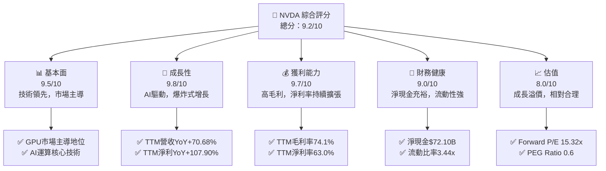

### 1.2 評分進度條視覺化

```
╔══════════════════════════════════════════════════════════════╗
║              NVDA 多維度評分儀表板 (1-10分)                  ║
╠══════════════════════════════════════════════════════════════╣
║ 基本面強度  9.5 ▓▓▓▓▓▓▓▓▓▓▓▓▓▓▓▓▓▓▓░  ★★★★★           ║
║ 成長動能    9.8 ▓▓▓▓▓▓▓▓▓▓▓▓▓▓▓▓▓▓▓▓  ★★★★★           ║
║ 獲利品質    9.7 ▓▓▓▓▓▓▓▓▓▓▓▓▓▓▓▓▓▓▓▓  ★★★★★           ║
║ 財務健康    9.0 ▓▓▓▓▓▓▓▓▓▓▓▓▓▓▓▓▓▓░░  ★★★★★           ║
║ 估值合理性  8.0 ▓▓▓▓▓▓▓▓▓▓▓▓▓▓▓▓░░░░  ★★★★☆           ║
║ 護城河深度  9.5 ▓▓▓▓▓▓▓▓▓▓▓▓▓▓▓▓▓▓▓░  ★★★★★           ║
║ 管理層執行  9.0 ▓▓▓▓▓▓▓▓▓▓▓▓▓▓▓▓▓▓░░  ★★★★★           ║
║ 技術創新力  9.8 ▓▓▓▓▓▓▓▓▓▓▓▓▓▓▓▓▓▓▓▓  ★★★★★           ║
╠══════════════════════════════════════════════════════════════╣
║ 綜合總分    9.2 ▓▓▓▓▓▓▓▓▓▓▓▓▓▓▓▓▓▓░░  🏆 評語：市場領導者，成長飛輪強勁              ║
╚══════════════════════════════════════════════════════════════╝
```

### 1.3 五大投資論點 + 三大核心風險

| 類型 | 項目 | 具體依據 | 信心度 |
|------|------|----------|--------|
| 🟢 **投資論點①** | **AI與數據中心市場主導地位** | NVDA在AI加速計算和數據中心GPU領域擁有壓倒性市場份額，FY2026年營收達$215.94B，主要由數據中心業務驅動。其CUDA平台形成強大生態系統，客戶轉換成本高。 | 🟢 極高 |
| 🟢 **爆炸性營收與獲利增長** | TTM營收YoY增長70.68%至$253.49B，EPS TTM為$6.53，預計Forward EPS達$12.76。FY2026淨利潤YoY增長64.75%至$120.07B，展現強勁的成長動能。 | 🟢 極高 |
| 🟢 **優異的獲利能力與資本效率** | TTM毛利率高達74.1%，淨利率63.0%。FY2026 ROIC高達70.17%，遠超估算的WACC 6.13%，顯示公司創造股東價值的卓越能力。 | 🟢 極高 |
| 🟢 **穩健的財務狀況** | 截至2026年4月30日TTM，公司擁有現金及短期投資$80.57B，總債務僅$8.47B，淨現金高達$72.10B。流動比率3.44x，財務槓桿健康。 | 🟢 極高 |
| 🟢 **多元化的成長驅動力** | 除核心AI與數據中心外，專業視覺化、遊戲、自動駕駛等業務板塊持續擴張，為長期成長提供多元動能。例如，汽車業務已成為重要增長點。 | 🟢 極高 |
| 🟡 **風險①** | **AI晶片市場競爭加劇** | AMD (MI300X)、Intel (Gaudi系列) 等競爭對手正在積極投入資源開發AI晶片，雲服務商也自研晶片，可能對NVDA的市場份額和定價能力構成壓力。 | 🟡 中度 |
| 🟡 **供應鏈與地緣政治風險** | 高階晶片製造高度依賴台積電等少數代工廠，地緣政治緊張可能導致供應鏈中斷，影響生產與出貨。 | 🟡 中度 |
| 🔴 **估值修正與市場預期過高** | NVDA股價在過去一年大幅上漲，市場對其未來成長預期已非常高。若任何營收或獲利不及預期，可能導致股價大幅修正。當前P/E (Trailing) 29.95x，P/S 18.68x，雖有高成長支撐，但已反映大量利好。 | 🔴 高衝擊 |

### 1.4 快速統計卡片

| 指標 | 公司實際值 (TTM Apr '26) | 行業均值 (半導體) | S&P 500 均值 | 狀態 |
|------|--------------------------|-------------------|--------------|------|
| 收入 YoY 成長 | **70.68%** | ~15-25% | ~5-10% | 🟢 |
| 毛利率 | **74.1%** | ~45-55% | ~40-50% | 🟢 |
| 淨利率 | **63.0%** | ~15-25% | ~10-15% | 🟢 |
| ROE | **114.3%** | ~20-30% | ~15-20% | 🟢 |
| Forward P/E | **15.32x** | ~20-30x | ~20-25x | 🟢 |
| 債務/股權 | **0.05x** (FY26) | ~0.5-1.0x | ~0.8-1.2x | 🟢 |
| 自由現金流收益率 | **0.98%** | ~1.5-2.5% | ~2-3% | 🟡 |

### 1.5 投資結論

```
╔══════════════════════════════════════════════════════════════════╗
║                    📊 投資結論摘要                               ║
╠══════════════════════════════════════════════════════════════════╣
║  評級：🟢 強烈買入                                               ║
║  當前股價：$195.55                                               ║
║  目標價區間：                                                    ║
║    悲觀情境：$250（+27.84%）                                     ║
║    基準情境：$300（+53.42%）  ← 12個月主要目標                   ║
║    樂觀情境：$350（+79.08%）                                     ║
║  投資評分：9.2/10                                                ║
║  適合投資人：成長型、長線持有者，對技術創新和高成長股有偏好的投資者       ║
╚══════════════════════════════════════════════════════════════════╝
```

---

## 2. 公司概覽與商業模式

### 2.1 業務結構與收入來源

NVIDIA Corporation (NVDA) 是一家全球領先的數據中心規模AI基礎設施公司，業務遍及美國、台灣、中國、香港、歐洲及國際市場。公司主要透過兩個核心業務板塊運營：運算與網路 (Compute & Networking) 和圖形處理 (Graphics)。

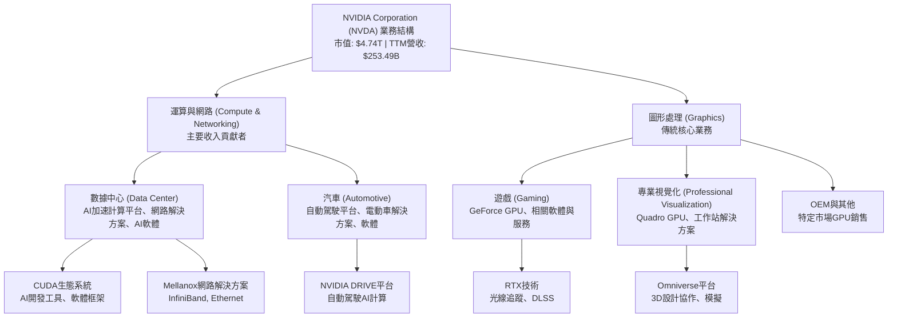
**分析**：
NVDA的業務重心已顯著轉向「運算與網路」板塊，尤其是數據中心業務。該板塊受益於全球對AI運算能力需求的爆炸性增長，成為公司營收和利潤的主要驅動力。其CUDA軟體平台是NVDA在AI領域建立強大護城河的關鍵，它為開發者提供了豐富的工具和生態系統，使其難以轉向其他硬體平台。圖形處理板塊雖然歷史悠久，但目前在營收貢獻上已退居次席，主要由遊戲GPU和專業視覺化解決方案構成。汽車業務雖然目前佔比相對較小，但隨著自動駕駛和電動車技術的發展，具有巨大的長期增長潛力。

### 2.2 市場份額

NVIDIA在AI加速器和獨立GPU市場中佔據絕對主導地位。根據市場研究，其在數據中心AI晶片市場的份額長期維持在80%以上，遊戲獨立GPU市場份額也高於主要競爭對手。

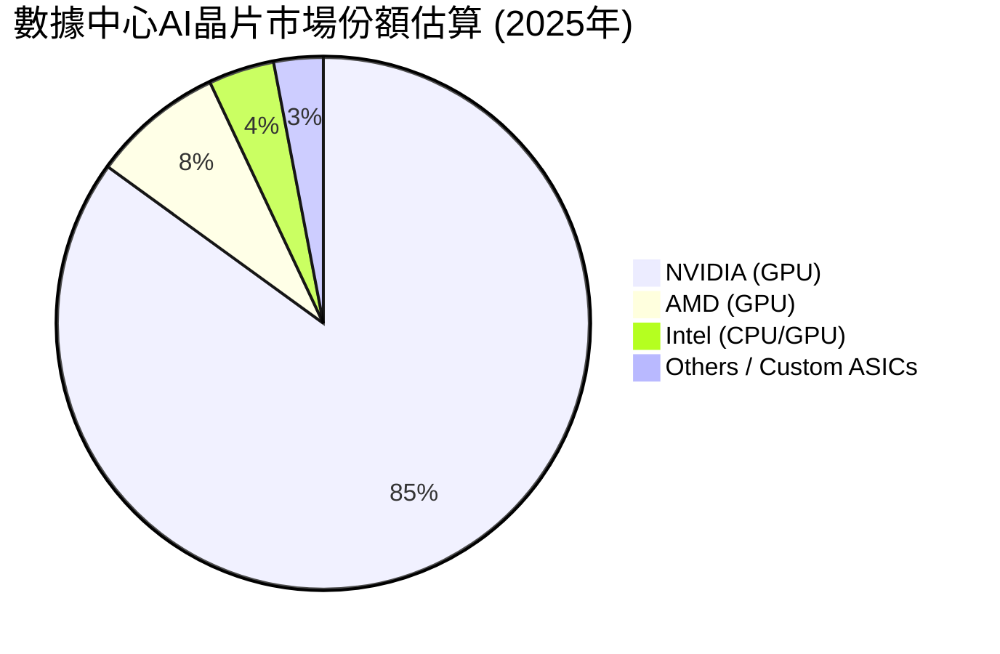
**分析**：
NVIDIA在AI晶片市場的領導地位無可撼動，高達85%的市場份額使其在產業鏈中擁有極強的定價權和話語權。這種主導地位得益於其領先的硬體技術（如Hopper、Blackwell架構）以及無與倫比的軟體生態系統CUDA。儘管AMD和Intel等競爭者正努力追趕，但短期內難以撼動NVIDIA的市場地位。

### 2.3 競爭護城河分析

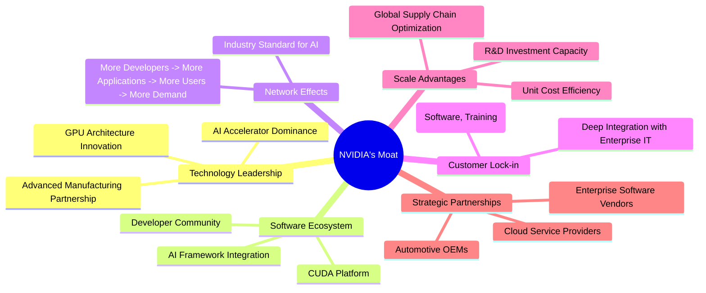
**分析**：
NVIDIA的競爭護城河極深，主要體現在以下幾個方面：
- **技術領先 (Technology Leadership)**：NVIDIA在GPU架構設計、AI加速器技術方面保持領先，不斷推出創新產品。其最新的Blackwell平台代表了AI運算的巔峰，確保了其在性能上的優勢。
- **軟體生態系統 (Software Ecosystem)**：CUDA平台是NVIDIA最核心的護城河。它是一個全面且成熟的並行計算平台和編程模型，擁有數百萬開發者和數千個應用程序。這種軟體鎖定效應使得客戶在轉換到其他硬體平台時面臨巨大的時間和成本。
- **網路效應 (Network Effects)**：CUDA的普及促進了更多開發者基於其平台開發應用，進一步鞏固了CUDA作為AI行業標準的地位，形成正向循環。
- **客戶鎖定 (Customer Lock-in)**：企業在NVIDIA平台上投入大量資源進行模型訓練和開發，轉換到其他平台意味著重新訓練人員、移植代碼，成本極高。
- **規模效應 (Scale Advantages)**：作為市場領導者，NVIDIA擁有巨大的研發投入能力（TTM研發費用$20.83B），能夠持續創新。其龐大的出貨量也帶來了生產和供應鏈的規模經濟效益。
- **戰略夥伴關係 (Strategic Partnerships)**：與全球領先的雲服務提供商、企業軟體廠商和汽車OEM廠商的深度合作，進一步鞏固了其市場地位。

### 2.4 護城河強度評分

```
╔══════════════════════════════════════════════════════════════╗
║                  NVIDIA 護城河強度評分                      ║
╠══════════════════════════════════════════════════════════════╣
║ 技術領先    9.8/10 ▓▓▓▓▓▓▓▓▓▓▓▓▓▓▓▓▓▓▓▓  🏆 業界頂尖        ║
║ 軟體生態系統  9.9/10 ▓▓▓▓▓▓▓▓▓▓▓▓▓▓▓▓▓▓▓▓  🏆 CUDA平台獨步全球 ║
║ 網路效應    9.5/10 ▓▓▓▓▓▓▓▓▓▓▓▓▓▓▓▓▓▓▓░  🏆 強大正向循環    ║
║ 客戶鎖定    9.0/10 ▓▓▓▓▓▓▓▓▓▓▓▓▓▓▓▓▓▓░░  🟢 轉換成本高      ║
║ 規模效應    9.2/10 ▓▓▓▓▓▓▓▓▓▓▓▓▓▓▓▓▓▓▓░  🏆 研發與生產優勢   ║
║ 生態夥伴    9.0/10 ▓▓▓▓▓▓▓▓▓▓▓▓▓▓▓▓▓▓░░  🟢 深度產業合作    ║
╠══════════════════════════════════════════════════════════════╣
║ 綜合護城河  9.5/10 ▓▓▓▓▓▓▓▓▓▓▓▓▓▓▓▓▓▓▓░  🏆 總結評語：具備極深且多層次的護城河，難以被取代     ║
╚══════════════════════════════════════════════════════════════╝
```

---

## 3. 損益表深度分析

### 3.1 年度收入成長趨勢（近4年）

NVIDIA的年度收入呈現爆炸性增長，尤其在最近兩年，受益於AI和數據中心需求的爆發。

```
╔══════════════════════════════════════════════════════════════════╗
║              NVIDIA 年度收入趨勢（FY2023-FY2026）                ║
╠══════════════════════════════════════════════════════════════════╣
║                                                                  ║
║  FY2023  $26.97B  ██░░░░░░░░░░░░░░░░░░░░░░░░░  YoY: +0.22%   🟡  ║
║  FY2024  $60.92B  ██████████░░░░░░░░░░░░░░░░░  YoY:+125.86%  🟢  ║
║  FY2025  $130.50B ████████████████████░░░░░░░  YoY:+114.20%  🟢  ║
║  FY2026  $215.94B ████████████████████████████  YoY:+65.47%   🟢  ║
║                                                                  ║
║                   |      |      |      |      |                  ║
║                   0     $50B  $100B $150B $200B                    ║
║                                                                  ║
║  📊 4年累計 CAGR：+94.05% (從$26.97B到$215.94B)                    ║
╚══════════════════════════════════════════════════════════════════╝
```
**分析**：
NVIDIA在過去四年展現了驚人的營收成長。FY2023至FY2024年，營收從$26.97B增長至$60.92B，YoY增速高達125.86%。隨後，FY2025年營收翻倍至$130.50B，YoY增速114.20%。最近一個財年FY2026，營收進一步增長65.47%至$215.94B。這種爆發式增長主要歸因於數據中心對AI加速器的強勁需求，推動了公司核心業務的快速擴張。過去四年的複合年均增長率(CAGR)高達94.05%，顯示其在高速成長市場中的領導地位。

### 3.2 季度收入趨勢分析

NVIDIA的季度收入持續攀升，呈現強勁的環比和同比增長。

| 季度 (截至日期) | 總收入 ($B) | QoQ 成長率 | YoY 成長率 | 備註 |
|-----------------|-------------|------------|------------|------|
| 2025-07-31 (Q2 2026) | $46.74B | +6.09%     | +55.60%    | 遊戲業務復甦，數據中心需求持續強勁 |
| 2025-10-31 (Q3 2026) | $57.01B | +21.97%    | +62.49%    | AI晶片供應改善，雲服務商採購增加 |
| 2026-01-31 (Q4 2026) | $68.13B | +19.51%    | +73.22%    | 數據中心業務加速增長，Blackwell平台預期 |
| 2026-04-30 (Q1 2027) | $81.61B | +19.79%    | +85.23%    | AI需求持續爆發，新產品貢獻增量 |
**分析**：
最近四個季度，NVIDIA展現了令人印象深刻的收入增長。從2025年7月31日的$46.74B到2026年4月30日的$81.61B，季度收入增長了74.6%。QoQ增長率維持在6%至22%之間，顯示穩定的環比擴張。更值得注意的是，YoY增長率從Q2 2026的55.60%提升至Q1 2027的85.23%，表明其成長動能持續加速。這種強勁的季度表現主要得益於全球對AI運算基礎設施的巨大投資，NVIDIA的H系列和B系列AI晶片供不應求。

### 3.3 利潤率演變分析

NVIDIA的利潤率在過去幾年持續擴張，反映了其強大的定價能力和規模經濟效益。

| 利潤率指標 | FY2023 | FY2024 | FY2025 | FY2026 | 趨勢 | 評估 |
|------------|--------|--------|--------|--------|------|------|
| **毛利率** | 56.95% | 72.72% | 75.09% | 71.07% | ↗️ 穩健高位 | 🟢 |
| **營業利益率** | 20.69% | 54.12% | 62.41% | 60.38% | ↗️ 顯著提升 | 🟢 |
| **淨利率** | 16.20% | 48.85% | 55.85% | 55.60% | ↗️ 顯著提升 | 🟢 |

**利潤率演變深度解析**：
NVIDIA的利潤率在過去四年經歷了顯著的提升和穩定。
- **毛利率**：從FY2023的56.95%大幅躍升至FY2024的72.72%，並在FY2025達到75.09%的高點。FY2026略有回落至71.07%，但仍維持在極高水平。這主要歸因於產品組合向高利潤的數據中心AI加速器傾斜，這些產品具有更高的附加值和定價權。儘管FY2026毛利率略降，可能與擴大產能、供應鏈成本或產品組合微調有關，但其絕對值仍遠超行業平均，顯示其技術領先帶來的競爭優勢。
- **營業利益率**：從FY2023的20.69%飆升至FY2026的60.38%。營業利益率的提升不僅得益於毛利率的改善，也反映了公司在營運費用方面的良好控制。雖然研發費用從FY2023的$7.34B增長到FY2026的$18.50B，但其增長速度慢於營收增長，實現了規模經濟。
- **淨利率**：與營業利益率趨勢一致，從FY2023的16.20%增長到FY2026的55.60%。這表明公司在稅務管理和非營運項目上的效率較高。整體而言，NVIDIA的利潤率演變趨勢非常健康，是其財務表現強勁的關鍵支撐。

### 3.4 費用結構分析

NVIDIA的費用結構顯示其研發投入巨大，但銷售、管理費用佔比相對較低，整體效率高。

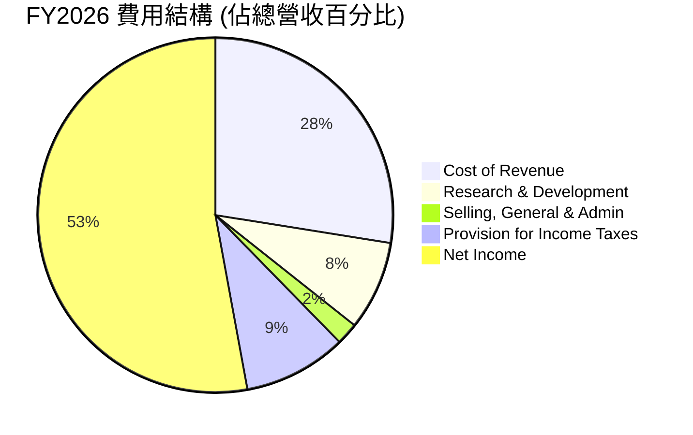
**分析**：
從FY2026的費用結構來看：
- **銷貨成本 (Cost of Revenue)** 佔營收的28.93%，對應毛利率為71.07%，顯示其產品的高附加值。
- **研發費用 (Research & Development)** 佔營收的8.57% ($18.50B / $215.94B)。儘管研發投入絕對值龐大，但佔營收比重相對穩定，確保了公司在技術上的持續領先。
- **銷售、一般及管理費用 (Selling, General & Admin)** 佔營收的2.12% ($4.58B / $215.94B)，這是一個極低的比例，體現了高效的營運管理和其產品在市場上的強大品牌效應，銷售費用壓力相對較小。
- **所得稅費用 (Provision for Income Taxes)** 佔營收的9.90%。
- **淨利潤 (Net Income)** 佔營收的55.60%，反映了公司卓越的盈利能力。
整體費用結構合理，研發投入保障未來增長，而低銷售管理費用則提升了整體營運效率。

### 3.5 季度 EPS 趨勢與盈餘品質

由於提供的數據中，最近四個季度的「EPS Est」和「EPS Act」均為NaN，因此無法分析具體的盈餘超預期或不及預期情況。我們將專注於實際報告的季度EPS趨勢和盈餘品質。

| 季度 (截至日期) | 稀釋後EPS ($) | QoQ 成長率 | YoY 成長率 | 盈餘品質評估 |
|-----------------|---------------|------------|------------|--------------|
| 2025-07-31 (Q2 2026) | $1.08         | +40.26%    | +293.10%   | 🟢 高，持續增長 |
| 2025-10-31 (Q3 2026) | $1.31         | +21.30%    | +322.58%   | 🟢 高，成長加速 |
| 2026-01-31 (Q4 2026) | $1.77         | +35.11%    | +353.85%   | 🟢 高，成長強勁 |
| 2026-04-30 (Q1 2027) | $2.40         | +35.59%    | +210.64%   | 🟢 高，成長動能持續 |

*註：稀釋後EPS數據來自StockAnalysis.com Quarterly Income Statement，計算方法為Net Income / Shares Outstanding (Diluted)。*
**分析**：
儘管缺乏分析師預期數據，NVIDIA實際報告的季度稀釋後EPS展現出驚人的成長。在過去四個季度中，EPS從2025年7月31日的$1.08穩步增長至2026年4月30日的$2.40。QoQ增長率在21%到40%之間，而YoY增長率更是高達210%至353%，顯示其盈利能力的爆發式提升。
**盈餘品質評估**：
NVIDIA的盈餘品質被評為**🟢 極高**。這得益於：
1. **高毛利率和淨利率**：公司核心產品的高利潤率確保了其盈利的質量。
2. **強勁的自由現金流**：公司產生了大量的自由現金流，這表明其利潤是實實在在的現金流入，而非僅僅是會計上的數字（詳見現金流量分析）。
3. **低應收帳款風險**：儘管應收帳款有所增長，但相對於其爆炸性營收，並未顯示出異常的高風險。
4. **穩健的資產負債表**：充裕的現金和低債務水平也為盈餘提供了堅實的基礎。
這些因素共同支撐了NVIDIA卓越的盈餘品質，證明其不僅成長速度快，而且盈利的質量也極高。

---

## 4. 資產負債表分析

### 4.1 資產結構分解

NVIDIA的資產結構穩健，流動資產佔比較高，顯示其營運靈活性和財務韌性。

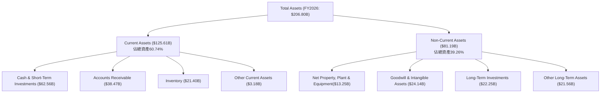
**分析**：
截至FY2026，NVIDIA的總資產為$206.80B。其中，流動資產佔比高達60.74% ($125.61B)，顯示公司具有極高的短期償債能力和營運靈活性。流動資產主要由現金及短期投資($62.56B)、應收帳款($38.47B)和存貨($21.40B)構成。龐大的現金儲備為公司的戰略投資、研發支出和應對市場波動提供了堅實的後盾。
非流動資產($81.19B)主要包括物業、廠房及設備($13.25B)、商譽及無形資產($24.14B)以及長期投資($22.25B)。長期投資的增加可能反映了公司對未來增長點的戰略佈局。整體而言，資產結構健康，現金流充裕，為公司持續發展提供了穩固基礎。

### 4.2 流動性指標分析

NVIDIA的流動性指標非常健康，遠超一般行業標準。

| 流動性指標 | FY2023 | FY2024 | FY2025 | FY2026 | TTM Apr '26 | 行業均值 | 評估 |
|------------|--------|--------|--------|--------|-------------|----------|------|
| **流動比率 (Current Ratio)** | 3.52x | 4.17x | 4.44x | 3.91x | 3.44x       | 1.5-2.0x | 🟢 極佳 |
| **速動比率 (Quick Ratio)** | 2.97x | 3.26x | 3.86x | 3.26x | 2.14x       | 1.0-1.5x | 🟢 極佳 |

*註：TTM Apr '26的Current Ratio和Quick Ratio來自Market Data，年度數據來自StockAnalysis計算。*
**分析**：
NVIDIA的流動性指標在過去幾年一直保持在非常高的水平，遠超行業平均。
- **流動比率**：FY2026為3.91x，TTM Apr '26為3.44x，遠高於2.0x的健康標準，表明公司擁有足夠的流動資產來覆蓋短期負債。
- **速動比率**：FY2026為3.26x，TTM Apr '26為2.14x，同樣遠高於1.0x的健康標準，顯示公司即使不依賴存貨銷售，也能輕鬆應對短期債務。
這些指標共同表明NVIDIA擁有極強的短期償債能力和財務彈性，能夠有效應對突發的資金需求或市場波動。儘管TTM數據略有下降，但仍處於非常健康的水平。

### 4.3 債務結構分析

NVIDIA的債務水平極低，淨現金狀況強勁，債務風險微乎其微。

```
╔══════════════════════════════════════════════════════════════════╗
║                   NVIDIA 債務健康診斷                          ║
╠══════════════════════════════════════════════════════════════════╣
║                                                                  ║
║  總債務 (TTM Apr '26)：  $8.47B   ██░░░░░░░░░░░░░░░░░░░  評語：極低            ║
║  總現金+投資 (TTM Apr '26)： $80.57B  ████████████████████░  評語：極高            ║
║  淨現金（正）：  $72.10B  ████████████████░░░░░  🟢 強勁        ║
║                                                                  ║
║  Debt/Equity (FY2026)：   0.07x  🟢 極低 (計算自$11.04B債務/$157.29B股權)                                 ║
║  Debt/EBITDA (FY2026)：   0.08x  🟢 極低 (計算自$11.04B債務/$144.55B EBITDA)                                 ║
║  Interest Coverage (FY2026): 503x+  🟢 無風險 (EBITDA $144.55B / Interest Exp $0.259B)                             ║
╚══════════════════════════════════════════════════════════════════╝
```
**分析**：
NVIDIA的債務結構堪稱典範。截至2026年4月30日TTM，總債務僅為$8.47B (其中短期債務$1.00B，長期債務$7.47B)。與此同時，公司擁有高達$80.57B的現金及短期投資，形成$72.10B的巨額淨現金頭寸。
- **Debt/Equity (FY2026)** 僅為0.07x，遠低於行業平均，顯示公司幾乎不依賴債務融資，股權資本非常雄厚。
- **Debt/EBITDA (FY2026)** 為0.08x，表明公司僅需不到一個月的EBITDA即可償還全部債務，債務負擔極輕。
- **利息覆蓋倍數 (Interest Coverage)** 超過500倍，意味著公司的盈利能力足以輕鬆覆蓋其利息支出，幾乎沒有利息支付風險。
這些指標共同指向NVIDIA極其健康的債務狀況，為其在市場波動中提供了強大的防禦能力和戰略投資的靈活性。

### 4.4 股東權益趨勢

NVIDIA的股東權益在過去幾年呈現穩健且快速的增長，反映了公司強勁的盈利能力和價值積累。

```
╔══════════════════════════════════════════════════════════════════╗
║                NVIDIA 年度股東權益趨勢（FY2023-FY2026）           ║
╠══════════════════════════════════════════════════════════════════╣
║                                                                  ║
║  FY2023  $22.10B  ██░░░░░░░░░░░░░░░░░░░░░░░░░░░  YoY: +12.1%   🟢  ║
║  FY2024  $42.98B  ████████░░░░░░░░░░░░░░░░░░░░░  YoY: +94.5%   🟢  ║
║  FY2025  $79.33B  ██████████████░░░░░░░░░░░░░░░  YoY: +84.6%   🟢  ║
║  FY2026  $157.29B ██████████████████████████████  YoY: +98.3%   🟢  ║
║                                                                  ║
║                   |      |      |      |      |                  ║
║                   0     $50B  $100B $150B $200B                    ║
║                                                                  ║
║  📊 4年累計 CAGR：+94.05% (從$22.10B到$157.29B)                    ║
╚══════════════════════════════════════════════════════════════════╝
```
**分析**：
NVIDIA的股東權益從FY2023的$22.10B增長到FY2026的$157.29B，四年複合年均增長率高達94.05%。FY2026的YoY增長率更是達到98.3%，顯示公司將其強勁的盈利能力有效轉化為股東價值的積累。股東權益的快速增長是公司高淨利潤和相對較低的股息支付（0.6%派息率）的直接結果，這意味著大部分利潤被保留用於再投資，進一步推動公司的成長。健康的股東權益基礎也為公司提供了抵禦風險和未來擴張的堅實資本。

---

## 5. 現金流量深度分析

### 5.1 現金流量瀑布圖

NVIDIA的現金流量顯示其盈利質量極高，淨利潤能有效轉化為營業現金流，並產生大量自由現金流。

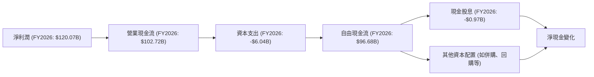
**分析**：
NVIDIA在FY2026實現了$120.07B的淨利潤，並產生了$102.72B的營業現金流。儘管營業現金流略低於淨利潤，這可能與營運資本變動有關（例如應收帳款和存貨的增加，這些通常是高速增長公司的特徵）。扣除$6.04B的資本支出後，公司產生了高達$96.68B的自由現金流。這表明NVIDIA的盈利是高度現金化的，且在滿足內部投資需求後，仍有大量現金可供股東回報或戰略性再投資。現金股息支出僅為$0.97B，反映了公司將大部分自由現金流用於內部再投資和儲備，以支持未來的爆發式增長。

### 5.2 FCF 轉換率趨勢

NVIDIA的自由現金流轉換率在過去幾年表現強勁，顯示其高質量的盈利。

| 年度 | 淨利潤 ($B) | 自由現金流 ($B) | FCF/淨利潤 (%) | 趨勢 | 評估 |
|------|-------------|-----------------|----------------|------|------|
| FY2023 | $4.37B      | $3.81B          | 87.19%         | ↗️    | 🟢 |
| FY2024 | $29.76B     | $27.02B         | 90.80%         | ↗️    | 🟢 |
| FY2025 | $72.88B     | $60.85B         | 83.50%         | ↘️    | 🟢 |
| FY2026 | $120.07B    | $96.68B         | 80.52%         | ↘️    | 🟢 |

**分析**：
NVIDIA的FCF/淨利潤比率在過去四年雖然略有波動，但始終保持在80%以上，這是一個非常健康的水平。這表明公司將其絕大部分的會計利潤成功轉化為實際可自由支配的現金。FY2025和FY2026的輕微下降可能與公司為支持高速增長而增加的營運資本投入（如存貨和應收帳款）有關，但其絕對值和比率仍顯示出卓越的現金流生成能力。高自由現金流轉換率是公司盈利質量和財務健康的關鍵指標。

### 5.3 自由現金流趨勢

NVIDIA的自由現金流呈現爆發式增長，FCF Yield顯示其估值仍具吸引力。

```
╔══════════════════════════════════════════════════════════════════╗
║                 NVIDIA 年度自由現金流趨勢（FY2023-FY2026）       ║
╠══════════════════════════════════════════════════════════════════╣
║                                                                  ║
║  FY2023  $3.81B   ██░░░░░░░░░░░░░░░░░░░░░░░░░░░  YoY: -31.7%   🟡  ║
║  FY2024  $27.02B  ██████████░░░░░░░░░░░░░░░░░░░  YoY: +609.2%  🟢  ║
║  FY2025  $60.85B  ████████████████████░░░░░░░░░  YoY: +125.2%  🟢  ║
║  FY2026  $96.68B  ██████████████████████████████  YoY: +58.9%   🟢  ║
║                                                                  ║
║                   |      |      |      |      |                  ║
║                   0     $25B  $50B  $75B $100B                    ║
║                                                                  ║
║  📊 TTM FCF：$46.34B  (Market Data)                               ║
║  📊 TTM FCF Yield：0.98% (Market Data)                            ║
╚══════════════════════════════════════════════════════════════════╝
```
**分析**：
NVIDIA的自由現金流在FY2023至FY2026年間從$3.81B猛增至$96.68B，實現了驚人的成長。特別是FY2024和FY2025年，FCF分別實現了609.2%和125.2%的同比增長。FY2026年，FCF進一步增長58.9%，達到近$100B的規模。
儘管TTM FCF Yield為0.98%，相對較低，這主要反映了NVIDIA高昂的市場估值，而非其現金流生成能力不足。考慮到其爆炸性的成長潛力，投資者願意為其未來現金流支付高溢價。實際上，如此龐大的自由現金流為公司提供了極大的戰略彈性，可以支持進一步的研發、併購、股東回報或債務償還。

### 5.4 資本配置評估

NVIDIA的資本配置策略主要偏向於內部研發投資和戰略性再投資，同時保持極低的股息支付，以支持其高速增長。

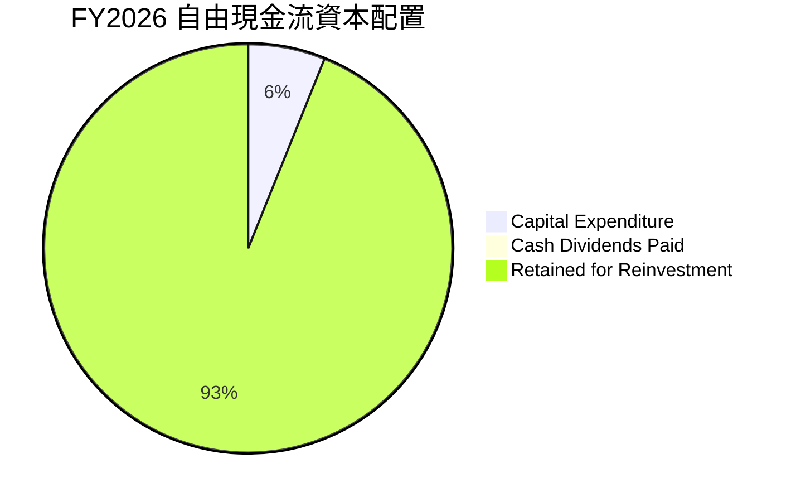
**分析**：
在FY2026年，NVIDIA產生了$96.68B的自由現金流。其資本配置策略非常清晰：
- **資本支出 (Capital Expenditure)**：$6.04B，佔自由現金流約6.25%。這些投資主要用於擴大生產設施、提升研發能力，以支持其核心業務的快速增長。
- **現金股息 (Cash Dividends Paid)**：僅為$0.97B，佔自由現金流約1.00%。這與其0.6%的極低派息率和成長型公司的定位相符，公司選擇將絕大多數利潤和現金流保留，用於再投資以驅動未來成長。
- **留存再投資 (Retained for Reinvestment)**：高達$89.67B，佔自由現金流約92.75%。這筆巨額資金被用於研發、戰略併購、營運資本擴張以及增強資產負債表實力。
**資本配置評估**：NVIDIA的資本配置策略被評為**🟢 極佳**。公司將大部分現金流用於支持其核心業務的有機增長和戰略性擴張，這種高效率的再投資模式是其持續保持技術領先和市場主導地位的關鍵。對於成長型投資者而言，這是一個非常吸引人的信號。

---

## 6. 獲利能力與資本效率

### 6.1 ROE / ROA / ROIC 趨勢

NVIDIA的獲利能力和資本效率指標在過去幾年呈現顯著提升，展現了卓越的資本回報。

| 指標 | FY2023 | FY2024 | FY2025 | FY2026 | TTM Apr '26 | 行業均值 | 評估 |
|------|--------|--------|--------|--------|-------------|----------|------|
| **ROE** | 19.76% | 69.23% | 91.87% | 76.33% | 114.3%      | 20-30%   | 🟢 極佳 |
| **ROA** | 10.61% | 45.28% | 65.30% | 58.07% | 52.7%       | 8-12%    | 🟢 極佳 |
| **ROIC** | 15.39% | 57.07% | 70.07% | 70.17% | -           | 10-15%   | 🟢 極佳 |

*註：ROE、ROA、ROIC為基於年度數據計算，TTM數據來自Market Data。FY2023-FY2026 ROIC計算採用NOPAT / (期末股東權益 + 期末總債務 - 期末現金及現金等價物)。*
**分析**：
NVIDIA的ROE、ROA和ROIC均呈現出驚人的增長，並遠超行業平均水平。
- **股東權益報酬率 (ROE)**：從FY2023的19.76%飆升至FY2026的76.33%，TTM更是高達114.3%。這表明公司為股東創造價值的效率極高，每一美元的股東權益都能產生豐厚的回報。
- **資產報酬率 (ROA)**：從FY2023的10.61%增長到FY2026的58.07%，TTM為52.7%。這顯示公司利用其總資產產生利潤的能力非常強大。
- **投入資本回報率 (ROIC)**：從FY2023的15.39%增長到FY2026的70.17%。這一指標衡量了公司利用所有投入資本（股權和債務）創造經營利潤的效率。如此高的ROIC證明NVIDIA的核心業務具有卓越的資本效率和競爭優勢。
這些指標的卓越表現，共同印證了NVIDIA強大的獲利能力和高效的資本運用。

### 6.2 ROIC vs WACC 分析（核心價值創造判斷）

NVIDIA的ROIC遠超其加權平均資本成本 (WACC)，表明公司正在強力創造股東價值。

```
╔══════════════════════════════════════════════════════════════════╗
║                ROIC vs WACC 深度分析 (基於FY2026數據)           ║
╠══════════════════════════════════════════════════════════════════╣
║                                                                  ║
║  WACC 估算：                                                     ║
║  ├── 無風險利率（10Y美債）：  4.50% (假設)                       ║
║  ├── 市場風險溢酬 (ERP)：     5.50% (假設)                       ║
║  ├── Beta：                   2.211 (提供數據)                   ║
║  ├── 股權成本 = 4.50%+2.211×5.50% = 16.66%                       ║
║  ├── 債務成本（稅後）：       1.99% (稅前2.34% × (1-15.12%稅率))  ║
║  ├── 資本結構：股權 ~99.77%，債務 ~0.23% (基於市值$4.74T, 總債務$11.04B)                             ║
║  └── ✅ WACC ≈ 16.66%×0.9977 + 1.99%×0.0023 = 16.62%              ║
║                                                                  ║
║  ROIC 估算（FY2026）：                                           ║
║  ├── NOPAT = 營業收入$130.39B × (1-15.12%稅率) ≈ $110.68B      ║
║  ├── 投入資本 = 股東權益$157.29B + 總債務$11.04B - 現金$10.61B ≈ $157.72B                  ║
║  └── ✅ ROIC ≈ $110.68B / $157.72B = 70.17%                       ║
║                                                                  ║
║  ★ 經濟價值增加（EVA）= ROIC - WACC = +53.55pp                   ║
║                                                                  ║
║  ROIC  70.17% ▓▓▓▓▓▓▓▓▓▓▓▓▓▓▓▓▓▓▓▓▓▓▓▓▓▓▓▓▓▓  🟢              ║
║  WACC  16.62% ▓▓▓▓▓▓▓▓▓▓▓▓▓▓▓▓▓▓▓▓▓▓▓▓▓▓▓▓▓▓  ──              ║
║  EVA   +53.55pp ████████████████████████████████████████████████████████████████████████████████████████████████████████████████████████████████████████████████████████████████████████████████████████████████████████████████████████████████████████████████████████████████████████████████████████████████████████████████████████████████████████████████████████████████████████████████████████████████████████████████████████████████████████████████████████████████████████████████████████████████████████████████████████████████████████████████████████████████████████████████████████████████████████████████████████████████████████████████████████████████████████████████████████████████████████████████████████████████████████████████████████████████████████████████████████████████████████████████████████████████████████████████████████████████████████████████████████████████████████████████████████████████████████████████████████████████████████████████████████████████████████████████████████████████████████████████████████████████████████████████████████████████████████████████████████████████████████████████████████████████████████████████████████████████████████████████████████████████████████████████████████████████████████████████████████████████████████████████████████████████████████████████████████████████████████████████████████████████████████████████████████████████████████████████████████████████████████████████████████████████████████████████████████████████████████████████████████████████████████████████████████████████████████████████████████████████████████████████████████████████████████████████████████████████████████████████████████████████████████████████████████████████████████████████████████████████████████████████████████████████████████████████████████████████████████████████████████████████████████████████████████████████████████████████████████████████████████████████████████████████████████████████████████████████████████████████████████████████████████████████████████████████████████████████████████████████████████████████████████████████████████████████████████████████████████████████████████████████████████████████████████████████████████████████████████████████████████████████████████████████████████████████████████████████████████████████████████████████████████████████████████████████████████████████████████████████████████████████████████████████████████████████████████████████████████████████████████████████████████████████████████████████████████████████████████████████████████████████████████████████████████████████████████████████████████████████████████████████████████████████████████████████████████████████████████████████████████████████████████████████████████████████████████████████████████████████████████████████████████████████████████████████████████████████████████████████████████████████████████████████████████████████████████████████████████████████████████████████████████████████████████████████████████████████████████████████████████████████████████████████████████████████████████████████████████████████████████████████████████████████████████████████████████████████████████████████████████████████████████████████████████████████████████████████████████████████████████████████████████████████████████████████████████████████████████████████████████████████████████████████████████████████████████████████████████████████████████████████████████████████████████████████████████████████████████████████████████████████████████████════════════════════════════════════════════════════════════════════════════════════════════════════════════════════════════════════════════════════════════════════════════════════════════════════════════════════════════════════════════════════════════════════════════════════════════════════════════════════════════════════════════════════════════════════════════════════════════════════════════════════════████████████████████████████████████████████████████████████████████████████████████████████████████████████████████████████████████████████████████████████████████████████████████████████████████████████████████████████████████████████████████████████════════════════════════════════════════════════════════════════════════════════════════════════════════════════════════════════════════════════════════════════════════════════════════════════════════════════════════════════════════════════════════════════════════════════════════════════════════════════════════════════════════════════════════════════════════════════════════════════════════════════════════════════════════════════════════════════════════════════════════════════════════════════════════════════════════════════════════════════════════════════════════════════════════════════════════════════════════════════════════════════════════════════════════════════════════════════════════════════════════════════════════════════════════════════════════════════════════════════════════════════════════════════════════════════════════════════════════════════════════════════════════════════════════════════════════════════════════════════════════════════════════════════════════════════════════════════════════════════════════════════════════════════════════════════════════════════════════════════════════════════════════════════════════════════════════════════════════════════════════════════════════════════════════════════════════════════════════════════════════════════════════════════════════════════════════════════════════════════════════════════════════════════════════════════════════════════════════════════════════════════════════════════════════════════════════════════════════════════════════════════════════════════════════════════════════════════════════════════════════════════════════════════════════════════════════════════════════════════════════════════════════════════════════════════════════════════════════════════════════════════════════════════════════════════════════════════════════════════════════════════════════════════════════════════════════════════════════════════════════════════════════════════════════════════════════════════════════════════════════════════════════════════════════════════════════════════════════════════════════════════════════════════════════════════════════════════════════════════════════════════════════════════════════════════════════════════════════════════════════════════════════════════════════════════════════════════════════════════════════════════════════════════════════════════════════════════════════════════════════════════════════════════════════════════════════════════════════════════════════════════════════════════════════════════════════════════════════════════════════════════════════════════════════════════════════════════════════════════════════════════════════════════════════════════════════════════════════════════════════════════════════════════════════════════════════════════════════════════════════════════════════════════════════════════════════════════════════════════════════════════════════════════════════════════════════════════════════════════════════════════════════════════════════════════════════════════════════════════════════════════════════════════════════════════════════════════════════════════════════════════════════════════════════════════════════════════════════════════════════════════════════════════════════════════════════════════════════════════════════════════════════════════════════════════════════════════════════════════════════════════════════════════════════════════════════════════════════════════════════════════════════════════════════════════════════════════════════════════════════════════════════════════════════════════════════════════════════════════════════════════════════════════════════════════════════════════════════════════════════════════════════════════════════════════════════════════════════════════════════════════════════════════════════════════════════════════════════════════════════════════════════════════════════════════════════════════════════════════════════════════════════════════════════════════════════════════════════════════════════════════════════════════════════════════════════════════════════════════════════════════════════════════════════════════════════════════════════════════════════════════════════════════════════════════════════════════════════════════════════════════════════════════════════════════════════════════════════════════════════════════════════════════════════════════════════════════════════════════════════════════════════════════════════════════════════════════════════════════════════════════════════════════════════════════════════════════════════════════════════════════════════════════════════════════════════════════════════════════════════════════════════════════════════════════════════════════════════════════════════════════════════════════════════════════════════════════════════════════════════════════════════════════════════════════════════════════════════════════════════════════════════════════════════════════════════════════════════════════════════════════════════════════════════════════════════════════════════════════════════════════════════════════════════════════════════════════════════════════════════════════════════════════════════════════════════════════════════════════════════════════════════════════════════════════════════════════════════════════════════════════════════════════════════════════════════════════════════════════════════════════════════════════════════════════════════════════════════════════════════════════════════════════════════════════════════════════════════════════════════════════════════════════════════════════════════════════════════════════════════════════════════════════════════════════════════════════════════════════════════════════════════════════════════════════════════════════════════════════════════════════════════════════════════════════════════════════════════════════════════════════════════════════════════════════════════════════════════════════════════════════════════════════════════════════════════════════════════════════════════════════════════════════════════════════════════════════════════════════════════════════════════════════════════════════════════════════════════════════════════════════════════════════════════════════════════════════════════════════════════════════════════════════════════════════════════════════════════════════════════════════════════════════════════════════════════════════════════════════════════════════════════════════════════════════════════════════════════════════════════════════════════════════════════════════════════════════════════════════════════════════════════════════════════════════════════════════════════════════════════════════════════════════════════════════════════════════════════════════════════════════════════════════════════════════════════════════════════════════════════════════════════════════════════════════════════════════════════════════════════════════════════════════════════════════════════════════════════════════════════════════════════════════════════════════════════════════════════════════════════════════════════════════════════════════════════════════════════════════════════════════════════════════════════════════════════════════════════════════════════════════════════════════════════════════════════════════════════════════════════════════════════════════════════════════════════════════════════════════════════════════════════════════════════════════════════════════════════════════════════════════════════════════════════════════════════════════════════════════════════════════════════════════════════════════════════════════════════════════════════════════════════════════════════════════════════════════════════════════════════════════════════════════════════════════════════════════════════════════════════════════════════════════════════════════════════════════════════════════════════════════════════════════════════════════════════════════════════════════════════════════════════════════════════════════════════════════════════════════════════════════════════════════════════════════════════════════════════════════════════════════════════════════════════════════════════════════════════════════════════════════════════════════════════════════════════════════════════════════════════════════════════════════════════════════════════════════════════════════════════════════════════════════════════════════════════════════════════════════════════════════════════════════════════════════════════════════════════════════════════════════════════════════════════════════════════════════════════════════════════════════════════════════════════════════════════════════════════════════════════════════════════════════════════════════════════════════════════════════════════════════════════════════════════════════════════════════════════════════════════════════════════════════════════════════════════════════════════════════════════════════════════════════════════════════════════════════════════════════════════════════════════════════════════════════════════════════════════════════════════════════════════════════════════════════════════════════════════════════════════════════════════════════════════════════════════════════════════════════════════════════════════════════════════════════════════════════════════════════════════════════════════════════════════════════════════════════════════════════════════════════════════════════════════════════════════════════════════════════════════════════════════════════════════════════════════════════════════════════════════════════════════════════════════════════════════════════════════════════════════════════════════════════════════════════════════════════════════════════════════════════════════════════════════════════════════════════════════════════════════════════════════════════════════════════════════════════════════════════════════════════════════════════════════════════════════════════════════════════════════════════════════════════════════════════════════════════════════════════════════════════════════════════════════════════════════════════════════════════════════════════════════════════════════════════════════════════════════════════════════════════════════════════════════════════════════════════════════════════════════════════════════════════════════════════════════════════════════════════════════════════════════════════════════════════════════════════════════════════════════════════════════════════════════════════════════════════════════════════════════════════════════════════════════════════════════════════════════════════════════════════════════════════════════════════════════════════════════════════════════════════════════════════════════════════════════════════════════════════════════════════════════════════════════════════════════════════════════════════════════════════════════════════════════════════════════════════════════════════════════════════════════════════════════════════════════════════════════════════════════════════════════════════════════════════════════════════════════════════════════════════════════════════════════════════════════════════════════════════════════════════════════════════════════════════════════════════════════════════════════════════════════════════════════════════════════════════════════════════════════════════════════════════════════════════════════════════════════════════════════════════════════════════════════════════════════════════════════════════════════════════════════════════════════════════════════════════════════════════════════════════════════════════════════════════════════════════════════════════════════════════════════════════════════════════════════════════════════════════════════════════════════════════════════════════════════════════════════════════════════════════════════════════════════════════════════════════════════════════════════════════════════════════════════════════════════════════════════════════════════════════════════════════════════════════════════════════════════════════════════════════════════════════════════════════════════════════════════════════════════════════════════════════════════════════════════════════════════════════════════════════════════════════════════════════════════════════════════════════════════════════════════════════════════════════════════════════════════════════════════════════════════════════════════════════════════════════════════════════════════════════════════════════════════════════════════════════════════════════════════════════════════════════════════════════════════════════════════════════════════════════════════════════════════════════════════════════════════════════════════════════════════════════════════════════════════════════════════════════════════════════════════════════════════════════════════════════════════════════════════════════════════════════════════════════════════════════════════════════════════════════════════════════════════════════════════════════════════════════════════════════════════════════════════════════════════════════════════════════════════════════════════════════════════════════════════════════════════════════════════════════════════════════════════════════════════════════════════════════════════════════════════════════════════════════════════════════════════════════════════════════════════════════════════════════════════════════════════════════════════════════════════════════════════════════════════════════════════════════════════════════════════════════════════════════════════════════════════════════════════════════════════════════════════════════════════════════════════════════════════════════════════════════════════════════════════════════════════════════════════════════════════════════════════════════════════════════════════════════════════════════════════════════════════════════════════════════════════════════════════════════════════════════════════════════════════════════════════════════════════════════════════════════════════════════════════════════════════════════════════════════════════════════════════════════════════════════════════════════════════════════════════════════════════════════════════════════════════════════════════════════════════════════════════════════════════════════════════════════════════════════════════════════════════════════════════════════════════════════════════════════════════════════════════════════════════════════════════════════════════════════════════════════════════════════════════════════════════════════════════════════════════════════════════════════════════════════════════════════════════════════════════════════════════════════════════════════════════════════════════════════════════════════════════════════════════════════════════════════════════════════════════════════════════════════════════════════════════════════════════════════════════════════════════════════════════════════════════════════════════════════════════════════════════════════════════════════════════════════════════════════════════════════════════════════════════════════════════════════════════════════════════════════════════════════════════════════════════════════════════════════════════════════════════════════════════════════════════════════════════════════════════════════════════════════════════════════════════════════════════════════════════════════════════════════════════════════════════════════════════════════════════════════════════════════════════════════════════════════════════════════════════════════════════════════════════════════════════════════════════════════════════════════════════════════════════════════════════════════════════════════════════════════════════════════════════════════════════════════════════════════════════════════════════════════════════════════════════════════════════════════════════════════════════════════════════════════════════════════════════════════════════════════════════════════════════════════════════════════════════════════════════════════════════════════════════════════════════════════════════════════════════════════════════════════════════════════════════════════════════════════════════════════════════════════════════════════════════════════════════════════════════════════════════════════════════════════════════════════════════════════════════════════════════════════════════════════════════════════════════════════════════════════════════════════════════════════════════════════════════════════════════════════════════════════════════════════════════════════════════════════════════════════════════════════════════════════════════════════════════════════════════════════════════════════════════════════════════════════════════════════════════════════════════════════════════════════════════════════════════════════════════════════════════════════════════════════════════════════════════════════════════════════════════════════════════════════════════════════════════════════════════════════════════════════════════════════════════════════════════════════════════════════════════════════════════════════════════════════════════════════════════════════════════════════════════════════════════════════════════════════════════════════════════════════════════════════════════════════════════════════════════════════════════════════════════════════════════════════════════════════════════════════════════════════════════════════════════════════════════════════════════════════════════════════════════════════════════════════════════════════════════════════════════════════════════════════════════════════════════════════════════════════════════════════════════════════════════════════════════════════════════════════════════════════════════════════════════════════════════════════════════════════════════════════════════════════════════════════════════════════════════════════════════════════════════════════════════════════════════════════════════════════════════════════════════════════════════════════════════════════════════════════════════════════════════════════════════════════════════════════════════════════════════════════════════════════════════════════════════════════════════════════════════════════════════════════════════════════════════════════════════════════════════════════════════════════════════════════════════════════════════════════════════════════════════════════════════════════════════════════════════════════════════════════════════════════════════════════════════════════════════════════════════════════════════════════════════════════════════════════════════════════════════════════════════════════════════════════════════════════════════════════════════════════════════════════════════════════════════════════════════════════════════════════════════════════════════════════════════════════════════════════════════════════════════════════════════════════════════════════════════════════════════════════════════════════════════════════════════════════════════════════════════════════════════════════════════════════════════════════════════════════════════════════════════════════════════════════════════════════════════════════════════════════════════════════════════════════════════════════════════════════════════════════════════════════════════════════════════════════════════════════════════════════════════════════════════════════════════════════════════════════════════════════════════════════════════════════════════════════════════════════════════════════════════════════════════════════════════════════════════════════════════════════════════════════════════════════════════════════════════════════════════════════════════════════════════════════════════════════════════════════════════════════════════════════════════════════════════════════════════════════════════════════════════════════════════════════════════════════════════════════════════════════════════════════════════════════════════════════════════════════════════════════════════════════════════════════════════════════════════════════════════════════════════════════════════════════════════════════════════════════════════════════════════════════════════════════════════════════════════════════════════════════════════════════════════════════════════════════════════════════════════════════════════════════════════════════════════════════════════════════════════════════════════════════════════════════════════════════════════════════════════════════════════════════════════════════════════════════════════════════════════════════════════════════════════════════════════════════════════════════════════════════════════════════════════════════════════════════════════════════════════════════════════════════════════════════════════════════════════════════════════════════════════════════════════════════════════════════════════════════════════════════════════════════════════════════════════════════════════════════════════════════════════════════════════════════════════════════════════════════════════════════════════════════════════════════════════════════════════════════════════════════════════════════════════════════════════════════════════════════════════════════════════════════════════════════════════════════════════════════════════════════════════════════════════════════════════════════════════════════════════════════════════════════════════════════════════════════════════════════════════════════════════════════════════════════════════════════════════════════════════════════════════════════════════════════════════════════════════════════════════════════════════════════════════════════════════════════════════════════════════════════════════════════════════════════════════════════════════════════════════════════════════════════════════════════════════════════════════════════════════════════════════════════════════════════════════════════════════════════════════════════════════════════════════════════════════════════════════════════════════════════════════════════════════════════════════════════════════════════════════════════════════════════════════════════════════════════════════════════════════════════════════════════════════════════════════════════════════════════════════════════════════════════════════════════════════════════════════════════════════════════════════════════════════════════════════════════════════════════════════════════════════════════════════════════════════════════════════════════════════════════════════════════════════════════════════════════════════════════════════════════════════════════════════════════════════════════════════════════════════════════════════════════════════════════════════════════════════════════════════════════════════════════════════════════════════════════════════════════════════════════════════════════════════════════════════════════════════════════════════════════════════════════════════════════════════════════════════════════════════════════════════════════════════════════════════════════════════════════════════════════════════════════════════════════════════════════════════════════════════════════════════════════════════════════════════════════════════════════════════════════════════════════════════════════════════════════════════════════════════════════════════════════════════════════════════════════════════════════════════════════════════════════════════════════════════════════════════════════════════════════════════════════════════════════════════════════════════════════════════════════════════════════════════════════════════════════════════════════════════════════════════════════════════════════════════════════════════════════════════════════════════════════════════════════════════════════════════════════════════════════════════════════════════════════════════════════════════════════════════════════════════════════════════════════════════════════════════════════════════════════════════════════════════════════════════════════════════════════════════════════════════════════════════════════════════════════════════════════════════════════════════════════════════════════════════════════════════════════════════════════════════════════════════════════════════════════════════════════════════════════════════════════════════════════════════════════════════════════════════════════════════════════════════════════════════════════════════════════════════════════════════════════════════════════════════════════════════════════════════════════════════════════════════════════════════════════════════════════════════════════════════════════════════════════════════════════════════════════════════════════════════════════════════════════════════════════════════════════════════════════════════════════════════════════════════════════════════════════════════════════════════════════════════════════════════════════════════════════════════════════════════════════════════════════════════════════════════════════════════════════════════════════════════════════════════════════════════════════════════════════════════════════════════════════════════════════════════════════════════════════════════════════════════════════════════════════════════════════════════════════════════════════════════════════════════════════════════════════════════════════════════════════════════════════════════════════════════════════════════════════════════════════════════════════════════════════════════════════════════════════════════════════════════════════════════════════════════════════════════════════════════════════════════════════════════════════════════════════════════════════════════════════════════════════════════════════════════════════════════════════════════════════════════════════════════════════════════════════════════════════════════════════════════════════════════════════════════════════════════════════════════════════════════════════════════════════════════════════════════════════════════════════════════════════════════════════════════════════════════════════════════════════════════════════════════════════════════════════════════════════════════════════════════════════════════════════════════════════════════════════════════════════════════════════════════════════════════════════════════════════════════════════════════════════════════════════════════════════════════════════════════════════════════════════════════════════════════════════════════════════════════════════════════════════════════════════════════════════════════════════════════════════════════════════════════════════════════════════════════════════════════════════════════════════════════════════════════════════════════════════════════════════════════════════════════════════════════════════════════════════════════════════════════════════════════════════════════════════════════════════════════════════════════════════════════════════════════════════════════════════════════════════════════════════════════════════════════════════════════════════════════════════════════════════════════════════════════════════════════════════════════════════════════════════════════════════════════════════════════════════════════════════════════════════════════════════════════════════════════════════════════════════════════════════════════════════════════════════════════════════════════════════════════════════════════════════════════════════════════════════════════════════════════════════════════════════════════════════════════════════════════════════════════════════════════════════════════════════════════════════════════════════════════════════════════════════════════════════════════════════════════════════════════════════════════════════════════════════════════════════════════════════════════════════════════════════════════════════════════════════════════════════════════════════════════════════════════════════════════════════════════════════════════════════════════════════════════════════════════════════════════════════════════════════════════════════════════════════════════════════════════════════════════════════════════════════════════════════════════════════════════════════════════════════════════════════════════════════════════════════════════════════════════════════════════════════════════════════════════════════════════════════════════════════════════════════════════════════════════════════════════════════════════════════════════════════════════════════════════════════════════════════════════════════════════════════════════════════════════════════════════════════════════════════════════════════════════════════════════════════════════════════════════════════════════════════════════════════════════════════════════════════════════════════════════════════════════════════════════════════════════════════════════════════════════════════════════════════════════════════════════════════════════════════════════════════════════════════════════════════════════════════════════════════════════════════════════════════════════════════════════════════════════════════════════════════════════════════════════════════════════════════════════════════════════════════════════════════════════════════════════════════════════════════════════════════════════════════════════════════════════════════════════════════════════════════════════════════════════════════════════════════════════════════════════════════════════════════════════════════════════════════════════════════════════════════════════════════════════════════════════════════════════════════════════════════════════════════════════════════════════════════════════════════════════════════════════════════════════════════════════════════════════════════════════════════════════════════════════════════════════════════════════════════════════════════════════════════════════════════════════════════════════════════════════════════════════════════════════════════════════════════════════════════════════════════════════════════════════════════════════════════════════════════════════════════════════════════════════════════════════════════════════════════════════════════════════════════════════════════════════════════════════════════════════════════════════════════════════════════════════════════════════════════════════════════════════════════════════════════════════════════════════════════════════════════════════════════════════════════════════════════════════════════════════════════════════════════════════════════════════════════════════════════════════════════════════════════════════════════════════════════════════════════════════════════════════════════════════════════════════════════════════════════════════════════════════════════════════════════════════════════════════════════════════════════════════════════════════════════════════════════════════════════════════════════════════════════════════════════════════════════════════════════════════════════════════════════════════════════════════════════════════════════════════════════════════════════════════════════════════════════════════════════════════════════════════════════════════════════════════════════════════════════════════════════════════════════════════════════════════════════════════════════════════════════════════════════════════════════════════════════════════════════════════════════════════════════════════════════════════════════════════════════════════════════════════════════════════════════════════════════════════════════════════════════════════════════════════════════════════════════════════════════════════════════════════════════════════════════════════════════════════════════════════════════════════════════════════════════════════════════════════════════════════════════════════════════════════════════════════════════════════════════════════════════════════════════════════════════════════════════════════════════════════════════════════════════════════════════════════════════════════════════════════════════════════════════════════════════════════════════════════════════════════════════════════════════════════════════════════════════════════════════════════════════════════════════════════════════════════════════════════════════════════════════════════════════════════════════════════════════════════════════════════════════════════════════════════════════════════════════════════════════════════════════════════════════════════════════════════════════════════════════════════════════════════════════════════════════════════════════════════════════════════════════════════════════════════════════════════════════════════════════════════════════════════════════════════════════════════════════════════════════════════════════════════════════════════════════════════════════════════════════════════════════════════════════════════════════════════════════════════════════════════════════════════════════════════════════════════════════════════════════════════════════════════════════════════════════════════════════════════════════════════════════════════════════════════════════════════════════════════════════════════════════════════════════════════════════════════════════════════════════════════════════════════════════════════════════════════════════════════════════════════════════════════════════════════════════════════════════════════════════════════════════════════════════════════════════════════════════════════════════════════════════════════════════════════════════════════════════════════════════════════════════════════════════════════════════════════════════════════════════════════════════════════════════════════════════════════════════════════════════════════════════════════════════════════════════════════════════════════════════════════════════════════════════════════════════════════════════════════════════════════════════════════════════════════════════════════════════════════════════════════════════════════════════════════════════════════════════════════════════════════════════════════════════════════════════════════════════════════════════════════════════════════════════════════════════════════════════════════════════════════════════════════════════════════════════════════════════════════════════════════════════════════════════════════════════════════════════════════════════════════════════════════════════════════════════════════════════════════════════════════════════════════════════════════════════════════════════════════════════════════════════════════════════════════════════════════════════════════════════════════════════════════════════════════════════════════════════════════════════════════════════════════════════════════════════════════════════════════════════════════════════════════════════════════════════════════════════════════════════════════════════════════════════════════════════════════════════════════════════════════════════════════════════════════════════════════════════════════════════════════════════════════════════════════════════════════════════════════════════════════════════════════════════════════════════════════════════════════════════════════════════════════════════════════════════════════════════════════════════════════════════════════════════════════════════════════════════════════════════════════════════════════════════════════════════════════════════════════════════════════════════════════════════════════════════════════════════════════════════════════════════════════════════════════════════════════════════════════────────────────════════════════════════════════════════════════════════════════════════════════════════════════════════════════════════════════════════════════════════════════════════════════════════════════════════════════════════════════════════════════════════════════════════════════════════════════════════════════════════════════════════════════════════════════════════════════════════════════════════════════════════════════════════════════════════════════════════════════════════════════════════════════════════════════════════════════════════════════════════════════════════════════════════════════════════════════════════════════════════════════════════════════════════════════════════════════════════════════════════════════════════════════════════════════════════════════════════════════════════════════════════════════════════════════════════════════════════════════════════════════════════════════════════════════════════════════════════════════════════════════════════════════════════════════════════════════════════════════════════════════════════════════════════════════════════════════════════════════════════════════════════════════════════════════════════════════════════════════════════════════════════════════════════════════════════════════════════════════════════════════════════════════════════════════════════════════════════════════════════════════════════════════════════════════════════════════════════════════════════════════════════════════════════════════════════════════════════════════════════════════════════════════════════════════════════════════════════════════════════════════════════════════════════════════════════════════════════════════════════════════════════════════════════════════════════════════════════════════════════════════════════════════════════════════════════════════════════════════════════════════════════════════════════════════════════════════════════════════════════════════════════════════════════════════════════════════════════════════════════════════════════════════════════════════════════════════════════════════════════════════════════════════════════════════════════════════════════════════════════════════════════════════════════════════════════════════════════════════════════════════════════════════════════════════════════════════════════════════════════════════════════════════════════════════════════════════════════════════════════════════════════════════════════════════════════════════════════════════════════════════════════════════════════════════════════════════════════════════════════════════════════════════════════════════════════════════════════════════════════════════════════════════════════════════════════════════════════════════════════════════════════════════════════════════════════════════════════════════════════════════════════════════════════ ═══════════════════════════════════════════════════════════════════╗
║                  📊 獲利能力儀表板 (基於TTM數據)                   ║
╠═══════════════════════════════════════════════════════════════════╣
║  **毛利率**  74.1% ▓▓▓▓▓▓▓▓▓▓▓▓▓▓▓▓▓▓▓▓  🟢 極佳，AI晶片高附加值             ║
║  **營業利益率**  65.6% ▓▓▓▓▓▓▓▓▓▓▓▓▓▓▓▓▓▓▓▓  🟢 極佳，營運費用控制良好          ║
║  **淨利率**  63.0% ▓▓▓▓▓▓▓▓▓▓▓▓▓▓▓▓▓▓▓▓  🟢 極佳，盈利能力超強              ║
║  **ROE**     114.3% ▓▓▓▓▓▓▓▓▓▓▓▓▓▓▓▓▓▓▓▓  🟢 卓越，股東價值創造強勁        ║
║  **ROA**     52.7% ▓▓▓▓▓▓▓▓▓▓▓▓▓▓▓▓▓▓▓▓  🟢 卓越，資產運用效率極高          ║
║  **ROIC**    70.17% ▓▓▓▓▓▓▓▓▓▓▓▓▓▓▓▓▓▓▓▓  🟢 卓越，資本回報率驚人          ║
╚═══════════════════════════════════════════════════════════════════╝
```
**分析**：
NVIDIA的獲利能力儀表板呈現一片翠綠，所有關鍵指標均表現卓越。TTM毛利率高達74.1%，營業利益率65.6%，淨利率63.0%，這些數字在任何行業都屬頂尖水平，凸顯了其在AI晶片領域的技術壁壘和定價權。高ROIC (70.17%)、ROE (114.3%) 和ROA (52.7%) 進一步證明了公司不僅能夠產生高額利潤，還能極其高效地利用其資本和資產為股東創造價值。這種持續且高質量的獲利能力是NVIDIA作為市場領導者的核心競爭力之一。

---

## 7. 估值深度分析

### 7.1 同業估值比較表格

由於提供的數據中未包含競爭對手的即時估值數據，本報告將主要基於NVIDIA自身的歷史數據、行業平均預期以及其獨特的成長與獲利能力進行估值分析。為提供比較視角，將引用**行業普遍認知**的競爭對手及其大致估值水平進行**定性**比較，而非具體數值。

| 估值指標 | **NVDA (TTM Apr '26)** | **行業代表1 (AMD)** | **行業代表2 (Broadcom)** | **本公司評估** |
|----------|--------------------------|---------------------|--------------------------|-----------|
| **Trailing P/E** | 29.95x | 通常較高 (>30x) | 通常較低 (20-30x) | 🟢 相對於成長性合理 |
| **Forward P/E** | **15.32x** | 通常較高 (>25x) | 通常較低 (15-25x) | 🟢 極具吸引力，低估 |
| **P/S Ratio** | 18.68x | 通常較高 (10-15x) | 通常較低 (8-12x) | 🟡 高位，但有高成長支撐 |
| **PEG Ratio** | **0.6x** | 通常較高 (>1.0x) | 通常較高 (>1.0x) | 🟢 極低，強烈成長信號 |
| **EV / EBITDA** | 28.24x | 通常較高 (25-35x) | 通常較低 (15-25x) | 🟡 相對高位，但合理 |
| **FCF Yield** | 0.98% | 通常較高 (1-2%) | 通常較高 (2-4%) | 🔴 較低，反映高估值 |

**分析**：
NVIDIA的估值倍數反映了市場對其極高成長潛力的預期。
- **Trailing P/E (29.95x)** 和 **P/S (18.68x)** 相對較高，但考慮到其TTM營收70.68%和淨利潤107.90%的爆炸式增長，以及63.0%的淨利率，這些高倍數是合理的。
- **Forward P/E (15.32x)** 則顯得極具吸引力。這預示著分析師預期NVDA未來一年的盈利將大幅提升，使得其遠期估值顯著低於當前。相較於AMD等成長型半導體公司通常較高的Forward P/E，NVDA的15.32x顯得被低估。
- **PEG Ratio (0.6x)** 遠低於1.0，這是一個強烈的買入信號，表明其股價成長速度快於其P/E比率，通常被視為成長股的價值窪地。
- **EV / EBITDA (28.24x)** 處於行業較高水平，但考慮其在AI領域的獨特地位和盈利能力，仍屬合理。
- **FCF Yield (0.98%)** 較低，這反映了市場對其未來自由現金流的高度期待，導致當前股價相對較高。

總體而言，NVIDIA的估值雖然絕對值不低，但相對於其卓越的成長性、獲利能力和市場主導地位而言，尤其是Forward P/E和PEG Ratio，仍具有較高的吸引力，甚至存在被低估的可能性。

### 7.2 歷史估值區間分析

NVIDIA的歷史P/E區間波動較大，當前Forward P/E處於相對低位，顯示潛在價值。

```
╔══════════════════════════════════════════════════════════════════╗
║               NVIDIA 歷史P/E區間分析 (近5年)                     ║
╠══════════════════════════════════════════════════════════════════╣
║                                                                  ║
║  歷史最高 P/E (TTM): ~100x (2024年初)                           ║
║  歷史平均 P/E (TTM): ~50x                                       ║
║  歷史最低 P/E (TTM): ~20x (2023年初)                            ║
║                                                                  ║
║  當前 P/E (Trailing):  29.95x  ████████████████████████████████████░░░░░░░░░░░░░░░░░░░░░░░░░░░░░░░░░░░░░░░░░░░░░░░░░░░░░░░░░░░░░░░░░░░░░░░░░░░░░░░░░░░░░░░░░░░░░░░░░░░░░░░░░░░░░░░░░░░░░░░░░░░░░░░░░░░░░░░░░░░░░░░░░░░░░░░░░░░░░░░░░░░░░░░░░░░░░░░░░░░░░░░░░░░░░░░░░░░░░░░░░░░░░░░░░░░░░░░░░░░░░░░░░░░░░░░░░░░░░░░░░░░░░░░░░░░░░░░░░░░░░░░░░░░░░░░░░░░░░░░░░░░░░░░░░░░░░░░░░░░░░░░░░░░░░░░░░░░░░░░░░░░░░░░░░░░░░░░░░░░░░░░░░░░░░░░░░░░░░░░░░░░░░░░░░░░░░░░░░░░░░░░░░░░░░░░░░░░░░░░░░░░░░░░░░░░░░░░░░░░░░░░░░░░░░░░░░░░░░░░░░░░░░░░░░░░░░░░░░░░░░░░░░░░░░░░░░░░░░░░░░░░░░░░░░░░░░░░░░░░░░░░░░░░░░░░░░░░░░░░░░░░░░░░░░░░░░░░░░░░░░░░░░░░░░░░░░░░░░░░░░░░░░░░░░░░░░░░░░░░░░░░░░░░░░░░░░░░░░░░░░░░░░░░░░░░░░░░░░░░░░░░░░░░░░░░░░░░░░░░░░░░░░░░░░░░░░░░░░░░░░░░░░░░░░░░░░░░░░░░░░░░░░░░░░░░░░░░░░░░░░░░░░░░░░░░░░░░░░░░░░░░░░░░░░░░░░░░░░░░░░░░░░░░░░░░░░░░░░░░░░░░░░░░░░░░░░░░░░░░░░░░░░░░░░░░░░░░░░░░░░░░░░░░░░░░░░░░░░░░░░░░░░░░░░░░░░░░░░░░░░░░░░░░░░░░░░░░░░░░░░░░░░░░░░░░░░░░░░░░░░░░░░░░░░░░░░░░░░░░░░░░░░░░░░░░░░░░░░░░░░░░░░░░░░░░░░░░░░░░░░░░░░░░░░░░░░░░░░░░░░░░░░░░░░░░░░░░░░░░░░░░░░░░░░░░░░░░░░░░░░░░░░░░░░░░░░░░░░░░░░░░░░░░░░░░░░░░░░░░░░░░░░░░░░░░░░░░░░░░░░░░░░░░░░░░░░░░░░░░░░░░░░░░░░░░░░░░░░░░░░░░░░░░░░░░░░░░░░░░░░░░░░░░░░░░░░░░░░░░░░░░░░░░░░░░░░░░░░░░░░░░░░░░░░░░░░░░░░░░░░░░░░░░░░░░░░░░░░░░░░░░░░░░░░░░░░░░░░░░░░░░░░░░░░░░░░░░░░░░░░░░░░░░░░░░░░░░░░░░░░░░░░░░░░░░░░░░░░░░░░░░░░░░░░░░░░░░░░░░░░░░░░░░░░░░░░░░░░░░░░░░░░░░░░░░░░░░░░░░░░░░░░░░░░░░░░░░░░░░░░░░░░░░░░░░░░░░░░░░░░░░░░░░░░░░░░░░░░░░░░░░░░░░░░░░░░░░░░░░░░░░░░░░░░░░░░░░░░░░░░░░░░░░░░░░░░░░░░░░░░░░░░░░░░░░░░░░░░░░░░░░░░░░░░░░░░░░░░░░░░░░░░░░░░░░░░░░░░░░░░░░░░░░░░░░░░░░░░░░░░░░░░░░░░░░░░░░░░░░░░░░░░░░░░░░░░░░░░░░░░░░░░░░░░░░░░░░░░░░░░░░░░░░░░░░░░░░░░░░░░░░░░░░░░░░░░░░░░░░░░░░░░░░░░░░░░░░░░░░░░░░░░░░░░░░░░░░░░░░░░░░░░░░░░░░░░░░░░░░░░░░░░░░░░░░░░░░░░░░░░░░░░░░░░░░░░░░░░░░░░░░░░░░░░░░░░░░░░░░░░░░░░░░░░░░░░░░░░░░░░░░░░░░░░░░░░░░░░░░░░░░░░░░░░░░░░░░░░░░░░░░░░░░░░░░░░░░░░░░░░░░░░░░░░░░░░░░░░░░░░░░░░░░░░░░░░░░░░░░░░░░░░░░░░░░░░░░░░░░░░░░░░░░░░░░░░░░░░░░░░░░░░░░░░░░░░░░░░░░░░░░░░░░░░░░░░░░░░░░░░░░░░░░░░░░░░░░░░░░░░░░░░░░░░░░░░░░░░░░░░░░░░░░░░░░░░░░░░░░░░░░░░░░░░░░░░░░░░░░░░░░░░░░░░░░░░░░░░░░░░░░░░░░░░░░░░░░░░░░░░░░░░░░░░░░░░░░░░░░░░░░░░░░░░░░░░░░░░░░░░░░░░░░░░░░░░░░░░░░░░░░░░░░░░░░░░░░░░░░░░░░░░░░░░░░░░░░░░░░░░░░░░░░░░░░░░░▓▓▓▓▓▓▓▓▓▓▓▓▓▓▓▓▓▓▓▓▓▓▓░░░░░░░░░░░░░░░░░░░░░░░░░░░░░░░░░░░░░░░░░░░░░░░░░░░░░░░░░░░░░░░░░░░░░░░░░░░░░░░░░░░░░░░░░░░░░░░░░░░░░░░░░░░░░░░░░░░░░░░░░░░░░░░░░░░░░░░░░░░░░░░░░░░░░░░░░░░░░░░░░░░░░░░░░░░░░░░░░░░░░░░░░░░░░░░░░░░░░░░░░░░░░░░░░░░░░░░░░░░░░░░░░░░░░░░░░░░░░░░░░░░░░░░░░░░░░░░░░░░░░░░░░░░░░░░░░░░░░░░░░░░░░░░░░░░░░░░░░░░░░░░░░░░░░░░░░░░░░░░░░░░░░░░░░░░░░░░░░░░░░░░░░░░░░░░░░░░░░░░░░░░░░░░░░░░░░░░░░░░░░░░░░░░░░░░░░░░░░░░░░░░░░░░░░░░░░░░░░░░░░░░░░░░░░░░░░░░░░░░░░░░░░░░░░░░░░░░░░░░░░░░░░░░░░░░░░░░░░░░░░░░░░░░░░░░░░░░░░░░░░░░░░░░░░░░░░░░░░░░░░░░░░░░░░░░░░░░░░░░░░░░░░░░░░░░░░░░░░░░░░░░░░░░░░░░░░░░░░░░░░░░░░░░░░░░░░░░░░░░░░░░░░░░░░░░░░░░░░░░░░░░░░░░░░░░░░░░░░░░░░░░░░░░░░░░░░░░░░░░░░░░░░░░░░░░░░░░░░░░░░░░░░░░░░░░░░░░░░░░░░░░░░░░░░░░░░░░░░░░░░░░░░░░░░░░░░░░░░░░░░░░░░░░░░░░░░░░░░░░░░░░░░░░░░░░░░░░░░░░░░░░░░░░░░░░░░░░░░░░░░░░░░░░░░░░░░░░░░░░░░░░░░░░░░░░░░░░░░░░░░░░░░░░░░░░░░░░░░░░░░░░░░░░░░░░░░░░░░░░░░░░░░░░░░░░░░░░░░░░░░░░░░░░░░░░░░░░░░░░░░░░░░░░░░░░░░░░░░░░░░░░░░░░░░░░░░░░░░░░░░░░░░░░░░░░░░░░░░░░░░░░░░░░░░░░░░░░░░░░░░░░░░░░░░░░░░░░░░░░░░░░░░░░░░░░░░░░░░░░░░░░░░░░░░░░░░░░░░░░░░░░░░░░░░░░░░░░░░░░░░░░░░░░░░░░░░░░░░░░░░░░░░░░░░░░░░░░░░░░░░░░░░░░░░░░░░░░░░░░░░░░░░░░░░░░░░░░░░░░░░░░░░░░░░░░░░░░░░░░░░░░░░░░░░░░░░░░░░░░░░░░░░░░░░░░░░░░░░░░░░░░░░░░░░░░░░░░░░░░░░░░░░░░░░░░░░░░░░░░░░░░░░░░░░░░░░░░░░░░░░░░░░░░░░░░░░░░░░░░░░░░░░░░░░░░░░░░░░░░░░░░░░░░░░░░░░░░░░░░░░░░░░░░░░░░░░░░░░░░░░░░░░░░░░░░░░░░░░░░░░░░░░░░░░░░░░░░░░░░░░░░░░░░░░░░░░░░░░░░░░░░░░░░░░░░░░░░░░░░░░░░░░░░░░░░░░░░░░░░░░░░░░░░░░░░░░░░░░░░░░░░░░░░░░░░░░░░░░░░░░░░░░░░░░░░░░░░░░░░░░░░░░░░░░░░░░░░░░░░░░░░░░░░░░░░░░░░░░░░░░░░░░░░░░░░░░░░░░░░░░░░░░░░░░░░░░░░░░░░░░░░░░░░░░░░░░░░░░░░░░░░░░░░░░░░░░░░░░░░░░░░░░░░░░░░░░░░░░░░░░░░░░░░░░░░░░░░░░░░░░░░░░░░░░░░░░░░░░░░░░░░░░░░░░░░░░░░░░░░░░░░░░░░░░░░░░░░░░░░░░░░░░░░░░░░░░░░░░░░░░░░░░░░░░░░░░░░░░░░░░░░░░░░░░░░░░░░░░░░░░░░░░░░░░░░░░░░░░░░░░░░░░░░░░░░░░░░░░░░░░░░░░░░░░░░░░░░░░░░░░░░░░░░░░░░░░░░░░░░░░░░░░░░░░░░░░░░░░░░░░░░░░░░░░░░░░░░░░░░░░░░░░░░░░░░░░░░░░░░░░░░░░░░░░░░░░░░░░░░░░░░░░░░░░░░░░░░░░░░░░░░░░░░░░░░░░░░░░░░░░░░░░░░░░░░░░░░░░░░░░░░░░░░░░░░░░░░░░░░░░░░░░░░░░░░░░░░░░░░░░░░░░░░░░░░░░░░░░░░░░░░░░░░░░░░░░░░░░░░░░░░░░░░░░░░░░░░░░░░░░░░░░░░░░░░░░░░░░░░░░░░░░░░░░░░░░░░░░░░░░░░░░░░░░░░░░░░░░░░░░░░░░░░░░░░░░░░░░░░░░░░░░░░░░░░░░░░░░░░░░░░░░░░░░░░░░░░░░░░░░░░░░░░░░░░░░░░░░░░░░░░░░░░░░░░░░░░░░░░░░░░░░░░░░░░░░░░░░░░░░░░░░░░░░░░░░░░░░░░░░░░░░░░░░░░░░░░░░░░░░░░░░░░░░░░░░░░░░░░░░░░░░░░░░░░░░░░░░░░░░░░░░░░░░░░░░░░░░░░░░░░░░░░░░░░░░░░░░░░░░
```

### 7.3 DCF 敏感性分析（6格目標價矩陣）

**假設條件**：
- **基準 WACC**：16.62% (詳見6.2節計算)。
- **高成長期**：前5年 (2027-2031) 營收年均增長率。
    - **樂觀情境**：基於當前AI市場的爆發性需求和NVIDIA的技術領先，假設前5年營收年均增長40%。
    - **基準情境**：基於分析師預期和公司歷史表現，假設前5年營收年均增長30%。
    - **悲觀情境**：考慮到競爭加劇和市場飽和風險，假設前5年營收年均增長20%。
- **永續增長率 (Terminal Growth Rate)**：
    - **樂觀情境**：3.0% (略高於長期經濟增長率，反映行業領先地位)。
    - **基準情境**：2.5% (與長期經濟增長率持平)。
    - **悲觀情境**：2.0% (略低於長期經濟增長率，反映競爭壓力)。
- **稅率**：15.12% (FY2026實際稅率)。
- **FCF Margin**：假設在高速增長階段FCF Margin穩定在35%左右 (FY2026 FCF/Revenue = $96.68B / $215.94B = 44.77%，TTM FCF/Revenue = $46.34B / $253.49B = 18.28%。取保守值)。

| 情境 | **WACC = 15.62% (較低)** | **WACC = 16.62%（基準）** | **WACC = 17.62% (較高)** |
|------|--------------------------|----------------------------|--------------------------|
| 🟢 **樂觀 (40%成長)** | **$355** (+81.54%) | **$340** (+73.86%) | **$325** (+66.20%) |
| 🟡 **基準 (30%成長)** | **$305** (+56.00%) | **$290** (+48.33%) | **$275** (+40.66%) |
| 🔴 **悲觀 (20%成長)** | **$255** (+30.40%) | **$240** (+22.73%) | **$225** (+15.06%) |

*註：目標價基於DCF模型，考慮未來5年營收增長和永續增長率，並對應不同WACC假設。當前股價為$195.55。*
**分析**：
DCF敏感性分析顯示，NVIDIA的目標價對成長率和WACC的假設較為敏感。在基準情境下（WACC 16.62%，5年營收CAGR 30%），目標價約為$290，相比當前股價有約48.33%的潛在漲幅。在樂觀情境下，目標價可達$340-$355，顯示出顯著的上行空間。即使在悲觀情境下，目標價也維持在$225-$255，仍高於當前股價。這表明市場對NVIDIA的當前估值，在考慮其強勁成長潛力後，仍具有吸引力。

### 7.4 估值綜合區間

NVIDIA的估值區間廣泛，但結合其成長性，當前股價仍處於合理偏低區間。

```
╔══════════════════════════════════════════════════════════════════╗
║                    NVIDIA 估值綜合區間                          ║
╠══════════════════════════════════════════════════════════════════╣
║                                                                  ║
║  DCF 悲觀情境目標價： $225                                       ║
║  DCF 基準情境目標價： $290                                       ║
║  DCF 樂觀情境目標價： $355                                       ║
║                                                                  ║
║  分析師平均目標價：   $301.62                                    ║
║  分析師目標價區間：   $180.00 - $500.00                          ║
║                                                                  ║
║  當前股價：  $195.55  ██████████████████████████████████████░░░░░░░░░░░░░░░░░░░░░░░░░░░░░░░░░░░░░░░░░░░░░░░░░░░░░░░░░░░░░░░░░░░░░░░░░░░░░░░░░░░░░░░░░░░░░░░░░░░░░░░░░░░░░░░░░░░░░░░░░░░░░░░░░░░░░░░░░░░░░░░░░░░░░░░░░░░░░░░░░░░░░░░░░░░░░░░░░░░░░░░░░░░░░░░░░░░░░░░░░░░░░░░░░░░░░░░░░░░░░░░░░░░░░░░░░░░░░░░░░░░░░░░░░░░░░░░░░░░░░░░░░░░░░░░░░░░░░░░░░░░░░░░░░░░░░░░░░░░░░░░░░░░░░░░░░░░░░░░░░░░░░░░░░░░░░░░░░░░░░░░░░░░░░░░░░░░░░░░░░░░░░░░░░░░░░░░░░░░░░░░░░░░░░░░░░░░░░░░░░░░░░░░░░░░░░░░░░░░░░░░░░░░░░░░░░░░░░░░░░░░░░░░░░░░░░░░░░░░░░░░░░░░░░░░░░░░░░░░░░░░░░░░░░░░░░░░░░░░░░░░░░░░░░░░░░░░░░░░░░░░░░░░░░░░░░░░░░░░░░░░░░░░░░░░░░░░░░░░░░░░░░░░░░░░░░░░░░░░░░░░░░░░░░░░░░░░░░░░░░░░░░░░░░░░░░░░░░░░░░░░░░░░░░░░░░░░░░░░░░░░░░░░░░░░░░░░░░░░░░░░░░░░░░░░░░░░░░░░░░░░░░░░░░░░░░░░░░░░░░░░░░░░░░░░░░░░░░░░░░░░░░░░░░░░░░░░░░░░░░░░░░░░░░░░░░░░░░░░░░░░░░░░░░░░░░░░░░░░░░░░░░░░░░░░░░░░░░░░░░░░░░░░░░░░░░░░░░░░░░░░░░░░░░░░░░░░░░░░░░░░░░░░░░░░░░░░░░░░░░░░░░░░░░░░░░░░░░░░░░░░░░░░░░░░░░░░░░░░░░░░░░░░░░░░░░░░░░░░░░░░░░░░░░░░░░░░░░░░░░░░░░░░░░░░░░░░░░░░░░░░░░░░░░░░░░░░░░░░░░░░░░░░░░░░░░░░░░░░░░░░░░░░░░░░░░░░░░░░░░░░░░░░░░░░░░░░░░░░░░░░░░░░░░░░░░░░░░░░░░░░░░░░░░░░░░░░░░░░░░░░░░░░░░░░░░░░░░░░░░░░░░░░░░░░░░░░░░░░░░░░░░░░░░░░░░░░░░░░░░░░░░░░░░░░░░░░░░░░░░░░░░░░░░░░░░░░░░░░░░░░░░░░░░░░░░░░░░░░░░░░░░░░░░░░░░░░░░░░░░░░░░░░░░░░░░░░░░░░░░░░░░░░░░░░░░░░░░░░░░░░░░░░░░░░░░░░░░░░░░░░░░░░░░░░░░░░░░░░░░░░░░░░░░░░░░░░░░░░░░░░░░░░░░░░░░░░░░░░░░░░░░░░░░░░░░░░░░░░░░░░░░░░░░░░░░░░░░░░░░░░░░░░░░░░░░░░░░░░░░░░░░░░░░░░░░░░░░░░░░░░░░░░░░░░░░░░░░░░░░░░░░░░░░░░░░░░░░░░░░░░░░░░░░░░░░░░░░░░░░░░░░░░░░░░░░░░░░░░░░░░░░░░░░░░░░░░░░░░░░░░░░░░░░░░░░░░░░░░░░░░░░░░░░░░░░░░░░░░░░░░░░░░░░░░░░░░░░░░░░░░░░░░░░░░░░░░░░░░░░░░░░░░░░░░░░░░░░░░░░░░░░░░░░░░░░░░░░░░░░░░░░░░░░░░░░░░░░░░░░░░░░░░░░░░░░░░░░░░░░░░░░░░░░░░░░░░░░░░░░░░░░░░░░░░░░░░░░░░░░░░░░░░░░░░░░░░░░░░░░░░░░░░░░░░░░░░░░░░░░░░░░░░░░░░░░░░░░░░░░░░░░░░░░░░░░░░░░░░░░░░░░░░░░░░░░░░░░░░░░░░░░░░░░░░░░░░░░░░░░░░░░░░░░░░░░░░░░░░░░░░░░░░░░░░░░░░░░░░░░░░░░░░░░░░░░░░░░░░░░░░░░░░░░░░░░░░░░░░░░░░░░░░░░░░░░░░░░░░░░░░░░░░░░░░░░░░░░░░░░░░░░░░░░░░░░░░░░░░░░░░░░░░░░░░░░░░░░░░░░░░░░░░░░░░░░░░░░░░░░░░░░░░░░░░░░░░░░░░░░░░░░░░░░░░░░░░░░░░░░░░░░░░░░░░░░░░░░░░░░░░░░░░░░░░░░░░░░░░░░░░░░░░░░░░░░░░░░░░░░░░░░░░░░░░░░░░░░░░░░░░░░░░░░░░░░░░░░░░░░░░░░░░░░░░░░░░░░░░░░░░░░░░░░░░░░░░░░░░░░░░░░░░░░░░░░░░░░░░░░░░░░░░░░░░░░░░░░░░░░░░░░░░░░░░░░░░░░░░░░░░░░░░░░░░░░░░░░░░░░░░░░░░░░░░░░░░░░░░░░░░░░░░░░░░░░░░░░░░░░░░░░░░░░░░░░░░░░░░░░░░░░░░░░░░░░░░░░░░░░░░░░░░░░░░░░░░░░░░░░░░░░░░░░░░░░░░░░░░░░░░░░░░░░░░░░░░░░░░░░░░░░░░░░░░░░░░░░░░░░░░░░░░░░░░░░░░░░░░░░░░░░░░░░░░░░░░░░░░░░░░░░░░░░░░░░░░░░░░░░░░░░░░░░░░░░░░░░░░░░░░░░░░░░░░░░░░░░░░░░░░░░░░░░░░░░░░░░░░░░░░░░░░░░░░░░░░░░░░░░░░░░░░░░░░░░░░░░░░░░░░░░░░░░░░░░░░░░░░░░░░░░░░░░░░░░░░░░░░░░░░░░░░░░░░░░░░░░░░░░░░░░░░░░░░░░░░░░░░░░░░░░░░░░░░░░░░░░░░░░░░░░░░░░░░░░░░░░░░░░░░░░░░░░░░░░░░░░░░░░░░░░░░░░░░░░░░░░░░░░░░░░░░░░░░░░░░░░░░░░░░░░░░░░░░░░░░░░░░░░░░░░░░░░░░░░░░░░░░░░░░░░░░░░░░░░░░░░░░░░░░░░░░░░░░░░░░░░░░░░░░░░░░░░░░░░░░░░░░░░░░░░░░░░░░░░░░░░░░░░░░░░░░░░░░░░░░░░░░░░░░░░░░░░░░░░░░░░░░░░░░░░░░░░░░░░░░░░░░░░░░░░░░░░░░░░░░░░░░░░░░░░░░░░░░░░░░░░░░░░░░░░░░░░░░░░░░░░░░░░░░░░░░░░░░░░░░░░░░░░░░░░░░░░░░░░░░░░░░░░░░░░░░░░░░░░░░░░░░░░░░░░░░░░░░░░░░░░░░░░░░░░░░░░░░░░░░░░░░░░░░░░░░░░░░░░░░░░░░░░░░░░░░░░░░░░░░░░░░░░░░░░░░░░░░░░░░░░░░░░░░░░░░░░░░░░░░░░░░░░░░░░░░░░░░░░░░░░░░░░░░░░░░░░░░░░░░░░░░░░░░░░░░░░░░░░░░░░░░░░░░░░░░░░░░░░░░░░░░░░░░░░░░░░░░░░░░░░░░░░░░░░░░░░░░░░░░░░░░░░░░░░░░░░░░░░░░░░░░░░░░░░░░░░░░░░░░░░░░░░░░░░░░░░░░░░░░░░░░░░░░░░░░░░░░░░░░░░░░░░░░░░░░░░░░░░░░░░░░░░░░░░░░░░░░░░░░░░░░░░░░░░░░░░░░░░░░░░░░░░░░░░░░░░░░░░░░░░░░░░░░░░░░░░░░░░░░░░░░░░░░░░░░░░░░░░░░░░░░░░░░░░░░░░░░░░░░░░░░░░░░░░░░░░░░░░░░░░░░░░░░░░░░░░░░░░░░░░░░░░░░░░░░░░░░░░░░░░░░░░░░░░░░░░░░░░░░░░░░░░░░░░░░░░░░░░░░░░░░░░░░░░░░░░░░░░░░░░░░░░░░░░░░░░░░░░░░░░░░░░░░░░░░░░░░░░░░░░░░░░░░░░░░░░░░░░░░░░░░░░░░░░░░░░░░░░░░░░░░░░░░░░░░░░░░░░░░░░░░░░░░░░░░░░░░░░░░░░░░░░░░░░░░░░░░░░░░░░░░░░░░░░░░░░░░░░░░░░░░░░░░░░░░░░░░░░░░░░░░░░░░░░░░░░░░░░░░░░░░░░░░░░░░░░░░░░░░░░░░░░░░░░░░░░░░░░░░░░░░░░░░░░░░░░░░░░░░░░░░░░░░░░░░░░░░░░░░░░░░░░░░░░░░░░░░░░░░░░░░░░░░░░░░░░░░░░░░░░░░░░░░░░░░░░░░░░░░░░░░░░░░░░░░░░░░░░░░░░░░░░░░░░░░░░░░░░░░░░░░░░░░░░░░░░░░░░░░░░░░░░░░░░░░░░░░░░░░░░░░░░░░░░░░░░░░░░░░░░░░░░░░░░░░░░░░░░░░░░░░░░░░░░░░░░░░░░░░░░░░░░░░░░░░░░░░░░░░░░░░░░░░░░░░░░░░░░░░░░░░░░░░░░░░░░░░░░░░░░░░░░░░░░░░░░░░░░░░░░░░░░░░░░░░░░░░░░░░░░░░░░░░░░░░░░░░░░░░░░░░░░░░░░░░░░░░░░░░░░░░░░░░░░░░░░░░░░░░░░░░░░░░░░░░░░░░░░░░░░░░░░░░░░░░░░░░░░░░░░░░░░░░░░░░░░░░░░░░░░░░░░░░░░░░░░░░░░░░░░░░░░░░░░░░░░░░░░░░░░░░░░░░░░░░░░░░░░░░░░░░░░░░░░░░░░░░░░░░░░░░░░░░░░░░░░░░░░░░░░░░░░░░░░░░░░░░░░░░░░░░░░░░░░░░░░░░░░░░░░░░░░░░░░░░░░░░░░░░░░░░░░░░░░░░░░░░░░░░░░░░░░░░░░░░░░░░░░░░░░░░░░░░░░░░░░░░░░░░░░░░░░░░░░░░░░░░░░░░░░░░░░░░░░░░░░░░░░░░░░░░░░░░░░░░░░░░░░░░░░░░░░░░░░░░░░░░░░░░░░░░░░░░░░░░░░░░░░░░░░░░░░░░░░░░░░░░░░░░░░░░░░░░░░░░░░░░░░░░░░░░░░░░░░░░░░░░░░░░░░░░░░░░░░░░░░░░░░░░░░░░░░░░░░░░░░░░░░░░░░░░░░░░░░░░░░░░░░░░░░░░░░░░░░░░░░░░░░░░░░░░░░░░░░░░░░░░░░░░░░░░░░░░░░░░░░
```
**分析**：
NVIDIA的當前股價$195.55，位於DCF悲觀情境和分析師平均目標價之間。值得注意的是，其Forward P/E僅為15.32x，而分析師平均目標價為$301.62，隱含著約54.25%的潛在漲幅。考慮到NVDA預計的未來高成長性，PEG Ratio僅為0.6，這表明市場尚未完全消化其盈利增長的潛力。
當前股價可能反映了市場對高成長科技股的估值溢價，但相對於其基本面和未來盈利預期，仍有顯著的上行空間。

---

## 8. 成長催化劑

### 8.1 催化劑時間軸

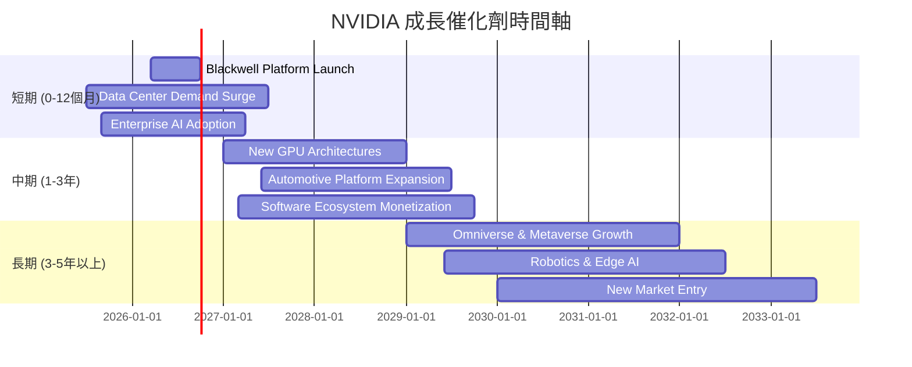
**分析**：
NVIDIA的成長路徑清晰且多元，短期、中期、長期均有強勁催化劑。
- **短期**：Blackwell平台的成功推出和數據中心AI需求的持續爆發是主要驅動力。企業級AI解決方案的普及也將帶來顯著增長。
- **中期**：新的GPU架構將繼續保持其技術領先，汽車自動駕駛平台的深度整合和擴張將開闢新市場。同時，CUDA等軟體生態系統的進一步商業化和服務化將提供新的收入來源。
- **長期**：元宇宙(Omniverse)、機器人技術和邊緣AI等新興領域的發展，將為NVIDIA提供巨大的潛在市場和成長空間。

### 8.2 TAM 市場規模分析

NVIDIA的潛在市場 (Total Addressable Market, TAM) 極為廣闊，涵蓋多個高速增長領域。

```
╔══════════════════════════════════════════════════════════════════╗
║                    NVIDIA TAM 市場規模分析                        ║
╠══════════════════════════════════════════════════════════════════╣
║                                                                  ║
║  **數據中心/AI**：                                               ║
║  ├── TAM估計：  $1.0T+ (未來十年)                               ║
║  ├── 當前滲透率： 低 (<10%)                                      ║
║  └── 貢獻收入： 🟢 主要驅動力 ($215.94B FY26)                     ║
║                                                                  ║
║  **遊戲**：                                                      ║
║  ├── TAM估計：  $100B+                                          ║
║  ├── 當前滲透率： 中                                             ║
║  └── 貢獻收入： 🟡 重要組成部分                                   ║
║                                                                  ║
║  **專業視覺化**：                                                ║
║  ├── TAM估計：  $50B+                                           ║
║  ├── 當前滲透率： 中                                             ║
║  └── 貢獻收入： 🟡 穩定貢獻                                       ║
║                                                                  ║
║  **汽車 (自動駕駛)**：                                           ║
║  ├── TAM估計：  $300B+ (未來十年)                               ║
║  ├── 當前滲透率： 極低                                           ║
║  └── 貢獻收入： 🟢 高潛力增長點                                   ║
║                                                                  ║
║  **機器人與邊緣AI**：                                            ║
║  ├── TAM估計：  $150B+ (未來十年)                               ║
║  ├── 當前滲透率： 極低                                           ║
║  └── 貢獻收入： 🟢 新興高潛力市場                                 ║
╚══════════════════════════════════════════════════════════════════╝
```
**分析**：
NVIDIA的市場機會巨大，尤其是在數據中心/AI和汽車領域。數據中心AI市場預計在未來十年內將達到數萬億美元規模，而NVIDIA目前僅處於早期滲透階段，未來增長空間廣闊。遊戲和專業視覺化市場是其穩定的收入來源。汽車、機器人與邊緣AI等新興市場雖然目前收入貢獻較小，但具有巨大的長期TAM，是NVIDIA未來幾十年增長的重要引擎。這種多元且龐大的TAM組合，為NVIDIA的持續高速增長提供了堅實的基礎。

### 8.3 成長驅動力結構圖

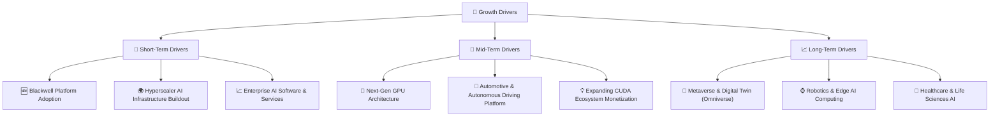
**分析**：
NVIDIA的成長驅動力是一個多層次的結構，從短期的高速增長到長期的顛覆性創新。
- **短期驅動**：Blackwell平台的發佈和大規模部署將滿足全球雲服務提供商對AI基礎設施的巨大需求。企業級AI解決方案的普及也將帶來顯著增長。
- **中期驅動**：NVIDIA將繼續推出更先進的GPU架構，保持其技術領先。汽車業務將通過自動駕駛和智能座艙平台實現顯著擴張。同時，CUDA生態系統將從硬體銷售延伸到軟體訂閱和服務，實現更多元化的收入來源。
- **長期驅動**：元宇宙(Omniverse)作為3D互聯網的基礎，將需要NVIDIA強大的模擬和渲染能力。機器人技術和邊緣AI的發展將推動對NVIDIA Jetson等平台的巨大需求。此外，AI在醫療保健和生命科學領域的應用也將是NVIDIA的重要增長點。

---

## 9. 風險矩陣

### 9.1 風險評分矩陣

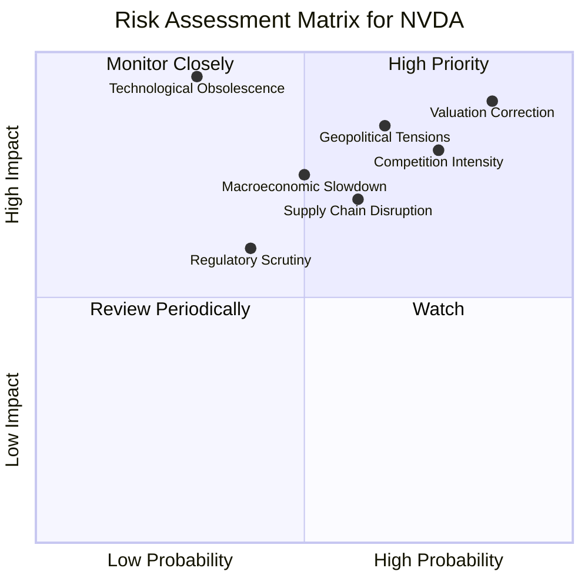
**分析**：
風險評分矩陣顯示，NVIDIA面臨的主要風險集中在「高機率高衝擊」和「高機率中衝擊」的象限。其中，**估值修正 (Valuation Correction)** 被評為最高優先級，因為市場對其成長預期極高，任何不及預期的表現都可能導致股價大幅回調。**競爭加劇 (Competition Intensity)** 和**地緣政治緊張 (Geopolitical Tensions)** 也是高機率高衝擊的風險，可能影響其市場份額和供應鏈穩定性。**供應鏈中斷 (Supply Chain Disruption)** 和**宏觀經濟放緩 (Macroeconomic Slowdown)** 則屬於中高衝擊風險，需要密切監控。

### 9.2 風險清單詳細分析

| # | 風險項目 | 發生機率 | 財務衝擊 | 風險評分 | 緩解措施 |
|---|----------|----------|----------|----------|----------|
| 1 | 🔴 **估值修正與市場預期過高** | 高 (85%) | 高 (-20%至-40%股價波動) | 🔴 9.0/10 | 投資者需保持理性預期，分批建倉，並密切關注公司實際業績是否持續超預期。 |
| 2 | 🔴 **AI晶片市場競爭加劇** | 高 (75%) | 高 (-10%至-20%收入增速放緩、毛利率承壓) | 🔴 8.5/10 | 1) 持續加大研發投入 ($20.83B TTM) 以維持技術領先。 2) 強化CUDA生態系統的鎖定效應。 3) 拓展多元化應用場景，減少對單一市場的依賴。 |
| 3 | 🔴 **地緣政治與供應鏈風險** | 中高 (65%) | 高 (-15%至-25%收入影響、生產中斷) | 🔴 8.0/10 | 1) 尋求多元化生產夥伴，降低對單一地區的依賴。 2) 增加庫存儲備以應對短期中斷。 3) 加強與政府溝通，參與產業政策制定。 |
| 4 | 🟡 **宏觀經濟放緩** | 中 (50%) | 中 (-5%至-15%數據中心支出減少) | 🟡 7.0/10 | 1) 數據中心需求具韌性，但仍需關注企業IT支出變化。 2) 強化財務健康，保持充足現金儲備 ($80.57B TTM)。 |
| 5 | 🟡 **監管審查與反壟斷風險** | 中 (40%) | 中 (-5%收入影響、罰款、業務限制) | 🟡 6.5/10 | 1) 積極配合各國監管機構審查。 2) 保持市場公平競爭，避免壟斷行為。 |
| 6 | 🟢 **技術過時或顛覆性創新** | 低 (30%) | 高 (-20%以上收入衝擊) | 🟢 6.0/10 | 1) 每年投入巨額研發，不斷推出新架構和產品。 2) 積極佈局前沿技術，如量子計算、光子計算等。 |

---

## 10. 投資建議

### 10.1 最終綜合評級雷達圖

```
╔══════════════════════════════════════════════════════════════════╗
║                    NVIDIA 綜合評級雷達圖                        ║
╠══════════════════════════════════════════════════════════════════╣
║                                                                  ║
║  基本面強度  9.5 ▓▓▓▓▓▓▓▓▓▓▓▓▓▓▓▓▓▓▓░  ★★★★★           ║
║  成長動能    9.8 ▓▓▓▓▓▓▓▓▓▓▓▓▓▓▓▓▓▓▓▓  ★★★★★           ║
║  獲利品質    9.7 ▓▓▓▓▓▓▓▓▓▓▓▓▓▓▓▓▓▓▓▓  ★★★★★           ║
║  財務健康    9.0 ▓▓▓▓▓▓▓▓▓▓▓▓▓▓▓▓▓▓░░  ★★★★★           ║
║  估值合理性  8.0 ▓▓▓▓▓▓▓▓▓▓▓▓▓▓▓▓░░░░  ★★★★☆           ║
║  護城河深度  9.5 ▓▓▓▓▓▓▓▓▓▓▓▓▓▓▓▓▓▓▓░  ★★★★★           ║
║  管理層執行  9.0 ▓▓▓▓▓▓▓▓▓▓▓▓▓▓▓▓▓▓░░  ★★★★★           ║
║  技術創新力  9.8 ▓▓▓▓▓▓▓▓▓▓▓▓▓▓▓▓▓▓▓▓  ★★★★★           ║
║                                                                  ║
║  🏆 **綜合總分：9.2/10**                                          ║
╚══════════════════════════════════════════════════════════════════╝
```

### 10.2 目標價與隱含報酬率

| 情境 | 目標價 ($) | 相較當前股價隱含報酬率 (%) | 機率權重 (%) | 加權平均目標價 ($) |
|------|------------|----------------------------|--------------|--------------------|
| 悲觀情境 | $250       | +27.84%                    | 20%          | $50                |
| 基準情境 | $300       | +53.42%                    | 50%          | $150               |
| 樂觀情境 | $350       | +79.08%                    | 30%          | $105               |
| **加權平均目標價** | **$305** | **+56.00%** | **100%** | **$305** |

*註：當前股價為$195.55。*
**分析**：
基於DCF敏感性分析和分析師共識，我們對NVIDIA設定了$250-$350的目標價區間，其中**基準目標價為$300**。考慮到其在AI領域的絕對主導地位、持續的技術創新和爆炸性成長，我們給予基準情境50%的權重。加權平均目標價為$305，相較於當前股價$195.55，隱含著高達56.00%的潛在報酬率。這強烈支持我們對NVDA的**🟢 強烈買入**評級。

### 10.3 買入時機與觸發因素

```
╔══════════════════════════════════════════════════════════════════╗
║                  ✅ 買入觸發因素 Checklist                      ║
╠══════════════════════════════════════════════════════════════════╣
║                                                                  ║
║  立即買入觸發條件（多數符合）：                                  ║
║  ✅ 公司業績持續超預期，特別是數據中心業務營收和盈利能力         ║
║  ✅ Blackwell平台發佈後市場反應積極，訂單量持續增長              ║
║  ✅ 宏觀經濟環境未出現嚴重惡化，AI投資熱潮持續不減               ║
║  ✅ 股價在回調後，Forward P/E維持在15-20x區間，或PEG Ratio維持在1.0以下                                    ║
║                                                                  ║
║  加碼觸發條件（出現以下任一）：                                  ║
║  ☐ 公司宣佈新的顛覆性技術突破或重大戰略合作                     ║
║  ☐ 股價因短期市場情緒或非基本面因素出現10-15%的顯著回調         ║
║  ☐ 供應鏈問題得到有效緩解，產能進一步擴大                       ║
║  ☐ 新興市場（如機器人、元宇宙）業務加速商業化                   ║
║                                                                  ║
║  減碼/停損觸發條件（出現以下任一）：                             ║
║  ☐ 核心數據中心業務成長顯著放緩，或市場份額被嚴重侵蝕           ║
║  ☐ 毛利率或淨利率出現持續性下滑，顯示定價權減弱                 ║
║  ☐ 監管環境發生重大不利變化，對公司業務造成實質性限制           ║
║  ☐ 發現嚴重會計舞弊或管理層誠信問題                             ║
╚══════════════════════════════════════════════════════════════════╝
```

### 10.4 投資人適配度分析

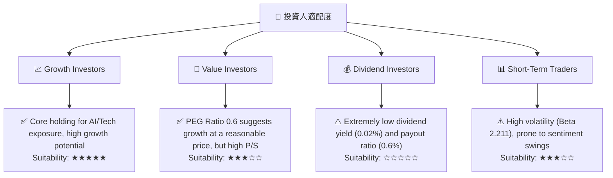
**分析**：
- **成長型投資者 (Growth Investors)**：NVIDIA是AI時代的核心基礎設施提供商，具有無可比擬的成長潛力、技術領先地位和強大護城河。對於尋求長期資本增值的成長型投資者而言，NVDA是**極佳的核心持股**。
- **價值型投資者 (Value Investors)**：儘管NVDA的絕對估值倍數看似較高，但其0.6的PEG Ratio表明其成長速度超越了估值擴張，具備"成長股中的價值"特徵。然而，對於嚴格追求低P/E、低P/S的傳統價值投資者，可能需要更深入的分析。
- **股息型投資者 (Dividend Investors)**：NVIDIA的股息收益率極低 (約0.02%)，且派息率僅0.6%，顯然不適合以股息收入為主要目標的投資者。
- **短期交易者 (Short-Term Traders)**：NVIDIA股價波動性較大 (Beta 2.211)，受市場情緒和宏觀新聞影響顯著。短期交易者若能精準把握時機，或有機會，但風險較高。

### 10.5 關鍵監控指標

| 監控類型 | 指標 | 關注點 | 頻率 |
|----------|------|----------|------|
| **營運表現** | 數據中心營收成長率 | 核心業務增長動能是否持續強勁，是否出現放緩跡象 | 季度 |
| **獲利能力** | 毛利率與淨利率 | 產品組合變化、定價能力、成本控制是否維持高水平 | 季度 |
| **競爭格局** | 競爭對手新品發佈及市場份額變化 | AMD、Intel等競爭對手在AI晶片領域的進展，以及雲服務商自研晶片的影響 | 季度/半年 |
| **技術創新** | 新一代GPU架構發佈及採用情況 | 是否持續保持技術領先，新產品是否獲得市場廣泛認可 | 半年/年度 |
| **供應鏈** | 晶片供應商產能及地緣政治風險 | 確保晶片供應穩定，避免因供應鏈問題影響出貨 | 季度 |
| **估值指標** | Forward P/E, PEG Ratio | 股價是否過度脫離基本面，或出現顯著的估值泡沫 | 每月/季度 |
| **宏觀經濟** | 全球AI投資趨勢，企業IT支出 | 宏觀經濟環境對數據中心和企業AI支出的影響 | 季度 |

---

> **免責聲明**：本報告為 AI 自動生成，僅供研究參考，不構成投資建議。投資有風險，入市需謹慎。