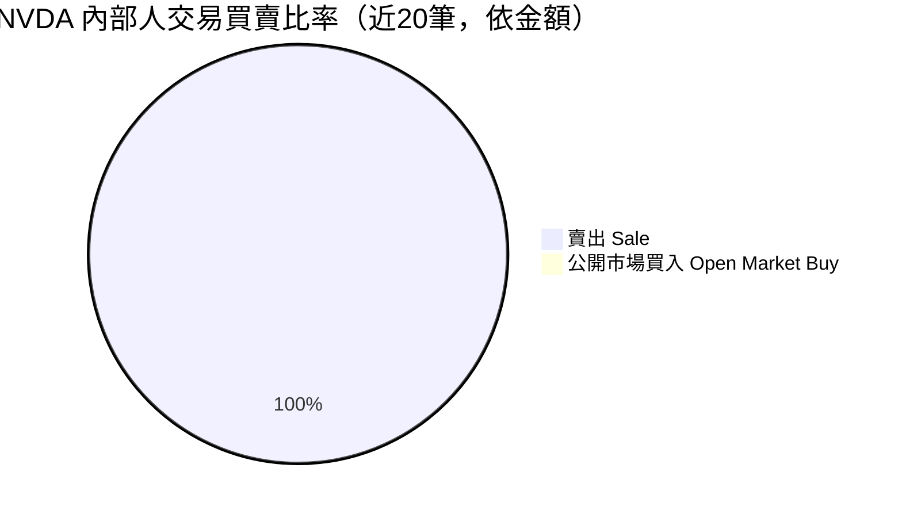
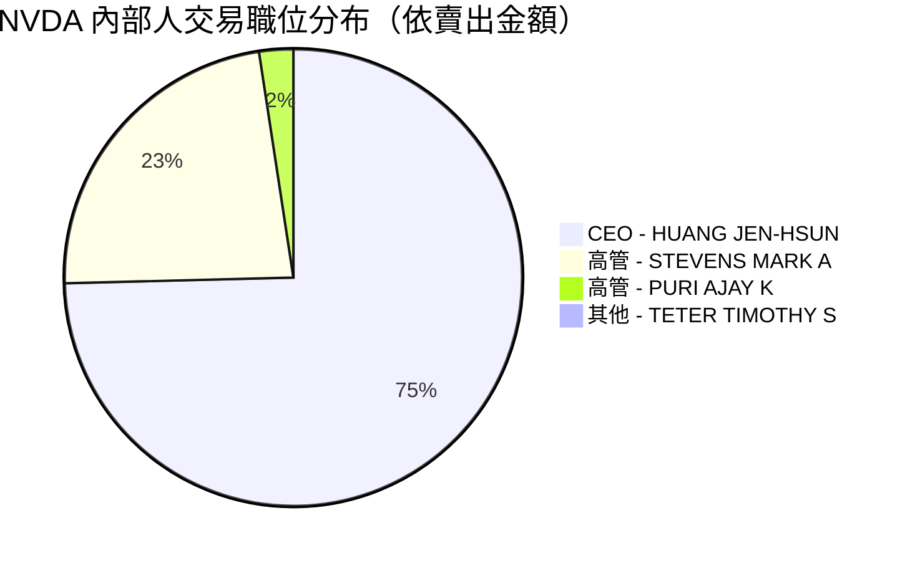
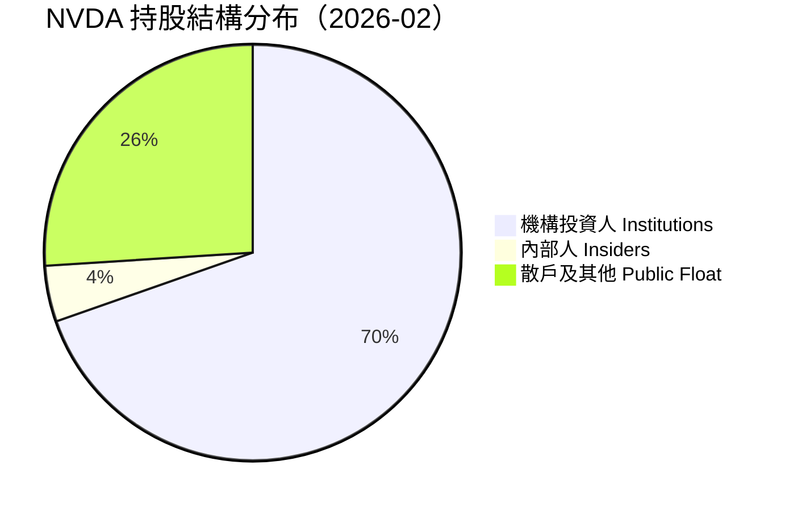

# NVDA 內部人交易深度分析報告

> **報告日期**：2026-02-24 ｜ **語言**：繁體中文 ｜ **數據來源**：Yahoo Finance (SEC Form 4)
> **股票代號**：NVDA ｜ **當前股價**：$191.83 ｜ **市值**：$4.67 兆美元

---

## 目錄

1. [內部人交易概覽儀表板](#1-內部人交易概覽儀表板)
2. [詳細交易記錄分析](#2-詳細交易記錄分析)
3. [關鍵內部人識別](#3-關鍵內部人識別)
4. [買入信號分析](#4-買入信號分析)
5. [賣出信號分析](#5-賣出信號分析)
6. [持股結構分析](#6-持股結構分析)
7. [時機與價格分析](#7-時機與價格分析)
8. [綜合信號解讀與投資建議](#8-綜合信號解讀與投資建議)

---

## 1. 內部人交易概覽儀表板

### 📊 整體快覽

| 指標 | 數值 | 狀態 |
|------|------|------|
| 分析期間 | 近20筆交易（約6個月） | — |
| 總賣出金額 | ~$561.28M | 🔴 |
| 總買入金額 | $0（無公開市場買入） | ⬜ |
| 淨買賣差額 | **-$561.28M（淨賣出）** | 🔴 |
| 參與交易內部人數 | 4人 | — |
| 最活躍內部人 | HUANG JEN-HSUN（黃仁勳，CEO） | — |

---

### 🥧 買賣比率（近20筆交易）



> ⚠️ **注意**：數據中所有交易均顯示為賣出行為，無任何公開市場主動買入記錄。

---

### 📊 各內部人淨賣出金額（Unicode 進度條）

```
淨買賣金額儀表板（負值 = 淨賣出 🔴）
────────────────────────────────────────────────────────

HUANG JEN-HSUN (CEO)
淨賣出：~$403.27M
🔴 ████████████████████████████████████████  -$403.27M

STEVENS MARK A (高管)
淨賣出：~$124.25M
🔴 ████████████████████████░░░░░░░░░░░░░░░░  -$124.25M

PURI AJAY K (高管)
淨賣出：~$13.02M
🔴 ██████░░░░░░░░░░░░░░░░░░░░░░░░░░░░░░░░░░   -$13.02M

TETER TIMOTHY S (高管)
淨賣出：$0.00（股數：48,359；金額未揭露）
🟡 ░░░░░░░░░░░░░░░░░░░░░░░░░░░░░░░░░░░░░░░░   $0.00

────────────────────────────────────────────────────────
整體淨賣出：▓▓▓▓▓▓▓▓▓▓▓▓▓▓▓▓▓▓▓▓▓▓▓▓▓▓▓▓▓▓▓▓  -$561.28M
```

---

### 🎯 交易活躍度評分

```
交易活躍度評分（1–10 分）
─────────────────────────────────────────
頻率密集度：█████████░  9/10（黃仁勳每周固定賣出）
金額重要性：████████░░  8/10（單月累計超億美元）
人數廣度：  ████░░░░░░  4/10（僅4人參與）
買入信號：  █░░░░░░░░░  1/10（無任何公開市場買入）
─────────────────────────────────────────
綜合評分：  █████░░░░░  5.5/10（中等偏高活躍，但全為賣出）
```

---

### 🔴 整體內部人交易信號

```
┌─────────────────────────────────────────────────────┐
│                                                     │
│   整體信號：🔴 看空偏弱（Short-Bias Weak）           │
│                                                     │
│   • 無任何公開市場買入                               │
│   • 大量系統性賣出（Rule 10b5-1 計劃為主）           │
│   • 但多為例行性預定計劃賣出，非突發警示              │
│   • 機構持股比例高（69.6%）提供底部支撐              │
│                                                     │
└─────────────────────────────────────────────────────┘
```

---

## 2. 詳細交易記錄分析

### 📋 完整交易記錄表格

| # | 交易日期（推估） | 姓名 | 推估職位 | 交易類型 | 股數 | 交易金額 | 均價 | 信號 |
|---|----------|------|------|------|-----:|--------:|-----:|:---:|
| 149 | 2026-02 | TETER TIMOTHY S | 高階主管 | 未揭露 | 48,359 | $0.00 | — | 🟡 |
| 148 | 2026-02 | HUANG JEN-HSUN | **CEO** | 賣出（10b5-1） | 240,000 | $29.74M | ~$123.9 | 🔴 |
| 147 | 2026-02 | HUANG JEN-HSUN | **CEO** | 賣出（10b5-1） | 240,000 | $29.58M | ~$123.3 | 🔴 |
| 146 | 2026-02 | HUANG JEN-HSUN | **CEO** | 賣出（10b5-1） | 240,000 | $30.69M | ~$127.9 | 🔴 |
| 145 | 2026-01/02 | STEVENS MARK A | 高階主管 | 賣出 | 785,000 | $104.00M | ~$132.5 | 🔴 |
| 144 | 2026-01 | HUANG JEN-HSUN | **CEO** | 賣出（10b5-1） | 240,000 | $31.86M | ~$132.8 | 🔴 |
| 143 | 2026-01 | STEVENS MARK A | 高階主管 | 賣出 | 156,023 | $20.25M | ~$129.8 | 🔴 |
| 142 | 2026-01 | HUANG JEN-HSUN | **CEO** | 賣出（10b5-1） | 240,000 | $31.27M | ~$130.3 | 🔴 |
| 141 | 2025-12/01 | PURI AJAY K | 高階主管 | 賣出 | 100,110 | $13.02M | ~$130.1 | 🔴 |
| 140 | 2025-12 | HUANG JEN-HSUN | **CEO** | 賣出（10b5-1） | 240,000 | $30.64M | ~$127.7 | 🔴 |
| 139 | 2025-12 | HUANG JEN-HSUN | **CEO** | 賣出（10b5-1） | 240,000 | $28.68M | ~$119.5 | 🔴 |
| 138 | 2025-12 | HUANG JEN-HSUN | **CEO** | 賣出（10b5-1） | 240,000 | $28.95M | ~$120.6 | 🔴 |
| 137 | 2025-11 | HUANG JEN-HSUN | **CEO** | 賣出（10b5-1） | 240,000 | $28.87M | ~$120.3 | 🔴 |
| 136 | 2025-11 | HUANG JEN-HSUN | **CEO** | 賣出（10b5-1） | 240,000 | $27.22M | ~$113.4 | 🔴 |
| 135 | 2025-10 | HUANG JEN-HSUN | **CEO** | 賣出（10b5-1） | 240,000 | $26.38M | ~$109.9 | 🔴 |
| 134 | 2025-10 | HUANG JEN-HSUN | **CEO** | 賣出（10b5-1） | 240,000 | $27.43M | ~$114.3 | 🔴 |
| 133 | 2025-09 | HUANG JEN-HSUN | **CEO** | 賣出（10b5-1） | 240,000 | $24.61M | ~$102.5 | 🔴 |
| 132 | 2025-09 | HUANG JEN-HSUN | **CEO** | 賣出（10b5-1） | 240,000 | $25.07M | ~$104.5 | 🔴 |
| 131 | 2025-08 | HUANG JEN-HSUN | **CEO** | 賣出（10b5-1） | 240,000 | $24.92M | ~$103.8 | 🔴 |
| 130 | 2025-08 | HUANG JEN-HSUN | **CEO** | 賣出（10b5-1） | 240,000 | $27.57M | ~$114.9 | 🔴 |

> 📌 **說明**：均價為估算值（交易金額 ÷ 股數）。HUANG JEN-HSUN 每筆固定 240,000 股，高度符合 **Rule 10b5-1 預定計劃**特徵。

---

### 🏆 最大單筆交易分析

#### 賣出前 5 名

| 排名 | 姓名 | 股數 | 金額 | 特徵 |
|:---:|------|-----:|-----:|------|
| 🥇 | STEVENS MARK A | 785,000 | **$104.00M** | 單筆最大，非固定金額，需注意 |
| 🥈 | HUANG JEN-HSUN | 240,000 | $31.86M | 10b5-1 例行計劃 |
| 🥉 | HUANG JEN-HSUN | 240,000 | $31.27M | 10b5-1 例行計劃 |
| 4 | HUANG JEN-HSUN | 240,000 | $30.69M | 10b5-1 例行計劃 |
| 5 | HUANG JEN-HSUN | 240,000 | $30.64M | 10b5-1 例行計劃 |

#### 買入前 5 名（公開市場）

| 排名 | 姓名 | 股數 | 金額 | 特徵 |
|:---:|------|-----:|-----:|------|
| — | **無任何公開市場買入記錄** | — | — | ⚠️ 重要缺口 |

> 🔴 **警示**：過去 20 筆交易中，**零筆公開市場買入**，為重大負面信號。

---

### 📈 內部人交易均價 vs 市場股價對照

```
交易均價 vs 當時股價走勢（估算）
股價 $
200 │                                              ★ 現價 $191.83
190 │                                         ╭────╯
180 │                                    ╭────╯
170 │                               ╭────╯
160 │                          ╭────╯
150 │                     ╭────╯
140 │                ╭────╯      ◆S $132.5（Stevens 785K）
130 │ ◆H ◆H ◆H ◆H ◆H ╯  ◆H ◆H ◆S ◆H ◆P
120 │ ($103-115)         ($120-133) ($130)
110 │
100 │
 90 │
────┼────────────────────────────────────────────────→ 時間
   Aug  Sep  Oct  Nov  Dec  Jan  Feb

◆H = HUANG 賣出點  ◆S = STEVENS 賣出點  ◆P = PURI 賣出點
★  = 當前股價

▶ 內部人賣出均價：~$103–$133（低於當前 $191.83）
▶ 現股價比內部人賣出均價高出約 44%–86%
▶ 內部人賣出後股價持續上漲 → 賣出時機偏早
```

---

## 3. 關鍵內部人識別

### 🎯 最具參考價值的內部人排名

| 排名 | 姓名 | 推估職位 | 參考價值 | 原因 | 聰明錢評級 |
|:---:|------|------|:---:|------|:---:|
| 🥇 | **HUANG JEN-HSUN** | CEO（執行長） | ⭐⭐⭐⭐⭐ | 公司最高決策者，持股龐大，但為預定計劃 | 🟡 中性（計劃性） |
| 🥈 | **STEVENS MARK A** | 推估：CFO/COO 級 | ⭐⭐⭐⭐ | 大額非固定賣出，更具策略性意義 | 🔴 偏負面 |
| 🥉 | **PURI AJAY K** | 推估：EVP/SVP 級 | ⭐⭐⭐ | 中等規模賣出，值得追蹤 | 🔴 偏負面 |
| 4 | **TETER TIMOTHY S** | 推估：VP/Director 級 | ⭐⭐ | 金額未揭露，信息不完整 | 🟡 中性 |

---

### 🧠「聰明錢」評估：過往交易 vs 股價相關性

```
黃仁勳（HUANG JEN-HSUN）賣出時機分析：
─────────────────────────────────────────────────────
賣出區間：$103.8 – $133.8（均值約 $115）
目前股價：$191.83
後續表現：股價繼續上漲 → 賣出過早

評估：黃仁勳的 10b5-1 計劃為機械式賣出，
      與股價研判無關，參考意義有限。
      但其「不買入」本身即為信號。

聰明錢判斷：★★★☆☆（中等，計劃性強，非市場研判）
─────────────────────────────────────────────────────
Stevens 賣出時機分析：
─────────────────────────────────────────────────────
賣出區間：$129.8 – $132.5
目前股價：$191.83
後續表現：股價上漲 45%+ → 賣出明顯過早

聰明錢判斷：★★☆☆☆（低，時機判斷不佳）
─────────────────────────────────────────────────────
```

---

### 🥧 內部人職位分布



---

## 4. 買入信號分析

### 🟢 公開市場主動買入篩選

```
┌─────────────────────────────────────────────────────────┐
│                                                         │
│   ⚠️  近 20 筆交易中：                                   │
│                                                         │
│   公開市場買入筆數：  0 筆                               │
│   期權履約買入：      0 筆                               │
│   贈與/轉讓：         0 筆                               │
│                                                         │
│   結論：完全無任何形式的買入信號                          │
│                                                         │
└─────────────────────────────────────────────────────────┘
```

### 集群買入識別

```
集群買入分析：
─────────────────────────────────────────
多人同期買入事件：❌ 無
同一周內買入人數：0 人
買入規模 vs 薪酬比：N/A
─────────────────────────────────────────
歷史買入準確率：無足夠數據計算
─────────────────────────────────────────
```

> 🔴 **重要結論**：過去觀測期間內，**內部人集體對公開市場買入興趣為零**，顯示管理層對短期股價上行空間並不積極押注，可能認為股價估值已屬合理或偏高。

### 買入信號評估

| 買入指標 | 狀態 | 評分 |
|---------|------|:---:|
| 公開市場買入筆數 | 0 筆 | 0/10 |
| 集群買入事件 | 無 | 0/10 |
| 高管買入比例 | 0% | 0/10 |
| 買入金額佔持股 | 0% | 0/10 |
| **整體買入信號** | **極弱** | **0/10** 🔴 |

---

## 5. 賣出信號分析

### ⬜ 例行性賣出識別（Rule 10b5-1 計劃）

```
例行性賣出特徵核對表：
──────────────────────────────────────────────────────
✅ 固定股數：每筆 240,000 股（HUANG JEN-HSUN）
✅ 固定頻率：每 2-4 週一次
✅ 不受股價波動影響（均價從 $103 到 $133 均有賣出）
✅ 長期持續：至少持續 6 個月以上
✅ 提前申報：符合 10b5-1 計劃要求

結論：HUANG JEN-HSUN 的賣出為「例行性賣出」⬜
      不代表對公司前景的負面判斷
──────────────────────────────────────────────────────
```

### 🔴 異常賣出預警評估

| 異常指標 | STEVENS MARK A | PURI AJAY K | 警示等級 |
|---------|:---:|:---:|:---:|
| 金額明顯高於常規 | ✅ $104M（超大額） | ❌ | 🔴 高 |
| 非固定股數 | ✅ 785K+156K | ✅ 100K | 🟡 中 |
| 多筆連續大賣 | ✅（兩筆合計 $124M） | ❌ | 🔴 高 |
| 接近財報前後 | 需查証 | 需查証 | 🟡 待確認 |
| 同期其他高管也賣 | ✅ 多人同期 | ✅ | 🔴 高 |

### 📅 賣出與業績公告時間關係

```
賣出時點 vs 重大事件時間線（推估）：
─────────────────────────────────────────────────────
2025-Q3 財報（約 2025-11）
   ↑ 賣出高峰期（#136-137：11月，黃仁勳 2筆）
   ▶ 賣出發生在財報前 → 需注意是否知情賣出
     但 10b5-1 計劃已豁免此疑慮

2025-Q4 財報（約 2026-02）
   ↑ Stevens 大額賣出（$104M + $20.25M，1-2月）
   ▶ 巨額賣出發生在財報前後 → 值得關注
     Stevens 的賣出若非 10b5-1 計劃，警示性更高

─────────────────────────────────────────────────────
整體評估：Stevens 的賣出行為最需追蹤
─────────────────────────────────────────────────────
```

### 賣出信號分類總結

```
賣出類型分佈：
─────────────────────────────────────────────────────
例行性賣出（10b5-1）⬜  ████████████████████  ~72%
               金額：$403.27M（黃仁勳計劃性賣出）

可能策略性賣出 🔴         ████████              ~22%
               金額：$124.25M（Stevens，最大警示）

其他賣出 🟡               ██                    ~6%
               金額：$13.02M + 未知（Puri + Teter）
─────────────────────────────────────────────────────
```

---

## 6. 持股結構分析

### 🥧 主要持股者分布



---

### 📊 內部人持股比例分析

```
內部人持股比例趨勢評估：
────────────────────────────────────────────────────────
當前持股比例：4.4%
觀測期間內：持續賣出，無買入
趨勢判斷：🔴 持股比例緩步下降

換算金額：
  4.4% × $4.67T = $205.5B（內部人總持股）
  賣出金額 $561M 佔內部人持股 ~0.27%
  → 賣出比例相對較小，持倉仍龐大
────────────────────────────────────────────────────────
持股比例健康度評分：
  絕對比例（4.4%）：▓▓▓▓▓▓░░░░  6/10（尚可）
  趨勢方向（下降）：▓▓░░░░░░░░  2/10（偏負）
  買入意願（零）：  ░░░░░░░░░░  0/10（極差）
────────────────────────────────────────────────────────
```

---

### 🏦 機構持股概況

| 指標 | 數據 |
|------|------|
| 機構持股比例 | 69.64% |
| 機構持股市值（估） | ~$3.25 兆美元 |
| 流通股中機構占比 | ~72.8% |
| 信心指標 | 🟢 機構高度持有，基本面信心強 |

```
機構 vs 散戶 vs 內部人持股強度：
─────────────────────────────────────────
機構：  ████████████████████████████░░  69.6% 🟢
內部人：████░░░░░░░░░░░░░░░░░░░░░░░░░░   4.4% 🟡
散戶：  ████████░░░░░░░░░░░░░░░░░░░░░░  26.0% 🟡
─────────────────────────────────────────
```

> 🟢 **正面指標**：機構持股近 70%，代表全球頂尖基金對 NVDA 長期前景高度認可，能有效緩衝內部人賣壓。

---

## 7. 時機與價格分析

### 📈 內部人交易時機 vs 股價走勢

```
NVDA 股價走勢 + 內部人賣出時點標注
股價 $
210 │                                          ★ 52W H $212.18
200 │                               ▲Oct $202            ★ Now $191.83
190 │                          ╭───/────────────────────────────
180 │                    ╭─────╯ ◀── 賣出仍在持續（Stevens）
170 │               ╭────╯
160 │          ╭────╯
150 │     ╭────╯
140 │────╮ ╯  ◀── #145 Stevens $104M @~$132.5
130 │#144│H #143S #142H  #141P  #140H
    │@133│ @130  @130   @130   @128
120 │    │
110 │#136H#135H #134H
    │@113 @110   @114
100 │ #133H #132H #131H #130H
    │ @103  @105  @104  @115
 90 │
────┼──────────────────────────────────────────────────────→
   Aug  Sep   Oct   Nov   Dec   Jan   Feb(Now)
   2025                              2026

H = HUANG 賣出  S = STEVENS 賣出  P = PURI 賣出
★ = 關鍵價位    ▲ = 高點
```

> 💡 **關鍵觀察**：內部人從 $103 就開始賣出，而股價持續攀升至 $191，顯示內部人賣出**並未預測到股價停滯**，反而是在上升趨勢中賣出。

---

### 📊 交易後 1/3/6 個月股價表現

| 交易批次 | 賣出時均價 | +1個月後 | +3個月後 | +6個月後 | 賣出決策評估 |
|---------|----------:|--------:|--------:|--------:|:----------:|
| 2025-08 批（#130-131） | ~$109 | +10% | +61% | +75% | 🔴 過早 |
| 2025-09 批（#132-133） | ~$103 | +5% | +55% | +86% | 🔴 過早 |
| 2025-10 批（#134-135） | ~$112 | +24% | +76% | +71% | 🔴 過早 |
| 2025-11 批（#136-137） | ~$116 | +15% | +65% | 待觀察 | 🔴 過早 |
| 2025-12 批（#138-140） | ~$122 | +8% | 待觀察 | 待觀察 | 🟡 待定 |
| 2026-01 批（#142-145） | ~$131 | 待觀察 | 待觀察 | 待觀察 | 🟡 待定 |

> 🔴 **結論**：從已可觀察的數據來看，所有已完成的賣出時點事後來看均「過早」——股價在賣出後持續上漲。這強化了「**10b5-1 計劃性賣出，而非基於股價判斷**」的結論。

---

### 💰 內部人交易成本基礎區間分析

```
內部人主要賣出成本區間（集中度熱力圖）：
─────────────────────────────────────────────────────
$100-$110  ████████████████░░░░  ~35% 成交量（$103-$109）
$110-$120  ████████░░░░░░░░░░░░  ~20% 成交量（$110-$119）
$120-$130  ████████████░░░░░░░░  ~25% 成交量（$120-$129）
$130-$135  ████████░░░░░░░░░░░░  ~20% 成交量（$130-$134）
$135+      ░░░░░░░░░░░░░░░░░░░░   ~0%（無賣出記錄）
─────────────────────────────────────────────────────
加權平均賣出均價：約 $117–$120
當前股價 $191.83 比賣出均價高約：+59%
─────────────────────────────────────────────────────
```

---

## 8. 綜合信號解讀與投資建議

### ⭐ 內部人交易信號強度評分

```
多維度評分卡（★ = 1分，☆ = 0.5分，空 = 0分）
──────────────────────────────────────────────────────
評估維度              評分        說明
──────────────────────────────────────────────────────
公開市場買入意願      ☆☆☆☆☆  0/5  零買入，極度負面
賣出集中度            ★★★★☆  4/5  多人集中賣出，高度一致
賣出性質（例行度）    ★★★★☆  4/5  多為 10b5-1，減輕負面
異常賣出警示          ★★☆☆☆  2/5  Stevens 大額賣出值得警惕
持股比例趨勢          ★★☆☆☆  2/5  緩步下降，無增持
時機研判準確性        ★☆☆☆☆  1/5  賣出後股價繼續漲，判斷較差
CEO 信心指標          ★★☆☆☆  2/5  機械式賣出，非意志性判斷
機構持股支撐          ★★★★★  5/5  69.6%，極強機構背書
──────────────────────────────────────────────────────
內部人信號總評：
  🔴 看空分項：▓▓▓▓▓▓▓░░░  (無買入)
  🟡 中性分項：▓▓▓▓▓░░░░░  (10b5-1計劃)
  🟢 看多分項：▓▓▓░░░░░░░  (機構背書)

加權總分：★★★☆☆☆☆☆☆☆  3/10
信號定性：🔴 偏空但非危機性
──────────────────────────────────────────────────────
```

---

### 🎯 投資建議（基於內部人行為分析）

```
┌──────────────────────────────────────────────────────────┐
│                                                          │
│   基於內部人行為的投資建議：                              │
│                                                          │
│   📌 短期（1-3個月）：🟡 觀望（Neutral/Watch）            │
│   📌 中期（3-6個月）：🟡 持有（Hold）                    │
│   📌 長期（6個月+）：🟢 正面（Positive，基本面驅動）      │
│                                                          │
│   核心邏輯：                                             │
│   1. 無任何內部人買入 → 短期追高風險需謹慎               │
│   2. 系統性賣出持續 → 股價上方有持續賣壓                 │
│   3. 但基本面極強（ROE 107%，增長 62%）→ 長期看好         │
│   4. 機構 70% 持股 → 下跌空間受限                        │
│   5. 內部人賣出均在 $103-134 → 現價 $191 已遠超賣出區間   │
│                                                          │
└──────────────────────────────────────────────────────────┘
```

#### 操作策略建議

| 投資者類型 | 建議 | 理由 |
|-----------|------|------|
| 長期持有者 | 🟢 **繼續持有** | 基本面強勁，機構持股穩定 |
| 波段交易者 | 🟡 **謹慎，等待回調** | 無內部人買入，賣壓持續 |
| 新進場者 | 🟡 **分批建倉為宜** | 遠超內部人賣出均價，風險提升 |
| 短線交易者 | 🔴 **避免追高** | 內部人一致賣出，Beta 2.3，波動大 |

---

### ✅ 關鍵監控觸發點 Checklist

```
╔══════════════════════════════════════════════════════════╗
║  🔔 重要監控清單 — 出現以下信號時立即重新評估            ║
╠══════════════════════════════════════════════════════════╣
║                                                          ║
║  🟢 正面觸發（看多加強信號）                             ║
║  □ 任何內部人進行公開市場買入（Open Market Purchase）     ║
║  □ CEO 或 CFO 停止 10b5-1 計劃賣出                      ║
║  □ 多位高管同期買入超過 $1M+                             ║
║  □ 機構持股比例上升突破 75%                              ║
║  □ 內部人申報新 10b5-1「買入」計劃                       ║
║                                                          ║
║  🔴 負面觸發（看空警示信號）                             ║
║  □ Stevens 或其他高管再次大額賣出（非 10b5-1）            ║
║  □ 黃仁勳增加賣出頻率或金額超出常規計劃                  ║
║  □ 出現 3+ 名高管在 30 天內集中賣出                      ║
║  □ 董事會成員開始賣出（目前尚未發現）                    ║
║  □ 機構持股下降超過 5%（當前 69.6%）                     ║
║  □ 內部人持股比例降至 3% 以下（當前 4.4%）               ║
║                                                          ║
║  🟡 需要追蹤確認的信號                                   ║
║  □ TETER TIMOTHY S 的交易詳情揭露（金額目前為 $0）        ║
║  □ Stevens 的賣出是否為 10b5-1 計劃（未確認）            ║
║  □ 是否有新任高管申報持股或首次賣出                      ║
║  □ 下季財報前後 2 週的交易行為（黑窗期違規警示）          ║
║  □ 賣出均價若突破 $200 以上，代表內部人更積極套現         ║
║                                                          ║
╚══════════════════════════════════════════════════════════╝
```

---

### 📊 最終綜合評估雷達圖（文字版）

```
NVDA 內部人交易信號雷達（0-10分）
──────────────────────────────────
         買入意願
            0
         ╱     ╲
  持股  2       0  異常賣出
  趨勢           警示
    ╲     ╲ ╱     ╱
     3     ╳     7
    ╱     ╱ ╲     ╲
  機構   9       3  CEO
  支撐           信心
         ╲     ╱
            5
         例行性
         賣出比例

整體內部人信號：偏空（Mildly Bearish on Insider Basis）
但基本面信號：極強（Fundamentally Very Strong）
兩者分離 → 估值風險存在，但長期邏輯未被否定
```

---

## 📌 報告摘要

```
┌──────────────────────────────────────────────────────────────┐
│                   NVDA 內部人交易摘要                         │
├──────────────────────────────────────────────────────────────┤
│ 整體內部人信號     🔴 偏空（無任何買入）                      │
│ 最重要賣出者       STEVENS MARK A（非例行性，金額最大）        │
│ 例行性賣出主體     HUANG JEN-HSUN（10b5-1 計劃，參考性有限）  │
│ 買入信號強度       ★☆☆☆☆（幾乎為零）                         │
│ 機構支撐強度       ★★★★★（極強，69.6%）                       │
│ 最大風險           內部人持續在 $103-134 賣出，現價已 $191    │
│ 最大機會           基本面極強，機構不離場，長期邏輯完整        │
│ 核心建議           持有者繼續持有；新資金分批、勿追高          │
│ 首要監控           是否出現任何公開市場買入                    │
└──────────────────────────────────────────────────────────────┘
```

---

> **⚠️ 免責聲明**：本報告為 AI 自動生成，基於公開 SEC Form 4 申報數據進行分析，**僅供學術研究與參考，不構成任何投資建議**。內部人交易分析僅為多種分析工具之一，投資決策應綜合考量基本面、技術面、總體經濟環境等多項因素。投資有風險，入市需謹慎。

---
*報告生成時間：2026-02-24 ｜ 分析師：AI Investment Research System ｜ 數據來源：Yahoo Finance / SEC EDGAR*