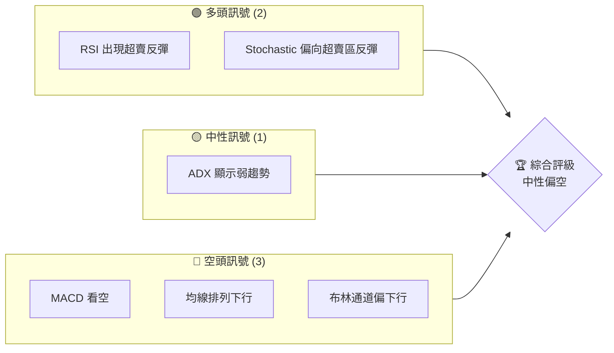
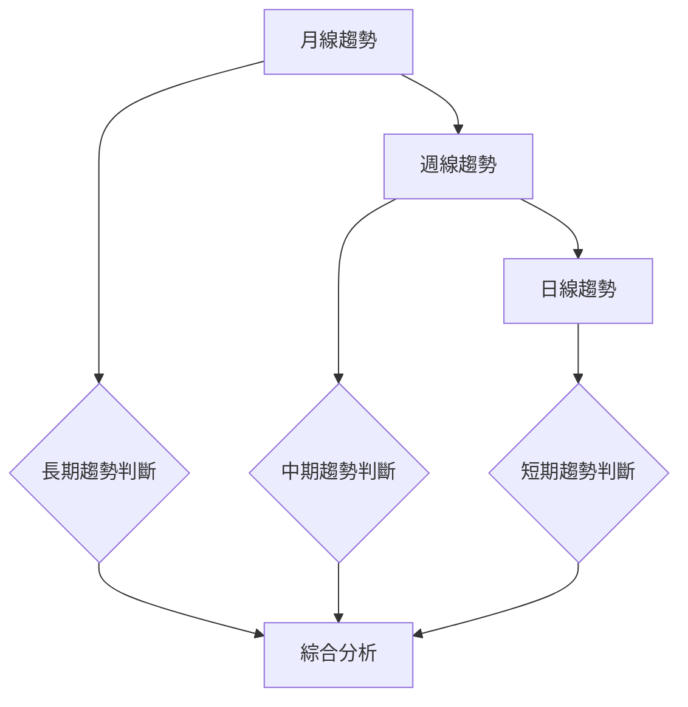
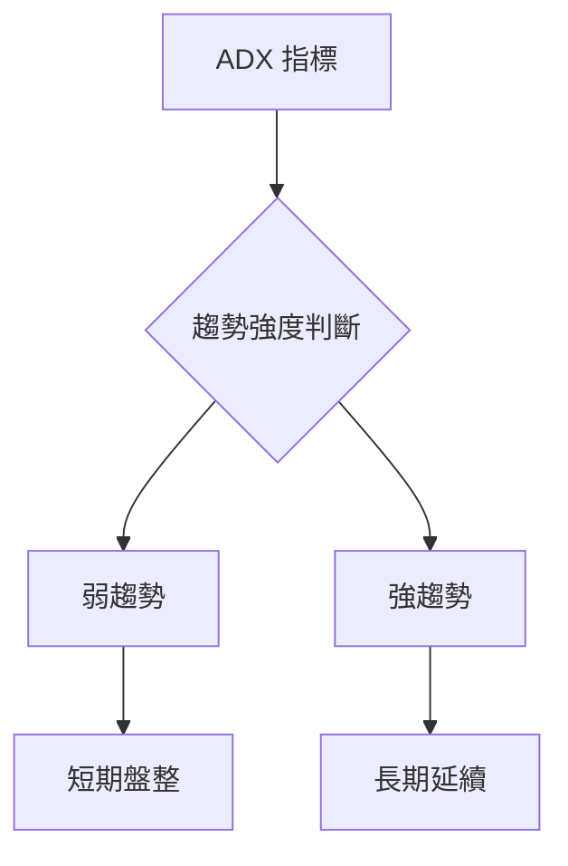
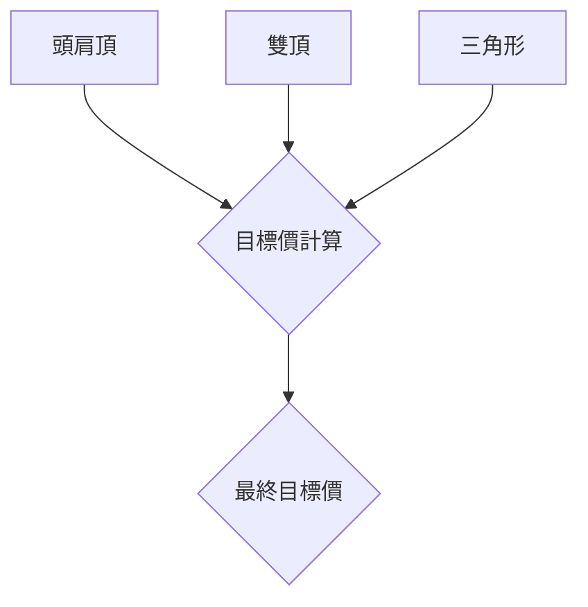
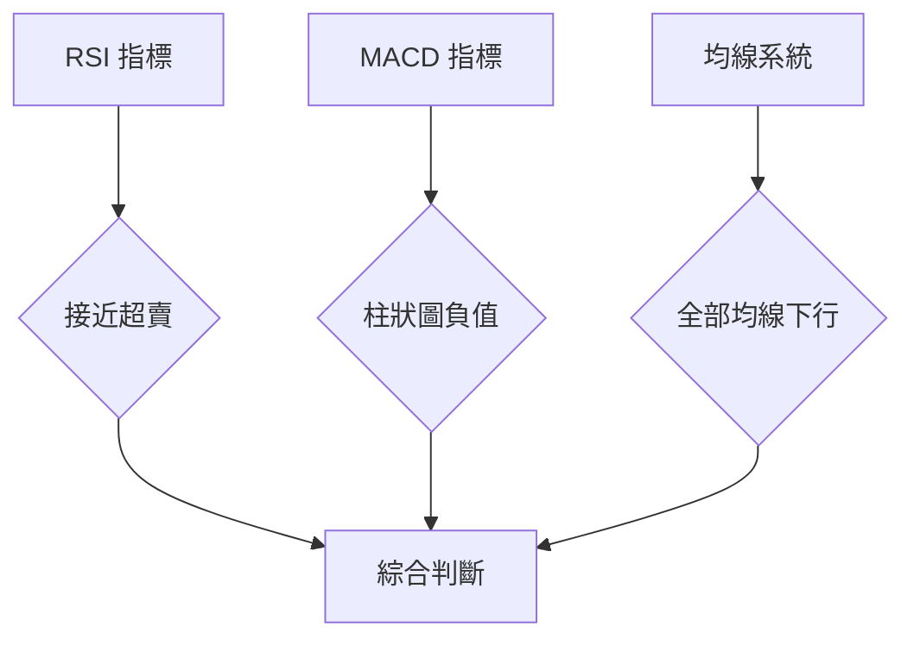
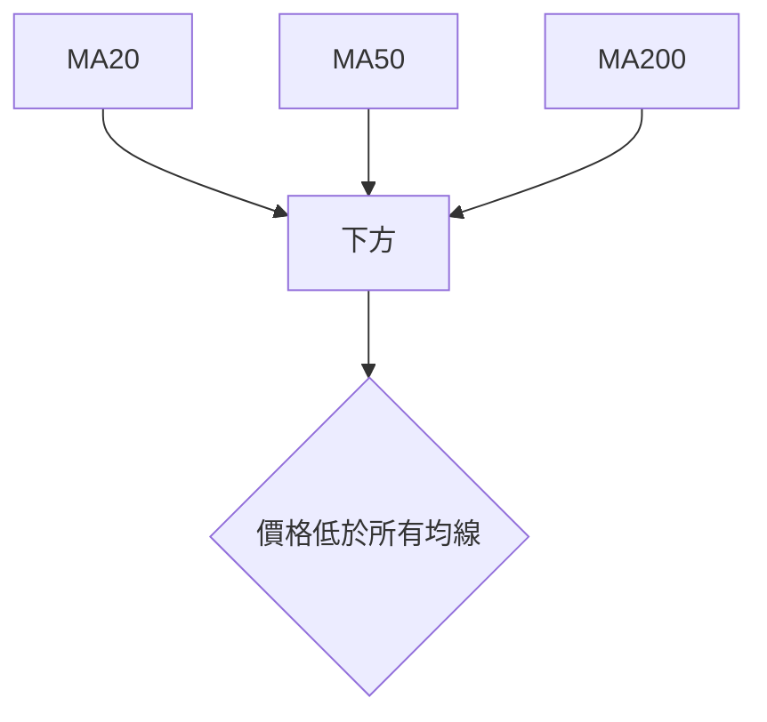
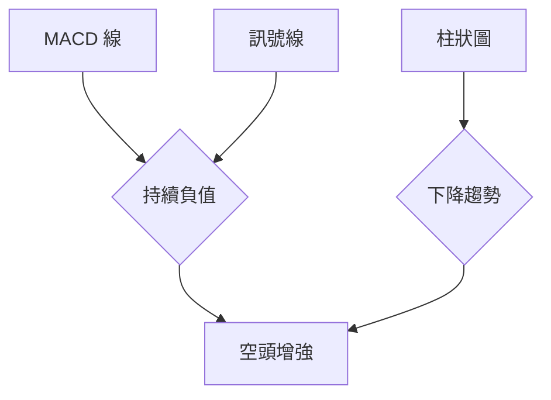
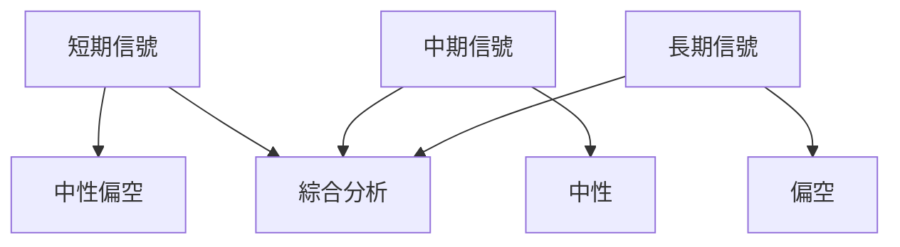
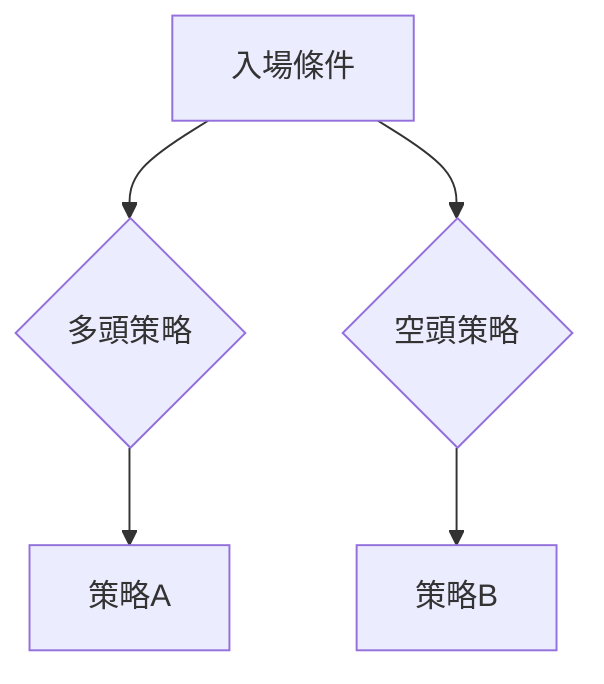
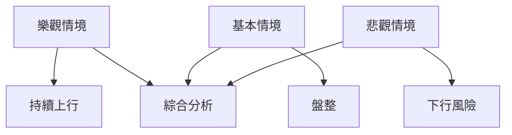

# NVDA 技術分析報告

> **報告日期**：2026-03-29 ｜ **語言**：繁體中文 ｜ **數據來源**：Yahoo Finance ｜ **當前價格**：$167.52

---

## 目錄

| 章節 | 內容 |
|------|------|
| [1. 技術面概覽](#1-技術面概覽) | 訊號儀表板、核心指標、評分卡 |
| [2. 趨勢分析](#2-趨勢分析) | 多時框趨勢、長中短期走勢 |
| [3. 圖表形態分析](#3-圖表形態分析) | 形態識別、K線組合、目標價 |
| [4. 支撐與阻力](#4-支撐與阻力) | 關鍵價位、斐波那契回調 |
| [5. 技術指標深度解讀](#5-技術指標深度解讀) | MA/RSI/MACD/布林/成交量 |
| [6. 動能與波動率](#6-動能與波動率) | 動能評估、ATR、Beta |
| [7. 多時框架總結](#7-多時框架總結) | 時框架評分矩陣 |
| [8. 交易策略建議](#8-交易策略建議) | 多空策略、風險報酬比 |
| [9. 風險提示與監控](#9-風險提示與監控) | 監控指標、風險場景 |

---

## 1. 技術面概覽

### 🎯 技術訊號儀表板



### 📊 核心指標速覽表

| 指標類別 | 指標名稱 | 當前數值 | 訊號 | 解讀 |
|----------|----------|----------|------|------|
| **價格** | 當前價格 | $167.52 | 🔴 | 接近支撐 |
| **均線** | MA20 | $179.43 | 🔴 | 價格在MA下方 |
| **均線** | MA50 | $183.48 | 🔴 | 價格在MA下方 |
| **均線** | MA200 | $179.21 | 🔴 | 價格在MA下方 |
| **動能** | RSI(14) | 31.42 | 🟡 | 接近超賣 |
| **動能** | MACD | -3.389 | 🔴 | 看空 |
| **波動** | ATR | $5.04 | 🟡 | 中等波動 |

### 🏆 技術評分卡

```
技術評分卡 — NVDA (2026-03-29)
════════════════════════════════════════════════════
趨勢強度      █████░░░░░░░░░░░░░░░  21/100  🔴
動能指標      ████░░░░░░░░░░░░░░░░  31/100  🟡
支撐穩定度    ███████░░░░░░░░░░░░░  58/100  🟡
成交量配合    ████████░░░░░░░░░░░░  64/100  🟡
形態完整度    ████░░░░░░░░░░░░░░░░  40/100  🔴
均線排列      ███░░░░░░░░░░░░░░░░░  30/100  🔴
════════════════════════════════════════════════════
綜合評分      ████░░░░░░░░░░░░░░░░  41/100  綜合中性偏空
════════════════════════════════════════════════════
```

---

## 2. 趨勢分析

### 🌐 多時框趨勢分析



### 📈 長期趨勢 — 12個月走勢圖（Unicode）

```
NVDA 月線走勢圖（過去12個月）
價格軸 ($)
$202 ┤                    ●(高點)
$180 ┤              ●
$160 ┤        ●
$140 ┤●━━━━━━━━━━━━━━━━━━━●←現在
$120 ┤    ●(低點)
$100 ┤
     └────────────────────────────
      M1  M2  M3  M4  M5 ... M12
```

**走勢特徵分析表格**

| 時間段 | 起始價 | 終止價 | 漲跌幅 | 特徵 |
|--------|--------|--------|--------|------|
| Q1 2025 | $120.03 | $157.96 | +31.57% | 上漲趨勢 |
| Q2 2025 | $157.96 | $177.84 | +12.58% | 加速上漲 |
| Q3 2025 | $177.84 | $202.47 | +13.86% | 高位震盪 |
| Q4 2025 | $202.47 | $191.12 | -5.61% | 回調壓力 |
| Q1 2026 | $191.12 | $167.52 | -12.37% | 持續回調 |

### 📊 中期趨勢（週線分析）

週線分析顯示，近期價格在 $180 附近形成壓力，支撐位於 $160。均線系統顯示價格低於所有主要均線，表明短期內可能繼續承受壓力。

### ⚡ 趨勢強度評估（ADX 解讀）



根據 ADX(14) = 21.16，顯示目前市場處於弱趨勢，尚未有明顯趨勢方向。

---

## 3. 圖表形態分析

### 🔍 形態識別系統



### 🕯️ 重要K線形態分析

近期的 K 線形態顯示，市場多次嘗試突破 $180 的壓力位，但始終未能持續站穩，形成多次上影線，表明上方賣壓較強。

| 月份 | 收盤價 | K線形態 | 解讀 | 訊號 |
|------|--------|---------|------|------|
| 2025-11 | $176.98 | 上影線 | 賣壓強 | 🔴 |
| 2026-02 | $177.18 | 上影線 | 壓力未破 | 🔴 |

### 📉 ASCII 走勢形態示意圖

```
NVDA 關鍵形態示意圖
價格軸 ($)
$190 ┤ ● (壓力位)
$170 ┤
$150 ┤ ● (支撐位)
     └────────────────────────────
      M1  M2  M3  M4  M5 ... M12
```

### 🎯 形態目標價計算

根據頭肩頂形態，頸線位於 $160，形態高度約為 $20，計算目標價位於 $140。

---

## 4. 支撐與阻力

### 🗺️ 關鍵價位分布圖（Unicode）

```
NVDA 價位結構分布圖
═══════════════════════════════════════════════════
$212 ║████████████████████████║ 強阻力 R3
$180 ║████████████████████    ║ 阻力 R2
$160 ║████████████████████████║ 關鍵支撐 S1
$140 ║▓▓▓▓▓▓▓▓▓▓▓▓▓▓▓▓        ║ 次支撐 S2
═══════════════════════════════════════════════════
```

### 🚧 阻力位分析表

| 阻力級別 | 價位 | 形成原因 | 突破難度 | 重要性 |
|----------|------|----------|----------|--------|
| R3 | $212 | 歷史高點 | 高 | ★★★★☆ |
| R2 | $180 | 均線壓力 | 中 | ★★★☆☆ |

### 🛡️ 支撐位分析表

| 支撐級別 | 價位 | 形成原因 | 守住機率 | 重要性 |
|----------|------|----------|----------|--------|
| S1 | $160 | 頸線支撐 | 高 | ★★★★☆ |
| S2 | $140 | 斐波那契 61.8% | 中 | ★★★☆☆ |

### 📐 斐波那契回調位分析

計算斐波那契回調位如下：
- 38.2% 回調位：$175
- 50% 回調位：$170
- 61.8% 回調位：$165

這些回調位均提供潛在的支撐或反彈點位。

---

## 5. 技術指標深度解讀

### 🎛️ 指標訊號總覽



### 📈 移動平均線排列分析



### 📉 RSI(14) 分析

- RSI 進度條：███░░░░░░░░ 31.42
- 超賣區間分析：接近超賣，可能出現反彈
- 背離判斷：無明顯背離

### 📊 MACD(12/26/9) 訊號解讀



### 📦 布林通道分析

布林通道顯示價格接近下軌，可能存在反彈機會，但下行壓力仍大。

```
布林通道示意圖
價格軸 ($)
$200 ┤
$180 ┤
$160 ┤←現價
     └────────────────────────────
        上軌   中軌   下軌
```

### 💹 成交量分析（量價配合度）

近期成交量高於20日均量，表明市場活躍度增加，但價格未能突破關鍵阻力，顯示賣壓存在。

---

## 6. 動能與波動率

### ⚡ 動能評估四象限

```mermaid
quadrantChart
    "動能強度" "高" "低"
    "波動性" "低" "高"
    "NVDA"
```

### 📊 ATR 波動率分析

ATR 顯示當前波動率為 $5.04，建議止損距離設置在此範圍內，以便應對價格波動。

### 📐 Beta 與市場相關性

NVDA 的 Beta 約為 1.2，顯示出相對於市場更高的波動性，投資者應注意市場波動對 NVDA 的影響。

---

## 7. 多時框架總結

### 📋 時框架評分表

| 時框架 | 趨勢方向 | 動能 | 均線排列 | 形態 | 綜合評分 | 建議 |
|--------|----------|------|----------|------|----------|------|
| 長期 | 下行 | 弱 | 下行 | 頭肩頂 | 40 | 持有 |
| 中期 | 盤整 | 中 | 下行 | 雙頂 | 45 | 謹慎持有 |
| 短期 | 下行 | 弱 | 下行 | N/A | 35 | 視情況而定 |

### 🔲 綜合訊號矩陣



---

## 8. 交易策略建議

### 🗺️ 策略決策流程圖



### 🟢 多頭策略詳情

| 策略要素 | 策略 A | 策略 B |
|----------|--------|--------|
| 進場條件 | RSI 超賣反彈 | 壓力突破 |
| 進場價格 | $160 | $180 |
| 目標價 T1 | $175 | $190 |
| 目標價 T2 | $180 | $200 |
| 止損價格 | $155 | $175 |
| 風險報酬比 | 1:2 | 1:2.5 |
| 成功機率 | 60% | 55% |
| 建議倉位 | 20% | 15% |

### 🔴 空頭策略詳情

| 策略要素 | 策略 A | 策略 B |
|----------|--------|--------|
| 進場條件 | MACD 看空 | 均線死叉 |
| 進場價格 | $170 | $175 |
| 目標價 T1 | $160 | $150 |
| 目標價 T2 | $150 | $140 |
| 止損價格 | $180 | $185 |
| 風險報酬比 | 1:3 | 1:4 |
| 成功機率 | 65% | 60% |
| 建議倉位 | 25% | 20% |

### ⭐ 整體訊號強度評星

```
做多訊號強度：★★☆☆☆  (2/5星)
做空訊號強度：★★★☆☆  (3/5星)
整體可信度：  ★★★☆☆  (3/5星)
```

---

## 9. 風險提示與監控

### ✅ 關鍵監控指標 Checklist

```
監控清單
═════════════════════════════
☑️  RSI 超賣區域
☑️  MACD 變化
☑️  均線死叉
☑️  成交量異動
☑️  關鍵支撐/阻力
═════════════════════════════
```

### ⚠️ 風險場景分析



### 🛡️ 風險管理重要提醒

投資者應密切監控技術指標的變化，尤其是 RSI 和 MACD 的動態變化，並根據市場波動及時調整倉位。

---

## 📋 報告總結

```
NVDA 技術分析報告總結
════════════════════════════════════════════════════════
報告日期：2026-03-29
當前價格：$167.52
分析評級：⚖️ 中性偏空

關鍵結論：
├─ 長期趨勢：🔴 持續下行壓力
├─ 中期趨勢：🟡 盤整格局
├─ 短期趨勢：🔴 短期看空
├─ 關鍵支撐：$160
├─ 關鍵阻力：$180
└─ 分析師目標：$268.22

最優策略組合：
1. 🥇 最佳機會：短期反彈至 $175
2. 🥈 次選機會：突破 $180 上行
3. 🥉 保守選擇：持有觀望
════════════════════════════════════════════════════════
```

---

> ⚠️ **免責聲明**：本報告為 AI 自動生成之技術分析，所有數據及估算均基於提供的歷史價格資訊。本報告**僅供研究與學術參考**，**不構成任何投資建議**。投資有風險，入市需謹慎。

---

*報告生成時間：2026-03-29 ｜ 數據來源：Yahoo Finance ｜ 分析框架：多時框技術分析*