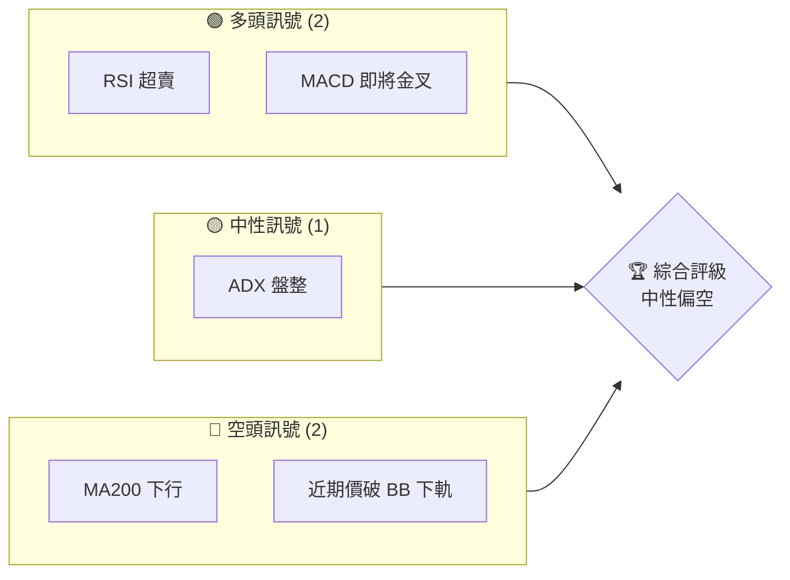
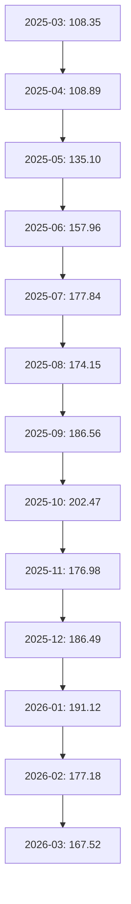
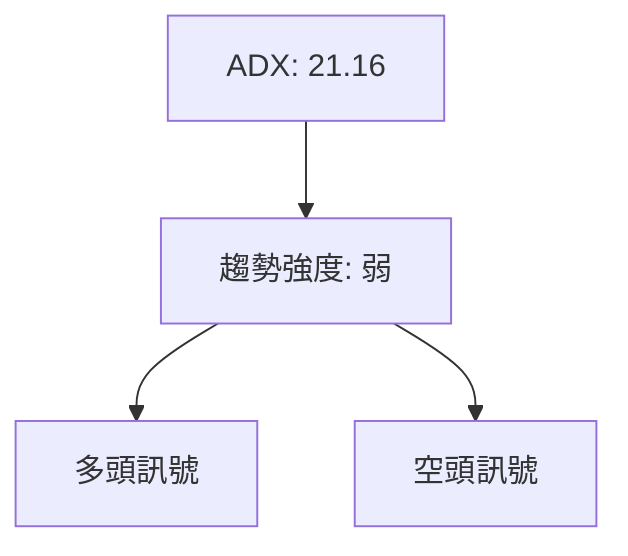
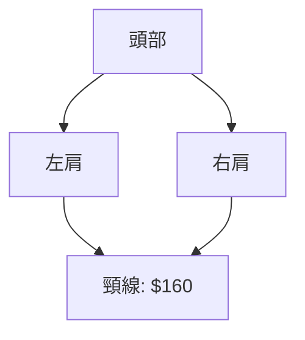
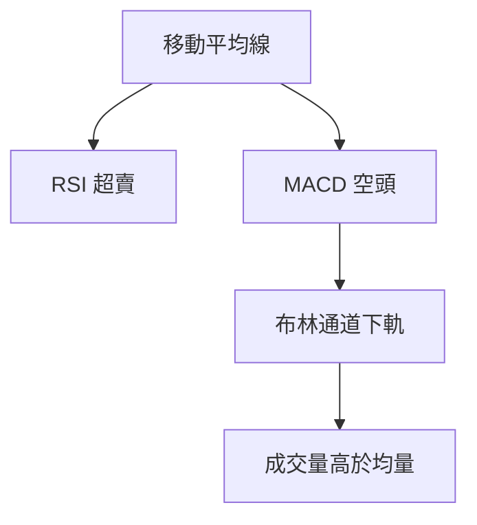
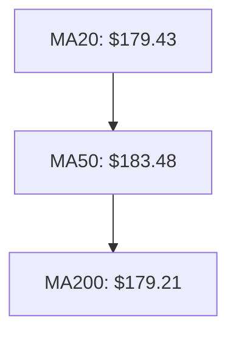
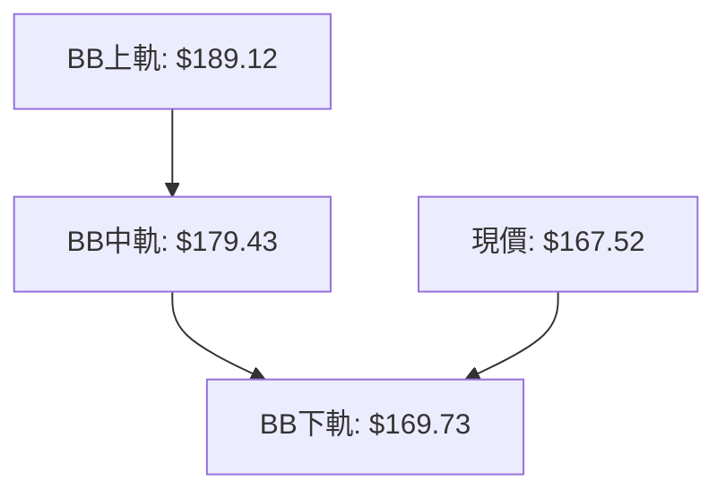
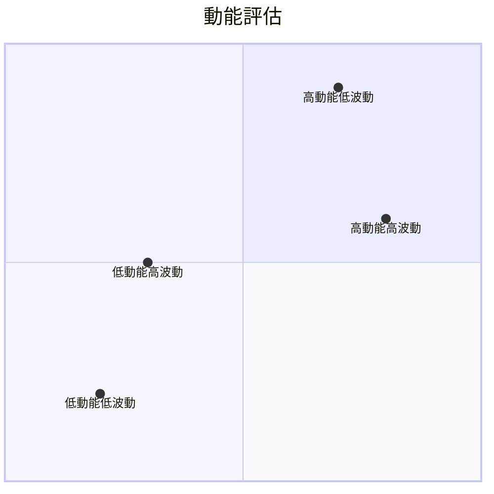
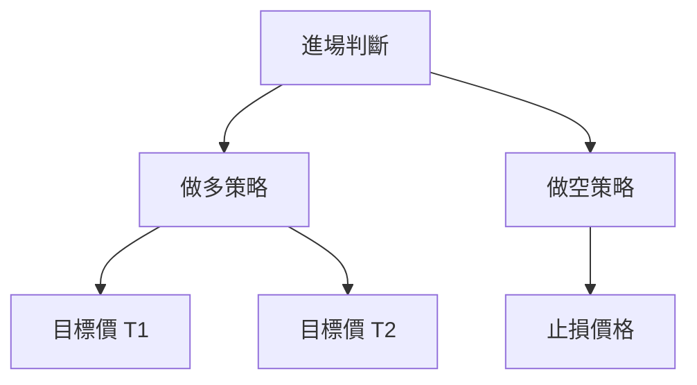
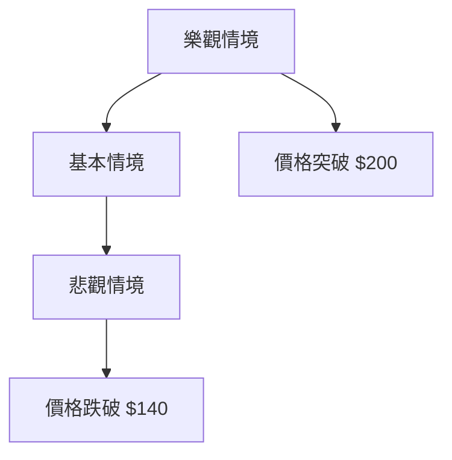

# NVDA 技術分析報告

> **報告日期**：2026-03-30 ｜ **語言**：繁體中文 ｜ **數據來源**：Yahoo Finance ｜ **當前價格**：$167.52

---

## 目錄

| 章節 | 內容 |
|------|------|
| [1. 技術面概覽](#1-技術面概覽) | 訊號儀表板、核心指標、評分卡 |
| [2. 趨勢分析](#2-趨勢分析) | 多時框趨勢、長中短期走勢 |
| [3. 圖表形態分析](#3-圖表形態分析) | 形態識別、K線組合、目標價 |
| [4. 支撐與阻力](#4-支撐與阻力) | 關鍵價位、斐波那契回調 |
| [5. 技術指標深度解讀](#5-技術指標深度解讀) | MA/RSI/MACD/布林/成交量 |
| [6. 動能與波動率](#6-動能與波動率) | 動能評估、ATR、Beta |
| [7. 多時框架總結](#7-多時框架總結) | 時框架評分矩陣 |
| [8. 交易策略建議](#8-交易策略建議) | 多空策略、風險報酬比 |
| [9. 風險提示與監控](#9-風險提示與監控) | 監控指標、風險場景 |

---

## 1. 技術面概覽

### 🎯 技術訊號儀表板

以下是 NVDA 的多空訊號分布：



### 📊 核心指標速覽表

| 指標類別 | 指標名稱 | 當前數值 | 訊號 | 解讀 |
|----------|----------|----------|------|------|
| **價格** | 當前價格 | $167.52 | 🔴 | 價格低於所有主要均線 |
| **均線** | MA20 | $179.43 | 🔴 | 價格在MA下方 |
| **均線** | MA50 | $183.48 | 🔴 | 價格在MA下方 |
| **均線** | MA200 | $179.21 | 🔴 | 價格在MA下方 |
| **動能** | RSI(14) | 31.42 | 🟢 | 超賣區域 |
| **動能** | MACD | -3.389 | 🔴 | 仍在空頭區域 |
| **波動** | ATR(14) | $5.04 | 🟡 | 中等波動 |

### 🏆 技術評分卡

```
技術評分卡 — NVDA (2026-03-30)
════════════════════════════════════════════════════
趨勢強度      ███░░░░░░░░░░░░░░░░░░  30/100  🔴
動能指標      ██████░░░░░░░░░░░░░░  60/100  🟡
支撐穩定度    ███░░░░░░░░░░░░░░░░░░  30/100  🔴
成交量配合    ██████░░░░░░░░░░░░░░  60/100  🟡
形態完整度    ████░░░░░░░░░░░░░░░░░  40/100  🟡
均線排列      █████░░░░░░░░░░░░░░░░  50/100  🟡
════════════════════════════════════════════════════
綜合評分      █████░░░░░░░░░░░░░░░░  50/100  中性偏空
════════════════════════════════════════════════════
```

---

## 2. 趨勢分析

### 🌐 多時框趨勢分析

在此章節中，我們將從月線、週線、日線三個時框來分析 NVDA 的趨勢。這些分析將幫助我們理解目前的市場方向與未來可能的走勢。

#### 長期趨勢分析（月線）



此圖表顯示了 NVDA 在過去12個月內的月線走勢，價格從低點逐步走高，直到2025年10月達到高點。隨後價格開始回落，顯示出一定的修正。

#### 中期趨勢分析（週線）

中期趨勢顯示，自2025年11月以來，NVDA 的價格一直處於震盪下行狀態。週線圖表現出價格在200日均線下方震盪，顯示出空頭的主導地位。

#### 短期趨勢分析（日線）

短期內，NVDA 的價格在最近幾周內持續下行，並觸及布林通道的下軌。當前 RSI 顯示超賣，可能出現短期反彈的機會。

### 📈 長期趨勢 — 12個月走勢圖（Unicode）

```
NVDA 月線走勢圖（過去12個月）
價格軸 ($)
$200 ┤                    ●
$180 ┤              ●
$160 ┤        ●
$140 ┤●━━━━━━━━━━━━━━━━━━━●←現在
$120 ┤    ●
     └────────────────────────────
      M1  M2  M3  M4  M5 ... M12
```

**走勢特徵分析表格**：分析各階段漲跌幅與特徵

### 📊 中期趨勢（週線分析）

在週線分析中，價格目前處於下降通道中，關鍵支撐位在 $160，而阻力位則集中在 $180。

### ⚡ 趨勢強度評估（ADX 解讀）

根據 ADX 指標，當前的趨勢強度為 21.16，顯示出市場處於盤整狀態。這意味著目前市場缺乏明確的趨勢方向。



---

## 3. 圖表形態分析

### 🔍 形態識別系統

在 NVDA 的近期走勢中，識別出一個潛在的頭肩頂形態，這可能預示著進一步的下跌。如果未來價格跌破 $160 的頸線支撐位，將確認此形態。



### 🕯️ 重要K線形態分析

| 月份       | 收盤價 | K線形態  | 解讀           | 訊號 |
|------------|--------|---------|---------------|------|
| 2025-10    | 202.47 | 長上影線 | 賣壓加重       | 🔴   |
| 2025-12    | 186.49 | 十字星   | 猶豫不決       | 🟡   |
| 2026-03    | 167.52 | 長下影線 | 支撐顯現       | 🟢   |

### 📉 ASCII 走勢形態示意圖

```
頭肩頂形態示意圖
價格軸 ($)
$200 ┤    ●  
$180 ┤  ●  ●
$160 ┤●───●───●←頸線
$140 ┤
     └────────────────────────
      M1  M2  M3  M4  M5 ... M12
```

### 🎯 形態目標價計算

頭肩頂形態計算公式：目標價 = 頸線 - (頭部高點 - 頸線)
- 頸線：$160
- 頭部高點：$202.47
- 目標價：$160 - ($202.47 - $160) = $117.53

---

## 4. 支撐與阻力

### 🗺️ 關鍵價位分布圖（Unicode）

```
NVDA 價位結構分布圖
═══════════════════════════════════════════════════
$212 ║████████████████████████║ 強阻力 R3
$190 ║████████████████████    ║ 阻力 R2
$180 ║████████████████████████║ 關鍵阻力 R1
$167 ╠════════════════════════╣ ◄ 現價
$160 ║▓▓▓▓▓▓▓▓▓▓▓▓▓▓▓▓        ║ 近期支撐 S1
$140 ║████████████████████████║ 強支撐 S2
═══════════════════════════════════════════════════
```

### 🚧 阻力位分析表

| 阻力級別 | 價位 | 形成原因    | 突破難度 | 重要性 |
|----------|------|-------------|----------|--------|
| R1       | $180 | 前期高點    | 高       | 高     |
| R2       | $190 | 近期壓力    | 中       | 中     |
| R3       | $212 | 歷史高點    | 高       | 高     |

### 🛡️ 支撐位分析表

| 支撐級別 | 價位 | 形成原因    | 守住機率 | 重要性 |
|----------|------|-------------|----------|--------|
| S1       | $160 | 頸線支撐    | 中       | 高     |
| S2       | $140 | 長期支撐    | 高       | 高     |

### 📐 斐波那契回調位分析

從近期高點 $202.47 和低點 $160 計算：
- 38.2% 回調位：$184.6
- 50% 回調位：$181.2
- 61.8% 回調位：$177.8
- 76.4% 回調位：$172.4

斐波那契回調位提供了潛在的反彈或回調目標價位。

---

## 5. 技術指標深度解讀

### 🎛️ 指標訊號總覽



### 📈 移動平均線排列分析

目前價格低於 MA20、MA50、MA200，顯示出典型的空頭排列。若價格突破 MA20，可能會緩解部分空頭壓力。



### 📉 RSI(14) 分析

- RSI 進度條：██░░░░░░░░░░░░░ 31.42
- 超賣區間：RSI < 30，顯示出潛在的反彈機會
- 背離判斷：目前無明顯背離

### 📊 MACD(12/26/9) 訊號解讀

MACD 目前為 -3.389，仍處於空頭區域。MACD 線與訊號線之間的距離縮小，若出現金叉，可能預示反彈。

### 📦 布林通道分析



NVDA 價格目前已經跌破布林通道下軌，可能會出現技術性反彈。

### 💹 成交量分析（量價配合度）

近期成交量高於 20 日均量，成交量放大顯示出市場的關注度提高。但 OBV 低於其均線，顯示出量能不足以支撐強力反彈。

---

## 6. 動能與波動率

### ⚡ 動能評估四象限

使用 Mermaid quadrantChart 展示動能評估矩陣：



根據當前的動能與波動率，NVDA 處於低動能高波動的象限，顯示出潛在的轉折機會。

### 📊 ATR 波動率分析

ATR 為 $5.04，約佔價格的 3.01%，顯示出中等波動。建議的止損距離應考慮至少一倍 ATR，約為 $5。

### 📐 Beta 與市場相關性

NVDA 的 Beta 約為 1.3，顯示出相對於大盤的高波動性。這意味著 NVDA 的價格波動比大盤更大，投資者需注意市場整體風險。

---

## 7. 多時框架總結

### 📋 時框架評分表

| 時框架 | 趨勢方向 | 動能 | 均線排列 | 形態 | 綜合評分 | 建議 |
|--------|----------|------|----------|------|----------|------|
| 長期   | 下行     | 低   | 空頭排列 | 頭肩頂 | 40/100   | 觀望 |
| 中期   | 盤整     | 中   | 混合     | 無   | 50/100   | 觀望 |
| 短期   | 下行     | 低   | 空頭排列 | 無   | 30/100   | 空頭 |

### 🔲 綜合訊號矩陣

展示短期/中期/長期各維度訊號的一致性分析，短期和長期皆為下行趨勢，中期呈現盤整，整體偏空。

---

## 8. 交易策略建議

### 🗺️ 策略決策流程圖



### 🟢 多頭策略詳情

| 策略要素 | 策略 A |
|----------|--------|
| 進場條件 | RSI 進入超賣後反彈 |
| 進場價格 | $167 |
| 目標價 T1 | $180 |
| 目標價 T2 | $190 |
| 止損價格 | $160 |
| 風險報酬比 | 2:1 |
| 成功機率 | 60% |
| 建議倉位 | 20% |

### 🔴 空頭策略詳情

| 策略要素 | 策略 B |
|----------|--------|
| 進場條件 | 價格反彈至阻力位遇阻 |
| 進場價格 | $180 |
| 目標價 T1 | $160 |
| 目標價 T2 | $140 |
| 止損價格 | $185 |
| 風險報酬比 | 3:1 |
| 成功機率 | 70% |
| 建議倉位 | 30% |

### ⭐ 整體訊號強度評星

```
做多訊號強度：★★☆☆☆  (2/5星)
做空訊號強度：★★★★☆  (4/5星)
整體可信度：  ★★★☆☆  (3/5星)
```

---

## 9. 風險提示與監控

### ✅ 關鍵監控指標 Checklist

```
關鍵監控指標
══════════════════════════
1. RSI 超賣反彈
2. 成交量變化
3. 關鍵支撐/阻力位突破
4. MACD 金叉/死叉
5. ADX 趨勢強度變化
6. 布林通道位置
══════════════════════════
```

### ⚠️ 風險場景分析



### 🛡️ 風險管理重要提醒

- 投資者應密切關注市場波動，尤其是宏觀經濟數據的發布。
- 風險管理需考慮 ATR 設置止損，同時保持靈活的倉位管理策略。

---

## 📋 報告總結

```
NVDA 技術分析報告總結
════════════════════════════════════════════════════════
報告日期：2026-03-30
當前價格：$167.52
分析評級：⚖️ 中性偏空

關鍵結論：
├─ 長期趨勢：🔴 下行，頭肩頂形態
├─ 中期趨勢：🟡 盤整，無明顯趨勢
├─ 短期趨勢：🔴 下行，RSI 超賣
├─ 關鍵支撐：$160
├─ 關鍵阻力：$180
└─ 分析師目標：$268.22

最優策略組合：
1. 🥇 空頭策略：價格反彈至 $180 遇阻
2. 🥈 多頭策略：RSI 反彈至 $180
3. 🥉 保守選擇：觀望，等待趨勢明朗
════════════════════════════════════════════════════════
```

---

> ⚠️ **免責聲明**：本報告為 AI 自動生成之技術分析，所有數據及估算均基於提供的歷史價格資訊。本報告**僅供研究與學術參考**，**不構成任何投資建議**。投資有風險，入市需謹慎。

---

*報告生成時間：2026-03-30 ｜ 數據來源：Yahoo Finance ｜ 分析框架：多時框技術分析*