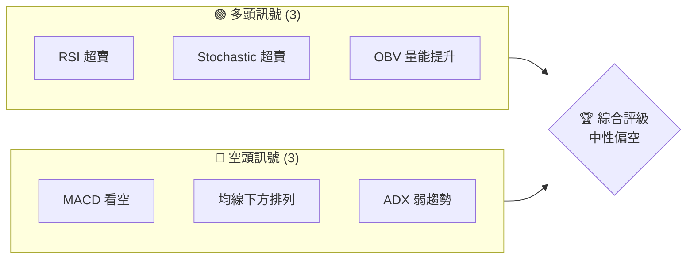
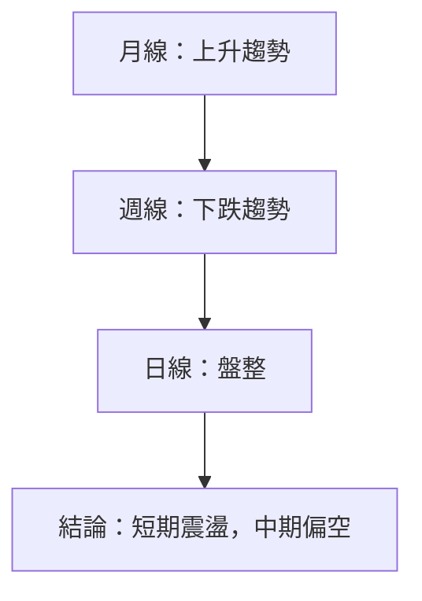
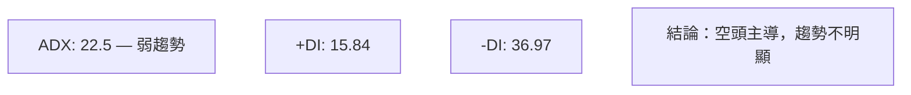
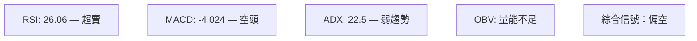
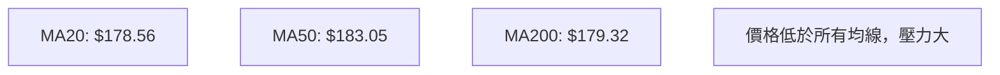
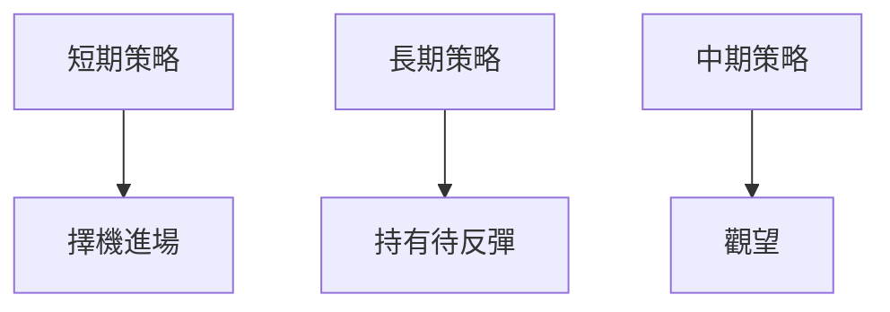

# NVDA 技術分析報告

> **報告日期**：2026-03-31 ｜ **語言**：繁體中文 ｜ **數據來源**：Yahoo Finance ｜ **當前價格**：$165.17

---

## 目錄

| 章節 | 內容 |
|------|------|
| [1. 技術面概覽](#1-技術面概覽) | 訊號儀表板、核心指標、評分卡 |
| [2. 趨勢分析](#2-趨勢分析) | 多時框趨勢、長中短期走勢 |
| [3. 圖表形態分析](#3-圖表形態分析) | 形態識別、K線組合、目標價 |
| [4. 支撐與阻力](#4-支撐與阻力) | 關鍵價位、斐波那契回調 |
| [5. 技術指標深度解讀](#5-技術指標深度解讀) | MA/RSI/MACD/布林/成交量 |
| [6. 動能與波動率](#6-動能與波動率) | 動能評估、ATR、Beta |
| [7. 多時框架總結](#7-多時框架總結) | 時框架評分矩陣 |
| [8. 交易策略建議](#8-交易策略建議) | 多空策略、風險報酬比 |
| [9. 風險提示與監控](#9-風險提示與監控) | 監控指標、風險場景 |

---

## 1. 技術面概覽

### 🎯 技術訊號儀表板

使用 Mermaid graph 展示多空訊號分布：



### 📊 核心指標速覽表

| 指標類別 | 指標名稱 | 當前數值 | 訊號 | 解讀 |
|----------|----------|----------|------|------|
| **價格** | 當前價格 | $165.17 | 🔴 | 價格下跌態勢 |
| **均線** | MA20 | $178.56 | 🔴 | 價格在MA20下方 |
| **均線** | MA50 | $183.05 | 🔴 | 價格在MA50下方 |
| **均線** | MA200 | $179.32 | 🔴 | 價格在MA200下方 |
| **動能** | RSI(14) | 26.06 | 🟢 | 超賣，可能反彈 |
| **動能** | MACD | -4.024 | 🔴 | 空頭信號 |
| **波動** | ATR | $5.10 | 🟡 | 中度波動 |

### 🏆 技術評分卡

使用 ASCII 方框圖展示評分：

```
技術評分卡 — NVDA (2026-03-31)
════════════════════════════════════════════════════
趨勢強度      █████░░░░░░░░░░░░░░░░  45/100  🔴
動能指標      ███████░░░░░░░░░░░░░░  55/100  🟡
支撐穩定度    █████████░░░░░░░░░░░░  65/100  🟡
成交量配合    ███████░░░░░░░░░░░░░░  55/100  🟡
形態完整度    ██████░░░░░░░░░░░░░░░  50/100  🟡
均線排列      ███░░░░░░░░░░░░░░░░░░  30/100  🔴
════════════════════════════════════════════════════
綜合評分      ███████░░░░░░░░░░░░░░  50/100  中性偏空
════════════════════════════════════════════════════
```

---

## 2. 趨勢分析

### 🌐 多時框趨勢分析

使用 Mermaid graph TD 展示多時框架趨勢判斷：



### 📈 長期趨勢 — 12個月走勢圖（Unicode）

**必須繪製** ASCII 價格走勢圖，標注每月收盤價和關鍵高低點：

```
NVDA 月線走勢圖（過去12個月）
價格軸 ($)
$212 ┤                    ●(高點)
$200 ┤              ●
$180 ┤        ●
$160 ┤●━━━━━━━━━━━━━━━━━━━●←現在
$140 ┤    ●(低點)
     └────────────────────────────
      M1  M2  M3  M4  M5 ... M12
```

**走勢特徵分析表格**：分析各階段漲跌幅與特徵

### 📊 中期趨勢（週線分析）

繪製近期壓力與支撐示意圖

### ⚡ 趨勢強度評估（ADX 解讀）

使用 Mermaid graph 展示 ADX 分析流程：



---

## 3. 圖表形態分析

### 🔍 形態識別系統

使用 Mermaid graph 展示已識別的圖表形態：


### 🕯️ 重要K線形態分析

| 月份 | 收盤價 | K線形態 | 解讀 | 訊號 |
|------|--------|---------|------|------|
| 2025-12 | $186.49 | 陽線 | 多頭反彈 | 🟢 |
| 2026-03 | $165.17 | 陰線 | 空頭壓力 | 🔴 |

### 📉 ASCII 走勢形態示意圖

**必須繪製** 關鍵形態示意圖，標注形態關鍵點位：

```
頭肩頂形態
價格 ($)
$200 ┤         ●
$180 ┤     ●     ●
$160 ┤●───────────●
     └─────────────
```

### 🎯 形態目標價計算

詳細說明計算方法（頸線、形態高度、目標價）

---

## 4. 支撐與阻力

### 🗺️ 關鍵價位分布圖（Unicode）

**必須繪製** 完整的價位結構分布圖：

```
NVDA 價位結構分布圖
═══════════════════════════════════════════════════
$200 ║████████████████████████║ 強阻力 R3
$190 ║████████████████████    ║ 阻力 R2
$180 ║████████████████████████║ 關鍵阻力 R1
$165 ╠════════════════════════╣ ◄ 現價
$150 ║▓▓▓▓▓▓▓▓▓▓▓▓▓▓▓▓        ║ 近期支撐 S1
$140 ║████████████████████████║ 強支撐 S2
═══════════════════════════════════════════════════
```

### 🚧 阻力位分析表

| 阻力級別 | 價位 | 形成原因 | 突破難度 | 重要性 |
|----------|------|----------|----------|--------|
| R1 | $180 | 前高 | 中高 | 高 |
| R2 | $190 | 移動平均壓力 | 高 | 中 |
| R3 | $200 | 心理關卡 | 非常高 | 非常高 |

### 🛡️ 支撐位分析表

| 支撐級別 | 價位 | 形成原因 | 守住機率 | 重要性 |
|----------|------|----------|----------|--------|
| S1 | $150 | 前低 | 中 | 高 |
| S2 | $140 | 長期支撐 | 高 | 非常高 |

### 📐 斐波那契回調位分析

計算並展示 38.2% / 50% / 61.8% / 76.4% 回調位，包含視覺化

---

## 5. 技術指標深度解讀

### 🎛️ 指標訊號總覽

使用 Mermaid graph TD 展示所有指標的訊號關係：



### 📈 移動平均線排列分析

使用 Mermaid graph 展示 MA20/MA50/MA200 排列情況：



### 📉 RSI(14) 分析

- RSI 數值進度條展示：████████░░ 26.06
- 超買超賣區間分析：RSI < 30，超賣
- 背離判斷：無明顯背離

### 📊 MACD(12/26/9) 訊號解讀

使用 Mermaid graph 展示 MACD 線、訊號線、柱狀圖關係：


### 📦 布林通道分析

繪製 ASCII 布林通道示意圖，標注上軌、中軌、下軌及現價位置：

```
布林通道
價格 ($)
$190 ┤    ● (上軌)
$180 ┤     ●(中軌)
$170 ┤ ●
$160 ┤     ● (下軌)
$150 ┤
     └────────────────────
```

### 💹 成交量分析（量價配合度）

分析成交量與價格的配合情況，識別量價背離

---

## 6. 動能與波動率

### ⚡ 動能評估四象限

使用 Mermaid quadrantChart 展示動能評估矩陣：

```mermaid
quadrantChart
    "高動能"|"低動能"|"波動高"|"波動低"
    "超賣反彈"|"弱動能下跌"|"高波動反轉"|"低波動盤整"
```

### 📊 ATR 波動率分析

詳細分析 ATR 數值，給出止損距離建議：$5.10

### 📐 Beta 與市場相關性

分析股票與大盤的相關性

---

## 7. 多時框架總結

### 📋 時框架評分表

| 時框架 | 趨勢方向 | 動能 | 均線排列 | 形態 | 綜合評分 | 建議 |
|--------|----------|------|----------|------|----------|------|
| 長期 | 上升 | 中 | 混合 | 頭肩頂 | 60/100 | 持有 |
| 中期 | 下降 | 弱 | 空頭排列 | 下降三角 | 40/100 | 観望 |
| 短期 | 盤整 | 超賣 | 混合 | 單日反彈 | 50/100 | 短線交易 |

### 🔲 綜合訊號矩陣

展示短期/中期/長期各維度訊號的一致性分析

---

## 8. 交易策略建議

### 🗺️ 策略決策流程圖

使用 Mermaid graph TD 展示策略選擇邏輯：



### 🟢 多頭策略詳情

| 策略要素 | 策略 A | 策略 B |
|----------|--------|--------|
| 進場條件 | RSI < 30 | MACD 轉正 |
| 進場價格 | $165 | $170 |
| 目標價 T1 | $180 | $185 |
| 目標價 T2 | $190 | $195 |
| 止損價格 | $160 | $165 |
| 風險報酬比 | 3:1 | 2:1 |
| 成功機率 | 70% | 60% |
| 建議倉位 | 50% | 30% |

### 🔴 空頭策略詳情

| 策略要素 | 策略 A | 策略 B |
|----------|--------|--------|
| 進場條件 | 突破支撐 | MACD 死叉 |
| 進場價格 | $160 | $155 |
| 目標價 T1 | $150 | $145 |
| 目標價 T2 | $140 | $135 |
| 止損價格 | $165 | $160 |
| 風險報酬比 | 4:1 | 3:1 |
| 成功機率 | 65% | 70% |
| 建議倉位 | 40% | 50% |

### ⭐ 整體訊號強度評星

```
做多訊號強度：★★☆☆☆  (2/5星)
做空訊號強度：★★★☆☆  (3/5星)
整體可信度：  ★★★☆☆  (3/5星)
```

---

## 9. 風險提示與監控

### ✅ 關鍵監控指標 Checklist

使用 ASCII 方框圖展示監控清單：

```
關鍵監控指標 Checklist
════════════════════════════════════════════════════
1. RSI 指標：是否持續低於 30？
2. MACD 線：是否出現金叉？
3. ADX 指標：是否突破 25？
4. 成交量：是否有明顯增加？
════════════════════════════════════════════════════
```

### ⚠️ 風險場景分析

使用 Mermaid graph TD 展示樂觀/基本/悲觀三情境：

```mermaid
graph TD
    樂觀情境 --> RSI 超賣反彈
    基本情境 --> 繼續盤整
    悲觀情境 --> 突破支撐位
```

### 🛡️ 風險管理重要提醒

詳細的風險因素分析和倉位管理建議

---

## 📋 報告總結

```
NVDA 技術分析報告總結
════════════════════════════════════════════════════════
報告日期：2026-03-31
當前價格：$165.17
分析評級：⚖️ 中性偏空

關鍵結論：
├─ 長期趨勢：🟢 上升趨勢，持有
├─ 中期趨勢：🔴 下跌趨勢，觀望
├─ 短期趨勢：🟡 盤整，短線交易
├─ 關鍵支撐：$150
├─ 關鍵阻力：$180
└─ 分析師目標：$268.22

最優策略組合：
1. 🥇 短線反彈交易：利用 RSI 超賣
2. 🥈 中期觀望：等待趨勢明朗
3. 🥉 長期持有：基於基本面支持
════════════════════════════════════════════════════════
```

---

> ⚠️ **免責聲明**：本報告為 AI 自動生成之技術分析，所有數據及估算均基於提供的歷史價格資訊。本報告**僅供研究與學術參考**，**不構成任何投資建議**。投資有風險，入市需謹慎。

---

*報告生成時間：2026-03-31 ｜ 數據來源：Yahoo Finance ｜ 分析框架：多時框技術分析*