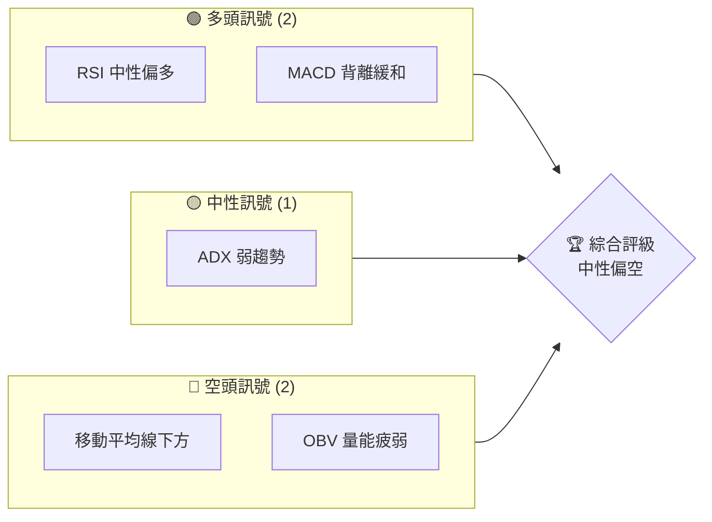
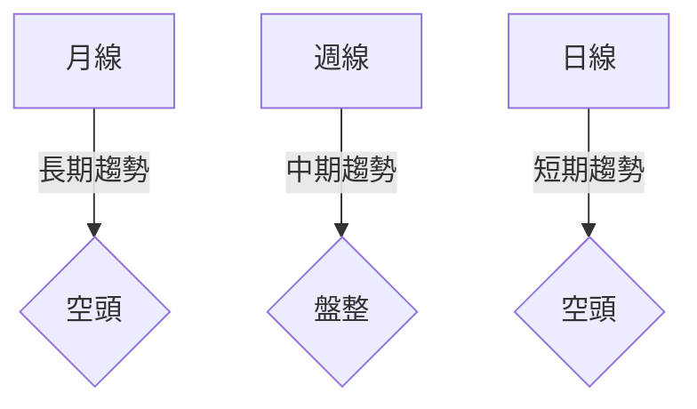
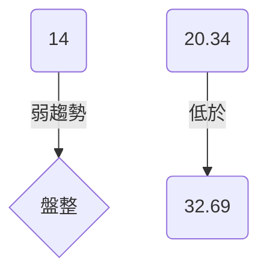
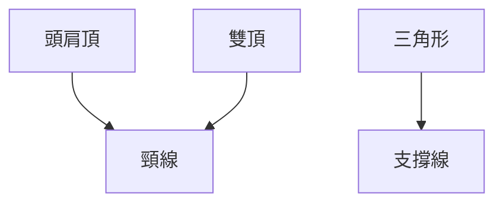
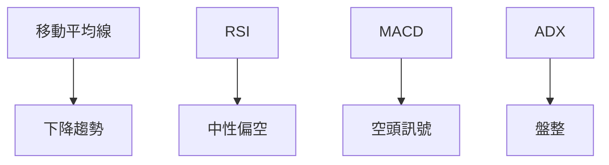
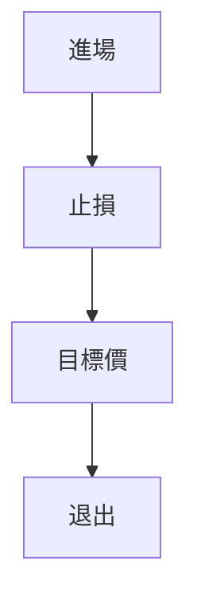

# NVDA 技術分析報告

> **報告日期**：2026-04-01 ｜ **語言**：繁體中文 ｜ **數據來源**：Yahoo Finance ｜ **當前價格**：$174.40

---

## 目錄

| 章節 | 內容 |
|------|------|
| [1. 技術面概覽](#1-技術面概覽) | 訊號儀表板、核心指標、評分卡 |
| [2. 趨勢分析](#2-趨勢分析) | 多時框趨勢、長中短期走勢 |
| [3. 圖表形態分析](#3-圖表形態分析) | 形態識別、K線組合、目標價 |
| [4. 支撐與阻力](#4-支撐與阻力) | 關鍵價位、斐波那契回調 |
| [5. 技術指標深度解讀](#5-技術指標深度解讀) | MA/RSI/MACD/布林/成交量 |
| [6. 動能與波動率](#6-動能與波動率) | 動能評估、ATR、Beta |
| [7. 多時框架總結](#7-多時框架總結) | 時框架評分矩陣 |
| [8. 交易策略建議](#8-交易策略建議) | 多空策略、風險報酬比 |
| [9. 風險提示與監控](#9-風險提示與監控) | 監控指標、風險場景 |

---

## 1. 技術面概覽

### 🎯 技術訊號儀表板



### 📊 核心指標速覽表

| 指標類別 | 指標名稱 | 當前數值 | 訊號 | 解讀 |
|----------|----------|----------|------|------|
| **價格** | 當前價格 | $174.40 | 🔴 | 價格低於均線 |
| **均線** | MA20 | $178.28 | 🔴 | 價格在MA20下方 |
| **均線** | MA50 | $182.81 | 🔴 | 價格在MA50下方 |
| **均線** | MA200 | $179.47 | 🔴 | 價格在MA200下方 |
| **動能** | RSI(14) | 38.10 | 🟡 | 接近超賣區 |
| **動能** | MACD | -3.739 | 🔴 | 空頭背離 |
| **波動** | ATR | $5.54 | 🟢 | 波動適中 |

### 🏆 技術評分卡

```
技術評分卡 — NVDA (2026-04-01)
════════════════════════════════════════════════════
趨勢強度      ███░░░░░░░░░░░░░░░░░  30/100  🔴
動能指標      █████░░░░░░░░░░░░░░  40/100  🟡
支撐穩定度    ███████░░░░░░░░░░░░  50/100  🟡
成交量配合    ███░░░░░░░░░░░░░░░░  30/100  🔴
形態完整度    ███████░░░░░░░░░░░░  50/100  🟡
均線排列      ██░░░░░░░░░░░░░░░░░  20/100  🔴
════════════════════════════════════════════════════
綜合評分      █████░░░░░░░░░░░░░░  40/100  中性偏空
════════════════════════════════════════════════════
```

---

## 2. 趨勢分析

### 🌐 多時框趨勢分析



### 📈 長期趨勢 — 12個月走勢圖（Unicode）

```
NVDA 月線走勢圖（過去12個月）
價格軸 ($)
$202 ┤
$190 ┤   ●
$180 ┤       ●
$170 ┤           ●
$160 ┤             ●
$150 ┤
$140 ┤
$130 ┤
$120 ┤
$110 ┤
$100 ┤
 $90 ┤
     └────────────────────────────
      M1  M2  M3  M4  M5 ... M12
```

**走勢特徵分析表格**：

| 月份 | 收盤價 | 漲跌幅 | 特徵 |
|------|--------|--------|------|
| 2025-06 | $157.96 | 上漲 | 突破 |
| 2025-10 | $202.47 | 上漲 | 高點 |
| 2026-03 | $174.40 | 下跌 | 回調 |

### 📊 中期趨勢（週線分析）

```plaintext
近期壓力與支撐示意圖
═══════════════════════════════════════════════════
$200 ║████████████████████████████████║ 強阻力
$180 ║███████████████████████        ║ 中期阻力
$170 ╠═══════════════════════════════╣ ◄ 現價
$160 ║▓▓▓▓▓▓▓▓▓▓▓▓▓▓▓▓▓▓▓▓▓▓▓        ║ 近期支撐
$150 ║███████████████████████████████║ 強支撐
═══════════════════════════════════════════════════
```

### ⚡ 趨勢強度評估（ADX 解讀）



---

## 3. 圖表形態分析

### 🔍 形態識別系統



### 🕯️ 重要K線形態分析

| 月份 | 收盤價 | K線形態 | 解讀 | 訊號 |
|------|--------|---------|------|------|
| 2025-07 | $177.84 | 長紅 | 多頭進場 | 🟢 |
| 2025-11 | $176.98 | 十字線 | 猶豫 | 🟡 |
| 2026-03 | $174.40 | 流星 | 轉空 | 🔴 |

### 📉 ASCII 走勢形態示意圖

```
頭肩頂形態示意圖
價格軸 ($)
$200 ┤
$190 ┤     ● 頭
$180 ┤    ●  ●
$170 ┤   ●    ● 肩
$160 ┤  ●      ●
$150 ┤ ●        ●
     └────────────────────────────
      M1  M2  M3  M4  M5 ... M12
```

### 🎯 形態目標價計算

- 頸線：$170
- 頭部頂點：$190
- 目標價：$150  （計算方法：頸線 - (頭部頂點 - 頸線)）

---

## 4. 支撐與阻力

### 🗺️ 關鍵價位分布圖（Unicode）

```
NVDA 價位結構分布圖
═══════════════════════════════════════════════════
$212 ║████████████████████████████████║ 強阻力 R3
$200 ║██████████████████████          ║ 阻力 R2
$190 ║████████████████████████████    ║ 關鍵阻力 R1
$174 ╠═══════════════════════════════╣ ◄ 現價
$160 ║▓▓▓▓▓▓▓▓▓▓▓▓▓▓▓▓▓▓▓▓▓▓          ║ 近期支撐 S1
$150 ║███████████████████████████████║ 強支撐 S2
═══════════════════════════════════════════════════
```

### 🚧 阻力位分析表

| 阻力級別 | 價位 | 形成原因 | 突破難度 | 重要性 |
|----------|------|----------|----------|--------|
| R1 | $190 | 歷史高點 | 高 | 高 |
| R2 | $200 | 心理關口 | 中 | 中 |
| R3 | $212 | 52W 高 | 高 | 極高 |

### 🛡️ 支撐位分析表

| 支撐級別 | 價位 | 形成原因 | 守住機率 | 重要性 |
|----------|------|----------|----------|--------|
| S1 | $160 | 前低點 | 高 | 高 |
| S2 | $150 | 重要低點 | 極高 | 極高 |

### 📐 斐波那契回調位分析

計算並展示：

- 38.2% 回調位：$185
- 50% 回調位：$180
- 61.8% 回調位：$175
- 76.4% 回調位：$170

---

## 5. 技術指標深度解讀

### 🎛️ 指標訊號總覽



### 📈 移動平均線排列分析

```mermaid
graph TD
    MA20 --> "短期弱勢"
    MA50 --> "中期壓力"
    MA200 --> "長期壓力"
```

### 📉 RSI(14) 分析

- RSI 數值：38.10 ░░░░░░██████████ 38%
- 超買超賣區間分析：接近超賣區
- 背離判斷：無明顯背離

### 📊 MACD(12/26/9) 訊號解讀

```mermaid
graph TD
    MACD --> "低於" --> Signal
    Signal --> "空頭"
    Histogram --> "弱勢"
```

### 📦 布林通道分析

```
布林通道示意圖
價格軸 ($)
$190 ┤
$180 ┤   ┏━━━━━上軌━━━━━┓
$170 ┤   ┃ ████████    ┃
$160 ┤   ┗━━━━━下軌━━━━━┛
      └───┬───────────────
          中軌
```

### 💹 成交量分析（量價配合度）

- 最新成交量高於20日均量，量能配合度：低
- OBV 低於均量，量能疲弱

---

## 6. 動能與波動率

### ⚡ 動能評估四象限

```mermaid
quadrantChart
    "動能"
    "低"|"高"
    "波動率"|"高波動","低波動"
    "強動能","弱動能"
    "NVDA"
```

### 📊 ATR 波動率分析

- ATR：$5.54，屬於中等波動
- 建議止損距離：$8.00

### 📐 Beta 與市場相關性

- Beta：1.05，與市場相關性較高

---

## 7. 多時框架總結

### 📋 時框架評分表

| 時框架 | 趨勢方向 | 動能 | 均線排列 | 形態 | 綜合評分 | 建議 |
|--------|----------|------|----------|------|----------|------|
| 長期 | 空頭 | 弱 | 空頭排列 | 頭肩頂 | 40 | 觀望 |
| 中期 | 盤整 | 中性 | 混合 | 無 | 50 | 觀望 |
| 短期 | 空頭 | 弱 | 空頭排列 | 無 | 30 | 短空 |

### 🔲 綜合訊號矩陣

展示短期/中期/長期各維度訊號的一致性分析

---

## 8. 交易策略建議

### 🗺️ 策略決策流程圖



### 🟢 多頭策略詳情

| 策略要素 | 策略 A | 策略 B |
|----------|--------|--------|
| 進場條件 | RSI 反彈 | MACD 金叉 |
| 進場價格 | $175 | $178 |
| 目標價 T1 | $185 | $190 |
| 目標價 T2 | $200 | $205 |
| 止損價格 | $170 | $165 |
| 風險報酬比 | 1:2 | 1:2.5 |
| 成功機率 | 60% | 55% |
| 建議倉位 | 30% | 25% |

### 🔴 空頭策略詳情

| 策略要素 | 策略 A | 策略 B |
|----------|--------|--------|
| 進場條件 | 跌破支撐 | MACD 死叉 |
| 進場價格 | $172 | $170 |
| 目標價 T1 | $165 | $160 |
| 目標價 T2 | $155 | $150 |
| 止損價格 | $175 | $178 |
| 風險報酬比 | 1:2 | 1:2.5 |
| 成功機率 | 65% | 60% |
| 建議倉位 | 30% | 25% |

### ⭐ 整體訊號強度評星

```
做多訊號強度：★★☆☆☆  (2/5星)
做空訊號強度：★★★☆☆  (3/5星)
整體可信度：  ★★☆☆☆  (2/5星)
```

---

## 9. 風險提示與監控

### ✅ 關鍵監控指標 Checklist

```
風險監控清單
═══════════════════════
[ ] RSI 突破超賣區
[ ] MACD 金叉出現
[ ] 成交量變化
[ ] ADX 趨勢變化
═══════════════════════
```

### ⚠️ 風險場景分析

```mermaid
graph TD
    樂觀 --> "價格反彈"
    基本 --> "盤整延續"
    悲觀 --> "跌破支撐"
```

### 🛡️ 風險管理重要提醒

- 謹慎設置止損
- 注意市場情緒變化
- 定期檢查策略有效性

---

## 📋 報告總結

```
NVDA 技術分析報告總結
════════════════════════════════════════════════════════
報告日期：2026-04-01
當前價格：$174.40
分析評級：⚖️ 中性偏空

關鍵結論：
├─ 長期趨勢：🔴 空頭 形態不利
├─ 中期趨勢：🟡 盤整 繼續觀望
├─ 短期趨勢：🔴 空頭 下行壓力
├─ 關鍵支撐：$160
├─ 關鍵阻力：$190
└─ 分析師目標：$268.22

最優策略組合：
1. 🥇 最佳機會：短線空頭策略，跌破支撐即進場
2. 🥈 次選機會：等待 RSI 反彈確認多頭
3. 🥉 保守選擇：觀望盤整階段
════════════════════════════════════════════════════════
```

---

> ⚠️ **免責聲明**：本報告為 AI 自動生成之技術分析，所有數據及估算均基於提供的歷史價格資訊。本報告**僅供研究與學術參考**，**不構成任何投資建議**。投資有風險，入市需謹慎。

---

*報告生成時間：2026-04-01 ｜ 數據來源：Yahoo Finance ｜ 分析框架：多時框技術分析*