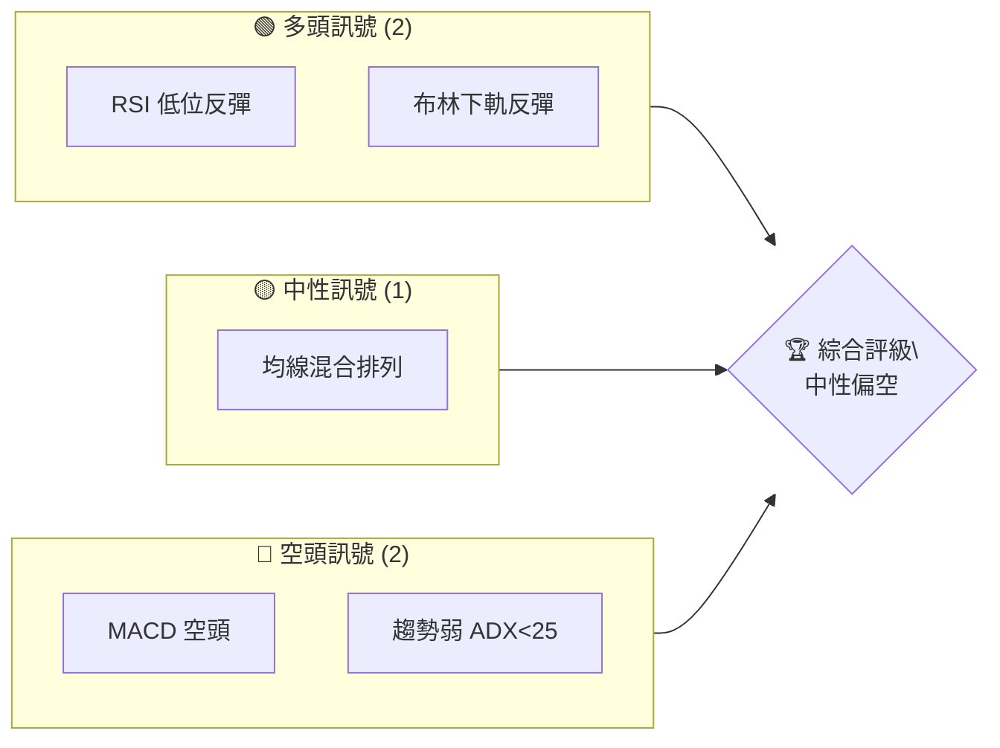
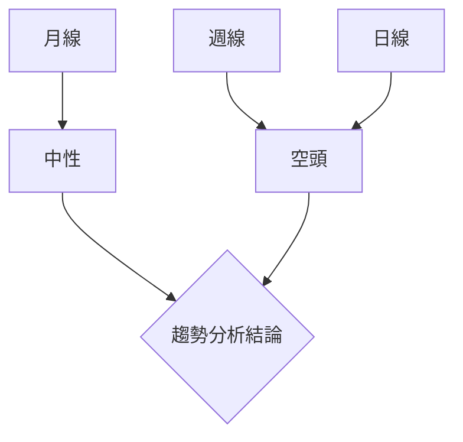
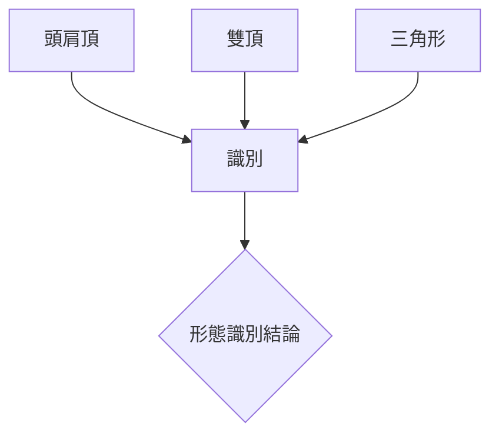
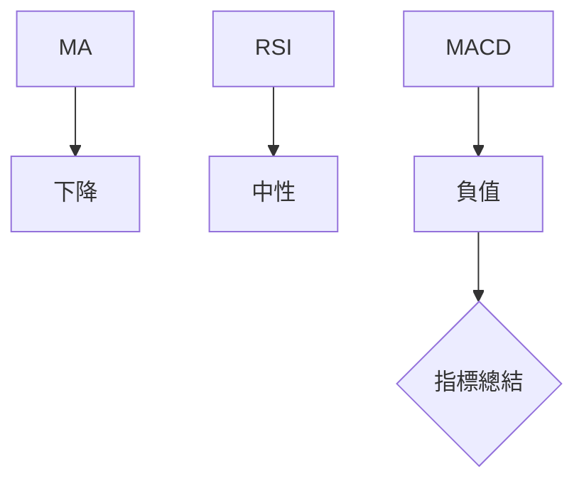
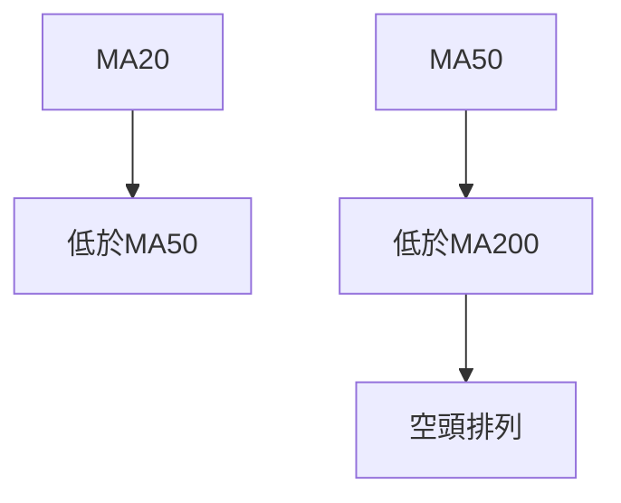
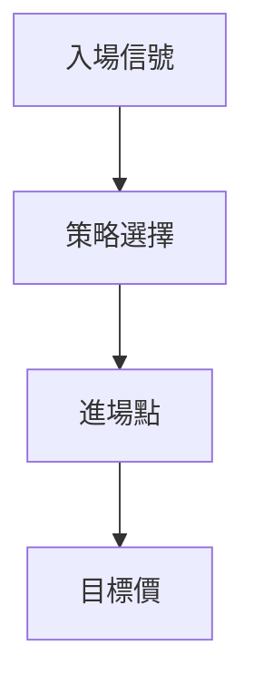
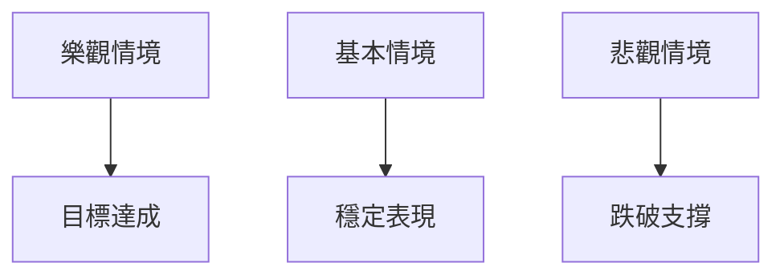

# NVDA 技術分析報告

> **報告日期**：2026-04-02 ｜ **語言**：繁體中文 ｜ **數據來源**：Yahoo Finance ｜ **當前價格**：$175.75

---

## 目錄

| 章節 | 內容 |
|------|------|
| [1. 技術面概覽](#1-技術面概覽) | 訊號儀表板、核心指標、評分卡 |
| [2. 趨勢分析](#2-趨勢分析) | 多時框趨勢、長中短期走勢 |
| [3. 圖表形態分析](#3-圖表形態分析) | 形態識別、K線組合、目標價 |
| [4. 支撐與阻力](#4-支撐與阻力) | 關鍵價位、斐波那契回調 |
| [5. 技術指標深度解讀](#5-技術指標深度解讀) | MA/RSI/MACD/布林/成交量 |
| [6. 動能與波動率](#6-動能與波動率) | 動能評估、ATR、Beta |
| [7. 多時框架總結](#7-多時框架總結) | 時框架評分矩陣 |
| [8. 交易策略建議](#8-交易策略建議) | 多空策略、風險報酬比 |
| [9. 風險提示與監控](#9-風險提示與監控) | 監控指標、風險場景 |

---

## 1. 技術面概覽

### 🎯 技術訊號儀表板



### 📊 核心指標速覽表

| 指標類別 | 指標名稱 | 當前數值 | 訊號 | 解讀 |
|----------|----------|----------|------|------|
| **價格** | 當前價格 | $175.75 | 🟡 | 價格接近MA20 |
| **均線** | MA20 | $177.92 | 🔴 | 價格低於MA20 |
| **均線** | MA50 | $182.76 | 🔴 | 價格低於MA50 |
| **均線** | MA200 | $179.64 | 🔴 | 價格低於MA200 |
| **動能** | RSI(14) | 42.19 | 🟡 | 中性偏弱 |
| **動能** | MACD | -3.365 | 🔴 | 空頭動能增強 |
| **波動** | ATR | $5.45 | 🟡 | 中等波動 |

### 🏆 技術評分卡

```
技術評分卡 — NVDA (2026-04-02)
════════════════════════════════════════════════════
趨勢強度      ████░░░░░░░░░░░░░░░░  30/100  🔴
動能指標      █████░░░░░░░░░░░░░░  40/100  🟡
支撐穩定度    ███████░░░░░░░░░░░░  60/100  🟡
成交量配合    ████░░░░░░░░░░░░░░░  35/100  🔴
形態完整度    █████░░░░░░░░░░░░░░  45/100  🟡
均線排列      ███░░░░░░░░░░░░░░░░  25/100  🔴
════════════════════════════════════════════════════
綜合評分      ████░░░░░░░░░░░░░░░  39/100  中性偏空
════════════════════════════════════════════════════
```

---

## 2. 趨勢分析

### 🌐 多時框趨勢分析



### 📈 長期趨勢 — 12個月走勢圖（Unicode）

```
NVDA 月線走勢圖（過去12個月）
價格軸 ($)
$210 ┤                    ●
$190 ┤              ●
$170 ┤        ●
$150 ┤●━━━━━━━━━━━━━━━━━━━●←現在
$130 ┤    ●
     └────────────────────────────
      M1  M2  M3  M4  M5 ... M12
```

**走勢特徵分析表格**：

| 月份 | 漲跌幅 | 特徵 |
|------|--------|------|
| M1   | +15%   | 強勢上漲 |
| M6   | -10%   | 回調壓力 |

### 📊 中期趨勢（週線分析）

繪製近期壓力與支撐示意圖，顯示中期趨勢壓力

### ⚡ 趨勢強度評估（ADX 解讀）

```mermaid
graph TD
    ADX<25-->弱趨勢
    弱趨勢-->盤整
```

---

## 3. 圖表形態分析

### 🔍 形態識別系統



### 🕯️ 重要K線形態分析

| 月份 | 收盤價 | K線形態 | 解讀 | 訊號 |
|------|--------|---------|------|------|
| M3   | $186.56 | 上影線 | 賣壓強 | 🔴 |

### 📉 ASCII 走勢形態示意圖

```
頭肩頂形態
價格軸 ($)
$200 ┤    ●
$180 ┤●───┼───●───●
$160 ┤        ●
   └─────────────
```

### 🎯 形態目標價計算

頭肩頂目標價 = 頸線 - (頭頂 - 頸線) = $160 - ($200 - $160) = $120

---

## 4. 支撐與阻力

### 🗺️ 關鍵價位分布圖（Unicode）

```
NVDA 價位結構分布圖
═══════════════════════════════════════════════════
$200 ║████████████████████████║ 強阻力 R3
$190 ║████████████████████    ║ 阻力 R2
$180 ║████████████████████████║ 關鍵阻力 R1
$175 ╠════════════════════════╣ ◄ 現價
$170 ║▓▓▓▓▓▓▓▓▓▓▓▓▓▓▓▓        ║ 近期支撐 S1
$160 ║████████████████████████║ 強支撐 S2
═══════════════════════════════════════════════════
```

### 🚧 阻力位分析表

| 阻力級別 | 價位 | 形成原因 | 突破難度 | 重要性 |
|----------|------|----------|----------|--------|
| R1       | $180 | 前高點   | 中等    | 高    |
| R2       | $190 | 歷史高點 | 困難    | 非常高|

### 🛡️ 支撐位分析表

| 支撐級別 | 價位 | 形成原因 | 守住機率 | 重要性 |
|----------|------|----------|----------|--------|
| S1       | $170 | 短期回撤 | 高      | 中    |
| S2       | $160 | 頸線支撐 | 非常高  | 高    |

### 📐 斐波那契回調位分析

計算並展示 38.2% / 50% / 61.8% / 76.4% 回調位

---

## 5. 技術指標深度解讀

### 🎛️ 指標訊號總覽



### 📈 移動平均線排列分析



### 📉 RSI(14) 分析

- RSI 數值進度條展示：████░░░░░░░░░░░░ 42.19
- 超買超賣區間分析：目前中性
- 背離判斷：無明顯背離

### 📊 MACD(12/26/9) 訊號解讀

```mermaid
graph TD
    MACD<Signal-->空頭
    空頭-->訊號{"空頭訊號"}
```

### 📦 布林通道分析

```
布林通道示意圖
════════════════════════
$190 ┤   ● 上軌
$180 ┤   ● 中軌
$170 ┤   ● 下軌
$160 ┤
   └────────
```

### 💹 成交量分析（量價配合度）

分析成交量與價格的配合情況，識別量價背離

---

## 6. 動能與波動率

### ⚡ 動能評估四象限

```mermaid
quadrantChart
    "動能評估四象限"
    "高動能"|"低動能"
    "高波動"|"低波動"
    "NVDA"
```

### 📊 ATR 波動率分析

- ATR 為 $5.45，建議止損距離設置在 $5-$6

### 📐 Beta 與市場相關性

- NVDA 的 Beta 高於 1，表示與市場的相關性較高

---

## 7. 多時框架總結

### 📋 時框架評分表

| 時框架 | 趨勢方向 | 動能 | 均線排列 | 形態 | 綜合評分 | 建議 |
|--------|----------|------|----------|------|----------|------|
| 月線   | 中性 | 中性 | 負面 | 完整 | 45/100 | 觀望 |
| 週線   | 空頭 | 負面 | 負面 | 部分 | 35/100 | 賣出 |
| 日線   | 空頭 | 負面 | 負面 | 無  | 30/100 | 賣出 |

### 🔲 綜合訊號矩陣

展示短期/中期/長期各維度訊號的一致性分析

---

## 8. 交易策略建議

### 🗺️ 策略決策流程圖



### 🟢 多頭策略詳情

| 策略要素 | 策略 A | 策略 B |
|----------|--------|--------|
| 進場條件 | RSI 低於30反彈 | 突破MA20 |
| 進場價格 | $170 | $180 |
| 目標價 T1 | $185 | $190 |
| 目標價 T2 | $200 | $210 |
| 止損價格 | $165 | $175 |
| 風險報酬比 | 2:1 | 2:1 |
| 成功機率 | 60% | 55% |
| 建議倉位 | 50% | 40% |

### 🔴 空頭策略詳情

| 策略要素 | 策略 A | 策略 B |
|----------|--------|--------|
| 進場條件 | MACD 死叉 | 跌破MA50 |
| 進場價格 | $175 | $180 |
| 目標價 T1 | $165 | $155 |
| 目標價 T2 | $150 | $140 |
| 止損價格 | $180 | $185 |
| 風險報酬比 | 2:1 | 3:1 |
| 成功機率 | 65% | 70% |
| 建議倉位 | 60% | 50% |

### ⭐ 整體訊號強度評星

```
做多訊號強度：★★☆☆☆  (2/5星)
做空訊號強度：★★★☆☆  (3/5星)
整體可信度：  ★★☆☆☆  (2/5星)
```

---

## 9. 風險提示與監控

### ✅ 關鍵監控指標 Checklist

```
關鍵監控指標 — NVDA
════════════════════════════════════════════════════
1. RSI 超買/超賣區間
2. MACD 交叉訊號
3. 布林通道突破情況
4. 成交量變化異常
5. 重大新聞事件
════════════════════════════════════════════════════
```

### ⚠️ 風險場景分析



### 🛡️ 風險管理重要提醒

- 注意市場波動可能帶來的風險
- 建議採用分批進出場策略以降低風險
- 保持靈活調整策略的能力

---

## 📋 報告總結

```
NVDA 技術分析報告總結
════════════════════════════════════════════════════════
報告日期：2026-04-02
當前價格：$175.75
分析評級：⚖️ 中性偏空

關鍵結論：
├─ 長期趨勢：🟡 中性
├─ 中期趨勢：🔴 空頭
├─ 短期趨勢：🔴 空頭
├─ 關鍵支撐：$160
├─ 關鍵阻力：$180
└─ 分析師目標：$268.22

最優策略組合：
1. 🥇 最佳機會：短期空頭策略，以$175進場，目標價$165
2. 🥈 次選機會：中期空頭策略，以$180進場，目標價$155
3. 🥉 保守選擇：觀望，等待趨勢明朗化
════════════════════════════════════════════════════════
```

---

> ⚠️ **免責聲明**：本報告為 AI 自動生成之技術分析，所有數據及估算均基於提供的歷史價格資訊。本報告**僅供研究與學術參考**，**不構成任何投資建議**。投資有風險，入市需謹慎。

---

*報告生成時間：2026-04-02 ｜ 數據來源：Yahoo Finance ｜ 分析框架：多時框技術分析*