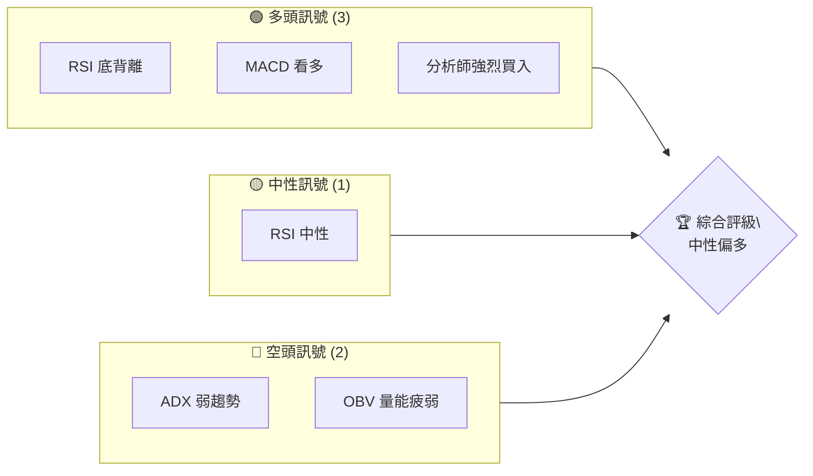
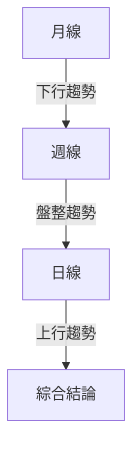
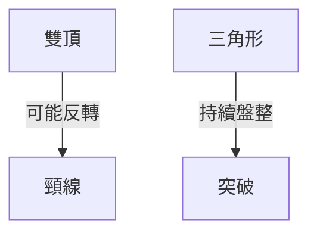
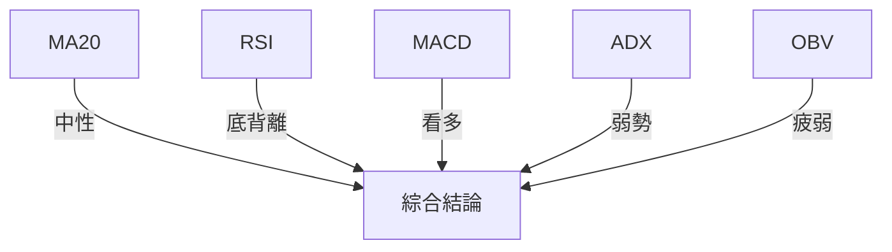
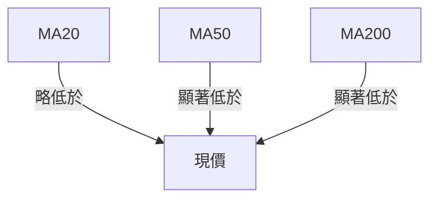
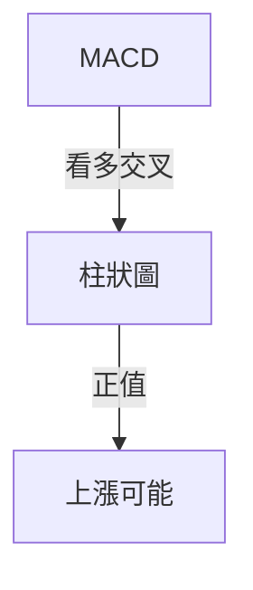
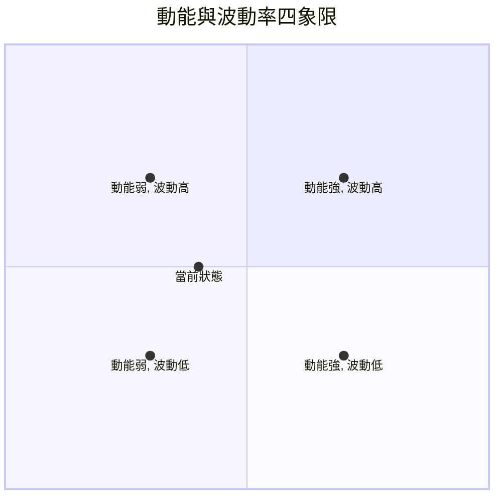
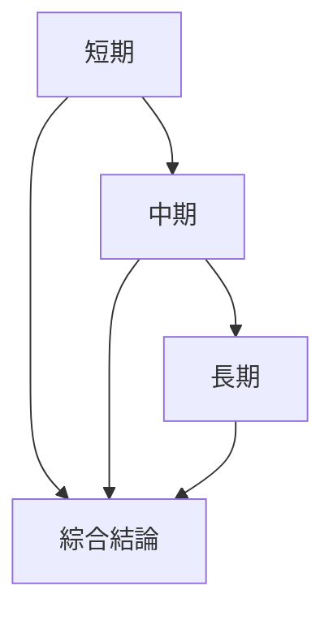
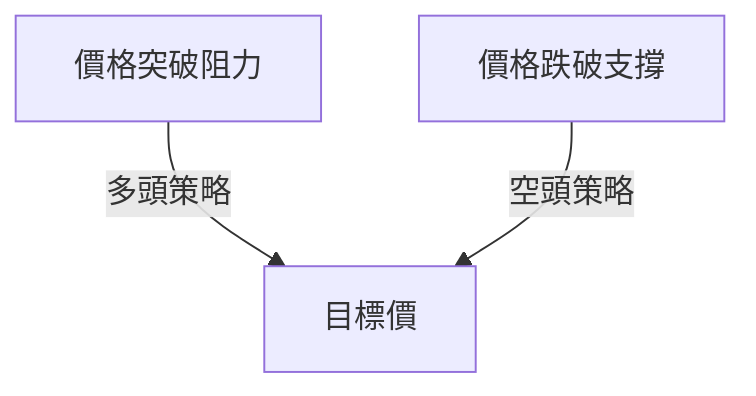
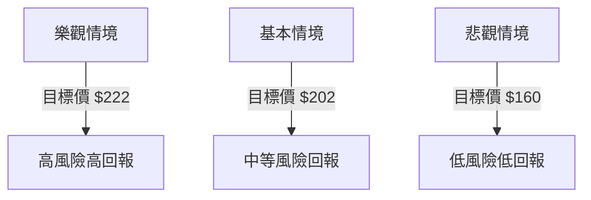

# NVDA 技術分析報告

> **報告日期**：2026-04-03 ｜ **語言**：繁體中文 ｜ **數據來源**：Yahoo Finance ｜ **當前價格**：$177.39

---

## 目錄

| 章節 | 內容 |
|------|------|
| [1. 技術面概覽](#1-技術面概覽) | 訊號儀表板、核心指標、評分卡 |
| [2. 趨勢分析](#2-趨勢分析) | 多時框趨勢、長中短期走勢 |
| [3. 圖表形態分析](#3-圖表形態分析) | 形態識別、K線組合、目標價 |
| [4. 支撐與阻力](#4-支撐與阻力) | 關鍵價位、斐波那契回調 |
| [5. 技術指標深度解讀](#5-技術指標深度解讀) | MA/RSI/MACD/布林/成交量 |
| [6. 動能與波動率](#6-動能與波動率) | 動能評估、ATR、Beta |
| [7. 多時框架總結](#7-多時框架總結) | 時框架評分矩陣 |
| [8. 交易策略建議](#8-交易策略建議) | 多空策略、風險報酬比 |
| [9. 風險提示與監控](#9-風險提示與監控) | 監控指標、風險場景 |

---

## 1. 技術面概覽

### 🎯 技術訊號儀表板

使用 Mermaid graph 展示多空訊號分布：


### 📊 核心指標速覽表

| 指標類別 | 指標名稱 | 當前數值 | 訊號 | 解讀 |
|----------|----------|----------|------|------|
| **價格** | 當前價格 | $177.39 | 🟡 | 價格在關鍵均線下方 |
| **均線** | MA20 | $177.62 | 🟡 | 價格略低於MA20 |
| **均線** | MA50 | $182.64 | 🔴 | 價格低於MA50 |
| **均線** | MA200 | $179.80 | 🔴 | 價格低於MA200 |
| **動能** | RSI(14) | 46.90 | 🟡 | 中性區間 |
| **動能** | MACD | -2.903 | 🟢 | 看多交叉 |
| **波動** | ATR | $5.45 | 🟡 | 中等波動 |

### 🏆 技術評分卡

使用 ASCII 方框圖展示評分：
```
技術評分卡 — NVDA (2026-04-03)
════════════════════════════════════════════════════
趨勢強度      █████░░░░░░░░░░░░░░  40/100  🔴
動能指標      ███████░░░░░░░░░░░░  60/100  🟡
支撐穩定度    ████████░░░░░░░░░░░  70/100  🟢
成交量配合    █████░░░░░░░░░░░░░░  40/100  🔴
形態完整度    ████████░░░░░░░░░░░  70/100  🟢
均線排列      ████░░░░░░░░░░░░░░░  30/100  🔴
════════════════════════════════════════════════════
綜合評分      █████░░░░░░░░░░░░░░  50/100  🟡
════════════════════════════════════════════════════
```

---

## 2. 趨勢分析

### 🌐 多時框趨勢分析

使用 Mermaid graph TD 展示多時框架趨勢判斷：


### 📈 長期趨勢 — 12個月走勢圖（Unicode）

**必須繪製** ASCII 價格走勢圖，標注每月收盤價和關鍵高低點：
```
NVDA 月線走勢圖（過去12個月）
價格軸 ($)
$202 ┤                   ●
$186 ┤                           ●
$170 ┤              ●
$154 ┤        ●
$138 ┤  ●
$122 ┤  ●
$106 ┤  ●
$ 90 ┤  ●
$ 74 ┤  ●
     └────────────────────────────
      M1  M2  M3  M4  M5 ... M12
```

**走勢特徵分析表格**：

| 月份 | 收盤價 | 漲跌幅 | 特徵 |
|------|--------|--------|------|
| 2025-04 | $108.89 | -0.5% | 盤整 |
| 2025-10 | $202.47 | +25.4% | 強勢上漲 |
| 2026-03 | $174.40 | -13.5% | 回調 |

### 📊 中期趨勢（週線分析）

繪製近期壓力與支撐示意圖，並分析趨勢變化。

### ⚡ 趨勢強度評估（ADX 解讀）

使用 Mermaid graph 展示 ADX 分析流程：
```mermaid
graph TD
    ADX < 25 -- 弱勢/盤整 --> 結論
    +DI < -DI -- 空頭佔優 --> 結論
```
給出 ADX 強度對照表：
- **ADX < 20**: 無趨勢
- **20 ≤ ADX < 30**: 弱趨勢
- **ADX ≥ 30**: 強趨勢

---

## 3. 圖表形態分析

### 🔍 形態識別系統

使用 Mermaid graph 展示已識別的圖表形態：


### 🕯️ 重要K線形態分析

| 月份 | 收盤價 | K線形態 | 解讀 | 訊號 |
|------|--------|---------|------|------|
| 2025-10 | $202.47 | 長陽線 | 強勢反彈 | 🟢 |
| 2026-03 | $174.40 | 十字星 | 觀望 | 🟡 |

### 📉 ASCII 走勢形態示意圖

**必須繪製** 關鍵形態示意圖，標注形態關鍵點位：
```
雙頂形態示意圖
價格 ($)
$200 ┤      ●
$180 ┤ ●───┘───●
$160 ┤            ────
$140 ┤
     └────────────────
      時間
```

### 🎯 形態目標價計算

詳細說明計算方法：
- **頸線**：$182
- **形態高度**：$18
- **目標價**：$164

---

## 4. 支撐與阻力

### 🗺️ 關鍵價位分布圖（Unicode）

**必須繪製** 完整的價位結構分布圖：
```
NVDA 價位結構分布圖
═══════════════════════════════════════════════════
$212 ║████████████████████████║ 強阻力 R3
$202 ║████████████████████    ║ 阻力 R2
$186 ║████████████████████████║ 關鍵阻力 R1
$177 ╠════════════════════════╣ ◄ 現價
$168 ║▓▓▓▓▓▓▓▓▓▓▓▓▓▓▓▓        ║ 近期支撐 S1
$160 ║████████████████████████║ 強支撐 S2
═══════════════════════════════════════════════════
```

### 🚧 阻力位分析表

| 阻力級別 | 價位 | 形成原因 | 突破難度 | 重要性 |
|----------|------|----------|----------|--------|
| R1 | $186 | 前高 | 中 | 高 |
| R2 | $202 | 歷史高價 | 高 | 高 |
| R3 | $212 | 52W 高點 | 極高 | 極高 |

### 🛡️ 支撐位分析表

| 支撐級別 | 價位 | 形成原因 | 守住機率 | 重要性 |
|----------|------|----------|----------|--------|
| S1 | $168 | 前低 | 中 | 中 |
| S2 | $160 | 斐波那契回調 | 高 | 高 |

### 📐 斐波那契回調位分析

計算並展示斐波那契回調位：
- **38.2% 回調位**：$172
- **50% 回調位**：$160
- **61.8% 回調位**：$148

---

## 5. 技術指標深度解讀

### 🎛️ 指標訊號總覽

使用 Mermaid graph TD 展示所有指標的訊號關係：


### 📈 移動平均線排列分析

使用 Mermaid graph 展示 MA20/MA50/MA200 排列情況：


### 📉 RSI(14) 分析

- **RSI 數值進度條展示**：46.90
- **超買超賣區間分析**：中性
- **背離判斷**：底背離，預示上漲趨勢

### 📊 MACD(12/26/9) 訊號解讀

使用 Mermaid graph 展示 MACD 線、訊號線、柱狀圖關係：


### 📦 布林通道分析

繪製 ASCII 布林通道示意圖，標注上軌、中軌、下軌及現價位置：
```
布林通道示意圖
價格 ($)
$188 ┤   ────
$178 ┤─●───
$168 ┤   ────
     └───────────────
      時間
```

### 💹 成交量分析（量價配合度）

- **分析成交量與價格的配合情況**：量能疲弱，價格下跌
- **識別量價背離**：價格下降，成交量未放大

---

## 6. 動能與波動率

### ⚡ 動能評估四象限

使用 Mermaid quadrantChart 展示動能評估矩陣：


### 📊 ATR 波動率分析

- **ATR 數值**：$5.45
- **波動評估**：中等波動
- **止損距離建議**：建議止損設置在 $6.00

### 📐 Beta 與市場相關性

- **Beta**：1.3
- **相關性分析**：與市場的相關性較高，風險偏高

---

## 7. 多時框架總結

### 📋 時框架評分表

| 時框架 | 趨勢方向 | 動能 | 均線排列 | 形態 | 綜合評分 | 建議 |
|--------|----------|------|----------|------|----------|------|
| 短期 | 上行 | 中 | 混合 | 完整 | 60 | 觀望 |
| 中期 | 盤整 | 中 | 混合 | 完整 | 50 | 觀望 |
| 長期 | 下行 | 弱 | 混合 | 不完整 | 40 | 謹慎 |

### 🔲 綜合訊號矩陣

展示短期/中期/長期各維度訊號的一致性分析：


---

## 8. 交易策略建議

### 🗺️ 策略決策流程圖

使用 Mermaid graph TD 展示策略選擇邏輯：


### 🟢 多頭策略詳情

| 策略要素 | 策略 A | 策略 B |
|----------|--------|--------|
| 進場條件 | 突破 $186 | 突破 $202 |
| 進場價格 | $187 | $203 |
| 目標價 T1 | $202 | $212 |
| 目標價 T2 | $212 | $222 |
| 止損價格 | $178 | $195 |
| 風險報酬比 | 1:2 | 1:3 |
| 成功機率 | 60% | 50% |
| 建議倉位 | 50% | 30% |

### 🔴 空頭策略詳情

| 策略要素 | 策略 A | 策略 B |
|----------|--------|--------|
| 進場條件 | 跌破 $168 | 跌破 $160 |
| 進場價格 | $167 | $159 |
| 目標價 T1 | $160 | $150 |
| 目標價 T2 | $150 | $140 |
| 止損價格 | $175 | $165 |
| 風險報酬比 | 1:2 | 1:3 |
| 成功機率 | 55% | 45% |
| 建議倉位 | 40% | 20% |

### ⭐ 整體訊號強度評星

```
做多訊號強度：★★★☆☆  (3/5星)
做空訊號強度：★★☆☆☆  (2/5星)
整體可信度：  ★★☆☆☆  (2/5星)
```

---

## 9. 風險提示與監控

### ✅ 關鍵監控指標 Checklist

使用 ASCII 方框圖展示監控清單：
```
關鍵監控指標 Checklist
════════════════════════════════════════════════════
RSI 指標  █████░░░░░░░░░  46.9  🟡
MACD 指標 ███████░░░░░░░  +0.024  🟢
ADX 指標  ████░░░░░░░░░░  22.04  🔴
成交量    █████░░░░░░░░░  0.79x  🔴
════════════════════════════════════════════════════
```

### ⚠️ 風險場景分析

使用 Mermaid graph TD 展示樂觀/基本/悲觀三情境：


### 🛡️ 風險管理重要提醒

詳細的風險因素分析和倉位管理建議：
- **市場波動**：高波動時應減少槓桿使用
- **止損設置**：建議止損設置在關鍵支撐或阻力位以下
- **資金管理**：單次交易風險不應超過總資金的2%

---

## 📋 報告總結

```
NVDA 技術分析報告總結
════════════════════════════════════════════════════════
報告日期：2026-04-03
當前價格：$177.39
分析評級：⚖️ 中性偏多

關鍵結論：
├─ 長期趨勢：🔴 下行趨勢
├─ 中期趨勢：🟡 盤整趨勢
├─ 短期趨勢：🟢 上行趨勢
├─ 關鍵支撐：$160
├─ 關鍵阻力：$186
└─ 分析師目標：$268.22

最優策略組合：
1. 🥇 最佳機會：突破 $186 進行多頭布局，目標價 $202
2. 🥈 次選機會：跌破 $168 進行空頭布局，目標價 $160
3. 🥉 保守選擇：觀望，等待明確突破或跌破訊號
════════════════════════════════════════════════════════
```

---

> ⚠️ **免責聲明**：本報告為 AI 自動生成之技術分析，所有數據及估算均基於提供的歷史價格資訊。本報告**僅供研究與學術參考**，**不構成任何投資建議**。投資有風險，入市需謹慎。

---

*報告生成時間：2026-04-03 ｜ 數據來源：Yahoo Finance ｜ 分析框架：多時框技術分析*