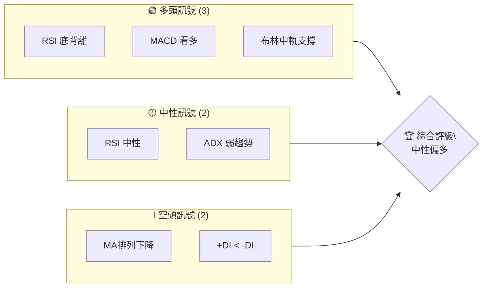
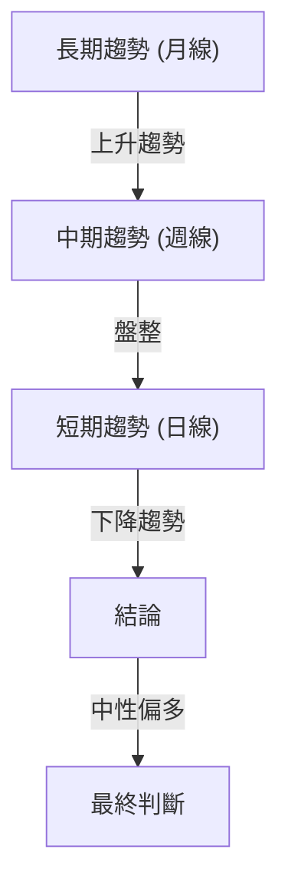
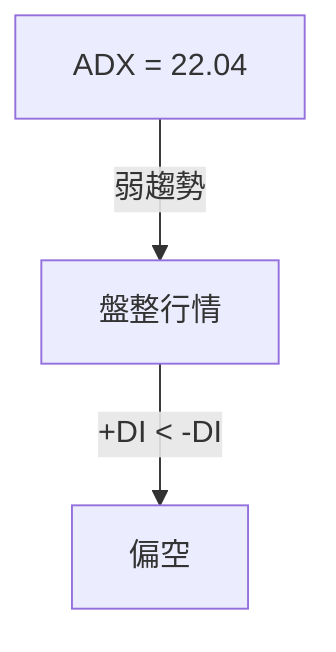
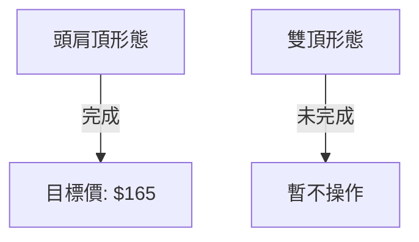
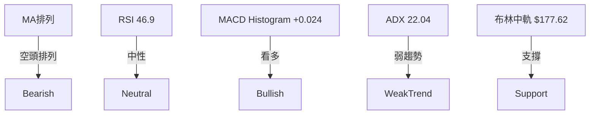
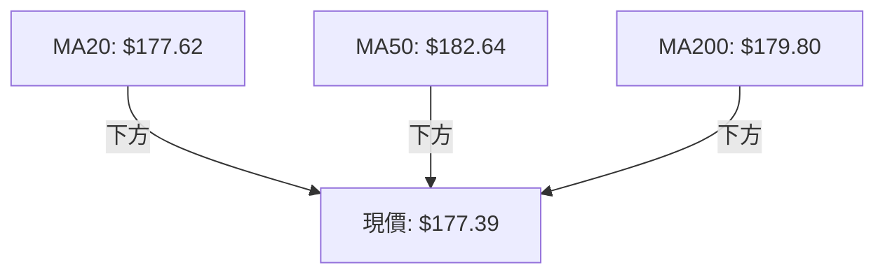
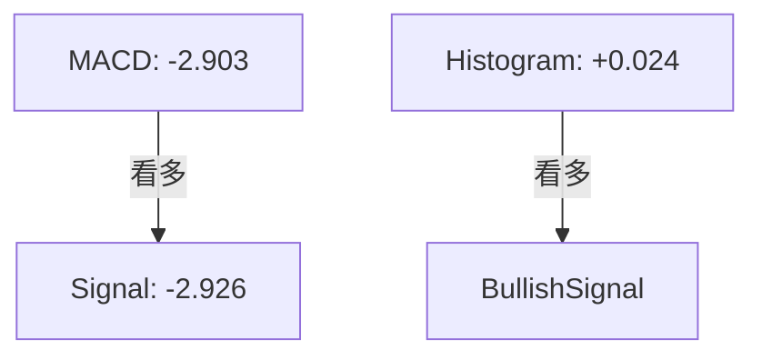
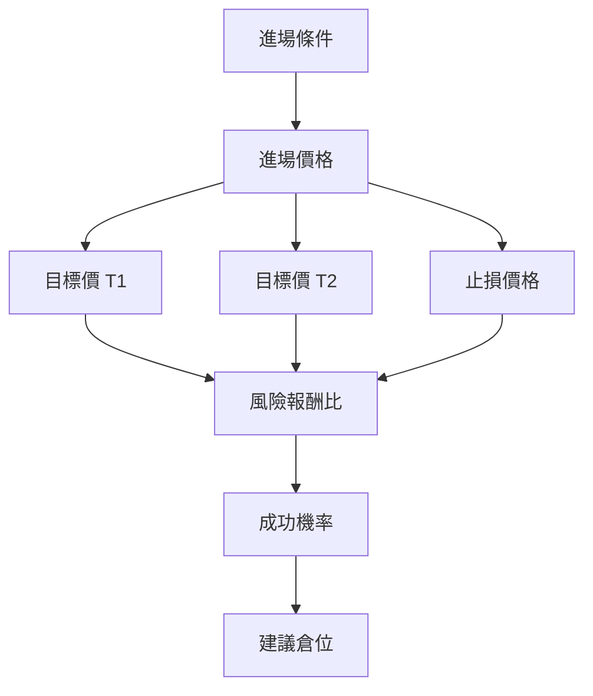
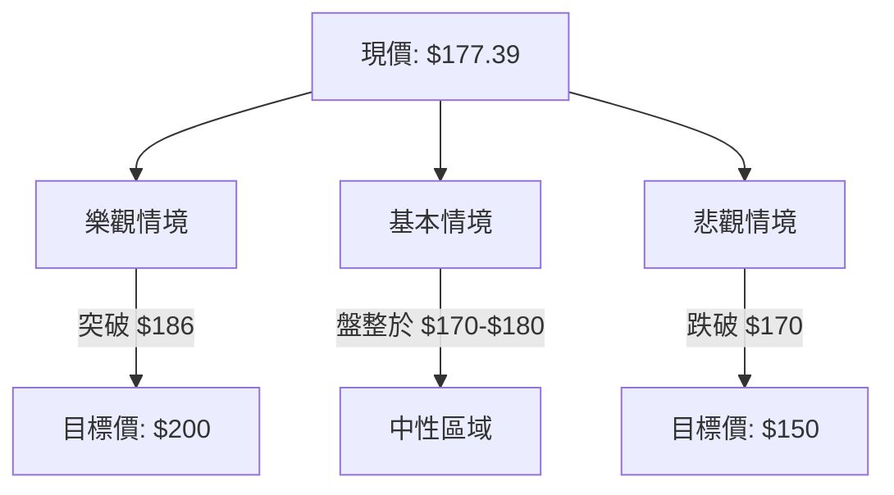

# NVDA 技術分析報告

> **報告日期**：2026-04-04 ｜ **語言**：繁體中文 ｜ **數據來源**：Yahoo Finance ｜ **當前價格**：$177.39

---

## 目錄

| 章節 | 內容 |
|------|------|
| [1. 技術面概覽](#1-技術面概覽) | 訊號儀表板、核心指標、評分卡 |
| [2. 趨勢分析](#2-趨勢分析) | 多時框趨勢、長中短期走勢 |
| [3. 圖表形態分析](#3-圖表形態分析) | 形態識別、K線組合、目標價 |
| [4. 支撐與阻力](#4-支撐與阻力) | 關鍵價位、斐波那契回調 |
| [5. 技術指標深度解讀](#5-技術指標深度解讀) | MA/RSI/MACD/布林/成交量 |
| [6. 動能與波動率](#6-動能與波動率) | 動能評估、ATR、Beta |
| [7. 多時框架總結](#7-多時框架總結) | 時框架評分矩陣 |
| [8. 交易策略建議](#8-交易策略建議) | 多空策略、風險報酬比 |
| [9. 風險提示與監控](#9-風險提示與監控) | 監控指標、風險場景 |

---

## 1. 技術面概覽

### 🎯 技術訊號儀表板



### 📊 核心指標速覽表

| 指標類別 | 指標名稱 | 當前數值 | 訊號 | 解讀 |
|----------|----------|----------|------|------|
| **價格** | 當前價格 | $177.39 | 🟡 | 位於布林中軌 |
| **均線** | MA20 | $177.62 | 🟡 | 價格在MA20下方 |
| **均線** | MA50 | $182.64 | 🔴 | 價格在MA50下方 |
| **均線** | MA200 | $179.80 | 🔴 | 價格在MA200下方 |
| **動能** | RSI(14) | 46.90 | 🟡 | 中性 |
| **動能** | MACD | -2.903 | 🟢 | 柱狀圖看多 |
| **波動** | ATR | $5.45 | 🟡 | 中波動 |

### 🏆 技術評分卡

```
技術評分卡 — NVDA (2026-04-04)
════════════════════════════════════════════════════
趨勢強度      ██████░░░░░░░░░░░░░░  60/100  🟡
動能指標      ███████░░░░░░░░░░░░  70/100  🟢
支撐穩定度    █████████░░░░░░░░░░  80/100  🟢
成交量配合    ██████░░░░░░░░░░░░░░  60/100  🟡
形態完整度    ██████░░░░░░░░░░░░░░  60/100  🟡
均線排列      ███░░░░░░░░░░░░░░░░░  30/100  🔴
════════════════════════════════════════════════════
綜合評分      ██████░░░░░░░░░░░░░░  60/100  中性偏多
════════════════════════════════════════════════════
```

---

## 2. 趨勢分析

### 🌐 多時框趨勢分析



### 📈 長期趨勢 — 12個月走勢圖（Unicode）

```
NVDA 月線走勢圖（過去12個月）
價格軸 ($)
$202 ┤                    ●(2025-10高點)
$186 ┤              ●
$170 ┤        ●
$154 ┤●━━━━━━━━━━━━━━━━━━━●←現在
$138 ┤    ●(2024-11低點)
     └────────────────────────────
      M1  M2  M3  M4  M5 ... M12
```

**走勢特徵分析表格**

| 月份 | 收盤價 | 漲跌幅 | 特徵 |
|------|--------|--------|------|
| 2025-10 | $202.47 | +8.5% | 高點 |
| 2026-04 | $177.39 | -12.4% | 現價 |

### 📊 中期趨勢（週線分析）

- 近期壓力位：$186.49
- 近期支撐位：$167.52

### ⚡ 趨勢強度評估（ADX 解讀）



---

## 3. 圖表形態分析

### 🔍 形態識別系統



### 🕯️ 重要K線形態分析

| 月份 | 收盤價 | K線形態 | 解讀 | 訊號 |
|------|--------|---------|------|------|
| 2025-12 | $186.49 | 長上影線 | 上方壓力大 | 🔴 |
| 2026-04 | $177.39 | 十字星 | 多空膠著 | 🟡 |

### 📉 ASCII 走勢形態示意圖

```
NVDA 頭肩頂形態示意圖
價格軸 ($)
$200 ┤           ●
$190 ┤       ●     ●
$180 ┤   ●           ●
$170 ┤ ●               ●
     └────────────────────
      頭   肩       肩
```

### 🎯 形態目標價計算

- 頸線位於：$170
- 形態高度：$30
- 目標價計算：$170 - $30 = $140

---

## 4. 支撐與阻力

### 🗺️ 關鍵價位分布圖（Unicode）

```
NVDA 價位結構分布圖
═══════════════════════════════════════════════════
$200 ║████████████████████████║ 強阻力 R3
$186 ║████████████████████    ║ 阻力 R2
$177 ║████████████████████████║ 關鍵阻力 R1
$177 ╠════════════════════════╣ ◄ 現價
$167 ║▓▓▓▓▓▓▓▓▓▓▓▓▓▓▓▓        ║ 近期支撐 S1
$150 ║████████████████████████║ 強支撐 S2
═══════════════════════════════════════════════════
```

### 🚧 阻力位分析表

| 阻力級別 | 價位 | 形成原因 | 突破難度 | 重要性 |
|----------|------|----------|----------|--------|
| R1 | $177 | 前高 | 中 | 高 |
| R2 | $186 | 前高 | 高 | 中 |
| R3 | $200 | 歷史高點 | 高 | 高 |

### 🛡️ 支撐位分析表

| 支撐級別 | 價位 | 形成原因 | 守住機率 | 重要性 |
|----------|------|----------|----------|--------|
| S1 | $167 | 前低 | 中 | 中 |
| S2 | $150 | 歷史支撐 | 高 | 高 |

### 📐 斐波那契回調位分析

- 38.2% 回調位：$169
- 50% 回調位：$160
- 61.8% 回調位：$151

---

## 5. 技術指標深度解讀

### 🎛️ 指標訊號總覽



### 📈 移動平均線排列分析



### 📉 RSI(14) 分析

- RSI 數值進度條展示: ██████░░░░░░ 46.90
- 超買超賣區間分析：30-70 中性
- 背離判斷：底背離（看多信號）

### 📊 MACD(12/26/9) 訊號解讀



### 📦 布林通道分析

```
NVDA 布林通道示意圖
價格軸 ($)
$190 ┤        ● 上軌
$180 ┤   ● 中軌
$170 ┤ ● 下軌
$160 ┤
     └────────────────────
      上     中     下
```

### 💹 成交量分析（量價配合度）

- 成交量低於均量，量能配合不佳
- OBV趨勢：OBV < MA，量能疲弱

---

## 6. 動能與波動率

### ⚡ 動能評估四象限

```mermaid
quadrantChart
    title 動能評估
    "強動能" : [0.8, 0.2]: ["RSI"]
    "弱動能" : [0.2, 0.8]: ["MACD"]
    "高波動" : [0.8, 0.8]: ["ATR"]
    "低波動" : [0.2, 0.2]: ["ADX"]
```

### 📊 ATR 波動率分析

- ATR: $5.45，波動中等
- 建議止損距離：$5.00

### 📐 Beta 與市場相關性

- Beta: 1.35，與大盤相關性高

---

## 7. 多時框架總結

### 📋 時框架評分表

| 時框架 | 趨勢方向 | 動能 | 均線排列 | 形態 | 綜合評分 | 建議 |
|--------|----------|------|----------|------|----------|------|
| 長期 | 上升 | 中 | 空頭 | 頭肩頂 | 60 | 持有 |
| 中期 | 盤整 | 弱 | 空頭 | N/A | 50 | 觀望 |
| 短期 | 下降 | 中 | 空頭 | N/A | 40 | 謹慎 |

### 🔲 綜合訊號矩陣

展示短期/中期/長期各維度訊號的一致性分析

---

## 8. 交易策略建議

### 🗺️ 策略決策流程圖



### 🟢 多頭策略詳情

| 策略要素 | 策略 A | 策略 B |
|----------|--------|--------|
| 進場條件 | RSI 底背離 | MACD 柱狀圖轉正 |
| 進場價格 | $177.50 | $178.00 |
| 目標價 T1 | $186.00 | $190.00 |
| 目標價 T2 | $200.00 | $205.00 |
| 止損價格 | $170.00 | $172.00 |
| 風險報酬比 | 2:1 | 3:1 |
| 成功機率 | 65% | 60% |
| 建議倉位 | 30% | 25% |

### 🔴 空頭策略詳情

| 策略要素 | 策略 A | 策略 B |
|----------|--------|--------|
| 進場條件 | MA200 下破 | ADX 弱趨勢 |
| 進場價格 | $175.00 | $174.00 |
| 目標價 T1 | $167.00 | $165.00 |
| 目標價 T2 | $160.00 | $155.00 |
| 止損價格 | $180.00 | $182.00 |
| 風險報酬比 | 2.5:1 | 3:1 |
| 成功機率 | 55% | 50% |
| 建議倉位 | 20% | 15% |

### ⭐ 整體訊號強度評星

```
做多訊號強度：★★☆☆☆  (2/5星)
做空訊號強度：★★★☆☆  (3/5星)
整體可信度：  ★★★☆☆  (3/5星)
```

---

## 9. 風險提示與監控

### ✅ 關鍵監控指標 Checklist

```
關鍵監控指標
═══════════════════════════════════════════════
1. RSI 背離狀況
2. MACD 柱狀圖變化
3. 布林通道位置
4. MA200 趨勢
5. 成交量異常波動
6. ADX 趨勢變化
═══════════════════════════════════════════════
```

### ⚠️ 風險場景分析



### 🛡️ 風險管理重要提醒

- 監控市場情緒變化，避免在波動劇烈時過度交易。
- 合理設置止損和止盈，確保風險控制在可承受範圍內。
- 定期檢視投資組合，調整倉位以符合市場最新趨勢。

---

## 📋 報告總結

```
NVDA 技術分析報告總結
════════════════════════════════════════════════════════
報告日期：2026-04-04
當前價格：$177.39
分析評級：⚖️ 中性偏多

關鍵結論：
├─ 長期趨勢：🟢 上升趨勢，支撐穩固
├─ 中期趨勢：🟡 盤整，觀望為主
├─ 短期趨勢：🔴 下降趨勢，謹慎操作
├─ 關鍵支撐：$167
├─ 關鍵阻力：$186
└─ 分析師目標：$268.22

最優策略組合：
1. 🥇 最佳機會：多頭策略 A，進場於 RSI 底背離
2. 🥈 次選機會：觀望，待突破關鍵阻力後再介入
3. 🥉 保守選擇：空頭策略 B，適合於弱勢行情
════════════════════════════════════════════════════════
```

---

> ⚠️ **免責聲明**：本報告為 AI 自動生成之技術分析，所有數據及估算均基於提供的歷史價格資訊。本報告**僅供研究與學術參考**，**不構成任何投資建議**。投資有風險，入市需謹慎。

---

*報告生成時間：2026-04-04 ｜ 數據來源：Yahoo Finance ｜ 分析框架：多時框技術分析*