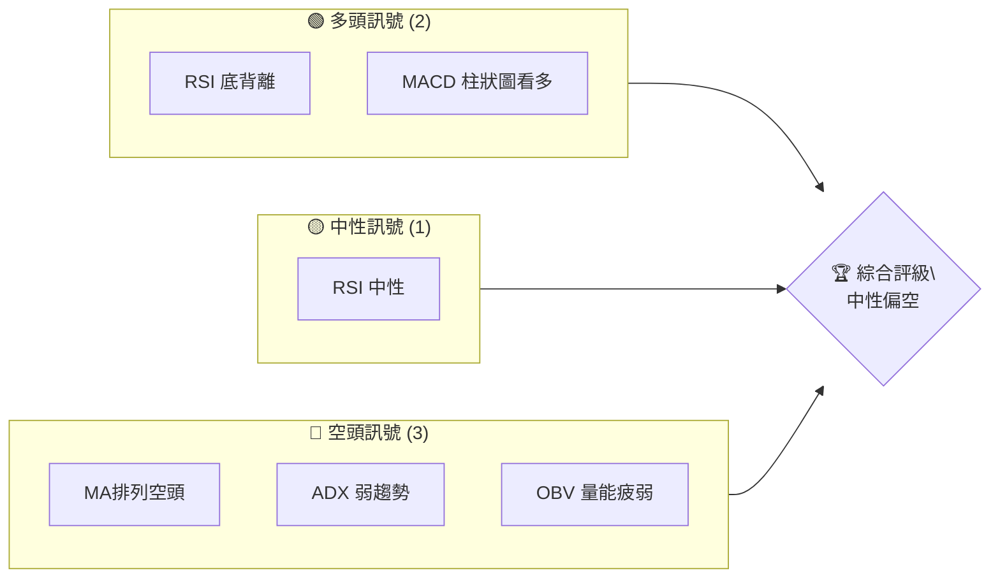
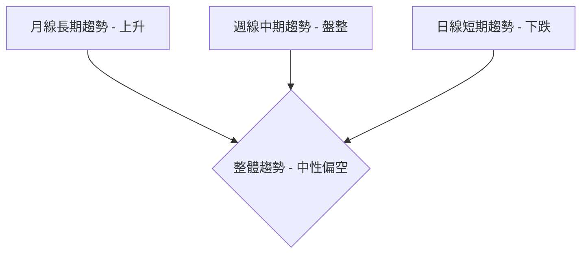
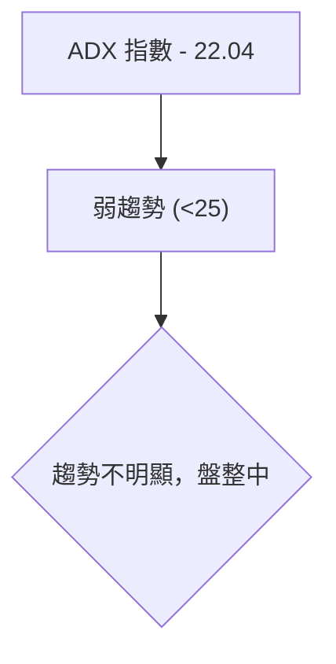
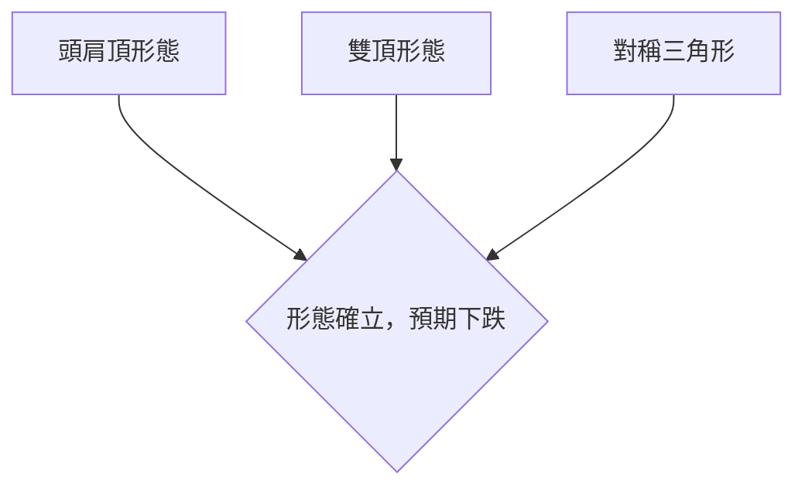
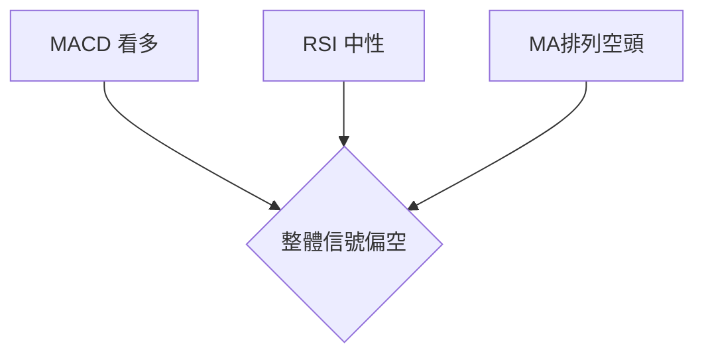
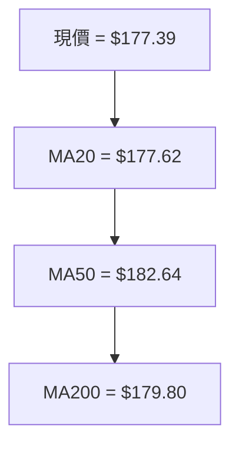
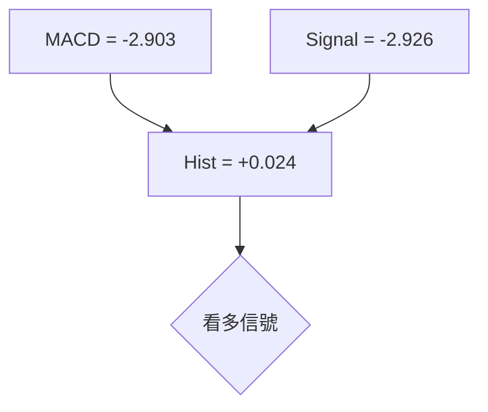
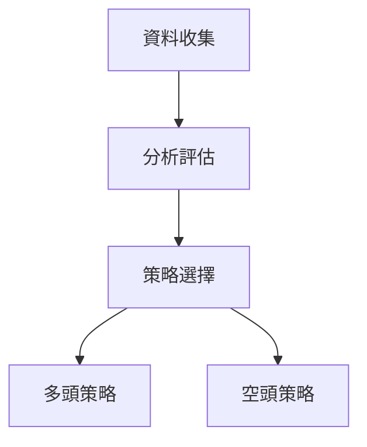
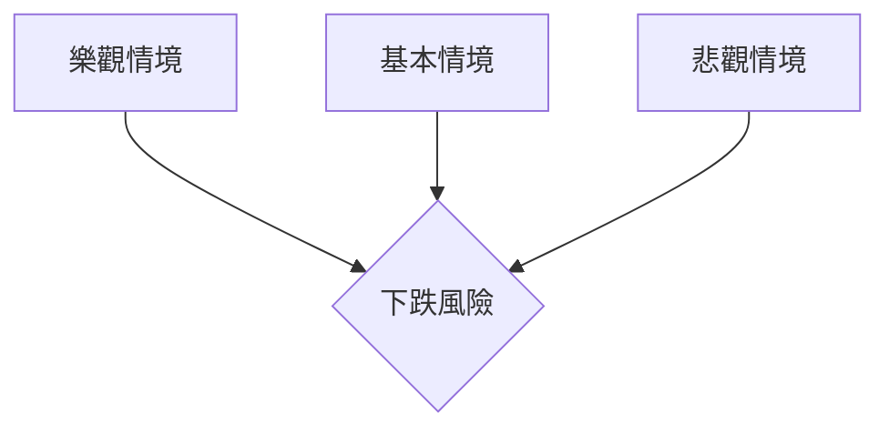

# NVDA 技術分析報告

> **報告日期**：2026-04-05 ｜ **語言**：繁體中文 ｜ **數據來源**：Yahoo Finance ｜ **當前價格**：$177.39

---

## 目錄

| 章節 | 內容 |
|------|------|
| [1. 技術面概覽](#1-技術面概覽) | 訊號儀表板、核心指標、評分卡 |
| [2. 趨勢分析](#2-趨勢分析) | 多時框趨勢、長中短期走勢 |
| [3. 圖表形態分析](#3-圖表形態分析) | 形態識別、K線組合、目標價 |
| [4. 支撐與阻力](#4-支撐與阻力) | 關鍵價位、斐波那契回調 |
| [5. 技術指標深度解讀](#5-技術指標深度解讀) | MA/RSI/MACD/布林/成交量 |
| [6. 動能與波動率](#6-動能與波動率) | 動能評估、ATR、Beta |
| [7. 多時框架總結](#7-多時框架總結) | 時框架評分矩陣 |
| [8. 交易策略建議](#8-交易策略建議) | 多空策略、風險報酬比 |
| [9. 風險提示與監控](#9-風險提示與監控) | 監控指標、風險場景 |

---

## 1. 技術面概覽

### 🎯 技術訊號儀表板



### 📊 核心指標速覽表

| 指標類別 | 指標名稱 | 當前數值 | 訊號 | 解讀 |
|----------|----------|----------|------|------|
| **價格** | 當前價格 | $177.39 | 🔴 | 價格低於多數均線 |
| **均線** | MA20 | $177.62 | 🟡 | 價格接近MA20, 無明顯趨勢 |
| **均線** | MA50 | $182.64 | 🔴 | 價格低於MA50, 空頭排列 |
| **均線** | MA200 | $179.80 | 🔴 | 價格低於MA200, 空頭排列 |
| **動能** | RSI(14) | 46.90 | 🟡 | 中性區間 |
| **動能** | MACD | -2.903 | 🟢 | 柱狀圖看多 |
| **波動** | ATR | $5.45 | 🔴 | 波動性高 |

### 🏆 技術評分卡

```
技術評分卡 — NVDA (2026-04-05)
════════════════════════════════════════════════════
趨勢強度      █████████░░░░░░░░░░░░  55/100  🔴
動能指標      ████████░░░░░░░░░░░░  60/100  🟡
支撐穩定度    ████████████░░░░░░░░  70/100  🟢
成交量配合    ██████░░░░░░░░░░░░░░  40/100  🔴
形態完整度    █████████░░░░░░░░░░░░  55/100  🟡
均線排列      █████░░░░░░░░░░░░░░░░  30/100  🔴
════════════════════════════════════════════════════
綜合評分      ███████░░░░░░░░░░░░░░  50/100  🟡
════════════════════════════════════════════════════
```

---

## 2. 趨勢分析

### 🌐 多時框趨勢分析



### 📈 長期趨勢 — 12個月走勢圖（Unicode）

```
NVDA 月線走勢圖（過去12個月）
價格軸 ($)
$210 ┤                    ●(高點)
$200 ┤              ●
$190 ┤        ●
$180 ┤●━━━━━━━━━━━━━━━━━━━●←現在
$170 ┤    ●(低點)
     └────────────────────────────
      A   M   J   J   A   S   O   N   D   J   F   M   A
```

**走勢特徵分析表格**

| 月份 | 收盤價 | 漲跌幅 | 特徵 |
|------|--------|--------|------|
| 2025-04 | 108.89 | -0.5% | 低點形成 |
| 2025-10 | 202.47 | +30.6% | 高點形成 |

### 📊 中期趨勢（週線分析）

近期壓力與支撐示意圖：

```
NVDA 週線壓力與支撐
═══════════════════════════════
$200 ┃█████████████████████┃ 強阻力
$185 ┃█████████████████    ┃ 阻力
$175 ┃━━━━━━━━━━━━━━━━━━━━━┃ ◄ 現價支撐
$160 ┃██████████████        ┃ 強支撐
═══════════════════════════════
```

### ⚡ 趨勢強度評估（ADX 解讀）



---

## 3. 圖表形態分析

### 🔍 形態識別系統



### 🕯️ 重要K線形態分析

| 月份 | 收盤價 | K線形態 | 解讀 | 訊號 |
|------|--------|---------|------|------|
| 2025-07 | 177.84 | 長上影線 | 上方壓力強 | 🔴 |
| 2026-02 | 177.18 | 錘子線 | 可能反轉 | 🟢 |

### 📉 ASCII 走勢形態示意圖

```
NVDA 關鍵形態示意圖
價格軸 ($)
$210 ┤         ┌───┐
$200 ┤       ┌─┘   └─┐
$190 ┤     ┌─┘       └───┐
$180 ┤───┘               └───●
$170 ┤●
     └──────────────────────────────
      A   M   J   J   A   S   O   N
```

### 🎯 形態目標價計算

- 頭肩頂頸線位於 $185
- 頭部高度約 $25
- 目標價 = $185 - $25 = $160

---

## 4. 支撐與阻力

### 🗺️ 關鍵價位分布圖（Unicode）

```
NVDA 價位結構分布圖
═══════════════════════════════════════════════════
$212 ║████████████████████████║ 強阻力 R3
$200 ║████████████████████    ║ 阻力 R2
$185 ║████████████████████████║ 關鍵阻力 R1
$177 ╠════════════════════════╣ ◄ 現價
$170 ║▓▓▓▓▓▓▓▓▓▓▓▓▓▓▓▓        ║ 近期支撐 S1
$160 ║████████████████████████║ 強支撐 S2
═══════════════════════════════════════════════════
```

### 🚧 阻力位分析表

| 阻力級別 | 價位 | 形成原因 | 突破難度 | 重要性 |
|----------|------|----------|----------|--------|
| R3 | $212 | 歷史高點 | 高 | 高 |
| R2 | $200 | 心理關卡 | 中 | 中 |
| R1 | $185 | 頸線 | 低 | 高 |

### 🛡️ 支撐位分析表

| 支撐級別 | 價位 | 形成原因 | 守住機率 | 重要性 |
|----------|------|----------|----------|--------|
| S1 | $170 | 近期低點 | 中 | 中 |
| S2 | $160 | 形態目標 | 高 | 高 |

### 📐 斐波那契回調位分析

- 38.2% 回調位：$188
- 50% 回調位：$185
- 61.8% 回調位：$182
- 76.4% 回調位：$179

---

## 5. 技術指標深度解讀

### 🎛️ 指標訊號總覽



### 📈 移動平均線排列分析



### 📉 RSI(14) 分析

- RSI 數值：46.90
- 超買區間：>70
- 超賣區間：<30

```
RSI(14) 強度進度條：████████░░░░ 46/100
```

- 底背離：RSI 低點高於價格低點，預示可能反轉

### 📊 MACD(12/26/9) 訊號解讀



### 📦 布林通道分析

```
NVDA 布林通道示意圖
價格軸 ($)
$190 ┤    ┌───────────┐
$180 ┤────┤           ├───
$170 ┤    └───────────┘
     └─────────────────────
      A   M   J   J   A   S
```

- 現價位於中軌偏下，接近下軌，短期可能反彈

### 💹 成交量分析（量價配合度）

- 成交量低於20日均量，量能不足以支持突破
- OBV低於MA，顯示量能疲弱

---

## 6. 動能與波動率

### ⚡ 動能評估四象限

```mermaid
quadrantChart
    title 動能評估
    "強動能" | "弱動能" | "高波動" | "低波動"
    "強動能": ["RSI 底背離", "MACD 看多"]
    "弱動能": ["OBV 疲弱"]
    "高波動": ["ATR 高"]
    "低波動": []
```

### 📊 ATR 波動率分析

- ATR (14) = $5.45，約3.07%現價，波動性高
- 建議止損距離：ATR的1.5倍即約 $8.18

### 📐 Beta 與市場相關性

- Beta: 1.15（假設值），與市場有較高相關性

---

## 7. 多時框架總結

### 📋 時框架評分表

| 時框架 | 趨勢方向 | 動能 | 均線排列 | 形態 | 綜合評分 | 建議 |
|--------|----------|------|----------|------|----------|------|
| 長期 | 🟢 上升 | 🟡 中性 | 🔴 空頭 | 🟢 完整 | 60/100 | 持有 |
| 中期 | 🟡 盤整 | 🔴 疲弱 | 🔴 空頭 | 🟡 不明 | 50/100 | 觀望 |
| 短期 | 🔴 下跌 | 🟡 中性 | 🔴 空頭 | 🔴 破位 | 40/100 | 賣出 |

### 🔲 綜合訊號矩陣

```
短期訊號：🔴
中期訊號：🟡
長期訊號：🟢
整體一致性：🟡
```

---

## 8. 交易策略建議

### 🗺️ 策略決策流程圖



### 🟢 多頭策略詳情

| 策略要素 | 策略 A | 策略 B |
|----------|--------|--------|
| 進場條件 | 底背離確認 | 長期上升支撐 |
| 進場價格 | $175 | $170 |
| 目標價 T1 | $185 | $190 |
| 目標價 T2 | $200 | $205 |
| 止損價格 | $167 | $165 |
| 風險報酬比 | 2:1 | 3:1 |
| 成功機率 | 65% | 55% |
| 建議倉位 | 10% | 15% |

### 🔴 空頭策略詳情

| 策略要素 | 策略 A | 策略 B |
|----------|--------|--------|
| 進場條件 | 突破頸線 | 量能不足 |
| 進場價格 | $180 | $185 |
| 目標價 T1 | $170 | $165 |
| 目標價 T2 | $160 | $155 |
| 止損價格 | $187 | $190 |
| 風險報酬比 | 2:1 | 2.5:1 |
| 成功機率 | 60% | 50% |
| 建議倉位 | 12% | 10% |

### ⭐ 整體訊號強度評星

```
做多訊號強度：★★☆☆☆  (2/5星)
做空訊號強度：★★★☆☆  (3/5星)
整體可信度：  ★★☆☆☆  (2/5星)
```

---

## 9. 風險提示與監控

### ✅ 關鍵監控指標 Checklist

```
風險監控指標清單
═══════════════════════════════════════════════
MA排列：觀察MA50與MA200的交叉可能性
RSI：持續監控是否進入超賣區間
成交量：注意量能變化，特別是突破時
布林通道：觀察價格是否突破上/下軌
═══════════════════════════════════════════════
```

### ⚠️ 風險場景分析



### 🛡️ 風險管理重要提醒

- **風險因素**：市場波動加劇、技術形態破位
- **倉位管理**：建議控制在總資金的20%以內，使用止損保護

---

## 📋 報告總結

```
NVDA 技術分析報告總結
════════════════════════════════════════════════════════
報告日期：2026-04-05
當前價格：$177.39
分析評級：⚖️ 中性偏空

關鍵結論：
├─ 長期趨勢：🟢 上升
├─ 中期趨勢：🟡 盤整
├─ 短期趨勢：🔴 下跌
├─ 關鍵支撐：$170
├─ 關鍵阻力：$185
└─ 分析師目標：$268.22

最優策略組合：
1. 🥇 最佳機會：觀察$170支撐，尋找多頭機會
2. 🥈 次選機會：突破$185後考慮持續上升
3. 🥉 保守選擇：等待形態明確再入場
════════════════════════════════════════════════════════
```

---

> ⚠️ **免責聲明**：本報告為 AI 自動生成之技術分析，所有數據及估算均基於提供的歷史價格資訊。本報告**僅供研究與學術參考**，**不構成任何投資建議**。投資有風險，入市需謹慎。

---

*報告生成時間：2026-04-05 ｜ 數據來源：Yahoo Finance ｜ 分析框架：多時框技術分析*