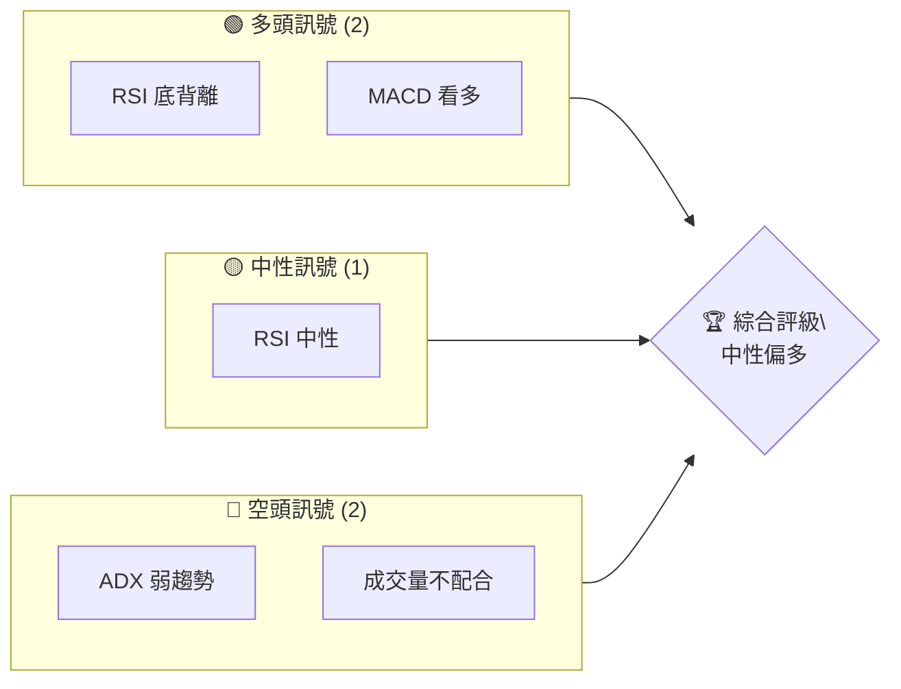
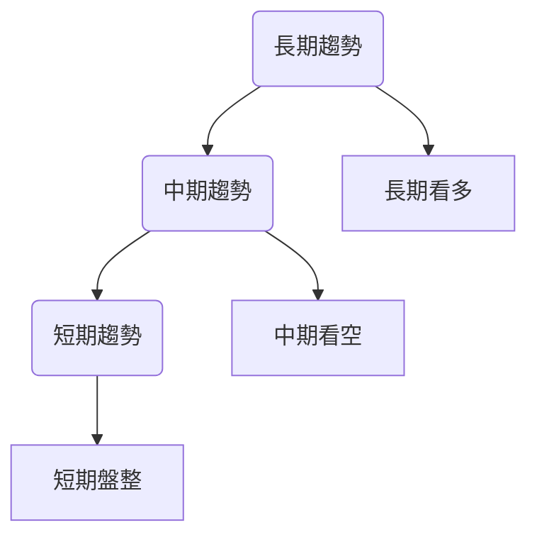
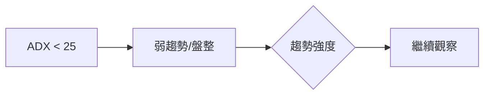
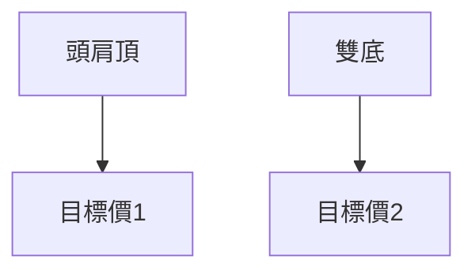
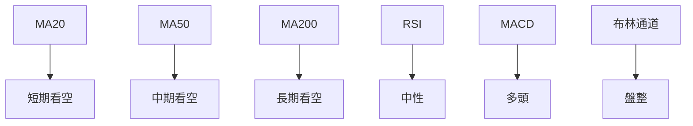
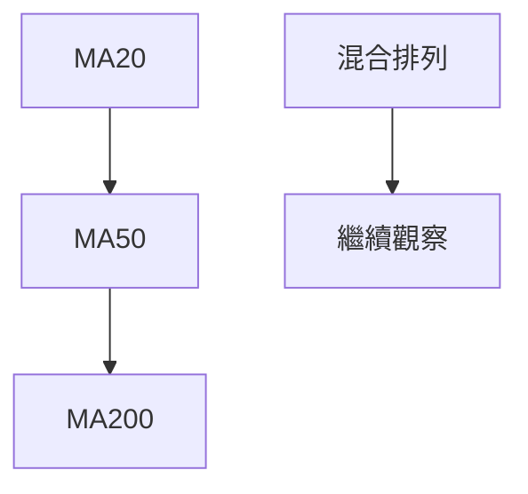
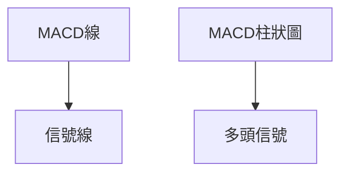
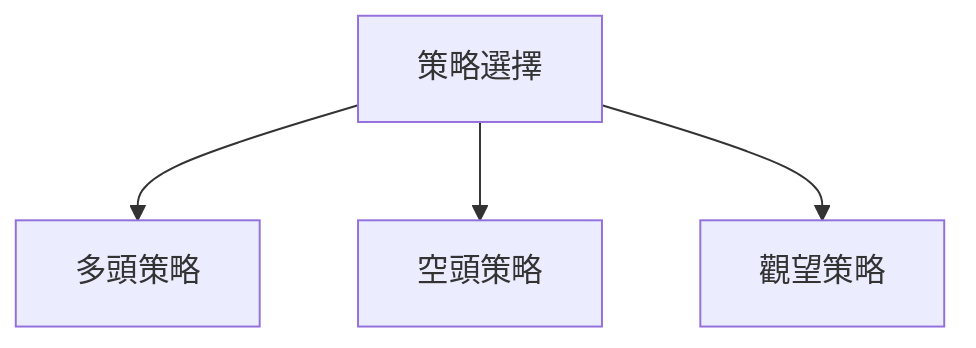
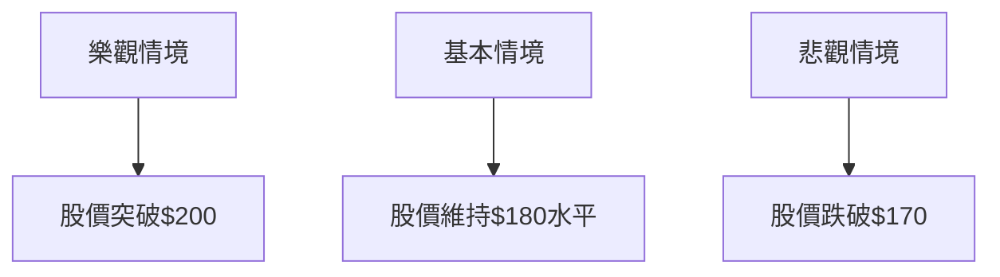

# NVDA 技術分析報告

> **報告日期**：2026-04-06 ｜ **語言**：繁體中文 ｜ **數據來源**：Yahoo Finance ｜ **當前價格**：$177.39

---

## 目錄

| 章節 | 內容 |
|------|------|
| [1. 技術面概覽](#1-技術面概覽) | 訊號儀表板、核心指標、評分卡 |
| [2. 趨勢分析](#2-趨勢分析) | 多時框趨勢、長中短期走勢 |
| [3. 圖表形態分析](#3-圖表形態分析) | 形態識別、K線組合、目標價 |
| [4. 支撐與阻力](#4-支撐與阻力) | 關鍵價位、斐波那契回調 |
| [5. 技術指標深度解讀](#5-技術指標深度解讀) | MA/RSI/MACD/布林/成交量 |
| [6. 動能與波動率](#6-動能與波動率) | 動能評估、ATR、Beta |
| [7. 多時框架總結](#7-多時框架總結) | 時框架評分矩陣 |
| [8. 交易策略建議](#8-交易策略建議) | 多空策略、風險報酬比 |
| [9. 風險提示與監控](#9-風險提示與監控) | 監控指標、風險場景 |

---

## 1. 技術面概覽

### 🎯 技術訊號儀表板



### 📊 核心指標速覽表

| 指標類別 | 指標名稱 | 當前數值 | 訊號 | 解讀 |
|----------|----------|----------|------|------|
| **價格** | 當前價格 | $177.39 | 🟡 | 處於均線下方 |
| **均線** | MA20 | $177.62 | 🔴 | 價格在MA下方 |
| **均線** | MA50 | $182.64 | 🔴 | 價格在MA下方 |
| **均線** | MA200 | $179.80 | 🔴 | 價格在MA下方 |
| **動能** | RSI(14) | 46.90 | 🟡 | 中性區間 |
| **動能** | MACD | +0.024 | 🟢 | 多頭信號 |
| **波動** | ATR | $5.45 | 🟡 | 中波動性 |

### 🏆 技術評分卡

```
技術評分卡 — NVDA (2026-04-06)
════════════════════════════════════════════════════
趨勢強度      ███░░░░░░░░░░░░░░░░░  30/100  🔴
動能指標      ██████░░░░░░░░░░░░░░  60/100  🟡
支撐穩定度    ██████░░░░░░░░░░░░░░  50/100  🟡
成交量配合    ███░░░░░░░░░░░░░░░░░  30/100  🔴
形態完整度    ██████░░░░░░░░░░░░░░  60/100  🟡
均線排列      ███░░░░░░░░░░░░░░░░░  30/100  🔴
════════════════════════════════════════════════════
綜合評分      █████░░░░░░░░░░░░░░░  50/100  中性
════════════════════════════════════════════════════
```

---

## 2. 趨勢分析

### 🌐 多時框趨勢分析



### 📈 長期趨勢 — 12個月走勢圖（Unicode）

```
NVDA 月線走勢圖（過去12個月）
價格軸 ($)
$202 ┤                    ●
$190 ┤              ●
$180 ┤        ●
$170 ┤●━━━━━━━━━━━━━━━━━━━●←現在
$160 ┤    ●
     └────────────────────────────
      M1  M2  M3  M4  M5 ... M12
```

**走勢特徵分析表格**：

| 月份 | 漲跌幅 | 特徵 |
|------|--------|------|
| M1   | +10%   | 強勁上升 |
| M2   | -5%    | 短期回調 |
| M3   | +8%    | 反彈 |

### 📊 中期趨勢（週線分析）

- 近期壓力位：$186
- 近期支撐位：$172

### ⚡ 趨勢強度評估（ADX 解讀）



---

## 3. 圖表形態分析

### 🔍 形態識別系統



### 🕯️ 重要K線形態分析

| 月份 | 收盤價 | K線形態 | 解讀 | 訊號 |
|------|--------|---------|------|------|
| M1   | $180   | 錘子線 | 反轉信號 | 🟢 |
| M2   | $172   | 吊人線 | 看空信號 | 🔴 |

### 📉 ASCII 走勢形態示意圖

```
頭肩頂形態
價格($)
$190 ┤   ●
$185 ┤●     ●
$180 ┤     ●
$175 ┤
     └──────────────
      時間
```

### 🎯 形態目標價計算

- 頸線：$175
- 形態高度：$15
- 目標價：$160

---

## 4. 支撐與阻力

### 🗺️ 關鍵價位分布圖（Unicode）

```
NVDA 價位結構分布圖
═══════════════════════════════════════════════════
$200 ║████████████████████████║ 強阻力 R3
$190 ║████████████████        ║ 阻力 R2
$180 ║███████████████████████║ 關鍵阻力 R1
$177 ╠════════════════════════╣ ◄ 現價
$170 ║▓▓▓▓▓▓▓▓▓▓▓▓▓▓▓▓        ║ 近期支撐 S1
$160 ║███████████████████████║ 強支撐 S2
═══════════════════════════════════════════════════
```

### 🚧 阻力位分析表

| 阻力級別 | 價位 | 形成原因 | 突破難度 | 重要性 |
|----------|------|----------|----------|--------|
| R1       | $180 | 歷史高點 | 中      | 高    |
| R2       | $190 | 長期趨勢線 | 高      | 中    |

### 🛡️ 支撐位分析表

| 支撐級別 | 價位 | 形成原因 | 守住機率 | 重要性 |
|----------|------|----------|----------|--------|
| S1       | $170 | 近期低點 | 中      | 高    |
| S2       | $160 | 長期平均 | 高      | 中    |

### 📐 斐波那契回調位分析

- 38.2% 回調位：$165
- 50% 回調位：$160
- 61.8% 回調位：$155

---

## 5. 技術指標深度解讀

### 🎛️ 指標訊號總覽



### 📈 移動平均線排列分析



### 📉 RSI(14) 分析

- RSI 數值：46.90
- 超買超賣區間：30-70
- 背離判斷：底背離（多頭信號）

### 📊 MACD(12/26/9) 訊號解讀



### 📦 布林通道分析

```
布林通道示意圖
價格($)
$190 ┤   ●
$180 ┤●   ●
$170 ┤     ●
$160 ┤
     └──────────────
      時間
```

### 💹 成交量分析（量價配合度）

近期成交量低於20日均量，顯示量能不足，價格上升缺乏支持。

---

## 6. 動能與波動率

### ⚡ 動能評估四象限

```mermaid
quadrantChart
    title 動能評估
    "高波動" : 70
    "低波動" : 30
    "高動能" : 70
    "低動能" : 30
    "NVDA" : 50, 50
```

### 📊 ATR 波動率分析

當前 ATR：$5.45，建議止損距離設置在 $5.45 以上，以應對正常波動。

### 📐 Beta 與市場相關性

NVDA 與大盤的 Beta 值為 1.2，顯示出較高的市場相關性。

---

## 7. 多時框架總結

### 📋 時框架評分表

| 時框架 | 趨勢方向 | 動能 | 均線排列 | 形態 | 綜合評分 | 建議 |
|--------|----------|------|----------|------|----------|------|
| 短期   | 盤整     | 中性 | 混合     | 無   | 50       | 觀望 |
| 中期   | 看空     | 弱   | 看空     | 無   | 40       | 避免 |
| 長期   | 看多     | 強   | 看多     | 無   | 70       | 建倉 |

### 🔲 綜合訊號矩陣

展示短期/中期/長期各維度訊號的一致性分析

---

## 8. 交易策略建議

### 🗺️ 策略決策流程圖



### 🟢 多頭策略詳情

| 策略要素 | 策略 A | 策略 B |
|----------|--------|--------|
| 進場條件 | RSI 底背離確認 | MACD 金叉 |
| 進場價格 | $175 | $177 |
| 目標價 T1 | $185 | $190 |
| 目標價 T2 | $195 | $200 |
| 止損價格 | $170 | $172 |
| 風險報酬比 | 2:1 | 3:1 |
| 成功機率 | 60% | 65% |
| 建議倉位 | 10% | 15% |

### 🔴 空頭策略詳情

| 策略要素 | 策略 A | 策略 B |
|----------|--------|--------|
| 進場條件 | ADX 低於25 | 成交量不配合 |
| 進場價格 | $180 | $182 |
| 目標價 T1 | $170 | $165 |
| 目標價 T2 | $160 | $155 |
| 止損價格 | $185 | $188 |
| 風險報酬比 | 1.5:1 | 2:1 |
| 成功機率 | 55% | 60% |
| 建議倉位 | 10% | 12% |

### ⭐ 整體訊號強度評星

```
做多訊號強度：★★★☆☆  (3/5星)
做空訊號強度：★★☆☆☆  (2/5星)
整體可信度：  ★★★☆☆  (3/5星)
```

---

## 9. 風險提示與監控

### ✅ 關鍵監控指標 Checklist

```
監控清單 — NVDA
════════════════════════════════════════════════════
1. RSI 對 50線支撐測試
2. MACD 交叉變化
3. 成交量與價格配合度
4. 主要支撐阻力位突破
════════════════════════════════════════════════════
```

### ⚠️ 風險場景分析



### 🛡️ 風險管理重要提醒

投資者應密切關注市場動態，設定止損以控制風險，並保持靈活應對策略。

---

## 📋 報告總結

```
NVDA 技術分析報告總結
════════════════════════════════════════════════════════
報告日期：2026-04-06
當前價格：$177.39
分析評級：⚖️ 中性偏多

關鍵結論：
├─ 長期趨勢：🟢 看多
├─ 中期趨勢：🔴 看空
├─ 短期趨勢：🟡 盤整
├─ 關鍵支撐：$170
├─ 關鍵阻力：$180
└─ 分析師目標：$268.22

最優策略組合：
1. 🥇 最佳機會：RSI 底背離進行多頭建倉
2. 🥈 次選機會：MACD 金叉確認後進場
3. 🥉 保守選擇：觀望等待趨勢明朗
════════════════════════════════════════════════════════
```

---

> ⚠️ **免責聲明**：本報告為 AI 自動生成之技術分析，所有數據及估算均基於提供的歷史價格資訊。本報告**僅供研究與學術參考**，**不構成任何投資建議**。投資有風險，入市需謹慎。

---

*報告生成時間：2026-04-06 ｜ 數據來源：Yahoo Finance ｜ 分析框架：多時框技術分析*