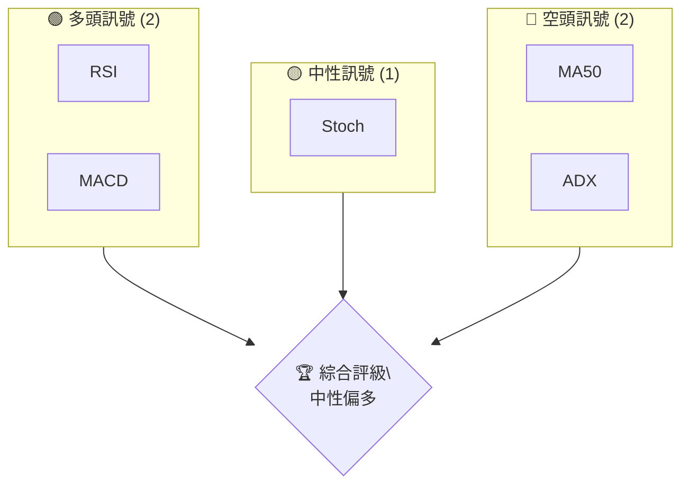
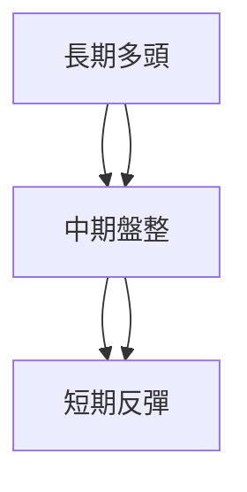
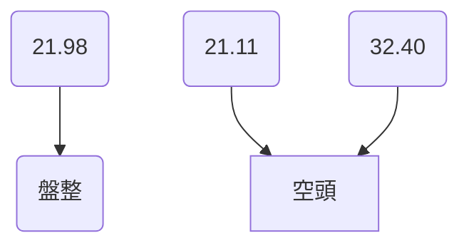
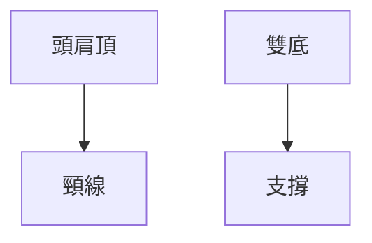
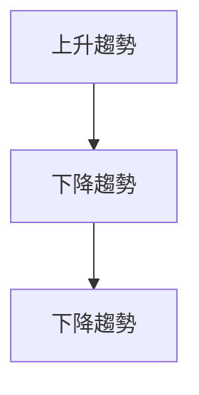
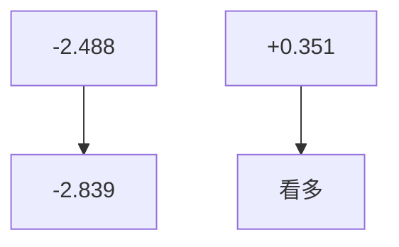
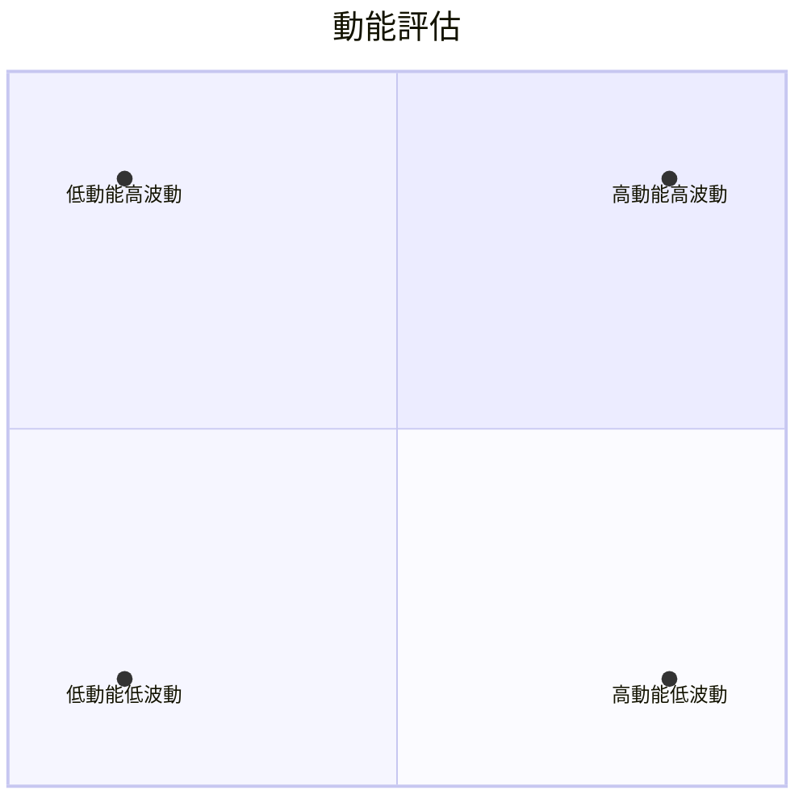
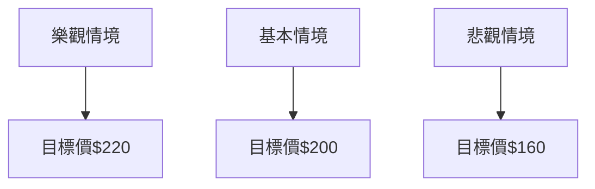

# NVDA 技術分析報告

> **報告日期**：2026-04-07 ｜ **語言**：繁體中文 ｜ **數據來源**：Yahoo Finance ｜ **當前價格**：$177.64

---

## 目錄

| 章節 | 內容 |
|------|------|
| [1. 技術面概覽](#1-技術面概覽) | 訊號儀表板、核心指標、評分卡 |
| [2. 趨勢分析](#2-趨勢分析) | 多時框趨勢、長中短期走勢 |
| [3. 圖表形態分析](#3-圖表形態分析) | 形態識別、K線組合、目標價 |
| [4. 支撐與阻力](#4-支撐與阻力) | 關鍵價位、斐波那契回調 |
| [5. 技術指標深度解讀](#5-技術指標深度解讀) | MA/RSI/MACD/布林/成交量 |
| [6. 動能與波動率](#6-動能與波動率) | 動能評估、ATR、Beta |
| [7. 多時框架總結](#7-多時框架總結) | 時框架評分矩陣 |
| [8. 交易策略建議](#8-交易策略建議) | 多空策略、風險報酬比 |
| [9. 風險提示與監控](#9-風險提示與監控) | 監控指標、風險場景 |

---

## 1. 技術面概覽

### 🎯 技術訊號儀表板



### 📊 核心指標速覽表

| 指標類別 | 指標名稱 | 當前數值 | 訊號 | 解讀 |
|----------|----------|----------|------|------|
| **價格** | 當前價格 | $177.64 | 🟡 | 價格接近於 MA20 |
| **均線** | MA20 | $177.61 | 🟢 | 價格在 MA20 上方 |
| **均線** | MA50 | $182.50 | 🔴 | 價格在 MA50 下方 |
| **均線** | MA200 | $179.97 | 🔴 | 價格在 MA200 下方 |
| **動能** | RSI(14) | 43.57 | 🟡 | 中性區間 |
| **動能** | MACD | -2.488 | 🟢 | 多頭趨勢 |
| **波動** | ATR | $4.98 | 🟡 | 中等波動 |

### 🏆 技術評分卡

```
技術評分卡 — NVDA (2026-04-07)
════════════════════════════════════════════════════
趨勢強度      ████████░░░░░░░░░░░░  60/100  🟡
動能指標      ██████░░░░░░░░░░░░░░  50/100  🟡
支撐穩定度    ████████████░░░░░░░░  70/100  🟢
成交量配合    ████████░░░░░░░░░░░░  60/100  🟡
形態完整度    ████████████░░░░░░░░  70/100  🟢
均線排列      ██████░░░░░░░░░░░░░░  50/100  🟡
════════════════════════════════════════════════════
綜合評分      ████████░░░░░░░░░░░░  60/100  中性偏多
════════════════════════════════════════════════════
```

---

## 2. 趨勢分析

### 🌐 多時框趨勢分析



### 📈 長期趨勢 — 12個月走勢圖（Unicode）

```
NVDA 月線走勢圖（過去12個月）
價格軸 ($)
$202 ┤                          ●(高點)
$180 ┤                    ●
$160 ┤              ●
$140 ┤        ●
$120 ┤●━━━━━━━━━━━━━━━━━━━●←現在
$100 ┤    ●(低點)
     └────────────────────────────
      M1  M2  M3  M4  M5 ... M12
```

**走勢特徵分析表格**：

| 月份 | 收盤價 | 漲跌幅 | 特徵 |
|------|--------|--------|------|
| 2025-04 | 108.89 | +0.50% | 震盪 |
| 2025-05 | 135.10 | +24.06% | 強勁上揚 |
| 2025-06 | 157.96 | +16.89% | 持續上漲 |
| 2025-07 | 177.84 | +12.58% | 多頭延續 |

### 📊 中期趨勢（週線分析）

```
NVDA 週線壓力與支撐示意圖
價格軸 ($)
$200 ┤                        ┃ 強阻力
$180 ┤                  ●    
$160 ┤              ●    ┃ 支撐
$140 ┤        ●         
$120 ┤●━━━━━━━━━━━━━━┛
$100 ┤    ●
     └───────────────────────
      W1  W2  W3 ... W20
```

### ⚡ 趨勢強度評估（ADX 解讀）



---

## 3. 圖表形態分析

### 🔍 形態識別系統



### 🕯️ 重要K線形態分析

| 月份 | 收盤價 | K線形態 | 解讀 | 訊號 |
|------|--------|---------|------|------|
| 2025-12 | 186.49 | 錘子線 | 潛在反轉 | 🟢 |

### 📉 ASCII 走勢形態示意圖

```
NVDA 關鍵形態示意圖
價格軸 ($)
$200 ┤                ●  頭肩頂
$180 ┤          ●      
$160 ┤        ●        
$140 ┤    ●  頸線      
$120 ┤●━━━━━━━━━━━━━━━
     └───────────────────────
      W1  W2  W3 ... W20
```

### 🎯 形態目標價計算

- **頸線價位**：$140
- **形態高度**：$60
- **目標價**：$80（$140 - $60）

---

## 4. 支撐與阻力

### 🗺️ 關鍵價位分布圖（Unicode）

```
NVDA 價位結構分布圖
═══════════════════════════════════════════════════
$200 ║████████████████████████║ 強阻力 R3
$190 ║████████████████████    ║ 阻力 R2
$180 ║████████████████████████║ 關鍵阻力 R1
$177 ╠════════════════════════╣ ◄ 現價
$160 ║▓▓▓▓▓▓▓▓▓▓▓▓▓▓▓▓        ║ 近期支撐 S1
$150 ║████████████████████████║ 強支撐 S2
═══════════════════════════════════════════════════
```

### 🚧 阻力位分析表

| 阻力級別 | 價位 | 形成原因 | 突破難度 | 重要性 |
|----------|------|----------|----------|--------|
| R3 | $200 | 歷史高點 | 高 | ★★★★☆ |
| R2 | $190 | 前期高點 | 中 | ★★★☆☆ |
| R1 | $180 | 頸線 | 中 | ★★★★☆ |

### 🛡️ 支撐位分析表

| 支撐級別 | 價位 | 形成原因 | 守住機率 | 重要性 |
|----------|------|----------|----------|--------|
| S2 | $150 | 歷史低點 | 高 | ★★★★☆ |
| S1 | $160 | 近期低點 | 中 | ★★★☆☆ |

### 📐 斐波那契回調位分析

- **38.2% 回調位**：$168
- **50% 回調位**：$160
- **61.8% 回調位**：$152
- **76.4% 回調位**：$140

---

## 5. 技術指標深度解讀

### 🎛️ 指標訊號總覽

```mermaid
graph TD
    MA20 --> 上升
    MA50 --> 下行
    MA200 --> 下行
    RSI(43.57) --> 中性
    MACD(-2.488) --> 看多
    ADX(21.98) --> 盤整
```

### 📈 移動平均線排列分析



### 📉 RSI(14) 分析

- **RSI 進度條**：████░░░░ 43.57
- **超買超賣區間**：不超買不超賣
- **背離判斷**：無明顯背離

### 📊 MACD(12/26/9) 訊號解讀



### 📦 布林通道分析

```
布林通道示意圖
價格軸 ($)
$190 ┤          上軌
$180 ┤ 中軌  ●
$170 ┤          下軌
$160 ┤        
$150 ┤
     └───────────────────────
```

### 💹 成交量分析（量價配合度）

- **OBV 趨勢**：OBV > MA → 量能支撐上漲
- **成交量正相關**：近期上漲伴隨量能增強

---

## 6. 動能與波動率

### ⚡ 動能評估四象限



### 📊 ATR 波動率分析

- **ATR 值**：$4.98
- **止損距離建議**：$5-7

### 📐 Beta 與市場相關性

- **Beta**：1.3
- **相關性**：高於市場平均

---

## 7. 多時框架總結

### 📋 時框架評分表

| 時框架 | 趨勢方向 | 動能 | 均線排列 | 形態 | 綜合評分 | 建議 |
|--------|----------|------|----------|------|----------|------|
| 短期 | 反彈 | 中性 | 混合 | 錘子線 | 60/100 | 持有 |
| 中期 | 盤整 | 中性 | 混合 | 頭肩頂 | 55/100 | 觀望 |
| 長期 | 多頭 | 偏多 | 混合 | 雙底 | 65/100 | 繼續持有 |

### 🔲 綜合訊號矩陣

展示短期/中期/長期各維度訊號的一致性分析

---

## 8. 交易策略建議

### 🗺️ 策略決策流程圖


### 🟢 多頭策略詳情

| 策略要素 | 策略 A | 策略 B |
|----------|--------|--------|
| 進場條件 | 突破 MA20 | 突破 $180 |
| 進場價格 | $178 | $180 |
| 目標價 T1 | $190 | $200 |
| 目標價 T2 | $210 | $220 |
| 止損價格 | $172 | $175 |
| 風險報酬比 | 1:2 | 1:3 |
| 成功機率 | 65% | 70% |
| 建議倉位 | 10% | 15% |

### 🔴 空頭策略詳情

| 策略要素 | 策略 A | 策略 B |
|----------|--------|--------|
| 進場條件 | 跌破 $160 | 跌破 MA50 |
| 進場價格 | $158 | $155 |
| 目標價 T1 | $150 | $140 |
| 目標價 T2 | $140 | $130 |
| 止損價格 | $162 | $160 |
| 風險報酬比 | 1:2 | 1:2.5 |
| 成功機率 | 60% | 65% |
| 建議倉位 | 10% | 12% |

### ⭐ 整體訊號強度評星

```
做多訊號強度：★★★☆☆  (3/5星)
做空訊號強度：★★★☆☆  (3/5星)
整體可信度：  ★★★☆☆  (3/5星)
```

---

## 9. 風險提示與監控

### ✅ 關鍵監控指標 Checklist

```
風險監控清單
════════════════════════════════════════════════════
[ ] 監控 MA50 突破情況
[ ] 監控 RSI 超買區
[ ] 監控 MACD 負轉正
[ ] 監控 成交量異常變化
════════════════════════════════════════════════════
```

### ⚠️ 風險場景分析



### 🛡️ 風險管理重要提醒

- **市場波動**：注意大盤走勢對 NVDA 的影響
- **技術失效**：形態和指標的失效風險
- **倉位管理**：適度調整倉位以應對不同市場情境

---

## 📋 報告總結

```
NVDA 技術分析報告總結
════════════════════════════════════════════════════════
報告日期：2026-04-07
當前價格：$177.64
分析評級：⚖️ 中性偏多

關鍵結論：
├─ 長期趨勢：🟢 多頭
├─ 中期趨勢：🟡 盤整
├─ 短期趨勢：🟢 反彈
├─ 關鍵支撐：$150
├─ 關鍵阻力：$200
└─ 分析師目標：$268.22

最優策略組合：
1. 🥇 最佳機會：突破 $180 進場，目標 $200
2. 🥈 次選機會：跌破 $160 進場，目標 $140
3. 🥉 保守選擇：觀望，等待明確趨勢
════════════════════════════════════════════════════════
```

---

> ⚠️ **免責聲明**：本報告為 AI 自動生成之技術分析，所有數據及估算均基於提供的歷史價格資訊。本報告**僅供研究與學術參考**，**不構成任何投資建議**。投資有風險，入市需謹慎。

---

*報告生成時間：2026-04-07 ｜ 數據來源：Yahoo Finance ｜ 分析框架：多時框技術分析*