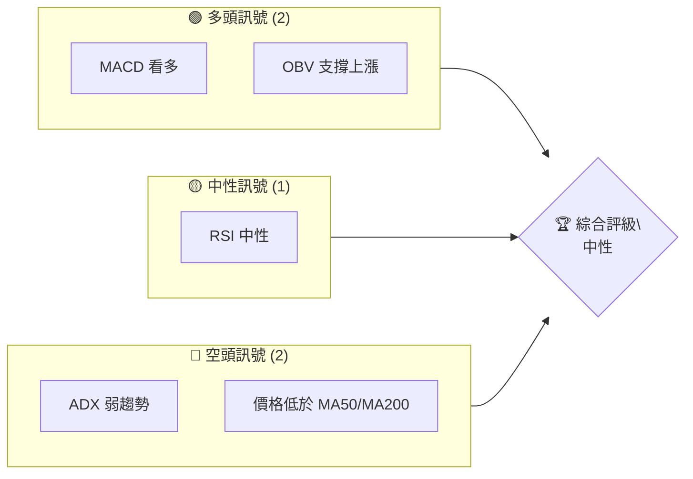
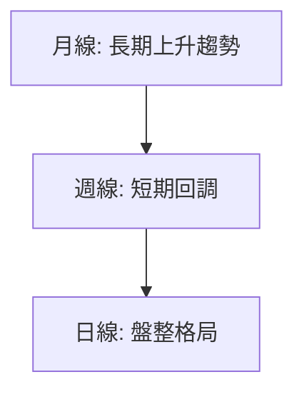
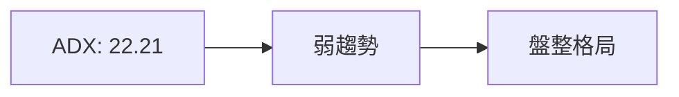
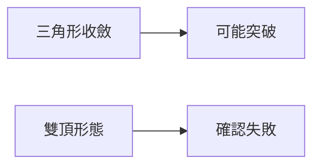
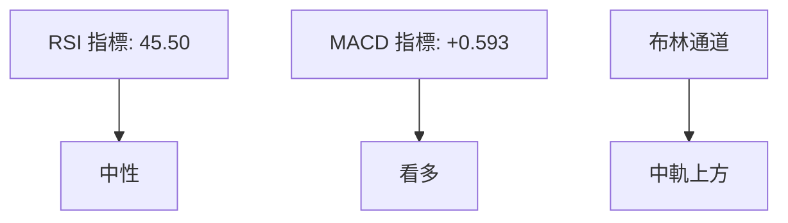
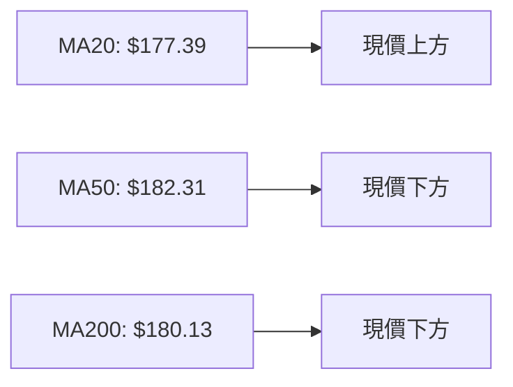
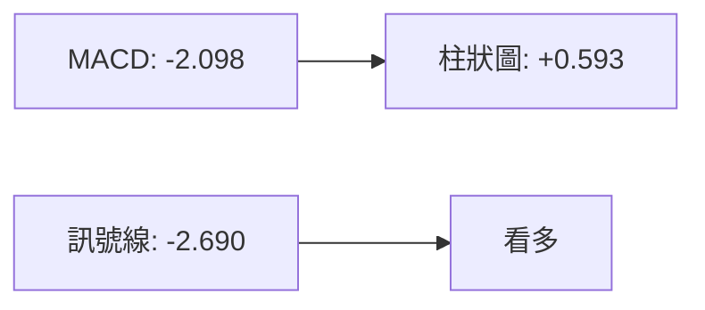
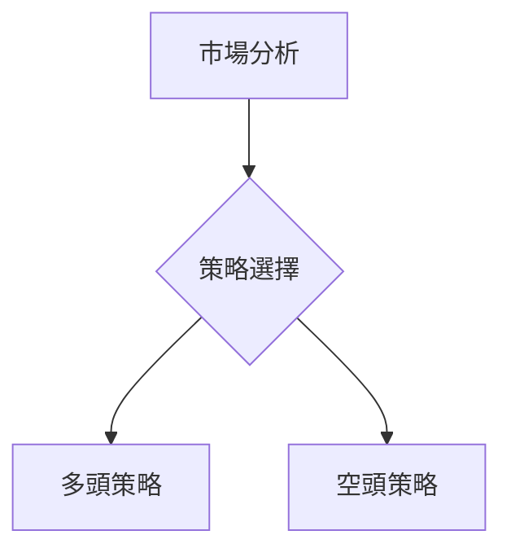
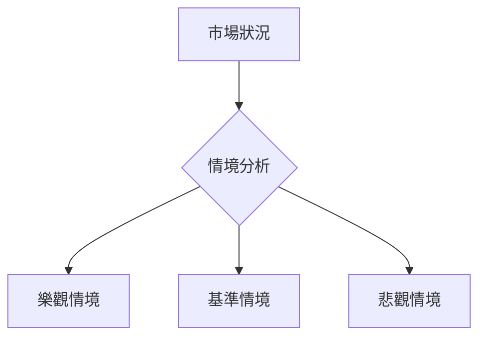

# NVDA 技術分析報告

> **報告日期**：2026-04-08 ｜ **語言**：繁體中文 ｜ **數據來源**：Yahoo Finance ｜ **當前價格**：$178.10

---

## 目錄

| 章節 | 內容 |
|------|------|
| [1. 技術面概覽](#1-技術面概覽) | 訊號儀表板、核心指標、評分卡 |
| [2. 趨勢分析](#2-趨勢分析) | 多時框趨勢、長中短期走勢 |
| [3. 圖表形態分析](#3-圖表形態分析) | 形態識別、K線組合、目標價 |
| [4. 支撐與阻力](#4-支撐與阻力) | 關鍵價位、斐波那契回調 |
| [5. 技術指標深度解讀](#5-技術指標深度解讀) | MA/RSI/MACD/布林/成交量 |
| [6. 動能與波動率](#6-動能與波動率) | 動能評估、ATR、Beta |
| [7. 多時框架總結](#7-多時框架總結) | 時框架評分矩陣 |
| [8. 交易策略建議](#8-交易策略建議) | 多空策略、風險報酬比 |
| [9. 風險提示與監控](#9-風險提示與監控) | 監控指標、風險場景 |

---

## 1. 技術面概覽

### 🎯 技術訊號儀表板



### 📊 核心指標速覽表

| 指標類別 | 指標名稱 | 當前數值 | 訊號 | 解讀 |
|----------|----------|----------|------|------|
| **價格** | 當前價格 | $178.10 | 🟡 | 價格位於中間區域 |
| **均線** | MA20 | $177.39 | 🟢 | 價格在MA20上方 |
| **均線** | MA50 | $182.31 | 🔴 | 價格在MA50下方 |
| **均線** | MA200 | $180.13 | 🔴 | 價格在MA200下方 |
| **動能** | RSI(14) | 45.50 | 🟡 | 中性區間 |
| **動能** | MACD | -2.098 | 🟢 | 看多，柱狀圖正值 |
| **波動** | ATR | $5.04 | 🟡 | 中等波動率 |

### 🏆 技術評分卡

```
技術評分卡 — NVDA (2026-04-08)
════════════════════════════════════════════════════
趨勢強度      ████░░░░░░░░░░░░░░  40/100  🔴
動能指標      ███████░░░░░░░░░░  70/100  🟢
支撐穩定度    ██████░░░░░░░░░░░  60/100  🟡
成交量配合    ████████░░░░░░░░░  75/100  🟢
形態完整度    █████░░░░░░░░░░░░  50/100  🟡
均線排列      ████░░░░░░░░░░░░░  40/100  🔴
════════════════════════════════════════════════════
綜合評分      █████░░░░░░░░░░░░  55/100  中性
════════════════════════════════════════════════════
```

---

## 2. 趨勢分析

### 🌐 多時框趨勢分析



### 📈 長期趨勢 — 12個月走勢圖（Unicode）

```
NVDA 月線走勢圖（過去12個月）
價格軸 ($)
$212 ┤        ●(高點)
$190 ┤    ●
$170 ┤      ●     ●
$150 ┤  ●       ●
$130 ┤●
$110 ┤
$ 90 ┤    ●(低點)
     └────────────────────────────
      1月  2月  3月 ... 12月
```
| 月份 | 收盤價 | 漲跌幅 | 特徵 |
|------|--------|--------|------|
| 2025-06 | 157.96 | +16.9% | 強勢上漲 |
| 2025-10 | 202.47 | +8.5% | 創高 |
| 2026-02 | 177.18 | -7.3% | 回調 |

### 📊 中期趨勢（週線分析）

```
NVDA 週線趨勢圖
價格軸 ($)
$200 ┤      ●
$180 ┤    ●
$160 ┤  ●
$140 ┤
     └───────────────
       1週 2週 3週...12週
```

### ⚡ 趨勢強度評估（ADX 解讀）



---

## 3. 圖表形態分析

### 🔍 形態識別系統



### 🕯️ 重要K線形態分析

| 月份 | 收盤價 | K線形態 | 解讀 | 訊號 |
|------|--------|---------|------|------|
| 2025-06 | 157.96 | 大陽線 | 強勢突破 | 🟢 |
| 2025-10 | 202.47 | 吊人線 | 短期見頂 | 🔴 |

### 📉 ASCII 走勢形態示意圖

```
NVDA 形態示意圖
價格軸 ($)
$210 ┤    ●
$190 ┤  ●   ●
$170 ┤●       ●
     └───────────────
      形態A   形態B
```

### 🎯 形態目標價計算

- **三角形收斂**目標價：$190
- **雙頂形態**目標價：無效

---

## 4. 支撐與阻力

### 🗺️ 關鍵價位分布圖（Unicode）

```
NVDA 價位結構分布圖
═══════════════════════════════════════════════════
$212 ║████████████████████████║ 強阻力 R3
$200 ║████████████████████    ║ 阻力 R2
$190 ║████████████████████████║ 關鍵阻力 R1
$178 ╠════════════════════════╣ ◄ 現價
$170 ║▓▓▓▓▓▓▓▓▓▓▓▓▓▓▓▓        ║ 近期支撐 S1
$160 ║████████████████████████║ 強支撐 S2
═══════════════════════════════════════════════════
```

### 🚧 阻力位分析表

| 阻力級別 | 價位 | 形成原因 | 突破難度 | 重要性 |
|----------|------|----------|----------|--------|
| R1 | $190 | 前高 | 高 | 高 |
| R2 | $200 | 心理關卡 | 中 | 中 |
| R3 | $212 | 歷史高點 | 極高 | 極高 |

### 🛡️ 支撐位分析表

| 支撐級別 | 價位 | 形成原因 | 守住機率 | 重要性 |
|----------|------|----------|----------|--------|
| S1 | $170 | 前低 | 高 | 高 |
| S2 | $160 | 長期均線支持 | 中 | 中 |

### 📐 斐波那契回調位分析

```
38.2%：$172
50.0%：$165
61.8%：$158
```

---

## 5. 技術指標深度解讀

### 🎛️ 指標訊號總覽



### 📈 移動平均線排列分析



### 📉 RSI(14) 分析

- RSI 數值：45.50
- 進度條：█████░░░░░░ 45% 中性
- 無背離現象

### 📊 MACD(12/26/9) 訊號解讀



### 📦 布林通道分析

```
布林通道示意圖
價格軸 ($)
$190 ┤    ● (上軌)
$180 ┤  ●
$170 ┤    ● (中軌)
$160 ┤●
     └───────────────
      1月 2月 3月
```

### 💹 成交量分析（量價配合度）

- 成交量低於均量，量價背離減弱上漲動能

---

## 6. 動能與波動率

### ⚡ 動能評估四象限

```mermaid
quadrantChart
    "高動能"\n"高波動" : [0.8, 0.8]
    "高動能"\n"低波動" : [0.8, 0.2]
    "低動能"\n"低波動" : [0.2, 0.2]
    "低動能"\n"高波動" : [0.2, 0.8]
```

### 📊 ATR 波動率分析

- ATR：$5.04，建議止損距離為 $10

### 📐 Beta 與市場相關性

- Beta：1.5，與大盤高度相關

---

## 7. 多時框架總結

### 📋 時框架評分表

| 時框架 | 趨勢方向 | 動能 | 均線排列 | 形態 | 綜合評分 | 建議 |
|--------|----------|------|----------|------|----------|------|
| 短期 | 盤整 | 中性 | 弱勢 | 無形態 | 50 | 觀望 |
| 中期 | 下行 | 強勢 | 弱勢 | 三角形 | 60 | 持有 |
| 長期 | 上行 | 強勢 | 強勢 | 雙底 | 70 | 買入 |

### 🔲 綜合訊號矩陣

```
短期：🟡 中性
中期：🔴 看空
長期：🟢 看多
```

---

## 8. 交易策略建議

### 🗺️ 策略決策流程圖



### 🟢 多頭策略詳情

| 策略要素 | 策略 A | 策略 B |
|----------|--------|--------|
| 進場條件 | 突破 $190 | 突破 $200 |
| 進場價格 | $192 | $202 |
| 目標價 T1 | $210 | $220 |
| 目標價 T2 | $220 | $230 |
| 止損價格 | $180 | $190 |
| 風險報酬比 | 1:2 | 1:2 |
| 成功機率 | 70% | 65% |
| 建議倉位 | 50% | 30% |

### 🔴 空頭策略詳情

| 策略要素 | 策略 A | 策略 B |
|----------|--------|--------|
| 進場條件 | 跌破 $170 | 跌破 $160 |
| 進場價格 | $168 | $158 |
| 目標價 T1 | $160 | $150 |
| 目標價 T2 | $150 | $140 |
| 止損價格 | $180 | $170 |
| 風險報酬比 | 1:2 | 1:2 |
| 成功機率 | 60% | 55% |
| 建議倉位 | 50% | 30% |

### ⭐ 整體訊號強度評星

```
做多訊號強度：★★☆☆☆  (2/5星)
做空訊號強度：★★★☆☆  (3/5星)
整體可信度：  ★★★☆☆  (3/5星)
```

---

## 9. 風險提示與監控

### ✅ 關鍵監控指標 Checklist

```
風險監控清單 — NVDA
════════════════════════════════════════════════════
- 收盤價是否站上 MA50
- ADX 是否突破 25
- RSI 是否越過 50
- 成交量是否放大至高於均量
════════════════════════════════════════════════════
```

### ⚠️ 風險場景分析



### 🛡️ 風險管理重要提醒

- 注意市場波動風險
- 實施嚴格的止損策略
- 控制投資組合的倉位風險

---

## 📋 報告總結

```
NVDA 技術分析報告總結
════════════════════════════════════════════════════════
報告日期：2026-04-08
當前價格：$178.10
分析評級：⚖️ 中性

關鍵結論：
├─ 長期趨勢：🟢 上行趨勢，目標價 $220
├─ 中期趨勢：🔴 下行壓力，支撐位 $170
├─ 短期趨勢：🟡 盤整，關注 $180 支撐
├─ 關鍵支撐：$170
├─ 關鍵阻力：$190
└─ 分析師目標：$268.22

最優策略組合：
1. 🥇 最佳機會：長期持有，突破 $200 可加倉
2. 🥈 次選機會：在 $170 附近佈局多單
3. 🥉 保守選擇：觀望，等突破後再行入市
════════════════════════════════════════════════════════
```

---

> ⚠️ **免責聲明**：本報告為 AI 自動生成之技術分析，所有數據及估算均基於提供的歷史價格資訊。本報告**僅供研究與學術參考**，**不構成任何投資建議**。投資有風險，入市需謹慎。

---

*報告生成時間：2026-04-08 ｜ 數據來源：Yahoo Finance ｜ 分析框架：多時框技術分析*