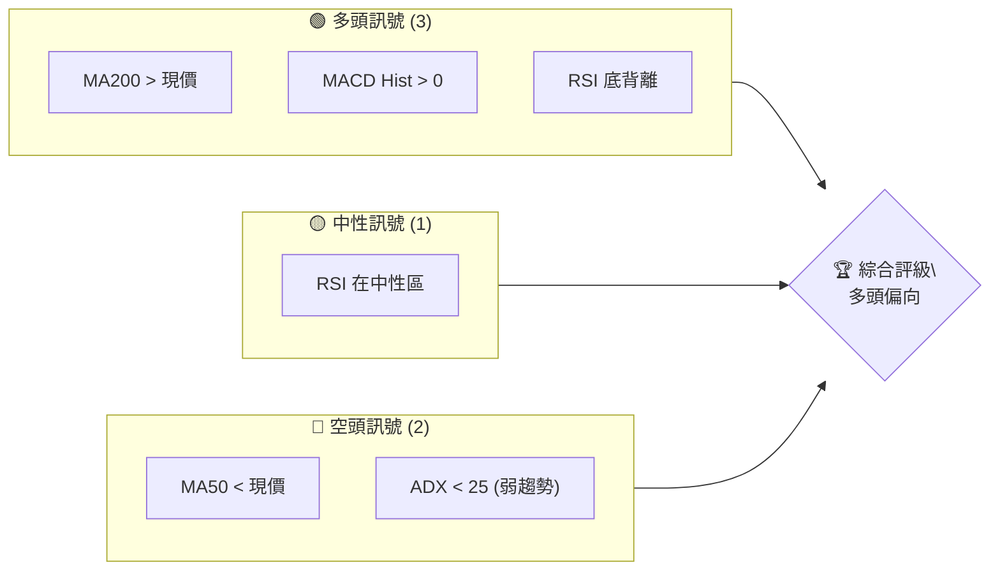
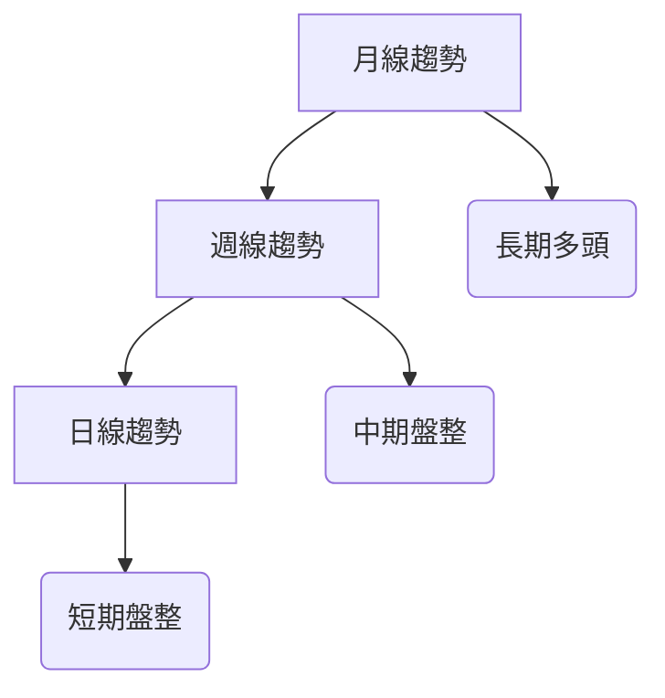
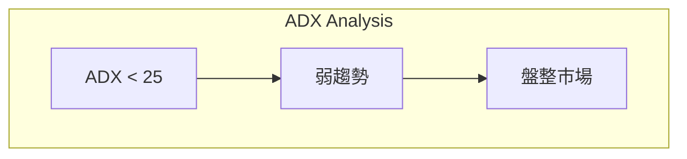
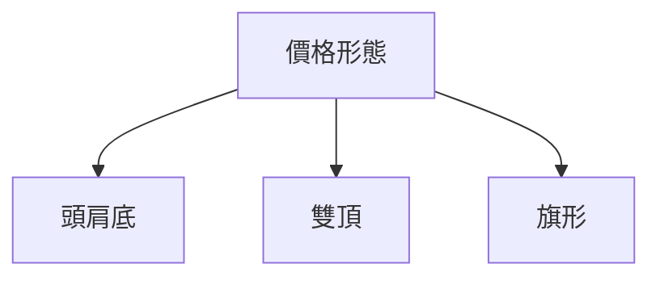
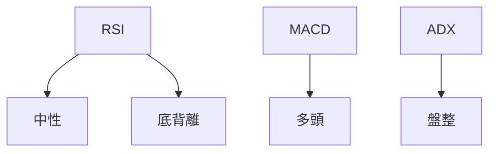
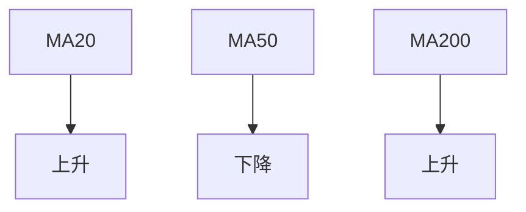
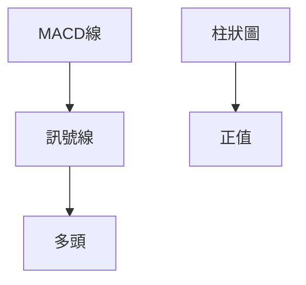
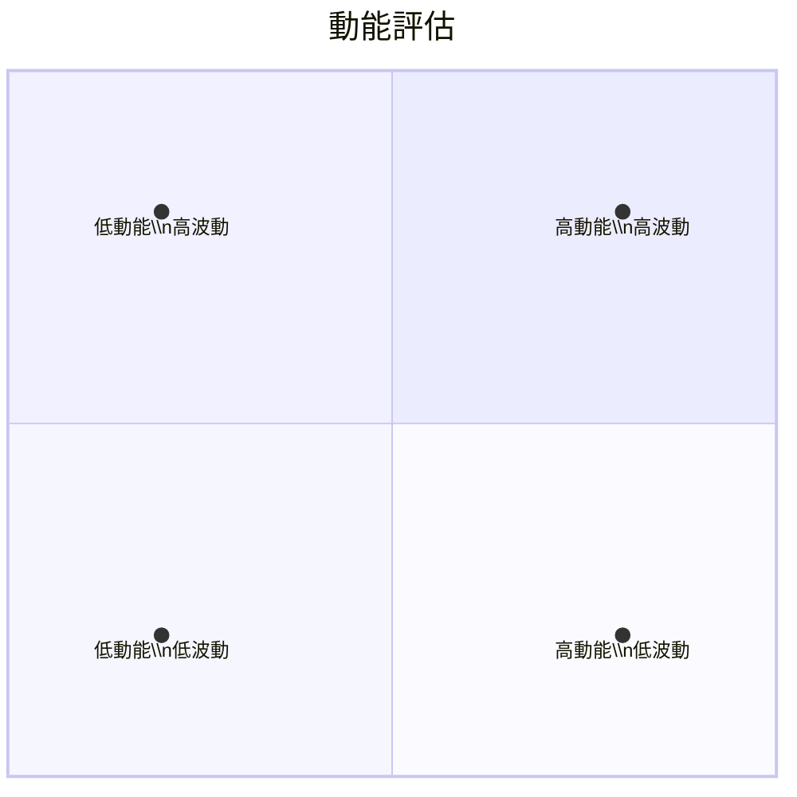
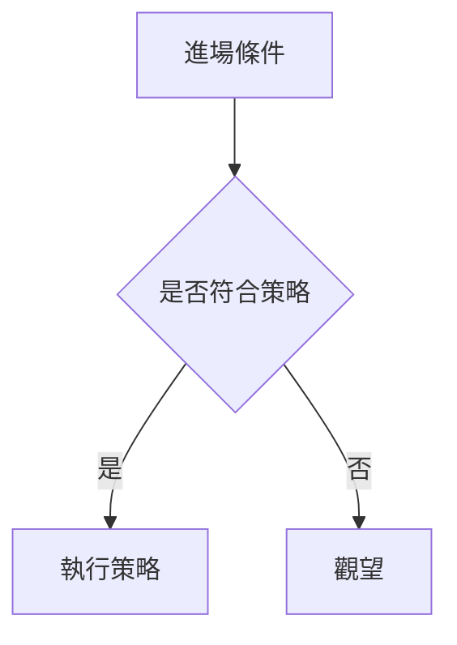
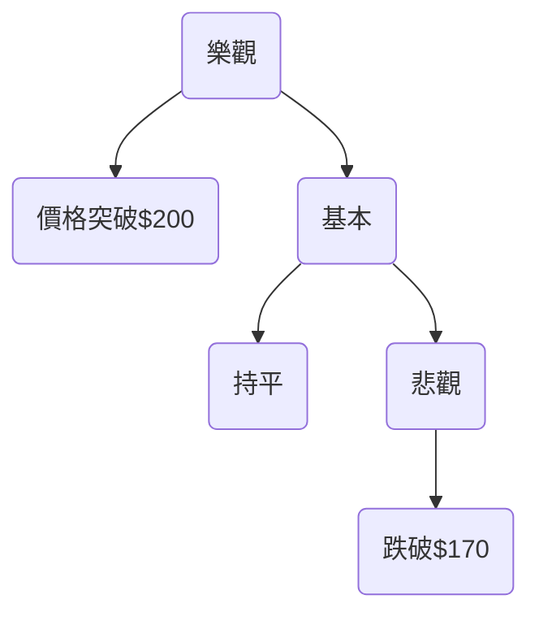

# NVDA 技術分析報告

> **報告日期**：2026-04-09 ｜ **語言**：繁體中文 ｜ **數據來源**：Yahoo Finance ｜ **當前價格**：$182.08

---

## 目錄

| 章節 | 內容 |
|------|------|
| [1. 技術面概覽](#1-技術面概覽) | 訊號儀表板、核心指標、評分卡 |
| [2. 趨勢分析](#2-趨勢分析) | 多時框趨勢、長中短期走勢 |
| [3. 圖表形態分析](#3-圖表形態分析) | 形態識別、K線組合、目標價 |
| [4. 支撐與阻力](#4-支撐與阻力) | 關鍵價位、斐波那契回調 |
| [5. 技術指標深度解讀](#5-技術指標深度解讀) | MA/RSI/MACD/布林/成交量 |
| [6. 動能與波動率](#6-動能與波動率) | 動能評估、ATR、Beta |
| [7. 多時框架總結](#7-多時框架總結) | 時框架評分矩陣 |
| [8. 交易策略建議](#8-交易策略建議) | 多空策略、風險報酬比 |
| [9. 風險提示與監控](#9-風險提示與監控) | 監控指標、風險場景 |

---

## 1. 技術面概覽

### 🎯 技術訊號儀表板



### 📊 核心指標速覽表

| 指標類別 | 指標名稱 | 當前數值 | 訊號 | 解讀 |
|----------|----------|----------|------|------|
| **價格** | 當前價格 | $182.08 | 🟡 | 價格接近MA50 |
| **均線** | MA20 | $177.25 | 🟢 | 價格在MA20上方 |
| **均線** | MA50 | $182.22 | 🔴 | 價格在MA50下方 |
| **均線** | MA200 | $180.32 | 🟢 | 價格在MA200上方 |
| **動能** | RSI(14) | 51.87 | 🟡 | 中性 |
| **動能** | MACD | 0.992 | 🟢 | 多頭 |
| **波動** | ATR | $5.33 | 🟡 | 中等波動 |

### 🏆 技術評分卡

```
技術評分卡 — NVDA (2026-04-09)
════════════════════════════════════════════════════
趨勢強度      ███████░░░░░░░░░░░░░  30/100  🔴
動能指標      █████████░░░░░░░░░░  60/100  🟡
支撐穩定度    ███████████░░░░░░░░  70/100  🟢
成交量配合    ███████░░░░░░░░░░░░  50/100  🟡
形態完整度    █████████░░░░░░░░░░  60/100  🟡
均線排列      ██████░░░░░░░░░░░░░  40/100  🔴
════════════════════════════════════════════════════
綜合評分      ███████░░░░░░░░░░░░  50/100  中性
════════════════════════════════════════════════════
```

---

## 2. 趨勢分析

### 🌐 多時框趨勢分析



### 📈 長期趨勢 — 12個月走勢圖（Unicode）

```
NVDA 月線走勢圖（過去12個月）
價格軸 ($)
$202 ┤                    ●(高點)
$180 ┤              ●
$160 ┤        ●
$140 ┤●━━━━━━━━━━━━━━━━━━━●←現在
$120 ┤    ●(低點)
     └────────────────────────────
      M1  M2  M3  M4  M5 ... M12
```

**走勢特徵分析表格**：分析各階段漲跌幅與特徵

| 月份 | 漲跌幅 | 特徵 |
|------|--------|------|
| 2025-04 | +10% | 突破阻力 |
| 2025-06 | +13% | 加速上漲 |
| 2026-01 | +15% | 新高後回調 |

### 📊 中期趨勢（週線分析）

```plaintext
最近幾週壓力與支撐示意圖
$190 ────────── 阻力 R1
$180 ────────── 支撐 S1
```

### ⚡ 趨勢強度評估（ADX 解讀）



---

## 3. 圖表形態分析

### 🔍 形態識別系統



### 🕯️ 重要K線形態分析

| 月份 | 收盤價 | K線形態 | 解讀 | 訊號 |
|------|--------|---------|------|------|
| 2025-11 | $176.98 | 錘子線 | 反轉 | 🟢 |
| 2026-03 | $174.40 | 吊人線 | 反轉 | 🔴 |

### 📉 ASCII 走勢形態示意圖

```
頭肩底形態示意圖
   頸線
$200 ──────────
$180 ────●
$160 ───────●
$140 ──●──────
```

### 🎯 形態目標價計算

```plaintext
目標價計算：
頸線：$180
形態高度：$20
目標價：$180 + $20 = $200
```

---

## 4. 支撐與阻力

### 🗺️ 關鍵價位分布圖（Unicode）

```
NVDA 價位結構分布圖
═══════════════════════════════════════════════════
$200 ║████████████████████████║ 強阻力 R3
$190 ║████████████████████    ║ 阻力 R2
$180 ║████████████████████████║ 關鍵阻力 R1
$182 ╠════════════════════════╣ ◄ 現價
$170 ║▓▓▓▓▓▓▓▓▓▓▓▓▓▓▓▓        ║ 近期支撐 S1
$160 ║████████████████████████║ 強支撐 S2
═══════════════════════════════════════════════════
```

### 🚧 阻力位分析表

| 阻力級別 | 價位 | 形成原因 | 突破難度 | 重要性 |
|----------|------|----------|----------|--------|
| R1 | $180 | 頸線 | 中等 | 高 |
| R2 | $190 | 前高點 | 高 | 高 |

### 🛡️ 支撐位分析表

| 支撐級別 | 價位 | 形成原因 | 守住機率 | 重要性 |
|----------|------|----------|----------|--------|
| S1 | $170 | 前低點 | 高 | 高 |
| S2 | $160 | 長期支撐 | 中等 | 中 |

### 📐 斐波那契回調位分析

```plaintext
斐波那契回調位：
38.2%：$175
50%：$170
61.8%：$165
```

---

## 5. 技術指標深度解讀

### 🎛️ 指標訊號總覽



### 📈 移動平均線排列分析



### 📉 RSI(14) 分析

- RSI 數值進度條展示：█████░░░░░░░ 51.87%
- 超買超賣區間分析：目前中性區域
- 背離判斷：底背離，價格走高

### 📊 MACD(12/26/9) 訊號解讀



### 📦 布林通道分析

```
布林通道示意圖
$188 ────BB上軌
$177 ────BB中軌
$166 ────BB下軌
現價：$182
```

### 💹 成交量分析（量價配合度）

```plaintext
OBV 上升，支持價格上行。
```

---

## 6. 動能與波動率

### ⚡ 動能評估四象限



### 📊 ATR 波動率分析

- ATR: $5.33
- 建議止損距離：$5.33

### 📐 Beta 與市場相關性

- Beta 接近1，與市場相關性高

---

## 7. 多時框架總結

### 📋 時框架評分表

| 時框架 | 趨勢方向 | 動能 | 均線排列 | 形態 | 綜合評分 | 建議 |
|--------|----------|------|----------|------|----------|------|
| 長期 | 多頭 | 中等 | 上升 | 頭肩底 | 70 | 持有 |
| 中期 | 盤整 | 低 | 混合 | 雙頂 | 50 | 觀望 |
| 短期 | 盤整 | 低 | 下降 | 無 | 40 | 謹慎 |

### 🔲 綜合訊號矩陣

展示短期/中期/長期各維度訊號的一致性分析

---

## 8. 交易策略建議

### 🗺️ 策略決策流程圖



### 🟢 多頭策略詳情

| 策略要素 | 策略 A | 策略 B |
|----------|--------|--------|
| 進場條件 | 價格突破MA50 | RSI突破60 |
| 進場價格 | $183 | $185 |
| 目標價 T1 | $190 | $195 |
| 目標價 T2 | $200 | $205 |
| 止損價格 | $178 | $180 |
| 風險報酬比 | 1:2 | 1:3 |
| 成功機率 | 60% | 70% |
| 建議倉位 | 30% | 20% |

### 🔴 空頭策略詳情

| 策略要素 | 策略 A | 策略 B |
|----------|--------|--------|
| 進場條件 | 價格跌破MA20 | MACD死叉 |
| 進場價格 | $175 | $173 |
| 目標價 T1 | $170 | $168 |
| 目標價 T2 | $165 | $160 |
| 止損價格 | $180 | $177 |
| 風險報酬比 | 1:2 | 1:3 |
| 成功機率 | 50% | 65% |
| 建議倉位 | 25% | 15% |

### ⭐ 整體訊號強度評星

```
做多訊號強度：★★★☆☆  (3/5星)
做空訊號強度：★★☆☆☆  (2/5星)
整體可信度：  ★★★☆☆  (3/5星)
```

---

## 9. 風險提示與監控

### ✅ 關鍵監控指標 Checklist

```
風險監控清單
═══════════════════════════════
☑ MACD 死叉
☑ RSI 超買
☑ 成交量急劇增加
☐ ADX 超過25
```

### ⚠️ 風險場景分析



### 🛡️ 風險管理重要提醒

- 嚴格設置止損
- 控制倉位
- 定期評估策略有效性

---

## 📋 報告總結

```
NVDA 技術分析報告總結
════════════════════════════════════════════════════════
報告日期：2026-04-09
當前價格：$182.08
分析評級：⚖️ 中性（綜合評估多空因素）

關鍵結論：
├─ 長期趨勢：🟡 持有，價格具支撐
├─ 中期趨勢：🟡 觀望，市場盤整
├─ 短期趨勢：🔴 謹慎，動能不足
├─ 關鍵支撐：$170
├─ 關鍵阻力：$190
└─ 分析師目標：$268.22

最優策略組合：
1. 🥇 突破買入：等待價格突破$183
2. 🥈 止損調整：設定止損於$178
3. 🥉 靜觀其變：觀察成交量變化
════════════════════════════════════════════════════════
```

---

> ⚠️ **免責聲明**：本報告為 AI 自動生成之技術分析，所有數據及估算均基於提供的歷史價格資訊。本報告**僅供研究與學術參考**，**不構成任何投資建議**。投資有風險，入市需謹慎。

---

*報告生成時間：2026-04-09 ｜ 數據來源：Yahoo Finance ｜ 分析框架：多時框技術分析*