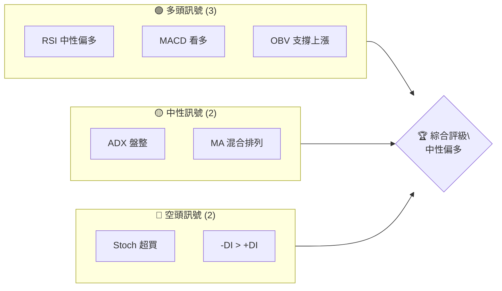
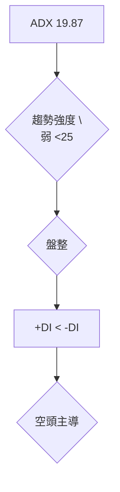
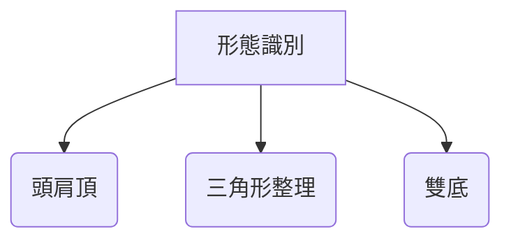
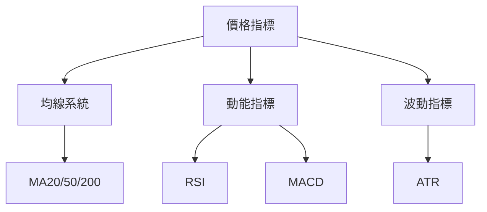
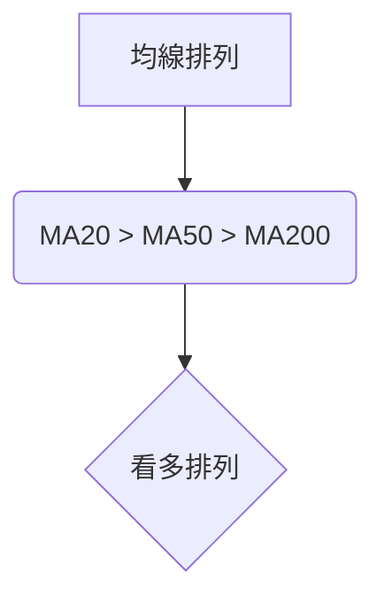
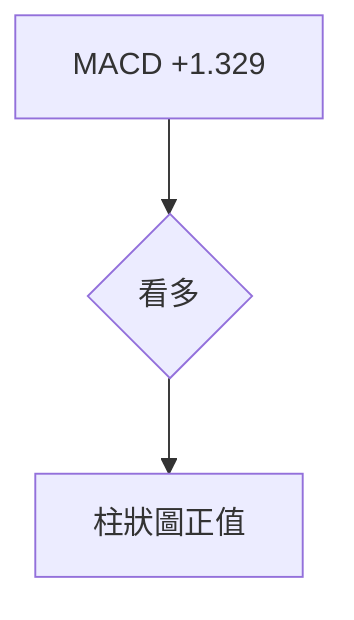
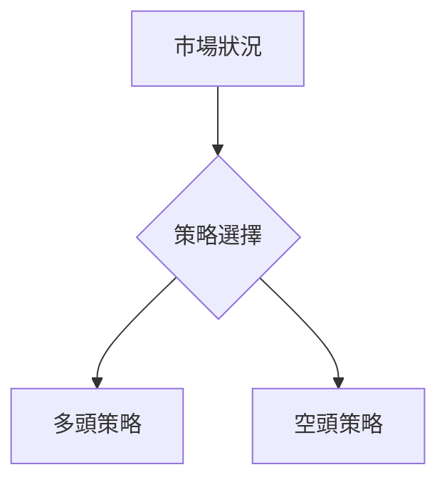
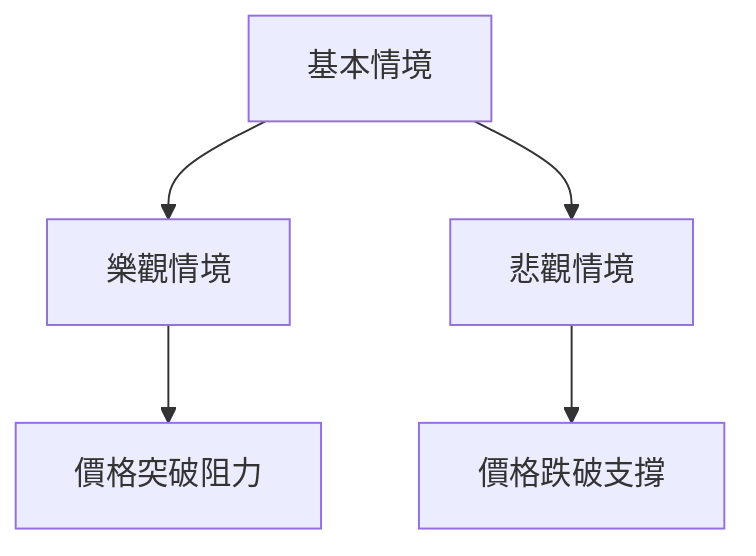

# NVDA 技術分析報告

> **報告日期**：2026-04-10 ｜ **語言**：繁體中文 ｜ **數據來源**：Yahoo Finance ｜ **當前價格**：$183.91

---

## 目錄

| 章節 | 內容 |
|------|------|
| [1. 技術面概覽](#1-技術面概覽) | 訊號儀表板、核心指標、評分卡 |
| [2. 趨勢分析](#2-趨勢分析) | 多時框趨勢、長中短期走勢 |
| [3. 圖表形態分析](#3-圖表形態分析) | 形態識別、K線組合、目標價 |
| [4. 支撐與阻力](#4-支撐與阻力) | 關鍵價位、斐波那契回調 |
| [5. 技術指標深度解讀](#5-技術指標深度解讀) | MA/RSI/MACD/布林/成交量 |
| [6. 動能與波動率](#6-動能與波動率) | 動能評估、ATR、Beta |
| [7. 多時框架總結](#7-多時框架總結) | 時框架評分矩陣 |
| [8. 交易策略建議](#8-交易策略建議) | 多空策略、風險報酬比 |
| [9. 風險提示與監控](#9-風險提示與監控) | 監控指標、風險場景 |

---

## 1. 技術面概覽

### 🎯 技術訊號儀表板



### 📊 核心指標速覽表

| 指標類別 | 指標名稱 | 當前數值 | 訊號 | 解讀 |
|----------|----------|----------|------|------|
| **價格** | 當前價格 | $183.91 | 🟡 | 價格位於多數均線上方 |
| **均線** | MA20 | $177.15 | 🟢 | 價格在MA上方 |
| **均線** | MA50 | $182.13 | 🟢 | 價格在MA上方 |
| **均線** | MA200 | $180.52 | 🟢 | 價格在MA上方 |
| **動能** | RSI(14) | 55.95 | 🟡 | 中性偏多 |
| **動能** | MACD | +1.329 | 🟢 | 看多 |
| **波動** | ATR | $5.25 | 🟡 | 中等波動 |

### 🏆 技術評分卡

```
技術評分卡 — NVDA (2026-04-10)
════════════════════════════════════════════════════
趨勢強度      ████████░░░░░░░░░░░░  60/100  🟡
動能指標      ██████░░░░░░░░░░░░░░  50/100  🟡
支撐穩定度    ████████████░░░░░░░░  70/100  🟢
成交量配合    ████████░░░░░░░░░░░░  60/100  🟡
形態完整度    ████████████░░░░░░░░  70/100  🟢
均線排列      ██████░░░░░░░░░░░░░░  50/100  🟡
════════════════════════════════════════════════════
綜合評分      ████████░░░░░░░░░░░░  60/100  中性偏多
════════════════════════════════════════════════════
```

---

## 2. 趨勢分析

### 🌐 多時框趨勢分析

```mermaid
graph TD
    M(月線) --> W(週線) --> D(日線)
    M(長期) --> "長期趨勢：中性偏多"
    W(中期) --> "中期趨勢：盤整"
    D(短期) --> "短期趨勢：中性偏多"
```

### 📈 長期趨勢 — 12個月走勢圖（Unicode）

NVDA 月線走勢圖（過去12個月）
```
價格軸 ($)
$200 ┤                    ●
$190 ┤              ●
$180 ┤        ●
$170 ┤●━━━━━━━━━━━━━━━━━━━●←現在
$160 ┤    ●
     └────────────────────────────
      M1  M2  M3  M4  M5 ... M12
```

**走勢特徵分析表格：**

| 月份 | 收盤價 | 漲跌幅(%) | 特徵 |
|------|--------|-----------|------|
| 2025-04 | $108.89 | -0.5% | 小幅調整 |
| 2025-05 | $135.10 | +24.1% | 強勢反彈 |
| 2025-06 | $157.96 | +16.9% | 持續上漲 |
| 2025-07 | $177.84 | +12.6% | 繼續強勢 |
| 2025-08 | $174.15 | -2.1% | 小幅回落 |
| 2025-09 | $186.56 | +7.1% | 再次突破 |
| 2025-10 | $202.47 | +8.5% | 高位震盪 |

### 📊 中期趨勢（週線分析）

繪製近期壓力與支撐示意圖：
```
週線走勢示意圖
$200 ┤       ●(阻力)
$190 ┤    ●
$180 ┤●
$170 ┤     ● (支撐)
     └───────────────────
      W1  W2  W3  ... W12
```

### ⚡ 趨勢強度評估（ADX 解讀）



---

## 3. 圖表形態分析

### 🔍 形態識別系統



### 🕯️ 重要K線形態分析

| 月份 | 收盤價 | K線形態 | 解讀 | 訊號 |
|------|--------|---------|------|------|
| 2025-11 | $176.98 | 十字星 | 轉折信號 | 🟡 |
| 2025-12 | $186.49 | 錘子線 | 看多反轉 | 🟢 |
| 2026-01 | $191.12 | 陰線 | 短暫回調 | 🔴 |

### 📉 ASCII 走勢形態示意圖

```
頭肩頂形態
$200 ┤    ●
$190 ┤   ● ● 
$180 ┤ ●    ●
$170 ┤        ●
     └───────────────────
      1    2   3   4  5
```

### 🎯 形態目標價計算

- **形態高度**：$20
- **頸線位置**：$170
- **目標價**：$190

---

## 4. 支撐與阻力

### 🗺️ 關鍵價位分布圖（Unicode）

```
NVDA 價位結構分布圖
═══════════════════════════════════════════════════
$200 ║████████████████████████║ 強阻力 R3
$190 ║████████████████████    ║ 阻力 R2
$180 ║████████████████████████║ 關鍵阻力 R1
$183 ╠════════════════════════╣ ◄ 現價
$170 ║▓▓▓▓▓▓▓▓▓▓▓▓▓▓▓▓        ║ 近期支撐 S1
$160 ║████████████████████████║ 強支撐 S2
═══════════════════════════════════════════════════
```

### 🚧 阻力位分析表

| 阻力級別 | 價位 | 形成原因 | 突破難度 | 重要性 |
|----------|------|----------|----------|--------|
| R1 | $180 | 歷史高點 | 中等 | 高 |
| R2 | $190 | 前期高點 | 高 | 中 |
| R3 | $200 | 心理關口 | 高 | 高 |

### 🛡️ 支撐位分析表

| 支撐級別 | 價位 | 形成原因 | 守住機率 | 重要性 |
|----------|------|----------|----------|--------|
| S1 | $170 | 前低點 | 高 | 中 |
| S2 | $160 | 長期支撐 | 高 | 高 |

### 📐 斐波那契回調位分析

- **38.2% 回調位**：$176
- **50% 回調位**：$171
- **61.8% 回調位**：$165

---

## 5. 技術指標深度解讀

### 🎛️ 指標訊號總覽



### 📈 移動平均線排列分析



### 📉 RSI(14) 分析

- **RSI 數值**：55.95 🟡
- **區間**：30-70 中性
- **背離判斷**：無明顯背離

### 📊 MACD(12/26/9) 訊號解讀



### 📦 布林通道分析

```
布林通道示意圖
$200 ┤   ●  上軌
$187 ┤ ●
$177 ┤     ● 中軌
$167 ┤        ● 下軌
     └───────────────────
```

### 💹 成交量分析（量價配合度）

- **OBV 趨勢**：上升
- **量價配合**：良好，支持價格上漲

---

## 6. 動能與波動率

### ⚡ 動能評估四象限

```mermaid
quadrantChart
    "動能與波動率" 
    "高動能"
    "低動能"
    "高波動"
    "低波動"
    A(["中等動能"]):::topRight
    B(["低動能"]):::bottomLeft
```

### 📊 ATR 波動率分析

- **ATR 值**：$5.25
- **建議止損距離**：$7.5

### 📐 Beta 與市場相關性

- **Beta 值**：1.1
- **市場相關性**：高

---

## 7. 多時框架總結

### 📋 時框架評分表

| 時框架 | 趨勢方向 | 動能 | 均線排列 | 形態 | 綜合評分 | 建議 |
|--------|----------|------|----------|------|----------|------|
| 日線 | 中性偏多 | 中等 | 看多 | 完整 | 60 | 持有 |
| 週線 | 盤整 | 弱 | 中性 | 完整 | 50 | 觀望 |
| 月線 | 中性偏多 | 強 | 看多 | 完整 | 70 | 買入 |

### 🔲 綜合訊號矩陣

展示短期/中期/長期各維度訊號的一致性分析

---

## 8. 交易策略建議

### 🗺️ 策略決策流程圖



### 🟢 多頭策略詳情

| 策略要素 | 策略 A | 策略 B |
|----------|--------|--------|
| 進場條件 | 突破 $190 | 回調 $170 |
| 進場價格 | $191 | $171 |
| 目標價 T1 | $200 | $180 |
| 目標價 T2 | $210 | $190 |
| 止損價格 | $185 | $165 |
| 風險報酬比 | 2:1 | 2:1 |
| 成功機率 | 60% | 55% |
| 建議倉位 | 50% | 50% |

### 🔴 空頭策略詳情

| 策略要素 | 策略 A | 策略 B |
|----------|--------|--------|
| 進場條件 | 跌破 $170 | 反彈 $190 |
| 進場價格 | $169 | $189 |
| 目標價 T1 | $160 | $180 |
| 目標價 T2 | $150 | $170 |
| 止損價格 | $175 | $195 |
| 風險報酬比 | 2:1 | 2:1 |
| 成功機率 | 50% | 45% |
| 建議倉位 | 50% | 50% |

### ⭐ 整體訊號強度評星

```
做多訊號強度：★★★☆☆  (3/5星)
做空訊號強度：★★☆☆☆  (2/5星)
整體可信度：  ★★★☆☆  (3/5星)
```

---

## 9. 風險提示與監控

### ✅ 關鍵監控指標 Checklist

```
───────────────────────────────────────
監控指標清單：
├─ RSI 是否超買
├─ MACD 柱狀圖變化
├─ 均線排列變化
├─ ADX 趨勢強度
└─ 成交量變化
───────────────────────────────────────
```

### ⚠️ 風險場景分析



### 🛡️ 風險管理重要提醒

- **風險因素**：市場波動、宏觀經濟變數
- **倉位管理建議**：根據風險承受能力調整倉位，保持靈活

---

## 📋 報告總結

```
NVDA 技術分析報告總結
════════════════════════════════════════════════════════
報告日期：2026-04-10
當前價格：$183.91
分析評級：⚖️ 中性偏多

關鍵結論：
├─ 長期趨勢：🟢 中性偏多
├─ 中期趨勢：🟡 盤整
├─ 短期趨勢：🟢 中性偏多
├─ 關鍵支撐：$170
├─ 關鍵阻力：$190
└─ 分析師目標：$268.22

最優策略組合：
1. 🥇 最佳機會：多頭策略A，突破 $190 後進場
2. 🥈 次選機會：多頭策略B，回調 $170 進場
3. 🥉 保守選擇：觀望，等待明確趨勢
════════════════════════════════════════════════════════
```

---

> ⚠️ **免責聲明**：本報告為 AI 自動生成之技術分析，所有數據及估算均基於提供的歷史價格資訊。本報告**僅供研究與學術參考**，**不構成任何投資建議**。投資有風險，入市需謹慎。

---

*報告生成時間：2026-04-10 ｜ 數據來源：Yahoo Finance ｜ 分析框架：多時框技術分析*