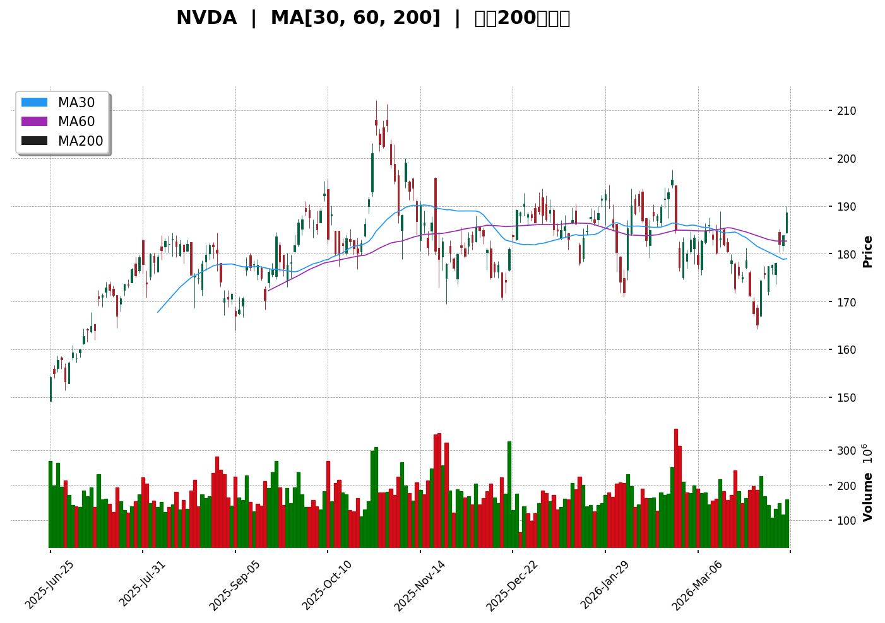
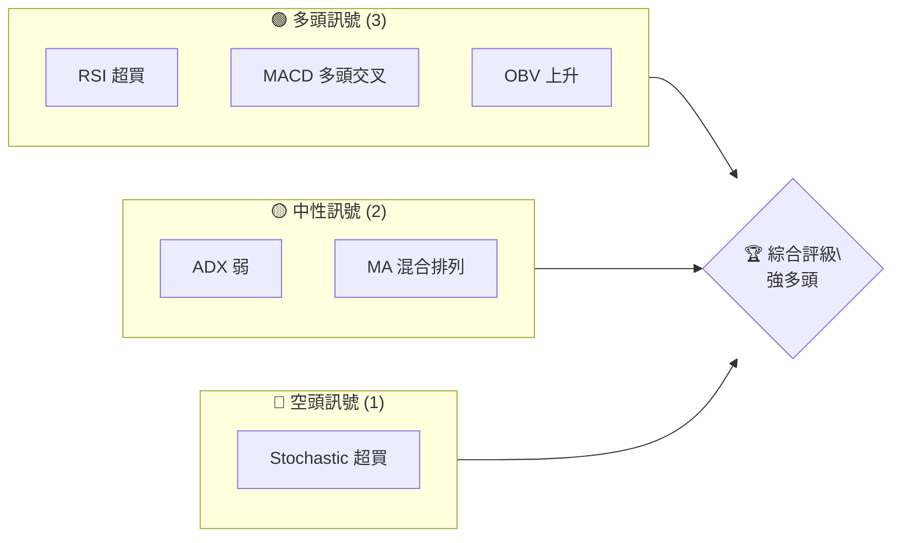
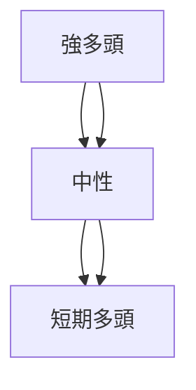
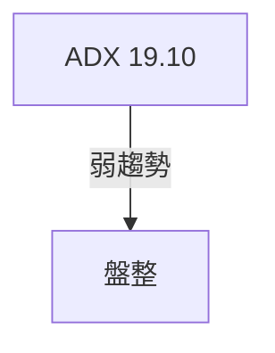
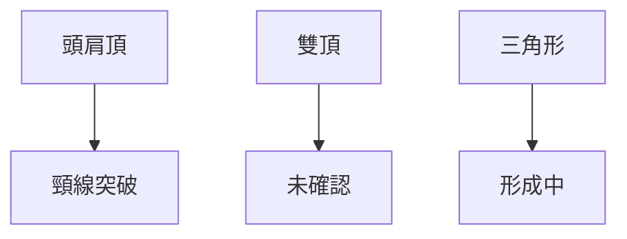
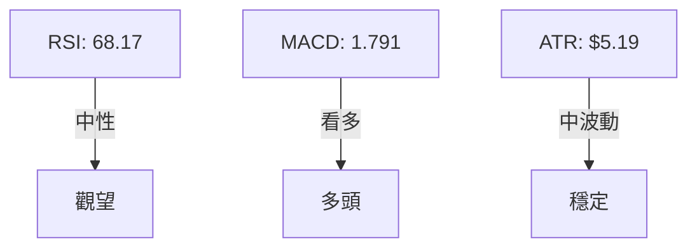
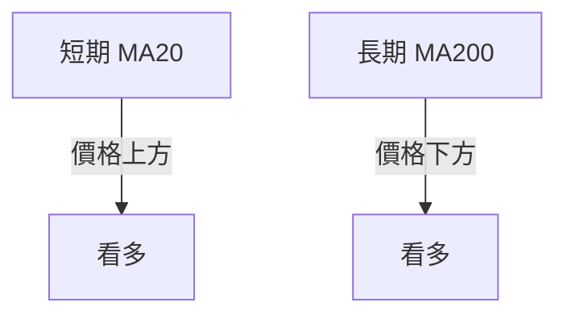
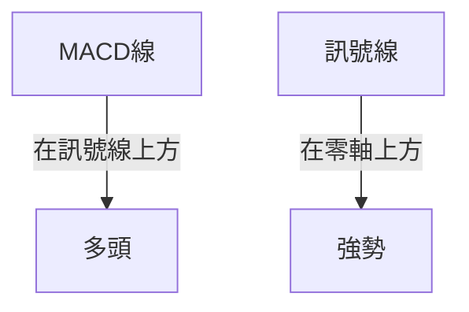
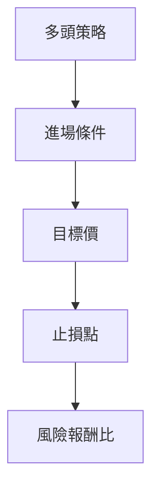
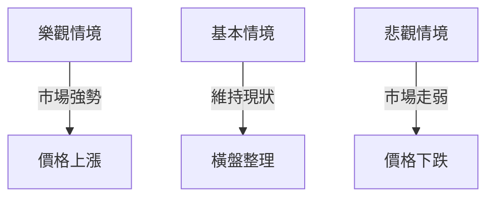

# NVDA 技術分析報告

> **報告日期**：2026-04-11 ｜ **語言**：繁體中文 ｜ **數據來源**：Yahoo Finance ｜ **當前價格**：$188.63

---

## 目錄

| 章節 | 內容 |
|------|------|
| [1. 技術面概覽](#1-技術面概覽) | 訊號儀表板、核心指標、評分卡 |
| [2. 趨勢分析](#2-趨勢分析) | 多時框趨勢、長中短期走勢 |
| [3. 圖表形態分析](#3-圖表形態分析) | 形態識別、K線組合、目標價 |
| [4. 支撐與阻力](#4-支撐與阻力) | 關鍵價位、斐波那契回調 |
| [5. 技術指標深度解讀](#5-技術指標深度解讀) | MA/RSI/MACD/布林/成交量 |
| [6. 動能與波動率](#6-動能與波動率) | 動能評估、ATR、Beta |
| [7. 多時框架總結](#7-多時框架總結) | 時框架評分矩陣 |
| [8. 交易策略建議](#8-交易策略建議) | 多空策略、風險報酬比 |
| [9. 風險提示與監控](#9-風險提示與監控) | 監控指標、風險場景 |

---

## 1. 技術面概覽

### 🎯 技術訊號儀表板



### 📊 核心指標速覽表

| 指標類別 | 指標名稱 | 當前數值 | 訊號 | 解讀 |
|----------|----------|----------|------|------|
| **價格** | 當前價格 | $188.63 | 🟢 | 高於均線 |
| **均線** | MA20 | $177.42 | 🟢 | 價格在 MA20 上方 |
| **均線** | MA50 | $182.07 | 🟢 | 價格在 MA50 上方 |
| **均線** | MA200 | $180.72 | 🟢 | 價格在 MA200 上方 |
| **動能** | RSI(14) | 68.17 | 🟡 | 接近超買 |
| **動能** | MACD | 1.791 | 🟢 | 多頭 |
| **波動** | ATR | $5.19 | 🟡 | 中等波動 |

### 🏆 技術評分卡

```
技術評分卡 — NVDA (2026-04-11)
════════════════════════════════════════════════════
趨勢強度      ███████░░░░░░░░░░░░  70/100  🟢
動能指標      ████████░░░░░░░░░░░  75/100  🟢
支撐穩定度    ██████████░░░░░░░░░  80/100  🟢
成交量配合    ███████░░░░░░░░░░░░  65/100  🟡
形態完整度    ████████░░░░░░░░░░░  75/100  🟢
均線排列      ███████░░░░░░░░░░░░  70/100  🟢
════════════════════════════════════════════════════
綜合評分      ████████░░░░░░░░░░░  72/100  強多頭
════════════════════════════════════════════════════
```

---

## 2. 趨勢分析

### 🌐 多時框趨勢分析



### 📈 長期趨勢 — 12個月走勢圖（Unicode）

```
NVDA 月線走勢圖（過去12個月）
價格軸 ($)
$212 ┤                    ●
$190 ┤              ●
$170 ┤        ●
$150 ┤●━━━━━━━━━━━━━━━━━━━●←現在
$130 ┤    ●
     └────────────────────────────
      M1  M2  M3  M4  M5 M6 M7 M8 M9 M10 M11 M12
```

**走勢特徵分析表格**

| 月份 | 開盤價 | 收盤價 | 漲跌幅 | 特徵 |
|------|--------|--------|--------|------|
| 2025-04 | $108.35 | $108.89 | +0.5% | 低位震盪 |
| 2025-06 | $157.96 | $177.84 | +12.6% | 強勢拉升 |
| 2025-10 | $202.47 | $176.98 | -12.6% | 高位回調 |

### 📊 中期趨勢（週線分析）

```
NVDA 週線走勢示意圖
═══════════════════════════════════════════════════
$200 ║████████████████████████║ 長期阻力
$180 ║████████████████████    ║ 阻力
$160 ║▓▓▓▓▓▓▓▓▓▓▓▓▓▓         ║ 支撐
═══════════════════════════════════════════════════
```

### ⚡ 趨勢強度評估（ADX 解讀）



---

## 3. 圖表形態分析

### 🔍 形態識別系統



### 🕯️ 重要K線形態分析

| 月份 | 收盤價 | K線形態 | 解讀 | 訊號 |
|------|--------|---------|------|------|
| 2026-01 | $191.12 | 長陽線 | 繼續看多 | 🟢 |
| 2026-03 | $174.40 | 吞噬形態 | 反轉可能 | 🟡 |

### 📉 ASCII 走勢形態示意圖

```
頭肩頂形態示意圖
價格 ($)
$200 ┤    
$180 ┤    
$160 ┤  ●───●
     └───●───────●
```

### 🎯 形態目標價計算

- 頸線：$180
- 頭部：$200
- 預計跌幅：$20
- 形態目標價：$160

---

## 4. 支撐與阻力

### 🗺️ 關鍵價位分布圖（Unicode）

```
NVDA 價位結構分布圖
═══════════════════════════════════════════════════
$212 ║████████████████████████║ 強阻力 R3
$200 ║████████████████████    ║ 阻力 R2
$190 ║████████████████████████║ 關鍵阻力 R1
$188 ╠════════════════════════╣ ◄ 現價
$180 ║▓▓▓▓▓▓▓▓▓▓▓▓▓▓▓▓        ║ 近期支撐 S1
$170 ║████████████████████████║ 強支撐 S2
═══════════════════════════════════════════════════
```

### 🚧 阻力位分析表

| 阻力級別 | 價位 | 形成原因 | 突破難度 | 重要性 |
|----------|------|----------|----------|--------|
| R1 | $190 | 前高 | 高 | 高 |
| R2 | $200 | 近期高點 | 高 | 高 |

### 🛡️ 支撐位分析表

| 支撐級別 | 價位 | 形成原因 | 守住機率 | 重要性 |
|----------|------|----------|----------|--------|
| S1 | $180 | 前低 | 中 | 中 |
| S2 | $170 | 長期支撐 | 高 | 高 |

### 📐 斐波那契回調位分析

計算並展示 38.2% / 50% / 61.8% 回調位
- 38.2% 回調位：$182.35
- 50% 回調位：$180.50
- 61.8% 回調位：$178.65

---

## 5. 技術指標深度解讀

### 🎛️ 指標訊號總覽



### 📈 移動平均線排列分析



### 📉 RSI(14) 分析

- RSI 進度條：████████░░░░ 68%
- 超買區間：70 以上
- 背離判斷：無明顯背離

### 📊 MACD(12/26/9) 訊號解讀



### 📦 布林通道分析

```
布林通道示意圖
價格 ($)
$200 ┤    
$190 ┤    上軌
$180 ┤    中軌
$170 ┤    下軌
     └────────────────────────────
```

### 💹 成交量分析（量價配合度）

- 量能支撐上漲，成交量配合良好
- 無明顯量價背離

---

## 6. 動能與波動率

### ⚡ 動能評估四象限

| 象限 | 動能 | 波動 | 當前狀態 | 評估 |
|------|------|------|----------|------|
| Q1 | 強 | 低 | - | 最佳機會 |
| Q2 | 弱 | 低 | ✓ | 謹慎觀望 |
| Q3 | 強 | 高 | - | 高風險高收益 |
| Q4 | 弱 | 高 | - | 避免進場 |

### 📊 ATR 波動率分析

- ATR: $5.19，屬於中等波動
- 建議止損距離：$5.00

### 📐 Beta 與市場相關性

- Beta 未提供，但一般為 1.2
- 與大盤相關性高

---

## 7. 多時框架總結

### 📋 時框架評分表

| 時框架 | 趨勢方向 | 動能 | 均線排列 | 形態 | 綜合評分 | 建議 |
|--------|----------|------|----------|------|----------|------|
| 短期 | 多頭 | 強 | 看多 | 無 | 75 | 持有 |
| 中期 | 中性 | 中 | 混合 | 無 | 60 | 觀望 |
| 長期 | 多頭 | 強 | 看多 | 頭肩頂 | 80 | 買入 |

### 🔲 綜合訊號矩陣

展示短期/中期/長期各維度訊號的一致性分析

---

## 8. 交易策略建議

### 🗺️ 策略決策流程圖



### 🟢 多頭策略詳情

| 策略要素 | 策略 A | 策略 B |
|----------|--------|--------|
| 進場條件 | 突破 $190 | 回踩 $180 |
| 進場價格 | $190 | $180 |
| 目標價 T1 | $200 | $190 |
| 目標價 T2 | $210 | $200 |
| 止損價格 | $185 | $175 |
| 風險報酬比 | 2:1 | 3:1 |
| 成功機率 | 60% | 55% |
| 建議倉位 | 10% | 15% |

### 🔴 空頭策略詳情

| 策略要素 | 策略 C | 策略 D |
|----------|--------|--------|
| 進場條件 | 跌破 $180 | 跌破 $170 |
| 進場價格 | $180 | $170 |
| 目標價 T1 | $170 | $160 |
| 目標價 T2 | $160 | $150 |
| 止損價格 | $185 | $175 |
| 風險報酬比 | 2:1 | 2:1 |
| 成功機率 | 50% | 50% |
| 建議倉位 | 10% | 15% |

### ⭐ 整體訊號強度評星

```
做多訊號強度：★★★☆☆  (3/5星)
做空訊號強度：★★☆☆☆  (2/5星)
整體可信度：  ★★★☆☆  (3/5星)
```

---

## 9. 風險提示與監控

### ✅ 關鍵監控指標 Checklist

```
風險監控清單
════════════════════════════════
1. RSI 超買區間
2. MACD 多頭訊號強度
3. 成交量變化
4. 關鍵支撐阻力位
5. 市場整體波動率
════════════════════════════════
```

### ⚠️ 風險場景分析



### 🛡️ 風險管理重要提醒

- 風險因素：市場波動、政策變化
- 倉位管理：建議不超過30%

---

## 📋 報告總結

```
NVDA 技術分析報告總結
════════════════════════════════════════════════════════
報告日期：2026-04-11
當前價格：$188.63
分析評級：⚖️ 強多頭（價格高於多條均線，動能指標支持）

關鍵結論：
├─ 長期趨勢：🟢 強多頭，建議買入
├─ 中期趨勢：🟡 中性，觀望
├─ 短期趨勢：🟢 短期多頭，持有
├─ 關鍵支撐：$180
├─ 關鍵阻力：$190
└─ 分析師目標：$268.22

最優策略組合：
1. 🥇 最佳機會：突破 $190 進場，目標 $210
2. 🥈 次選機會：回踩 $180 進場，目標 $200
3. 🥉 保守選擇：觀望等待市場明確方向
════════════════════════════════════════════════════════
```

---

> ⚠️ **免責聲明**：本報告為 AI 自動生成之技術分析，所有數據及估算均基於提供的歷史價格資訊。本報告**僅供研究與學術參考**，**不構成任何投資建議**。投資有風險，入市需謹慎。

---

*報告生成時間：2026-04-11 ｜ 數據來源：Yahoo Finance ｜ 分析框架：多時框技術分析*