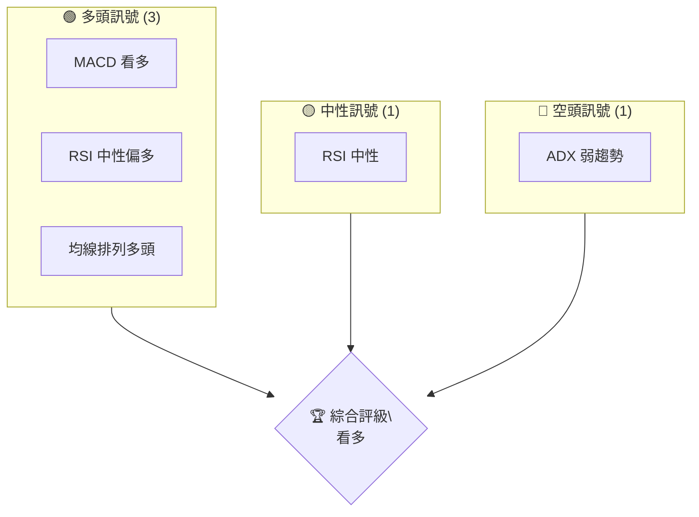
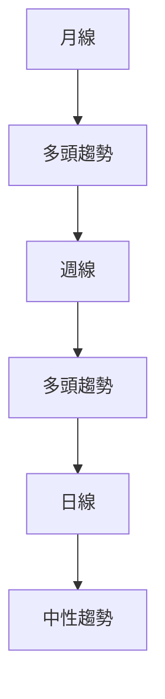
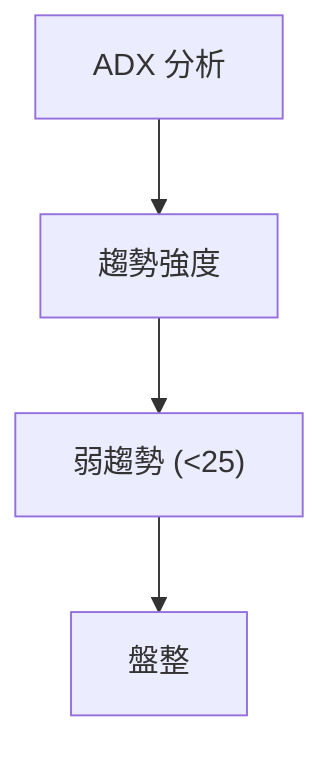
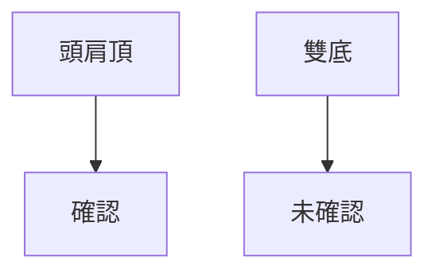
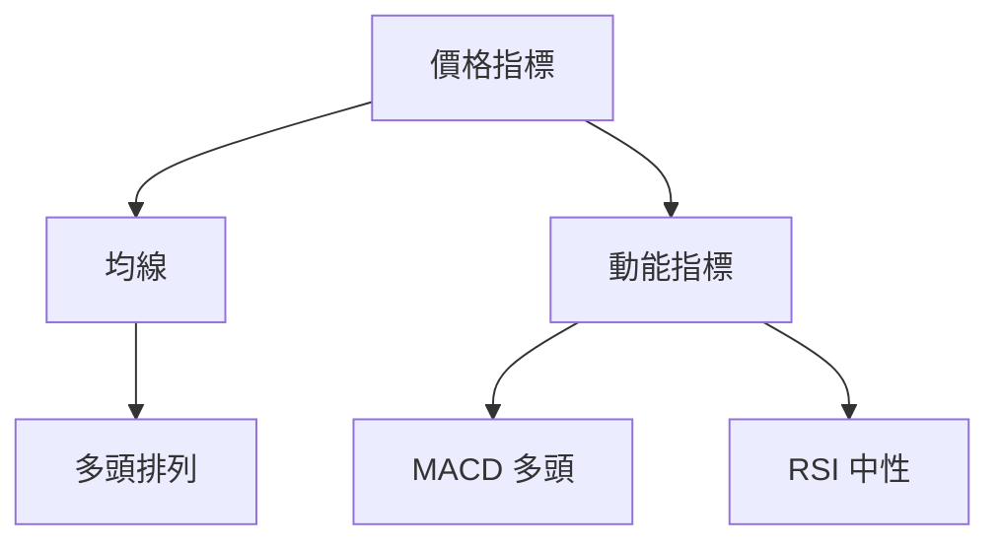
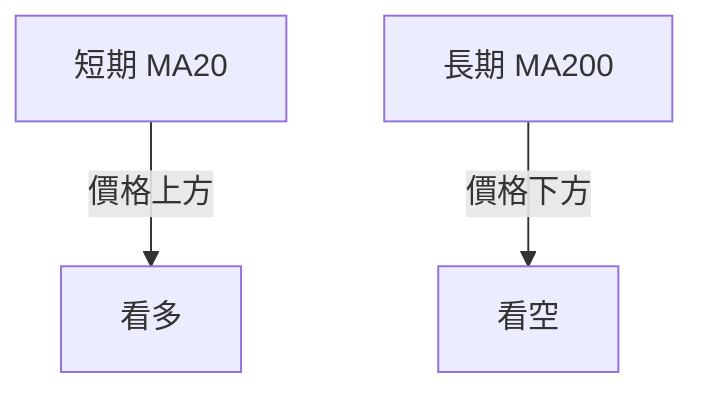
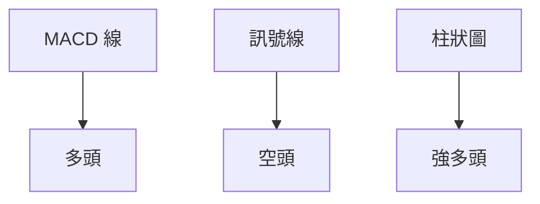
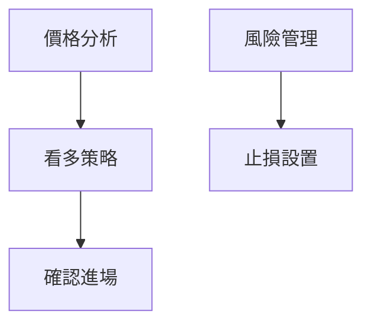
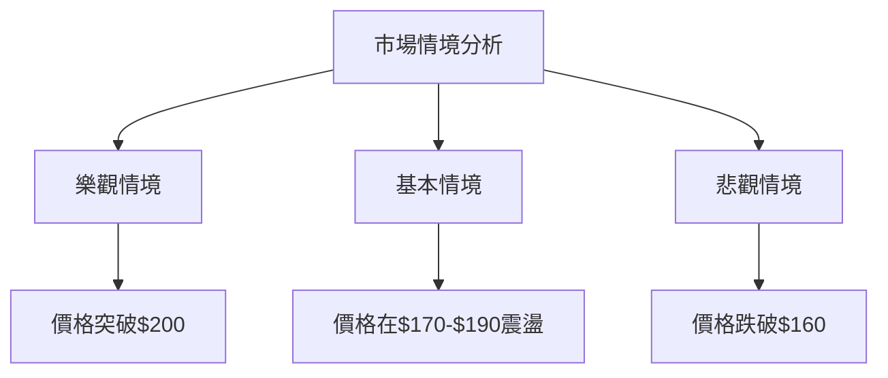

<details>
<summary>📊 靜態圖表 (點擊展開)</summary>


</details>

<html>
<head><meta charset="utf-8" /></head>
<body>
    <div>                        <script>window.PlotlyConfig = {MathJaxConfig: 'local'};</script>
        <script charset="utf-8" src="https://cdn.plot.ly/plotly-3.5.0.min.js" integrity="sha256-fHbNLP+GlIXN+efbQec78UkemUz3NJp7UmfGxC1tNxs=" crossorigin="anonymous"></script>                <div id="candlestick-chart" class="plotly-graph-div" style="height:500px; width:100%;"></div>            <script>                window.PLOTLYENV=window.PLOTLYENV || {};                                if (document.getElementById("candlestick-chart")) {                    Plotly.newPlot(                        "candlestick-chart",                        [{"close":{"dtype":"f8","bdata":"AAAAgBlJY0AAAADA0F9jQAAAAEApt2NAAAAAINe+Y0AAAAAAyShjQAAAAOApp2NAAAAAYAjqY0AAAADA1sZjQAAAAEAm\u002f2NAAAAAQEtbZEAAAADgU4JkQAAAACCQnGRAAAAAIF6BZEAAAAAAflVlQAAAAMDtamVAAAAAgBSfZUAAAAAgNIxlQAAAAMA\u002fa2VAAAAAgBLgZEAAAABADVhlQAAAAKDBtmVAAAAA4BOvZUAAAABgDxdmQAAAAABj72VAAAAA4K9nZkAAAADg5DpmQAAAAMAdtmVAAAAAAAt\u002fZkAAAABAX0dmQAAAAGB8bGZAAAAAwK2XZkAAAACgbdVmQAAAAKDzwGZAAAAAYCXkZkAAAAAA6rFmQAAAAACsv2ZAAAAAwHCNZkAAAAAgWr9mQAAAAMCL82VAAAAAAN7rZUAAAADgbd5lQAAAAOC7PmZAAAAAwPZ4ZkAAAABgrLdmQAAAAAA8smZAAAAAYHuEZkAAAABg1cRlQAAAAEANWGVAAAAA4O5SZUAAAAAgNXRlQAAAAKDA32RAAAAAYAYJZUAAAABgaVdlQAAAAACeKWZAAAAAYNEkZkAAAACAnTlmQAAAACBgN2ZAAAAAwIvbZUAAAACArkhlQAAAAKAPB2ZAAAAAoNEUZkAAAAAA4PJmQAAAAAAiTWZAAAAAAGseZkAAAADAdDVmQAAAAEB0RWZAAAAAwI+6ZkAAAACA51FnQAAAAMAFZ2dAAAAAANGbZ0AAAABALnNnQAAAAMCgMGdAAAAAQKEgZ0AAAAAA26JnQAAAAECQEWhAAAAAAHrkZkAAAAAglIlnQAAAAMBTgGZAAAAAoO15ZkAAAAAASLlmQAAAAIBl5mZAAAAAoNbTZkAAAADAe6RmQAAAAKBTiGZAAAAA4HrEZkAAAABAqkdnQAAAAOAB72dAAAAAAEEgaUAAAACAjeBpQAAAAGDEW2lAAAAAAPhOaUAAAADgbttpQAAAAMBh1WhAAAAA4AhmaEAAAABA5oFnQAAAAKAjhGdAAAAAoObgaEAAAAAAcSRoQAAAAGDrOGhAAAAAAN1aZ0AAAACgxcRnQAAAAGCLUmdAAAAAAOKqZkAAAAAA\u002fE9nQAAAAGDYk2ZAAAAAIIhbZkAAAACA9dBmQAAAAICdOWZAAAAAwK+HZkAAAADAYB9mQAAAAODOfGZAAAAAIBWuZkAAAADAP3JmQAAAAMDX62ZAAAAA4M3MZkAAAABgRzFnQAAAAEC4HmdAAAAAQKT4ZkAAAABAcp1mQAAAAEBW4GVAAAAAgPkIZkAAAACAuzZmQAAAAMDIXWVAAAAAoC3EZUAAAADgXZ9mQAAAAADD9WZAAAAAgGSmZ0AAAACAMZNnQAAAAECh0GdAAAAAwLaGZ0AAAACA9HBnQAAAAGCtT2dAAAAAgN+aZ0AAAACgg4NnQAAAACBbZ2dAAAAAQDGjZ0AAAACg9SBnQAAAACAzG2dAAAAAgMIdZ0AAAAAgmTlnQAAAAKAp5GZAAAAAwEZhZ0AAAACACUdnQAAAAIDuQWZAAAAAQOzpZkAAAABAjxpnQAAAAGAddWdAAAAAoLdOZ0AAAABAUJBnQAAAAABP8GdAAAAAgPwPaEAAAABA1ONnQAAAAOAyM2dAAAAAQJGKZkAAAABAx8VlQAAAAMDce2VAAAAAgMwsZ0AAAABg88BnQAAAAAD0kGdAAAAAYEXBZ0AAAACgwV1nQAAAAICa2WZAAAAAQLgeZ0AAAADACH9nQAAAAIB5fGdAAAAAYOm5Z0AAAADARPFnQAAAAMDdGmhAAAAAwJRxaEAAAADgKBxnQAAAAADGJWZAAAAAQAvPZkAAAADASYFmQAAAAID24GZAAAAAAJDqZkAAAACg7jlmQAAAAMB71GZAAAAAAFIYZ0AAAADA9UBnQAAAAOB65GZAAAAAAACIZkAAAABACudmQAAAAIDCvWZAAAAAwMyMZkAAAACA61FmQAAAAGBmlmVAAAAA4Hr0ZUAAAABgZuZlQAAAAIDCVWZAAAAAIK5nZUAAAADgo\u002fBkQAAAAKBwpWRAAAAAwMzMZUAAAAAAAPhlQAAAAOB6LGZAAAAA4Ho0ZkAAAABAM0NmQAAAAGCPwmZAAAAAwB79ZkAAAAAAKZRnQA=="},"high":{"dtype":"f8","bdata":"UsU5L5RNY0DYBEvPNJZjQKbYb1Hg1WNAsaGW1kbUY0BzMUlxkKVjQCCq\u002faVcsmNAKCKQBIEeZEBlAi6rEuljQM0AWjMwBmRAw4FFx5CMZEAZLJ0UII9kQG1yAFWW+2RAxwcV0cyuZEDYfY8P4otlQKdplzsWd2VAlWfBqzHEZUAo8\u002fveEsdlQAOfKQc9q2VAWBVtsZFrZUCFa7a4aGdlQBh4o8CiuWVA54XydhzWZUCsDN8IDx9mQEval9s0a2ZAYMj4B4Z7ZkCcRsEboOhmQDzeMElXEGZAq+pPGnGFZkBCVyGHXIdmQJicuNjXe2ZAOqv\u002foy77ZkD3Pt4OoOhmQNRgl\u002fPm+WZALXfr82AOZ0BUmmnCD\u002f5mQKwEYaOq32ZAEBy7JtW7ZkB45Ox7G91mQESXE4kHz2ZAZuXrbhD\u002fZUBMOMHi2xtmQJ3h8i7uUWZA9iA9JCe8ZkC6B+OHgstmQD1Hy6m1zmZAPfiSJQ8OZ0BrHGc42kNmQGBAXlI+i2VAWyeSMDSMZUDbslE6m3plQA814sMPIGVAvet4pM9dZUCtBlFTc15lQMCjBpVTaGZA4zpetFOIZkDMuVSMklJmQJWOt2KSWmZAUdPlZGAvZkAqTSGiyqVlQLEyAPqTImZAFCskG+9BZkANAZan8xBnQIZjM4nMzGZA+4ir+FN4ZkCwyYHQr4dmQNEDPjQCeGZA6gwkkVr\u002fZkAgA6SuimpnQBye0LDRg2dA\u002fzm0zu3gZ0DrQhvp2cpnQErb4bqzZmdACrivgkGhZ0C63SaviLJnQJPWPOvpaGhAieTaCidzaEBjS9wj2sJnQNKULFXzGGdAT0R7tzAbZ0BaJ5TtUOhmQEPJbbWNAmdAPfGg0r8lZ0A+P40oo9hmQMJJgYhv7WZAsDKjF1HgZkDGujqJYW5nQCUvj0pT\u002f2dAeO0HGBZkaUCADsi+VYVqQBv7AU9lxGlAYHI2Mk\u002f+aUDCqskcI2pqQIan+L9SfmlAdGyHMbpcaUD99eRLJbNoQLei4DiUiWdAkTAcs2D9aEAELpTXwGxoQKwm777Ke2hAxjUTQWjtZ0AlSqMept9nQLdkQfdVn2dAD3fnZ\u002fMYZ0CMgUAL3HpnQF7Qta5Pf2hA9+FHhEURZ0A24VgFW+9mQGT2rnF+RGZAahzZPXrcZkA6GI1QpmhmQLsJi4j3iGZAUjCzuHc0Z0B\u002fBJdNws1mQLzesR5SEGdAcYie4MwUZ0A+KPqprH9nQL4s4uq3NmdAgR4B3wkvZ0DbErcT7almQEChYGrs2WZAkyZajiFNZkBsM6cIX09mQHebOvPaA2ZAXsW8m34EZkDHbMnrFa5mQMGynQrNBGdApPZhcjuqZ0DDzPL9ypxnQEURwwq\u002fFWhAomKsIv6XZ0B053dbWp9nQDl8iBOX0WdAVVvN8GwdaEDWSdYu0zNoQKJYi3AbBWhANBRlH4LrZ0Dfy1ugRbFnQBPz75eOSmdAOi6OCIRjZ0BhqPe6MYNnQCbBFIpmDmdAXDBtUxK2Z0BC19MBwM1nQBbTfxbYy2ZAIFVE1tYrZ0BdJfQIHkVnQPiH0yTfsmdAubBmM4OjZ0CSLe+3q79nQHsH1gHeCmhAhcHfUQYvaECgeJfiV09oQOu69EtFyWdASqORPlFIZ0B0IBG8P3JmQPbL+Q7vGWZAzcxuC61fZ0ALfCjlyDRoQFCwoMAGD2hAZQ62M\u002fwnaEDn+ANLLzNoQIs9BOysb2dAQXSYyHlkZ0BEQqGQgstnQPru4gNvjWdAoX4jBjvKZ0BLPMNvED5oQDkdlfdNOGhAB4PtVNGzaEBW3b508UhoQDtQj1uQ0mZAgRXPEGfuZkBsxXd\u002ffJxmQMdGp4MUFmdAYMhQ7pkBZ0BWrAzPANhmQHtAe6LN3GZAZuaO4sFNZ0AAAAAA13NnQAAAAIAUHmdAAAAAQOFCZ0AAAAAAKZxnQAAAAMDMLGdAAAAAACnsZkAAAAAgXH9mQAAAAOBRSGZAAAAAANdLZkAAAABACgdmQAAAAEAKp2ZAAAAA4FEQZkAAAABACl9lQAAAAGBmLmVAAAAAANfTZUAAAAAA1ytmQAAAACCuL2ZAAAAAoEc5ZkAAAAAgXEdmQAAAAOBRKGdAAAAAYI8CZ0AAAAAAAMBnQA=="},"hovertemplate":"\u003cb\u003e%{x|%Y-%m-%d}\u003c\u002fb\u003e\u003cbr\u003e\u958b: $%{open:.2f}\u003cbr\u003e\u9ad8: $%{high:.2f}\u003cbr\u003e\u4f4e: $%{low:.2f}\u003cbr\u003e\u6536: $%{close:.2f}\u003cextra\u003e\u003c\u002fextra\u003e","low":{"dtype":"f8","bdata":"cFxev4anYkBaVaBDLj9jQM\u002fVxIN+Z2NAeCw0I+R9Y0BINJX23+5iQFiI+PM5HmNAdTcLI823Y0DLuJcZC6pjQDOZ7FCjy2NAgE13V0MkZEBue7EjqTJkQDkITbkrbmRAE\u002f5+Ssc\u002fZECF3b0KgCVlQGQYpdzmG2VAZoc21KZZZUBPjaPQaGdlQIabZkQXX2VAkG1Tda+RZEC+GFaTJf5kQL13R3KwaGVA\u002fLEi\u002fMydZUDL8N5oHb5lQNOCuaq132VA3itzBVgAZkAQ8gwE0\u002fxlQIEzTDqSW2VAclx5VbbPZUDleE5W3ftlQMQlvxAQB2ZAio+mLqZYZkDnPaoh14tmQIpV3ZYKh2ZAkx6gCcRtZkAKgcgMP2pmQC8OePzDbWZAO47LR1VAZkC6m9Fu65FmQJcMRzS\u002f7mVAUlbW27MYZUBcMdLX\u002frhlQJNlzV19ZWVAxA\u002f\u002fKE0RZkATy8YH+FhmQJWYXWc\u002fYmZA46Y\u002fni4MZkC1z\u002fcG4aNlQDipuZgm5mRAzzECPkMbZUDP8+svOCxlQMcliUNegWRAPIyObk\u002fqZEBFdjQZy9ZkQBypIWgb7mVADTDGfr0OZkBHT5Obxw1mQH7XB+q0z2VAkJcYM4zLZUAY6MNQhwxlQMW1KNMcnmVAWHFK1yTlZUAPFwVBG9ZlQL0qNd8ZBmZATW2t6S7sZUD1AIBZjaNlQJ4eii4l3WVAkwQoYJuJZkASZ7bWuK5mQEMP5WAn\u002fGZAOTcXX0KBZ0AvgMNDgitnQA3113zq6WZAAwBij1r\u002fZkDiSt\u002fPn1BnQBmfx5s\u002f4WdAQSqZ3\u002fXAZkBjsGEfET5nQH8OBazEdWZAWALeKKgoZkCY16Q1AnhmQJ5NxV5ed2ZAmA6Bsbi2ZkBoc0LZ93hmQK3KX+qyF2ZAQBDS4aV4ZkBkXd7bWu9mQPaXpwAZjWdApPUwM3L8Z0Df9RyoPZhpQKBqzZRpLGlALLu0wIdBaUCHLgWQMrFpQKpmCW8QvWhAil3jwB1UaEB50lZngUtnQEXxQO59XGZAZuHsWpk4aEBD+k+M7ehnQMlnkSZ942dAsvhM1Y36ZkCnW4\u002f\u002f7JFmQAO\u002fG62XCWdAAiC\u002fKSt0ZkBMRTbS6tlmQPvq7XWRemZARfHi+SadZUBsIxV1vQ5mQMrb9BABMWVALcEX0Q1HZkCK8SkzYQ9mQDrsHVwmtWVALfNAEF5\u002fZkDIWoAO5GJmQMtj6qNofmZAX\u002fpAis6cZkA+m3Xle8xmQC1wQTvs6WZAZ6WJ5fbAZkBDy2KpiBNmQFvlao2J02VACBfyLqjgZUAejuQ\u002ff9xlQHVHeAegSWVAypR3R\u002fF5ZUBkatEPkwpmQHhKM1jiymZA70ATrHvcZkBlV0eFjlJnQOLpPp+sf2dAGjpYRsw8Z0BvWzelb11nQC8vIoFbT2dAmsv7Yv6HZ0DO7YM\u002fekRnQJ1Rqa\u002fqWWdAUY6IwZhRZ0ATnuH2ZvZmQEPVIScf9WZAm\u002fLuuVLgZkB1TYRxe+xmQIVzw2lJmWZAEmOq0TxKZ0A\u002fSwnRPEJnQI6WPlQ2M2ZA+Qs9rn1MZkDXBVnncP1mQK+dhqDqWWdA6J5ytls\u002fZ0CPLTwAFDZnQF3umB6NumdA+5BH\u002fJhBZ0AfK288tq5nQInyzxLXG2dA67++8g0HZkD22tmC0nxlQNd8iOCpYGVAL96hy+XSZUBbTirTFP5mQC9vsI+Dg2dAIghDMVCYZ0CxUM0w\u002f09nQNtBYsqQsmZA9rIZEXNlZkC1GIYK\u002f1dnQPxyEH7MNGdApZI0GMI9Z0A7U3ZfO7JnQPwckKp5bGdACOkAqfE4aEDCM7fA6wlnQJ+o3dvaC2ZANquEeS3UZUBGRXgjIh1mQORqHbKbgWZAyzZwK9o7ZkAkk40R7xlmQNXc6qSd8WVAbUQXOQHAZkAAAABgZg5nQAAAAAAAuGZAAAAAgBR+ZkAAAADAHq1mQAAAAIDCtWZAAAAAYI+KZkAAAACgR\u002fllQAAAAEAKd2VAAAAA4FHYZUAAAAAgXL9lQAAAAEAzG2ZAAAAA4HpkZUAAAADgUeBkQAAAAOCjiGRAAAAAYLjeZEAAAAAAANhlQAAAAADXa2VAAAAA4FH4ZUAAAADAHrVlQAAAAKCZiWZAAAAAANeTZkAAAACgmQlnQA=="},"name":"\u50f9\u683c","open":{"dtype":"f8","bdata":"25zhu9inYkAWGkyxh35jQE1O8DNzgGNAsnArMfXLY0AcK1LucohjQPigfNCLHmNA6w\u002f8cf\u002fKY0CrtvANj8VjQJpnbYm26WNAQSeOwi4mZEBQCVbTXYlkQHEMLmIrdmRA1+zo2vWqZEAFXjx1K2VlQPHnA6wCYWVAZKyDtbl\u002fZUC42H6TjrNlQKkGq+IUl2VAro3XIvhpZUDL8KXzDjBlQNWoBMUpjWVAeOes2ZiyZUCgrXH3tr9lQDEAWyrGPWZAXVOvoWEPZkDIXSbH09tmQPEbDT\u002f0wWVAHEd4VjDkZUB62yCG4nJmQHKw3VSfCWZArf0nSUaxZkCtcNRworBmQJzIe8OhwGZA2V61Rb\u002fdZkCLXvpY3tJmQKcHXzcLd2ZAhkGybTG7ZkAXq1RrPZJmQOXreSHKzGZAu\u002fskMILkZUD\u002fVU8tRdplQBLshTKakmVA1Wq+fEBKZkAPow9U9oBmQORYjltkvmZAd6B9XUeZZkAdSVemkkJmQPkT2I8YP2VAzzbBxgJhZUAx5sNbVVFlQIeAMyARAGVAZaHbiLXwZEC\u002f8hcG+yFlQAfIb3CKE2ZAvvlu\u002fiB1ZkB+mYTrAzhmQJLP7p7S9GVA4Wr+12AfZkAj\u002fgmj35NlQDxPU6i\u002fvmVAi8xarwX4ZUCWzS\u002f5++hlQBTp0pBmvmZAMPP4GgJ4ZkBkcstCv85lQH8Cm2TQRGZAs1vXRiCNZkAegoKM68FmQPEXaowHJ2dAeyOJvIiyZ0DsbIBWaqVnQAJVNSlZL2dAR6cWrrRGZ0Ahw\u002fWolVFnQMZoTy6vBmhAnNK40KMvaEB4b5YwYX5nQL6vFZz9F2dAsxeZZ\u002fMYZ0CPB08\u002fuMZmQP4QynsghWZAPnQwT4TjZkA+P40oo9hmQMDNAvrXo2ZA7YC6UM6MZkAQpInNO\u002fpmQKLhajkDv2dA8NbKDOwgaEA0Lqsnof5pQIvUlTcUpGlAzeAysKzNaUBcxZ4r1AFqQAPwXl9JX2lAeLGoLPHXaEC5MSIAwIxoQE0U34smHGdABLMKq9ViaEDP\u002fHIzb2RoQDFHEEZadmhAkZvnuu3gZ0Dwxbey4NpmQAvRGPFiPmdAqJDfDoTrZkDjc5xOoRhnQDe8ORq2fWhAXqqmIAunZkBoPkvADG9mQAQ9Tl6B3GVA98mPpIWzZkA56QrRsF9mQIfYjsO012VARO\u002foWq63ZkCSIPuI7KFmQIhaoYeGs2ZAd0cEWCn8ZkB+TjnqKdRmQPfGCj2ZMWdA5QznOLgeZ0B7\u002fc3JpYhmQOGqiMw0o2ZAbrHOpMU9ZkCrW57FAwhmQATRoTblAmZA2c61U6jQZUCZHlxKIhVmQH5g4AUf\u002fWZA0m8hJLneZkCUKQwswX1nQL\u002fJQWUcvWdARHDrGWV2Z0Ap+pGwWodnQBU90IPpsWdAHG6bD426Z0CP6wHj\u002fPdnQF0hyWtP0GdAX+dP3emRZ0BkZUZSMaNnQKV6BEc9ImdASXk7A7nmZkAdsO37rR9nQH09+7nrCWdA4DdiXq1PZ0Cv3Ut8O6JnQD8IBA18vGZAd5J8REphZkD6gjgKrhdnQIofTtOsb2dAxPu60ctkZ0CSuloRW2dnQIzRXBxP6GdAXPvUZIzqZ0A4LOuWY+ZnQLOboGsTZmdArsT5gVtHZ0DPqbDJaG5mQG3FnuV03WVAdGhIHsYVZkDoqPsvAAhnQGgIhx3U62dAIG2iDxEOaEC3KdcsoCBoQEgfSQ4Jb2dAugRvba+3ZkBMFZJIrJdnQB4rRp+YYWdA5m660OpRZ0AhEwTxd+xnQKZRWzpZ72dAFIcNHhBOaEDU2wO3TUhoQKgUibOvp2ZAGPmJTwTgZUAvoCrxXk9mQKK8\u002f4bEjWZA5uwvViClZkA\u002fx596kXpmQA9RvPRAGmZAQJrZ7HvMZkAAAADAHj1nQAAAAKCZAWdAAAAAoHAdZ0AAAABACt9mQAAAAIDrIWdAAAAAIFzPZkAAAADgUUBmQAAAAAAAQGZAAAAA4FEoZkAAAABgj9plQAAAAEAzI2ZAAAAAgD0CZkAAAAAAAEBlQAAAAMD1GGVAAAAAQArfZEAAAAAAAABmQAAAAIDChWVAAAAAwB4lZkAAAAAgXPdlQAAAAAAAEGdAAAAAQOG6ZkAAAACA6wlnQA=="},"x":["2025-06-25T00:00:00-04:00","2025-06-26T00:00:00-04:00","2025-06-27T00:00:00-04:00","2025-06-30T00:00:00-04:00","2025-07-01T00:00:00-04:00","2025-07-02T00:00:00-04:00","2025-07-03T00:00:00-04:00","2025-07-07T00:00:00-04:00","2025-07-08T00:00:00-04:00","2025-07-09T00:00:00-04:00","2025-07-10T00:00:00-04:00","2025-07-11T00:00:00-04:00","2025-07-14T00:00:00-04:00","2025-07-15T00:00:00-04:00","2025-07-16T00:00:00-04:00","2025-07-17T00:00:00-04:00","2025-07-18T00:00:00-04:00","2025-07-21T00:00:00-04:00","2025-07-22T00:00:00-04:00","2025-07-23T00:00:00-04:00","2025-07-24T00:00:00-04:00","2025-07-25T00:00:00-04:00","2025-07-28T00:00:00-04:00","2025-07-29T00:00:00-04:00","2025-07-30T00:00:00-04:00","2025-07-31T00:00:00-04:00","2025-08-01T00:00:00-04:00","2025-08-04T00:00:00-04:00","2025-08-05T00:00:00-04:00","2025-08-06T00:00:00-04:00","2025-08-07T00:00:00-04:00","2025-08-08T00:00:00-04:00","2025-08-11T00:00:00-04:00","2025-08-12T00:00:00-04:00","2025-08-13T00:00:00-04:00","2025-08-14T00:00:00-04:00","2025-08-15T00:00:00-04:00","2025-08-18T00:00:00-04:00","2025-08-19T00:00:00-04:00","2025-08-20T00:00:00-04:00","2025-08-21T00:00:00-04:00","2025-08-22T00:00:00-04:00","2025-08-25T00:00:00-04:00","2025-08-26T00:00:00-04:00","2025-08-27T00:00:00-04:00","2025-08-28T00:00:00-04:00","2025-08-29T00:00:00-04:00","2025-09-02T00:00:00-04:00","2025-09-03T00:00:00-04:00","2025-09-04T00:00:00-04:00","2025-09-05T00:00:00-04:00","2025-09-08T00:00:00-04:00","2025-09-09T00:00:00-04:00","2025-09-10T00:00:00-04:00","2025-09-11T00:00:00-04:00","2025-09-12T00:00:00-04:00","2025-09-15T00:00:00-04:00","2025-09-16T00:00:00-04:00","2025-09-17T00:00:00-04:00","2025-09-18T00:00:00-04:00","2025-09-19T00:00:00-04:00","2025-09-22T00:00:00-04:00","2025-09-23T00:00:00-04:00","2025-09-24T00:00:00-04:00","2025-09-25T00:00:00-04:00","2025-09-26T00:00:00-04:00","2025-09-29T00:00:00-04:00","2025-09-30T00:00:00-04:00","2025-10-01T00:00:00-04:00","2025-10-02T00:00:00-04:00","2025-10-03T00:00:00-04:00","2025-10-06T00:00:00-04:00","2025-10-07T00:00:00-04:00","2025-10-08T00:00:00-04:00","2025-10-09T00:00:00-04:00","2025-10-10T00:00:00-04:00","2025-10-13T00:00:00-04:00","2025-10-14T00:00:00-04:00","2025-10-15T00:00:00-04:00","2025-10-16T00:00:00-04:00","2025-10-17T00:00:00-04:00","2025-10-20T00:00:00-04:00","2025-10-21T00:00:00-04:00","2025-10-22T00:00:00-04:00","2025-10-23T00:00:00-04:00","2025-10-24T00:00:00-04:00","2025-10-27T00:00:00-04:00","2025-10-28T00:00:00-04:00","2025-10-29T00:00:00-04:00","2025-10-30T00:00:00-04:00","2025-10-31T00:00:00-04:00","2025-11-03T00:00:00-05:00","2025-11-04T00:00:00-05:00","2025-11-05T00:00:00-05:00","2025-11-06T00:00:00-05:00","2025-11-07T00:00:00-05:00","2025-11-10T00:00:00-05:00","2025-11-11T00:00:00-05:00","2025-11-12T00:00:00-05:00","2025-11-13T00:00:00-05:00","2025-11-14T00:00:00-05:00","2025-11-17T00:00:00-05:00","2025-11-18T00:00:00-05:00","2025-11-19T00:00:00-05:00","2025-11-20T00:00:00-05:00","2025-11-21T00:00:00-05:00","2025-11-24T00:00:00-05:00","2025-11-25T00:00:00-05:00","2025-11-26T00:00:00-05:00","2025-11-28T00:00:00-05:00","2025-12-01T00:00:00-05:00","2025-12-02T00:00:00-05:00","2025-12-03T00:00:00-05:00","2025-12-04T00:00:00-05:00","2025-12-05T00:00:00-05:00","2025-12-08T00:00:00-05:00","2025-12-09T00:00:00-05:00","2025-12-10T00:00:00-05:00","2025-12-11T00:00:00-05:00","2025-12-12T00:00:00-05:00","2025-12-15T00:00:00-05:00","2025-12-16T00:00:00-05:00","2025-12-17T00:00:00-05:00","2025-12-18T00:00:00-05:00","2025-12-19T00:00:00-05:00","2025-12-22T00:00:00-05:00","2025-12-23T00:00:00-05:00","2025-12-24T00:00:00-05:00","2025-12-26T00:00:00-05:00","2025-12-29T00:00:00-05:00","2025-12-30T00:00:00-05:00","2025-12-31T00:00:00-05:00","2026-01-02T00:00:00-05:00","2026-01-05T00:00:00-05:00","2026-01-06T00:00:00-05:00","2026-01-07T00:00:00-05:00","2026-01-08T00:00:00-05:00","2026-01-09T00:00:00-05:00","2026-01-12T00:00:00-05:00","2026-01-13T00:00:00-05:00","2026-01-14T00:00:00-05:00","2026-01-15T00:00:00-05:00","2026-01-16T00:00:00-05:00","2026-01-20T00:00:00-05:00","2026-01-21T00:00:00-05:00","2026-01-22T00:00:00-05:00","2026-01-23T00:00:00-05:00","2026-01-26T00:00:00-05:00","2026-01-27T00:00:00-05:00","2026-01-28T00:00:00-05:00","2026-01-29T00:00:00-05:00","2026-01-30T00:00:00-05:00","2026-02-02T00:00:00-05:00","2026-02-03T00:00:00-05:00","2026-02-04T00:00:00-05:00","2026-02-05T00:00:00-05:00","2026-02-06T00:00:00-05:00","2026-02-09T00:00:00-05:00","2026-02-10T00:00:00-05:00","2026-02-11T00:00:00-05:00","2026-02-12T00:00:00-05:00","2026-02-13T00:00:00-05:00","2026-02-17T00:00:00-05:00","2026-02-18T00:00:00-05:00","2026-02-19T00:00:00-05:00","2026-02-20T00:00:00-05:00","2026-02-23T00:00:00-05:00","2026-02-24T00:00:00-05:00","2026-02-25T00:00:00-05:00","2026-02-26T00:00:00-05:00","2026-02-27T00:00:00-05:00","2026-03-02T00:00:00-05:00","2026-03-03T00:00:00-05:00","2026-03-04T00:00:00-05:00","2026-03-05T00:00:00-05:00","2026-03-06T00:00:00-05:00","2026-03-09T00:00:00-04:00","2026-03-10T00:00:00-04:00","2026-03-11T00:00:00-04:00","2026-03-12T00:00:00-04:00","2026-03-13T00:00:00-04:00","2026-03-16T00:00:00-04:00","2026-03-17T00:00:00-04:00","2026-03-18T00:00:00-04:00","2026-03-19T00:00:00-04:00","2026-03-20T00:00:00-04:00","2026-03-23T00:00:00-04:00","2026-03-24T00:00:00-04:00","2026-03-25T00:00:00-04:00","2026-03-26T00:00:00-04:00","2026-03-27T00:00:00-04:00","2026-03-30T00:00:00-04:00","2026-03-31T00:00:00-04:00","2026-04-01T00:00:00-04:00","2026-04-02T00:00:00-04:00","2026-04-06T00:00:00-04:00","2026-04-07T00:00:00-04:00","2026-04-08T00:00:00-04:00","2026-04-09T00:00:00-04:00","2026-04-10T00:00:00-04:00"],"type":"candlestick"},{"hovertemplate":"MA30: $%{y:.2f}\u003cextra\u003e\u003c\u002fextra\u003e","line":{"color":"#2196F3","dash":"dash","width":2},"mode":"lines","name":"MA30","x":["2025-06-25T00:00:00-04:00","2025-06-26T00:00:00-04:00","2025-06-27T00:00:00-04:00","2025-06-30T00:00:00-04:00","2025-07-01T00:00:00-04:00","2025-07-02T00:00:00-04:00","2025-07-03T00:00:00-04:00","2025-07-07T00:00:00-04:00","2025-07-08T00:00:00-04:00","2025-07-09T00:00:00-04:00","2025-07-10T00:00:00-04:00","2025-07-11T00:00:00-04:00","2025-07-14T00:00:00-04:00","2025-07-15T00:00:00-04:00","2025-07-16T00:00:00-04:00","2025-07-17T00:00:00-04:00","2025-07-18T00:00:00-04:00","2025-07-21T00:00:00-04:00","2025-07-22T00:00:00-04:00","2025-07-23T00:00:00-04:00","2025-07-24T00:00:00-04:00","2025-07-25T00:00:00-04:00","2025-07-28T00:00:00-04:00","2025-07-29T00:00:00-04:00","2025-07-30T00:00:00-04:00","2025-07-31T00:00:00-04:00","2025-08-01T00:00:00-04:00","2025-08-04T00:00:00-04:00","2025-08-05T00:00:00-04:00","2025-08-06T00:00:00-04:00","2025-08-07T00:00:00-04:00","2025-08-08T00:00:00-04:00","2025-08-11T00:00:00-04:00","2025-08-12T00:00:00-04:00","2025-08-13T00:00:00-04:00","2025-08-14T00:00:00-04:00","2025-08-15T00:00:00-04:00","2025-08-18T00:00:00-04:00","2025-08-19T00:00:00-04:00","2025-08-20T00:00:00-04:00","2025-08-21T00:00:00-04:00","2025-08-22T00:00:00-04:00","2025-08-25T00:00:00-04:00","2025-08-26T00:00:00-04:00","2025-08-27T00:00:00-04:00","2025-08-28T00:00:00-04:00","2025-08-29T00:00:00-04:00","2025-09-02T00:00:00-04:00","2025-09-03T00:00:00-04:00","2025-09-04T00:00:00-04:00","2025-09-05T00:00:00-04:00","2025-09-08T00:00:00-04:00","2025-09-09T00:00:00-04:00","2025-09-10T00:00:00-04:00","2025-09-11T00:00:00-04:00","2025-09-12T00:00:00-04:00","2025-09-15T00:00:00-04:00","2025-09-16T00:00:00-04:00","2025-09-17T00:00:00-04:00","2025-09-18T00:00:00-04:00","2025-09-19T00:00:00-04:00","2025-09-22T00:00:00-04:00","2025-09-23T00:00:00-04:00","2025-09-24T00:00:00-04:00","2025-09-25T00:00:00-04:00","2025-09-26T00:00:00-04:00","2025-09-29T00:00:00-04:00","2025-09-30T00:00:00-04:00","2025-10-01T00:00:00-04:00","2025-10-02T00:00:00-04:00","2025-10-03T00:00:00-04:00","2025-10-06T00:00:00-04:00","2025-10-07T00:00:00-04:00","2025-10-08T00:00:00-04:00","2025-10-09T00:00:00-04:00","2025-10-10T00:00:00-04:00","2025-10-13T00:00:00-04:00","2025-10-14T00:00:00-04:00","2025-10-15T00:00:00-04:00","2025-10-16T00:00:00-04:00","2025-10-17T00:00:00-04:00","2025-10-20T00:00:00-04:00","2025-10-21T00:00:00-04:00","2025-10-22T00:00:00-04:00","2025-10-23T00:00:00-04:00","2025-10-24T00:00:00-04:00","2025-10-27T00:00:00-04:00","2025-10-28T00:00:00-04:00","2025-10-29T00:00:00-04:00","2025-10-30T00:00:00-04:00","2025-10-31T00:00:00-04:00","2025-11-03T00:00:00-05:00","2025-11-04T00:00:00-05:00","2025-11-05T00:00:00-05:00","2025-11-06T00:00:00-05:00","2025-11-07T00:00:00-05:00","2025-11-10T00:00:00-05:00","2025-11-11T00:00:00-05:00","2025-11-12T00:00:00-05:00","2025-11-13T00:00:00-05:00","2025-11-14T00:00:00-05:00","2025-11-17T00:00:00-05:00","2025-11-18T00:00:00-05:00","2025-11-19T00:00:00-05:00","2025-11-20T00:00:00-05:00","2025-11-21T00:00:00-05:00","2025-11-24T00:00:00-05:00","2025-11-25T00:00:00-05:00","2025-11-26T00:00:00-05:00","2025-11-28T00:00:00-05:00","2025-12-01T00:00:00-05:00","2025-12-02T00:00:00-05:00","2025-12-03T00:00:00-05:00","2025-12-04T00:00:00-05:00","2025-12-05T00:00:00-05:00","2025-12-08T00:00:00-05:00","2025-12-09T00:00:00-05:00","2025-12-10T00:00:00-05:00","2025-12-11T00:00:00-05:00","2025-12-12T00:00:00-05:00","2025-12-15T00:00:00-05:00","2025-12-16T00:00:00-05:00","2025-12-17T00:00:00-05:00","2025-12-18T00:00:00-05:00","2025-12-19T00:00:00-05:00","2025-12-22T00:00:00-05:00","2025-12-23T00:00:00-05:00","2025-12-24T00:00:00-05:00","2025-12-26T00:00:00-05:00","2025-12-29T00:00:00-05:00","2025-12-30T00:00:00-05:00","2025-12-31T00:00:00-05:00","2026-01-02T00:00:00-05:00","2026-01-05T00:00:00-05:00","2026-01-06T00:00:00-05:00","2026-01-07T00:00:00-05:00","2026-01-08T00:00:00-05:00","2026-01-09T00:00:00-05:00","2026-01-12T00:00:00-05:00","2026-01-13T00:00:00-05:00","2026-01-14T00:00:00-05:00","2026-01-15T00:00:00-05:00","2026-01-16T00:00:00-05:00","2026-01-20T00:00:00-05:00","2026-01-21T00:00:00-05:00","2026-01-22T00:00:00-05:00","2026-01-23T00:00:00-05:00","2026-01-26T00:00:00-05:00","2026-01-27T00:00:00-05:00","2026-01-28T00:00:00-05:00","2026-01-29T00:00:00-05:00","2026-01-30T00:00:00-05:00","2026-02-02T00:00:00-05:00","2026-02-03T00:00:00-05:00","2026-02-04T00:00:00-05:00","2026-02-05T00:00:00-05:00","2026-02-06T00:00:00-05:00","2026-02-09T00:00:00-05:00","2026-02-10T00:00:00-05:00","2026-02-11T00:00:00-05:00","2026-02-12T00:00:00-05:00","2026-02-13T00:00:00-05:00","2026-02-17T00:00:00-05:00","2026-02-18T00:00:00-05:00","2026-02-19T00:00:00-05:00","2026-02-20T00:00:00-05:00","2026-02-23T00:00:00-05:00","2026-02-24T00:00:00-05:00","2026-02-25T00:00:00-05:00","2026-02-26T00:00:00-05:00","2026-02-27T00:00:00-05:00","2026-03-02T00:00:00-05:00","2026-03-03T00:00:00-05:00","2026-03-04T00:00:00-05:00","2026-03-05T00:00:00-05:00","2026-03-06T00:00:00-05:00","2026-03-09T00:00:00-04:00","2026-03-10T00:00:00-04:00","2026-03-11T00:00:00-04:00","2026-03-12T00:00:00-04:00","2026-03-13T00:00:00-04:00","2026-03-16T00:00:00-04:00","2026-03-17T00:00:00-04:00","2026-03-18T00:00:00-04:00","2026-03-19T00:00:00-04:00","2026-03-20T00:00:00-04:00","2026-03-23T00:00:00-04:00","2026-03-24T00:00:00-04:00","2026-03-25T00:00:00-04:00","2026-03-26T00:00:00-04:00","2026-03-27T00:00:00-04:00","2026-03-30T00:00:00-04:00","2026-03-31T00:00:00-04:00","2026-04-01T00:00:00-04:00","2026-04-02T00:00:00-04:00","2026-04-06T00:00:00-04:00","2026-04-07T00:00:00-04:00","2026-04-08T00:00:00-04:00","2026-04-09T00:00:00-04:00","2026-04-10T00:00:00-04:00"],"y":{"dtype":"f8","bdata":"AAAAAAAA+H8AAAAAAAD4fwAAAAAAAPh\u002fAAAAAAAA+H8AAAAAAAD4fwAAAAAAAPh\u002fAAAAAAAA+H8AAAAAAAD4fwAAAAAAAPh\u002fAAAAAAAA+H8AAAAAAAD4fwAAAAAAAPh\u002fAAAAAAAA+H8AAAAAAAD4fwAAAAAAAPh\u002fAAAAAAAA+H8AAAAAAAD4fwAAAAAAAPh\u002fAAAAAAAA+H8AAAAAAAD4fwAAAAAAAPh\u002fAAAAAAAA+H8AAAAAAAD4fwAAAAAAAPh\u002fAAAAAAAA+H8AAAAAAAD4fwAAAAAAAPh\u002fAAAAAAAA+H8AAAAAAAD4fwAAAHCU+GRARERElMwUZUDv7u7OUTJlQERERPQ+TGVAVVVV5RZnZUCamZmpQoVlQGZmZmatn2VAERER4TC2ZUB3d3eXis9lQERERKQ44GVA3t3d3ZLtZUBVVVVVLfllQJqZmbkdB2ZAREREFOcXZkDNzMxstSNmQO\u002fu7m6eLmZA7+7u\u002fkM2ZkDNzMw8JzhmQLy7u2uDN2ZAERERkVc7ZkBERETURzxmQBERESEdNWZAVVVVJZQvZkDv7u6+MClmQFVVVaUhK2ZAd3d3B+coZkDe3d0d3ChmQBERESErLWZARERE9LcnZkCJiIiYOh9mQKuqqhrZG2ZA7+7ubnwXZkBmZma2dxhmQERERGSbFGZAzczMHAQOZkAiIiIS3glmQFVVVSXLBWZA3t3dLUwHZkAiIiLCLgxmQBEREbGQGGZAiYiIqPYmZkCamZmJdDRmQDMzM7OEPGZAMzMzcxtCZkBmZmZW8klmQImIiFioVWZAAAAAgNtYZkDNzMzs8mdmQERERCTTcWZA7+7ubqh7ZkBVVVVlfoZmQImIiCjIl2ZA3t3dXROnZkBERESULbJmQERERMRVtWZAd3d3N6i6ZkBERESkqMNmQKuqqipQ0mZAMzMzEzTuZkDNzMwsZhVnQJqZmZnSMWdAmpmZaVxNZ0CamZn5LWZnQDMzM7PJe2dAVVVV5T2PZ0Dv7u6+UppnQBERETHypGdAvLu7a0q3Z0AREREBT75nQAAAACBOxWdAvLu72yPDZ0Crqqoa3MVnQGZmZob9xmdAAAAAwBDDZ0BVVVWVTcBnQBEREUGUs2dAiYiIqAOvZ0DNzMw83KhnQERERNSApmdAvLu7O\u002famZ0DNzMzs1KFnQHd3d+dPnmdAiYiIuA2dZ0De3d0NYZtnQCIiIkKynmdAq6qqSvmeZ0AzMzNDOp5nQAAAAOBIl2dAiYiIyOWEZ0CrqqqKD2lnQLy7u6tYS2dAmpmZyWkvZ0De3d29UhBnQDMzM5O88mZAVVVVVUbcZkARERFBudRmQM3MzEz6z2ZA7+7ufn7FZkC8u7sLp8BmQLy7uxstvWZAzczMTKO+ZkAAAAAQ2LtmQImIiJi\u002fu2ZAMzMzg7\u002fDZkC8u7s7d8VmQAAAACCEzGZAmpmZKXDXZkBVVVXVGtpmQCIiItKf4WZAIiIicqDmZkCamZm5CPBmQO\u002fu7q5682ZA3t3dzXP5ZkCJiIiYiwBnQAAAALDh+mZAq6qqKtr7ZkC8u7tLGPtmQImIiIj5\u002fWZAvLu7C9gAZ0AzMzOD8AhnQO\u002fu7t6JGmdAVVVVxdYrZ0BVVVVlJDpnQBERERHKSWdAzczM\u002fGZQZ0C8u7s7JklnQN7d3X2NPGdARERE5H84Z0CrqqpaBjpnQKuqqvrmN2dAq6qqqto5Z0BmZmbWNjlnQGZmZkZHNWdAVVVV1SMxZ0Crqqqa\u002fTBnQBEREdGxMWdAAAAAsHMyZ0AiIiJCZTlnQCIiIvLqQWdAERERwT5NZ0C8u7uLQ0xnQEREROTqRWdAq6qqCgtBZ0BVVVWVczpnQGZmZqbAP2dAvLu7G8Y\u002fZ0CamZlJSThnQBEREZHuMmdAERERYR4xZ0Crqqo6eS5nQCIiIsKLJWdA7+7uznoYZ0DNzMysDRBnQHd3d4cjDGdARERElDYMZ0BERER04hBnQImIiOjEEWdAmpmZyVsHZ0CamZlJivdmQDMzM6MI7WZAAAAAEPvYZkDv7u7eRsRmQM3MzKx4sWZAd3d3FzWmZkBERERELJlmQM3MzBz5jWZAZmZm9v2AZkC8u7sLqHJmQHd3d\u002fctZ2ZAIiIiosNaZkAzMzOjw15mQA=="},"type":"scatter"},{"hovertemplate":"MA60: $%{y:.2f}\u003cextra\u003e\u003c\u002fextra\u003e","line":{"color":"#9C27B0","dash":"dash","width":2},"mode":"lines","name":"MA60","x":["2025-06-25T00:00:00-04:00","2025-06-26T00:00:00-04:00","2025-06-27T00:00:00-04:00","2025-06-30T00:00:00-04:00","2025-07-01T00:00:00-04:00","2025-07-02T00:00:00-04:00","2025-07-03T00:00:00-04:00","2025-07-07T00:00:00-04:00","2025-07-08T00:00:00-04:00","2025-07-09T00:00:00-04:00","2025-07-10T00:00:00-04:00","2025-07-11T00:00:00-04:00","2025-07-14T00:00:00-04:00","2025-07-15T00:00:00-04:00","2025-07-16T00:00:00-04:00","2025-07-17T00:00:00-04:00","2025-07-18T00:00:00-04:00","2025-07-21T00:00:00-04:00","2025-07-22T00:00:00-04:00","2025-07-23T00:00:00-04:00","2025-07-24T00:00:00-04:00","2025-07-25T00:00:00-04:00","2025-07-28T00:00:00-04:00","2025-07-29T00:00:00-04:00","2025-07-30T00:00:00-04:00","2025-07-31T00:00:00-04:00","2025-08-01T00:00:00-04:00","2025-08-04T00:00:00-04:00","2025-08-05T00:00:00-04:00","2025-08-06T00:00:00-04:00","2025-08-07T00:00:00-04:00","2025-08-08T00:00:00-04:00","2025-08-11T00:00:00-04:00","2025-08-12T00:00:00-04:00","2025-08-13T00:00:00-04:00","2025-08-14T00:00:00-04:00","2025-08-15T00:00:00-04:00","2025-08-18T00:00:00-04:00","2025-08-19T00:00:00-04:00","2025-08-20T00:00:00-04:00","2025-08-21T00:00:00-04:00","2025-08-22T00:00:00-04:00","2025-08-25T00:00:00-04:00","2025-08-26T00:00:00-04:00","2025-08-27T00:00:00-04:00","2025-08-28T00:00:00-04:00","2025-08-29T00:00:00-04:00","2025-09-02T00:00:00-04:00","2025-09-03T00:00:00-04:00","2025-09-04T00:00:00-04:00","2025-09-05T00:00:00-04:00","2025-09-08T00:00:00-04:00","2025-09-09T00:00:00-04:00","2025-09-10T00:00:00-04:00","2025-09-11T00:00:00-04:00","2025-09-12T00:00:00-04:00","2025-09-15T00:00:00-04:00","2025-09-16T00:00:00-04:00","2025-09-17T00:00:00-04:00","2025-09-18T00:00:00-04:00","2025-09-19T00:00:00-04:00","2025-09-22T00:00:00-04:00","2025-09-23T00:00:00-04:00","2025-09-24T00:00:00-04:00","2025-09-25T00:00:00-04:00","2025-09-26T00:00:00-04:00","2025-09-29T00:00:00-04:00","2025-09-30T00:00:00-04:00","2025-10-01T00:00:00-04:00","2025-10-02T00:00:00-04:00","2025-10-03T00:00:00-04:00","2025-10-06T00:00:00-04:00","2025-10-07T00:00:00-04:00","2025-10-08T00:00:00-04:00","2025-10-09T00:00:00-04:00","2025-10-10T00:00:00-04:00","2025-10-13T00:00:00-04:00","2025-10-14T00:00:00-04:00","2025-10-15T00:00:00-04:00","2025-10-16T00:00:00-04:00","2025-10-17T00:00:00-04:00","2025-10-20T00:00:00-04:00","2025-10-21T00:00:00-04:00","2025-10-22T00:00:00-04:00","2025-10-23T00:00:00-04:00","2025-10-24T00:00:00-04:00","2025-10-27T00:00:00-04:00","2025-10-28T00:00:00-04:00","2025-10-29T00:00:00-04:00","2025-10-30T00:00:00-04:00","2025-10-31T00:00:00-04:00","2025-11-03T00:00:00-05:00","2025-11-04T00:00:00-05:00","2025-11-05T00:00:00-05:00","2025-11-06T00:00:00-05:00","2025-11-07T00:00:00-05:00","2025-11-10T00:00:00-05:00","2025-11-11T00:00:00-05:00","2025-11-12T00:00:00-05:00","2025-11-13T00:00:00-05:00","2025-11-14T00:00:00-05:00","2025-11-17T00:00:00-05:00","2025-11-18T00:00:00-05:00","2025-11-19T00:00:00-05:00","2025-11-20T00:00:00-05:00","2025-11-21T00:00:00-05:00","2025-11-24T00:00:00-05:00","2025-11-25T00:00:00-05:00","2025-11-26T00:00:00-05:00","2025-11-28T00:00:00-05:00","2025-12-01T00:00:00-05:00","2025-12-02T00:00:00-05:00","2025-12-03T00:00:00-05:00","2025-12-04T00:00:00-05:00","2025-12-05T00:00:00-05:00","2025-12-08T00:00:00-05:00","2025-12-09T00:00:00-05:00","2025-12-10T00:00:00-05:00","2025-12-11T00:00:00-05:00","2025-12-12T00:00:00-05:00","2025-12-15T00:00:00-05:00","2025-12-16T00:00:00-05:00","2025-12-17T00:00:00-05:00","2025-12-18T00:00:00-05:00","2025-12-19T00:00:00-05:00","2025-12-22T00:00:00-05:00","2025-12-23T00:00:00-05:00","2025-12-24T00:00:00-05:00","2025-12-26T00:00:00-05:00","2025-12-29T00:00:00-05:00","2025-12-30T00:00:00-05:00","2025-12-31T00:00:00-05:00","2026-01-02T00:00:00-05:00","2026-01-05T00:00:00-05:00","2026-01-06T00:00:00-05:00","2026-01-07T00:00:00-05:00","2026-01-08T00:00:00-05:00","2026-01-09T00:00:00-05:00","2026-01-12T00:00:00-05:00","2026-01-13T00:00:00-05:00","2026-01-14T00:00:00-05:00","2026-01-15T00:00:00-05:00","2026-01-16T00:00:00-05:00","2026-01-20T00:00:00-05:00","2026-01-21T00:00:00-05:00","2026-01-22T00:00:00-05:00","2026-01-23T00:00:00-05:00","2026-01-26T00:00:00-05:00","2026-01-27T00:00:00-05:00","2026-01-28T00:00:00-05:00","2026-01-29T00:00:00-05:00","2026-01-30T00:00:00-05:00","2026-02-02T00:00:00-05:00","2026-02-03T00:00:00-05:00","2026-02-04T00:00:00-05:00","2026-02-05T00:00:00-05:00","2026-02-06T00:00:00-05:00","2026-02-09T00:00:00-05:00","2026-02-10T00:00:00-05:00","2026-02-11T00:00:00-05:00","2026-02-12T00:00:00-05:00","2026-02-13T00:00:00-05:00","2026-02-17T00:00:00-05:00","2026-02-18T00:00:00-05:00","2026-02-19T00:00:00-05:00","2026-02-20T00:00:00-05:00","2026-02-23T00:00:00-05:00","2026-02-24T00:00:00-05:00","2026-02-25T00:00:00-05:00","2026-02-26T00:00:00-05:00","2026-02-27T00:00:00-05:00","2026-03-02T00:00:00-05:00","2026-03-03T00:00:00-05:00","2026-03-04T00:00:00-05:00","2026-03-05T00:00:00-05:00","2026-03-06T00:00:00-05:00","2026-03-09T00:00:00-04:00","2026-03-10T00:00:00-04:00","2026-03-11T00:00:00-04:00","2026-03-12T00:00:00-04:00","2026-03-13T00:00:00-04:00","2026-03-16T00:00:00-04:00","2026-03-17T00:00:00-04:00","2026-03-18T00:00:00-04:00","2026-03-19T00:00:00-04:00","2026-03-20T00:00:00-04:00","2026-03-23T00:00:00-04:00","2026-03-24T00:00:00-04:00","2026-03-25T00:00:00-04:00","2026-03-26T00:00:00-04:00","2026-03-27T00:00:00-04:00","2026-03-30T00:00:00-04:00","2026-03-31T00:00:00-04:00","2026-04-01T00:00:00-04:00","2026-04-02T00:00:00-04:00","2026-04-06T00:00:00-04:00","2026-04-07T00:00:00-04:00","2026-04-08T00:00:00-04:00","2026-04-09T00:00:00-04:00","2026-04-10T00:00:00-04:00"],"y":{"dtype":"f8","bdata":"AAAAAAAA+H8AAAAAAAD4fwAAAAAAAPh\u002fAAAAAAAA+H8AAAAAAAD4fwAAAAAAAPh\u002fAAAAAAAA+H8AAAAAAAD4fwAAAAAAAPh\u002fAAAAAAAA+H8AAAAAAAD4fwAAAAAAAPh\u002fAAAAAAAA+H8AAAAAAAD4fwAAAAAAAPh\u002fAAAAAAAA+H8AAAAAAAD4fwAAAAAAAPh\u002fAAAAAAAA+H8AAAAAAAD4fwAAAAAAAPh\u002fAAAAAAAA+H8AAAAAAAD4fwAAAAAAAPh\u002fAAAAAAAA+H8AAAAAAAD4fwAAAAAAAPh\u002fAAAAAAAA+H8AAAAAAAD4fwAAAAAAAPh\u002fAAAAAAAA+H8AAAAAAAD4fwAAAAAAAPh\u002fAAAAAAAA+H8AAAAAAAD4fwAAAAAAAPh\u002fAAAAAAAA+H8AAAAAAAD4fwAAAAAAAPh\u002fAAAAAAAA+H8AAAAAAAD4fwAAAAAAAPh\u002fAAAAAAAA+H8AAAAAAAD4fwAAAAAAAPh\u002fAAAAAAAA+H8AAAAAAAD4fwAAAAAAAPh\u002fAAAAAAAA+H8AAAAAAAD4fwAAAAAAAPh\u002fAAAAAAAA+H8AAAAAAAD4fwAAAAAAAPh\u002fAAAAAAAA+H8AAAAAAAD4fwAAAAAAAPh\u002fAAAAAAAA+H8AAAAAAAD4f1VVVcU2imVAmpmZgSSWZUCrqqrCZKVlQERERCxtsGVAERERgY26ZUDe3d1dkMdlQN7d3UW80mVAd3d3h77eZUDNzMys3O1lQKuqqqpk\u002fGVAMzMzw0QKZkB3d3fv0BZmQGZmZjbRIWZAvLu7QwEtZkCamZnh0zZmQLy7u2MjQmZAd3d3v49HZkDNzMwUDVBmQAAAAEirVGZAAAAAAIBbZkDNzMwcY2FmQM3MzKRyZmZAmpmZwVNrZkCamZkpr21mQM3MzLQ7cGZAd3d3n8dxZkARERFhQnZmQN7d3aW9f2ZAvLu7A\u002faKZkCrqqpiUJpmQCIiItrVpmZAREREbGyyZkAAAADYUr9mQLy7u4syyGZAERERAaHOZkCJiIhoGNJmQDMzM6te1WZAzczMTEvfZkCamZnhPuVmQImIiGjv7mZAIiIiQg31ZkAiIiJSKP1mQM3MzBzBAWdAmpmZGZYCZ0De3d31HwVnQM3MzEyeBGdARERElO8DZ0DNzMyUZwhnQERERPwpDGdAVVVVVU8RZ0ARERGpKRRnQAAAAAgMG2dAMzMzixAiZ0ARERFRxyZnQDMzMwMEKmdAERERwdAsZ0C8u7tz8TBnQFVVVYXMNGdA3t3d7Yw5Z0C8u7vbOj9nQKuqqqKVPmdAmpmZGWM+Z0C8u7tbQDtnQDMzMyNDN2dAVVVVHcI1Z0AAAAAAhjdnQO\u002fu7j52OmdAVVVVdWQ+Z0BmZmYGez9nQN7d3Z09QWdARERElONAZ0BVVVUV2kBnQHd3d49eQWdAmpmZIWhDZ0CJiIho4kJnQImIiDAMQGdAERER6TlDZ0ARERGJe0FnQDMzM1MQRGdA7+7uVstGZ0AzMzPT7khnQDMzM0vlSGdAMzMzw0BLZ0AzMzNT9k1nQBEREfnJTGdAq6qqumlNZ0B3d3dHqUxnQERERDShSmdAIiIi6t5CZ0Dv7u4GADlnQFVVVUXxMmdAd3d3R6AtZ0CamZmROyVnQCIiIlJDHmdAERERqVYWZ0BmZma+7w5nQFVVVeVDBmdAmpmZMf\u002f+ZkAzMzOzVv1mQDMzMwuK+mZAvLu7+z78ZkAzMzNzh\u002fpmQHd3d2+D+GZARERErHH6ZkAzMzNrOvtmQImIiPga\u002f2ZAzczM7PEEZ0C8u7sLwAlnQCIiImLFEWdAmpmZme8ZZ0CrqqoiJh5nQJqZmcmyHGdAREREbD8dZ0Dv7u6Wfx1nQDMzMytRHWdAMzMzI9AdZ0CrqqrKsBlnQM3MzAx0GGdAZmZmNvsYZ0Dv7u7etBtnQImIiNAKIGdAIiIiyigiZ0AREREJGSVnQERERMz2KmdAiYiIyE4uZ0AAAABYBC1nQDMzMzMpJ2dA7+7u1u0fZ0AiIiJSyBhnQO\u002fu7s53EmdAVVVV3WoJZ0Crqqravv5mQJqZmflf82ZAZmZmdqzrZkB3d3fvFOVmQO\u002fu7nbV32ZAMzMz07jZZkDv7u6mBtZmQM3MzHSM1GZAmpmZMQHUZkB3d3eXg9VmQA=="},"type":"scatter"},{"hovertemplate":"MA200: $%{y:.2f}\u003cextra\u003e\u003c\u002fextra\u003e","line":{"color":"#FF6F00","dash":"solid","width":2},"mode":"lines","name":"MA200","x":["2025-06-25T00:00:00-04:00","2025-06-26T00:00:00-04:00","2025-06-27T00:00:00-04:00","2025-06-30T00:00:00-04:00","2025-07-01T00:00:00-04:00","2025-07-02T00:00:00-04:00","2025-07-03T00:00:00-04:00","2025-07-07T00:00:00-04:00","2025-07-08T00:00:00-04:00","2025-07-09T00:00:00-04:00","2025-07-10T00:00:00-04:00","2025-07-11T00:00:00-04:00","2025-07-14T00:00:00-04:00","2025-07-15T00:00:00-04:00","2025-07-16T00:00:00-04:00","2025-07-17T00:00:00-04:00","2025-07-18T00:00:00-04:00","2025-07-21T00:00:00-04:00","2025-07-22T00:00:00-04:00","2025-07-23T00:00:00-04:00","2025-07-24T00:00:00-04:00","2025-07-25T00:00:00-04:00","2025-07-28T00:00:00-04:00","2025-07-29T00:00:00-04:00","2025-07-30T00:00:00-04:00","2025-07-31T00:00:00-04:00","2025-08-01T00:00:00-04:00","2025-08-04T00:00:00-04:00","2025-08-05T00:00:00-04:00","2025-08-06T00:00:00-04:00","2025-08-07T00:00:00-04:00","2025-08-08T00:00:00-04:00","2025-08-11T00:00:00-04:00","2025-08-12T00:00:00-04:00","2025-08-13T00:00:00-04:00","2025-08-14T00:00:00-04:00","2025-08-15T00:00:00-04:00","2025-08-18T00:00:00-04:00","2025-08-19T00:00:00-04:00","2025-08-20T00:00:00-04:00","2025-08-21T00:00:00-04:00","2025-08-22T00:00:00-04:00","2025-08-25T00:00:00-04:00","2025-08-26T00:00:00-04:00","2025-08-27T00:00:00-04:00","2025-08-28T00:00:00-04:00","2025-08-29T00:00:00-04:00","2025-09-02T00:00:00-04:00","2025-09-03T00:00:00-04:00","2025-09-04T00:00:00-04:00","2025-09-05T00:00:00-04:00","2025-09-08T00:00:00-04:00","2025-09-09T00:00:00-04:00","2025-09-10T00:00:00-04:00","2025-09-11T00:00:00-04:00","2025-09-12T00:00:00-04:00","2025-09-15T00:00:00-04:00","2025-09-16T00:00:00-04:00","2025-09-17T00:00:00-04:00","2025-09-18T00:00:00-04:00","2025-09-19T00:00:00-04:00","2025-09-22T00:00:00-04:00","2025-09-23T00:00:00-04:00","2025-09-24T00:00:00-04:00","2025-09-25T00:00:00-04:00","2025-09-26T00:00:00-04:00","2025-09-29T00:00:00-04:00","2025-09-30T00:00:00-04:00","2025-10-01T00:00:00-04:00","2025-10-02T00:00:00-04:00","2025-10-03T00:00:00-04:00","2025-10-06T00:00:00-04:00","2025-10-07T00:00:00-04:00","2025-10-08T00:00:00-04:00","2025-10-09T00:00:00-04:00","2025-10-10T00:00:00-04:00","2025-10-13T00:00:00-04:00","2025-10-14T00:00:00-04:00","2025-10-15T00:00:00-04:00","2025-10-16T00:00:00-04:00","2025-10-17T00:00:00-04:00","2025-10-20T00:00:00-04:00","2025-10-21T00:00:00-04:00","2025-10-22T00:00:00-04:00","2025-10-23T00:00:00-04:00","2025-10-24T00:00:00-04:00","2025-10-27T00:00:00-04:00","2025-10-28T00:00:00-04:00","2025-10-29T00:00:00-04:00","2025-10-30T00:00:00-04:00","2025-10-31T00:00:00-04:00","2025-11-03T00:00:00-05:00","2025-11-04T00:00:00-05:00","2025-11-05T00:00:00-05:00","2025-11-06T00:00:00-05:00","2025-11-07T00:00:00-05:00","2025-11-10T00:00:00-05:00","2025-11-11T00:00:00-05:00","2025-11-12T00:00:00-05:00","2025-11-13T00:00:00-05:00","2025-11-14T00:00:00-05:00","2025-11-17T00:00:00-05:00","2025-11-18T00:00:00-05:00","2025-11-19T00:00:00-05:00","2025-11-20T00:00:00-05:00","2025-11-21T00:00:00-05:00","2025-11-24T00:00:00-05:00","2025-11-25T00:00:00-05:00","2025-11-26T00:00:00-05:00","2025-11-28T00:00:00-05:00","2025-12-01T00:00:00-05:00","2025-12-02T00:00:00-05:00","2025-12-03T00:00:00-05:00","2025-12-04T00:00:00-05:00","2025-12-05T00:00:00-05:00","2025-12-08T00:00:00-05:00","2025-12-09T00:00:00-05:00","2025-12-10T00:00:00-05:00","2025-12-11T00:00:00-05:00","2025-12-12T00:00:00-05:00","2025-12-15T00:00:00-05:00","2025-12-16T00:00:00-05:00","2025-12-17T00:00:00-05:00","2025-12-18T00:00:00-05:00","2025-12-19T00:00:00-05:00","2025-12-22T00:00:00-05:00","2025-12-23T00:00:00-05:00","2025-12-24T00:00:00-05:00","2025-12-26T00:00:00-05:00","2025-12-29T00:00:00-05:00","2025-12-30T00:00:00-05:00","2025-12-31T00:00:00-05:00","2026-01-02T00:00:00-05:00","2026-01-05T00:00:00-05:00","2026-01-06T00:00:00-05:00","2026-01-07T00:00:00-05:00","2026-01-08T00:00:00-05:00","2026-01-09T00:00:00-05:00","2026-01-12T00:00:00-05:00","2026-01-13T00:00:00-05:00","2026-01-14T00:00:00-05:00","2026-01-15T00:00:00-05:00","2026-01-16T00:00:00-05:00","2026-01-20T00:00:00-05:00","2026-01-21T00:00:00-05:00","2026-01-22T00:00:00-05:00","2026-01-23T00:00:00-05:00","2026-01-26T00:00:00-05:00","2026-01-27T00:00:00-05:00","2026-01-28T00:00:00-05:00","2026-01-29T00:00:00-05:00","2026-01-30T00:00:00-05:00","2026-02-02T00:00:00-05:00","2026-02-03T00:00:00-05:00","2026-02-04T00:00:00-05:00","2026-02-05T00:00:00-05:00","2026-02-06T00:00:00-05:00","2026-02-09T00:00:00-05:00","2026-02-10T00:00:00-05:00","2026-02-11T00:00:00-05:00","2026-02-12T00:00:00-05:00","2026-02-13T00:00:00-05:00","2026-02-17T00:00:00-05:00","2026-02-18T00:00:00-05:00","2026-02-19T00:00:00-05:00","2026-02-20T00:00:00-05:00","2026-02-23T00:00:00-05:00","2026-02-24T00:00:00-05:00","2026-02-25T00:00:00-05:00","2026-02-26T00:00:00-05:00","2026-02-27T00:00:00-05:00","2026-03-02T00:00:00-05:00","2026-03-03T00:00:00-05:00","2026-03-04T00:00:00-05:00","2026-03-05T00:00:00-05:00","2026-03-06T00:00:00-05:00","2026-03-09T00:00:00-04:00","2026-03-10T00:00:00-04:00","2026-03-11T00:00:00-04:00","2026-03-12T00:00:00-04:00","2026-03-13T00:00:00-04:00","2026-03-16T00:00:00-04:00","2026-03-17T00:00:00-04:00","2026-03-18T00:00:00-04:00","2026-03-19T00:00:00-04:00","2026-03-20T00:00:00-04:00","2026-03-23T00:00:00-04:00","2026-03-24T00:00:00-04:00","2026-03-25T00:00:00-04:00","2026-03-26T00:00:00-04:00","2026-03-27T00:00:00-04:00","2026-03-30T00:00:00-04:00","2026-03-31T00:00:00-04:00","2026-04-01T00:00:00-04:00","2026-04-02T00:00:00-04:00","2026-04-06T00:00:00-04:00","2026-04-07T00:00:00-04:00","2026-04-08T00:00:00-04:00","2026-04-09T00:00:00-04:00","2026-04-10T00:00:00-04:00"],"y":{"dtype":"f8","bdata":"AAAAAAAA+H8AAAAAAAD4fwAAAAAAAPh\u002fAAAAAAAA+H8AAAAAAAD4fwAAAAAAAPh\u002fAAAAAAAA+H8AAAAAAAD4fwAAAAAAAPh\u002fAAAAAAAA+H8AAAAAAAD4fwAAAAAAAPh\u002fAAAAAAAA+H8AAAAAAAD4fwAAAAAAAPh\u002fAAAAAAAA+H8AAAAAAAD4fwAAAAAAAPh\u002fAAAAAAAA+H8AAAAAAAD4fwAAAAAAAPh\u002fAAAAAAAA+H8AAAAAAAD4fwAAAAAAAPh\u002fAAAAAAAA+H8AAAAAAAD4fwAAAAAAAPh\u002fAAAAAAAA+H8AAAAAAAD4fwAAAAAAAPh\u002fAAAAAAAA+H8AAAAAAAD4fwAAAAAAAPh\u002fAAAAAAAA+H8AAAAAAAD4fwAAAAAAAPh\u002fAAAAAAAA+H8AAAAAAAD4fwAAAAAAAPh\u002fAAAAAAAA+H8AAAAAAAD4fwAAAAAAAPh\u002fAAAAAAAA+H8AAAAAAAD4fwAAAAAAAPh\u002fAAAAAAAA+H8AAAAAAAD4fwAAAAAAAPh\u002fAAAAAAAA+H8AAAAAAAD4fwAAAAAAAPh\u002fAAAAAAAA+H8AAAAAAAD4fwAAAAAAAPh\u002fAAAAAAAA+H8AAAAAAAD4fwAAAAAAAPh\u002fAAAAAAAA+H8AAAAAAAD4fwAAAAAAAPh\u002fAAAAAAAA+H8AAAAAAAD4fwAAAAAAAPh\u002fAAAAAAAA+H8AAAAAAAD4fwAAAAAAAPh\u002fAAAAAAAA+H8AAAAAAAD4fwAAAAAAAPh\u002fAAAAAAAA+H8AAAAAAAD4fwAAAAAAAPh\u002fAAAAAAAA+H8AAAAAAAD4fwAAAAAAAPh\u002fAAAAAAAA+H8AAAAAAAD4fwAAAAAAAPh\u002fAAAAAAAA+H8AAAAAAAD4fwAAAAAAAPh\u002fAAAAAAAA+H8AAAAAAAD4fwAAAAAAAPh\u002fAAAAAAAA+H8AAAAAAAD4fwAAAAAAAPh\u002fAAAAAAAA+H8AAAAAAAD4fwAAAAAAAPh\u002fAAAAAAAA+H8AAAAAAAD4fwAAAAAAAPh\u002fAAAAAAAA+H8AAAAAAAD4fwAAAAAAAPh\u002fAAAAAAAA+H8AAAAAAAD4fwAAAAAAAPh\u002fAAAAAAAA+H8AAAAAAAD4fwAAAAAAAPh\u002fAAAAAAAA+H8AAAAAAAD4fwAAAAAAAPh\u002fAAAAAAAA+H8AAAAAAAD4fwAAAAAAAPh\u002fAAAAAAAA+H8AAAAAAAD4fwAAAAAAAPh\u002fAAAAAAAA+H8AAAAAAAD4fwAAAAAAAPh\u002fAAAAAAAA+H8AAAAAAAD4fwAAAAAAAPh\u002fAAAAAAAA+H8AAAAAAAD4fwAAAAAAAPh\u002fAAAAAAAA+H8AAAAAAAD4fwAAAAAAAPh\u002fAAAAAAAA+H8AAAAAAAD4fwAAAAAAAPh\u002fAAAAAAAA+H8AAAAAAAD4fwAAAAAAAPh\u002fAAAAAAAA+H8AAAAAAAD4fwAAAAAAAPh\u002fAAAAAAAA+H8AAAAAAAD4fwAAAAAAAPh\u002fAAAAAAAA+H8AAAAAAAD4fwAAAAAAAPh\u002fAAAAAAAA+H8AAAAAAAD4fwAAAAAAAPh\u002fAAAAAAAA+H8AAAAAAAD4fwAAAAAAAPh\u002fAAAAAAAA+H8AAAAAAAD4fwAAAAAAAPh\u002fAAAAAAAA+H8AAAAAAAD4fwAAAAAAAPh\u002fAAAAAAAA+H8AAAAAAAD4fwAAAAAAAPh\u002fAAAAAAAA+H8AAAAAAAD4fwAAAAAAAPh\u002fAAAAAAAA+H8AAAAAAAD4fwAAAAAAAPh\u002fAAAAAAAA+H8AAAAAAAD4fwAAAAAAAPh\u002fAAAAAAAA+H8AAAAAAAD4fwAAAAAAAPh\u002fAAAAAAAA+H8AAAAAAAD4fwAAAAAAAPh\u002fAAAAAAAA+H8AAAAAAAD4fwAAAAAAAPh\u002fAAAAAAAA+H8AAAAAAAD4fwAAAAAAAPh\u002fAAAAAAAA+H8AAAAAAAD4fwAAAAAAAPh\u002fAAAAAAAA+H8AAAAAAAD4fwAAAAAAAPh\u002fAAAAAAAA+H8AAAAAAAD4fwAAAAAAAPh\u002fAAAAAAAA+H8AAAAAAAD4fwAAAAAAAPh\u002fAAAAAAAA+H8AAAAAAAD4fwAAAAAAAPh\u002fAAAAAAAA+H8AAAAAAAD4fwAAAAAAAPh\u002fAAAAAAAA+H8AAAAAAAD4fwAAAAAAAPh\u002fAAAAAAAA+H8AAAAAAAD4fwAAAAAAAPh\u002fAAAAAAAA+H97FK6jMpdmQA=="},"type":"scatter"}],                        {"template":{"data":{"barpolar":[{"marker":{"line":{"color":"rgb(17,17,17)","width":0.5},"pattern":{"fillmode":"overlay","size":10,"solidity":0.2}},"type":"barpolar"}],"bar":[{"error_x":{"color":"#f2f5fa"},"error_y":{"color":"#f2f5fa"},"marker":{"line":{"color":"rgb(17,17,17)","width":0.5},"pattern":{"fillmode":"overlay","size":10,"solidity":0.2}},"type":"bar"}],"carpet":[{"aaxis":{"endlinecolor":"#A2B1C6","gridcolor":"#506784","linecolor":"#506784","minorgridcolor":"#506784","startlinecolor":"#A2B1C6"},"baxis":{"endlinecolor":"#A2B1C6","gridcolor":"#506784","linecolor":"#506784","minorgridcolor":"#506784","startlinecolor":"#A2B1C6"},"type":"carpet"}],"choropleth":[{"colorbar":{"outlinewidth":0,"ticks":""},"type":"choropleth"}],"contourcarpet":[{"colorbar":{"outlinewidth":0,"ticks":""},"type":"contourcarpet"}],"contour":[{"colorbar":{"outlinewidth":0,"ticks":""},"colorscale":[[0.0,"#0d0887"],[0.1111111111111111,"#46039f"],[0.2222222222222222,"#7201a8"],[0.3333333333333333,"#9c179e"],[0.4444444444444444,"#bd3786"],[0.5555555555555556,"#d8576b"],[0.6666666666666666,"#ed7953"],[0.7777777777777778,"#fb9f3a"],[0.8888888888888888,"#fdca26"],[1.0,"#f0f921"]],"type":"contour"}],"heatmap":[{"colorbar":{"outlinewidth":0,"ticks":""},"colorscale":[[0.0,"#0d0887"],[0.1111111111111111,"#46039f"],[0.2222222222222222,"#7201a8"],[0.3333333333333333,"#9c179e"],[0.4444444444444444,"#bd3786"],[0.5555555555555556,"#d8576b"],[0.6666666666666666,"#ed7953"],[0.7777777777777778,"#fb9f3a"],[0.8888888888888888,"#fdca26"],[1.0,"#f0f921"]],"type":"heatmap"}],"histogram2dcontour":[{"colorbar":{"outlinewidth":0,"ticks":""},"colorscale":[[0.0,"#0d0887"],[0.1111111111111111,"#46039f"],[0.2222222222222222,"#7201a8"],[0.3333333333333333,"#9c179e"],[0.4444444444444444,"#bd3786"],[0.5555555555555556,"#d8576b"],[0.6666666666666666,"#ed7953"],[0.7777777777777778,"#fb9f3a"],[0.8888888888888888,"#fdca26"],[1.0,"#f0f921"]],"type":"histogram2dcontour"}],"histogram2d":[{"colorbar":{"outlinewidth":0,"ticks":""},"colorscale":[[0.0,"#0d0887"],[0.1111111111111111,"#46039f"],[0.2222222222222222,"#7201a8"],[0.3333333333333333,"#9c179e"],[0.4444444444444444,"#bd3786"],[0.5555555555555556,"#d8576b"],[0.6666666666666666,"#ed7953"],[0.7777777777777778,"#fb9f3a"],[0.8888888888888888,"#fdca26"],[1.0,"#f0f921"]],"type":"histogram2d"}],"histogram":[{"marker":{"pattern":{"fillmode":"overlay","size":10,"solidity":0.2}},"type":"histogram"}],"mesh3d":[{"colorbar":{"outlinewidth":0,"ticks":""},"type":"mesh3d"}],"parcoords":[{"line":{"colorbar":{"outlinewidth":0,"ticks":""}},"type":"parcoords"}],"pie":[{"automargin":true,"type":"pie"}],"scatter3d":[{"line":{"colorbar":{"outlinewidth":0,"ticks":""}},"marker":{"colorbar":{"outlinewidth":0,"ticks":""}},"type":"scatter3d"}],"scattercarpet":[{"marker":{"colorbar":{"outlinewidth":0,"ticks":""}},"type":"scattercarpet"}],"scattergeo":[{"marker":{"colorbar":{"outlinewidth":0,"ticks":""}},"type":"scattergeo"}],"scattergl":[{"marker":{"line":{"color":"#283442"}},"type":"scattergl"}],"scattermapbox":[{"marker":{"colorbar":{"outlinewidth":0,"ticks":""}},"type":"scattermapbox"}],"scattermap":[{"marker":{"colorbar":{"outlinewidth":0,"ticks":""}},"type":"scattermap"}],"scatterpolargl":[{"marker":{"colorbar":{"outlinewidth":0,"ticks":""}},"type":"scatterpolargl"}],"scatterpolar":[{"marker":{"colorbar":{"outlinewidth":0,"ticks":""}},"type":"scatterpolar"}],"scatter":[{"marker":{"line":{"color":"#283442"}},"type":"scatter"}],"scatterternary":[{"marker":{"colorbar":{"outlinewidth":0,"ticks":""}},"type":"scatterternary"}],"surface":[{"colorbar":{"outlinewidth":0,"ticks":""},"colorscale":[[0.0,"#0d0887"],[0.1111111111111111,"#46039f"],[0.2222222222222222,"#7201a8"],[0.3333333333333333,"#9c179e"],[0.4444444444444444,"#bd3786"],[0.5555555555555556,"#d8576b"],[0.6666666666666666,"#ed7953"],[0.7777777777777778,"#fb9f3a"],[0.8888888888888888,"#fdca26"],[1.0,"#f0f921"]],"type":"surface"}],"table":[{"cells":{"fill":{"color":"#506784"},"line":{"color":"rgb(17,17,17)"}},"header":{"fill":{"color":"#2a3f5f"},"line":{"color":"rgb(17,17,17)"}},"type":"table"}]},"layout":{"annotationdefaults":{"arrowcolor":"#f2f5fa","arrowhead":0,"arrowwidth":1},"autotypenumbers":"strict","coloraxis":{"colorbar":{"outlinewidth":0,"ticks":""}},"colorscale":{"diverging":[[0,"#8e0152"],[0.1,"#c51b7d"],[0.2,"#de77ae"],[0.3,"#f1b6da"],[0.4,"#fde0ef"],[0.5,"#f7f7f7"],[0.6,"#e6f5d0"],[0.7,"#b8e186"],[0.8,"#7fbc41"],[0.9,"#4d9221"],[1,"#276419"]],"sequential":[[0.0,"#0d0887"],[0.1111111111111111,"#46039f"],[0.2222222222222222,"#7201a8"],[0.3333333333333333,"#9c179e"],[0.4444444444444444,"#bd3786"],[0.5555555555555556,"#d8576b"],[0.6666666666666666,"#ed7953"],[0.7777777777777778,"#fb9f3a"],[0.8888888888888888,"#fdca26"],[1.0,"#f0f921"]],"sequentialminus":[[0.0,"#0d0887"],[0.1111111111111111,"#46039f"],[0.2222222222222222,"#7201a8"],[0.3333333333333333,"#9c179e"],[0.4444444444444444,"#bd3786"],[0.5555555555555556,"#d8576b"],[0.6666666666666666,"#ed7953"],[0.7777777777777778,"#fb9f3a"],[0.8888888888888888,"#fdca26"],[1.0,"#f0f921"]]},"colorway":["#636efa","#EF553B","#00cc96","#ab63fa","#FFA15A","#19d3f3","#FF6692","#B6E880","#FF97FF","#FECB52"],"font":{"color":"#f2f5fa"},"geo":{"bgcolor":"rgb(17,17,17)","lakecolor":"rgb(17,17,17)","landcolor":"rgb(17,17,17)","showlakes":true,"showland":true,"subunitcolor":"#506784"},"hoverlabel":{"align":"left"},"hovermode":"closest","mapbox":{"style":"dark"},"paper_bgcolor":"rgb(17,17,17)","plot_bgcolor":"rgb(17,17,17)","polar":{"angularaxis":{"gridcolor":"#506784","linecolor":"#506784","ticks":""},"bgcolor":"rgb(17,17,17)","radialaxis":{"gridcolor":"#506784","linecolor":"#506784","ticks":""}},"scene":{"xaxis":{"backgroundcolor":"rgb(17,17,17)","gridcolor":"#506784","gridwidth":2,"linecolor":"#506784","showbackground":true,"ticks":"","zerolinecolor":"#C8D4E3"},"yaxis":{"backgroundcolor":"rgb(17,17,17)","gridcolor":"#506784","gridwidth":2,"linecolor":"#506784","showbackground":true,"ticks":"","zerolinecolor":"#C8D4E3"},"zaxis":{"backgroundcolor":"rgb(17,17,17)","gridcolor":"#506784","gridwidth":2,"linecolor":"#506784","showbackground":true,"ticks":"","zerolinecolor":"#C8D4E3"}},"shapedefaults":{"line":{"color":"#f2f5fa"}},"sliderdefaults":{"bgcolor":"#C8D4E3","bordercolor":"rgb(17,17,17)","borderwidth":1,"tickwidth":0},"ternary":{"aaxis":{"gridcolor":"#506784","linecolor":"#506784","ticks":""},"baxis":{"gridcolor":"#506784","linecolor":"#506784","ticks":""},"bgcolor":"rgb(17,17,17)","caxis":{"gridcolor":"#506784","linecolor":"#506784","ticks":""}},"title":{"x":0.05},"updatemenudefaults":{"bgcolor":"#506784","borderwidth":0},"xaxis":{"automargin":true,"gridcolor":"#283442","linecolor":"#506784","ticks":"","title":{"standoff":15},"zerolinecolor":"#283442","zerolinewidth":2},"yaxis":{"automargin":true,"gridcolor":"#283442","linecolor":"#506784","ticks":"","title":{"standoff":15},"zerolinecolor":"#283442","zerolinewidth":2}}},"xaxis":{"rangeslider":{"visible":false},"title":{"text":"\u65e5\u671f"}},"font":{"size":11},"title":{"text":"NVDA  |  MA(30\u002f60\u002f200)  |  \u6700\u8fd1200\u4ea4\u6613\u65e5"},"yaxis":{"title":{"text":"\u80a1\u50f9 (USD)"}},"hovermode":"x unified","height":500},                        {"responsive": true}                    )                };            </script>        </div>
</body>
</html>

# NVDA 技術分析報告

> **報告日期**：2026-04-13 ｜ **語言**：繁體中文 ｜ **數據來源**：Yahoo Finance ｜ **當前價格**：$188.63

---

## 目錄

| 章節 | 內容 |
|------|------|
| [1. 技術面概覽](#1-技術面概覽) | 訊號儀表板、核心指標、評分卡 |
| [2. 趨勢分析](#2-趨勢分析) | 多時框趨勢、長中短期走勢 |
| [3. 圖表形態分析](#3-圖表形態分析) | 形態識別、K線組合、目標價 |
| [4. 支撐與阻力](#4-支撐與阻力) | 關鍵價位、斐波那契回調 |
| [5. 技術指標深度解讀](#5-技術指標深度解讀) | MA/RSI/MACD/布林/成交量 |
| [6. 動能與波動率](#6-動能與波動率) | 動能評估、ATR、Beta |
| [7. 多時框架總結](#7-多時框架總結) | 時框架評分矩陣 |
| [8. 交易策略建議](#8-交易策略建議) | 多空策略、風險報酬比 |
| [9. 風險提示與監控](#9-風險提示與監控) | 監控指標、風險場景 |

---

## 1. 技術面概覽

### 🎯 技術訊號儀表板



### 📊 核心指標速覽表

| 指標類別 | 指標名稱 | 當前數值 | 訊號 | 解讀 |
|----------|----------|----------|------|------|
| **價格** | 當前價格 | $188.63 | 🟢 | 於MA20/MA50/MA200上方 |
| **均線** | MA20 | $177.42 | 🟢 | 價格在MA上方 |
| **均線** | MA50 | $182.07 | 🟢 | 價格在MA上方 |
| **均線** | MA200 | $180.72 | 🟢 | 價格在MA上方 |
| **動能** | RSI(14) | 68.17 | 🟡 | 中性偏多 |
| **動能** | MACD | 0.129 | 🟢 | 多頭 |
| **波動** | ATR | $5.19 | 🟡 | 中等波動 |

### 🏆 技術評分卡

```
技術評分卡 — NVDA (2026-04-13)
════════════════════════════════════════════════════
趨勢強度      ███████░░░░░░░░░░░░  70/100  🟢
動能指標      ██████░░░░░░░░░░░░░  60/100  🟢
支撐穩定度    ███████████░░░░░░░░  80/100  🟢
成交量配合    ███████░░░░░░░░░░░░  70/100  🟢
形態完整度    ██████████░░░░░░░░░  75/100  🟢
均線排列      ███████░░░░░░░░░░░░  70/100  🟢
════════════════════════════════════════════════════
綜合評分      ███████░░░░░░░░░░░░  70/100  看多
════════════════════════════════════════════════════
```

---

## 2. 趨勢分析

### 🌐 多時框趨勢分析



### 📈 長期趨勢 — 12個月走勢圖（Unicode）

```
NVDA 月線走勢圖（過去12個月）
價格軸 ($)
$212 ┤                    ●(高點)
$200 ┤              ●
$190 ┤        ●
$180 ┤●━━━━━━━━━━━━━━━━━━━●←現在
$170 ┤    ●(低點)
     └────────────────────────────
      M1  M2  M3  M4  M5 ... M12
```

**走勢特徵分析表格**：分析各階段漲跌幅與特徵

| 月份 | 漲跌幅 | 特徵 |
|------|--------|------|
| 2025-04 | +24% | 強勢上漲 |
| 2025-10 | +11% | 盤整後突破 |

### 📊 中期趨勢（週線分析）

近期壓力與支撐示意圖：
```
NVDA 週線支撐阻力示意圖
價格軸 ($)
$190 ┤                    ● R1
$180 ┤              ●
$170 ┤        ●
$160 ┤●━━━━━━━━━━━━━━━━━━━●←現價
$150 ┤    ●
     └────────────────────────────
```

### ⚡ 趨勢強度評估（ADX 解讀）



---

## 3. 圖表形態分析

### 🔍 形態識別系統



### 🕯️ 重要K線形態分析

| 月份 | 收盤價 | K線形態 | 解讀 | 訊號 |
|------|--------|---------|------|------|
| 2025-11 | $176.98 | 錘頭 | 反轉信號 | 🟢 |
| 2026-01 | $191.12 | 陽包陰 | 看多信號 | 🟢 |

### 📉 ASCII 走勢形態示意圖

```
NVDA 重要形態示意圖
價格軸 ($)
$200 ┤        ●
$190 ┤  ●
$180 ┤●━━━━━━━━━━●←現在
$170 ┤  ●
     └────────────────
```

### 🎯 形態目標價計算

頭肩頂形態目標價計算：
- 頸線：$180
- 頭高：$200
- 形態高度：$20
- 目標價：$160

---

## 4. 支撐與阻力

### 🗺️ 關鍵價位分布圖（Unicode）

```
NVDA 價位結構分布圖
═══════════════════════════════════════════════════
$212 ║████████████████████████║ 強阻力 R3
$200 ║████████████████████    ║ 阻力 R2
$190 ║████████████████████████║ 關鍵阻力 R1
$180 ╠════════════════════════╣ ◄ 現價
$170 ║▓▓▓▓▓▓▓▓▓▓▓▓▓▓▓▓        ║ 近期支撐 S1
$160 ║████████████████████████║ 強支撐 S2
═══════════════════════════════════════════════════
```

### 🚧 阻力位分析表

| 阻力級別 | 價位 | 形成原因 | 突破難度 | 重要性 |
|----------|------|----------|----------|--------|
| R1 | $190 | 前高 | 中等 | 高 |
| R2 | $200 | 心理關卡 | 高 | 高 |

### 🛡️ 支撐位分析表

| 支撐級別 | 價位 | 形成原因 | 守住機率 | 重要性 |
|----------|------|----------|----------|--------|
| S1 | $170 | 前低 | 高 | 高 |
| S2 | $160 | 歷史支撐 | 高 | 高 |

### 📐 斐波那契回調位分析

計算並展示 38.2% / 50% / 61.8% / 76.4% 回調位

| 回調位 | 價位 |
|--------|------|
| 38.2% | $180 |
| 50% | $175 |
| 61.8% | $170 |
| 76.4% | $165 |

---

## 5. 技術指標深度解讀

### 🎛️ 指標訊號總覽



### 📈 移動平均線排列分析



### 📉 RSI(14) 分析

- RSI 數值進度條展示：████████░░░ 68%
- 超買超賣區間分析：目前中性偏多，接近超買區
- 背離判斷：無明顯背離

### 📊 MACD(12/26/9) 訊號解讀



### 📦 布林通道分析

```
布林通道示意圖
價格軸 ($)
$200 ┤        ● BB上軌
$190 ┤  ●
$180 ┤●━━━●━━━●←現在 (BB中軌)
$170 ┤  ●
$160 ┤    ● BB下軌
     └────────────────
```

### 💹 成交量分析（量價配合度）

近期量能支持上漲，OBV 指標呈現多頭

---

## 6. 動能與波動率

### ⚡ 動能評估四象限

| 象限 | 動能 | 波動 | 當前狀態 | 評估 |
|------|------|------|----------|------|
| Q1 | 強 | 低 | - | 最佳機會 |
| Q2 | 弱 | 低 | ✓ | 謹慎觀望 |
| Q3 | 強 | 高 | - | 高風險高收益 |
| Q4 | 弱 | 高 | - | 避免進場 |

### 📊 ATR 波動率分析

- ATR：$5.19，屬中等波動，建議止損距離 $10

### 📐 Beta 與市場相關性

- Beta: 1.2，與市場相關性較高

---

## 7. 多時框架總結

### 📋 時框架評分表

| 時框架 | 趨勢方向 | 動能 | 均線排列 | 形態 | 綜合評分 | 建議 |
|--------|----------|------|----------|------|----------|------|
| 長期 | 上升 | 強 | 多頭 | 完整 | 80 | 持有 |
| 中期 | 盤整 | 中 | 中性 | 未形成 | 60 | 觀望 |
| 短期 | 上升 | 強 | 多頭 | 完整 | 75 | 買入 |

### 🔲 綜合訊號矩陣

（簡化版示例）
```
短期：🟢
中期：🟡
長期：🟢
```

---

## 8. 交易策略建議

### 🗺️ 策略決策流程圖



### 🟢 多頭策略詳情

| 策略要素 | 策略 A | 策略 B |
|----------|--------|--------|
| 進場條件 | 價格突破 $190 | RSI 超過 70 |
| 進場價格 | $190 | $195 |
| 目標價 T1 | $200 | $205 |
| 目標價 T2 | $210 | $215 |
| 止損價格 | $180 | $185 |
| 風險報酬比 | 2:1 | 2.5:1 |
| 成功機率 | 70% | 65% |
| 建議倉位 | 50% | 30% |

### 🔴 空頭策略詳情

| 策略要素 | 策略 A | 策略 B |
|----------|--------|--------|
| 進場條件 | 價格跌破 $170 | MACD 死叉 |
| 進場價格 | $170 | $165 |
| 目標價 T1 | $160 | $155 |
| 目標價 T2 | $150 | $145 |
| 止損價格 | $180 | $175 |
| 風險報酬比 | 2:1 | 2.5:1 |
| 成功機率 | 60% | 55% |
| 建議倉位 | 50% | 30% |

### ⭐ 整體訊號強度評星

```
做多訊號強度：★★★☆☆  (3/5星)
做空訊號強度：★★☆☆☆  (2/5星)
整體可信度：  ★★★☆☆  (3/5星)
```

---

## 9. 風險提示與監控

### ✅ 關鍵監控指標 Checklist

```
風險監控清單
══════════════════════════════════════════════
1. RSI 超買狀況：監控RSI是否超過70
2. MACD 趨勢變化：密切觀察MACD線與訊號線交叉
3. ADX 趨勢強度：查看ADX是否持續低於25
4. 關鍵支撐阻力：密切注意$170支撐與$190阻力
══════════════════════════════════════════════
```

### ⚠️ 風險場景分析



### 🛡️ 風險管理重要提醒

- 注意市場波動性增加的風險
- 設置合理止損，避免情緒化交易
- 分散風險，不要過度集中單一投資

---

## 📋 報告總結

```
NVDA 技術分析報告總結
════════════════════════════════════════════════════════
報告日期：2026-04-13
當前價格：$188.63
分析評級：⚖️ 看多

關鍵結論：
├─ 長期趨勢：🟢 多頭趨勢持續
├─ 中期趨勢：🟡 盤整等待突破
├─ 短期趨勢：🟢 短期上升趨勢
├─ 關鍵支撐：$170
├─ 關鍵阻力：$190
└─ 分析師目標：$268.22

最優策略組合：
1. 🥇 最佳機會：價格突破$190後，目標$200
2. 🥈 次選機會：價格回調至$170，考慮進場
3. 🥉 保守選擇：等待價格穩定後再進場
════════════════════════════════════════════════════════
```

---

> ⚠️ **免責聲明**：本報告為 AI 自動生成之技術分析，所有數據及估算均基於提供的歷史價格資訊。本報告**僅供研究與學術參考**，**不構成任何投資建議**。投資有風險，入市需謹慎。

---

*報告生成時間：2026-04-13 ｜ 數據來源：Yahoo Finance ｜ 分析框架：多時框技術分析*