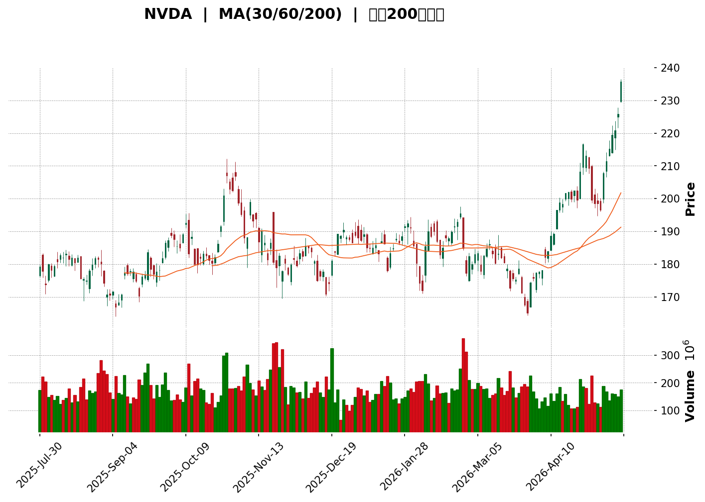
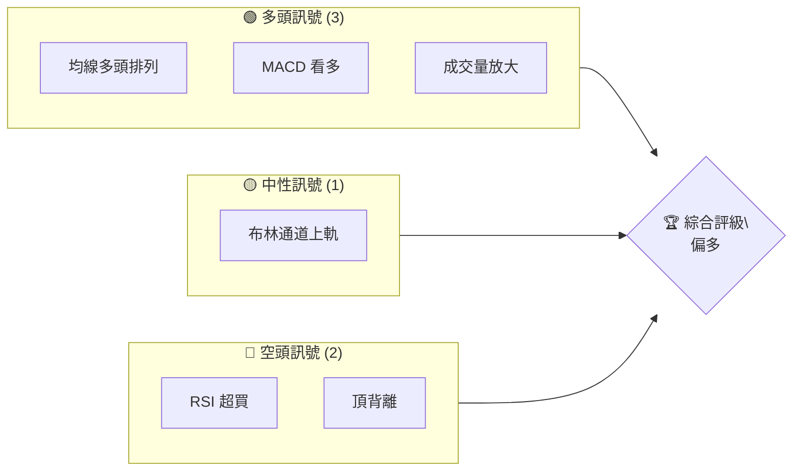
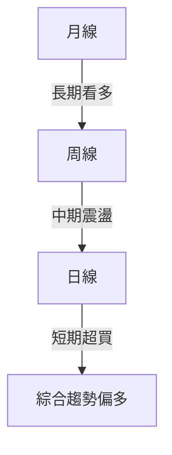
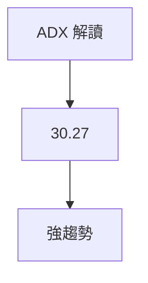
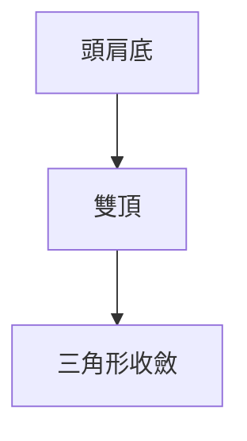
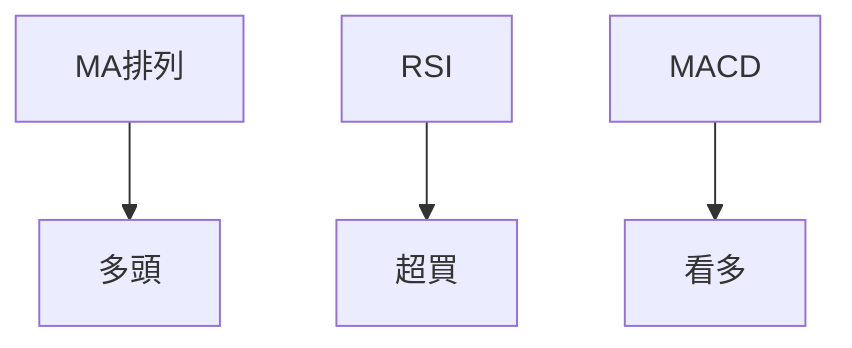
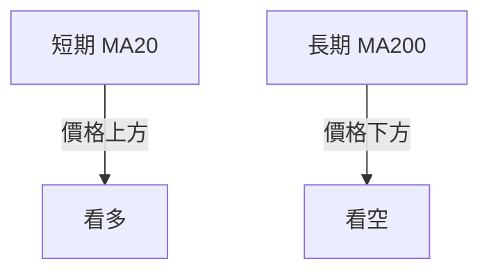
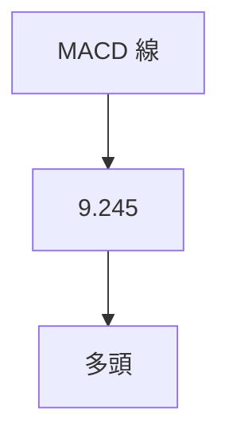
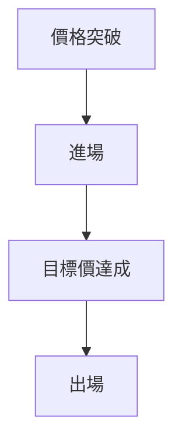
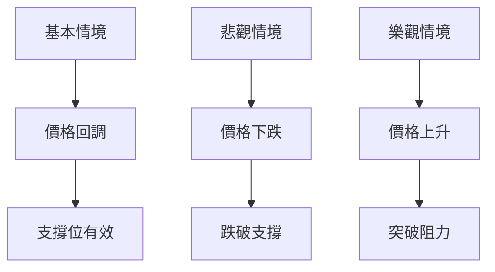

<details>
<summary>📊 靜態圖表 (點擊展開)</summary>

</details>

<html>
<head><meta charset="utf-8" /></head>
<body>
    <div>                        <script>window.PlotlyConfig = {MathJaxConfig: 'local'};</script>
        <script charset="utf-8" src="https://cdn.plot.ly/plotly-3.5.0.min.js" integrity="sha256-fHbNLP+GlIXN+efbQec78UkemUz3NJp7UmfGxC1tNxs=" crossorigin="anonymous"></script>                <div id="candlestick-chart" class="plotly-graph-div" style="height:500px; width:100%;"></div>            <script>                window.PLOTLYENV=window.PLOTLYENV || {};                                if (document.getElementById("candlestick-chart")) {                    Plotly.newPlot(                        "candlestick-chart",                        [{"close":{"dtype":"f8","bdata":"AAAA4K9nZkAAAADg5DpmQAAAAMAdtmVAAAAAAAt\u002fZkAAAABAX0dmQAAAAGB8bGZAAAAA4K2XZkAAAADAbdVmQAAAAKDzwGZAAAAAYCXkZkAAAAAg6rFmQAAAAACsv2ZAAAAAwHCNZkAAAAAAWr9mQAAAAMCL82VAAAAAAN7rZUAAAADgbd5lQAAAAOC7PmZAAAAAwPZ4ZkAAAABgrLdmQAAAACA8smZAAAAAYHuEZkAAAABg1cRlQAAAAEANWGVAAAAA4O5SZUAAAAAgNXRlQAAAAKDA32RAAAAAYAYJZUAAAABgaVdlQAAAAACeKWZAAAAAYNEkZkAAAACAnTlmQAAAAEBgN2ZAAAAAwIvbZUAAAACArkhlQAAAAKAPB2ZAAAAAoNEUZkAAAAAA4PJmQAAAAAAiTWZAAAAAAGseZkAAAADAdDVmQAAAAEB0RWZAAAAAwI+6ZkAAAACA51FnQAAAAMAFZ2dAAAAAANGbZ0AAAABgLnNnQAAAAMCgMGdAAAAAQKEgZ0AAAAAA26JnQAAAAECQEWhAAAAAAHrkZkAAAAAglIlnQAAAAMBTgGZAAAAAoO15ZkAAAAAASLlmQAAAAIBl5mZAAAAAoNbTZkAAAADAe6RmQAAAAKBTiGZAAAAA4HrEZkAAAABAqkdnQAAAAOAB72dAAAAAAEEgaUAAAACAjeBpQAAAAGDEW2lAAAAAAPhOaUAAAADgbttpQAAAAMBh1WhAAAAA4AhmaEAAAABA5oFnQAAAAKAjhGdAAAAAoObgaEAAAAAAcSRoQAAAAGDrOGhAAAAAAN1aZ0AAAACAxcRnQAAAAGCLUmdAAAAAAOKqZkAAAAAg\u002fE9nQAAAAGDYk2ZAAAAAIIhbZkAAAACA9dBmQAAAAICdOWZAAAAAwK+HZkAAAADAYB9mQAAAAODOfGZAAAAAIBWuZkAAAADAP3JmQAAAAMDX62ZAAAAA4M3MZkAAAABgRzFnQAAAAEC4HmdAAAAAQKT4ZkAAAABAcp1mQAAAAEBW4GVAAAAAgPkIZkAAAACAuzZmQAAAAMDIXWVAAAAAoC3EZUAAAADgXZ9mQAAAAADD9WZAAAAAgGSmZ0AAAACAMZNnQAAAAECh0GdAAAAAwLaGZ0AAAACA9HBnQAAAAGCtT2dAAAAAgN+aZ0AAAACgg4NnQAAAACBbZ2dAAAAAQDGjZ0AAAACg9SBnQAAAACAzG2dAAAAAgMIdZ0AAAAAgmTlnQAAAAKAp5GZAAAAAwEZhZ0AAAACACUdnQAAAAIDuQWZAAAAAQOzpZkAAAABAjxpnQAAAAGAddWdAAAAAoLdOZ0AAAABAUJBnQAAAAABP8GdAAAAAgPwPaEAAAABA1ONnQAAAAOAyM2dAAAAAQJGKZkAAAABAx8VlQAAAAMDce2VAAAAAgMwsZ0AAAABg88BnQAAAAAD0kGdAAAAAYEXBZ0AAAACgwV1nQAAAAICa2WZAAAAAQLgeZ0AAAADACH9nQAAAAIB5fGdAAAAAYOm5Z0AAAADARPFnQAAAAMDdGmhAAAAAwJRxaEAAAADgKBxnQAAAAADGJWZAAAAAQAvPZkAAAADASYFmQAAAAID24GZAAAAAAJDqZkAAAACg7jlmQAAAAMB71GZAAAAAAFIYZ0AAAADA9UBnQAAAAOB65GZAAAAAAACIZkAAAABACudmQAAAAIDCvWZAAAAAwMyMZkAAAACA61FmQAAAAGBmlmVAAAAA4Hr0ZUAAAABgZuZlQAAAAIDCVWZAAAAAIK5nZUAAAADgo\u002fBkQAAAAKBwpWRAAAAAwMzMZUAAAAAAAPhlQAAAAOB6LGZAAAAA4Ho0ZkAAAABAM0NmQAAAAGCPwmZAAAAAwB79ZkAAAAAAKZRnQAAAAIDrqWdAAAAA4FGQaEAAAAAA19toQAAAAEAzy2hAAAAAgMI1aUAAAACA60FpQAAAAAAp\u002fGhAAAAAAABQaUAAAADgevRoQAAAAOCjCGpAAAAAIIUTa0AAAACgcKVqQAAAAAAAKGpAAAAAgD3yaEAAAABgZs5oQAAAACBcz2hAAAAAAACQaEAAAABgj\u002fppQAAAAAAAcGpAAAAAYGbmakAAAACAFG5rQAAAAMD1mGtAAAAAYI86bEAAAAAgrndtQA=="},"high":{"dtype":"f8","bdata":"YMj4B4Z7ZkCcRsEboOhmQDzeMElXEGZAq+pPGnGFZkBCVyGHXIdmQJicuNjXe2ZABZuMxC77ZkA8JvkuoOhmQNRgl\u002fPm+WZALXfr82AOZ0Ca+NTiD\u002f5mQKwEYaOq32ZAEBy7JtW7ZkC\u002fCMNbG91mQESXE4kHz2ZAZuXrbhD\u002fZUBMOMHi2xtmQJ3h8i7uUWZA9iA9JCe8ZkC6B+OHgstmQCBt88m1zmZAPfiSJQ8OZ0BrHGc42kNmQGBAXlI+i2VAWyeSMDSMZUDbslE6m3plQA814sMPIGVAvet4pM9dZUCtBlFTc15lQMCjBpVTaGZA4zpetFOIZkDMuVSMklJmQM9A6oKSWmZAUdPlZGAvZkAqTSGiyqVlQLEyAPqTImZAFCskG+9BZkANAZan8xBnQIZjM4nMzGZA+4ir+FN4ZkCwyYHQr4dmQNEDPjQCeGZA6gwkkVr\u002fZkAgA6SuimpnQBye0LDRg2dA\u002fzm0zu3gZ0DC5ZIJ2spnQErb4bqzZmdACrivgkGhZ0C63SaviLJnQJPWPOvpaGhAieTaCidzaEBjS9wj2sJnQNKULFXzGGdAT0R7tzAbZ0BaJ5TtUOhmQEPJbbWNAmdAPfGg0r8lZ0A+P40oo9hmQMJJgYhv7WZAsDKjF1HgZkDGujqJYW5nQCUvj0pT\u002f2dAeO0HGBZkaUCADsi+VYVqQBv7AU9lxGlAYHI2Mk\u002f+aUDCqskcI2pqQIan+L9SfmlAdGyHMbpcaUD99eRLJbNoQLei4DiUiWdAkTAcs2D9aEAELpTXwGxoQKwm777Ke2hAxjUTQWjtZ0DbGn\u002f+pd9nQLdkQfdVn2dAD3fnZ\u002fMYZ0DmW3sr3HpnQF7Qta5Pf2hA9+FHhEURZ0A24VgFW+9mQGT2rnF+RGZAahzZPXrcZkA6GI1QpmhmQLsJi4j3iGZAUjCzuHc0Z0B\u002fBJdNws1mQLzesR5SEGdAcYie4MwUZ0A+KPqprH9nQL4s4uq3NmdAgR4B3wkvZ0DbErcT7almQEChYGrs2WZAkyZajiFNZkBsM6cIX09mQHebOvPaA2ZAXsW8m34EZkDHbMnrFa5mQMGynQrNBGdApPZhcjuqZ0DDzPL9ypxnQEURwwq\u002fFWhAomKsIv6XZ0B053dbWp9nQDl8iBOX0WdAVVvN8GwdaEDWSdYu0zNoQKJYi3AbBWhANBRlH4LrZ0Dfy1ugRbFnQBPz75eOSmdAOi6OCIRjZ0BhqPe6MYNnQCbBFIpmDmdAXDBtUxK2Z0BC19MBwM1nQBbTfxbYy2ZAIFVE1tYrZ0BdJfQIHkVnQPiH0yTfsmdAubBmM4OjZ0CSLe+3q79nQHsH1gHeCmhAhcHfUQYvaECgeJfiV09oQOu69EtFyWdASqORPlFIZ0B0IBG8P3JmQPbL+Q7vGWZAzcxuC61fZ0ALfCjlyDRoQFCwoMAGD2hAZQ62M\u002fwnaEDn+ANLLzNoQIs9BOysb2dAQXSYyHlkZ0BEQqGQgstnQPru4gNvjWdAoX4jBjvKZ0BLPMNvED5oQDkdlfdNOGhAB4PtVNGzaEBW3b508UhoQDtQj1uQ0mZAgRXPEGfuZkBsxXd\u002ffJxmQMdGp4MUFmdAYMhQ7pkBZ0BWrAzPANhmQHtAe6LN3GZAZuaO4sFNZ0AAAAAA13NnQAAAAIAUHmdAAAAAQOFCZ0AAAAAAKZxnQAAAAMDMLGdAAAAAACnsZkAAAAAgXH9mQAAAAOBRSGZAAAAAANdLZkAAAABACgdmQAAAAEAKp2ZAAAAA4FEQZkAAAABACl9lQAAAAGBmLmVAAAAAANfTZUAAAAAA1ytmQAAAACCuL2ZAAAAAoEc5ZkAAAAAgXEdmQAAAAOBRKGdAAAAAYI8CZ0AAAAAAAMBnQAAAAMAetWdAAAAA4FGQaEAAAADAzAxpQAAAAEAz+2hAAAAAYGY2aUAAAACgcEVpQAAAAAAAWGlAAAAAAABQaUAAAABgj3ppQAAAAGBmXmpAAAAAYI8aa0AAAAAgXNdqQAAAAEAKl2pAAAAAoJlJakAAAAAAAGBpQAAAACBcN2lAAAAAIK4HaUAAAADgowhqQAAAAGBmxmpAAAAAoJk5a0AAAACgmclrQAAAAAAA+GtAAAAAQOF6bEAAAACgR5FtQA=="},"hovertemplate":"\u003cb\u003e%{x|%Y-%m-%d}\u003c\u002fb\u003e\u003cbr\u003e\u958b: $%{open:.2f}\u003cbr\u003e\u9ad8: $%{high:.2f}\u003cbr\u003e\u4f4e: $%{low:.2f}\u003cbr\u003e\u6536: $%{close:.2f}\u003cextra\u003e\u003c\u002fextra\u003e","low":{"dtype":"f8","bdata":"3itzBVgAZkAQ8gwE0\u002fxlQIEzTDqSW2VAclx5VbbPZUDleE5W3ftlQMQlvxAQB2ZAIUlNTqZYZkDvHENB14tmQIpV3ZYKh2ZAkx6gCcRtZkDGc2MsP2pmQC8OePzDbWZAO47LR1VAZkAzhRFP65FmQJcMRzS\u002f7mVAUlbW27MYZUBcMdLX\u002frhlQJNlzV19ZWVAxA\u002f\u002fKE0RZkATy8YH+FhmQBnS7IY\u002fYmZA46Y\u002fni4MZkC1z\u002fcG4aNlQDipuZgm5mRAzzECPkMbZUDP8+svOCxlQMcliUNegWRAPIyObk\u002fqZEBFdjQZy9ZkQBypIWgb7mVADTDGfr0OZkBHT5Obxw1mQNyEcgm1z2VAkJcYM4zLZUAY6MNQhwxlQMW1KNMcnmVAWHFK1yTlZUAPFwVBG9ZlQL0qNd8ZBmZATW2t6S7sZUD1AIBZjaNlQJ4eii4l3WVAkwQoYJuJZkASZ7bWuK5mQEMP5WAn\u002fGZAOTcXX0KBZ0BXsmFjgitnQA3113zq6WZAAwBij1r\u002fZkDiSt\u002fPn1BnQBmfx5s\u002f4WdAQSqZ3\u002fXAZkBjsGEfET5nQH8OBazEdWZAWALeKKgoZkCY16Q1AnhmQJ5NxV5ed2ZAmA6Bsbi2ZkBoc0LZ93hmQK3KX+qyF2ZAQBDS4aV4ZkBkXd7bWu9mQPaXpwAZjWdApPUwM3L8Z0Df9RyoPZhpQKBqzZRpLGlALLu0wIdBaUCHLgWQMrFpQKpmCW8QvWhAil3jwB1UaEB50lZngUtnQEXxQO59XGZAZuHsWpk4aEBD+k+M7ehnQMlnkSZ942dAsvhM1Y36ZkD6dyzh7JFmQAO\u002fG62XCWdAAiC\u002fKSt0ZkB5NJTx6tlmQPvq7XWRemZARfHi+SadZUBsIxV1vQ5mQMrb9BABMWVALcEX0Q1HZkCK8SkzYQ9mQDrsHVwmtWVALfNAEF5\u002fZkDIWoAO5GJmQMtj6qNofmZAX\u002fpAis6cZkA+m3Xle8xmQC1wQTvs6WZAZ6WJ5fbAZkBDy2KpiBNmQFvlao2J02VACBfyLqjgZUAejuQ\u002ff9xlQHVHeAegSWVAypR3R\u002fF5ZUBkatEPkwpmQHhKM1jiymZA70ATrHvcZkBlV0eFjlJnQOLpPp+sf2dAGjpYRsw8Z0BvWzelb11nQC8vIoFbT2dAmsv7Yv6HZ0DO7YM\u002fekRnQJ1Rqa\u002fqWWdAUY6IwZhRZ0ATnuH2ZvZmQEPVIScf9WZAm\u002fLuuVLgZkB1TYRxe+xmQIVzw2lJmWZAEmOq0TxKZ0A\u002fSwnRPEJnQI6WPlQ2M2ZA+Qs9rn1MZkDXBVnncP1mQK+dhqDqWWdA6J5ytls\u002fZ0CPLTwAFDZnQF3umB6NumdA+5BH\u002fJhBZ0AfK288tq5nQInyzxLXG2dA67++8g0HZkD22tmC0nxlQNd8iOCpYGVAL96hy+XSZUBbTirTFP5mQC9vsI+Dg2dAIghDMVCYZ0CxUM0w\u002f09nQNtBYsqQsmZA9rIZEXNlZkC1GIYK\u002f1dnQPxyEH7MNGdApZI0GMI9Z0A7U3ZfO7JnQPwckKp5bGdACOkAqfE4aEDCM7fA6wlnQJ+o3dvaC2ZANquEeS3UZUBGRXgjIh1mQORqHbKbgWZAyzZwK9o7ZkAkk40R7xlmQNXc6qSd8WVAbUQXOQHAZkAAAABgZg5nQAAAAAAAuGZAAAAAgBR+ZkAAAADAHq1mQAAAAIDCtWZAAAAAYI+KZkAAAACgR\u002fllQAAAAEAKd2VAAAAA4FHYZUAAAAAgXL9lQAAAAEAzG2ZAAAAA4HpkZUAAAADgUeBkQAAAAOCjiGRAAAAAYLjeZEAAAAAAANhlQAAAAADXa2VAAAAA4FH4ZUAAAADAHrVlQAAAAKCZiWZAAAAAANeTZkAAAACgmQlnQAAAACCuN2dAAAAA4KPYZ0AAAAAgrndoQAAAAIDreWhAAAAA4KPoaEAAAABA4bpoQAAAAAAA4GhAAAAAAADgaEAAAABACqdoQAAAAIDr+WhAAAAAACnsaUAAAABgZgZqQAAAAGCP8mlAAAAAYGbWaEAAAAAA16NoQAAAACCuV2hAAAAAwPWAaEAAAAAghdNoQAAAAAAA0GlAAAAA4HqcakAAAADgerxqQAAAAKBw3WpAAAAAgD2ya0AAAACA66lsQA=="},"name":"\u50f9\u683c","open":{"dtype":"f8","bdata":"XVOvoWEPZkDIXSbH09tmQPEbDT\u002f0wWVAHEd4VjDkZUB62yCG4nJmQHKw3VSfCWZAsD5MaUaxZkBI4KCQorBmQJzIe8OhwGZA2V61Rb\u002fdZkDT1Sh53tJmQKcHXzcLd2ZAhkGybTG7ZkA7IZRLPZJmQOXreSHKzGZAu\u002fskMILkZUD\u002fVU8tRdplQBLshTKakmVA1Wq+fEBKZkAPow9U9oBmQBZ9n3tkvmZAd6B9XUeZZkAdSVemkkJmQPkT2I8YP2VAzzbBxgJhZUAx5sNbVVFlQIeAMyARAGVAZaHbiLXwZEC\u002f8hcG+yFlQAfIb3CKE2ZAvvlu\u002fiB1ZkB+mYTrAzhmQArzjr7S9GVA4Wr+12AfZkAj\u002fgmj35NlQDxPU6i\u002fvmVAi8xarwX4ZUCWzS\u002f5++hlQBTp0pBmvmZAMPP4GgJ4ZkBkcstCv85lQH8Cm2TQRGZAs1vXRiCNZkAegoKM68FmQPEXaowHJ2dAeyOJvIiyZ0Dt+cR2aqVnQAJVNSlZL2dAR6cWrrRGZ0Ahw\u002fWolVFnQMZoTy6vBmhAnNK40KMvaEB4b5YwYX5nQL6vFZz9F2dAsxeZZ\u002fMYZ0CPB08\u002fuMZmQP4QynsghWZAPnQwT4TjZkA+P40oo9hmQMDNAvrXo2ZA7YC6UM6MZkAQpInNO\u002fpmQKLhajkDv2dA8NbKDOwgaEA0Lqsnof5pQIvUlTcUpGlAzeAysKzNaUBcxZ4r1AFqQAPwXl9JX2lAeLGoLPHXaEC5MSIAwIxoQE0U34smHGdABLMKq9ViaEDP\u002fHIzb2RoQDFHEEZadmhAkZvnuu3gZ0DzqvKT4NpmQAvRGPFiPmdAqJDfDoTrZkBgeFBuoRhnQDe8ORq2fWhAXqqmIAunZkBoPkvADG9mQAQ9Tl6B3GVA98mPpIWzZkA56QrRsF9mQIfYjsO012VARO\u002foWq63ZkCSIPuI7KFmQIhaoYeGs2ZAd0cEWCn8ZkB+TjnqKdRmQPfGCj2ZMWdA5QznOLgeZ0B7\u002fc3JpYhmQOGqiMw0o2ZAbrHOpMU9ZkCrW57FAwhmQATRoTblAmZA2c61U6jQZUCZHlxKIhVmQH5g4AUf\u002fWZA0m8hJLneZkCUKQwswX1nQL\u002fJQWUcvWdARHDrGWV2Z0Ap+pGwWodnQBU90IPpsWdAHG6bD426Z0CP6wHj\u002fPdnQF0hyWtP0GdAX+dP3emRZ0BkZUZSMaNnQKV6BEc9ImdASXk7A7nmZkAdsO37rR9nQH09+7nrCWdA4DdiXq1PZ0Cv3Ut8O6JnQD8IBA18vGZAd5J8REphZkD6gjgKrhdnQIofTtOsb2dAxPu60ctkZ0CSuloRW2dnQIzRXBxP6GdAXPvUZIzqZ0A4LOuWY+ZnQLOboGsTZmdArsT5gVtHZ0DPqbDJaG5mQG3FnuV03WVAdGhIHsYVZkDoqPsvAAhnQGgIhx3U62dAIG2iDxEOaEC3KdcsoCBoQEgfSQ4Jb2dAugRvba+3ZkBMFZJIrJdnQB4rRp+YYWdA5m660OpRZ0AhEwTxd+xnQKZRWzpZ72dAFIcNHhBOaEDU2wO3TUhoQKgUibOvp2ZAGPmJTwTgZUAvoCrxXk9mQKK8\u002f4bEjWZA5uwvViClZkA\u002fx596kXpmQA9RvPRAGmZAQJrZ7HvMZkAAAADAHj1nQAAAAKCZAWdAAAAAoHAdZ0AAAABACt9mQAAAAIDrIWdAAAAAIFzPZkAAAADgUUBmQAAAAAAAQGZAAAAA4FEoZkAAAABgj9plQAAAAEAzI2ZAAAAAgD0CZkAAAAAAAEBlQAAAAMD1GGVAAAAAQArfZEAAAAAAAABmQAAAAIDChWVAAAAAwB4lZkAAAAAgXPdlQAAAAAAAEGdAAAAAQOG6ZkAAAACA6wlnQAAAAMD1QGdAAAAAQOHaZ0AAAACgR5FoQAAAAIDCrWhAAAAAwMz8aEAAAAAgXP9oQAAAAAApRGlAAAAAIK4faUAAAABguE5pQAAAAGC4\u002fmhAAAAAwMw0akAAAAAgri9qQAAAAGBmlmpAAAAAgMI9akAAAADA9ShpQAAAAAAA8GhAAAAAoJnpaEAAAADgevxoQAAAAEDhCmpAAAAAwPWgakAAAACgR8FqQAAAAKCZUWtAAAAAgMIdbEAAAAAgXLdsQA=="},"x":["2025-07-30T00:00:00-04:00","2025-07-31T00:00:00-04:00","2025-08-01T00:00:00-04:00","2025-08-04T00:00:00-04:00","2025-08-05T00:00:00-04:00","2025-08-06T00:00:00-04:00","2025-08-07T00:00:00-04:00","2025-08-08T00:00:00-04:00","2025-08-11T00:00:00-04:00","2025-08-12T00:00:00-04:00","2025-08-13T00:00:00-04:00","2025-08-14T00:00:00-04:00","2025-08-15T00:00:00-04:00","2025-08-18T00:00:00-04:00","2025-08-19T00:00:00-04:00","2025-08-20T00:00:00-04:00","2025-08-21T00:00:00-04:00","2025-08-22T00:00:00-04:00","2025-08-25T00:00:00-04:00","2025-08-26T00:00:00-04:00","2025-08-27T00:00:00-04:00","2025-08-28T00:00:00-04:00","2025-08-29T00:00:00-04:00","2025-09-02T00:00:00-04:00","2025-09-03T00:00:00-04:00","2025-09-04T00:00:00-04:00","2025-09-05T00:00:00-04:00","2025-09-08T00:00:00-04:00","2025-09-09T00:00:00-04:00","2025-09-10T00:00:00-04:00","2025-09-11T00:00:00-04:00","2025-09-12T00:00:00-04:00","2025-09-15T00:00:00-04:00","2025-09-16T00:00:00-04:00","2025-09-17T00:00:00-04:00","2025-09-18T00:00:00-04:00","2025-09-19T00:00:00-04:00","2025-09-22T00:00:00-04:00","2025-09-23T00:00:00-04:00","2025-09-24T00:00:00-04:00","2025-09-25T00:00:00-04:00","2025-09-26T00:00:00-04:00","2025-09-29T00:00:00-04:00","2025-09-30T00:00:00-04:00","2025-10-01T00:00:00-04:00","2025-10-02T00:00:00-04:00","2025-10-03T00:00:00-04:00","2025-10-06T00:00:00-04:00","2025-10-07T00:00:00-04:00","2025-10-08T00:00:00-04:00","2025-10-09T00:00:00-04:00","2025-10-10T00:00:00-04:00","2025-10-13T00:00:00-04:00","2025-10-14T00:00:00-04:00","2025-10-15T00:00:00-04:00","2025-10-16T00:00:00-04:00","2025-10-17T00:00:00-04:00","2025-10-20T00:00:00-04:00","2025-10-21T00:00:00-04:00","2025-10-22T00:00:00-04:00","2025-10-23T00:00:00-04:00","2025-10-24T00:00:00-04:00","2025-10-27T00:00:00-04:00","2025-10-28T00:00:00-04:00","2025-10-29T00:00:00-04:00","2025-10-30T00:00:00-04:00","2025-10-31T00:00:00-04:00","2025-11-03T00:00:00-05:00","2025-11-04T00:00:00-05:00","2025-11-05T00:00:00-05:00","2025-11-06T00:00:00-05:00","2025-11-07T00:00:00-05:00","2025-11-10T00:00:00-05:00","2025-11-11T00:00:00-05:00","2025-11-12T00:00:00-05:00","2025-11-13T00:00:00-05:00","2025-11-14T00:00:00-05:00","2025-11-17T00:00:00-05:00","2025-11-18T00:00:00-05:00","2025-11-19T00:00:00-05:00","2025-11-20T00:00:00-05:00","2025-11-21T00:00:00-05:00","2025-11-24T00:00:00-05:00","2025-11-25T00:00:00-05:00","2025-11-26T00:00:00-05:00","2025-11-28T00:00:00-05:00","2025-12-01T00:00:00-05:00","2025-12-02T00:00:00-05:00","2025-12-03T00:00:00-05:00","2025-12-04T00:00:00-05:00","2025-12-05T00:00:00-05:00","2025-12-08T00:00:00-05:00","2025-12-09T00:00:00-05:00","2025-12-10T00:00:00-05:00","2025-12-11T00:00:00-05:00","2025-12-12T00:00:00-05:00","2025-12-15T00:00:00-05:00","2025-12-16T00:00:00-05:00","2025-12-17T00:00:00-05:00","2025-12-18T00:00:00-05:00","2025-12-19T00:00:00-05:00","2025-12-22T00:00:00-05:00","2025-12-23T00:00:00-05:00","2025-12-24T00:00:00-05:00","2025-12-26T00:00:00-05:00","2025-12-29T00:00:00-05:00","2025-12-30T00:00:00-05:00","2025-12-31T00:00:00-05:00","2026-01-02T00:00:00-05:00","2026-01-05T00:00:00-05:00","2026-01-06T00:00:00-05:00","2026-01-07T00:00:00-05:00","2026-01-08T00:00:00-05:00","2026-01-09T00:00:00-05:00","2026-01-12T00:00:00-05:00","2026-01-13T00:00:00-05:00","2026-01-14T00:00:00-05:00","2026-01-15T00:00:00-05:00","2026-01-16T00:00:00-05:00","2026-01-20T00:00:00-05:00","2026-01-21T00:00:00-05:00","2026-01-22T00:00:00-05:00","2026-01-23T00:00:00-05:00","2026-01-26T00:00:00-05:00","2026-01-27T00:00:00-05:00","2026-01-28T00:00:00-05:00","2026-01-29T00:00:00-05:00","2026-01-30T00:00:00-05:00","2026-02-02T00:00:00-05:00","2026-02-03T00:00:00-05:00","2026-02-04T00:00:00-05:00","2026-02-05T00:00:00-05:00","2026-02-06T00:00:00-05:00","2026-02-09T00:00:00-05:00","2026-02-10T00:00:00-05:00","2026-02-11T00:00:00-05:00","2026-02-12T00:00:00-05:00","2026-02-13T00:00:00-05:00","2026-02-17T00:00:00-05:00","2026-02-18T00:00:00-05:00","2026-02-19T00:00:00-05:00","2026-02-20T00:00:00-05:00","2026-02-23T00:00:00-05:00","2026-02-24T00:00:00-05:00","2026-02-25T00:00:00-05:00","2026-02-26T00:00:00-05:00","2026-02-27T00:00:00-05:00","2026-03-02T00:00:00-05:00","2026-03-03T00:00:00-05:00","2026-03-04T00:00:00-05:00","2026-03-05T00:00:00-05:00","2026-03-06T00:00:00-05:00","2026-03-09T00:00:00-04:00","2026-03-10T00:00:00-04:00","2026-03-11T00:00:00-04:00","2026-03-12T00:00:00-04:00","2026-03-13T00:00:00-04:00","2026-03-16T00:00:00-04:00","2026-03-17T00:00:00-04:00","2026-03-18T00:00:00-04:00","2026-03-19T00:00:00-04:00","2026-03-20T00:00:00-04:00","2026-03-23T00:00:00-04:00","2026-03-24T00:00:00-04:00","2026-03-25T00:00:00-04:00","2026-03-26T00:00:00-04:00","2026-03-27T00:00:00-04:00","2026-03-30T00:00:00-04:00","2026-03-31T00:00:00-04:00","2026-04-01T00:00:00-04:00","2026-04-02T00:00:00-04:00","2026-04-06T00:00:00-04:00","2026-04-07T00:00:00-04:00","2026-04-08T00:00:00-04:00","2026-04-09T00:00:00-04:00","2026-04-10T00:00:00-04:00","2026-04-13T00:00:00-04:00","2026-04-14T00:00:00-04:00","2026-04-15T00:00:00-04:00","2026-04-16T00:00:00-04:00","2026-04-17T00:00:00-04:00","2026-04-20T00:00:00-04:00","2026-04-21T00:00:00-04:00","2026-04-22T00:00:00-04:00","2026-04-23T00:00:00-04:00","2026-04-24T00:00:00-04:00","2026-04-27T00:00:00-04:00","2026-04-28T00:00:00-04:00","2026-04-29T00:00:00-04:00","2026-04-30T00:00:00-04:00","2026-05-01T00:00:00-04:00","2026-05-04T00:00:00-04:00","2026-05-05T00:00:00-04:00","2026-05-06T00:00:00-04:00","2026-05-07T00:00:00-04:00","2026-05-08T00:00:00-04:00","2026-05-11T00:00:00-04:00","2026-05-12T00:00:00-04:00","2026-05-13T00:00:00-04:00","2026-05-14T00:00:00-04:00"],"type":"candlestick"},{"hovertemplate":"MA30: $%{y:.2f}\u003cextra\u003e\u003c\u002fextra\u003e","line":{"color":"#2196F3","dash":"dash","width":2},"mode":"lines","name":"MA30","x":["2025-07-30T00:00:00-04:00","2025-07-31T00:00:00-04:00","2025-08-01T00:00:00-04:00","2025-08-04T00:00:00-04:00","2025-08-05T00:00:00-04:00","2025-08-06T00:00:00-04:00","2025-08-07T00:00:00-04:00","2025-08-08T00:00:00-04:00","2025-08-11T00:00:00-04:00","2025-08-12T00:00:00-04:00","2025-08-13T00:00:00-04:00","2025-08-14T00:00:00-04:00","2025-08-15T00:00:00-04:00","2025-08-18T00:00:00-04:00","2025-08-19T00:00:00-04:00","2025-08-20T00:00:00-04:00","2025-08-21T00:00:00-04:00","2025-08-22T00:00:00-04:00","2025-08-25T00:00:00-04:00","2025-08-26T00:00:00-04:00","2025-08-27T00:00:00-04:00","2025-08-28T00:00:00-04:00","2025-08-29T00:00:00-04:00","2025-09-02T00:00:00-04:00","2025-09-03T00:00:00-04:00","2025-09-04T00:00:00-04:00","2025-09-05T00:00:00-04:00","2025-09-08T00:00:00-04:00","2025-09-09T00:00:00-04:00","2025-09-10T00:00:00-04:00","2025-09-11T00:00:00-04:00","2025-09-12T00:00:00-04:00","2025-09-15T00:00:00-04:00","2025-09-16T00:00:00-04:00","2025-09-17T00:00:00-04:00","2025-09-18T00:00:00-04:00","2025-09-19T00:00:00-04:00","2025-09-22T00:00:00-04:00","2025-09-23T00:00:00-04:00","2025-09-24T00:00:00-04:00","2025-09-25T00:00:00-04:00","2025-09-26T00:00:00-04:00","2025-09-29T00:00:00-04:00","2025-09-30T00:00:00-04:00","2025-10-01T00:00:00-04:00","2025-10-02T00:00:00-04:00","2025-10-03T00:00:00-04:00","2025-10-06T00:00:00-04:00","2025-10-07T00:00:00-04:00","2025-10-08T00:00:00-04:00","2025-10-09T00:00:00-04:00","2025-10-10T00:00:00-04:00","2025-10-13T00:00:00-04:00","2025-10-14T00:00:00-04:00","2025-10-15T00:00:00-04:00","2025-10-16T00:00:00-04:00","2025-10-17T00:00:00-04:00","2025-10-20T00:00:00-04:00","2025-10-21T00:00:00-04:00","2025-10-22T00:00:00-04:00","2025-10-23T00:00:00-04:00","2025-10-24T00:00:00-04:00","2025-10-27T00:00:00-04:00","2025-10-28T00:00:00-04:00","2025-10-29T00:00:00-04:00","2025-10-30T00:00:00-04:00","2025-10-31T00:00:00-04:00","2025-11-03T00:00:00-05:00","2025-11-04T00:00:00-05:00","2025-11-05T00:00:00-05:00","2025-11-06T00:00:00-05:00","2025-11-07T00:00:00-05:00","2025-11-10T00:00:00-05:00","2025-11-11T00:00:00-05:00","2025-11-12T00:00:00-05:00","2025-11-13T00:00:00-05:00","2025-11-14T00:00:00-05:00","2025-11-17T00:00:00-05:00","2025-11-18T00:00:00-05:00","2025-11-19T00:00:00-05:00","2025-11-20T00:00:00-05:00","2025-11-21T00:00:00-05:00","2025-11-24T00:00:00-05:00","2025-11-25T00:00:00-05:00","2025-11-26T00:00:00-05:00","2025-11-28T00:00:00-05:00","2025-12-01T00:00:00-05:00","2025-12-02T00:00:00-05:00","2025-12-03T00:00:00-05:00","2025-12-04T00:00:00-05:00","2025-12-05T00:00:00-05:00","2025-12-08T00:00:00-05:00","2025-12-09T00:00:00-05:00","2025-12-10T00:00:00-05:00","2025-12-11T00:00:00-05:00","2025-12-12T00:00:00-05:00","2025-12-15T00:00:00-05:00","2025-12-16T00:00:00-05:00","2025-12-17T00:00:00-05:00","2025-12-18T00:00:00-05:00","2025-12-19T00:00:00-05:00","2025-12-22T00:00:00-05:00","2025-12-23T00:00:00-05:00","2025-12-24T00:00:00-05:00","2025-12-26T00:00:00-05:00","2025-12-29T00:00:00-05:00","2025-12-30T00:00:00-05:00","2025-12-31T00:00:00-05:00","2026-01-02T00:00:00-05:00","2026-01-05T00:00:00-05:00","2026-01-06T00:00:00-05:00","2026-01-07T00:00:00-05:00","2026-01-08T00:00:00-05:00","2026-01-09T00:00:00-05:00","2026-01-12T00:00:00-05:00","2026-01-13T00:00:00-05:00","2026-01-14T00:00:00-05:00","2026-01-15T00:00:00-05:00","2026-01-16T00:00:00-05:00","2026-01-20T00:00:00-05:00","2026-01-21T00:00:00-05:00","2026-01-22T00:00:00-05:00","2026-01-23T00:00:00-05:00","2026-01-26T00:00:00-05:00","2026-01-27T00:00:00-05:00","2026-01-28T00:00:00-05:00","2026-01-29T00:00:00-05:00","2026-01-30T00:00:00-05:00","2026-02-02T00:00:00-05:00","2026-02-03T00:00:00-05:00","2026-02-04T00:00:00-05:00","2026-02-05T00:00:00-05:00","2026-02-06T00:00:00-05:00","2026-02-09T00:00:00-05:00","2026-02-10T00:00:00-05:00","2026-02-11T00:00:00-05:00","2026-02-12T00:00:00-05:00","2026-02-13T00:00:00-05:00","2026-02-17T00:00:00-05:00","2026-02-18T00:00:00-05:00","2026-02-19T00:00:00-05:00","2026-02-20T00:00:00-05:00","2026-02-23T00:00:00-05:00","2026-02-24T00:00:00-05:00","2026-02-25T00:00:00-05:00","2026-02-26T00:00:00-05:00","2026-02-27T00:00:00-05:00","2026-03-02T00:00:00-05:00","2026-03-03T00:00:00-05:00","2026-03-04T00:00:00-05:00","2026-03-05T00:00:00-05:00","2026-03-06T00:00:00-05:00","2026-03-09T00:00:00-04:00","2026-03-10T00:00:00-04:00","2026-03-11T00:00:00-04:00","2026-03-12T00:00:00-04:00","2026-03-13T00:00:00-04:00","2026-03-16T00:00:00-04:00","2026-03-17T00:00:00-04:00","2026-03-18T00:00:00-04:00","2026-03-19T00:00:00-04:00","2026-03-20T00:00:00-04:00","2026-03-23T00:00:00-04:00","2026-03-24T00:00:00-04:00","2026-03-25T00:00:00-04:00","2026-03-26T00:00:00-04:00","2026-03-27T00:00:00-04:00","2026-03-30T00:00:00-04:00","2026-03-31T00:00:00-04:00","2026-04-01T00:00:00-04:00","2026-04-02T00:00:00-04:00","2026-04-06T00:00:00-04:00","2026-04-07T00:00:00-04:00","2026-04-08T00:00:00-04:00","2026-04-09T00:00:00-04:00","2026-04-10T00:00:00-04:00","2026-04-13T00:00:00-04:00","2026-04-14T00:00:00-04:00","2026-04-15T00:00:00-04:00","2026-04-16T00:00:00-04:00","2026-04-17T00:00:00-04:00","2026-04-20T00:00:00-04:00","2026-04-21T00:00:00-04:00","2026-04-22T00:00:00-04:00","2026-04-23T00:00:00-04:00","2026-04-24T00:00:00-04:00","2026-04-27T00:00:00-04:00","2026-04-28T00:00:00-04:00","2026-04-29T00:00:00-04:00","2026-04-30T00:00:00-04:00","2026-05-01T00:00:00-04:00","2026-05-04T00:00:00-04:00","2026-05-05T00:00:00-04:00","2026-05-06T00:00:00-04:00","2026-05-07T00:00:00-04:00","2026-05-08T00:00:00-04:00","2026-05-11T00:00:00-04:00","2026-05-12T00:00:00-04:00","2026-05-13T00:00:00-04:00","2026-05-14T00:00:00-04:00"],"y":{"dtype":"f8","bdata":"AAAAAAAA+H8AAAAAAAD4fwAAAAAAAPh\u002fAAAAAAAA+H8AAAAAAAD4fwAAAAAAAPh\u002fAAAAAAAA+H8AAAAAAAD4fwAAAAAAAPh\u002fAAAAAAAA+H8AAAAAAAD4fwAAAAAAAPh\u002fAAAAAAAA+H8AAAAAAAD4fwAAAAAAAPh\u002fAAAAAAAA+H8AAAAAAAD4fwAAAAAAAPh\u002fAAAAAAAA+H8AAAAAAAD4fwAAAAAAAPh\u002fAAAAAAAA+H8AAAAAAAD4fwAAAAAAAPh\u002fAAAAAAAA+H8AAAAAAAD4fwAAAAAAAPh\u002fAAAAAAAA+H8AAAAAAAD4f4mIiKghK2ZAq6qqCucoZkAREREh3ChmQFVVVSUrLWZAiYiI+LcnZkDNzMycOh9mQO\u002fu7h7ZG2ZAIiIicnwXZkCJiIi4dxhmQGZmZmabFGZA7+7uHgQOZkAzMzMT3glmQGZmZibLBWZA7+7uLkwHZkBERETELgxmQDMzM7OQGGZAq6qqqvYmZkDNzMyMdDRmQGZmZraEPGZAZmZmdhtCZkCamZlZ8klmQKuqqlqoVWZAIiIigttYZkDv7u7u8mdmQGZmZibTcWZAERERcah7ZkB3d3dnfoZmQKuqqirIl2ZAAAAAYBOnZkBmZmaWLbJmQGZmZsZVtWZAmpmZOai6ZkBmZmamqMNmQLy7uytQ0mZAREREFDTuZkDe3d0tZhVnQKuqqprSMWdAq6qqalxNZ0Crqqr6LWZnQERERLTJe2dAZmZm5j2PZ0AAAADAUppnQCIiIjLypGdAzczMbEq3Z0AiIiICT75nQBERESFOxWdAzczM3CPDZ0CamZkZ3MVnQFVVVYX9xmdA7+7uvhDDZ0BVVVWVTcBnQBEREUGUs2dAiYiIqAOvZ0DNzMw83KhnQERERNSApmdAvLu7O\u002famZ0DNzMzs1KFnQHd3d+dPnmdAiYiIuA2dZ0De3d0NYZtnQCIiIkKynmdAq6qqSvmeZ0AzMzNDOp5nQAAAAOBIl2dAiYiIyOWEZ0CrqqqKD2lnQLy7u6tYS2dAmpmZyWkvZ0De3d29UhBnQDMzM5O88mZAVVVVVUbcZkARERFBudRmQM3MzEz6z2ZA7+7ufn7FZkC8u7sLp8BmQLy7uxstvWZAzczMTKO+ZkARERER2LtmQJqZmZm\u002fu2ZAREREhL\u002fDZkC8u7s7d8VmQAAAACCEzGZAmpmZKXDXZkBVVVXVGtpmQCIiItKf4WZAIiIicqDmZkCamZm5CPBmQO\u002fu7q5682ZA3t3dzXP5ZkCJiIiYiwBnQAAAALDh+mZAq6qqKtr7ZkC8u7tLGPtmQImIiIj5\u002fWZAvLu7C9gAZ0AzMzOD8AhnQO\u002fu7t6JGmdAVVVVxdYrZ0BVVVVlJDpnQBERERHKSWdAzczM\u002fGZQZ0C8u7s7JklnQN7d3X2NPGdARERE5H84Z0CrqqpaBjpnQKuqqvrmN2dAq6qqqto5Z0BmZmbWNjlnQGZmZkZHNWdAVVVV1SMxZ0Crqqqa\u002fTBnQBEREdGxMWdAAAAAsHMyZ0AiIiJCZTlnQCIiIvLqQWdAERERwT5NZ0C8u7uLQ0xnQEREROTqRWdAq6qqCgtBZ0BVVVWVczpnQGZmZqbAP2dAvLu7G8Y\u002fZ0CamZlJSThnQBEREZHuMmdAERERYR4xZ0Crqqo6eS5nQCIiIsKLJWdA7+7uznoYZ0DNzMysDRBnQHd3d4cjDGdARERElDYMZ0BERER04hBnQImIiOjEEWdAmpmZyVsHZ0CamZlJivdmQDMzM6MI7WZAAAAAEPvYZkDv7u7eRsRmQM3MzKx4sWZAd3d3FzWmZkBERERELJlmQM3MzBz5jWZAZmZm9v2AZkC8u7sLqHJmQHd3d\u002fctZ2ZAIiIiosNaZkAzMzOjw15mQCIiItKza2ZAREREpK16ZkCrqqpqw45mQGZmZsYan2ZAZmZmhq2yZkCamZlJi8xmQN7d3e3u3mZAERERIdvxZkARERGRXwBnQLy7u7stG2dAAAAAcPZBZ0CJiIjI6GFnQHd3d\u002fcMf2dAiYiIqH+TZ0BERET0tqhnQM3MzJw2xGdAiYiIyHbaZ0AzMzPzRP1nQAAAAABHIGhAIiIiAitPaEARERGhjIZoQN7d3d3dwWhAAAAAsLn4aEBVVVX1tjhpQA=="},"type":"scatter"},{"hovertemplate":"MA60: $%{y:.2f}\u003cextra\u003e\u003c\u002fextra\u003e","line":{"color":"#9C27B0","dash":"dash","width":2},"mode":"lines","name":"MA60","x":["2025-07-30T00:00:00-04:00","2025-07-31T00:00:00-04:00","2025-08-01T00:00:00-04:00","2025-08-04T00:00:00-04:00","2025-08-05T00:00:00-04:00","2025-08-06T00:00:00-04:00","2025-08-07T00:00:00-04:00","2025-08-08T00:00:00-04:00","2025-08-11T00:00:00-04:00","2025-08-12T00:00:00-04:00","2025-08-13T00:00:00-04:00","2025-08-14T00:00:00-04:00","2025-08-15T00:00:00-04:00","2025-08-18T00:00:00-04:00","2025-08-19T00:00:00-04:00","2025-08-20T00:00:00-04:00","2025-08-21T00:00:00-04:00","2025-08-22T00:00:00-04:00","2025-08-25T00:00:00-04:00","2025-08-26T00:00:00-04:00","2025-08-27T00:00:00-04:00","2025-08-28T00:00:00-04:00","2025-08-29T00:00:00-04:00","2025-09-02T00:00:00-04:00","2025-09-03T00:00:00-04:00","2025-09-04T00:00:00-04:00","2025-09-05T00:00:00-04:00","2025-09-08T00:00:00-04:00","2025-09-09T00:00:00-04:00","2025-09-10T00:00:00-04:00","2025-09-11T00:00:00-04:00","2025-09-12T00:00:00-04:00","2025-09-15T00:00:00-04:00","2025-09-16T00:00:00-04:00","2025-09-17T00:00:00-04:00","2025-09-18T00:00:00-04:00","2025-09-19T00:00:00-04:00","2025-09-22T00:00:00-04:00","2025-09-23T00:00:00-04:00","2025-09-24T00:00:00-04:00","2025-09-25T00:00:00-04:00","2025-09-26T00:00:00-04:00","2025-09-29T00:00:00-04:00","2025-09-30T00:00:00-04:00","2025-10-01T00:00:00-04:00","2025-10-02T00:00:00-04:00","2025-10-03T00:00:00-04:00","2025-10-06T00:00:00-04:00","2025-10-07T00:00:00-04:00","2025-10-08T00:00:00-04:00","2025-10-09T00:00:00-04:00","2025-10-10T00:00:00-04:00","2025-10-13T00:00:00-04:00","2025-10-14T00:00:00-04:00","2025-10-15T00:00:00-04:00","2025-10-16T00:00:00-04:00","2025-10-17T00:00:00-04:00","2025-10-20T00:00:00-04:00","2025-10-21T00:00:00-04:00","2025-10-22T00:00:00-04:00","2025-10-23T00:00:00-04:00","2025-10-24T00:00:00-04:00","2025-10-27T00:00:00-04:00","2025-10-28T00:00:00-04:00","2025-10-29T00:00:00-04:00","2025-10-30T00:00:00-04:00","2025-10-31T00:00:00-04:00","2025-11-03T00:00:00-05:00","2025-11-04T00:00:00-05:00","2025-11-05T00:00:00-05:00","2025-11-06T00:00:00-05:00","2025-11-07T00:00:00-05:00","2025-11-10T00:00:00-05:00","2025-11-11T00:00:00-05:00","2025-11-12T00:00:00-05:00","2025-11-13T00:00:00-05:00","2025-11-14T00:00:00-05:00","2025-11-17T00:00:00-05:00","2025-11-18T00:00:00-05:00","2025-11-19T00:00:00-05:00","2025-11-20T00:00:00-05:00","2025-11-21T00:00:00-05:00","2025-11-24T00:00:00-05:00","2025-11-25T00:00:00-05:00","2025-11-26T00:00:00-05:00","2025-11-28T00:00:00-05:00","2025-12-01T00:00:00-05:00","2025-12-02T00:00:00-05:00","2025-12-03T00:00:00-05:00","2025-12-04T00:00:00-05:00","2025-12-05T00:00:00-05:00","2025-12-08T00:00:00-05:00","2025-12-09T00:00:00-05:00","2025-12-10T00:00:00-05:00","2025-12-11T00:00:00-05:00","2025-12-12T00:00:00-05:00","2025-12-15T00:00:00-05:00","2025-12-16T00:00:00-05:00","2025-12-17T00:00:00-05:00","2025-12-18T00:00:00-05:00","2025-12-19T00:00:00-05:00","2025-12-22T00:00:00-05:00","2025-12-23T00:00:00-05:00","2025-12-24T00:00:00-05:00","2025-12-26T00:00:00-05:00","2025-12-29T00:00:00-05:00","2025-12-30T00:00:00-05:00","2025-12-31T00:00:00-05:00","2026-01-02T00:00:00-05:00","2026-01-05T00:00:00-05:00","2026-01-06T00:00:00-05:00","2026-01-07T00:00:00-05:00","2026-01-08T00:00:00-05:00","2026-01-09T00:00:00-05:00","2026-01-12T00:00:00-05:00","2026-01-13T00:00:00-05:00","2026-01-14T00:00:00-05:00","2026-01-15T00:00:00-05:00","2026-01-16T00:00:00-05:00","2026-01-20T00:00:00-05:00","2026-01-21T00:00:00-05:00","2026-01-22T00:00:00-05:00","2026-01-23T00:00:00-05:00","2026-01-26T00:00:00-05:00","2026-01-27T00:00:00-05:00","2026-01-28T00:00:00-05:00","2026-01-29T00:00:00-05:00","2026-01-30T00:00:00-05:00","2026-02-02T00:00:00-05:00","2026-02-03T00:00:00-05:00","2026-02-04T00:00:00-05:00","2026-02-05T00:00:00-05:00","2026-02-06T00:00:00-05:00","2026-02-09T00:00:00-05:00","2026-02-10T00:00:00-05:00","2026-02-11T00:00:00-05:00","2026-02-12T00:00:00-05:00","2026-02-13T00:00:00-05:00","2026-02-17T00:00:00-05:00","2026-02-18T00:00:00-05:00","2026-02-19T00:00:00-05:00","2026-02-20T00:00:00-05:00","2026-02-23T00:00:00-05:00","2026-02-24T00:00:00-05:00","2026-02-25T00:00:00-05:00","2026-02-26T00:00:00-05:00","2026-02-27T00:00:00-05:00","2026-03-02T00:00:00-05:00","2026-03-03T00:00:00-05:00","2026-03-04T00:00:00-05:00","2026-03-05T00:00:00-05:00","2026-03-06T00:00:00-05:00","2026-03-09T00:00:00-04:00","2026-03-10T00:00:00-04:00","2026-03-11T00:00:00-04:00","2026-03-12T00:00:00-04:00","2026-03-13T00:00:00-04:00","2026-03-16T00:00:00-04:00","2026-03-17T00:00:00-04:00","2026-03-18T00:00:00-04:00","2026-03-19T00:00:00-04:00","2026-03-20T00:00:00-04:00","2026-03-23T00:00:00-04:00","2026-03-24T00:00:00-04:00","2026-03-25T00:00:00-04:00","2026-03-26T00:00:00-04:00","2026-03-27T00:00:00-04:00","2026-03-30T00:00:00-04:00","2026-03-31T00:00:00-04:00","2026-04-01T00:00:00-04:00","2026-04-02T00:00:00-04:00","2026-04-06T00:00:00-04:00","2026-04-07T00:00:00-04:00","2026-04-08T00:00:00-04:00","2026-04-09T00:00:00-04:00","2026-04-10T00:00:00-04:00","2026-04-13T00:00:00-04:00","2026-04-14T00:00:00-04:00","2026-04-15T00:00:00-04:00","2026-04-16T00:00:00-04:00","2026-04-17T00:00:00-04:00","2026-04-20T00:00:00-04:00","2026-04-21T00:00:00-04:00","2026-04-22T00:00:00-04:00","2026-04-23T00:00:00-04:00","2026-04-24T00:00:00-04:00","2026-04-27T00:00:00-04:00","2026-04-28T00:00:00-04:00","2026-04-29T00:00:00-04:00","2026-04-30T00:00:00-04:00","2026-05-01T00:00:00-04:00","2026-05-04T00:00:00-04:00","2026-05-05T00:00:00-04:00","2026-05-06T00:00:00-04:00","2026-05-07T00:00:00-04:00","2026-05-08T00:00:00-04:00","2026-05-11T00:00:00-04:00","2026-05-12T00:00:00-04:00","2026-05-13T00:00:00-04:00","2026-05-14T00:00:00-04:00"],"y":{"dtype":"f8","bdata":"AAAAAAAA+H8AAAAAAAD4fwAAAAAAAPh\u002fAAAAAAAA+H8AAAAAAAD4fwAAAAAAAPh\u002fAAAAAAAA+H8AAAAAAAD4fwAAAAAAAPh\u002fAAAAAAAA+H8AAAAAAAD4fwAAAAAAAPh\u002fAAAAAAAA+H8AAAAAAAD4fwAAAAAAAPh\u002fAAAAAAAA+H8AAAAAAAD4fwAAAAAAAPh\u002fAAAAAAAA+H8AAAAAAAD4fwAAAAAAAPh\u002fAAAAAAAA+H8AAAAAAAD4fwAAAAAAAPh\u002fAAAAAAAA+H8AAAAAAAD4fwAAAAAAAPh\u002fAAAAAAAA+H8AAAAAAAD4fwAAAAAAAPh\u002fAAAAAAAA+H8AAAAAAAD4fwAAAAAAAPh\u002fAAAAAAAA+H8AAAAAAAD4fwAAAAAAAPh\u002fAAAAAAAA+H8AAAAAAAD4fwAAAAAAAPh\u002fAAAAAAAA+H8AAAAAAAD4fwAAAAAAAPh\u002fAAAAAAAA+H8AAAAAAAD4fwAAAAAAAPh\u002fAAAAAAAA+H8AAAAAAAD4fwAAAAAAAPh\u002fAAAAAAAA+H8AAAAAAAD4fwAAAAAAAPh\u002fAAAAAAAA+H8AAAAAAAD4fwAAAAAAAPh\u002fAAAAAAAA+H8AAAAAAAD4fwAAAAAAAPh\u002fAAAAAAAA+H8AAAAAAAD4f3d3d7c7cGZAIiIiosdxZkC8u7tjQnZmQImIiKi9f2ZAZmZmBvaKZkBVVVVlUJpmQM3MzNzVpmZAZmZmbmyyZkCamZnZUr9mQFVVVY0yyGZAq6qqAqHOZkCamZlpGNJmQERERKxe1WZA3t3dTUvfZkAzMzPjPuVmQCIiImrv7mZAvLu7Qw31ZkAzMzNTKP1mQN7d3R3BAWdAq6qqGpYCZ0B3d3f3HwVnQN7d3U2eBGdAVVVVle8DZ0De3d2VZwhnQFVVVf0pDGdAZmZmVk8RZ0AiIiKqKRRnQBEREQkMG2dAREREjBAiZ0AiIiJSxyZnQERERAQEKmdAIiIiwtAsZ0DNzMx08TBnQN7d3YXMNGdAZmZm7ow5Z0BERETcOj9nQDMzM6OVPmdAIiIiGmM+Z0BERERcQDtnQLy7uyNDN2dA3t3dHcI1Z0CJiIgAhjdnQHd3dz92OmdA3t3ddWQ+Z0Dv7u4Gez9nQGZmZp49QWdAzczMlONAZ0BVVVUV2kBnQHd3d49eQWdAmpmZIWhDZ0CJiIho4kJnQImIiDAMQGdAERER6TlDZ0ARERGJe0FnQDMzM1MQRGdA7+7uVstGZ0AzMzPT7khnQDMzM0vlSGdAMzMzw0BLZ0AzMzNT9k1nQBEREfnJTGdAq6qqumlNZ0B3d3dHqUxnQERERDShSmdAIiIi6t5CZ0Dv7u4GADlnQFVVVUXxMmdAd3d3R6AtZ0CamZmROyVnQCIiIlJDHmdAERERqVYWZ0BmZma+7w5nQFVVVeVDBmdAmpmZMf\u002f+ZkAzMzOzVv1mQDMzMwuK+mZAvLu7+z78ZkC8u7tzh\u002fpmQAAAAHCD+GZAzczMrHH6ZkAzMzNrOvtmQImIiPga\u002f2ZAzczM7PEEZ0C8u7sLwAlnQCIiImLFEWdAmpmZme8ZZ0CrqqoiJh5nQJqZmcmyHGdAREREbD8dZ0Dv7u6Wfx1nQDMzMytRHWdAMzMzI9AdZ0CrqqrKsBlnQM3MzAx0GGdAZmZmNvsYZ0Dv7u7etBtnQImIiNAKIGdAIiIiyigiZ0AREREJGSVnQERERMz2KmdAiYiIyE4uZ0AAAABYBC1nQDMzMzMpJ2dA7+7u1u0fZ0AiIiJSyBhnQO\u002fu7s53EmdAVVVV3WoJZ0Crqqravv5mQJqZmflf82ZAZmZmdqzrZkB3d3fvFOVmQO\u002fu7nbV32ZAMzMz07jZZkDv7u6mBtZmQM3MzHSM1GZAmpmZMQHUZkB3d3eXg9VmQDMzM1vP2GZAd3d3V9zdZkAAAACAm+RmQGZmZrZt72ZAERER0Tn5ZkCamZlJagJnQHd3d7\u002fuCGdAERERwXwRZ0De3d1lbBdnQO\u002fu7r5cIGdAd3d3nzgtZ0Crqqo6+zhnQHd3dz+YRWdAZmZmHttPZ0BERES0zFxnQKuqqsL9amdAERERSelwZ0BmZmaeZ3pnQJqZmdGnhmdAERERCROUZ0AAAADAaaVnQFVVVUWruWdAvLu7Y3fPZ0DNzMyc8ehnQA=="},"type":"scatter"},{"hovertemplate":"MA200: $%{y:.2f}\u003cextra\u003e\u003c\u002fextra\u003e","line":{"color":"#FF6F00","dash":"solid","width":2},"mode":"lines","name":"MA200","x":["2025-07-30T00:00:00-04:00","2025-07-31T00:00:00-04:00","2025-08-01T00:00:00-04:00","2025-08-04T00:00:00-04:00","2025-08-05T00:00:00-04:00","2025-08-06T00:00:00-04:00","2025-08-07T00:00:00-04:00","2025-08-08T00:00:00-04:00","2025-08-11T00:00:00-04:00","2025-08-12T00:00:00-04:00","2025-08-13T00:00:00-04:00","2025-08-14T00:00:00-04:00","2025-08-15T00:00:00-04:00","2025-08-18T00:00:00-04:00","2025-08-19T00:00:00-04:00","2025-08-20T00:00:00-04:00","2025-08-21T00:00:00-04:00","2025-08-22T00:00:00-04:00","2025-08-25T00:00:00-04:00","2025-08-26T00:00:00-04:00","2025-08-27T00:00:00-04:00","2025-08-28T00:00:00-04:00","2025-08-29T00:00:00-04:00","2025-09-02T00:00:00-04:00","2025-09-03T00:00:00-04:00","2025-09-04T00:00:00-04:00","2025-09-05T00:00:00-04:00","2025-09-08T00:00:00-04:00","2025-09-09T00:00:00-04:00","2025-09-10T00:00:00-04:00","2025-09-11T00:00:00-04:00","2025-09-12T00:00:00-04:00","2025-09-15T00:00:00-04:00","2025-09-16T00:00:00-04:00","2025-09-17T00:00:00-04:00","2025-09-18T00:00:00-04:00","2025-09-19T00:00:00-04:00","2025-09-22T00:00:00-04:00","2025-09-23T00:00:00-04:00","2025-09-24T00:00:00-04:00","2025-09-25T00:00:00-04:00","2025-09-26T00:00:00-04:00","2025-09-29T00:00:00-04:00","2025-09-30T00:00:00-04:00","2025-10-01T00:00:00-04:00","2025-10-02T00:00:00-04:00","2025-10-03T00:00:00-04:00","2025-10-06T00:00:00-04:00","2025-10-07T00:00:00-04:00","2025-10-08T00:00:00-04:00","2025-10-09T00:00:00-04:00","2025-10-10T00:00:00-04:00","2025-10-13T00:00:00-04:00","2025-10-14T00:00:00-04:00","2025-10-15T00:00:00-04:00","2025-10-16T00:00:00-04:00","2025-10-17T00:00:00-04:00","2025-10-20T00:00:00-04:00","2025-10-21T00:00:00-04:00","2025-10-22T00:00:00-04:00","2025-10-23T00:00:00-04:00","2025-10-24T00:00:00-04:00","2025-10-27T00:00:00-04:00","2025-10-28T00:00:00-04:00","2025-10-29T00:00:00-04:00","2025-10-30T00:00:00-04:00","2025-10-31T00:00:00-04:00","2025-11-03T00:00:00-05:00","2025-11-04T00:00:00-05:00","2025-11-05T00:00:00-05:00","2025-11-06T00:00:00-05:00","2025-11-07T00:00:00-05:00","2025-11-10T00:00:00-05:00","2025-11-11T00:00:00-05:00","2025-11-12T00:00:00-05:00","2025-11-13T00:00:00-05:00","2025-11-14T00:00:00-05:00","2025-11-17T00:00:00-05:00","2025-11-18T00:00:00-05:00","2025-11-19T00:00:00-05:00","2025-11-20T00:00:00-05:00","2025-11-21T00:00:00-05:00","2025-11-24T00:00:00-05:00","2025-11-25T00:00:00-05:00","2025-11-26T00:00:00-05:00","2025-11-28T00:00:00-05:00","2025-12-01T00:00:00-05:00","2025-12-02T00:00:00-05:00","2025-12-03T00:00:00-05:00","2025-12-04T00:00:00-05:00","2025-12-05T00:00:00-05:00","2025-12-08T00:00:00-05:00","2025-12-09T00:00:00-05:00","2025-12-10T00:00:00-05:00","2025-12-11T00:00:00-05:00","2025-12-12T00:00:00-05:00","2025-12-15T00:00:00-05:00","2025-12-16T00:00:00-05:00","2025-12-17T00:00:00-05:00","2025-12-18T00:00:00-05:00","2025-12-19T00:00:00-05:00","2025-12-22T00:00:00-05:00","2025-12-23T00:00:00-05:00","2025-12-24T00:00:00-05:00","2025-12-26T00:00:00-05:00","2025-12-29T00:00:00-05:00","2025-12-30T00:00:00-05:00","2025-12-31T00:00:00-05:00","2026-01-02T00:00:00-05:00","2026-01-05T00:00:00-05:00","2026-01-06T00:00:00-05:00","2026-01-07T00:00:00-05:00","2026-01-08T00:00:00-05:00","2026-01-09T00:00:00-05:00","2026-01-12T00:00:00-05:00","2026-01-13T00:00:00-05:00","2026-01-14T00:00:00-05:00","2026-01-15T00:00:00-05:00","2026-01-16T00:00:00-05:00","2026-01-20T00:00:00-05:00","2026-01-21T00:00:00-05:00","2026-01-22T00:00:00-05:00","2026-01-23T00:00:00-05:00","2026-01-26T00:00:00-05:00","2026-01-27T00:00:00-05:00","2026-01-28T00:00:00-05:00","2026-01-29T00:00:00-05:00","2026-01-30T00:00:00-05:00","2026-02-02T00:00:00-05:00","2026-02-03T00:00:00-05:00","2026-02-04T00:00:00-05:00","2026-02-05T00:00:00-05:00","2026-02-06T00:00:00-05:00","2026-02-09T00:00:00-05:00","2026-02-10T00:00:00-05:00","2026-02-11T00:00:00-05:00","2026-02-12T00:00:00-05:00","2026-02-13T00:00:00-05:00","2026-02-17T00:00:00-05:00","2026-02-18T00:00:00-05:00","2026-02-19T00:00:00-05:00","2026-02-20T00:00:00-05:00","2026-02-23T00:00:00-05:00","2026-02-24T00:00:00-05:00","2026-02-25T00:00:00-05:00","2026-02-26T00:00:00-05:00","2026-02-27T00:00:00-05:00","2026-03-02T00:00:00-05:00","2026-03-03T00:00:00-05:00","2026-03-04T00:00:00-05:00","2026-03-05T00:00:00-05:00","2026-03-06T00:00:00-05:00","2026-03-09T00:00:00-04:00","2026-03-10T00:00:00-04:00","2026-03-11T00:00:00-04:00","2026-03-12T00:00:00-04:00","2026-03-13T00:00:00-04:00","2026-03-16T00:00:00-04:00","2026-03-17T00:00:00-04:00","2026-03-18T00:00:00-04:00","2026-03-19T00:00:00-04:00","2026-03-20T00:00:00-04:00","2026-03-23T00:00:00-04:00","2026-03-24T00:00:00-04:00","2026-03-25T00:00:00-04:00","2026-03-26T00:00:00-04:00","2026-03-27T00:00:00-04:00","2026-03-30T00:00:00-04:00","2026-03-31T00:00:00-04:00","2026-04-01T00:00:00-04:00","2026-04-02T00:00:00-04:00","2026-04-06T00:00:00-04:00","2026-04-07T00:00:00-04:00","2026-04-08T00:00:00-04:00","2026-04-09T00:00:00-04:00","2026-04-10T00:00:00-04:00","2026-04-13T00:00:00-04:00","2026-04-14T00:00:00-04:00","2026-04-15T00:00:00-04:00","2026-04-16T00:00:00-04:00","2026-04-17T00:00:00-04:00","2026-04-20T00:00:00-04:00","2026-04-21T00:00:00-04:00","2026-04-22T00:00:00-04:00","2026-04-23T00:00:00-04:00","2026-04-24T00:00:00-04:00","2026-04-27T00:00:00-04:00","2026-04-28T00:00:00-04:00","2026-04-29T00:00:00-04:00","2026-04-30T00:00:00-04:00","2026-05-01T00:00:00-04:00","2026-05-04T00:00:00-04:00","2026-05-05T00:00:00-04:00","2026-05-06T00:00:00-04:00","2026-05-07T00:00:00-04:00","2026-05-08T00:00:00-04:00","2026-05-11T00:00:00-04:00","2026-05-12T00:00:00-04:00","2026-05-13T00:00:00-04:00","2026-05-14T00:00:00-04:00"],"y":{"dtype":"f8","bdata":"AAAAAAAA+H8AAAAAAAD4fwAAAAAAAPh\u002fAAAAAAAA+H8AAAAAAAD4fwAAAAAAAPh\u002fAAAAAAAA+H8AAAAAAAD4fwAAAAAAAPh\u002fAAAAAAAA+H8AAAAAAAD4fwAAAAAAAPh\u002fAAAAAAAA+H8AAAAAAAD4fwAAAAAAAPh\u002fAAAAAAAA+H8AAAAAAAD4fwAAAAAAAPh\u002fAAAAAAAA+H8AAAAAAAD4fwAAAAAAAPh\u002fAAAAAAAA+H8AAAAAAAD4fwAAAAAAAPh\u002fAAAAAAAA+H8AAAAAAAD4fwAAAAAAAPh\u002fAAAAAAAA+H8AAAAAAAD4fwAAAAAAAPh\u002fAAAAAAAA+H8AAAAAAAD4fwAAAAAAAPh\u002fAAAAAAAA+H8AAAAAAAD4fwAAAAAAAPh\u002fAAAAAAAA+H8AAAAAAAD4fwAAAAAAAPh\u002fAAAAAAAA+H8AAAAAAAD4fwAAAAAAAPh\u002fAAAAAAAA+H8AAAAAAAD4fwAAAAAAAPh\u002fAAAAAAAA+H8AAAAAAAD4fwAAAAAAAPh\u002fAAAAAAAA+H8AAAAAAAD4fwAAAAAAAPh\u002fAAAAAAAA+H8AAAAAAAD4fwAAAAAAAPh\u002fAAAAAAAA+H8AAAAAAAD4fwAAAAAAAPh\u002fAAAAAAAA+H8AAAAAAAD4fwAAAAAAAPh\u002fAAAAAAAA+H8AAAAAAAD4fwAAAAAAAPh\u002fAAAAAAAA+H8AAAAAAAD4fwAAAAAAAPh\u002fAAAAAAAA+H8AAAAAAAD4fwAAAAAAAPh\u002fAAAAAAAA+H8AAAAAAAD4fwAAAAAAAPh\u002fAAAAAAAA+H8AAAAAAAD4fwAAAAAAAPh\u002fAAAAAAAA+H8AAAAAAAD4fwAAAAAAAPh\u002fAAAAAAAA+H8AAAAAAAD4fwAAAAAAAPh\u002fAAAAAAAA+H8AAAAAAAD4fwAAAAAAAPh\u002fAAAAAAAA+H8AAAAAAAD4fwAAAAAAAPh\u002fAAAAAAAA+H8AAAAAAAD4fwAAAAAAAPh\u002fAAAAAAAA+H8AAAAAAAD4fwAAAAAAAPh\u002fAAAAAAAA+H8AAAAAAAD4fwAAAAAAAPh\u002fAAAAAAAA+H8AAAAAAAD4fwAAAAAAAPh\u002fAAAAAAAA+H8AAAAAAAD4fwAAAAAAAPh\u002fAAAAAAAA+H8AAAAAAAD4fwAAAAAAAPh\u002fAAAAAAAA+H8AAAAAAAD4fwAAAAAAAPh\u002fAAAAAAAA+H8AAAAAAAD4fwAAAAAAAPh\u002fAAAAAAAA+H8AAAAAAAD4fwAAAAAAAPh\u002fAAAAAAAA+H8AAAAAAAD4fwAAAAAAAPh\u002fAAAAAAAA+H8AAAAAAAD4fwAAAAAAAPh\u002fAAAAAAAA+H8AAAAAAAD4fwAAAAAAAPh\u002fAAAAAAAA+H8AAAAAAAD4fwAAAAAAAPh\u002fAAAAAAAA+H8AAAAAAAD4fwAAAAAAAPh\u002fAAAAAAAA+H8AAAAAAAD4fwAAAAAAAPh\u002fAAAAAAAA+H8AAAAAAAD4fwAAAAAAAPh\u002fAAAAAAAA+H8AAAAAAAD4fwAAAAAAAPh\u002fAAAAAAAA+H8AAAAAAAD4fwAAAAAAAPh\u002fAAAAAAAA+H8AAAAAAAD4fwAAAAAAAPh\u002fAAAAAAAA+H8AAAAAAAD4fwAAAAAAAPh\u002fAAAAAAAA+H8AAAAAAAD4fwAAAAAAAPh\u002fAAAAAAAA+H8AAAAAAAD4fwAAAAAAAPh\u002fAAAAAAAA+H8AAAAAAAD4fwAAAAAAAPh\u002fAAAAAAAA+H8AAAAAAAD4fwAAAAAAAPh\u002fAAAAAAAA+H8AAAAAAAD4fwAAAAAAAPh\u002fAAAAAAAA+H8AAAAAAAD4fwAAAAAAAPh\u002fAAAAAAAA+H8AAAAAAAD4fwAAAAAAAPh\u002fAAAAAAAA+H8AAAAAAAD4fwAAAAAAAPh\u002fAAAAAAAA+H8AAAAAAAD4fwAAAAAAAPh\u002fAAAAAAAA+H8AAAAAAAD4fwAAAAAAAPh\u002fAAAAAAAA+H8AAAAAAAD4fwAAAAAAAPh\u002fAAAAAAAA+H8AAAAAAAD4fwAAAAAAAPh\u002fAAAAAAAA+H8AAAAAAAD4fwAAAAAAAPh\u002fAAAAAAAA+H8AAAAAAAD4fwAAAAAAAPh\u002fAAAAAAAA+H8AAAAAAAD4fwAAAAAAAPh\u002fAAAAAAAA+H8AAAAAAAD4fwAAAAAAAPh\u002fAAAAAAAA+H8AAAAAAAD4fwAAAAAAAPh\u002fAAAAAAAA+H89CtfnUDdnQA=="},"type":"scatter"}],                        {"template":{"data":{"barpolar":[{"marker":{"line":{"color":"rgb(17,17,17)","width":0.5},"pattern":{"fillmode":"overlay","size":10,"solidity":0.2}},"type":"barpolar"}],"bar":[{"error_x":{"color":"#f2f5fa"},"error_y":{"color":"#f2f5fa"},"marker":{"line":{"color":"rgb(17,17,17)","width":0.5},"pattern":{"fillmode":"overlay","size":10,"solidity":0.2}},"type":"bar"}],"carpet":[{"aaxis":{"endlinecolor":"#A2B1C6","gridcolor":"#506784","linecolor":"#506784","minorgridcolor":"#506784","startlinecolor":"#A2B1C6"},"baxis":{"endlinecolor":"#A2B1C6","gridcolor":"#506784","linecolor":"#506784","minorgridcolor":"#506784","startlinecolor":"#A2B1C6"},"type":"carpet"}],"choropleth":[{"colorbar":{"outlinewidth":0,"ticks":""},"type":"choropleth"}],"contourcarpet":[{"colorbar":{"outlinewidth":0,"ticks":""},"type":"contourcarpet"}],"contour":[{"colorbar":{"outlinewidth":0,"ticks":""},"colorscale":[[0.0,"#0d0887"],[0.1111111111111111,"#46039f"],[0.2222222222222222,"#7201a8"],[0.3333333333333333,"#9c179e"],[0.4444444444444444,"#bd3786"],[0.5555555555555556,"#d8576b"],[0.6666666666666666,"#ed7953"],[0.7777777777777778,"#fb9f3a"],[0.8888888888888888,"#fdca26"],[1.0,"#f0f921"]],"type":"contour"}],"heatmap":[{"colorbar":{"outlinewidth":0,"ticks":""},"colorscale":[[0.0,"#0d0887"],[0.1111111111111111,"#46039f"],[0.2222222222222222,"#7201a8"],[0.3333333333333333,"#9c179e"],[0.4444444444444444,"#bd3786"],[0.5555555555555556,"#d8576b"],[0.6666666666666666,"#ed7953"],[0.7777777777777778,"#fb9f3a"],[0.8888888888888888,"#fdca26"],[1.0,"#f0f921"]],"type":"heatmap"}],"histogram2dcontour":[{"colorbar":{"outlinewidth":0,"ticks":""},"colorscale":[[0.0,"#0d0887"],[0.1111111111111111,"#46039f"],[0.2222222222222222,"#7201a8"],[0.3333333333333333,"#9c179e"],[0.4444444444444444,"#bd3786"],[0.5555555555555556,"#d8576b"],[0.6666666666666666,"#ed7953"],[0.7777777777777778,"#fb9f3a"],[0.8888888888888888,"#fdca26"],[1.0,"#f0f921"]],"type":"histogram2dcontour"}],"histogram2d":[{"colorbar":{"outlinewidth":0,"ticks":""},"colorscale":[[0.0,"#0d0887"],[0.1111111111111111,"#46039f"],[0.2222222222222222,"#7201a8"],[0.3333333333333333,"#9c179e"],[0.4444444444444444,"#bd3786"],[0.5555555555555556,"#d8576b"],[0.6666666666666666,"#ed7953"],[0.7777777777777778,"#fb9f3a"],[0.8888888888888888,"#fdca26"],[1.0,"#f0f921"]],"type":"histogram2d"}],"histogram":[{"marker":{"pattern":{"fillmode":"overlay","size":10,"solidity":0.2}},"type":"histogram"}],"mesh3d":[{"colorbar":{"outlinewidth":0,"ticks":""},"type":"mesh3d"}],"parcoords":[{"line":{"colorbar":{"outlinewidth":0,"ticks":""}},"type":"parcoords"}],"pie":[{"automargin":true,"type":"pie"}],"scatter3d":[{"line":{"colorbar":{"outlinewidth":0,"ticks":""}},"marker":{"colorbar":{"outlinewidth":0,"ticks":""}},"type":"scatter3d"}],"scattercarpet":[{"marker":{"colorbar":{"outlinewidth":0,"ticks":""}},"type":"scattercarpet"}],"scattergeo":[{"marker":{"colorbar":{"outlinewidth":0,"ticks":""}},"type":"scattergeo"}],"scattergl":[{"marker":{"line":{"color":"#283442"}},"type":"scattergl"}],"scattermapbox":[{"marker":{"colorbar":{"outlinewidth":0,"ticks":""}},"type":"scattermapbox"}],"scattermap":[{"marker":{"colorbar":{"outlinewidth":0,"ticks":""}},"type":"scattermap"}],"scatterpolargl":[{"marker":{"colorbar":{"outlinewidth":0,"ticks":""}},"type":"scatterpolargl"}],"scatterpolar":[{"marker":{"colorbar":{"outlinewidth":0,"ticks":""}},"type":"scatterpolar"}],"scatter":[{"marker":{"line":{"color":"#283442"}},"type":"scatter"}],"scatterternary":[{"marker":{"colorbar":{"outlinewidth":0,"ticks":""}},"type":"scatterternary"}],"surface":[{"colorbar":{"outlinewidth":0,"ticks":""},"colorscale":[[0.0,"#0d0887"],[0.1111111111111111,"#46039f"],[0.2222222222222222,"#7201a8"],[0.3333333333333333,"#9c179e"],[0.4444444444444444,"#bd3786"],[0.5555555555555556,"#d8576b"],[0.6666666666666666,"#ed7953"],[0.7777777777777778,"#fb9f3a"],[0.8888888888888888,"#fdca26"],[1.0,"#f0f921"]],"type":"surface"}],"table":[{"cells":{"fill":{"color":"#506784"},"line":{"color":"rgb(17,17,17)"}},"header":{"fill":{"color":"#2a3f5f"},"line":{"color":"rgb(17,17,17)"}},"type":"table"}]},"layout":{"annotationdefaults":{"arrowcolor":"#f2f5fa","arrowhead":0,"arrowwidth":1},"autotypenumbers":"strict","coloraxis":{"colorbar":{"outlinewidth":0,"ticks":""}},"colorscale":{"diverging":[[0,"#8e0152"],[0.1,"#c51b7d"],[0.2,"#de77ae"],[0.3,"#f1b6da"],[0.4,"#fde0ef"],[0.5,"#f7f7f7"],[0.6,"#e6f5d0"],[0.7,"#b8e186"],[0.8,"#7fbc41"],[0.9,"#4d9221"],[1,"#276419"]],"sequential":[[0.0,"#0d0887"],[0.1111111111111111,"#46039f"],[0.2222222222222222,"#7201a8"],[0.3333333333333333,"#9c179e"],[0.4444444444444444,"#bd3786"],[0.5555555555555556,"#d8576b"],[0.6666666666666666,"#ed7953"],[0.7777777777777778,"#fb9f3a"],[0.8888888888888888,"#fdca26"],[1.0,"#f0f921"]],"sequentialminus":[[0.0,"#0d0887"],[0.1111111111111111,"#46039f"],[0.2222222222222222,"#7201a8"],[0.3333333333333333,"#9c179e"],[0.4444444444444444,"#bd3786"],[0.5555555555555556,"#d8576b"],[0.6666666666666666,"#ed7953"],[0.7777777777777778,"#fb9f3a"],[0.8888888888888888,"#fdca26"],[1.0,"#f0f921"]]},"colorway":["#636efa","#EF553B","#00cc96","#ab63fa","#FFA15A","#19d3f3","#FF6692","#B6E880","#FF97FF","#FECB52"],"font":{"color":"#f2f5fa"},"geo":{"bgcolor":"rgb(17,17,17)","lakecolor":"rgb(17,17,17)","landcolor":"rgb(17,17,17)","showlakes":true,"showland":true,"subunitcolor":"#506784"},"hoverlabel":{"align":"left"},"hovermode":"closest","mapbox":{"style":"dark"},"paper_bgcolor":"rgb(17,17,17)","plot_bgcolor":"rgb(17,17,17)","polar":{"angularaxis":{"gridcolor":"#506784","linecolor":"#506784","ticks":""},"bgcolor":"rgb(17,17,17)","radialaxis":{"gridcolor":"#506784","linecolor":"#506784","ticks":""}},"scene":{"xaxis":{"backgroundcolor":"rgb(17,17,17)","gridcolor":"#506784","gridwidth":2,"linecolor":"#506784","showbackground":true,"ticks":"","zerolinecolor":"#C8D4E3"},"yaxis":{"backgroundcolor":"rgb(17,17,17)","gridcolor":"#506784","gridwidth":2,"linecolor":"#506784","showbackground":true,"ticks":"","zerolinecolor":"#C8D4E3"},"zaxis":{"backgroundcolor":"rgb(17,17,17)","gridcolor":"#506784","gridwidth":2,"linecolor":"#506784","showbackground":true,"ticks":"","zerolinecolor":"#C8D4E3"}},"shapedefaults":{"line":{"color":"#f2f5fa"}},"sliderdefaults":{"bgcolor":"#C8D4E3","bordercolor":"rgb(17,17,17)","borderwidth":1,"tickwidth":0},"ternary":{"aaxis":{"gridcolor":"#506784","linecolor":"#506784","ticks":""},"baxis":{"gridcolor":"#506784","linecolor":"#506784","ticks":""},"bgcolor":"rgb(17,17,17)","caxis":{"gridcolor":"#506784","linecolor":"#506784","ticks":""}},"title":{"x":0.05},"updatemenudefaults":{"bgcolor":"#506784","borderwidth":0},"xaxis":{"automargin":true,"gridcolor":"#283442","linecolor":"#506784","ticks":"","title":{"standoff":15},"zerolinecolor":"#283442","zerolinewidth":2},"yaxis":{"automargin":true,"gridcolor":"#283442","linecolor":"#506784","ticks":"","title":{"standoff":15},"zerolinecolor":"#283442","zerolinewidth":2}}},"xaxis":{"rangeslider":{"visible":false},"title":{"text":"\u65e5\u671f"}},"font":{"size":11},"title":{"text":"NVDA  |  MA(30\u002f60\u002f200)  |  \u6700\u8fd1200\u4ea4\u6613\u65e5"},"yaxis":{"title":{"text":"\u80a1\u50f9 (USD)"}},"hovermode":"x unified","height":500},                        {"responsive": true}                    )                };            </script>        </div>
</body>
</html>

# NVDA 技術分析報告

> **報告日期**：2026-05-15 ｜ **語言**：繁體中文 ｜ **數據來源**：Yahoo Finance ｜ **當前價格**：$235.74

---

## 目錄

| 章節 | 內容 |
|------|------|
| [1. 技術面概覽](#1-技術面概覽) | 訊號儀表板、核心指標、評分卡 |
| [2. 趨勢分析](#2-趨勢分析) | 多時框趨勢、長中短期走勢 |
| [3. 圖表形態分析](#3-圖表形態分析) | 形態識別、K線組合、目標價 |
| [4. 支撐與阻力](#4-支撐與阻力) | 關鍵價位、斐波那契回調 |
| [5. 技術指標深度解讀](#5-技術指標深度解讀) | MA/RSI/MACD/布林/成交量 |
| [6. 動能與波動率](#6-動能與波動率) | 動能評估、ATR、Beta |
| [7. 多時框架總結](#7-多時框架總結) | 時框架評分矩陣 |
| [8. 交易策略建議](#8-交易策略建議) | 多空策略、風險報酬比 |
| [9. 風險提示與監控](#9-風險提示與監控) | 監控指標、風險場景 |

---

## 1. 技術面概覽

### 🎯 技術訊號儀表板



### 📊 核心指標速覽表

| 指標類別 | 指標名稱 | 當前數值 | 訊號 | 解讀 |
|----------|----------|----------|------|------|
| **價格** | 當前價格 | $235.74 | 🟢 | 高於均線 |
| **均線** | MA20 | $209.12 | 🟢 | 價格在MA上方 |
| **均線** | MA50 | $192.23 | 🟢 | 價格在MA上方 |
| **均線** | MA200 | $185.73 | 🟢 | 價格在MA上方 |
| **動能** | RSI(14) | 70.27 | 🔴 | 超買 |
| **動能** | MACD | 9.245 | 🟢 | 多頭 |
| **波動** | ATR | $8.07 | 🟡 | 中等波動 |

### 🏆 技術評分卡

```
技術評分卡 — NVDA (2026-05-15)
════════════════════════════════════════════════════
趨勢強度      ████████░░░░░░░░░░░░  80/100  🟢
動能指標      ██████░░░░░░░░░░░░░░  60/100  🔴
支撐穩定度    ████████████░░░░░░░░  85/100  🟢
成交量配合    ████████░░░░░░░░░░░░  75/100  🟢
形態完整度    ████████████░░░░░░░░  85/100  🟢
均線排列      ██████░░░░░░░░░░░░░░  70/100  🟢
════════════════════════════════════════════════════
綜合評分      ████████░░░░░░░░░░░░  79/100  偏多
════════════════════════════════════════════════════
```

---

## 2. 趨勢分析

### 🌐 多時框趨勢分析



### 📈 長期趨勢 — 12個月走勢圖（Unicode）

```
NVDA 月線走勢圖（過去12個月）
價格軸 ($)
$236 ┤                    ●
$230 ┤              ●
$220 ┤        ●
$210 ┤●━━━━━━━━━━━━━━━━━━━●←現在
$200 ┤    ●
     └────────────────────────────
      M1  M2  M3  M4  M5 ... M12
```

**走勢特徵分析表格**

| 時期 | 漲跌幅 | 特徵 |
|------|--------|------|
| 2025-05 至 2025-10 | +50% | 強勁上升 |
| 2025-11 至 2026-02 | -15% | 調整回檔 |
| 2026-03 至 2026-05 | +30% | 再次上升 |

### 📊 中期趨勢（週線分析）

近期壓力與支撐示意圖：

```
$200 ║██████████████████████║ 壓力位
$190 ║▓▓▓▓▓▓▓▓▓▓▓▓▓▓▓▓▓▓▓▓▓▓║ 支撐位
```

### ⚡ 趨勢強度評估（ADX 解讀）



---

## 3. 圖表形態分析

### 🔍 形態識別系統



### 🕯️ 重要K線形態分析

| 月份 | 收盤價 | K線形態 | 解讀 | 訊號 |
|------|--------|---------|------|------|
| 2026-03 | $199.57 | 長紅 | 強勢 | 🟢 |
| 2026-04 | $215.20 | 十字星 | 不確定 | 🟡 |
| 2026-05 | $235.74 | 長紅 | 強勢 | 🟢 |

### 📉 ASCII 走勢形態示意圖

```
頭肩底形態示意圖
價格軸 ($)
$240 ┤
$230 ┤       ●
$220 ┤     ●  ●
$210 ┤   ●      ● 
$200 ┤ ●         ●
     └─────────────────────
      L1    L2   L3
```

### 🎯 形態目標價計算

- **頸線**：$200
- **形態高度**：$30
- **目標價**：$230

---

## 4. 支撐與阻力

### 🗺️ 關鍵價位分布圖（Unicode）

```
NVDA 價位結構分布圖
═══════════════════════════════════════════════════
$250 ║████████████████████████║ 強阻力 R3
$240 ║████████████████████    ║ 阻力 R2
$230 ║████████████████████████║ 關鍵阻力 R1
$235 ╠════════════════════════╣ ◄ 現價
$220 ║▓▓▓▓▓▓▓▓▓▓▓▓▓▓▓▓        ║ 近期支撐 S1
$210 ║████████████████████████║ 強支撐 S2
═══════════════════════════════════════════════════
```

### 🚧 阻力位分析表

| 阻力級別 | 價位 | 形成原因 | 突破難度 | 重要性 |
|----------|------|----------|----------|--------|
| R1 | $230 | 前高 | 中等 | 高 |
| R2 | $240 | 歷史高點 | 高 | 中 |

### 🛡️ 支撐位分析表

| 支撐級別 | 價位 | 形成原因 | 守住機率 | 重要性 |
|----------|------|----------|----------|--------|
| S1 | $220 | 前低 | 高 | 高 |
| S2 | $210 | 頸線 | 中等 | 高 |

### 📐 斐波那契回調位分析

- 38.2% 回調位：$220
- 50% 回調位：$210
- 61.8% 回調位：$200

---

## 5. 技術指標深度解讀

### 🎛️ 指標訊號總覽



### 📈 移動平均線排列分析



### 📉 RSI(14) 分析

- RSI 數值：70.27 ▓▓▓▓▓▓▓▓▓░░░░░ 70%
- 狀態：超買
- 背離判斷：頂背離

### 📊 MACD(12/26/9) 訊號解讀



### 📦 布林通道分析

```
布林通道示意圖
價格軸 ($)
$240 ┤
$230 ┤  █
$220 ┤ █ █
$210 ┤█   █
$200 ┤   █
     └───────────────
      BB上  BB中  BB下
```

### 💹 成交量分析（量價配合度）

- 最新成交量：175,521,705
- 20日均量：152,277,520
- 量比：1.15x，量價配合良好

---

## 6. 動能與波動率

### ⚡ 動能評估四象限

| 象限 | 動能 | 波動 | 當前狀態 | 評估 |
|------|------|------|----------|------|
| Q1 | 強 | 低 | ✓ | 最佳機會 |
| Q2 | 弱 | 低 | - | 謹慎觀望 |
| Q3 | 強 | 高 | - | 高風險高收益 |
| Q4 | 弱 | 高 | - | 避免進場 |

### 📊 ATR 波動率分析

- ATR：$8.07
- 波動率：3.42%
- 建議止損距離：$8

### 📐 Beta 與市場相關性

- Beta：1.2，與大盤相關性高

---

## 7. 多時框架總結

### 📋 時框架評分表

| 時框架 | 趨勢方向 | 動能 | 均線排列 | 形態 | 綜合評分 | 建議 |
|--------|----------|------|----------|------|----------|------|
| 長期 | 上升 | 強 | 多頭 | 頭肩底 | 85 | 持有 |
| 中期 | 震盪 | 中 | 多頭 | - | 75 | 觀望 |
| 短期 | 超買 | 弱 | 多頭 | - | 65 | 謹慎 |

### 🔲 綜合訊號矩陣

展示短期/中期/長期各維度訊號的一致性分析。

---

## 8. 交易策略建議

### 🗺️ 策略決策流程圖



### 🟢 多頭策略詳情

| 策略要素 | 策略 A | 策略 B |
|----------|--------|--------|
| 進場條件 | 突破 $230 | 反彈 $220 |
| 進場價格 | $235 | $225 |
| 目標價 T1 | $250 | $240 |
| 目標價 T2 | $260 | $250 |
| 止損價格 | $225 | $210 |
| 風險報酬比 | 1:2 | 1:3 |
| 成功機率 | 70% | 60% |
| 建議倉位 | 50% | 30% |

### 🔴 空頭策略詳情

| 策略要素 | 策略 A | 策略 B |
|----------|--------|--------|
| 進場條件 | 跌破 $220 | 跌破 $210 |
| 進場價格 | $215 | $205 |
| 目標價 T1 | $200 | $190 |
| 目標價 T2 | $190 | $180 |
| 止損價格 | $230 | $220 |
| 風險報酬比 | 1:2 | 1:3 |
| 成功機率 | 60% | 50% |
| 建議倉位 | 40% | 20% |

### ⭐ 整體訊號強度評星

```
做多訊號強度：★★★☆☆  (3/5星)
做空訊號強度：★★☆☆☆  (2/5星)
整體可信度：  ★★★☆☆  (3/5星)
```

---

## 9. 風險提示與監控

### ✅ 關鍵監控指標 Checklist

```
關鍵監控指標 — NVDA
════════════════════════════════════════════════════
1. RSI 是否回落至中性區間
2. MACD 交叉變化
3. 成交量是否持續放大
4. 支撐位 $220 是否有效
5. 阻力位 $240 是否突破
════════════════════════════════════════════════════
```

### ⚠️ 風險場景分析



### 🛡️ 風險管理重要提醒

- 風險因素：宏觀經濟波動、行業競爭加劇
- 倉位管理：控制在20%-30%，避免過度槓桿

---

## 📋 報告總結

```
NVDA 技術分析報告總結
════════════════════════════════════════════════════════
報告日期：2026-05-15
當前價格：$235.74
分析評級：⚖️ 偏多（多頭訊號略強於空頭）

關鍵結論：
├─ 長期趨勢：🟢 強勢上升
├─ 中期趨勢：🟡 震盪
├─ 短期趨勢：🔴 超買
├─ 關鍵支撐：$220
├─ 關鍵阻力：$240
└─ 分析師目標：$269.95

最優策略組合：
1. 🥇 最佳機會：多頭策略 A，進場於突破後
2. 🥈 次選機會：短期觀望，等待回調
3. 🥉 保守選擇：空頭策略 A，跌破支撐進場
════════════════════════════════════════════════════════
```

---

> ⚠️ **免責聲明**：本報告為 AI 自動生成之技術分析，所有數據及估算均基於提供的歷史價格資訊。本報告**僅供研究與學術參考**，**不構成任何投資建議**。投資有風險，入市需謹慎。

---

*報告生成時間：2026-05-15 ｜ 數據來源：Yahoo Finance ｜ 分析框架：多時框技術分析*