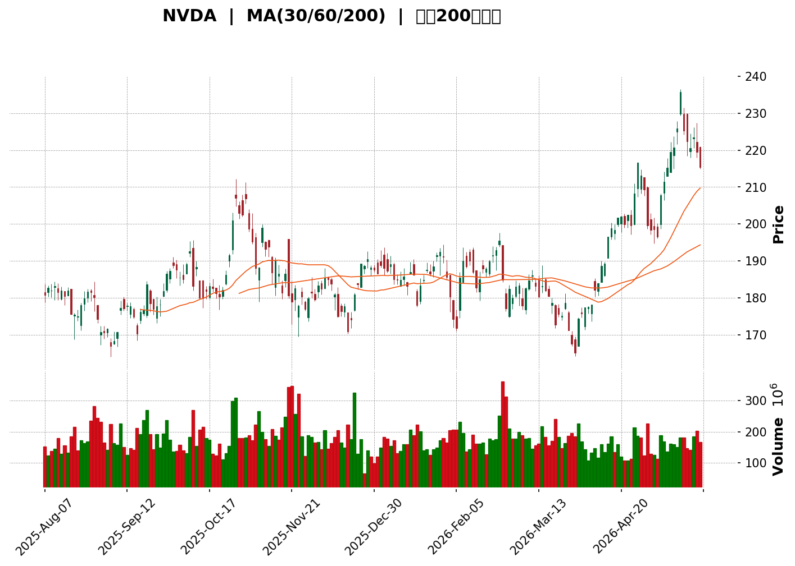
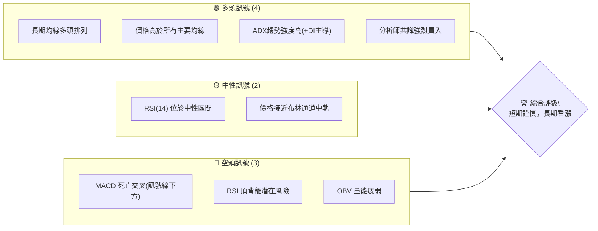
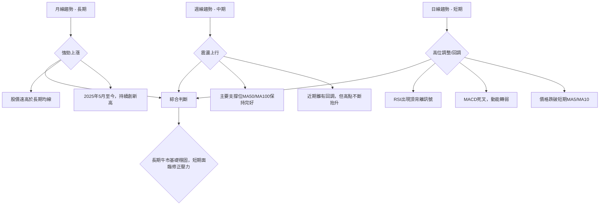
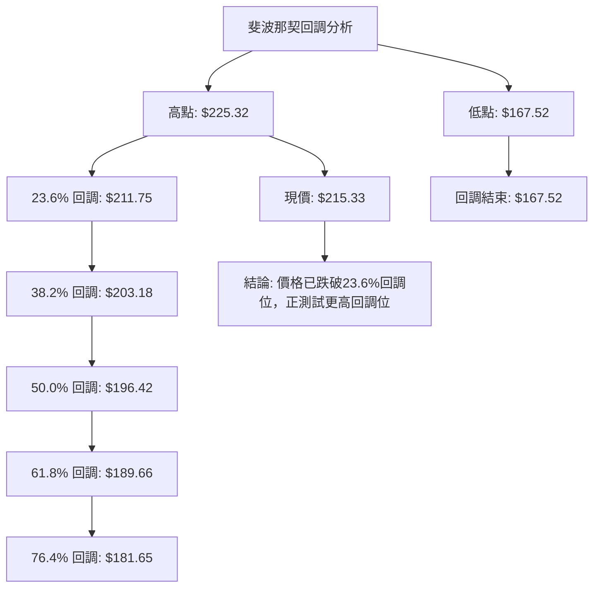

<details>
<summary>📊 靜態圖表 (點擊展開)</summary>

</details>

<html>
<head><meta charset="utf-8" /></head>
<body>
    <div>                        <script>window.PlotlyConfig = {MathJaxConfig: 'local'};</script>
        <script charset="utf-8" src="https://cdn.plot.ly/plotly-3.5.0.min.js" integrity="sha256-fHbNLP+GlIXN+efbQec78UkemUz3NJp7UmfGxC1tNxs=" crossorigin="anonymous"></script>                <div id="candlestick-chart" class="plotly-graph-div" style="height:500px; width:100%;"></div>            <script>                window.PLOTLYENV=window.PLOTLYENV || {};                                if (document.getElementById("candlestick-chart")) {                    Plotly.newPlot(                        "candlestick-chart",                        [{"close":{"dtype":"f8","bdata":"AAAAwK2XZkAAAACgbdVmQAAAAKDzwGZAAAAAYCXkZkAAAAAA6rFmQAAAAACsv2ZAAAAAwHCNZkAAAAAAWr9mQAAAAMCL82VAAAAAAN7rZUAAAADgbd5lQAAAAOC7PmZAAAAAwPZ4ZkAAAABgrLdmQAAAAAA8smZAAAAAYHuEZkAAAABg1cRlQAAAAEANWGVAAAAA4O5SZUAAAAAgNXRlQAAAAKDA32RAAAAAYAYJZUAAAABgaVdlQAAAAACeKWZAAAAAYNEkZkAAAACAnTlmQAAAACBgN2ZAAAAAwIvbZUAAAACArkhlQAAAAKAPB2ZAAAAAoNEUZkAAAAAA4PJmQAAAAAAiTWZAAAAAAGseZkAAAADAdDVmQAAAAEB0RWZAAAAAwI+6ZkAAAACA51FnQAAAAMAFZ2dAAAAAANGbZ0AAAABALnNnQAAAAMCgMGdAAAAAQKEgZ0AAAAAA26JnQAAAAECQEWhAAAAAAHrkZkAAAAAglIlnQAAAAMBTgGZAAAAAoO15ZkAAAAAASLlmQAAAAIBl5mZAAAAAoNbTZkAAAADAe6RmQAAAAKBTiGZAAAAA4HrEZkAAAABAqkdnQAAAAOAB72dAAAAAAEEgaUAAAACAjeBpQAAAAGDEW2lAAAAAAPhOaUAAAADgbttpQAAAAMBh1WhAAAAA4AhmaEAAAABA5oFnQAAAAKAjhGdAAAAAoObgaEAAAAAAcSRoQAAAAGDrOGhAAAAAAN1aZ0AAAACgxcRnQAAAAGCLUmdAAAAAAOKqZkAAAAAA\u002fE9nQAAAAGDYk2ZAAAAAIIhbZkAAAACA9dBmQAAAAICdOWZAAAAAwK+HZkAAAADAYB9mQAAAAODOfGZAAAAAIBWuZkAAAADAP3JmQAAAAMDX62ZAAAAA4M3MZkAAAABgRzFnQAAAAEC4HmdAAAAAQKT4ZkAAAABAcp1mQAAAAEBW4GVAAAAAgPkIZkAAAACAuzZmQAAAAMDIXWVAAAAAoC3EZUAAAADgXZ9mQAAAAADD9WZAAAAAgGSmZ0AAAACAMZNnQAAAAECh0GdAAAAAwLaGZ0AAAACA9HBnQAAAAGCtT2dAAAAAgN+aZ0AAAACgg4NnQAAAACBbZ2dAAAAAQDGjZ0AAAACg9SBnQAAAACAzG2dAAAAAgMIdZ0AAAAAgmTlnQAAAAKAp5GZAAAAAwEZhZ0AAAACACUdnQAAAAIDuQWZAAAAAQOzpZkAAAABAjxpnQAAAAGAddWdAAAAAoLdOZ0AAAABAUJBnQAAAAABP8GdAAAAAgPwPaEAAAABA1ONnQAAAAOAyM2dAAAAAQJGKZkAAAABAx8VlQAAAAMDce2VAAAAAgMwsZ0AAAABg88BnQAAAAAD0kGdAAAAAYEXBZ0AAAACgwV1nQAAAAICa2WZAAAAAQLgeZ0AAAADACH9nQAAAAIB5fGdAAAAAYOm5Z0AAAADARPFnQAAAAMDdGmhAAAAAwJRxaEAAAADgKBxnQAAAAADGJWZAAAAAQAvPZkAAAADASYFmQAAAAID24GZAAAAAAJDqZkAAAACg7jlmQAAAAMB71GZAAAAAAFIYZ0AAAADA9UBnQAAAAOB65GZAAAAAAACIZkAAAABACudmQAAAAIDCvWZAAAAAwMyMZkAAAACA61FmQAAAAGBmlmVAAAAA4Hr0ZUAAAABgZuZlQAAAAIDCVWZAAAAAIK5nZUAAAADgo\u002fBkQAAAAKBwpWRAAAAAwMzMZUAAAAAAAPhlQAAAAOB6LGZAAAAA4Ho0ZkAAAABAM0NmQAAAAGCPwmZAAAAAwB79ZkAAAAAAKZRnQAAAAIDrqWdAAAAA4FGQaEAAAAAA19toQAAAAEAzy2hAAAAAgMI1aUAAAACA60FpQAAAAAAp\u002fGhAAAAAAABQaUAAAADgevRoQAAAAOCjCGpAAAAAIIUTa0AAAACgcKVqQAAAAAAAKGpAAAAAgD3yaEAAAABgZs5oQAAAACBcz2hAAAAAAACQaEAAAABgj\u002fppQAAAAAAAcGpAAAAAYGbmakAAAACAFG5rQAAAAMD1mGtAAAAAYI86bEAAAAAgrndtQAAAAIA9KmxAAAAAgD3Ka0AAAAAghZNrQAAAAEAK72tAAAAA4FFwa0AAAABgj+pqQA=="},"high":{"dtype":"f8","bdata":"Oqv\u002foy77ZkD3Pt4OoOhmQNRgl\u002fPm+WZALXfr82AOZ0BUmmnCD\u002f5mQKwEYaOq32ZAEBy7JtW7ZkC\u002fCMNbG91mQESXE4kHz2ZAZuXrbhD\u002fZUBMOMHi2xtmQJ3h8i7uUWZA9iA9JCe8ZkC6B+OHgstmQD1Hy6m1zmZAPfiSJQ8OZ0BrHGc42kNmQGBAXlI+i2VAWyeSMDSMZUDbslE6m3plQA814sMPIGVAvet4pM9dZUCtBlFTc15lQMCjBpVTaGZA4zpetFOIZkDMuVSMklJmQJWOt2KSWmZAUdPlZGAvZkAqTSGiyqVlQLEyAPqTImZAFCskG+9BZkANAZan8xBnQIZjM4nMzGZA+4ir+FN4ZkCwyYHQr4dmQNEDPjQCeGZA6gwkkVr\u002fZkAgA6SuimpnQBye0LDRg2dA\u002fzm0zu3gZ0DrQhvp2cpnQErb4bqzZmdACrivgkGhZ0C63SaviLJnQJPWPOvpaGhAieTaCidzaEBjS9wj2sJnQNKULFXzGGdAT0R7tzAbZ0BaJ5TtUOhmQEPJbbWNAmdAPfGg0r8lZ0A+P40oo9hmQMJJgYhv7WZAsDKjF1HgZkDGujqJYW5nQCUvj0pT\u002f2dAeO0HGBZkaUCADsi+VYVqQBv7AU9lxGlAYHI2Mk\u002f+aUDCqskcI2pqQIan+L9SfmlAdGyHMbpcaUD99eRLJbNoQLei4DiUiWdAkTAcs2D9aEAELpTXwGxoQKwm777Ke2hAxjUTQWjtZ0AlSqMept9nQLdkQfdVn2dAD3fnZ\u002fMYZ0CMgUAL3HpnQF7Qta5Pf2hA9+FHhEURZ0A24VgFW+9mQGT2rnF+RGZAahzZPXrcZkA6GI1QpmhmQLsJi4j3iGZAUjCzuHc0Z0B\u002fBJdNws1mQLzesR5SEGdAcYie4MwUZ0A+KPqprH9nQL4s4uq3NmdAgR4B3wkvZ0DbErcT7almQEChYGrs2WZAkyZajiFNZkBsM6cIX09mQHebOvPaA2ZAXsW8m34EZkDHbMnrFa5mQMGynQrNBGdApPZhcjuqZ0DDzPL9ypxnQEURwwq\u002fFWhAomKsIv6XZ0B053dbWp9nQDl8iBOX0WdAVVvN8GwdaEDWSdYu0zNoQKJYi3AbBWhANBRlH4LrZ0Dfy1ugRbFnQBPz75eOSmdAOi6OCIRjZ0BhqPe6MYNnQCbBFIpmDmdAXDBtUxK2Z0BC19MBwM1nQBbTfxbYy2ZAIFVE1tYrZ0BdJfQIHkVnQPiH0yTfsmdAubBmM4OjZ0CSLe+3q79nQHsH1gHeCmhAhcHfUQYvaECgeJfiV09oQOu69EtFyWdASqORPlFIZ0B0IBG8P3JmQPbL+Q7vGWZAzcxuC61fZ0ALfCjlyDRoQFCwoMAGD2hAZQ62M\u002fwnaEDn+ANLLzNoQIs9BOysb2dAQXSYyHlkZ0BEQqGQgstnQPru4gNvjWdAoX4jBjvKZ0BLPMNvED5oQDkdlfdNOGhAB4PtVNGzaEBW3b508UhoQDtQj1uQ0mZAgRXPEGfuZkBsxXd\u002ffJxmQMdGp4MUFmdAYMhQ7pkBZ0BWrAzPANhmQHtAe6LN3GZAZuaO4sFNZ0AAAAAA13NnQAAAAIAUHmdAAAAAQOFCZ0AAAAAAKZxnQAAAAMDMLGdAAAAAACnsZkAAAAAgXH9mQAAAAOBRSGZAAAAAANdLZkAAAABACgdmQAAAAEAKp2ZAAAAA4FEQZkAAAABACl9lQAAAAGBmLmVAAAAAANfTZUAAAAAA1ytmQAAAACCuL2ZAAAAAoEc5ZkAAAAAgXEdmQAAAAOBRKGdAAAAAYI8CZ0AAAAAAAMBnQAAAAMAetWdAAAAA4FGQaEAAAADAzAxpQAAAAEAz+2hAAAAAYGY2aUAAAACgcEVpQAAAAAAAWGlAAAAAAABQaUAAAABgj3ppQAAAAGBmXmpAAAAAYI8aa0AAAAAgXNdqQAAAAEAKl2pAAAAAoJlJakAAAAAAAGBpQAAAACBcN2lAAAAAIK4HaUAAAADgowhqQAAAAGBmxmpAAAAAoJk5a0AAAACgmclrQAAAAAAA+GtAAAAAQOF6bEAAAACgR5FtQAAAAAAA8GxAAAAAAADAbEAAAAAgXA9sQAAAAAApRGxAAAAAwMxsbEAAAADgUaBrQA=="},"hovertemplate":"\u003cb\u003e%{x|%Y-%m-%d}\u003c\u002fb\u003e\u003cbr\u003e\u958b: $%{open:.2f}\u003cbr\u003e\u9ad8: $%{high:.2f}\u003cbr\u003e\u4f4e: $%{low:.2f}\u003cbr\u003e\u6536: $%{close:.2f}\u003cextra\u003e\u003c\u002fextra\u003e","low":{"dtype":"f8","bdata":"io+mLqZYZkDnPaoh14tmQIpV3ZYKh2ZAkx6gCcRtZkAKgcgMP2pmQC8OePzDbWZAO47LR1VAZkAzhRFP65FmQJcMRzS\u002f7mVAUlbW27MYZUBcMdLX\u002frhlQJNlzV19ZWVAxA\u002f\u002fKE0RZkATy8YH+FhmQJWYXWc\u002fYmZA46Y\u002fni4MZkC1z\u002fcG4aNlQDipuZgm5mRAzzECPkMbZUDP8+svOCxlQMcliUNegWRAPIyObk\u002fqZEBFdjQZy9ZkQBypIWgb7mVADTDGfr0OZkBHT5Obxw1mQH7XB+q0z2VAkJcYM4zLZUAY6MNQhwxlQMW1KNMcnmVAWHFK1yTlZUAPFwVBG9ZlQL0qNd8ZBmZATW2t6S7sZUD1AIBZjaNlQJ4eii4l3WVAkwQoYJuJZkASZ7bWuK5mQEMP5WAn\u002fGZAOTcXX0KBZ0AvgMNDgitnQA3113zq6WZAAwBij1r\u002fZkDiSt\u002fPn1BnQBmfx5s\u002f4WdAQSqZ3\u002fXAZkBjsGEfET5nQH8OBazEdWZAWALeKKgoZkCY16Q1AnhmQJ5NxV5ed2ZAmA6Bsbi2ZkBoc0LZ93hmQK3KX+qyF2ZAQBDS4aV4ZkBkXd7bWu9mQPaXpwAZjWdApPUwM3L8Z0Df9RyoPZhpQKBqzZRpLGlALLu0wIdBaUCHLgWQMrFpQKpmCW8QvWhAil3jwB1UaEB50lZngUtnQEXxQO59XGZAZuHsWpk4aEBD+k+M7ehnQMlnkSZ942dAsvhM1Y36ZkCnW4\u002f\u002f7JFmQAO\u002fG62XCWdAAiC\u002fKSt0ZkBMRTbS6tlmQPvq7XWRemZARfHi+SadZUBsIxV1vQ5mQMrb9BABMWVALcEX0Q1HZkCK8SkzYQ9mQDrsHVwmtWVALfNAEF5\u002fZkDIWoAO5GJmQMtj6qNofmZAX\u002fpAis6cZkA+m3Xle8xmQC1wQTvs6WZAZ6WJ5fbAZkBDy2KpiBNmQFvlao2J02VACBfyLqjgZUAejuQ\u002ff9xlQHVHeAegSWVAypR3R\u002fF5ZUBkatEPkwpmQHhKM1jiymZA70ATrHvcZkBlV0eFjlJnQOLpPp+sf2dAGjpYRsw8Z0BvWzelb11nQC8vIoFbT2dAmsv7Yv6HZ0DO7YM\u002fekRnQJ1Rqa\u002fqWWdAUY6IwZhRZ0ATnuH2ZvZmQEPVIScf9WZAm\u002fLuuVLgZkB1TYRxe+xmQIVzw2lJmWZAEmOq0TxKZ0A\u002fSwnRPEJnQI6WPlQ2M2ZA+Qs9rn1MZkDXBVnncP1mQK+dhqDqWWdA6J5ytls\u002fZ0CPLTwAFDZnQF3umB6NumdA+5BH\u002fJhBZ0AfK288tq5nQInyzxLXG2dA67++8g0HZkD22tmC0nxlQNd8iOCpYGVAL96hy+XSZUBbTirTFP5mQC9vsI+Dg2dAIghDMVCYZ0CxUM0w\u002f09nQNtBYsqQsmZA9rIZEXNlZkC1GIYK\u002f1dnQPxyEH7MNGdApZI0GMI9Z0A7U3ZfO7JnQPwckKp5bGdACOkAqfE4aEDCM7fA6wlnQJ+o3dvaC2ZANquEeS3UZUBGRXgjIh1mQORqHbKbgWZAyzZwK9o7ZkAkk40R7xlmQNXc6qSd8WVAbUQXOQHAZkAAAABgZg5nQAAAAAAAuGZAAAAAgBR+ZkAAAADAHq1mQAAAAIDCtWZAAAAAYI+KZkAAAACgR\u002fllQAAAAEAKd2VAAAAA4FHYZUAAAAAgXL9lQAAAAEAzG2ZAAAAA4HpkZUAAAADgUeBkQAAAAOCjiGRAAAAAYLjeZEAAAAAAANhlQAAAAADXa2VAAAAA4FH4ZUAAAADAHrVlQAAAAKCZiWZAAAAAANeTZkAAAACgmQlnQAAAACCuN2dAAAAA4KPYZ0AAAAAgrndoQAAAAIDreWhAAAAA4KPoaEAAAABA4bpoQAAAAAAA4GhAAAAAAADgaEAAAABACqdoQAAAAIDr+WhAAAAAACnsaUAAAABgZgZqQAAAAGCP8mlAAAAAYGbWaEAAAAAA16NoQAAAACCuV2hAAAAAwPWAaEAAAAAghdNoQAAAAAAA0GlAAAAA4HqcakAAAADgerxqQAAAAKBw3WpAAAAAgD2ya0AAAACgmalsQAAAACCuB2xAAAAAANdLa0AAAADAHj1rQAAAAAAAkGtAAAAAgMI9a0AAAAAghdtqQA=="},"name":"\u50f9\u683c","open":{"dtype":"f8","bdata":"rf0nSUaxZkCtcNRworBmQJzIe8OhwGZA2V61Rb\u002fdZkCLXvpY3tJmQKcHXzcLd2ZAhkGybTG7ZkA7IZRLPZJmQOXreSHKzGZAu\u002fskMILkZUD\u002fVU8tRdplQBLshTKakmVA1Wq+fEBKZkAPow9U9oBmQORYjltkvmZAd6B9XUeZZkAdSVemkkJmQPkT2I8YP2VAzzbBxgJhZUAx5sNbVVFlQIeAMyARAGVAZaHbiLXwZEC\u002f8hcG+yFlQAfIb3CKE2ZAvvlu\u002fiB1ZkB+mYTrAzhmQJLP7p7S9GVA4Wr+12AfZkAj\u002fgmj35NlQDxPU6i\u002fvmVAi8xarwX4ZUCWzS\u002f5++hlQBTp0pBmvmZAMPP4GgJ4ZkBkcstCv85lQH8Cm2TQRGZAs1vXRiCNZkAegoKM68FmQPEXaowHJ2dAeyOJvIiyZ0DsbIBWaqVnQAJVNSlZL2dAR6cWrrRGZ0Ahw\u002fWolVFnQMZoTy6vBmhAnNK40KMvaEB4b5YwYX5nQL6vFZz9F2dAsxeZZ\u002fMYZ0CPB08\u002fuMZmQP4QynsghWZAPnQwT4TjZkA+P40oo9hmQMDNAvrXo2ZA7YC6UM6MZkAQpInNO\u002fpmQKLhajkDv2dA8NbKDOwgaEA0Lqsnof5pQIvUlTcUpGlAzeAysKzNaUBcxZ4r1AFqQAPwXl9JX2lAeLGoLPHXaEC5MSIAwIxoQE0U34smHGdABLMKq9ViaEDP\u002fHIzb2RoQDFHEEZadmhAkZvnuu3gZ0Dwxbey4NpmQAvRGPFiPmdAqJDfDoTrZkDjc5xOoRhnQDe8ORq2fWhAXqqmIAunZkBoPkvADG9mQAQ9Tl6B3GVA98mPpIWzZkA56QrRsF9mQIfYjsO012VARO\u002foWq63ZkCSIPuI7KFmQIhaoYeGs2ZAd0cEWCn8ZkB+TjnqKdRmQPfGCj2ZMWdA5QznOLgeZ0B7\u002fc3JpYhmQOGqiMw0o2ZAbrHOpMU9ZkCrW57FAwhmQATRoTblAmZA2c61U6jQZUCZHlxKIhVmQH5g4AUf\u002fWZA0m8hJLneZkCUKQwswX1nQL\u002fJQWUcvWdARHDrGWV2Z0Ap+pGwWodnQBU90IPpsWdAHG6bD426Z0CP6wHj\u002fPdnQF0hyWtP0GdAX+dP3emRZ0BkZUZSMaNnQKV6BEc9ImdASXk7A7nmZkAdsO37rR9nQH09+7nrCWdA4DdiXq1PZ0Cv3Ut8O6JnQD8IBA18vGZAd5J8REphZkD6gjgKrhdnQIofTtOsb2dAxPu60ctkZ0CSuloRW2dnQIzRXBxP6GdAXPvUZIzqZ0A4LOuWY+ZnQLOboGsTZmdArsT5gVtHZ0DPqbDJaG5mQG3FnuV03WVAdGhIHsYVZkDoqPsvAAhnQGgIhx3U62dAIG2iDxEOaEC3KdcsoCBoQEgfSQ4Jb2dAugRvba+3ZkBMFZJIrJdnQB4rRp+YYWdA5m660OpRZ0AhEwTxd+xnQKZRWzpZ72dAFIcNHhBOaEDU2wO3TUhoQKgUibOvp2ZAGPmJTwTgZUAvoCrxXk9mQKK8\u002f4bEjWZA5uwvViClZkA\u002fx596kXpmQA9RvPRAGmZAQJrZ7HvMZkAAAADAHj1nQAAAAKCZAWdAAAAAoHAdZ0AAAABACt9mQAAAAIDrIWdAAAAAIFzPZkAAAADgUUBmQAAAAAAAQGZAAAAA4FEoZkAAAABgj9plQAAAAEAzI2ZAAAAAgD0CZkAAAAAAAEBlQAAAAMD1GGVAAAAAQArfZEAAAAAAAABmQAAAAIDChWVAAAAAwB4lZkAAAAAgXPdlQAAAAAAAEGdAAAAAQOG6ZkAAAACA6wlnQAAAAMD1QGdAAAAAQOHaZ0AAAACgR5FoQAAAAIDCrWhAAAAAwMz8aEAAAAAgXP9oQAAAAAApRGlAAAAAIK4faUAAAABguE5pQAAAAGC4\u002fmhAAAAAwMw0akAAAAAgri9qQAAAAGBmlmpAAAAAgMI9akAAAADA9ShpQAAAAAAA8GhAAAAAoJnpaEAAAADgevxoQAAAAEDhCmpAAAAAwPWgakAAAACgR8FqQAAAAKCZUWtAAAAAgMIdbEAAAABAM7tsQAAAAOBRuGxAAAAAANe7bEAAAAAA13NrQAAAAIDC5WtAAAAAoEfJa0AAAACg7ZxrQA=="},"x":["2025-08-07T00:00:00-04:00","2025-08-08T00:00:00-04:00","2025-08-11T00:00:00-04:00","2025-08-12T00:00:00-04:00","2025-08-13T00:00:00-04:00","2025-08-14T00:00:00-04:00","2025-08-15T00:00:00-04:00","2025-08-18T00:00:00-04:00","2025-08-19T00:00:00-04:00","2025-08-20T00:00:00-04:00","2025-08-21T00:00:00-04:00","2025-08-22T00:00:00-04:00","2025-08-25T00:00:00-04:00","2025-08-26T00:00:00-04:00","2025-08-27T00:00:00-04:00","2025-08-28T00:00:00-04:00","2025-08-29T00:00:00-04:00","2025-09-02T00:00:00-04:00","2025-09-03T00:00:00-04:00","2025-09-04T00:00:00-04:00","2025-09-05T00:00:00-04:00","2025-09-08T00:00:00-04:00","2025-09-09T00:00:00-04:00","2025-09-10T00:00:00-04:00","2025-09-11T00:00:00-04:00","2025-09-12T00:00:00-04:00","2025-09-15T00:00:00-04:00","2025-09-16T00:00:00-04:00","2025-09-17T00:00:00-04:00","2025-09-18T00:00:00-04:00","2025-09-19T00:00:00-04:00","2025-09-22T00:00:00-04:00","2025-09-23T00:00:00-04:00","2025-09-24T00:00:00-04:00","2025-09-25T00:00:00-04:00","2025-09-26T00:00:00-04:00","2025-09-29T00:00:00-04:00","2025-09-30T00:00:00-04:00","2025-10-01T00:00:00-04:00","2025-10-02T00:00:00-04:00","2025-10-03T00:00:00-04:00","2025-10-06T00:00:00-04:00","2025-10-07T00:00:00-04:00","2025-10-08T00:00:00-04:00","2025-10-09T00:00:00-04:00","2025-10-10T00:00:00-04:00","2025-10-13T00:00:00-04:00","2025-10-14T00:00:00-04:00","2025-10-15T00:00:00-04:00","2025-10-16T00:00:00-04:00","2025-10-17T00:00:00-04:00","2025-10-20T00:00:00-04:00","2025-10-21T00:00:00-04:00","2025-10-22T00:00:00-04:00","2025-10-23T00:00:00-04:00","2025-10-24T00:00:00-04:00","2025-10-27T00:00:00-04:00","2025-10-28T00:00:00-04:00","2025-10-29T00:00:00-04:00","2025-10-30T00:00:00-04:00","2025-10-31T00:00:00-04:00","2025-11-03T00:00:00-05:00","2025-11-04T00:00:00-05:00","2025-11-05T00:00:00-05:00","2025-11-06T00:00:00-05:00","2025-11-07T00:00:00-05:00","2025-11-10T00:00:00-05:00","2025-11-11T00:00:00-05:00","2025-11-12T00:00:00-05:00","2025-11-13T00:00:00-05:00","2025-11-14T00:00:00-05:00","2025-11-17T00:00:00-05:00","2025-11-18T00:00:00-05:00","2025-11-19T00:00:00-05:00","2025-11-20T00:00:00-05:00","2025-11-21T00:00:00-05:00","2025-11-24T00:00:00-05:00","2025-11-25T00:00:00-05:00","2025-11-26T00:00:00-05:00","2025-11-28T00:00:00-05:00","2025-12-01T00:00:00-05:00","2025-12-02T00:00:00-05:00","2025-12-03T00:00:00-05:00","2025-12-04T00:00:00-05:00","2025-12-05T00:00:00-05:00","2025-12-08T00:00:00-05:00","2025-12-09T00:00:00-05:00","2025-12-10T00:00:00-05:00","2025-12-11T00:00:00-05:00","2025-12-12T00:00:00-05:00","2025-12-15T00:00:00-05:00","2025-12-16T00:00:00-05:00","2025-12-17T00:00:00-05:00","2025-12-18T00:00:00-05:00","2025-12-19T00:00:00-05:00","2025-12-22T00:00:00-05:00","2025-12-23T00:00:00-05:00","2025-12-24T00:00:00-05:00","2025-12-26T00:00:00-05:00","2025-12-29T00:00:00-05:00","2025-12-30T00:00:00-05:00","2025-12-31T00:00:00-05:00","2026-01-02T00:00:00-05:00","2026-01-05T00:00:00-05:00","2026-01-06T00:00:00-05:00","2026-01-07T00:00:00-05:00","2026-01-08T00:00:00-05:00","2026-01-09T00:00:00-05:00","2026-01-12T00:00:00-05:00","2026-01-13T00:00:00-05:00","2026-01-14T00:00:00-05:00","2026-01-15T00:00:00-05:00","2026-01-16T00:00:00-05:00","2026-01-20T00:00:00-05:00","2026-01-21T00:00:00-05:00","2026-01-22T00:00:00-05:00","2026-01-23T00:00:00-05:00","2026-01-26T00:00:00-05:00","2026-01-27T00:00:00-05:00","2026-01-28T00:00:00-05:00","2026-01-29T00:00:00-05:00","2026-01-30T00:00:00-05:00","2026-02-02T00:00:00-05:00","2026-02-03T00:00:00-05:00","2026-02-04T00:00:00-05:00","2026-02-05T00:00:00-05:00","2026-02-06T00:00:00-05:00","2026-02-09T00:00:00-05:00","2026-02-10T00:00:00-05:00","2026-02-11T00:00:00-05:00","2026-02-12T00:00:00-05:00","2026-02-13T00:00:00-05:00","2026-02-17T00:00:00-05:00","2026-02-18T00:00:00-05:00","2026-02-19T00:00:00-05:00","2026-02-20T00:00:00-05:00","2026-02-23T00:00:00-05:00","2026-02-24T00:00:00-05:00","2026-02-25T00:00:00-05:00","2026-02-26T00:00:00-05:00","2026-02-27T00:00:00-05:00","2026-03-02T00:00:00-05:00","2026-03-03T00:00:00-05:00","2026-03-04T00:00:00-05:00","2026-03-05T00:00:00-05:00","2026-03-06T00:00:00-05:00","2026-03-09T00:00:00-04:00","2026-03-10T00:00:00-04:00","2026-03-11T00:00:00-04:00","2026-03-12T00:00:00-04:00","2026-03-13T00:00:00-04:00","2026-03-16T00:00:00-04:00","2026-03-17T00:00:00-04:00","2026-03-18T00:00:00-04:00","2026-03-19T00:00:00-04:00","2026-03-20T00:00:00-04:00","2026-03-23T00:00:00-04:00","2026-03-24T00:00:00-04:00","2026-03-25T00:00:00-04:00","2026-03-26T00:00:00-04:00","2026-03-27T00:00:00-04:00","2026-03-30T00:00:00-04:00","2026-03-31T00:00:00-04:00","2026-04-01T00:00:00-04:00","2026-04-02T00:00:00-04:00","2026-04-06T00:00:00-04:00","2026-04-07T00:00:00-04:00","2026-04-08T00:00:00-04:00","2026-04-09T00:00:00-04:00","2026-04-10T00:00:00-04:00","2026-04-13T00:00:00-04:00","2026-04-14T00:00:00-04:00","2026-04-15T00:00:00-04:00","2026-04-16T00:00:00-04:00","2026-04-17T00:00:00-04:00","2026-04-20T00:00:00-04:00","2026-04-21T00:00:00-04:00","2026-04-22T00:00:00-04:00","2026-04-23T00:00:00-04:00","2026-04-24T00:00:00-04:00","2026-04-27T00:00:00-04:00","2026-04-28T00:00:00-04:00","2026-04-29T00:00:00-04:00","2026-04-30T00:00:00-04:00","2026-05-01T00:00:00-04:00","2026-05-04T00:00:00-04:00","2026-05-05T00:00:00-04:00","2026-05-06T00:00:00-04:00","2026-05-07T00:00:00-04:00","2026-05-08T00:00:00-04:00","2026-05-11T00:00:00-04:00","2026-05-12T00:00:00-04:00","2026-05-13T00:00:00-04:00","2026-05-14T00:00:00-04:00","2026-05-15T00:00:00-04:00","2026-05-18T00:00:00-04:00","2026-05-19T00:00:00-04:00","2026-05-20T00:00:00-04:00","2026-05-21T00:00:00-04:00","2026-05-22T00:00:00-04:00"],"type":"candlestick"},{"hovertemplate":"MA30: $%{y:.2f}\u003cextra\u003e\u003c\u002fextra\u003e","line":{"color":"#2196F3","dash":"dash","width":2},"mode":"lines","name":"MA30","x":["2025-08-07T00:00:00-04:00","2025-08-08T00:00:00-04:00","2025-08-11T00:00:00-04:00","2025-08-12T00:00:00-04:00","2025-08-13T00:00:00-04:00","2025-08-14T00:00:00-04:00","2025-08-15T00:00:00-04:00","2025-08-18T00:00:00-04:00","2025-08-19T00:00:00-04:00","2025-08-20T00:00:00-04:00","2025-08-21T00:00:00-04:00","2025-08-22T00:00:00-04:00","2025-08-25T00:00:00-04:00","2025-08-26T00:00:00-04:00","2025-08-27T00:00:00-04:00","2025-08-28T00:00:00-04:00","2025-08-29T00:00:00-04:00","2025-09-02T00:00:00-04:00","2025-09-03T00:00:00-04:00","2025-09-04T00:00:00-04:00","2025-09-05T00:00:00-04:00","2025-09-08T00:00:00-04:00","2025-09-09T00:00:00-04:00","2025-09-10T00:00:00-04:00","2025-09-11T00:00:00-04:00","2025-09-12T00:00:00-04:00","2025-09-15T00:00:00-04:00","2025-09-16T00:00:00-04:00","2025-09-17T00:00:00-04:00","2025-09-18T00:00:00-04:00","2025-09-19T00:00:00-04:00","2025-09-22T00:00:00-04:00","2025-09-23T00:00:00-04:00","2025-09-24T00:00:00-04:00","2025-09-25T00:00:00-04:00","2025-09-26T00:00:00-04:00","2025-09-29T00:00:00-04:00","2025-09-30T00:00:00-04:00","2025-10-01T00:00:00-04:00","2025-10-02T00:00:00-04:00","2025-10-03T00:00:00-04:00","2025-10-06T00:00:00-04:00","2025-10-07T00:00:00-04:00","2025-10-08T00:00:00-04:00","2025-10-09T00:00:00-04:00","2025-10-10T00:00:00-04:00","2025-10-13T00:00:00-04:00","2025-10-14T00:00:00-04:00","2025-10-15T00:00:00-04:00","2025-10-16T00:00:00-04:00","2025-10-17T00:00:00-04:00","2025-10-20T00:00:00-04:00","2025-10-21T00:00:00-04:00","2025-10-22T00:00:00-04:00","2025-10-23T00:00:00-04:00","2025-10-24T00:00:00-04:00","2025-10-27T00:00:00-04:00","2025-10-28T00:00:00-04:00","2025-10-29T00:00:00-04:00","2025-10-30T00:00:00-04:00","2025-10-31T00:00:00-04:00","2025-11-03T00:00:00-05:00","2025-11-04T00:00:00-05:00","2025-11-05T00:00:00-05:00","2025-11-06T00:00:00-05:00","2025-11-07T00:00:00-05:00","2025-11-10T00:00:00-05:00","2025-11-11T00:00:00-05:00","2025-11-12T00:00:00-05:00","2025-11-13T00:00:00-05:00","2025-11-14T00:00:00-05:00","2025-11-17T00:00:00-05:00","2025-11-18T00:00:00-05:00","2025-11-19T00:00:00-05:00","2025-11-20T00:00:00-05:00","2025-11-21T00:00:00-05:00","2025-11-24T00:00:00-05:00","2025-11-25T00:00:00-05:00","2025-11-26T00:00:00-05:00","2025-11-28T00:00:00-05:00","2025-12-01T00:00:00-05:00","2025-12-02T00:00:00-05:00","2025-12-03T00:00:00-05:00","2025-12-04T00:00:00-05:00","2025-12-05T00:00:00-05:00","2025-12-08T00:00:00-05:00","2025-12-09T00:00:00-05:00","2025-12-10T00:00:00-05:00","2025-12-11T00:00:00-05:00","2025-12-12T00:00:00-05:00","2025-12-15T00:00:00-05:00","2025-12-16T00:00:00-05:00","2025-12-17T00:00:00-05:00","2025-12-18T00:00:00-05:00","2025-12-19T00:00:00-05:00","2025-12-22T00:00:00-05:00","2025-12-23T00:00:00-05:00","2025-12-24T00:00:00-05:00","2025-12-26T00:00:00-05:00","2025-12-29T00:00:00-05:00","2025-12-30T00:00:00-05:00","2025-12-31T00:00:00-05:00","2026-01-02T00:00:00-05:00","2026-01-05T00:00:00-05:00","2026-01-06T00:00:00-05:00","2026-01-07T00:00:00-05:00","2026-01-08T00:00:00-05:00","2026-01-09T00:00:00-05:00","2026-01-12T00:00:00-05:00","2026-01-13T00:00:00-05:00","2026-01-14T00:00:00-05:00","2026-01-15T00:00:00-05:00","2026-01-16T00:00:00-05:00","2026-01-20T00:00:00-05:00","2026-01-21T00:00:00-05:00","2026-01-22T00:00:00-05:00","2026-01-23T00:00:00-05:00","2026-01-26T00:00:00-05:00","2026-01-27T00:00:00-05:00","2026-01-28T00:00:00-05:00","2026-01-29T00:00:00-05:00","2026-01-30T00:00:00-05:00","2026-02-02T00:00:00-05:00","2026-02-03T00:00:00-05:00","2026-02-04T00:00:00-05:00","2026-02-05T00:00:00-05:00","2026-02-06T00:00:00-05:00","2026-02-09T00:00:00-05:00","2026-02-10T00:00:00-05:00","2026-02-11T00:00:00-05:00","2026-02-12T00:00:00-05:00","2026-02-13T00:00:00-05:00","2026-02-17T00:00:00-05:00","2026-02-18T00:00:00-05:00","2026-02-19T00:00:00-05:00","2026-02-20T00:00:00-05:00","2026-02-23T00:00:00-05:00","2026-02-24T00:00:00-05:00","2026-02-25T00:00:00-05:00","2026-02-26T00:00:00-05:00","2026-02-27T00:00:00-05:00","2026-03-02T00:00:00-05:00","2026-03-03T00:00:00-05:00","2026-03-04T00:00:00-05:00","2026-03-05T00:00:00-05:00","2026-03-06T00:00:00-05:00","2026-03-09T00:00:00-04:00","2026-03-10T00:00:00-04:00","2026-03-11T00:00:00-04:00","2026-03-12T00:00:00-04:00","2026-03-13T00:00:00-04:00","2026-03-16T00:00:00-04:00","2026-03-17T00:00:00-04:00","2026-03-18T00:00:00-04:00","2026-03-19T00:00:00-04:00","2026-03-20T00:00:00-04:00","2026-03-23T00:00:00-04:00","2026-03-24T00:00:00-04:00","2026-03-25T00:00:00-04:00","2026-03-26T00:00:00-04:00","2026-03-27T00:00:00-04:00","2026-03-30T00:00:00-04:00","2026-03-31T00:00:00-04:00","2026-04-01T00:00:00-04:00","2026-04-02T00:00:00-04:00","2026-04-06T00:00:00-04:00","2026-04-07T00:00:00-04:00","2026-04-08T00:00:00-04:00","2026-04-09T00:00:00-04:00","2026-04-10T00:00:00-04:00","2026-04-13T00:00:00-04:00","2026-04-14T00:00:00-04:00","2026-04-15T00:00:00-04:00","2026-04-16T00:00:00-04:00","2026-04-17T00:00:00-04:00","2026-04-20T00:00:00-04:00","2026-04-21T00:00:00-04:00","2026-04-22T00:00:00-04:00","2026-04-23T00:00:00-04:00","2026-04-24T00:00:00-04:00","2026-04-27T00:00:00-04:00","2026-04-28T00:00:00-04:00","2026-04-29T00:00:00-04:00","2026-04-30T00:00:00-04:00","2026-05-01T00:00:00-04:00","2026-05-04T00:00:00-04:00","2026-05-05T00:00:00-04:00","2026-05-06T00:00:00-04:00","2026-05-07T00:00:00-04:00","2026-05-08T00:00:00-04:00","2026-05-11T00:00:00-04:00","2026-05-12T00:00:00-04:00","2026-05-13T00:00:00-04:00","2026-05-14T00:00:00-04:00","2026-05-15T00:00:00-04:00","2026-05-18T00:00:00-04:00","2026-05-19T00:00:00-04:00","2026-05-20T00:00:00-04:00","2026-05-21T00:00:00-04:00","2026-05-22T00:00:00-04:00"],"y":{"dtype":"f8","bdata":"AAAAAAAA+H8AAAAAAAD4fwAAAAAAAPh\u002fAAAAAAAA+H8AAAAAAAD4fwAAAAAAAPh\u002fAAAAAAAA+H8AAAAAAAD4fwAAAAAAAPh\u002fAAAAAAAA+H8AAAAAAAD4fwAAAAAAAPh\u002fAAAAAAAA+H8AAAAAAAD4fwAAAAAAAPh\u002fAAAAAAAA+H8AAAAAAAD4fwAAAAAAAPh\u002fAAAAAAAA+H8AAAAAAAD4fwAAAAAAAPh\u002fAAAAAAAA+H8AAAAAAAD4fwAAAAAAAPh\u002fAAAAAAAA+H8AAAAAAAD4fwAAAAAAAPh\u002fAAAAAAAA+H8AAAAAAAD4f5qZmRnZG2ZA3t3dbXwXZkBVVVW1dxhmQDMzM2ObFGZAvLu7GwQOZkARERER3glmQERERCTLBWZAzczMLEwHZkAiIiLCLgxmQBEREbGQGGZAiYiIqPYmZkCamZmJdDRmQDMzM7OEPGZAMzMzcxtCZkBmZmZW8klmQImIiFioVWZAAAAAgNtYZkDNzMzs8mdmQERERCTTcWZA7+7ubqh7ZkBVVVVlfoZmQImIiCjIl2ZA3t3dXROnZkBERESULbJmQERERMRVtWZAd3d3N6i6ZkBERESkqMNmQKuqqipQ0mZAMzMzEzTuZkDNzMwsZhVnQJqZmZnSMWdAmpmZaVxNZ0CamZn5LWZnQDMzM7PJe2dAVVVV5T2PZ0Dv7u6+UppnQBERETHypGdAvLu7a0q3Z0AREREBT75nQAAAACBOxWdAvLu72yPDZ0Crqqoa3MVnQGZmZob9xmdAAAAAwBDDZ0BVVVWVTcBnQBEREUGUs2dAiYiIqAOvZ0DNzMw83KhnQERERNSApmdAvLu7O\u002famZ0DNzMzs1KFnQHd3d+dPnmdAiYiIuA2dZ0De3d0NYZtnQCIiIkKynmdAq6qqSvmeZ0AzMzNDOp5nQAAAAOBIl2dAiYiIyOWEZ0CrqqqKD2lnQLy7u6tYS2dAmpmZyWkvZ0De3d29UhBnQDMzM5O88mZAVVVVVUbcZkARERFBudRmQM3MzEz6z2ZA7+7ufn7FZkC8u7sLp8BmQLy7uxstvWZAzczMTKO+ZkAAAAAQ2LtmQImIiJi\u002fu2ZAMzMzg7\u002fDZkC8u7s7d8VmQAAAACCEzGZAmpmZKXDXZkBVVVXVGtpmQCIiItKf4WZAIiIicqDmZkCamZm5CPBmQO\u002fu7q5682ZA3t3dzXP5ZkCJiIiYiwBnQAAAALDh+mZAq6qqKtr7ZkC8u7tLGPtmQImIiIj5\u002fWZAvLu7C9gAZ0AzMzOD8AhnQO\u002fu7t6JGmdAVVVVxdYrZ0BVVVVlJDpnQBERERHKSWdAzczM\u002fGZQZ0C8u7s7JklnQN7d3X2NPGdARERE5H84Z0CrqqpaBjpnQKuqqvrmN2dAq6qqqto5Z0BmZmbWNjlnQGZmZkZHNWdAVVVV1SMxZ0Crqqqa\u002fTBnQBEREdGxMWdAAAAAsHMyZ0AiIiJCZTlnQCIiIvLqQWdAERERwT5NZ0C8u7uLQ0xnQEREROTqRWdAq6qqCgtBZ0BVVVWVczpnQGZmZqbAP2dAvLu7G8Y\u002fZ0CamZlJSThnQBEREZHuMmdAERERYR4xZ0Crqqo6eS5nQCIiIsKLJWdA7+7uznoYZ0DNzMysDRBnQHd3d4cjDGdARERElDYMZ0BERER04hBnQImIiOjEEWdAmpmZyVsHZ0CamZlJivdmQDMzM6MI7WZAAAAAEPvYZkDv7u7eRsRmQM3MzKx4sWZAd3d3FzWmZkBERERELJlmQM3MzBz5jWZAZmZm9v2AZkC8u7sLqHJmQHd3d\u002fctZ2ZAIiIiosNaZkAzMzOjw15mQCIiItKza2ZAREREpK16ZkCrqqpqw45mQGZmZsYan2ZAZmZmhq2yZkCamZlJi8xmQN7d3e3u3mZAERERIdvxZkARERGRXwBnQLy7u7stG2dAAAAAcPZBZ0CJiIjI6GFnQHd3d\u002fcMf2dAiYiIqH+TZ0BERET0tqhnQM3MzJw2xGdAiYiIyHbaZ0AzMzPzRP1nQAAAAABHIGhAIiIiAitPaEARERGhjIZoQN7d3d3dwWhAAAAAsLn4aEBVVVX1tjhpQLy7uwvXa2lAq6qqqn+baUCrqqq618hpQFVVVfX99GlAERERIfcaakAiIiICcjdqQA=="},"type":"scatter"},{"hovertemplate":"MA60: $%{y:.2f}\u003cextra\u003e\u003c\u002fextra\u003e","line":{"color":"#9C27B0","dash":"dash","width":2},"mode":"lines","name":"MA60","x":["2025-08-07T00:00:00-04:00","2025-08-08T00:00:00-04:00","2025-08-11T00:00:00-04:00","2025-08-12T00:00:00-04:00","2025-08-13T00:00:00-04:00","2025-08-14T00:00:00-04:00","2025-08-15T00:00:00-04:00","2025-08-18T00:00:00-04:00","2025-08-19T00:00:00-04:00","2025-08-20T00:00:00-04:00","2025-08-21T00:00:00-04:00","2025-08-22T00:00:00-04:00","2025-08-25T00:00:00-04:00","2025-08-26T00:00:00-04:00","2025-08-27T00:00:00-04:00","2025-08-28T00:00:00-04:00","2025-08-29T00:00:00-04:00","2025-09-02T00:00:00-04:00","2025-09-03T00:00:00-04:00","2025-09-04T00:00:00-04:00","2025-09-05T00:00:00-04:00","2025-09-08T00:00:00-04:00","2025-09-09T00:00:00-04:00","2025-09-10T00:00:00-04:00","2025-09-11T00:00:00-04:00","2025-09-12T00:00:00-04:00","2025-09-15T00:00:00-04:00","2025-09-16T00:00:00-04:00","2025-09-17T00:00:00-04:00","2025-09-18T00:00:00-04:00","2025-09-19T00:00:00-04:00","2025-09-22T00:00:00-04:00","2025-09-23T00:00:00-04:00","2025-09-24T00:00:00-04:00","2025-09-25T00:00:00-04:00","2025-09-26T00:00:00-04:00","2025-09-29T00:00:00-04:00","2025-09-30T00:00:00-04:00","2025-10-01T00:00:00-04:00","2025-10-02T00:00:00-04:00","2025-10-03T00:00:00-04:00","2025-10-06T00:00:00-04:00","2025-10-07T00:00:00-04:00","2025-10-08T00:00:00-04:00","2025-10-09T00:00:00-04:00","2025-10-10T00:00:00-04:00","2025-10-13T00:00:00-04:00","2025-10-14T00:00:00-04:00","2025-10-15T00:00:00-04:00","2025-10-16T00:00:00-04:00","2025-10-17T00:00:00-04:00","2025-10-20T00:00:00-04:00","2025-10-21T00:00:00-04:00","2025-10-22T00:00:00-04:00","2025-10-23T00:00:00-04:00","2025-10-24T00:00:00-04:00","2025-10-27T00:00:00-04:00","2025-10-28T00:00:00-04:00","2025-10-29T00:00:00-04:00","2025-10-30T00:00:00-04:00","2025-10-31T00:00:00-04:00","2025-11-03T00:00:00-05:00","2025-11-04T00:00:00-05:00","2025-11-05T00:00:00-05:00","2025-11-06T00:00:00-05:00","2025-11-07T00:00:00-05:00","2025-11-10T00:00:00-05:00","2025-11-11T00:00:00-05:00","2025-11-12T00:00:00-05:00","2025-11-13T00:00:00-05:00","2025-11-14T00:00:00-05:00","2025-11-17T00:00:00-05:00","2025-11-18T00:00:00-05:00","2025-11-19T00:00:00-05:00","2025-11-20T00:00:00-05:00","2025-11-21T00:00:00-05:00","2025-11-24T00:00:00-05:00","2025-11-25T00:00:00-05:00","2025-11-26T00:00:00-05:00","2025-11-28T00:00:00-05:00","2025-12-01T00:00:00-05:00","2025-12-02T00:00:00-05:00","2025-12-03T00:00:00-05:00","2025-12-04T00:00:00-05:00","2025-12-05T00:00:00-05:00","2025-12-08T00:00:00-05:00","2025-12-09T00:00:00-05:00","2025-12-10T00:00:00-05:00","2025-12-11T00:00:00-05:00","2025-12-12T00:00:00-05:00","2025-12-15T00:00:00-05:00","2025-12-16T00:00:00-05:00","2025-12-17T00:00:00-05:00","2025-12-18T00:00:00-05:00","2025-12-19T00:00:00-05:00","2025-12-22T00:00:00-05:00","2025-12-23T00:00:00-05:00","2025-12-24T00:00:00-05:00","2025-12-26T00:00:00-05:00","2025-12-29T00:00:00-05:00","2025-12-30T00:00:00-05:00","2025-12-31T00:00:00-05:00","2026-01-02T00:00:00-05:00","2026-01-05T00:00:00-05:00","2026-01-06T00:00:00-05:00","2026-01-07T00:00:00-05:00","2026-01-08T00:00:00-05:00","2026-01-09T00:00:00-05:00","2026-01-12T00:00:00-05:00","2026-01-13T00:00:00-05:00","2026-01-14T00:00:00-05:00","2026-01-15T00:00:00-05:00","2026-01-16T00:00:00-05:00","2026-01-20T00:00:00-05:00","2026-01-21T00:00:00-05:00","2026-01-22T00:00:00-05:00","2026-01-23T00:00:00-05:00","2026-01-26T00:00:00-05:00","2026-01-27T00:00:00-05:00","2026-01-28T00:00:00-05:00","2026-01-29T00:00:00-05:00","2026-01-30T00:00:00-05:00","2026-02-02T00:00:00-05:00","2026-02-03T00:00:00-05:00","2026-02-04T00:00:00-05:00","2026-02-05T00:00:00-05:00","2026-02-06T00:00:00-05:00","2026-02-09T00:00:00-05:00","2026-02-10T00:00:00-05:00","2026-02-11T00:00:00-05:00","2026-02-12T00:00:00-05:00","2026-02-13T00:00:00-05:00","2026-02-17T00:00:00-05:00","2026-02-18T00:00:00-05:00","2026-02-19T00:00:00-05:00","2026-02-20T00:00:00-05:00","2026-02-23T00:00:00-05:00","2026-02-24T00:00:00-05:00","2026-02-25T00:00:00-05:00","2026-02-26T00:00:00-05:00","2026-02-27T00:00:00-05:00","2026-03-02T00:00:00-05:00","2026-03-03T00:00:00-05:00","2026-03-04T00:00:00-05:00","2026-03-05T00:00:00-05:00","2026-03-06T00:00:00-05:00","2026-03-09T00:00:00-04:00","2026-03-10T00:00:00-04:00","2026-03-11T00:00:00-04:00","2026-03-12T00:00:00-04:00","2026-03-13T00:00:00-04:00","2026-03-16T00:00:00-04:00","2026-03-17T00:00:00-04:00","2026-03-18T00:00:00-04:00","2026-03-19T00:00:00-04:00","2026-03-20T00:00:00-04:00","2026-03-23T00:00:00-04:00","2026-03-24T00:00:00-04:00","2026-03-25T00:00:00-04:00","2026-03-26T00:00:00-04:00","2026-03-27T00:00:00-04:00","2026-03-30T00:00:00-04:00","2026-03-31T00:00:00-04:00","2026-04-01T00:00:00-04:00","2026-04-02T00:00:00-04:00","2026-04-06T00:00:00-04:00","2026-04-07T00:00:00-04:00","2026-04-08T00:00:00-04:00","2026-04-09T00:00:00-04:00","2026-04-10T00:00:00-04:00","2026-04-13T00:00:00-04:00","2026-04-14T00:00:00-04:00","2026-04-15T00:00:00-04:00","2026-04-16T00:00:00-04:00","2026-04-17T00:00:00-04:00","2026-04-20T00:00:00-04:00","2026-04-21T00:00:00-04:00","2026-04-22T00:00:00-04:00","2026-04-23T00:00:00-04:00","2026-04-24T00:00:00-04:00","2026-04-27T00:00:00-04:00","2026-04-28T00:00:00-04:00","2026-04-29T00:00:00-04:00","2026-04-30T00:00:00-04:00","2026-05-01T00:00:00-04:00","2026-05-04T00:00:00-04:00","2026-05-05T00:00:00-04:00","2026-05-06T00:00:00-04:00","2026-05-07T00:00:00-04:00","2026-05-08T00:00:00-04:00","2026-05-11T00:00:00-04:00","2026-05-12T00:00:00-04:00","2026-05-13T00:00:00-04:00","2026-05-14T00:00:00-04:00","2026-05-15T00:00:00-04:00","2026-05-18T00:00:00-04:00","2026-05-19T00:00:00-04:00","2026-05-20T00:00:00-04:00","2026-05-21T00:00:00-04:00","2026-05-22T00:00:00-04:00"],"y":{"dtype":"f8","bdata":"AAAAAAAA+H8AAAAAAAD4fwAAAAAAAPh\u002fAAAAAAAA+H8AAAAAAAD4fwAAAAAAAPh\u002fAAAAAAAA+H8AAAAAAAD4fwAAAAAAAPh\u002fAAAAAAAA+H8AAAAAAAD4fwAAAAAAAPh\u002fAAAAAAAA+H8AAAAAAAD4fwAAAAAAAPh\u002fAAAAAAAA+H8AAAAAAAD4fwAAAAAAAPh\u002fAAAAAAAA+H8AAAAAAAD4fwAAAAAAAPh\u002fAAAAAAAA+H8AAAAAAAD4fwAAAAAAAPh\u002fAAAAAAAA+H8AAAAAAAD4fwAAAAAAAPh\u002fAAAAAAAA+H8AAAAAAAD4fwAAAAAAAPh\u002fAAAAAAAA+H8AAAAAAAD4fwAAAAAAAPh\u002fAAAAAAAA+H8AAAAAAAD4fwAAAAAAAPh\u002fAAAAAAAA+H8AAAAAAAD4fwAAAAAAAPh\u002fAAAAAAAA+H8AAAAAAAD4fwAAAAAAAPh\u002fAAAAAAAA+H8AAAAAAAD4fwAAAAAAAPh\u002fAAAAAAAA+H8AAAAAAAD4fwAAAAAAAPh\u002fAAAAAAAA+H8AAAAAAAD4fwAAAAAAAPh\u002fAAAAAAAA+H8AAAAAAAD4fwAAAAAAAPh\u002fAAAAAAAA+H8AAAAAAAD4fwAAAAAAAPh\u002fAAAAAAAA+H8AAAAAAAD4f5qZmdnVpmZAvLu7a2yyZkB3d3fXUr9mQDMzM4syyGZAiYiIAKHOZkAAAABoGNJmQKuqqqpe1WZARERETEvfZkCamZnhPuVmQImIiGjv7mZAIiIiQg31ZkAiIiJSKP1mQM3MzBzBAWdAmpmZGZYCZ0De3d31HwVnQM3MzEyeBGdARERElO8DZ0DNzMyUZwhnQERERPwpDGdAVVVVVU8RZ0ARERGpKRRnQAAAAAgMG2dAMzMzixAiZ0ARERFRxyZnQDMzMwMEKmdAERERwdAsZ0C8u7tz8TBnQFVVVYXMNGdA3t3d7Yw5Z0C8u7vbOj9nQKuqqqKVPmdAmpmZGWM+Z0C8u7tbQDtnQDMzMyNDN2dAVVVVHcI1Z0AAAAAAhjdnQO\u002fu7j52OmdAVVVVdWQ+Z0BmZmYGez9nQN7d3Z09QWdARERElONAZ0BVVVUV2kBnQHd3d49eQWdAmpmZIWhDZ0CJiIho4kJnQImIiDAMQGdAERER6TlDZ0ARERGJe0FnQDMzM1MQRGdA7+7uVstGZ0AzMzPT7khnQDMzM0vlSGdAMzMzw0BLZ0AzMzNT9k1nQBEREfnJTGdAq6qqumlNZ0B3d3dHqUxnQERERDShSmdAIiIi6t5CZ0Dv7u4GADlnQFVVVUXxMmdAd3d3R6AtZ0CamZmROyVnQCIiIlJDHmdAERERqVYWZ0BmZma+7w5nQFVVVeVDBmdAmpmZMf\u002f+ZkAzMzOzVv1mQDMzMwuK+mZAvLu7+z78ZkAzMzNzh\u002fpmQHd3d2+D+GZARERErHH6ZkAzMzNrOvtmQImIiPga\u002f2ZAzczM7PEEZ0C8u7sLwAlnQCIiImLFEWdAmpmZme8ZZ0CrqqoiJh5nQJqZmcmyHGdAREREbD8dZ0Dv7u6Wfx1nQDMzMytRHWdAMzMzI9AdZ0CrqqrKsBlnQM3MzAx0GGdAZmZmNvsYZ0Dv7u7etBtnQImIiNAKIGdAIiIiyigiZ0AREREJGSVnQERERMz2KmdAiYiIyE4uZ0AAAABYBC1nQDMzMzMpJ2dA7+7u1u0fZ0AiIiJSyBhnQO\u002fu7s53EmdAVVVV3WoJZ0Crqqravv5mQJqZmflf82ZAZmZmdqzrZkB3d3fvFOVmQO\u002fu7nbV32ZAMzMz07jZZkDv7u6mBtZmQM3MzHSM1GZAmpmZMQHUZkB3d3eXg9VmQDMzM1vP2GZAd3d3V9zdZkAAAACAm+RmQGZmZrZt72ZAERER0Tn5ZkCamZlJagJnQHd3d7\u002fuCGdAERERwXwRZ0De3d1lbBdnQO\u002fu7r5cIGdAd3d3nzgtZ0Crqqo6+zhnQHd3dz+YRWdAZmZmHttPZ0BERES0zFxnQKuqqsL9amdAERERSelwZ0BmZmaeZ3pnQJqZmdGnhmdAERERCROUZ0AAAADAaaVnQFVVVUWruWdAvLu7Y3fPZ0DNzMyc8ehnQERERBTo\u002fGdAiYiI0D4OaEAzMzPjvx1oQGZmZvYVLmhAmpmZYd06aECrqqrSGktoQA=="},"type":"scatter"},{"hovertemplate":"MA200: $%{y:.2f}\u003cextra\u003e\u003c\u002fextra\u003e","line":{"color":"#FF6F00","dash":"solid","width":2},"mode":"lines","name":"MA200","x":["2025-08-07T00:00:00-04:00","2025-08-08T00:00:00-04:00","2025-08-11T00:00:00-04:00","2025-08-12T00:00:00-04:00","2025-08-13T00:00:00-04:00","2025-08-14T00:00:00-04:00","2025-08-15T00:00:00-04:00","2025-08-18T00:00:00-04:00","2025-08-19T00:00:00-04:00","2025-08-20T00:00:00-04:00","2025-08-21T00:00:00-04:00","2025-08-22T00:00:00-04:00","2025-08-25T00:00:00-04:00","2025-08-26T00:00:00-04:00","2025-08-27T00:00:00-04:00","2025-08-28T00:00:00-04:00","2025-08-29T00:00:00-04:00","2025-09-02T00:00:00-04:00","2025-09-03T00:00:00-04:00","2025-09-04T00:00:00-04:00","2025-09-05T00:00:00-04:00","2025-09-08T00:00:00-04:00","2025-09-09T00:00:00-04:00","2025-09-10T00:00:00-04:00","2025-09-11T00:00:00-04:00","2025-09-12T00:00:00-04:00","2025-09-15T00:00:00-04:00","2025-09-16T00:00:00-04:00","2025-09-17T00:00:00-04:00","2025-09-18T00:00:00-04:00","2025-09-19T00:00:00-04:00","2025-09-22T00:00:00-04:00","2025-09-23T00:00:00-04:00","2025-09-24T00:00:00-04:00","2025-09-25T00:00:00-04:00","2025-09-26T00:00:00-04:00","2025-09-29T00:00:00-04:00","2025-09-30T00:00:00-04:00","2025-10-01T00:00:00-04:00","2025-10-02T00:00:00-04:00","2025-10-03T00:00:00-04:00","2025-10-06T00:00:00-04:00","2025-10-07T00:00:00-04:00","2025-10-08T00:00:00-04:00","2025-10-09T00:00:00-04:00","2025-10-10T00:00:00-04:00","2025-10-13T00:00:00-04:00","2025-10-14T00:00:00-04:00","2025-10-15T00:00:00-04:00","2025-10-16T00:00:00-04:00","2025-10-17T00:00:00-04:00","2025-10-20T00:00:00-04:00","2025-10-21T00:00:00-04:00","2025-10-22T00:00:00-04:00","2025-10-23T00:00:00-04:00","2025-10-24T00:00:00-04:00","2025-10-27T00:00:00-04:00","2025-10-28T00:00:00-04:00","2025-10-29T00:00:00-04:00","2025-10-30T00:00:00-04:00","2025-10-31T00:00:00-04:00","2025-11-03T00:00:00-05:00","2025-11-04T00:00:00-05:00","2025-11-05T00:00:00-05:00","2025-11-06T00:00:00-05:00","2025-11-07T00:00:00-05:00","2025-11-10T00:00:00-05:00","2025-11-11T00:00:00-05:00","2025-11-12T00:00:00-05:00","2025-11-13T00:00:00-05:00","2025-11-14T00:00:00-05:00","2025-11-17T00:00:00-05:00","2025-11-18T00:00:00-05:00","2025-11-19T00:00:00-05:00","2025-11-20T00:00:00-05:00","2025-11-21T00:00:00-05:00","2025-11-24T00:00:00-05:00","2025-11-25T00:00:00-05:00","2025-11-26T00:00:00-05:00","2025-11-28T00:00:00-05:00","2025-12-01T00:00:00-05:00","2025-12-02T00:00:00-05:00","2025-12-03T00:00:00-05:00","2025-12-04T00:00:00-05:00","2025-12-05T00:00:00-05:00","2025-12-08T00:00:00-05:00","2025-12-09T00:00:00-05:00","2025-12-10T00:00:00-05:00","2025-12-11T00:00:00-05:00","2025-12-12T00:00:00-05:00","2025-12-15T00:00:00-05:00","2025-12-16T00:00:00-05:00","2025-12-17T00:00:00-05:00","2025-12-18T00:00:00-05:00","2025-12-19T00:00:00-05:00","2025-12-22T00:00:00-05:00","2025-12-23T00:00:00-05:00","2025-12-24T00:00:00-05:00","2025-12-26T00:00:00-05:00","2025-12-29T00:00:00-05:00","2025-12-30T00:00:00-05:00","2025-12-31T00:00:00-05:00","2026-01-02T00:00:00-05:00","2026-01-05T00:00:00-05:00","2026-01-06T00:00:00-05:00","2026-01-07T00:00:00-05:00","2026-01-08T00:00:00-05:00","2026-01-09T00:00:00-05:00","2026-01-12T00:00:00-05:00","2026-01-13T00:00:00-05:00","2026-01-14T00:00:00-05:00","2026-01-15T00:00:00-05:00","2026-01-16T00:00:00-05:00","2026-01-20T00:00:00-05:00","2026-01-21T00:00:00-05:00","2026-01-22T00:00:00-05:00","2026-01-23T00:00:00-05:00","2026-01-26T00:00:00-05:00","2026-01-27T00:00:00-05:00","2026-01-28T00:00:00-05:00","2026-01-29T00:00:00-05:00","2026-01-30T00:00:00-05:00","2026-02-02T00:00:00-05:00","2026-02-03T00:00:00-05:00","2026-02-04T00:00:00-05:00","2026-02-05T00:00:00-05:00","2026-02-06T00:00:00-05:00","2026-02-09T00:00:00-05:00","2026-02-10T00:00:00-05:00","2026-02-11T00:00:00-05:00","2026-02-12T00:00:00-05:00","2026-02-13T00:00:00-05:00","2026-02-17T00:00:00-05:00","2026-02-18T00:00:00-05:00","2026-02-19T00:00:00-05:00","2026-02-20T00:00:00-05:00","2026-02-23T00:00:00-05:00","2026-02-24T00:00:00-05:00","2026-02-25T00:00:00-05:00","2026-02-26T00:00:00-05:00","2026-02-27T00:00:00-05:00","2026-03-02T00:00:00-05:00","2026-03-03T00:00:00-05:00","2026-03-04T00:00:00-05:00","2026-03-05T00:00:00-05:00","2026-03-06T00:00:00-05:00","2026-03-09T00:00:00-04:00","2026-03-10T00:00:00-04:00","2026-03-11T00:00:00-04:00","2026-03-12T00:00:00-04:00","2026-03-13T00:00:00-04:00","2026-03-16T00:00:00-04:00","2026-03-17T00:00:00-04:00","2026-03-18T00:00:00-04:00","2026-03-19T00:00:00-04:00","2026-03-20T00:00:00-04:00","2026-03-23T00:00:00-04:00","2026-03-24T00:00:00-04:00","2026-03-25T00:00:00-04:00","2026-03-26T00:00:00-04:00","2026-03-27T00:00:00-04:00","2026-03-30T00:00:00-04:00","2026-03-31T00:00:00-04:00","2026-04-01T00:00:00-04:00","2026-04-02T00:00:00-04:00","2026-04-06T00:00:00-04:00","2026-04-07T00:00:00-04:00","2026-04-08T00:00:00-04:00","2026-04-09T00:00:00-04:00","2026-04-10T00:00:00-04:00","2026-04-13T00:00:00-04:00","2026-04-14T00:00:00-04:00","2026-04-15T00:00:00-04:00","2026-04-16T00:00:00-04:00","2026-04-17T00:00:00-04:00","2026-04-20T00:00:00-04:00","2026-04-21T00:00:00-04:00","2026-04-22T00:00:00-04:00","2026-04-23T00:00:00-04:00","2026-04-24T00:00:00-04:00","2026-04-27T00:00:00-04:00","2026-04-28T00:00:00-04:00","2026-04-29T00:00:00-04:00","2026-04-30T00:00:00-04:00","2026-05-01T00:00:00-04:00","2026-05-04T00:00:00-04:00","2026-05-05T00:00:00-04:00","2026-05-06T00:00:00-04:00","2026-05-07T00:00:00-04:00","2026-05-08T00:00:00-04:00","2026-05-11T00:00:00-04:00","2026-05-12T00:00:00-04:00","2026-05-13T00:00:00-04:00","2026-05-14T00:00:00-04:00","2026-05-15T00:00:00-04:00","2026-05-18T00:00:00-04:00","2026-05-19T00:00:00-04:00","2026-05-20T00:00:00-04:00","2026-05-21T00:00:00-04:00","2026-05-22T00:00:00-04:00"],"y":{"dtype":"f8","bdata":"AAAAAAAA+H8AAAAAAAD4fwAAAAAAAPh\u002fAAAAAAAA+H8AAAAAAAD4fwAAAAAAAPh\u002fAAAAAAAA+H8AAAAAAAD4fwAAAAAAAPh\u002fAAAAAAAA+H8AAAAAAAD4fwAAAAAAAPh\u002fAAAAAAAA+H8AAAAAAAD4fwAAAAAAAPh\u002fAAAAAAAA+H8AAAAAAAD4fwAAAAAAAPh\u002fAAAAAAAA+H8AAAAAAAD4fwAAAAAAAPh\u002fAAAAAAAA+H8AAAAAAAD4fwAAAAAAAPh\u002fAAAAAAAA+H8AAAAAAAD4fwAAAAAAAPh\u002fAAAAAAAA+H8AAAAAAAD4fwAAAAAAAPh\u002fAAAAAAAA+H8AAAAAAAD4fwAAAAAAAPh\u002fAAAAAAAA+H8AAAAAAAD4fwAAAAAAAPh\u002fAAAAAAAA+H8AAAAAAAD4fwAAAAAAAPh\u002fAAAAAAAA+H8AAAAAAAD4fwAAAAAAAPh\u002fAAAAAAAA+H8AAAAAAAD4fwAAAAAAAPh\u002fAAAAAAAA+H8AAAAAAAD4fwAAAAAAAPh\u002fAAAAAAAA+H8AAAAAAAD4fwAAAAAAAPh\u002fAAAAAAAA+H8AAAAAAAD4fwAAAAAAAPh\u002fAAAAAAAA+H8AAAAAAAD4fwAAAAAAAPh\u002fAAAAAAAA+H8AAAAAAAD4fwAAAAAAAPh\u002fAAAAAAAA+H8AAAAAAAD4fwAAAAAAAPh\u002fAAAAAAAA+H8AAAAAAAD4fwAAAAAAAPh\u002fAAAAAAAA+H8AAAAAAAD4fwAAAAAAAPh\u002fAAAAAAAA+H8AAAAAAAD4fwAAAAAAAPh\u002fAAAAAAAA+H8AAAAAAAD4fwAAAAAAAPh\u002fAAAAAAAA+H8AAAAAAAD4fwAAAAAAAPh\u002fAAAAAAAA+H8AAAAAAAD4fwAAAAAAAPh\u002fAAAAAAAA+H8AAAAAAAD4fwAAAAAAAPh\u002fAAAAAAAA+H8AAAAAAAD4fwAAAAAAAPh\u002fAAAAAAAA+H8AAAAAAAD4fwAAAAAAAPh\u002fAAAAAAAA+H8AAAAAAAD4fwAAAAAAAPh\u002fAAAAAAAA+H8AAAAAAAD4fwAAAAAAAPh\u002fAAAAAAAA+H8AAAAAAAD4fwAAAAAAAPh\u002fAAAAAAAA+H8AAAAAAAD4fwAAAAAAAPh\u002fAAAAAAAA+H8AAAAAAAD4fwAAAAAAAPh\u002fAAAAAAAA+H8AAAAAAAD4fwAAAAAAAPh\u002fAAAAAAAA+H8AAAAAAAD4fwAAAAAAAPh\u002fAAAAAAAA+H8AAAAAAAD4fwAAAAAAAPh\u002fAAAAAAAA+H8AAAAAAAD4fwAAAAAAAPh\u002fAAAAAAAA+H8AAAAAAAD4fwAAAAAAAPh\u002fAAAAAAAA+H8AAAAAAAD4fwAAAAAAAPh\u002fAAAAAAAA+H8AAAAAAAD4fwAAAAAAAPh\u002fAAAAAAAA+H8AAAAAAAD4fwAAAAAAAPh\u002fAAAAAAAA+H8AAAAAAAD4fwAAAAAAAPh\u002fAAAAAAAA+H8AAAAAAAD4fwAAAAAAAPh\u002fAAAAAAAA+H8AAAAAAAD4fwAAAAAAAPh\u002fAAAAAAAA+H8AAAAAAAD4fwAAAAAAAPh\u002fAAAAAAAA+H8AAAAAAAD4fwAAAAAAAPh\u002fAAAAAAAA+H8AAAAAAAD4fwAAAAAAAPh\u002fAAAAAAAA+H8AAAAAAAD4fwAAAAAAAPh\u002fAAAAAAAA+H8AAAAAAAD4fwAAAAAAAPh\u002fAAAAAAAA+H8AAAAAAAD4fwAAAAAAAPh\u002fAAAAAAAA+H8AAAAAAAD4fwAAAAAAAPh\u002fAAAAAAAA+H8AAAAAAAD4fwAAAAAAAPh\u002fAAAAAAAA+H8AAAAAAAD4fwAAAAAAAPh\u002fAAAAAAAA+H8AAAAAAAD4fwAAAAAAAPh\u002fAAAAAAAA+H8AAAAAAAD4fwAAAAAAAPh\u002fAAAAAAAA+H8AAAAAAAD4fwAAAAAAAPh\u002fAAAAAAAA+H8AAAAAAAD4fwAAAAAAAPh\u002fAAAAAAAA+H8AAAAAAAD4fwAAAAAAAPh\u002fAAAAAAAA+H8AAAAAAAD4fwAAAAAAAPh\u002fAAAAAAAA+H8AAAAAAAD4fwAAAAAAAPh\u002fAAAAAAAA+H8AAAAAAAD4fwAAAAAAAPh\u002fAAAAAAAA+H8AAAAAAAD4fwAAAAAAAPh\u002fAAAAAAAA+H8AAAAAAAD4fwAAAAAAAPh\u002fAAAAAAAA+H8AAAAAAAD4fwAAAAAAAPh\u002fAAAAAAAA+H8K16OsoGBnQA=="},"type":"scatter"}],                        {"template":{"data":{"barpolar":[{"marker":{"line":{"color":"rgb(17,17,17)","width":0.5},"pattern":{"fillmode":"overlay","size":10,"solidity":0.2}},"type":"barpolar"}],"bar":[{"error_x":{"color":"#f2f5fa"},"error_y":{"color":"#f2f5fa"},"marker":{"line":{"color":"rgb(17,17,17)","width":0.5},"pattern":{"fillmode":"overlay","size":10,"solidity":0.2}},"type":"bar"}],"carpet":[{"aaxis":{"endlinecolor":"#A2B1C6","gridcolor":"#506784","linecolor":"#506784","minorgridcolor":"#506784","startlinecolor":"#A2B1C6"},"baxis":{"endlinecolor":"#A2B1C6","gridcolor":"#506784","linecolor":"#506784","minorgridcolor":"#506784","startlinecolor":"#A2B1C6"},"type":"carpet"}],"choropleth":[{"colorbar":{"outlinewidth":0,"ticks":""},"type":"choropleth"}],"contourcarpet":[{"colorbar":{"outlinewidth":0,"ticks":""},"type":"contourcarpet"}],"contour":[{"colorbar":{"outlinewidth":0,"ticks":""},"colorscale":[[0.0,"#0d0887"],[0.1111111111111111,"#46039f"],[0.2222222222222222,"#7201a8"],[0.3333333333333333,"#9c179e"],[0.4444444444444444,"#bd3786"],[0.5555555555555556,"#d8576b"],[0.6666666666666666,"#ed7953"],[0.7777777777777778,"#fb9f3a"],[0.8888888888888888,"#fdca26"],[1.0,"#f0f921"]],"type":"contour"}],"heatmap":[{"colorbar":{"outlinewidth":0,"ticks":""},"colorscale":[[0.0,"#0d0887"],[0.1111111111111111,"#46039f"],[0.2222222222222222,"#7201a8"],[0.3333333333333333,"#9c179e"],[0.4444444444444444,"#bd3786"],[0.5555555555555556,"#d8576b"],[0.6666666666666666,"#ed7953"],[0.7777777777777778,"#fb9f3a"],[0.8888888888888888,"#fdca26"],[1.0,"#f0f921"]],"type":"heatmap"}],"histogram2dcontour":[{"colorbar":{"outlinewidth":0,"ticks":""},"colorscale":[[0.0,"#0d0887"],[0.1111111111111111,"#46039f"],[0.2222222222222222,"#7201a8"],[0.3333333333333333,"#9c179e"],[0.4444444444444444,"#bd3786"],[0.5555555555555556,"#d8576b"],[0.6666666666666666,"#ed7953"],[0.7777777777777778,"#fb9f3a"],[0.8888888888888888,"#fdca26"],[1.0,"#f0f921"]],"type":"histogram2dcontour"}],"histogram2d":[{"colorbar":{"outlinewidth":0,"ticks":""},"colorscale":[[0.0,"#0d0887"],[0.1111111111111111,"#46039f"],[0.2222222222222222,"#7201a8"],[0.3333333333333333,"#9c179e"],[0.4444444444444444,"#bd3786"],[0.5555555555555556,"#d8576b"],[0.6666666666666666,"#ed7953"],[0.7777777777777778,"#fb9f3a"],[0.8888888888888888,"#fdca26"],[1.0,"#f0f921"]],"type":"histogram2d"}],"histogram":[{"marker":{"pattern":{"fillmode":"overlay","size":10,"solidity":0.2}},"type":"histogram"}],"mesh3d":[{"colorbar":{"outlinewidth":0,"ticks":""},"type":"mesh3d"}],"parcoords":[{"line":{"colorbar":{"outlinewidth":0,"ticks":""}},"type":"parcoords"}],"pie":[{"automargin":true,"type":"pie"}],"scatter3d":[{"line":{"colorbar":{"outlinewidth":0,"ticks":""}},"marker":{"colorbar":{"outlinewidth":0,"ticks":""}},"type":"scatter3d"}],"scattercarpet":[{"marker":{"colorbar":{"outlinewidth":0,"ticks":""}},"type":"scattercarpet"}],"scattergeo":[{"marker":{"colorbar":{"outlinewidth":0,"ticks":""}},"type":"scattergeo"}],"scattergl":[{"marker":{"line":{"color":"#283442"}},"type":"scattergl"}],"scattermapbox":[{"marker":{"colorbar":{"outlinewidth":0,"ticks":""}},"type":"scattermapbox"}],"scattermap":[{"marker":{"colorbar":{"outlinewidth":0,"ticks":""}},"type":"scattermap"}],"scatterpolargl":[{"marker":{"colorbar":{"outlinewidth":0,"ticks":""}},"type":"scatterpolargl"}],"scatterpolar":[{"marker":{"colorbar":{"outlinewidth":0,"ticks":""}},"type":"scatterpolar"}],"scatter":[{"marker":{"line":{"color":"#283442"}},"type":"scatter"}],"scatterternary":[{"marker":{"colorbar":{"outlinewidth":0,"ticks":""}},"type":"scatterternary"}],"surface":[{"colorbar":{"outlinewidth":0,"ticks":""},"colorscale":[[0.0,"#0d0887"],[0.1111111111111111,"#46039f"],[0.2222222222222222,"#7201a8"],[0.3333333333333333,"#9c179e"],[0.4444444444444444,"#bd3786"],[0.5555555555555556,"#d8576b"],[0.6666666666666666,"#ed7953"],[0.7777777777777778,"#fb9f3a"],[0.8888888888888888,"#fdca26"],[1.0,"#f0f921"]],"type":"surface"}],"table":[{"cells":{"fill":{"color":"#506784"},"line":{"color":"rgb(17,17,17)"}},"header":{"fill":{"color":"#2a3f5f"},"line":{"color":"rgb(17,17,17)"}},"type":"table"}]},"layout":{"annotationdefaults":{"arrowcolor":"#f2f5fa","arrowhead":0,"arrowwidth":1},"autotypenumbers":"strict","coloraxis":{"colorbar":{"outlinewidth":0,"ticks":""}},"colorscale":{"diverging":[[0,"#8e0152"],[0.1,"#c51b7d"],[0.2,"#de77ae"],[0.3,"#f1b6da"],[0.4,"#fde0ef"],[0.5,"#f7f7f7"],[0.6,"#e6f5d0"],[0.7,"#b8e186"],[0.8,"#7fbc41"],[0.9,"#4d9221"],[1,"#276419"]],"sequential":[[0.0,"#0d0887"],[0.1111111111111111,"#46039f"],[0.2222222222222222,"#7201a8"],[0.3333333333333333,"#9c179e"],[0.4444444444444444,"#bd3786"],[0.5555555555555556,"#d8576b"],[0.6666666666666666,"#ed7953"],[0.7777777777777778,"#fb9f3a"],[0.8888888888888888,"#fdca26"],[1.0,"#f0f921"]],"sequentialminus":[[0.0,"#0d0887"],[0.1111111111111111,"#46039f"],[0.2222222222222222,"#7201a8"],[0.3333333333333333,"#9c179e"],[0.4444444444444444,"#bd3786"],[0.5555555555555556,"#d8576b"],[0.6666666666666666,"#ed7953"],[0.7777777777777778,"#fb9f3a"],[0.8888888888888888,"#fdca26"],[1.0,"#f0f921"]]},"colorway":["#636efa","#EF553B","#00cc96","#ab63fa","#FFA15A","#19d3f3","#FF6692","#B6E880","#FF97FF","#FECB52"],"font":{"color":"#f2f5fa"},"geo":{"bgcolor":"rgb(17,17,17)","lakecolor":"rgb(17,17,17)","landcolor":"rgb(17,17,17)","showlakes":true,"showland":true,"subunitcolor":"#506784"},"hoverlabel":{"align":"left"},"hovermode":"closest","mapbox":{"style":"dark"},"paper_bgcolor":"rgb(17,17,17)","plot_bgcolor":"rgb(17,17,17)","polar":{"angularaxis":{"gridcolor":"#506784","linecolor":"#506784","ticks":""},"bgcolor":"rgb(17,17,17)","radialaxis":{"gridcolor":"#506784","linecolor":"#506784","ticks":""}},"scene":{"xaxis":{"backgroundcolor":"rgb(17,17,17)","gridcolor":"#506784","gridwidth":2,"linecolor":"#506784","showbackground":true,"ticks":"","zerolinecolor":"#C8D4E3"},"yaxis":{"backgroundcolor":"rgb(17,17,17)","gridcolor":"#506784","gridwidth":2,"linecolor":"#506784","showbackground":true,"ticks":"","zerolinecolor":"#C8D4E3"},"zaxis":{"backgroundcolor":"rgb(17,17,17)","gridcolor":"#506784","gridwidth":2,"linecolor":"#506784","showbackground":true,"ticks":"","zerolinecolor":"#C8D4E3"}},"shapedefaults":{"line":{"color":"#f2f5fa"}},"sliderdefaults":{"bgcolor":"#C8D4E3","bordercolor":"rgb(17,17,17)","borderwidth":1,"tickwidth":0},"ternary":{"aaxis":{"gridcolor":"#506784","linecolor":"#506784","ticks":""},"baxis":{"gridcolor":"#506784","linecolor":"#506784","ticks":""},"bgcolor":"rgb(17,17,17)","caxis":{"gridcolor":"#506784","linecolor":"#506784","ticks":""}},"title":{"x":0.05},"updatemenudefaults":{"bgcolor":"#506784","borderwidth":0},"xaxis":{"automargin":true,"gridcolor":"#283442","linecolor":"#506784","ticks":"","title":{"standoff":15},"zerolinecolor":"#283442","zerolinewidth":2},"yaxis":{"automargin":true,"gridcolor":"#283442","linecolor":"#506784","ticks":"","title":{"standoff":15},"zerolinecolor":"#283442","zerolinewidth":2}}},"xaxis":{"rangeslider":{"visible":false},"title":{"text":"\u65e5\u671f"}},"font":{"size":11},"title":{"text":"NVDA  |  MA(30\u002f60\u002f200)  |  \u6700\u8fd1200\u4ea4\u6613\u65e5"},"yaxis":{"title":{"text":"\u80a1\u50f9 (USD)"}},"hovermode":"x unified","height":500},                        {"responsive": true}                    )                };            </script>        </div>
</body>
</html>

# NVDA 技術分析報告

> **報告日期**：2026-05-23 ｜ **語言**：繁體中文 ｜ **數據來源**：Yahoo Finance ｜ **當前價格**：$215.33

---

## 目錄

| 章節 | 內容 |
|------|------|
| [1. 技術面概覽](#1-技術面概覽) | 訊號儀表板、核心指標、評分卡 |
| [2. 趨勢分析](#2-趨勢分析) | 多時框趨勢、長中短期走勢 |
| [3. 圖表形態分析](#3-圖表形態分析) | 形態識別、K線組合、目標價 |
| [4. 支撐與阻力](#4-支撐與阻力) | 關鍵價位、斐波那契回調 |
| [5. 技術指標深度解讀](#5-技術指標深度解讀) | MA/RSI/MACD/布林/成交量 |
| [6. 動能與波動率](#6-動能與波動率) | 動能評估、ATR、Beta |
| [7. 多時框架總結](#7-多時框架總結) | 時框架評分矩陣 |
| [8. 交易策略建議](#8-交易策略建議) | 多空策略、風險報酬比 |
| [9. 風險提示與監控](#9-風險提示與監控) | 監控指標、風險場景 |
| [10. 報告總結](#10-報告總結) | 總體評估與建議 |

---

## 1. 技術面概覽

本章節將對 NVDA 當前的技術面狀態進行快速而全面的掃描，透過訊號儀表板、核心指標速覽表及專業評分卡，為投資者提供一個即時且直觀的市場概況。

### 🎯 技術訊號儀表板

NVDA 當前技術訊號呈現多空交織的複雜局面，儘管長期趨勢強勁，但短期動能指標顯示出疲態，需謹慎評估。



**儀表板解讀：**
多頭訊號主要來自於 NVDA 強勁的長期趨勢結構，包括所有主要移動平均線的完美多頭排列以及價格穩固地運行於其上方。ADX 指標也確認了當前趨勢的強勁性，且多頭佔據主導地位。分析師的普遍樂觀態度也為多頭情緒增添信心。

然而，中性訊號提示我們當前市場並非單邊上漲。RSI 處於中性區間，表明既非超買也非超賣，且價格位於布林通道中軌附近，顯示市場正在尋求方向或進行區間震盪。

空頭訊號則主要集中在短期動能的惡化。MACD 已形成死亡交叉，預示短期下行壓力增大。更為關鍵的是，RSI 在近期高點出現了頂背離的跡象，這是一個重要的反轉預警訊號。此外，OBV 指標顯示量能疲弱，未能有效支撐近期價格上漲，這可能暗示買盤動能不足。

**綜合結論：** 儘管 NVDA 的長期基本面和趨勢依然強勁，但短期內技術面出現了一些警示訊號，特別是動能指標的疲軟和潛在的頂背離，使得短期操作需保持高度謹慎。

### 📊 核心指標速覽表

以下表格彙整了 NVDA 當前最關鍵的技術指標數據及其初步解讀。

| 指標類別 | 指標名稱 | 當前數值 | 訊號 | 解讀 |
|----------|----------|----------|------|------|
| **價格** | 當前價格 | $215.33 | 🟡 | 位於52週區間80.3%，處於相對高位，但近期有回調 |
| **均線** | MA20 | $214.75 | 🟢 | 價格略高於短期均線，提供即時支撐 |
| **均線** | MA50 | $196.81 | 🟢 | 價格遠高於中期均線，中期趨勢強勁 |
| **均線** | MA200 | $187.02 | 🟢 | 價格遠高於長期均線，長期趨勢非常健康 |
| **動能** | RSI(14) | 62.51 | 🟡 | 位於中性偏強區間，但有頂背離風險 |
| **動能** | MACD | 6.906 | 🔴 | MACD線低於訊號線，形成短期死亡交叉 |
| **動能** | MACD Signal | 7.777 | | |
| **動能** | MACD Hist | -0.871 | 🔴 | 柱狀體為負值並擴大，空頭動能增強 |
| **趨勢** | ADX(14) | 28.74 | 🟢 | 趨勢強度較強，+DI (26.00) 高於 -DI (19.51)，多頭主導 |
| **波動** | ATR(14) | $8.28 | 🟡 | 每日平均波動約3.85%，屬於中等波動水平 |
| **布林** | BB上軌 | $235.84 | 🟡 | 價格距離上軌有一定空間，但近期回調 |
| **布林** | BB中軌 | $214.75 | 🟢 | 價格緊貼中軌，中軌為即時支撐 |
| **布林** | BB下軌 | $193.65 | 🟢 | 價格遠高於下軌，顯示強勁上漲趨勢 |
| **成交量** | 量比(最新/20日) | 1.03x | 🟡 | 成交量略高於均量，但OBV顯示量能疲弱 |
| **成交量** | OBV趨勢 | OBV < MA | 🔴 | 買盤動能不足，未能有效推升股價 |

### 🏆 技術評分卡

根據上述指標和分析，我們對 NVDA 的技術面進行綜合評分。

```
╔══════════════════════════════════════════════════════════════╗
║             技術評分卡 — NVDA (2026-05-23)                   ║
╠══════════════════════════════════════════════════════════════╣
║ 趨勢強度      ████████████████░░░░  85/100  🟢 (ADX強勁，均線多頭) ║
║ 動能指標      ████████░░░░░░░░░░░░  40/100  🔴 (MACD死叉，RSI頂背離) ║
║ 支撐穩定度    ██████████████░░░░░░  70/100  🟡 (MA20/MA50提供良好支撐) ║
║ 成交量配合    ██████░░░░░░░░░░░░░░  30/100  🔴 (OBV疲弱，量價背離) ║
║ 形態完整度    ████████░░░░░░░░░░░░  45/100  🟡 (近期震盪，潛在M頭形態) ║
║ 均線排列      ██████████████████░░  90/100  🟢 (完美多頭排列)   ║
╠══════════════════════════════════════════════════════════════╣
║ 綜合評分      ██████████░░░░░░░░░░  60/100  🟡 (長期強勁，短期承壓) ║
╚══════════════════════════════════════════════════════════════╝
```

**評分卡總結：**
NVDA 的長期趨勢和均線排列得分非常高，顯示其核心上漲動能依然穩固。然而，短期動能指標和成交量配合度得分較低，這反映了近期市場對 NVDA 的買盤力量有所減弱，且短期存在回調風險。形態完整度得分中等，因為近期走勢雖然呈現高位震盪，但尚未形成明確的看跌反轉形態，不過潛在的M頭形態值得警惕。整體而言，NVDA 處於一個長期看漲但短期需要警惕回調的階段。

---

## 2. 趨勢分析

本章節將透過多時框架分析，從宏觀到微觀深入剖析 NVDA 的價格趨勢，並結合 ADX 指標評估趨勢強度。

### 🌐 多時框趨勢分析

多時框架分析顯示 NVDA 在不同時間維度上的趨勢表現。



**多時框趨勢解讀：**
- **長期趨勢 (月線)**：NVDA 自2025年5月以來，月線圖呈現出極其強勁的上升趨勢，股價從 $135.10 一路飆升至 $215.33，期間不斷創出歷史新高。這得益於其在AI領域的領先地位。價格遠離所有長期移動平均線，顯示出強大的牛市格局。
- **中期趨勢 (週線)**：週線圖也呈現明顯的上升趨勢。儘管在上升過程中伴隨有數次回調，例如2025年11月從 $202.47 回調至 $176.98，以及2026年3月從 $191.12 回調至 $167.52，但每次回調都在關鍵中期支撐位（如MA50或MA100）附近獲得支撐，隨後繼續創出新高。這表明中期買盤力量依然強勁，市場對回調的承接意願高。
- **短期趨勢 (日線)**：短期來看，NVDA 正經歷高位調整或回調。當前價格 $215.33 已經跌破了短期 MA5 ($220.25) 和 MA10 ($222.84)，且 MACD 指標出現死亡交叉，柱狀圖轉負，顯示短期動能正在減弱，空頭力量開始佔據上風。此外，RSI 的頂背離訊號進一步加劇了短期回調的風險。

**總結：** NVDA 的長期和中期趨勢非常健康，處於強勁的上升通道中。然而，短期內市場正在消化前期漲幅，動能指標的惡化預示著短期回調的可能性較大。

### 📈 長期趨勢 — 12個月走勢圖（Unicode）

以下是 NVDA 過去12個月的月線收盤價走勢圖，清晰展示了其強勁的長期上升趨勢。

```
NVDA 月線走勢圖（過去12個月）
價格軸 ($)
$230 ┤                                                    ● ($225.32 2026-05-17高點)
$220 ┤                                        ● ($215.33 2026-05)
$210 ┤                                      ╭───────╮
$200 ┤                             ● ($202.47 2025-10)    ● ($199.57 2026-04)
$190 ┤                 ● ($186.56 2025-09)              ● ($191.12 2026-01)
$180 ┤           ● ($177.84 2025-07)  ● ($174.15 2025-08) ● ($176.98 2025-11) ● ($177.18 2026-02) ● ($174.40 2026-03)
$170 ┤
$160 ┤     ● ($157.96 2025-06)
$150 ┤
$140 ┤
$130 ┤● ($135.10 2025-05)
     └────────────────────────────────────────────────────────────
      25-05 25-06 25-07 25-08 25-09 25-10 25-11 25-12 26-01 26-02 26-03 26-04 26-05
```
**註：** 圖中 $225.32 為2026-05-17的週收盤價，代表了近期的高點，而 $215.33 為當前分析時的收盤價。

**走勢特徵分析表格**：
| 階段 | 期間 | 價格區間 | 漲跌幅 | 走勢特徵 | 訊號 |
|------|------|----------|--------|----------|------|
| **第一波上漲** | 2025-05 至 2025-10 | $135.10 - $202.47 | +49.87% | 強勁的初期上漲，動能充沛，突破多個阻力位。 | 🟢 |
| **首次回調** | 2025-10 至 2025-11 | $202.47 - $176.98 | -12.68% | 漲幅過快後的自然回調，在 $176.98 附近獲得支撐。 | 🟡 |
| **震盪築底** | 2025-11 至 2026-03 | $176.98 - $174.40 | -1.46% | 價格在 $170-$190 區間震盪整理，積蓄上漲動能。 | 🟡 |
| **第二波上漲** | 2026-03 至 2026-05 | $174.40 - $225.32 | +29.19% | 突破震盪區間，再次強勁上漲，創出新高。 | 🟢 |
| **近期調整** | 2026-05-17 至 2026-05-23 | $225.32 - $215.33 | -4.43% | 從近期高點回調，短期動能減弱。 | 🔴 |

**長期趨勢總結：** NVDA 在過去12個月中呈現出顯著的長期牛市格局，股價從 $135.10 穩步上漲至 $215.33，期間經歷了兩波主要上漲和一次較深的回調及一次震盪整理。每次回調都提供了新的買入機會，顯示出市場對其長期增長前景的強烈信心。儘管近期價格有所回調，但這在強勁的上升趨勢中是健康的調整。

### 📊 中期趨勢（週線分析）

中期趨勢主要關注過去數月至一年的週線走勢。NVDA 的週線圖顯示出一個清晰的上升通道，但近期在高位出現了一些賣壓。

```
NVDA 中期趨勢 (週線) - 近期壓力與支撐示意圖

      $236.54 (52W 高點/強阻力)
       ▲
       │
$225.32 ┌─────────┐ (近期高點/阻力)
       │         │
       │         │  ◄ 現價 $215.33
       │         │
$214.75 └─────────┘ (MA20/即時支撐)
       │         │
       │         │
$196.81 ┌─────────┐ (MA50/中期支撐)
       │         │
       │         │
$187.02 └─────────┘ (MA200/強支撐)
       │
       ▼
      $129.13 (52W 低點/長期支撐)
```

**中期走勢特徵：**
NVDA 的中期趨勢呈現典型的「震盪上行」格局。從2026年3月底的 $167.52 低點開始，股價經歷了一輪強勁的拉升，連續數週上漲，於2026年5月17日達到 $225.32 的近期高點。這波上漲過程中，RSI 一度衝高至 92.8 (2026-04-19)，顯示市場情緒極度狂熱。然而，隨後價格開始回調，顯示在高位存在獲利了結的壓力。

當前價格 $215.33 位於 MA20 ($214.75) 附近，MA20 構成即時的中期支撐。如果MA20被有效跌破，下一個重要支撐將是 MA50 ($196.81) 和布林通道下軌 ($193.65)。這些均線和通道邊界是中期趨勢的重要防線。

**中期趨勢總結：** NVDA 中期趨勢仍為上升，但近期高位壓力顯現，短期回調可能測試中期支撐。MA20和MA50是判斷中期趨勢是否轉弱的關鍵。

### ⚡ 趨勢強度評估（ADX 解讀）

ADX (Average Directional Index) 用於衡量趨勢的強度，而非方向。+DI 和 -DI 則指示趨勢方向。

```mermaid
graph TD
    A[ADX(14) 指標分析] --> B{ADX 數值: 28.74}
    B --> C{判斷趨勢強度}
    C --> C1[ADX > 25: 強趨勢行情]
    C --> C2[ADX 20-25: 趨勢形成中]
    C --> C3[ADX < 20: 盤整行情/弱趨勢]

    B --> D{判斷趨勢方向}
    D --> D1[+DI (26.00) > -DI (19.51)]
    D1 --> D2[多頭主導]

    C1 & D2 --> E{綜合結論: NVDA 處於強勁的多頭趨勢中}
```

**ADX 強度對照表：**
| ADX 數值範圍 | 趨勢強度 | 市場性質 | 訊號 |
|--------------|----------|----------|------|
| 0 - 20 | 弱趨勢或盤整 | 震盪，方向不明 | 🔴 |
| 20 - 25 | 趨勢初顯 | 趨勢正在形成 | 🟡 |
| **25 - 50** | **強趨勢** | **方向明確，動能強勁** | 🟢 |
| 50 - 75 | 極強趨勢 | 趨勢加速，可能過熱 | 🟢 |
| 75 - 100 | 超強趨勢 | 極端趨勢，可能反轉 | 🟡 |

**ADX 解讀：**
當前 NVDA 的 ADX(14) 數值為 **28.74**。根據 ADX 強度對照表，這明確表明 NVDA 正處於一個**強勁的趨勢行情**中。ADX 值高於25，確認了市場存在明確的方向性，而非盤整。

進一步觀察趨勢方向指標：
- **+DI (Positive Directional Indicator)**: 26.00
- **-DI (Negative Directional Indicator)**: 19.51

由於 +DI (26.00) 明顯高於 -DI (19.51)，這表明當前強勁的趨勢是由**多頭主導**的。換句話說，NVDA 處於一個強勁的上升趨勢中。儘管短期動能指標（如MACD和RSI頂背離）顯示有回調風險，但 ADX 指標從宏觀角度確認了其主要趨勢依然強勁且偏多。這暗示任何回調都可能被視為牛市中的健康修正，而非趨勢反轉的開始。

---

## 3. 圖表形態分析

圖表形態是技術分析中預測價格行為的重要工具。本章節將識別 NVDA 走勢中潛在的形態，並評估其對未來價格的影響。

### 🔍 形態識別系統

在 NVDA 的近期走勢中，我們觀察到一些值得關注的價格行為，雖然尚未形成經典的完整反轉或持續形態，但存在潛在的M頭形態和高位震盪的特徵。

```mermaid
graph TD
    A[價格行為分析] --> B{近期高點 $225.32 (2026-05-17)}
    A --> C{隨後回調至 $215.33 (當前)}
    A --> D{MACD 死亡交叉}
    A --> E{RSI 頂背離訊號}

    B & C & D & E --> F{潛在形態識別}
    F --> F1[高位震盪/矩形區間]
    F --> F2[潛在M頭形態 (需確認)]

    F1 --> G[結論: 市場處於高位整理，多空拉鋸]
    F2 --> G
```

**形態識別解讀：**
1.  **高位震盪/矩形區間 (Potential Consolidation)**: 從2026年4月中旬以來，NVDA 股價在衝高至 $225.32 後，呈現出在高位 $210-$230 區間的震盪整理。這種震盪可能是多頭在積蓄力量準備進一步上攻，也可能是空頭在試圖壓制價格，形成派發區間。
2.  **潛在M頭形態 (Potential Double Top/M-Pattern)**: 雖然尚未完全形成，但近期價格從 $225.32 回落至 $215.33，加上 MACD 死亡交叉和 RSI 頂背離，使得一個潛在的「M頭」反轉形態的風險正在增加。如果股價繼續跌破關鍵頸線支撐，則M頭形態將被確認，預示更深的回調。目前的數據尚不足以確認完整的M頭，但其早期跡象值得高度警惕。

### 🕯️ 重要K線形態分析

根據提供的近20週收盤數據，我們可以觀察到一些關鍵的K線行為。

| 月份 | 收盤價 | RSI | MACD柱 | 週成交量 | K線形態 (推測) | 解讀 | 訊號 |
|------|--------|-----|--------|----------|------------------|------|------|
| 2026-04-19 | $201.68 | 92.8 | +3.014 | 774,630,900 | **高位長陽/射擊之星** | 股價急劇拉升，RSI極度超買，可能為短期頂部。 | 🔴 |
| 2026-04-26 | $208.27 | 86.7 | +1.930 | 662,523,900 | **高位震盪小陽線** | 漲勢放緩，買盤動能減弱，可能形成看跌吞噬前兆。 | 🟡 |
| 2026-05-03 | $198.45 | 58.1 | -0.111 | 845,045,800 | **長陰線/看跌吞噬** | 價格大幅回落，吞噬前一週漲幅，空頭力量顯現。 | 🔴 |
| 2026-05-10 | $215.20 | 60.3 | +0.202 | 731,866,800 | **長陽線/錘頭** | 價格強勁反彈，收復失地，顯示下方有買盤支撐。 | 🟢 |
| 2026-05-17 | $225.32 | 56.2 | +1.847 | 832,028,300 | **高位長陽線** | 創出近期新高，但RSI未能同步創新高，頂背離風險。 | 🟡 |
| 2026-05-24 | $215.33 | 62.5 | -0.871 | 841,753,660 | **長陰線/烏雲蓋頂** | 從高位大幅回落，MACD死叉，空頭動能增強。 | 🔴 |

**K線形態總結：**
- **2026-04-19 & 04-26**：連續兩週高位收陽，尤其04-19 RSI高達92.8，顯示市場過熱。
- **2026-05-03**：一根長陰線，形成潛在的「看跌吞噬」形態，確認了此前高位賣壓的存在。
- **2026-05-10**：一根強勁的長陽線，伴隨MACD柱狀圖轉正，顯示多頭強力反撲，市場情緒迅速恢復。此形態在重要支撐位附近出現時，常被視為「錘頭」或「看漲吞噬」，預示短期反彈。
- **2026-05-17**：再次創出新高，但其RSI值（56.2）明顯低於4月19日的RSI值（92.8），形成了清晰的**頂背離**。這是一個強烈的看跌反轉訊號，表明儘管價格創新高，但多頭動能已顯著衰竭。
- **2026-05-24**：當前週收盤價 $215.33 較前一週高點 $225.32 顯著回落，形成了一根長陰線，結合前一週的陽線，可能構成「烏雲蓋頂」或「看跌吞噬」的K線組合，進一步確認了頂背離後的賣壓。

**結論：** 近期的K線形態配合RSI頂背離，強烈暗示短期內 NVDA 面臨較大的回調壓力。

### 📉 ASCII 走勢形態示意圖

以下是 NVDA 近期走勢中潛在的「M頭」形態示意圖，並標注了關鍵點位。

```
NVDA 潛在M頭形態示意圖 (短期)

價格軸 ($)
$230 ┤                        ● (高點2: $225.32)
$220 ┤                      ／│＼        ◄ 現價 $215.33
$210 ┤            ● (高點1: $208.27)
$200 ┤          ／  ＼     ／
$190 ┤         ／      ＼
$180 ┤───────●─────────●─────── (頸線支撐: ~$198.45 - 2026-05-03低點)
     └────────────────────────────
      時間軸 (週)
```
**形態說明：**
1.  **高點1 ($208.27)**：2026年4月26日的週收盤價，是第一波衝高後的階段性高點。
2.  **回調低點 (頸線)**：2026年5月3日的 $198.45 點位，形成了潛在的頸線支撐。
3.  **高點2 ($225.32)**：2026年5月17日的週收盤價，創出新高，但RSI未能同步創新高，形成頂背離。
4.  **當前回調 ($215.33)**：從高點2回落，再次向頸線靠攏。

**重要提示：** 該M頭形態尚未完全確認，需要股價有效跌破頸線 $198.45 才能被確認。一旦確認，將是一個強烈的看跌訊號。

### 🎯 形態目標價計算

如果上述潛在的M頭形態被確認（即股價有效跌破頸線 $198.45），我們可以根據形態的理論高度來計算其下跌目標價。

-   **高點1** (H1): $208.27 (2026-04-26 週收盤)
-   **高點2** (H2): $225.32 (2026-05-17 週收盤)
-   **頸線** (N): $198.45 (2026-05-03 週收盤)

1.  **形態高度 (H)**：取兩個高點中的最高點與頸線的垂直距離。
    H = H2 - N = $225.32 - $198.45 = $26.87

2.  **理論目標價 (TP)**：從頸線向下減去形態高度。
    TP = N - H = $198.45 - $26.87 = **$171.58**

**形態目標價總結：**
如果 NVDA 的股價有效跌破 $198.45 的頸線支撐位，則根據M頭形態的理論測量，其下跌的目標價可能落在 **$171.58** 附近。這個價位接近2026年3月底的低點 $167.52，也接近長期MA200 ($187.02) 和52週低點 ($129.13) 上方的中期支撐區域。這將是一個較大幅度的回調，需要引起高度警惕。

---

## 4. 支撐與阻力

支撐與阻力位是技術分析的基石，它們是價格走勢中買賣力量平衡的關鍵點。本章節將詳細分析 NVDA 的關鍵價位。

### 🗺️ 關鍵價位分布圖（Unicode）

以下是 NVDA 當前價位結構的分布圖，標注了主要的支撐與阻力位。

```
NVDA 價位結構分布圖 (2026-05-23)
═══════════════════════════════════════════════════
$236.54 ║████████████████████████║ 強阻力 R3 (52週高點)
$225.32 ║████████████████████    ║ 阻力 R2 (近期高點)
$220.25 ║████████████████████████║ 關鍵阻力 R1 (MA5)
$215.33 ╠════════════════════════╣ ◄ 現價
$214.75 ║▓▓▓▓▓▓▓▓▓▓▓▓▓▓▓▓        ║ 近期支撐 S1 (MA20/布林中軌)
$208.27 ║████████████████████████║ 關鍵支撐 S2 (M頭高點1/斐波那契23.6%)
$198.45 ║████████████████████████║ 強支撐 S3 (M頭頸線/斐波那契38.2%/MA50附近)
$193.65 ║████████████████████████║ 強支撐 S4 (布林下軌)
$187.02 ║████████████████████████║ 極強支撐 S5 (MA200)
═══════════════════════════════════════════════════
```

### 🚧 阻力位分析表

| 阻力級別 | 價位 | 形成原因 | 突破難度 | 重要性 |
|----------|------|----------|----------|--------|
| **R1** | $220.25 | 短期MA5，近期下跌的第一個阻力位。 | 中等 | 🟢 訊號：突破此處可視為短期止跌企穩。 |
| **R2** | $225.32 | 2026-05-17 週收盤高點，也是潛在M頭的第二個高點。 | 較高 | 🟡 訊號：突破此處可解除M頭形成風險，並重啟漲勢。 |
| **R3** | $235.84 | 布林通道上軌，通常是價格上漲的極限。 | 較高 | 🟡 訊號：突破並站穩，可能預示加速上漲。 |
| **R4** | $236.54 | 52週最高點，歷史阻力位，心理關口。 | 極高 | 🔴 訊號：突破此處將開啟新的上漲空間。 |

**阻力位總結：**
NVDA 目前面臨的主要阻力來自於近期高點和52週高點。短期內，MA5 ($220.25) 和近期高點 $225.32 是需要關注的關鍵。突破這些阻力位將意味著市場情緒轉好，並可能繼續挑戰歷史新高。

### 🛡️ 支撐位分析表

| 支撐級別 | 價位 | 形成原因 | 守住機率 | 重要性 |
|----------|------|----------|----------|--------|
| **S1** | $214.75 | MA20和布林通道中軌，當前價格的即時支撐。 | 中等 | 🟡 訊號：跌破此處可能加速短期回調。 |
| **S2** | $208.27 | 潛在M頭的第一個高點，斐波那契23.6%回調位附近。 | 較高 | 🟡 訊號：跌破此處可能確認M頭早期形態。 |
| **S3** | $198.45 | 潛在M頭的頸線位，斐波那契38.2%回調位附近，也是MA50 ($196.81) 附近。 | 極高 | 🔴 訊號：跌破此處將確認M頭形態，並引發較深回調。 |
| **S4** | $193.65 | 布林通道下軌，通常是下跌的極限支撐。 | 極高 | 🟢 訊號：通常在此處獲得強勁反彈。 |
| **S5** | $187.02 | MA200，長期牛市的強勁基石，心理和技術雙重支撐。 | 極高 | 🟢 訊號：長期趨勢的最後防線。 |
| **S6** | $167.52 | 2026-03-29 週收盤低點，斐波那契61.8%回調位附近。 | 極高 | 🟢 訊號：若回調至此處，通常是長期買入機會。 |

**支撐位總結：**
NVDA 的支撐系統層次分明，短期有 MA20 和布林中軌提供即時支撐，中期有 MA50 和潛在M頭頸線 $198.45 提供關鍵支撐。長期而言，MA200 ($187.02) 是其牛市的最後防線。其中 $198.45 的頸線支撐尤為關鍵，一旦跌破，將觸發較大的賣壓。

### 📐 斐波那契回調位分析

我們將以近期主要上漲波段 (從2026年3月29日的低點 $167.52 到2026年5月17日的高點 $225.32) 進行斐波那契回調分析，以識別潛在的支撐區域。

-   **斐波那契基準點**：
    -   高點 (High): $225.32 (2026-05-17)
    -   低點 (Low): $167.52 (2026-03-29)



**斐波那契回調位計算及分析：**

| 回調比例 | 價位 | 分析 | 重要性 | 訊號 |
|----------|------|------|--------|------|
| **23.6%** | $211.75 | 價格已跌破此回調位，顯示短期回調較強。 | 較高 | 🔴 |
| **38.2%** | $203.18 | 第一個重要的技術支撐位，通常是強勢股回調的極限。接近潛在M頭的頸線 ($198.45) 和MA50 ($196.81)。 | 極高 | 🟡 |
| **50.0%** | $196.42 | 中期回調的關鍵點，通常是多空力量的平衡點。與MA50 ($196.81) 幾乎重合。 | 極高 | 🟢 |
| **61.8%** | $189.66 | 黃金分割點，若跌至此處，可能意味著中期趨勢轉弱。接近MA200 ($187.02)。 | 極高 | 🟢 |
| **76.4%** | $181.65 | 較深的回調，可能預示趨勢有反轉風險。 | 較高 | 🟡 |

**斐波那契總結：**
NVDA 當前價格 $215.33 已跌破23.6%斐波那契回調位 $211.75，顯示短期回調壓力較大。接下來的關鍵支撐將是 38.2% 回調位 $203.18，這個價位與潛在M頭頸線 $198.45 和 MA50 $196.81 非常接近，形成一個強大的支撐區域。如果此區域被有效跌破，則 50% 回調位 $196.42 和 61.8% 回調位 $189.66 將是下一個重要的防線。這些斐波那契回調位與其他技術指標（如均線、形態頸線）的重合，進一步增強了其作為潛在支撐的可靠性。

---

## 5. 技術指標深度解讀

本章節將對 NVDA 的各項技術指標進行詳盡分析，並探討它們之間的相互關係，以提供更全面的市場洞察。

### 🎛️ 指標訊號總覽

以下 Mermaid 圖表展示了 NVDA 主要技術指標的當前狀態及其訊號方向。

```mermaid
graph TD
    A[價格行為: $215.33] --> B{趨勢指標}
    A --> C{動能指標}
    A --> D{波動率指標}
    A --> E{成交量指標}

    B --> B1[MA系統: 多頭排列 🟢]
    B --> B2[ADX: 強趨勢 (+DI主導) 🟢]

    C --> C1[RSI(14): 62.51 (中性偏強) 🟡]
    C --> C2[RSI背離: 頂背離潛在風險 🔴]
    C --> C3[MACD: 死亡交叉 (-0.871) 🔴]
    C --> C4[Stoch %K/%D: 中性 🟡]

    D --> D1[布林通道: 價格近中軌 (BB%B 0.51) 🟡]
    D --> D2[ATR(14): $8.28 (中等波動) 🟡]

    E --> E1[最新成交量: 略高於均量 🟡]
    E --> E2[OBV趨勢: 量能疲弱 🔴]

    B1 & B2 & C1 & C3 & C4 & D1 & D2 & E1 & E2 --> F{綜合分析}
    F --> G[長期趨勢強勁，短期動能疲弱，存在回調風險]
```

**指標訊號總覽解讀：**
從總覽圖中可以看出，趨勢指標（MA系統、ADX）明確指向強勁的多頭趨勢，這為 NVDA 的長期走勢提供了堅實的基礎。然而，動能指標（RSI、MACD）則發出了明確的短期警示訊號，特別是 MACD 的死亡交叉和 RSI 的頂背離，這些都是潛在的看跌訊號。波動率指標顯示市場處於中等波動狀態，而成交量指標（OBV）的疲弱則進一步確認了短期買盤動能的不足。

**綜合來看，NVDA 的長期結構依然健康，但短期內面臨較大的回調壓力，市場正在經歷多空力量的拉鋸。**

### 📈 移動平均線排列分析

移動平均線 (MA) 是判斷趨勢方向和強度的最常用工具。NVDA 的均線系統呈現完美的牛市排列。

```mermaid
graph TD
    A[均線排列分析] --> B{MA20: $214.75}
    A --> C{MA50: $196.81}
    A --> D{MA200: $187.02}

    B --> B1[價格 $215.33 > MA20]
    C --> C1[MA20 ($214.75) > MA50 ($196.81)]
    D --> D1[MA50 ($196.81) > MA200 ($187.02)]

    B1 & C1 & D1 --> E{結論: 完美多頭排列 🟢}
    E --> F[價格位於所有主要均線上方]
    E --> G[長期上升趨勢極為穩固]
```

**移動平均線走勢詳情：**
| MA 類型 | 當前值 | 價格關係 | 近期趨勢 | 訊號 |
|---------|--------|----------|----------|------|
| MA 5 | $220.25 | 價格 ($215.33) 低於 MA5 | 下降 | 🔴 |
| MA 10 | $222.84 | 價格 ($215.33) 低於 MA10 | 下降 | 🔴 |
| MA 20 | $214.75 | 價格 ($215.33) 略高於 MA20 | 上升 | 🟢 |
| MA 60 | $194.35 | 價格 ($215.33) 遠高於 MA60 | 上升 | 🟢 |
| MA 120 | $189.64 | 價格 ($215.33) 遠高於 MA120 | 上升 | 🟢 |
| MA 240 | $182.84 | 價格 ($215.33) 遠高於 MA240 | 上升 | 🟢 |

**均線排列總結：**
NVDA 的長期和中期移動平均線（MA20、MA50、MA200）呈現出完美的「多頭排列」：MA20 > MA50 > MA200。這是一個極其強勁的牛市訊號，表明 NVDA 的長期上升趨勢非常穩固。價格 $215.33 位於所有這些關鍵均線之上，進一步確認了其多頭格局。

然而，值得注意的是，短期均線 MA5 ($220.25) 和 MA10 ($222.84) 已經開始向下彎曲，且當前價格已跌破這兩條均線。這表明雖然長期趨勢強勁，但短期內正經歷調整，可能正在測試 MA20 的支撐。如果 MA20 ($214.75) 能有效守住，則短期調整可能結束；反之，若跌破，則可能進一步測試 MA50 ($196.81) 甚至更低的支撐位。

### 📉 RSI(14) 分析

相對強弱指標 (RSI) 用於衡量價格變動的速度和變化，以判斷超買或超賣狀態。

-   **當前 RSI(14)**: **62.51**

```
RSI(14) 強度: ▓▓▓▓▓▓▓▓▓▓▓▓░░░░░░░░  62.51%
```

**RSI 區間分析：**
-   **超買區 (>70)**: 🔴 當RSI進入70以上，表示資產可能被過度買入，有回調風險。
-   **中性區 (30-70)**: 🟡 當RSI在30-70之間，表示市場處於平衡狀態，無明顯超買超賣。
-   **超賣區 (<30)**: 🟢 當RSI跌破30，表示資產可能被過度賣出，有反彈機會。

**RSI 分析：**
當前 RSI 數值為 62.51，位於中性區間的偏強位置。這表明 NVDA 既沒有處於嚴重的超買狀態，也沒有超賣。通常，在牛市中，RSI 經常在高位震盪，甚至多次進入超買區。

**RSI 背離判斷：**
這是 NVDA 技術面分析中一個極其重要的警示訊號。
-   **價格走勢**：
    -   2026-04-19 週收盤價：$201.68
    -   2026-05-17 週收盤價：$225.32 (創近期新高)
-   **RSI 走勢**：
    -   2026-04-19 週 RSI：**92.8** (極度超買)
    -   2026-05-17 週 RSI：**56.2** (價格創新高，RSI卻大幅下降)

```mermaid
graph TD
    A[RSI 頂背離分析] --> P1[價格高點1: $201.68 (2026-04-19)]
    A --> P2[價格高點2: $225.32 (2026-05-17)]
    P1 -->|價格上升| P2

    A --> R1[RSI高點1: 92.8 (2026-04-19)]
    A --> R2[RSI高點2: 56.2 (2026-05-17)]
    R1 -->|RSI下降| R2

    P1 & P2 & R1 & R2 --> D{結論: 🔴 明顯的 RSI 頂背離}
    D --> W[警告: 價格創新高，動能卻衰退，預示短期回調風險極高]
```

**結論：** NVDA 存在**明顯的 RSI 頂背離**。在2026年5月17日，NVDA 股價創出 $225.32 的近期新高，然而同期 RSI 卻從4月19日的 92.8 大幅下降至 56.2。這是一個經典的看跌反轉訊號，表明雖然價格仍在上漲，但推動價格上漲的動能已經顯著衰竭，多頭力量正在減弱。這種背離往往預示著股價短期內可能面臨較大幅度的回調。

### 📊 MACD(12/26/9) 訊號解讀

平滑異同移動平均線 (MACD) 是一個趨勢跟蹤動量指標，用於識別新的趨勢和趨勢反轉。

-   **MACD 線**: 6.906
-   **MACD Signal 線**: 7.777
-   **MACD Hist (柱狀圖)**: -0.871

```mermaid
graph TD
    A[MACD 指標分析] --> M[MACD線: 6.906]
    A --> S[訊號線: 7.777]
    A --> H[柱狀圖: -0.871]

    M -->|MACD < 訊號線| C