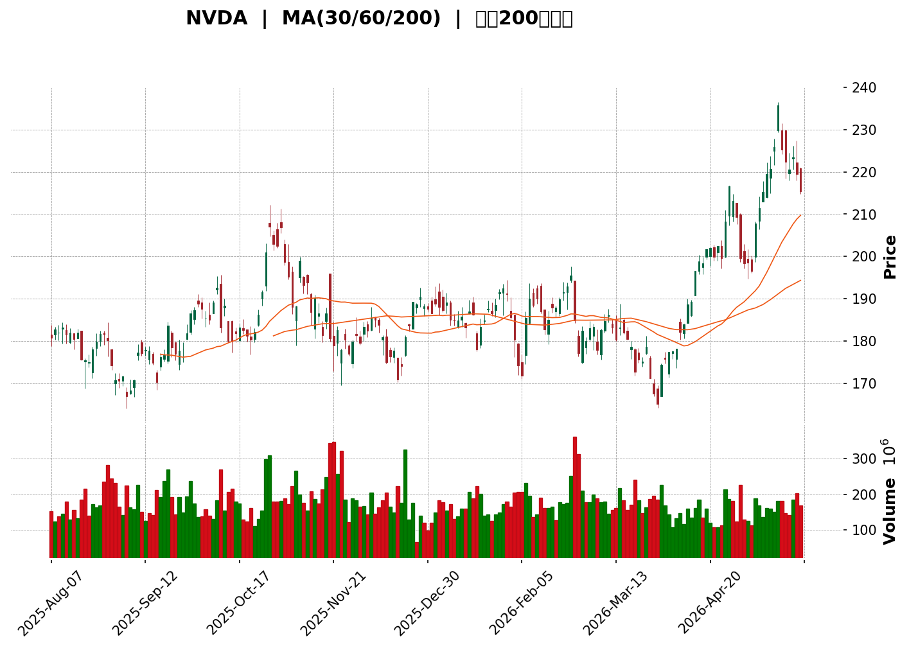
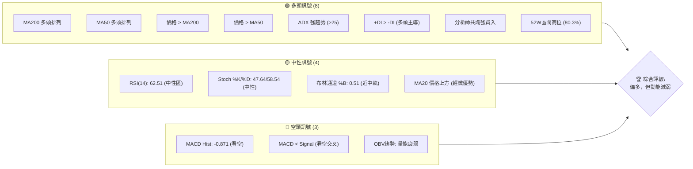
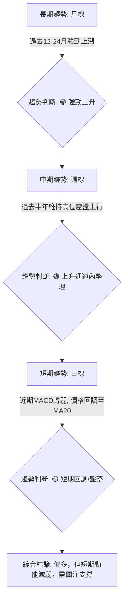
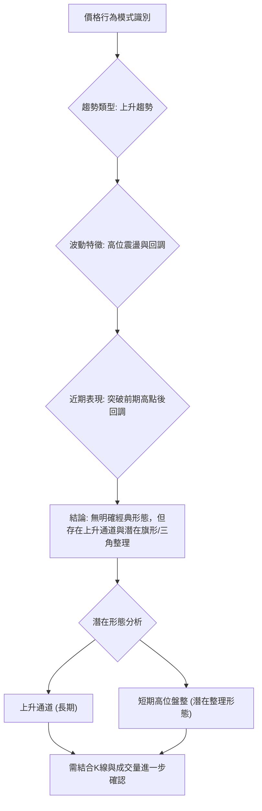

<details>
<summary>📊 靜態圖表 (點擊展開)</summary>

</details>

<html>
<head><meta charset="utf-8" /></head>
<body>
    <div>                        <script>window.PlotlyConfig = {MathJaxConfig: 'local'};</script>
        <script charset="utf-8" src="https://cdn.plot.ly/plotly-3.5.0.min.js" integrity="sha256-fHbNLP+GlIXN+efbQec78UkemUz3NJp7UmfGxC1tNxs=" crossorigin="anonymous"></script>                <div id="candlestick-chart" class="plotly-graph-div" style="height:500px; width:100%;"></div>            <script>                window.PLOTLYENV=window.PLOTLYENV || {};                                if (document.getElementById("candlestick-chart")) {                    Plotly.newPlot(                        "candlestick-chart",                        [{"close":{"dtype":"f8","bdata":"AAAA4K2XZkAAAACgbdVmQAAAAKDzwGZAAAAAYCXkZkAAAAAg6rFmQAAAAACsv2ZAAAAAwHCNZkAAAAAgWr9mQAAAAMCL82VAAAAAAN7rZUAAAADgbd5lQAAAAOC7PmZAAAAAwPZ4ZkAAAABgrLdmQAAAAAA8smZAAAAAYHuEZkAAAABg1cRlQAAAAEANWGVAAAAA4O5SZUAAAAAgNXRlQAAAAKDA32RAAAAAYAYJZUAAAABgaVdlQAAAAACeKWZAAAAAYNEkZkAAAACAnTlmQAAAACBgN2ZAAAAAwIvbZUAAAACArkhlQAAAAKAPB2ZAAAAAoNEUZkAAAAAA4PJmQAAAAAAiTWZAAAAAAGseZkAAAADAdDVmQAAAAEB0RWZAAAAAwI+6ZkAAAACA51FnQAAAAMAFZ2dAAAAAANGbZ0AAAABALnNnQAAAAMCgMGdAAAAAQKEgZ0AAAAAA26JnQAAAAECQEWhAAAAAAHrkZkAAAAAglIlnQAAAAMBTgGZAAAAAoO15ZkAAAAAASLlmQAAAAIBl5mZAAAAAoNbTZkAAAADAe6RmQAAAAKBTiGZAAAAA4HrEZkAAAABAqkdnQAAAAOAB72dAAAAAAEEgaUAAAACAjeBpQAAAAGDEW2lAAAAAAPhOaUAAAADgbttpQAAAAMBh1WhAAAAA4AhmaEAAAABA5oFnQAAAAKAjhGdAAAAAoObgaEAAAAAAcSRoQAAAAGDrOGhAAAAAAN1aZ0AAAACgxcRnQAAAAGCLUmdAAAAAAOKqZkAAAAAA\u002fE9nQAAAAGDYk2ZAAAAAIIhbZkAAAACA9dBmQAAAAICdOWZAAAAAwK+HZkAAAADAYB9mQAAAAODOfGZAAAAAIBWuZkAAAADAP3JmQAAAAMDX62ZAAAAA4M3MZkAAAABgRzFnQAAAAEC4HmdAAAAAQKT4ZkAAAABAcp1mQAAAAEBW4GVAAAAAgPkIZkAAAACAuzZmQAAAAMDIXWVAAAAAoC3EZUAAAADgXZ9mQAAAAADD9WZAAAAAgGSmZ0AAAACAMZNnQAAAAECh0GdAAAAAwLaGZ0AAAACA9HBnQAAAAGCtT2dAAAAAgN+aZ0AAAACgg4NnQAAAACBbZ2dAAAAAQDGjZ0AAAACg9SBnQAAAACAzG2dAAAAAgMIdZ0AAAAAgmTlnQAAAAKAp5GZAAAAAwEZhZ0AAAACACUdnQAAAAIDuQWZAAAAAQOzpZkAAAABAjxpnQAAAAGAddWdAAAAAoLdOZ0AAAABAUJBnQAAAAABP8GdAAAAAgPwPaEAAAABA1ONnQAAAAOAyM2dAAAAAQJGKZkAAAABAx8VlQAAAAMDce2VAAAAAgMwsZ0AAAABg88BnQAAAAAD0kGdAAAAAYEXBZ0AAAACgwV1nQAAAAICa2WZAAAAAQLgeZ0AAAADACH9nQAAAAIB5fGdAAAAAYOm5Z0AAAADARPFnQAAAAMDdGmhAAAAAwJRxaEAAAADgKBxnQAAAAADGJWZAAAAAQAvPZkAAAADASYFmQAAAAID24GZAAAAAAJDqZkAAAACg7jlmQAAAAMB71GZAAAAAAFIYZ0AAAADA9UBnQAAAAOB65GZAAAAAAACIZkAAAABACudmQAAAAIDCvWZAAAAAwMyMZkAAAACA61FmQAAAAGBmlmVAAAAA4Hr0ZUAAAABgZuZlQAAAAIDCVWZAAAAAIK5nZUAAAADgo\u002fBkQAAAAKBwpWRAAAAAwMzMZUAAAAAAAPhlQAAAAOB6LGZAAAAA4Ho0ZkAAAABAM0NmQAAAAGCPwmZAAAAAwB79ZkAAAAAAKZRnQAAAAIDrqWdAAAAA4FGQaEAAAAAA19toQAAAAEAzy2hAAAAAgMI1aUAAAACA60FpQAAAAAAp\u002fGhAAAAAAABQaUAAAADgevRoQAAAAOCjCGpAAAAAIIUTa0AAAACgcKVqQAAAAAAAKGpAAAAAgD3yaEAAAABgZs5oQAAAACBcz2hAAAAAAACQaEAAAABgj\u002fppQAAAAAAAcGpAAAAAYGbmakAAAACAFG5rQAAAAMD1mGtAAAAAYI86bEAAAAAgrndtQAAAAIA9KmxAAAAAgD3Ka0AAAAAghZNrQAAAAEAK72tAAAAA4FFwa0AAAABgj+pqQA=="},"high":{"dtype":"f8","bdata":"BZuMxC77ZkD3Pt4OoOhmQNRgl\u002fPm+WZALXfr82AOZ0Ca+NTiD\u002f5mQKwEYaOq32ZAEBy7JtW7ZkB45Ox7G91mQESXE4kHz2ZAZuXrbhD\u002fZUBMOMHi2xtmQJ3h8i7uUWZA9iA9JCe8ZkC6B+OHgstmQD1Hy6m1zmZAPfiSJQ8OZ0BrHGc42kNmQGBAXlI+i2VAWyeSMDSMZUDbslE6m3plQA814sMPIGVAvet4pM9dZUCtBlFTc15lQMCjBpVTaGZA4zpetFOIZkDMuVSMklJmQJWOt2KSWmZAUdPlZGAvZkAqTSGiyqVlQLEyAPqTImZAFCskG+9BZkANAZan8xBnQIZjM4nMzGZA+4ir+FN4ZkCwyYHQr4dmQNEDPjQCeGZA6gwkkVr\u002fZkAgA6SuimpnQBye0LDRg2dA\u002fzm0zu3gZ0DrQhvp2cpnQErb4bqzZmdACrivgkGhZ0C63SaviLJnQJPWPOvpaGhAieTaCidzaEBjS9wj2sJnQNKULFXzGGdAT0R7tzAbZ0BaJ5TtUOhmQEPJbbWNAmdAPfGg0r8lZ0A+P40oo9hmQMJJgYhv7WZAsDKjF1HgZkDGujqJYW5nQCUvj0pT\u002f2dAeO0HGBZkaUCADsi+VYVqQBv7AU9lxGlAYHI2Mk\u002f+aUDCqskcI2pqQIan+L9SfmlAdGyHMbpcaUD99eRLJbNoQLei4DiUiWdAkTAcs2D9aEAELpTXwGxoQKwm777Ke2hAxjUTQWjtZ0AlSqMept9nQLdkQfdVn2dAD3fnZ\u002fMYZ0CMgUAL3HpnQF7Qta5Pf2hA9+FHhEURZ0A24VgFW+9mQGT2rnF+RGZAahzZPXrcZkA6GI1QpmhmQLsJi4j3iGZAUjCzuHc0Z0B\u002fBJdNws1mQLzesR5SEGdAcYie4MwUZ0A+KPqprH9nQL4s4uq3NmdAgR4B3wkvZ0DbErcT7almQEChYGrs2WZAkyZajiFNZkBsM6cIX09mQHebOvPaA2ZAXsW8m34EZkDHbMnrFa5mQMGynQrNBGdApPZhcjuqZ0DDzPL9ypxnQEURwwq\u002fFWhAomKsIv6XZ0B053dbWp9nQDl8iBOX0WdAVVvN8GwdaEDWSdYu0zNoQKJYi3AbBWhANBRlH4LrZ0Dfy1ugRbFnQBPz75eOSmdAOi6OCIRjZ0BhqPe6MYNnQCbBFIpmDmdAXDBtUxK2Z0BC19MBwM1nQBbTfxbYy2ZAIFVE1tYrZ0BdJfQIHkVnQPiH0yTfsmdAubBmM4OjZ0CSLe+3q79nQHsH1gHeCmhAhcHfUQYvaECgeJfiV09oQOu69EtFyWdASqORPlFIZ0B0IBG8P3JmQPbL+Q7vGWZAzcxuC61fZ0ALfCjlyDRoQFCwoMAGD2hAZQ62M\u002fwnaEDn+ANLLzNoQIs9BOysb2dAQXSYyHlkZ0BEQqGQgstnQPru4gNvjWdAoX4jBjvKZ0BLPMNvED5oQDkdlfdNOGhAB4PtVNGzaEBW3b508UhoQDtQj1uQ0mZAgRXPEGfuZkBsxXd\u002ffJxmQMdGp4MUFmdAYMhQ7pkBZ0BWrAzPANhmQHtAe6LN3GZAZuaO4sFNZ0AAAAAA13NnQAAAAIAUHmdAAAAAQOFCZ0AAAAAAKZxnQAAAAMDMLGdAAAAAACnsZkAAAAAgXH9mQAAAAOBRSGZAAAAAANdLZkAAAABACgdmQAAAAEAKp2ZAAAAA4FEQZkAAAABACl9lQAAAAGBmLmVAAAAAANfTZUAAAAAA1ytmQAAAACCuL2ZAAAAAoEc5ZkAAAAAgXEdmQAAAAOBRKGdAAAAAYI8CZ0AAAAAAAMBnQAAAAMAetWdAAAAA4FGQaEAAAADAzAxpQAAAAEAz+2hAAAAAYGY2aUAAAACgcEVpQAAAAAAAWGlAAAAAAABQaUAAAABgj3ppQAAAAGBmXmpAAAAAYI8aa0AAAAAgXNdqQAAAAEAKl2pAAAAAoJlJakAAAAAAAGBpQAAAACBcN2lAAAAAIK4HaUAAAADgowhqQAAAAGBmxmpAAAAAoJk5a0AAAACgmclrQAAAAAAA+GtAAAAAQOF6bEAAAACgR5FtQAAAAAAA8GxAAAAAAADAbEAAAAAgXA9sQAAAAAApRGxAAAAAwMxsbEAAAADgUaBrQA=="},"hovertemplate":"\u003cb\u003e%{x|%Y-%m-%d}\u003c\u002fb\u003e\u003cbr\u003e\u958b: $%{open:.2f}\u003cbr\u003e\u9ad8: $%{high:.2f}\u003cbr\u003e\u4f4e: $%{low:.2f}\u003cbr\u003e\u6536: $%{close:.2f}\u003cextra\u003e\u003c\u002fextra\u003e","low":{"dtype":"f8","bdata":"IUlNTqZYZkDnPaoh14tmQIpV3ZYKh2ZAkx6gCcRtZkDGc2MsP2pmQC8OePzDbWZAO47LR1VAZkC6m9Fu65FmQJcMRzS\u002f7mVAUlbW27MYZUBcMdLX\u002frhlQJNlzV19ZWVAxA\u002f\u002fKE0RZkATy8YH+FhmQJWYXWc\u002fYmZA46Y\u002fni4MZkC1z\u002fcG4aNlQDipuZgm5mRAzzECPkMbZUDP8+svOCxlQMcliUNegWRAPIyObk\u002fqZEBFdjQZy9ZkQBypIWgb7mVADTDGfr0OZkBHT5Obxw1mQH7XB+q0z2VAkJcYM4zLZUAY6MNQhwxlQMW1KNMcnmVAWHFK1yTlZUAPFwVBG9ZlQL0qNd8ZBmZATW2t6S7sZUD1AIBZjaNlQJ4eii4l3WVAkwQoYJuJZkASZ7bWuK5mQEMP5WAn\u002fGZAOTcXX0KBZ0AvgMNDgitnQA3113zq6WZAAwBij1r\u002fZkDiSt\u002fPn1BnQBmfx5s\u002f4WdAQSqZ3\u002fXAZkBjsGEfET5nQH8OBazEdWZAWALeKKgoZkCY16Q1AnhmQJ5NxV5ed2ZAmA6Bsbi2ZkBoc0LZ93hmQK3KX+qyF2ZAQBDS4aV4ZkBkXd7bWu9mQPaXpwAZjWdApPUwM3L8Z0Df9RyoPZhpQKBqzZRpLGlALLu0wIdBaUCHLgWQMrFpQKpmCW8QvWhAil3jwB1UaEB50lZngUtnQEXxQO59XGZAZuHsWpk4aEBD+k+M7ehnQMlnkSZ942dAsvhM1Y36ZkCnW4\u002f\u002f7JFmQAO\u002fG62XCWdAAiC\u002fKSt0ZkBMRTbS6tlmQPvq7XWRemZARfHi+SadZUBsIxV1vQ5mQMrb9BABMWVALcEX0Q1HZkCK8SkzYQ9mQDrsHVwmtWVALfNAEF5\u002fZkDIWoAO5GJmQMtj6qNofmZAX\u002fpAis6cZkA+m3Xle8xmQC1wQTvs6WZAZ6WJ5fbAZkBDy2KpiBNmQFvlao2J02VACBfyLqjgZUAejuQ\u002ff9xlQHVHeAegSWVAypR3R\u002fF5ZUBkatEPkwpmQHhKM1jiymZA70ATrHvcZkBlV0eFjlJnQOLpPp+sf2dAGjpYRsw8Z0BvWzelb11nQC8vIoFbT2dAmsv7Yv6HZ0DO7YM\u002fekRnQJ1Rqa\u002fqWWdAUY6IwZhRZ0ATnuH2ZvZmQEPVIScf9WZAm\u002fLuuVLgZkB1TYRxe+xmQIVzw2lJmWZAEmOq0TxKZ0A\u002fSwnRPEJnQI6WPlQ2M2ZA+Qs9rn1MZkDXBVnncP1mQK+dhqDqWWdA6J5ytls\u002fZ0CPLTwAFDZnQF3umB6NumdA+5BH\u002fJhBZ0AfK288tq5nQInyzxLXG2dA67++8g0HZkD22tmC0nxlQNd8iOCpYGVAL96hy+XSZUBbTirTFP5mQC9vsI+Dg2dAIghDMVCYZ0CxUM0w\u002f09nQNtBYsqQsmZA9rIZEXNlZkC1GIYK\u002f1dnQPxyEH7MNGdApZI0GMI9Z0A7U3ZfO7JnQPwckKp5bGdACOkAqfE4aEDCM7fA6wlnQJ+o3dvaC2ZANquEeS3UZUBGRXgjIh1mQORqHbKbgWZAyzZwK9o7ZkAkk40R7xlmQNXc6qSd8WVAbUQXOQHAZkAAAABgZg5nQAAAAAAAuGZAAAAAgBR+ZkAAAADAHq1mQAAAAIDCtWZAAAAAYI+KZkAAAACgR\u002fllQAAAAEAKd2VAAAAA4FHYZUAAAAAgXL9lQAAAAEAzG2ZAAAAA4HpkZUAAAADgUeBkQAAAAOCjiGRAAAAAYLjeZEAAAAAAANhlQAAAAADXa2VAAAAA4FH4ZUAAAADAHrVlQAAAAKCZiWZAAAAAANeTZkAAAACgmQlnQAAAACCuN2dAAAAA4KPYZ0AAAAAgrndoQAAAAIDreWhAAAAA4KPoaEAAAABA4bpoQAAAAAAA4GhAAAAAAADgaEAAAABACqdoQAAAAIDr+WhAAAAAACnsaUAAAABgZgZqQAAAAGCP8mlAAAAAYGbWaEAAAAAA16NoQAAAACCuV2hAAAAAwPWAaEAAAAAghdNoQAAAAAAA0GlAAAAA4HqcakAAAADgerxqQAAAAKBw3WpAAAAAgD2ya0AAAACgmalsQAAAACCuB2xAAAAAANdLa0AAAADAHj1rQAAAAAAAkGtAAAAAgMI9a0AAAACgmdlqQA=="},"name":"\u50f9\u683c","open":{"dtype":"f8","bdata":"sD5MaUaxZkCtcNRworBmQJzIe8OhwGZA2V61Rb\u002fdZkDT1Sh53tJmQKcHXzcLd2ZAhkGybTG7ZkAXq1RrPZJmQOXreSHKzGZAu\u002fskMILkZUD\u002fVU8tRdplQBLshTKakmVA1Wq+fEBKZkAPow9U9oBmQORYjltkvmZAd6B9XUeZZkAdSVemkkJmQPkT2I8YP2VAzzbBxgJhZUAx5sNbVVFlQIeAMyARAGVAZaHbiLXwZEC\u002f8hcG+yFlQAfIb3CKE2ZAvvlu\u002fiB1ZkB+mYTrAzhmQJLP7p7S9GVA4Wr+12AfZkAj\u002fgmj35NlQDxPU6i\u002fvmVAi8xarwX4ZUCWzS\u002f5++hlQBTp0pBmvmZAMPP4GgJ4ZkBkcstCv85lQH8Cm2TQRGZAs1vXRiCNZkAegoKM68FmQPEXaowHJ2dAeyOJvIiyZ0DsbIBWaqVnQAJVNSlZL2dAR6cWrrRGZ0Ahw\u002fWolVFnQMZoTy6vBmhAnNK40KMvaEB4b5YwYX5nQL6vFZz9F2dAsxeZZ\u002fMYZ0CPB08\u002fuMZmQP4QynsghWZAPnQwT4TjZkA+P40oo9hmQMDNAvrXo2ZA7YC6UM6MZkAQpInNO\u002fpmQKLhajkDv2dA8NbKDOwgaEA0Lqsnof5pQIvUlTcUpGlAzeAysKzNaUBcxZ4r1AFqQAPwXl9JX2lAeLGoLPHXaEC5MSIAwIxoQE0U34smHGdABLMKq9ViaEDP\u002fHIzb2RoQDFHEEZadmhAkZvnuu3gZ0Dwxbey4NpmQAvRGPFiPmdAqJDfDoTrZkDjc5xOoRhnQDe8ORq2fWhAXqqmIAunZkBoPkvADG9mQAQ9Tl6B3GVA98mPpIWzZkA56QrRsF9mQIfYjsO012VARO\u002foWq63ZkCSIPuI7KFmQIhaoYeGs2ZAd0cEWCn8ZkB+TjnqKdRmQPfGCj2ZMWdA5QznOLgeZ0B7\u002fc3JpYhmQOGqiMw0o2ZAbrHOpMU9ZkCrW57FAwhmQATRoTblAmZA2c61U6jQZUCZHlxKIhVmQH5g4AUf\u002fWZA0m8hJLneZkCUKQwswX1nQL\u002fJQWUcvWdARHDrGWV2Z0Ap+pGwWodnQBU90IPpsWdAHG6bD426Z0CP6wHj\u002fPdnQF0hyWtP0GdAX+dP3emRZ0BkZUZSMaNnQKV6BEc9ImdASXk7A7nmZkAdsO37rR9nQH09+7nrCWdA4DdiXq1PZ0Cv3Ut8O6JnQD8IBA18vGZAd5J8REphZkD6gjgKrhdnQIofTtOsb2dAxPu60ctkZ0CSuloRW2dnQIzRXBxP6GdAXPvUZIzqZ0A4LOuWY+ZnQLOboGsTZmdArsT5gVtHZ0DPqbDJaG5mQG3FnuV03WVAdGhIHsYVZkDoqPsvAAhnQGgIhx3U62dAIG2iDxEOaEC3KdcsoCBoQEgfSQ4Jb2dAugRvba+3ZkBMFZJIrJdnQB4rRp+YYWdA5m660OpRZ0AhEwTxd+xnQKZRWzpZ72dAFIcNHhBOaEDU2wO3TUhoQKgUibOvp2ZAGPmJTwTgZUAvoCrxXk9mQKK8\u002f4bEjWZA5uwvViClZkA\u002fx596kXpmQA9RvPRAGmZAQJrZ7HvMZkAAAADAHj1nQAAAAKCZAWdAAAAAoHAdZ0AAAABACt9mQAAAAIDrIWdAAAAAIFzPZkAAAADgUUBmQAAAAAAAQGZAAAAA4FEoZkAAAABgj9plQAAAAEAzI2ZAAAAAgD0CZkAAAAAAAEBlQAAAAMD1GGVAAAAAQArfZEAAAAAAAABmQAAAAIDChWVAAAAAwB4lZkAAAAAgXPdlQAAAAAAAEGdAAAAAQOG6ZkAAAACA6wlnQAAAAMD1QGdAAAAAQOHaZ0AAAACgR5FoQAAAAIDCrWhAAAAAwMz8aEAAAAAgXP9oQAAAAAApRGlAAAAAIK4faUAAAABguE5pQAAAAGC4\u002fmhAAAAAwMw0akAAAAAgri9qQAAAAGBmlmpAAAAAgMI9akAAAADA9ShpQAAAAAAA8GhAAAAAoJnpaEAAAADgevxoQAAAAEDhCmpAAAAAwPWgakAAAACgR8FqQAAAAKCZUWtAAAAAgMIdbEAAAABAM7tsQAAAAOBRuGxAAAAAANe7bEAAAAAA13NrQAAAAIDC5WtAAAAAoEfJa0AAAADAzJxrQA=="},"x":["2025-08-07T00:00:00-04:00","2025-08-08T00:00:00-04:00","2025-08-11T00:00:00-04:00","2025-08-12T00:00:00-04:00","2025-08-13T00:00:00-04:00","2025-08-14T00:00:00-04:00","2025-08-15T00:00:00-04:00","2025-08-18T00:00:00-04:00","2025-08-19T00:00:00-04:00","2025-08-20T00:00:00-04:00","2025-08-21T00:00:00-04:00","2025-08-22T00:00:00-04:00","2025-08-25T00:00:00-04:00","2025-08-26T00:00:00-04:00","2025-08-27T00:00:00-04:00","2025-08-28T00:00:00-04:00","2025-08-29T00:00:00-04:00","2025-09-02T00:00:00-04:00","2025-09-03T00:00:00-04:00","2025-09-04T00:00:00-04:00","2025-09-05T00:00:00-04:00","2025-09-08T00:00:00-04:00","2025-09-09T00:00:00-04:00","2025-09-10T00:00:00-04:00","2025-09-11T00:00:00-04:00","2025-09-12T00:00:00-04:00","2025-09-15T00:00:00-04:00","2025-09-16T00:00:00-04:00","2025-09-17T00:00:00-04:00","2025-09-18T00:00:00-04:00","2025-09-19T00:00:00-04:00","2025-09-22T00:00:00-04:00","2025-09-23T00:00:00-04:00","2025-09-24T00:00:00-04:00","2025-09-25T00:00:00-04:00","2025-09-26T00:00:00-04:00","2025-09-29T00:00:00-04:00","2025-09-30T00:00:00-04:00","2025-10-01T00:00:00-04:00","2025-10-02T00:00:00-04:00","2025-10-03T00:00:00-04:00","2025-10-06T00:00:00-04:00","2025-10-07T00:00:00-04:00","2025-10-08T00:00:00-04:00","2025-10-09T00:00:00-04:00","2025-10-10T00:00:00-04:00","2025-10-13T00:00:00-04:00","2025-10-14T00:00:00-04:00","2025-10-15T00:00:00-04:00","2025-10-16T00:00:00-04:00","2025-10-17T00:00:00-04:00","2025-10-20T00:00:00-04:00","2025-10-21T00:00:00-04:00","2025-10-22T00:00:00-04:00","2025-10-23T00:00:00-04:00","2025-10-24T00:00:00-04:00","2025-10-27T00:00:00-04:00","2025-10-28T00:00:00-04:00","2025-10-29T00:00:00-04:00","2025-10-30T00:00:00-04:00","2025-10-31T00:00:00-04:00","2025-11-03T00:00:00-05:00","2025-11-04T00:00:00-05:00","2025-11-05T00:00:00-05:00","2025-11-06T00:00:00-05:00","2025-11-07T00:00:00-05:00","2025-11-10T00:00:00-05:00","2025-11-11T00:00:00-05:00","2025-11-12T00:00:00-05:00","2025-11-13T00:00:00-05:00","2025-11-14T00:00:00-05:00","2025-11-17T00:00:00-05:00","2025-11-18T00:00:00-05:00","2025-11-19T00:00:00-05:00","2025-11-20T00:00:00-05:00","2025-11-21T00:00:00-05:00","2025-11-24T00:00:00-05:00","2025-11-25T00:00:00-05:00","2025-11-26T00:00:00-05:00","2025-11-28T00:00:00-05:00","2025-12-01T00:00:00-05:00","2025-12-02T00:00:00-05:00","2025-12-03T00:00:00-05:00","2025-12-04T00:00:00-05:00","2025-12-05T00:00:00-05:00","2025-12-08T00:00:00-05:00","2025-12-09T00:00:00-05:00","2025-12-10T00:00:00-05:00","2025-12-11T00:00:00-05:00","2025-12-12T00:00:00-05:00","2025-12-15T00:00:00-05:00","2025-12-16T00:00:00-05:00","2025-12-17T00:00:00-05:00","2025-12-18T00:00:00-05:00","2025-12-19T00:00:00-05:00","2025-12-22T00:00:00-05:00","2025-12-23T00:00:00-05:00","2025-12-24T00:00:00-05:00","2025-12-26T00:00:00-05:00","2025-12-29T00:00:00-05:00","2025-12-30T00:00:00-05:00","2025-12-31T00:00:00-05:00","2026-01-02T00:00:00-05:00","2026-01-05T00:00:00-05:00","2026-01-06T00:00:00-05:00","2026-01-07T00:00:00-05:00","2026-01-08T00:00:00-05:00","2026-01-09T00:00:00-05:00","2026-01-12T00:00:00-05:00","2026-01-13T00:00:00-05:00","2026-01-14T00:00:00-05:00","2026-01-15T00:00:00-05:00","2026-01-16T00:00:00-05:00","2026-01-20T00:00:00-05:00","2026-01-21T00:00:00-05:00","2026-01-22T00:00:00-05:00","2026-01-23T00:00:00-05:00","2026-01-26T00:00:00-05:00","2026-01-27T00:00:00-05:00","2026-01-28T00:00:00-05:00","2026-01-29T00:00:00-05:00","2026-01-30T00:00:00-05:00","2026-02-02T00:00:00-05:00","2026-02-03T00:00:00-05:00","2026-02-04T00:00:00-05:00","2026-02-05T00:00:00-05:00","2026-02-06T00:00:00-05:00","2026-02-09T00:00:00-05:00","2026-02-10T00:00:00-05:00","2026-02-11T00:00:00-05:00","2026-02-12T00:00:00-05:00","2026-02-13T00:00:00-05:00","2026-02-17T00:00:00-05:00","2026-02-18T00:00:00-05:00","2026-02-19T00:00:00-05:00","2026-02-20T00:00:00-05:00","2026-02-23T00:00:00-05:00","2026-02-24T00:00:00-05:00","2026-02-25T00:00:00-05:00","2026-02-26T00:00:00-05:00","2026-02-27T00:00:00-05:00","2026-03-02T00:00:00-05:00","2026-03-03T00:00:00-05:00","2026-03-04T00:00:00-05:00","2026-03-05T00:00:00-05:00","2026-03-06T00:00:00-05:00","2026-03-09T00:00:00-04:00","2026-03-10T00:00:00-04:00","2026-03-11T00:00:00-04:00","2026-03-12T00:00:00-04:00","2026-03-13T00:00:00-04:00","2026-03-16T00:00:00-04:00","2026-03-17T00:00:00-04:00","2026-03-18T00:00:00-04:00","2026-03-19T00:00:00-04:00","2026-03-20T00:00:00-04:00","2026-03-23T00:00:00-04:00","2026-03-24T00:00:00-04:00","2026-03-25T00:00:00-04:00","2026-03-26T00:00:00-04:00","2026-03-27T00:00:00-04:00","2026-03-30T00:00:00-04:00","2026-03-31T00:00:00-04:00","2026-04-01T00:00:00-04:00","2026-04-02T00:00:00-04:00","2026-04-06T00:00:00-04:00","2026-04-07T00:00:00-04:00","2026-04-08T00:00:00-04:00","2026-04-09T00:00:00-04:00","2026-04-10T00:00:00-04:00","2026-04-13T00:00:00-04:00","2026-04-14T00:00:00-04:00","2026-04-15T00:00:00-04:00","2026-04-16T00:00:00-04:00","2026-04-17T00:00:00-04:00","2026-04-20T00:00:00-04:00","2026-04-21T00:00:00-04:00","2026-04-22T00:00:00-04:00","2026-04-23T00:00:00-04:00","2026-04-24T00:00:00-04:00","2026-04-27T00:00:00-04:00","2026-04-28T00:00:00-04:00","2026-04-29T00:00:00-04:00","2026-04-30T00:00:00-04:00","2026-05-01T00:00:00-04:00","2026-05-04T00:00:00-04:00","2026-05-05T00:00:00-04:00","2026-05-06T00:00:00-04:00","2026-05-07T00:00:00-04:00","2026-05-08T00:00:00-04:00","2026-05-11T00:00:00-04:00","2026-05-12T00:00:00-04:00","2026-05-13T00:00:00-04:00","2026-05-14T00:00:00-04:00","2026-05-15T00:00:00-04:00","2026-05-18T00:00:00-04:00","2026-05-19T00:00:00-04:00","2026-05-20T00:00:00-04:00","2026-05-21T00:00:00-04:00","2026-05-22T00:00:00-04:00"],"type":"candlestick"},{"hovertemplate":"MA30: $%{y:.2f}\u003cextra\u003e\u003c\u002fextra\u003e","line":{"color":"#2196F3","dash":"dash","width":2},"mode":"lines","name":"MA30","x":["2025-08-07T00:00:00-04:00","2025-08-08T00:00:00-04:00","2025-08-11T00:00:00-04:00","2025-08-12T00:00:00-04:00","2025-08-13T00:00:00-04:00","2025-08-14T00:00:00-04:00","2025-08-15T00:00:00-04:00","2025-08-18T00:00:00-04:00","2025-08-19T00:00:00-04:00","2025-08-20T00:00:00-04:00","2025-08-21T00:00:00-04:00","2025-08-22T00:00:00-04:00","2025-08-25T00:00:00-04:00","2025-08-26T00:00:00-04:00","2025-08-27T00:00:00-04:00","2025-08-28T00:00:00-04:00","2025-08-29T00:00:00-04:00","2025-09-02T00:00:00-04:00","2025-09-03T00:00:00-04:00","2025-09-04T00:00:00-04:00","2025-09-05T00:00:00-04:00","2025-09-08T00:00:00-04:00","2025-09-09T00:00:00-04:00","2025-09-10T00:00:00-04:00","2025-09-11T00:00:00-04:00","2025-09-12T00:00:00-04:00","2025-09-15T00:00:00-04:00","2025-09-16T00:00:00-04:00","2025-09-17T00:00:00-04:00","2025-09-18T00:00:00-04:00","2025-09-19T00:00:00-04:00","2025-09-22T00:00:00-04:00","2025-09-23T00:00:00-04:00","2025-09-24T00:00:00-04:00","2025-09-25T00:00:00-04:00","2025-09-26T00:00:00-04:00","2025-09-29T00:00:00-04:00","2025-09-30T00:00:00-04:00","2025-10-01T00:00:00-04:00","2025-10-02T00:00:00-04:00","2025-10-03T00:00:00-04:00","2025-10-06T00:00:00-04:00","2025-10-07T00:00:00-04:00","2025-10-08T00:00:00-04:00","2025-10-09T00:00:00-04:00","2025-10-10T00:00:00-04:00","2025-10-13T00:00:00-04:00","2025-10-14T00:00:00-04:00","2025-10-15T00:00:00-04:00","2025-10-16T00:00:00-04:00","2025-10-17T00:00:00-04:00","2025-10-20T00:00:00-04:00","2025-10-21T00:00:00-04:00","2025-10-22T00:00:00-04:00","2025-10-23T00:00:00-04:00","2025-10-24T00:00:00-04:00","2025-10-27T00:00:00-04:00","2025-10-28T00:00:00-04:00","2025-10-29T00:00:00-04:00","2025-10-30T00:00:00-04:00","2025-10-31T00:00:00-04:00","2025-11-03T00:00:00-05:00","2025-11-04T00:00:00-05:00","2025-11-05T00:00:00-05:00","2025-11-06T00:00:00-05:00","2025-11-07T00:00:00-05:00","2025-11-10T00:00:00-05:00","2025-11-11T00:00:00-05:00","2025-11-12T00:00:00-05:00","2025-11-13T00:00:00-05:00","2025-11-14T00:00:00-05:00","2025-11-17T00:00:00-05:00","2025-11-18T00:00:00-05:00","2025-11-19T00:00:00-05:00","2025-11-20T00:00:00-05:00","2025-11-21T00:00:00-05:00","2025-11-24T00:00:00-05:00","2025-11-25T00:00:00-05:00","2025-11-26T00:00:00-05:00","2025-11-28T00:00:00-05:00","2025-12-01T00:00:00-05:00","2025-12-02T00:00:00-05:00","2025-12-03T00:00:00-05:00","2025-12-04T00:00:00-05:00","2025-12-05T00:00:00-05:00","2025-12-08T00:00:00-05:00","2025-12-09T00:00:00-05:00","2025-12-10T00:00:00-05:00","2025-12-11T00:00:00-05:00","2025-12-12T00:00:00-05:00","2025-12-15T00:00:00-05:00","2025-12-16T00:00:00-05:00","2025-12-17T00:00:00-05:00","2025-12-18T00:00:00-05:00","2025-12-19T00:00:00-05:00","2025-12-22T00:00:00-05:00","2025-12-23T00:00:00-05:00","2025-12-24T00:00:00-05:00","2025-12-26T00:00:00-05:00","2025-12-29T00:00:00-05:00","2025-12-30T00:00:00-05:00","2025-12-31T00:00:00-05:00","2026-01-02T00:00:00-05:00","2026-01-05T00:00:00-05:00","2026-01-06T00:00:00-05:00","2026-01-07T00:00:00-05:00","2026-01-08T00:00:00-05:00","2026-01-09T00:00:00-05:00","2026-01-12T00:00:00-05:00","2026-01-13T00:00:00-05:00","2026-01-14T00:00:00-05:00","2026-01-15T00:00:00-05:00","2026-01-16T00:00:00-05:00","2026-01-20T00:00:00-05:00","2026-01-21T00:00:00-05:00","2026-01-22T00:00:00-05:00","2026-01-23T00:00:00-05:00","2026-01-26T00:00:00-05:00","2026-01-27T00:00:00-05:00","2026-01-28T00:00:00-05:00","2026-01-29T00:00:00-05:00","2026-01-30T00:00:00-05:00","2026-02-02T00:00:00-05:00","2026-02-03T00:00:00-05:00","2026-02-04T00:00:00-05:00","2026-02-05T00:00:00-05:00","2026-02-06T00:00:00-05:00","2026-02-09T00:00:00-05:00","2026-02-10T00:00:00-05:00","2026-02-11T00:00:00-05:00","2026-02-12T00:00:00-05:00","2026-02-13T00:00:00-05:00","2026-02-17T00:00:00-05:00","2026-02-18T00:00:00-05:00","2026-02-19T00:00:00-05:00","2026-02-20T00:00:00-05:00","2026-02-23T00:00:00-05:00","2026-02-24T00:00:00-05:00","2026-02-25T00:00:00-05:00","2026-02-26T00:00:00-05:00","2026-02-27T00:00:00-05:00","2026-03-02T00:00:00-05:00","2026-03-03T00:00:00-05:00","2026-03-04T00:00:00-05:00","2026-03-05T00:00:00-05:00","2026-03-06T00:00:00-05:00","2026-03-09T00:00:00-04:00","2026-03-10T00:00:00-04:00","2026-03-11T00:00:00-04:00","2026-03-12T00:00:00-04:00","2026-03-13T00:00:00-04:00","2026-03-16T00:00:00-04:00","2026-03-17T00:00:00-04:00","2026-03-18T00:00:00-04:00","2026-03-19T00:00:00-04:00","2026-03-20T00:00:00-04:00","2026-03-23T00:00:00-04:00","2026-03-24T00:00:00-04:00","2026-03-25T00:00:00-04:00","2026-03-26T00:00:00-04:00","2026-03-27T00:00:00-04:00","2026-03-30T00:00:00-04:00","2026-03-31T00:00:00-04:00","2026-04-01T00:00:00-04:00","2026-04-02T00:00:00-04:00","2026-04-06T00:00:00-04:00","2026-04-07T00:00:00-04:00","2026-04-08T00:00:00-04:00","2026-04-09T00:00:00-04:00","2026-04-10T00:00:00-04:00","2026-04-13T00:00:00-04:00","2026-04-14T00:00:00-04:00","2026-04-15T00:00:00-04:00","2026-04-16T00:00:00-04:00","2026-04-17T00:00:00-04:00","2026-04-20T00:00:00-04:00","2026-04-21T00:00:00-04:00","2026-04-22T00:00:00-04:00","2026-04-23T00:00:00-04:00","2026-04-24T00:00:00-04:00","2026-04-27T00:00:00-04:00","2026-04-28T00:00:00-04:00","2026-04-29T00:00:00-04:00","2026-04-30T00:00:00-04:00","2026-05-01T00:00:00-04:00","2026-05-04T00:00:00-04:00","2026-05-05T00:00:00-04:00","2026-05-06T00:00:00-04:00","2026-05-07T00:00:00-04:00","2026-05-08T00:00:00-04:00","2026-05-11T00:00:00-04:00","2026-05-12T00:00:00-04:00","2026-05-13T00:00:00-04:00","2026-05-14T00:00:00-04:00","2026-05-15T00:00:00-04:00","2026-05-18T00:00:00-04:00","2026-05-19T00:00:00-04:00","2026-05-20T00:00:00-04:00","2026-05-21T00:00:00-04:00","2026-05-22T00:00:00-04:00"],"y":{"dtype":"f8","bdata":"AAAAAAAA+H8AAAAAAAD4fwAAAAAAAPh\u002fAAAAAAAA+H8AAAAAAAD4fwAAAAAAAPh\u002fAAAAAAAA+H8AAAAAAAD4fwAAAAAAAPh\u002fAAAAAAAA+H8AAAAAAAD4fwAAAAAAAPh\u002fAAAAAAAA+H8AAAAAAAD4fwAAAAAAAPh\u002fAAAAAAAA+H8AAAAAAAD4fwAAAAAAAPh\u002fAAAAAAAA+H8AAAAAAAD4fwAAAAAAAPh\u002fAAAAAAAA+H8AAAAAAAD4fwAAAAAAAPh\u002fAAAAAAAA+H8AAAAAAAD4fwAAAAAAAPh\u002fAAAAAAAA+H8AAAAAAAD4f83MzBzZG2ZAAAAAcHwXZkB3d3e3dxhmQFVVVWWbFGZA3t3dHQQOZkAiIiIS3glmQFVVVSXLBWZA3t3dLUwHZkAiIiLCLgxmQBEREbGQGGZAiYiIqPYmZkCamZmJdDRmQDMzM7OEPGZAMzMzcxtCZkBmZmZW8klmQImIiFioVWZAAAAAgNtYZkDNzMzs8mdmQERERCTTcWZA7+7ubqh7ZkBVVVVlfoZmQImIiCjIl2ZA3t3dXROnZkBERESULbJmQERERMRVtWZAd3d3N6i6ZkBERESkqMNmQKuqqipQ0mZAMzMzEzTuZkDNzMwsZhVnQJqZmZnSMWdAmpmZaVxNZ0CamZn5LWZnQDMzM7PJe2dAVVVV5T2PZ0Dv7u6+UppnQBERETHypGdAvLu7a0q3Z0AREREBT75nQAAAACBOxWdAvLu72yPDZ0Crqqoa3MVnQGZmZob9xmdAAAAAwBDDZ0BVVVWVTcBnQBEREUGUs2dAiYiIqAOvZ0DNzMw83KhnQERERNSApmdAvLu7O\u002famZ0DNzMzs1KFnQHd3d+dPnmdAiYiIuA2dZ0De3d0NYZtnQCIiIkKynmdAq6qqSvmeZ0AzMzNDOp5nQAAAAOBIl2dAiYiIyOWEZ0CrqqqKD2lnQLy7u6tYS2dAmpmZyWkvZ0De3d29UhBnQDMzM5O88mZAVVVVVUbcZkARERFBudRmQM3MzEz6z2ZA7+7ufn7FZkC8u7sLp8BmQLy7uxstvWZAzczMTKO+ZkAAAAAQ2LtmQImIiJi\u002fu2ZAMzMzg7\u002fDZkC8u7s7d8VmQAAAACCEzGZAmpmZKXDXZkBVVVXVGtpmQCIiItKf4WZAIiIicqDmZkCamZm5CPBmQO\u002fu7q5682ZA3t3dzXP5ZkCJiIiYiwBnQAAAALDh+mZAq6qqKtr7ZkC8u7tLGPtmQImIiIj5\u002fWZAvLu7C9gAZ0AzMzOD8AhnQO\u002fu7t6JGmdAVVVVxdYrZ0BVVVVlJDpnQBERERHKSWdAzczM\u002fGZQZ0C8u7s7JklnQN7d3X2NPGdARERE5H84Z0CrqqpaBjpnQKuqqvrmN2dAq6qqqto5Z0BmZmbWNjlnQGZmZkZHNWdAVVVV1SMxZ0Crqqqa\u002fTBnQBEREdGxMWdAAAAAsHMyZ0AiIiJCZTlnQCIiIvLqQWdAERERwT5NZ0C8u7uLQ0xnQEREROTqRWdAq6qqCgtBZ0BVVVWVczpnQGZmZqbAP2dAvLu7G8Y\u002fZ0CamZlJSThnQBEREZHuMmdAERERYR4xZ0Crqqo6eS5nQCIiIsKLJWdA7+7uznoYZ0DNzMysDRBnQHd3d4cjDGdARERElDYMZ0BERER04hBnQImIiOjEEWdAmpmZyVsHZ0CamZlJivdmQDMzM6MI7WZAAAAAEPvYZkDv7u7eRsRmQM3MzKx4sWZAd3d3FzWmZkBERERELJlmQM3MzBz5jWZAZmZm9v2AZkC8u7sLqHJmQHd3d\u002fctZ2ZAIiIiosNaZkAzMzOjw15mQCIiItKza2ZAREREpK16ZkCrqqpqw45mQGZmZsYan2ZAZmZmhq2yZkCamZlJi8xmQN7d3e3u3mZAERERIdvxZkARERGRXwBnQLy7u7stG2dAAAAAcPZBZ0CJiIjI6GFnQHd3d\u002fcMf2dAiYiIqH+TZ0BERET0tqhnQM3MzJw2xGdAiYiIyHbaZ0AzMzPzRP1nQAAAAABHIGhAIiIiAitPaEARERGhjIZoQN7d3d3dwWhAAAAAsLn4aEBVVVX1tjhpQLy7uwvXa2lAq6qqqn+baUCrqqq618hpQFVVVfX99GlAERERIfcaakAiIiICcjdqQA=="},"type":"scatter"},{"hovertemplate":"MA60: $%{y:.2f}\u003cextra\u003e\u003c\u002fextra\u003e","line":{"color":"#9C27B0","dash":"dash","width":2},"mode":"lines","name":"MA60","x":["2025-08-07T00:00:00-04:00","2025-08-08T00:00:00-04:00","2025-08-11T00:00:00-04:00","2025-08-12T00:00:00-04:00","2025-08-13T00:00:00-04:00","2025-08-14T00:00:00-04:00","2025-08-15T00:00:00-04:00","2025-08-18T00:00:00-04:00","2025-08-19T00:00:00-04:00","2025-08-20T00:00:00-04:00","2025-08-21T00:00:00-04:00","2025-08-22T00:00:00-04:00","2025-08-25T00:00:00-04:00","2025-08-26T00:00:00-04:00","2025-08-27T00:00:00-04:00","2025-08-28T00:00:00-04:00","2025-08-29T00:00:00-04:00","2025-09-02T00:00:00-04:00","2025-09-03T00:00:00-04:00","2025-09-04T00:00:00-04:00","2025-09-05T00:00:00-04:00","2025-09-08T00:00:00-04:00","2025-09-09T00:00:00-04:00","2025-09-10T00:00:00-04:00","2025-09-11T00:00:00-04:00","2025-09-12T00:00:00-04:00","2025-09-15T00:00:00-04:00","2025-09-16T00:00:00-04:00","2025-09-17T00:00:00-04:00","2025-09-18T00:00:00-04:00","2025-09-19T00:00:00-04:00","2025-09-22T00:00:00-04:00","2025-09-23T00:00:00-04:00","2025-09-24T00:00:00-04:00","2025-09-25T00:00:00-04:00","2025-09-26T00:00:00-04:00","2025-09-29T00:00:00-04:00","2025-09-30T00:00:00-04:00","2025-10-01T00:00:00-04:00","2025-10-02T00:00:00-04:00","2025-10-03T00:00:00-04:00","2025-10-06T00:00:00-04:00","2025-10-07T00:00:00-04:00","2025-10-08T00:00:00-04:00","2025-10-09T00:00:00-04:00","2025-10-10T00:00:00-04:00","2025-10-13T00:00:00-04:00","2025-10-14T00:00:00-04:00","2025-10-15T00:00:00-04:00","2025-10-16T00:00:00-04:00","2025-10-17T00:00:00-04:00","2025-10-20T00:00:00-04:00","2025-10-21T00:00:00-04:00","2025-10-22T00:00:00-04:00","2025-10-23T00:00:00-04:00","2025-10-24T00:00:00-04:00","2025-10-27T00:00:00-04:00","2025-10-28T00:00:00-04:00","2025-10-29T00:00:00-04:00","2025-10-30T00:00:00-04:00","2025-10-31T00:00:00-04:00","2025-11-03T00:00:00-05:00","2025-11-04T00:00:00-05:00","2025-11-05T00:00:00-05:00","2025-11-06T00:00:00-05:00","2025-11-07T00:00:00-05:00","2025-11-10T00:00:00-05:00","2025-11-11T00:00:00-05:00","2025-11-12T00:00:00-05:00","2025-11-13T00:00:00-05:00","2025-11-14T00:00:00-05:00","2025-11-17T00:00:00-05:00","2025-11-18T00:00:00-05:00","2025-11-19T00:00:00-05:00","2025-11-20T00:00:00-05:00","2025-11-21T00:00:00-05:00","2025-11-24T00:00:00-05:00","2025-11-25T00:00:00-05:00","2025-11-26T00:00:00-05:00","2025-11-28T00:00:00-05:00","2025-12-01T00:00:00-05:00","2025-12-02T00:00:00-05:00","2025-12-03T00:00:00-05:00","2025-12-04T00:00:00-05:00","2025-12-05T00:00:00-05:00","2025-12-08T00:00:00-05:00","2025-12-09T00:00:00-05:00","2025-12-10T00:00:00-05:00","2025-12-11T00:00:00-05:00","2025-12-12T00:00:00-05:00","2025-12-15T00:00:00-05:00","2025-12-16T00:00:00-05:00","2025-12-17T00:00:00-05:00","2025-12-18T00:00:00-05:00","2025-12-19T00:00:00-05:00","2025-12-22T00:00:00-05:00","2025-12-23T00:00:00-05:00","2025-12-24T00:00:00-05:00","2025-12-26T00:00:00-05:00","2025-12-29T00:00:00-05:00","2025-12-30T00:00:00-05:00","2025-12-31T00:00:00-05:00","2026-01-02T00:00:00-05:00","2026-01-05T00:00:00-05:00","2026-01-06T00:00:00-05:00","2026-01-07T00:00:00-05:00","2026-01-08T00:00:00-05:00","2026-01-09T00:00:00-05:00","2026-01-12T00:00:00-05:00","2026-01-13T00:00:00-05:00","2026-01-14T00:00:00-05:00","2026-01-15T00:00:00-05:00","2026-01-16T00:00:00-05:00","2026-01-20T00:00:00-05:00","2026-01-21T00:00:00-05:00","2026-01-22T00:00:00-05:00","2026-01-23T00:00:00-05:00","2026-01-26T00:00:00-05:00","2026-01-27T00:00:00-05:00","2026-01-28T00:00:00-05:00","2026-01-29T00:00:00-05:00","2026-01-30T00:00:00-05:00","2026-02-02T00:00:00-05:00","2026-02-03T00:00:00-05:00","2026-02-04T00:00:00-05:00","2026-02-05T00:00:00-05:00","2026-02-06T00:00:00-05:00","2026-02-09T00:00:00-05:00","2026-02-10T00:00:00-05:00","2026-02-11T00:00:00-05:00","2026-02-12T00:00:00-05:00","2026-02-13T00:00:00-05:00","2026-02-17T00:00:00-05:00","2026-02-18T00:00:00-05:00","2026-02-19T00:00:00-05:00","2026-02-20T00:00:00-05:00","2026-02-23T00:00:00-05:00","2026-02-24T00:00:00-05:00","2026-02-25T00:00:00-05:00","2026-02-26T00:00:00-05:00","2026-02-27T00:00:00-05:00","2026-03-02T00:00:00-05:00","2026-03-03T00:00:00-05:00","2026-03-04T00:00:00-05:00","2026-03-05T00:00:00-05:00","2026-03-06T00:00:00-05:00","2026-03-09T00:00:00-04:00","2026-03-10T00:00:00-04:00","2026-03-11T00:00:00-04:00","2026-03-12T00:00:00-04:00","2026-03-13T00:00:00-04:00","2026-03-16T00:00:00-04:00","2026-03-17T00:00:00-04:00","2026-03-18T00:00:00-04:00","2026-03-19T00:00:00-04:00","2026-03-20T00:00:00-04:00","2026-03-23T00:00:00-04:00","2026-03-24T00:00:00-04:00","2026-03-25T00:00:00-04:00","2026-03-26T00:00:00-04:00","2026-03-27T00:00:00-04:00","2026-03-30T00:00:00-04:00","2026-03-31T00:00:00-04:00","2026-04-01T00:00:00-04:00","2026-04-02T00:00:00-04:00","2026-04-06T00:00:00-04:00","2026-04-07T00:00:00-04:00","2026-04-08T00:00:00-04:00","2026-04-09T00:00:00-04:00","2026-04-10T00:00:00-04:00","2026-04-13T00:00:00-04:00","2026-04-14T00:00:00-04:00","2026-04-15T00:00:00-04:00","2026-04-16T00:00:00-04:00","2026-04-17T00:00:00-04:00","2026-04-20T00:00:00-04:00","2026-04-21T00:00:00-04:00","2026-04-22T00:00:00-04:00","2026-04-23T00:00:00-04:00","2026-04-24T00:00:00-04:00","2026-04-27T00:00:00-04:00","2026-04-28T00:00:00-04:00","2026-04-29T00:00:00-04:00","2026-04-30T00:00:00-04:00","2026-05-01T00:00:00-04:00","2026-05-04T00:00:00-04:00","2026-05-05T00:00:00-04:00","2026-05-06T00:00:00-04:00","2026-05-07T00:00:00-04:00","2026-05-08T00:00:00-04:00","2026-05-11T00:00:00-04:00","2026-05-12T00:00:00-04:00","2026-05-13T00:00:00-04:00","2026-05-14T00:00:00-04:00","2026-05-15T00:00:00-04:00","2026-05-18T00:00:00-04:00","2026-05-19T00:00:00-04:00","2026-05-20T00:00:00-04:00","2026-05-21T00:00:00-04:00","2026-05-22T00:00:00-04:00"],"y":{"dtype":"f8","bdata":"AAAAAAAA+H8AAAAAAAD4fwAAAAAAAPh\u002fAAAAAAAA+H8AAAAAAAD4fwAAAAAAAPh\u002fAAAAAAAA+H8AAAAAAAD4fwAAAAAAAPh\u002fAAAAAAAA+H8AAAAAAAD4fwAAAAAAAPh\u002fAAAAAAAA+H8AAAAAAAD4fwAAAAAAAPh\u002fAAAAAAAA+H8AAAAAAAD4fwAAAAAAAPh\u002fAAAAAAAA+H8AAAAAAAD4fwAAAAAAAPh\u002fAAAAAAAA+H8AAAAAAAD4fwAAAAAAAPh\u002fAAAAAAAA+H8AAAAAAAD4fwAAAAAAAPh\u002fAAAAAAAA+H8AAAAAAAD4fwAAAAAAAPh\u002fAAAAAAAA+H8AAAAAAAD4fwAAAAAAAPh\u002fAAAAAAAA+H8AAAAAAAD4fwAAAAAAAPh\u002fAAAAAAAA+H8AAAAAAAD4fwAAAAAAAPh\u002fAAAAAAAA+H8AAAAAAAD4fwAAAAAAAPh\u002fAAAAAAAA+H8AAAAAAAD4fwAAAAAAAPh\u002fAAAAAAAA+H8AAAAAAAD4fwAAAAAAAPh\u002fAAAAAAAA+H8AAAAAAAD4fwAAAAAAAPh\u002fAAAAAAAA+H8AAAAAAAD4fwAAAAAAAPh\u002fAAAAAAAA+H8AAAAAAAD4fwAAAAAAAPh\u002fAAAAAAAA+H8AAAAAAAD4fzMzM9vVpmZAzczMbGyyZkCJiIjYUr9mQERERIwyyGZAmpmZAaHOZkCJiIhoGNJmQDMzM6te1WZAzczMTEvfZkCamZnhPuVmQImIiGjv7mZAIiIiQg31ZkAiIiJSKP1mQM3MzBzBAWdAmpmZGZYCZ0De3d31HwVnQM3MzEyeBGdARERElO8DZ0DNzMyUZwhnQERERPwpDGdAVVVVVU8RZ0ARERGpKRRnQAAAAAgMG2dAMzMzixAiZ0ARERFRxyZnQDMzMwMEKmdAERERwdAsZ0C8u7tz8TBnQFVVVYXMNGdA3t3d7Yw5Z0C8u7vbOj9nQKuqqqKVPmdAmpmZGWM+Z0C8u7tbQDtnQDMzMyNDN2dAVVVVHcI1Z0AAAAAAhjdnQO\u002fu7j52OmdAVVVVdWQ+Z0BmZmYGez9nQN7d3Z09QWdARERElONAZ0BVVVUV2kBnQHd3d49eQWdAmpmZIWhDZ0CJiIho4kJnQImIiDAMQGdAERER6TlDZ0ARERGJe0FnQDMzM1MQRGdA7+7uVstGZ0AzMzPT7khnQDMzM0vlSGdAMzMzw0BLZ0AzMzNT9k1nQBEREfnJTGdAq6qqumlNZ0B3d3dHqUxnQERERDShSmdAIiIi6t5CZ0Dv7u4GADlnQFVVVUXxMmdAd3d3R6AtZ0CamZmROyVnQCIiIlJDHmdAERERqVYWZ0BmZma+7w5nQFVVVeVDBmdAmpmZMf\u002f+ZkAzMzOzVv1mQDMzMwuK+mZAvLu7+z78ZkAzMzNzh\u002fpmQHd3d2+D+GZARERErHH6ZkAzMzNrOvtmQImIiPga\u002f2ZAzczM7PEEZ0C8u7sLwAlnQCIiImLFEWdAmpmZme8ZZ0CrqqoiJh5nQJqZmcmyHGdAREREbD8dZ0Dv7u6Wfx1nQDMzMytRHWdAMzMzI9AdZ0CrqqrKsBlnQM3MzAx0GGdAZmZmNvsYZ0Dv7u7etBtnQImIiNAKIGdAIiIiyigiZ0AREREJGSVnQERERMz2KmdAiYiIyE4uZ0AAAABYBC1nQDMzMzMpJ2dA7+7u1u0fZ0AiIiJSyBhnQO\u002fu7s53EmdAVVVV3WoJZ0Crqqravv5mQJqZmflf82ZAZmZmdqzrZkB3d3fvFOVmQO\u002fu7nbV32ZAMzMz07jZZkDv7u6mBtZmQM3MzHSM1GZAmpmZMQHUZkB3d3eXg9VmQDMzM1vP2GZAd3d3V9zdZkAAAACAm+RmQGZmZrZt72ZAERER0Tn5ZkCamZlJagJnQHd3d7\u002fuCGdAERERwXwRZ0De3d1lbBdnQO\u002fu7r5cIGdAd3d3nzgtZ0Crqqo6+zhnQHd3dz+YRWdAZmZmHttPZ0BERES0zFxnQKuqqsL9amdAERERSelwZ0BmZmaeZ3pnQJqZmdGnhmdAERERCROUZ0AAAADAaaVnQFVVVUWruWdAvLu7Y3fPZ0DNzMyc8ehnQERERBTo\u002fGdAiYiI0D4OaEAzMzPjvx1oQGZmZvYVLmhAmpmZYd06aECrqqrSGktoQA=="},"type":"scatter"},{"hovertemplate":"MA200: $%{y:.2f}\u003cextra\u003e\u003c\u002fextra\u003e","line":{"color":"#FF6F00","dash":"solid","width":2},"mode":"lines","name":"MA200","x":["2025-08-07T00:00:00-04:00","2025-08-08T00:00:00-04:00","2025-08-11T00:00:00-04:00","2025-08-12T00:00:00-04:00","2025-08-13T00:00:00-04:00","2025-08-14T00:00:00-04:00","2025-08-15T00:00:00-04:00","2025-08-18T00:00:00-04:00","2025-08-19T00:00:00-04:00","2025-08-20T00:00:00-04:00","2025-08-21T00:00:00-04:00","2025-08-22T00:00:00-04:00","2025-08-25T00:00:00-04:00","2025-08-26T00:00:00-04:00","2025-08-27T00:00:00-04:00","2025-08-28T00:00:00-04:00","2025-08-29T00:00:00-04:00","2025-09-02T00:00:00-04:00","2025-09-03T00:00:00-04:00","2025-09-04T00:00:00-04:00","2025-09-05T00:00:00-04:00","2025-09-08T00:00:00-04:00","2025-09-09T00:00:00-04:00","2025-09-10T00:00:00-04:00","2025-09-11T00:00:00-04:00","2025-09-12T00:00:00-04:00","2025-09-15T00:00:00-04:00","2025-09-16T00:00:00-04:00","2025-09-17T00:00:00-04:00","2025-09-18T00:00:00-04:00","2025-09-19T00:00:00-04:00","2025-09-22T00:00:00-04:00","2025-09-23T00:00:00-04:00","2025-09-24T00:00:00-04:00","2025-09-25T00:00:00-04:00","2025-09-26T00:00:00-04:00","2025-09-29T00:00:00-04:00","2025-09-30T00:00:00-04:00","2025-10-01T00:00:00-04:00","2025-10-02T00:00:00-04:00","2025-10-03T00:00:00-04:00","2025-10-06T00:00:00-04:00","2025-10-07T00:00:00-04:00","2025-10-08T00:00:00-04:00","2025-10-09T00:00:00-04:00","2025-10-10T00:00:00-04:00","2025-10-13T00:00:00-04:00","2025-10-14T00:00:00-04:00","2025-10-15T00:00:00-04:00","2025-10-16T00:00:00-04:00","2025-10-17T00:00:00-04:00","2025-10-20T00:00:00-04:00","2025-10-21T00:00:00-04:00","2025-10-22T00:00:00-04:00","2025-10-23T00:00:00-04:00","2025-10-24T00:00:00-04:00","2025-10-27T00:00:00-04:00","2025-10-28T00:00:00-04:00","2025-10-29T00:00:00-04:00","2025-10-30T00:00:00-04:00","2025-10-31T00:00:00-04:00","2025-11-03T00:00:00-05:00","2025-11-04T00:00:00-05:00","2025-11-05T00:00:00-05:00","2025-11-06T00:00:00-05:00","2025-11-07T00:00:00-05:00","2025-11-10T00:00:00-05:00","2025-11-11T00:00:00-05:00","2025-11-12T00:00:00-05:00","2025-11-13T00:00:00-05:00","2025-11-14T00:00:00-05:00","2025-11-17T00:00:00-05:00","2025-11-18T00:00:00-05:00","2025-11-19T00:00:00-05:00","2025-11-20T00:00:00-05:00","2025-11-21T00:00:00-05:00","2025-11-24T00:00:00-05:00","2025-11-25T00:00:00-05:00","2025-11-26T00:00:00-05:00","2025-11-28T00:00:00-05:00","2025-12-01T00:00:00-05:00","2025-12-02T00:00:00-05:00","2025-12-03T00:00:00-05:00","2025-12-04T00:00:00-05:00","2025-12-05T00:00:00-05:00","2025-12-08T00:00:00-05:00","2025-12-09T00:00:00-05:00","2025-12-10T00:00:00-05:00","2025-12-11T00:00:00-05:00","2025-12-12T00:00:00-05:00","2025-12-15T00:00:00-05:00","2025-12-16T00:00:00-05:00","2025-12-17T00:00:00-05:00","2025-12-18T00:00:00-05:00","2025-12-19T00:00:00-05:00","2025-12-22T00:00:00-05:00","2025-12-23T00:00:00-05:00","2025-12-24T00:00:00-05:00","2025-12-26T00:00:00-05:00","2025-12-29T00:00:00-05:00","2025-12-30T00:00:00-05:00","2025-12-31T00:00:00-05:00","2026-01-02T00:00:00-05:00","2026-01-05T00:00:00-05:00","2026-01-06T00:00:00-05:00","2026-01-07T00:00:00-05:00","2026-01-08T00:00:00-05:00","2026-01-09T00:00:00-05:00","2026-01-12T00:00:00-05:00","2026-01-13T00:00:00-05:00","2026-01-14T00:00:00-05:00","2026-01-15T00:00:00-05:00","2026-01-16T00:00:00-05:00","2026-01-20T00:00:00-05:00","2026-01-21T00:00:00-05:00","2026-01-22T00:00:00-05:00","2026-01-23T00:00:00-05:00","2026-01-26T00:00:00-05:00","2026-01-27T00:00:00-05:00","2026-01-28T00:00:00-05:00","2026-01-29T00:00:00-05:00","2026-01-30T00:00:00-05:00","2026-02-02T00:00:00-05:00","2026-02-03T00:00:00-05:00","2026-02-04T00:00:00-05:00","2026-02-05T00:00:00-05:00","2026-02-06T00:00:00-05:00","2026-02-09T00:00:00-05:00","2026-02-10T00:00:00-05:00","2026-02-11T00:00:00-05:00","2026-02-12T00:00:00-05:00","2026-02-13T00:00:00-05:00","2026-02-17T00:00:00-05:00","2026-02-18T00:00:00-05:00","2026-02-19T00:00:00-05:00","2026-02-20T00:00:00-05:00","2026-02-23T00:00:00-05:00","2026-02-24T00:00:00-05:00","2026-02-25T00:00:00-05:00","2026-02-26T00:00:00-05:00","2026-02-27T00:00:00-05:00","2026-03-02T00:00:00-05:00","2026-03-03T00:00:00-05:00","2026-03-04T00:00:00-05:00","2026-03-05T00:00:00-05:00","2026-03-06T00:00:00-05:00","2026-03-09T00:00:00-04:00","2026-03-10T00:00:00-04:00","2026-03-11T00:00:00-04:00","2026-03-12T00:00:00-04:00","2026-03-13T00:00:00-04:00","2026-03-16T00:00:00-04:00","2026-03-17T00:00:00-04:00","2026-03-18T00:00:00-04:00","2026-03-19T00:00:00-04:00","2026-03-20T00:00:00-04:00","2026-03-23T00:00:00-04:00","2026-03-24T00:00:00-04:00","2026-03-25T00:00:00-04:00","2026-03-26T00:00:00-04:00","2026-03-27T00:00:00-04:00","2026-03-30T00:00:00-04:00","2026-03-31T00:00:00-04:00","2026-04-01T00:00:00-04:00","2026-04-02T00:00:00-04:00","2026-04-06T00:00:00-04:00","2026-04-07T00:00:00-04:00","2026-04-08T00:00:00-04:00","2026-04-09T00:00:00-04:00","2026-04-10T00:00:00-04:00","2026-04-13T00:00:00-04:00","2026-04-14T00:00:00-04:00","2026-04-15T00:00:00-04:00","2026-04-16T00:00:00-04:00","2026-04-17T00:00:00-04:00","2026-04-20T00:00:00-04:00","2026-04-21T00:00:00-04:00","2026-04-22T00:00:00-04:00","2026-04-23T00:00:00-04:00","2026-04-24T00:00:00-04:00","2026-04-27T00:00:00-04:00","2026-04-28T00:00:00-04:00","2026-04-29T00:00:00-04:00","2026-04-30T00:00:00-04:00","2026-05-01T00:00:00-04:00","2026-05-04T00:00:00-04:00","2026-05-05T00:00:00-04:00","2026-05-06T00:00:00-04:00","2026-05-07T00:00:00-04:00","2026-05-08T00:00:00-04:00","2026-05-11T00:00:00-04:00","2026-05-12T00:00:00-04:00","2026-05-13T00:00:00-04:00","2026-05-14T00:00:00-04:00","2026-05-15T00:00:00-04:00","2026-05-18T00:00:00-04:00","2026-05-19T00:00:00-04:00","2026-05-20T00:00:00-04:00","2026-05-21T00:00:00-04:00","2026-05-22T00:00:00-04:00"],"y":{"dtype":"f8","bdata":"AAAAAAAA+H8AAAAAAAD4fwAAAAAAAPh\u002fAAAAAAAA+H8AAAAAAAD4fwAAAAAAAPh\u002fAAAAAAAA+H8AAAAAAAD4fwAAAAAAAPh\u002fAAAAAAAA+H8AAAAAAAD4fwAAAAAAAPh\u002fAAAAAAAA+H8AAAAAAAD4fwAAAAAAAPh\u002fAAAAAAAA+H8AAAAAAAD4fwAAAAAAAPh\u002fAAAAAAAA+H8AAAAAAAD4fwAAAAAAAPh\u002fAAAAAAAA+H8AAAAAAAD4fwAAAAAAAPh\u002fAAAAAAAA+H8AAAAAAAD4fwAAAAAAAPh\u002fAAAAAAAA+H8AAAAAAAD4fwAAAAAAAPh\u002fAAAAAAAA+H8AAAAAAAD4fwAAAAAAAPh\u002fAAAAAAAA+H8AAAAAAAD4fwAAAAAAAPh\u002fAAAAAAAA+H8AAAAAAAD4fwAAAAAAAPh\u002fAAAAAAAA+H8AAAAAAAD4fwAAAAAAAPh\u002fAAAAAAAA+H8AAAAAAAD4fwAAAAAAAPh\u002fAAAAAAAA+H8AAAAAAAD4fwAAAAAAAPh\u002fAAAAAAAA+H8AAAAAAAD4fwAAAAAAAPh\u002fAAAAAAAA+H8AAAAAAAD4fwAAAAAAAPh\u002fAAAAAAAA+H8AAAAAAAD4fwAAAAAAAPh\u002fAAAAAAAA+H8AAAAAAAD4fwAAAAAAAPh\u002fAAAAAAAA+H8AAAAAAAD4fwAAAAAAAPh\u002fAAAAAAAA+H8AAAAAAAD4fwAAAAAAAPh\u002fAAAAAAAA+H8AAAAAAAD4fwAAAAAAAPh\u002fAAAAAAAA+H8AAAAAAAD4fwAAAAAAAPh\u002fAAAAAAAA+H8AAAAAAAD4fwAAAAAAAPh\u002fAAAAAAAA+H8AAAAAAAD4fwAAAAAAAPh\u002fAAAAAAAA+H8AAAAAAAD4fwAAAAAAAPh\u002fAAAAAAAA+H8AAAAAAAD4fwAAAAAAAPh\u002fAAAAAAAA+H8AAAAAAAD4fwAAAAAAAPh\u002fAAAAAAAA+H8AAAAAAAD4fwAAAAAAAPh\u002fAAAAAAAA+H8AAAAAAAD4fwAAAAAAAPh\u002fAAAAAAAA+H8AAAAAAAD4fwAAAAAAAPh\u002fAAAAAAAA+H8AAAAAAAD4fwAAAAAAAPh\u002fAAAAAAAA+H8AAAAAAAD4fwAAAAAAAPh\u002fAAAAAAAA+H8AAAAAAAD4fwAAAAAAAPh\u002fAAAAAAAA+H8AAAAAAAD4fwAAAAAAAPh\u002fAAAAAAAA+H8AAAAAAAD4fwAAAAAAAPh\u002fAAAAAAAA+H8AAAAAAAD4fwAAAAAAAPh\u002fAAAAAAAA+H8AAAAAAAD4fwAAAAAAAPh\u002fAAAAAAAA+H8AAAAAAAD4fwAAAAAAAPh\u002fAAAAAAAA+H8AAAAAAAD4fwAAAAAAAPh\u002fAAAAAAAA+H8AAAAAAAD4fwAAAAAAAPh\u002fAAAAAAAA+H8AAAAAAAD4fwAAAAAAAPh\u002fAAAAAAAA+H8AAAAAAAD4fwAAAAAAAPh\u002fAAAAAAAA+H8AAAAAAAD4fwAAAAAAAPh\u002fAAAAAAAA+H8AAAAAAAD4fwAAAAAAAPh\u002fAAAAAAAA+H8AAAAAAAD4fwAAAAAAAPh\u002fAAAAAAAA+H8AAAAAAAD4fwAAAAAAAPh\u002fAAAAAAAA+H8AAAAAAAD4fwAAAAAAAPh\u002fAAAAAAAA+H8AAAAAAAD4fwAAAAAAAPh\u002fAAAAAAAA+H8AAAAAAAD4fwAAAAAAAPh\u002fAAAAAAAA+H8AAAAAAAD4fwAAAAAAAPh\u002fAAAAAAAA+H8AAAAAAAD4fwAAAAAAAPh\u002fAAAAAAAA+H8AAAAAAAD4fwAAAAAAAPh\u002fAAAAAAAA+H8AAAAAAAD4fwAAAAAAAPh\u002fAAAAAAAA+H8AAAAAAAD4fwAAAAAAAPh\u002fAAAAAAAA+H8AAAAAAAD4fwAAAAAAAPh\u002fAAAAAAAA+H8AAAAAAAD4fwAAAAAAAPh\u002fAAAAAAAA+H8AAAAAAAD4fwAAAAAAAPh\u002fAAAAAAAA+H8AAAAAAAD4fwAAAAAAAPh\u002fAAAAAAAA+H8AAAAAAAD4fwAAAAAAAPh\u002fAAAAAAAA+H8AAAAAAAD4fwAAAAAAAPh\u002fAAAAAAAA+H8AAAAAAAD4fwAAAAAAAPh\u002fAAAAAAAA+H8AAAAAAAD4fwAAAAAAAPh\u002fAAAAAAAA+H8AAAAAAAD4fwAAAAAAAPh\u002fAAAAAAAA+H8AAAAAAAD4fwAAAAAAAPh\u002fAAAAAAAA+H9SuB6toGBnQA=="},"type":"scatter"}],                        {"template":{"data":{"barpolar":[{"marker":{"line":{"color":"rgb(17,17,17)","width":0.5},"pattern":{"fillmode":"overlay","size":10,"solidity":0.2}},"type":"barpolar"}],"bar":[{"error_x":{"color":"#f2f5fa"},"error_y":{"color":"#f2f5fa"},"marker":{"line":{"color":"rgb(17,17,17)","width":0.5},"pattern":{"fillmode":"overlay","size":10,"solidity":0.2}},"type":"bar"}],"carpet":[{"aaxis":{"endlinecolor":"#A2B1C6","gridcolor":"#506784","linecolor":"#506784","minorgridcolor":"#506784","startlinecolor":"#A2B1C6"},"baxis":{"endlinecolor":"#A2B1C6","gridcolor":"#506784","linecolor":"#506784","minorgridcolor":"#506784","startlinecolor":"#A2B1C6"},"type":"carpet"}],"choropleth":[{"colorbar":{"outlinewidth":0,"ticks":""},"type":"choropleth"}],"contourcarpet":[{"colorbar":{"outlinewidth":0,"ticks":""},"type":"contourcarpet"}],"contour":[{"colorbar":{"outlinewidth":0,"ticks":""},"colorscale":[[0.0,"#0d0887"],[0.1111111111111111,"#46039f"],[0.2222222222222222,"#7201a8"],[0.3333333333333333,"#9c179e"],[0.4444444444444444,"#bd3786"],[0.5555555555555556,"#d8576b"],[0.6666666666666666,"#ed7953"],[0.7777777777777778,"#fb9f3a"],[0.8888888888888888,"#fdca26"],[1.0,"#f0f921"]],"type":"contour"}],"heatmap":[{"colorbar":{"outlinewidth":0,"ticks":""},"colorscale":[[0.0,"#0d0887"],[0.1111111111111111,"#46039f"],[0.2222222222222222,"#7201a8"],[0.3333333333333333,"#9c179e"],[0.4444444444444444,"#bd3786"],[0.5555555555555556,"#d8576b"],[0.6666666666666666,"#ed7953"],[0.7777777777777778,"#fb9f3a"],[0.8888888888888888,"#fdca26"],[1.0,"#f0f921"]],"type":"heatmap"}],"histogram2dcontour":[{"colorbar":{"outlinewidth":0,"ticks":""},"colorscale":[[0.0,"#0d0887"],[0.1111111111111111,"#46039f"],[0.2222222222222222,"#7201a8"],[0.3333333333333333,"#9c179e"],[0.4444444444444444,"#bd3786"],[0.5555555555555556,"#d8576b"],[0.6666666666666666,"#ed7953"],[0.7777777777777778,"#fb9f3a"],[0.8888888888888888,"#fdca26"],[1.0,"#f0f921"]],"type":"histogram2dcontour"}],"histogram2d":[{"colorbar":{"outlinewidth":0,"ticks":""},"colorscale":[[0.0,"#0d0887"],[0.1111111111111111,"#46039f"],[0.2222222222222222,"#7201a8"],[0.3333333333333333,"#9c179e"],[0.4444444444444444,"#bd3786"],[0.5555555555555556,"#d8576b"],[0.6666666666666666,"#ed7953"],[0.7777777777777778,"#fb9f3a"],[0.8888888888888888,"#fdca26"],[1.0,"#f0f921"]],"type":"histogram2d"}],"histogram":[{"marker":{"pattern":{"fillmode":"overlay","size":10,"solidity":0.2}},"type":"histogram"}],"mesh3d":[{"colorbar":{"outlinewidth":0,"ticks":""},"type":"mesh3d"}],"parcoords":[{"line":{"colorbar":{"outlinewidth":0,"ticks":""}},"type":"parcoords"}],"pie":[{"automargin":true,"type":"pie"}],"scatter3d":[{"line":{"colorbar":{"outlinewidth":0,"ticks":""}},"marker":{"colorbar":{"outlinewidth":0,"ticks":""}},"type":"scatter3d"}],"scattercarpet":[{"marker":{"colorbar":{"outlinewidth":0,"ticks":""}},"type":"scattercarpet"}],"scattergeo":[{"marker":{"colorbar":{"outlinewidth":0,"ticks":""}},"type":"scattergeo"}],"scattergl":[{"marker":{"line":{"color":"#283442"}},"type":"scattergl"}],"scattermapbox":[{"marker":{"colorbar":{"outlinewidth":0,"ticks":""}},"type":"scattermapbox"}],"scattermap":[{"marker":{"colorbar":{"outlinewidth":0,"ticks":""}},"type":"scattermap"}],"scatterpolargl":[{"marker":{"colorbar":{"outlinewidth":0,"ticks":""}},"type":"scatterpolargl"}],"scatterpolar":[{"marker":{"colorbar":{"outlinewidth":0,"ticks":""}},"type":"scatterpolar"}],"scatter":[{"marker":{"line":{"color":"#283442"}},"type":"scatter"}],"scatterternary":[{"marker":{"colorbar":{"outlinewidth":0,"ticks":""}},"type":"scatterternary"}],"surface":[{"colorbar":{"outlinewidth":0,"ticks":""},"colorscale":[[0.0,"#0d0887"],[0.1111111111111111,"#46039f"],[0.2222222222222222,"#7201a8"],[0.3333333333333333,"#9c179e"],[0.4444444444444444,"#bd3786"],[0.5555555555555556,"#d8576b"],[0.6666666666666666,"#ed7953"],[0.7777777777777778,"#fb9f3a"],[0.8888888888888888,"#fdca26"],[1.0,"#f0f921"]],"type":"surface"}],"table":[{"cells":{"fill":{"color":"#506784"},"line":{"color":"rgb(17,17,17)"}},"header":{"fill":{"color":"#2a3f5f"},"line":{"color":"rgb(17,17,17)"}},"type":"table"}]},"layout":{"annotationdefaults":{"arrowcolor":"#f2f5fa","arrowhead":0,"arrowwidth":1},"autotypenumbers":"strict","coloraxis":{"colorbar":{"outlinewidth":0,"ticks":""}},"colorscale":{"diverging":[[0,"#8e0152"],[0.1,"#c51b7d"],[0.2,"#de77ae"],[0.3,"#f1b6da"],[0.4,"#fde0ef"],[0.5,"#f7f7f7"],[0.6,"#e6f5d0"],[0.7,"#b8e186"],[0.8,"#7fbc41"],[0.9,"#4d9221"],[1,"#276419"]],"sequential":[[0.0,"#0d0887"],[0.1111111111111111,"#46039f"],[0.2222222222222222,"#7201a8"],[0.3333333333333333,"#9c179e"],[0.4444444444444444,"#bd3786"],[0.5555555555555556,"#d8576b"],[0.6666666666666666,"#ed7953"],[0.7777777777777778,"#fb9f3a"],[0.8888888888888888,"#fdca26"],[1.0,"#f0f921"]],"sequentialminus":[[0.0,"#0d0887"],[0.1111111111111111,"#46039f"],[0.2222222222222222,"#7201a8"],[0.3333333333333333,"#9c179e"],[0.4444444444444444,"#bd3786"],[0.5555555555555556,"#d8576b"],[0.6666666666666666,"#ed7953"],[0.7777777777777778,"#fb9f3a"],[0.8888888888888888,"#fdca26"],[1.0,"#f0f921"]]},"colorway":["#636efa","#EF553B","#00cc96","#ab63fa","#FFA15A","#19d3f3","#FF6692","#B6E880","#FF97FF","#FECB52"],"font":{"color":"#f2f5fa"},"geo":{"bgcolor":"rgb(17,17,17)","lakecolor":"rgb(17,17,17)","landcolor":"rgb(17,17,17)","showlakes":true,"showland":true,"subunitcolor":"#506784"},"hoverlabel":{"align":"left"},"hovermode":"closest","mapbox":{"style":"dark"},"paper_bgcolor":"rgb(17,17,17)","plot_bgcolor":"rgb(17,17,17)","polar":{"angularaxis":{"gridcolor":"#506784","linecolor":"#506784","ticks":""},"bgcolor":"rgb(17,17,17)","radialaxis":{"gridcolor":"#506784","linecolor":"#506784","ticks":""}},"scene":{"xaxis":{"backgroundcolor":"rgb(17,17,17)","gridcolor":"#506784","gridwidth":2,"linecolor":"#506784","showbackground":true,"ticks":"","zerolinecolor":"#C8D4E3"},"yaxis":{"backgroundcolor":"rgb(17,17,17)","gridcolor":"#506784","gridwidth":2,"linecolor":"#506784","showbackground":true,"ticks":"","zerolinecolor":"#C8D4E3"},"zaxis":{"backgroundcolor":"rgb(17,17,17)","gridcolor":"#506784","gridwidth":2,"linecolor":"#506784","showbackground":true,"ticks":"","zerolinecolor":"#C8D4E3"}},"shapedefaults":{"line":{"color":"#f2f5fa"}},"sliderdefaults":{"bgcolor":"#C8D4E3","bordercolor":"rgb(17,17,17)","borderwidth":1,"tickwidth":0},"ternary":{"aaxis":{"gridcolor":"#506784","linecolor":"#506784","ticks":""},"baxis":{"gridcolor":"#506784","linecolor":"#506784","ticks":""},"bgcolor":"rgb(17,17,17)","caxis":{"gridcolor":"#506784","linecolor":"#506784","ticks":""}},"title":{"x":0.05},"updatemenudefaults":{"bgcolor":"#506784","borderwidth":0},"xaxis":{"automargin":true,"gridcolor":"#283442","linecolor":"#506784","ticks":"","title":{"standoff":15},"zerolinecolor":"#283442","zerolinewidth":2},"yaxis":{"automargin":true,"gridcolor":"#283442","linecolor":"#506784","ticks":"","title":{"standoff":15},"zerolinecolor":"#283442","zerolinewidth":2}}},"xaxis":{"rangeslider":{"visible":false},"title":{"text":"\u65e5\u671f"}},"font":{"size":11},"title":{"text":"NVDA  |  MA(30\u002f60\u002f200)  |  \u6700\u8fd1200\u4ea4\u6613\u65e5"},"yaxis":{"title":{"text":"\u80a1\u50f9 (USD)"}},"hovermode":"x unified","height":500},                        {"responsive": true}                    )                };            </script>        </div>
</body>
</html>

# NVDA 技術分析報告

> **報告日期**：2026-05-24 ｜ **語言**：繁體中文 ｜ **數據來源**：Yahoo Finance ｜ **當前價格**：$215.33

---

## 目錄

| 章節 | 內容 |
|------|------|
| [1. 技術面概覽](#1-技術面概覽) | 訊號儀表板、核心指標、評分卡 |
| [2. 趨勢分析](#2-趨勢分析) | 多時框趨勢、長中短期走勢 |
| [3. 圖表形態分析](#3-圖表形態分析) | 形態識別、K線組合、目標價 |
| [4. 支撐與阻力](#4-支撐與阻力) | 關鍵價位、斐波那契回調 |
| [5. 技術指標深度解讀](#5-技術指標深度解讀) | MA/RSI/MACD/布林/成交量 |
| [6. 動能與波動率](#6-動能與波動率) | 動能評估、ATR、Beta |
| [7. 多時框架總結](#7-多時框架總結) | 時框架評分矩陣 |
| [8. 交易策略建議](#8-交易策略建議) | 多空策略、風險報酬比 |
| [9. 風險提示與監控](#9-風險提示與監控) | 監控指標、風險場景 |

---

## 1. 技術面概覽

本章節將對 NVDA 當前的技術面狀況進行宏觀掃描，透過訊號儀表板、核心指標速覽及技術評分卡，為讀者提供一個快速而全面的技術面概覽。當前 NVDA 股價為 $215.33，位於 52 週高點 $236.54 和低點 $129.13 區間的 80.3%，顯示其仍處於相對高位，但近期有所回調。

### 🎯 技術訊號儀表板

以下 Mermaid 圖表展示了 NVDA 當前技術訊號的分布情況，將各類指標訊號歸類為多頭、中性或空頭，以視覺化方式呈現市場情緒和趨勢方向。


**解讀**：從訊號儀表板可見，NVDA 的整體技術面仍偏向多頭，尤其體現在長期和中期均線的多頭排列、ADX 所指示的強勁趨勢以及多頭主導的趨勢方向。然而，近期動能指標如 MACD 柱狀圖轉負，且 MACD 線下穿訊號線，結合 OBV 指示的量能疲弱，顯示短期內多頭動能有所衰減，市場正經歷一次回調或整理。RSI 和 Stochastics 處於中性區間，進一步確認了短期缺乏明確方向的狀態。

### 📊 核心指標速覽表

下表彙整了 NVDA 當前各核心技術指標的數值、訊號以及初步解讀，提供了一個精簡但全面的技術現況快照。

| 指標類別 | 指標名稱 | 當前數值 | 訊號 | 解讀 |
|----------|----------|----------|------|------|
| **價格** | 當前價格 | $215.33 | 🟡 | 位於52週高位區間，但近期有所回調，考驗短期均線支撐。 |
| **均線** | MA5 | $220.25 | 🔴 | 價格位於短期MA5下方，短期動能偏弱。 |
| **均線** | MA10 | $222.84 | 🔴 | 價格位於MA10下方，短期趨勢承壓。 |
| **均線** | MA20 | $214.75 | 🟢 | 價格略高於MA20，短期支撐初步確立。 |
| **均線** | MA50 | $196.81 | 🟢 | 價格遠高於MA50，中期趨勢強勁。 |
| **均線** | MA200 | $187.02 | 🟢 | 價格遠高於MA200，長期趨勢非常強勁。 |
| **均線** | 均線排列 | MA20>MA50>MA200 | 🟢 | 標準多頭排列，顯示強勁上升趨勢。 |
| **動能** | RSI(14) | 62.51 | 🟡 | 處於中性區，未進入超買/超賣，但接近強勢區間。 |
| **動能** | MACD | 6.906 | 🔴 | MACD線位於訊號線下方，動能轉弱。 |
| **動能** | MACD Signal | 7.777 | - | - |
| **動能** | MACD Hist | -0.871 | 🔴 | 柱狀圖轉負，確認短期空頭動能增強。 |
| **動能** | Stoch %K/%D | 47.64 / 58.54 | 🟡 | 處於中性區，%K在%D下方，短線偏弱。 |
| **趨勢** | ADX(14) | 28.73 | 🟢 | 強趨勢 (>25)，市場處於明確的趨勢行情中。 |
| **趨勢** | +DI/-DI | 25.99 / 19.55 | 🟢 | +DI高於-DI，多頭力量主導當前趨勢。 |
| **波動** | ATR(14) | $8.29 | 🟡 | 波動性中等，每日價格變動約 3.85%。 |
| **布林** | BB %B | 0.51 | 🟡 | 價格位於布林通道中軌附近，趨勢可能面臨方向選擇。 |
| **成交量** | 量比 | 1.04x | 🟡 | 成交量略高於20日均量，但OBV顯示量能疲弱，需警惕。 |
| **成交量** | OBV趨勢 | OBV < MA | 🔴 | 量能未能有效配合價格上漲，潛在風險。 |

### 🏆 技術評分卡

本評分卡綜合評估了 NVDA 在各個技術維度上的表現，透過標準化的分數和視覺化進度條，提供直觀的評級。

```
╔══════════════════════════════════════════════════════════════╗
║              技術評分卡 — NVDA (2026-05-24)                   ║
╠══════════════════════════════════════════════════════════════╣
║ 趨勢強度      ███████████████░░░░░  75/100  🟢 (ADX強趨勢)     ║
║ 動能指標      ███████░░░░░░░░░░░░░  35/100  🔴 (MACD轉弱)      ║
║ 支撐穩定度    ████████████████░░░░  80/100  🟢 (均線密集支撐)  ║
║ 成交量配合    █████░░░░░░░░░░░░░░░  25/100  🔴 (OBV疲弱)       ║
║ 形態完整度    ██████████░░░░░░░░░░  50/100  🟡 (無明確形態)    ║
║ 均線排列      ██████████████████░░  90/100  🟢 (完美多頭排列)  ║
╠══════════════════════════════════════════════════════════════╣
║ 綜合評分      ████████████░░░░░░░░  60/100  🟡 (偏多但需謹慎) ║
╚══════════════════════════════════════════════════════════════╝
```
**評分解讀**：
*   **趨勢強度 (75/100 🟢)**：ADX 數值高於 25 且 +DI 強於 -DI，明確指示 NVDA 處於一個強勁的上升趨勢中。
*   **動能指標 (35/100 🔴)**：RSI 處於中性區，但 MACD 呈現空頭交叉且柱狀圖轉負，表明短期動能顯著減弱，存在下行壓力。
*   **支撐穩定度 (80/100 🟢)**：價格位於 MA20、MA50 和 MA200 之上，且均線呈現多頭排列，提供了強大的結構性支撐。特別是 MA20 ($214.75) 就在現價附近，形成即時支撐。
*   **成交量配合 (25/100 🔴)**：儘管最新成交量略高於20日均量，但 OBV 趨勢顯示量能疲弱，未能有效配合價格上漲，這是一個潛在的警示訊號。
*   **形態完整度 (50/100 🟡)**：從提供的數據中，目前沒有清晰的經典圖表形態（如頭肩頂/底、雙頂/底等），市場可能處於震盪整理階段。
*   **均線排列 (90/100 🟢)**：MA20 > MA50 > MA200 的標準多頭排列，是強勁牛市的重要特徵，顯示長期上升趨勢的穩固性。

**綜合評分 (60/100 🟡)**：總體而言，NVDA 的長期和中期趨勢依然強勁，均線系統呈現健康的上升態勢。然而，短期動能指標的轉弱和量能的疲軟，提示市場可能進入調整期。投資者應在享受長期趨勢紅利的同時，密切關注短期動能的變化，謹慎操作。

---

## 2. 趨勢分析

對 NVDA 進行多時框架的趨勢分析，可以幫助我們全面理解其股價走勢，從宏觀到微觀捕捉市場動態。

### 🌐 多時框趨勢分析

透過 Mermaid 圖表展示 NVDA 在不同時間框架下的趨勢判斷，從長期（月線）到中期（週線）再到短期（日線），層層遞進分析其走勢。


**解讀**：
*   **長期趨勢 (月線)**：NVDA 在過去 12 至 24 個月展現出極為強勁的上升趨勢。從 2024 年 5 月的 $109.57 上漲至 2026 年 5 月的 $215.33，漲幅超過 96%，幾乎翻倍。這種持續性的上漲表明了其在市場中的主導地位和基本面的強勁支撐。長期的多頭排列均線系統也進一步確認了這一點。
*   **中期趨勢 (週線)**：從 2025 年下半年開始，NVDA 股價在強勁上漲後進入一個相對高位的震盪上行通道。雖然期間經歷了幾次較大幅度的回調（如 2025-11 月至 2026-03 月），但整體重心仍在不斷抬高，顯示中期買盤力量依然強勁，但上漲斜率有所放緩，伴隨更多整理。
*   **短期趨勢 (日線)**：根據最新的技術指標快照，NVDA 價格近期從高點回調，MACD 柱狀圖轉負，MACD 線下穿訊號線，顯示短期動能減弱。儘管價格仍位於 MA20 上方，但 MA5 和 MA10 已經位於現價上方，暗示短期賣壓正在增加，市場可能正處於一個短期回調或盤整的階段。

### 📈 長期趨勢 — 12個月走勢圖（Unicode）

以下 ASCII 圖表展示了 NVDA 過去 12 個月的月度收盤價走勢，標注了關鍵的高低點，以視覺化方式呈現其長期增長軌跡。

```
NVDA 月線走勢圖（過去12個月：2025-05 至 2026-05）
價格軸 ($)
$220 ┤                                                    ● 215.33 (2026-05)
$210 ┤                                                ●
$200 ┤                                           ●
$190 ┤                            ●       ●   ●  
$180 ┤                        ●       ●       ●
$170 ┤                  ●
$160 ┤             ●
$150 ┤         ●
$140 ┤   ●
$130 ┤● 135.10 (2025-05)
     └──────────────────────────────────────────────────────────────────
      2025-05 06   07   08   09   10   11   12   2026-01 02   03   04   05
```
**關鍵高低點**：
*   **12個月內最低點**：$135.10 (2025年5月)
*   **12個月內最高點**：$215.33 (2026年5月)
*   **52週歷史高點**：$236.54
*   **52週歷史低點**：$129.13 (比圖中最低點更低，但發生在圖表時間範圍外)

**走勢特徵分析表格**：
下表分析了過去 12 個月 NVDA 股價走勢的階段性特徵：

| 階段日期 | 初始價 | 結束價 | 漲跌幅 | 走勢特徵 | 解讀 |
|----------|--------|--------|--------|----------|------|
| 2025-05 至 2025-10 | $135.10 | $202.47 | +49.87% | 強勁單邊上漲 | 受AI熱潮驅動，股價呈現快速且連續的上升，動能強勁。 |
| 2025-11 至 2026-03 | $202.47 | $174.40 | -13.86% | 高位回調與整理 | 經歷了數月的高位震盪和回調，市場消化前期漲幅，尋找新的平衡點。 |
| 2026-04 至 2026-05 | $174.40 | $215.33 | +23.47% | 新一輪上漲 | 從低點反彈，再次展現強勁上升勢頭，創出新高，顯示多頭力量回歸。 |

**結論**：從長期月線圖來看，NVDA 股票處於一個非常明確且強勁的上升趨勢中。儘管中間經歷了數個月的回調和整理，但每一次回調都被強勁的買盤消化，並最終創出新高。這表明市場對 NVDA 的長期增長前景抱有高度信心，每一次回調都可能是長期投資者逢低買入的機會。當前價格 $215.33 創下圖表範圍內新高，顯示其持續向上動能。

### 📊 中期趨勢（週線分析）

中期趨勢主要關注週線級別的價格行為，以及主要均線（如 MA20、MA60）的相對位置和斜率。NVDA 的週線圖顯示，自 2025 年 3 月低點 $108.35 以來，股價一直處於上升通道中。儘管在 2025 年底至 2026 年初經歷了一次較深的回調，但價格始終維持在主要的長期移動平均線上方。

**近期壓力與支撐示意圖**：
以下 ASCII 圖表展示了 NVDA 近期的價格行為，以及由均線和歷史高低點形成的支撐與阻力位。

```
NVDA 近期價格與支撐阻力示意圖 (週線視角)
價格軸 ($)
$230 ┤                     (近期高點 $225.32)
$220 ┤                     │
$215 ┤─────── 現價 $215.33 ───────
$210 ┤                     │
$200 ┤                     │
$195 ┤──── MA50 ($196.81) ──── (中期重要支撐)
$190 ┤                     │
$185 ┤──── MA200 ($187.02) ──── (長期重要支撐)
$180 ┤                     │
$170 ┤                     (近期低點 $172.70)
     └───────────────────────────────────────
```
**解讀**：
*   **現價 ($215.33)**：位於近期高點 $225.32 之下，顯示短期回調。
*   **短期支撐**：最近的日線 MA20 ($214.75) 提供了即時支撐，若跌破，則可能考驗更下方支撐。
*   **中期支撐**：週線級別的 MA50 ($196.81) 和 MA200 ($187.02) 形成了強大的中期和長期支撐區。歷史數據表明，股價多次在這些均線附近獲得支撐後反彈，顯示其作為買入機會的有效性。
*   **阻力位**：近期高點 $225.32 將是短期阻力，而 52 週高點 $236.54 則是更強的阻力。突破這些水平將確認中期上升趨勢的延續。

**結論**：NVDA 的中期趨勢依然樂觀，價格雖然在短期內有所回調，但仍處於主要均線之上，且均線呈現多頭排列。這表明中期買盤依然活躍，任何跌向重要均線的走勢都可能被視為買入機會。

### ⚡ 趨勢強度評估（ADX 解讀）

平均趨向指數 (ADX) 用於衡量趨勢的強度，而非方向。+DI 和 -DI 則指示趨勢的方向。

```mermaid
graph TD
    A[ADX 指標分析] --> B{ADX(14) = 28.73}
    B -->|ADX > 25| C[趨勢強度: 🟢 強勁趨勢]
    B --> D{+DI = 25.99}
    B --> E{-DI = 19.55}
    D -->| +DI > -DI | F[趨勢方向: 🟢 多頭主導]
    C & F --> G[結論: NVDA 處於一個強勁且明確的多頭趨勢中]
```
**ADX 強度對照表**：

| ADX 數值範圍 | 趨勢強度 | 建議 |
|--------------|----------|------|
| 0-20         | 無趨勢或弱趨勢 | 盤整行情，不適合趨勢交易 |
| 20-25        | 趨勢形成中 | 趨勢可能正在發展 |
| **25-50**    | **強勁趨勢** | **適合趨勢交易** |
| 50-75        | 非常強勁趨勢 | 趨勢可能過熱，注意回調風險 |
| 75-100       | 極端強勁趨勢 | 趨勢接近尾聲，反轉風險高 |

**解讀**：
*   **ADX(14) 數值為 28.73**：此數值明顯高於 25，根據 ADX 強度對照表，這明確指示 NVDA 目前處於一個**強勁的趨勢行情**中。這意味著市場方向性明確，適合採用趨勢追蹤策略。
*   **+DI (25.99) 與 -DI (19.55)**：+DI 顯著高於 -DI，表明當前趨勢由多頭力量主導。這進一步確認了 NVDA 處於一個強勁的多頭趨勢中。
*   **綜合結論**：ADX 指標提供了一個清晰的訊號：NVDA 正在經歷一個強勁的上升趨勢。儘管短期動能指標（如 MACD）顯示有所疲軟，但 ADX 仍然確認了整體趨勢的穩固性。這提示投資者在短期回調時，應從更廣闊的趨勢角度考慮，尋找逢低買入的機會，而非輕易做空。

---

## 3. 圖表形態分析

圖表形態分析旨在透過識別價格走勢中形成的特定圖案，預測未來的價格方向和目標價。

### 🔍 形態識別系統

儘管 NVDA 股價在過去 24 個月呈現強勁上升趨勢，但從提供的月度收盤價數據中，並未出現經典的複雜反轉或持續形態（如頭肩頂、雙頂/底、三角形整理等）。然而，可以觀察到一些普遍的價格行為模式。


**解讀**：
*   **上升通道 (長期)**：從 2025 年 3 月的低點 $108.35 到 2026 年 5 月的 $215.33，NVDA 股價明顯運行在一個寬闊的上升通道中。每次回調後都能在通道下軌或關鍵均線獲得支撐，並再次向上突破。
*   **短期高位盤整 (潛在整理形態)**：觀察 2026 年 2 月至 5 月的走勢，在創出 $215.33 高點之前，股價在 $170-$200 區間進行了約兩個月的盤整。這可能是一個矩形整理或上升旗形/三角形的蓄勢階段。考慮到隨後價格的向上突破，這更傾向於一個看漲的持續形態。然而，由於數據粒度限制，無法精確繪製其邊界。

### 🕯️ 重要K線形態分析

根據近20週的收盤走勢和RSI/MACD柱狀圖數據，我們可以嘗試識別一些重要的K線形態，儘管僅有收盤價，無法繪製完整的K線，但可以根據價格變化和指標變化推斷。

| 月份 | 收盤價 | RSI | MACD柱 | 週成交量 | K線形態推斷 | 解讀與訊號 |
|------|--------|-----|--------|----------|--------------|--------------|
| 2026-03-29 | $167.52 | 31.4 | -1.151 | 875M | **潛在錘子/啟明星底部** | 🔴 價格跌至低點，RSI接近超賣，MACD柱狀圖大幅負值。若次週反彈，可能形成底部反轉訊號。 |
| 2026-04-05 | $177.39 | 46.9 | +0.024 | 723M | **底部確認/吞噬形態** | 🟢 價格大幅反彈，MACD柱狀圖轉正，確認了前期的底部，形成看漲吞噬或啟明星組合。 |
| 2026-04-19 | $201.68 | 92.8 | +3.014 | 774M | **潛在射擊之星/烏雲蓋頂** | 🔴 RSI達到極端超買 (92.8)，MACD柱狀圖達到峰值，隨後一周價格回調，可能形成反轉K線，預示短期見頂。 |
| 2026-05-03 | $198.45 | 58.1 | -0.111 | 845M | **看跌吞噬/黃昏之星** | 🔴 價格從高位回落，MACD柱狀圖轉負，確認短期賣壓，可能形成看跌反轉形態。 |
| 2026-05-24 | $215.33 | 62.5 | -0.871 | 843M | **潛在十字星/流星** | 🟡 價格創出新高後回落，MACD柱狀圖仍為負值，可能形成猶豫K線，預示上漲動能不足，或短期見頂。 |

**結論**：從 K 線形態推斷來看，2026 年 3 月底至 4 月初出現了明確的底部反轉訊號，隨後股價強勁上漲。然而，在 4 月中旬和 5 月初出現了潛在的短期見頂或回調 K 線形態，結合 MACD 柱狀圖轉負，表明短期市場存在賣壓和獲利回吐。當前 5 月 24 日的價格行為可能預示著短期上漲動能的衰竭，需要謹慎對待。

### 📉 ASCII 走勢形態示意圖

以下 ASCII 圖表展示了 NVDA 近期的一個潛在上升通道及在通道上沿的短期回調形態。

```
NVDA 走勢形態示意圖 (長期上升通道與短期回調)

價格軸 ($)
$240 ┤                                    +---------(通道上軌)
$230 ┤                                  /
$220 ┤                      .---.      /
$210 ┤                     /     \    /
$200 ┤                    /       \  /
$190 ┤                   /         \/
$180 ┤                  /          /\
$170 ┤                 /          /  \
$160 ┤                /          /    \
$150 ┤               /          /      \
$140 ┤              /          /        \
$130 ┤             +----------+----------(通道下軌)
     └────────────────────────────────────────────────────────
      時間軸 (簡化)
```
**形態解讀**：
*   **長期上升通道**：圖中虛線代表了 NVDA 長期股價所依循的上升通道。股價在通道內震盪上行，每次觸及下軌後反彈，觸及上軌後回調。
*   **近期回調**：在觸及通道上軌後，價格出現回調，如圖中所示的 `/ \` 走勢，這可能是對前期快速上漲的修正，或者是在通道上沿壓力下的自然反應。

### 🎯 形態目標價計算

由於缺乏明確的經典圖表形態來計算精確的形態目標價，我們將基於長期上升通道的特性和斐波那契擴展來估算潛在目標。

**1. 上升通道目標價**：
如果 NVDA 繼續維持在當前上升通道中，且不發生趨勢反轉，那麼其上漲目標將由通道上軌決定。
*   假設通道的斜率與過去 12 個月的趨勢保持一致，且近期回調得到支撐，那麼再次測試通道上軌將是合理的目標。
*   考慮到 2025 年 5 月至 2026 年 5 月的漲幅約為 $80.23 (215.33 - 135.10)。
*   如果以最近一次突破 $200 附近壓力位後的回調低點 $198.45 (2026-05-03) 作為新的起點，並假設通道寬度保持不變，那麼潛在目標價可能在 $230 - $240 區間。
*   **通道上軌目標價估算**：$236.54 (52W 高點) 作為短期阻力位，突破後通道上軌可能指向 $250.00 - $260.00。

**2. 斐波那契擴展目標價**：
我們使用 2026 年 3 月的低點 $174.40 到 2026 年 5 月高點 $215.33 作為波段，並假設回調至 $198.45 (2026-05-03)。
*   波段上漲幅度：$215.33 - $174.40 = $40.93
*   1.618 擴展目標：$215.33 + ($40.93 * 0.618) = $215.33 + $25.29 = $240.62
*   1.618 擴展目標：$215.33 + ($40.93 * 1.00) = $215.33 + $40.93 = $256.26
*   2.618 擴展目標：$215.33 + ($40.93 * 1.618) = $215.33 + $66.22 = $281.55

**總結**：
由於缺乏明確的經典形態，我們主要依賴通道分析和斐波那契擴展。
*   **短期目標價 (T1)**：$236.54 (52週高點，也是通道上軌附近)
*   **中期目標價 (T2)**：$240.62 (斐波那契 1.618 擴展位)
*   **長期目標價 (T3)**：$256.26 (斐波那契 2.00 擴展位) 甚至更高至 $281.55。
這些目標價需要結合市場情緒、基本面消息和成交量變化來進一步確認。

---

## 4. 支撐與阻力

識別關鍵的支撐與阻力位是技術分析的核心，它們是價格可能反轉或加速的重要區域。

### 🗺️ 關鍵價位分布圖（Unicode）

以下 ASCII 圖表展示了 NVDA 當前的價格結構，標示了由歷史高低點、均線和斐波那契回調位形成的關鍵支撐與阻力區間。

```
NVDA 價位結構分布圖 (2026-05-24)
═══════════════════════════════════════════════════
$294.22 ║████████████████████████║ 阻力 R3 (分析師均值目標)
$256.26 ║████████████████████    ║ 阻力 R2 (斐波那契擴展 2.00)
$236.54 ║████████████████████████║ 關鍵阻力 R1 (52W 高點)
$225.32 ║████████████████████    ║ 近期高點阻力
$215.33 ╠════════════════════════╣ ◄ 現價
$214.75 ║▓▓▓▓▓▓▓▓▓▓▓▓▓▓▓▓        ║ 短期支撐 S1 (MA20)
$196.81 ║████████████████████████║ 中期支撐 S2 (MA50)
$187.02 ║▓▓▓▓▓▓▓▓▓▓▓▓▓▓▓▓        ║ 長期支撐 S3 (MA200)
$174.47 ║████████████████████████║ 強支撐 S4 (斐波那契 38.2%)
$161.84 ║████████████████████    ║ 強支撐 S5 (斐波那契 50%)
$149.14 ║████████████████████████║ 強支撐 S6 (斐波那契 61.8%)
$129.13 ║▓▓▓▓▓▓▓▓▓▓▓▓▓▓▓▓        ║ 歷史支撐 S7 (52W 低點)
═══════════════════════════════════════════════════
```
**備註**：斐波那契回調位 S4-S6 是基於 2025-03 低點 $108.35 至 2026-05 高點 $215.33 的整體漲幅計算。

### 🚧 阻力位分析表

| 阻力級別 | 價位 | 形成原因 | 突破難度 | 重要性 |
|----------|------|----------|----------|--------|
| **即時阻力** | **$220.25** (MA5) / **$222.84** (MA10) | 短期均線壓力，顯示近期賣壓較重，需突破才能企穩。 | 中等 | 🟡 |
| **短期阻力 R1** | **$225.32** | 近期週線收盤高點，前期獲利盤壓力區。 | 中等 | 🟡 |
| **關鍵阻力 R2** | **$236.54** | 52週歷史高點，心理關口，也是歷史性賣壓區。 | 高 | 🔴 |
| **中期阻力 R3** | **$240.62 - $256.26** | 斐波那契擴展 1.272 至 1.618 區間，以及潛在上升通道上軌。 | 高 | 🔴 |
| **長期阻力 R4** | **$294.22** | 分析師平均目標價，具有較強的市場共識基礎。 | 非常高 | 🔴 |
| **極端阻力 R5** | **$500.00** | 分析師最高目標價，極為樂觀情境下的長期潛在阻力。 | 極高 | 🔴 |

### 🛡️ 支撐位分析表

| 支撐級別 | 價位 | 形成原因 | 守住機率 | 重要性 |
|----------|------|----------|----------|--------|
| **即時支撐** | **$214.75** (MA20) | 短期移動平均線，提供即時動態支撐。 | 中等 | 🟡 |
| **短期支撐 S1** | **$196.81** (MA50) | 中期移動平均線，多次在回調中提供有效支撐。 | 高 | 🟢 |
| **關鍵支撐 S2** | **$187.02** (MA200) | 長期移動平均線，牛市中極為重要的支撐，跌破則趨勢警示。 | 非常高 | 🟢 |
| **中期支撐 S3** | **$174.47** | 斐波那契 38.2% 回調位，與近期低點 $174.40 (2026-03) 接近，形成強勁共振。 | 高 | 🟢 |
| **重要支撐 S4** | **$161.84** | 斐波那契 50% 回調位，若跌破 S3，此處將是下一重要防線。 | 中等 | 🟡 |
| **長期支撐 S5** | **$149.14** | 斐波那契 61.8% 回調位，極端情況下的重要買入區間。 | 高 | 🟢 |
| **歷史支撐 S6** | **$129.13** | 52週歷史低點，極端情況下的最終防線。 | 極高 | 🟢 |

### 📐 斐波那契回調位分析

斐波那契回調位是基於黃金比例的技術分析工具，用於識別潛在的支撐和阻力區域。我們將使用 NVDA 過去一年多以來的顯著上漲波段，即從 2025 年 3 月的低點 $108.35 到 2026 年 5 月的近期高點 $215.33，來計算其主要回調位。

*   **斐波那契波段**：
    *   **低點 (0%)**：$108.35 (2025-03)
    *   **高點 (100%)**：$215.33 (2026-05)
    *   **總漲幅**：$215.33 - $108.35 = $106.98

*   **斐波那契回調位計算**：
    *   **23.6% 回調**：$215.33 - ($106.98 * 0.236) = $215.33 - $25.24 = **$190.09**
    *   **38.2% 回調**：$215.33 - ($106.98 * 0.382) = $215.33 - $40.86 = **$174.47**
    *   **50.0% 回調**：$215.33 - ($106.98 * 0.500) = $215.33 - $53.49 = **$161.84**
    *   **61.8% 回調**：$215.33 - ($106.98 * 0.618) = $215.33 - $66.19 = **$149.14**
    *   **76.4% 回調**：$215.33 - ($106.98 * 0.764) = $215.33 - $81.74 = **$133.59**

**斐波那契回調位視覺化**：
```
NVDA 斐波那契回調位示意圖
═══════════════════════════════════════════════════
$215.33 ║████████████████████████║ 100% (高點)
$215.33 ╠════════════════════════╣ ◄ 現價
$190.09 ║▓▓▓▓▓▓▓▓▓▓▓▓▓▓▓▓        ║ 76.4% 回調 (23.6% 阻力)
$174.47 ║████████████████████████║ 61.8% 回調 (38.2% 阻力)
$161.84 ║▓▓▓▓▓▓▓▓▓▓▓▓▓▓▓▓        ║ 50.0% 回調
$149.14 ║████████████████████████║ 38.2% 回調 (61.8% 阻力)
$133.59 ║▓▓▓▓▓▓▓▓▓▓▓▓▓▓▓▓        ║ 23.6% 回調 (76.4% 阻力)
$108.35 ║████████████████████████║ 0% (低點)
═══════════════════════════════════════════════════
```
**解讀**：
*   **$190.09 (23.6% 回調)**：此位是較淺的回調位，如果價格能在此處獲得支撐，表明強勢趨勢仍在。有趣的是，這個價位接近 MA200 ($187.02)，形成一個共振區。
*   **$174.47 (38.2% 回調)**：這是第一個重要的斐波那契回調位。如果價格跌破 MA200，此處將提供強大支撐。此價位與 2026 年 3 月的低點 $174.40 極為接近，形成非常強勁的歷史支撐共振。
*   **$161.84 (50% 回調)**：心理上重要的回調位，通常被視為健康回調的極限。若跌破此處，則趨勢可能轉弱。
*   **$149.14 (61.8% 回調)**：黃金分割點，若價格回調至此，表明前期上漲動能已大幅消耗，但仍可能維持長期牛市結構。

**結論**：NVDA 的價格目前位於其歷史性漲幅的較高區域，近期回調正在考驗短期支撐。最重要的支撐區間位於 MA200 ($187.02) 和斐波那契 38.2% 回調位 ($174.47) 附近。這些區域在過去的市場中多次證明是有效的買入點。而上方的阻力則主要集中在 52 週高點 $236.54 及斐波那契擴展位。

---

## 5. 技術指標深度解讀

本章節將對 NVDA 的各項關鍵技術指標進行深入分析，探討它們的當前狀態、訊號以及彼此之間的確認或矛盾關係。

### 🎛️ 指標訊號總覽

以下 Mermaid 圖表展示了 NVDA 各項技術指標之間的關係和它們所發出的訊號。

```mermaid
graph TD
    A[NVDA 技術指標總覽] --> B{價格行為}
    B --> C[當前價格: $215.33]
    C --> D[短期均線: MA5, MA10 下穿現價 🔴]
    C --> E[中期均線: MA20, MA50, MA200 支撐現價 🟢]

    A --> F{趨勢指標}
    F --> G[ADX(14): 28.73 🟢 (強趨勢)]
    F --> H[+DI > -DI 🟢 (多頭主導)]
    F --> I[均線排列: MA20>MA50>MA200 🟢 (多頭排列)]

    A --> J{動能指標}
    J --> K[RSI(14): 62.51 🟡 (中性偏強)]
    J --> L[MACD: 6.906 🔴 (MACD線 < Signal線)]
    L --> M[MACD Hist: -0.871 🔴 (空頭柱狀圖)]
    J --> N[Stochastics: %K 47.64, %D 58.54 🟡 (中性偏弱)]

    A --> O{成交量與波動率}
    O --> P[OBV趨勢: OBV < MA 🔴 (量能疲弱)]
    O --> Q[ATR(14): $8.29 🟡 (中等波動)]
    O --> R[布林通道 %B: 0.51 🟡 (近中軌)]

    G & H & I --> S[整體趨勢: 🟢 強勁上升]
    M & P --> T[短期動能/量能: 🔴 減弱/疲弱]
    S & T --> U[綜合判斷: 長期趨勢強勁，但短期面臨回調壓力]
```
**解讀**：從指標總覽圖可見，NVDA 的長期和中期趨勢指標（ADX、均線排列）均指向強勁的多頭市場。然而，短期動能指標（MACD、Stochastics）和量能指標（OBV）卻發出警示訊號，顯示近期市場動能正在減弱，量能配合不足，這在強勁趨勢中可能預示著一次健康的技術性回調。價格目前處於短期均線下方，但仍受到中期和長期均線的良好支撐。

### 📈 移動平均線排列分析

移動平均線 (MA) 是判斷趨勢方向和強度的重要工具。NVDA 的均線系統呈現經典的多頭排列，但短期均線出現輕微的逆轉。

```mermaid
graph TD
    A[NVDA 移動平均線分析] --> B{MA20: $214.75}
    A --> C{MA50: $196.81}
    A --> D{MA200: $187.02}

    B -->|高於| C
    C -->|高於| D
    
    E[均線排列: MA20 > MA50 > MA200] --> F[結論: 🟢 標準多頭排列]
    
    G[當前價格: $215.33] --> H{與MA線關係}
    H --> I[價格略高於MA20 ($214.75) 🟡]
    H --> J[價格遠高於MA50 ($196.81) 🟢]
    H --> K[價格遠高於MA200 ($187.02) 🟢]

    L[短期MA走勢] --> M{MA5: $220.25}
    L --> N{MA10: $222.84}
    M & N --> O[現價低於MA5/MA10 🔴 (短期承壓)]
```
**解讀**：
*   **長期與中期均線**：NVDA 的 MA20 ($214.75) > MA50 ($196.81) > MA200 ($187.02)，這是一個教科書般的多頭排列，表明長期和中期趨勢非常強勁，市場處於健康的牛市中。所有價格都在這些主要均線之上，進一步確認了強勁的上升趨勢。MA200 ($187.02) 作為生命線，距離現價仍有較大空間，提供了堅實的長期支撐。
*   **短期均線與價格關係**：當前價格 $215.33 略高於 MA20 ($214.75)，顯示 MA20 提供了即時的動態支撐。然而，價格卻低於更短期的 MA5 ($220.25) 和 MA10 ($222.84)，這是一個短期承壓的訊號。這意味著短期內賣壓較重，但只要 MA20 能夠守住，則中期趨勢不會改變。如果價格能重新站上 MA5 和 MA10，將會是短期動能恢復的訊號。
*   **總結**：均線系統發出混合訊號：長期和中期極度看好，短期則面臨調整壓力。這表明投資者應利用短期回調，在靠近 MA20 或 MA50 等重要支撐位時尋找買入機會。

### 📉 RSI(14) 分析

相對強弱指數 (RSI) 用於衡量價格變動的速度和變化，判斷資產是否超買或超賣。

*   **RSI 數值進度條展示**：
    RSI(14): 62.51 ▓▓▓▓▓▓▓▓▓▓▓▓░░░░░░░░ 62.51% 🟡 (中性偏強)

*   **超買超賣區間分析**：
    *   **超買區 (RSI > 70)**：NVDA 在 2026 年 4 月 19 日曾達到 92.8 的極端超買水平，隨後價格出現回調，驗證了超買訊號的有效性。
    *   **超賣區 (RSI < 30)**：在提供的數據中，NVDA 的 RSI 並未進入超賣區，最低在 2026 年 3 月 29 日達到 31.4，接近超賣區但未觸及，顯示市場即使在回調時也未出現恐慌性拋售。
    *   **中性區 (30 < RSI < 70)**：當前 RSI 62.51 位於中性區，但偏向強勢區。這表示雖然當前市場並未處於超買狀態，但多頭力量仍然佔據優勢，只是上漲動能有所放緩。這與 MACD 的短期疲軟訊號相符。

*   **背離判斷 (頂背離/底背離)**：
    *   **頂背離**：頂背離發生在價格創出新高，但 RSI 未能創出新高時，預示潛在的頂部反轉。從提供的 20 週數據來看，2026 年 4 月 19 日 RSI 達到 92.8，而隨後價格在 2026 年 5 月 24 日創下 $215.33 的新高，但當前 RSI 為 62.51。這看起來像是一個頂背離的初期跡象，即價格創新高，但RSI未能跟隨。然而，由於數據只提供月度收盤價和週度RSI，無法精確判斷日線級別的頂背離。但從週線角度看，4月19日的92.8RSI是極端值，而5月24日價格創新高但RSI僅62.51，這構成了一個潛在的**週線頂背離 (🔴)**。這是一個重要的警示訊號，表明當前上漲的內在動能可能不足以支撐股價持續大幅走高。
    *   **底背離**：底背離發生在價格創出新低，但 RSI 未能創出新低時，預示潛在的底部反轉。在 2026 年 3 月 29 日價格創出 $167.52 的低點，RSI 為 31.4。隨後價格未再創更低，RSI 也沒有。因此，沒有觀察到明顯的底背離。

**結論**：RSI 指標顯示 NVDA 處於一個中性偏強的區域，但其與價格走勢之間存在潛在的週線級別頂背離，這是一個重要的看跌訊號，需要高度警惕。這表明儘管價格創出新高，但其內在的買盤力量可能正在減弱，後續可能面臨更深度的回調風險。

### 📊 MACD(12/26/9) 訊號解讀

移動平均收斂/發散指標 (MACD) 是一個動量指標，用於識別趨勢變化、趨勢強度和潛在的買賣訊號。

```mermaid
graph TD
    A[MACD 指標分析] --> B{MACD 線: 6.906}
    A --> C{Signal 線: 7.777}
    A --> D{MACD 柱狀圖: -0.871}

    B -->|位於下方| C[MACD線下穿Signal線 🔴 (看空交叉)]
    D -->|負值| E[空頭動能增強 🔴 (短期壓力)]

    F[結論: 短期動能轉弱，空頭力量佔優]
```
**解讀**：
*   **MACD 線 (6.906) 與 Signal 線 (7.777)**：當前 MACD 線位於 Signal 線下方，這形成了一個**看空交叉 (🔴)**。這通常被視為一個賣出訊號，表明短期動能已經從多頭轉向空頭。這與價格近期從高點回落的走勢相符。
*   **MACD 柱狀圖 (-0.871)**：MACD 柱狀圖是 MACD 線與 Signal 線之差，當前數值為負值 (-0.871)，且從前一周的 +1.847 迅速轉負。這表明空頭動能正在增強，且速度較快。柱狀圖的變化速度提供了動能變化的早期預警。
*   **背離判斷**：
    *   **頂背離**：如前所述，價格在 5 月 24 日創出 $215.33 的新高，但 MACD 柱狀圖卻轉負，MACD 線也下穿 Signal 線。這與價格創新高，但 MACD 未能創新高形成背離，構成一個**明顯的頂背離 (🔴)**。MACD 頂背離比 RSI 頂背離通常更具確認性，這是一個強烈的看跌訊號，預示著中期內股價可能面臨較大調整。
    *   **底背離**：在 2026 年 3 月 29 日價格創 $167.52 低點時，MACD 柱狀圖為 -1.151，隨後價格反彈，MACD 柱狀圖轉正。沒有觀察到底背離。

**結論**：MACD 指標發出了明確的看空訊號，包括 MACD 線的空頭交叉、負值的柱狀圖以及與價格的頂背離。這與長期均線系統的樂觀態度形成顯著矛盾，暗示儘管長期趨勢向上，但短期和中期可能面臨較大幅度的回調。投資者應高度重視這一警示。

### 📦 布林通道分析

布林通道 (Bollinger Bands) 由中軌（通常是 20 日移動平均線）、上軌和下軌組成，用於衡量價格的波動性和相對位置。

*   **布林通道參數**：
    *   BB上軌: $235.84
    *   BB中軌(MA20): $214.75
    *   BB下軌: $193.65
    *   現價: $215.33
    *   BB %B: 0.51 (0=下軌, 0.5=中軌, 1=上軌)

*   **ASCII 布林通道示意圖**：
    ```
    NVDA 布林通道示意圖 (2026-05-24)
    ═══════════════════════════════════════════════════
    $235.84 ║████████████████████████║ 布林上軌 (BB