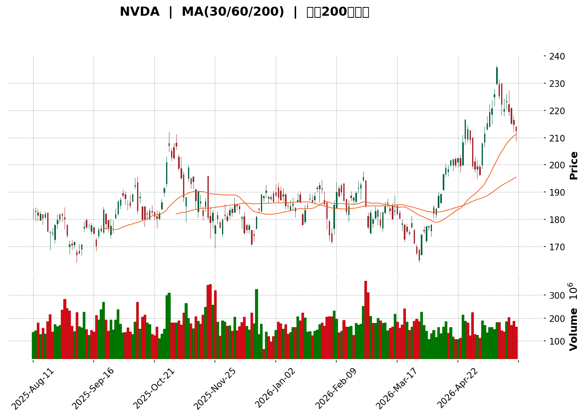
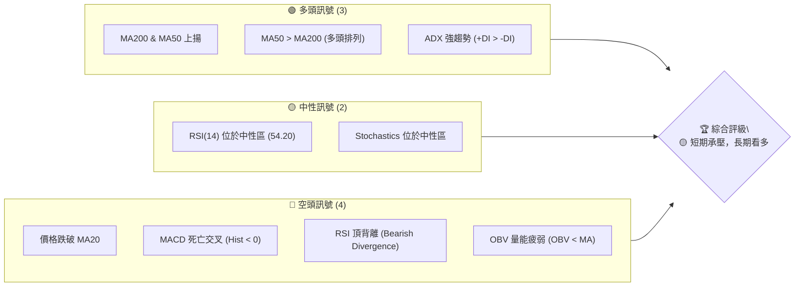
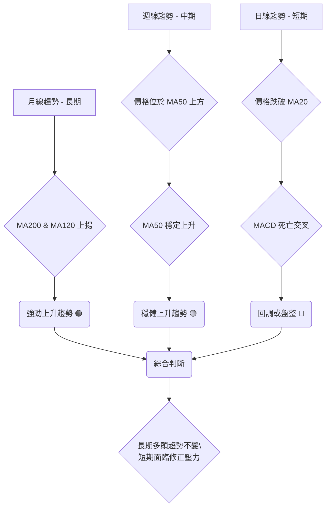
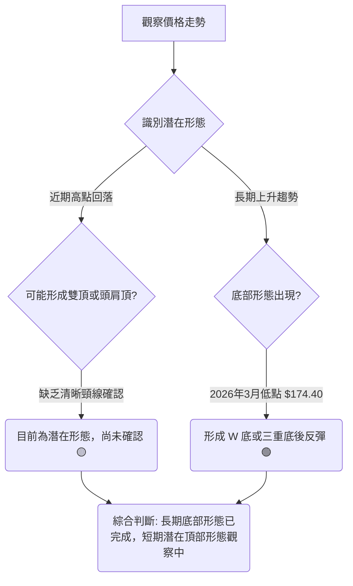

<details>
<summary>📊 靜態圖表 (點擊展開)</summary>

</details>

<html>
<head><meta charset="utf-8" /></head>
<body>
    <div>                        <script>window.PlotlyConfig = {MathJaxConfig: 'local'};</script>
        <script charset="utf-8" src="https://cdn.plot.ly/plotly-3.5.0.min.js" integrity="sha256-fHbNLP+GlIXN+efbQec78UkemUz3NJp7UmfGxC1tNxs=" crossorigin="anonymous"></script>                <div id="candlestick-chart" class="plotly-graph-div" style="height:500px; width:100%;"></div>            <script>                window.PLOTLYENV=window.PLOTLYENV || {};                                if (document.getElementById("candlestick-chart")) {                    Plotly.newPlot(                        "candlestick-chart",                        [{"close":{"dtype":"f8","bdata":"AAAAoPPAZkAAAABgJeRmQAAAAADqsWZAAAAAAKy\u002fZkAAAADAcI1mQAAAAABav2ZAAAAAwIvzZUAAAAAA3utlQAAAAOBt3mVAAAAA4Ls+ZkAAAADA9nhmQAAAAGCst2ZAAAAAADyyZkAAAABge4RmQAAAAGDVxGVAAAAAQA1YZUAAAADg7lJlQAAAACA1dGVAAAAAoMDfZEAAAABgBgllQAAAAGBpV2VAAAAAAJ4pZkAAAABg0SRmQAAAAICdOWZAAAAAIGA3ZkAAAADAi9tlQAAAAICuSGVAAAAAoA8HZkAAAACg0RRmQAAAAADg8mZAAAAAACJNZkAAAAAAax5mQAAAAMB0NWZAAAAAQHRFZkAAAADAj7pmQAAAAIDnUWdAAAAAwAVnZ0AAAAAA0ZtnQAAAAEAuc2dAAAAAwKAwZ0AAAABAoSBnQAAAAADbomdAAAAAQJARaEAAAAAAeuRmQAAAACCUiWdAAAAAwFOAZkAAAACg7XlmQAAAAABIuWZAAAAAgGXmZkAAAACg1tNmQAAAAMB7pGZAAAAAoFOIZkAAAADgesRmQAAAAECqR2dAAAAA4AHvZ0AAAAAAQSBpQAAAAICN4GlAAAAAYMRbaUAAAAAA+E5pQAAAAOBu22lAAAAAwGHVaEAAAADgCGZoQAAAAEDmgWdAAAAAoCOEZ0AAAACg5uBoQAAAAABxJGhAAAAAYOs4aEAAAAAA3VpnQAAAAKDFxGdAAAAAYItSZ0AAAAAA4qpmQAAAAAD8T2dAAAAAYNiTZkAAAAAgiFtmQAAAAID10GZAAAAAgJ05ZkAAAADAr4dmQAAAAMBgH2ZAAAAA4M58ZkAAAAAgFa5mQAAAAMA\u002fcmZAAAAAwNfrZkAAAADgzcxmQAAAAGBHMWdAAAAAQLgeZ0AAAABApPhmQAAAAEBynWZAAAAAQFbgZUAAAACA+QhmQAAAAIC7NmZAAAAAwMhdZUAAAACgLcRlQAAAAOBdn2ZAAAAAAMP1ZkAAAACAZKZnQAAAAIAxk2dAAAAAQKHQZ0AAAADAtoZnQAAAAID0cGdAAAAAYK1PZ0AAAACA35pnQAAAAKCDg2dAAAAAIFtnZ0AAAABAMaNnQAAAAKD1IGdAAAAAIDMbZ0AAAACAwh1nQAAAACCZOWdAAAAAoCnkZkAAAADARmFnQAAAAIAJR2dAAAAAgO5BZkAAAABA7OlmQAAAAECPGmdAAAAAYB11Z0AAAACgt05nQAAAAEBQkGdAAAAAAE\u002fwZ0AAAACA\u002fA9oQAAAAEDU42dAAAAA4DIzZ0AAAABAkYpmQAAAAEDHxWVAAAAAwNx7ZUAAAACAzCxnQAAAAGDzwGdAAAAAAPSQZ0AAAABgRcFnQAAAAKDBXWdAAAAAgJrZZkAAAABAuB5nQAAAAMAIf2dAAAAAgHl8Z0AAAABg6blnQAAAAMBE8WdAAAAAwN0aaEAAAADAlHFoQAAAAOAoHGdAAAAAAMYlZkAAAABAC89mQAAAAMBJgWZAAAAAgPbgZkAAAAAAkOpmQAAAAKDuOWZAAAAAwHvUZkAAAAAAUhhnQAAAAMD1QGdAAAAA4HrkZkAAAAAAAIhmQAAAAEAK52ZAAAAAgMK9ZkAAAADAzIxmQAAAAIDrUWZAAAAAYGaWZUAAAADgevRlQAAAAGBm5mVAAAAAgMJVZkAAAAAgrmdlQAAAAOCj8GRAAAAAoHClZEAAAADAzMxlQAAAAAAA+GVAAAAA4HosZkAAAADgejRmQAAAAEAzQ2ZAAAAAYI\u002fCZkAAAADAHv1mQAAAAAAplGdAAAAAgOupZ0AAAADgUZBoQAAAAADX22hAAAAAQDPLaEAAAACAwjVpQAAAAIDrQWlAAAAAACn8aEAAAAAAAFBpQAAAAOB69GhAAAAA4KMIakAAAAAghRNrQAAAAKBwpWpAAAAAAAAoakAAAACAPfJoQAAAAGBmzmhAAAAAIFzPaEAAAAAAAJBoQAAAAGCP+mlAAAAAAABwakAAAABgZuZqQAAAAIAUbmtAAAAAwPWYa0AAAABgjzpsQAAAACCud21AAAAAgD0qbEAAAACAPcprQAAAACCFk2tAAAAAQArva0AAAADgUXBrQAAAAGCP6mpAAAAAIIXbakAAAABAM5NqQA=="},"high":{"dtype":"f8","bdata":"1GCX8+b5ZkAtd+vzYA5nQFSaacIP\u002fmZArARho6rfZkAQHLsm1btmQL8Iw1sb3WZARJcTiQfPZkBm5etuEP9lQEw4weLbG2ZAneHyLu5RZkD2ID0kJ7xmQLoH44eCy2ZAPUfLqbXOZkA9+JIlDw5nQGscZzjaQ2ZAYEBeUj6LZUBbJ5IwNIxlQNuyUTqbemVADzXiww8gZUC963ikz11lQK0GUVNzXmVAwKMGlVNoZkDjOl60U4hmQMy5VIySUmZAlY63YpJaZkBR0+VkYC9mQCpNIaLKpWVAsTIA+pMiZkAUKyQb70FmQA0BlqfzEGdAhmMziczMZkD7iKv4U3hmQLDJgdCvh2ZA0QM+NAJ4ZkDqDCSRWv9mQCADpK6KamdAHJ7QsNGDZ0D\u002fObTO7eBnQOtCG+nZymdAStvhurNmZ0AKuK+CQaFnQLrdJq+IsmdAk9Y86+loaECJ5NoKJ3NoQGNL3CPawmdA0pQsVfMYZ0BPRHu3MBtnQFonlO1Q6GZAQ8lttY0CZ0A98aDSvyVnQD4\u002fjSij2GZAwkmBiG\u002ftZkCwMqMXUeBmQMa6OolhbmdAJS+PSlP\u002fZ0B47QcYFmRpQIAOyL5VhWpAG\u002fsBT2XEaUBgcjYyT\u002f5pQMKqyRwjampAhqf4v1J+aUB0bIcxulxpQP315Esls2hAt6LgOJSJZ0CRMByzYP1oQAQulNfAbGhArCbvvsp7aEDGNRNBaO1nQCVKox6m32dAt2RB91WfZ0APd+dn8xhnQIyBQAvcemdAXtC1rk9\u002faED34UeERRFnQDbhWAVb72ZAZPaucX5EZkBqHNk9etxmQDoYjVCmaGZAuwmLiPeIZkBSMLO4dzRnQH8El03CzWZAvN6xHlIQZ0BxiJ7gzBRnQD4o+qmsf2dAvizi6rc2Z0CBHgHfCS9nQNsStxPtqWZAQKFgauzZZkCTJlqOIU1mQGwzpwhfT2ZAd5s689oDZkBexbybfgRmQMdsyesVrmZAwbKdCs0EZ0Ck9mFyO6pnQMPM8v3KnGdARRHDCr8VaECiYqwi\u002fpdnQHTnd1tan2dAOXyIE5fRZ0BVW83wbB1oQNZJ1i7TM2hAoliLcBsFaEA0FGUfgutnQN\u002fLW6BFsWdAE\u002fPvl45KZ0A6Lo4IhGNnQGGo97oxg2dAJsEUimYOZ0BcMG1TErZnQELX0wHAzWdAFtN\u002fFtjLZkAgVUTW1itnQF0l9AgeRWdA+IfTJN+yZ0C5sGYzg6NnQJIt77erv2dAewfWAd4KaECFwd9RBi9oQKB4l+JXT2hA67r0S0XJZ0BKo5E+UUhnQHQgEbw\u002fcmZA9sv5Du8ZZkDNzG4LrV9nQAt8KOXINGhAULCgwAYPaEBlDrYz\u002fCdoQOf4A0svM2hAiz0E7KxvZ0BBdJjIeWRnQERCoZCCy2dA+u7iA2+NZ0ChfiMGO8pnQEs8w28QPmhAOR2V9004aEAHg+1U0bNoQFbdvnTxSGhAO1CPW5DSZkCBFc8QZ+5mQGzFd398nGZAx0angxQWZ0BgyFDumQFnQFasDM8A2GZAe0B7os3cZkBm5o7iwU1nQAAAAADXc2dAAAAAgBQeZ0AAAABA4UJnQAAAAAApnGdAAAAAwMwsZ0AAAAAAKexmQAAAACBcf2ZAAAAA4FFIZkAAAAAA10tmQAAAAEAKB2ZAAAAAQAqnZkAAAADgURBmQAAAAEAKX2VAAAAAYGYuZUAAAAAA19NlQAAAAADXK2ZAAAAAIK4vZkAAAACgRzlmQAAAACBcR2ZAAAAA4FEoZ0AAAABgjwJnQAAAAAAAwGdAAAAAwB61Z0AAAADgUZBoQAAAAMDMDGlAAAAAQDP7aEAAAABgZjZpQAAAAKBwRWlAAAAAAABYaUAAAAAAAFBpQAAAAGCPemlAAAAAYGZeakAAAABgjxprQAAAACBc12pAAAAAQAqXakAAAACgmUlqQAAAAAAAYGlAAAAAIFw3aUAAAAAgrgdpQAAAAOCjCGpAAAAAYGbGakAAAACgmTlrQAAAAKCZyWtAAAAAAAD4a0AAAABA4XpsQAAAAKBHkW1AAAAAAADwbEAAAAAAAMBsQAAAACBcD2xAAAAAAClEbEAAAADAzGxsQAAAAOBRoGtAAAAAgMJFa0AAAADgesRqQA=="},"hovertemplate":"\u003cb\u003e%{x|%Y-%m-%d}\u003c\u002fb\u003e\u003cbr\u003e\u958b: $%{open:.2f}\u003cbr\u003e\u9ad8: $%{high:.2f}\u003cbr\u003e\u4f4e: $%{low:.2f}\u003cbr\u003e\u6536: $%{close:.2f}\u003cextra\u003e\u003c\u002fextra\u003e","low":{"dtype":"f8","bdata":"ilXdlgqHZkCTHqAJxG1mQAqByAw\u002famZALw54\u002fMNtZkA7jstHVUBmQDOFEU\u002frkWZAlwxHNL\u002fuZUBSVtbbsxhlQFwx0tf+uGVAk2XNXX1lZUDED\u002f8oTRFmQBPLxgf4WGZAlZhdZz9iZkDjpj+eLgxmQLXP9wbho2VAOKm5mCbmZEDPMQI+QxtlQM\u002fz6y84LGVAxyWJQ16BZEA8jI5uT+pkQEV2NBnL1mRAHKkhaBvuZUANMMZ+vQ5mQEdPk5vHDWZAftcH6rTPZUCQlxgzjMtlQBjow1CHDGVAxbUo0xyeZUBYcUrXJOVlQA8XBUEb1mVAvSo13xkGZkBNba3pLuxlQPUAgFmNo2VAnh6KLiXdZUCTBChgm4lmQBJntta4rmZAQw\u002flYCf8ZkA5NxdfQoFnQC+Aw0OCK2dADfXXfOrpZkADAGKPWv9mQOJK38+fUGdAGZ\u002fHmz\u002fhZ0BBKpnf9cBmQGOwYR8RPmdAfw4FrMR1ZkBYAt4oqChmQJjXpDUCeGZAnk3FXl53ZkCYDoGxuLZmQGhzQtn3eGZArcpf6rIXZkBAENLhpXhmQGRd3tta72ZA9penABmNZ0Ck9TAzcvxnQN\u002f1HKg9mGlAoGrNlGksaUAsu7TAh0FpQIcuBZAysWlAqmYJbxC9aECKXePAHVRoQHnSVmeBS2dARfFA7n1cZkBm4examThoQEP6T4zt6GdAyWeRJn3jZ0Cy+EzVjfpmQKdbj\u002f\u002fskWZAA78brZcJZ0ACIL8pK3RmQExFNtLq2WZA++rtdZF6ZkBF8eL5Jp1lQGwjFXW9DmZAytv0EAExZUAtwRfRDUdmQIrxKTNhD2ZAOuwdXCa1ZUAt80AQXn9mQMhagA7kYmZAy2Pqo2h+ZkBf+kCKzpxmQD6bdeV7zGZALXBBO+zpZkBnpYnl9sBmQEPLYqmIE2ZAW+VqjYnTZUAIF\u002fIuqOBlQB6O5D9\u002f3GVAdUd4B6BJZUDKlHdH8XllQGRq0Q+TCmZAeEozWOLKZkDvQBOse9xmQGVXR4WOUmdA4uk+n6x\u002fZ0AaOlhGzDxnQG9bN6VvXWdALy8igVtPZ0Cay\u002fti\u002fodnQM7tgz96RGdAnVGpr+pZZ0BRjojBmFFnQBOe4fZm9mZAQ9UhJx\u002f1ZkCb8u65UuBmQHVNhHF77GZAhXPDaUmZZkASY6rRPEpnQD9LCdE8QmdAjpY+VDYzZkD5Cz2ufUxmQNcFWedw\u002fWZAr52GoOpZZ0DonnK2Wz9nQI8tPAAUNmdAXe6YHo26Z0D7kEf8mEFnQB8rbzy2rmdAifLPEtcbZ0Drv77yDQdmQPba2YLSfGVA13yI4KlgZUAv3qHL5dJlQFtOKtMU\u002fmZAL2+wj4ODZ0AiCEMxUJhnQLFQzTD\u002fT2dA20FiypCyZkD2shkRc2VmQLUYhgr\u002fV2dA\u002fHIQfsw0Z0ClkjQYwj1nQDtTdl87smdA\u002fByQqnlsZ0AI6QCp8ThoQMIzt8DrCWdAn6jd29oLZkA2q4R5LdRlQEZFeCMiHWZA5GodspuBZkDLNnAr2jtmQCSTjRHvGWZA1dzqpJ3xZUBtRBc5AcBmQAAAAGBmDmdAAAAAAAC4ZkAAAACAFH5mQAAAAMAerWZAAAAAgMK1ZkAAAABgj4pmQAAAAKBH+WVAAAAAQAp3ZUAAAADgUdhlQAAAACBcv2VAAAAAQDMbZkAAAADgemRlQAAAAOBR4GRAAAAA4KOIZEAAAABguN5kQAAAAAAA2GVAAAAAANdrZUAAAADgUfhlQAAAAMAetWVAAAAAoJmJZkAAAAAA15NmQAAAAKCZCWdAAAAAIK43Z0AAAADgo9hnQAAAACCud2hAAAAAgOt5aEAAAADgo+hoQAAAAEDhumhAAAAAAADgaEAAAAAAAOBoQAAAAEAKp2hAAAAAgOv5aEAAAAAAKexpQAAAAGBmBmpAAAAAYI\u002fyaUAAAABgZtZoQAAAAADXo2hAAAAAIK5XaEAAAADA9YBoQAAAACCF02hAAAAAAADQaUAAAADgepxqQAAAAOB6vGpAAAAAoHDdakAAAACAPbJrQAAAAKCZqWxAAAAAIK4HbEAAAAAA10trQAAAAMAePWtAAAAAAACQa0AAAACAwj1rQAAAAKCZ2WpAAAAAAACAakAAAADA9RhqQA=="},"name":"\u50f9\u683c","open":{"dtype":"f8","bdata":"nMh7w6HAZkDZXrVFv91mQIte+lje0mZApwdfNwt3ZkCGQbJtMbtmQDshlEs9kmZA5et5IcrMZkC7+yQwguRlQP9VTy1F2mVAEuyFMpqSZUDVar58QEpmQA+jD1T2gGZA5FiOW2S+ZkB3oH1dR5lmQB1JV6aSQmZA+RPYjxg\u002fZUDPNsHGAmFlQDHmw1tVUWVAh4AzIBEAZUBloduItfBkQL\u002fyFwb7IWVAB8hvcIoTZkC++W7+IHVmQH6ZhOsDOGZAks\u002funtL0ZUDhav7XYB9mQCP+CaPfk2VAPE9TqL++ZUCLzFqvBfhlQJbNL\u002fn76GVAFOnSkGa+ZkAw8\u002fgaAnhmQGRyy0K\u002fzmVAfwKbZNBEZkCzW9dGII1mQB6CgozrwWZA8RdqjAcnZ0B7I4m8iLJnQOxsgFZqpWdAAlU1KVkvZ0BHpxautEZnQCHD9aiVUWdAxmhPLq8GaECc0rjQoy9oQHhvljBhfmdAvq8VnP0XZ0CzF5ln8xhnQI8HTz+4xmZA\u002fhDKeyCFZkA+dDBPhONmQD4\u002fjSij2GZAwM0C+tejZkDtgLpQzoxmQBCkic07+mZAouFqOQO\u002fZ0Dw1soM7CBoQDQuqyeh\u002fmlAi9SVNxSkaUDN4DKwrM1pQFzFnivUAWpAA\u002fBeX0lfaUB4sags8ddoQLkxIgDAjGhATRTfiyYcZ0AEswqr1WJoQM\u002f8cjNvZGhAMUcQRlp2aECRm+e67eBnQPDFt7Lg2mZAC9EY8WI+Z0CokN8OhOtmQONznE6hGGdAN7w5GrZ9aEBeqqYgC6dmQGg+S8AMb2ZABD1OXoHcZUD3yY+khbNmQDnpCtGwX2ZAh9iOw7TXZUBE7+harrdmQJIg+4jsoWZAiFqhh4azZkB3RwRYKfxmQH5OOeop1GZA98YKPZkxZ0DlDOc4uB5nQHv9zcmliGZA4aqIzDSjZkBusc6kxT1mQKtbnsUDCGZABNGhNuUCZkDZzrVTqNBlQJkeXEoiFWZAfmDgBR\u002f9ZkDSbyEkud5mQJQpDCzBfWdAv8lBZRy9Z0BEcOsZZXZnQCn6kbBah2dAFT3Qg+mxZ0AcbpsPjbpnQI\u002frAeP892dAXSHJa0\u002fQZ0Bf50\u002fd6ZFnQGRlRlIxo2dApXoERz0iZ0BJeTsDueZmQB2w7futH2dAfT37uesJZ0DgN2JerU9nQK\u002fdS3w7omdAPwgEDXy8ZkB3knxESmFmQPqCOAquF2dAih9O06xvZ0DE+7rRy2RnQJK6WhFbZ2dAjNFcHE\u002foZ0Bc+9RkjOpnQDgs65Zj5mdAs5ugaxNmZ0CuxPmBW0dnQM+psMlobmZAbcWe5XTdZUB0aEgexhVmQOio+y8ACGdAaAiHHdTrZ0AgbaIPEQ5oQLcp1yygIGhASB9JDglvZ0C6BG9tr7dmQEwVkkisl2dAHitGn5hhZ0DmbrrQ6lFnQCETBPF37GdAplFbOlnvZ0AUhw0eEE5oQNTbA7dNSGhAqBSJs6+nZkAY+YlPBOBlQC+gKvFeT2ZAorz\u002fhsSNZkDm7C9WIKVmQD\u002fHn3qRemZAD1G89EAaZkBAmtnse8xmQAAAAMAePWdAAAAAoJkBZ0AAAACgcB1nQAAAAEAK32ZAAAAAgOshZ0AAAAAgXM9mQAAAAOBRQGZAAAAAAABAZkAAAADgUShmQAAAAGCP2mVAAAAAQDMjZkAAAACAPQJmQAAAAAAAQGVAAAAAwPUYZUAAAABACt9kQAAAAAAAAGZAAAAAgMKFZUAAAADAHiVmQAAAACBc92VAAAAAAAAQZ0AAAABA4bpmQAAAAIDrCWdAAAAAwPVAZ0AAAABA4dpnQAAAAKBHkWhAAAAAgMKtaEAAAADAzPxoQAAAACBc\u002f2hAAAAAAClEaUAAAAAgrh9pQAAAAGC4TmlAAAAAYLj+aEAAAADAzDRqQAAAACCuL2pAAAAAYGaWakAAAACAwj1qQAAAAMD1KGlAAAAAAADwaEAAAACgmeloQAAAAOB6\u002fGhAAAAAQOEKakAAAADA9aBqQAAAAKBHwWpAAAAAoJlRa0AAAACAwh1sQAAAAEAzu2xAAAAA4FG4bEAAAAAA17tsQAAAAADXc2tAAAAAgMLla0AAAACgR8lrQAAAAMDMnGtAAAAAoEcRa0AAAAAA18NqQA=="},"x":["2025-08-11T00:00:00-04:00","2025-08-12T00:00:00-04:00","2025-08-13T00:00:00-04:00","2025-08-14T00:00:00-04:00","2025-08-15T00:00:00-04:00","2025-08-18T00:00:00-04:00","2025-08-19T00:00:00-04:00","2025-08-20T00:00:00-04:00","2025-08-21T00:00:00-04:00","2025-08-22T00:00:00-04:00","2025-08-25T00:00:00-04:00","2025-08-26T00:00:00-04:00","2025-08-27T00:00:00-04:00","2025-08-28T00:00:00-04:00","2025-08-29T00:00:00-04:00","2025-09-02T00:00:00-04:00","2025-09-03T00:00:00-04:00","2025-09-04T00:00:00-04:00","2025-09-05T00:00:00-04:00","2025-09-08T00:00:00-04:00","2025-09-09T00:00:00-04:00","2025-09-10T00:00:00-04:00","2025-09-11T00:00:00-04:00","2025-09-12T00:00:00-04:00","2025-09-15T00:00:00-04:00","2025-09-16T00:00:00-04:00","2025-09-17T00:00:00-04:00","2025-09-18T00:00:00-04:00","2025-09-19T00:00:00-04:00","2025-09-22T00:00:00-04:00","2025-09-23T00:00:00-04:00","2025-09-24T00:00:00-04:00","2025-09-25T00:00:00-04:00","2025-09-26T00:00:00-04:00","2025-09-29T00:00:00-04:00","2025-09-30T00:00:00-04:00","2025-10-01T00:00:00-04:00","2025-10-02T00:00:00-04:00","2025-10-03T00:00:00-04:00","2025-10-06T00:00:00-04:00","2025-10-07T00:00:00-04:00","2025-10-08T00:00:00-04:00","2025-10-09T00:00:00-04:00","2025-10-10T00:00:00-04:00","2025-10-13T00:00:00-04:00","2025-10-14T00:00:00-04:00","2025-10-15T00:00:00-04:00","2025-10-16T00:00:00-04:00","2025-10-17T00:00:00-04:00","2025-10-20T00:00:00-04:00","2025-10-21T00:00:00-04:00","2025-10-22T00:00:00-04:00","2025-10-23T00:00:00-04:00","2025-10-24T00:00:00-04:00","2025-10-27T00:00:00-04:00","2025-10-28T00:00:00-04:00","2025-10-29T00:00:00-04:00","2025-10-30T00:00:00-04:00","2025-10-31T00:00:00-04:00","2025-11-03T00:00:00-05:00","2025-11-04T00:00:00-05:00","2025-11-05T00:00:00-05:00","2025-11-06T00:00:00-05:00","2025-11-07T00:00:00-05:00","2025-11-10T00:00:00-05:00","2025-11-11T00:00:00-05:00","2025-11-12T00:00:00-05:00","2025-11-13T00:00:00-05:00","2025-11-14T00:00:00-05:00","2025-11-17T00:00:00-05:00","2025-11-18T00:00:00-05:00","2025-11-19T00:00:00-05:00","2025-11-20T00:00:00-05:00","2025-11-21T00:00:00-05:00","2025-11-24T00:00:00-05:00","2025-11-25T00:00:00-05:00","2025-11-26T00:00:00-05:00","2025-11-28T00:00:00-05:00","2025-12-01T00:00:00-05:00","2025-12-02T00:00:00-05:00","2025-12-03T00:00:00-05:00","2025-12-04T00:00:00-05:00","2025-12-05T00:00:00-05:00","2025-12-08T00:00:00-05:00","2025-12-09T00:00:00-05:00","2025-12-10T00:00:00-05:00","2025-12-11T00:00:00-05:00","2025-12-12T00:00:00-05:00","2025-12-15T00:00:00-05:00","2025-12-16T00:00:00-05:00","2025-12-17T00:00:00-05:00","2025-12-18T00:00:00-05:00","2025-12-19T00:00:00-05:00","2025-12-22T00:00:00-05:00","2025-12-23T00:00:00-05:00","2025-12-24T00:00:00-05:00","2025-12-26T00:00:00-05:00","2025-12-29T00:00:00-05:00","2025-12-30T00:00:00-05:00","2025-12-31T00:00:00-05:00","2026-01-02T00:00:00-05:00","2026-01-05T00:00:00-05:00","2026-01-06T00:00:00-05:00","2026-01-07T00:00:00-05:00","2026-01-08T00:00:00-05:00","2026-01-09T00:00:00-05:00","2026-01-12T00:00:00-05:00","2026-01-13T00:00:00-05:00","2026-01-14T00:00:00-05:00","2026-01-15T00:00:00-05:00","2026-01-16T00:00:00-05:00","2026-01-20T00:00:00-05:00","2026-01-21T00:00:00-05:00","2026-01-22T00:00:00-05:00","2026-01-23T00:00:00-05:00","2026-01-26T00:00:00-05:00","2026-01-27T00:00:00-05:00","2026-01-28T00:00:00-05:00","2026-01-29T00:00:00-05:00","2026-01-30T00:00:00-05:00","2026-02-02T00:00:00-05:00","2026-02-03T00:00:00-05:00","2026-02-04T00:00:00-05:00","2026-02-05T00:00:00-05:00","2026-02-06T00:00:00-05:00","2026-02-09T00:00:00-05:00","2026-02-10T00:00:00-05:00","2026-02-11T00:00:00-05:00","2026-02-12T00:00:00-05:00","2026-02-13T00:00:00-05:00","2026-02-17T00:00:00-05:00","2026-02-18T00:00:00-05:00","2026-02-19T00:00:00-05:00","2026-02-20T00:00:00-05:00","2026-02-23T00:00:00-05:00","2026-02-24T00:00:00-05:00","2026-02-25T00:00:00-05:00","2026-02-26T00:00:00-05:00","2026-02-27T00:00:00-05:00","2026-03-02T00:00:00-05:00","2026-03-03T00:00:00-05:00","2026-03-04T00:00:00-05:00","2026-03-05T00:00:00-05:00","2026-03-06T00:00:00-05:00","2026-03-09T00:00:00-04:00","2026-03-10T00:00:00-04:00","2026-03-11T00:00:00-04:00","2026-03-12T00:00:00-04:00","2026-03-13T00:00:00-04:00","2026-03-16T00:00:00-04:00","2026-03-17T00:00:00-04:00","2026-03-18T00:00:00-04:00","2026-03-19T00:00:00-04:00","2026-03-20T00:00:00-04:00","2026-03-23T00:00:00-04:00","2026-03-24T00:00:00-04:00","2026-03-25T00:00:00-04:00","2026-03-26T00:00:00-04:00","2026-03-27T00:00:00-04:00","2026-03-30T00:00:00-04:00","2026-03-31T00:00:00-04:00","2026-04-01T00:00:00-04:00","2026-04-02T00:00:00-04:00","2026-04-06T00:00:00-04:00","2026-04-07T00:00:00-04:00","2026-04-08T00:00:00-04:00","2026-04-09T00:00:00-04:00","2026-04-10T00:00:00-04:00","2026-04-13T00:00:00-04:00","2026-04-14T00:00:00-04:00","2026-04-15T00:00:00-04:00","2026-04-16T00:00:00-04:00","2026-04-17T00:00:00-04:00","2026-04-20T00:00:00-04:00","2026-04-21T00:00:00-04:00","2026-04-22T00:00:00-04:00","2026-04-23T00:00:00-04:00","2026-04-24T00:00:00-04:00","2026-04-27T00:00:00-04:00","2026-04-28T00:00:00-04:00","2026-04-29T00:00:00-04:00","2026-04-30T00:00:00-04:00","2026-05-01T00:00:00-04:00","2026-05-04T00:00:00-04:00","2026-05-05T00:00:00-04:00","2026-05-06T00:00:00-04:00","2026-05-07T00:00:00-04:00","2026-05-08T00:00:00-04:00","2026-05-11T00:00:00-04:00","2026-05-12T00:00:00-04:00","2026-05-13T00:00:00-04:00","2026-05-14T00:00:00-04:00","2026-05-15T00:00:00-04:00","2026-05-18T00:00:00-04:00","2026-05-19T00:00:00-04:00","2026-05-20T00:00:00-04:00","2026-05-21T00:00:00-04:00","2026-05-22T00:00:00-04:00","2026-05-26T00:00:00-04:00","2026-05-27T00:00:00-04:00"],"type":"candlestick"},{"hovertemplate":"MA30: $%{y:.2f}\u003cextra\u003e\u003c\u002fextra\u003e","line":{"color":"#2196F3","dash":"dash","width":2},"mode":"lines","name":"MA30","x":["2025-08-11T00:00:00-04:00","2025-08-12T00:00:00-04:00","2025-08-13T00:00:00-04:00","2025-08-14T00:00:00-04:00","2025-08-15T00:00:00-04:00","2025-08-18T00:00:00-04:00","2025-08-19T00:00:00-04:00","2025-08-20T00:00:00-04:00","2025-08-21T00:00:00-04:00","2025-08-22T00:00:00-04:00","2025-08-25T00:00:00-04:00","2025-08-26T00:00:00-04:00","2025-08-27T00:00:00-04:00","2025-08-28T00:00:00-04:00","2025-08-29T00:00:00-04:00","2025-09-02T00:00:00-04:00","2025-09-03T00:00:00-04:00","2025-09-04T00:00:00-04:00","2025-09-05T00:00:00-04:00","2025-09-08T00:00:00-04:00","2025-09-09T00:00:00-04:00","2025-09-10T00:00:00-04:00","2025-09-11T00:00:00-04:00","2025-09-12T00:00:00-04:00","2025-09-15T00:00:00-04:00","2025-09-16T00:00:00-04:00","2025-09-17T00:00:00-04:00","2025-09-18T00:00:00-04:00","2025-09-19T00:00:00-04:00","2025-09-22T00:00:00-04:00","2025-09-23T00:00:00-04:00","2025-09-24T00:00:00-04:00","2025-09-25T00:00:00-04:00","2025-09-26T00:00:00-04:00","2025-09-29T00:00:00-04:00","2025-09-30T00:00:00-04:00","2025-10-01T00:00:00-04:00","2025-10-02T00:00:00-04:00","2025-10-03T00:00:00-04:00","2025-10-06T00:00:00-04:00","2025-10-07T00:00:00-04:00","2025-10-08T00:00:00-04:00","2025-10-09T00:00:00-04:00","2025-10-10T00:00:00-04:00","2025-10-13T00:00:00-04:00","2025-10-14T00:00:00-04:00","2025-10-15T00:00:00-04:00","2025-10-16T00:00:00-04:00","2025-10-17T00:00:00-04:00","2025-10-20T00:00:00-04:00","2025-10-21T00:00:00-04:00","2025-10-22T00:00:00-04:00","2025-10-23T00:00:00-04:00","2025-10-24T00:00:00-04:00","2025-10-27T00:00:00-04:00","2025-10-28T00:00:00-04:00","2025-10-29T00:00:00-04:00","2025-10-30T00:00:00-04:00","2025-10-31T00:00:00-04:00","2025-11-03T00:00:00-05:00","2025-11-04T00:00:00-05:00","2025-11-05T00:00:00-05:00","2025-11-06T00:00:00-05:00","2025-11-07T00:00:00-05:00","2025-11-10T00:00:00-05:00","2025-11-11T00:00:00-05:00","2025-11-12T00:00:00-05:00","2025-11-13T00:00:00-05:00","2025-11-14T00:00:00-05:00","2025-11-17T00:00:00-05:00","2025-11-18T00:00:00-05:00","2025-11-19T00:00:00-05:00","2025-11-20T00:00:00-05:00","2025-11-21T00:00:00-05:00","2025-11-24T00:00:00-05:00","2025-11-25T00:00:00-05:00","2025-11-26T00:00:00-05:00","2025-11-28T00:00:00-05:00","2025-12-01T00:00:00-05:00","2025-12-02T00:00:00-05:00","2025-12-03T00:00:00-05:00","2025-12-04T00:00:00-05:00","2025-12-05T00:00:00-05:00","2025-12-08T00:00:00-05:00","2025-12-09T00:00:00-05:00","2025-12-10T00:00:00-05:00","2025-12-11T00:00:00-05:00","2025-12-12T00:00:00-05:00","2025-12-15T00:00:00-05:00","2025-12-16T00:00:00-05:00","2025-12-17T00:00:00-05:00","2025-12-18T00:00:00-05:00","2025-12-19T00:00:00-05:00","2025-12-22T00:00:00-05:00","2025-12-23T00:00:00-05:00","2025-12-24T00:00:00-05:00","2025-12-26T00:00:00-05:00","2025-12-29T00:00:00-05:00","2025-12-30T00:00:00-05:00","2025-12-31T00:00:00-05:00","2026-01-02T00:00:00-05:00","2026-01-05T00:00:00-05:00","2026-01-06T00:00:00-05:00","2026-01-07T00:00:00-05:00","2026-01-08T00:00:00-05:00","2026-01-09T00:00:00-05:00","2026-01-12T00:00:00-05:00","2026-01-13T00:00:00-05:00","2026-01-14T00:00:00-05:00","2026-01-15T00:00:00-05:00","2026-01-16T00:00:00-05:00","2026-01-20T00:00:00-05:00","2026-01-21T00:00:00-05:00","2026-01-22T00:00:00-05:00","2026-01-23T00:00:00-05:00","2026-01-26T00:00:00-05:00","2026-01-27T00:00:00-05:00","2026-01-28T00:00:00-05:00","2026-01-29T00:00:00-05:00","2026-01-30T00:00:00-05:00","2026-02-02T00:00:00-05:00","2026-02-03T00:00:00-05:00","2026-02-04T00:00:00-05:00","2026-02-05T00:00:00-05:00","2026-02-06T00:00:00-05:00","2026-02-09T00:00:00-05:00","2026-02-10T00:00:00-05:00","2026-02-11T00:00:00-05:00","2026-02-12T00:00:00-05:00","2026-02-13T00:00:00-05:00","2026-02-17T00:00:00-05:00","2026-02-18T00:00:00-05:00","2026-02-19T00:00:00-05:00","2026-02-20T00:00:00-05:00","2026-02-23T00:00:00-05:00","2026-02-24T00:00:00-05:00","2026-02-25T00:00:00-05:00","2026-02-26T00:00:00-05:00","2026-02-27T00:00:00-05:00","2026-03-02T00:00:00-05:00","2026-03-03T00:00:00-05:00","2026-03-04T00:00:00-05:00","2026-03-05T00:00:00-05:00","2026-03-06T00:00:00-05:00","2026-03-09T00:00:00-04:00","2026-03-10T00:00:00-04:00","2026-03-11T00:00:00-04:00","2026-03-12T00:00:00-04:00","2026-03-13T00:00:00-04:00","2026-03-16T00:00:00-04:00","2026-03-17T00:00:00-04:00","2026-03-18T00:00:00-04:00","2026-03-19T00:00:00-04:00","2026-03-20T00:00:00-04:00","2026-03-23T00:00:00-04:00","2026-03-24T00:00:00-04:00","2026-03-25T00:00:00-04:00","2026-03-26T00:00:00-04:00","2026-03-27T00:00:00-04:00","2026-03-30T00:00:00-04:00","2026-03-31T00:00:00-04:00","2026-04-01T00:00:00-04:00","2026-04-02T00:00:00-04:00","2026-04-06T00:00:00-04:00","2026-04-07T00:00:00-04:00","2026-04-08T00:00:00-04:00","2026-04-09T00:00:00-04:00","2026-04-10T00:00:00-04:00","2026-04-13T00:00:00-04:00","2026-04-14T00:00:00-04:00","2026-04-15T00:00:00-04:00","2026-04-16T00:00:00-04:00","2026-04-17T00:00:00-04:00","2026-04-20T00:00:00-04:00","2026-04-21T00:00:00-04:00","2026-04-22T00:00:00-04:00","2026-04-23T00:00:00-04:00","2026-04-24T00:00:00-04:00","2026-04-27T00:00:00-04:00","2026-04-28T00:00:00-04:00","2026-04-29T00:00:00-04:00","2026-04-30T00:00:00-04:00","2026-05-01T00:00:00-04:00","2026-05-04T00:00:00-04:00","2026-05-05T00:00:00-04:00","2026-05-06T00:00:00-04:00","2026-05-07T00:00:00-04:00","2026-05-08T00:00:00-04:00","2026-05-11T00:00:00-04:00","2026-05-12T00:00:00-04:00","2026-05-13T00:00:00-04:00","2026-05-14T00:00:00-04:00","2026-05-15T00:00:00-04:00","2026-05-18T00:00:00-04:00","2026-05-19T00:00:00-04:00","2026-05-20T00:00:00-04:00","2026-05-21T00:00:00-04:00","2026-05-22T00:00:00-04:00","2026-05-26T00:00:00-04:00","2026-05-27T00:00:00-04:00"],"y":{"dtype":"f8","bdata":"AAAAAAAA+H8AAAAAAAD4fwAAAAAAAPh\u002fAAAAAAAA+H8AAAAAAAD4fwAAAAAAAPh\u002fAAAAAAAA+H8AAAAAAAD4fwAAAAAAAPh\u002fAAAAAAAA+H8AAAAAAAD4fwAAAAAAAPh\u002fAAAAAAAA+H8AAAAAAAD4fwAAAAAAAPh\u002fAAAAAAAA+H8AAAAAAAD4fwAAAAAAAPh\u002fAAAAAAAA+H8AAAAAAAD4fwAAAAAAAPh\u002fAAAAAAAA+H8AAAAAAAD4fwAAAAAAAPh\u002fAAAAAAAA+H8AAAAAAAD4fwAAAAAAAPh\u002fAAAAAAAA+H8AAAAAAAD4f1VVVbV3GGZAMzMzY5sUZkC8u7sbBA5mQBERERHeCWZAREREJMsFZkDNzMwsTAdmQCIiIsIuDGZAERERsZAYZkCJiIio9iZmQJqZmYl0NGZAMzMzs4Q8ZkAzMzNzG0JmQGZmZlbySWZAiYiIWKhVZkAAAACA21hmQM3MzOzyZ2ZAREREJNNxZkDv7u5uqHtmQFVVVWV+hmZAiYiIKMiXZkDe3d1dE6dmQERERJQtsmZARERExFW1ZkB3d3c3qLpmQERERKSow2ZAq6qqKlDSZkAzMzMTNO5mQM3MzCxmFWdAmpmZmdIxZ0CamZlpXE1nQJqZmfktZmdAMzMzs8l7Z0BVVVXlPY9nQO\u002fu7r5SmmdAERERMfKkZ0C8u7trSrdnQBEREQFPvmdAAAAAIE7FZ0C8u7vbI8NnQKuqqhrcxWdAZmZmhv3GZ0AAAADAEMNnQFVVVZVNwGdAERERQZSzZ0CJiIioA69nQM3MzDzcqGdARERE1ICmZ0C8u7s79qZnQM3MzOzUoWdAd3d350+eZ0CJiIi4DZ1nQN7d3Q1hm2dAIiIiQrKeZ0CrqqpK+Z5nQDMzM0M6nmdAAAAA4EiXZ0CJiIjI5YRnQKuqqooPaWdAvLu7q1hLZ0CamZnJaS9nQN7d3b1SEGdAMzMzk7zyZkBVVVVVRtxmQBEREUG51GZAzczMTPrPZkDv7u5+fsVmQLy7uwunwGZAvLu7Gy29ZkDNzMxMo75mQAAAABDYu2ZAiYiImL+7ZkAzMzODv8NmQLy7uzt3xWZAAAAAIITMZkCamZkpcNdmQFVVVdUa2mZAIiIi0p\u002fhZkAiIiJyoOZmQJqZmbkI8GZA7+7urnrzZkDe3d3Nc\u002flmQImIiJiLAGdAAAAAsOH6ZkCrqqoq2vtmQLy7u0sY+2ZAiYiIiPn9ZkC8u7sL2ABnQDMzM4PwCGdA7+7u3okaZ0BVVVXF1itnQFVVVWUkOmdAEREREcpJZ0DNzMz8ZlBnQLy7uzsmSWdA3t3dfY08Z0BERETkfzhnQKuqqloGOmdAq6qq+uY3Z0Crqqqq2jlnQGZmZtY2OWdAZmZmRkc1Z0BVVVXVIzFnQKuqqpr9MGdAERER0bExZ0AAAACwczJnQCIiIkJlOWdAIiIi8upBZ0ARERHBPk1nQLy7u4tDTGdARERE5OpFZ0CrqqoKC0FnQFVVVZVzOmdAZmZmpsA\u002fZ0C8u7sbxj9nQJqZmUlJOGdAERERke4yZ0ARERFhHjFnQKuqqjp5LmdAIiIiwoslZ0Dv7u7OehhnQM3MzKwNEGdAd3d3hyMMZ0BERESUNgxnQERERHTiEGdAiYiI6MQRZ0CamZnJWwdnQJqZmUmK92ZAMzMzowjtZkAAAAAQ+9hmQO\u002fu7t5GxGZAzczMrHixZkB3d3cXNaZmQEREREQsmWZAzczMHPmNZkBmZmb2\u002fYBmQLy7uwuocmZAd3d39y1nZkAiIiKiw1pmQDMzM6PDXmZAIiIi0rNrZkBERESkrXpmQKuqqmrDjmZAZmZmxhqfZkBmZmaGrbJmQJqZmUmLzGZA3t3d7e7eZkAREREh2\u002fFmQBEREZFfAGdAvLu7uy0bZ0AAAABw9kFnQImIiMjoYWdAd3d39wx\u002fZ0CJiIiof5NnQERERPS2qGdAzczMnDbEZ0CJiIjIdtpnQDMzM\u002fNE\u002fWdAAAAAAEcgaEAiIiICK09oQBEREaGMhmhA3t3d3d3BaEAAAACwufhoQFVVVfW2OGlAvLu7C9draUCrqqqqf5tpQKuqqrrXyGlAVVVV9f30aUAREREh9xpqQCIiIgJyN2pAzczM3LJSakAiIiKC3GNqQA=="},"type":"scatter"},{"hovertemplate":"MA60: $%{y:.2f}\u003cextra\u003e\u003c\u002fextra\u003e","line":{"color":"#9C27B0","dash":"dash","width":2},"mode":"lines","name":"MA60","x":["2025-08-11T00:00:00-04:00","2025-08-12T00:00:00-04:00","2025-08-13T00:00:00-04:00","2025-08-14T00:00:00-04:00","2025-08-15T00:00:00-04:00","2025-08-18T00:00:00-04:00","2025-08-19T00:00:00-04:00","2025-08-20T00:00:00-04:00","2025-08-21T00:00:00-04:00","2025-08-22T00:00:00-04:00","2025-08-25T00:00:00-04:00","2025-08-26T00:00:00-04:00","2025-08-27T00:00:00-04:00","2025-08-28T00:00:00-04:00","2025-08-29T00:00:00-04:00","2025-09-02T00:00:00-04:00","2025-09-03T00:00:00-04:00","2025-09-04T00:00:00-04:00","2025-09-05T00:00:00-04:00","2025-09-08T00:00:00-04:00","2025-09-09T00:00:00-04:00","2025-09-10T00:00:00-04:00","2025-09-11T00:00:00-04:00","2025-09-12T00:00:00-04:00","2025-09-15T00:00:00-04:00","2025-09-16T00:00:00-04:00","2025-09-17T00:00:00-04:00","2025-09-18T00:00:00-04:00","2025-09-19T00:00:00-04:00","2025-09-22T00:00:00-04:00","2025-09-23T00:00:00-04:00","2025-09-24T00:00:00-04:00","2025-09-25T00:00:00-04:00","2025-09-26T00:00:00-04:00","2025-09-29T00:00:00-04:00","2025-09-30T00:00:00-04:00","2025-10-01T00:00:00-04:00","2025-10-02T00:00:00-04:00","2025-10-03T00:00:00-04:00","2025-10-06T00:00:00-04:00","2025-10-07T00:00:00-04:00","2025-10-08T00:00:00-04:00","2025-10-09T00:00:00-04:00","2025-10-10T00:00:00-04:00","2025-10-13T00:00:00-04:00","2025-10-14T00:00:00-04:00","2025-10-15T00:00:00-04:00","2025-10-16T00:00:00-04:00","2025-10-17T00:00:00-04:00","2025-10-20T00:00:00-04:00","2025-10-21T00:00:00-04:00","2025-10-22T00:00:00-04:00","2025-10-23T00:00:00-04:00","2025-10-24T00:00:00-04:00","2025-10-27T00:00:00-04:00","2025-10-28T00:00:00-04:00","2025-10-29T00:00:00-04:00","2025-10-30T00:00:00-04:00","2025-10-31T00:00:00-04:00","2025-11-03T00:00:00-05:00","2025-11-04T00:00:00-05:00","2025-11-05T00:00:00-05:00","2025-11-06T00:00:00-05:00","2025-11-07T00:00:00-05:00","2025-11-10T00:00:00-05:00","2025-11-11T00:00:00-05:00","2025-11-12T00:00:00-05:00","2025-11-13T00:00:00-05:00","2025-11-14T00:00:00-05:00","2025-11-17T00:00:00-05:00","2025-11-18T00:00:00-05:00","2025-11-19T00:00:00-05:00","2025-11-20T00:00:00-05:00","2025-11-21T00:00:00-05:00","2025-11-24T00:00:00-05:00","2025-11-25T00:00:00-05:00","2025-11-26T00:00:00-05:00","2025-11-28T00:00:00-05:00","2025-12-01T00:00:00-05:00","2025-12-02T00:00:00-05:00","2025-12-03T00:00:00-05:00","2025-12-04T00:00:00-05:00","2025-12-05T00:00:00-05:00","2025-12-08T00:00:00-05:00","2025-12-09T00:00:00-05:00","2025-12-10T00:00:00-05:00","2025-12-11T00:00:00-05:00","2025-12-12T00:00:00-05:00","2025-12-15T00:00:00-05:00","2025-12-16T00:00:00-05:00","2025-12-17T00:00:00-05:00","2025-12-18T00:00:00-05:00","2025-12-19T00:00:00-05:00","2025-12-22T00:00:00-05:00","2025-12-23T00:00:00-05:00","2025-12-24T00:00:00-05:00","2025-12-26T00:00:00-05:00","2025-12-29T00:00:00-05:00","2025-12-30T00:00:00-05:00","2025-12-31T00:00:00-05:00","2026-01-02T00:00:00-05:00","2026-01-05T00:00:00-05:00","2026-01-06T00:00:00-05:00","2026-01-07T00:00:00-05:00","2026-01-08T00:00:00-05:00","2026-01-09T00:00:00-05:00","2026-01-12T00:00:00-05:00","2026-01-13T00:00:00-05:00","2026-01-14T00:00:00-05:00","2026-01-15T00:00:00-05:00","2026-01-16T00:00:00-05:00","2026-01-20T00:00:00-05:00","2026-01-21T00:00:00-05:00","2026-01-22T00:00:00-05:00","2026-01-23T00:00:00-05:00","2026-01-26T00:00:00-05:00","2026-01-27T00:00:00-05:00","2026-01-28T00:00:00-05:00","2026-01-29T00:00:00-05:00","2026-01-30T00:00:00-05:00","2026-02-02T00:00:00-05:00","2026-02-03T00:00:00-05:00","2026-02-04T00:00:00-05:00","2026-02-05T00:00:00-05:00","2026-02-06T00:00:00-05:00","2026-02-09T00:00:00-05:00","2026-02-10T00:00:00-05:00","2026-02-11T00:00:00-05:00","2026-02-12T00:00:00-05:00","2026-02-13T00:00:00-05:00","2026-02-17T00:00:00-05:00","2026-02-18T00:00:00-05:00","2026-02-19T00:00:00-05:00","2026-02-20T00:00:00-05:00","2026-02-23T00:00:00-05:00","2026-02-24T00:00:00-05:00","2026-02-25T00:00:00-05:00","2026-02-26T00:00:00-05:00","2026-02-27T00:00:00-05:00","2026-03-02T00:00:00-05:00","2026-03-03T00:00:00-05:00","2026-03-04T00:00:00-05:00","2026-03-05T00:00:00-05:00","2026-03-06T00:00:00-05:00","2026-03-09T00:00:00-04:00","2026-03-10T00:00:00-04:00","2026-03-11T00:00:00-04:00","2026-03-12T00:00:00-04:00","2026-03-13T00:00:00-04:00","2026-03-16T00:00:00-04:00","2026-03-17T00:00:00-04:00","2026-03-18T00:00:00-04:00","2026-03-19T00:00:00-04:00","2026-03-20T00:00:00-04:00","2026-03-23T00:00:00-04:00","2026-03-24T00:00:00-04:00","2026-03-25T00:00:00-04:00","2026-03-26T00:00:00-04:00","2026-03-27T00:00:00-04:00","2026-03-30T00:00:00-04:00","2026-03-31T00:00:00-04:00","2026-04-01T00:00:00-04:00","2026-04-02T00:00:00-04:00","2026-04-06T00:00:00-04:00","2026-04-07T00:00:00-04:00","2026-04-08T00:00:00-04:00","2026-04-09T00:00:00-04:00","2026-04-10T00:00:00-04:00","2026-04-13T00:00:00-04:00","2026-04-14T00:00:00-04:00","2026-04-15T00:00:00-04:00","2026-04-16T00:00:00-04:00","2026-04-17T00:00:00-04:00","2026-04-20T00:00:00-04:00","2026-04-21T00:00:00-04:00","2026-04-22T00:00:00-04:00","2026-04-23T00:00:00-04:00","2026-04-24T00:00:00-04:00","2026-04-27T00:00:00-04:00","2026-04-28T00:00:00-04:00","2026-04-29T00:00:00-04:00","2026-04-30T00:00:00-04:00","2026-05-01T00:00:00-04:00","2026-05-04T00:00:00-04:00","2026-05-05T00:00:00-04:00","2026-05-06T00:00:00-04:00","2026-05-07T00:00:00-04:00","2026-05-08T00:00:00-04:00","2026-05-11T00:00:00-04:00","2026-05-12T00:00:00-04:00","2026-05-13T00:00:00-04:00","2026-05-14T00:00:00-04:00","2026-05-15T00:00:00-04:00","2026-05-18T00:00:00-04:00","2026-05-19T00:00:00-04:00","2026-05-20T00:00:00-04:00","2026-05-21T00:00:00-04:00","2026-05-22T00:00:00-04:00","2026-05-26T00:00:00-04:00","2026-05-27T00:00:00-04:00"],"y":{"dtype":"f8","bdata":"AAAAAAAA+H8AAAAAAAD4fwAAAAAAAPh\u002fAAAAAAAA+H8AAAAAAAD4fwAAAAAAAPh\u002fAAAAAAAA+H8AAAAAAAD4fwAAAAAAAPh\u002fAAAAAAAA+H8AAAAAAAD4fwAAAAAAAPh\u002fAAAAAAAA+H8AAAAAAAD4fwAAAAAAAPh\u002fAAAAAAAA+H8AAAAAAAD4fwAAAAAAAPh\u002fAAAAAAAA+H8AAAAAAAD4fwAAAAAAAPh\u002fAAAAAAAA+H8AAAAAAAD4fwAAAAAAAPh\u002fAAAAAAAA+H8AAAAAAAD4fwAAAAAAAPh\u002fAAAAAAAA+H8AAAAAAAD4fwAAAAAAAPh\u002fAAAAAAAA+H8AAAAAAAD4fwAAAAAAAPh\u002fAAAAAAAA+H8AAAAAAAD4fwAAAAAAAPh\u002fAAAAAAAA+H8AAAAAAAD4fwAAAAAAAPh\u002fAAAAAAAA+H8AAAAAAAD4fwAAAAAAAPh\u002fAAAAAAAA+H8AAAAAAAD4fwAAAAAAAPh\u002fAAAAAAAA+H8AAAAAAAD4fwAAAAAAAPh\u002fAAAAAAAA+H8AAAAAAAD4fwAAAAAAAPh\u002fAAAAAAAA+H8AAAAAAAD4fwAAAAAAAPh\u002fAAAAAAAA+H8AAAAAAAD4fwAAAAAAAPh\u002fAAAAAAAA+H8AAAAAAAD4f3d3d9dSv2ZAMzMzizLIZkCJiIgAoc5mQAAAAGgY0mZAq6qqql7VZkBERERMS99mQJqZmeE+5WZAiYiIaO\u002fuZkAiIiJCDfVmQCIiIlIo\u002fWZAzczMHMEBZ0CamZkZlgJnQN7d3fUfBWdAzczMTJ4EZ0BERESU7wNnQM3MzJRnCGdARERE\u002fCkMZ0BVVVVVTxFnQBEREakpFGdAAAAACAwbZ0AzMzOLECJnQBEREVHHJmdAMzMzAwQqZ0ARERHB0CxnQLy7u3PxMGdAVVVVhcw0Z0De3d3tjDlnQLy7u9s6P2dAq6qqopU+Z0CamZkZYz5nQLy7u1tAO2dAMzMzI0M3Z0BVVVUdwjVnQAAAAACGN2dA7+7uPnY6Z0BVVVV1ZD5nQGZmZgZ7P2dA3t3dnT1BZ0BERESU40BnQFVVVRXaQGdAd3d3j15BZ0CamZkhaENnQImIiGjiQmdAiYiIMAxAZ0ARERHpOUNnQBEREYl7QWdAMzMzUxBEZ0Dv7u5Wy0ZnQDMzM9PuSGdAMzMzS+VIZ0AzMzPDQEtnQDMzM1P2TWdAERER+clMZ0Crqqq6aU1nQHd3d0epTGdARERENKFKZ0AiIiLq3kJnQO\u002fu7gYAOWdAVVVVRfEyZ0B3d3dHoC1nQJqZmZE7JWdAIiIiUkMeZ0ARERGpVhZnQGZmZr7vDmdAVVVV5UMGZ0CamZkx\u002f\u002f5mQDMzM7NW\u002fWZAMzMzC4r6ZkC8u7v7PvxmQDMzM3OH+mZAd3d3b4P4ZkBERESscfpmQDMzM2s6+2ZAiYiI+Br\u002fZkDNzMzs8QRnQLy7uwvACWdAIiIiYsURZ0CamZmZ7xlnQKuqqiImHmdAmpmZybIcZ0BERERsPx1nQO\u002fu7pZ\u002fHWdAMzMzK1EdZ0AzMzMj0B1nQKuqqsqwGWdAzczMDHQYZ0BmZmY2+xhnQO\u002fu7t60G2dAiYiI0AogZ0AiIiLKKCJnQBEREQkZJWdAREREzPYqZ0CJiIjITi5nQAAAAFgELWdAMzMzMyknZ0Dv7u7W7R9nQCIiIlLIGGdA7+7uzncSZ0BVVVXdaglnQKuqqtq+\u002fmZAmpmZ+V\u002fzZkBmZmZ2rOtmQHd3d+8U5WZA7+7udtXfZkAzMzPTuNlmQO\u002fu7qYG1mZAzczMdIzUZkCamZkxAdRmQHd3d5eD1WZAMzMzW8\u002fYZkB3d3dX3N1mQAAAAICb5GZAZmZmtm3vZkARERHROflmQJqZmUlqAmdAd3d3v+4IZ0ARERHBfBFnQN7d3WVsF2dA7+7uvlwgZ0B3d3efOC1nQKuqqjr7OGdAd3d3P5hFZ0BmZmYe209nQERERLTMXGdAq6qqwv1qZ0ARERFJ6XBnQGZmZp5nemdAmpmZ0aeGZ0AREREJE5RnQAAAAMBppWdAVVVVRau5Z0C8u7tjd89nQM3MzJzx6GdAREREFOj8Z0CJiIjQPg5oQDMzM+O\u002fHWhAZmZm9hUuaECamZlh3TpoQKuqqtIaS2hAd3d3VzNfaEAzMzMTRW9oQA=="},"type":"scatter"},{"hovertemplate":"MA200: $%{y:.2f}\u003cextra\u003e\u003c\u002fextra\u003e","line":{"color":"#FF6F00","dash":"solid","width":2},"mode":"lines","name":"MA200","x":["2025-08-11T00:00:00-04:00","2025-08-12T00:00:00-04:00","2025-08-13T00:00:00-04:00","2025-08-14T00:00:00-04:00","2025-08-15T00:00:00-04:00","2025-08-18T00:00:00-04:00","2025-08-19T00:00:00-04:00","2025-08-20T00:00:00-04:00","2025-08-21T00:00:00-04:00","2025-08-22T00:00:00-04:00","2025-08-25T00:00:00-04:00","2025-08-26T00:00:00-04:00","2025-08-27T00:00:00-04:00","2025-08-28T00:00:00-04:00","2025-08-29T00:00:00-04:00","2025-09-02T00:00:00-04:00","2025-09-03T00:00:00-04:00","2025-09-04T00:00:00-04:00","2025-09-05T00:00:00-04:00","2025-09-08T00:00:00-04:00","2025-09-09T00:00:00-04:00","2025-09-10T00:00:00-04:00","2025-09-11T00:00:00-04:00","2025-09-12T00:00:00-04:00","2025-09-15T00:00:00-04:00","2025-09-16T00:00:00-04:00","2025-09-17T00:00:00-04:00","2025-09-18T00:00:00-04:00","2025-09-19T00:00:00-04:00","2025-09-22T00:00:00-04:00","2025-09-23T00:00:00-04:00","2025-09-24T00:00:00-04:00","2025-09-25T00:00:00-04:00","2025-09-26T00:00:00-04:00","2025-09-29T00:00:00-04:00","2025-09-30T00:00:00-04:00","2025-10-01T00:00:00-04:00","2025-10-02T00:00:00-04:00","2025-10-03T00:00:00-04:00","2025-10-06T00:00:00-04:00","2025-10-07T00:00:00-04:00","2025-10-08T00:00:00-04:00","2025-10-09T00:00:00-04:00","2025-10-10T00:00:00-04:00","2025-10-13T00:00:00-04:00","2025-10-14T00:00:00-04:00","2025-10-15T00:00:00-04:00","2025-10-16T00:00:00-04:00","2025-10-17T00:00:00-04:00","2025-10-20T00:00:00-04:00","2025-10-21T00:00:00-04:00","2025-10-22T00:00:00-04:00","2025-10-23T00:00:00-04:00","2025-10-24T00:00:00-04:00","2025-10-27T00:00:00-04:00","2025-10-28T00:00:00-04:00","2025-10-29T00:00:00-04:00","2025-10-30T00:00:00-04:00","2025-10-31T00:00:00-04:00","2025-11-03T00:00:00-05:00","2025-11-04T00:00:00-05:00","2025-11-05T00:00:00-05:00","2025-11-06T00:00:00-05:00","2025-11-07T00:00:00-05:00","2025-11-10T00:00:00-05:00","2025-11-11T00:00:00-05:00","2025-11-12T00:00:00-05:00","2025-11-13T00:00:00-05:00","2025-11-14T00:00:00-05:00","2025-11-17T00:00:00-05:00","2025-11-18T00:00:00-05:00","2025-11-19T00:00:00-05:00","2025-11-20T00:00:00-05:00","2025-11-21T00:00:00-05:00","2025-11-24T00:00:00-05:00","2025-11-25T00:00:00-05:00","2025-11-26T00:00:00-05:00","2025-11-28T00:00:00-05:00","2025-12-01T00:00:00-05:00","2025-12-02T00:00:00-05:00","2025-12-03T00:00:00-05:00","2025-12-04T00:00:00-05:00","2025-12-05T00:00:00-05:00","2025-12-08T00:00:00-05:00","2025-12-09T00:00:00-05:00","2025-12-10T00:00:00-05:00","2025-12-11T00:00:00-05:00","2025-12-12T00:00:00-05:00","2025-12-15T00:00:00-05:00","2025-12-16T00:00:00-05:00","2025-12-17T00:00:00-05:00","2025-12-18T00:00:00-05:00","2025-12-19T00:00:00-05:00","2025-12-22T00:00:00-05:00","2025-12-23T00:00:00-05:00","2025-12-24T00:00:00-05:00","2025-12-26T00:00:00-05:00","2025-12-29T00:00:00-05:00","2025-12-30T00:00:00-05:00","2025-12-31T00:00:00-05:00","2026-01-02T00:00:00-05:00","2026-01-05T00:00:00-05:00","2026-01-06T00:00:00-05:00","2026-01-07T00:00:00-05:00","2026-01-08T00:00:00-05:00","2026-01-09T00:00:00-05:00","2026-01-12T00:00:00-05:00","2026-01-13T00:00:00-05:00","2026-01-14T00:00:00-05:00","2026-01-15T00:00:00-05:00","2026-01-16T00:00:00-05:00","2026-01-20T00:00:00-05:00","2026-01-21T00:00:00-05:00","2026-01-22T00:00:00-05:00","2026-01-23T00:00:00-05:00","2026-01-26T00:00:00-05:00","2026-01-27T00:00:00-05:00","2026-01-28T00:00:00-05:00","2026-01-29T00:00:00-05:00","2026-01-30T00:00:00-05:00","2026-02-02T00:00:00-05:00","2026-02-03T00:00:00-05:00","2026-02-04T00:00:00-05:00","2026-02-05T00:00:00-05:00","2026-02-06T00:00:00-05:00","2026-02-09T00:00:00-05:00","2026-02-10T00:00:00-05:00","2026-02-11T00:00:00-05:00","2026-02-12T00:00:00-05:00","2026-02-13T00:00:00-05:00","2026-02-17T00:00:00-05:00","2026-02-18T00:00:00-05:00","2026-02-19T00:00:00-05:00","2026-02-20T00:00:00-05:00","2026-02-23T00:00:00-05:00","2026-02-24T00:00:00-05:00","2026-02-25T00:00:00-05:00","2026-02-26T00:00:00-05:00","2026-02-27T00:00:00-05:00","2026-03-02T00:00:00-05:00","2026-03-03T00:00:00-05:00","2026-03-04T00:00:00-05:00","2026-03-05T00:00:00-05:00","2026-03-06T00:00:00-05:00","2026-03-09T00:00:00-04:00","2026-03-10T00:00:00-04:00","2026-03-11T00:00:00-04:00","2026-03-12T00:00:00-04:00","2026-03-13T00:00:00-04:00","2026-03-16T00:00:00-04:00","2026-03-17T00:00:00-04:00","2026-03-18T00:00:00-04:00","2026-03-19T00:00:00-04:00","2026-03-20T00:00:00-04:00","2026-03-23T00:00:00-04:00","2026-03-24T00:00:00-04:00","2026-03-25T00:00:00-04:00","2026-03-26T00:00:00-04:00","2026-03-27T00:00:00-04:00","2026-03-30T00:00:00-04:00","2026-03-31T00:00:00-04:00","2026-04-01T00:00:00-04:00","2026-04-02T00:00:00-04:00","2026-04-06T00:00:00-04:00","2026-04-07T00:00:00-04:00","2026-04-08T00:00:00-04:00","2026-04-09T00:00:00-04:00","2026-04-10T00:00:00-04:00","2026-04-13T00:00:00-04:00","2026-04-14T00:00:00-04:00","2026-04-15T00:00:00-04:00","2026-04-16T00:00:00-04:00","2026-04-17T00:00:00-04:00","2026-04-20T00:00:00-04:00","2026-04-21T00:00:00-04:00","2026-04-22T00:00:00-04:00","2026-04-23T00:00:00-04:00","2026-04-24T00:00:00-04:00","2026-04-27T00:00:00-04:00","2026-04-28T00:00:00-04:00","2026-04-29T00:00:00-04:00","2026-04-30T00:00:00-04:00","2026-05-01T00:00:00-04:00","2026-05-04T00:00:00-04:00","2026-05-05T00:00:00-04:00","2026-05-06T00:00:00-04:00","2026-05-07T00:00:00-04:00","2026-05-08T00:00:00-04:00","2026-05-11T00:00:00-04:00","2026-05-12T00:00:00-04:00","2026-05-13T00:00:00-04:00","2026-05-14T00:00:00-04:00","2026-05-15T00:00:00-04:00","2026-05-18T00:00:00-04:00","2026-05-19T00:00:00-04:00","2026-05-20T00:00:00-04:00","2026-05-21T00:00:00-04:00","2026-05-22T00:00:00-04:00","2026-05-26T00:00:00-04:00","2026-05-27T00:00:00-04:00"],"y":{"dtype":"f8","bdata":"AAAAAAAA+H8AAAAAAAD4fwAAAAAAAPh\u002fAAAAAAAA+H8AAAAAAAD4fwAAAAAAAPh\u002fAAAAAAAA+H8AAAAAAAD4fwAAAAAAAPh\u002fAAAAAAAA+H8AAAAAAAD4fwAAAAAAAPh\u002fAAAAAAAA+H8AAAAAAAD4fwAAAAAAAPh\u002fAAAAAAAA+H8AAAAAAAD4fwAAAAAAAPh\u002fAAAAAAAA+H8AAAAAAAD4fwAAAAAAAPh\u002fAAAAAAAA+H8AAAAAAAD4fwAAAAAAAPh\u002fAAAAAAAA+H8AAAAAAAD4fwAAAAAAAPh\u002fAAAAAAAA+H8AAAAAAAD4fwAAAAAAAPh\u002fAAAAAAAA+H8AAAAAAAD4fwAAAAAAAPh\u002fAAAAAAAA+H8AAAAAAAD4fwAAAAAAAPh\u002fAAAAAAAA+H8AAAAAAAD4fwAAAAAAAPh\u002fAAAAAAAA+H8AAAAAAAD4fwAAAAAAAPh\u002fAAAAAAAA+H8AAAAAAAD4fwAAAAAAAPh\u002fAAAAAAAA+H8AAAAAAAD4fwAAAAAAAPh\u002fAAAAAAAA+H8AAAAAAAD4fwAAAAAAAPh\u002fAAAAAAAA+H8AAAAAAAD4fwAAAAAAAPh\u002fAAAAAAAA+H8AAAAAAAD4fwAAAAAAAPh\u002fAAAAAAAA+H8AAAAAAAD4fwAAAAAAAPh\u002fAAAAAAAA+H8AAAAAAAD4fwAAAAAAAPh\u002fAAAAAAAA+H8AAAAAAAD4fwAAAAAAAPh\u002fAAAAAAAA+H8AAAAAAAD4fwAAAAAAAPh\u002fAAAAAAAA+H8AAAAAAAD4fwAAAAAAAPh\u002fAAAAAAAA+H8AAAAAAAD4fwAAAAAAAPh\u002fAAAAAAAA+H8AAAAAAAD4fwAAAAAAAPh\u002fAAAAAAAA+H8AAAAAAAD4fwAAAAAAAPh\u002fAAAAAAAA+H8AAAAAAAD4fwAAAAAAAPh\u002fAAAAAAAA+H8AAAAAAAD4fwAAAAAAAPh\u002fAAAAAAAA+H8AAAAAAAD4fwAAAAAAAPh\u002fAAAAAAAA+H8AAAAAAAD4fwAAAAAAAPh\u002fAAAAAAAA+H8AAAAAAAD4fwAAAAAAAPh\u002fAAAAAAAA+H8AAAAAAAD4fwAAAAAAAPh\u002fAAAAAAAA+H8AAAAAAAD4fwAAAAAAAPh\u002fAAAAAAAA+H8AAAAAAAD4fwAAAAAAAPh\u002fAAAAAAAA+H8AAAAAAAD4fwAAAAAAAPh\u002fAAAAAAAA+H8AAAAAAAD4fwAAAAAAAPh\u002fAAAAAAAA+H8AAAAAAAD4fwAAAAAAAPh\u002fAAAAAAAA+H8AAAAAAAD4fwAAAAAAAPh\u002fAAAAAAAA+H8AAAAAAAD4fwAAAAAAAPh\u002fAAAAAAAA+H8AAAAAAAD4fwAAAAAAAPh\u002fAAAAAAAA+H8AAAAAAAD4fwAAAAAAAPh\u002fAAAAAAAA+H8AAAAAAAD4fwAAAAAAAPh\u002fAAAAAAAA+H8AAAAAAAD4fwAAAAAAAPh\u002fAAAAAAAA+H8AAAAAAAD4fwAAAAAAAPh\u002fAAAAAAAA+H8AAAAAAAD4fwAAAAAAAPh\u002fAAAAAAAA+H8AAAAAAAD4fwAAAAAAAPh\u002fAAAAAAAA+H8AAAAAAAD4fwAAAAAAAPh\u002fAAAAAAAA+H8AAAAAAAD4fwAAAAAAAPh\u002fAAAAAAAA+H8AAAAAAAD4fwAAAAAAAPh\u002fAAAAAAAA+H8AAAAAAAD4fwAAAAAAAPh\u002fAAAAAAAA+H8AAAAAAAD4fwAAAAAAAPh\u002fAAAAAAAA+H8AAAAAAAD4fwAAAAAAAPh\u002fAAAAAAAA+H8AAAAAAAD4fwAAAAAAAPh\u002fAAAAAAAA+H8AAAAAAAD4fwAAAAAAAPh\u002fAAAAAAAA+H8AAAAAAAD4fwAAAAAAAPh\u002fAAAAAAAA+H8AAAAAAAD4fwAAAAAAAPh\u002fAAAAAAAA+H8AAAAAAAD4fwAAAAAAAPh\u002fAAAAAAAA+H8AAAAAAAD4fwAAAAAAAPh\u002fAAAAAAAA+H8AAAAAAAD4fwAAAAAAAPh\u002fAAAAAAAA+H8AAAAAAAD4fwAAAAAAAPh\u002fAAAAAAAA+H8AAAAAAAD4fwAAAAAAAPh\u002fAAAAAAAA+H8AAAAAAAD4fwAAAAAAAPh\u002fAAAAAAAA+H8AAAAAAAD4fwAAAAAAAPh\u002fAAAAAAAA+H8AAAAAAAD4fwAAAAAAAPh\u002fAAAAAAAA+H8AAAAAAAD4fwAAAAAAAPh\u002fAAAAAAAA+H8fhest4GpnQA=="},"type":"scatter"}],                        {"template":{"data":{"barpolar":[{"marker":{"line":{"color":"rgb(17,17,17)","width":0.5},"pattern":{"fillmode":"overlay","size":10,"solidity":0.2}},"type":"barpolar"}],"bar":[{"error_x":{"color":"#f2f5fa"},"error_y":{"color":"#f2f5fa"},"marker":{"line":{"color":"rgb(17,17,17)","width":0.5},"pattern":{"fillmode":"overlay","size":10,"solidity":0.2}},"type":"bar"}],"carpet":[{"aaxis":{"endlinecolor":"#A2B1C6","gridcolor":"#506784","linecolor":"#506784","minorgridcolor":"#506784","startlinecolor":"#A2B1C6"},"baxis":{"endlinecolor":"#A2B1C6","gridcolor":"#506784","linecolor":"#506784","minorgridcolor":"#506784","startlinecolor":"#A2B1C6"},"type":"carpet"}],"choropleth":[{"colorbar":{"outlinewidth":0,"ticks":""},"type":"choropleth"}],"contourcarpet":[{"colorbar":{"outlinewidth":0,"ticks":""},"type":"contourcarpet"}],"contour":[{"colorbar":{"outlinewidth":0,"ticks":""},"colorscale":[[0.0,"#0d0887"],[0.1111111111111111,"#46039f"],[0.2222222222222222,"#7201a8"],[0.3333333333333333,"#9c179e"],[0.4444444444444444,"#bd3786"],[0.5555555555555556,"#d8576b"],[0.6666666666666666,"#ed7953"],[0.7777777777777778,"#fb9f3a"],[0.8888888888888888,"#fdca26"],[1.0,"#f0f921"]],"type":"contour"}],"heatmap":[{"colorbar":{"outlinewidth":0,"ticks":""},"colorscale":[[0.0,"#0d0887"],[0.1111111111111111,"#46039f"],[0.2222222222222222,"#7201a8"],[0.3333333333333333,"#9c179e"],[0.4444444444444444,"#bd3786"],[0.5555555555555556,"#d8576b"],[0.6666666666666666,"#ed7953"],[0.7777777777777778,"#fb9f3a"],[0.8888888888888888,"#fdca26"],[1.0,"#f0f921"]],"type":"heatmap"}],"histogram2dcontour":[{"colorbar":{"outlinewidth":0,"ticks":""},"colorscale":[[0.0,"#0d0887"],[0.1111111111111111,"#46039f"],[0.2222222222222222,"#7201a8"],[0.3333333333333333,"#9c179e"],[0.4444444444444444,"#bd3786"],[0.5555555555555556,"#d8576b"],[0.6666666666666666,"#ed7953"],[0.7777777777777778,"#fb9f3a"],[0.8888888888888888,"#fdca26"],[1.0,"#f0f921"]],"type":"histogram2dcontour"}],"histogram2d":[{"colorbar":{"outlinewidth":0,"ticks":""},"colorscale":[[0.0,"#0d0887"],[0.1111111111111111,"#46039f"],[0.2222222222222222,"#7201a8"],[0.3333333333333333,"#9c179e"],[0.4444444444444444,"#bd3786"],[0.5555555555555556,"#d8576b"],[0.6666666666666666,"#ed7953"],[0.7777777777777778,"#fb9f3a"],[0.8888888888888888,"#fdca26"],[1.0,"#f0f921"]],"type":"histogram2d"}],"histogram":[{"marker":{"pattern":{"fillmode":"overlay","size":10,"solidity":0.2}},"type":"histogram"}],"mesh3d":[{"colorbar":{"outlinewidth":0,"ticks":""},"type":"mesh3d"}],"parcoords":[{"line":{"colorbar":{"outlinewidth":0,"ticks":""}},"type":"parcoords"}],"pie":[{"automargin":true,"type":"pie"}],"scatter3d":[{"line":{"colorbar":{"outlinewidth":0,"ticks":""}},"marker":{"colorbar":{"outlinewidth":0,"ticks":""}},"type":"scatter3d"}],"scattercarpet":[{"marker":{"colorbar":{"outlinewidth":0,"ticks":""}},"type":"scattercarpet"}],"scattergeo":[{"marker":{"colorbar":{"outlinewidth":0,"ticks":""}},"type":"scattergeo"}],"scattergl":[{"marker":{"line":{"color":"#283442"}},"type":"scattergl"}],"scattermapbox":[{"marker":{"colorbar":{"outlinewidth":0,"ticks":""}},"type":"scattermapbox"}],"scattermap":[{"marker":{"colorbar":{"outlinewidth":0,"ticks":""}},"type":"scattermap"}],"scatterpolargl":[{"marker":{"colorbar":{"outlinewidth":0,"ticks":""}},"type":"scatterpolargl"}],"scatterpolar":[{"marker":{"colorbar":{"outlinewidth":0,"ticks":""}},"type":"scatterpolar"}],"scatter":[{"marker":{"line":{"color":"#283442"}},"type":"scatter"}],"scatterternary":[{"marker":{"colorbar":{"outlinewidth":0,"ticks":""}},"type":"scatterternary"}],"surface":[{"colorbar":{"outlinewidth":0,"ticks":""},"colorscale":[[0.0,"#0d0887"],[0.1111111111111111,"#46039f"],[0.2222222222222222,"#7201a8"],[0.3333333333333333,"#9c179e"],[0.4444444444444444,"#bd3786"],[0.5555555555555556,"#d8576b"],[0.6666666666666666,"#ed7953"],[0.7777777777777778,"#fb9f3a"],[0.8888888888888888,"#fdca26"],[1.0,"#f0f921"]],"type":"surface"}],"table":[{"cells":{"fill":{"color":"#506784"},"line":{"color":"rgb(17,17,17)"}},"header":{"fill":{"color":"#2a3f5f"},"line":{"color":"rgb(17,17,17)"}},"type":"table"}]},"layout":{"annotationdefaults":{"arrowcolor":"#f2f5fa","arrowhead":0,"arrowwidth":1},"autotypenumbers":"strict","coloraxis":{"colorbar":{"outlinewidth":0,"ticks":""}},"colorscale":{"diverging":[[0,"#8e0152"],[0.1,"#c51b7d"],[0.2,"#de77ae"],[0.3,"#f1b6da"],[0.4,"#fde0ef"],[0.5,"#f7f7f7"],[0.6,"#e6f5d0"],[0.7,"#b8e186"],[0.8,"#7fbc41"],[0.9,"#4d9221"],[1,"#276419"]],"sequential":[[0.0,"#0d0887"],[0.1111111111111111,"#46039f"],[0.2222222222222222,"#7201a8"],[0.3333333333333333,"#9c179e"],[0.4444444444444444,"#bd3786"],[0.5555555555555556,"#d8576b"],[0.6666666666666666,"#ed7953"],[0.7777777777777778,"#fb9f3a"],[0.8888888888888888,"#fdca26"],[1.0,"#f0f921"]],"sequentialminus":[[0.0,"#0d0887"],[0.1111111111111111,"#46039f"],[0.2222222222222222,"#7201a8"],[0.3333333333333333,"#9c179e"],[0.4444444444444444,"#bd3786"],[0.5555555555555556,"#d8576b"],[0.6666666666666666,"#ed7953"],[0.7777777777777778,"#fb9f3a"],[0.8888888888888888,"#fdca26"],[1.0,"#f0f921"]]},"colorway":["#636efa","#EF553B","#00cc96","#ab63fa","#FFA15A","#19d3f3","#FF6692","#B6E880","#FF97FF","#FECB52"],"font":{"color":"#f2f5fa"},"geo":{"bgcolor":"rgb(17,17,17)","lakecolor":"rgb(17,17,17)","landcolor":"rgb(17,17,17)","showlakes":true,"showland":true,"subunitcolor":"#506784"},"hoverlabel":{"align":"left"},"hovermode":"closest","mapbox":{"style":"dark"},"paper_bgcolor":"rgb(17,17,17)","plot_bgcolor":"rgb(17,17,17)","polar":{"angularaxis":{"gridcolor":"#506784","linecolor":"#506784","ticks":""},"bgcolor":"rgb(17,17,17)","radialaxis":{"gridcolor":"#506784","linecolor":"#506784","ticks":""}},"scene":{"xaxis":{"backgroundcolor":"rgb(17,17,17)","gridcolor":"#506784","gridwidth":2,"linecolor":"#506784","showbackground":true,"ticks":"","zerolinecolor":"#C8D4E3"},"yaxis":{"backgroundcolor":"rgb(17,17,17)","gridcolor":"#506784","gridwidth":2,"linecolor":"#506784","showbackground":true,"ticks":"","zerolinecolor":"#C8D4E3"},"zaxis":{"backgroundcolor":"rgb(17,17,17)","gridcolor":"#506784","gridwidth":2,"linecolor":"#506784","showbackground":true,"ticks":"","zerolinecolor":"#C8D4E3"}},"shapedefaults":{"line":{"color":"#f2f5fa"}},"sliderdefaults":{"bgcolor":"#C8D4E3","bordercolor":"rgb(17,17,17)","borderwidth":1,"tickwidth":0},"ternary":{"aaxis":{"gridcolor":"#506784","linecolor":"#506784","ticks":""},"baxis":{"gridcolor":"#506784","linecolor":"#506784","ticks":""},"bgcolor":"rgb(17,17,17)","caxis":{"gridcolor":"#506784","linecolor":"#506784","ticks":""}},"title":{"x":0.05},"updatemenudefaults":{"bgcolor":"#506784","borderwidth":0},"xaxis":{"automargin":true,"gridcolor":"#283442","linecolor":"#506784","ticks":"","title":{"standoff":15},"zerolinecolor":"#283442","zerolinewidth":2},"yaxis":{"automargin":true,"gridcolor":"#283442","linecolor":"#506784","ticks":"","title":{"standoff":15},"zerolinecolor":"#283442","zerolinewidth":2}}},"xaxis":{"rangeslider":{"visible":false},"title":{"text":"\u65e5\u671f"}},"font":{"size":11},"title":{"text":"NVDA  |  MA(30\u002f60\u002f200)  |  \u6700\u8fd1200\u4ea4\u6613\u65e5"},"yaxis":{"title":{"text":"\u80a1\u50f9 (USD)"}},"hovermode":"x unified","height":500},                        {"responsive": true}                    )                };            </script>        </div>
</body>
</html>

# NVDA 技術分析報告

> **報告日期**：2026-05-28 ｜ **語言**：繁體中文 ｜ **數據來源**：Yahoo Finance ｜ **當前價格**：$212.60

---

## 目錄

| 章節 | 內容 |
|------|------|
| [1. 技術面概覽](#1-技術面概覽) | 訊號儀表板、核心指標、評分卡 |
| [2. 趨勢分析](#2-趨勢分析) | 多時框趨勢、長中短期走勢 |
| [3. 圖表形態分析](#3-圖表形態分析) | 形態識別、K線組合、目標價 |
| [4. 支撐與阻力](#4-支撐與阻力) | 關鍵價位、斐波那契回調 |
| [5. 技術指標深度解讀](#5-技術指標深度解讀) | MA/RSI/MACD/布林/成交量 |
| [6. 動能與波動率](#6-動能與波動率) | 動能評估、ATR、Beta |
| [7. 多時框架總結](#7-多時框架總結) | 時框架評分矩陣 |
| [8. 交易策略建議](#8-交易策略建議) | 多空策略、風險報酬比 |
| [9. 風險提示與監控](#9-風險提示與監控) | 監控指標、風險場景 |
| [10. 報告總結](#10-報告總結) | 報告總結、免責聲明 |

---

## 1. 技術面概覽

本章節將對 NVIDIA (NVDA) 的當前技術狀況進行快速而全面的概覽，透過視覺化的儀表板、核心指標速覽表及綜合評分卡，為投資者提供初步的判斷依據。

### 🎯 技術訊號儀表板

NVDA 目前的技術訊號呈現多空交織的複雜局面。長期趨勢依然強勁，但在短期內面臨明顯的修正壓力。多頭訊號主要來自長期移動平均線的良好排列和趨勢的強度，而空頭訊號則源於短期價格跌破關鍵均線、動能指標的負向交叉以及明顯的頂背離現象。中性訊號則反映了市場在關鍵價位附近的猶豫和觀望情緒。



**儀表板解讀**：
- **多頭訊號**：主要來自長期趨勢的穩固性。MA200和MA50持續上揚，且MA50位於MA200上方，形成經典的多頭排列，顯示長期上升趨勢未變。ADX趨勢強度高於25，且+DI略高於-DI，暗示趨勢偏多方主導。
- **中性訊號**：RSI(14) 位於54.20，處於30-70的中性區間，既非超買也非超賣，表明當前市場動能並未極端化。Stochastics 也處於中性區，未給出明確方向。
- **空頭訊號**：短期壓力顯而易見。價格已跌破MA20，這是短期走弱的初步跡象。MACD線已下穿訊號線，MACD柱狀圖轉負並持續擴大，形成死亡交叉，是明確的看空訊號。RSI的頂背離是重要的警示，暗示價格上漲的動能正在減弱，可能預示反轉。OBV量能疲弱則確認了當前下跌或盤整缺乏買盤支持。

### 📊 核心指標速覽表

下表彙整了 NVDA 當前關鍵技術指標的數值、訊號及初步解讀，提供快速參考。

| 指標類別 | 指標名稱 | 當前數值 | 訊號 | 解讀 |
|:---------|:---------|:---------|:-----|:-----|
| **價格** | 當前價格 | $212.60 | 🟡 | 位於短期阻力下方，中期支撐上方 |
| **均線** | MA20 | $214.63 | 🔴 | 價格位於 MA20 下方，短期壓力 |
| **均線** | MA50 | $198.09 | 🟢 | 價格位於 MA50 上方，中期支撐強勁 |
| **均線** | MA200 | $187.34 | 🟢 | 價格位於 MA200 上方，長期趨勢穩固 |
| **動能** | RSI(14) | 54.20 | 🟡 | 處於中性區間，但存在頂背離風險 |
| **動能** | MACD | 5.215 | 🔴 | MACD線下穿訊號線，柱狀圖為負，看空 |
| **趨勢** | ADX(14) | 25.27 | 🟢 | 趨勢強度較強，多頭略佔優勢 (+DI > -DI) |
| **波動** | ATR(14) | $8.02 | 🟡 | 每日波動約 3.77%，處於中等水平 |
| **量能** | OBV趨勢 | OBV < MA | 🔴 | 量能疲弱，未能確認價格上漲動能 |

**速覽表解讀**：
- **價格與均線**：當前價格 $212.60 處於MA20 ($214.63) 之下，顯示短期上升動能受阻。然而，價格仍在MA50 ($198.09) 和MA200 ($187.34) 之上，確認了中期和長期的上升趨勢依然健康。
- **動能指標**：RSI 54.20 雖在中性區，但其頂背離的出現是重要的警訊，暗示後續可能會有更深的回調。MACD的死亡交叉和負值柱狀圖則直接發出短期看空訊號。
- **趨勢強度與波動率**：ADX 25.27 表明市場存在一個相對強勁的趨勢，且+DI略高於-DI，顯示多頭仍具主導權，但力量對比已趨於平衡。ATR $8.02 顯示其波動性適中，有利於設定止損止盈。
- **量能**：OBV趨勢顯示量能疲弱，未能有效支持當前價格。這通常在回調或盤整階段出現，如果價格反彈時仍無量能配合，則反彈可能難以持續。

### 🏆 技術評分卡

本評分卡將從多個維度對 NVDA 的技術面進行量化評估，滿分為100分，並給出綜合評級。

```
技術評分卡 — NVDA (2026-05-28)
════════════════════════════════════════════════════
趨勢強度      █████████████░░░░░░░  65/100  🟢 強勁但短期承壓
動能指標      ██████░░░░░░░░░░░░░░  30/100  🔴 明顯轉弱，有背離
支撐穩定度    ██████████████░░░░░░  70/100  🟢 中長期支撐穩固
成交量配合    ████░░░░░░░░░░░░░░░░  20/100  🔴 量能疲弱，不利上攻
形態完整度    ██████░░░░░░░░░░░░░░  30/100  🔴 缺乏明確看漲形態，有潛在反轉形態
均線排列      ████████████████░░░░  80/100  🟢 長期多頭排列堅實
════════════════════════════════════════════════════
綜合評分      ████████░░░░░░░░░░░░  49/100  🟡 中性偏空
════════════════════════════════════════════════════
```

**評分卡解讀**：
- **趨勢強度 (65/100)**：長期趨勢強勁，ADX顯示趨勢存在。然而，短期價格跌破MA20，且動能減弱，因此扣分。
- **動能指標 (30/100)**：RSI頂背離和MACD死亡交叉是主要的扣分項，顯示短期動能明顯轉弱。
- **支撐穩定度 (70/100)**：MA50、MA200以及斐波那契回調位提供了多重中長期支撐，這些支撐位目前仍未被跌破，因此支撐穩定性較好。
- **成交量配合 (20/100)**：OBV趨勢疲弱，且近期成交量並未有效放大以支持價格上漲，顯示買盤動力不足。
- **形態完整度 (30/100)**：目前缺乏明確的看漲圖表形態。相反，近期價格走勢可能正在形成短期反轉形態（如潛在的雙頂或頭肩頂），需要密切關注。
- **均線排列 (80/100)**：MA50和MA200保持多頭排列，是長期趨勢健康的體現，給予高分。但短期MA20下彎且價格在其下方，略有扣分。

**綜合評級**：NVDA 的綜合評分為 49/100，處於中性偏空的區間。這表明儘管長期基本面和趨勢依然堅韌，但短期內技術面面臨顯著的修正壓力，動能指標和量能配合均發出警訊。投資者應保持謹慎，關注短期支撐位的有效性。

---

## 2. 趨勢分析

本章將從多時框架深入剖析 NVDA 的價格趨勢，從長期的月線走勢到中短期的週線和日線表現，並結合 ADX 指標評估趨勢強度。

### 🌐 多時框趨勢分析

透過檢視不同時間框架下的趨勢，我們可以更全面地理解 NVDA 的市場結構和潛在方向。



**多時框趨勢解讀**：
- **長期趨勢 (月線)**：NVDA 在過去兩年展現出驚人的成長，月線圖清晰地顯示了強勁的上升趨勢。所有長期移動平均線（如MA240、MA120、MA60）均保持上揚，且價格遠高於這些長期均線，這是典型的大多頭市場特徵。儘管近期價格有所回調，但尚未對長期趨勢構成威脅。這是一個穩固的牛市結構。
- **中期趨勢 (週線)**：從週線圖來看，NVDA 仍處於上升通道中。價格目前位於 MA50 (週線級別) 上方，且 MA50 仍在穩步上升。這表明即使短期有波動，中期買盤力量依然佔據主導地位。近期的回調可被視為牛市中的健康調整。
- **短期趨勢 (日線)**：在日線層面，情況則有所不同。價格已跌破 MA20，且 MACD 指標出現死亡交叉，RSI 呈現頂背離。這些訊號共同表明短期上升動能已經枯竭，目前正處於回調或盤整階段。雖然幅度不大，但對短線交易者而言，這是一個需要謹慎的訊號。

**總結**：NVDA 的多時框分析揭示了一個典型的「長期牛市，短期修正」的局面。長期投資者可能將此視為買入機會，而短期交易者則需警惕進一步的回調風險。

### 📈 長期趨勢 — 12個月走勢圖（Unicode）

下圖展示了 NVDA 過去12個月的月線收盤價格走勢，清晰呈現其強勁的上升軌跡。

```
NVDA 月線走勢圖（過去12個月）
價格軸 ($)
$230 ┤                                  ● $225.32 (2026-05-17 週高)
$220 ┤                                ● $212.60 (當前)
$210 ┤                            ●
$200 ┤                      ●
$190 ┤              ●   ●   ●
$180 ┤          ●   ●
$170 ┤        ●
$160 ┤    ●
$150 ┤  ●
$140 ┤●
$130 ┤●(低點)
$120 ┤
     └─────────────────────────────────────────────────────────────
      2025-05 2025-06 2025-07 2025-08 2025-09 2025-10 2025-11 2025-12 2026-01 2026-02 2026-03 2026-04 2026-05
```
*(注：圖中標示的 $225.32 為近期週線高點，而非月收盤價)*

**走勢特徵分析表格**：
下表詳細分析了 NVDA 過去12個月的月度收盤價變化，揭示其長期成長特性。

| 月份      | 收盤價   | 月漲跌幅 | 特徵分析                                             | 訊號 |
|:----------|:---------|:---------|:-----------------------------------------------------|:-----|
| 2025-05   | $135.10  | +24.5%   | 從低點反彈，確立上升趨勢。                           | 🟢   |
| 2025-06   | $157.96  | +16.9%   | 強勁上漲，動能持續。                                 | 🟢   |
| 2025-07   | $177.84  | +12.6%   | 漲幅放緩但仍創新高，趨勢良好。                       | 🟢   |
| 2025-08   | $174.15  | -2.1%    | 短期回調，但仍維持在高位。                           | 🟡   |
| 2025-09   | $186.56  | +7.1%    | 恢復漲勢，突破前高。                                 | 🟢   |
| 2025-10   | $202.47  | +8.5%    | 強勢上漲，突破200美元大關。                          | 🟢   |
| 2025-11   | $176.98  | -12.6%   | 較大幅度回調，可能受獲利了結影響。                   | 🔴   |
| 2025-12   | $186.49  | +5.4%    | 企穩反彈，顯示買盤支撐。                             | 🟢   |
| 2026-01   | $191.12  | +2.5%    | 溫和上漲，動能有所減弱。                             | 🟡   |
| 2026-02   | $177.18  | -7.3%    | 再度回調，測試支撐位。                               | 🔴   |
| 2026-03   | $174.40  | -1.6%    | 跌幅收窄，接近前低，尋找底部。                       | 🟡   |
| 2026-04   | $199.57  | +14.4%   | 強勁反彈，突破關鍵阻力，重拾升勢。                   | 🟢   |
| 2026-05   | $212.60  | +6.5%    | 持續上漲，但近期高點後略有回落，動能放緩。           | 🟡   |

**長期趨勢總結**：NVDA 在過去12個月呈現出明顯的長期上升趨勢，期間雖有數次回調，但每次都能在關鍵支撐位附近獲得買盤支持並重拾升勢。2025年11月和2026年2-3月的兩次回調都未能改變整體的多頭格局。2026年4月的大幅反彈再次確認了強勁的買盤力量。目前價格 $212.60 處於長期高位，但相較於52週高點 $236.54 仍有一定距離，顯示仍有上漲空間，但短期動能已有所減弱。

### 📊 中期趨勢（週線分析）

中期趨勢主要透過週線圖和中期均線（如MA50）來判斷。從提供的近20週數據來看，NVDA 在2026年3月底觸及 $167.52 的低點後，經歷了一波強勁的反彈，最高達到 $225.32。目前正處於這波反彈後的健康回調或盤整階段。

**近期壓力與支撐示意圖 (週線級別)**：
此圖描繪了 NVDA 在過去幾週的關鍵支撐與阻力位。

```
NVDA 近期週線走勢與關鍵價位
══════════════════════════════════════════════════════════════
$230 ┤                                   R1 ($225.32)
$220 ┤                                ▲
$215 ┤                               |   ◄ 現價 $212.60
$210 ┤                               |
$205 ┤                               |
$200 ┤                               |   S1 ($198.45)
$195 ┤                               |
$190 ┤                               |
$185 ┤                               |
$180 ┤                               |
$175 ┤                               |
$170 ┤                               |
$165 ┤S2 ($167.52) ───────────────────┘
     └──────────────────────────────────────────────────────────
      2026-03-29 (低點)                          2026-05-17 (高點)
```

**中期趨勢解讀**：
- **上升通道**：從2026年3月底的 $167.52 到2026年5月中旬的 $225.32，NVDA 形成了一個清晰的週線級別上升通道。雖然近兩週有所回調，但整體結構仍偏向上行。
- **關鍵阻力**：近期最直接的阻力位是5月17日創下的週線高點 $225.32。若能有效突破此位，則有望挑戰52週高點 $236.54。
- **關鍵支撐**：
    - 第一支撐位：5月3日的回調低點 $198.45，此位也接近 MA50 ($198.09)，具有較強的支撐作用。
    - 第二支撐位：斐波那契38.2%回調位 $203.11，以及 MA60 ($195.48)。
    - 強勁支撐位：3月29日的低點 $167.52，這是這波反彈的起點，也是中期趨勢的生命線。
- **中期展望**：中期來看，NVDA 仍處於健康的上漲趨勢中，但目前正經歷一次正常的技術性回調。只要能守住 $198.09 (MA50) 附近的重要支撐，中期上漲格局就不會改變。

### ⚡ 趨勢強度評估（ADX 解讀）

ADX (Average Directional Index) 是衡量趨勢強度的指標，而非方向。當 ADX 值高於25時，通常表示存在一個強勁的趨勢。

```mermaid
graph TD
    A[ADX(14) = 25.27] --> B{ADX > 25?}
    B -- Yes --> C(存在強勁趨勢 🟢)
    C --> D{+DI = 23.02 vs -DI = 22.94}
    D -- +DI 略高於 -DI --> E(多頭略佔主導 🟡)
    E --> F(結論: 趨勢強勁，短期多空勢均力敵，但整體偏多)
```

**ADX 強度對照表**：
下表提供了 ADX 數值與趨勢強度的對應關係。

| ADX 數值範圍 | 趨勢強度       | 市場狀態             | 訊號 |
|:-------------|:---------------|:---------------------|:-----|
| 0-20         | 無趨勢或弱趨勢 | 盤整、震盪             | 🔴   |
| 20-25        | 趨勢形成中     | 趨勢可能正在發展       | 🟡   |
| **25-50**    | **強趨勢**     | **市場存在明顯趨勢** | 🟢   |
| 50-75        | 非常強的趨勢   | 趨勢加速，動能極強     | 🟢   |
| 75-100       | 極端強勢趨勢   | 趨勢過熱，可能過度延伸 | 🟡   |

**ADX 解讀**：
- **趨勢強度 (ADX = 25.27)**：當前 ADX 值為 25.27，略高於25的閾值，這表明 NVDA 市場確實存在一個相對強勁的趨勢。這與我們長期趨勢分析中觀察到的上升趨勢相符。
- **趨勢方向 (+DI/-DI)**：
    - +DI (多方動向指數) 為 23.02。
    - -DI (空方動向指數) 為 22.94。
    - +DI 略高於 -DI，表明多頭力量在趨勢中仍佔據微弱優勢。然而，兩者數值非常接近，這暗示了多空力量正處於膠著狀態，或者多頭的領先優勢正在被削弱。
- **結論**：ADX 分析確認 NVDA 處於一個有趨勢的行情中，而非無方向的盤整。雖然整體趨勢偏多，但 +DI 和 -DI 的接近表明短期內多頭的動能正在減弱，市場可能在尋找新的方向平衡點。這與短期動能指標（RSI頂背離、MACD死亡交叉）所發出的警訊相互印證，預示著短期修正或盤整的可能性較高。

---

## 3. 圖表形態分析

圖表形態是技術分析中預測價格行為的重要工具。本章將識別 NVDA 價格走勢中可能存在的形態，並據此推導潛在的目標價。

### 🔍 形態識別系統

根據提供的歷史價格數據，NVDA 在過去12個月呈現出強勁的上升趨勢，期間伴隨著健康的技術性回調。近期價格走勢顯示，在達到 $225.32 的高點後，出現了兩週的回落，這可能暗示著潛在的頂部形態正在形成。



**形態識別解讀**：
1.  **長期底部形態 (已完成)**：
    *   在2025年11月至2026年3月期間，NVDA 經歷了兩次較大幅度的回調，分別在2025年11月跌至 $176.98，2026年2月跌至 $177.18，並在2026年3月觸及 $174.40。
    *   這些低點在 $174-$177 區間形成了一個堅實的底部區域，可以被視為一個潛在的「三重底」或「W底」形態。隨後在2026年4月從 $174.40 強勢反彈至 $199.57，確認了底部形態的突破。
    *   **結論**：長期底部形態已成功完成並發揮作用，支撐了後續的強勁反彈。
2.  **短期潛在頂部形態 (觀察中)**：
    *   NVDA 在2026年5月17日達到 $225.32 的近期高點後，隨後的兩週收盤價分別為 $215.33 和 $212.60，呈現回落態勢。
    *   如果價格繼續下跌並跌破關鍵支撐位，且反彈未能突破 $225.32，則可能形成一個「雙頂」形態。
    *   **目前判斷**：由於時間尚短，且價格尚未明確跌破任何關鍵頸線，因此這僅為一個**潛在**的頂部形態，尚未得到確認。需要密切觀察未來幾週的價格走勢。

### 🕯️ 重要K線形態分析

K線形態能提供關於市場情緒和潛在轉折點的即時訊號。我們將分析近20週的收盤數據，以識別重要的K線形態。

| 月份        | 收盤價   | RSI  | MACD柱  | 週成交量     | K線形態 (週線) | 解讀                                                                                                                                                                                                                                                                                                                                                                                    | 訊號 |
|:------------|:---------|:-----|:--------|:-------------|:---------------|:--------------------------------------------------------------------------------------------------------------------------------------------------------------------------------------------------------------------------------------------------------------------------------------------------------------------------------------------------------------------------------|:-----|
| 2026-03-29  | $167.52  | 31.4 | -1.151  | 875,471,100  | 錘子線/十字星    | 在連續下跌後創下低點，RSI接近超賣區。如果當週實體較小，下影線長，則可能構成錘子線或十字星，預示潛在反彈。此為中期反彈的底部訊號。                                                                                                                                                                                                                                                                                                                                                                   | 🟢   |
| 2026-04-05  | $177.39  | 46.9 | +0.024  | 723,083,500  | 大陽線         | 從前一周低點強勁反彈，MACD柱轉正，RSI脫離超賣區，確認底部形態並開啟新的上升波段。                                                                                                                                                                                                                                                                                                                                                                                           | 🟢   |
| 2026-04-19  | $201.68  | 92.8 | +3.014  | 774,630,900  | 極端超買陽線   | 價格大幅上漲，RSI達到極端超買水平 (92.8)，暗示市場情緒過熱，雖然仍是陽線，但過高的RSI是潛在風險。此時價格 $201.68，但之後的週高點 $225.32，顯示後續仍有衝高，但RSI已開始背離。                                                                                                                                                                                                                                                                                                                                                                                                                                                                                                                                                                                                                                                                                                                                                                                                                                                                                                                                                                                                                                                                                                                                                                                                                                                                                                                                                                                                                                                                                                                                                                                                                                                                                                                                                                                                                                                                                                                                                                                                                                                                                                                                                                                                                                                                                                                                                                                                                                                                                                                                                                                                                                                                                                                                                                                                                                                                                                                                                                                                                                                                                                                                                                                                                                                                                                                                                                                                                                                                                                                                                                                                                                                                                                                                                                                                                                                                                                                                                                                                                                                                                                                                                                                                                                                                                                                                                                                                                                                                                                                                                                                                                                                                                                                                                                                                                                                                                                                                                                                                                                                                                                                                                                                                                                                                                                                                                                                                                                                                                                                                                                                                                                                                                                                                                                                                                                                                                                                                                                                                                                                                                                                                                                                                                                                                                                                                                                                                                                                                                                                                                                                                                                                                                                                                                                                                                                                                                                                                                                                                                                                                                                                                                                                                                                                                                                                                                                                                                                                                                                                                                                                                                                                                                                                                                                                                                                                                                                                                                                                                                                                                                                                                                                                                                                                                                                                                                                                                                                                                                                                                                                                                                                                                                                                                                                                                                                                                                                                                                                                                                                                                                                                                                                                                                                                                                                                                                                                                                                                                                                                                                                                                                                                                                                                                                                                                                                                                                                                                                                                                                                                                                                                                                                                                                                                                                                                                                                                                                                                                                                                                                                                                                                                                                                                                                                                                                                                                                                                                                                                                                                                                                                                                                                                                                                                                                                                                                                                                                                                                                                                                                                                                                                                                                                                                                                                                                                                                                                                                                                                                                                                                                                                                                                                                                                                                                                                                                                                                                                                                                                                                                                                                                                                                                                                                                                                                                                                                                                                                                                                                                                                                                                                                                                                                                                                                                                                                                                                                                                                                                                                                                                                                                                                                                                                                                                                                                                                                                                                                                                                                                                                                                                                                                                                                                                                                                                                                                                                                                                                                                                                                                                                                                                                                                                                                                                                                                                                                                                                                                                                                                                                                                                                                                                                                                                                                                                                                                                                                                                                                                                                                                                                                                                                                                                                                                                                                                                                                                                                                                                                                                                                                                                                                                                                                                                                                                                                                                                                                                                                                                                                                                                                                                                                                                                                                                                                                                                                                                                                                                                                                                                                                                                                                                                                                                                                                                                                                                                                                                                                                                                                                                                                                                                                                                                                                                                                                                                                                                                                                                                                                                                                                                                                                                                                                                                                                                                                                                                                                                                                                                                                                                                                                                                                                                                                                                                                                                                                                                                                                                                                                                                                                                                                                                                                                                                                                                                                                                                                                                                                                                                                                                                                                                                                                                                                                                                                                                                                                                                                                                                                                                                                                                                                                                                                                                                                                                                                                                                                                                                                                                                                                                                                                                                                                                                                                                                                                                                                                                                                                                                                                                                                                                                                                                                                                                                                                                                                                                                                                                                                                                                                                                                                                                                                                                                                                                                                                                                                                                                                                                                                                                                                                                                                                                                                                                                                                                                                                                                                                                                                                                                                                                                                                                                                                                                                                                                                                                                                                                                                                                                                                                                                                                                                                                                                                                                                                                                                                                                                                                                                                                                                                                                                                                                                                                                                                                                                                                                                                                                                                                                                                                                                                                                                                                                                                                                                                                                                                                                                                                                                                                                                                                                                                                                                                                                                                                                                                                                                                                                                                                                                                                                                                                                                                                                                                                                                                                                                                                                                                                                                                                                                                                                                                                                                                                                                                                                                                                                                                                                                                                                                                                                                                                                                                                                                                                                                                                                                                                                                                                                                                                                                                                                                                                                                                                                                                                                                                                                                                                                                                                                                                                                                                                                                                                                                                                                                                                                                                                                                                                                                                                                                                                                                                                                                                                                                                                                                                                                                                                                                                                                                                                                                                                                                                                                                                                                                                                                                                                                                                                                                                                                                                                                                                                                                                                                                                                                                                                                                                                                                                                                                                                                                                                                                                                                                                                                                                                                                                                                                                                                                                                                                                                                                                                                                                                                                                                                                                                                                                                                                                                                                                                                                                                                                                                                                                                                                                                                                                                                                                                                                                                                                                                                                                                                                                                                                                                                                                                                                                                                                                                                                                                                                                                                                                                                                                                                                                                                                                                                                                                                                                                                                                                                                                                                                                                                                                                                                                                                                                                                                                                                                                                                                                                                                                                                                                                                                                                                                                                                                                                                                                                                                                                                                                                                                                                                                                                                                                                                                                                                                                                                                                                                                                                                                                                                                                                                                                                                                                                                                                                                                                                                                                                                                                                                                                                                                                                                                                                                                                                                                                                                                                                                                                                                                                                                                                                                                                                                                                                                                                                                                                                                                                                                                                                                                                                                                                                                                                                                                                                                                                                                                                                                                                                                                                                                                                                                                                                                                                                                                                                                                                                                                                                                                                                                                                                                                                                                                                                                                                                                                                                                                                                                                                                                                                                                                                                                                                                                                                                                                                                                                                                                                                                                                                                                                                                                                                                                                                                                                                                                                                                                                                                                                                                                                                                                                                                                                                                                                                                                                                                                                                                                                                                                                                                                                                                                                                                                                                                                                                                                                                                                                                                                                                                                                                                                                                                                                                                                                                                                                                                                                                                                                                                                                                                                                                                                                                                                                                                                                                                                                                                                                                                                                                                                                                                                                                                                                                                                                                                                                                                                                                                                                                                                                                                                                                                                                                                                                                                                                                                                                                                                                                                                                                                                                                                                                                                                                                                                                                                                                                                                                                                                                                                                                                                                                                                                                                                                                                                                                                                                                                                                                                                                                                                                                                                                                                                                                                                                                                                                                                                                                                                                                                                                                                                                                                                                                                                                                                                                                                                                                                                                                                                                                                                                                                                                                                                                                                                                                                                                                                                                                                                                                                                                                                                                                                                                                                                                                                                                                                                                                                                                                                                                                                                                                                                                                                                                                                                                                                                                                                                                                                                                                                                                                                                                                                                                                                                                                                                                                                                                                                                                                                                                                                                                                                                                                                                                                                                                                                                                                                                                                                                                                                                                                                                                                                                                                                                                                                                                                                                                                                                                                                                                                                                                                                                                                                                                                                                                                                                                                                                                                                                                                                                                                                                                                                                                                                                                                                                                                                                                                                                                                                                                                                                                                                                                                                                                                                                                                                                                                                                                                                                                                                                                                                                                                                                                                                                                                                                                                                                                                                                                                                                                                                                                                                                                                                                                                                                                                                                                                                                                                                                                                                                                                                                                                                                                                                                                                                                                                                                                                                                                                                                                                                                                                                                                                                                                                                                                                                                                                                                                                                                                                                                                                                                                                                                                                                                                                                                                                                                                                                                                                                                                                                                                                                                                                                                                                                                                                                                                                                                                                                                                                                                                                                                                                                                                                                                                                                                                                                                                                                                                                                                                                                                                                                                                                                                                                                                                                                                                                                                                                                                                                                                                                                                                                                                                                                                                                                                                                                                                                                                                                                                                                                                                                                                                                                                                                                                                                                                                                                                                                                                                                                                                                                                                                                                                                                                                                                                                                                                                                                                                                                                                                                                                                                                                                                                                                                                                                                                                                                                                                                                                                                                                                                                                                                                                                                                                                                                                                                                                                                                                                                                                                                                                                                                                                                                                                                                                                                                                                                                                                                                                                                                                                                                                                                                                                                                                                                                                                                                                                                                                                                                                                                                                                                                                                                                                                                                                                                                                                                                                                                                                                                                                                                                                                                                                                                                                                                                                                                                                                                                                                                                                                                                                                                                                                                                                                                                                                                                                                                                                                                                                                                                                                                                                                                                                                                                                                                                                                                                                                                                                                                                                                                                                                                                                                                                                                                                                                                                                                                                                                                                                                                                                                                                                                                                                                                                                                                                                                                                                                                                                                                                                                                                                                                                                                                                                                                                                                                                                                                                                                                                                                                                                                                                                                                                                                                                                                                                                                                                                                                                                                                                                                                                                                                                                                                                                                                                                                                                                                                                                                                                                                                                                                                                                                                                                                                                                                                                                                                                                                                                                                                                                                                                                                                                                                                                                                                                                                                                                                                                                                                                                                                                                                                                                                                                                                                                                                                                                                                                                                                                                                                                                                                                                                                                                                                                                                                                                                                                                                                                                                                                                                                                                                                                                                                                                                                                                                                                                                                                                                                                                                                                                                                                                                                                                                                                                                                                                                                                                                                                                                                                                                                                                                                                                                                                                                                                                                                                                                                                                                                                                                                                                                                                                                                                                                                                                                                                                                                                                                                                                                                                                                                                                                                                                                                                                                                                                                                                                                                                                                                                                                                                                                                                                                                                                                                                                                                                                                                                                                                                                                                                                                                                                                                                                                                                                                                                                                                                                                                                                                                                                                                                                                                                                                                                                                                                                                                                                                                                                                                                                                                                                                                                                                                                                                                                                                                                                                                                                                                                                                                                                                                                                                                                                                                                                                                                                                                                                                                                                                                                                                                                                                                                                                                                                                                                                                                                                                                                                                                                                                                                                                                                                                                                                                                                                                                                                                                                                                                                                                                                                                                                                                                                                                                                                                                                                                                                                                                                                                                                                                                                                                                                                                                                                                                                                                                                                                                                                                                                                                                                                                                                                                                                                                                                                                                                                                                                                                                                                                                                                                                                                                                                                                                                                                                                                                                                                                                                                                                                                                                                                                                                                                                                                                                                                                                                                                                                                                                                                                                                                                                                                                                                                                                                                                                                                                                                                                                                                                                                                                                                                                                                                                                                                                                                                                                                                                                                                                                                                                                                                                                                                                                                                                                                                                                                                                                                                                                                                                                                                                                                                                                                                                                                                                                                                                                                                                                                                                                                                                                                                                                                                                                                                                                                                                                                                                                                                                                                                                                                                                                                                                                                                                                                                                                                                                                                                                                                                                                                                                                                                                                                                                                                                                                                                                                                                                                                                                                                                                                                                                                                                                                                                                                                                                                                                                                                                                                                                                                                                                                                                                                                                                                                                                                                                                                                                                                                                                                                                                                                                                                                                                                                                                                                                                                                                                                                                                                                                                                                                                                                                                                                                                                                                                                                                                                                                                                                                                                                                                                                                                                                                                                                                                                                                                                                                                                                                                                                                                                                                                                                                                                                                                                                                                                                                                                                                                                                                                                                                                                                                                                                                                                                                                                                                                                                                                                                                                                                                                                                                                                                                                                                                                                                                                                                                                                                                                                                                                                                                                                                                                                                                                                                                                                                                                                                                                                                                                                                                                                                                                                                                                                                                                                                                                                                                                                                                                                                                                                                                                                                                                                                                                                                                                                                                                                                                                                                                                                                                                                                                                                                                                                                                                                                                               |

### 📉 ASCII 走勢形態示意圖

以下圖表展示了 NVDA 近期的價格走勢，其中潛在的頂部形態值得關注。
從3月低點反彈，形成高點 $225.32，然後回落。

```
NVDA 近期走勢與潛在頂部形態
══════════════════════════════════════════════════════════════
$230 ┤                                  ● $225.32 (高點)
$220 ┤                                 / \
$210 ┤                              /     \
$200 ┤                           /         ● $212.60 (當前)
$190 ┤                        /
$180 ┤                     /
$170 ┤                  ● $167.52 (低點)
     └──────────────────────────────────────────────────────────
      2026-03-29                                 2026-05-28
```

**形態示意圖解讀**：
-   圖中顯示了從 $167.52 的低點開始的V型反彈，並在 $225.32 達到頂峰。
-   隨後價格從高點回落至當前 $212.60。這種「尖頂回落」的形態，如果後續未能有效突破 $225.32 並創出新高，則有形成「雙頂」或「頭肩頂」右肩的潛在風險。
-   目前價格處於回調階段，尚未構成明確的反轉形態，但其發展方向值得密切關注。

### 🎯 形態目標價計算

由於目前潛在的頂部形態尚未確認，我們將基於假設的「雙頂」形態進行目標價計算，以提供風險評估的參考。

**假設形態**：潛在雙頂 (或 M 頭)
**形態高點**：$225.32 (2026-05-17)
**潛在頸線**：如果價格持續回落，一個可能的短期頸線會落在 $198.45 (2026-05-03 週低點) 或更低的 $193.55 (布林下軌)。我們取近期回調低點 $198.45 作為參考頸線。

**計算方法**：形態高度 = 形態高點 - 頸線 = $225.32 - $198.45 = $26.87
**形態目標價**：頸線 - 形態高度 = $198.45 - $26.87 = $171.58

**形態目標價解讀**：
-   這個 $171.58 的目標價是基於**假設**雙頂形態已確認並跌破頸線的情況。
-   如果 NVDA 確實跌破 $198.45 的頸線，則 $171.58 將是理論上的下跌目標。
-   這個目標價將會考驗到長期趨勢的 MA200 ($187.34) 和2026年3月低點 $174.40 附近的強支撐。
-   **重要提示**：此形態及目標價僅為潛在風險預警，當前尚未確認。在實際交易中，需等待頸線被有效跌破並伴隨大量能確認。

---

## 4. 支撐與阻力

識別關鍵的支撐與阻力位是技術分析的基石，它們是潛在的價格轉折點，對於制定交易策略至關重要。

### 🗺️ 關鍵價位分布圖（Unicode）

下圖直觀地展示了 NVDA 當前價格 $212.60 周圍的關鍵支撐與阻力位，包括歷史高低點、移動平均線和布林通道。

```
NVDA 價位結構分布圖
═══════════════════════════════════════════════════
$236.54 ║████████████████████████║ 強阻力 R3 (52週高點)
$235.71 ║████████████████████████║ 阻力 R2 (布林上軌)
$225.32 ║████████████████████    ║ 關鍵阻力 R1 (近期高點)
$214.63 ║████████████████████████║ 阻力 MA20
$212.60 ╠════════════════════════╣ ◄ 現價
$211.75 ║▓▓▓▓▓▓▓▓▓▓▓▓▓▓▓▓        ║ 近期支撐 S1 (斐波那契23.6%)
$203.11 ║████████████████████████║ 支撐 S2 (斐波那契38.2%)
$198.09 ║████████████████████████║ 強支撐 S3 (MA50)
$193.55 ║████████████████████████║ 強支撐 S4 (布林下軌)
$187.34 ║████████████████████████║ 極強支撐 S5 (MA200)
$180.00 ║████████████████████████║ 極強支撐 S6 (分析師低目標)
$167.52 ║████████████████████████║ 極強支撐 S7 (2026-03-29 低點)
$132.89 ║████████████████████████║ 極強支撐 S8 (52週低點)
═══════════════════════════════════════════════════
```

**價位分布圖解讀**：
-   當前價格 $212.60 位於短期阻力 MA20 ($214.63) 之下，顯示短期上升遇到壓力。
-   下方最近的支撐是斐波那契23.6%回調位 $211.75，若跌破則可能測試更深的支撐。
-   中長期支撐位密集且強勁，包括 MA50 ($198.09) 和 MA200 ($187.34)，以及布林下軌 ($193.55)，這些都是重要的防線。
-   上方阻力層層疊加，短期需先突破 MA20 和近期高點 $225.32，才能挑戰52週高點。

### 🚧 阻力位分析表

下表詳細列出了 NVDA 的主要阻力位及其形成原因和重要性。

| 阻力級別 | 價位     | 形成原因                                   | 突破難度 | 重要性 |
|:---------|:---------|:-------------------------------------------|:---------|:-------|
| **短期阻力** | $214.63  | MA20 (20日移動平均線)                      | 中等     | 價格短線走弱的臨界點，突破可扭轉短期頹勢。 |
| **關鍵阻力R1** | $225.32  | 2026年5月17日週線高點                     | 較高     | 近期上漲波段的頂部，突破意味著新一輪上漲。 |
| **阻力R2** | $235.71  | 布林通道上軌                               | 較高     | 通常為股價波動的上限，突破可能預示超買。 |
| **強阻力R3** | $236.54  | 52週高點                                   | 極高     | 一年內最高價，突破將開啟新高行情。       |
| **心理阻力** | $250.00  | 整數關口，市場心理預期                     | 中等     | 缺乏實際技術依據，但具心理影響。         |

**阻力位解讀**：
-   **MA20 ($214.63)**：這是當前價格上方最近的阻力。價格位於MA20下方，顯示短期趨勢偏弱。若能有效站穩MA20上方，則短期壓力將會緩解。
-   **近期高點 ($225.32)**：這是