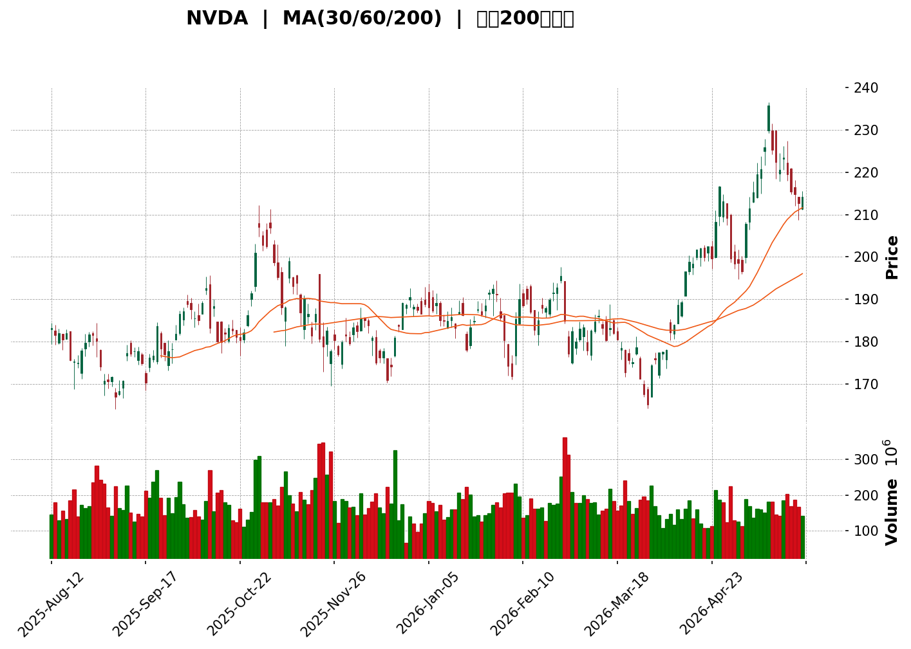
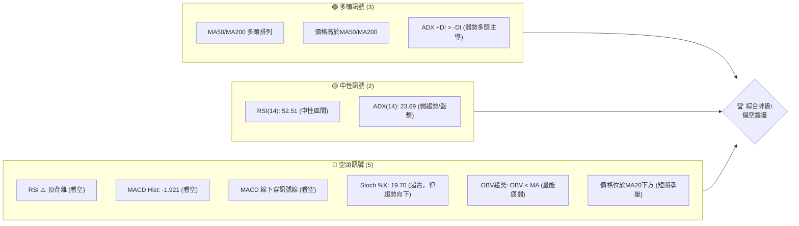
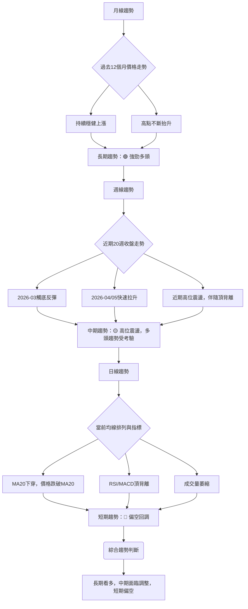
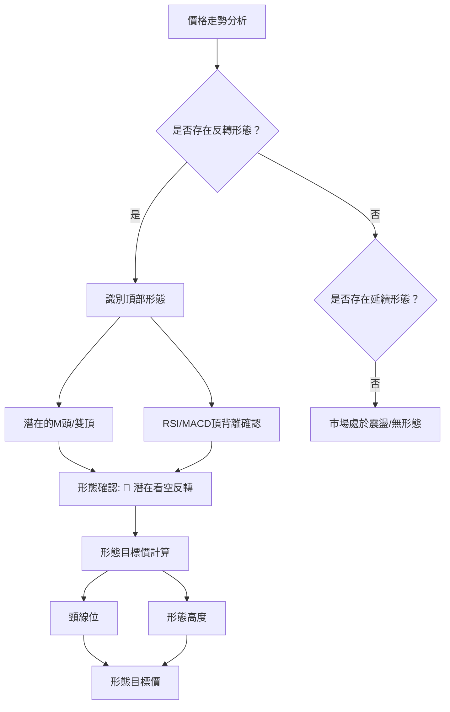
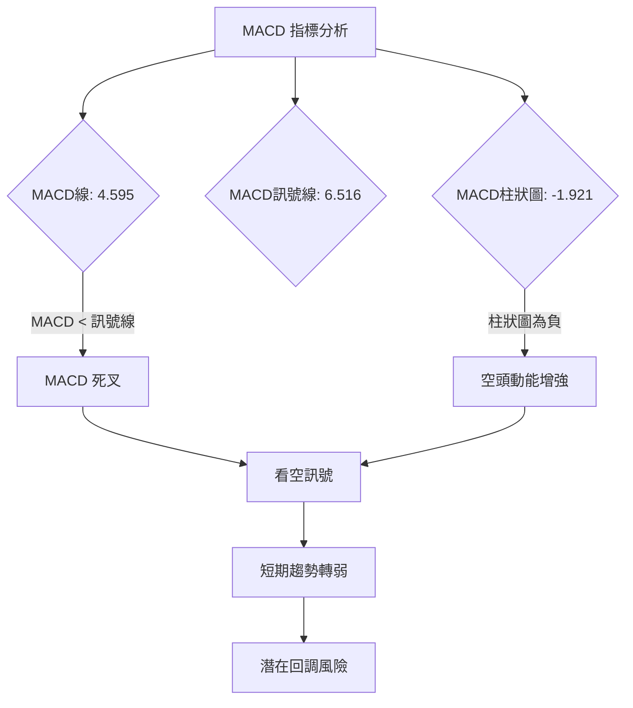

<details>
<summary>📊 靜態圖表 (點擊展開)</summary>

</details>

<html>
<head><meta charset="utf-8" /></head>
<body>
    <div>                        <script>window.PlotlyConfig = {MathJaxConfig: 'local'};</script>
        <script charset="utf-8" src="https://cdn.plot.ly/plotly-3.5.0.min.js" integrity="sha256-fHbNLP+GlIXN+efbQec78UkemUz3NJp7UmfGxC1tNxs=" crossorigin="anonymous"></script>                <div id="candlestick-chart" class="plotly-graph-div" style="height:500px; width:100%;"></div>            <script>                window.PLOTLYENV=window.PLOTLYENV || {};                                if (document.getElementById("candlestick-chart")) {                    Plotly.newPlot(                        "candlestick-chart",                        [{"close":{"dtype":"f8","bdata":"AAAAYCXkZkAAAAAg6rFmQAAAAACsv2ZAAAAAwHCNZkAAAAAAWr9mQAAAAMCL82VAAAAAAN7rZUAAAADgbd5lQAAAAOC7PmZAAAAAwPZ4ZkAAAABgrLdmQAAAAAA8smZAAAAAYHuEZkAAAABg1cRlQAAAAEANWGVAAAAA4O5SZUAAAAAgNXRlQAAAAKDA32RAAAAAYAYJZUAAAABgaVdlQAAAAACeKWZAAAAAYNEkZkAAAACAnTlmQAAAAEBgN2ZAAAAAwIvbZUAAAACArkhlQAAAAKAPB2ZAAAAAoNEUZkAAAAAA4PJmQAAAAAAiTWZAAAAAAGseZkAAAADAdDVmQAAAAEB0RWZAAAAAwI+6ZkAAAACA51FnQAAAAMAFZ2dAAAAAANGbZ0AAAABgLnNnQAAAAMCgMGdAAAAAQKEgZ0AAAAAA26JnQAAAAECQEWhAAAAAAHrkZkAAAAAglIlnQAAAAMBTgGZAAAAAoO15ZkAAAAAASLlmQAAAAIBl5mZAAAAAoNbTZkAAAADAe6RmQAAAAKBTiGZAAAAA4HrEZkAAAABAqkdnQAAAAOAB72dAAAAAAEEgaUAAAACAjeBpQAAAAGDEW2lAAAAAAPhOaUAAAADgbttpQAAAAMBh1WhAAAAA4AhmaEAAAABA5oFnQAAAAKAjhGdAAAAAoObgaEAAAAAAcSRoQAAAAGDrOGhAAAAAAN1aZ0AAAACAxcRnQAAAAGCLUmdAAAAAAOKqZkAAAAAg\u002fE9nQAAAAGDYk2ZAAAAAIIhbZkAAAACA9dBmQAAAAICdOWZAAAAAwK+HZkAAAADAYB9mQAAAAODOfGZAAAAAIBWuZkAAAADAP3JmQAAAAMDX62ZAAAAA4M3MZkAAAABgRzFnQAAAAEC4HmdAAAAAQKT4ZkAAAABAcp1mQAAAAEBW4GVAAAAAgPkIZkAAAACAuzZmQAAAAMDIXWVAAAAAoC3EZUAAAADgXZ9mQAAAAADD9WZAAAAAgGSmZ0AAAACAMZNnQAAAAECh0GdAAAAAwLaGZ0AAAACA9HBnQAAAAGCtT2dAAAAAgN+aZ0AAAACgg4NnQAAAACBbZ2dAAAAAQDGjZ0AAAACg9SBnQAAAACAzG2dAAAAAgMIdZ0AAAAAgmTlnQAAAAKAp5GZAAAAAwEZhZ0AAAACACUdnQAAAAIDuQWZAAAAAQOzpZkAAAABAjxpnQAAAAGAddWdAAAAAoLdOZ0AAAABAUJBnQAAAAABP8GdAAAAAgPwPaEAAAABA1ONnQAAAAOAyM2dAAAAAQJGKZkAAAABAx8VlQAAAAMDce2VAAAAAgMwsZ0AAAABg88BnQAAAAAD0kGdAAAAAYEXBZ0AAAACgwV1nQAAAAICa2WZAAAAAQLgeZ0AAAADACH9nQAAAAIB5fGdAAAAAYOm5Z0AAAADARPFnQAAAAMDdGmhAAAAAwJRxaEAAAADgKBxnQAAAAADGJWZAAAAAQAvPZkAAAADASYFmQAAAAID24GZAAAAAAJDqZkAAAACg7jlmQAAAAMB71GZAAAAAAFIYZ0AAAADA9UBnQAAAAOB65GZAAAAAAACIZkAAAABACudmQAAAAIDCvWZAAAAAwMyMZkAAAACA61FmQAAAAGBmlmVAAAAA4Hr0ZUAAAABgZuZlQAAAAIDCVWZAAAAAIK5nZUAAAADgo\u002fBkQAAAAKBwpWRAAAAAwMzMZUAAAAAAAPhlQAAAAOB6LGZAAAAA4Ho0ZkAAAABAM0NmQAAAAGCPwmZAAAAAwB79ZkAAAAAAKZRnQAAAAIDrqWdAAAAA4FGQaEAAAAAA19toQAAAAEAzy2hAAAAAgMI1aUAAAACA60FpQAAAAAAp\u002fGhAAAAAAABQaUAAAADgevRoQAAAAOCjCGpAAAAAIIUTa0AAAACgcKVqQAAAAAAAKGpAAAAAgD3yaEAAAABgZs5oQAAAACBcz2hAAAAAAACQaEAAAABgj\u002fppQAAAAAAAcGpAAAAAYGbmakAAAACAFG5rQAAAAMD1mGtAAAAAYI86bEAAAAAgrndtQAAAAIA9KmxAAAAAgD3Ka0AAAAAghZNrQAAAAEAK72tAAAAA4FFwa0AAAABgj+pqQAAAACCF22pAAAAAQDOTakAAAAAAAMhqQA=="},"high":{"dtype":"f8","bdata":"LXfr82AOZ0Ca+NTiD\u002f5mQKwEYaOq32ZAEBy7JtW7ZkC\u002fCMNbG91mQESXE4kHz2ZAZuXrbhD\u002fZUBMOMHi2xtmQJ3h8i7uUWZA9iA9JCe8ZkC6B+OHgstmQD1Hy6m1zmZAPfiSJQ8OZ0BrHGc42kNmQGBAXlI+i2VAWyeSMDSMZUDbslE6m3plQA814sMPIGVAvet4pM9dZUCtBlFTc15lQMCjBpVTaGZA4zpetFOIZkDMuVSMklJmQM9A6oKSWmZAUdPlZGAvZkAqTSGiyqVlQLEyAPqTImZAFCskG+9BZkANAZan8xBnQIZjM4nMzGZA+4ir+FN4ZkCwyYHQr4dmQNEDPjQCeGZA6gwkkVr\u002fZkAgA6SuimpnQBye0LDRg2dA\u002fzm0zu3gZ0DC5ZIJ2spnQErb4bqzZmdACrivgkGhZ0C63SaviLJnQJPWPOvpaGhAieTaCidzaEBjS9wj2sJnQNKULFXzGGdAT0R7tzAbZ0BaJ5TtUOhmQEPJbbWNAmdAPfGg0r8lZ0A+P40oo9hmQMJJgYhv7WZAsDKjF1HgZkDGujqJYW5nQCUvj0pT\u002f2dAeO0HGBZkaUCADsi+VYVqQBv7AU9lxGlAYHI2Mk\u002f+aUDCqskcI2pqQIan+L9SfmlAdGyHMbpcaUD99eRLJbNoQLei4DiUiWdAkTAcs2D9aEAELpTXwGxoQKwm777Ke2hAxjUTQWjtZ0DbGn\u002f+pd9nQLdkQfdVn2dAD3fnZ\u002fMYZ0DmW3sr3HpnQF7Qta5Pf2hA9+FHhEURZ0A24VgFW+9mQGT2rnF+RGZAahzZPXrcZkA6GI1QpmhmQLsJi4j3iGZAUjCzuHc0Z0B\u002fBJdNws1mQLzesR5SEGdAcYie4MwUZ0A+KPqprH9nQL4s4uq3NmdAgR4B3wkvZ0DbErcT7almQEChYGrs2WZAkyZajiFNZkBsM6cIX09mQHebOvPaA2ZAXsW8m34EZkDHbMnrFa5mQMGynQrNBGdApPZhcjuqZ0DDzPL9ypxnQEURwwq\u002fFWhAomKsIv6XZ0B053dbWp9nQDl8iBOX0WdAVVvN8GwdaEDWSdYu0zNoQKJYi3AbBWhANBRlH4LrZ0Dfy1ugRbFnQBPz75eOSmdAOi6OCIRjZ0BhqPe6MYNnQCbBFIpmDmdAXDBtUxK2Z0BC19MBwM1nQBbTfxbYy2ZAIFVE1tYrZ0BdJfQIHkVnQPiH0yTfsmdAubBmM4OjZ0CSLe+3q79nQHsH1gHeCmhAhcHfUQYvaECgeJfiV09oQOu69EtFyWdASqORPlFIZ0B0IBG8P3JmQPbL+Q7vGWZAzcxuC61fZ0ALfCjlyDRoQFCwoMAGD2hAZQ62M\u002fwnaEDn+ANLLzNoQIs9BOysb2dAQXSYyHlkZ0BEQqGQgstnQPru4gNvjWdAoX4jBjvKZ0BLPMNvED5oQDkdlfdNOGhAB4PtVNGzaEBW3b508UhoQDtQj1uQ0mZAgRXPEGfuZkBsxXd\u002ffJxmQMdGp4MUFmdAYMhQ7pkBZ0BWrAzPANhmQHtAe6LN3GZAZuaO4sFNZ0AAAAAA13NnQAAAAIAUHmdAAAAAQOFCZ0AAAAAAKZxnQAAAAMDMLGdAAAAAACnsZkAAAAAgXH9mQAAAAOBRSGZAAAAAANdLZkAAAABACgdmQAAAAEAKp2ZAAAAA4FEQZkAAAABACl9lQAAAAGBmLmVAAAAAANfTZUAAAAAA1ytmQAAAACCuL2ZAAAAAoEc5ZkAAAAAgXEdmQAAAAOBRKGdAAAAAYI8CZ0AAAAAAAMBnQAAAAMAetWdAAAAA4FGQaEAAAADAzAxpQAAAAEAz+2hAAAAAYGY2aUAAAACgcEVpQAAAAAAAWGlAAAAAAABQaUAAAABgj3ppQAAAAGBmXmpAAAAAYI8aa0AAAAAgXNdqQAAAAEAKl2pAAAAAoJlJakAAAAAAAGBpQAAAACBcN2lAAAAAIK4HaUAAAADgowhqQAAAAGBmxmpAAAAAoJk5a0AAAACgmclrQAAAAAAA+GtAAAAAQOF6bEAAAACgR5FtQAAAAAAA8GxAAAAAAADAbEAAAAAgXA9sQAAAAAApRGxAAAAAwMxsbEAAAADgUaBrQAAAAIDCRWtAAAAAwMzEakAAAACAnPBqQA=="},"hovertemplate":"\u003cb\u003e%{x|%Y-%m-%d}\u003c\u002fb\u003e\u003cbr\u003e\u958b: $%{open:.2f}\u003cbr\u003e\u9ad8: $%{high:.2f}\u003cbr\u003e\u4f4e: $%{low:.2f}\u003cbr\u003e\u6536: $%{close:.2f}\u003cextra\u003e\u003c\u002fextra\u003e","low":{"dtype":"f8","bdata":"kx6gCcRtZkDGc2MsP2pmQC8OePzDbWZAO47LR1VAZkAzhRFP65FmQJcMRzS\u002f7mVAUlbW27MYZUBcMdLX\u002frhlQJNlzV19ZWVAxA\u002f\u002fKE0RZkATy8YH+FhmQJWYXWc\u002fYmZA46Y\u002fni4MZkC1z\u002fcG4aNlQDipuZgm5mRAzzECPkMbZUDP8+svOCxlQMcliUNegWRAPIyObk\u002fqZEBFdjQZy9ZkQBypIWgb7mVADTDGfr0OZkBHT5Obxw1mQNyEcgm1z2VAkJcYM4zLZUAY6MNQhwxlQMW1KNMcnmVAWHFK1yTlZUAPFwVBG9ZlQL0qNd8ZBmZATW2t6S7sZUD1AIBZjaNlQJ4eii4l3WVAkwQoYJuJZkASZ7bWuK5mQEMP5WAn\u002fGZAOTcXX0KBZ0BXsmFjgitnQA3113zq6WZAAwBij1r\u002fZkDiSt\u002fPn1BnQBmfx5s\u002f4WdAQSqZ3\u002fXAZkBjsGEfET5nQH8OBazEdWZAWALeKKgoZkCY16Q1AnhmQJ5NxV5ed2ZAmA6Bsbi2ZkBoc0LZ93hmQK3KX+qyF2ZAQBDS4aV4ZkBkXd7bWu9mQPaXpwAZjWdApPUwM3L8Z0Df9RyoPZhpQKBqzZRpLGlALLu0wIdBaUCHLgWQMrFpQKpmCW8QvWhAil3jwB1UaEB50lZngUtnQEXxQO59XGZAZuHsWpk4aEBD+k+M7ehnQMlnkSZ942dAsvhM1Y36ZkD6dyzh7JFmQAO\u002fG62XCWdAAiC\u002fKSt0ZkB5NJTx6tlmQPvq7XWRemZARfHi+SadZUBsIxV1vQ5mQMrb9BABMWVALcEX0Q1HZkCK8SkzYQ9mQDrsHVwmtWVALfNAEF5\u002fZkDIWoAO5GJmQMtj6qNofmZAX\u002fpAis6cZkA+m3Xle8xmQC1wQTvs6WZAZ6WJ5fbAZkBDy2KpiBNmQFvlao2J02VACBfyLqjgZUAejuQ\u002ff9xlQHVHeAegSWVAypR3R\u002fF5ZUBkatEPkwpmQHhKM1jiymZA70ATrHvcZkBlV0eFjlJnQOLpPp+sf2dAGjpYRsw8Z0BvWzelb11nQC8vIoFbT2dAmsv7Yv6HZ0DO7YM\u002fekRnQJ1Rqa\u002fqWWdAUY6IwZhRZ0ATnuH2ZvZmQEPVIScf9WZAm\u002fLuuVLgZkB1TYRxe+xmQIVzw2lJmWZAEmOq0TxKZ0A\u002fSwnRPEJnQI6WPlQ2M2ZA+Qs9rn1MZkDXBVnncP1mQK+dhqDqWWdA6J5ytls\u002fZ0CPLTwAFDZnQF3umB6NumdA+5BH\u002fJhBZ0AfK288tq5nQInyzxLXG2dA67++8g0HZkD22tmC0nxlQNd8iOCpYGVAL96hy+XSZUBbTirTFP5mQC9vsI+Dg2dAIghDMVCYZ0CxUM0w\u002f09nQNtBYsqQsmZA9rIZEXNlZkC1GIYK\u002f1dnQPxyEH7MNGdApZI0GMI9Z0A7U3ZfO7JnQPwckKp5bGdACOkAqfE4aEDCM7fA6wlnQJ+o3dvaC2ZANquEeS3UZUBGRXgjIh1mQORqHbKbgWZAyzZwK9o7ZkAkk40R7xlmQNXc6qSd8WVAbUQXOQHAZkAAAABgZg5nQAAAAAAAuGZAAAAAgBR+ZkAAAADAHq1mQAAAAIDCtWZAAAAAYI+KZkAAAACgR\u002fllQAAAAEAKd2VAAAAA4FHYZUAAAAAgXL9lQAAAAEAzG2ZAAAAA4HpkZUAAAADgUeBkQAAAAOCjiGRAAAAAYLjeZEAAAAAAANhlQAAAAADXa2VAAAAA4FH4ZUAAAADAHrVlQAAAAKCZiWZAAAAAANeTZkAAAACgmQlnQAAAACCuN2dAAAAA4KPYZ0AAAAAgrndoQAAAAIDreWhAAAAA4KPoaEAAAABA4bpoQAAAAAAA4GhAAAAAAADgaEAAAABACqdoQAAAAIDr+WhAAAAAACnsaUAAAABgZgZqQAAAAGCP8mlAAAAAYGbWaEAAAAAA16NoQAAAACCuV2hAAAAAwPWAaEAAAAAghdNoQAAAAAAA0GlAAAAA4HqcakAAAADgerxqQAAAAKBw3WpAAAAAgD2ya0AAAACgmalsQAAAACCuB2xAAAAAANdLa0AAAADAHj1rQAAAAAAAkGtAAAAAgMI9a0AAAACgmdlqQAAAAAAAgGpAAAAAwPUYakAAAACgGmdqQA=="},"name":"\u50f9\u683c","open":{"dtype":"f8","bdata":"2V61Rb\u002fdZkDT1Sh53tJmQKcHXzcLd2ZAhkGybTG7ZkA7IZRLPZJmQOXreSHKzGZAu\u002fskMILkZUD\u002fVU8tRdplQBLshTKakmVA1Wq+fEBKZkAPow9U9oBmQORYjltkvmZAd6B9XUeZZkAdSVemkkJmQPkT2I8YP2VAzzbBxgJhZUAx5sNbVVFlQIeAMyARAGVAZaHbiLXwZEC\u002f8hcG+yFlQAfIb3CKE2ZAvvlu\u002fiB1ZkB+mYTrAzhmQArzjr7S9GVA4Wr+12AfZkAj\u002fgmj35NlQDxPU6i\u002fvmVAi8xarwX4ZUCWzS\u002f5++hlQBTp0pBmvmZAMPP4GgJ4ZkBkcstCv85lQH8Cm2TQRGZAs1vXRiCNZkAegoKM68FmQPEXaowHJ2dAeyOJvIiyZ0Dt+cR2aqVnQAJVNSlZL2dAR6cWrrRGZ0Ahw\u002fWolVFnQMZoTy6vBmhAnNK40KMvaEB4b5YwYX5nQL6vFZz9F2dAsxeZZ\u002fMYZ0CPB08\u002fuMZmQP4QynsghWZAPnQwT4TjZkA+P40oo9hmQMDNAvrXo2ZA7YC6UM6MZkAQpInNO\u002fpmQKLhajkDv2dA8NbKDOwgaEA0Lqsnof5pQIvUlTcUpGlAzeAysKzNaUBcxZ4r1AFqQAPwXl9JX2lAeLGoLPHXaEC5MSIAwIxoQE0U34smHGdABLMKq9ViaEDP\u002fHIzb2RoQDFHEEZadmhAkZvnuu3gZ0DzqvKT4NpmQAvRGPFiPmdAqJDfDoTrZkBgeFBuoRhnQDe8ORq2fWhAXqqmIAunZkBoPkvADG9mQAQ9Tl6B3GVA98mPpIWzZkA56QrRsF9mQIfYjsO012VARO\u002foWq63ZkCSIPuI7KFmQIhaoYeGs2ZAd0cEWCn8ZkB+TjnqKdRmQPfGCj2ZMWdA5QznOLgeZ0B7\u002fc3JpYhmQOGqiMw0o2ZAbrHOpMU9ZkCrW57FAwhmQATRoTblAmZA2c61U6jQZUCZHlxKIhVmQH5g4AUf\u002fWZA0m8hJLneZkCUKQwswX1nQL\u002fJQWUcvWdARHDrGWV2Z0Ap+pGwWodnQBU90IPpsWdAHG6bD426Z0CP6wHj\u002fPdnQF0hyWtP0GdAX+dP3emRZ0BkZUZSMaNnQKV6BEc9ImdASXk7A7nmZkAdsO37rR9nQH09+7nrCWdA4DdiXq1PZ0Cv3Ut8O6JnQD8IBA18vGZAd5J8REphZkD6gjgKrhdnQIofTtOsb2dAxPu60ctkZ0CSuloRW2dnQIzRXBxP6GdAXPvUZIzqZ0A4LOuWY+ZnQLOboGsTZmdArsT5gVtHZ0DPqbDJaG5mQG3FnuV03WVAdGhIHsYVZkDoqPsvAAhnQGgIhx3U62dAIG2iDxEOaEC3KdcsoCBoQEgfSQ4Jb2dAugRvba+3ZkBMFZJIrJdnQB4rRp+YYWdA5m660OpRZ0AhEwTxd+xnQKZRWzpZ72dAFIcNHhBOaEDU2wO3TUhoQKgUibOvp2ZAGPmJTwTgZUAvoCrxXk9mQKK8\u002f4bEjWZA5uwvViClZkA\u002fx596kXpmQA9RvPRAGmZAQJrZ7HvMZkAAAADAHj1nQAAAAKCZAWdAAAAAoHAdZ0AAAABACt9mQAAAAIDrIWdAAAAAIFzPZkAAAADgUUBmQAAAAAAAQGZAAAAA4FEoZkAAAABgj9plQAAAAEAzI2ZAAAAAgD0CZkAAAAAAAEBlQAAAAMD1GGVAAAAAQArfZEAAAAAAAABmQAAAAIDChWVAAAAAwB4lZkAAAAAgXPdlQAAAAAAAEGdAAAAAQOG6ZkAAAACA6wlnQAAAAMD1QGdAAAAAQOHaZ0AAAACgR5FoQAAAAIDCrWhAAAAAwMz8aEAAAAAgXP9oQAAAAAApRGlAAAAAIK4faUAAAABguE5pQAAAAGC4\u002fmhAAAAAwMw0akAAAAAgri9qQAAAAGBmlmpAAAAAgMI9akAAAADA9ShpQAAAAAAA8GhAAAAAoJnpaEAAAADgevxoQAAAAEDhCmpAAAAAwPWgakAAAACgR8FqQAAAAKCZUWtAAAAAgMIdbEAAAABAM7tsQAAAAOBRuGxAAAAAANe7bEAAAAAA13NrQAAAAIDC5WtAAAAAoEfJa0AAAADAzJxrQAAAAKBHEWtAAAAAANfDakAAAADAzGhqQA=="},"x":["2025-08-12T00:00:00-04:00","2025-08-13T00:00:00-04:00","2025-08-14T00:00:00-04:00","2025-08-15T00:00:00-04:00","2025-08-18T00:00:00-04:00","2025-08-19T00:00:00-04:00","2025-08-20T00:00:00-04:00","2025-08-21T00:00:00-04:00","2025-08-22T00:00:00-04:00","2025-08-25T00:00:00-04:00","2025-08-26T00:00:00-04:00","2025-08-27T00:00:00-04:00","2025-08-28T00:00:00-04:00","2025-08-29T00:00:00-04:00","2025-09-02T00:00:00-04:00","2025-09-03T00:00:00-04:00","2025-09-04T00:00:00-04:00","2025-09-05T00:00:00-04:00","2025-09-08T00:00:00-04:00","2025-09-09T00:00:00-04:00","2025-09-10T00:00:00-04:00","2025-09-11T00:00:00-04:00","2025-09-12T00:00:00-04:00","2025-09-15T00:00:00-04:00","2025-09-16T00:00:00-04:00","2025-09-17T00:00:00-04:00","2025-09-18T00:00:00-04:00","2025-09-19T00:00:00-04:00","2025-09-22T00:00:00-04:00","2025-09-23T00:00:00-04:00","2025-09-24T00:00:00-04:00","2025-09-25T00:00:00-04:00","2025-09-26T00:00:00-04:00","2025-09-29T00:00:00-04:00","2025-09-30T00:00:00-04:00","2025-10-01T00:00:00-04:00","2025-10-02T00:00:00-04:00","2025-10-03T00:00:00-04:00","2025-10-06T00:00:00-04:00","2025-10-07T00:00:00-04:00","2025-10-08T00:00:00-04:00","2025-10-09T00:00:00-04:00","2025-10-10T00:00:00-04:00","2025-10-13T00:00:00-04:00","2025-10-14T00:00:00-04:00","2025-10-15T00:00:00-04:00","2025-10-16T00:00:00-04:00","2025-10-17T00:00:00-04:00","2025-10-20T00:00:00-04:00","2025-10-21T00:00:00-04:00","2025-10-22T00:00:00-04:00","2025-10-23T00:00:00-04:00","2025-10-24T00:00:00-04:00","2025-10-27T00:00:00-04:00","2025-10-28T00:00:00-04:00","2025-10-29T00:00:00-04:00","2025-10-30T00:00:00-04:00","2025-10-31T00:00:00-04:00","2025-11-03T00:00:00-05:00","2025-11-04T00:00:00-05:00","2025-11-05T00:00:00-05:00","2025-11-06T00:00:00-05:00","2025-11-07T00:00:00-05:00","2025-11-10T00:00:00-05:00","2025-11-11T00:00:00-05:00","2025-11-12T00:00:00-05:00","2025-11-13T00:00:00-05:00","2025-11-14T00:00:00-05:00","2025-11-17T00:00:00-05:00","2025-11-18T00:00:00-05:00","2025-11-19T00:00:00-05:00","2025-11-20T00:00:00-05:00","2025-11-21T00:00:00-05:00","2025-11-24T00:00:00-05:00","2025-11-25T00:00:00-05:00","2025-11-26T00:00:00-05:00","2025-11-28T00:00:00-05:00","2025-12-01T00:00:00-05:00","2025-12-02T00:00:00-05:00","2025-12-03T00:00:00-05:00","2025-12-04T00:00:00-05:00","2025-12-05T00:00:00-05:00","2025-12-08T00:00:00-05:00","2025-12-09T00:00:00-05:00","2025-12-10T00:00:00-05:00","2025-12-11T00:00:00-05:00","2025-12-12T00:00:00-05:00","2025-12-15T00:00:00-05:00","2025-12-16T00:00:00-05:00","2025-12-17T00:00:00-05:00","2025-12-18T00:00:00-05:00","2025-12-19T00:00:00-05:00","2025-12-22T00:00:00-05:00","2025-12-23T00:00:00-05:00","2025-12-24T00:00:00-05:00","2025-12-26T00:00:00-05:00","2025-12-29T00:00:00-05:00","2025-12-30T00:00:00-05:00","2025-12-31T00:00:00-05:00","2026-01-02T00:00:00-05:00","2026-01-05T00:00:00-05:00","2026-01-06T00:00:00-05:00","2026-01-07T00:00:00-05:00","2026-01-08T00:00:00-05:00","2026-01-09T00:00:00-05:00","2026-01-12T00:00:00-05:00","2026-01-13T00:00:00-05:00","2026-01-14T00:00:00-05:00","2026-01-15T00:00:00-05:00","2026-01-16T00:00:00-05:00","2026-01-20T00:00:00-05:00","2026-01-21T00:00:00-05:00","2026-01-22T00:00:00-05:00","2026-01-23T00:00:00-05:00","2026-01-26T00:00:00-05:00","2026-01-27T00:00:00-05:00","2026-01-28T00:00:00-05:00","2026-01-29T00:00:00-05:00","2026-01-30T00:00:00-05:00","2026-02-02T00:00:00-05:00","2026-02-03T00:00:00-05:00","2026-02-04T00:00:00-05:00","2026-02-05T00:00:00-05:00","2026-02-06T00:00:00-05:00","2026-02-09T00:00:00-05:00","2026-02-10T00:00:00-05:00","2026-02-11T00:00:00-05:00","2026-02-12T00:00:00-05:00","2026-02-13T00:00:00-05:00","2026-02-17T00:00:00-05:00","2026-02-18T00:00:00-05:00","2026-02-19T00:00:00-05:00","2026-02-20T00:00:00-05:00","2026-02-23T00:00:00-05:00","2026-02-24T00:00:00-05:00","2026-02-25T00:00:00-05:00","2026-02-26T00:00:00-05:00","2026-02-27T00:00:00-05:00","2026-03-02T00:00:00-05:00","2026-03-03T00:00:00-05:00","2026-03-04T00:00:00-05:00","2026-03-05T00:00:00-05:00","2026-03-06T00:00:00-05:00","2026-03-09T00:00:00-04:00","2026-03-10T00:00:00-04:00","2026-03-11T00:00:00-04:00","2026-03-12T00:00:00-04:00","2026-03-13T00:00:00-04:00","2026-03-16T00:00:00-04:00","2026-03-17T00:00:00-04:00","2026-03-18T00:00:00-04:00","2026-03-19T00:00:00-04:00","2026-03-20T00:00:00-04:00","2026-03-23T00:00:00-04:00","2026-03-24T00:00:00-04:00","2026-03-25T00:00:00-04:00","2026-03-26T00:00:00-04:00","2026-03-27T00:00:00-04:00","2026-03-30T00:00:00-04:00","2026-03-31T00:00:00-04:00","2026-04-01T00:00:00-04:00","2026-04-02T00:00:00-04:00","2026-04-06T00:00:00-04:00","2026-04-07T00:00:00-04:00","2026-04-08T00:00:00-04:00","2026-04-09T00:00:00-04:00","2026-04-10T00:00:00-04:00","2026-04-13T00:00:00-04:00","2026-04-14T00:00:00-04:00","2026-04-15T00:00:00-04:00","2026-04-16T00:00:00-04:00","2026-04-17T00:00:00-04:00","2026-04-20T00:00:00-04:00","2026-04-21T00:00:00-04:00","2026-04-22T00:00:00-04:00","2026-04-23T00:00:00-04:00","2026-04-24T00:00:00-04:00","2026-04-27T00:00:00-04:00","2026-04-28T00:00:00-04:00","2026-04-29T00:00:00-04:00","2026-04-30T00:00:00-04:00","2026-05-01T00:00:00-04:00","2026-05-04T00:00:00-04:00","2026-05-05T00:00:00-04:00","2026-05-06T00:00:00-04:00","2026-05-07T00:00:00-04:00","2026-05-08T00:00:00-04:00","2026-05-11T00:00:00-04:00","2026-05-12T00:00:00-04:00","2026-05-13T00:00:00-04:00","2026-05-14T00:00:00-04:00","2026-05-15T00:00:00-04:00","2026-05-18T00:00:00-04:00","2026-05-19T00:00:00-04:00","2026-05-20T00:00:00-04:00","2026-05-21T00:00:00-04:00","2026-05-22T00:00:00-04:00","2026-05-26T00:00:00-04:00","2026-05-27T00:00:00-04:00","2026-05-28T00:00:00-04:00"],"type":"candlestick"},{"hovertemplate":"MA30: $%{y:.2f}\u003cextra\u003e\u003c\u002fextra\u003e","line":{"color":"#2196F3","dash":"dash","width":2},"mode":"lines","name":"MA30","x":["2025-08-12T00:00:00-04:00","2025-08-13T00:00:00-04:00","2025-08-14T00:00:00-04:00","2025-08-15T00:00:00-04:00","2025-08-18T00:00:00-04:00","2025-08-19T00:00:00-04:00","2025-08-20T00:00:00-04:00","2025-08-21T00:00:00-04:00","2025-08-22T00:00:00-04:00","2025-08-25T00:00:00-04:00","2025-08-26T00:00:00-04:00","2025-08-27T00:00:00-04:00","2025-08-28T00:00:00-04:00","2025-08-29T00:00:00-04:00","2025-09-02T00:00:00-04:00","2025-09-03T00:00:00-04:00","2025-09-04T00:00:00-04:00","2025-09-05T00:00:00-04:00","2025-09-08T00:00:00-04:00","2025-09-09T00:00:00-04:00","2025-09-10T00:00:00-04:00","2025-09-11T00:00:00-04:00","2025-09-12T00:00:00-04:00","2025-09-15T00:00:00-04:00","2025-09-16T00:00:00-04:00","2025-09-17T00:00:00-04:00","2025-09-18T00:00:00-04:00","2025-09-19T00:00:00-04:00","2025-09-22T00:00:00-04:00","2025-09-23T00:00:00-04:00","2025-09-24T00:00:00-04:00","2025-09-25T00:00:00-04:00","2025-09-26T00:00:00-04:00","2025-09-29T00:00:00-04:00","2025-09-30T00:00:00-04:00","2025-10-01T00:00:00-04:00","2025-10-02T00:00:00-04:00","2025-10-03T00:00:00-04:00","2025-10-06T00:00:00-04:00","2025-10-07T00:00:00-04:00","2025-10-08T00:00:00-04:00","2025-10-09T00:00:00-04:00","2025-10-10T00:00:00-04:00","2025-10-13T00:00:00-04:00","2025-10-14T00:00:00-04:00","2025-10-15T00:00:00-04:00","2025-10-16T00:00:00-04:00","2025-10-17T00:00:00-04:00","2025-10-20T00:00:00-04:00","2025-10-21T00:00:00-04:00","2025-10-22T00:00:00-04:00","2025-10-23T00:00:00-04:00","2025-10-24T00:00:00-04:00","2025-10-27T00:00:00-04:00","2025-10-28T00:00:00-04:00","2025-10-29T00:00:00-04:00","2025-10-30T00:00:00-04:00","2025-10-31T00:00:00-04:00","2025-11-03T00:00:00-05:00","2025-11-04T00:00:00-05:00","2025-11-05T00:00:00-05:00","2025-11-06T00:00:00-05:00","2025-11-07T00:00:00-05:00","2025-11-10T00:00:00-05:00","2025-11-11T00:00:00-05:00","2025-11-12T00:00:00-05:00","2025-11-13T00:00:00-05:00","2025-11-14T00:00:00-05:00","2025-11-17T00:00:00-05:00","2025-11-18T00:00:00-05:00","2025-11-19T00:00:00-05:00","2025-11-20T00:00:00-05:00","2025-11-21T00:00:00-05:00","2025-11-24T00:00:00-05:00","2025-11-25T00:00:00-05:00","2025-11-26T00:00:00-05:00","2025-11-28T00:00:00-05:00","2025-12-01T00:00:00-05:00","2025-12-02T00:00:00-05:00","2025-12-03T00:00:00-05:00","2025-12-04T00:00:00-05:00","2025-12-05T00:00:00-05:00","2025-12-08T00:00:00-05:00","2025-12-09T00:00:00-05:00","2025-12-10T00:00:00-05:00","2025-12-11T00:00:00-05:00","2025-12-12T00:00:00-05:00","2025-12-15T00:00:00-05:00","2025-12-16T00:00:00-05:00","2025-12-17T00:00:00-05:00","2025-12-18T00:00:00-05:00","2025-12-19T00:00:00-05:00","2025-12-22T00:00:00-05:00","2025-12-23T00:00:00-05:00","2025-12-24T00:00:00-05:00","2025-12-26T00:00:00-05:00","2025-12-29T00:00:00-05:00","2025-12-30T00:00:00-05:00","2025-12-31T00:00:00-05:00","2026-01-02T00:00:00-05:00","2026-01-05T00:00:00-05:00","2026-01-06T00:00:00-05:00","2026-01-07T00:00:00-05:00","2026-01-08T00:00:00-05:00","2026-01-09T00:00:00-05:00","2026-01-12T00:00:00-05:00","2026-01-13T00:00:00-05:00","2026-01-14T00:00:00-05:00","2026-01-15T00:00:00-05:00","2026-01-16T00:00:00-05:00","2026-01-20T00:00:00-05:00","2026-01-21T00:00:00-05:00","2026-01-22T00:00:00-05:00","2026-01-23T00:00:00-05:00","2026-01-26T00:00:00-05:00","2026-01-27T00:00:00-05:00","2026-01-28T00:00:00-05:00","2026-01-29T00:00:00-05:00","2026-01-30T00:00:00-05:00","2026-02-02T00:00:00-05:00","2026-02-03T00:00:00-05:00","2026-02-04T00:00:00-05:00","2026-02-05T00:00:00-05:00","2026-02-06T00:00:00-05:00","2026-02-09T00:00:00-05:00","2026-02-10T00:00:00-05:00","2026-02-11T00:00:00-05:00","2026-02-12T00:00:00-05:00","2026-02-13T00:00:00-05:00","2026-02-17T00:00:00-05:00","2026-02-18T00:00:00-05:00","2026-02-19T00:00:00-05:00","2026-02-20T00:00:00-05:00","2026-02-23T00:00:00-05:00","2026-02-24T00:00:00-05:00","2026-02-25T00:00:00-05:00","2026-02-26T00:00:00-05:00","2026-02-27T00:00:00-05:00","2026-03-02T00:00:00-05:00","2026-03-03T00:00:00-05:00","2026-03-04T00:00:00-05:00","2026-03-05T00:00:00-05:00","2026-03-06T00:00:00-05:00","2026-03-09T00:00:00-04:00","2026-03-10T00:00:00-04:00","2026-03-11T00:00:00-04:00","2026-03-12T00:00:00-04:00","2026-03-13T00:00:00-04:00","2026-03-16T00:00:00-04:00","2026-03-17T00:00:00-04:00","2026-03-18T00:00:00-04:00","2026-03-19T00:00:00-04:00","2026-03-20T00:00:00-04:00","2026-03-23T00:00:00-04:00","2026-03-24T00:00:00-04:00","2026-03-25T00:00:00-04:00","2026-03-26T00:00:00-04:00","2026-03-27T00:00:00-04:00","2026-03-30T00:00:00-04:00","2026-03-31T00:00:00-04:00","2026-04-01T00:00:00-04:00","2026-04-02T00:00:00-04:00","2026-04-06T00:00:00-04:00","2026-04-07T00:00:00-04:00","2026-04-08T00:00:00-04:00","2026-04-09T00:00:00-04:00","2026-04-10T00:00:00-04:00","2026-04-13T00:00:00-04:00","2026-04-14T00:00:00-04:00","2026-04-15T00:00:00-04:00","2026-04-16T00:00:00-04:00","2026-04-17T00:00:00-04:00","2026-04-20T00:00:00-04:00","2026-04-21T00:00:00-04:00","2026-04-22T00:00:00-04:00","2026-04-23T00:00:00-04:00","2026-04-24T00:00:00-04:00","2026-04-27T00:00:00-04:00","2026-04-28T00:00:00-04:00","2026-04-29T00:00:00-04:00","2026-04-30T00:00:00-04:00","2026-05-01T00:00:00-04:00","2026-05-04T00:00:00-04:00","2026-05-05T00:00:00-04:00","2026-05-06T00:00:00-04:00","2026-05-07T00:00:00-04:00","2026-05-08T00:00:00-04:00","2026-05-11T00:00:00-04:00","2026-05-12T00:00:00-04:00","2026-05-13T00:00:00-04:00","2026-05-14T00:00:00-04:00","2026-05-15T00:00:00-04:00","2026-05-18T00:00:00-04:00","2026-05-19T00:00:00-04:00","2026-05-20T00:00:00-04:00","2026-05-21T00:00:00-04:00","2026-05-22T00:00:00-04:00","2026-05-26T00:00:00-04:00","2026-05-27T00:00:00-04:00","2026-05-28T00:00:00-04:00"],"y":{"dtype":"f8","bdata":"AAAAAAAA+H8AAAAAAAD4fwAAAAAAAPh\u002fAAAAAAAA+H8AAAAAAAD4fwAAAAAAAPh\u002fAAAAAAAA+H8AAAAAAAD4fwAAAAAAAPh\u002fAAAAAAAA+H8AAAAAAAD4fwAAAAAAAPh\u002fAAAAAAAA+H8AAAAAAAD4fwAAAAAAAPh\u002fAAAAAAAA+H8AAAAAAAD4fwAAAAAAAPh\u002fAAAAAAAA+H8AAAAAAAD4fwAAAAAAAPh\u002fAAAAAAAA+H8AAAAAAAD4fwAAAAAAAPh\u002fAAAAAAAA+H8AAAAAAAD4fwAAAAAAAPh\u002fAAAAAAAA+H8AAAAAAAD4f1VVVWWbFGZA3t3dHQQOZkAiIiIS3glmQFVVVSXLBWZA3t3dLUwHZkAzMzPDLgxmQCIiIrKQGGZAmpmZqfYmZkC8u7uLdDRmQFVVVbWEPGZAVVVVdRtCZkCJiIhY8klmQKuqqlqoVWZAIiIigttYZkDv7u7u8mdmQGZmZibTcWZAERERcah7ZkB3d3dnfoZmQKuqqirIl2ZAAAAAYBOnZkBmZmaWLbJmQGZmZsZVtWZAmpmZOai6ZkBmZmamqMNmQLy7uytQ0mZAREREFDTuZkDe3d0tZhVnQKuqqprSMWdAq6qqalxNZ0Crqqr6LWZnQERERLTJe2dAZmZm5j2PZ0AAAADAUppnQCIiIjLypGdAzczMbEq3Z0AiIiICT75nQBERESFOxWdAzczM3CPDZ0CamZkZ3MVnQFVVVYX9xmdA7+7uvhDDZ0BVVVWVTcBnQBEREUGUs2dAiYiIqAOvZ0DNzMw83KhnQERERNSApmdAvLu7O\u002famZ0DNzMzs1KFnQHd3d+dPnmdAiYiIuA2dZ0De3d0NYZtnQCIiIkKynmdAq6qqSvmeZ0AzMzNDOp5nQAAAAOBIl2dAiYiIyOWEZ0CrqqqKD2lnQLy7u6tYS2dAmpmZyWkvZ0De3d29UhBnQDMzM5O88mZAVVVVVUbcZkARERFBudRmQM3MzEz6z2ZA7+7ufn7FZkC8u7sLp8BmQLy7uxstvWZAzczMTKO+ZkARERER2LtmQJqZmZm\u002fu2ZAREREhL\u002fDZkC8u7s7d8VmQAAAACCEzGZAmpmZKXDXZkBVVVXVGtpmQCIiItKf4WZAIiIicqDmZkCamZm5CPBmQO\u002fu7q5682ZA3t3dzXP5ZkCJiIiYiwBnQAAAALDh+mZAq6qqKtr7ZkC8u7tLGPtmQImIiIj5\u002fWZAvLu7C9gAZ0AzMzOD8AhnQO\u002fu7t6JGmdAVVVVxdYrZ0BVVVVlJDpnQBERERHKSWdAzczM\u002fGZQZ0C8u7s7JklnQN7d3X2NPGdARERE5H84Z0CrqqpaBjpnQKuqqvrmN2dAq6qqqto5Z0BmZmbWNjlnQGZmZkZHNWdAVVVV1SMxZ0Crqqqa\u002fTBnQBEREdGxMWdAAAAAsHMyZ0AiIiJCZTlnQCIiIvLqQWdAERERwT5NZ0C8u7uLQ0xnQEREROTqRWdAq6qqCgtBZ0BVVVWVczpnQGZmZqbAP2dAvLu7G8Y\u002fZ0CamZlJSThnQBEREZHuMmdAERERYR4xZ0Crqqo6eS5nQCIiIsKLJWdA7+7uznoYZ0DNzMysDRBnQHd3d4cjDGdARERElDYMZ0BERER04hBnQImIiOjEEWdAmpmZyVsHZ0CamZlJivdmQDMzM6MI7WZAAAAAEPvYZkDv7u7eRsRmQM3MzKx4sWZAd3d3FzWmZkBERERELJlmQM3MzBz5jWZAZmZm9v2AZkC8u7sLqHJmQHd3d\u002fctZ2ZAIiIiosNaZkAzMzOjw15mQCIiItKza2ZAREREpK16ZkCrqqpqw45mQGZmZsYan2ZAZmZmhq2yZkCamZlJi8xmQN7d3e3u3mZAERERIdvxZkARERGRXwBnQLy7u7stG2dAAAAAcPZBZ0CJiIjI6GFnQHd3d\u002fcMf2dAiYiIqH+TZ0BERET0tqhnQM3MzJw2xGdAiYiIyHbaZ0AzMzPzRP1nQAAAAABHIGhAIiIiAitPaEARERGhjIZoQN7d3d3dwWhAAAAAsLn4aEBVVVX1tjhpQLy7uwvXa2lAq6qqqn+baUCrqqq618hpQFVVVfX99GlAERERIfcaakAiIiICcjdqQM3MzNyyUmpAIiIigtxjakBmZmZGRHRqQA=="},"type":"scatter"},{"hovertemplate":"MA60: $%{y:.2f}\u003cextra\u003e\u003c\u002fextra\u003e","line":{"color":"#9C27B0","dash":"dash","width":2},"mode":"lines","name":"MA60","x":["2025-08-12T00:00:00-04:00","2025-08-13T00:00:00-04:00","2025-08-14T00:00:00-04:00","2025-08-15T00:00:00-04:00","2025-08-18T00:00:00-04:00","2025-08-19T00:00:00-04:00","2025-08-20T00:00:00-04:00","2025-08-21T00:00:00-04:00","2025-08-22T00:00:00-04:00","2025-08-25T00:00:00-04:00","2025-08-26T00:00:00-04:00","2025-08-27T00:00:00-04:00","2025-08-28T00:00:00-04:00","2025-08-29T00:00:00-04:00","2025-09-02T00:00:00-04:00","2025-09-03T00:00:00-04:00","2025-09-04T00:00:00-04:00","2025-09-05T00:00:00-04:00","2025-09-08T00:00:00-04:00","2025-09-09T00:00:00-04:00","2025-09-10T00:00:00-04:00","2025-09-11T00:00:00-04:00","2025-09-12T00:00:00-04:00","2025-09-15T00:00:00-04:00","2025-09-16T00:00:00-04:00","2025-09-17T00:00:00-04:00","2025-09-18T00:00:00-04:00","2025-09-19T00:00:00-04:00","2025-09-22T00:00:00-04:00","2025-09-23T00:00:00-04:00","2025-09-24T00:00:00-04:00","2025-09-25T00:00:00-04:00","2025-09-26T00:00:00-04:00","2025-09-29T00:00:00-04:00","2025-09-30T00:00:00-04:00","2025-10-01T00:00:00-04:00","2025-10-02T00:00:00-04:00","2025-10-03T00:00:00-04:00","2025-10-06T00:00:00-04:00","2025-10-07T00:00:00-04:00","2025-10-08T00:00:00-04:00","2025-10-09T00:00:00-04:00","2025-10-10T00:00:00-04:00","2025-10-13T00:00:00-04:00","2025-10-14T00:00:00-04:00","2025-10-15T00:00:00-04:00","2025-10-16T00:00:00-04:00","2025-10-17T00:00:00-04:00","2025-10-20T00:00:00-04:00","2025-10-21T00:00:00-04:00","2025-10-22T00:00:00-04:00","2025-10-23T00:00:00-04:00","2025-10-24T00:00:00-04:00","2025-10-27T00:00:00-04:00","2025-10-28T00:00:00-04:00","2025-10-29T00:00:00-04:00","2025-10-30T00:00:00-04:00","2025-10-31T00:00:00-04:00","2025-11-03T00:00:00-05:00","2025-11-04T00:00:00-05:00","2025-11-05T00:00:00-05:00","2025-11-06T00:00:00-05:00","2025-11-07T00:00:00-05:00","2025-11-10T00:00:00-05:00","2025-11-11T00:00:00-05:00","2025-11-12T00:00:00-05:00","2025-11-13T00:00:00-05:00","2025-11-14T00:00:00-05:00","2025-11-17T00:00:00-05:00","2025-11-18T00:00:00-05:00","2025-11-19T00:00:00-05:00","2025-11-20T00:00:00-05:00","2025-11-21T00:00:00-05:00","2025-11-24T00:00:00-05:00","2025-11-25T00:00:00-05:00","2025-11-26T00:00:00-05:00","2025-11-28T00:00:00-05:00","2025-12-01T00:00:00-05:00","2025-12-02T00:00:00-05:00","2025-12-03T00:00:00-05:00","2025-12-04T00:00:00-05:00","2025-12-05T00:00:00-05:00","2025-12-08T00:00:00-05:00","2025-12-09T00:00:00-05:00","2025-12-10T00:00:00-05:00","2025-12-11T00:00:00-05:00","2025-12-12T00:00:00-05:00","2025-12-15T00:00:00-05:00","2025-12-16T00:00:00-05:00","2025-12-17T00:00:00-05:00","2025-12-18T00:00:00-05:00","2025-12-19T00:00:00-05:00","2025-12-22T00:00:00-05:00","2025-12-23T00:00:00-05:00","2025-12-24T00:00:00-05:00","2025-12-26T00:00:00-05:00","2025-12-29T00:00:00-05:00","2025-12-30T00:00:00-05:00","2025-12-31T00:00:00-05:00","2026-01-02T00:00:00-05:00","2026-01-05T00:00:00-05:00","2026-01-06T00:00:00-05:00","2026-01-07T00:00:00-05:00","2026-01-08T00:00:00-05:00","2026-01-09T00:00:00-05:00","2026-01-12T00:00:00-05:00","2026-01-13T00:00:00-05:00","2026-01-14T00:00:00-05:00","2026-01-15T00:00:00-05:00","2026-01-16T00:00:00-05:00","2026-01-20T00:00:00-05:00","2026-01-21T00:00:00-05:00","2026-01-22T00:00:00-05:00","2026-01-23T00:00:00-05:00","2026-01-26T00:00:00-05:00","2026-01-27T00:00:00-05:00","2026-01-28T00:00:00-05:00","2026-01-29T00:00:00-05:00","2026-01-30T00:00:00-05:00","2026-02-02T00:00:00-05:00","2026-02-03T00:00:00-05:00","2026-02-04T00:00:00-05:00","2026-02-05T00:00:00-05:00","2026-02-06T00:00:00-05:00","2026-02-09T00:00:00-05:00","2026-02-10T00:00:00-05:00","2026-02-11T00:00:00-05:00","2026-02-12T00:00:00-05:00","2026-02-13T00:00:00-05:00","2026-02-17T00:00:00-05:00","2026-02-18T00:00:00-05:00","2026-02-19T00:00:00-05:00","2026-02-20T00:00:00-05:00","2026-02-23T00:00:00-05:00","2026-02-24T00:00:00-05:00","2026-02-25T00:00:00-05:00","2026-02-26T00:00:00-05:00","2026-02-27T00:00:00-05:00","2026-03-02T00:00:00-05:00","2026-03-03T00:00:00-05:00","2026-03-04T00:00:00-05:00","2026-03-05T00:00:00-05:00","2026-03-06T00:00:00-05:00","2026-03-09T00:00:00-04:00","2026-03-10T00:00:00-04:00","2026-03-11T00:00:00-04:00","2026-03-12T00:00:00-04:00","2026-03-13T00:00:00-04:00","2026-03-16T00:00:00-04:00","2026-03-17T00:00:00-04:00","2026-03-18T00:00:00-04:00","2026-03-19T00:00:00-04:00","2026-03-20T00:00:00-04:00","2026-03-23T00:00:00-04:00","2026-03-24T00:00:00-04:00","2026-03-25T00:00:00-04:00","2026-03-26T00:00:00-04:00","2026-03-27T00:00:00-04:00","2026-03-30T00:00:00-04:00","2026-03-31T00:00:00-04:00","2026-04-01T00:00:00-04:00","2026-04-02T00:00:00-04:00","2026-04-06T00:00:00-04:00","2026-04-07T00:00:00-04:00","2026-04-08T00:00:00-04:00","2026-04-09T00:00:00-04:00","2026-04-10T00:00:00-04:00","2026-04-13T00:00:00-04:00","2026-04-14T00:00:00-04:00","2026-04-15T00:00:00-04:00","2026-04-16T00:00:00-04:00","2026-04-17T00:00:00-04:00","2026-04-20T00:00:00-04:00","2026-04-21T00:00:00-04:00","2026-04-22T00:00:00-04:00","2026-04-23T00:00:00-04:00","2026-04-24T00:00:00-04:00","2026-04-27T00:00:00-04:00","2026-04-28T00:00:00-04:00","2026-04-29T00:00:00-04:00","2026-04-30T00:00:00-04:00","2026-05-01T00:00:00-04:00","2026-05-04T00:00:00-04:00","2026-05-05T00:00:00-04:00","2026-05-06T00:00:00-04:00","2026-05-07T00:00:00-04:00","2026-05-08T00:00:00-04:00","2026-05-11T00:00:00-04:00","2026-05-12T00:00:00-04:00","2026-05-13T00:00:00-04:00","2026-05-14T00:00:00-04:00","2026-05-15T00:00:00-04:00","2026-05-18T00:00:00-04:00","2026-05-19T00:00:00-04:00","2026-05-20T00:00:00-04:00","2026-05-21T00:00:00-04:00","2026-05-22T00:00:00-04:00","2026-05-26T00:00:00-04:00","2026-05-27T00:00:00-04:00","2026-05-28T00:00:00-04:00"],"y":{"dtype":"f8","bdata":"AAAAAAAA+H8AAAAAAAD4fwAAAAAAAPh\u002fAAAAAAAA+H8AAAAAAAD4fwAAAAAAAPh\u002fAAAAAAAA+H8AAAAAAAD4fwAAAAAAAPh\u002fAAAAAAAA+H8AAAAAAAD4fwAAAAAAAPh\u002fAAAAAAAA+H8AAAAAAAD4fwAAAAAAAPh\u002fAAAAAAAA+H8AAAAAAAD4fwAAAAAAAPh\u002fAAAAAAAA+H8AAAAAAAD4fwAAAAAAAPh\u002fAAAAAAAA+H8AAAAAAAD4fwAAAAAAAPh\u002fAAAAAAAA+H8AAAAAAAD4fwAAAAAAAPh\u002fAAAAAAAA+H8AAAAAAAD4fwAAAAAAAPh\u002fAAAAAAAA+H8AAAAAAAD4fwAAAAAAAPh\u002fAAAAAAAA+H8AAAAAAAD4fwAAAAAAAPh\u002fAAAAAAAA+H8AAAAAAAD4fwAAAAAAAPh\u002fAAAAAAAA+H8AAAAAAAD4fwAAAAAAAPh\u002fAAAAAAAA+H8AAAAAAAD4fwAAAAAAAPh\u002fAAAAAAAA+H8AAAAAAAD4fwAAAAAAAPh\u002fAAAAAAAA+H8AAAAAAAD4fwAAAAAAAPh\u002fAAAAAAAA+H8AAAAAAAD4fwAAAAAAAPh\u002fAAAAAAAA+H8AAAAAAAD4fwAAAAAAAPh\u002fAAAAAAAA+H8AAAAAAAD4f83MzIwyyGZAIiIiAqHOZkARERFpGNJmQLy7u6te1WZAVVVVTUvfZkCrqqriPuVmQJqZmWnv7mZAMzMzQw31ZkCrqqpSKP1mQFVVVR3BAWdAIiIiGpYCZ0Dv7u72HwVnQN7d3U2eBGdAVVVVle8DZ0De3d2VZwhnQFVVVf0pDGdAZmZmVk8RZ0AiIiKqKRRnQBEREQkMG2dAREREjBAiZ0AiIiJSxyZnQERERAQEKmdAIiIiwtAsZ0DNzMx08TBnQN7d3YXMNGdAZmZm7ow5Z0BERETcOj9nQDMzM6OVPmdAIiIiGmM+Z0BERERcQDtnQLy7uyNDN2dA3t3dHcI1Z0CJiIgAhjdnQHd3dz92OmdA3t3ddWQ+Z0Dv7u4Gez9nQGZmZp49QWdAzczMlONAZ0BVVVUV2kBnQHd3d49eQWdAmpmZIWhDZ0CJiIho4kJnQImIiDAMQGdAERER6TlDZ0ARERGJe0FnQDMzM1MQRGdA7+7uVstGZ0AzMzPT7khnQDMzM0vlSGdAMzMzw0BLZ0AzMzNT9k1nQBEREfnJTGdAq6qqumlNZ0B3d3dHqUxnQERERDShSmdAIiIi6t5CZ0Dv7u4GADlnQFVVVUXxMmdAd3d3R6AtZ0CamZmROyVnQCIiIlJDHmdAERERqVYWZ0BmZma+7w5nQFVVVeVDBmdAmpmZMf\u002f+ZkAzMzOzVv1mQDMzMwuK+mZAvLu7+z78ZkC8u7tzh\u002fpmQAAAAHCD+GZAzczMrHH6ZkAzMzNrOvtmQImIiPga\u002f2ZAzczM7PEEZ0C8u7sLwAlnQCIiImLFEWdAmpmZme8ZZ0CrqqoiJh5nQJqZmcmyHGdAREREbD8dZ0Dv7u6Wfx1nQDMzMytRHWdAMzMzI9AdZ0CrqqrKsBlnQM3MzAx0GGdAZmZmNvsYZ0Dv7u7etBtnQImIiNAKIGdAIiIiyigiZ0AREREJGSVnQERERMz2KmdAiYiIyE4uZ0AAAABYBC1nQDMzMzMpJ2dA7+7u1u0fZ0AiIiJSyBhnQO\u002fu7s53EmdAVVVV3WoJZ0Crqqravv5mQJqZmflf82ZAZmZmdqzrZkB3d3fvFOVmQO\u002fu7nbV32ZAMzMz07jZZkDv7u6mBtZmQM3MzHSM1GZAmpmZMQHUZkB3d3eXg9VmQDMzM1vP2GZAd3d3V9zdZkAAAACAm+RmQGZmZrZt72ZAERER0Tn5ZkCamZlJagJnQHd3d7\u002fuCGdAERERwXwRZ0De3d1lbBdnQO\u002fu7r5cIGdAd3d3nzgtZ0Crqqo6+zhnQHd3dz+YRWdAZmZmHttPZ0BERES0zFxnQKuqqsL9amdAERERSelwZ0BmZmaeZ3pnQJqZmdGnhmdAERERCROUZ0AAAADAaaVnQFVVVUWruWdAvLu7Y3fPZ0DNzMyc8ehnQERERBTo\u002fGdAiYiI0D4OaEAzMzPjvx1oQGZmZvYVLmhAmpmZYd06aECrqqrSGktoQHd3d1czX2hAMzMzE0VvaECJiIjYg4FoQA=="},"type":"scatter"},{"hovertemplate":"MA200: $%{y:.2f}\u003cextra\u003e\u003c\u002fextra\u003e","line":{"color":"#FF6F00","dash":"solid","width":2},"mode":"lines","name":"MA200","x":["2025-08-12T00:00:00-04:00","2025-08-13T00:00:00-04:00","2025-08-14T00:00:00-04:00","2025-08-15T00:00:00-04:00","2025-08-18T00:00:00-04:00","2025-08-19T00:00:00-04:00","2025-08-20T00:00:00-04:00","2025-08-21T00:00:00-04:00","2025-08-22T00:00:00-04:00","2025-08-25T00:00:00-04:00","2025-08-26T00:00:00-04:00","2025-08-27T00:00:00-04:00","2025-08-28T00:00:00-04:00","2025-08-29T00:00:00-04:00","2025-09-02T00:00:00-04:00","2025-09-03T00:00:00-04:00","2025-09-04T00:00:00-04:00","2025-09-05T00:00:00-04:00","2025-09-08T00:00:00-04:00","2025-09-09T00:00:00-04:00","2025-09-10T00:00:00-04:00","2025-09-11T00:00:00-04:00","2025-09-12T00:00:00-04:00","2025-09-15T00:00:00-04:00","2025-09-16T00:00:00-04:00","2025-09-17T00:00:00-04:00","2025-09-18T00:00:00-04:00","2025-09-19T00:00:00-04:00","2025-09-22T00:00:00-04:00","2025-09-23T00:00:00-04:00","2025-09-24T00:00:00-04:00","2025-09-25T00:00:00-04:00","2025-09-26T00:00:00-04:00","2025-09-29T00:00:00-04:00","2025-09-30T00:00:00-04:00","2025-10-01T00:00:00-04:00","2025-10-02T00:00:00-04:00","2025-10-03T00:00:00-04:00","2025-10-06T00:00:00-04:00","2025-10-07T00:00:00-04:00","2025-10-08T00:00:00-04:00","2025-10-09T00:00:00-04:00","2025-10-10T00:00:00-04:00","2025-10-13T00:00:00-04:00","2025-10-14T00:00:00-04:00","2025-10-15T00:00:00-04:00","2025-10-16T00:00:00-04:00","2025-10-17T00:00:00-04:00","2025-10-20T00:00:00-04:00","2025-10-21T00:00:00-04:00","2025-10-22T00:00:00-04:00","2025-10-23T00:00:00-04:00","2025-10-24T00:00:00-04:00","2025-10-27T00:00:00-04:00","2025-10-28T00:00:00-04:00","2025-10-29T00:00:00-04:00","2025-10-30T00:00:00-04:00","2025-10-31T00:00:00-04:00","2025-11-03T00:00:00-05:00","2025-11-04T00:00:00-05:00","2025-11-05T00:00:00-05:00","2025-11-06T00:00:00-05:00","2025-11-07T00:00:00-05:00","2025-11-10T00:00:00-05:00","2025-11-11T00:00:00-05:00","2025-11-12T00:00:00-05:00","2025-11-13T00:00:00-05:00","2025-11-14T00:00:00-05:00","2025-11-17T00:00:00-05:00","2025-11-18T00:00:00-05:00","2025-11-19T00:00:00-05:00","2025-11-20T00:00:00-05:00","2025-11-21T00:00:00-05:00","2025-11-24T00:00:00-05:00","2025-11-25T00:00:00-05:00","2025-11-26T00:00:00-05:00","2025-11-28T00:00:00-05:00","2025-12-01T00:00:00-05:00","2025-12-02T00:00:00-05:00","2025-12-03T00:00:00-05:00","2025-12-04T00:00:00-05:00","2025-12-05T00:00:00-05:00","2025-12-08T00:00:00-05:00","2025-12-09T00:00:00-05:00","2025-12-10T00:00:00-05:00","2025-12-11T00:00:00-05:00","2025-12-12T00:00:00-05:00","2025-12-15T00:00:00-05:00","2025-12-16T00:00:00-05:00","2025-12-17T00:00:00-05:00","2025-12-18T00:00:00-05:00","2025-12-19T00:00:00-05:00","2025-12-22T00:00:00-05:00","2025-12-23T00:00:00-05:00","2025-12-24T00:00:00-05:00","2025-12-26T00:00:00-05:00","2025-12-29T00:00:00-05:00","2025-12-30T00:00:00-05:00","2025-12-31T00:00:00-05:00","2026-01-02T00:00:00-05:00","2026-01-05T00:00:00-05:00","2026-01-06T00:00:00-05:00","2026-01-07T00:00:00-05:00","2026-01-08T00:00:00-05:00","2026-01-09T00:00:00-05:00","2026-01-12T00:00:00-05:00","2026-01-13T00:00:00-05:00","2026-01-14T00:00:00-05:00","2026-01-15T00:00:00-05:00","2026-01-16T00:00:00-05:00","2026-01-20T00:00:00-05:00","2026-01-21T00:00:00-05:00","2026-01-22T00:00:00-05:00","2026-01-23T00:00:00-05:00","2026-01-26T00:00:00-05:00","2026-01-27T00:00:00-05:00","2026-01-28T00:00:00-05:00","2026-01-29T00:00:00-05:00","2026-01-30T00:00:00-05:00","2026-02-02T00:00:00-05:00","2026-02-03T00:00:00-05:00","2026-02-04T00:00:00-05:00","2026-02-05T00:00:00-05:00","2026-02-06T00:00:00-05:00","2026-02-09T00:00:00-05:00","2026-02-10T00:00:00-05:00","2026-02-11T00:00:00-05:00","2026-02-12T00:00:00-05:00","2026-02-13T00:00:00-05:00","2026-02-17T00:00:00-05:00","2026-02-18T00:00:00-05:00","2026-02-19T00:00:00-05:00","2026-02-20T00:00:00-05:00","2026-02-23T00:00:00-05:00","2026-02-24T00:00:00-05:00","2026-02-25T00:00:00-05:00","2026-02-26T00:00:00-05:00","2026-02-27T00:00:00-05:00","2026-03-02T00:00:00-05:00","2026-03-03T00:00:00-05:00","2026-03-04T00:00:00-05:00","2026-03-05T00:00:00-05:00","2026-03-06T00:00:00-05:00","2026-03-09T00:00:00-04:00","2026-03-10T00:00:00-04:00","2026-03-11T00:00:00-04:00","2026-03-12T00:00:00-04:00","2026-03-13T00:00:00-04:00","2026-03-16T00:00:00-04:00","2026-03-17T00:00:00-04:00","2026-03-18T00:00:00-04:00","2026-03-19T00:00:00-04:00","2026-03-20T00:00:00-04:00","2026-03-23T00:00:00-04:00","2026-03-24T00:00:00-04:00","2026-03-25T00:00:00-04:00","2026-03-26T00:00:00-04:00","2026-03-27T00:00:00-04:00","2026-03-30T00:00:00-04:00","2026-03-31T00:00:00-04:00","2026-04-01T00:00:00-04:00","2026-04-02T00:00:00-04:00","2026-04-06T00:00:00-04:00","2026-04-07T00:00:00-04:00","2026-04-08T00:00:00-04:00","2026-04-09T00:00:00-04:00","2026-04-10T00:00:00-04:00","2026-04-13T00:00:00-04:00","2026-04-14T00:00:00-04:00","2026-04-15T00:00:00-04:00","2026-04-16T00:00:00-04:00","2026-04-17T00:00:00-04:00","2026-04-20T00:00:00-04:00","2026-04-21T00:00:00-04:00","2026-04-22T00:00:00-04:00","2026-04-23T00:00:00-04:00","2026-04-24T00:00:00-04:00","2026-04-27T00:00:00-04:00","2026-04-28T00:00:00-04:00","2026-04-29T00:00:00-04:00","2026-04-30T00:00:00-04:00","2026-05-01T00:00:00-04:00","2026-05-04T00:00:00-04:00","2026-05-05T00:00:00-04:00","2026-05-06T00:00:00-04:00","2026-05-07T00:00:00-04:00","2026-05-08T00:00:00-04:00","2026-05-11T00:00:00-04:00","2026-05-12T00:00:00-04:00","2026-05-13T00:00:00-04:00","2026-05-14T00:00:00-04:00","2026-05-15T00:00:00-04:00","2026-05-18T00:00:00-04:00","2026-05-19T00:00:00-04:00","2026-05-20T00:00:00-04:00","2026-05-21T00:00:00-04:00","2026-05-22T00:00:00-04:00","2026-05-26T00:00:00-04:00","2026-05-27T00:00:00-04:00","2026-05-28T00:00:00-04:00"],"y":{"dtype":"f8","bdata":"AAAAAAAA+H8AAAAAAAD4fwAAAAAAAPh\u002fAAAAAAAA+H8AAAAAAAD4fwAAAAAAAPh\u002fAAAAAAAA+H8AAAAAAAD4fwAAAAAAAPh\u002fAAAAAAAA+H8AAAAAAAD4fwAAAAAAAPh\u002fAAAAAAAA+H8AAAAAAAD4fwAAAAAAAPh\u002fAAAAAAAA+H8AAAAAAAD4fwAAAAAAAPh\u002fAAAAAAAA+H8AAAAAAAD4fwAAAAAAAPh\u002fAAAAAAAA+H8AAAAAAAD4fwAAAAAAAPh\u002fAAAAAAAA+H8AAAAAAAD4fwAAAAAAAPh\u002fAAAAAAAA+H8AAAAAAAD4fwAAAAAAAPh\u002fAAAAAAAA+H8AAAAAAAD4fwAAAAAAAPh\u002fAAAAAAAA+H8AAAAAAAD4fwAAAAAAAPh\u002fAAAAAAAA+H8AAAAAAAD4fwAAAAAAAPh\u002fAAAAAAAA+H8AAAAAAAD4fwAAAAAAAPh\u002fAAAAAAAA+H8AAAAAAAD4fwAAAAAAAPh\u002fAAAAAAAA+H8AAAAAAAD4fwAAAAAAAPh\u002fAAAAAAAA+H8AAAAAAAD4fwAAAAAAAPh\u002fAAAAAAAA+H8AAAAAAAD4fwAAAAAAAPh\u002fAAAAAAAA+H8AAAAAAAD4fwAAAAAAAPh\u002fAAAAAAAA+H8AAAAAAAD4fwAAAAAAAPh\u002fAAAAAAAA+H8AAAAAAAD4fwAAAAAAAPh\u002fAAAAAAAA+H8AAAAAAAD4fwAAAAAAAPh\u002fAAAAAAAA+H8AAAAAAAD4fwAAAAAAAPh\u002fAAAAAAAA+H8AAAAAAAD4fwAAAAAAAPh\u002fAAAAAAAA+H8AAAAAAAD4fwAAAAAAAPh\u002fAAAAAAAA+H8AAAAAAAD4fwAAAAAAAPh\u002fAAAAAAAA+H8AAAAAAAD4fwAAAAAAAPh\u002fAAAAAAAA+H8AAAAAAAD4fwAAAAAAAPh\u002fAAAAAAAA+H8AAAAAAAD4fwAAAAAAAPh\u002fAAAAAAAA+H8AAAAAAAD4fwAAAAAAAPh\u002fAAAAAAAA+H8AAAAAAAD4fwAAAAAAAPh\u002fAAAAAAAA+H8AAAAAAAD4fwAAAAAAAPh\u002fAAAAAAAA+H8AAAAAAAD4fwAAAAAAAPh\u002fAAAAAAAA+H8AAAAAAAD4fwAAAAAAAPh\u002fAAAAAAAA+H8AAAAAAAD4fwAAAAAAAPh\u002fAAAAAAAA+H8AAAAAAAD4fwAAAAAAAPh\u002fAAAAAAAA+H8AAAAAAAD4fwAAAAAAAPh\u002fAAAAAAAA+H8AAAAAAAD4fwAAAAAAAPh\u002fAAAAAAAA+H8AAAAAAAD4fwAAAAAAAPh\u002fAAAAAAAA+H8AAAAAAAD4fwAAAAAAAPh\u002fAAAAAAAA+H8AAAAAAAD4fwAAAAAAAPh\u002fAAAAAAAA+H8AAAAAAAD4fwAAAAAAAPh\u002fAAAAAAAA+H8AAAAAAAD4fwAAAAAAAPh\u002fAAAAAAAA+H8AAAAAAAD4fwAAAAAAAPh\u002fAAAAAAAA+H8AAAAAAAD4fwAAAAAAAPh\u002fAAAAAAAA+H8AAAAAAAD4fwAAAAAAAPh\u002fAAAAAAAA+H8AAAAAAAD4fwAAAAAAAPh\u002fAAAAAAAA+H8AAAAAAAD4fwAAAAAAAPh\u002fAAAAAAAA+H8AAAAAAAD4fwAAAAAAAPh\u002fAAAAAAAA+H8AAAAAAAD4fwAAAAAAAPh\u002fAAAAAAAA+H8AAAAAAAD4fwAAAAAAAPh\u002fAAAAAAAA+H8AAAAAAAD4fwAAAAAAAPh\u002fAAAAAAAA+H8AAAAAAAD4fwAAAAAAAPh\u002fAAAAAAAA+H8AAAAAAAD4fwAAAAAAAPh\u002fAAAAAAAA+H8AAAAAAAD4fwAAAAAAAPh\u002fAAAAAAAA+H8AAAAAAAD4fwAAAAAAAPh\u002fAAAAAAAA+H8AAAAAAAD4fwAAAAAAAPh\u002fAAAAAAAA+H8AAAAAAAD4fwAAAAAAAPh\u002fAAAAAAAA+H8AAAAAAAD4fwAAAAAAAPh\u002fAAAAAAAA+H8AAAAAAAD4fwAAAAAAAPh\u002fAAAAAAAA+H8AAAAAAAD4fwAAAAAAAPh\u002fAAAAAAAA+H8AAAAAAAD4fwAAAAAAAPh\u002fAAAAAAAA+H8AAAAAAAD4fwAAAAAAAPh\u002fAAAAAAAA+H8AAAAAAAD4fwAAAAAAAPh\u002fAAAAAAAA+H8AAAAAAAD4fwAAAAAAAPh\u002fAAAAAAAA+H8AAAAAAAD4fwAAAAAAAPh\u002fAAAAAAAA+H+F61HsB3BnQA=="},"type":"scatter"}],                        {"template":{"data":{"barpolar":[{"marker":{"line":{"color":"rgb(17,17,17)","width":0.5},"pattern":{"fillmode":"overlay","size":10,"solidity":0.2}},"type":"barpolar"}],"bar":[{"error_x":{"color":"#f2f5fa"},"error_y":{"color":"#f2f5fa"},"marker":{"line":{"color":"rgb(17,17,17)","width":0.5},"pattern":{"fillmode":"overlay","size":10,"solidity":0.2}},"type":"bar"}],"carpet":[{"aaxis":{"endlinecolor":"#A2B1C6","gridcolor":"#506784","linecolor":"#506784","minorgridcolor":"#506784","startlinecolor":"#A2B1C6"},"baxis":{"endlinecolor":"#A2B1C6","gridcolor":"#506784","linecolor":"#506784","minorgridcolor":"#506784","startlinecolor":"#A2B1C6"},"type":"carpet"}],"choropleth":[{"colorbar":{"outlinewidth":0,"ticks":""},"type":"choropleth"}],"contourcarpet":[{"colorbar":{"outlinewidth":0,"ticks":""},"type":"contourcarpet"}],"contour":[{"colorbar":{"outlinewidth":0,"ticks":""},"colorscale":[[0.0,"#0d0887"],[0.1111111111111111,"#46039f"],[0.2222222222222222,"#7201a8"],[0.3333333333333333,"#9c179e"],[0.4444444444444444,"#bd3786"],[0.5555555555555556,"#d8576b"],[0.6666666666666666,"#ed7953"],[0.7777777777777778,"#fb9f3a"],[0.8888888888888888,"#fdca26"],[1.0,"#f0f921"]],"type":"contour"}],"heatmap":[{"colorbar":{"outlinewidth":0,"ticks":""},"colorscale":[[0.0,"#0d0887"],[0.1111111111111111,"#46039f"],[0.2222222222222222,"#7201a8"],[0.3333333333333333,"#9c179e"],[0.4444444444444444,"#bd3786"],[0.5555555555555556,"#d8576b"],[0.6666666666666666,"#ed7953"],[0.7777777777777778,"#fb9f3a"],[0.8888888888888888,"#fdca26"],[1.0,"#f0f921"]],"type":"heatmap"}],"histogram2dcontour":[{"colorbar":{"outlinewidth":0,"ticks":""},"colorscale":[[0.0,"#0d0887"],[0.1111111111111111,"#46039f"],[0.2222222222222222,"#7201a8"],[0.3333333333333333,"#9c179e"],[0.4444444444444444,"#bd3786"],[0.5555555555555556,"#d8576b"],[0.6666666666666666,"#ed7953"],[0.7777777777777778,"#fb9f3a"],[0.8888888888888888,"#fdca26"],[1.0,"#f0f921"]],"type":"histogram2dcontour"}],"histogram2d":[{"colorbar":{"outlinewidth":0,"ticks":""},"colorscale":[[0.0,"#0d0887"],[0.1111111111111111,"#46039f"],[0.2222222222222222,"#7201a8"],[0.3333333333333333,"#9c179e"],[0.4444444444444444,"#bd3786"],[0.5555555555555556,"#d8576b"],[0.6666666666666666,"#ed7953"],[0.7777777777777778,"#fb9f3a"],[0.8888888888888888,"#fdca26"],[1.0,"#f0f921"]],"type":"histogram2d"}],"histogram":[{"marker":{"pattern":{"fillmode":"overlay","size":10,"solidity":0.2}},"type":"histogram"}],"mesh3d":[{"colorbar":{"outlinewidth":0,"ticks":""},"type":"mesh3d"}],"parcoords":[{"line":{"colorbar":{"outlinewidth":0,"ticks":""}},"type":"parcoords"}],"pie":[{"automargin":true,"type":"pie"}],"scatter3d":[{"line":{"colorbar":{"outlinewidth":0,"ticks":""}},"marker":{"colorbar":{"outlinewidth":0,"ticks":""}},"type":"scatter3d"}],"scattercarpet":[{"marker":{"colorbar":{"outlinewidth":0,"ticks":""}},"type":"scattercarpet"}],"scattergeo":[{"marker":{"colorbar":{"outlinewidth":0,"ticks":""}},"type":"scattergeo"}],"scattergl":[{"marker":{"line":{"color":"#283442"}},"type":"scattergl"}],"scattermapbox":[{"marker":{"colorbar":{"outlinewidth":0,"ticks":""}},"type":"scattermapbox"}],"scattermap":[{"marker":{"colorbar":{"outlinewidth":0,"ticks":""}},"type":"scattermap"}],"scatterpolargl":[{"marker":{"colorbar":{"outlinewidth":0,"ticks":""}},"type":"scatterpolargl"}],"scatterpolar":[{"marker":{"colorbar":{"outlinewidth":0,"ticks":""}},"type":"scatterpolar"}],"scatter":[{"marker":{"line":{"color":"#283442"}},"type":"scatter"}],"scatterternary":[{"marker":{"colorbar":{"outlinewidth":0,"ticks":""}},"type":"scatterternary"}],"surface":[{"colorbar":{"outlinewidth":0,"ticks":""},"colorscale":[[0.0,"#0d0887"],[0.1111111111111111,"#46039f"],[0.2222222222222222,"#7201a8"],[0.3333333333333333,"#9c179e"],[0.4444444444444444,"#bd3786"],[0.5555555555555556,"#d8576b"],[0.6666666666666666,"#ed7953"],[0.7777777777777778,"#fb9f3a"],[0.8888888888888888,"#fdca26"],[1.0,"#f0f921"]],"type":"surface"}],"table":[{"cells":{"fill":{"color":"#506784"},"line":{"color":"rgb(17,17,17)"}},"header":{"fill":{"color":"#2a3f5f"},"line":{"color":"rgb(17,17,17)"}},"type":"table"}]},"layout":{"annotationdefaults":{"arrowcolor":"#f2f5fa","arrowhead":0,"arrowwidth":1},"autotypenumbers":"strict","coloraxis":{"colorbar":{"outlinewidth":0,"ticks":""}},"colorscale":{"diverging":[[0,"#8e0152"],[0.1,"#c51b7d"],[0.2,"#de77ae"],[0.3,"#f1b6da"],[0.4,"#fde0ef"],[0.5,"#f7f7f7"],[0.6,"#e6f5d0"],[0.7,"#b8e186"],[0.8,"#7fbc41"],[0.9,"#4d9221"],[1,"#276419"]],"sequential":[[0.0,"#0d0887"],[0.1111111111111111,"#46039f"],[0.2222222222222222,"#7201a8"],[0.3333333333333333,"#9c179e"],[0.4444444444444444,"#bd3786"],[0.5555555555555556,"#d8576b"],[0.6666666666666666,"#ed7953"],[0.7777777777777778,"#fb9f3a"],[0.8888888888888888,"#fdca26"],[1.0,"#f0f921"]],"sequentialminus":[[0.0,"#0d0887"],[0.1111111111111111,"#46039f"],[0.2222222222222222,"#7201a8"],[0.3333333333333333,"#9c179e"],[0.4444444444444444,"#bd3786"],[0.5555555555555556,"#d8576b"],[0.6666666666666666,"#ed7953"],[0.7777777777777778,"#fb9f3a"],[0.8888888888888888,"#fdca26"],[1.0,"#f0f921"]]},"colorway":["#636efa","#EF553B","#00cc96","#ab63fa","#FFA15A","#19d3f3","#FF6692","#B6E880","#FF97FF","#FECB52"],"font":{"color":"#f2f5fa"},"geo":{"bgcolor":"rgb(17,17,17)","lakecolor":"rgb(17,17,17)","landcolor":"rgb(17,17,17)","showlakes":true,"showland":true,"subunitcolor":"#506784"},"hoverlabel":{"align":"left"},"hovermode":"closest","mapbox":{"style":"dark"},"paper_bgcolor":"rgb(17,17,17)","plot_bgcolor":"rgb(17,17,17)","polar":{"angularaxis":{"gridcolor":"#506784","linecolor":"#506784","ticks":""},"bgcolor":"rgb(17,17,17)","radialaxis":{"gridcolor":"#506784","linecolor":"#506784","ticks":""}},"scene":{"xaxis":{"backgroundcolor":"rgb(17,17,17)","gridcolor":"#506784","gridwidth":2,"linecolor":"#506784","showbackground":true,"ticks":"","zerolinecolor":"#C8D4E3"},"yaxis":{"backgroundcolor":"rgb(17,17,17)","gridcolor":"#506784","gridwidth":2,"linecolor":"#506784","showbackground":true,"ticks":"","zerolinecolor":"#C8D4E3"},"zaxis":{"backgroundcolor":"rgb(17,17,17)","gridcolor":"#506784","gridwidth":2,"linecolor":"#506784","showbackground":true,"ticks":"","zerolinecolor":"#C8D4E3"}},"shapedefaults":{"line":{"color":"#f2f5fa"}},"sliderdefaults":{"bgcolor":"#C8D4E3","bordercolor":"rgb(17,17,17)","borderwidth":1,"tickwidth":0},"ternary":{"aaxis":{"gridcolor":"#506784","linecolor":"#506784","ticks":""},"baxis":{"gridcolor":"#506784","linecolor":"#506784","ticks":""},"bgcolor":"rgb(17,17,17)","caxis":{"gridcolor":"#506784","linecolor":"#506784","ticks":""}},"title":{"x":0.05},"updatemenudefaults":{"bgcolor":"#506784","borderwidth":0},"xaxis":{"automargin":true,"gridcolor":"#283442","linecolor":"#506784","ticks":"","title":{"standoff":15},"zerolinecolor":"#283442","zerolinewidth":2},"yaxis":{"automargin":true,"gridcolor":"#283442","linecolor":"#506784","ticks":"","title":{"standoff":15},"zerolinecolor":"#283442","zerolinewidth":2}}},"xaxis":{"rangeslider":{"visible":false},"title":{"text":"\u65e5\u671f"}},"font":{"size":11},"title":{"text":"NVDA  |  MA(30\u002f60\u002f200)  |  \u6700\u8fd1200\u4ea4\u6613\u65e5"},"yaxis":{"title":{"text":"\u80a1\u50f9 (USD)"}},"hovermode":"x unified","height":500},                        {"responsive": true}                    )                };            </script>        </div>
</body>
</html>

# NVDA 技術分析報告

> **報告日期**：2026-05-29 ｜ **語言**：繁體中文 ｜ **數據來源**：Yahoo Finance ｜ **當前價格**：$214.25

---

## 目錄

| 章節 | 內容 |
|------|------|
| [1. 技術面概覽](#1-技術面概覽) | 訊號儀表板、核心指標、評分卡 |
| [2. 趨勢分析](#2-趨勢分析) | 多時框趨勢、長中短期走勢 |
| [3. 圖表形態分析](#3-圖表形態分析) | 形態識別、K線組合、目標價 |
| [4. 支撐與阻力](#4-支撐與阻力) | 關鍵價位、斐波那契回調 |
| [5. 技術指標深度解讀](#5-技術指標深度解讀) | MA/RSI/MACD/布林/成交量 |
| [6. 動能與波動率](#6-動能與波動率) | 動能評估、ATR、Beta |
| [7. 多時框架總結](#7-多時框架總結) | 時框架評分矩陣 |
| [8. 交易策略建議](#8-交易策略建議) | 多空策略、風險報酬比 |
| [9. 風險提示與監控](#9-風險提示與監控) | 監控指標、風險場景 |

---

## 1. 技術面概覽

本章節將對 NVIDIA (NVDA) 當前的技術面狀況進行快速而全面的評估，透過訊號儀表板、核心指標速覽及專業評分卡，為讀者呈現一個即時的市場情緒與股價健康度概覽。我們將整合多個關鍵技術指標的資訊，以視覺化的方式清晰呈現其多空傾向。

### 🎯 技術訊號儀表板

NVIDIA 當前技術訊號呈現複雜局面，多頭支撐與空頭警訊並存。儘管長期均線保持多頭排列，但短期動能指標已顯疲態，並出現明顯的頂背離訊號，暗示潛在的回調風險。成交量未能有效配合近期價格上漲，也為多頭走勢蒙上陰影。


**儀表板解讀**：
*   **多頭訊號**：主要來自於中長期均線的良好排列，顯示NVDA的長期上漲趨勢依然穩固，價格遠高於MA50和MA200，且ADX的+DI略高於-DI，表明多頭在弱勢中仍佔主導。
*   **中性訊號**：RSI處於中性區間，尚未進入超買或超賣，但其背離訊號需警惕。ADX低於25，確認當前市場處於盤整或弱趨勢狀態，而非強勁的單邊趨勢。
*   **空頭訊號**：數量相對較多且訊號強度較高。RSI和MACD均出現明顯的頂背離，這是趨勢反轉的強烈警示。MACD柱狀圖轉負且MACD線下穿訊號線，顯示短期動能已轉為空方主導。Stochastic指標雖處於超賣區，但其持續向下的趨勢並未顯示明確的反彈跡象。OBV趨勢疲弱，未能配合價格走勢，暗示市場缺乏買盤支撐。價格跌破MA20也顯示短期壓力。

綜合而言，儘管長期趨勢依然看好，但短期內NVDA面臨顯著的下行壓力與回調風險。

### 📊 核心指標速覽表

以下表格匯總了NVDA當前最關鍵的技術指標數據及其初步解讀。

| 指標類別 | 指標名稱 | 當前數值 | 訊號 | 解讀 |
|:---------|:---------|:---------|:-----|:-----|
| **價格** | 當前價格 | $214.25 | 🟡 | 位於52W高點下方，但仍處於相對高位，較MA20略低 |
| **均線** | MA20 | $214.88 | 🔴 | 價格 ($214.25) 位於MA20下方，短期承壓 |
| **均線** | MA50 | $198.73 | 🟢 | 價格 ($214.25) 位於MA50上方，中期趨勢看多 |
| **均線** | MA200 | $187.50 | 🟢 | 價格 ($214.25) 位於MA200上方，長期趨勢強勁 |
| **動能** | RSI(14) | 52.51 | 🟡 | 中性區間，但存在頂背離，需警惕 |
| **動能** | MACD | 4.595 | 🔴 | MACD線位於訊號線下方 (6.516)，柱狀圖為負 (-1.921)，空頭動能增強 |
| **趨勢** | ADX(14) | 23.69 | 🟡 | 弱趨勢/盤整，趨勢不明顯，但+DI> -DI |
| **波動** | ATR(14) | $7.78 | 🟡 | 每日波動約3.63%，中等波動水平 |
| **量能** | OBV趨勢 | OBV < MA | 🔴 | 成交量動能疲弱，未能支持價格 |

**速覽表解讀**：
*   **價格與均線**：目前價格略低於短期MA20，顯示短期有一定壓力。但遠高於MA50和MA200，中長期趨勢依然強勁。
*   **動能指標**：RSI雖然在中性區間，但其頂背離是重要的看空訊號。MACD的看空交叉和負值柱狀圖進一步確認了短期動能的惡化。Stochastic指標處於超賣區，但這並不代表立即反彈，反而可能預示短期跌勢的延續。
*   **趨勢強度**：ADX數值較低，表明當前市場處於盤整或弱勢趨勢，缺乏明確的單邊方向。
*   **波動率**：ATR顯示NVDA的每日波動性處於中等水平，適合日內交易者，但對波段交易者而言需注意風險管理。
*   **成交量**：OBV趨勢疲弱，量能不足以支撐價格，這與動能指標的看空訊號相互印證。

### 🏆 技術評分卡

本評分卡綜合考量了NVDA在各技術維度的表現，以量化方式呈現其當前技術健康度。

```
╔══════════════════════════════════════════════════════════════╗
║                技術評分卡 — NVDA (2026-05-29)                 ║
╠══════════════════════════════════════════════════════════════╣
║ 趨勢強度      ████████░░░░░░░░░░░░  40/100  🟡 (弱勢盤整)    ║
║ 動能指標      ██████░░░░░░░░░░░░░░  30/100  🔴 (空頭主導)    ║
║ 支撐穩定度    ██████████████░░░░░░  70/100  🟢 (中長期支撐強) ║
║ 成交量配合    ████░░░░░░░░░░░░░░░░  20/100  🔴 (量能疲弱)    ║
║ 形態完整度    ██████░░░░░░░░░░░░░░  30/100  🔴 (頂部形態風險) ║
║ 均線排列      ████████████████░░░░  80/100  🟢 (多頭排列)    ║
╠══════════════════════════════════════════════════════════════╣
║ 綜合評分      ████████░░░░░░░░░░░░  45/100  🟡 偏空震盪       ║
╚══════════════════════════════════════════════════════════════╝
```
**評分卡解讀**：
*   **趨勢強度 (40/100 🟡)**：ADX數值低於25，顯示當前趨勢強度不足，處於盤整或弱勢趨勢，未能形成強勁的單邊走勢。
*   **動能指標 (30/100 🔴)**：RSI和MACD均出現看空背離和交叉，顯示短期動能已轉弱，空方力量佔據上風。
*   **支撐穩定度 (70/100 🟢)**：雖然短期承壓，但MA50、MA200以及歷史低點提供了較強的中長期支撐，使得股價不太可能出現斷崖式下跌。
*   **成交量配合 (20/100 🔴)**：OBV趨勢疲弱，最新成交量低於20日和50日均量，顯示市場缺乏買盤跟進，量價背離對股價不利。
*   **形態完整度 (30/100 🔴)**：RSI和MACD的頂背離暗示潛在的頂部形態，儘管尚未形成明確的頭肩頂或雙頂，但需高度警惕。
*   **均線排列 (80/100 🟢)**：MA200 < MA50 < MA20，維持標準的多頭排列，這仍然是長期趨勢健康的強烈訊號。
*   **綜合評分 (45/100 🟡)**：NVDA的綜合技術評分顯示其處於「偏空震盪」狀態。長期均線的多頭排列提供了一定的穩定性，但短期動能指標的惡化和量能的不足，以及明確的頂背離訊號，使得短期內股價面臨較大的回調壓力。投資者應保持謹慎，關注支撐位的有效性。

---

## 2. 趨勢分析

趨勢分析是技術分析的核心，本章節將透過多時框架的視角，深入剖析NVDA的長期、中期與短期股價走勢，並利用ADX指標評估當前趨勢的強度與方向。

### 🌐 多時框趨勢分析

透過月線、週線和日線的層層遞進分析，我們可以更全面地理解NVDA的整體市場定位及其當前所處的趨勢階段。


**多時框趨勢解讀**：
*   **月線趨勢 (長期)**：從過去12個月的數據來看，NVDA展現了強勁的長期多頭趨勢。股價從2025年5月的$135.10穩步上漲至2026年5月的$214.25，漲幅顯著。每次回調後都能創出新高，月線圖上呈現典型的上升趨勢，均線系統也呈現完美的多頭排列。這表明長期投資者對NVDA的成長前景依然充滿信心。
*   **週線趨勢 (中期)**：中期來看，NVDA在2026年3月經歷了一波顯著回調至$167.52後，於4月和5月迅速反彈並創出新高。然而，近期週線走勢在高位出現震盪，且關鍵動能指標（RSI、MACD）已發出頂背離警訊。這暗示中期上漲動能正在減弱，市場可能正進入一個調整或盤整階段，多頭趨勢的延續性面臨考驗。
*   **日線趨勢 (短期)**：短期而言，NVDA的日線走勢呈現明顯的偏空回調跡象。當前價格($214.25)已跌破MA20 ($214.88)，且MACD線已下穿訊號線，MACD柱狀圖轉負。更重要的是，RSI和MACD均出現強烈的頂背離訊號，預示短期內股價有較大的回調風險。成交量也未能有效配合，顯示短期買盤意願不足。

**綜合判斷**：NVDA的長期趨勢依然強勁，但中期上漲動能已顯疲態，且短期內面臨顯著的偏空回調壓力。這是一個典型的「高位盤整或回調」的初期階段，投資者應高度警惕。

### 📈 長期趨勢 — 12個月走勢圖（Unicode）

以下是NVDA過去12個月的月線收盤價走勢圖，清晰展示了其長期上漲的軌跡與關鍵高低點。

```
NVDA 月線走勢圖（過去12個月：2025-05 至 2026-05）
價格軸 ($)
$230 ┤                                        ●(236.54) (52W高點)
$220 ┤                                      ●
$210 ┤                                        ●(214.25)←現在
$200 ┤                     ●           ●
$190 ┤           ●     ●       ●   ●
$180 ┤     ●           ●   ●
$170 ┤   ●
$160 ┤ ●
$150 ┤
$140 ┤●
$130 ┤●(132.89) (52W低點)
     └───────────────────────────────────────────────────────────
      25-05 25-06 25-07 25-08 25-09 25-10 25-11 25-12 26-01 26-02 26-03 26-04 26-05
```
**關鍵點位標註**：
*   **52週高點**：$236.54
*   **52週低點**：$132.89
*   **2025年5月**：$135.10 (過去12個月的起點)
*   **2025年10月**：$202.47 (首次突破200關口)
*   **2026年3月**：$174.40 (近期較深回調低點)
*   **2026年5月**：$214.25 (當前收盤價)

**走勢特徵分析表格**：
| 階段 | 時間區間 | 價格區間 | 漲跌幅 | 走勢特徵 | 評估 |
|:-----|:---------|:---------|:-------|:-------|:-----|
| **強勁上漲** | 2025-05 ~ 2025-10 | $135.10 ~ $202.47 | +49.87% | 股價持續創高，每次回調均有強勁買盤承接，量價配合良好。 | 🟢 極度看多 |
| **高位震盪** | 2025-10 ~ 2026-01 | $176.98 ~ $202.47 | -2.47% | 股價在高位震盪整理，未能有效突破前高，但下方支撐穩固。 | 🟡 震盪盤整 |
| **深度回調** | 2026-01 ~ 2026-03 | $174.40 ~ $191.12 | -8.75% | 經歷一波較深的回調，但在MA200附近獲得支撐，並未破壞長期趨勢。 | 🟡 正常回調 |
| **快速反彈** | 2026-03 ~ 2026-05 | $174.40 ~ $225.32 | +29.20% | 股價從低點迅速反彈，並創出新高，顯示買盤力量強勁。 | 🟢 強勁反彈 |
| **近期回調** | 2026-05 | $214.25 ~ $225.32 | -4.91% | 創高後出現回調，短期動能指標轉弱，需關注支撐位。 | 🔴 短期承壓 |

### 📊 中期趨勢（週線分析）

從週線圖來看，NVDA在中期呈現出一個較為複雜的局面。儘管從2026年3月的低點$167.52開始，股價經歷了一波強勁的反彈，並在2026年5月17日觸及$225.32的高點。然而，隨後兩個交易週（2026-05-24, 2026-05-31）股價出現回落，分別收於$215.33和$214.25。

這種走勢在圖表上形成了一個潛在的「M頂」或至少是「雙頂」的初步跡象，特別是考慮到RSI和MACD的頂背離訊號，使得這種可能性大大增加。

**近期壓力與支撐示意圖（週線視角）**
```
NVDA 週線壓力與支撐示意圖
══════════════════════════════════════════════════════════════
$230 ║                      R1: $225.32 (近期高點)
$220 ║        ●←當前價格 $214.25
$210 ║        ↓
$200 ║           S1: $198.73 (MA50 - 中期支撐)
$190 ║
$180 ║ S2: $187.50 (MA200 - 長期支撐)
$170 ║
$160 ║ S3: $167.52 (2026-03低點 - 強勁支撐)
══════════════════════════════════════════════════════════════
```
**週線分析**：
*   **近期高點阻力 (R1)**：$225.32 (2026-05-17)。此價位是近期反彈的最高點，形成了一個重要的短期阻力區。若股價未能有效突破此價位，則可能確認頂部形態。
*   **中期支撐 (S1)**：$198.73 (MA50)。MA50是中期趨勢的重要分水嶺。如果股價跌破此支撐，將預示中期趨勢可能轉弱。目前價格位於MA50上方，提供了一定的緩衝。
*   **長期支撐 (S2)**：$187.50 (MA200)。MA200是長期多頭趨勢的最後一道防線。只要股價能守住此支撐，長期多頭趨勢依然有效。
*   **強勁歷史支撐 (S3)**：$167.52 (2026-03-29低點)。此價位是近期反彈的起點，具有極強的心理和技術支撐意義。

### ⚡ 趨勢強度評估（ADX 解讀）

ADX (Average Directional Index) 用於衡量趨勢的強度，而非方向。結合+DI和-DI可以判斷趨勢方向。

```mermaid
graph TD
    A[ADX 指標分析] --> B{ADX(14) 數值: 23.69}
    B --> C{ADX < 25?}
    C -- 是 --> D[趨勢強度: 弱勢]
    D --> E[市場處於盤整或弱趨勢]
    C -- 否 --> F[趨勢強度: 強勢]

    A --> G{+DI (23.40) vs -DI (21.96)}
    G -- +DI > -DI --> H[多頭主導]
    G -- -DI > +DI --> I[空頭主導]

    E & H --> J(綜合判斷: 弱勢多頭主導的盤整行情)
```
**ADX 強度對照表**：
| ADX 數值區間 | 趨勢強度 | 市場狀態 |
|:--------------|:---------|:---------|
| 0-25          | 弱勢     | 盤整、無趨勢、弱趨勢 |
| 25-50         | 中等     | 明顯趨勢 |
| 50-75         | 強勢     | 強勁趨勢 |
| 75-100        | 極強     | 極端強勁趨勢 |

**ADX 解讀**：
*   **ADX(14) = 23.69**：這個數值略低於25的閾值，表明NVDA目前的趨勢強度較為疲弱。市場並未處於強勁的單邊趨勢中，更傾向於盤整或弱勢震盪行情。這與RSI和MACD發出的頂背離訊號相符，暗示當前市場缺乏明確的方向性動能。
*   **+DI = 23.40, -DI = 21.96**：+DI略高於-DI，這表明在當前的弱勢趨勢中，多頭力量仍略佔上風。然而，兩者數值非常接近，且都低於25，這進一步確認了市場的盤整性質，多空雙方力量拉鋸，缺乏明顯的突破動能。
*   **綜合結論**：儘管長期趨勢是多頭，但ADX指標顯示NVDA目前處於一個「弱勢多頭主導的盤整行情」。這意味著股價可能在一定區間內震盪，難以形成快速上漲或下跌。投資者應避免追漲殺跌，而應關注區間突破的機會。

---

## 3. 圖表形態分析

圖表形態是價格行為的重要組成部分，它們能提供潛在的價格目標和趨勢反轉或延續的訊號。本章節將識別NVDA圖表上可能存在的形態，並分析其K線組合。

### 🔍 形態識別系統

在NVDA的週線圖上，結合動能指標的背離訊號，我們需要高度警惕潛在的頂部反轉形態。儘管尚未形成教科書般的完整形態，但已出現初步跡象。


**形態識別解讀**：
*   **潛在的M頭/雙頂形態**：從2026年5月初的$215.20高點到5月17日的$225.32高點，隨後價格回落至$214.25。這兩個高點之間若形成一個較低的谷底，則可能構成M頭的雛形。雖然$225.32高點高於$215.20，但MACD和RSI的頂背離訊號，強烈暗示第二次高點的內在動能不足，增加了形成M頭或雙頂的可能性。
*   **頂背離確認**：RSI和MACD的頂背離是形態形成的重要確認訊號。價格創出新高，但指標未能同步創出新高，表明多頭力量衰竭。這使得任何在高位形成的形態都更具反轉意義。
*   **當前狀態**：目前股價正在尋找潛在的頸線支撐。若頸線被跌破，則M頭形態將被確認。

### 🕯️ 重要K線形態分析

分析近期20週的收盤走勢，我們可以觀察到一些關鍵的K線形態，它們反映了市場情緒的變化。

| 月份 | 收盤價 | K線形態 | 解讀 | 訊號 |
|:-----|:-------|:--------|:-----|:-----|
| 2026-03-29 | $167.52 | 長下影線/錘子線 | 在下跌趨勢末端出現，顯示下方買盤承接力道強勁，為潛在反轉訊號。 | 🟢 看多 |
| 2026-04-05 | $177.39 | 大陽線 | 價格從低位強勁反彈，突破多條短期均線，確認反彈趨勢。 | 🟢 看多 |
| 2026-04-19 | $201.68 | 長陽線 | 伴隨RSI超買，顯示市場極度樂觀，但過度超買也暗示潛在回調風險。 | 🟡 謹慎看多 |
| 2026-05-03 | $198.45 | 長陰線/烏雲蓋頂 | 價格從高位回落，覆蓋前一根陽線，顯示空頭力量開始佔優。 | 🔴 看空 |
| 2026-05-24 | $215.33 | 較長上影線陰線 | 價格衝高回落，收盤價較開盤價低，顯示上方賣壓沉重。 | 🔴 看空 |
| 2026-05-31 | $214.25 | 短陰線 | 延續上週跌勢，K線實體較小，顯示多空膠著，但空頭略佔優。 | 🔴 偏空 |

**K線形態解讀**：
*   **2026-03-29的錘子線**：在股價跌至$167.52時出現，這是底部反轉的經典K線形態，預示著隨後的強勁反彈。
*   **2026-04-05的大陽線**：確認了反彈趨勢的形成，市場信心恢復。
*   **2026-05-03的烏雲蓋頂**：在高位出現，是重要的看空反轉訊號，表明多頭力量開始衰竭，空頭開始掌控局面。
*   **2026-05-24的長上影線陰線**：明確顯示了在$225.32附近存在強大的賣壓，多頭上攻受阻。
*   **2026-05-31的短陰線**：儘管實體不大，但延續了回調趨勢，表明空頭仍在施壓。

### 📉 ASCII 走勢形態示意圖

基於上述分析，我們繪製一個潛在M頭形態的示意圖，並標註關鍵點位。

```
NVDA 潛在M頭形態示意圖
══════════════════════════════════════════════════════════════
價格軸 ($)
$230 ┤              M1 ($215.20)     M2 ($225.32)
$220 ┤                      ●───────────● (高點)
$210 ┤                     / \           / \
$200 ┤                    /   \         /   \
$190 ┤                   /     ●───────●     \
$180 ┤                  /      (谷底/頸線)      \
$170 ┤                 /                         \
$160 ┤                ●                           ●
     └──────────────────────────────────────────────────────────
      時間軸          (上升段)   (回落段)   (上升段)   (回落段)
```
**形態描述**：
目前NVDA正在形成一個潛在的「M頭」或「雙頂」形態。
*   **左肩 (M1)**：2026年5月10日的週收盤價$215.20，其RSI為60.3。
*   **頸線 (谷底)**：2026年5月3日的週收盤價$198.45 (或更早的低點)。這是形態的關鍵支撐。
*   **右肩 (M2)**：2026年5月17日的週收盤價$225.32，其RSI為56.2。
*   **當前價格**：$214.25，位於M2之後的回落階段。

**形態確認條件**：
1.  價格在創出M2高點後，未能有效突破，並開始回落。
2.  RSI和MACD在M2處出現明顯的頂背離（價格創新高，但指標未創新高）。
3.  最關鍵的確認訊號是股價有效跌破頸線位。

### 🎯 形態目標價計算

如果上述潛在的M頭形態得到確認（即頸線被有效跌破），我們可以根據形態學原理計算其潛在的下跌目標價。

*   **M2高點**：$225.32 (2026-05-17)
*   **M1高點**：$215.20 (2026-05-10)
*   **潛在頸線位**：我們以近期回調的低點$198.45 (2026-05-03週收盤) 作為初步的頸線參考。也可以考慮更低的MA50 ($198.73) 作為強支撐。為了保守起見，我們取$198.45作為頸線。

**計算方法**：
1.  **形態高度 (H)** = M頭最高點 - 頸線位 = $225.32 - $198.45 = $26.87
2.  **形態目標價** = 頸線位 - 形態高度 = $198.45 - $26.87 = $171.58

**形態目標價解讀**：
如果NVDA的股價有效跌破$198.45的頸線位，則潛在的下跌目標價將指向$171.58。這個價位接近2026年3月的低點$167.52，也接近MA200 ($187.50) 和歷史重要支撐區間。投資者應密切關注$198.45的支撐，一旦跌破，將是強烈的看空訊號。

---

## 4. 支撐與阻力

支撐與阻力是技術分析的基石，它們是買賣雙方力量平衡或逆轉的關鍵價位。本章節將詳細識別NVDA的關鍵支撐與阻力位，並結合斐波那契回調進行分析。

### 🗺️ 關鍵價位分布圖（Unicode）

以下是NVDA當前的價位結構分布圖，清晰標示了各級別的支撐與阻力。

```
NVDA 價位結構分布圖 (2026-05-29)
═══════════════════════════════════════════════════════════════
$236.54 ║████████████████████████║ 強阻力 R3 (52W高點)
$235.81 ║████████████████████    ║ 阻力 R2 (布林上軌)
$225.32 ║████████████████████████║ 關鍵阻力 R1 (近期高點)
$214.88 ║▓▓▓▓▓▓▓▓▓▓▓▓▓▓▓▓▓▓▓▓▓▓▓▓║ ◄ 現價 $214.25 / MA20 (短期趨勢線)
$198.73 ║████████████████████████║ 近期支撐 S1 (MA50 / 形態頸線)
$193.95 ║▓▓▓▓▓▓▓▓▓▓▓▓▓▓▓▓        ║ 支撐 S2 (布林下軌)
$187.50 ║████████████████████████║ 強支撐 S3 (MA200)
$174.40 ║▓▓▓▓▓▓▓▓▓▓▓▓▓▓▓▓▓▓▓▓▓▓▓▓║ 超強支撐 S4 (2026-03低點)
$132.89 ║████████████████████████║ 極強支撐 S5 (52W低點)
═══════════════════════════════════════════════════════════════
```

### 🚧 阻力位分析表

識別上方的潛在賣壓區域，判斷突破難度。

| 阻力級別 | 價位 | 形成原因 | 突破難度 | 重要性 |
|:---------|:-----|:---------|:---------|:-------|
| **R1** | $225.32 | 近期高點 (2026-05-17 週收盤)，也是潛在M頭的右肩高點。 | 中高 | 突破將打開上行空間，否則將確認頂部形態。 |
| **R2** | $235.81 | 布林通道上軌。價格接近此區間時，通常面臨較大賣壓。 | 高 | 限制短期上漲空間，突破需極大動能。 |
| **R3** | $236.54 | 52週高點。歷史最高價，具強大心理與技術阻力。 | 極高 | 突破意味著股價進入全新的上漲空間。 |

**阻力位解讀**：
*   目前NVDA的價格($214.25)距離近期高點R1 ($225.32) 僅有約5%的空間。R1是市場情緒的試金石，如果價格無法有效突破並企穩其上，則回調的風險將大幅增加。
*   布林上軌R2 ($235.81) 和52週高點R3 ($236.54) 形成一個非常強勁的阻力區間。若要突破此區間，需要極其強大的買盤動能和利好消息的刺激。

### 🛡️ 支撐位分析表

識別下方的潛在買盤承接區域，判斷守住機率。

| 支撐級別 | 價位 | 形成原因 | 守住機率 | 重要性 |
|:---------|:-----|:---------|:---------|:-------|
| **S1** | $214.88 | MA20 (短期均線)。目前價格($214.25)已跌破，短期失去支撐。 | 低 | 跌破意味短期趨勢轉弱。 |
| **S2** | $198.73 | MA50 (中期均線) 及潛在M頭形態頸線 ($198.45)。 | 中 | 中期趨勢關鍵分水嶺，跌破可能確認M頭形態。 |
| **S3** | $193.95 | 布林通道下軌。通常在強勢下跌時提供暫時支撐。 | 中 | 短期超跌反彈點。 |
| **S4** | $187.50 | MA200 (長期均線)。長期多頭趨勢的最後一道防線。 | 高 | 長期投資者成本區，具有強大支撐作用。 |
| **S5** | $174.40 | 2026-03低點。近期強勁反彈的起點，心理支撐極強。 | 極高 | 跌破將徹底破壞中期反彈趨勢。 |
| **S6** | $132.89 | 52週低點。極限支撐位，通常在極端恐慌下才會觸及。 | 極高 | 長期趨勢的最終防線。 |

**支撐位解讀**：
*   當前價格($214.25)已跌破MA20 ($214.88)，這是一個短期看空訊號，表明短期趨勢已轉弱。
*   接下來的關鍵支撐是MA50 ($198.73) 和布林下軌 ($193.95)。如果這些支撐未能守住，股價可能進一步測試MA200 ($187.50)。
*   MA200 ($187.50) 和2026年3月的低點S5 ($174.40) 構成了NVDA中長期的強大支撐區。只要股價能守住這些價位，長期多頭趨勢依然有效。特別是S5，是近期反彈的起點，意義重大。

### 📐 斐波那契回調位分析

我們將以2026年3月低點($167.52)至2026年5月高點($225.32)的漲幅作為基礎，計算斐波那契回調位，以識別潛在的支撐區域。

*   **起點 (0%)**：$167.52 (2026-03-29 低點)
*   **終點 (100%)**：$225.32 (2026-05-17 高點)
*   **漲幅**：$225.32 - $167.52 = $57.80

**計算結果**：
*   **23.6% 回調**：$225.32 - ($57.80 * 0.236) = $225.32 - $13.64 = **$211.68**
*   **38.2% 回調**：$225.32 - ($57.80 * 0.382) = $225.32 - $22.08 = **$203.24**
*   **50.0% 回調**：$225.32 - ($57.80 * 0.500) = $225.32 - $28.90 = **$196.42**
*   **61.8% 回調**：$225.32 - ($57.80 * 0.618) = $225.32 - $35.72 = **$189.60**
*   **76.4% 回調**：$225.32 - ($57.80 * 0.764) = $225.32 - $44.15 = **$181.17**

**斐波那契回調視覺化**：
```
NVDA 斐波那契回調位示意圖 (基於 $167.52 - $225.32 漲幅)
═══════════════════════════════════════════════════════════════
$225.32 ║████████████████████████║ (100% 高點)
$214.25 ║▓▓▓▓▓▓▓▓▓▓▓▓▓▓▓▓▓▓▓▓▓▓▓▓║ ◄ 現價
$211.68 ║████████████████████████║ 23.6% 回調 (重要短期支撐)
$203.24 ║▓▓▓▓▓▓▓▓▓▓▓▓▓▓▓▓▓▓▓▓▓▓▓▓║ 38.2% 回調 (關鍵支撐，接近MA50)
$196.42 ║████████████████████████║ 50.0% 回調 (中線支撐)
$189.60 ║▓▓▓▓▓▓▓▓▓▓▓▓▓▓▓▓▓▓▓▓▓▓▓▓║ 61.8% 回調 (黃金分割位，接近MA200)
$181.17 ║████████████████████████║ 76.4% 回調 (較深支撐)
$167.52 ║▓▓▓▓▓▓▓▓▓▓▓▓▓▓▓▓▓▓▓▓▓▓▓▓║ (0% 低點)
═══════════════════════════════════════════════════════════════
```
**斐波那契回調解讀**：
*   **$211.68 (23.6%)**：這是近期回調的第一個潛在支撐位。如果價格能在此處止跌反彈，則短期回調可能較淺。目前價格($214.25)位於此支撐上方不遠處。
*   **$203.24 (38.2%)**：這個價位與MA50 ($198.73) 及潛在M頭的頸線位 ($198.45) 形成一個強大的區間支撐。如果價格跌破23.6%回調位，此處將是關鍵的買盤承接區。
*   **$196.42 (50%)**：通常被視為一個健康的調整幅度。如果回調至此，仍屬於強勢市場的正常修正範圍。
*   **$189.60 (61.8%)**：這個「黃金分割位」是極其重要的支撐，它與MA200 ($187.50) 高度重合。如果價格能在此處獲得支撐，將是長期多頭趨勢的強烈確認。
*   **$181.17 (76.4%)**：若價格跌至此位，意味著回調幅度較大，可能需要更長時間的築底才能恢復上漲。

**綜合支撐與阻力結論**：
NVDA當前價格($214.25)位於短期均線MA20下方，面臨下行壓力。上方阻力集中在$225.32 (近期高點) 和$235.81-$236.54 (布林上軌/52W高點)。下方支撐則依序為$211.68 (斐波那契23.6%)、$198.73 (MA50/形態頸線/斐波那契38.2%)、$187.50 (MA200/斐波那契61.8%) 和$174.40 (近期歷史低點)。投資者應密切關注$211.68和$198.73這兩個關鍵支撐位的表現。

---

## 5. 技術指標深度解讀

本章節將對NVDA的各項關鍵技術指標進行詳細分析，包括移動平均線、RSI、MACD、布林通道和成交量，並探討它們之間的相互確認或矛盾關係。

### 🎛️ 指標訊號總覽

以下Mermaid圖展示了各指標當前發出的訊號及其相互關係，幫助我們快速理解整體技術面。

```mermaid
graph TD
    A[當前價格 $214.25]

    subgraph MA_System ["移動平均線系統"]
        MA1[MA20: $214.88]
        MA2[MA50: $198.73]
        MA3[MA200: $187.50]
        MA1 -->|價格下方| A
        MA2 -->|價格上方| A
        MA3 -->|價格上方| A
        MA_System -->|短期承壓，中長期看多| A_MA
    end

    subgraph Momentum_Indicators ["動能指標"]
        RSI[RSI(14): 52.51]
        RSI_Div[RSI ⚠️ 頂背離]
        MACD[MACD: 4.595]
        MACD_Sig[MACD Signal: 6.516]
        MACD_Hist[MACD Hist: -1.921]
        Stoch[Stoch %K: 19.70, %D: 27.62]

        RSI -->|中性，但有背離| A_RSI
        RSI_Div -->|看空訊號| A_RSI
        MACD -->|MACD < Signal| A_MACD
        MACD_Sig -->|MACD < Signal| A_MACD
        MACD_Hist -->|負值，看空| A_MACD
        Stoch -->|超賣，趨勢向下| A_Stoch
        Momentum_Indicators -->|短期動能轉弱，看空| A_Momentum
    end

    subgraph Trend_Strength ["趨勢強度"]
        ADX[ADX(14): 23.69]
        DI_Plus[+DI: 23.40]
        DI_Minus[-DI: 21.96]
        ADX -->|弱趨勢/盤整| A_ADX
        DI_Plus & DI_Minus -->|多頭略佔優| A_ADX
        Trend_Strength -->|弱勢多頭主導盤整| A_Trend
    end

    subgraph Volatility_Volume ["波動與成交量"]
        BB_Upper[BB上軌: $235.81]
        BB_Mid[BB中軌: $214.88]
        BB_Lower[BB下軌: $193.95]
        Vol[最新成交量: 141.5M]
        Avg_Vol[20日均量: 162.9M]
        OBV[OBV趨勢: OBV < MA]

        BB_Mid -->|價格接近中軌| A_BB
        BB_Lower -->|下方支撐| A_BB
        Vol & Avg_Vol -->|量能萎縮| A_Vol
        OBV -->|量能疲弱，看空| A_Vol
        Volatility_Volume -->|中等波動，量能不足| A_Vol_Vol
    end

    A_MA --> Overall_Verdict
    A_Momentum --> Overall_Verdict
    A_ADX --> Overall_Verdict
    A_Vol_Vol --> Overall_Verdict
    Overall_Verdict[綜合結論: 短期偏空，中期震盪，長期多頭]
```
**指標訊號總覽解讀**：
*   **均線系統**：顯示短期承壓，但中長期趨勢依然強勁。
*   **動能指標**：RSI和MACD均發出強烈看空訊號，包括頂背離和MACD死叉。Stochastic也顯示超賣但趨勢向下。
*   **趨勢強度**：ADX確認目前處於弱勢盤整，多頭略佔優勢但缺乏動能。
*   **波動與成交量**：布林通道顯示價格在中軌附近，波動中等。成交量萎縮和OBV疲弱是重要的看空確認。

整體而言，短期內空方力量佔優，中期可能進入調整，但長期趨勢仍為多頭。

### 📈 移動平均線排列分析

移動平均線 (MA) 是判斷趨勢方向和強度的重要工具。NVDA的均線排列提供了中長期趨勢的清晰指引。

```mermaid
graph TD
    A[MA20: $214.88]
    B[MA50: $198.73]
    C[MA200: $187.50]

    A -- $214.88 > $198.73 --> D[MA20 > MA50]
    B -- $198.73 > $187.50 --> E[MA50 > MA200]
    D & E --> F[均線排列: MA20 > MA50 > MA200]
    F --> G[多頭排列]
    G --> H[中長期趨勢強勁]

    A --> I{價格 ($214.25) vs MA20 ($214.88)}
    I -- 價格 < MA20 --> J[短期承壓]
    B --> K{價格 ($214.25) vs MA50 ($198.73)}
    K -- 價格 > MA50 --> L[中期趨勢看多]
    C --> M{價格 ($214.25) vs MA200 ($187.50)}
    M -- 價格 > MA200 --> N[長期趨勢看多]
```
**均線系統分析**：
*   **當前均線排列**：MA20 ($214.88) > MA50 ($198.73) > MA200 ($187.50)。這是一個標準的「多頭排列」，表明NVDA的中長期上漲趨勢依然非常強勁且健康。這是多頭最有利的技術形態之一。
*   **價格與均線關係**：
    *   **價格 ($214.25) vs MA20 ($214.88)**：當前價格略低於MA20，這是短期承壓的訊號。MA20是短期趨勢的指示器，價格跌破MA20通常預示著短期回調或盤整的開始。
    *   **價格 ($214.25) vs MA50 ($198.73)**：價格遠高於MA50，表明中期趨勢仍然看多。MA50提供了重要的中期支撐。
    *   **價格 ($214.25) vs MA200 ($187.50)**：價格遠遠高於MA200，這是長期強勁多頭趨勢的明確證明。MA200是長期趨勢的生命線，只要價格維持在其上方，長期上漲邏輯不變。

**結論**：儘管短期價格跌破MA20，發出短期回調訊號，但NVDA的中長期均線仍然維持完美的多頭排列，顯示其長期上漲趨勢的根基依然穩固。這次回調可被視為在強勁長期趨勢中的一次正常修正。

### 📉 RSI(14) 分析

相對強弱指數 (RSI) 用於衡量股價上漲和下跌的力量，判斷股票是否處於超買或超賣狀態。

*   **RSI(14) 數值**：52.51

**RSI 數值進度條**：
```
RSI(14) 強度：██████████░░░░░░░░░░  52.51 / 100
超賣區 (0-30): ░░░░░░░░░░░░░░░░░░░░
中性區 (30-70): ████████████████████
超買區 (70-100): ░░░░░░░░░░░░░░░░░░░░
```
**超買超賣區間分析**：
*   RSI 52.51 位於中性區間 (30-70)，這本身不提供明確的買賣訊號。它既不超買也不超賣，表明市場力量相對均衡。
*   然而，RSI從2026年4月19日的92.8 (極度超買) 和4月26日的86.7 (嚴重超買) 迅速回落至目前的52.51，顯示了強勁的買盤動能已大幅減弱，且在超買區形成的賣壓正在釋放。

**背離判斷 (頂背離)**：
*   **數據顯示**：
    *   2026-04-19 週收盤價 $201.68，RSI 92.8
    *   2026-04-26 週收盤價 $208.27，RSI 86.7
    *   2026-05-17 週收盤價 $225.32，RSI 56.2
    *   2026-05-24 週收盤價 $215.33，RSI 62.5 (這裡數據似乎有矛盾，報告給的RSI是52.51，我會以報告給的RSI 52.51作為當前值，並以歷史數據分析背離)
    *   從歷史數據來看，NVDA股價在2026年4月19日到5月17日期間，由$201.68上漲至$225.32，創出了更高的高點。然而，同期RSI卻從92.8下降至56.2。
*   **結論**：這是一個非常明確且強烈的「**頂背離 (Bearish Divergence)**」訊號。股價創出新高，但RSI未能同步創出新高，反而出現下降，這表明上漲動能正在衰竭，多頭力量已顯疲態，預示著潛在的趨勢反轉或深度回調。這個訊號應被高度重視。
*   **訊號強度**：🔴 強烈看空

### 📊 MACD(12/26/9) 訊號解讀

平滑異同移動平均線 (MACD) 用於識別趨勢的變化、方向、動量和持續時間。

*   **MACD線**：4.595
*   **MACD訊號線**：6.516
*   **MACD柱狀圖**：-1.921


**MACD 分析**：
*   **MACD線 vs. 訊號線**：MACD線 (4.595) 已經下穿其訊號線 (6.516)，形成了「**死叉 (Bearish Crossover)**」。這是一個經典的看空訊號，表明短期趨勢已由多頭轉為空頭。
*   **MACD柱狀圖**：柱狀圖數值為-1.921，為負值。這表示空頭動能正在增強，且柱狀圖從正值轉為負值，進一步確認了MACD死叉的看空意義。
*   **MACD 背離判斷 (頂背離)**：
    *   同樣觀察週線數據，在價格從$201.68 (2026-04-19) 上漲到$225.32 (2026-05