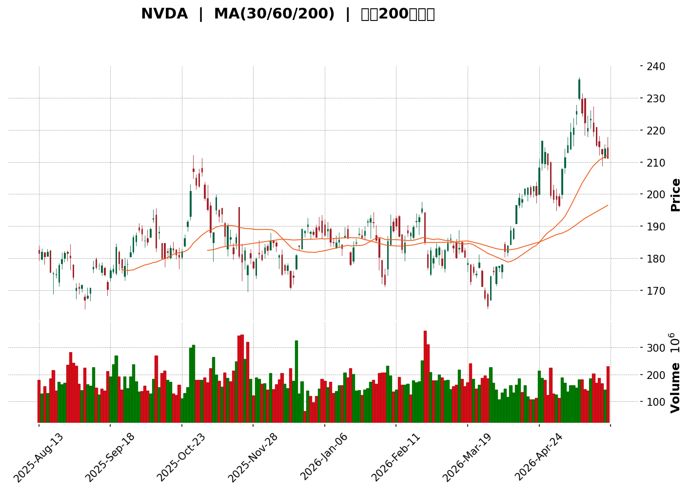
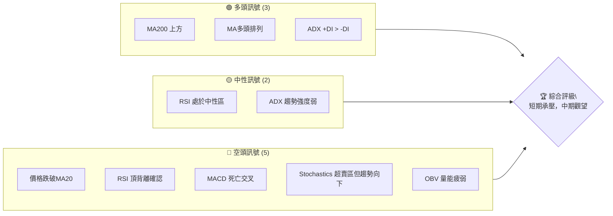
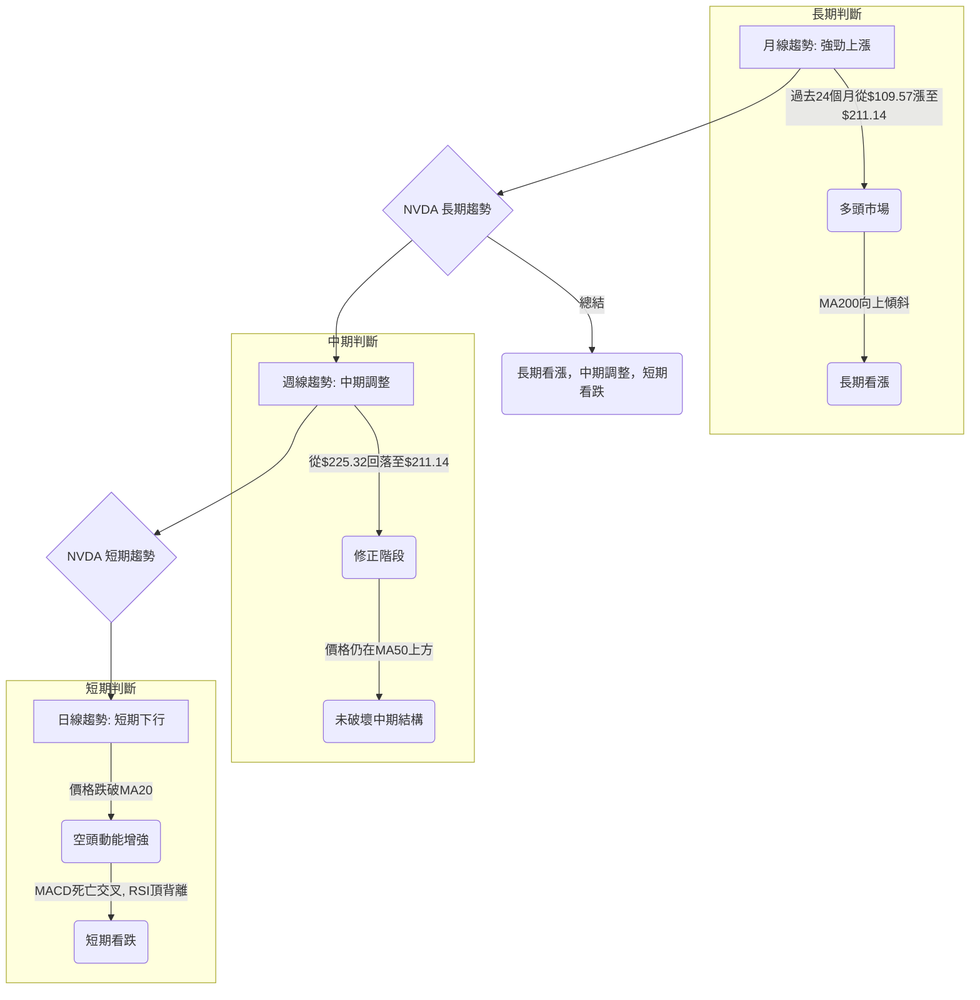

<details>
<summary>📊 靜態圖表 (點擊展開)</summary>

</details>

<html>
<head><meta charset="utf-8" /></head>
<body>
    <div>                        <script>window.PlotlyConfig = {MathJaxConfig: 'local'};</script>
        <script charset="utf-8" src="https://cdn.plot.ly/plotly-3.5.0.min.js" integrity="sha256-fHbNLP+GlIXN+efbQec78UkemUz3NJp7UmfGxC1tNxs=" crossorigin="anonymous"></script>                <div id="candlestick-chart" class="plotly-graph-div" style="height:500px; width:100%;"></div>            <script>                window.PLOTLYENV=window.PLOTLYENV || {};                                if (document.getElementById("candlestick-chart")) {                    Plotly.newPlot(                        "candlestick-chart",                        [{"close":{"dtype":"f8","bdata":"AAAAAOqxZkAAAAAArL9mQAAAAMBwjWZAAAAAAFq\u002fZkAAAADAi\u002fNlQAAAAADe62VAAAAA4G3eZUAAAADguz5mQAAAAMD2eGZAAAAAYKy3ZkAAAAAAPLJmQAAAAGB7hGZAAAAAYNXEZUAAAABADVhlQAAAAODuUmVAAAAAIDV0ZUAAAACgwN9kQAAAAGAGCWVAAAAAYGlXZUAAAAAAnilmQAAAAGDRJGZAAAAAgJ05ZkAAAAAgYDdmQAAAAMCL22VAAAAAgK5IZUAAAACgDwdmQAAAAKDRFGZAAAAAAODyZkAAAAAAIk1mQAAAAABrHmZAAAAAwHQ1ZkAAAABAdEVmQAAAAMCPumZAAAAAgOdRZ0AAAADABWdnQAAAAADRm2dAAAAAQC5zZ0AAAADAoDBnQAAAAEChIGdAAAAAANuiZ0AAAABAkBFoQAAAAAB65GZAAAAAIJSJZ0AAAADAU4BmQAAAAKDteWZAAAAAAEi5ZkAAAACAZeZmQAAAAKDW02ZAAAAAwHukZkAAAACgU4hmQAAAAOB6xGZAAAAAQKpHZ0AAAADgAe9nQAAAAABBIGlAAAAAgI3gaUAAAABgxFtpQAAAAAD4TmlAAAAA4G7baUAAAADAYdVoQAAAAOAIZmhAAAAAQOaBZ0AAAACgI4RnQAAAAKDm4GhAAAAAAHEkaEAAAABg6zhoQAAAAADdWmdAAAAAoMXEZ0AAAABgi1JnQAAAAADiqmZAAAAAAPxPZ0AAAABg2JNmQAAAACCIW2ZAAAAAgPXQZkAAAACAnTlmQAAAAMCvh2ZAAAAAwGAfZkAAAADgznxmQAAAACAVrmZAAAAAwD9yZkAAAADA1+tmQAAAAODNzGZAAAAAYEcxZ0AAAABAuB5nQAAAAECk+GZAAAAAQHKdZkAAAABAVuBlQAAAAID5CGZAAAAAgLs2ZkAAAADAyF1lQAAAAKAtxGVAAAAA4F2fZkAAAAAAw\u002fVmQAAAAIBkpmdAAAAAgDGTZ0AAAABAodBnQAAAAMC2hmdAAAAAgPRwZ0AAAABgrU9nQAAAAIDfmmdAAAAAoIODZ0AAAAAgW2dnQAAAAEAxo2dAAAAAoPUgZ0AAAAAgMxtnQAAAAIDCHWdAAAAAIJk5Z0AAAACgKeRmQAAAAMBGYWdAAAAAgAlHZ0AAAACA7kFmQAAAAEDs6WZAAAAAQI8aZ0AAAABgHXVnQAAAAKC3TmdAAAAAQFCQZ0AAAAAAT\u002fBnQAAAAID8D2hAAAAAQNTjZ0AAAADgMjNnQAAAAECRimZAAAAAQMfFZUAAAADA3HtlQAAAAIDMLGdAAAAAYPPAZ0AAAAAA9JBnQAAAAGBFwWdAAAAAoMFdZ0AAAACAmtlmQAAAAEC4HmdAAAAAwAh\u002fZ0AAAACAeXxnQAAAAGDpuWdAAAAAwETxZ0AAAADA3RpoQAAAAMCUcWhAAAAA4CgcZ0AAAAAAxiVmQAAAAEALz2ZAAAAAwEmBZkAAAACA9uBmQAAAAACQ6mZAAAAAoO45ZkAAAADAe9RmQAAAAABSGGdAAAAAwPVAZ0AAAADgeuRmQAAAAAAAiGZAAAAAQArnZkAAAACAwr1mQAAAAMDMjGZAAAAAgOtRZkAAAABgZpZlQAAAAOB69GVAAAAAYGbmZUAAAACAwlVmQAAAACCuZ2VAAAAA4KPwZEAAAACgcKVkQAAAAMDMzGVAAAAAAAD4ZUAAAADgeixmQAAAAOB6NGZAAAAAQDNDZkAAAABgj8JmQAAAAMAe\u002fWZAAAAAACmUZ0AAAACA66lnQAAAAOBRkGhAAAAAANfbaEAAAABAM8toQAAAAIDCNWlAAAAAgOtBaUAAAAAAKfxoQAAAAAAAUGlAAAAA4Hr0aEAAAADgowhqQAAAACCFE2tAAAAAoHClakAAAAAAAChqQAAAAIA98mhAAAAAYGbOaEAAAAAgXM9oQAAAAAAAkGhAAAAAYI\u002f6aUAAAAAAAHBqQAAAAGBm5mpAAAAAgBRua0AAAADA9ZhrQAAAAGCPOmxAAAAAIK53bUAAAACAPSpsQAAAAIA9ymtAAAAAIIWTa0AAAABACu9rQAAAAOBRcGtAAAAAYI\u002fqakAAAAAghdtqQAAAAEAzk2pAAAAAAADIakAAAADgemRqQA=="},"high":{"dtype":"f8","bdata":"VJppwg\u002f+ZkCsBGGjqt9mQBAcuybVu2ZAvwjDWxvdZkBElxOJB89mQGbl624Q\u002f2VATDjB4tsbZkCd4fIu7lFmQPYgPSQnvGZAugfjh4LLZkA9R8uptc5mQD34kiUPDmdAaxxnONpDZkBgQF5SPotlQFsnkjA0jGVA27JROpt6ZUAPNeLDDyBlQL3reKTPXWVArQZRU3NeZUDAowaVU2hmQOM6XrRTiGZAzLlUjJJSZkCVjrdiklpmQFHT5WRgL2ZAKk0hosqlZUCxMgD6kyJmQBQrJBvvQWZADQGWp\u002fMQZ0CGYzOJzMxmQPuIq\u002fhTeGZAsMmB0K+HZkDRAz40AnhmQOoMJJFa\u002f2ZAIAOkropqZ0AcntCw0YNnQP85tM7t4GdA60Ib6dnKZ0BK2+G6s2ZnQAq4r4JBoWdAut0mr4iyZ0CT1jzr6WhoQInk2gonc2hAY0vcI9rCZ0DSlCxV8xhnQE9Ee7cwG2dAWieU7VDoZkBDyW21jQJnQD3xoNK\u002fJWdAPj+NKKPYZkDCSYGIb+1mQLAyoxdR4GZAxro6iWFuZ0AlL49KU\u002f9nQHjtBxgWZGlAgA7IvlWFakAb+wFPZcRpQGByNjJP\u002fmlAwqrJHCNqakCGp\u002fi\u002fUn5pQHRshzG6XGlA\u002ffXkSyWzaEC3ouA4lIlnQJEwHLNg\u002fWhABC6U18BsaECsJu++yntoQMY1E0Fo7WdAJUqjHqbfZ0C3ZEH3VZ9nQA9352fzGGdAjIFAC9x6Z0Be0LWuT39oQPfhR4RFEWdANuFYBVvvZkBk9q5xfkRmQGoc2T163GZAOhiNUKZoZkC7CYuI94hmQFIws7h3NGdAfwSXTcLNZkC83rEeUhBnQHGInuDMFGdAPij6qax\u002fZ0C+LOLqtzZnQIEeAd8JL2dA2xK3E+2pZkBAoWBq7NlmQJMmWo4hTWZAbDOnCF9PZkB3mzrz2gNmQF7FvJt+BGZAx2zJ6xWuZkDBsp0KzQRnQKT2YXI7qmdAw8zy\u002fcqcZ0BFEcMKvxVoQKJirCL+l2dAdOd3W1qfZ0A5fIgTl9FnQFVbzfBsHWhA1knWLtMzaECiWItwGwVoQDQUZR+C62dA38tboEWxZ0AT8++XjkpnQDoujgiEY2dAYaj3ujGDZ0AmwRSKZg5nQFwwbVMStmdAQtfTAcDNZ0AW038W2MtmQCBVRNbWK2dAXSX0CB5FZ0D4h9Mk37JnQLmwZjODo2dAki3vt6u\u002fZ0B7B9YB3gpoQIXB31EGL2hAoHiX4ldPaEDruvRLRclnQEqjkT5RSGdAdCARvD9yZkD2y\u002fkO7xlmQM3MbgutX2dAC3wo5cg0aEBQsKDABg9oQGUOtjP8J2hA5\u002fgDSy8zaECLPQTsrG9nQEF0mMh5ZGdAREKhkILLZ0D67uIDb41nQKF+IwY7ymdASzzDbxA+aEA5HZX3TThoQAeD7VTRs2hAVt2+dPFIaEA7UI9bkNJmQIEVzxBn7mZAbMV3f3ycZkDHRqeDFBZnQGDIUO6ZAWdAVqwMzwDYZkB7QHuizdxmQGbmjuLBTWdAAAAAANdzZ0AAAACAFB5nQAAAAEDhQmdAAAAAACmcZ0AAAADAzCxnQAAAAAAp7GZAAAAAIFx\u002fZkAAAADgUUhmQAAAAADXS2ZAAAAAQAoHZkAAAABACqdmQAAAAOBREGZAAAAAQApfZUAAAABgZi5lQAAAAADX02VAAAAAANcrZkAAAAAgri9mQAAAAKBHOWZAAAAAIFxHZkAAAADgUShnQAAAAGCPAmdAAAAAAADAZ0AAAADAHrVnQAAAAOBRkGhAAAAAwMwMaUAAAABAM\u002ftoQAAAAGBmNmlAAAAAoHBFaUAAAAAAAFhpQAAAAAAAUGlAAAAAYI96aUAAAABgZl5qQAAAAGCPGmtAAAAAIFzXakAAAABACpdqQAAAAKCZSWpAAAAAAABgaUAAAAAgXDdpQAAAACCuB2lAAAAA4KMIakAAAABgZsZqQAAAAKCZOWtAAAAAoJnJa0AAAAAAAPhrQAAAAEDhemxAAAAAoEeRbUAAAAAAAPBsQAAAAAAAwGxAAAAAIFwPbEAAAAAAKURsQAAAAMDMbGxAAAAA4FGga0AAAACAwkVrQAAAAMDMxGpAAAAA4KPwakAAAABAhDtrQA=="},"hovertemplate":"\u003cb\u003e%{x|%Y-%m-%d}\u003c\u002fb\u003e\u003cbr\u003e\u958b: $%{open:.2f}\u003cbr\u003e\u9ad8: $%{high:.2f}\u003cbr\u003e\u4f4e: $%{low:.2f}\u003cbr\u003e\u6536: $%{close:.2f}\u003cextra\u003e\u003c\u002fextra\u003e","low":{"dtype":"f8","bdata":"CoHIDD9qZkAvDnj8w21mQDuOy0dVQGZAM4URT+uRZkCXDEc0v+5lQFJW1tuzGGVAXDHS1\u002f64ZUCTZc1dfWVlQMQP\u002fyhNEWZAE8vGB\u002fhYZkCVmF1nP2JmQOOmP54uDGZAtc\u002f3BuGjZUA4qbmYJuZkQM8xAj5DG2VAz\u002fPrLzgsZUDHJYlDXoFkQDyMjm5P6mRARXY0GcvWZEAcqSFoG+5lQA0wxn69DmZAR0+Tm8cNZkB+1wfqtM9lQJCXGDOMy2VAGOjDUIcMZUDFtSjTHJ5lQFhxStck5WVADxcFQRvWZUC9KjXfGQZmQE1treku7GVA9QCAWY2jZUCeHoouJd1lQJMEKGCbiWZAEme21riuZkBDD+VgJ\u002fxmQDk3F19CgWdAL4DDQ4IrZ0AN9dd86ulmQAMAYo9a\u002f2ZA4krfz59QZ0AZn8ebP+FnQEEqmd\u002f1wGZAY7BhHxE+Z0B\u002fDgWsxHVmQFgC3iioKGZAmNekNQJ4ZkCeTcVeXndmQJgOgbG4tmZAaHNC2fd4ZkCtyl\u002fqshdmQEAQ0uGleGZAZF3e21rvZkD2l6cAGY1nQKT1MDNy\u002fGdA3\u002fUcqD2YaUCgas2UaSxpQCy7tMCHQWlAhy4FkDKxaUCqZglvEL1oQIpd48AdVGhAedJWZ4FLZ0BF8UDufVxmQGbh7FqZOGhAQ\u002fpPjO3oZ0DJZ5EmfeNnQLL4TNWN+mZAp1uP\u002f+yRZkADvxutlwlnQAIgvykrdGZATEU20urZZkD76u11kXpmQEXx4vkmnWVAbCMVdb0OZkDK2\u002fQQATFlQC3BF9ENR2ZAivEpM2EPZkA67B1cJrVlQC3zQBBef2ZAyFqADuRiZkDLY+qjaH5mQF\u002f6QIrOnGZAPpt15XvMZkAtcEE77OlmQGelieX2wGZAQ8tiqYgTZkBb5WqNidNlQAgX8i6o4GVAHo7kP3\u002fcZUB1R3gHoEllQMqUd0fxeWVAZGrRD5MKZkB4SjNY4spmQO9AE6x73GZAZVdHhY5SZ0Di6T6frH9nQBo6WEbMPGdAb1s3pW9dZ0AvLyKBW09nQJrL+2L+h2dAzu2DP3pEZ0CdUamv6llnQFGOiMGYUWdAE57h9mb2ZkBD1SEnH\u002fVmQJvy7rlS4GZAdU2EcXvsZkCFc8NpSZlmQBJjqtE8SmdAP0sJ0TxCZ0COlj5UNjNmQPkLPa59TGZA1wVZ53D9ZkCvnYag6llnQOiecrZbP2dAjy08ABQ2Z0Bd7pgejbpnQPuQR\u002fyYQWdAHytvPLauZ0CJ8s8S1xtnQOu\u002fvvINB2ZA9trZgtJ8ZUDXfIjgqWBlQC\u002feocvl0mVAW04q0xT+ZkAvb7CPg4NnQCIIQzFQmGdAsVDNMP9PZ0DbQWLKkLJmQPayGRFzZWZAtRiGCv9XZ0D8chB+zDRnQKWSNBjCPWdAO1N2XzuyZ0D8HJCqeWxnQAjpAKnxOGhAwjO3wOsJZ0CfqN3b2gtmQDarhHkt1GVARkV4IyIdZkDkah2ym4FmQMs2cCvaO2ZAJJONEe8ZZkDV3OqknfFlQG1EFzkBwGZAAAAAYGYOZ0AAAAAAALhmQAAAAIAUfmZAAAAAwB6tZkAAAACAwrVmQAAAAGCPimZAAAAAoEf5ZUAAAABACndlQAAAAOBR2GVAAAAAIFy\u002fZUAAAABAMxtmQAAAAOB6ZGVAAAAA4FHgZEAAAADgo4hkQAAAAGC43mRAAAAAAADYZUAAAAAA12tlQAAAAOBR+GVAAAAAwB61ZUAAAACgmYlmQAAAAADXk2ZAAAAAoJkJZ0AAAAAgrjdnQAAAAOCj2GdAAAAAIK53aEAAAACA63loQAAAAOCj6GhAAAAAQOG6aEAAAAAAAOBoQAAAAAAA4GhAAAAAQAqnaEAAAACA6\u002floQAAAAAAp7GlAAAAAYGYGakAAAABgj\u002fJpQAAAAGBm1mhAAAAAANejaEAAAAAgrldoQAAAAMD1gGhAAAAAIIXTaEAAAAAAANBpQAAAAOB6nGpAAAAA4Hq8akAAAACgcN1qQAAAAIA9smtAAAAAoJmpbEAAAAAgrgdsQAAAAADXS2tAAAAAwB49a0AAAAAAAJBrQAAAAIDCPWtAAAAAoJnZakAAAAAAAIBqQAAAAMD1GGpAAAAAQApnakAAAAAAKWRqQA=="},"name":"\u50f9\u683c","open":{"dtype":"f8","bdata":"i176WN7SZkCnB183C3dmQIZBsm0xu2ZAOyGUSz2SZkDl63khysxmQLv7JDCC5GVA\u002f1VPLUXaZUAS7IUympJlQNVqvnxASmZAD6MPVPaAZkDkWI5bZL5mQHegfV1HmWZAHUlXppJCZkD5E9iPGD9lQM82wcYCYWVAMebDW1VRZUCHgDMgEQBlQGWh24i18GRAv\u002fIXBvshZUAHyG9wihNmQL75bv4gdWZAfpmE6wM4ZkCSz+6e0vRlQOFq\u002ftdgH2ZAI\u002f4Jo9+TZUA8T1Oov75lQIvMWq8F+GVAls0v+fvoZUAU6dKQZr5mQDDz+BoCeGZAZHLLQr\u002fOZUB\u002fAptk0ERmQLNb10YgjWZAHoKCjOvBZkDxF2qMBydnQHsjibyIsmdA7GyAVmqlZ0ACVTUpWS9nQEenFq60RmdAIcP1qJVRZ0DGaE8urwZoQJzSuNCjL2hAeG+WMGF+Z0C+rxWc\u002fRdnQLMXmWfzGGdAjwdPP7jGZkD+EMp7IIVmQD50ME+E42ZAPj+NKKPYZkDAzQL616NmQO2AulDOjGZAEKSJzTv6ZkCi4Wo5A79nQPDWygzsIGhANC6rJ6H+aUCL1JU3FKRpQM3gMrCszWlAXMWeK9QBakAD8F5fSV9pQHixqCzx12hAuTEiAMCMaEBNFN+LJhxnQASzCqvVYmhAz\u002fxyM29kaEAxRxBGWnZoQJGb57rt4GdA8MW3suDaZkAL0RjxYj5nQKiQ3w6E62ZA43OcTqEYZ0A3vDkatn1oQF6qpiALp2ZAaD5LwAxvZkAEPU5egdxlQPfJj6SFs2ZAOekK0bBfZkCH2I7DtNdlQETv6Fqut2ZAkiD7iOyhZkCIWqGHhrNmQHdHBFgp\u002fGZAfk456inUZkD3xgo9mTFnQOUM5zi4HmdAe\u002f3NyaWIZkDhqojMNKNmQG6xzqTFPWZAq1uexQMIZkAE0aE25QJmQNnOtVOo0GVAmR5cSiIVZkB+YOAFH\u002f1mQNJvISS53mZAlCkMLMF9Z0C\u002fyUFlHL1nQERw6xlldmdAKfqRsFqHZ0AVPdCD6bFnQBxumw+NumdAj+sB4\u002fz3Z0BdIclrT9BnQF\u002fnT93pkWdAZGVGUjGjZ0ClegRHPSJnQEl5OwO55mZAHbDt+60fZ0B9Pfu56wlnQOA3Yl6tT2dAr91LfDuiZ0A\u002fCAQNfLxmQHeSfERKYWZA+oI4Cq4XZ0CKH07TrG9nQMT7utHLZGdAkrpaEVtnZ0CM0VwcT+hnQFz71GSM6mdAOCzrlmPmZ0Czm6BrE2ZnQK7E+YFbR2dAz6mwyWhuZkBtxZ7ldN1lQHRoSB7GFWZA6Kj7LwAIZ0BoCIcd1OtnQCBtog8RDmhAtynXLKAgaEBIH0kOCW9nQLoEb22vt2ZATBWSSKyXZ0AeK0afmGFnQOZuutDqUWdAIRME8XfsZ0CmUVs6We9nQBSHDR4QTmhA1NsDt01IaECoFImzr6dmQBj5iU8E4GVAL6Aq8V5PZkCivP+GxI1mQObsL1YgpWZAP8efepF6ZkAPUbz0QBpmQECa2ex7zGZAAAAAwB49Z0AAAACgmQFnQAAAAKBwHWdAAAAAQArfZkAAAACA6yFnQAAAACBcz2ZAAAAA4FFAZkAAAAAAAEBmQAAAAOBRKGZAAAAAYI\u002faZUAAAABAMyNmQAAAAIA9AmZAAAAAAABAZUAAAADA9RhlQAAAAEAK32RAAAAAAAAAZkAAAACAwoVlQAAAAMAeJWZAAAAAIFz3ZUAAAAAAABBnQAAAAEDhumZAAAAAgOsJZ0AAAADA9UBnQAAAAEDh2mdAAAAAoEeRaEAAAACAwq1oQAAAAMDM\u002fGhAAAAAIFz\u002faEAAAAAAKURpQAAAACCuH2lAAAAAYLhOaUAAAABguP5oQAAAAMDMNGpAAAAAIK4vakAAAABgZpZqQAAAAIDCPWpAAAAAwPUoaUAAAAAAAPBoQAAAAKCZ6WhAAAAA4Hr8aEAAAABA4QpqQAAAAMD1oGpAAAAAoEfBakAAAACgmVFrQAAAAIDCHWxAAAAAQDO7bEAAAADgUbhsQAAAAADXu2xAAAAAANdza0AAAACAwuVrQAAAAKBHyWtAAAAAwMyca0AAAACgRxFrQAAAAADXw2pAAAAAwPVoakAAAABgZs5qQA=="},"x":["2025-08-13T00:00:00-04:00","2025-08-14T00:00:00-04:00","2025-08-15T00:00:00-04:00","2025-08-18T00:00:00-04:00","2025-08-19T00:00:00-04:00","2025-08-20T00:00:00-04:00","2025-08-21T00:00:00-04:00","2025-08-22T00:00:00-04:00","2025-08-25T00:00:00-04:00","2025-08-26T00:00:00-04:00","2025-08-27T00:00:00-04:00","2025-08-28T00:00:00-04:00","2025-08-29T00:00:00-04:00","2025-09-02T00:00:00-04:00","2025-09-03T00:00:00-04:00","2025-09-04T00:00:00-04:00","2025-09-05T00:00:00-04:00","2025-09-08T00:00:00-04:00","2025-09-09T00:00:00-04:00","2025-09-10T00:00:00-04:00","2025-09-11T00:00:00-04:00","2025-09-12T00:00:00-04:00","2025-09-15T00:00:00-04:00","2025-09-16T00:00:00-04:00","2025-09-17T00:00:00-04:00","2025-09-18T00:00:00-04:00","2025-09-19T00:00:00-04:00","2025-09-22T00:00:00-04:00","2025-09-23T00:00:00-04:00","2025-09-24T00:00:00-04:00","2025-09-25T00:00:00-04:00","2025-09-26T00:00:00-04:00","2025-09-29T00:00:00-04:00","2025-09-30T00:00:00-04:00","2025-10-01T00:00:00-04:00","2025-10-02T00:00:00-04:00","2025-10-03T00:00:00-04:00","2025-10-06T00:00:00-04:00","2025-10-07T00:00:00-04:00","2025-10-08T00:00:00-04:00","2025-10-09T00:00:00-04:00","2025-10-10T00:00:00-04:00","2025-10-13T00:00:00-04:00","2025-10-14T00:00:00-04:00","2025-10-15T00:00:00-04:00","2025-10-16T00:00:00-04:00","2025-10-17T00:00:00-04:00","2025-10-20T00:00:00-04:00","2025-10-21T00:00:00-04:00","2025-10-22T00:00:00-04:00","2025-10-23T00:00:00-04:00","2025-10-24T00:00:00-04:00","2025-10-27T00:00:00-04:00","2025-10-28T00:00:00-04:00","2025-10-29T00:00:00-04:00","2025-10-30T00:00:00-04:00","2025-10-31T00:00:00-04:00","2025-11-03T00:00:00-05:00","2025-11-04T00:00:00-05:00","2025-11-05T00:00:00-05:00","2025-11-06T00:00:00-05:00","2025-11-07T00:00:00-05:00","2025-11-10T00:00:00-05:00","2025-11-11T00:00:00-05:00","2025-11-12T00:00:00-05:00","2025-11-13T00:00:00-05:00","2025-11-14T00:00:00-05:00","2025-11-17T00:00:00-05:00","2025-11-18T00:00:00-05:00","2025-11-19T00:00:00-05:00","2025-11-20T00:00:00-05:00","2025-11-21T00:00:00-05:00","2025-11-24T00:00:00-05:00","2025-11-25T00:00:00-05:00","2025-11-26T00:00:00-05:00","2025-11-28T00:00:00-05:00","2025-12-01T00:00:00-05:00","2025-12-02T00:00:00-05:00","2025-12-03T00:00:00-05:00","2025-12-04T00:00:00-05:00","2025-12-05T00:00:00-05:00","2025-12-08T00:00:00-05:00","2025-12-09T00:00:00-05:00","2025-12-10T00:00:00-05:00","2025-12-11T00:00:00-05:00","2025-12-12T00:00:00-05:00","2025-12-15T00:00:00-05:00","2025-12-16T00:00:00-05:00","2025-12-17T00:00:00-05:00","2025-12-18T00:00:00-05:00","2025-12-19T00:00:00-05:00","2025-12-22T00:00:00-05:00","2025-12-23T00:00:00-05:00","2025-12-24T00:00:00-05:00","2025-12-26T00:00:00-05:00","2025-12-29T00:00:00-05:00","2025-12-30T00:00:00-05:00","2025-12-31T00:00:00-05:00","2026-01-02T00:00:00-05:00","2026-01-05T00:00:00-05:00","2026-01-06T00:00:00-05:00","2026-01-07T00:00:00-05:00","2026-01-08T00:00:00-05:00","2026-01-09T00:00:00-05:00","2026-01-12T00:00:00-05:00","2026-01-13T00:00:00-05:00","2026-01-14T00:00:00-05:00","2026-01-15T00:00:00-05:00","2026-01-16T00:00:00-05:00","2026-01-20T00:00:00-05:00","2026-01-21T00:00:00-05:00","2026-01-22T00:00:00-05:00","2026-01-23T00:00:00-05:00","2026-01-26T00:00:00-05:00","2026-01-27T00:00:00-05:00","2026-01-28T00:00:00-05:00","2026-01-29T00:00:00-05:00","2026-01-30T00:00:00-05:00","2026-02-02T00:00:00-05:00","2026-02-03T00:00:00-05:00","2026-02-04T00:00:00-05:00","2026-02-05T00:00:00-05:00","2026-02-06T00:00:00-05:00","2026-02-09T00:00:00-05:00","2026-02-10T00:00:00-05:00","2026-02-11T00:00:00-05:00","2026-02-12T00:00:00-05:00","2026-02-13T00:00:00-05:00","2026-02-17T00:00:00-05:00","2026-02-18T00:00:00-05:00","2026-02-19T00:00:00-05:00","2026-02-20T00:00:00-05:00","2026-02-23T00:00:00-05:00","2026-02-24T00:00:00-05:00","2026-02-25T00:00:00-05:00","2026-02-26T00:00:00-05:00","2026-02-27T00:00:00-05:00","2026-03-02T00:00:00-05:00","2026-03-03T00:00:00-05:00","2026-03-04T00:00:00-05:00","2026-03-05T00:00:00-05:00","2026-03-06T00:00:00-05:00","2026-03-09T00:00:00-04:00","2026-03-10T00:00:00-04:00","2026-03-11T00:00:00-04:00","2026-03-12T00:00:00-04:00","2026-03-13T00:00:00-04:00","2026-03-16T00:00:00-04:00","2026-03-17T00:00:00-04:00","2026-03-18T00:00:00-04:00","2026-03-19T00:00:00-04:00","2026-03-20T00:00:00-04:00","2026-03-23T00:00:00-04:00","2026-03-24T00:00:00-04:00","2026-03-25T00:00:00-04:00","2026-03-26T00:00:00-04:00","2026-03-27T00:00:00-04:00","2026-03-30T00:00:00-04:00","2026-03-31T00:00:00-04:00","2026-04-01T00:00:00-04:00","2026-04-02T00:00:00-04:00","2026-04-06T00:00:00-04:00","2026-04-07T00:00:00-04:00","2026-04-08T00:00:00-04:00","2026-04-09T00:00:00-04:00","2026-04-10T00:00:00-04:00","2026-04-13T00:00:00-04:00","2026-04-14T00:00:00-04:00","2026-04-15T00:00:00-04:00","2026-04-16T00:00:00-04:00","2026-04-17T00:00:00-04:00","2026-04-20T00:00:00-04:00","2026-04-21T00:00:00-04:00","2026-04-22T00:00:00-04:00","2026-04-23T00:00:00-04:00","2026-04-24T00:00:00-04:00","2026-04-27T00:00:00-04:00","2026-04-28T00:00:00-04:00","2026-04-29T00:00:00-04:00","2026-04-30T00:00:00-04:00","2026-05-01T00:00:00-04:00","2026-05-04T00:00:00-04:00","2026-05-05T00:00:00-04:00","2026-05-06T00:00:00-04:00","2026-05-07T00:00:00-04:00","2026-05-08T00:00:00-04:00","2026-05-11T00:00:00-04:00","2026-05-12T00:00:00-04:00","2026-05-13T00:00:00-04:00","2026-05-14T00:00:00-04:00","2026-05-15T00:00:00-04:00","2026-05-18T00:00:00-04:00","2026-05-19T00:00:00-04:00","2026-05-20T00:00:00-04:00","2026-05-21T00:00:00-04:00","2026-05-22T00:00:00-04:00","2026-05-26T00:00:00-04:00","2026-05-27T00:00:00-04:00","2026-05-28T00:00:00-04:00","2026-05-29T00:00:00-04:00"],"type":"candlestick"},{"hovertemplate":"MA30: $%{y:.2f}\u003cextra\u003e\u003c\u002fextra\u003e","line":{"color":"#2196F3","dash":"dash","width":2},"mode":"lines","name":"MA30","x":["2025-08-13T00:00:00-04:00","2025-08-14T00:00:00-04:00","2025-08-15T00:00:00-04:00","2025-08-18T00:00:00-04:00","2025-08-19T00:00:00-04:00","2025-08-20T00:00:00-04:00","2025-08-21T00:00:00-04:00","2025-08-22T00:00:00-04:00","2025-08-25T00:00:00-04:00","2025-08-26T00:00:00-04:00","2025-08-27T00:00:00-04:00","2025-08-28T00:00:00-04:00","2025-08-29T00:00:00-04:00","2025-09-02T00:00:00-04:00","2025-09-03T00:00:00-04:00","2025-09-04T00:00:00-04:00","2025-09-05T00:00:00-04:00","2025-09-08T00:00:00-04:00","2025-09-09T00:00:00-04:00","2025-09-10T00:00:00-04:00","2025-09-11T00:00:00-04:00","2025-09-12T00:00:00-04:00","2025-09-15T00:00:00-04:00","2025-09-16T00:00:00-04:00","2025-09-17T00:00:00-04:00","2025-09-18T00:00:00-04:00","2025-09-19T00:00:00-04:00","2025-09-22T00:00:00-04:00","2025-09-23T00:00:00-04:00","2025-09-24T00:00:00-04:00","2025-09-25T00:00:00-04:00","2025-09-26T00:00:00-04:00","2025-09-29T00:00:00-04:00","2025-09-30T00:00:00-04:00","2025-10-01T00:00:00-04:00","2025-10-02T00:00:00-04:00","2025-10-03T00:00:00-04:00","2025-10-06T00:00:00-04:00","2025-10-07T00:00:00-04:00","2025-10-08T00:00:00-04:00","2025-10-09T00:00:00-04:00","2025-10-10T00:00:00-04:00","2025-10-13T00:00:00-04:00","2025-10-14T00:00:00-04:00","2025-10-15T00:00:00-04:00","2025-10-16T00:00:00-04:00","2025-10-17T00:00:00-04:00","2025-10-20T00:00:00-04:00","2025-10-21T00:00:00-04:00","2025-10-22T00:00:00-04:00","2025-10-23T00:00:00-04:00","2025-10-24T00:00:00-04:00","2025-10-27T00:00:00-04:00","2025-10-28T00:00:00-04:00","2025-10-29T00:00:00-04:00","2025-10-30T00:00:00-04:00","2025-10-31T00:00:00-04:00","2025-11-03T00:00:00-05:00","2025-11-04T00:00:00-05:00","2025-11-05T00:00:00-05:00","2025-11-06T00:00:00-05:00","2025-11-07T00:00:00-05:00","2025-11-10T00:00:00-05:00","2025-11-11T00:00:00-05:00","2025-11-12T00:00:00-05:00","2025-11-13T00:00:00-05:00","2025-11-14T00:00:00-05:00","2025-11-17T00:00:00-05:00","2025-11-18T00:00:00-05:00","2025-11-19T00:00:00-05:00","2025-11-20T00:00:00-05:00","2025-11-21T00:00:00-05:00","2025-11-24T00:00:00-05:00","2025-11-25T00:00:00-05:00","2025-11-26T00:00:00-05:00","2025-11-28T00:00:00-05:00","2025-12-01T00:00:00-05:00","2025-12-02T00:00:00-05:00","2025-12-03T00:00:00-05:00","2025-12-04T00:00:00-05:00","2025-12-05T00:00:00-05:00","2025-12-08T00:00:00-05:00","2025-12-09T00:00:00-05:00","2025-12-10T00:00:00-05:00","2025-12-11T00:00:00-05:00","2025-12-12T00:00:00-05:00","2025-12-15T00:00:00-05:00","2025-12-16T00:00:00-05:00","2025-12-17T00:00:00-05:00","2025-12-18T00:00:00-05:00","2025-12-19T00:00:00-05:00","2025-12-22T00:00:00-05:00","2025-12-23T00:00:00-05:00","2025-12-24T00:00:00-05:00","2025-12-26T00:00:00-05:00","2025-12-29T00:00:00-05:00","2025-12-30T00:00:00-05:00","2025-12-31T00:00:00-05:00","2026-01-02T00:00:00-05:00","2026-01-05T00:00:00-05:00","2026-01-06T00:00:00-05:00","2026-01-07T00:00:00-05:00","2026-01-08T00:00:00-05:00","2026-01-09T00:00:00-05:00","2026-01-12T00:00:00-05:00","2026-01-13T00:00:00-05:00","2026-01-14T00:00:00-05:00","2026-01-15T00:00:00-05:00","2026-01-16T00:00:00-05:00","2026-01-20T00:00:00-05:00","2026-01-21T00:00:00-05:00","2026-01-22T00:00:00-05:00","2026-01-23T00:00:00-05:00","2026-01-26T00:00:00-05:00","2026-01-27T00:00:00-05:00","2026-01-28T00:00:00-05:00","2026-01-29T00:00:00-05:00","2026-01-30T00:00:00-05:00","2026-02-02T00:00:00-05:00","2026-02-03T00:00:00-05:00","2026-02-04T00:00:00-05:00","2026-02-05T00:00:00-05:00","2026-02-06T00:00:00-05:00","2026-02-09T00:00:00-05:00","2026-02-10T00:00:00-05:00","2026-02-11T00:00:00-05:00","2026-02-12T00:00:00-05:00","2026-02-13T00:00:00-05:00","2026-02-17T00:00:00-05:00","2026-02-18T00:00:00-05:00","2026-02-19T00:00:00-05:00","2026-02-20T00:00:00-05:00","2026-02-23T00:00:00-05:00","2026-02-24T00:00:00-05:00","2026-02-25T00:00:00-05:00","2026-02-26T00:00:00-05:00","2026-02-27T00:00:00-05:00","2026-03-02T00:00:00-05:00","2026-03-03T00:00:00-05:00","2026-03-04T00:00:00-05:00","2026-03-05T00:00:00-05:00","2026-03-06T00:00:00-05:00","2026-03-09T00:00:00-04:00","2026-03-10T00:00:00-04:00","2026-03-11T00:00:00-04:00","2026-03-12T00:00:00-04:00","2026-03-13T00:00:00-04:00","2026-03-16T00:00:00-04:00","2026-03-17T00:00:00-04:00","2026-03-18T00:00:00-04:00","2026-03-19T00:00:00-04:00","2026-03-20T00:00:00-04:00","2026-03-23T00:00:00-04:00","2026-03-24T00:00:00-04:00","2026-03-25T00:00:00-04:00","2026-03-26T00:00:00-04:00","2026-03-27T00:00:00-04:00","2026-03-30T00:00:00-04:00","2026-03-31T00:00:00-04:00","2026-04-01T00:00:00-04:00","2026-04-02T00:00:00-04:00","2026-04-06T00:00:00-04:00","2026-04-07T00:00:00-04:00","2026-04-08T00:00:00-04:00","2026-04-09T00:00:00-04:00","2026-04-10T00:00:00-04:00","2026-04-13T00:00:00-04:00","2026-04-14T00:00:00-04:00","2026-04-15T00:00:00-04:00","2026-04-16T00:00:00-04:00","2026-04-17T00:00:00-04:00","2026-04-20T00:00:00-04:00","2026-04-21T00:00:00-04:00","2026-04-22T00:00:00-04:00","2026-04-23T00:00:00-04:00","2026-04-24T00:00:00-04:00","2026-04-27T00:00:00-04:00","2026-04-28T00:00:00-04:00","2026-04-29T00:00:00-04:00","2026-04-30T00:00:00-04:00","2026-05-01T00:00:00-04:00","2026-05-04T00:00:00-04:00","2026-05-05T00:00:00-04:00","2026-05-06T00:00:00-04:00","2026-05-07T00:00:00-04:00","2026-05-08T00:00:00-04:00","2026-05-11T00:00:00-04:00","2026-05-12T00:00:00-04:00","2026-05-13T00:00:00-04:00","2026-05-14T00:00:00-04:00","2026-05-15T00:00:00-04:00","2026-05-18T00:00:00-04:00","2026-05-19T00:00:00-04:00","2026-05-20T00:00:00-04:00","2026-05-21T00:00:00-04:00","2026-05-22T00:00:00-04:00","2026-05-26T00:00:00-04:00","2026-05-27T00:00:00-04:00","2026-05-28T00:00:00-04:00","2026-05-29T00:00:00-04:00"],"y":{"dtype":"f8","bdata":"AAAAAAAA+H8AAAAAAAD4fwAAAAAAAPh\u002fAAAAAAAA+H8AAAAAAAD4fwAAAAAAAPh\u002fAAAAAAAA+H8AAAAAAAD4fwAAAAAAAPh\u002fAAAAAAAA+H8AAAAAAAD4fwAAAAAAAPh\u002fAAAAAAAA+H8AAAAAAAD4fwAAAAAAAPh\u002fAAAAAAAA+H8AAAAAAAD4fwAAAAAAAPh\u002fAAAAAAAA+H8AAAAAAAD4fwAAAAAAAPh\u002fAAAAAAAA+H8AAAAAAAD4fwAAAAAAAPh\u002fAAAAAAAA+H8AAAAAAAD4fwAAAAAAAPh\u002fAAAAAAAA+H8AAAAAAAD4f7y7uxsEDmZAEREREd4JZkBEREQkywVmQM3MzCxMB2ZAIiIiwi4MZkARERGxkBhmQImIiKj2JmZAmpmZiXQ0ZkAzMzOzhDxmQDMzM3MbQmZAZmZmVvJJZkCJiIhYqFVmQAAAAIDbWGZAzczM7PJnZkBEREQk03FmQO\u002fu7m6oe2ZAVVVVZX6GZkCJiIgoyJdmQN7d3V0Tp2ZARERElC2yZkBERETEVbVmQHd3dzeoumZAREREpKjDZkCrqqoqUNJmQDMzMxM07mZAzczMLGYVZ0CamZmZ0jFnQJqZmWlcTWdAmpmZ+S1mZ0AzMzOzyXtnQFVVVeU9j2dA7+7uvlKaZ0AREREx8qRnQLy7u2tKt2dAERERAU++Z0AAAAAgTsVnQLy7u9sjw2dAq6qqGtzFZ0BmZmaG\u002fcZnQAAAAMAQw2dAVVVVlU3AZ0ARERFBlLNnQImIiKgDr2dAzczMPNyoZ0BERETUgKZnQLy7uzv2pmdAzczM7NShZ0B3d3fnT55nQImIiLgNnWdA3t3dDWGbZ0AiIiJCsp5nQKuqqkr5nmdAMzMzQzqeZ0AAAADgSJdnQImIiMjlhGdAq6qqig9pZ0C8u7urWEtnQJqZmclpL2dA3t3dvVIQZ0AzMzOTvPJmQFVVVVVG3GZAERERQbnUZkDNzMxM+s9mQO\u002fu7n5+xWZAvLu7C6fAZkC8u7sbLb1mQM3MzEyjvmZAAAAAENi7ZkCJiIiYv7tmQDMzM4O\u002fw2ZAvLu7O3fFZkAAAAAghMxmQJqZmSlw12ZAVVVV1RraZkAiIiLSn+FmQCIiInKg5mZAmpmZuQjwZkDv7u6uevNmQN7d3c1z+WZAiYiImIsAZ0AAAACw4fpmQKuqqira+2ZAvLu7Sxj7ZkCJiIiI+f1mQLy7uwvYAGdAMzMzg\u002fAIZ0Dv7u7eiRpnQFVVVcXWK2dAVVVVZSQ6Z0ARERERyklnQM3MzPxmUGdAvLu7OyZJZ0De3d19jTxnQEREROR\u002fOGdAq6qqWgY6Z0Crqqr65jdnQKuqqqraOWdAZmZm1jY5Z0BmZmZGRzVnQFVVVdUjMWdAq6qqmv0wZ0ARERHRsTFnQAAAALBzMmdAIiIiQmU5Z0AiIiLy6kFnQBEREcE+TWdAvLu7i0NMZ0BERETk6kVnQKuqqgoLQWdAVVVVlXM6Z0BmZmamwD9nQLy7uxvGP2dAmpmZSUk4Z0ARERGR7jJnQBEREWEeMWdAq6qqOnkuZ0AiIiLCiyVnQO\u002fu7s56GGdAzczMrA0QZ0B3d3eHIwxnQERERJQ2DGdAREREdOIQZ0CJiIjoxBFnQJqZmclbB2dAmpmZSYr3ZkAzMzOjCO1mQAAAABD72GZA7+7u3kbEZkDNzMyseLFmQHd3dxc1pmZARERERCyZZkDNzMwc+Y1mQGZmZvb9gGZAvLu7C6hyZkB3d3f3LWdmQCIiIqLDWmZAMzMzo8NeZkAiIiLSs2tmQERERKStemZAq6qqasOOZkBmZmbGGp9mQGZmZoatsmZAmpmZSYvMZkDe3d3t7t5mQBERESHb8WZAERERkV8AZ0C8u7u7LRtnQAAAAHD2QWdAiYiIyOhhZ0B3d3f3DH9nQImIiKh\u002fk2dARERE9LaoZ0DNzMycNsRnQImIiMh22mdAMzMz80T9Z0AAAAAARyBoQCIiIgIrT2hAERERoYyGaEDe3d3d3cFoQAAAALC5+GhAVVVV9bY4aUC8u7sL12tpQKuqqqp\u002fm2lAq6qqutfIaUBVVVX1\u002ffRpQBERESH3GmpAIiIiAnI3akDNzMzcslJqQCIiIoLcY2pAZmZmRkR0akC8u7vL6IFqQA=="},"type":"scatter"},{"hovertemplate":"MA60: $%{y:.2f}\u003cextra\u003e\u003c\u002fextra\u003e","line":{"color":"#9C27B0","dash":"dash","width":2},"mode":"lines","name":"MA60","x":["2025-08-13T00:00:00-04:00","2025-08-14T00:00:00-04:00","2025-08-15T00:00:00-04:00","2025-08-18T00:00:00-04:00","2025-08-19T00:00:00-04:00","2025-08-20T00:00:00-04:00","2025-08-21T00:00:00-04:00","2025-08-22T00:00:00-04:00","2025-08-25T00:00:00-04:00","2025-08-26T00:00:00-04:00","2025-08-27T00:00:00-04:00","2025-08-28T00:00:00-04:00","2025-08-29T00:00:00-04:00","2025-09-02T00:00:00-04:00","2025-09-03T00:00:00-04:00","2025-09-04T00:00:00-04:00","2025-09-05T00:00:00-04:00","2025-09-08T00:00:00-04:00","2025-09-09T00:00:00-04:00","2025-09-10T00:00:00-04:00","2025-09-11T00:00:00-04:00","2025-09-12T00:00:00-04:00","2025-09-15T00:00:00-04:00","2025-09-16T00:00:00-04:00","2025-09-17T00:00:00-04:00","2025-09-18T00:00:00-04:00","2025-09-19T00:00:00-04:00","2025-09-22T00:00:00-04:00","2025-09-23T00:00:00-04:00","2025-09-24T00:00:00-04:00","2025-09-25T00:00:00-04:00","2025-09-26T00:00:00-04:00","2025-09-29T00:00:00-04:00","2025-09-30T00:00:00-04:00","2025-10-01T00:00:00-04:00","2025-10-02T00:00:00-04:00","2025-10-03T00:00:00-04:00","2025-10-06T00:00:00-04:00","2025-10-07T00:00:00-04:00","2025-10-08T00:00:00-04:00","2025-10-09T00:00:00-04:00","2025-10-10T00:00:00-04:00","2025-10-13T00:00:00-04:00","2025-10-14T00:00:00-04:00","2025-10-15T00:00:00-04:00","2025-10-16T00:00:00-04:00","2025-10-17T00:00:00-04:00","2025-10-20T00:00:00-04:00","2025-10-21T00:00:00-04:00","2025-10-22T00:00:00-04:00","2025-10-23T00:00:00-04:00","2025-10-24T00:00:00-04:00","2025-10-27T00:00:00-04:00","2025-10-28T00:00:00-04:00","2025-10-29T00:00:00-04:00","2025-10-30T00:00:00-04:00","2025-10-31T00:00:00-04:00","2025-11-03T00:00:00-05:00","2025-11-04T00:00:00-05:00","2025-11-05T00:00:00-05:00","2025-11-06T00:00:00-05:00","2025-11-07T00:00:00-05:00","2025-11-10T00:00:00-05:00","2025-11-11T00:00:00-05:00","2025-11-12T00:00:00-05:00","2025-11-13T00:00:00-05:00","2025-11-14T00:00:00-05:00","2025-11-17T00:00:00-05:00","2025-11-18T00:00:00-05:00","2025-11-19T00:00:00-05:00","2025-11-20T00:00:00-05:00","2025-11-21T00:00:00-05:00","2025-11-24T00:00:00-05:00","2025-11-25T00:00:00-05:00","2025-11-26T00:00:00-05:00","2025-11-28T00:00:00-05:00","2025-12-01T00:00:00-05:00","2025-12-02T00:00:00-05:00","2025-12-03T00:00:00-05:00","2025-12-04T00:00:00-05:00","2025-12-05T00:00:00-05:00","2025-12-08T00:00:00-05:00","2025-12-09T00:00:00-05:00","2025-12-10T00:00:00-05:00","2025-12-11T00:00:00-05:00","2025-12-12T00:00:00-05:00","2025-12-15T00:00:00-05:00","2025-12-16T00:00:00-05:00","2025-12-17T00:00:00-05:00","2025-12-18T00:00:00-05:00","2025-12-19T00:00:00-05:00","2025-12-22T00:00:00-05:00","2025-12-23T00:00:00-05:00","2025-12-24T00:00:00-05:00","2025-12-26T00:00:00-05:00","2025-12-29T00:00:00-05:00","2025-12-30T00:00:00-05:00","2025-12-31T00:00:00-05:00","2026-01-02T00:00:00-05:00","2026-01-05T00:00:00-05:00","2026-01-06T00:00:00-05:00","2026-01-07T00:00:00-05:00","2026-01-08T00:00:00-05:00","2026-01-09T00:00:00-05:00","2026-01-12T00:00:00-05:00","2026-01-13T00:00:00-05:00","2026-01-14T00:00:00-05:00","2026-01-15T00:00:00-05:00","2026-01-16T00:00:00-05:00","2026-01-20T00:00:00-05:00","2026-01-21T00:00:00-05:00","2026-01-22T00:00:00-05:00","2026-01-23T00:00:00-05:00","2026-01-26T00:00:00-05:00","2026-01-27T00:00:00-05:00","2026-01-28T00:00:00-05:00","2026-01-29T00:00:00-05:00","2026-01-30T00:00:00-05:00","2026-02-02T00:00:00-05:00","2026-02-03T00:00:00-05:00","2026-02-04T00:00:00-05:00","2026-02-05T00:00:00-05:00","2026-02-06T00:00:00-05:00","2026-02-09T00:00:00-05:00","2026-02-10T00:00:00-05:00","2026-02-11T00:00:00-05:00","2026-02-12T00:00:00-05:00","2026-02-13T00:00:00-05:00","2026-02-17T00:00:00-05:00","2026-02-18T00:00:00-05:00","2026-02-19T00:00:00-05:00","2026-02-20T00:00:00-05:00","2026-02-23T00:00:00-05:00","2026-02-24T00:00:00-05:00","2026-02-25T00:00:00-05:00","2026-02-26T00:00:00-05:00","2026-02-27T00:00:00-05:00","2026-03-02T00:00:00-05:00","2026-03-03T00:00:00-05:00","2026-03-04T00:00:00-05:00","2026-03-05T00:00:00-05:00","2026-03-06T00:00:00-05:00","2026-03-09T00:00:00-04:00","2026-03-10T00:00:00-04:00","2026-03-11T00:00:00-04:00","2026-03-12T00:00:00-04:00","2026-03-13T00:00:00-04:00","2026-03-16T00:00:00-04:00","2026-03-17T00:00:00-04:00","2026-03-18T00:00:00-04:00","2026-03-19T00:00:00-04:00","2026-03-20T00:00:00-04:00","2026-03-23T00:00:00-04:00","2026-03-24T00:00:00-04:00","2026-03-25T00:00:00-04:00","2026-03-26T00:00:00-04:00","2026-03-27T00:00:00-04:00","2026-03-30T00:00:00-04:00","2026-03-31T00:00:00-04:00","2026-04-01T00:00:00-04:00","2026-04-02T00:00:00-04:00","2026-04-06T00:00:00-04:00","2026-04-07T00:00:00-04:00","2026-04-08T00:00:00-04:00","2026-04-09T00:00:00-04:00","2026-04-10T00:00:00-04:00","2026-04-13T00:00:00-04:00","2026-04-14T00:00:00-04:00","2026-04-15T00:00:00-04:00","2026-04-16T00:00:00-04:00","2026-04-17T00:00:00-04:00","2026-04-20T00:00:00-04:00","2026-04-21T00:00:00-04:00","2026-04-22T00:00:00-04:00","2026-04-23T00:00:00-04:00","2026-04-24T00:00:00-04:00","2026-04-27T00:00:00-04:00","2026-04-28T00:00:00-04:00","2026-04-29T00:00:00-04:00","2026-04-30T00:00:00-04:00","2026-05-01T00:00:00-04:00","2026-05-04T00:00:00-04:00","2026-05-05T00:00:00-04:00","2026-05-06T00:00:00-04:00","2026-05-07T00:00:00-04:00","2026-05-08T00:00:00-04:00","2026-05-11T00:00:00-04:00","2026-05-12T00:00:00-04:00","2026-05-13T00:00:00-04:00","2026-05-14T00:00:00-04:00","2026-05-15T00:00:00-04:00","2026-05-18T00:00:00-04:00","2026-05-19T00:00:00-04:00","2026-05-20T00:00:00-04:00","2026-05-21T00:00:00-04:00","2026-05-22T00:00:00-04:00","2026-05-26T00:00:00-04:00","2026-05-27T00:00:00-04:00","2026-05-28T00:00:00-04:00","2026-05-29T00:00:00-04:00"],"y":{"dtype":"f8","bdata":"AAAAAAAA+H8AAAAAAAD4fwAAAAAAAPh\u002fAAAAAAAA+H8AAAAAAAD4fwAAAAAAAPh\u002fAAAAAAAA+H8AAAAAAAD4fwAAAAAAAPh\u002fAAAAAAAA+H8AAAAAAAD4fwAAAAAAAPh\u002fAAAAAAAA+H8AAAAAAAD4fwAAAAAAAPh\u002fAAAAAAAA+H8AAAAAAAD4fwAAAAAAAPh\u002fAAAAAAAA+H8AAAAAAAD4fwAAAAAAAPh\u002fAAAAAAAA+H8AAAAAAAD4fwAAAAAAAPh\u002fAAAAAAAA+H8AAAAAAAD4fwAAAAAAAPh\u002fAAAAAAAA+H8AAAAAAAD4fwAAAAAAAPh\u002fAAAAAAAA+H8AAAAAAAD4fwAAAAAAAPh\u002fAAAAAAAA+H8AAAAAAAD4fwAAAAAAAPh\u002fAAAAAAAA+H8AAAAAAAD4fwAAAAAAAPh\u002fAAAAAAAA+H8AAAAAAAD4fwAAAAAAAPh\u002fAAAAAAAA+H8AAAAAAAD4fwAAAAAAAPh\u002fAAAAAAAA+H8AAAAAAAD4fwAAAAAAAPh\u002fAAAAAAAA+H8AAAAAAAD4fwAAAAAAAPh\u002fAAAAAAAA+H8AAAAAAAD4fwAAAAAAAPh\u002fAAAAAAAA+H8AAAAAAAD4fwAAAAAAAPh\u002fAAAAAAAA+H8AAAAAAAD4f4mIiAChzmZAAAAAaBjSZkCrqqqqXtVmQERERExL32ZAmpmZ4T7lZkCJiIho7+5mQCIiIkIN9WZAIiIiUij9ZkDNzMwcwQFnQJqZmRmWAmdA3t3d9R8FZ0DNzMxMngRnQERERJTvA2dAzczMlGcIZ0BERET8KQxnQFVVVVVPEWdAERERqSkUZ0AAAAAIDBtnQDMzM4sQImdAERERUccmZ0AzMzMDBCpnQBEREcHQLGdAvLu7c\u002fEwZ0BVVVWFzDRnQN7d3e2MOWdAvLu72zo\u002fZ0CrqqqilT5nQJqZmRljPmdAvLu7W0A7Z0AzMzMjQzdnQFVVVR3CNWdAAAAAAIY3Z0Dv7u4+djpnQFVVVXVkPmdAZmZmBns\u002fZ0De3d2dPUFnQERERJTjQGdAVVVVFdpAZ0B3d3ePXkFnQJqZmSFoQ2dAiYiIaOJCZ0CJiIgwDEBnQBEREek5Q2dAERERiXtBZ0AzMzNTEERnQO\u002fu7lbLRmdAMzMz0+5IZ0AzMzNL5UhnQDMzM8NAS2dAMzMzU\u002fZNZ0ARERH5yUxnQKuqqrppTWdAd3d3R6lMZ0BEREQ0oUpnQCIiIureQmdA7+7uBgA5Z0BVVVVF8TJnQHd3d0egLWdAmpmZkTslZ0AiIiJSQx5nQBEREalWFmdAZmZmvu8OZ0BVVVXlQwZnQJqZmTH\u002f\u002fmZAMzMzs1b9ZkAzMzMLivpmQLy7u\u002fs+\u002fGZAMzMzc4f6ZkB3d3dvg\u002fhmQERERKxx+mZAMzMzazr7ZkCJiIj4Gv9mQM3MzOzxBGdAvLu7C8AJZ0AiIiJixRFnQJqZmZnvGWdAq6qqIiYeZ0CamZnJshxnQERERGw\u002fHWdA7+7uln8dZ0AzMzMrUR1nQDMzMyPQHWdAq6qqyrAZZ0DNzMwMdBhnQGZmZjb7GGdA7+7u3rQbZ0CJiIjQCiBnQCIiIsooImdAERERCRklZ0BERETM9ipnQImIiMhOLmdAAAAAWAQtZ0AzMzMzKSdnQO\u002fu7tbtH2dAIiIiUsgYZ0Dv7u7OdxJnQFVVVd1qCWdAq6qq2r7+ZkCamZn5X\u002fNmQGZmZnas62ZAd3d37xTlZkDv7u521d9mQDMzM9O42WZA7+7upgbWZkDNzMx0jNRmQJqZmTEB1GZAd3d3l4PVZkAzMzNbz9hmQHd3d1fc3WZAAAAAgJvkZkBmZma2be9mQBEREdE5+WZAmpmZSWoCZ0B3d3e\u002f7ghnQBEREcF8EWdA3t3dZWwXZ0Dv7u6+XCBnQHd3d584LWdAq6qqOvs4Z0B3d3c\u002fmEVnQGZmZh7bT2dAREREtMxcZ0CrqqrC\u002fWpnQBEREUnpcGdAZmZmnmd6Z0CamZnRp4ZnQBEREQkTlGdAAAAAwGmlZ0BVVVVFq7lnQLy7u2N3z2dAzczMnPHoZ0BEREQU6PxnQImIiNA+DmhAMzMz478daEBmZmb2FS5oQJqZmWHdOmhAq6qq0hpLaEB3d3dXM19oQDMzMxNFb2hAiYiI2IOBaEARERHJgZBoQA=="},"type":"scatter"},{"hovertemplate":"MA200: $%{y:.2f}\u003cextra\u003e\u003c\u002fextra\u003e","line":{"color":"#FF6F00","dash":"solid","width":2},"mode":"lines","name":"MA200","x":["2025-08-13T00:00:00-04:00","2025-08-14T00:00:00-04:00","2025-08-15T00:00:00-04:00","2025-08-18T00:00:00-04:00","2025-08-19T00:00:00-04:00","2025-08-20T00:00:00-04:00","2025-08-21T00:00:00-04:00","2025-08-22T00:00:00-04:00","2025-08-25T00:00:00-04:00","2025-08-26T00:00:00-04:00","2025-08-27T00:00:00-04:00","2025-08-28T00:00:00-04:00","2025-08-29T00:00:00-04:00","2025-09-02T00:00:00-04:00","2025-09-03T00:00:00-04:00","2025-09-04T00:00:00-04:00","2025-09-05T00:00:00-04:00","2025-09-08T00:00:00-04:00","2025-09-09T00:00:00-04:00","2025-09-10T00:00:00-04:00","2025-09-11T00:00:00-04:00","2025-09-12T00:00:00-04:00","2025-09-15T00:00:00-04:00","2025-09-16T00:00:00-04:00","2025-09-17T00:00:00-04:00","2025-09-18T00:00:00-04:00","2025-09-19T00:00:00-04:00","2025-09-22T00:00:00-04:00","2025-09-23T00:00:00-04:00","2025-09-24T00:00:00-04:00","2025-09-25T00:00:00-04:00","2025-09-26T00:00:00-04:00","2025-09-29T00:00:00-04:00","2025-09-30T00:00:00-04:00","2025-10-01T00:00:00-04:00","2025-10-02T00:00:00-04:00","2025-10-03T00:00:00-04:00","2025-10-06T00:00:00-04:00","2025-10-07T00:00:00-04:00","2025-10-08T00:00:00-04:00","2025-10-09T00:00:00-04:00","2025-10-10T00:00:00-04:00","2025-10-13T00:00:00-04:00","2025-10-14T00:00:00-04:00","2025-10-15T00:00:00-04:00","2025-10-16T00:00:00-04:00","2025-10-17T00:00:00-04:00","2025-10-20T00:00:00-04:00","2025-10-21T00:00:00-04:00","2025-10-22T00:00:00-04:00","2025-10-23T00:00:00-04:00","2025-10-24T00:00:00-04:00","2025-10-27T00:00:00-04:00","2025-10-28T00:00:00-04:00","2025-10-29T00:00:00-04:00","2025-10-30T00:00:00-04:00","2025-10-31T00:00:00-04:00","2025-11-03T00:00:00-05:00","2025-11-04T00:00:00-05:00","2025-11-05T00:00:00-05:00","2025-11-06T00:00:00-05:00","2025-11-07T00:00:00-05:00","2025-11-10T00:00:00-05:00","2025-11-11T00:00:00-05:00","2025-11-12T00:00:00-05:00","2025-11-13T00:00:00-05:00","2025-11-14T00:00:00-05:00","2025-11-17T00:00:00-05:00","2025-11-18T00:00:00-05:00","2025-11-19T00:00:00-05:00","2025-11-20T00:00:00-05:00","2025-11-21T00:00:00-05:00","2025-11-24T00:00:00-05:00","2025-11-25T00:00:00-05:00","2025-11-26T00:00:00-05:00","2025-11-28T00:00:00-05:00","2025-12-01T00:00:00-05:00","2025-12-02T00:00:00-05:00","2025-12-03T00:00:00-05:00","2025-12-04T00:00:00-05:00","2025-12-05T00:00:00-05:00","2025-12-08T00:00:00-05:00","2025-12-09T00:00:00-05:00","2025-12-10T00:00:00-05:00","2025-12-11T00:00:00-05:00","2025-12-12T00:00:00-05:00","2025-12-15T00:00:00-05:00","2025-12-16T00:00:00-05:00","2025-12-17T00:00:00-05:00","2025-12-18T00:00:00-05:00","2025-12-19T00:00:00-05:00","2025-12-22T00:00:00-05:00","2025-12-23T00:00:00-05:00","2025-12-24T00:00:00-05:00","2025-12-26T00:00:00-05:00","2025-12-29T00:00:00-05:00","2025-12-30T00:00:00-05:00","2025-12-31T00:00:00-05:00","2026-01-02T00:00:00-05:00","2026-01-05T00:00:00-05:00","2026-01-06T00:00:00-05:00","2026-01-07T00:00:00-05:00","2026-01-08T00:00:00-05:00","2026-01-09T00:00:00-05:00","2026-01-12T00:00:00-05:00","2026-01-13T00:00:00-05:00","2026-01-14T00:00:00-05:00","2026-01-15T00:00:00-05:00","2026-01-16T00:00:00-05:00","2026-01-20T00:00:00-05:00","2026-01-21T00:00:00-05:00","2026-01-22T00:00:00-05:00","2026-01-23T00:00:00-05:00","2026-01-26T00:00:00-05:00","2026-01-27T00:00:00-05:00","2026-01-28T00:00:00-05:00","2026-01-29T00:00:00-05:00","2026-01-30T00:00:00-05:00","2026-02-02T00:00:00-05:00","2026-02-03T00:00:00-05:00","2026-02-04T00:00:00-05:00","2026-02-05T00:00:00-05:00","2026-02-06T00:00:00-05:00","2026-02-09T00:00:00-05:00","2026-02-10T00:00:00-05:00","2026-02-11T00:00:00-05:00","2026-02-12T00:00:00-05:00","2026-02-13T00:00:00-05:00","2026-02-17T00:00:00-05:00","2026-02-18T00:00:00-05:00","2026-02-19T00:00:00-05:00","2026-02-20T00:00:00-05:00","2026-02-23T00:00:00-05:00","2026-02-24T00:00:00-05:00","2026-02-25T00:00:00-05:00","2026-02-26T00:00:00-05:00","2026-02-27T00:00:00-05:00","2026-03-02T00:00:00-05:00","2026-03-03T00:00:00-05:00","2026-03-04T00:00:00-05:00","2026-03-05T00:00:00-05:00","2026-03-06T00:00:00-05:00","2026-03-09T00:00:00-04:00","2026-03-10T00:00:00-04:00","2026-03-11T00:00:00-04:00","2026-03-12T00:00:00-04:00","2026-03-13T00:00:00-04:00","2026-03-16T00:00:00-04:00","2026-03-17T00:00:00-04:00","2026-03-18T00:00:00-04:00","2026-03-19T00:00:00-04:00","2026-03-20T00:00:00-04:00","2026-03-23T00:00:00-04:00","2026-03-24T00:00:00-04:00","2026-03-25T00:00:00-04:00","2026-03-26T00:00:00-04:00","2026-03-27T00:00:00-04:00","2026-03-30T00:00:00-04:00","2026-03-31T00:00:00-04:00","2026-04-01T00:00:00-04:00","2026-04-02T00:00:00-04:00","2026-04-06T00:00:00-04:00","2026-04-07T00:00:00-04:00","2026-04-08T00:00:00-04:00","2026-04-09T00:00:00-04:00","2026-04-10T00:00:00-04:00","2026-04-13T00:00:00-04:00","2026-04-14T00:00:00-04:00","2026-04-15T00:00:00-04:00","2026-04-16T00:00:00-04:00","2026-04-17T00:00:00-04:00","2026-04-20T00:00:00-04:00","2026-04-21T00:00:00-04:00","2026-04-22T00:00:00-04:00","2026-04-23T00:00:00-04:00","2026-04-24T00:00:00-04:00","2026-04-27T00:00:00-04:00","2026-04-28T00:00:00-04:00","2026-04-29T00:00:00-04:00","2026-04-30T00:00:00-04:00","2026-05-01T00:00:00-04:00","2026-05-04T00:00:00-04:00","2026-05-05T00:00:00-04:00","2026-05-06T00:00:00-04:00","2026-05-07T00:00:00-04:00","2026-05-08T00:00:00-04:00","2026-05-11T00:00:00-04:00","2026-05-12T00:00:00-04:00","2026-05-13T00:00:00-04:00","2026-05-14T00:00:00-04:00","2026-05-15T00:00:00-04:00","2026-05-18T00:00:00-04:00","2026-05-19T00:00:00-04:00","2026-05-20T00:00:00-04:00","2026-05-21T00:00:00-04:00","2026-05-22T00:00:00-04:00","2026-05-26T00:00:00-04:00","2026-05-27T00:00:00-04:00","2026-05-28T00:00:00-04:00","2026-05-29T00:00:00-04:00"],"y":{"dtype":"f8","bdata":"AAAAAAAA+H8AAAAAAAD4fwAAAAAAAPh\u002fAAAAAAAA+H8AAAAAAAD4fwAAAAAAAPh\u002fAAAAAAAA+H8AAAAAAAD4fwAAAAAAAPh\u002fAAAAAAAA+H8AAAAAAAD4fwAAAAAAAPh\u002fAAAAAAAA+H8AAAAAAAD4fwAAAAAAAPh\u002fAAAAAAAA+H8AAAAAAAD4fwAAAAAAAPh\u002fAAAAAAAA+H8AAAAAAAD4fwAAAAAAAPh\u002fAAAAAAAA+H8AAAAAAAD4fwAAAAAAAPh\u002fAAAAAAAA+H8AAAAAAAD4fwAAAAAAAPh\u002fAAAAAAAA+H8AAAAAAAD4fwAAAAAAAPh\u002fAAAAAAAA+H8AAAAAAAD4fwAAAAAAAPh\u002fAAAAAAAA+H8AAAAAAAD4fwAAAAAAAPh\u002fAAAAAAAA+H8AAAAAAAD4fwAAAAAAAPh\u002fAAAAAAAA+H8AAAAAAAD4fwAAAAAAAPh\u002fAAAAAAAA+H8AAAAAAAD4fwAAAAAAAPh\u002fAAAAAAAA+H8AAAAAAAD4fwAAAAAAAPh\u002fAAAAAAAA+H8AAAAAAAD4fwAAAAAAAPh\u002fAAAAAAAA+H8AAAAAAAD4fwAAAAAAAPh\u002fAAAAAAAA+H8AAAAAAAD4fwAAAAAAAPh\u002fAAAAAAAA+H8AAAAAAAD4fwAAAAAAAPh\u002fAAAAAAAA+H8AAAAAAAD4fwAAAAAAAPh\u002fAAAAAAAA+H8AAAAAAAD4fwAAAAAAAPh\u002fAAAAAAAA+H8AAAAAAAD4fwAAAAAAAPh\u002fAAAAAAAA+H8AAAAAAAD4fwAAAAAAAPh\u002fAAAAAAAA+H8AAAAAAAD4fwAAAAAAAPh\u002fAAAAAAAA+H8AAAAAAAD4fwAAAAAAAPh\u002fAAAAAAAA+H8AAAAAAAD4fwAAAAAAAPh\u002fAAAAAAAA+H8AAAAAAAD4fwAAAAAAAPh\u002fAAAAAAAA+H8AAAAAAAD4fwAAAAAAAPh\u002fAAAAAAAA+H8AAAAAAAD4fwAAAAAAAPh\u002fAAAAAAAA+H8AAAAAAAD4fwAAAAAAAPh\u002fAAAAAAAA+H8AAAAAAAD4fwAAAAAAAPh\u002fAAAAAAAA+H8AAAAAAAD4fwAAAAAAAPh\u002fAAAAAAAA+H8AAAAAAAD4fwAAAAAAAPh\u002fAAAAAAAA+H8AAAAAAAD4fwAAAAAAAPh\u002fAAAAAAAA+H8AAAAAAAD4fwAAAAAAAPh\u002fAAAAAAAA+H8AAAAAAAD4fwAAAAAAAPh\u002fAAAAAAAA+H8AAAAAAAD4fwAAAAAAAPh\u002fAAAAAAAA+H8AAAAAAAD4fwAAAAAAAPh\u002fAAAAAAAA+H8AAAAAAAD4fwAAAAAAAPh\u002fAAAAAAAA+H8AAAAAAAD4fwAAAAAAAPh\u002fAAAAAAAA+H8AAAAAAAD4fwAAAAAAAPh\u002fAAAAAAAA+H8AAAAAAAD4fwAAAAAAAPh\u002fAAAAAAAA+H8AAAAAAAD4fwAAAAAAAPh\u002fAAAAAAAA+H8AAAAAAAD4fwAAAAAAAPh\u002fAAAAAAAA+H8AAAAAAAD4fwAAAAAAAPh\u002fAAAAAAAA+H8AAAAAAAD4fwAAAAAAAPh\u002fAAAAAAAA+H8AAAAAAAD4fwAAAAAAAPh\u002fAAAAAAAA+H8AAAAAAAD4fwAAAAAAAPh\u002fAAAAAAAA+H8AAAAAAAD4fwAAAAAAAPh\u002fAAAAAAAA+H8AAAAAAAD4fwAAAAAAAPh\u002fAAAAAAAA+H8AAAAAAAD4fwAAAAAAAPh\u002fAAAAAAAA+H8AAAAAAAD4fwAAAAAAAPh\u002fAAAAAAAA+H8AAAAAAAD4fwAAAAAAAPh\u002fAAAAAAAA+H8AAAAAAAD4fwAAAAAAAPh\u002fAAAAAAAA+H8AAAAAAAD4fwAAAAAAAPh\u002fAAAAAAAA+H8AAAAAAAD4fwAAAAAAAPh\u002fAAAAAAAA+H8AAAAAAAD4fwAAAAAAAPh\u002fAAAAAAAA+H8AAAAAAAD4fwAAAAAAAPh\u002fAAAAAAAA+H8AAAAAAAD4fwAAAAAAAPh\u002fAAAAAAAA+H8AAAAAAAD4fwAAAAAAAPh\u002fAAAAAAAA+H8AAAAAAAD4fwAAAAAAAPh\u002fAAAAAAAA+H8AAAAAAAD4fwAAAAAAAPh\u002fAAAAAAAA+H8AAAAAAAD4fwAAAAAAAPh\u002fAAAAAAAA+H8AAAAAAAD4fwAAAAAAAPh\u002fAAAAAAAA+H8AAAAAAAD4fwAAAAAAAPh\u002fAAAAAAAA+H8pXI86g3RnQA=="},"type":"scatter"}],                        {"template":{"data":{"barpolar":[{"marker":{"line":{"color":"rgb(17,17,17)","width":0.5},"pattern":{"fillmode":"overlay","size":10,"solidity":0.2}},"type":"barpolar"}],"bar":[{"error_x":{"color":"#f2f5fa"},"error_y":{"color":"#f2f5fa"},"marker":{"line":{"color":"rgb(17,17,17)","width":0.5},"pattern":{"fillmode":"overlay","size":10,"solidity":0.2}},"type":"bar"}],"carpet":[{"aaxis":{"endlinecolor":"#A2B1C6","gridcolor":"#506784","linecolor":"#506784","minorgridcolor":"#506784","startlinecolor":"#A2B1C6"},"baxis":{"endlinecolor":"#A2B1C6","gridcolor":"#506784","linecolor":"#506784","minorgridcolor":"#506784","startlinecolor":"#A2B1C6"},"type":"carpet"}],"choropleth":[{"colorbar":{"outlinewidth":0,"ticks":""},"type":"choropleth"}],"contourcarpet":[{"colorbar":{"outlinewidth":0,"ticks":""},"type":"contourcarpet"}],"contour":[{"colorbar":{"outlinewidth":0,"ticks":""},"colorscale":[[0.0,"#0d0887"],[0.1111111111111111,"#46039f"],[0.2222222222222222,"#7201a8"],[0.3333333333333333,"#9c179e"],[0.4444444444444444,"#bd3786"],[0.5555555555555556,"#d8576b"],[0.6666666666666666,"#ed7953"],[0.7777777777777778,"#fb9f3a"],[0.8888888888888888,"#fdca26"],[1.0,"#f0f921"]],"type":"contour"}],"heatmap":[{"colorbar":{"outlinewidth":0,"ticks":""},"colorscale":[[0.0,"#0d0887"],[0.1111111111111111,"#46039f"],[0.2222222222222222,"#7201a8"],[0.3333333333333333,"#9c179e"],[0.4444444444444444,"#bd3786"],[0.5555555555555556,"#d8576b"],[0.6666666666666666,"#ed7953"],[0.7777777777777778,"#fb9f3a"],[0.8888888888888888,"#fdca26"],[1.0,"#f0f921"]],"type":"heatmap"}],"histogram2dcontour":[{"colorbar":{"outlinewidth":0,"ticks":""},"colorscale":[[0.0,"#0d0887"],[0.1111111111111111,"#46039f"],[0.2222222222222222,"#7201a8"],[0.3333333333333333,"#9c179e"],[0.4444444444444444,"#bd3786"],[0.5555555555555556,"#d8576b"],[0.6666666666666666,"#ed7953"],[0.7777777777777778,"#fb9f3a"],[0.8888888888888888,"#fdca26"],[1.0,"#f0f921"]],"type":"histogram2dcontour"}],"histogram2d":[{"colorbar":{"outlinewidth":0,"ticks":""},"colorscale":[[0.0,"#0d0887"],[0.1111111111111111,"#46039f"],[0.2222222222222222,"#7201a8"],[0.3333333333333333,"#9c179e"],[0.4444444444444444,"#bd3786"],[0.5555555555555556,"#d8576b"],[0.6666666666666666,"#ed7953"],[0.7777777777777778,"#fb9f3a"],[0.8888888888888888,"#fdca26"],[1.0,"#f0f921"]],"type":"histogram2d"}],"histogram":[{"marker":{"pattern":{"fillmode":"overlay","size":10,"solidity":0.2}},"type":"histogram"}],"mesh3d":[{"colorbar":{"outlinewidth":0,"ticks":""},"type":"mesh3d"}],"parcoords":[{"line":{"colorbar":{"outlinewidth":0,"ticks":""}},"type":"parcoords"}],"pie":[{"automargin":true,"type":"pie"}],"scatter3d":[{"line":{"colorbar":{"outlinewidth":0,"ticks":""}},"marker":{"colorbar":{"outlinewidth":0,"ticks":""}},"type":"scatter3d"}],"scattercarpet":[{"marker":{"colorbar":{"outlinewidth":0,"ticks":""}},"type":"scattercarpet"}],"scattergeo":[{"marker":{"colorbar":{"outlinewidth":0,"ticks":""}},"type":"scattergeo"}],"scattergl":[{"marker":{"line":{"color":"#283442"}},"type":"scattergl"}],"scattermapbox":[{"marker":{"colorbar":{"outlinewidth":0,"ticks":""}},"type":"scattermapbox"}],"scattermap":[{"marker":{"colorbar":{"outlinewidth":0,"ticks":""}},"type":"scattermap"}],"scatterpolargl":[{"marker":{"colorbar":{"outlinewidth":0,"ticks":""}},"type":"scatterpolargl"}],"scatterpolar":[{"marker":{"colorbar":{"outlinewidth":0,"ticks":""}},"type":"scatterpolar"}],"scatter":[{"marker":{"line":{"color":"#283442"}},"type":"scatter"}],"scatterternary":[{"marker":{"colorbar":{"outlinewidth":0,"ticks":""}},"type":"scatterternary"}],"surface":[{"colorbar":{"outlinewidth":0,"ticks":""},"colorscale":[[0.0,"#0d0887"],[0.1111111111111111,"#46039f"],[0.2222222222222222,"#7201a8"],[0.3333333333333333,"#9c179e"],[0.4444444444444444,"#bd3786"],[0.5555555555555556,"#d8576b"],[0.6666666666666666,"#ed7953"],[0.7777777777777778,"#fb9f3a"],[0.8888888888888888,"#fdca26"],[1.0,"#f0f921"]],"type":"surface"}],"table":[{"cells":{"fill":{"color":"#506784"},"line":{"color":"rgb(17,17,17)"}},"header":{"fill":{"color":"#2a3f5f"},"line":{"color":"rgb(17,17,17)"}},"type":"table"}]},"layout":{"annotationdefaults":{"arrowcolor":"#f2f5fa","arrowhead":0,"arrowwidth":1},"autotypenumbers":"strict","coloraxis":{"colorbar":{"outlinewidth":0,"ticks":""}},"colorscale":{"diverging":[[0,"#8e0152"],[0.1,"#c51b7d"],[0.2,"#de77ae"],[0.3,"#f1b6da"],[0.4,"#fde0ef"],[0.5,"#f7f7f7"],[0.6,"#e6f5d0"],[0.7,"#b8e186"],[0.8,"#7fbc41"],[0.9,"#4d9221"],[1,"#276419"]],"sequential":[[0.0,"#0d0887"],[0.1111111111111111,"#46039f"],[0.2222222222222222,"#7201a8"],[0.3333333333333333,"#9c179e"],[0.4444444444444444,"#bd3786"],[0.5555555555555556,"#d8576b"],[0.6666666666666666,"#ed7953"],[0.7777777777777778,"#fb9f3a"],[0.8888888888888888,"#fdca26"],[1.0,"#f0f921"]],"sequentialminus":[[0.0,"#0d0887"],[0.1111111111111111,"#46039f"],[0.2222222222222222,"#7201a8"],[0.3333333333333333,"#9c179e"],[0.4444444444444444,"#bd3786"],[0.5555555555555556,"#d8576b"],[0.6666666666666666,"#ed7953"],[0.7777777777777778,"#fb9f3a"],[0.8888888888888888,"#fdca26"],[1.0,"#f0f921"]]},"colorway":["#636efa","#EF553B","#00cc96","#ab63fa","#FFA15A","#19d3f3","#FF6692","#B6E880","#FF97FF","#FECB52"],"font":{"color":"#f2f5fa"},"geo":{"bgcolor":"rgb(17,17,17)","lakecolor":"rgb(17,17,17)","landcolor":"rgb(17,17,17)","showlakes":true,"showland":true,"subunitcolor":"#506784"},"hoverlabel":{"align":"left"},"hovermode":"closest","mapbox":{"style":"dark"},"paper_bgcolor":"rgb(17,17,17)","plot_bgcolor":"rgb(17,17,17)","polar":{"angularaxis":{"gridcolor":"#506784","linecolor":"#506784","ticks":""},"bgcolor":"rgb(17,17,17)","radialaxis":{"gridcolor":"#506784","linecolor":"#506784","ticks":""}},"scene":{"xaxis":{"backgroundcolor":"rgb(17,17,17)","gridcolor":"#506784","gridwidth":2,"linecolor":"#506784","showbackground":true,"ticks":"","zerolinecolor":"#C8D4E3"},"yaxis":{"backgroundcolor":"rgb(17,17,17)","gridcolor":"#506784","gridwidth":2,"linecolor":"#506784","showbackground":true,"ticks":"","zerolinecolor":"#C8D4E3"},"zaxis":{"backgroundcolor":"rgb(17,17,17)","gridcolor":"#506784","gridwidth":2,"linecolor":"#506784","showbackground":true,"ticks":"","zerolinecolor":"#C8D4E3"}},"shapedefaults":{"line":{"color":"#f2f5fa"}},"sliderdefaults":{"bgcolor":"#C8D4E3","bordercolor":"rgb(17,17,17)","borderwidth":1,"tickwidth":0},"ternary":{"aaxis":{"gridcolor":"#506784","linecolor":"#506784","ticks":""},"baxis":{"gridcolor":"#506784","linecolor":"#506784","ticks":""},"bgcolor":"rgb(17,17,17)","caxis":{"gridcolor":"#506784","linecolor":"#506784","ticks":""}},"title":{"x":0.05},"updatemenudefaults":{"bgcolor":"#506784","borderwidth":0},"xaxis":{"automargin":true,"gridcolor":"#283442","linecolor":"#506784","ticks":"","title":{"standoff":15},"zerolinecolor":"#283442","zerolinewidth":2},"yaxis":{"automargin":true,"gridcolor":"#283442","linecolor":"#506784","ticks":"","title":{"standoff":15},"zerolinecolor":"#283442","zerolinewidth":2}}},"xaxis":{"rangeslider":{"visible":false},"title":{"text":"\u65e5\u671f"}},"font":{"size":11},"title":{"text":"NVDA  |  MA(30\u002f60\u002f200)  |  \u6700\u8fd1200\u4ea4\u6613\u65e5"},"yaxis":{"title":{"text":"\u80a1\u50f9 (USD)"}},"hovermode":"x unified","height":500},                        {"responsive": true}                    )                };            </script>        </div>
</body>
</html>

# NVDA 技術分析報告

> **報告日期**：2026-05-30 ｜ **語言**：繁體中文 ｜ **數據來源**：Yahoo Finance ｜ **當前價格**：$211.14

---

## 目錄

| 章節 | 內容 |
|------|------|
| [1. 技術面概覽](#1-技術面概覽) | 訊號儀表板、核心指標、評分卡 |
| [2. 趨勢分析](#2-趨勢分析) | 多時框趨勢、長中短期走勢 |
| [3. 圖表形態分析](#3-圖表形態分析) | 形態識別、K線組合、目標價 |
| [4. 支撐與阻力](#4-支撐與阻力) | 關鍵價位、斐波那契回調 |
| [5. 技術指標深度解讀](#5-技術指標深度解讀) | MA/RSI/MACD/布林/成交量 |
| [6. 動能與波動率](#6-動能與波動率) | 動能評估、ATR、Beta |
| [7. 多時框架總結](#7-多時框架總結) | 時框架評分矩陣 |
| [8. 交易策略建議](#8-交易策略建議) | 多空策略、風險報酬比 |
| [9. 風險提示與監控](#9-風險提示與監控) | 監控指標、風險場景 |

---

## 1. 技術面概覽

本章節提供 NVDA 當前技術狀況的快速總覽，透過整合多個關鍵技術指標，形成一個直觀的訊號儀表板、核心指標速覽表與綜合評分卡，幫助投資者迅速掌握其多空態勢。

### 🎯 技術訊號儀表板

NVDA 的技術訊號呈現出短期承壓，但長期趨勢仍相對穩固的複雜局面。多頭訊號主要來自於長期均線的多頭排列以及 ADX 指標中 +DI 的相對強勢。然而，短期價格已跌破關鍵短期均線，且動能指標如 MACD 和 RSI 顯示出明顯的空頭傾向，特別是 RSI 的頂背離現象值得高度警惕。


**儀表板解讀**：
*   **多頭訊號**：NVDA 的長期均線（MA50, MA200）仍保持多頭排列，顯示其長期上升趨勢未變。當前價格雖然跌破 MA20，但仍位於 MA50 和 MA200 之上，維持了中長期的看漲結構。ADX 的 +DI 高於 -DI，也暗示多頭力量在弱勢趨勢中仍佔主導地位。
*   **中性訊號**：RSI 數值 46.25 處於 30-70 的中性區間，本身不提供明確的多空指引。ADX 趨勢強度為 22.59，表明市場缺乏強勁的單邊趨勢，可能處於盤整或弱勢調整階段。
*   **空頭訊號**：短期來看，價格已跌破 MA20，這是短期趨勢轉弱的初步訊號。更為關鍵的是 RSI 顯示的頂背離，以及 MACD 出現的死亡交叉，這些都是強烈的看空動能訊號。Stochastics 雖然進入超賣區，通常預示反彈可能，但其趨勢仍向下，且需要其他指標確認。OBV 量能疲弱，未能有效支持當前價格，進一步確認空頭力量。

綜合來看，NVDA 正經歷一個從強勁上漲到短期回調的過渡期。長期結構依舊健康，但短期內空頭力量佔據主導，需要警惕進一步的下跌風險。

### 📊 核心指標速覽表

下表彙總了 NVDA 的關鍵技術指標及其當前狀態和初步解讀：

| 指標類別 | 指標名稱 | 當前數值 | 訊號 | 解讀 | 評分 (1-10) |
|----------|----------|----------|------|------|-------------|
| **價格** | 當前價格 | $211.14 | 🟡 | 位於52W區間75.5%，近期從高點回落 | 6 |
| **均線** | MA20 | $215.46 | 🔴 | 價格已跌破MA20，短期承壓 | 3 |
| **均線** | MA50 | $199.35 | 🟢 | 價格仍在MA50上方，中期支撐尚存 | 7 |
| **均線** | MA200 | $187.64 | 🟢 | 價格仍在MA200上方，長期趨勢強勁 | 9 |
| **均線排列** | MA20>MA50>MA200 | 多頭排列 | 🟢 | 長期多頭趨勢未變，但短期面臨挑戰 | 8 |
| **動能** | RSI(14) | 46.25 | 🔴 | 處於中性區，但存在明顯頂背離 | 3 |
| **動能** | MACD | 3.809 | 🔴 | MACD線下穿Signal線，形成死亡交叉 | 2 |
| **動能** | MACD Hist | -2.165 | 🔴 | 柱狀圖為負值且擴大，空頭動能增強 | 2 |
| **動能** | Stoch %K/%D | 8.50/16.17 | 🟡 | 進入超賣區，但未見向上交叉反轉 | 4 |
| **趨勢** | ADX(14) | 22.59 | 🟡 | 趨勢強度較弱，可能處於盤整或調整 | 5 |
| **趨勢** | ADX (+DI/-DI) | +DI:24.16/-DI:20.48 | 🟢 | 多頭力量在弱勢趨勢中仍佔優 | 6 |
| **波動** | ATR(14) | $7.81 | 🟡 | 每日波動約3.70%，屬中等偏高波動 | 6 |
| **布林通道** | BB %B | 0.39 | 🔴 | 價格靠近布林下軌，短期偏弱 | 3 |
| **成交量** | 量比 (vs 20日均量) | 1.41x | 🔴 | 下跌伴隨放量，量價配合看空 | 3 |
| **成交量** | OBV趨勢 | OBV < MA | 🔴 | 量能疲弱，未能支持價格上漲 | 3 |

### 🏆 技術評分卡

根據上述核心指標的分析，我們對 NVDA 的各個技術維度進行評分，並得出綜合評級。

```
╔══════════════════════════════════════════════════════════════╗
║              技術評分卡 — NVDA (2026-05-30)                   ║
╠══════════════════════════════════════════════════════════════╣
║ 趨勢強度      ████████░░░░░░░░░░░░  40/100  🟡 (短期轉弱，長期仍存)     ║
║ 動能指標      ████░░░░░░░░░░░░░░░░  20/100  🔴 (MACD死亡交叉，RSI頂背離) ║
║ 支撐穩定度    ████████████░░░░░░░░  60/100  🟡 (中期支撐穩固，短期面臨考驗)║
║ 成交量配合    ████░░░░░░░░░░░░░░░░  25/100  🔴 (下跌放量，OBV疲弱)     ║
║ 形態完整度    ██████░░░░░░░░░░░░░░  35/100  🟡 (近期回調，未見明確反轉形態)║
║ 均線排列      ████████████░░░░░░░░  65/100  🟢 (長期多頭排列，短期跌破MA20)║
╠══════════════════════════════════════════════════════════════╣
║ 綜合評分      ██████░░░░░░░░░░░░░░  45/100  ⚖️ 中性偏空                ║
╚══════════════════════════════════════════════════════════════╝
```
**評分卡總結**：
*   **趨勢強度 (40/100 🟡)**：ADX 顯示整體趨勢強度不足，市場缺乏明確方向。雖然 +DI 略高於 -DI，但 ADX 數值低於 25，表明當前市場處於盤整或弱勢調整階段，而非強勁趨勢。
*   **動能指標 (20/100 🔴)**：RSI 的頂背離和 MACD 的死亡交叉是強烈的看空訊號，動能正在快速轉向空頭。Stochastics 雖超賣，但尚未形成買入訊號。
*   **支撐穩定度 (60/100 🟡)**：NVDA 在 MA50 ($199.35) 和 MA200 ($187.64) 附近仍有較強的技術支撐。斐波那契回調位 $203.24 (38.2%) 和 $196.42 (50%) 也提供潛在支撐。然而，短期支撐 $211.68 (Fib 23.6%) 已被跌破，顯示短期支撐不穩。
*   **成交量配合 (25/100 🔴)**：近期價格下跌伴隨成交量放大，且 OBV 趨勢疲弱，這是不利的量價配合，表明下跌動能真實且有資金流出。
*   **形態完整度 (35/100 🟡)**：目前價格處於近期高點回調的過程中，尚未形成明確的反轉或延續形態。可視為一個較深度的技術性調整。
*   **均線排列 (65/100 🟢)**：雖然價格跌破了短期 MA20，但 MA20 ($215.46) > MA50 ($199.35) > MA200 ($187.64) 的多頭排列依然存在，這為中長期趨勢提供了基礎支持。

**綜合評級**：NVDA 的綜合技術評分為 45/100，處於中性偏空的區間。這表明儘管長期趨勢依然看好，但短期內面臨較大的下行壓力，動能指標已發出明確的賣出訊號。投資者應保持謹慎，等待市場企穩或出現明確的多頭反轉訊號。

---

## 2. 趨勢分析

對 NVDA 進行多時框架的趨勢分析，可以幫助我們理解不同時間尺度下的市場行為，從而建立更全面的交易視角。

### 🌐 多時框趨勢分析


**多時框趨勢解讀**：
*   **月線趨勢 (長期)**：從過去 24 個月的數據來看，NVDA 的股價從 2024 年 5 月的 $109.57 穩步上漲至 2026 年 5 月的 $211.14，漲幅超過 90%，形成一個非常強勁的長期上升趨勢。MA200 ($187.64) 持續向上，且價格遠高於 MA200，明確指示其處於長期多頭市場。
*   **週線趨勢 (中期)**：觀察最近 20 週的數據，NVDA 在 2026 年 3 月底從 $167.52 啟動了一波強勁的漲勢，至 5 月中旬達到 $225.32 的高點。隨後，股價開始回落，至 $211.14。這波回調可被視為中期上升趨勢中的技術性調整。價格目前仍高於 MA50 ($199.35)，顯示中期上升結構尚未被破壞，但修正壓力顯著。
*   **日線趨勢 (短期)**：當前價格 $211.14 已跌破短期 MA20 ($215.46)。MACD 出現死亡交叉，RSI 呈現頂背離，且 Stochastics 進入超賣區但仍向下。這些指標共同指向短期內股價面臨下行壓力，空頭動能佔據主導。

**結論**：NVDA 的長期趨勢依然強勁，但在中期經歷回調，短期則呈現明顯的下行趨勢。這是一個典型的「牛市中的修正」情境。

### 📈 長期趨勢 — 12個月走勢圖（Unicode）

下圖展示了 NVDA 過去 12 個月的月線收盤價走勢，清晰地描繪了其長期上升的軌跡及關鍵轉折點。

```
NVDA 月線走勢圖（過去12個月：2025-05 至 2026-05）
價格軸 ($)
$225 ┤                                                 ● (211.14 2026/05)
$215 ┤                                               █
$205 ┤                                             █
$195 ┤                                           █
$185 ┤                                         █
$175 ┤                                       █
$165 ┤                                     █
$155 ┤                                   █
$145 ┤                                 █
$135 ┤● (135.10 2025/05)
     └───────────────────────────────────────────────────────────────────
      25/05 25/06 25/07 25/08 25/09 25/10 25/11 25/12 26/01 26/02 26/03 26/04 26/05
```
**關鍵點位標註**：
*   **起始點 (2025/05)**：$135.10
*   **近期高點 (2026/05)**：$211.14 (月線收盤)
*   **52週最高點**：$236.54 (歷史區間高點)
*   **52週最低點**：$132.89 (歷史區間低點)

**走勢特徵分析表格**：
下表分析了過去 12 個月 NVDA 股價走勢的關鍵階段和特徵。

| 期間 | 價格區間 (起始-結束) | 漲跌幅 | 主要特徵 | 趨勢判斷 |
|------|------------------------|--------|----------|----------|
| 2025/05 - 2025/07 | $135.10 - $177.84 | +31.6% | 強勁上漲，動能充沛 | 🟢 快速上漲 |
| 2025/07 - 2025/08 | $177.84 - $174.15 | -2.1% | 短暫盤整/小幅回調 | 🟡 盤整修正 |
| 2025/08 - 2025/10 | $174.15 - $202.47 | +16.3% | 再次發力上漲 | 🟢 恢復上漲 |
| 2025/10 - 2025/11 | $202.47 - $176.98 | -12.6% | 顯著回調，消化漲幅 | 🔴 深度回調 |
| 2025/11 - 2026/01 | $176.98 - $191.12 | +8.0% | 震盪上行，築底反彈 | 🟡 溫和反彈 |
| 2026/01 - 2026/03 | $191.12 - $174.40 | -8.7% | 再次回調，尋找支撐 | 🔴 震盪下行 |
| 2026/03 - 2026/05 | $174.40 - $211.14 | +21.1% | 強勁反彈至新高 | 🟢 再次強勢上漲 |

從長期的月線走勢來看，NVDA 呈現出清晰的上升趨勢，期間伴隨數次健康的技術性回調。每次回調後，股價都能在較強的買盤推動下再次創出新高，這印證了其強勁的基本面支撐和市場對其未來成長的樂觀預期。當前價格 $211.14 位於過去 12 個月的相對高位，儘管短期面臨修正，但長期看漲格局未變。

### 📊 中期趨勢（週線分析）

中期趨勢主要透過週線圖和最近 20 週的價格行為來分析。從數據來看，NVDA 在 2026 年 3 月底觸及 $167.52 的低點後，展開了一波強勁的反彈，最高達到 5 月中旬的 $225.32。隨後，股價進入調整階段，回落至 $211.14。

```
NVDA 近期週線走勢與關鍵支撐阻力示意圖
價格軸 ($)
$230 ┤              R2: $225.32 (近期高點)
$220 ┤          ╭───╮
$210 ┤          │ 現價 │ ($211.14)
$200 ┤          ╰───╯
$190 ┤          ╱   ╲
$180 ┤         ╱     ╲  S1: $199.35 (MA50)
$170 ┤─────────S2: $167.52 (近期低點)
     └───────────────────────────
      2026/03   2026/04   2026/05
```
**圖示解讀**：
*   **中期阻力**：近期高點 $225.32 (2026-05-17) 構成一個重要的中期阻力位。若股價能有效突破此位，則有望開啟新一輪上漲。
*   **中期支撐**：MA50 ($199.35) 構成一個重要的中期動態支撐。歷史低點 $167.52 (2026-03-29) 則是一個更為關鍵的結構性支撐位。只要股價能守住 MA50，中期趨勢仍可視為健康調整。
*   **當前狀態**：股價正從近期高點回落，顯示中期上漲動能有所減弱，進入調整階段。這段回調的深度和持續時間將決定中期趨勢的走向。

### ⚡ 趨勢強度評估（ADX 解讀）

ADX (Average Directional Index) 指標用於衡量趨勢的強度，而非方向。當前 NVDA 的 ADX (14) 為 22.59。

```mermaid
graph TD
    A[ADX(14) 值: 22.59] --> B{趨勢強度判斷}
    B -- "ADX < 25" --> C[弱趨勢或盤整行情]
    C --> D{+DI/-DI 判斷}
    D -- "+DI: 24.16" --> E[多頭力量]
    D -- "-DI: 20.48" --> F[空頭力量]
    E --> G{結論: 多頭主導下的弱趨勢/盤整}
    F --> G
```
**ADX 強度對照表**：

| ADX 數值範圍 | 趨勢強度 | 市場解讀 |
|--------------|----------|----------|
| 0-25         | 弱趨勢   | 盤整、無趨勢或趨勢形成初期 |
| 25-50        | 中等趨勢 | 趨勢明確，動能良好 |
| 50-75        | 強趨勢   | 趨勢非常強勁，超買/超賣可能 |
| 75-100       | 極強趨勢 | 趨勢極端強勁，可能面臨回調 |

**ADX 解讀**：
NVDA 的 ADX 數值為 22.59，明確落在「弱趨勢或盤整行情」區間。這表示當前市場缺乏強勁的單邊趨勢，股價可能處於橫盤整理或較為溫和的調整階段。儘管長期均線呈現多頭排列，但 ADX 的低值提醒我們，市場短期內缺乏推動股價大幅上漲或下跌的強勁動力。

同時，我們觀察 +DI (24.16) 略高於 -DI (20.48)。這表明在當前的弱勢趨勢中，多頭力量依然略佔上風。然而，由於 ADX 整體值較低，這種多頭主導的優勢並不足以推動股價形成明確的上升趨勢，更可能表現為在支撐位附近獲得支撐後進行震盪反彈，或者在阻力位附近繼續承壓。

**結論**：NVDA 目前處於一個多頭略佔優勢的弱趨勢或盤整行情。投資者應避免追漲殺跌，更適合採用區間操作策略，或等待 ADX 突破 25 並伴隨 +DI 或 -DI 顯著走高，以確認新的趨勢方向。

---

## 3. 圖表形態分析

圖表形態是技術分析中識別價格行為模式的關鍵工具，它們可以提供對未來價格走勢的預期和目標價位的估算。

### 🔍 形態識別系統

根據提供的價格數據，NVDA 在近期呈現出從強勁上漲後的技術性回調。雖然沒有形成典型的經典反轉或延續形態（如頭肩頂、雙頂、三角形等），但其價格行為可以被解讀為一個**修正旗形 (Bear Flag) 的潛在形成**，或更廣義的**矩形盤整/通道修正**。

```mermaid
graph TD
    A[NVDA 近期價格行為] --> B{形態識別}
    B --> C{潛在修正旗形 / 下降通道}
    C --> D[2026-03-29 低點 ($167.52) 至 2026-05-17 高點 ($225.32) 的強勁上漲]
    C --> E[隨後從 $225.32 回落至 $211.14 的修正階段]
    D --> F{旗桿}
    E --> G{旗面 (下降通道)}
    F & G --> H[若下破旗面，則看空]
    H --> I[若上破旗面，則看多]
```
**形態解讀**：
*   **旗桿 (Flagpole)**：從 2026 年 3 月 29 日的 $167.52 到 5 月 17 日的 $225.32，股價經歷了近 $57.80 的強勁上漲，這可以被視為旗形形態的「旗桿」。
*   **旗面 (Flag/Pennant)**：從 $225.32 高點開始的回調，目前價格 $211.14，RSI 和 MACD 均顯示空頭動能。如果股價繼續在一個狹窄的下降通道或矩形區間內震盪整理，則可能形成旗形或矩形修正。這種形態通常在強勁趨勢之後出現，代表市場在積蓄能量，為下一波走勢做準備。
*   **當前狀態**：NVDA 正在從高點 $225.32 回落，目前價格 $211.14 處於修正階段。如果此修正能維持在一定的通道內，且量能縮小（但目前量能放大，這對旗形形態不太有利，更傾向於通道修正），則可以進一步確認。然而，由於 MACD 死亡交叉和 RSI 頂背離，當前更偏向於向下修正的通道。

### 🕯️ 重要K線形態分析

分析最近幾個週期的週線收盤價，可以識別出一些短期的 K 線形態，這些形態提供了當前市場情緒的線索。

| 日期 (週結束) | 收盤價 | K線形態 (相對前週) | 解讀 | 訊號 |
|---------------|--------|--------------------|------|------|
| 2026-05-10    | $215.20 | 長實體陽線         | 強勁上漲動能，多頭主導 | 🟢 |
| 2026-05-17    | $225.32 | 長實體陽線         | 上漲動能延續，創近期高點 | 🟢 |
| 2026-05-24    | $215.33 | 陰線包覆或烏雲蓋頂 | 價格跌破前週陽線低點，空頭力量顯現，反轉訊號 | 🔴 |
| 2026-05-31    | $211.14 | 陰線實體縮小       | 空頭動能持續，但下方有買盤嘗試介入 | 🔴 |

**K線形態解讀**：
*   **2026-05-10 和 2026-05-17**：連續兩週出現強勁的陽線，顯示買盤力量強大，推動股價創下新高。這是典型的上升趨勢中的表現。
*   **2026-05-24 (相對 05-17)**：收盤價 $215.33，低於前一週的收盤價 $225.32，且其 K 線實體可能覆蓋或部分覆蓋前一週的陽線，形成類似「烏雲蓋頂」或「看跌吞噬」的形態。這是一個強烈的反轉訊號，表明多頭力量開始衰竭，空頭開始掌控市場。
*   **2026-05-31 (相對 05-24)**：收盤價 $211.14，繼續下跌，但實體可能相對縮小，或在低位留下影線，這可能暗示下跌動能有所減緩，或者在接近支撐位時有買盤介入。然而，連續的陰線收盤仍確認了短期空頭的壓力。

總體而言，近期 K 線形態顯示 NVDA 正在經歷一個從上漲到下跌的轉換過程，尤其 5 月 24 日的 K 線形態發出了明確的短期反轉訊號。

### 📉 ASCII 走勢形態示意圖

以下示意圖描繪了 NVDA 近期從強勁上漲到進入回調的價格形態，暗示一個潛在的修正通道。

```
NVDA 近期價格走勢與修正通道示意圖
價格 ($)
$230 ┤            ● (高點 $225.32)
$220 ┤           ╱╲
$210 ┤          ╱  ╲  ← 現價 $211.14
$200 ┤         ╱    ╲
$190 ┤        ╱      ╲
$180 ┤       ╱        ╲
$170 ┤●─────╱          ╲
     └────────────────────────────
      2026/03/29        2026/05/17       現在
      (低點 $167.52)
```
**圖示解讀**：
*   **旗桿/上漲趨勢**：從 2026 年 3 月 29 日的 $167.52 到 5 月 17 日的 $225.32，形成了一個清晰且快速的上升趨勢。
*   **修正通道/旗面**：從 $225.32 高點開始，價格進入了一個下行通道或矩形盤整的修正階段。當前價格 $211.14 位於此通道的內部，顯示市場正在消化前期的漲幅。
*   **關鍵觀察**：如果價格能在此通道的下軌獲得支撐並向上突破通道上軌，則修正結束，有望繼續上漲。反之，如果價格跌破通道下軌，則可能預示更深度的回調。由於當前 MACD 和 RSI 均顯示空頭動能，突破下軌的可能性需要警惕。

### 🎯 形態目標價計算

鑑於 NVDA 目前處於從強勁上漲後的技術性回調階段，若將其解讀為一個**修正旗形 (Bear Flag)** 或**下降通道修正**，其目標價的計算將依據形態的突破方向而定。

**前提**：我們假設從 2026-03-29 低點 $167.52 到 2026-05-17 高點 $225.32 構成「旗桿」。
旗桿長度 = $225.32 - $167.52 = $57.80。
修正通道的範圍，我們暫定其上軌為 $225.32，下軌為近期支撐位。

**情境一：向下突破修正通道（熊旗形態確認）**
如果 NVDA 的股價在修正通道中最終向下突破，則目標價的計算方式為旗桿長度從突破點向下投射。
*   **突破點**：假設向下突破的點位為斐波那契 50% 回調位 $196.42 附近。
*   **目標價計算**：
    *   **目標價 T1 (基於旗桿長度)**：突破點 - 旗桿長度 = $196.42 - $57.80 = $138.62。
        *   **解讀**：這個目標價較為激進，意味著價格會回吐大部分漲幅，甚至跌破 52 週低點。在強勁長期趨勢下，此情況發生的可能性較低，除非有重大負面消息。
    *   **目標價 T2 (基於通道寬度)**：若將當前修正視為一個約 $15-$20 寬度的通道，下破後可能目標為通道寬度從下軌向下投射。假設通道下軌約在 $200 附近，通道寬度約 $20 ($220-$200)。
        *   $200 - $20 = $180.00。
        *   **解讀**：這個目標價與分析師低目標 $180.00 和斐波那契 76.4% 回調位 $181.17 接近，具有較高參考價值。

**情境二：向上突破修正通道（牛旗形態確認）**
如果股價在修正通道中獲得支撐並向上突破，則目標價的計算方式為旗桿長度從突破點向上投射。
*   **突破點**：假設向上突破的點位為近期阻力位 $215.46 (MA20)。
*   **目標價計算**：
    *   **目標價 T1 (基於旗桿長度)**：突破點 + 旗桿長度 = $215.46 + $57.80 = $273.26。
        *   **解讀**：此目標價高於 52 週高點，顯示若能有效突破，則潛在的上漲空間巨大。這也與分析師平均目標 $296.81 保持一致，暗示其長期增長潛力。

**當前判斷及建議**：
鑑於當前動能指標（RSI 頂背離，MACD 死亡交叉）均指向空頭，短期內向下突破修正通道的可能性較大，應重點關注下行目標價。
*   **近期下行目標價**：$196.42 (斐波那契 50% 回調位) 和 $189.60 (斐波那契 61.8% 回調位)。
*   **更深層次下行目標價**：$180.00 (基於通道寬度估算，與分析師低目標一致)。

**總結**：目前 NVDA 處於一個關鍵的修正階段。形態分析顯示其存在向下突破的短期風險，但若能企穩反彈並向上突破，則長期上升趨勢將得以延續，並有望挑戰更高的目標。

---

## 4. 支撐與阻力

識別關鍵的支撐與阻力位是技術分析的基石，它們代表了市場中買賣雙方力量的平衡點，對於判斷未來價格走勢至關重要。

### 🗺️ 關鍵價位分布圖（Unicode）

下圖展示了 NVDA 的關鍵支撐與阻力價位，以及當前價格相對於這些價位的位置。

```
NVDA 價位結構分布圖 (2026-05-30)
═══════════════════════════════════════════════════
$236.54 ║████████████████████████║ 強阻力 R3 (52W High)
$235.22 ║████████████████████    ║ 阻力 R2 (BB上軌)
$225.32 ║████████████████████████║ 關鍵阻力 R1 (近期高點)
$215.46 ║▓▓▓▓▓▓▓▓▓▓▓▓▓▓▓▓▓▓▓▓▓▓▓▓║ 短期阻力 R0 (MA20 / BB中軌)
$211.14 ╠════════════════════════╣ ◄ 現價
$203.24 ║▓▓▓▓▓▓▓▓▓▓▓▓▓▓▓▓        ║ 近期支撐 S0 (Fib 38.2%)
$199.35 ║████████████████████████║ 關鍵支撐 S1 (MA50)
$196.42 ║████████████████████    ║ 強支撐 S2 (Fib 50% / BB下軌)
$187.64 ║████████████████████████║ 核心支撐 S3 (MA200 / Fib 61.8%)
$180.00 ║████████████████████    ║ 長期支撐 S4 (分析師低目標)
═══════════════════════════════════════════════════
```
**圖示解讀**：
當前價格 $211.14 位於短期阻力 R0 ($215.46) 之下，且靠近近期支撐 S0 ($203.24)。上方的阻力密集，而下方的支撐層層疊加，顯示股價正處於一個關鍵的拉鋸區間。

### 🚧 阻力位分析表

| 阻力級別 | 價位 | 形成原因 | 突破難度 | 重要性 | 訊號 |
|----------|------|----------|----------|--------|------|
| **R0**   | $215.46 | MA20 / 布林通道中軌 / 2026-05-24 收盤價 $215.33 | 中等 | 短期趨勢轉強的關鍵 | 🔴 |
| **R1**   | $225.32 | 2026-05-17 近期高點 | 較高 | 中期上漲趨勢的延續點 | 🔴 |
| **R2**   | $235.22 | 布林通道上軌 | 較高 | 潛在的超買區域頂部 | 🔴 |
| **R3**   | $236.54 | 52週高點 | 極高 | 歷史新高，強烈心理阻力 | 🔴 |

**阻力位解讀**：
*   **R0 ($215.46)**：這是 NVDA 當前最直接的阻力位，由 MA20 和布林通道中軌構成。價格跌破此位後，此位轉為阻力。若能有效突破並站穩，則短期下行壓力將會減輕。
*   **R1 ($225.32)**：是近期反彈的高點，也是多頭動能耗盡的標誌。成功突破此位將預示著新一輪上漲的開始，並能消除 RSI 頂背離的影響。
*   **R2 ($235.22) 和 R3 ($236.54)**：這些是更上方的強阻力，分別代表布林通道上軌和 52 週高點。突破這些價位需要極強的買盤動能和利好消息的配合。

### 🛡️ 支撐位分析表

| 支撐級別 | 價位 | 形成原因 | 守住機率 | 重要性 | 訊號 |
|----------|------|----------|----------|--------|------|
| **S0**   | $203.24 | 斐波那契 38.2% 回調位 | 中等 | 近期回調的第一道防線 | 🟡 |
| **S1**   | $199.35 | MA50 | 較高 | 中期趨勢的關鍵支撐 | 🟢 |
| **S2**   | $196.42 | 斐波那契 50% 回調位 / 布林通道下軌 | 較高 | 重要的心理與技術支撐 | 🟢 |
| **S3**   | $187.64 | MA200 / 斐波那契 61.8% 回調位 | 極高 | 長期趨勢的最後防線 | 🟢 |
| **S4**   | $180.00 | 分析師低目標 | 極高 | 關鍵心理關口，與斐波那契 76.4% 接近 | 🟢 |

**支撐位解讀**：
*   **S0 ($203.24)**：這是從近期低點 $167.52 到高點 $225.32 的 38.2% 斐波那契回調位，是當前價格下方最近的技術支撐。
*   **S1 ($199.35)**：MA50 是 NVDA 中期趨勢的動態支撐，價格若能在此獲得有效支撐，則中期上升趨勢仍可維持。
*   **S2 ($196.42)**：斐波那契 50% 回調位和布林通道下軌的匯合處，形成一個非常重要的支撐區域。歷史經驗表明，50% 回調通常是強勢股票修正的極限，若此位失守，則回調深度可能更大。
*   **S3 ($187.64) 和 S4 ($180.00)**：MA200 和斐波那契 61.8% 回調位 ($189.60) 構成長期趨勢的最後防線。分析師的低目標 $180.00 也在此區域附近，若價格觸及此區域，通常會吸引大量買盤介入。跌破此區域將嚴重損害 NVDA 的長期看漲結構。

### 📐 斐波那契回調位分析

我們以 NVDA 從 2026-03-29 的近期低點 $167.52 到 2026-05-17 的近期高點 $225.32 作為主要上升波段，計算其斐波那契回調位。

*   **Swing