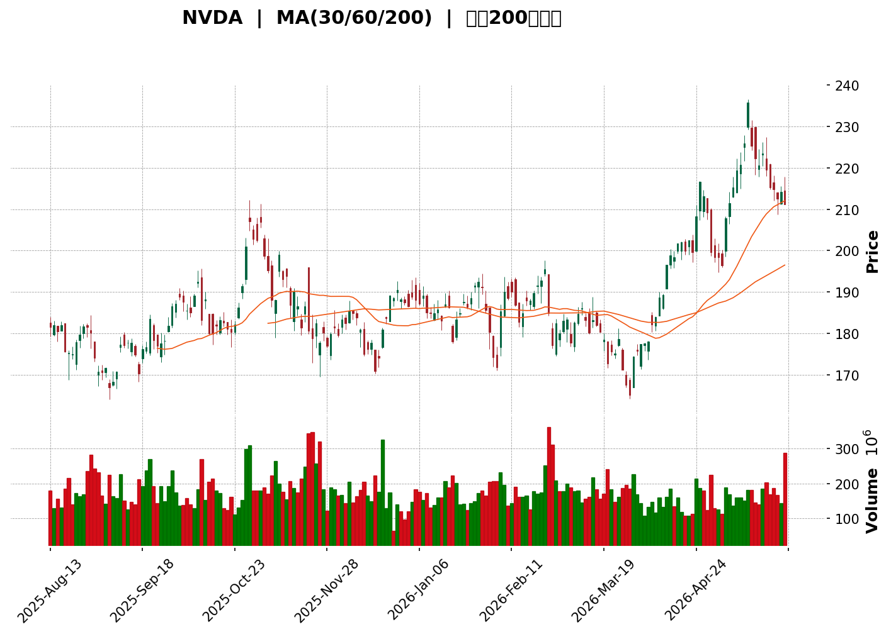
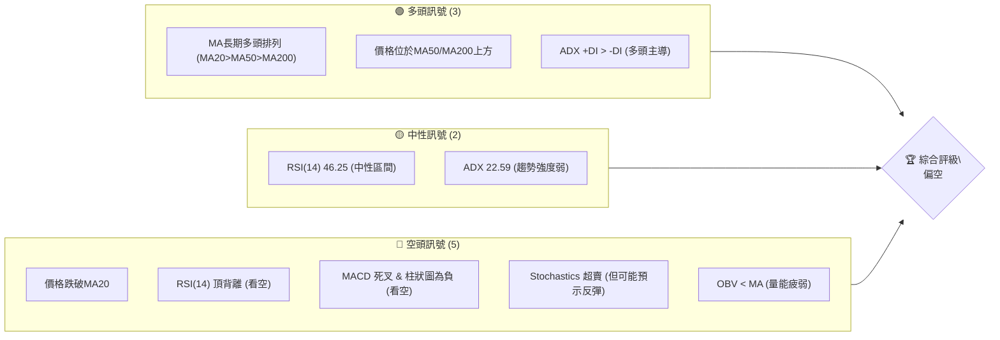

<details>
<summary>📊 靜態圖表 (點擊展開)</summary>

</details>

<html>
<head><meta charset="utf-8" /></head>
<body>
    <div>                        <script>window.PlotlyConfig = {MathJaxConfig: 'local'};</script>
        <script charset="utf-8" src="https://cdn.plot.ly/plotly-3.5.0.min.js" integrity="sha256-fHbNLP+GlIXN+efbQec78UkemUz3NJp7UmfGxC1tNxs=" crossorigin="anonymous"></script>                <div id="candlestick-chart" class="plotly-graph-div" style="height:500px; width:100%;"></div>            <script>                window.PLOTLYENV=window.PLOTLYENV || {};                                if (document.getElementById("candlestick-chart")) {                    Plotly.newPlot(                        "candlestick-chart",                        [{"close":{"dtype":"f8","bdata":"AAAAIOqxZkAAAAAArL9mQAAAAMBwjWZAAAAAAFq\u002fZkAAAADAi\u002fNlQAAAAADe62VAAAAA4G3eZUAAAADguz5mQAAAAMD2eGZAAAAAYKy3ZkAAAAAgPLJmQAAAAGB7hGZAAAAAYNXEZUAAAABADVhlQAAAAODuUmVAAAAAIDV0ZUAAAACgwN9kQAAAAGAGCWVAAAAAYGlXZUAAAAAAnilmQAAAAGDRJGZAAAAAgJ05ZkAAAABAYDdmQAAAAMCL22VAAAAAgK5IZUAAAACgDwdmQAAAAKDRFGZAAAAAAODyZkAAAAAAIk1mQAAAAABrHmZAAAAAwHQ1ZkAAAABAdEVmQAAAAMCPumZAAAAAgOdRZ0AAAADABWdnQAAAAADRm2dAAAAAYC5zZ0AAAADAoDBnQAAAAEChIGdAAAAAANuiZ0AAAABAkBFoQAAAAAB65GZAAAAAIJSJZ0AAAADAU4BmQAAAAKDteWZAAAAAAEi5ZkAAAACAZeZmQAAAAKDW02ZAAAAAwHukZkAAAACgU4hmQAAAAOB6xGZAAAAAQKpHZ0AAAADgAe9nQAAAAABBIGlAAAAAgI3gaUAAAABgxFtpQAAAAAD4TmlAAAAA4G7baUAAAADAYdVoQAAAAOAIZmhAAAAAQOaBZ0AAAACgI4RnQAAAAKDm4GhAAAAAAHEkaEAAAABg6zhoQAAAAADdWmdAAAAAgMXEZ0AAAABgi1JnQAAAAADiqmZAAAAAIPxPZ0AAAABg2JNmQAAAACCIW2ZAAAAAgPXQZkAAAACAnTlmQAAAAMCvh2ZAAAAAwGAfZkAAAADgznxmQAAAACAVrmZAAAAAwD9yZkAAAADA1+tmQAAAAODNzGZAAAAAYEcxZ0AAAABAuB5nQAAAAECk+GZAAAAAQHKdZkAAAABAVuBlQAAAAID5CGZAAAAAgLs2ZkAAAADAyF1lQAAAAKAtxGVAAAAA4F2fZkAAAAAAw\u002fVmQAAAAIBkpmdAAAAAgDGTZ0AAAABAodBnQAAAAMC2hmdAAAAAgPRwZ0AAAABgrU9nQAAAAIDfmmdAAAAAoIODZ0AAAAAgW2dnQAAAAEAxo2dAAAAAoPUgZ0AAAAAgMxtnQAAAAIDCHWdAAAAAIJk5Z0AAAACgKeRmQAAAAMBGYWdAAAAAgAlHZ0AAAACA7kFmQAAAAEDs6WZAAAAAQI8aZ0AAAABgHXVnQAAAAKC3TmdAAAAAQFCQZ0AAAAAAT\u002fBnQAAAAID8D2hAAAAAQNTjZ0AAAADgMjNnQAAAAECRimZAAAAAQMfFZUAAAADA3HtlQAAAAIDMLGdAAAAAYPPAZ0AAAAAA9JBnQAAAAGBFwWdAAAAAoMFdZ0AAAACAmtlmQAAAAEC4HmdAAAAAwAh\u002fZ0AAAACAeXxnQAAAAGDpuWdAAAAAwETxZ0AAAADA3RpoQAAAAMCUcWhAAAAA4CgcZ0AAAAAAxiVmQAAAAEALz2ZAAAAAwEmBZkAAAACA9uBmQAAAAACQ6mZAAAAAoO45ZkAAAADAe9RmQAAAAABSGGdAAAAAwPVAZ0AAAADgeuRmQAAAAAAAiGZAAAAAQArnZkAAAACAwr1mQAAAAMDMjGZAAAAAgOtRZkAAAABgZpZlQAAAAOB69GVAAAAAYGbmZUAAAACAwlVmQAAAACCuZ2VAAAAA4KPwZEAAAACgcKVkQAAAAMDMzGVAAAAAAAD4ZUAAAADgeixmQAAAAOB6NGZAAAAAQDNDZkAAAABgj8JmQAAAAMAe\u002fWZAAAAAACmUZ0AAAACA66lnQAAAAOBRkGhAAAAAANfbaEAAAABAM8toQAAAAIDCNWlAAAAAgOtBaUAAAAAAKfxoQAAAAAAAUGlAAAAA4Hr0aEAAAADgowhqQAAAACCFE2tAAAAAoHClakAAAAAAAChqQAAAAIA98mhAAAAAYGbOaEAAAAAgXM9oQAAAAAAAkGhAAAAAYI\u002f6aUAAAAAAAHBqQAAAAGBm5mpAAAAAgBRua0AAAADA9ZhrQAAAAGCPOmxAAAAAIK53bUAAAACAPSpsQAAAAIA9ymtAAAAAIIWTa0AAAABACu9rQAAAAOBRcGtAAAAAYI\u002fqakAAAAAghdtqQAAAAEAzk2pAAAAAAADIakAAAADgemRqQA=="},"high":{"dtype":"f8","bdata":"mvjU4g\u002f+ZkCsBGGjqt9mQBAcuybVu2ZAvwjDWxvdZkBElxOJB89mQGbl624Q\u002f2VATDjB4tsbZkCd4fIu7lFmQPYgPSQnvGZAugfjh4LLZkAgbfPJtc5mQD34kiUPDmdAaxxnONpDZkBgQF5SPotlQFsnkjA0jGVA27JROpt6ZUAPNeLDDyBlQL3reKTPXWVArQZRU3NeZUDAowaVU2hmQOM6XrRTiGZAzLlUjJJSZkDPQOqCklpmQFHT5WRgL2ZAKk0hosqlZUCxMgD6kyJmQBQrJBvvQWZADQGWp\u002fMQZ0CGYzOJzMxmQPuIq\u002fhTeGZAsMmB0K+HZkDRAz40AnhmQOoMJJFa\u002f2ZAIAOkropqZ0AcntCw0YNnQP85tM7t4GdAwuWSCdrKZ0BK2+G6s2ZnQAq4r4JBoWdAut0mr4iyZ0CT1jzr6WhoQInk2gonc2hAY0vcI9rCZ0DSlCxV8xhnQE9Ee7cwG2dAWieU7VDoZkBDyW21jQJnQD3xoNK\u002fJWdAPj+NKKPYZkDCSYGIb+1mQLAyoxdR4GZAxro6iWFuZ0AlL49KU\u002f9nQHjtBxgWZGlAgA7IvlWFakAb+wFPZcRpQGByNjJP\u002fmlAwqrJHCNqakCGp\u002fi\u002fUn5pQHRshzG6XGlA\u002ffXkSyWzaEC3ouA4lIlnQJEwHLNg\u002fWhABC6U18BsaECsJu++yntoQMY1E0Fo7WdA2xp\u002f\u002fqXfZ0C3ZEH3VZ9nQA9352fzGGdA5lt7K9x6Z0Be0LWuT39oQPfhR4RFEWdANuFYBVvvZkBk9q5xfkRmQGoc2T163GZAOhiNUKZoZkC7CYuI94hmQFIws7h3NGdAfwSXTcLNZkC83rEeUhBnQHGInuDMFGdAPij6qax\u002fZ0C+LOLqtzZnQIEeAd8JL2dA2xK3E+2pZkBAoWBq7NlmQJMmWo4hTWZAbDOnCF9PZkB3mzrz2gNmQF7FvJt+BGZAx2zJ6xWuZkDBsp0KzQRnQKT2YXI7qmdAw8zy\u002fcqcZ0BFEcMKvxVoQKJirCL+l2dAdOd3W1qfZ0A5fIgTl9FnQFVbzfBsHWhA1knWLtMzaECiWItwGwVoQDQUZR+C62dA38tboEWxZ0AT8++XjkpnQDoujgiEY2dAYaj3ujGDZ0AmwRSKZg5nQFwwbVMStmdAQtfTAcDNZ0AW038W2MtmQCBVRNbWK2dAXSX0CB5FZ0D4h9Mk37JnQLmwZjODo2dAki3vt6u\u002fZ0B7B9YB3gpoQIXB31EGL2hAoHiX4ldPaEDruvRLRclnQEqjkT5RSGdAdCARvD9yZkD2y\u002fkO7xlmQM3MbgutX2dAC3wo5cg0aEBQsKDABg9oQGUOtjP8J2hA5\u002fgDSy8zaECLPQTsrG9nQEF0mMh5ZGdAREKhkILLZ0D67uIDb41nQKF+IwY7ymdASzzDbxA+aEA5HZX3TThoQAeD7VTRs2hAVt2+dPFIaEA7UI9bkNJmQIEVzxBn7mZAbMV3f3ycZkDHRqeDFBZnQGDIUO6ZAWdAVqwMzwDYZkB7QHuizdxmQGbmjuLBTWdAAAAAANdzZ0AAAACAFB5nQAAAAEDhQmdAAAAAACmcZ0AAAADAzCxnQAAAAAAp7GZAAAAAIFx\u002fZkAAAADgUUhmQAAAAADXS2ZAAAAAQAoHZkAAAABACqdmQAAAAOBREGZAAAAAQApfZUAAAABgZi5lQAAAAADX02VAAAAAANcrZkAAAAAgri9mQAAAAKBHOWZAAAAAIFxHZkAAAADgUShnQAAAAGCPAmdAAAAAAADAZ0AAAADAHrVnQAAAAOBRkGhAAAAAwMwMaUAAAABAM\u002ftoQAAAAGBmNmlAAAAAoHBFaUAAAAAAAFhpQAAAAAAAUGlAAAAAYI96aUAAAABgZl5qQAAAAGCPGmtAAAAAIFzXakAAAABACpdqQAAAAKCZSWpAAAAAAABgaUAAAAAgXDdpQAAAACCuB2lAAAAA4KMIakAAAABgZsZqQAAAAKCZOWtAAAAAoJnJa0AAAAAAAPhrQAAAAEDhemxAAAAAoEeRbUAAAAAAAPBsQAAAAAAAwGxAAAAAIFwPbEAAAAAAKURsQAAAAMDMbGxAAAAA4FGga0AAAACAwkVrQAAAAMDMxGpAAAAA4KPwakAAAAAghTtrQA=="},"hovertemplate":"\u003cb\u003e%{x|%Y-%m-%d}\u003c\u002fb\u003e\u003cbr\u003e\u958b: $%{open:.2f}\u003cbr\u003e\u9ad8: $%{high:.2f}\u003cbr\u003e\u4f4e: $%{low:.2f}\u003cbr\u003e\u6536: $%{close:.2f}\u003cextra\u003e\u003c\u002fextra\u003e","low":{"dtype":"f8","bdata":"xnNjLD9qZkAvDnj8w21mQDuOy0dVQGZAM4URT+uRZkCXDEc0v+5lQFJW1tuzGGVAXDHS1\u002f64ZUCTZc1dfWVlQMQP\u002fyhNEWZAE8vGB\u002fhYZkAZ0uyGP2JmQOOmP54uDGZAtc\u002f3BuGjZUA4qbmYJuZkQM8xAj5DG2VAz\u002fPrLzgsZUDHJYlDXoFkQDyMjm5P6mRARXY0GcvWZEAcqSFoG+5lQA0wxn69DmZAR0+Tm8cNZkDchHIJtc9lQJCXGDOMy2VAGOjDUIcMZUDFtSjTHJ5lQFhxStck5WVADxcFQRvWZUC9KjXfGQZmQE1treku7GVA9QCAWY2jZUCeHoouJd1lQJMEKGCbiWZAEme21riuZkBDD+VgJ\u002fxmQDk3F19CgWdAV7JhY4IrZ0AN9dd86ulmQAMAYo9a\u002f2ZA4krfz59QZ0AZn8ebP+FnQEEqmd\u002f1wGZAY7BhHxE+Z0B\u002fDgWsxHVmQFgC3iioKGZAmNekNQJ4ZkCeTcVeXndmQJgOgbG4tmZAaHNC2fd4ZkCtyl\u002fqshdmQEAQ0uGleGZAZF3e21rvZkD2l6cAGY1nQKT1MDNy\u002fGdA3\u002fUcqD2YaUCgas2UaSxpQCy7tMCHQWlAhy4FkDKxaUCqZglvEL1oQIpd48AdVGhAedJWZ4FLZ0BF8UDufVxmQGbh7FqZOGhAQ\u002fpPjO3oZ0DJZ5EmfeNnQLL4TNWN+mZA+ncs4eyRZkADvxutlwlnQAIgvykrdGZAeTSU8erZZkD76u11kXpmQEXx4vkmnWVAbCMVdb0OZkDK2\u002fQQATFlQC3BF9ENR2ZAivEpM2EPZkA67B1cJrVlQC3zQBBef2ZAyFqADuRiZkDLY+qjaH5mQF\u002f6QIrOnGZAPpt15XvMZkAtcEE77OlmQGelieX2wGZAQ8tiqYgTZkBb5WqNidNlQAgX8i6o4GVAHo7kP3\u002fcZUB1R3gHoEllQMqUd0fxeWVAZGrRD5MKZkB4SjNY4spmQO9AE6x73GZAZVdHhY5SZ0Di6T6frH9nQBo6WEbMPGdAb1s3pW9dZ0AvLyKBW09nQJrL+2L+h2dAzu2DP3pEZ0CdUamv6llnQFGOiMGYUWdAE57h9mb2ZkBD1SEnH\u002fVmQJvy7rlS4GZAdU2EcXvsZkCFc8NpSZlmQBJjqtE8SmdAP0sJ0TxCZ0COlj5UNjNmQPkLPa59TGZA1wVZ53D9ZkCvnYag6llnQOiecrZbP2dAjy08ABQ2Z0Bd7pgejbpnQPuQR\u002fyYQWdAHytvPLauZ0CJ8s8S1xtnQOu\u002fvvINB2ZA9trZgtJ8ZUDXfIjgqWBlQC\u002feocvl0mVAW04q0xT+ZkAvb7CPg4NnQCIIQzFQmGdAsVDNMP9PZ0DbQWLKkLJmQPayGRFzZWZAtRiGCv9XZ0D8chB+zDRnQKWSNBjCPWdAO1N2XzuyZ0D8HJCqeWxnQAjpAKnxOGhAwjO3wOsJZ0CfqN3b2gtmQDarhHkt1GVARkV4IyIdZkDkah2ym4FmQMs2cCvaO2ZAJJONEe8ZZkDV3OqknfFlQG1EFzkBwGZAAAAAYGYOZ0AAAAAAALhmQAAAAIAUfmZAAAAAwB6tZkAAAACAwrVmQAAAAGCPimZAAAAAoEf5ZUAAAABACndlQAAAAOBR2GVAAAAAIFy\u002fZUAAAABAMxtmQAAAAOB6ZGVAAAAA4FHgZEAAAADgo4hkQAAAAGC43mRAAAAAAADYZUAAAAAA12tlQAAAAOBR+GVAAAAAwB61ZUAAAACgmYlmQAAAAADXk2ZAAAAAoJkJZ0AAAAAgrjdnQAAAAOCj2GdAAAAAIK53aEAAAACA63loQAAAAOCj6GhAAAAAQOG6aEAAAAAAAOBoQAAAAAAA4GhAAAAAQAqnaEAAAACA6\u002floQAAAAAAp7GlAAAAAYGYGakAAAABgj\u002fJpQAAAAGBm1mhAAAAAANejaEAAAAAgrldoQAAAAMD1gGhAAAAAIIXTaEAAAAAAANBpQAAAAOB6nGpAAAAA4Hq8akAAAACgcN1qQAAAAIA9smtAAAAAoJmpbEAAAAAgrgdsQAAAAADXS2tAAAAAwB49a0AAAAAAAJBrQAAAAIDCPWtAAAAAoJnZakAAAAAAAIBqQAAAAMD1GGpAAAAAQApnakAAAAAAKWRqQA=="},"name":"\u50f9\u683c","open":{"dtype":"f8","bdata":"09Uoed7SZkCnB183C3dmQIZBsm0xu2ZAOyGUSz2SZkDl63khysxmQLv7JDCC5GVA\u002f1VPLUXaZUAS7IUympJlQNVqvnxASmZAD6MPVPaAZkAWfZ97ZL5mQHegfV1HmWZAHUlXppJCZkD5E9iPGD9lQM82wcYCYWVAMebDW1VRZUCHgDMgEQBlQGWh24i18GRAv\u002fIXBvshZUAHyG9wihNmQL75bv4gdWZAfpmE6wM4ZkAK846+0vRlQOFq\u002ftdgH2ZAI\u002f4Jo9+TZUA8T1Oov75lQIvMWq8F+GVAls0v+fvoZUAU6dKQZr5mQDDz+BoCeGZAZHLLQr\u002fOZUB\u002fAptk0ERmQLNb10YgjWZAHoKCjOvBZkDxF2qMBydnQHsjibyIsmdA7fnEdmqlZ0ACVTUpWS9nQEenFq60RmdAIcP1qJVRZ0DGaE8urwZoQJzSuNCjL2hAeG+WMGF+Z0C+rxWc\u002fRdnQLMXmWfzGGdAjwdPP7jGZkD+EMp7IIVmQD50ME+E42ZAPj+NKKPYZkDAzQL616NmQO2AulDOjGZAEKSJzTv6ZkCi4Wo5A79nQPDWygzsIGhANC6rJ6H+aUCL1JU3FKRpQM3gMrCszWlAXMWeK9QBakAD8F5fSV9pQHixqCzx12hAuTEiAMCMaEBNFN+LJhxnQASzCqvVYmhAz\u002fxyM29kaEAxRxBGWnZoQJGb57rt4GdA86ryk+DaZkAL0RjxYj5nQKiQ3w6E62ZAYHhQbqEYZ0A3vDkatn1oQF6qpiALp2ZAaD5LwAxvZkAEPU5egdxlQPfJj6SFs2ZAOekK0bBfZkCH2I7DtNdlQETv6Fqut2ZAkiD7iOyhZkCIWqGHhrNmQHdHBFgp\u002fGZAfk456inUZkD3xgo9mTFnQOUM5zi4HmdAe\u002f3NyaWIZkDhqojMNKNmQG6xzqTFPWZAq1uexQMIZkAE0aE25QJmQNnOtVOo0GVAmR5cSiIVZkB+YOAFH\u002f1mQNJvISS53mZAlCkMLMF9Z0C\u002fyUFlHL1nQERw6xlldmdAKfqRsFqHZ0AVPdCD6bFnQBxumw+NumdAj+sB4\u002fz3Z0BdIclrT9BnQF\u002fnT93pkWdAZGVGUjGjZ0ClegRHPSJnQEl5OwO55mZAHbDt+60fZ0B9Pfu56wlnQOA3Yl6tT2dAr91LfDuiZ0A\u002fCAQNfLxmQHeSfERKYWZA+oI4Cq4XZ0CKH07TrG9nQMT7utHLZGdAkrpaEVtnZ0CM0VwcT+hnQFz71GSM6mdAOCzrlmPmZ0Czm6BrE2ZnQK7E+YFbR2dAz6mwyWhuZkBtxZ7ldN1lQHRoSB7GFWZA6Kj7LwAIZ0BoCIcd1OtnQCBtog8RDmhAtynXLKAgaEBIH0kOCW9nQLoEb22vt2ZATBWSSKyXZ0AeK0afmGFnQOZuutDqUWdAIRME8XfsZ0CmUVs6We9nQBSHDR4QTmhA1NsDt01IaECoFImzr6dmQBj5iU8E4GVAL6Aq8V5PZkCivP+GxI1mQObsL1YgpWZAP8efepF6ZkAPUbz0QBpmQECa2ex7zGZAAAAAwB49Z0AAAACgmQFnQAAAAKBwHWdAAAAAQArfZkAAAACA6yFnQAAAACBcz2ZAAAAA4FFAZkAAAAAAAEBmQAAAAOBRKGZAAAAAYI\u002faZUAAAABAMyNmQAAAAIA9AmZAAAAAAABAZUAAAADA9RhlQAAAAEAK32RAAAAAAAAAZkAAAACAwoVlQAAAAMAeJWZAAAAAIFz3ZUAAAAAAABBnQAAAAEDhumZAAAAAgOsJZ0AAAADA9UBnQAAAAEDh2mdAAAAAoEeRaEAAAACAwq1oQAAAAMDM\u002fGhAAAAAIFz\u002faEAAAAAAKURpQAAAACCuH2lAAAAAYLhOaUAAAABguP5oQAAAAMDMNGpAAAAAIK4vakAAAABgZpZqQAAAAIDCPWpAAAAAwPUoaUAAAAAAAPBoQAAAAKCZ6WhAAAAA4Hr8aEAAAABA4QpqQAAAAMD1oGpAAAAAoEfBakAAAACgmVFrQAAAAIDCHWxAAAAAQDO7bEAAAADgUbhsQAAAAADXu2xAAAAAANdza0AAAACAwuVrQAAAAKBHyWtAAAAAwMyca0AAAACgRxFrQAAAAADXw2pAAAAAwPVoakAAAABgj9JqQA=="},"x":["2025-08-13T00:00:00-04:00","2025-08-14T00:00:00-04:00","2025-08-15T00:00:00-04:00","2025-08-18T00:00:00-04:00","2025-08-19T00:00:00-04:00","2025-08-20T00:00:00-04:00","2025-08-21T00:00:00-04:00","2025-08-22T00:00:00-04:00","2025-08-25T00:00:00-04:00","2025-08-26T00:00:00-04:00","2025-08-27T00:00:00-04:00","2025-08-28T00:00:00-04:00","2025-08-29T00:00:00-04:00","2025-09-02T00:00:00-04:00","2025-09-03T00:00:00-04:00","2025-09-04T00:00:00-04:00","2025-09-05T00:00:00-04:00","2025-09-08T00:00:00-04:00","2025-09-09T00:00:00-04:00","2025-09-10T00:00:00-04:00","2025-09-11T00:00:00-04:00","2025-09-12T00:00:00-04:00","2025-09-15T00:00:00-04:00","2025-09-16T00:00:00-04:00","2025-09-17T00:00:00-04:00","2025-09-18T00:00:00-04:00","2025-09-19T00:00:00-04:00","2025-09-22T00:00:00-04:00","2025-09-23T00:00:00-04:00","2025-09-24T00:00:00-04:00","2025-09-25T00:00:00-04:00","2025-09-26T00:00:00-04:00","2025-09-29T00:00:00-04:00","2025-09-30T00:00:00-04:00","2025-10-01T00:00:00-04:00","2025-10-02T00:00:00-04:00","2025-10-03T00:00:00-04:00","2025-10-06T00:00:00-04:00","2025-10-07T00:00:00-04:00","2025-10-08T00:00:00-04:00","2025-10-09T00:00:00-04:00","2025-10-10T00:00:00-04:00","2025-10-13T00:00:00-04:00","2025-10-14T00:00:00-04:00","2025-10-15T00:00:00-04:00","2025-10-16T00:00:00-04:00","2025-10-17T00:00:00-04:00","2025-10-20T00:00:00-04:00","2025-10-21T00:00:00-04:00","2025-10-22T00:00:00-04:00","2025-10-23T00:00:00-04:00","2025-10-24T00:00:00-04:00","2025-10-27T00:00:00-04:00","2025-10-28T00:00:00-04:00","2025-10-29T00:00:00-04:00","2025-10-30T00:00:00-04:00","2025-10-31T00:00:00-04:00","2025-11-03T00:00:00-05:00","2025-11-04T00:00:00-05:00","2025-11-05T00:00:00-05:00","2025-11-06T00:00:00-05:00","2025-11-07T00:00:00-05:00","2025-11-10T00:00:00-05:00","2025-11-11T00:00:00-05:00","2025-11-12T00:00:00-05:00","2025-11-13T00:00:00-05:00","2025-11-14T00:00:00-05:00","2025-11-17T00:00:00-05:00","2025-11-18T00:00:00-05:00","2025-11-19T00:00:00-05:00","2025-11-20T00:00:00-05:00","2025-11-21T00:00:00-05:00","2025-11-24T00:00:00-05:00","2025-11-25T00:00:00-05:00","2025-11-26T00:00:00-05:00","2025-11-28T00:00:00-05:00","2025-12-01T00:00:00-05:00","2025-12-02T00:00:00-05:00","2025-12-03T00:00:00-05:00","2025-12-04T00:00:00-05:00","2025-12-05T00:00:00-05:00","2025-12-08T00:00:00-05:00","2025-12-09T00:00:00-05:00","2025-12-10T00:00:00-05:00","2025-12-11T00:00:00-05:00","2025-12-12T00:00:00-05:00","2025-12-15T00:00:00-05:00","2025-12-16T00:00:00-05:00","2025-12-17T00:00:00-05:00","2025-12-18T00:00:00-05:00","2025-12-19T00:00:00-05:00","2025-12-22T00:00:00-05:00","2025-12-23T00:00:00-05:00","2025-12-24T00:00:00-05:00","2025-12-26T00:00:00-05:00","2025-12-29T00:00:00-05:00","2025-12-30T00:00:00-05:00","2025-12-31T00:00:00-05:00","2026-01-02T00:00:00-05:00","2026-01-05T00:00:00-05:00","2026-01-06T00:00:00-05:00","2026-01-07T00:00:00-05:00","2026-01-08T00:00:00-05:00","2026-01-09T00:00:00-05:00","2026-01-12T00:00:00-05:00","2026-01-13T00:00:00-05:00","2026-01-14T00:00:00-05:00","2026-01-15T00:00:00-05:00","2026-01-16T00:00:00-05:00","2026-01-20T00:00:00-05:00","2026-01-21T00:00:00-05:00","2026-01-22T00:00:00-05:00","2026-01-23T00:00:00-05:00","2026-01-26T00:00:00-05:00","2026-01-27T00:00:00-05:00","2026-01-28T00:00:00-05:00","2026-01-29T00:00:00-05:00","2026-01-30T00:00:00-05:00","2026-02-02T00:00:00-05:00","2026-02-03T00:00:00-05:00","2026-02-04T00:00:00-05:00","2026-02-05T00:00:00-05:00","2026-02-06T00:00:00-05:00","2026-02-09T00:00:00-05:00","2026-02-10T00:00:00-05:00","2026-02-11T00:00:00-05:00","2026-02-12T00:00:00-05:00","2026-02-13T00:00:00-05:00","2026-02-17T00:00:00-05:00","2026-02-18T00:00:00-05:00","2026-02-19T00:00:00-05:00","2026-02-20T00:00:00-05:00","2026-02-23T00:00:00-05:00","2026-02-24T00:00:00-05:00","2026-02-25T00:00:00-05:00","2026-02-26T00:00:00-05:00","2026-02-27T00:00:00-05:00","2026-03-02T00:00:00-05:00","2026-03-03T00:00:00-05:00","2026-03-04T00:00:00-05:00","2026-03-05T00:00:00-05:00","2026-03-06T00:00:00-05:00","2026-03-09T00:00:00-04:00","2026-03-10T00:00:00-04:00","2026-03-11T00:00:00-04:00","2026-03-12T00:00:00-04:00","2026-03-13T00:00:00-04:00","2026-03-16T00:00:00-04:00","2026-03-17T00:00:00-04:00","2026-03-18T00:00:00-04:00","2026-03-19T00:00:00-04:00","2026-03-20T00:00:00-04:00","2026-03-23T00:00:00-04:00","2026-03-24T00:00:00-04:00","2026-03-25T00:00:00-04:00","2026-03-26T00:00:00-04:00","2026-03-27T00:00:00-04:00","2026-03-30T00:00:00-04:00","2026-03-31T00:00:00-04:00","2026-04-01T00:00:00-04:00","2026-04-02T00:00:00-04:00","2026-04-06T00:00:00-04:00","2026-04-07T00:00:00-04:00","2026-04-08T00:00:00-04:00","2026-04-09T00:00:00-04:00","2026-04-10T00:00:00-04:00","2026-04-13T00:00:00-04:00","2026-04-14T00:00:00-04:00","2026-04-15T00:00:00-04:00","2026-04-16T00:00:00-04:00","2026-04-17T00:00:00-04:00","2026-04-20T00:00:00-04:00","2026-04-21T00:00:00-04:00","2026-04-22T00:00:00-04:00","2026-04-23T00:00:00-04:00","2026-04-24T00:00:00-04:00","2026-04-27T00:00:00-04:00","2026-04-28T00:00:00-04:00","2026-04-29T00:00:00-04:00","2026-04-30T00:00:00-04:00","2026-05-01T00:00:00-04:00","2026-05-04T00:00:00-04:00","2026-05-05T00:00:00-04:00","2026-05-06T00:00:00-04:00","2026-05-07T00:00:00-04:00","2026-05-08T00:00:00-04:00","2026-05-11T00:00:00-04:00","2026-05-12T00:00:00-04:00","2026-05-13T00:00:00-04:00","2026-05-14T00:00:00-04:00","2026-05-15T00:00:00-04:00","2026-05-18T00:00:00-04:00","2026-05-19T00:00:00-04:00","2026-05-20T00:00:00-04:00","2026-05-21T00:00:00-04:00","2026-05-22T00:00:00-04:00","2026-05-26T00:00:00-04:00","2026-05-27T00:00:00-04:00","2026-05-28T00:00:00-04:00","2026-05-29T00:00:00-04:00"],"type":"candlestick"},{"hovertemplate":"MA30: $%{y:.2f}\u003cextra\u003e\u003c\u002fextra\u003e","line":{"color":"#2196F3","dash":"dash","width":2},"mode":"lines","name":"MA30","x":["2025-08-13T00:00:00-04:00","2025-08-14T00:00:00-04:00","2025-08-15T00:00:00-04:00","2025-08-18T00:00:00-04:00","2025-08-19T00:00:00-04:00","2025-08-20T00:00:00-04:00","2025-08-21T00:00:00-04:00","2025-08-22T00:00:00-04:00","2025-08-25T00:00:00-04:00","2025-08-26T00:00:00-04:00","2025-08-27T00:00:00-04:00","2025-08-28T00:00:00-04:00","2025-08-29T00:00:00-04:00","2025-09-02T00:00:00-04:00","2025-09-03T00:00:00-04:00","2025-09-04T00:00:00-04:00","2025-09-05T00:00:00-04:00","2025-09-08T00:00:00-04:00","2025-09-09T00:00:00-04:00","2025-09-10T00:00:00-04:00","2025-09-11T00:00:00-04:00","2025-09-12T00:00:00-04:00","2025-09-15T00:00:00-04:00","2025-09-16T00:00:00-04:00","2025-09-17T00:00:00-04:00","2025-09-18T00:00:00-04:00","2025-09-19T00:00:00-04:00","2025-09-22T00:00:00-04:00","2025-09-23T00:00:00-04:00","2025-09-24T00:00:00-04:00","2025-09-25T00:00:00-04:00","2025-09-26T00:00:00-04:00","2025-09-29T00:00:00-04:00","2025-09-30T00:00:00-04:00","2025-10-01T00:00:00-04:00","2025-10-02T00:00:00-04:00","2025-10-03T00:00:00-04:00","2025-10-06T00:00:00-04:00","2025-10-07T00:00:00-04:00","2025-10-08T00:00:00-04:00","2025-10-09T00:00:00-04:00","2025-10-10T00:00:00-04:00","2025-10-13T00:00:00-04:00","2025-10-14T00:00:00-04:00","2025-10-15T00:00:00-04:00","2025-10-16T00:00:00-04:00","2025-10-17T00:00:00-04:00","2025-10-20T00:00:00-04:00","2025-10-21T00:00:00-04:00","2025-10-22T00:00:00-04:00","2025-10-23T00:00:00-04:00","2025-10-24T00:00:00-04:00","2025-10-27T00:00:00-04:00","2025-10-28T00:00:00-04:00","2025-10-29T00:00:00-04:00","2025-10-30T00:00:00-04:00","2025-10-31T00:00:00-04:00","2025-11-03T00:00:00-05:00","2025-11-04T00:00:00-05:00","2025-11-05T00:00:00-05:00","2025-11-06T00:00:00-05:00","2025-11-07T00:00:00-05:00","2025-11-10T00:00:00-05:00","2025-11-11T00:00:00-05:00","2025-11-12T00:00:00-05:00","2025-11-13T00:00:00-05:00","2025-11-14T00:00:00-05:00","2025-11-17T00:00:00-05:00","2025-11-18T00:00:00-05:00","2025-11-19T00:00:00-05:00","2025-11-20T00:00:00-05:00","2025-11-21T00:00:00-05:00","2025-11-24T00:00:00-05:00","2025-11-25T00:00:00-05:00","2025-11-26T00:00:00-05:00","2025-11-28T00:00:00-05:00","2025-12-01T00:00:00-05:00","2025-12-02T00:00:00-05:00","2025-12-03T00:00:00-05:00","2025-12-04T00:00:00-05:00","2025-12-05T00:00:00-05:00","2025-12-08T00:00:00-05:00","2025-12-09T00:00:00-05:00","2025-12-10T00:00:00-05:00","2025-12-11T00:00:00-05:00","2025-12-12T00:00:00-05:00","2025-12-15T00:00:00-05:00","2025-12-16T00:00:00-05:00","2025-12-17T00:00:00-05:00","2025-12-18T00:00:00-05:00","2025-12-19T00:00:00-05:00","2025-12-22T00:00:00-05:00","2025-12-23T00:00:00-05:00","2025-12-24T00:00:00-05:00","2025-12-26T00:00:00-05:00","2025-12-29T00:00:00-05:00","2025-12-30T00:00:00-05:00","2025-12-31T00:00:00-05:00","2026-01-02T00:00:00-05:00","2026-01-05T00:00:00-05:00","2026-01-06T00:00:00-05:00","2026-01-07T00:00:00-05:00","2026-01-08T00:00:00-05:00","2026-01-09T00:00:00-05:00","2026-01-12T00:00:00-05:00","2026-01-13T00:00:00-05:00","2026-01-14T00:00:00-05:00","2026-01-15T00:00:00-05:00","2026-01-16T00:00:00-05:00","2026-01-20T00:00:00-05:00","2026-01-21T00:00:00-05:00","2026-01-22T00:00:00-05:00","2026-01-23T00:00:00-05:00","2026-01-26T00:00:00-05:00","2026-01-27T00:00:00-05:00","2026-01-28T00:00:00-05:00","2026-01-29T00:00:00-05:00","2026-01-30T00:00:00-05:00","2026-02-02T00:00:00-05:00","2026-02-03T00:00:00-05:00","2026-02-04T00:00:00-05:00","2026-02-05T00:00:00-05:00","2026-02-06T00:00:00-05:00","2026-02-09T00:00:00-05:00","2026-02-10T00:00:00-05:00","2026-02-11T00:00:00-05:00","2026-02-12T00:00:00-05:00","2026-02-13T00:00:00-05:00","2026-02-17T00:00:00-05:00","2026-02-18T00:00:00-05:00","2026-02-19T00:00:00-05:00","2026-02-20T00:00:00-05:00","2026-02-23T00:00:00-05:00","2026-02-24T00:00:00-05:00","2026-02-25T00:00:00-05:00","2026-02-26T00:00:00-05:00","2026-02-27T00:00:00-05:00","2026-03-02T00:00:00-05:00","2026-03-03T00:00:00-05:00","2026-03-04T00:00:00-05:00","2026-03-05T00:00:00-05:00","2026-03-06T00:00:00-05:00","2026-03-09T00:00:00-04:00","2026-03-10T00:00:00-04:00","2026-03-11T00:00:00-04:00","2026-03-12T00:00:00-04:00","2026-03-13T00:00:00-04:00","2026-03-16T00:00:00-04:00","2026-03-17T00:00:00-04:00","2026-03-18T00:00:00-04:00","2026-03-19T00:00:00-04:00","2026-03-20T00:00:00-04:00","2026-03-23T00:00:00-04:00","2026-03-24T00:00:00-04:00","2026-03-25T00:00:00-04:00","2026-03-26T00:00:00-04:00","2026-03-27T00:00:00-04:00","2026-03-30T00:00:00-04:00","2026-03-31T00:00:00-04:00","2026-04-01T00:00:00-04:00","2026-04-02T00:00:00-04:00","2026-04-06T00:00:00-04:00","2026-04-07T00:00:00-04:00","2026-04-08T00:00:00-04:00","2026-04-09T00:00:00-04:00","2026-04-10T00:00:00-04:00","2026-04-13T00:00:00-04:00","2026-04-14T00:00:00-04:00","2026-04-15T00:00:00-04:00","2026-04-16T00:00:00-04:00","2026-04-17T00:00:00-04:00","2026-04-20T00:00:00-04:00","2026-04-21T00:00:00-04:00","2026-04-22T00:00:00-04:00","2026-04-23T00:00:00-04:00","2026-04-24T00:00:00-04:00","2026-04-27T00:00:00-04:00","2026-04-28T00:00:00-04:00","2026-04-29T00:00:00-04:00","2026-04-30T00:00:00-04:00","2026-05-01T00:00:00-04:00","2026-05-04T00:00:00-04:00","2026-05-05T00:00:00-04:00","2026-05-06T00:00:00-04:00","2026-05-07T00:00:00-04:00","2026-05-08T00:00:00-04:00","2026-05-11T00:00:00-04:00","2026-05-12T00:00:00-04:00","2026-05-13T00:00:00-04:00","2026-05-14T00:00:00-04:00","2026-05-15T00:00:00-04:00","2026-05-18T00:00:00-04:00","2026-05-19T00:00:00-04:00","2026-05-20T00:00:00-04:00","2026-05-21T00:00:00-04:00","2026-05-22T00:00:00-04:00","2026-05-26T00:00:00-04:00","2026-05-27T00:00:00-04:00","2026-05-28T00:00:00-04:00","2026-05-29T00:00:00-04:00"],"y":{"dtype":"f8","bdata":"AAAAAAAA+H8AAAAAAAD4fwAAAAAAAPh\u002fAAAAAAAA+H8AAAAAAAD4fwAAAAAAAPh\u002fAAAAAAAA+H8AAAAAAAD4fwAAAAAAAPh\u002fAAAAAAAA+H8AAAAAAAD4fwAAAAAAAPh\u002fAAAAAAAA+H8AAAAAAAD4fwAAAAAAAPh\u002fAAAAAAAA+H8AAAAAAAD4fwAAAAAAAPh\u002fAAAAAAAA+H8AAAAAAAD4fwAAAAAAAPh\u002fAAAAAAAA+H8AAAAAAAD4fwAAAAAAAPh\u002fAAAAAAAA+H8AAAAAAAD4fwAAAAAAAPh\u002fAAAAAAAA+H8AAAAAAAD4f+\u002fu7h4EDmZAMzMzE94JZkBmZmYmywVmQO\u002fu7i5MB2ZARERExC4MZkAzMzOzkBhmQKuqqqr2JmZAzczMjHQ0ZkBmZma2hDxmQGZmZnYbQmZAmpmZWfJJZkCrqqpaqFVmQCIiIoLbWGZA7+7u7vJnZkBmZmYm03FmQBEREXGoe2ZAd3d3Z36GZkCrqqoqyJdmQAAAAGATp2ZAZmZmli2yZkBmZmbGVbVmQJqZmTmoumZAZmZmpqjDZkC8u7srUNJmQERERBQ07mZA3t3dLWYVZ0Crqqqa0jFnQKuqqmpcTWdAq6qq+i1mZ0BERES0yXtnQGZmZuY9j2dAAAAAwFKaZ0AiIiIy8qRnQM3MzGxKt2dAIiIiAk++Z0AREREhTsVnQM3MzNwjw2dAmpmZGdzFZ0BVVVWF\u002fcZnQO\u002fu7r4Qw2dAVVVVlU3AZ0ARERFBlLNnQImIiKgDr2dAzczMPNyoZ0BERETUgKZnQLy7uzv2pmdAzczM7NShZ0B3d3fnT55nQImIiLgNnWdA3t3dDWGbZ0AiIiJCsp5nQKuqqkr5nmdAMzMzQzqeZ0AAAADgSJdnQImIiMjlhGdAq6qqig9pZ0C8u7urWEtnQJqZmclpL2dA3t3dvVIQZ0AzMzOTvPJmQFVVVVVG3GZAERERQbnUZkDNzMxM+s9mQO\u002fu7n5+xWZAvLu7C6fAZkC8u7sbLb1mQM3MzEyjvmZAEREREdi7ZkCamZmZv7tmQERERIS\u002fw2ZAvLu7O3fFZkAAAAAghMxmQJqZmSlw12ZAVVVV1RraZkAiIiLSn+FmQCIiInKg5mZAmpmZuQjwZkDv7u6uevNmQN7d3c1z+WZAiYiImIsAZ0AAAACw4fpmQKuqqira+2ZAvLu7Sxj7ZkCJiIiI+f1mQLy7uwvYAGdAMzMzg\u002fAIZ0Dv7u7eiRpnQFVVVcXWK2dAVVVVZSQ6Z0ARERERyklnQM3MzPxmUGdAvLu7OyZJZ0De3d19jTxnQEREROR\u002fOGdAq6qqWgY6Z0Crqqr65jdnQKuqqqraOWdAZmZm1jY5Z0BmZmZGRzVnQFVVVdUjMWdAq6qqmv0wZ0ARERHRsTFnQAAAALBzMmdAIiIiQmU5Z0AiIiLy6kFnQBEREcE+TWdAvLu7i0NMZ0BERETk6kVnQKuqqgoLQWdAVVVVlXM6Z0BmZmamwD9nQLy7uxvGP2dAmpmZSUk4Z0ARERGR7jJnQBEREWEeMWdAq6qqOnkuZ0AiIiLCiyVnQO\u002fu7s56GGdAzczMrA0QZ0B3d3eHIwxnQERERJQ2DGdAREREdOIQZ0CJiIjoxBFnQJqZmclbB2dAmpmZSYr3ZkAzMzOjCO1mQAAAABD72GZA7+7u3kbEZkDNzMyseLFmQHd3dxc1pmZARERERCyZZkDNzMwc+Y1mQGZmZvb9gGZAvLu7C6hyZkB3d3f3LWdmQCIiIqLDWmZAMzMzo8NeZkAiIiLSs2tmQERERKStemZAq6qqasOOZkBmZmbGGp9mQGZmZoatsmZAmpmZSYvMZkDe3d3t7t5mQBERESHb8WZAERERkV8AZ0C8u7u7LRtnQAAAAHD2QWdAiYiIyOhhZ0B3d3f3DH9nQImIiKh\u002fk2dARERE9LaoZ0DNzMycNsRnQImIiMh22mdAMzMz80T9Z0AAAAAARyBoQCIiIgIrT2hAERERoYyGaEDe3d3d3cFoQAAAALC5+GhAVVVV9bY4aUC8u7sL12tpQKuqqqp\u002fm2lAq6qqutfIaUBVVVX1\u002ffRpQBERESH3GmpAIiIiAnI3akDNzMzcslJqQCIiIoLcY2pAZmZmRkR0akC8u7vL6IFqQA=="},"type":"scatter"},{"hovertemplate":"MA60: $%{y:.2f}\u003cextra\u003e\u003c\u002fextra\u003e","line":{"color":"#9C27B0","dash":"dash","width":2},"mode":"lines","name":"MA60","x":["2025-08-13T00:00:00-04:00","2025-08-14T00:00:00-04:00","2025-08-15T00:00:00-04:00","2025-08-18T00:00:00-04:00","2025-08-19T00:00:00-04:00","2025-08-20T00:00:00-04:00","2025-08-21T00:00:00-04:00","2025-08-22T00:00:00-04:00","2025-08-25T00:00:00-04:00","2025-08-26T00:00:00-04:00","2025-08-27T00:00:00-04:00","2025-08-28T00:00:00-04:00","2025-08-29T00:00:00-04:00","2025-09-02T00:00:00-04:00","2025-09-03T00:00:00-04:00","2025-09-04T00:00:00-04:00","2025-09-05T00:00:00-04:00","2025-09-08T00:00:00-04:00","2025-09-09T00:00:00-04:00","2025-09-10T00:00:00-04:00","2025-09-11T00:00:00-04:00","2025-09-12T00:00:00-04:00","2025-09-15T00:00:00-04:00","2025-09-16T00:00:00-04:00","2025-09-17T00:00:00-04:00","2025-09-18T00:00:00-04:00","2025-09-19T00:00:00-04:00","2025-09-22T00:00:00-04:00","2025-09-23T00:00:00-04:00","2025-09-24T00:00:00-04:00","2025-09-25T00:00:00-04:00","2025-09-26T00:00:00-04:00","2025-09-29T00:00:00-04:00","2025-09-30T00:00:00-04:00","2025-10-01T00:00:00-04:00","2025-10-02T00:00:00-04:00","2025-10-03T00:00:00-04:00","2025-10-06T00:00:00-04:00","2025-10-07T00:00:00-04:00","2025-10-08T00:00:00-04:00","2025-10-09T00:00:00-04:00","2025-10-10T00:00:00-04:00","2025-10-13T00:00:00-04:00","2025-10-14T00:00:00-04:00","2025-10-15T00:00:00-04:00","2025-10-16T00:00:00-04:00","2025-10-17T00:00:00-04:00","2025-10-20T00:00:00-04:00","2025-10-21T00:00:00-04:00","2025-10-22T00:00:00-04:00","2025-10-23T00:00:00-04:00","2025-10-24T00:00:00-04:00","2025-10-27T00:00:00-04:00","2025-10-28T00:00:00-04:00","2025-10-29T00:00:00-04:00","2025-10-30T00:00:00-04:00","2025-10-31T00:00:00-04:00","2025-11-03T00:00:00-05:00","2025-11-04T00:00:00-05:00","2025-11-05T00:00:00-05:00","2025-11-06T00:00:00-05:00","2025-11-07T00:00:00-05:00","2025-11-10T00:00:00-05:00","2025-11-11T00:00:00-05:00","2025-11-12T00:00:00-05:00","2025-11-13T00:00:00-05:00","2025-11-14T00:00:00-05:00","2025-11-17T00:00:00-05:00","2025-11-18T00:00:00-05:00","2025-11-19T00:00:00-05:00","2025-11-20T00:00:00-05:00","2025-11-21T00:00:00-05:00","2025-11-24T00:00:00-05:00","2025-11-25T00:00:00-05:00","2025-11-26T00:00:00-05:00","2025-11-28T00:00:00-05:00","2025-12-01T00:00:00-05:00","2025-12-02T00:00:00-05:00","2025-12-03T00:00:00-05:00","2025-12-04T00:00:00-05:00","2025-12-05T00:00:00-05:00","2025-12-08T00:00:00-05:00","2025-12-09T00:00:00-05:00","2025-12-10T00:00:00-05:00","2025-12-11T00:00:00-05:00","2025-12-12T00:00:00-05:00","2025-12-15T00:00:00-05:00","2025-12-16T00:00:00-05:00","2025-12-17T00:00:00-05:00","2025-12-18T00:00:00-05:00","2025-12-19T00:00:00-05:00","2025-12-22T00:00:00-05:00","2025-12-23T00:00:00-05:00","2025-12-24T00:00:00-05:00","2025-12-26T00:00:00-05:00","2025-12-29T00:00:00-05:00","2025-12-30T00:00:00-05:00","2025-12-31T00:00:00-05:00","2026-01-02T00:00:00-05:00","2026-01-05T00:00:00-05:00","2026-01-06T00:00:00-05:00","2026-01-07T00:00:00-05:00","2026-01-08T00:00:00-05:00","2026-01-09T00:00:00-05:00","2026-01-12T00:00:00-05:00","2026-01-13T00:00:00-05:00","2026-01-14T00:00:00-05:00","2026-01-15T00:00:00-05:00","2026-01-16T00:00:00-05:00","2026-01-20T00:00:00-05:00","2026-01-21T00:00:00-05:00","2026-01-22T00:00:00-05:00","2026-01-23T00:00:00-05:00","2026-01-26T00:00:00-05:00","2026-01-27T00:00:00-05:00","2026-01-28T00:00:00-05:00","2026-01-29T00:00:00-05:00","2026-01-30T00:00:00-05:00","2026-02-02T00:00:00-05:00","2026-02-03T00:00:00-05:00","2026-02-04T00:00:00-05:00","2026-02-05T00:00:00-05:00","2026-02-06T00:00:00-05:00","2026-02-09T00:00:00-05:00","2026-02-10T00:00:00-05:00","2026-02-11T00:00:00-05:00","2026-02-12T00:00:00-05:00","2026-02-13T00:00:00-05:00","2026-02-17T00:00:00-05:00","2026-02-18T00:00:00-05:00","2026-02-19T00:00:00-05:00","2026-02-20T00:00:00-05:00","2026-02-23T00:00:00-05:00","2026-02-24T00:00:00-05:00","2026-02-25T00:00:00-05:00","2026-02-26T00:00:00-05:00","2026-02-27T00:00:00-05:00","2026-03-02T00:00:00-05:00","2026-03-03T00:00:00-05:00","2026-03-04T00:00:00-05:00","2026-03-05T00:00:00-05:00","2026-03-06T00:00:00-05:00","2026-03-09T00:00:00-04:00","2026-03-10T00:00:00-04:00","2026-03-11T00:00:00-04:00","2026-03-12T00:00:00-04:00","2026-03-13T00:00:00-04:00","2026-03-16T00:00:00-04:00","2026-03-17T00:00:00-04:00","2026-03-18T00:00:00-04:00","2026-03-19T00:00:00-04:00","2026-03-20T00:00:00-04:00","2026-03-23T00:00:00-04:00","2026-03-24T00:00:00-04:00","2026-03-25T00:00:00-04:00","2026-03-26T00:00:00-04:00","2026-03-27T00:00:00-04:00","2026-03-30T00:00:00-04:00","2026-03-31T00:00:00-04:00","2026-04-01T00:00:00-04:00","2026-04-02T00:00:00-04:00","2026-04-06T00:00:00-04:00","2026-04-07T00:00:00-04:00","2026-04-08T00:00:00-04:00","2026-04-09T00:00:00-04:00","2026-04-10T00:00:00-04:00","2026-04-13T00:00:00-04:00","2026-04-14T00:00:00-04:00","2026-04-15T00:00:00-04:00","2026-04-16T00:00:00-04:00","2026-04-17T00:00:00-04:00","2026-04-20T00:00:00-04:00","2026-04-21T00:00:00-04:00","2026-04-22T00:00:00-04:00","2026-04-23T00:00:00-04:00","2026-04-24T00:00:00-04:00","2026-04-27T00:00:00-04:00","2026-04-28T00:00:00-04:00","2026-04-29T00:00:00-04:00","2026-04-30T00:00:00-04:00","2026-05-01T00:00:00-04:00","2026-05-04T00:00:00-04:00","2026-05-05T00:00:00-04:00","2026-05-06T00:00:00-04:00","2026-05-07T00:00:00-04:00","2026-05-08T00:00:00-04:00","2026-05-11T00:00:00-04:00","2026-05-12T00:00:00-04:00","2026-05-13T00:00:00-04:00","2026-05-14T00:00:00-04:00","2026-05-15T00:00:00-04:00","2026-05-18T00:00:00-04:00","2026-05-19T00:00:00-04:00","2026-05-20T00:00:00-04:00","2026-05-21T00:00:00-04:00","2026-05-22T00:00:00-04:00","2026-05-26T00:00:00-04:00","2026-05-27T00:00:00-04:00","2026-05-28T00:00:00-04:00","2026-05-29T00:00:00-04:00"],"y":{"dtype":"f8","bdata":"AAAAAAAA+H8AAAAAAAD4fwAAAAAAAPh\u002fAAAAAAAA+H8AAAAAAAD4fwAAAAAAAPh\u002fAAAAAAAA+H8AAAAAAAD4fwAAAAAAAPh\u002fAAAAAAAA+H8AAAAAAAD4fwAAAAAAAPh\u002fAAAAAAAA+H8AAAAAAAD4fwAAAAAAAPh\u002fAAAAAAAA+H8AAAAAAAD4fwAAAAAAAPh\u002fAAAAAAAA+H8AAAAAAAD4fwAAAAAAAPh\u002fAAAAAAAA+H8AAAAAAAD4fwAAAAAAAPh\u002fAAAAAAAA+H8AAAAAAAD4fwAAAAAAAPh\u002fAAAAAAAA+H8AAAAAAAD4fwAAAAAAAPh\u002fAAAAAAAA+H8AAAAAAAD4fwAAAAAAAPh\u002fAAAAAAAA+H8AAAAAAAD4fwAAAAAAAPh\u002fAAAAAAAA+H8AAAAAAAD4fwAAAAAAAPh\u002fAAAAAAAA+H8AAAAAAAD4fwAAAAAAAPh\u002fAAAAAAAA+H8AAAAAAAD4fwAAAAAAAPh\u002fAAAAAAAA+H8AAAAAAAD4fwAAAAAAAPh\u002fAAAAAAAA+H8AAAAAAAD4fwAAAAAAAPh\u002fAAAAAAAA+H8AAAAAAAD4fwAAAAAAAPh\u002fAAAAAAAA+H8AAAAAAAD4fwAAAAAAAPh\u002fAAAAAAAA+H8AAAAAAAD4f6uqqgKhzmZAmpmZaRjSZkBERESsXtVmQN7d3U1L32ZAMzMz4z7lZkAiIiJq7+5mQLy7u0MN9WZAMzMzUyj9ZkDe3d0dwQFnQKuqqhqWAmdAd3d39x8FZ0De3d1NngRnQFVVVZXvA2dA3t3dlWcIZ0BVVVX9KQxnQGZmZlZPEWdAIiIiqikUZ0AREREJDBtnQERERIwQImdAIiIiUscmZ0BEREQEBCpnQCIiIsLQLGdAzczMdPEwZ0De3d2FzDRnQGZmZu6MOWdARERE3Do\u002fZ0AzMzOjlT5nQCIiIhpjPmdAREREXEA7Z0C8u7sjQzdnQN7d3R3CNWdAiYiIAIY3Z0B3d3c\u002fdjpnQN7d3XVkPmdA7+7uBns\u002fZ0BmZmaePUFnQM3MzJTjQGdAVVVVFdpAZ0B3d3ePXkFnQJqZmSFoQ2dAiYiIaOJCZ0CJiIgwDEBnQBEREek5Q2dAERERiXtBZ0AzMzNTEERnQO\u002fu7lbLRmdAMzMz0+5IZ0AzMzNL5UhnQDMzM8NAS2dAMzMzU\u002fZNZ0ARERH5yUxnQKuqqrppTWdAd3d3R6lMZ0BEREQ0oUpnQCIiIureQmdA7+7uBgA5Z0BVVVVF8TJnQHd3d0egLWdAmpmZkTslZ0AiIiJSQx5nQBEREalWFmdAZmZmvu8OZ0BVVVXlQwZnQJqZmTH\u002f\u002fmZAMzMzs1b9ZkAzMzMLivpmQLy7u\u002fs+\u002fGZAvLu7c4f6ZkAAAABwg\u002fhmQM3MzKxx+mZAMzMzazr7ZkCJiIj4Gv9mQM3MzOzxBGdAvLu7C8AJZ0AiIiJixRFnQJqZmZnvGWdAq6qqIiYeZ0CamZnJshxnQERERGw\u002fHWdA7+7uln8dZ0AzMzMrUR1nQDMzMyPQHWdAq6qqyrAZZ0DNzMwMdBhnQGZmZjb7GGdA7+7u3rQbZ0CJiIjQCiBnQCIiIsooImdAERERCRklZ0BERETM9ipnQImIiMhOLmdAAAAAWAQtZ0AzMzMzKSdnQO\u002fu7tbtH2dAIiIiUsgYZ0Dv7u7OdxJnQFVVVd1qCWdAq6qq2r7+ZkCamZn5X\u002fNmQGZmZnas62ZAd3d37xTlZkDv7u521d9mQDMzM9O42WZA7+7upgbWZkDNzMx0jNRmQJqZmTEB1GZAd3d3l4PVZkAzMzNbz9hmQHd3d1fc3WZAAAAAgJvkZkBmZma2be9mQBEREdE5+WZAmpmZSWoCZ0B3d3e\u002f7ghnQBEREcF8EWdA3t3dZWwXZ0Dv7u6+XCBnQHd3d584LWdAq6qqOvs4Z0B3d3c\u002fmEVnQGZmZh7bT2dAREREtMxcZ0CrqqrC\u002fWpnQBEREUnpcGdAZmZmnmd6Z0CamZnRp4ZnQBEREQkTlGdAAAAAwGmlZ0BVVVVFq7lnQLy7u2N3z2dAzczMnPHoZ0BEREQU6PxnQImIiNA+DmhAMzMz478daEBmZmb2FS5oQJqZmWHdOmhAq6qq0hpLaEB3d3dXM19oQDMzMxNFb2hAiYiI2IOBaEARERHJgZBoQA=="},"type":"scatter"},{"hovertemplate":"MA200: $%{y:.2f}\u003cextra\u003e\u003c\u002fextra\u003e","line":{"color":"#FF6F00","dash":"solid","width":2},"mode":"lines","name":"MA200","x":["2025-08-13T00:00:00-04:00","2025-08-14T00:00:00-04:00","2025-08-15T00:00:00-04:00","2025-08-18T00:00:00-04:00","2025-08-19T00:00:00-04:00","2025-08-20T00:00:00-04:00","2025-08-21T00:00:00-04:00","2025-08-22T00:00:00-04:00","2025-08-25T00:00:00-04:00","2025-08-26T00:00:00-04:00","2025-08-27T00:00:00-04:00","2025-08-28T00:00:00-04:00","2025-08-29T00:00:00-04:00","2025-09-02T00:00:00-04:00","2025-09-03T00:00:00-04:00","2025-09-04T00:00:00-04:00","2025-09-05T00:00:00-04:00","2025-09-08T00:00:00-04:00","2025-09-09T00:00:00-04:00","2025-09-10T00:00:00-04:00","2025-09-11T00:00:00-04:00","2025-09-12T00:00:00-04:00","2025-09-15T00:00:00-04:00","2025-09-16T00:00:00-04:00","2025-09-17T00:00:00-04:00","2025-09-18T00:00:00-04:00","2025-09-19T00:00:00-04:00","2025-09-22T00:00:00-04:00","2025-09-23T00:00:00-04:00","2025-09-24T00:00:00-04:00","2025-09-25T00:00:00-04:00","2025-09-26T00:00:00-04:00","2025-09-29T00:00:00-04:00","2025-09-30T00:00:00-04:00","2025-10-01T00:00:00-04:00","2025-10-02T00:00:00-04:00","2025-10-03T00:00:00-04:00","2025-10-06T00:00:00-04:00","2025-10-07T00:00:00-04:00","2025-10-08T00:00:00-04:00","2025-10-09T00:00:00-04:00","2025-10-10T00:00:00-04:00","2025-10-13T00:00:00-04:00","2025-10-14T00:00:00-04:00","2025-10-15T00:00:00-04:00","2025-10-16T00:00:00-04:00","2025-10-17T00:00:00-04:00","2025-10-20T00:00:00-04:00","2025-10-21T00:00:00-04:00","2025-10-22T00:00:00-04:00","2025-10-23T00:00:00-04:00","2025-10-24T00:00:00-04:00","2025-10-27T00:00:00-04:00","2025-10-28T00:00:00-04:00","2025-10-29T00:00:00-04:00","2025-10-30T00:00:00-04:00","2025-10-31T00:00:00-04:00","2025-11-03T00:00:00-05:00","2025-11-04T00:00:00-05:00","2025-11-05T00:00:00-05:00","2025-11-06T00:00:00-05:00","2025-11-07T00:00:00-05:00","2025-11-10T00:00:00-05:00","2025-11-11T00:00:00-05:00","2025-11-12T00:00:00-05:00","2025-11-13T00:00:00-05:00","2025-11-14T00:00:00-05:00","2025-11-17T00:00:00-05:00","2025-11-18T00:00:00-05:00","2025-11-19T00:00:00-05:00","2025-11-20T00:00:00-05:00","2025-11-21T00:00:00-05:00","2025-11-24T00:00:00-05:00","2025-11-25T00:00:00-05:00","2025-11-26T00:00:00-05:00","2025-11-28T00:00:00-05:00","2025-12-01T00:00:00-05:00","2025-12-02T00:00:00-05:00","2025-12-03T00:00:00-05:00","2025-12-04T00:00:00-05:00","2025-12-05T00:00:00-05:00","2025-12-08T00:00:00-05:00","2025-12-09T00:00:00-05:00","2025-12-10T00:00:00-05:00","2025-12-11T00:00:00-05:00","2025-12-12T00:00:00-05:00","2025-12-15T00:00:00-05:00","2025-12-16T00:00:00-05:00","2025-12-17T00:00:00-05:00","2025-12-18T00:00:00-05:00","2025-12-19T00:00:00-05:00","2025-12-22T00:00:00-05:00","2025-12-23T00:00:00-05:00","2025-12-24T00:00:00-05:00","2025-12-26T00:00:00-05:00","2025-12-29T00:00:00-05:00","2025-12-30T00:00:00-05:00","2025-12-31T00:00:00-05:00","2026-01-02T00:00:00-05:00","2026-01-05T00:00:00-05:00","2026-01-06T00:00:00-05:00","2026-01-07T00:00:00-05:00","2026-01-08T00:00:00-05:00","2026-01-09T00:00:00-05:00","2026-01-12T00:00:00-05:00","2026-01-13T00:00:00-05:00","2026-01-14T00:00:00-05:00","2026-01-15T00:00:00-05:00","2026-01-16T00:00:00-05:00","2026-01-20T00:00:00-05:00","2026-01-21T00:00:00-05:00","2026-01-22T00:00:00-05:00","2026-01-23T00:00:00-05:00","2026-01-26T00:00:00-05:00","2026-01-27T00:00:00-05:00","2026-01-28T00:00:00-05:00","2026-01-29T00:00:00-05:00","2026-01-30T00:00:00-05:00","2026-02-02T00:00:00-05:00","2026-02-03T00:00:00-05:00","2026-02-04T00:00:00-05:00","2026-02-05T00:00:00-05:00","2026-02-06T00:00:00-05:00","2026-02-09T00:00:00-05:00","2026-02-10T00:00:00-05:00","2026-02-11T00:00:00-05:00","2026-02-12T00:00:00-05:00","2026-02-13T00:00:00-05:00","2026-02-17T00:00:00-05:00","2026-02-18T00:00:00-05:00","2026-02-19T00:00:00-05:00","2026-02-20T00:00:00-05:00","2026-02-23T00:00:00-05:00","2026-02-24T00:00:00-05:00","2026-02-25T00:00:00-05:00","2026-02-26T00:00:00-05:00","2026-02-27T00:00:00-05:00","2026-03-02T00:00:00-05:00","2026-03-03T00:00:00-05:00","2026-03-04T00:00:00-05:00","2026-03-05T00:00:00-05:00","2026-03-06T00:00:00-05:00","2026-03-09T00:00:00-04:00","2026-03-10T00:00:00-04:00","2026-03-11T00:00:00-04:00","2026-03-12T00:00:00-04:00","2026-03-13T00:00:00-04:00","2026-03-16T00:00:00-04:00","2026-03-17T00:00:00-04:00","2026-03-18T00:00:00-04:00","2026-03-19T00:00:00-04:00","2026-03-20T00:00:00-04:00","2026-03-23T00:00:00-04:00","2026-03-24T00:00:00-04:00","2026-03-25T00:00:00-04:00","2026-03-26T00:00:00-04:00","2026-03-27T00:00:00-04:00","2026-03-30T00:00:00-04:00","2026-03-31T00:00:00-04:00","2026-04-01T00:00:00-04:00","2026-04-02T00:00:00-04:00","2026-04-06T00:00:00-04:00","2026-04-07T00:00:00-04:00","2026-04-08T00:00:00-04:00","2026-04-09T00:00:00-04:00","2026-04-10T00:00:00-04:00","2026-04-13T00:00:00-04:00","2026-04-14T00:00:00-04:00","2026-04-15T00:00:00-04:00","2026-04-16T00:00:00-04:00","2026-04-17T00:00:00-04:00","2026-04-20T00:00:00-04:00","2026-04-21T00:00:00-04:00","2026-04-22T00:00:00-04:00","2026-04-23T00:00:00-04:00","2026-04-24T00:00:00-04:00","2026-04-27T00:00:00-04:00","2026-04-28T00:00:00-04:00","2026-04-29T00:00:00-04:00","2026-04-30T00:00:00-04:00","2026-05-01T00:00:00-04:00","2026-05-04T00:00:00-04:00","2026-05-05T00:00:00-04:00","2026-05-06T00:00:00-04:00","2026-05-07T00:00:00-04:00","2026-05-08T00:00:00-04:00","2026-05-11T00:00:00-04:00","2026-05-12T00:00:00-04:00","2026-05-13T00:00:00-04:00","2026-05-14T00:00:00-04:00","2026-05-15T00:00:00-04:00","2026-05-18T00:00:00-04:00","2026-05-19T00:00:00-04:00","2026-05-20T00:00:00-04:00","2026-05-21T00:00:00-04:00","2026-05-22T00:00:00-04:00","2026-05-26T00:00:00-04:00","2026-05-27T00:00:00-04:00","2026-05-28T00:00:00-04:00","2026-05-29T00:00:00-04:00"],"y":{"dtype":"f8","bdata":"AAAAAAAA+H8AAAAAAAD4fwAAAAAAAPh\u002fAAAAAAAA+H8AAAAAAAD4fwAAAAAAAPh\u002fAAAAAAAA+H8AAAAAAAD4fwAAAAAAAPh\u002fAAAAAAAA+H8AAAAAAAD4fwAAAAAAAPh\u002fAAAAAAAA+H8AAAAAAAD4fwAAAAAAAPh\u002fAAAAAAAA+H8AAAAAAAD4fwAAAAAAAPh\u002fAAAAAAAA+H8AAAAAAAD4fwAAAAAAAPh\u002fAAAAAAAA+H8AAAAAAAD4fwAAAAAAAPh\u002fAAAAAAAA+H8AAAAAAAD4fwAAAAAAAPh\u002fAAAAAAAA+H8AAAAAAAD4fwAAAAAAAPh\u002fAAAAAAAA+H8AAAAAAAD4fwAAAAAAAPh\u002fAAAAAAAA+H8AAAAAAAD4fwAAAAAAAPh\u002fAAAAAAAA+H8AAAAAAAD4fwAAAAAAAPh\u002fAAAAAAAA+H8AAAAAAAD4fwAAAAAAAPh\u002fAAAAAAAA+H8AAAAAAAD4fwAAAAAAAPh\u002fAAAAAAAA+H8AAAAAAAD4fwAAAAAAAPh\u002fAAAAAAAA+H8AAAAAAAD4fwAAAAAAAPh\u002fAAAAAAAA+H8AAAAAAAD4fwAAAAAAAPh\u002fAAAAAAAA+H8AAAAAAAD4fwAAAAAAAPh\u002fAAAAAAAA+H8AAAAAAAD4fwAAAAAAAPh\u002fAAAAAAAA+H8AAAAAAAD4fwAAAAAAAPh\u002fAAAAAAAA+H8AAAAAAAD4fwAAAAAAAPh\u002fAAAAAAAA+H8AAAAAAAD4fwAAAAAAAPh\u002fAAAAAAAA+H8AAAAAAAD4fwAAAAAAAPh\u002fAAAAAAAA+H8AAAAAAAD4fwAAAAAAAPh\u002fAAAAAAAA+H8AAAAAAAD4fwAAAAAAAPh\u002fAAAAAAAA+H8AAAAAAAD4fwAAAAAAAPh\u002fAAAAAAAA+H8AAAAAAAD4fwAAAAAAAPh\u002fAAAAAAAA+H8AAAAAAAD4fwAAAAAAAPh\u002fAAAAAAAA+H8AAAAAAAD4fwAAAAAAAPh\u002fAAAAAAAA+H8AAAAAAAD4fwAAAAAAAPh\u002fAAAAAAAA+H8AAAAAAAD4fwAAAAAAAPh\u002fAAAAAAAA+H8AAAAAAAD4fwAAAAAAAPh\u002fAAAAAAAA+H8AAAAAAAD4fwAAAAAAAPh\u002fAAAAAAAA+H8AAAAAAAD4fwAAAAAAAPh\u002fAAAAAAAA+H8AAAAAAAD4fwAAAAAAAPh\u002fAAAAAAAA+H8AAAAAAAD4fwAAAAAAAPh\u002fAAAAAAAA+H8AAAAAAAD4fwAAAAAAAPh\u002fAAAAAAAA+H8AAAAAAAD4fwAAAAAAAPh\u002fAAAAAAAA+H8AAAAAAAD4fwAAAAAAAPh\u002fAAAAAAAA+H8AAAAAAAD4fwAAAAAAAPh\u002fAAAAAAAA+H8AAAAAAAD4fwAAAAAAAPh\u002fAAAAAAAA+H8AAAAAAAD4fwAAAAAAAPh\u002fAAAAAAAA+H8AAAAAAAD4fwAAAAAAAPh\u002fAAAAAAAA+H8AAAAAAAD4fwAAAAAAAPh\u002fAAAAAAAA+H8AAAAAAAD4fwAAAAAAAPh\u002fAAAAAAAA+H8AAAAAAAD4fwAAAAAAAPh\u002fAAAAAAAA+H8AAAAAAAD4fwAAAAAAAPh\u002fAAAAAAAA+H8AAAAAAAD4fwAAAAAAAPh\u002fAAAAAAAA+H8AAAAAAAD4fwAAAAAAAPh\u002fAAAAAAAA+H8AAAAAAAD4fwAAAAAAAPh\u002fAAAAAAAA+H8AAAAAAAD4fwAAAAAAAPh\u002fAAAAAAAA+H8AAAAAAAD4fwAAAAAAAPh\u002fAAAAAAAA+H8AAAAAAAD4fwAAAAAAAPh\u002fAAAAAAAA+H8AAAAAAAD4fwAAAAAAAPh\u002fAAAAAAAA+H8AAAAAAAD4fwAAAAAAAPh\u002fAAAAAAAA+H8AAAAAAAD4fwAAAAAAAPh\u002fAAAAAAAA+H8AAAAAAAD4fwAAAAAAAPh\u002fAAAAAAAA+H8AAAAAAAD4fwAAAAAAAPh\u002fAAAAAAAA+H8AAAAAAAD4fwAAAAAAAPh\u002fAAAAAAAA+H8AAAAAAAD4fwAAAAAAAPh\u002fAAAAAAAA+H8AAAAAAAD4fwAAAAAAAPh\u002fAAAAAAAA+H8AAAAAAAD4fwAAAAAAAPh\u002fAAAAAAAA+H8AAAAAAAD4fwAAAAAAAPh\u002fAAAAAAAA+H8AAAAAAAD4fwAAAAAAAPh\u002fAAAAAAAA+H8AAAAAAAD4fwAAAAAAAPh\u002fAAAAAAAA+H8zMzM7g3RnQA=="},"type":"scatter"}],                        {"template":{"data":{"barpolar":[{"marker":{"line":{"color":"rgb(17,17,17)","width":0.5},"pattern":{"fillmode":"overlay","size":10,"solidity":0.2}},"type":"barpolar"}],"bar":[{"error_x":{"color":"#f2f5fa"},"error_y":{"color":"#f2f5fa"},"marker":{"line":{"color":"rgb(17,17,17)","width":0.5},"pattern":{"fillmode":"overlay","size":10,"solidity":0.2}},"type":"bar"}],"carpet":[{"aaxis":{"endlinecolor":"#A2B1C6","gridcolor":"#506784","linecolor":"#506784","minorgridcolor":"#506784","startlinecolor":"#A2B1C6"},"baxis":{"endlinecolor":"#A2B1C6","gridcolor":"#506784","linecolor":"#506784","minorgridcolor":"#506784","startlinecolor":"#A2B1C6"},"type":"carpet"}],"choropleth":[{"colorbar":{"outlinewidth":0,"ticks":""},"type":"choropleth"}],"contourcarpet":[{"colorbar":{"outlinewidth":0,"ticks":""},"type":"contourcarpet"}],"contour":[{"colorbar":{"outlinewidth":0,"ticks":""},"colorscale":[[0.0,"#0d0887"],[0.1111111111111111,"#46039f"],[0.2222222222222222,"#7201a8"],[0.3333333333333333,"#9c179e"],[0.4444444444444444,"#bd3786"],[0.5555555555555556,"#d8576b"],[0.6666666666666666,"#ed7953"],[0.7777777777777778,"#fb9f3a"],[0.8888888888888888,"#fdca26"],[1.0,"#f0f921"]],"type":"contour"}],"heatmap":[{"colorbar":{"outlinewidth":0,"ticks":""},"colorscale":[[0.0,"#0d0887"],[0.1111111111111111,"#46039f"],[0.2222222222222222,"#7201a8"],[0.3333333333333333,"#9c179e"],[0.4444444444444444,"#bd3786"],[0.5555555555555556,"#d8576b"],[0.6666666666666666,"#ed7953"],[0.7777777777777778,"#fb9f3a"],[0.8888888888888888,"#fdca26"],[1.0,"#f0f921"]],"type":"heatmap"}],"histogram2dcontour":[{"colorbar":{"outlinewidth":0,"ticks":""},"colorscale":[[0.0,"#0d0887"],[0.1111111111111111,"#46039f"],[0.2222222222222222,"#7201a8"],[0.3333333333333333,"#9c179e"],[0.4444444444444444,"#bd3786"],[0.5555555555555556,"#d8576b"],[0.6666666666666666,"#ed7953"],[0.7777777777777778,"#fb9f3a"],[0.8888888888888888,"#fdca26"],[1.0,"#f0f921"]],"type":"histogram2dcontour"}],"histogram2d":[{"colorbar":{"outlinewidth":0,"ticks":""},"colorscale":[[0.0,"#0d0887"],[0.1111111111111111,"#46039f"],[0.2222222222222222,"#7201a8"],[0.3333333333333333,"#9c179e"],[0.4444444444444444,"#bd3786"],[0.5555555555555556,"#d8576b"],[0.6666666666666666,"#ed7953"],[0.7777777777777778,"#fb9f3a"],[0.8888888888888888,"#fdca26"],[1.0,"#f0f921"]],"type":"histogram2d"}],"histogram":[{"marker":{"pattern":{"fillmode":"overlay","size":10,"solidity":0.2}},"type":"histogram"}],"mesh3d":[{"colorbar":{"outlinewidth":0,"ticks":""},"type":"mesh3d"}],"parcoords":[{"line":{"colorbar":{"outlinewidth":0,"ticks":""}},"type":"parcoords"}],"pie":[{"automargin":true,"type":"pie"}],"scatter3d":[{"line":{"colorbar":{"outlinewidth":0,"ticks":""}},"marker":{"colorbar":{"outlinewidth":0,"ticks":""}},"type":"scatter3d"}],"scattercarpet":[{"marker":{"colorbar":{"outlinewidth":0,"ticks":""}},"type":"scattercarpet"}],"scattergeo":[{"marker":{"colorbar":{"outlinewidth":0,"ticks":""}},"type":"scattergeo"}],"scattergl":[{"marker":{"line":{"color":"#283442"}},"type":"scattergl"}],"scattermapbox":[{"marker":{"colorbar":{"outlinewidth":0,"ticks":""}},"type":"scattermapbox"}],"scattermap":[{"marker":{"colorbar":{"outlinewidth":0,"ticks":""}},"type":"scattermap"}],"scatterpolargl":[{"marker":{"colorbar":{"outlinewidth":0,"ticks":""}},"type":"scatterpolargl"}],"scatterpolar":[{"marker":{"colorbar":{"outlinewidth":0,"ticks":""}},"type":"scatterpolar"}],"scatter":[{"marker":{"line":{"color":"#283442"}},"type":"scatter"}],"scatterternary":[{"marker":{"colorbar":{"outlinewidth":0,"ticks":""}},"type":"scatterternary"}],"surface":[{"colorbar":{"outlinewidth":0,"ticks":""},"colorscale":[[0.0,"#0d0887"],[0.1111111111111111,"#46039f"],[0.2222222222222222,"#7201a8"],[0.3333333333333333,"#9c179e"],[0.4444444444444444,"#bd3786"],[0.5555555555555556,"#d8576b"],[0.6666666666666666,"#ed7953"],[0.7777777777777778,"#fb9f3a"],[0.8888888888888888,"#fdca26"],[1.0,"#f0f921"]],"type":"surface"}],"table":[{"cells":{"fill":{"color":"#506784"},"line":{"color":"rgb(17,17,17)"}},"header":{"fill":{"color":"#2a3f5f"},"line":{"color":"rgb(17,17,17)"}},"type":"table"}]},"layout":{"annotationdefaults":{"arrowcolor":"#f2f5fa","arrowhead":0,"arrowwidth":1},"autotypenumbers":"strict","coloraxis":{"colorbar":{"outlinewidth":0,"ticks":""}},"colorscale":{"diverging":[[0,"#8e0152"],[0.1,"#c51b7d"],[0.2,"#de77ae"],[0.3,"#f1b6da"],[0.4,"#fde0ef"],[0.5,"#f7f7f7"],[0.6,"#e6f5d0"],[0.7,"#b8e186"],[0.8,"#7fbc41"],[0.9,"#4d9221"],[1,"#276419"]],"sequential":[[0.0,"#0d0887"],[0.1111111111111111,"#46039f"],[0.2222222222222222,"#7201a8"],[0.3333333333333333,"#9c179e"],[0.4444444444444444,"#bd3786"],[0.5555555555555556,"#d8576b"],[0.6666666666666666,"#ed7953"],[0.7777777777777778,"#fb9f3a"],[0.8888888888888888,"#fdca26"],[1.0,"#f0f921"]],"sequentialminus":[[0.0,"#0d0887"],[0.1111111111111111,"#46039f"],[0.2222222222222222,"#7201a8"],[0.3333333333333333,"#9c179e"],[0.4444444444444444,"#bd3786"],[0.5555555555555556,"#d8576b"],[0.6666666666666666,"#ed7953"],[0.7777777777777778,"#fb9f3a"],[0.8888888888888888,"#fdca26"],[1.0,"#f0f921"]]},"colorway":["#636efa","#EF553B","#00cc96","#ab63fa","#FFA15A","#19d3f3","#FF6692","#B6E880","#FF97FF","#FECB52"],"font":{"color":"#f2f5fa"},"geo":{"bgcolor":"rgb(17,17,17)","lakecolor":"rgb(17,17,17)","landcolor":"rgb(17,17,17)","showlakes":true,"showland":true,"subunitcolor":"#506784"},"hoverlabel":{"align":"left"},"hovermode":"closest","mapbox":{"style":"dark"},"paper_bgcolor":"rgb(17,17,17)","plot_bgcolor":"rgb(17,17,17)","polar":{"angularaxis":{"gridcolor":"#506784","linecolor":"#506784","ticks":""},"bgcolor":"rgb(17,17,17)","radialaxis":{"gridcolor":"#506784","linecolor":"#506784","ticks":""}},"scene":{"xaxis":{"backgroundcolor":"rgb(17,17,17)","gridcolor":"#506784","gridwidth":2,"linecolor":"#506784","showbackground":true,"ticks":"","zerolinecolor":"#C8D4E3"},"yaxis":{"backgroundcolor":"rgb(17,17,17)","gridcolor":"#506784","gridwidth":2,"linecolor":"#506784","showbackground":true,"ticks":"","zerolinecolor":"#C8D4E3"},"zaxis":{"backgroundcolor":"rgb(17,17,17)","gridcolor":"#506784","gridwidth":2,"linecolor":"#506784","showbackground":true,"ticks":"","zerolinecolor":"#C8D4E3"}},"shapedefaults":{"line":{"color":"#f2f5fa"}},"sliderdefaults":{"bgcolor":"#C8D4E3","bordercolor":"rgb(17,17,17)","borderwidth":1,"tickwidth":0},"ternary":{"aaxis":{"gridcolor":"#506784","linecolor":"#506784","ticks":""},"baxis":{"gridcolor":"#506784","linecolor":"#506784","ticks":""},"bgcolor":"rgb(17,17,17)","caxis":{"gridcolor":"#506784","linecolor":"#506784","ticks":""}},"title":{"x":0.05},"updatemenudefaults":{"bgcolor":"#506784","borderwidth":0},"xaxis":{"automargin":true,"gridcolor":"#283442","linecolor":"#506784","ticks":"","title":{"standoff":15},"zerolinecolor":"#283442","zerolinewidth":2},"yaxis":{"automargin":true,"gridcolor":"#283442","linecolor":"#506784","ticks":"","title":{"standoff":15},"zerolinecolor":"#283442","zerolinewidth":2}}},"xaxis":{"rangeslider":{"visible":false},"title":{"text":"\u65e5\u671f"}},"font":{"size":11},"title":{"text":"NVDA  |  MA(30\u002f60\u002f200)  |  \u6700\u8fd1200\u4ea4\u6613\u65e5"},"yaxis":{"title":{"text":"\u80a1\u50f9 (USD)"}},"hovermode":"x unified","height":500},                        {"responsive": true}                    )                };            </script>        </div>
</body>
</html>

# NVDA 技術分析報告

> **報告日期**：2026-06-01 ｜ **語言**：繁體中文 ｜ **數據來源**：Yahoo Finance ｜ **當前價格**：$211.14

---

## 目錄

| 章節 | 內容 |
|------|------|
| [1. 技術面概覽](#1-技術面概覽) | 訊號儀表板、核心指標、評分卡 |
| [2. 趨勢分析](#2-趨勢分析) | 多時框趨勢、長中短期走勢 |
| [3. 圖表形態分析](#3-圖表形態分析) | 形態識別、K線組合、目標價 |
| [4. 支撐與阻力](#4-支撐與阻力) | 關鍵價位、斐波那契回調 |
| [5. 技術指標深度解讀](#5-技術指標深度解讀) | MA/RSI/MACD/布林/成交量 |
| [6. 動能與波動率](#6-動能與波動率) | 動能評估、ATR、Beta |
| [7. 多時框架總結](#7-多時框架總結) | 時框架評分矩陣 |
| [8. 交易策略建議](#8-交易策略建議) | 多空策略、風險報酬比 |
| [9. 風險提示與監控](#9-風險提示與監控) | 監控指標、風險場景 |
| [📋 報告總結](#-報告總結) | 綜合結論與建議 |

---

## 1. 技術面概覽

本章節提供 NVDA 技術面狀況的快速概覽，透過視覺化儀表板、核心指標速覽及專業評分卡，讓投資者對當前市場情緒和價格行為有一個初步而全面的認識。

### 🎯 技術訊號儀表板

NVIDIA (NVDA) 在當前時點（2026-06-01）的技術訊號呈現多空交織的複雜局面。儘管長期趨勢仍偏向多頭，但短期內已出現明顯的疲弱訊號，動能指標顯示空頭佔優。以下儀表板綜合了各項指標的當前狀態：



**解讀**:
- **多頭訊號** 主要來自於長期均線的良好排列以及價格仍處於中長期均線之上，顯示其長期上漲趨勢的結構性支撐依然存在。ADX的+DI高於-DI也表明在現有弱趨勢中，多頭力量略佔上風。
- **中性訊號** 表明市場並未處於極端超買或超賣狀態，RSI處於中性區間。ADX的低數值則暗示市場目前缺乏明確的強勢趨勢，可能處於盤整或趨勢轉換的初期。
- **空頭訊號** 則非常突出，包括價格跌破短期均線、RSI出現明確的頂背離、MACD形成死叉且動能柱轉負，以及成交量指標OBV顯示量能疲弱。這些都指向短期內股價面臨較大的下行壓力，且之前的上漲動能已顯著衰竭。Stochastics雖然進入超賣區，但這通常被視為潛在反彈的訊號，在此處則更多地反映了短期跌勢的劇烈。

綜合來看，雖然長期趨勢基礎仍在，但短期和中期動能指標的惡化，以及關鍵的頂背離訊號，使得整體技術面偏向空頭，需要警惕進一步的下行風險。

### 📊 核心指標速覽表

以下表格彙整了 NVDA 當前的關鍵技術指標數據及其解讀，提供快速參考。

| 指標類別 | 指標名稱 | 當前數值 | 訊號 | 解讀 |
|----------|----------|----------|------|------|
| **價格** | 當前價格 | $211.14 | 🔴 | 位於短期均線MA20下方，顯示短期壓力 |
| **均線** | MA5 (5日均線) | $213.64 | 🔴 | 價格低於MA5，短期下跌趨勢 |
| **均線** | MA10 (10日均線) | $217.94 | 🔴 | 價格低於MA10，短期趨勢惡化 |
| **均線** | MA20 (20日均線) | $215.46 | 🔴 | 價格跌破MA20，短期支撐轉阻力 |
| **均線** | MA50 (50日均線) | $199.35 | 🟢 | 價格位於MA50上方，中期趨勢仍偏多 |
| **均線** | MA200 (200日均線) | $187.64 | 🟢 | 價格位於MA200上方，長期趨勢強勁 |
| **動能** | RSI(14) | 46.25 | 🟡 | 處於中性區間，但存在頂背離風險 |
| **動能** | MACD | 3.809 | 🔴 | MACD線下穿Signal線，形成死叉 |
| **動能** | MACD Signal | 5.974 | 🔴 | 訊號線仍高於MACD線，空頭動能增強 |
| **動能** | MACD Histogram | -2.165 | 🔴 | 柱狀圖為負，表明空頭力量主導 |
| **動能** | Stoch %K | 8.50 | 🟡 | 進入超賣區，可能預示短期反彈，但動能極弱 |
| **動能** | Stoch %D | 16.17 | 🟡 | 進入超賣區，與%K線形成死叉 |
| **趨勢** | ADX(14) | 22.59 | 🟡 | 趨勢強度弱，可能處於盤整或趨勢轉換 |
| **趨勢** | +DI | 24.16 | 🟢 | 多頭力量略強於空頭，但整體趨勢不強 |
| **趨勢** | -DI | 20.48 | 🔴 | 空頭力量較弱，但有抬頭跡象 |
| **波動** | ATR(14) | $7.81 | 🟡 | 每日平均波動約3.70%，屬中高波動 |
| **布林通道** | BB上軌 | $235.22 | 🔴 | 價格遠離上軌，顯示上漲動能衰竭 |
| **布林通道** | BB中軌(MA20) | $215.46 | 🔴 | 價格跌破中軌，短期看空 |
| **布林通道** | BB下軌 | $195.70 | 🟢 | 價格接近下軌，可能提供短期支撐 |
| **布林通道** | BB %B | 0.39 | 🔴 | 價格接近下軌，顯示短期弱勢 |
| **成交量** | 最新成交量 | 288,291,500 | 🟢 | 顯著高於20日均量 (1.73x)，但發生在下跌中，解讀為賣壓 |
| **成交量** | 20日均量 | 166,186,080 | 🟢 | 活躍度高 |
| **成交量** | OBV趨勢 | OBV < MA | 🔴 | 量能疲弱，未確認價格上漲，反之確認下跌 |

### 🏆 技術評分卡

本評分卡從多個維度量化 NVDA 的技術面表現，提供一個綜合性的評級。

```
╔══════════════════════════════════════════════════════════════╗
║             技術評分卡 — NVDA (2026-06-01)                   ║
╠══════════════════════════════════════════════════════════════╣
║ 趨勢強度      ██████░░░░░░░░░░░░░░  30/100  🟡 (ADX弱趨勢，但+DI> -DI)  ║
║ 動能指標      ████░░░░░░░░░░░░░░░░  20/100  🔴 (RSI頂背離，MACD死叉)    ║
║ 支撐穩定度    ████████░░░░░░░░░░░░  40/100  🟡 (近期支撐有考驗，下方有強支撐)║
║ 成交量配合    ████░░░░░░░░░░░░░░░░  25/100  🔴 (下跌放量，OBV疲弱)      ║
║ 形態完整度    ██████░░░░░░░░░░░░░░  35/100  🟡 (短期回調形態，未確認反轉)║
║ 均線排列      ████████░░░░░░░░░░░░  45/100  🟡 (長期多頭，短期已破位)    ║
╠══════════════════════════════════════════════════════════════╣
║ 綜合評分      ██████░░░░░░░░░░░░░░  33/100  ⚖️ 偏空 (短期弱勢顯著)      ║
╚══════════════════════════════════════════════════════════════╝
```
**評分說明**:
- **趨勢強度 (30/100)**：ADX值22.59表明趨勢強度較弱，市場處於盤整或趨勢轉折期。儘管+DI略高於-DI，但整體趨勢缺乏方向性。
- **動能指標 (20/100)**：RSI出現明顯的頂背離，MACD形成死叉且動能柱轉負，Stochastics進入超賣區但尚未形成金叉，這些都強烈指向短期動能偏弱。
- **支撐穩定度 (40/100)**：價格已跌破短期MA20和布林中軌，顯示近期支撐被打破。但下方MA50、MA200和布林下軌仍能提供較強的心理和技術支撐，因此給予中等偏低的評分。
- **成交量配合 (25/100)**：最新成交量顯著放大，但發生在價格下跌的過程中，配合OBV趨勢疲弱，表明賣壓沉重，量價配合看空。
- **形態完整度 (35/100)**：目前價格處於從近期高點回調的過程中，尚未形成明確的反轉形態（如頭肩頂），但短期內呈現下跌趨勢，可能形成旗形或下降通道。
- **均線排列 (45/100)**：雖然MA20>MA50>MA200的長期多頭排列仍存，但價格已跌破MA20，顯示短期上漲動能受阻，均線系統開始面臨考驗。

**綜合評分 (33/100)**：總體而言，NVDA 的技術面表現不佳，短期內多頭動能顯著衰減，空頭訊號佔據主導。投資者應保持謹慎，關注下方關鍵支撐位的表現。

---

## 2. 趨勢分析

對 NVDA 進行多時框架趨勢分析，可以幫助我們理解股價在不同時間尺度上的行為，從而制定更為穩健的交易策略。我們將從長期、中期到短期逐一剖析。

### 🌐 多時框趨勢分析

本分析利用 Mermaid 流程圖展示 NVDA 在不同時間框架下的趨勢判斷及其依據。

```mermaid
graph TD
    A[開始: NVDA 趨勢分析] --> B(長期趨勢 - 月線/年線)
    B --> B1{24個月價格走勢 & MA200}
    B1 --> |價格從$109.57上漲至$211.14\\MA200 ($187.64)下方| B2[🟢 長期看漲]
    
    A --> C(中期趨勢 - 週線/季線)
    C --> C1{近20週價格走勢 & MA50}
    C1 --> |從$167.52反彈至$225.32後回調至$211.14\\價格位於MA50 ($199.35)上方| C2[🟡 中期震盪偏多]
    
    A --> D(短期趨勢 - 日線/週線近期)
    D --> D1{近4週價格走勢 & MA20}
    D1 --> |從$225.32下跌至$211.14\\價格跌破MA20 ($215.46)| D2[🔴 短期看跌]
    
    B2 --> E(綜合趨勢判斷)
    C2 --> E
    D2 --> E
    E --> F{結論: 長期趨勢健康，但短期回調壓力大}
```

**詳細解讀**:
1.  **長期趨勢 (月線/年線)**：
    *   **分析依據**：過去24個月的價格走勢以及MA200。
    *   **數據觀察**：從2024年5月的$109.57，NVDA 經歷了顯著的成長，至2026年5月達到$211.14，期間最高點在2025年10月達到$202.47，然後在2026年5月創下新高$211.14（月收盤價）。儘管期間有多次回調，但整體呈現清晰的上升通道。當前價格$211.14遠高於MA200 ($187.64)，且MA200持續向上，這表明 NVDA 處於強勁的長期多頭趨勢中。
    *   **結論**：🟢 **長期看漲**。長期投資者應繼續持有，並關注趨勢是否能延續。

2.  **中期趨勢 (週線/季線)**：
    *   **分析依據**：近20週的價格變化以及MA50。
    *   **數據觀察**：從2026年3月29日的低點$167.52開始，股價經歷了一波強勁的反彈，最高觸及2026年5月17日的$225.32，漲幅可觀。然而，最近兩週（5月24日至5月31日）股價從高點回調，跌至$211.14。當前價格仍位於MA50 ($199.35)上方，但已跌破MA20 ($215.46)。這種情況表明中期上漲趨勢雖然未被徹底破壞，但已顯現疲態，進入調整階段。
    *   **結論**：🟡 **中期震盪偏多**。上漲動能減弱，可能進入盤整或溫和回調，但尚未轉為空頭。

3.  **短期趨勢 (日線/週線近期)**：
    *   **分析依據**：近4週的價格走勢以及MA20。
    *   **數據觀察**：自2026年5月17日的$225.32高點以來，NVDA 股價連續兩週下跌，至2026年5月31日的$211.14。在這兩週內，股價已明確跌破MA20 ($215.46)。MACD形成死叉，RSI出現頂背離，這些都是強烈的短期看跌訊號。
    *   **結論**：🔴 **短期看跌**。短期內股價面臨較大下行壓力，可能測試更低的支撐位。

**綜合趨勢判斷**：NVDA 的長期上漲趨勢保持完好，為其提供了堅實的底部支撐。然而，中期動能開始減弱，短期趨勢則已轉為明確的下跌。這表明當前市場情緒偏向謹慎，短期內股價可能繼續尋求支撐。

### 📈 長期趨勢 — 12個月走勢圖（Unicode）

以下為 NVDA 過去12個月的月線收盤價格走勢圖，標注了關鍵的高點和低點，以視覺化方式呈現其長期上漲的軌跡。

```
NVDA 月線走勢圖（過去12個月：2025年6月 - 2026年5月）
價格軸 ($)
$215 ┤                                                 ● (211.14)
$210 ┤                                                 ┃
$205 ┤                                                 ┃
$200 ┤                          ● (202.47)             ● (199.57)
$195 ┤                                                 ┃
$190 ┤                                        ● (191.12)
$185 ┤                    ● (186.56) ● (186.49)┃
$180 ┤              ● (177.84) ● (176.98)     ● (177.18)
$175 ┤        ● (174.15)                   ● (174.40)
$170 ┤
$165 ┤
$160 ┤  ● (157.96)
$155 ┤
     └─────────────────────────────────────────────────────
      25/06 25/07 25/08 25/09 25/10 25/11 25/12 26/01 26/02 26/03 26/04 26/05
```
**圖示關鍵點位**:
- **歷史高點 (月收盤)**: $211.14 (2026年5月)
- **歷史低點 (月收盤)**: $157.96 (2025年6月)
- **主要回調點**: $174.15 (2025年8月), $176.98 (2025年11月), $174.40 (2026年3月)

**走勢特徵分析表格**：
下表詳細分析了過去12個月中 NVDA 股價的關鍵階段及其特徵。

| 階段 | 時間區間 | 主要價格範圍 | 漲跌幅 (月收盤) | 特徵描述 | 訊號 |
|------|----------|--------------|-----------------|----------|------|
| **1** | 2025/06 - 2025/10 | $157.96 -> $202.47 | +28.18% | 強勁上漲趨勢，連續創高，動能強勁。 | 🟢 |
| **2** | 2025/10 - 2025/11 | $202.47 -> $176.98 | -12.59% | 首次較大幅度回調，消化前期漲幅，但未跌破關鍵長期支撐。 | 🟡 |
| **3** | 2025/11 - 2026/01 | $176.98 -> $191.12 | +7.99% | 企穩反彈，嘗試重拾升勢，但動能未及前期強勁。 | 🟢 |
| **4** | 2026/01 - 2026/03 | $191.12 -> $174.40 | -8.75% | 第二次回調，再次測試中長期支撐，市場信心有所動搖。 | 🔴 |
| **5** | 2026/03 - 2026/05 | $174.40 -> $211.14 | +21.07% | 再次強勁反彈並創下月收盤新高，顯示長期趨勢的韌性，但5月回調。 | 🟢 |

**總結**：從長期月線圖來看，NVDA 處於一個非常明顯且強勁的上升通道中。儘管在過程中經歷了幾次回調，但每次回調都得到了支撐並成功反彈，創出新高。這反映了市場對其長期成長前景的堅定信心。當前$211.14的價格位於過去12個月的高位區間，但近期月度收盤價略有回調跡象。

### 📊 中期趨勢（週線分析）

中期趨勢主要關注過去數月至一年的走勢，以週線圖為基礎進行分析。

**近期壓力與支撐示意圖 (週線層級)**:
下圖描繪了 NVDA 在週線圖上的關鍵壓力與支撐位，這些是股價中期波動的重要參考點。

```
NVDA 中期趨勢：近期壓力與支撐示意圖 (週線)
價格軸 ($)
$230 ┤                                  R (225.32)
$225 ┤                                  │
$220 ┤                                  │
$215 ┤───────────────────────────────────● (215.46 MA20)
$210 ┤                                  ● (211.14 現價)
$205 ┤                                  │
$200 ┤───────────────────────────────────● (199.35 MA50)
$195 ┤───────────────────────────────────● (195.70 BB下軌)
$190 ┤                                  │
$185 ┤───────────────────────────────────● (187.64 MA200)
$180 ┤                                  S (180.25 歷史低點區)
     └───────────────────────────────────────────────────
      時間軸 (近期週線)
```

**解讀**：
- **近期高點與阻力**：NVDA 在2026年5月17日當週收盤於$225.32，這是近期的一個重要高點，目前構成上方的第一阻力。該價位也接近其52週高點$236.54。
- **MA20作為短期阻力**：當前價格$211.14已跌破20週移動平均線（$215.46），這使得MA20從之前的支撐轉變為當前的短期阻力位。若股價無法迅速站回MA20上方，則短期下行壓力將持續。
- **MA50作為中期支撐**：50週移動平均線 ($199.35) 是當前股價下方的一個重要中期支撐。歷史上，MA50在多頭趨勢中經常提供有效的買入機會。若股價能在此處獲得支撐並反彈，則中期趨勢仍有望保持偏多。
- **布林下軌支撐**：布林通道下軌 ($195.70) 與MA50接近，共同構成了一個較強的支撐區域。
- **MA200和更深層支撐**：200週移動平均線 ($187.64) 是更為穩固的長期趨勢支撐。歷史低點區如2026年3月15日的$180.25，也提供了重要的心理和技術支撐。

**總結**：NVDA 的中期趨勢目前正經歷從強勢上漲到回調的轉換。雖然股價仍高於MA50和MA200，表明中期和長期多頭趨勢的結構性完整，但短期跌破MA20則預示著中期調整的開始。投資者需密切關注MA50和布林下軌附近能否提供有效支撐。

### ⚡ 趨勢強度評估（ADX 解讀）

平均方向指數 (ADX) 及其組成部分 (+DI 和 -DI) 用於衡量趨勢的強度和方向。

```mermaid
graph TD
    A[ADX 指標分析] --> B{ADX(14) 值: 22.59}
    B --> B1{ADX < 25?}
    B1 -- 是 --> C[弱趨勢/盤整行情]
    B1 -- 否 --> D[強趨勢行情]
    
    C --> C1{+DI vs -DI}
    C1 --> |+DI (24.16) > -DI (20.48)| C2[多頭力量略佔優勢]
    C1 --> |+DI < -DI| C3[空頭力量佔優勢]
    
    C2 --> E[結論: 處於弱勢盤整，但多頭仍有微弱主導權]
    D --> F[結論: 強勢趨勢，方向由+DI/-DI決定]
```

**ADX 強度對照表**:

| ADX 值 | 趨勢強度 | 市場狀況 |
|--------|----------|----------|
| 0-25   | 弱趨勢   | 盤整、無方向性 |
| 25-50  | 中等趨勢 | 趨勢形成、有方向性 |
| 50-75  | 強趨勢   | 強勁趨勢 |
| 75-100 | 極強趨勢 | 極端強勁趨勢 |

**解讀**:
- **ADX(14) = 22.59**：這個數值低於25，明確指出 NVDA 目前處於**弱趨勢或盤整行情**。這意味著市場缺乏一個明確而強勁的方向性趨勢，股價可能在一定區間內波動，或者正在醞釀新的趨勢。這與我們前面看到的短期回調和中期調整的判斷相符。
- **+DI = 24.16, -DI = 20.48**：儘管整體趨勢強度不高，但+DI 的數值略高於-DI。這表明在當前的弱勢市場中，**多頭力量仍然略微佔據主導地位**。雖然動能不足以推動股價形成強勁的上升趨勢，但多頭的影響力比空頭稍強，這可能意味著在盤整區間內，股價更容易向上突破或在下跌時獲得支撐。

**綜合結論**：NVDA 目前正處於一個缺乏明確方向的市場階段。ADX 指標確認了市場的盤整性質，而+DI 略高於-DI 則暗示了市場的潛在偏好。投資者應避免在這種弱勢盤整中追漲殺跌，而應等待趨勢重新確立，或在支撐阻力區間內進行高拋低吸。

---

## 3. 圖表形態分析

圖表形態分析是技術分析的核心，它通過識別價格走勢中重複出現的特定模式，來預測未來價格的可能走向和目標價位。本章節將仔細檢視 NVDA 的圖表形態。

### 🔍 形態識別系統

在當前的 NVDA 走勢中，考慮到近期從高點回落的價格行為，我們可以識別出一些初步的形態線索。

```mermaid
graph TD
    A[NVDA 圖表形態識別] --> B{近期價格行為}
    B --> B1[從$225.32 (2026-05-17) 回落至 $211.14 (2026-05-31)]
    B1 --> C{潛在形態分析}
    C --> C1[下降旗形/下降通道]
    C1 --> C1a[特徵: 價格在兩條平行下降趨勢線內波動]
    C1a --> C1b[確認: 需要更多 K 線數據確認通道邊界]
    C --> C2[雙重頂部 (Double Top)]
    C2 --> C2a[特徵: 若價格反彈至前高附近未能突破，再次下跌]
    C2a --> C2b[確認: 需跌破頸線 $198.45 (2026-05-03低點)]
    C --> C3[頭肩頂 (Head and Shoulders)]
    C3 --> C3a[特徵: 需形成左肩、頭部、右肩，並跌破頸線]
    C3a --> C3b[確認: 目前僅有潛在「頭部」 $225.32]
    C1 --> D[形態結論: 短期回調趨勢顯現]
    C2 --> D
    C3 --> D
```

**形態分析解讀**:
1.  **下降旗形/下降通道 (Bear Flag/Channel)**：
    *   **描述**：在經歷一波上漲後，股價進入整理階段，形成一個向下傾斜的平行通道。在當前 NVDA 從$225.32回落的走勢中，如果股價在短期內維持在一個向下傾斜的通道內波動，則可能構成下降旗形或下降通道。這通常被視為上漲趨勢中的暫時調整，預示著在調整結束後可能恢復上漲。
    *   **當前狀態**：目前價格從高點回落，短期內呈現下跌趨勢，初步具備形成下降通道的條件。需要更多數據來確認其上下邊界。
    *   **訊號**：🟡 中性偏空 (短期調整)。
2.  **雙重頂部 (Double Top)**：
    *   **描述**：這是一種看跌反轉形態，由兩個大致相等的高點組成，中間夾著一個谷底。當股價跌破谷底的頸線時，形態被確認。
    *   **當前狀態**：NVDA 在2026年5月17日達到$225.32的高點，隨後回落。如果在未來反彈至接近$225.32但未能突破，並再次下跌，則可能形成雙重頂。目前谷底可參考2026年5月3日的$198.45。若跌破此頸線，則雙頂形態確認。
    *   **訊號**：🔴 潛在看空 (需確認)。
3.  **頭肩頂 (Head and Shoulders Top)**：
    *   **描述**：另一種看跌反轉形態，由一個最高的「頭部」和兩側較低的「肩膀」組成，並由一條頸線連接。跌破頸線則確認形態。
    *   **當前狀態**：目前$225.32可視為潛在的「頭部」。但尚未形成清晰的「左肩」和「右肩」結構。此形態的可能性目前較低，但需要保持警惕。
    *   **訊號**：🔴 潛在看空 (可能性較低，需確認)。

**綜合判斷**：從目前的數據來看，NVDA 正在經歷短期回調，最可能形成的是**下降旗形或下降通道**，這意味著短期調整結束後，長期上漲趨勢仍可能延續。然而，由於RSI頂背離和MACD死叉的存在，我們不能排除形成**雙重頂部**等反轉形態的可能性，尤其是在價格無法有效突破近期阻力並跌破關鍵支撐的情況下。

### 🕯️ 重要K線形態分析

以下分析基於近20週的週收盤數據，識別出可能影響短期情緒的K線形態。

| 日期        | 收盤價 | K線形態 (週) | 解讀                                                                                                                                                                                                                                                                                                                                   | 訊號 |
|-------------|--------|--------------|----------------------------------------------------------------------------------------------------------------------------------------------------------------------------------------------------------------------------------------------------------------------------------------------------------------------------------------|------|
| 2026-04-12  | $188.63 | 實體陽線     | 股價從低點反彈，RSI從超賣區快速回升，顯示買盤介入積極，推動股價強勁上漲。確認了短期跌勢的結束，開啟一波新的上漲。                                                                                                                                                                                                                            | 🟢   |
| 2026-04-19  | $201.68 | 長陽線       | 延續上週漲勢，股價突破重要阻力位，RSI飆升至92.8的極端超買區。這通常預示著短線漲幅過大，存在回調風險。                                                                                                                                                                                                                                | 🟡   |
| 2026-04-26  | $208.27 | 陽線，上影線 | 股價繼續創高，但收盤價相對開盤價漲幅不大，且伴有上影線，暗示上方拋壓開始出現。RSI雖然回落至86.7，但仍處於超買區。                                                                                                                                                                                                                    | 🟡   |
| 2026-05-03  | $198.45 | 陰線         | 價格大幅下跌，形成一根吞噬前週陽線的陰線（但不是完全吞噬）。RSI從超買區快速回落至58.1，MACD柱狀圖轉負。這是明確的**看跌反轉訊號**，表明市場情緒發生轉變，賣壓湧現。                                                                                                                                                                | 🔴   |
| 2026-05-10  | $215.20 | 長陽線       | 在前週大跌後，本週股價強勁反彈，幾乎收復前週跌幅。這顯示了市場在關鍵支撐位（如MA50）附近的買盤力量。但RSI僅60.3，未再創新高，與價格形成潛在背離。                                                                                                                                                                                  | 🟢   |
| 2026-05-17  | $225.32 | 陽線，上影線 | 股價再次創出近期新高，但收盤價相對高點有所回落，形成上影線。RSI僅56.2，與價格創新高形成**明確的頂背離**。這是非常重要的看跌訊號，表明上漲動能已顯著衰竭。                                                                                                                                                                            | 🔴   |
| 2026-05-24  | $215.33 | 長陰線       | 股價從高點大幅下跌，形成一根強勢陰線，跌破MA20。這是對RSI頂背離的確認，賣壓沉重。MACD柱狀圖再次轉負。                                                                                                                                                                                                                            | 🔴   |
| 2026-05-31  | $211.14 | 陰線         | 延續上週跌勢，收盤價進一步下探，但跌幅有所收窄。價格已遠離MA20，並向MA50靠近。成交量放大，進一步確認賣壓。                                                                                                                                                                                                                            | 🔴   |

**總結**：在2026年4月下旬至5月中旬，NVDA 股價經歷了快速拉升並創下新高，但伴隨著**RSI的嚴重頂背離**和K線形態上的**上影線**，這些都是動能減弱和潛在反轉的警告。隨後的5月3日長陰線和5月24日、5月31日的連續陰線，則明確了短期下跌趨勢的建立。當前K線形態顯示空頭力量佔優，短期內股價有繼續下探的風險。

### 📉 ASCII 走勢形態示意圖

以下繪製了 NVDA 近期走勢的示意圖，著重標注了潛在的下降通道形態和關鍵轉折點。

```
NVDA 近期走勢形態示意圖 (2026年5月)
價格軸 ($)
$230 ┤                                      ▲ (225.32, 高點)
$225 ┤                                     / \
$220 ┤                                    /   \
$215 ┤────────────────────────────────────┼─────↘ (MA20阻力)
$210 ┤                                    │      ↘ (211.14, 現價)
$205 ┤                                    │       ↘
$200 ┤────────────────────────────────────┼────────↘ (MA50支撐)
$195 ┤                                    │         ↘
$190 ┤                                    ▼ (198.45, 谷底/潛在頸線)
     └───────────────────────────────────────────────────
      時間軸 (5月初 -> 5月底)

圖示說明:
- ▲: 近期高點，RSI頂背離處
- ▼: 短期回調低點，潛在頸線位
- ↘: 價格沿下降通道運行示意
- ┼: MA20/MA50等關鍵均線
```

**形態分析**：
- **近期高點 ($225.32)**：在2026年5月17日當週達到，此處伴隨RSI頂背離，顯示動能衰竭。
- **潛在下降通道**：從$225.32高點開始，股價逐步回落，並在$215.33和$211.14處形成連續的較低高點和較低低點。如果價格在$198.45（2026年5月3日低點）上方獲得支撐，並形成一個向上傾斜的趨勢線，那麼當前走勢可能被視為下降旗形或下降通道。
- **潛在雙頂頸線 ($198.45)**：如果價格無法突破$215.46的MA20阻力並進一步跌破$198.45，則可能確認雙頂形態。

### 🎯 形態目標價計算

基於當前觀察到的潛在形態，我們可以估算可能的目標價。

1.  **下降旗形/下降通道 (如果確認)**：
    *   **計算方法**：下降旗形通常是上漲趨勢中的修正，其下跌目標通常是旗形形成前一波上漲的斐波那契回調位。如果將旗形理解為一個通道，則跌至通道下沿後有望反彈。
    *   **潛在目標**：如果股價繼續在下降通道內運行，其下沿可能位於$195.00-$198.00區間（接近MA50和布林下軌）。若跌破通道，則可能進一步下探斐波那契回調位$180.64。
    *   **結論**：若為下降旗形，則在$195.00-$198.00區間有望獲得支撐並反彈。

2.  **潛在雙重頂部 (若確認跌破頸線)**：
    *   **計算方法**：雙頂形態的量度目標是從頂部到頸線的高度，然後從頸線突破點向下投影相同的距離。
    *   **頸線價位**：參考2026年5月3日的低點 $198.45。
    *   **頂部價位**：2026年5月17日高點 $225.32。
    *   **形態高度**：$225.32 - $198.45 = $26.87。
    *   **目標價**：$198.45 - $26.87 = $171.58。
    *   **結論**：若雙重頂部形態被確認（即跌破$198.45並有效收盤於其下方），則 NVDA 的潛在下跌目標將指向**$171.58**。這個目標價位位於MA200 ($187.64) 和斐波那契回調位 ($180.64) 之下，是一個較為悲觀的預期。

**總結**：目前 NVDA 股價處於回調階段，短期內需關注$198.45的支撐作用。如果該位置失守，則雙重頂部的看跌形態將被確認，股價可能面臨更大幅度的下跌風險。反之，若在$198.45附近獲得支撐並反彈，則短期回調可能結束。

---

## 4. 支撐與阻力

支撐與阻力是技術分析的基石，它們代表了市場中買賣雙方力量平衡的關鍵價位。理解這些價位對於判斷股價潛在的轉折點至關重要。

### 🗺️ 關鍵價位分布圖（Unicode）

以下是 NVDA 當前價格附近的關鍵支撐與阻力位分布圖，直觀展示了其價位結構。

```
NVDA 價位結構分布圖 (2026-06-01)
═══════════════════════════════════════════════════
$236.54 ║████████████████████████║ 極強阻力 R3 (52W高點)
$235.22 ║████████████████████    ║ 強阻力 R2 (布林上軌)
$225.32 ║████████████████████████║ 關鍵阻力 R1 (近期高點)
$215.46 ║▓▓▓▓▓▓▓▓▓▓▓▓▓▓▓▓▓▓▓▓▓▓▓▓║ 短期阻力 (MA20/布林中軌)
$211.14 ╠════════════════════════╣ ◄ 現價
$199.35 ║▓▓▓▓▓▓▓▓▓▓▓▓▓▓▓▓        ║ 近期支撐 S1 (MA50)
$198.45 ║▓▓▓▓▓▓▓▓▓▓▓▓▓▓▓▓        ║ 關鍵支撐 (潛在雙頂頸線)
$195.70 ║████████████████████████║ 強支撐 S2 (布林下軌)
$187.64 ║████████████████████████║ 強支撐 S3 (MA200)
$180.64 ║████████████████████████║ 強支撐 (斐波那契38.2%)
$174.40 ║████████████████████████║ 極強支撐 (歷史低點區)
$132.89 ║████████████████████████║ 極強支撐 (52W低點)
═══════════════════════════════════════════════════
```

### 🚧 阻力位分析表

以下表格詳細分析了 NVDA 的關鍵阻力價位、其形成原因、突破難度及重要性。

| 阻力級別 | 價位     | 形成原因                               | 突破難度 | 重要性 |
|----------|----------|----------------------------------------|----------|--------|
| **R1 (短期)** | $215.46  | 20日移動