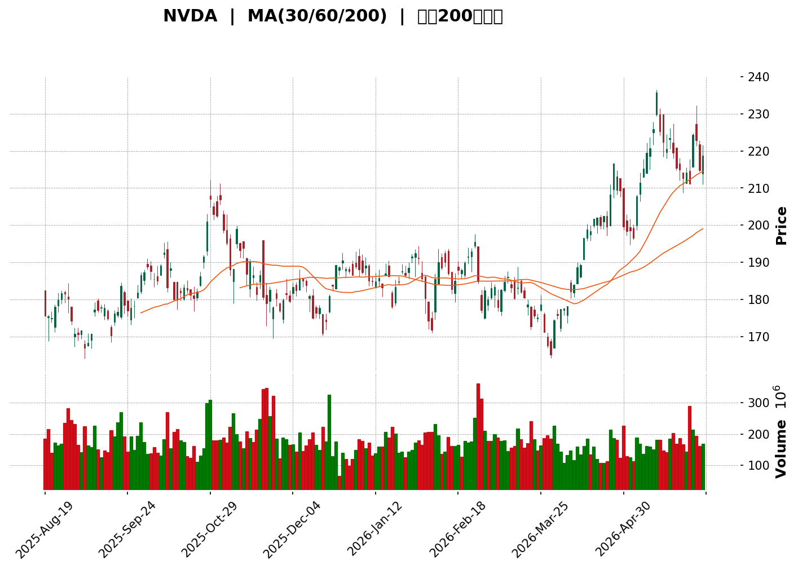
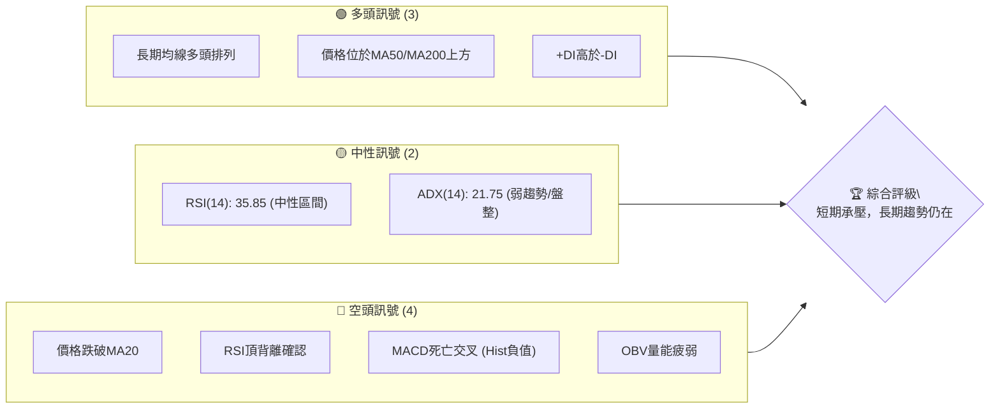
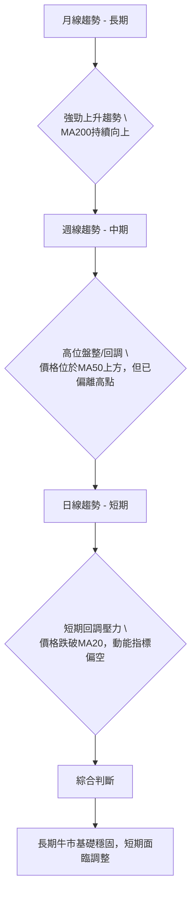
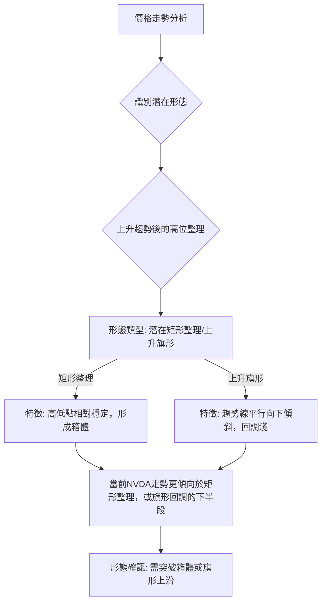

<details>
<summary>📊 靜態圖表 (點擊展開)</summary>

</details>

<html>
<head><meta charset="utf-8" /></head>
<body>
    <div style="height:500px; width:100%;">                        <script>window.PlotlyConfig = {MathJaxConfig: 'local'};</script>
        <script charset="utf-8" src="https://cdn.plot.ly/plotly-3.6.0.min.js" integrity="sha256-QaOVwtVY0T02VaHrr6pnoHLCwayMJp4O5n4YyaE3rJk=" crossorigin="anonymous"></script>                <div id="candlestick-chart" class="plotly-graph-div" style="height:100%; width:100%;"></div>            <script>                window.PLOTLYENV=window.PLOTLYENV || {};                                if (document.getElementById("candlestick-chart")) {                    Plotly.newPlot(                        "candlestick-chart",                        [{"close":{"dtype":"f8","bdata":"AAAAwIvzZUAAAAAA3utlQAAAAOBt3mVAAAAA4Ls+ZkAAAADA9nhmQAAAAGCst2ZAAAAAIDyyZkAAAABge4RmQAAAAGDVxGVAAAAAQA1YZUAAAADg7lJlQAAAACA1dGVAAAAAoMDfZEAAAABgBgllQAAAAGBpV2VAAAAAAJ4pZkAAAABg0SRmQAAAAICdOWZAAAAAQGA3ZkAAAADAi9tlQAAAAICuSGVAAAAAoA8HZkAAAACg0RRmQAAAAADg8mZAAAAAACJNZkAAAAAAax5mQAAAAMB0NWZAAAAAQHRFZkAAAADAj7pmQAAAAIDnUWdAAAAAwAVnZ0AAAAAA0ZtnQAAAAGAuc2dAAAAAwKAwZ0AAAABAoSBnQAAAAADbomdAAAAAQJARaEAAAAAAeuRmQAAAACCUiWdAAAAAwFOAZkAAAACg7XlmQAAAAABIuWZAAAAAgGXmZkAAAACg1tNmQAAAAMB7pGZAAAAAoFOIZkAAAADgesRmQAAAAECqR2dAAAAA4AHvZ0AAAAAAQSBpQAAAAICN4GlAAAAAYMRbaUAAAAAA+E5pQAAAAOBu22lAAAAAwGHVaEAAAADgCGZoQAAAAEDmgWdAAAAAoCOEZ0AAAACg5uBoQAAAAABxJGhAAAAAYOs4aEAAAAAA3VpnQAAAAIDFxGdAAAAAYItSZ0AAAAAA4qpmQAAAACD8T2dAAAAAYNiTZkAAAAAgiFtmQAAAAID10GZAAAAAgJ05ZkAAAADAr4dmQAAAAMBgH2ZAAAAA4M58ZkAAAAAgFa5mQAAAAMA\u002fcmZAAAAAwNfrZkAAAADgzcxmQAAAAGBHMWdAAAAAQLgeZ0AAAABApPhmQAAAAEBynWZAAAAAQFbgZUAAAACA+QhmQAAAAIC7NmZAAAAAwMhdZUAAAACgLcRlQAAAAOBdn2ZAAAAAAMP1ZkAAAACAZKZnQAAAAIAxk2dAAAAAQKHQZ0AAAADAtoZnQAAAAID0cGdAAAAAYK1PZ0AAAACA35pnQAAAAKCDg2dAAAAAIFtnZ0AAAABAMaNnQAAAAKD1IGdAAAAAIDMbZ0AAAACAwh1nQAAAACCZOWdAAAAAoCnkZkAAAADARmFnQAAAAIAJR2dAAAAAgO5BZkAAAABA7OlmQAAAAECPGmdAAAAAYB11Z0AAAACgt05nQAAAAEBQkGdAAAAAAE\u002fwZ0AAAACA\u002fA9oQAAAAEDU42dAAAAA4DIzZ0AAAABAkYpmQAAAAEDHxWVAAAAAwNx7ZUAAAACAzCxnQAAAAGDzwGdAAAAAAPSQZ0AAAABgRcFnQAAAAKDBXWdAAAAAgJrZZkAAAABAuB5nQAAAAMAIf2dAAAAAgHl8Z0AAAABg6blnQAAAAMBE8WdAAAAAwN0aaEAAAADAlHFoQAAAAOAoHGdAAAAAAMYlZkAAAABAC89mQAAAAMBJgWZAAAAAgPbgZkAAAAAAkOpmQAAAAKDuOWZAAAAAwHvUZkAAAAAAUhhnQAAAAMD1QGdAAAAA4HrkZkAAAAAAAIhmQAAAAEAK52ZAAAAAgMK9ZkAAAADAzIxmQAAAAIDrUWZAAAAAYGaWZUAAAADgevRlQAAAAGBm5mVAAAAAgMJVZkAAAAAgrmdlQAAAAOCj8GRAAAAAoHClZEAAAADAzMxlQAAAAAAA+GVAAAAA4HosZkAAAADgejRmQAAAAEAzQ2ZAAAAAYI\u002fCZkAAAADAHv1mQAAAAAAplGdAAAAAgOupZ0AAAADgUZBoQAAAAADX22hAAAAAQDPLaEAAAACAwjVpQAAAAIDrQWlAAAAAACn8aEAAAAAAAFBpQAAAAOB69GhAAAAA4KMIakAAAAAghRNrQAAAAKBwpWpAAAAAAAAoakAAAACAPfJoQAAAAGBmzmhAAAAAIFzPaEAAAAAAAJBoQAAAAGCP+mlAAAAAAABwakAAAABgZuZqQAAAAIAUbmtAAAAAwPWYa0AAAABgjzpsQAAAACCud21AAAAAgD0qbEAAAACAPcprQAAAACCFk2tAAAAAQArva0AAAADgUXBrQAAAAGCP6mpAAAAAIIXbakAAAABAM5NqQAAAAAAAyGpAAAAA4HpkakAAAAAghQtsQAAAAIA92mtAAAAAAADYakAAAADAHlVrQA=="},"high":{"dtype":"f8","bdata":"RJcTiQfPZkBm5etuEP9lQEw4weLbG2ZAneHyLu5RZkD2ID0kJ7xmQLoH44eCy2ZAIG3zybXOZkA9+JIlDw5nQGscZzjaQ2ZAYEBeUj6LZUBbJ5IwNIxlQNuyUTqbemVADzXiww8gZUC963ikz11lQK0GUVNzXmVAwKMGlVNoZkDjOl60U4hmQMy5VIySUmZAz0DqgpJaZkBR0+VkYC9mQCpNIaLKpWVAsTIA+pMiZkAUKyQb70FmQA0BlqfzEGdAhmMziczMZkD7iKv4U3hmQLDJgdCvh2ZA0QM+NAJ4ZkDqDCSRWv9mQCADpK6KamdAHJ7QsNGDZ0D\u002fObTO7eBnQMLlkgnaymdAStvhurNmZ0AKuK+CQaFnQLrdJq+IsmdAk9Y86+loaECJ5NoKJ3NoQGNL3CPawmdA0pQsVfMYZ0BPRHu3MBtnQFonlO1Q6GZAQ8lttY0CZ0A98aDSvyVnQD4\u002fjSij2GZAwkmBiG\u002ftZkCwMqMXUeBmQMa6OolhbmdAJS+PSlP\u002fZ0B47QcYFmRpQIAOyL5VhWpAG\u002fsBT2XEaUBgcjYyT\u002f5pQMKqyRwjampAhqf4v1J+aUB0bIcxulxpQP315Esls2hAt6LgOJSJZ0CRMByzYP1oQAQulNfAbGhArCbvvsp7aEDGNRNBaO1nQNsaf\u002f6l32dAt2RB91WfZ0APd+dn8xhnQOZbeyvcemdAXtC1rk9\u002faED34UeERRFnQDbhWAVb72ZAZPaucX5EZkBqHNk9etxmQDoYjVCmaGZAuwmLiPeIZkBSMLO4dzRnQH8El03CzWZAvN6xHlIQZ0BxiJ7gzBRnQD4o+qmsf2dAvizi6rc2Z0CBHgHfCS9nQNsStxPtqWZAQKFgauzZZkCTJlqOIU1mQGwzpwhfT2ZAd5s689oDZkBexbybfgRmQMdsyesVrmZAwbKdCs0EZ0Ck9mFyO6pnQMPM8v3KnGdARRHDCr8VaECiYqwi\u002fpdnQHTnd1tan2dAOXyIE5fRZ0BVW83wbB1oQNZJ1i7TM2hAoliLcBsFaEA0FGUfgutnQN\u002fLW6BFsWdAE\u002fPvl45KZ0A6Lo4IhGNnQGGo97oxg2dAJsEUimYOZ0BcMG1TErZnQELX0wHAzWdAFtN\u002fFtjLZkAgVUTW1itnQF0l9AgeRWdA+IfTJN+yZ0C5sGYzg6NnQJIt77erv2dAewfWAd4KaECFwd9RBi9oQKB4l+JXT2hA67r0S0XJZ0BKo5E+UUhnQHQgEbw\u002fcmZA9sv5Du8ZZkDNzG4LrV9nQAt8KOXINGhAULCgwAYPaEBlDrYz\u002fCdoQOf4A0svM2hAiz0E7KxvZ0BBdJjIeWRnQERCoZCCy2dA+u7iA2+NZ0ChfiMGO8pnQEs8w28QPmhAOR2V9004aEAHg+1U0bNoQFbdvnTxSGhAO1CPW5DSZkCBFc8QZ+5mQGzFd398nGZAx0angxQWZ0BgyFDumQFnQFasDM8A2GZAe0B7os3cZkBm5o7iwU1nQAAAAADXc2dAAAAAgBQeZ0AAAABA4UJnQAAAAAApnGdAAAAAwMwsZ0AAAAAAKexmQAAAACBcf2ZAAAAA4FFIZkAAAAAA10tmQAAAAEAKB2ZAAAAAQAqnZkAAAADgURBmQAAAAEAKX2VAAAAAYGYuZUAAAAAA19NlQAAAAADXK2ZAAAAAIK4vZkAAAACgRzlmQAAAACBcR2ZAAAAA4FEoZ0AAAABgjwJnQAAAAAAAwGdAAAAAwB61Z0AAAADgUZBoQAAAAMDMDGlAAAAAQDP7aEAAAABgZjZpQAAAAKBwRWlAAAAAAABYaUAAAAAAAFBpQAAAAGCPemlAAAAAYGZeakAAAABgjxprQAAAACBc12pAAAAAQAqXakAAAACgmUlqQAAAAAAAYGlAAAAAIFw3aUAAAAAgrgdpQAAAAOCjCGpAAAAAYGbGakAAAACgmTlrQAAAAKCZyWtAAAAAAAD4a0AAAABA4XpsQAAAAKBHkW1AAAAAAADwbEAAAAAAAMBsQAAAACBcD2xAAAAAAClEbEAAAADAzGxsQAAAAOBRoGtAAAAAgMJFa0AAAADAzMRqQAAAAOCj8GpAAAAAIIU7a0AAAAAA1xtsQAAAAMD1CG1AAAAAgD3aa0AAAABAM7NrQA=="},"hovertemplate":"\u003cb\u003e%{x|%Y-%m-%d}\u003c\u002fb\u003e\u003cbr\u003e\u958b: $%{open:.2f}\u003cbr\u003e\u9ad8: $%{high:.2f}\u003cbr\u003e\u4f4e: $%{low:.2f}\u003cbr\u003e\u6536: $%{close:.2f}\u003cextra\u003e\u003c\u002fextra\u003e","low":{"dtype":"f8","bdata":"lwxHNL\u002fuZUBSVtbbsxhlQFwx0tf+uGVAk2XNXX1lZUDED\u002f8oTRFmQBPLxgf4WGZAGdLshj9iZkDjpj+eLgxmQLXP9wbho2VAOKm5mCbmZEDPMQI+QxtlQM\u002fz6y84LGVAxyWJQ16BZEA8jI5uT+pkQEV2NBnL1mRAHKkhaBvuZUANMMZ+vQ5mQEdPk5vHDWZA3IRyCbXPZUCQlxgzjMtlQBjow1CHDGVAxbUo0xyeZUBYcUrXJOVlQA8XBUEb1mVAvSo13xkGZkBNba3pLuxlQPUAgFmNo2VAnh6KLiXdZUCTBChgm4lmQBJntta4rmZAQw\u002flYCf8ZkA5NxdfQoFnQFeyYWOCK2dADfXXfOrpZkADAGKPWv9mQOJK38+fUGdAGZ\u002fHmz\u002fhZ0BBKpnf9cBmQGOwYR8RPmdAfw4FrMR1ZkBYAt4oqChmQJjXpDUCeGZAnk3FXl53ZkCYDoGxuLZmQGhzQtn3eGZArcpf6rIXZkBAENLhpXhmQGRd3tta72ZA9penABmNZ0Ck9TAzcvxnQN\u002f1HKg9mGlAoGrNlGksaUAsu7TAh0FpQIcuBZAysWlAqmYJbxC9aECKXePAHVRoQHnSVmeBS2dARfFA7n1cZkBm4examThoQEP6T4zt6GdAyWeRJn3jZ0Cy+EzVjfpmQPp3LOHskWZAA78brZcJZ0ACIL8pK3RmQHk0lPHq2WZA++rtdZF6ZkBF8eL5Jp1lQGwjFXW9DmZAytv0EAExZUAtwRfRDUdmQIrxKTNhD2ZAOuwdXCa1ZUAt80AQXn9mQMhagA7kYmZAy2Pqo2h+ZkBf+kCKzpxmQD6bdeV7zGZALXBBO+zpZkBnpYnl9sBmQEPLYqmIE2ZAW+VqjYnTZUAIF\u002fIuqOBlQB6O5D9\u002f3GVAdUd4B6BJZUDKlHdH8XllQGRq0Q+TCmZAeEozWOLKZkDvQBOse9xmQGVXR4WOUmdA4uk+n6x\u002fZ0AaOlhGzDxnQG9bN6VvXWdALy8igVtPZ0Cay\u002fti\u002fodnQM7tgz96RGdAnVGpr+pZZ0BRjojBmFFnQBOe4fZm9mZAQ9UhJx\u002f1ZkCb8u65UuBmQHVNhHF77GZAhXPDaUmZZkASY6rRPEpnQD9LCdE8QmdAjpY+VDYzZkD5Cz2ufUxmQNcFWedw\u002fWZAr52GoOpZZ0DonnK2Wz9nQI8tPAAUNmdAXe6YHo26Z0D7kEf8mEFnQB8rbzy2rmdAifLPEtcbZ0Drv77yDQdmQPba2YLSfGVA13yI4KlgZUAv3qHL5dJlQFtOKtMU\u002fmZAL2+wj4ODZ0AiCEMxUJhnQLFQzTD\u002fT2dA20FiypCyZkD2shkRc2VmQLUYhgr\u002fV2dA\u002fHIQfsw0Z0ClkjQYwj1nQDtTdl87smdA\u002fByQqnlsZ0AI6QCp8ThoQMIzt8DrCWdAn6jd29oLZkA2q4R5LdRlQEZFeCMiHWZA5GodspuBZkDLNnAr2jtmQCSTjRHvGWZA1dzqpJ3xZUBtRBc5AcBmQAAAAGBmDmdAAAAAAAC4ZkAAAACAFH5mQAAAAMAerWZAAAAAgMK1ZkAAAABgj4pmQAAAAKBH+WVAAAAAQAp3ZUAAAADgUdhlQAAAACBcv2VAAAAAQDMbZkAAAADgemRlQAAAAOBR4GRAAAAA4KOIZEAAAABguN5kQAAAAAAA2GVAAAAAANdrZUAAAADgUfhlQAAAAMAetWVAAAAAoJmJZkAAAAAA15NmQAAAAKCZCWdAAAAAIK43Z0AAAADgo9hnQAAAACCud2hAAAAAgOt5aEAAAADgo+hoQAAAAEDhumhAAAAAAADgaEAAAAAAAOBoQAAAAEAKp2hAAAAAgOv5aEAAAAAAKexpQAAAAGBmBmpAAAAAYI\u002fyaUAAAABgZtZoQAAAAADXo2hAAAAAIK5XaEAAAADA9YBoQAAAACCF02hAAAAAAADQaUAAAADgepxqQAAAAOB6vGpAAAAAoHDdakAAAACAPbJrQAAAAKCZqWxAAAAAIK4HbEAAAAAA10trQAAAAMAePWtAAAAAAACQa0AAAACAwj1rQAAAAKCZ2WpAAAAAAACAakAAAADA9RhqQAAAAEAKZ2pAAAAAAClkakAAAABgZvZqQAAAAEAzq2tAAAAA4FHQakAAAABACl9qQA=="},"name":"\u50f9\u683c","open":{"dtype":"f8","bdata":"5et5IcrMZkC7+yQwguRlQP9VTy1F2mVAEuyFMpqSZUDVar58QEpmQA+jD1T2gGZAFn2fe2S+ZkB3oH1dR5lmQB1JV6aSQmZA+RPYjxg\u002fZUDPNsHGAmFlQDHmw1tVUWVAh4AzIBEAZUBloduItfBkQL\u002fyFwb7IWVAB8hvcIoTZkC++W7+IHVmQH6ZhOsDOGZACvOOvtL0ZUDhav7XYB9mQCP+CaPfk2VAPE9TqL++ZUCLzFqvBfhlQJbNL\u002fn76GVAFOnSkGa+ZkAw8\u002fgaAnhmQGRyy0K\u002fzmVAfwKbZNBEZkCzW9dGII1mQB6CgozrwWZA8RdqjAcnZ0B7I4m8iLJnQO35xHZqpWdAAlU1KVkvZ0BHpxautEZnQCHD9aiVUWdAxmhPLq8GaECc0rjQoy9oQHhvljBhfmdAvq8VnP0XZ0CzF5ln8xhnQI8HTz+4xmZA\u002fhDKeyCFZkA+dDBPhONmQD4\u002fjSij2GZAwM0C+tejZkDtgLpQzoxmQBCkic07+mZAouFqOQO\u002fZ0Dw1soM7CBoQDQuqyeh\u002fmlAi9SVNxSkaUDN4DKwrM1pQFzFnivUAWpAA\u002fBeX0lfaUB4sags8ddoQLkxIgDAjGhATRTfiyYcZ0AEswqr1WJoQM\u002f8cjNvZGhAMUcQRlp2aECRm+e67eBnQPOq8pPg2mZAC9EY8WI+Z0CokN8OhOtmQGB4UG6hGGdAN7w5GrZ9aEBeqqYgC6dmQGg+S8AMb2ZABD1OXoHcZUD3yY+khbNmQDnpCtGwX2ZAh9iOw7TXZUBE7+harrdmQJIg+4jsoWZAiFqhh4azZkB3RwRYKfxmQH5OOeop1GZA98YKPZkxZ0DlDOc4uB5nQHv9zcmliGZA4aqIzDSjZkBusc6kxT1mQKtbnsUDCGZABNGhNuUCZkDZzrVTqNBlQJkeXEoiFWZAfmDgBR\u002f9ZkDSbyEkud5mQJQpDCzBfWdAv8lBZRy9Z0BEcOsZZXZnQCn6kbBah2dAFT3Qg+mxZ0AcbpsPjbpnQI\u002frAeP892dAXSHJa0\u002fQZ0Bf50\u002fd6ZFnQGRlRlIxo2dApXoERz0iZ0BJeTsDueZmQB2w7futH2dAfT37uesJZ0DgN2JerU9nQK\u002fdS3w7omdAPwgEDXy8ZkB3knxESmFmQPqCOAquF2dAih9O06xvZ0DE+7rRy2RnQJK6WhFbZ2dAjNFcHE\u002foZ0Bc+9RkjOpnQDgs65Zj5mdAs5ugaxNmZ0CuxPmBW0dnQM+psMlobmZAbcWe5XTdZUB0aEgexhVmQOio+y8ACGdAaAiHHdTrZ0AgbaIPEQ5oQLcp1yygIGhASB9JDglvZ0C6BG9tr7dmQEwVkkisl2dAHitGn5hhZ0DmbrrQ6lFnQCETBPF37GdAplFbOlnvZ0AUhw0eEE5oQNTbA7dNSGhAqBSJs6+nZkAY+YlPBOBlQC+gKvFeT2ZAorz\u002fhsSNZkDm7C9WIKVmQD\u002fHn3qRemZAD1G89EAaZkBAmtnse8xmQAAAAMAePWdAAAAAoJkBZ0AAAACgcB1nQAAAAEAK32ZAAAAAgOshZ0AAAAAgXM9mQAAAAOBRQGZAAAAAAABAZkAAAADgUShmQAAAAGCP2mVAAAAAQDMjZkAAAACAPQJmQAAAAAAAQGVAAAAAwPUYZUAAAABACt9kQAAAAAAAAGZAAAAAgMKFZUAAAADAHiVmQAAAACBc92VAAAAAAAAQZ0AAAABA4bpmQAAAAIDrCWdAAAAAwPVAZ0AAAABA4dpnQAAAAKBHkWhAAAAAgMKtaEAAAADAzPxoQAAAACBc\u002f2hAAAAAAClEaUAAAAAgrh9pQAAAAGC4TmlAAAAAYLj+aEAAAADAzDRqQAAAACCuL2pAAAAAYGaWakAAAACAwj1qQAAAAMD1KGlAAAAAAADwaEAAAACgmeloQAAAAOB6\u002fGhAAAAAQOEKakAAAADA9aBqQAAAAKBHwWpAAAAAoJlRa0AAAACAwh1sQAAAAEAzu2xAAAAA4FG4bEAAAAAA17tsQAAAAADXc2tAAAAAgMLla0AAAACgR8lrQAAAAMDMnGtAAAAAoEcRa0AAAAAA18NqQAAAAMD1aGpAAAAAYI\u002fSakAAAAAgXPdqQAAAAIDCZWxAAAAAQAq3a0AAAADA9bxqQA=="},"x":["2025-08-19T00:00:00-04:00","2025-08-20T00:00:00-04:00","2025-08-21T00:00:00-04:00","2025-08-22T00:00:00-04:00","2025-08-25T00:00:00-04:00","2025-08-26T00:00:00-04:00","2025-08-27T00:00:00-04:00","2025-08-28T00:00:00-04:00","2025-08-29T00:00:00-04:00","2025-09-02T00:00:00-04:00","2025-09-03T00:00:00-04:00","2025-09-04T00:00:00-04:00","2025-09-05T00:00:00-04:00","2025-09-08T00:00:00-04:00","2025-09-09T00:00:00-04:00","2025-09-10T00:00:00-04:00","2025-09-11T00:00:00-04:00","2025-09-12T00:00:00-04:00","2025-09-15T00:00:00-04:00","2025-09-16T00:00:00-04:00","2025-09-17T00:00:00-04:00","2025-09-18T00:00:00-04:00","2025-09-19T00:00:00-04:00","2025-09-22T00:00:00-04:00","2025-09-23T00:00:00-04:00","2025-09-24T00:00:00-04:00","2025-09-25T00:00:00-04:00","2025-09-26T00:00:00-04:00","2025-09-29T00:00:00-04:00","2025-09-30T00:00:00-04:00","2025-10-01T00:00:00-04:00","2025-10-02T00:00:00-04:00","2025-10-03T00:00:00-04:00","2025-10-06T00:00:00-04:00","2025-10-07T00:00:00-04:00","2025-10-08T00:00:00-04:00","2025-10-09T00:00:00-04:00","2025-10-10T00:00:00-04:00","2025-10-13T00:00:00-04:00","2025-10-14T00:00:00-04:00","2025-10-15T00:00:00-04:00","2025-10-16T00:00:00-04:00","2025-10-17T00:00:00-04:00","2025-10-20T00:00:00-04:00","2025-10-21T00:00:00-04:00","2025-10-22T00:00:00-04:00","2025-10-23T00:00:00-04:00","2025-10-24T00:00:00-04:00","2025-10-27T00:00:00-04:00","2025-10-28T00:00:00-04:00","2025-10-29T00:00:00-04:00","2025-10-30T00:00:00-04:00","2025-10-31T00:00:00-04:00","2025-11-03T00:00:00-05:00","2025-11-04T00:00:00-05:00","2025-11-05T00:00:00-05:00","2025-11-06T00:00:00-05:00","2025-11-07T00:00:00-05:00","2025-11-10T00:00:00-05:00","2025-11-11T00:00:00-05:00","2025-11-12T00:00:00-05:00","2025-11-13T00:00:00-05:00","2025-11-14T00:00:00-05:00","2025-11-17T00:00:00-05:00","2025-11-18T00:00:00-05:00","2025-11-19T00:00:00-05:00","2025-11-20T00:00:00-05:00","2025-11-21T00:00:00-05:00","2025-11-24T00:00:00-05:00","2025-11-25T00:00:00-05:00","2025-11-26T00:00:00-05:00","2025-11-28T00:00:00-05:00","2025-12-01T00:00:00-05:00","2025-12-02T00:00:00-05:00","2025-12-03T00:00:00-05:00","2025-12-04T00:00:00-05:00","2025-12-05T00:00:00-05:00","2025-12-08T00:00:00-05:00","2025-12-09T00:00:00-05:00","2025-12-10T00:00:00-05:00","2025-12-11T00:00:00-05:00","2025-12-12T00:00:00-05:00","2025-12-15T00:00:00-05:00","2025-12-16T00:00:00-05:00","2025-12-17T00:00:00-05:00","2025-12-18T00:00:00-05:00","2025-12-19T00:00:00-05:00","2025-12-22T00:00:00-05:00","2025-12-23T00:00:00-05:00","2025-12-24T00:00:00-05:00","2025-12-26T00:00:00-05:00","2025-12-29T00:00:00-05:00","2025-12-30T00:00:00-05:00","2025-12-31T00:00:00-05:00","2026-01-02T00:00:00-05:00","2026-01-05T00:00:00-05:00","2026-01-06T00:00:00-05:00","2026-01-07T00:00:00-05:00","2026-01-08T00:00:00-05:00","2026-01-09T00:00:00-05:00","2026-01-12T00:00:00-05:00","2026-01-13T00:00:00-05:00","2026-01-14T00:00:00-05:00","2026-01-15T00:00:00-05:00","2026-01-16T00:00:00-05:00","2026-01-20T00:00:00-05:00","2026-01-21T00:00:00-05:00","2026-01-22T00:00:00-05:00","2026-01-23T00:00:00-05:00","2026-01-26T00:00:00-05:00","2026-01-27T00:00:00-05:00","2026-01-28T00:00:00-05:00","2026-01-29T00:00:00-05:00","2026-01-30T00:00:00-05:00","2026-02-02T00:00:00-05:00","2026-02-03T00:00:00-05:00","2026-02-04T00:00:00-05:00","2026-02-05T00:00:00-05:00","2026-02-06T00:00:00-05:00","2026-02-09T00:00:00-05:00","2026-02-10T00:00:00-05:00","2026-02-11T00:00:00-05:00","2026-02-12T00:00:00-05:00","2026-02-13T00:00:00-05:00","2026-02-17T00:00:00-05:00","2026-02-18T00:00:00-05:00","2026-02-19T00:00:00-05:00","2026-02-20T00:00:00-05:00","2026-02-23T00:00:00-05:00","2026-02-24T00:00:00-05:00","2026-02-25T00:00:00-05:00","2026-02-26T00:00:00-05:00","2026-02-27T00:00:00-05:00","2026-03-02T00:00:00-05:00","2026-03-03T00:00:00-05:00","2026-03-04T00:00:00-05:00","2026-03-05T00:00:00-05:00","2026-03-06T00:00:00-05:00","2026-03-09T00:00:00-04:00","2026-03-10T00:00:00-04:00","2026-03-11T00:00:00-04:00","2026-03-12T00:00:00-04:00","2026-03-13T00:00:00-04:00","2026-03-16T00:00:00-04:00","2026-03-17T00:00:00-04:00","2026-03-18T00:00:00-04:00","2026-03-19T00:00:00-04:00","2026-03-20T00:00:00-04:00","2026-03-23T00:00:00-04:00","2026-03-24T00:00:00-04:00","2026-03-25T00:00:00-04:00","2026-03-26T00:00:00-04:00","2026-03-27T00:00:00-04:00","2026-03-30T00:00:00-04:00","2026-03-31T00:00:00-04:00","2026-04-01T00:00:00-04:00","2026-04-02T00:00:00-04:00","2026-04-06T00:00:00-04:00","2026-04-07T00:00:00-04:00","2026-04-08T00:00:00-04:00","2026-04-09T00:00:00-04:00","2026-04-10T00:00:00-04:00","2026-04-13T00:00:00-04:00","2026-04-14T00:00:00-04:00","2026-04-15T00:00:00-04:00","2026-04-16T00:00:00-04:00","2026-04-17T00:00:00-04:00","2026-04-20T00:00:00-04:00","2026-04-21T00:00:00-04:00","2026-04-22T00:00:00-04:00","2026-04-23T00:00:00-04:00","2026-04-24T00:00:00-04:00","2026-04-27T00:00:00-04:00","2026-04-28T00:00:00-04:00","2026-04-29T00:00:00-04:00","2026-04-30T00:00:00-04:00","2026-05-01T00:00:00-04:00","2026-05-04T00:00:00-04:00","2026-05-05T00:00:00-04:00","2026-05-06T00:00:00-04:00","2026-05-07T00:00:00-04:00","2026-05-08T00:00:00-04:00","2026-05-11T00:00:00-04:00","2026-05-12T00:00:00-04:00","2026-05-13T00:00:00-04:00","2026-05-14T00:00:00-04:00","2026-05-15T00:00:00-04:00","2026-05-18T00:00:00-04:00","2026-05-19T00:00:00-04:00","2026-05-20T00:00:00-04:00","2026-05-21T00:00:00-04:00","2026-05-22T00:00:00-04:00","2026-05-26T00:00:00-04:00","2026-05-27T00:00:00-04:00","2026-05-28T00:00:00-04:00","2026-05-29T00:00:00-04:00","2026-06-01T00:00:00-04:00","2026-06-02T00:00:00-04:00","2026-06-03T00:00:00-04:00","2026-06-04T00:00:00-04:00"],"type":"candlestick"},{"hovertemplate":"MA30: $%{y:.2f}\u003cextra\u003e\u003c\u002fextra\u003e","line":{"color":"#2196F3","dash":"dash","width":2},"mode":"lines","name":"MA30","x":["2025-08-19T00:00:00-04:00","2025-08-20T00:00:00-04:00","2025-08-21T00:00:00-04:00","2025-08-22T00:00:00-04:00","2025-08-25T00:00:00-04:00","2025-08-26T00:00:00-04:00","2025-08-27T00:00:00-04:00","2025-08-28T00:00:00-04:00","2025-08-29T00:00:00-04:00","2025-09-02T00:00:00-04:00","2025-09-03T00:00:00-04:00","2025-09-04T00:00:00-04:00","2025-09-05T00:00:00-04:00","2025-09-08T00:00:00-04:00","2025-09-09T00:00:00-04:00","2025-09-10T00:00:00-04:00","2025-09-11T00:00:00-04:00","2025-09-12T00:00:00-04:00","2025-09-15T00:00:00-04:00","2025-09-16T00:00:00-04:00","2025-09-17T00:00:00-04:00","2025-09-18T00:00:00-04:00","2025-09-19T00:00:00-04:00","2025-09-22T00:00:00-04:00","2025-09-23T00:00:00-04:00","2025-09-24T00:00:00-04:00","2025-09-25T00:00:00-04:00","2025-09-26T00:00:00-04:00","2025-09-29T00:00:00-04:00","2025-09-30T00:00:00-04:00","2025-10-01T00:00:00-04:00","2025-10-02T00:00:00-04:00","2025-10-03T00:00:00-04:00","2025-10-06T00:00:00-04:00","2025-10-07T00:00:00-04:00","2025-10-08T00:00:00-04:00","2025-10-09T00:00:00-04:00","2025-10-10T00:00:00-04:00","2025-10-13T00:00:00-04:00","2025-10-14T00:00:00-04:00","2025-10-15T00:00:00-04:00","2025-10-16T00:00:00-04:00","2025-10-17T00:00:00-04:00","2025-10-20T00:00:00-04:00","2025-10-21T00:00:00-04:00","2025-10-22T00:00:00-04:00","2025-10-23T00:00:00-04:00","2025-10-24T00:00:00-04:00","2025-10-27T00:00:00-04:00","2025-10-28T00:00:00-04:00","2025-10-29T00:00:00-04:00","2025-10-30T00:00:00-04:00","2025-10-31T00:00:00-04:00","2025-11-03T00:00:00-05:00","2025-11-04T00:00:00-05:00","2025-11-05T00:00:00-05:00","2025-11-06T00:00:00-05:00","2025-11-07T00:00:00-05:00","2025-11-10T00:00:00-05:00","2025-11-11T00:00:00-05:00","2025-11-12T00:00:00-05:00","2025-11-13T00:00:00-05:00","2025-11-14T00:00:00-05:00","2025-11-17T00:00:00-05:00","2025-11-18T00:00:00-05:00","2025-11-19T00:00:00-05:00","2025-11-20T00:00:00-05:00","2025-11-21T00:00:00-05:00","2025-11-24T00:00:00-05:00","2025-11-25T00:00:00-05:00","2025-11-26T00:00:00-05:00","2025-11-28T00:00:00-05:00","2025-12-01T00:00:00-05:00","2025-12-02T00:00:00-05:00","2025-12-03T00:00:00-05:00","2025-12-04T00:00:00-05:00","2025-12-05T00:00:00-05:00","2025-12-08T00:00:00-05:00","2025-12-09T00:00:00-05:00","2025-12-10T00:00:00-05:00","2025-12-11T00:00:00-05:00","2025-12-12T00:00:00-05:00","2025-12-15T00:00:00-05:00","2025-12-16T00:00:00-05:00","2025-12-17T00:00:00-05:00","2025-12-18T00:00:00-05:00","2025-12-19T00:00:00-05:00","2025-12-22T00:00:00-05:00","2025-12-23T00:00:00-05:00","2025-12-24T00:00:00-05:00","2025-12-26T00:00:00-05:00","2025-12-29T00:00:00-05:00","2025-12-30T00:00:00-05:00","2025-12-31T00:00:00-05:00","2026-01-02T00:00:00-05:00","2026-01-05T00:00:00-05:00","2026-01-06T00:00:00-05:00","2026-01-07T00:00:00-05:00","2026-01-08T00:00:00-05:00","2026-01-09T00:00:00-05:00","2026-01-12T00:00:00-05:00","2026-01-13T00:00:00-05:00","2026-01-14T00:00:00-05:00","2026-01-15T00:00:00-05:00","2026-01-16T00:00:00-05:00","2026-01-20T00:00:00-05:00","2026-01-21T00:00:00-05:00","2026-01-22T00:00:00-05:00","2026-01-23T00:00:00-05:00","2026-01-26T00:00:00-05:00","2026-01-27T00:00:00-05:00","2026-01-28T00:00:00-05:00","2026-01-29T00:00:00-05:00","2026-01-30T00:00:00-05:00","2026-02-02T00:00:00-05:00","2026-02-03T00:00:00-05:00","2026-02-04T00:00:00-05:00","2026-02-05T00:00:00-05:00","2026-02-06T00:00:00-05:00","2026-02-09T00:00:00-05:00","2026-02-10T00:00:00-05:00","2026-02-11T00:00:00-05:00","2026-02-12T00:00:00-05:00","2026-02-13T00:00:00-05:00","2026-02-17T00:00:00-05:00","2026-02-18T00:00:00-05:00","2026-02-19T00:00:00-05:00","2026-02-20T00:00:00-05:00","2026-02-23T00:00:00-05:00","2026-02-24T00:00:00-05:00","2026-02-25T00:00:00-05:00","2026-02-26T00:00:00-05:00","2026-02-27T00:00:00-05:00","2026-03-02T00:00:00-05:00","2026-03-03T00:00:00-05:00","2026-03-04T00:00:00-05:00","2026-03-05T00:00:00-05:00","2026-03-06T00:00:00-05:00","2026-03-09T00:00:00-04:00","2026-03-10T00:00:00-04:00","2026-03-11T00:00:00-04:00","2026-03-12T00:00:00-04:00","2026-03-13T00:00:00-04:00","2026-03-16T00:00:00-04:00","2026-03-17T00:00:00-04:00","2026-03-18T00:00:00-04:00","2026-03-19T00:00:00-04:00","2026-03-20T00:00:00-04:00","2026-03-23T00:00:00-04:00","2026-03-24T00:00:00-04:00","2026-03-25T00:00:00-04:00","2026-03-26T00:00:00-04:00","2026-03-27T00:00:00-04:00","2026-03-30T00:00:00-04:00","2026-03-31T00:00:00-04:00","2026-04-01T00:00:00-04:00","2026-04-02T00:00:00-04:00","2026-04-06T00:00:00-04:00","2026-04-07T00:00:00-04:00","2026-04-08T00:00:00-04:00","2026-04-09T00:00:00-04:00","2026-04-10T00:00:00-04:00","2026-04-13T00:00:00-04:00","2026-04-14T00:00:00-04:00","2026-04-15T00:00:00-04:00","2026-04-16T00:00:00-04:00","2026-04-17T00:00:00-04:00","2026-04-20T00:00:00-04:00","2026-04-21T00:00:00-04:00","2026-04-22T00:00:00-04:00","2026-04-23T00:00:00-04:00","2026-04-24T00:00:00-04:00","2026-04-27T00:00:00-04:00","2026-04-28T00:00:00-04:00","2026-04-29T00:00:00-04:00","2026-04-30T00:00:00-04:00","2026-05-01T00:00:00-04:00","2026-05-04T00:00:00-04:00","2026-05-05T00:00:00-04:00","2026-05-06T00:00:00-04:00","2026-05-07T00:00:00-04:00","2026-05-08T00:00:00-04:00","2026-05-11T00:00:00-04:00","2026-05-12T00:00:00-04:00","2026-05-13T00:00:00-04:00","2026-05-14T00:00:00-04:00","2026-05-15T00:00:00-04:00","2026-05-18T00:00:00-04:00","2026-05-19T00:00:00-04:00","2026-05-20T00:00:00-04:00","2026-05-21T00:00:00-04:00","2026-05-22T00:00:00-04:00","2026-05-26T00:00:00-04:00","2026-05-27T00:00:00-04:00","2026-05-28T00:00:00-04:00","2026-05-29T00:00:00-04:00","2026-06-01T00:00:00-04:00","2026-06-02T00:00:00-04:00","2026-06-03T00:00:00-04:00","2026-06-04T00:00:00-04:00"],"y":{"dtype":"f8","bdata":"AAAAAAAA+H8AAAAAAAD4fwAAAAAAAPh\u002fAAAAAAAA+H8AAAAAAAD4fwAAAAAAAPh\u002fAAAAAAAA+H8AAAAAAAD4fwAAAAAAAPh\u002fAAAAAAAA+H8AAAAAAAD4fwAAAAAAAPh\u002fAAAAAAAA+H8AAAAAAAD4fwAAAAAAAPh\u002fAAAAAAAA+H8AAAAAAAD4fwAAAAAAAPh\u002fAAAAAAAA+H8AAAAAAAD4fwAAAAAAAPh\u002fAAAAAAAA+H8AAAAAAAD4fwAAAAAAAPh\u002fAAAAAAAA+H8AAAAAAAD4fwAAAAAAAPh\u002fAAAAAAAA+H8AAAAAAAD4f0RERMQuDGZAMzMzs5AYZkCrqqqq9iZmQM3MzIx0NGZAZmZmtoQ8ZkBmZmZ2G0JmQJqZmVnySWZAq6qqWqhVZkAiIiKC21hmQO\u002fu7u7yZ2ZAZmZmJtNxZkARERFxqHtmQHd3d2d+hmZAq6qqKsiXZkAAAABgE6dmQGZmZpYtsmZAZmZmxlW1ZkCamZk5qLpmQGZmZqaow2ZAvLu7K1DSZkBEREQUNO5mQN7d3S1mFWdAq6qqmtIxZ0CrqqpqXE1nQKuqqvotZmdAREREtMl7Z0BmZmbmPY9nQAAAAMBSmmdAIiIiMvKkZ0DNzMxsSrdnQCIiIgJPvmdAERERIU7FZ0DNzMzcI8NnQJqZmRncxWdAVVVVhf3GZ0Dv7u6+EMNnQFVVVZVNwGdAERERQZSzZ0CJiIioA69nQM3MzDzcqGdARERE1ICmZ0C8u7s79qZnQM3MzOzUoWdAd3d350+eZ0CJiIi4DZ1nQN7d3Q1hm2dAIiIiQrKeZ0CrqqpK+Z5nQDMzM0M6nmdAAAAA4EiXZ0CJiIjI5YRnQKuqqooPaWdAvLu7q1hLZ0CamZnJaS9nQN7d3b1SEGdAMzMzk7zyZkBVVVVVRtxmQBEREUG51GZAzczMTPrPZkDv7u5+fsVmQLy7uwunwGZAvLu7Gy29ZkDNzMxMo75mQBERERHYu2ZAmpmZmb+7ZkBERESEv8NmQLy7uzt3xWZAAAAAIITMZkCamZkpcNdmQFVVVdUa2mZAIiIi0p\u002fhZkAiIiJyoOZmQJqZmbkI8GZA7+7urnrzZkDe3d3Nc\u002flmQImIiJiLAGdAAAAAsOH6ZkCrqqoq2vtmQLy7u0sY+2ZAiYiIiPn9ZkC8u7sL2ABnQDMzM4PwCGdA7+7u3okaZ0BVVVXF1itnQFVVVWUkOmdAEREREcpJZ0DNzMz8ZlBnQLy7uzsmSWdA3t3dfY08Z0BERETkfzhnQKuqqloGOmdAq6qq+uY3Z0Crqqqq2jlnQGZmZtY2OWdAZmZmRkc1Z0BVVVXVIzFnQKuqqpr9MGdAERER0bExZ0AAAACwczJnQCIiIkJlOWdAIiIi8upBZ0ARERHBPk1nQLy7u4tDTGdARERE5OpFZ0CrqqoKC0FnQFVVVZVzOmdAZmZmpsA\u002fZ0C8u7sbxj9nQJqZmUlJOGdAERERke4yZ0ARERFhHjFnQKuqqjp5LmdAIiIiwoslZ0Dv7u7OehhnQM3MzKwNEGdAd3d3hyMMZ0BERESUNgxnQERERHTiEGdAiYiI6MQRZ0CamZnJWwdnQJqZmUmK92ZAMzMzowjtZkAAAAAQ+9hmQO\u002fu7t5GxGZAzczMrHixZkB3d3cXNaZmQEREREQsmWZAzczMHPmNZkBmZmb2\u002fYBmQLy7uwuocmZAd3d39y1nZkAiIiKiw1pmQDMzM6PDXmZAIiIi0rNrZkBERESkrXpmQKuqqmrDjmZAZmZmxhqfZkBmZmaGrbJmQJqZmUmLzGZA3t3d7e7eZkAREREh2\u002fFmQBEREZFfAGdAvLu7uy0bZ0AAAABw9kFnQImIiMjoYWdAd3d39wx\u002fZ0CJiIiof5NnQERERPS2qGdAzczMnDbEZ0CJiIjIdtpnQDMzM\u002fNE\u002fWdAAAAAAEcgaEAiIiICK09oQBEREaGMhmhA3t3d3d3BaEAAAACwufhoQFVVVfW2OGlAvLu7C9draUCrqqqqf5tpQKuqqrrXyGlAVVVV9f30aUAREREh9xpqQCIiIgJyN2pAzczM3LJSakAiIiKC3GNqQGZmZkZEdGpAvLu7y+iBakAzMzPzGZpqQBEREdE+sGpAERERURvAakAzMzMTWNFqQA=="},"type":"scatter"},{"hovertemplate":"MA60: $%{y:.2f}\u003cextra\u003e\u003c\u002fextra\u003e","line":{"color":"#9C27B0","dash":"dash","width":2},"mode":"lines","name":"MA60","x":["2025-08-19T00:00:00-04:00","2025-08-20T00:00:00-04:00","2025-08-21T00:00:00-04:00","2025-08-22T00:00:00-04:00","2025-08-25T00:00:00-04:00","2025-08-26T00:00:00-04:00","2025-08-27T00:00:00-04:00","2025-08-28T00:00:00-04:00","2025-08-29T00:00:00-04:00","2025-09-02T00:00:00-04:00","2025-09-03T00:00:00-04:00","2025-09-04T00:00:00-04:00","2025-09-05T00:00:00-04:00","2025-09-08T00:00:00-04:00","2025-09-09T00:00:00-04:00","2025-09-10T00:00:00-04:00","2025-09-11T00:00:00-04:00","2025-09-12T00:00:00-04:00","2025-09-15T00:00:00-04:00","2025-09-16T00:00:00-04:00","2025-09-17T00:00:00-04:00","2025-09-18T00:00:00-04:00","2025-09-19T00:00:00-04:00","2025-09-22T00:00:00-04:00","2025-09-23T00:00:00-04:00","2025-09-24T00:00:00-04:00","2025-09-25T00:00:00-04:00","2025-09-26T00:00:00-04:00","2025-09-29T00:00:00-04:00","2025-09-30T00:00:00-04:00","2025-10-01T00:00:00-04:00","2025-10-02T00:00:00-04:00","2025-10-03T00:00:00-04:00","2025-10-06T00:00:00-04:00","2025-10-07T00:00:00-04:00","2025-10-08T00:00:00-04:00","2025-10-09T00:00:00-04:00","2025-10-10T00:00:00-04:00","2025-10-13T00:00:00-04:00","2025-10-14T00:00:00-04:00","2025-10-15T00:00:00-04:00","2025-10-16T00:00:00-04:00","2025-10-17T00:00:00-04:00","2025-10-20T00:00:00-04:00","2025-10-21T00:00:00-04:00","2025-10-22T00:00:00-04:00","2025-10-23T00:00:00-04:00","2025-10-24T00:00:00-04:00","2025-10-27T00:00:00-04:00","2025-10-28T00:00:00-04:00","2025-10-29T00:00:00-04:00","2025-10-30T00:00:00-04:00","2025-10-31T00:00:00-04:00","2025-11-03T00:00:00-05:00","2025-11-04T00:00:00-05:00","2025-11-05T00:00:00-05:00","2025-11-06T00:00:00-05:00","2025-11-07T00:00:00-05:00","2025-11-10T00:00:00-05:00","2025-11-11T00:00:00-05:00","2025-11-12T00:00:00-05:00","2025-11-13T00:00:00-05:00","2025-11-14T00:00:00-05:00","2025-11-17T00:00:00-05:00","2025-11-18T00:00:00-05:00","2025-11-19T00:00:00-05:00","2025-11-20T00:00:00-05:00","2025-11-21T00:00:00-05:00","2025-11-24T00:00:00-05:00","2025-11-25T00:00:00-05:00","2025-11-26T00:00:00-05:00","2025-11-28T00:00:00-05:00","2025-12-01T00:00:00-05:00","2025-12-02T00:00:00-05:00","2025-12-03T00:00:00-05:00","2025-12-04T00:00:00-05:00","2025-12-05T00:00:00-05:00","2025-12-08T00:00:00-05:00","2025-12-09T00:00:00-05:00","2025-12-10T00:00:00-05:00","2025-12-11T00:00:00-05:00","2025-12-12T00:00:00-05:00","2025-12-15T00:00:00-05:00","2025-12-16T00:00:00-05:00","2025-12-17T00:00:00-05:00","2025-12-18T00:00:00-05:00","2025-12-19T00:00:00-05:00","2025-12-22T00:00:00-05:00","2025-12-23T00:00:00-05:00","2025-12-24T00:00:00-05:00","2025-12-26T00:00:00-05:00","2025-12-29T00:00:00-05:00","2025-12-30T00:00:00-05:00","2025-12-31T00:00:00-05:00","2026-01-02T00:00:00-05:00","2026-01-05T00:00:00-05:00","2026-01-06T00:00:00-05:00","2026-01-07T00:00:00-05:00","2026-01-08T00:00:00-05:00","2026-01-09T00:00:00-05:00","2026-01-12T00:00:00-05:00","2026-01-13T00:00:00-05:00","2026-01-14T00:00:00-05:00","2026-01-15T00:00:00-05:00","2026-01-16T00:00:00-05:00","2026-01-20T00:00:00-05:00","2026-01-21T00:00:00-05:00","2026-01-22T00:00:00-05:00","2026-01-23T00:00:00-05:00","2026-01-26T00:00:00-05:00","2026-01-27T00:00:00-05:00","2026-01-28T00:00:00-05:00","2026-01-29T00:00:00-05:00","2026-01-30T00:00:00-05:00","2026-02-02T00:00:00-05:00","2026-02-03T00:00:00-05:00","2026-02-04T00:00:00-05:00","2026-02-05T00:00:00-05:00","2026-02-06T00:00:00-05:00","2026-02-09T00:00:00-05:00","2026-02-10T00:00:00-05:00","2026-02-11T00:00:00-05:00","2026-02-12T00:00:00-05:00","2026-02-13T00:00:00-05:00","2026-02-17T00:00:00-05:00","2026-02-18T00:00:00-05:00","2026-02-19T00:00:00-05:00","2026-02-20T00:00:00-05:00","2026-02-23T00:00:00-05:00","2026-02-24T00:00:00-05:00","2026-02-25T00:00:00-05:00","2026-02-26T00:00:00-05:00","2026-02-27T00:00:00-05:00","2026-03-02T00:00:00-05:00","2026-03-03T00:00:00-05:00","2026-03-04T00:00:00-05:00","2026-03-05T00:00:00-05:00","2026-03-06T00:00:00-05:00","2026-03-09T00:00:00-04:00","2026-03-10T00:00:00-04:00","2026-03-11T00:00:00-04:00","2026-03-12T00:00:00-04:00","2026-03-13T00:00:00-04:00","2026-03-16T00:00:00-04:00","2026-03-17T00:00:00-04:00","2026-03-18T00:00:00-04:00","2026-03-19T00:00:00-04:00","2026-03-20T00:00:00-04:00","2026-03-23T00:00:00-04:00","2026-03-24T00:00:00-04:00","2026-03-25T00:00:00-04:00","2026-03-26T00:00:00-04:00","2026-03-27T00:00:00-04:00","2026-03-30T00:00:00-04:00","2026-03-31T00:00:00-04:00","2026-04-01T00:00:00-04:00","2026-04-02T00:00:00-04:00","2026-04-06T00:00:00-04:00","2026-04-07T00:00:00-04:00","2026-04-08T00:00:00-04:00","2026-04-09T00:00:00-04:00","2026-04-10T00:00:00-04:00","2026-04-13T00:00:00-04:00","2026-04-14T00:00:00-04:00","2026-04-15T00:00:00-04:00","2026-04-16T00:00:00-04:00","2026-04-17T00:00:00-04:00","2026-04-20T00:00:00-04:00","2026-04-21T00:00:00-04:00","2026-04-22T00:00:00-04:00","2026-04-23T00:00:00-04:00","2026-04-24T00:00:00-04:00","2026-04-27T00:00:00-04:00","2026-04-28T00:00:00-04:00","2026-04-29T00:00:00-04:00","2026-04-30T00:00:00-04:00","2026-05-01T00:00:00-04:00","2026-05-04T00:00:00-04:00","2026-05-05T00:00:00-04:00","2026-05-06T00:00:00-04:00","2026-05-07T00:00:00-04:00","2026-05-08T00:00:00-04:00","2026-05-11T00:00:00-04:00","2026-05-12T00:00:00-04:00","2026-05-13T00:00:00-04:00","2026-05-14T00:00:00-04:00","2026-05-15T00:00:00-04:00","2026-05-18T00:00:00-04:00","2026-05-19T00:00:00-04:00","2026-05-20T00:00:00-04:00","2026-05-21T00:00:00-04:00","2026-05-22T00:00:00-04:00","2026-05-26T00:00:00-04:00","2026-05-27T00:00:00-04:00","2026-05-28T00:00:00-04:00","2026-05-29T00:00:00-04:00","2026-06-01T00:00:00-04:00","2026-06-02T00:00:00-04:00","2026-06-03T00:00:00-04:00","2026-06-04T00:00:00-04:00"],"y":{"dtype":"f8","bdata":"AAAAAAAA+H8AAAAAAAD4fwAAAAAAAPh\u002fAAAAAAAA+H8AAAAAAAD4fwAAAAAAAPh\u002fAAAAAAAA+H8AAAAAAAD4fwAAAAAAAPh\u002fAAAAAAAA+H8AAAAAAAD4fwAAAAAAAPh\u002fAAAAAAAA+H8AAAAAAAD4fwAAAAAAAPh\u002fAAAAAAAA+H8AAAAAAAD4fwAAAAAAAPh\u002fAAAAAAAA+H8AAAAAAAD4fwAAAAAAAPh\u002fAAAAAAAA+H8AAAAAAAD4fwAAAAAAAPh\u002fAAAAAAAA+H8AAAAAAAD4fwAAAAAAAPh\u002fAAAAAAAA+H8AAAAAAAD4fwAAAAAAAPh\u002fAAAAAAAA+H8AAAAAAAD4fwAAAAAAAPh\u002fAAAAAAAA+H8AAAAAAAD4fwAAAAAAAPh\u002fAAAAAAAA+H8AAAAAAAD4fwAAAAAAAPh\u002fAAAAAAAA+H8AAAAAAAD4fwAAAAAAAPh\u002fAAAAAAAA+H8AAAAAAAD4fwAAAAAAAPh\u002fAAAAAAAA+H8AAAAAAAD4fwAAAAAAAPh\u002fAAAAAAAA+H8AAAAAAAD4fwAAAAAAAPh\u002fAAAAAAAA+H8AAAAAAAD4fwAAAAAAAPh\u002fAAAAAAAA+H8AAAAAAAD4fwAAAAAAAPh\u002fAAAAAAAA+H8AAAAAAAD4fzMzM+M+5WZAIiIiau\u002fuZkC8u7tDDfVmQDMzM1Mo\u002fWZA3t3dHcEBZ0CrqqoalgJnQHd3d\u002fcfBWdA3t3dTZ4EZ0BVVVWV7wNnQN7d3ZVnCGdAVVVV\u002fSkMZ0BmZmZWTxFnQCIiIqopFGdAERERCQwbZ0BERESMECJnQCIiIlLHJmdAREREBAQqZ0AiIiLC0CxnQM3MzHTxMGdA3t3dhcw0Z0BmZmbujDlnQERERNw6P2dAMzMzo5U+Z0AiIiIaYz5nQERERFxAO2dAvLu7I0M3Z0De3d0dwjVnQImIiACGN2dAd3d3P3Y6Z0De3d11ZD5nQO\u002fu7gZ7P2dAZmZmnj1BZ0DNzMyU40BnQFVVVRXaQGdAd3d3j15BZ0CamZkhaENnQImIiGjiQmdAiYiIMAxAZ0ARERHpOUNnQBEREYl7QWdAMzMzUxBEZ0Dv7u5Wy0ZnQDMzM9PuSGdAMzMzS+VIZ0AzMzPDQEtnQDMzM1P2TWdAERER+clMZ0Crqqq6aU1nQHd3d0epTGdARERENKFKZ0AiIiLq3kJnQO\u002fu7gYAOWdAVVVVRfEyZ0B3d3dHoC1nQJqZmZE7JWdAIiIiUkMeZ0ARERGpVhZnQGZmZr7vDmdAVVVV5UMGZ0CamZkx\u002f\u002f5mQDMzM7NW\u002fWZAMzMzC4r6ZkC8u7v7PvxmQLy7u3OH+mZAAAAAcIP4ZkDNzMyscfpmQDMzM2s6+2ZAiYiI+Br\u002fZkDNzMzs8QRnQLy7uwvACWdAIiIiYsURZ0CamZmZ7xlnQKuqqiImHmdAmpmZybIcZ0BERERsPx1nQO\u002fu7pZ\u002fHWdAMzMzK1EdZ0AzMzMj0B1nQKuqqsqwGWdAzczMDHQYZ0BmZmY2+xhnQO\u002fu7t60G2dAiYiI0AogZ0AiIiLKKCJnQBEREQkZJWdAREREzPYqZ0CJiIjITi5nQAAAAFgELWdAMzMzMyknZ0Dv7u7W7R9nQCIiIlLIGGdA7+7uzncSZ0BVVVXdaglnQKuqqtq+\u002fmZAmpmZ+V\u002fzZkBmZmZ2rOtmQHd3d+8U5WZA7+7udtXfZkAzMzPTuNlmQO\u002fu7qYG1mZAzczMdIzUZkCamZkxAdRmQHd3d5eD1WZAMzMzW8\u002fYZkB3d3dX3N1mQAAAAICb5GZAZmZmtm3vZkARERHROflmQJqZmUlqAmdAd3d3v+4IZ0ARERHBfBFnQN7d3WVsF2dA7+7uvlwgZ0B3d3efOC1nQKuqqjr7OGdAd3d3P5hFZ0BmZmYe209nQERERLTMXGdAq6qqwv1qZ0ARERFJ6XBnQGZmZp5nemdAmpmZ0aeGZ0AREREJE5RnQAAAAMBppWdAVVVVRau5Z0C8u7tjd89nQM3MzJzx6GdAREREFOj8Z0CJiIjQPg5oQDMzM+O\u002fHWhAZmZm9hUuaECamZlh3TpoQKuqqtIaS2hAd3d3VzNfaEAzMzMTRW9oQImIiNiDgWhAERERyYGQaEDNzMy8Y6ZoQFVVVQ1lvmhAd3d3H4XPaEAiIiKameFoQA=="},"type":"scatter"},{"hovertemplate":"MA200: $%{y:.2f}\u003cextra\u003e\u003c\u002fextra\u003e","line":{"color":"#FF6F00","dash":"solid","width":2},"mode":"lines","name":"MA200","x":["2025-08-19T00:00:00-04:00","2025-08-20T00:00:00-04:00","2025-08-21T00:00:00-04:00","2025-08-22T00:00:00-04:00","2025-08-25T00:00:00-04:00","2025-08-26T00:00:00-04:00","2025-08-27T00:00:00-04:00","2025-08-28T00:00:00-04:00","2025-08-29T00:00:00-04:00","2025-09-02T00:00:00-04:00","2025-09-03T00:00:00-04:00","2025-09-04T00:00:00-04:00","2025-09-05T00:00:00-04:00","2025-09-08T00:00:00-04:00","2025-09-09T00:00:00-04:00","2025-09-10T00:00:00-04:00","2025-09-11T00:00:00-04:00","2025-09-12T00:00:00-04:00","2025-09-15T00:00:00-04:00","2025-09-16T00:00:00-04:00","2025-09-17T00:00:00-04:00","2025-09-18T00:00:00-04:00","2025-09-19T00:00:00-04:00","2025-09-22T00:00:00-04:00","2025-09-23T00:00:00-04:00","2025-09-24T00:00:00-04:00","2025-09-25T00:00:00-04:00","2025-09-26T00:00:00-04:00","2025-09-29T00:00:00-04:00","2025-09-30T00:00:00-04:00","2025-10-01T00:00:00-04:00","2025-10-02T00:00:00-04:00","2025-10-03T00:00:00-04:00","2025-10-06T00:00:00-04:00","2025-10-07T00:00:00-04:00","2025-10-08T00:00:00-04:00","2025-10-09T00:00:00-04:00","2025-10-10T00:00:00-04:00","2025-10-13T00:00:00-04:00","2025-10-14T00:00:00-04:00","2025-10-15T00:00:00-04:00","2025-10-16T00:00:00-04:00","2025-10-17T00:00:00-04:00","2025-10-20T00:00:00-04:00","2025-10-21T00:00:00-04:00","2025-10-22T00:00:00-04:00","2025-10-23T00:00:00-04:00","2025-10-24T00:00:00-04:00","2025-10-27T00:00:00-04:00","2025-10-28T00:00:00-04:00","2025-10-29T00:00:00-04:00","2025-10-30T00:00:00-04:00","2025-10-31T00:00:00-04:00","2025-11-03T00:00:00-05:00","2025-11-04T00:00:00-05:00","2025-11-05T00:00:00-05:00","2025-11-06T00:00:00-05:00","2025-11-07T00:00:00-05:00","2025-11-10T00:00:00-05:00","2025-11-11T00:00:00-05:00","2025-11-12T00:00:00-05:00","2025-11-13T00:00:00-05:00","2025-11-14T00:00:00-05:00","2025-11-17T00:00:00-05:00","2025-11-18T00:00:00-05:00","2025-11-19T00:00:00-05:00","2025-11-20T00:00:00-05:00","2025-11-21T00:00:00-05:00","2025-11-24T00:00:00-05:00","2025-11-25T00:00:00-05:00","2025-11-26T00:00:00-05:00","2025-11-28T00:00:00-05:00","2025-12-01T00:00:00-05:00","2025-12-02T00:00:00-05:00","2025-12-03T00:00:00-05:00","2025-12-04T00:00:00-05:00","2025-12-05T00:00:00-05:00","2025-12-08T00:00:00-05:00","2025-12-09T00:00:00-05:00","2025-12-10T00:00:00-05:00","2025-12-11T00:00:00-05:00","2025-12-12T00:00:00-05:00","2025-12-15T00:00:00-05:00","2025-12-16T00:00:00-05:00","2025-12-17T00:00:00-05:00","2025-12-18T00:00:00-05:00","2025-12-19T00:00:00-05:00","2025-12-22T00:00:00-05:00","2025-12-23T00:00:00-05:00","2025-12-24T00:00:00-05:00","2025-12-26T00:00:00-05:00","2025-12-29T00:00:00-05:00","2025-12-30T00:00:00-05:00","2025-12-31T00:00:00-05:00","2026-01-02T00:00:00-05:00","2026-01-05T00:00:00-05:00","2026-01-06T00:00:00-05:00","2026-01-07T00:00:00-05:00","2026-01-08T00:00:00-05:00","2026-01-09T00:00:00-05:00","2026-01-12T00:00:00-05:00","2026-01-13T00:00:00-05:00","2026-01-14T00:00:00-05:00","2026-01-15T00:00:00-05:00","2026-01-16T00:00:00-05:00","2026-01-20T00:00:00-05:00","2026-01-21T00:00:00-05:00","2026-01-22T00:00:00-05:00","2026-01-23T00:00:00-05:00","2026-01-26T00:00:00-05:00","2026-01-27T00:00:00-05:00","2026-01-28T00:00:00-05:00","2026-01-29T00:00:00-05:00","2026-01-30T00:00:00-05:00","2026-02-02T00:00:00-05:00","2026-02-03T00:00:00-05:00","2026-02-04T00:00:00-05:00","2026-02-05T00:00:00-05:00","2026-02-06T00:00:00-05:00","2026-02-09T00:00:00-05:00","2026-02-10T00:00:00-05:00","2026-02-11T00:00:00-05:00","2026-02-12T00:00:00-05:00","2026-02-13T00:00:00-05:00","2026-02-17T00:00:00-05:00","2026-02-18T00:00:00-05:00","2026-02-19T00:00:00-05:00","2026-02-20T00:00:00-05:00","2026-02-23T00:00:00-05:00","2026-02-24T00:00:00-05:00","2026-02-25T00:00:00-05:00","2026-02-26T00:00:00-05:00","2026-02-27T00:00:00-05:00","2026-03-02T00:00:00-05:00","2026-03-03T00:00:00-05:00","2026-03-04T00:00:00-05:00","2026-03-05T00:00:00-05:00","2026-03-06T00:00:00-05:00","2026-03-09T00:00:00-04:00","2026-03-10T00:00:00-04:00","2026-03-11T00:00:00-04:00","2026-03-12T00:00:00-04:00","2026-03-13T00:00:00-04:00","2026-03-16T00:00:00-04:00","2026-03-17T00:00:00-04:00","2026-03-18T00:00:00-04:00","2026-03-19T00:00:00-04:00","2026-03-20T00:00:00-04:00","2026-03-23T00:00:00-04:00","2026-03-24T00:00:00-04:00","2026-03-25T00:00:00-04:00","2026-03-26T00:00:00-04:00","2026-03-27T00:00:00-04:00","2026-03-30T00:00:00-04:00","2026-03-31T00:00:00-04:00","2026-04-01T00:00:00-04:00","2026-04-02T00:00:00-04:00","2026-04-06T00:00:00-04:00","2026-04-07T00:00:00-04:00","2026-04-08T00:00:00-04:00","2026-04-09T00:00:00-04:00","2026-04-10T00:00:00-04:00","2026-04-13T00:00:00-04:00","2026-04-14T00:00:00-04:00","2026-04-15T00:00:00-04:00","2026-04-16T00:00:00-04:00","2026-04-17T00:00:00-04:00","2026-04-20T00:00:00-04:00","2026-04-21T00:00:00-04:00","2026-04-22T00:00:00-04:00","2026-04-23T00:00:00-04:00","2026-04-24T00:00:00-04:00","2026-04-27T00:00:00-04:00","2026-04-28T00:00:00-04:00","2026-04-29T00:00:00-04:00","2026-04-30T00:00:00-04:00","2026-05-01T00:00:00-04:00","2026-05-04T00:00:00-04:00","2026-05-05T00:00:00-04:00","2026-05-06T00:00:00-04:00","2026-05-07T00:00:00-04:00","2026-05-08T00:00:00-04:00","2026-05-11T00:00:00-04:00","2026-05-12T00:00:00-04:00","2026-05-13T00:00:00-04:00","2026-05-14T00:00:00-04:00","2026-05-15T00:00:00-04:00","2026-05-18T00:00:00-04:00","2026-05-19T00:00:00-04:00","2026-05-20T00:00:00-04:00","2026-05-21T00:00:00-04:00","2026-05-22T00:00:00-04:00","2026-05-26T00:00:00-04:00","2026-05-27T00:00:00-04:00","2026-05-28T00:00:00-04:00","2026-05-29T00:00:00-04:00","2026-06-01T00:00:00-04:00","2026-06-02T00:00:00-04:00","2026-06-03T00:00:00-04:00","2026-06-04T00:00:00-04:00"],"y":{"dtype":"f8","bdata":"AAAAAAAA+H8AAAAAAAD4fwAAAAAAAPh\u002fAAAAAAAA+H8AAAAAAAD4fwAAAAAAAPh\u002fAAAAAAAA+H8AAAAAAAD4fwAAAAAAAPh\u002fAAAAAAAA+H8AAAAAAAD4fwAAAAAAAPh\u002fAAAAAAAA+H8AAAAAAAD4fwAAAAAAAPh\u002fAAAAAAAA+H8AAAAAAAD4fwAAAAAAAPh\u002fAAAAAAAA+H8AAAAAAAD4fwAAAAAAAPh\u002fAAAAAAAA+H8AAAAAAAD4fwAAAAAAAPh\u002fAAAAAAAA+H8AAAAAAAD4fwAAAAAAAPh\u002fAAAAAAAA+H8AAAAAAAD4fwAAAAAAAPh\u002fAAAAAAAA+H8AAAAAAAD4fwAAAAAAAPh\u002fAAAAAAAA+H8AAAAAAAD4fwAAAAAAAPh\u002fAAAAAAAA+H8AAAAAAAD4fwAAAAAAAPh\u002fAAAAAAAA+H8AAAAAAAD4fwAAAAAAAPh\u002fAAAAAAAA+H8AAAAAAAD4fwAAAAAAAPh\u002fAAAAAAAA+H8AAAAAAAD4fwAAAAAAAPh\u002fAAAAAAAA+H8AAAAAAAD4fwAAAAAAAPh\u002fAAAAAAAA+H8AAAAAAAD4fwAAAAAAAPh\u002fAAAAAAAA+H8AAAAAAAD4fwAAAAAAAPh\u002fAAAAAAAA+H8AAAAAAAD4fwAAAAAAAPh\u002fAAAAAAAA+H8AAAAAAAD4fwAAAAAAAPh\u002fAAAAAAAA+H8AAAAAAAD4fwAAAAAAAPh\u002fAAAAAAAA+H8AAAAAAAD4fwAAAAAAAPh\u002fAAAAAAAA+H8AAAAAAAD4fwAAAAAAAPh\u002fAAAAAAAA+H8AAAAAAAD4fwAAAAAAAPh\u002fAAAAAAAA+H8AAAAAAAD4fwAAAAAAAPh\u002fAAAAAAAA+H8AAAAAAAD4fwAAAAAAAPh\u002fAAAAAAAA+H8AAAAAAAD4fwAAAAAAAPh\u002fAAAAAAAA+H8AAAAAAAD4fwAAAAAAAPh\u002fAAAAAAAA+H8AAAAAAAD4fwAAAAAAAPh\u002fAAAAAAAA+H8AAAAAAAD4fwAAAAAAAPh\u002fAAAAAAAA+H8AAAAAAAD4fwAAAAAAAPh\u002fAAAAAAAA+H8AAAAAAAD4fwAAAAAAAPh\u002fAAAAAAAA+H8AAAAAAAD4fwAAAAAAAPh\u002fAAAAAAAA+H8AAAAAAAD4fwAAAAAAAPh\u002fAAAAAAAA+H8AAAAAAAD4fwAAAAAAAPh\u002fAAAAAAAA+H8AAAAAAAD4fwAAAAAAAPh\u002fAAAAAAAA+H8AAAAAAAD4fwAAAAAAAPh\u002fAAAAAAAA+H8AAAAAAAD4fwAAAAAAAPh\u002fAAAAAAAA+H8AAAAAAAD4fwAAAAAAAPh\u002fAAAAAAAA+H8AAAAAAAD4fwAAAAAAAPh\u002fAAAAAAAA+H8AAAAAAAD4fwAAAAAAAPh\u002fAAAAAAAA+H8AAAAAAAD4fwAAAAAAAPh\u002fAAAAAAAA+H8AAAAAAAD4fwAAAAAAAPh\u002fAAAAAAAA+H8AAAAAAAD4fwAAAAAAAPh\u002fAAAAAAAA+H8AAAAAAAD4fwAAAAAAAPh\u002fAAAAAAAA+H8AAAAAAAD4fwAAAAAAAPh\u002fAAAAAAAA+H8AAAAAAAD4fwAAAAAAAPh\u002fAAAAAAAA+H8AAAAAAAD4fwAAAAAAAPh\u002fAAAAAAAA+H8AAAAAAAD4fwAAAAAAAPh\u002fAAAAAAAA+H8AAAAAAAD4fwAAAAAAAPh\u002fAAAAAAAA+H8AAAAAAAD4fwAAAAAAAPh\u002fAAAAAAAA+H8AAAAAAAD4fwAAAAAAAPh\u002fAAAAAAAA+H8AAAAAAAD4fwAAAAAAAPh\u002fAAAAAAAA+H8AAAAAAAD4fwAAAAAAAPh\u002fAAAAAAAA+H8AAAAAAAD4fwAAAAAAAPh\u002fAAAAAAAA+H8AAAAAAAD4fwAAAAAAAPh\u002fAAAAAAAA+H8AAAAAAAD4fwAAAAAAAPh\u002fAAAAAAAA+H8AAAAAAAD4fwAAAAAAAPh\u002fAAAAAAAA+H8AAAAAAAD4fwAAAAAAAPh\u002fAAAAAAAA+H8AAAAAAAD4fwAAAAAAAPh\u002fAAAAAAAA+H8AAAAAAAD4fwAAAAAAAPh\u002fAAAAAAAA+H8AAAAAAAD4fwAAAAAAAPh\u002fAAAAAAAA+H8AAAAAAAD4fwAAAAAAAPh\u002fAAAAAAAA+H8AAAAAAAD4fwAAAAAAAPh\u002fAAAAAAAA+H8AAAAAAAD4fwAAAAAAAPh\u002fAAAAAAAA+H+F61FQQY1nQA=="},"type":"scatter"}],                        {"template":{"data":{"barpolar":[{"marker":{"line":{"color":"rgb(17,17,17)","width":0.5},"pattern":{"fillmode":"overlay","size":10,"solidity":0.2}},"type":"barpolar"}],"bar":[{"error_x":{"color":"#f2f5fa"},"error_y":{"color":"#f2f5fa"},"marker":{"line":{"color":"rgb(17,17,17)","width":0.5},"pattern":{"fillmode":"overlay","size":10,"solidity":0.2}},"type":"bar"}],"carpet":[{"aaxis":{"endlinecolor":"#A2B1C6","gridcolor":"#506784","linecolor":"#506784","minorgridcolor":"#506784","startlinecolor":"#A2B1C6"},"baxis":{"endlinecolor":"#A2B1C6","gridcolor":"#506784","linecolor":"#506784","minorgridcolor":"#506784","startlinecolor":"#A2B1C6"},"type":"carpet"}],"choropleth":[{"colorbar":{"outlinewidth":0,"ticks":""},"type":"choropleth"}],"contourcarpet":[{"colorbar":{"outlinewidth":0,"ticks":""},"type":"contourcarpet"}],"contour":[{"colorbar":{"outlinewidth":0,"ticks":""},"colorscale":[[0.0,"#0d0887"],[0.1111111111111111,"#46039f"],[0.2222222222222222,"#7201a8"],[0.3333333333333333,"#9c179e"],[0.4444444444444444,"#bd3786"],[0.5555555555555556,"#d8576b"],[0.6666666666666666,"#ed7953"],[0.7777777777777778,"#fb9f3a"],[0.8888888888888888,"#fdca26"],[1.0,"#f0f921"]],"type":"contour"}],"heatmap":[{"colorbar":{"outlinewidth":0,"ticks":""},"colorscale":[[0.0,"#0d0887"],[0.1111111111111111,"#46039f"],[0.2222222222222222,"#7201a8"],[0.3333333333333333,"#9c179e"],[0.4444444444444444,"#bd3786"],[0.5555555555555556,"#d8576b"],[0.6666666666666666,"#ed7953"],[0.7777777777777778,"#fb9f3a"],[0.8888888888888888,"#fdca26"],[1.0,"#f0f921"]],"type":"heatmap"}],"histogram2dcontour":[{"colorbar":{"outlinewidth":0,"ticks":""},"colorscale":[[0.0,"#0d0887"],[0.1111111111111111,"#46039f"],[0.2222222222222222,"#7201a8"],[0.3333333333333333,"#9c179e"],[0.4444444444444444,"#bd3786"],[0.5555555555555556,"#d8576b"],[0.6666666666666666,"#ed7953"],[0.7777777777777778,"#fb9f3a"],[0.8888888888888888,"#fdca26"],[1.0,"#f0f921"]],"type":"histogram2dcontour"}],"histogram2d":[{"colorbar":{"outlinewidth":0,"ticks":""},"colorscale":[[0.0,"#0d0887"],[0.1111111111111111,"#46039f"],[0.2222222222222222,"#7201a8"],[0.3333333333333333,"#9c179e"],[0.4444444444444444,"#bd3786"],[0.5555555555555556,"#d8576b"],[0.6666666666666666,"#ed7953"],[0.7777777777777778,"#fb9f3a"],[0.8888888888888888,"#fdca26"],[1.0,"#f0f921"]],"type":"histogram2d"}],"histogram":[{"marker":{"pattern":{"fillmode":"overlay","size":10,"solidity":0.2}},"type":"histogram"}],"mesh3d":[{"colorbar":{"outlinewidth":0,"ticks":""},"type":"mesh3d"}],"parcoords":[{"line":{"colorbar":{"outlinewidth":0,"ticks":""}},"type":"parcoords"}],"pie":[{"automargin":true,"type":"pie"}],"scatter3d":[{"line":{"colorbar":{"outlinewidth":0,"ticks":""}},"marker":{"colorbar":{"outlinewidth":0,"ticks":""}},"type":"scatter3d"}],"scattercarpet":[{"marker":{"colorbar":{"outlinewidth":0,"ticks":""}},"type":"scattercarpet"}],"scattergeo":[{"marker":{"colorbar":{"outlinewidth":0,"ticks":""}},"type":"scattergeo"}],"scattergl":[{"marker":{"line":{"color":"#283442"}},"type":"scattergl"}],"scattermapbox":[{"marker":{"colorbar":{"outlinewidth":0,"ticks":""}},"type":"scattermapbox"}],"scattermap":[{"marker":{"colorbar":{"outlinewidth":0,"ticks":""}},"type":"scattermap"}],"scatterpolargl":[{"marker":{"colorbar":{"outlinewidth":0,"ticks":""}},"type":"scatterpolargl"}],"scatterpolar":[{"marker":{"colorbar":{"outlinewidth":0,"ticks":""}},"type":"scatterpolar"}],"scatter":[{"marker":{"line":{"color":"#283442"}},"type":"scatter"}],"scatterternary":[{"marker":{"colorbar":{"outlinewidth":0,"ticks":""}},"type":"scatterternary"}],"surface":[{"colorbar":{"outlinewidth":0,"ticks":""},"colorscale":[[0.0,"#0d0887"],[0.1111111111111111,"#46039f"],[0.2222222222222222,"#7201a8"],[0.3333333333333333,"#9c179e"],[0.4444444444444444,"#bd3786"],[0.5555555555555556,"#d8576b"],[0.6666666666666666,"#ed7953"],[0.7777777777777778,"#fb9f3a"],[0.8888888888888888,"#fdca26"],[1.0,"#f0f921"]],"type":"surface"}],"table":[{"cells":{"fill":{"color":"#506784"},"line":{"color":"rgb(17,17,17)"}},"header":{"fill":{"color":"#2a3f5f"},"line":{"color":"rgb(17,17,17)"}},"type":"table"}]},"layout":{"annotationdefaults":{"arrowcolor":"#f2f5fa","arrowhead":0,"arrowwidth":1},"autotypenumbers":"strict","coloraxis":{"colorbar":{"outlinewidth":0,"ticks":""}},"colorscale":{"diverging":[[0,"#8e0152"],[0.1,"#c51b7d"],[0.2,"#de77ae"],[0.3,"#f1b6da"],[0.4,"#fde0ef"],[0.5,"#f7f7f7"],[0.6,"#e6f5d0"],[0.7,"#b8e186"],[0.8,"#7fbc41"],[0.9,"#4d9221"],[1,"#276419"]],"sequential":[[0.0,"#0d0887"],[0.1111111111111111,"#46039f"],[0.2222222222222222,"#7201a8"],[0.3333333333333333,"#9c179e"],[0.4444444444444444,"#bd3786"],[0.5555555555555556,"#d8576b"],[0.6666666666666666,"#ed7953"],[0.7777777777777778,"#fb9f3a"],[0.8888888888888888,"#fdca26"],[1.0,"#f0f921"]],"sequentialminus":[[0.0,"#0d0887"],[0.1111111111111111,"#46039f"],[0.2222222222222222,"#7201a8"],[0.3333333333333333,"#9c179e"],[0.4444444444444444,"#bd3786"],[0.5555555555555556,"#d8576b"],[0.6666666666666666,"#ed7953"],[0.7777777777777778,"#fb9f3a"],[0.8888888888888888,"#fdca26"],[1.0,"#f0f921"]]},"colorway":["#636efa","#EF553B","#00cc96","#ab63fa","#FFA15A","#19d3f3","#FF6692","#B6E880","#FF97FF","#FECB52"],"font":{"color":"#f2f5fa"},"geo":{"bgcolor":"rgb(17,17,17)","lakecolor":"rgb(17,17,17)","landcolor":"rgb(17,17,17)","showlakes":true,"showland":true,"subunitcolor":"#506784"},"hoverlabel":{"align":"left"},"hovermode":"closest","mapbox":{"style":"dark"},"paper_bgcolor":"rgb(17,17,17)","plot_bgcolor":"rgb(17,17,17)","polar":{"angularaxis":{"gridcolor":"#506784","linecolor":"#506784","ticks":""},"bgcolor":"rgb(17,17,17)","radialaxis":{"gridcolor":"#506784","linecolor":"#506784","ticks":""}},"scene":{"xaxis":{"backgroundcolor":"rgb(17,17,17)","gridcolor":"#506784","gridwidth":2,"linecolor":"#506784","showbackground":true,"ticks":"","zerolinecolor":"#C8D4E3"},"yaxis":{"backgroundcolor":"rgb(17,17,17)","gridcolor":"#506784","gridwidth":2,"linecolor":"#506784","showbackground":true,"ticks":"","zerolinecolor":"#C8D4E3"},"zaxis":{"backgroundcolor":"rgb(17,17,17)","gridcolor":"#506784","gridwidth":2,"linecolor":"#506784","showbackground":true,"ticks":"","zerolinecolor":"#C8D4E3"}},"shapedefaults":{"line":{"color":"#f2f5fa"}},"sliderdefaults":{"bgcolor":"#C8D4E3","bordercolor":"rgb(17,17,17)","borderwidth":1,"tickwidth":0},"ternary":{"aaxis":{"gridcolor":"#506784","linecolor":"#506784","ticks":""},"baxis":{"gridcolor":"#506784","linecolor":"#506784","ticks":""},"bgcolor":"rgb(17,17,17)","caxis":{"gridcolor":"#506784","linecolor":"#506784","ticks":""}},"title":{"x":0.05},"updatemenudefaults":{"bgcolor":"#506784","borderwidth":0},"xaxis":{"automargin":true,"gridcolor":"#283442","linecolor":"#506784","ticks":"","title":{"standoff":15},"zerolinecolor":"#283442","zerolinewidth":2},"yaxis":{"automargin":true,"gridcolor":"#283442","linecolor":"#506784","ticks":"","title":{"standoff":15},"zerolinecolor":"#283442","zerolinewidth":2}}},"xaxis":{"rangeslider":{"visible":false},"title":{"text":"\u65e5\u671f"}},"font":{"size":11},"title":{"text":"NVDA  |  MA(30\u002f60\u002f200)  |  \u6700\u8fd1200\u4ea4\u6613\u65e5"},"yaxis":{"title":{"text":"\u80a1\u50f9 (USD)"}},"hovermode":"x unified","height":500},                        {"responsive": true}                    )                };            </script>        </div>
</body>
</html>

# NVDA 技術分析報告

> **報告日期**：2026-06-05 ｜ **語言**：繁體中文 ｜ **數據來源**：Yahoo Finance ｜ **當前價格**：$218.66

---

## 目錄

| 章節 | 內容 |
|------|------|
| [1. 技術面概覽](#1-技術面概覽) | 訊號儀表板、核心指標、評分卡 |
| [2. 趨勢分析](#2-趨勢分析) | 多時框趨勢、長中短期走勢 |
| [3. 圖表形態分析](#3-圖表形態分析) | 形態識別、K線組合、目標價 |
| [4. 支撐與阻力](#4-支撐與阻力) | 關鍵價位、斐波那契回調 |
| [5. 技術指標深度解讀](#5-技術指標深度解讀) | MA/RSI/MACD/布林/成交量 |
| [6. 動能與波動率](#6-動能與波動率) | 動能評估、ATR、Beta |
| [7. 多時框架總結](#7-多時框架總結) | 時框架評分矩陣 |
| [8. 交易策略建議](#8-交易策略建議) | 多空策略、風險報酬比 |
| [9. 風險提示與監控](#9-風險提示與監控) | 監控指標、風險場景 |
| [📋 報告總結](#-報告總結) | 最終總結與建議 |

---

## 1. 技術面概覽

本章節將透過整合性的儀表板、核心指標速覽及專業評分卡，為NVDA的當前技術狀態提供一個高層次的概覽。我們將從多個角度評估其價格走勢、動能、趨勢強度及量能配合，以形成初步的投資判斷。

### 🎯 技術訊號儀表板

NVDA的技術訊號目前呈現多空交織的複雜局面。儘管長期均線保持多頭排列，但短期價格已跌破關鍵移動平均線，且多項動能指標呈現疲弱或看空訊號，特別是RSI的頂背離與MACD的死亡交叉，以及OBV的量能疲弱，都暗示著短期內可能面臨調整壓力。



**儀表板解讀**：
從訊號儀表板來看，NVDA目前的多頭訊號主要來自於其穩固的長期趨勢基礎，即MA50和MA200的良好支撐以及+DI對-DI的領先，表明多頭在長期結構上仍佔優勢。然而，短期內空頭訊號顯著增強，價格跌破MA20、RSI頂背離導致的下行、MACD的死亡交叉以及OBV的量能疲弱，都共同指向了近期可能面臨的調整或盤整。中性訊號則反映了市場趨勢的模糊性，ADX值較低預示著當前缺乏強勁的單邊趨勢，RSI處於中性區間則表明短期內既無超買也無超賣的極端情況。綜合判斷，NVDA正處於一個長期上升趨勢中的短期回調階段。

### 📊 核心指標速覽表

以下表格匯總了NVDA當前的關鍵技術指標數據及其初步解讀：

| 指標類別 | 指標名稱 | 當前數值 | 訊號 | 解讀 |
|----------|----------|----------|------|------|
| **價格** | 當前價格 | $218.66 | 🟡 | 位於52週高點81.7%，但近期有所回落 |
| **均線** | MA5 (5日均線) | $218.35 | 🟢 | 價格略高於MA5，短期有企穩跡象 |
| **均線** | MA10 (10日均線) | $216.83 | 🟢 | 價格高於MA10，短期支撐位 |
| **均線** | MA20 (20日均線) | $219.42 | 🔴 | 價格位於MA20下方，短期壓力 |
| **均線** | MA50 (50日均線) | $202.92 | 🟢 | 價格位於MA50上方，中期強勁支撐 |
| **均線** | MA200 (200日均線) | $188.41 | 🟢 | 價格位於MA200上方，長期牛市基礎 |
| **動能** | RSI(14) | 35.85 | 🟡 | 處於中性偏弱區間，顯示動能不足 |
| **動能** | RSI 背離 | ⚠️ 頂背離 | 🔴 | 價格創新高而RSI未創新高，預示回調 |
| **動能** | MACD (快線) | 3.570 | 🔴 | 快線已跌破慢線，形成死亡交叉 |
| **動能** | MACD Signal (慢線) | 4.749 | 🔴 | 慢線仍高於快線，指示短期空頭趨勢 |
| **動能** | MACD Hist (柱狀圖) | -1.179 | 🔴 | 柱狀圖為負值且擴大，空頭動能增強 |
| **趨勢** | ADX(14) | 21.75 | 🟡 | 趨勢強度較弱，市場處於盤整或弱趨勢 |
| **趨勢** | +DI (多頭方向指標) | 26.50 | 🟢 | +DI高於-DI，多頭仍主導方向 |
| **趨勢** | -DI (空頭方向指標) | 22.21 | 🔴 | -DI追趕+DI，空頭力量正在積聚 |
| **波動** | ATR(14) | $8.42 | 🟡 | 日均波動幅度約3.85%，波動適中 |
| **布林** | BB上軌 | $231.46 | 🔴 | 價格遠離上軌，未能維持強勢 |
| **布林** | BB中軌(MA20) | $219.42 | 🔴 | 價格跌破中軌，短期轉弱 |
| **布林** | BB下軌 | $207.38 | 🟢 | 價格接近下軌，可能獲得支撐 |
| **布林** | BB %B | 0.47 | 🟡 | 價格位於布林通道中下部，偏弱 |
| **成交量** | 最新成交量 | 167.7M | 🔴 | 低於20日均量，量能萎縮 |
| **成交量** | OBV趨勢 | OBV < MA | 🔴 | 成交量未能確認價格上漲，量能疲弱 |

**速覽表解讀**：
整體而言，NVDA的短期技術面呈現出明顯的疲態。價格跌破MA20，MACD形成死亡交叉，RSI雖然在中性區間但其頂背離是重要的警示訊號，且OBV的量能疲弱未能支持近期的小幅反彈。這些都指向了短期調整的可能性。然而，長期均線MA50和MA200仍保持多頭排列，顯示其長期上升趨勢的基礎依然穩固。ADX的低值則提示當前市場可能處於盤整階段，而非強勁的單邊趨勢。

### 🏆 技術評分卡

根據上述指標的綜合評估，NVDA的技術面評分如下：

```
╔══════════════════════════════════════════════════════════════╗
║             技術評分卡 — NVDA (2026-06-05)                   ║
╠══════════════════════════════════════════════════════════════╣
║ 趨勢強度      ████████░░░░░░░░░░░░  50/100  🟡               ║
║ 動能指標      ████░░░░░░░░░░░░░░░░  30/100  🔴               ║
║ 支撐穩定度    ██████████████░░░░░░  70/100  🟢               ║
║ 成交量配合    ████░░░░░░░░░░░░░░░░  30/100  🔴               ║
║ 形態完整度    ██████░░░░░░░░░░░░░░  40/100  🟡               ║
║ 均線排列      ████████████░░░░░░░░  60/100  🟢               ║
╠══════════════════════════════════════════════════════════════╣
║ 綜合評分      ██████░░░░░░░░░░░░░░  47/100  🟡               ║
╚══════════════════════════════════════════════════════════════╝
```

**評分卡解讀**：
- **趨勢強度 (50/100 🟡)**：ADX值21.75顯示當前趨勢強度較弱，處於盤整區間。儘管長期趨勢向上，但短期缺乏明確方向。
- **動能指標 (30/100 🔴)**：RSI出現頂背離並回落至中性區間，MACD形成死亡交叉且柱狀圖為負值，均顯示短期動能明顯不足且偏空。
- **支撐穩定度 (70/100 🟢)**：NVDA在MA50 ($202.92) 和MA200 ($188.41) 處有強勁的長期支撐，且布林通道下軌 ($207.38) 也能提供短期支撐。
- **成交量配合 (30/100 🔴)**：最新成交量低於20日均量，OBV趨勢疲弱，量能未能有效支持價格，顯示買盤動力不足。
- **形態完整度 (40/100 🟡)**：近期價格走勢未形成明確的看漲或看跌圖表形態，但回調後的小幅反彈缺乏強勁支撐，形態上偏向盤整或潛在的進一步回調。
- **均線排列 (60/100 🟢)**：MA20 > MA50 > MA200 的多頭排列依然存在，這是長期趨勢健康的重要標誌，但價格已跌破MA20，短期均線支撐轉為壓力。

**綜合評分 (47/100 🟡)**：
NVDA的綜合技術評分顯示其目前處於中性偏弱的狀態。長期趨勢的穩固性為其提供了底部支撐，但短期動能的顯著疲弱、成交量的不配合以及多項指標的看空訊號，使得短期內面臨較大的調整壓力。投資者應保持謹慎，關注關鍵支撐位的表現。

---

## 2. 趨勢分析

對NVDA的多時框架趨勢進行深入分析，有助於我們理解其在不同時間尺度上的市場行為。從長期、中期到短期，每個時框架都揭示了不同的市場動態和潛在風險。

### 🌐 多時框趨勢分析

NVDA的多時框架趨勢呈現出明顯的層次性。長期來看，其處於強勁的上升通道中；中期則顯示出在經歷大幅上漲後，正進入調整或高位盤整階段；而短期則表現為回調壓力。



**分析說明**：
- **長期趨勢 (月線)**：NVDA在過去24個月中呈現出令人矚目的強勁上升趨勢。從2024年6月的$123.48一路飆升至2026年6月的$218.66，期間雖然有數次調整，但整體上升通道保持完好。MA200持續向上，且價格始終位於MA200之上，這是典型的長期牛市結構。
- **中期趨勢 (週線)**：從2025年6月開始，NVDA的漲勢加速，從$157.96迅速衝高至2026年5月的$211.14，甚至在2026年6月達到$218.66。然而，在2026年4月下旬達到高點後，出現了明顯的回調。雖然價格仍遠高於中期MA50，但其從高點回落的幅度以及動能指標的疲弱，暗示中期可能進入一個消化獲利盤或構築新平台的階段。
- **短期趨勢 (日線)**：當前價格$218.66已跌破MA20 ($219.42)，且RSI和MACD均發出短期看空訊號。最新成交量低於均量，OBV也顯示量能疲弱。這表明短期內市場賣壓較重，買盤不積極，預計將持續面臨回調壓力或在支撐位附近進行盤整。

### 📈 長期趨勢 — 12個月走勢圖（Unicode）

以下是NVDA過去12個月的月線收盤價走勢圖，標註了關鍵的高點和低點，以視覺化方式呈現其長期趨勢。

```
NVDA 月線走勢圖（過去12個月）
價格軸 ($)
$240 ┤                                                    ●(236.54) 52W高點
$230 ┤                                                  ●(218.66) 當前價格
$220 ┤                                                ●(211.14)
$210 ┤                                              ●(202.47)
$200 ┤                                            ●(199.57)
$190 ┤                            ●(191.12)     ●(186.56)  ●(186.49)
$180 ┤                        ●(177.84)   ●(176.98) ●(177.18) ●(174.15)
$170 ┤                  ●(157.96) ●(174.40)←(低點)
$160 ┤
$150 ┤
$140 ┤●(138.80)←(52W低點)
$130 ┤
     └───────────────────────────────────────────────────────────
      2025-06 07  08  09  10  11  12  2026-01 02  03  04  05  06

關鍵點位：
- 52週高點: $236.54 (2026-06)
- 52週低點: $138.80 (2024-11)
- 近期最高點: $218.66 (2026-06)
- 近期最低點: $174.40 (2026-03)
```

**走勢特徵分析表格**：
| 階段 | 時間區間 | 價格區間 | 漲跌幅 | 走勢特徵 |
|------|----------|----------|--------|----------|
| **長期上漲** | 2024-06 至 2025-05 | $123.48 → $135.10 | +9.41% | 穩步上漲，築底完成，開始加速 |
| **加速上漲** | 2025-06 至 2025-10 | $157.96 → $202.47 | +28.18% | 受AI熱潮驅動，漲勢強勁，突破多個阻力 |
| **短期調整** | 2025-11 至 2026-03 | $202.47 → $174.40 | -13.84% | 獲利回吐，遇到一定阻力，但未跌破關鍵長期支撐 |
| **恢復上漲** | 2026-04 至 2026-05 | $174.40 → $211.14 | +21.07% | 再次發力上攻，創出新高，買盤活躍 |
| **高位盤整/回調** | 2026-05 至 2026-06 | $211.14 → $218.66 | +3.56% | 觸及新高後遇阻，出現小幅回調，趨勢放緩 |

**長期趨勢總結**：
NVDA在過去一年中展現了顯著的長期上升趨勢，期間伴隨數次健康的回調。從52週低點$138.80至當前價格$218.66，漲幅高達57.5%，顯示出強勁的成長動能和市場信心。儘管近期從高點有所回落，但整體結構依然是向上的。關鍵在於其能否在回調後找到新的支撐並繼續上漲，或者進入更長時間的盤整。

### 📊 中期趨勢（週線分析）

從週線角度觀察，NVDA在過去幾個月經歷了一輪強勁的漲勢，但近期出現了疲軟跡象。以下示意圖展示了其近期價格在關鍵支撐與阻力之間的變動。

```
NVDA 近期壓力與支撐示意圖 (週線)
價格 ($)
$236.54 ╔════════════════════════════════╗ ← 52週高點 (強阻力)
        ║                                ║
$231.46 ║         R1 (布林上軌)          ║ ← 近期阻力
        ║                                ║
$225.00 ║           ┌──────┐           ║
        ║           │      │           ║
$218.66 ╠═══════════┼──┼──┼═══════════╣ ← 當前價格
        ║           │      │           ║
$219.42 ║           └──────┘           ║ ← MA20 (短期壓力)
        ║                                ║
$207.38 ║         S1 (布林下軌)          ║ ← 近期支撐
        ║                                ║
$202.92 ║         S2 (MA50)              ║ ← 中期強支撐
        ║                                ║
$188.41 ╚════════════════════════════════╝ ← MA200 (長期強支撐)
```

**中期趨勢分析**：
週線圖顯示，NVDA在2026年4月至5月期間經歷了一波快速拉升，從約$170區域迅速突破$200關口，並在2026年5月達到$211.14，隨後在6月初達到$218.66。然而，在觸及高點後，股價未能持續強勢，而是回落並跌破了短期MA20 ($219.42)。這表明中期上漲動能有所減弱，市場正在消化前期的漲幅。儘管如此，價格仍遠高於MA50 ($202.92) 和MA200 ($188.41)，這兩個長期均線依然構成強勁的中期支撐。如果價格能夠守住MA50，則中期上漲趨勢仍有機會延續；若跌破MA50，則可能面臨更深度的調整。

### ⚡ 趨勢強度評估（ADX 解讀）

ADX (Average Directional Index) 用於衡量趨勢的強度，而非方向。當ADX值高於25時，通常表示趨勢強勁；低於20-25則表示趨勢較弱或處於盤整。

```mermaid
graph TD
    A[ADX值 (14日)] --> B{21.75}
    B -- 低於25 --> C[趨勢強度弱/盤整]
    C --> D{+DI: 26.50 \\ -DI: 22.21}
    D -- +DI > -DI --> E[多頭主導方向，但力度不足]
    E --> F[綜合判斷]
    F --> G[NVDA目前處於弱趨勢或盤整行情，多頭雖佔優勢但缺乏強勁動能推動]
```

**ADX 強度對照表**：
| ADX 值範圍 | 趨勢強度 | 市場解讀 |
|------------|----------|----------|
| 0-20       | 無趨勢/極弱 | 高度盤整，方向不明 |
| 20-25      | 弱趨勢/盤整 | 趨勢正在形成或失去動能，觀望 |
| 25-50      | 強趨勢   | 趨勢確立，順勢交易機會 |
| 50-75      | 非常強趨勢 | 趨勢加速，可能出現超買/賣 |
| 75-100     | 極強趨勢 | 極端超買/賣，反轉風險高 |

**ADX 解讀**：
NVDA當前的ADX(14)值為21.75，這明確指示市場目前處於**弱趨勢或盤整行情**。ADX值低於25，意味著當前缺乏足夠的動能來支持一個強勁的單邊趨勢。這與我們在短期趨勢分析中觀察到的股價回調和動能疲弱的現象相吻合。

儘管ADX值較低，但我們需要同時觀察+DI和-DI的相對關係。目前+DI (26.50) 高於-DI (22.21)，這表明在當前的弱趨勢中，**多頭力量仍佔據主導地位**。換句話說，雖然市場整體缺乏強勁方向性，但如果有趨勢形成，它更有可能是向上的。然而，-DI與+DI的差距不大，且-DI正在追趕，這也暗示空頭力量正在積聚，如果-DI進一步上升並與+DI交叉，則可能預示著趨勢的進一步走弱或轉向。

綜合而言，ADX的數據支持了NVDA目前處於一個**調整或盤整期**的判斷，投資者應避免在這種時期採取激進的順勢策略，而應更多關注區間交易機會或等待趨勢重新確立。

---

## 3. 圖表形態分析

圖表形態是價格行為的重要組成部分，它們透過視覺化的方式揭示了市場參與者的心理活動和潛在的價格轉折點。本章節將識別NVDA近期走勢中可能存在的圖表形態，並評估其潛在的目標價。

### 🔍 形態識別系統

根據NVDA過去一年的走勢，尤其是從2026年3月低點$174.40到2026年6月高點$218.66的快速上漲，我們可以觀察到一個潛在的「上升旗形」或「矩形整理」形態，尤其是在近期高位盤整階段。考慮到數據的粒度為月收盤價，我們將基於這些點位進行推演。



**形態分析說明**：
- **潛在矩形整理 (Rectangle Consolidation)**：從2026年4月底高點至當前，NVDA股價在$210-$230區間內進行盤整。2026年4月19日達到$201.68後繼續上漲，在5月至6月間觸及$211.14、$218.66等高點，但未能有效突破$230-$236.54的52週高點阻力區。同時，在$200-$210區間獲得了一定支撐。這種在高位形成的價格波動，可能正在構建一個矩形整理區間，等待新的催化劑或方向選擇。
- **潛在上升旗形 (Bull Flag)**：如果我們將2026年3月低點$174.40到2026年4月高點$208.27視為旗桿，那麼隨後的價格回調至$198.45並在$210-$220區間內波動，可能形成一個略微向下傾斜的旗面。這種形態通常預示著在回調結束後，價格將沿著原來的上升趨勢繼續上漲。然而，目前的RSI頂背離和MACD死亡交叉，使得這個旗形形態的看漲潛力受到一定質疑，需要更強勁的買盤確認。

綜合來看，NVDA目前更傾向於在高位進行**矩形整理**，其邊界可能在$207.38 (布林下軌/短期支撐) 至 $231.46 (布林上軌/短期阻力) 之間。只有當價格有效突破這些關鍵邊界，才能確認形態的最終方向。

### 🕯️ 重要K線形態分析

由於提供的數據是週收盤價，我們將分析最近幾週的價格行為，以推斷潛在的K線形態及其含義。

| 月份 | 收盤價 | RSI | MACD柱 | 週成交量 | K線形態推斷 (基於週線收盤價) | 解讀 | 訊號 |
|------|--------|-----|--------|----------|-----------------------------|------|------|
| 2026-04-19 | $201.68 | 92.8 | +3.014 | 774.6M | **極強勢長陽線** | 股價快速拉升，RSI進入超買區，動能極強。 | 🟢 |
| 2026-04-26 | $208.27 | 86.7 | +1.930 | 662.5M | **陽線但動能減弱** | 價格創出更高點，但RSI下降，形成頂背離。成交量萎縮，買盤力道減弱。 | 🟡 |
| 2026-05-03 | $198.45 | 58.1 | -0.111 | 845.0M | **長陰線/看跌吞噬** | 價格大幅回落，吞噬了前幾週的部分漲幅。MACD柱狀圖轉負，空頭開始佔優。 | 🔴 |
| 2026-05-10 | $215.20 | 60.3 | +0.202 | 731.8M | **長陽線/反彈** | 價格強力反彈，收復部分失地，MACD柱狀圖轉正，但RSI未見強勁回升。 | 🟡 |
| 2026-05-17 | $225.32 | 56.2 | +1.847 | 832.0M | **中陽線/上攻乏力** | 價格再次上漲，但RSI反而下降，暗示上漲動能不足，可能再次形成背離。 | 🟡 |
| 2026-05-24 | $215.33 | 62.5 | -0.871 | 844.0M | **中陰線/回調** | 價格再次回落，MACD柱狀圖轉負，顯示空頭再次發力。 | 🔴 |
| 2026-05-31 | $211.14 | 46.3 | -2.165 | 788.2M | **中陰線/確認回調** | 價格持續下跌，MACD柱狀圖負值擴大，RSI進一步下降，確認回調趨勢。 | 🔴 |
| 2026-06-07 | $218.66 | 35.9 | -1.179 | 734.8M | **中陽線/嘗試反彈** | 價格小幅反彈，但MACD柱狀圖仍為負值，RSI處於中性區間底部，反彈缺乏強勁動能支持。 | 🟡 |

**K線形態總結**：
從週線收盤價來看，NVDA在4月下旬達到高點後，出現了**RSI頂背離**，隨後在5月初出現了類似**看跌吞噬**的長陰線，確認了短期回調的開始。儘管在5月中旬有過一次強勁反彈，但未能有效突破前高，且RSI再次呈現上漲動能不足的跡象。隨後的幾週連續收陰，MACD柱狀圖持續為負，顯示空頭力量佔優。最近一週雖然小幅反彈，但缺乏量能配合和動能指標的確認，這可能只是一個技術性反彈，而非趨勢逆轉。

### 📉 ASCII 走勢形態示意圖

以下是根據NVDA近期週線走勢推斷的矩形整理形態示意圖：

```
NVDA 矩形整理形態示意圖 (週線)
價格 ($)
$231.46 ╔═══════════════════════════════════════════════════════════════╗ ← 上沿阻力 (R1, 布林上軌附近)
        ║                                                               ║
$225.32 ║                                                               ║
        ║                                                               ║
$218.66 ╠═══════════════════════════════════════════════════════════════╣ ← 當前價格
        ║                                                               ║
$211.14 ║           ┌─────────────────────────────────────────┐         ║
        ║           │                                         │         ║
$207.38 ║           │S1 (布林下軌)                              │         ║ ← 下沿支撐 (S1, 布林下軌附近)
        ║           └─────────────────────────────────────────┘         ║
$202.92 ╚═══════════════════════════════════════════════════════════════╝ ← S2 (MA50)

形態特徵：
- 上沿阻力區：$225.32 - $231.46 (由近期高點及布林上軌構成)
- 下沿支撐區：$207.38 - $211.14 (由布林下軌及近期回調低點構成)
- 當前價格：$218.66 (位於整理區間中上部)
```

**形態示意圖解讀**：
此示意圖顯示NVDA在觸及高點後，進入了一個相對平坦的價格區間進行整理。價格在$207.38至$231.46之間波動，形成了一個矩形箱體。當前價格$218.66位於該箱體的上半部分，但已跌破MA20，顯示短期疲軟。此形態的關鍵在於其突破方向。向上突破則可能開啟新一輪漲勢，向下突破則可能導致更深度的回調。

### 🎯 形態目標價計算

基於上述推斷的「矩形整理」形態，我們可以計算其潛在的突破目標價。

**形態區間**：
- 上沿阻力：約 $231.46 (布林上軌)
- 下沿支撐：約 $207.38 (布林下軌)
- 形態高度 (H)：$231.46 - $207.38 = $24.08

**目標價計算方法**：
矩形整理形態的目標價通常是將形態高度疊加或減去突破點。

1.  **向上突破目標價 (看漲)**：
    *   假設突破點為上沿阻力 $231.46。
    *   目標價 = 突破點 + 形態高度 = $231.46 + $24.08 = **$255.54**
    *   此目標價與52週高點$236.54及分析師平均目標價$298.07相符，若能有效突破，則具備上攻潛力。

2.  **向下突破目標價 (看跌)**：
    *   假設跌破點為下沿支撐 $207.38。
    *   目標價 = 跌破點 - 形態高度 = $207.38 - $24.08 = **$183.30**
    *   此目標價接近MA200 ($188.41) 和分析師最低目標價 ($180.00)，若形態向下突破，則可能回調至這些強勁支撐位。

**形態目標價總結**：
矩形整理形態目前尚未被確認突破，因此這兩個目標價是基於潛在突破方向的預測。投資者應密切關注股價在$207.38至$231.46區間的表現，等待明確的突破訊號。若向上突破，則$255.54是初步目標；若向下突破，則$183.30是初步目標。

---

## 4. 支撐與阻力

支撐與阻力是技術分析的核心概念，它們代表著買賣雙方力量平衡的關鍵價位。本章節將詳細分析NVDA的關鍵支撐與阻力位，並結合斐波那契回調進行綜合判斷。

### 🗺️ 關鍵價位分布圖（Unicode）

以下是NVDA當前價格周圍的關鍵支撐與阻力位分布圖，直觀展示了其價位結構。

```
NVDA 價位結構分布圖
═══════════════════════════════════════════════════
$298.07 ║████████████████████████║ 分析師平均目標價 (強阻力 R4)
$236.54 ║████████████████████████║ 52週高點 (強阻力 R3)
$231.46 ║████████████████████    ║ 布林通道上軌 (阻力 R2)
$225.32 ║████████████████████████║ 近期高點 (關鍵阻力 R1)
$219.42 ║▓▓▓▓▓▓▓▓▓▓▓▓▓▓▓▓▓▓▓▓▓▓▓▓║ MA20 (近期阻力)
$218.66 ╠════════════════════════╣ ◄ 現價
$216.83 ║▓▓▓▓▓▓▓▓▓▓▓▓▓▓▓▓▓▓▓▓▓▓▓▓║ MA10 (近期支撐)
$211.14 ║▓▓▓▓▓▓▓▓▓▓▓▓▓▓▓▓        ║ 近期回調低點 (近期支撐 S1)
$207.38 ║████████████████████████║ 布林通道下軌 (強支撐 S2)
$202.92 ║████████████████████████║ MA50 (強支撐 S3)
$188.41 ║████████████████████████║ MA200 (極強支撐 S4)
$180.00 ║████████████████████████║ 分析師最低目標價 (極強支撐 S5)
═══════════════════════════════════════════════════
```

**價位結構解讀**：
當前NVDA價格$218.66位於MA20 ($219.42) 略下方，顯示短期壓力。上方阻力密集，從$225.32的近期高點到$236.54的52週高點，再到$298.07的分析師平均目標價，構成層層阻礙。下方支撐也較為明顯，MA10 ($216.83) 提供即時支撐，布林通道下軌 ($207.38) 和MA50 ($202.92) 構成中期強支撐，而MA200 ($188.41) 和分析師最低目標價 ($180.00) 則是長期極強支撐。

### 🚧 阻力位分析表

| 阻力級別 | 價位 | 形成原因 | 突破難度 | 重要性 |
|----------|------|----------|----------|--------|
| **R1 (近期阻力)** | $219.42 | MA20 (20日移動平均線) | 中等 | 價格剛跌破此線，反彈需首先突破此線。 |
| **R2 (近期阻力)** | $225.32 | 2026年5月17日週收盤高點 | 中等偏高 | 股價在此處遭遇賣壓，是近期反彈的關鍵考驗。 |
| **R3 (強阻力)** | $231.46 | 布林通道上軌 | 較高 | 價格通常難以長時間維持在上軌上方，突破需極強動能。 |
| **R4 (極強阻力)** | $236.54 | 52週高點 | 極高 | 心理關口，歷史最高價位，突破將開啟新一輪上漲空間。 |
| **R5 (長期阻力)** | $298.07 | 分析師平均目標價 | 極高 | 綜合基本面預期，達到此價位需強勁的業績支撐。 |

**阻力位分析**：
NVDA目前面臨的近期阻力主要來自MA20，即時壓制了股價的反彈。若能突破MA20，則會挑戰近期高點$225.32。真正的考驗在於能否突破布林通道上軌和52週高點組成的強阻力區間 ($231.46 - $236.54)。這些價位不僅是技術上的壓力，也可能代表著獲利盤的集中拋售點。長期來看，分析師平均目標價$298.07是其潛在的長期上漲空間，但需要時間和基本面利好支持。

### 🛡️ 支撐位分析表

| 支撐級別 | 價位 | 形成原因 | 守住機率 | 重要性 |
|----------|------|----------|----------|--------|
| **S1 (近期支撐)** | $216.83 | MA10 (10日移動平均線) | 中等 | 最即時的動態支撐，若跌破可能加速下行。 |
| **S2 (近期支撐)** | $211.14 | 2026年5月31日週收盤價 (近期回調低點) | 中等偏高 | 近期回調的低點，若能守住則形成雙底或盤整區間。 |
| **S3 (強支撐)** | $207.38 | 布林通道下軌 | 較高 | 價格通常在觸及下軌後獲得支撐並反彈。 |
| **S4 (極強支撐)** | $202.92 | MA50 (50日移動平均線) | 極高 | 中期趨勢的生命線，若跌破可能導致中期趨勢轉弱。 |
| **S5 (極強支撐)** | $188.41 | MA200 (200日移動平均線) | 極高 | 長期牛市的關鍵防線，通常被視為長期投資者的入場點。 |
| **S6 (極強支撐)** | $180.00 | 分析師最低目標價 | 極高 | 綜合基本面預期，極端情況下的支撐位，具有強烈心理意義。 |

**支撐位分析**：
NVDA的近期支撐來自MA10和近期回調低點$211.14。若這些支撐被有效跌破，則布林通道下軌$207.38將成為重要的防線。中期而言，MA50 ($202.92) 是NVDA能否維持健康中期趨勢的關鍵。長期來看，MA200 ($188.41) 和分析師最低目標價 ($180.00) 構成了極強的心理和技術支撐，這些價位通常被視為長期買入的機會。

### 📐 斐波那契回調位分析

為了更精確地評估NVDA在近期回調中的潛在支撐，我們將使用斐波那契回調工具。我們選取最近一輪主要上升趨勢的起點（2026年3月低點$174.40）和終點（52週高點$236.54）作為斐波那契回調的參考點。

- **Swing High (高點)**: $236.54 (52週高點)
- **Swing Low (低點)**: $174.40 (2026年3月低點)
- **總漲幅**: $236.54 - $174.40 = $62.14

**斐波那契回調位計算**：

| 回調比例 | 計算公式 | 價位 | 意義 |
|----------|----------|------|------|
| **23.6%** | $236.54 - ($62.14 * 0.236) | $221.77 | 淺層回調，若能守住顯示極強勢。 |
| **38.2%** | $236.54 - ($62.14 * 0.382) | $212.72 | 較常見的回調深度，重要支撐。 |
| **50.0%** | $236.54 - ($62.14 * 0.500) | $205.47 | 心理關口，強勁支撐，常與其他支撐重合。 |
| **61.8%** | $236.54 - ($62.14 * 0.618) | $198.22 | 黃金分割點，極為重要的支撐位。 |
| **76.4%** | $236.54 - ($62.14 * 0.764) | $188.75 | 深度回調，接近MA200。 |

**斐波那契回調位視覺化**：

```
NVDA 斐波那契回調位示意圖
價格 ($)
$236.54 ╔═══════════════════════════════════════════════════════════════╗ ← 100% (Swing High)
        ║                                                               ║
$221.77 ║█████████████████████████████████████████████████████████████║ ← 23.6% 回調
        ║                                                               ║
$218.66 ╠═══════════════════════════════════════════════════════════════╣ ← 現價
        ║                                                               ║
$212.72 ║█████████████████████████████████████████████████████████████║ ← 38.2% 回調
        ║                                                               ║
$205.47 ║█████████████████████████████████████████████████████████████║ ← 50.0% 回調
        ║                                                               ║
$198.22 ║█████████████████████████████████████████████████████████████║ ← 61.8% 回調 (黃金分割)
        ║                                                               ║
$188.75 ║█████████████████████████████████████████████████████████████║ ← 76.4% 回調
        ║                                                               ║
$174.40 ╚═══════════════════════════════════════════════════════════════╝ ← 0% (Swing Low)
```

**斐波那契分析總結**：
當前價格$218.66位於23.6%回調位 ($221.77) 和38.2%回調位 ($212.72) 之間，略低於23.6%回調位。這表明NVDA已經從高點經歷了一定程度的回調。如果當前反彈未能有效突破23.6%回調位並站穩，則可能進一步下探至38.2%回調位 ($212.72)，甚至50%回調位 ($205.47)。值得注意的是，50%回調位 ($205.47) 與布林通道下軌 ($207.38) 及MA50 ($202.92) 非常接近，形成了強大的共振支撐區間。這將是NVDA能否企穩並恢復上漲的關鍵區域。若這些支撐被跌破，則可能進一步下探至黃金分割點61.8%回調位 ($198.22)。

---

## 5. 技術指標深度解讀

技術指標是量化分析市場動能、趨勢、波動性和成交量的工具。本章節將對NVDA的關鍵技術指標進行深度解讀，並分析它們之間的一致性或矛盾。

### 🎛️ 指標訊號總覽

以下Mermaid圖展示了NVDA主要技術指標的訊號及其相互關係。

```mermaid
graph TD
    A[當前價格: $218.66] --> B{短期均線壓力 \\n價格 < MA20 ($219.42)}
    B --> C[MACD死亡交叉 \\nMACD線 < Signal線]
    C --> D[RSI頂背離後回落 \\nRSI 35.85 (中性偏弱)]
    D --> E[OBV量能疲弱 \\nOBV < MA]
    E --> F[ADX弱趨勢 \\nADX 21.75 (盤整)]

    G[長期均線多頭排列 \\nMA20 > MA50 > MA200] --> H{MA50/MA200提供強支撐}
    H --> I[+DI > -DI \\n多頭仍主導方向]
    I --> J[布林通道中下部 \\n%B 0.47]

    subgraph 空頭訊號
        B
        C
        D
        E
    end

    subgraph 多頭/中性訊號
        F
        G
        H
        I
        J
    end

    空頭訊號 -- 短期承壓 --> K[綜合判斷: \\n長期趨勢穩固，短期面臨調整壓力]
    多頭/中性訊號 -- 長期支撐 --> K
```

**指標訊號總覽解讀**：
NVDA的技術指標呈現出一個複雜且矛盾的局面。短期指標如MA20、MACD、RSI和OBV均發出看空訊號，明確指出當前股價面臨下