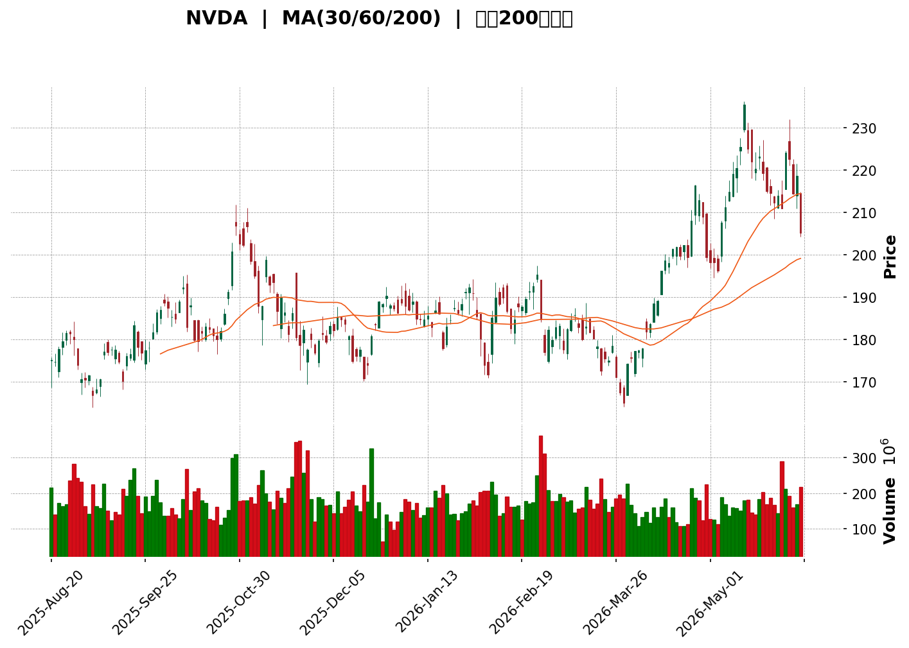
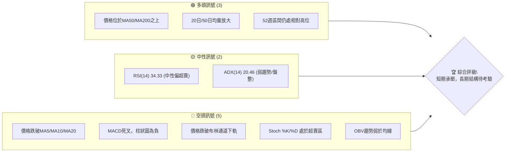
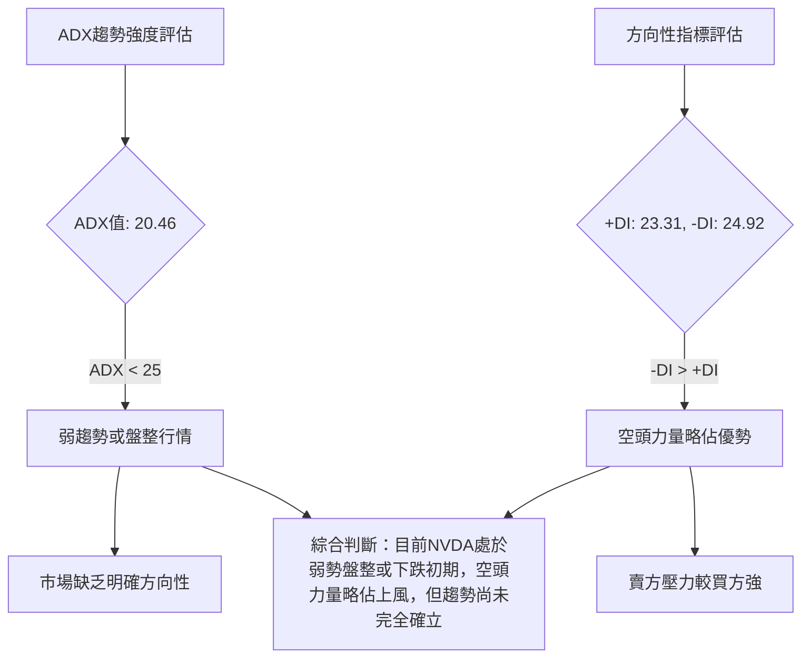

<details>
<summary>📊 靜態圖表 (點擊展開)</summary>

</details>

<html>
<head><meta charset="utf-8" /></head>
<body>
    <div style="height:500px; width:100%;">                        <script>window.PlotlyConfig = {MathJaxConfig: 'local'};</script>
        <script charset="utf-8" src="https://cdn.plot.ly/plotly-3.6.0.min.js" integrity="sha256-QaOVwtVY0T02VaHrr6pnoHLCwayMJp4O5n4YyaE3rJk=" crossorigin="anonymous"></script>                <div id="candlestick-chart" class="plotly-graph-div" style="height:100%; width:100%;"></div>            <script>                window.PLOTLYENV=window.PLOTLYENV || {};                                if (document.getElementById("candlestick-chart")) {                    Plotly.newPlot(                        "candlestick-chart",                        [{"close":{"dtype":"f8","bdata":"AAAAoFXlZUAAAABg6ddlQAAAAIAaOGZAAAAAYERyZkAAAABA57BmQAAAAIB4q2ZAAAAAYMV9ZkAAAACAWL5lQAAAAOCwUWVAAAAAAJRMZUAAAABg0G1lQAAAAOCH2WRAAAAAoMECZUAAAABADVFlQAAAAEADI2ZAAAAAwDceZkAAAAAA\u002fjJmQAAAACDBMGZAAAAAIAjVZUAAAACgVkJlQAAAACB\u002fAGZAAAAAAD0OZkAAAABACexmQAAAAKB8RmZAAAAAgNMXZkAAAABA1i5mQAAAACDRPmZAAAAAoMmzZkAAAABg9EpnQAAAAGAMYGdAAAAA4MeUZ0AAAAAgMWxnQAAAAKC3KWdAAAAAwLwZZ0AAAADAz5tnQAAAAABkCmhAAAAAgKfdZkAAAACAkIJnQAAAACCfeWZAAAAA4DpzZkAAAABAgrJmQAAAAGCS32ZAAAAAAAnNZkAAAABgvJ1mQAAAAICcgWZAAAAA4LG9ZkAAAABAukBnQAAAAADg52dAAAAAAMQYaUAAAABA19hpQAAAAMA1VGlAAAAAIG1HaUAAAABAutNpQAAAACD7zWhAAAAAYMNeaEAAAADg5HpnQAAAAEAhfWdAAAAAoHzZaEAAAAAgPx1oQAAAAECzMWhAAAAAQOdTZ0AAAAAgsL1nQAAAACCYS2dAAAAAoCCkZkAAAACACUlnQAAAAOAdjWZAAAAAYN5UZkAAAADAKMpmQAAAAAD+MmZAAAAAwPiAZkAAAAAAyRhmQAAAACAbdmZAAAAA4FKnZkAAAABgj2tmQAAAAOAC5WZAAAAAYALGZkAAAAAAXipnQAAAAGDUF2dAAAAAwMvxZkAAAADgtJZmQAAAAEDR2WVAAAAAQGgCZkAAAACgHDBmQAAAAIBqV2VAAAAAALG9ZUAAAAAAoJhmQAAAAGDr7mZAAAAAQFifZ0AAAADgKoxnQAAAAGCIyWdAAAAA4LN\u002fZ0AAAAAg+GlnQAAAAMC6SGdAAAAAoNaTZ0AAAADAgXxnQAAAAKBhYGdAAAAA4CWcZ0AAAAAAERpnQAAAAEBQFGdAAAAA4N4WZ0AAAABArTJnQAAAAEBX3WZAAAAA4E5aZ0AAAACgGUBnQAAAAIBMO2ZAAAAAIBjjZkAAAACgrBNnQAAAAMAfbmdAAAAAYMVHZ0AAAACASolnQAAAAIAs6WdAAAAAwNAIaEAAAACgtdxnQAAAAMBILGdAAAAAgNmDZkAAAABASr9lQAAAAMB1dWVAAAAAgOQlZ0AAAAAg37lnQAAAACDuiWdAAAAAIDG6Z0AAAAAAy1ZnQAAAACDL0mZAAAAAYNQXZ0AAAAAgCHhnQAAAAKB5dWdAAAAAQNeyZ0AAAAAAIupnQAAAAMCuE2hAAAAA4EtqaEAAAADARRVnQAAAAEAsH2ZAAAAAID\u002fIZkAAAADAlHpmQAAAAAAl2mZAAAAAgLvjZkAAAAAATzNmQAAAAACuzWZAAAAA4G8RZ0AAAACgBzpnQAAAAGCo3WZAAAAAAEmBZkAAAAAAN+BmQAAAAID7tmZAAAAAYBSGZkAAAACgREtmQAAAAGD3j2VAAAAA4O\u002ftZUAAAACA399lQAAAAIAaT2ZAAAAAIE1hZUAAAABAZupkQAAAAIBJn2RAAAAAoE3GZUAAAAAAdPFlQAAAACDfJWZAAAAAwNwtZkAAAADAkDxmQAAAAADHu2ZAAAAA4ET2ZkAAAAAgIo1nQAAAACDeomdAAAAA4P+IaEAAAACAbtRoQAAAAKDPw2hAAAAAID8uaUAAAACAZDppQAAAAOC29GhAAAAA4HRIaUAAAAAAC+1oQAAAAKDhAGpAAAAAYHMLa0AAAADAf51qQAAAAIA0IGpAAAAAQM7qaEAAAADgAcdoQAAAAED3x2hAAAAAAK6IaEAAAABg0fJpQAAAAAAfaGpAAAAAIGLeakAAAADA52VrQAAAAEC8kGtAAAAAwCUybEAAAAAA5m5tQAAAAMDYIWxAAAAAYPXBa0AAAABATYtrQAAAACC35mtAAAAAgCRoa0AAAADgieJqQAAAACCE02pAAAAAwEeLakAAAADABMBqQAAAAGCdXGpAAAAAgCkDbEAAAACA8NFrQAAAAAAA0GpAAAAAwB5Va0AAAABAM6NpQA=="},"high":{"dtype":"f8","bdata":"+\u002fViVoL4ZUAvbu4TRRVmQH0PMBZHS2ZAbPWLvmC1ZkAtiIx+t8RmQJhWaa3px2ZA8p\u002f0JDAHZ0BLKGN9Nz1mQDbE2LDShGVAlyAyP8iFZUAUmiSSNHRlQDNH6NjDGWVADn9AoHFXZUDpb1MaFVhlQJE3BiWmYWZALZWXa5yBZkDgjWac60tmQPYMZ+XoU2ZAZaYKycMoZkCSXDoCV59lQAiUtUb7G2ZAAuk4CU07ZkDoQArxEwpnQBfMfx0BxmZADFc1raFxZkDaSWzO+IBmQMnyVANQcWZAOP2H8H\u002f4ZkBZZwA3kGNnQOko6rvPfGdAvJYMFtDZZ0BJuTuowsNnQKWzpn26X2dAuL83rTaaZ0BryALDeKtnQJUjFaOjYWhA+2lOu91raECX4pJyxbtnQMYuhTkREmdAevKM6E0UZ0BkwvcofeFmQAnGODGy+2ZAU706ydkeZ0C0eMc91NFmQHezXUaa5mZAx\u002fjiy3\u002fZZkAIGqL\u002fZWdnQNLFq40s+GdAx3u54IRcaUDyEwdjbn1qQJMlxoC3vGlAF5\u002fXEJD2aUBSZP71Q2JqQLLi6sa5dmlA69QALCtVaUBvBrz0yKtoQOgPzDmQgmdANi+XNu71aEAGcL1qeWVoQJIvq7B+dGhA4DM51UbmZ0DMOvubiNhnQNRq59RLmGdAFG15OhESZ0BN7FDE3HNnQNU9cLcCeGhABJSYmmUKZ0DiBkM2hehmQGPRxbPbPWZAAUBz+KnVZkD6Q5a6+GFmQMHw2ShAgmZA0imBbI0tZ0DaqIGo9sZmQDRBc19yCWdAnjvD6+sNZ0CNMxvtq3hnQDtr+OPML2dAVaABKSEoZ0BFKJf7K6NmQPigxwgd02ZASycX\u002fntGZkDeHMHQuEhmQN5HBTRL\u002fWVAEXXU0O79ZUCOx+CoU6dmQIcDRe\u002fw\u002fWZAfjZ1DS6jZ0CkVI+BwZVnQIwlyJGRDmhAIC1tHPaQZ0B7ILAnUJhnQLoNTrt9ymdAmo+qKD0WaECiF\u002f7DnCxoQG69ge3y\u002fWdAZFMxMmHkZ0Aqxu39NapnQAxz2JqdQ2dAfD6cnotcZ0B\u002fLjHsL3xnQOonv5OHB2dA1cidLQGvZ0DtyF\u002f8p8ZnQN0qVf0MxWZA3e5oEe8kZ0BjHia6Lj5nQMDxPx3Pq2dA8nLurXecZ0A2+eXal7hnQOBgcJezA2hAy5fsUdEnaEAeDRA4GUhoQIl8sHEuwmdAq5jn8WBBZ0CT3YNWj2tmQNrDtvNYE2ZA28AP4rVYZ0A3k8ofki1oQJIXdU7bB2hA7LW3V8kgaEBifm0Q+StoQCDqDtKwaGdAhGHCHoFdZ0A\u002fP\u002fgla8RnQO9LABZqhmdAs4QhCSTDZ0DY33HM1jZoQDuWsDEWMWhA8XCNt3SsaECx9iWxtEFoQJEJfhzDy2ZAqHBlmJHnZkDiiGdkv5VmQJOiJy8zD2dABWN3kL76ZkCDhPITMtFmQADYvWf91WZAZaZd1c9GZ0C7qim22WxnQDYvnNUwF2dAgvItjvI7Z0D2qjPGH5VnQBnBaajkJWdA6vPONFTlZkCgLzi1p3hmQEwQwNmtQWZA+Nsa9zFFZkAt+bKleQBmQJQi5gZKoGZAbvxhnr4JZkAFw\u002f+4q1hlQFa0LG8WKGVAPBjqxlXNZUC29CCNOyVmQMYu12sRKWZAR9LMEagyZkDhMqRiuEBmQAqqrixrIWdA+8744LP7ZkAdhlwP7LhnQH9QgQkOrmdAAAAA4P+IaEBIGcuoVQVpQLYV3lHB82hAkkwpz+IuaUBKanGT6D1pQDeld4FyUGlAAAAA4HRIaUCyCriK93JpQBM08ZCKVmpA3n\u002fjhnsSa0DGToxfXM9qQHRBlqgdj2pAHUixC8RBakA1PvwbcFhpQHYdVkHYL2lAjS\u002f7dDgAaUCxb8mt4QBqQGGgR6BrvmpAhWWBlHwxa0BNl42ZUcFrQHLCGC2q72tA4hrrdGRybEAxgfbed4htQBKtnFBg52xARVHCom63bEBe2OJX\u002fwZsQC2AAYK8O2xA9NyhIVRkbECtsSU1FphrQFBrztahPWtAtjLfd9K8akA5QGaDnOhqQFStdopnM2tA3TLrgnYTbEDv2RGITgBtQOXT+4nw0WtAAAAAQDOza0AAAAAA19tqQA=="},"hovertemplate":"\u003cb\u003e%{x|%Y-%m-%d}\u003c\u002fb\u003e\u003cbr\u003e\u958b: $%{open:.2f}\u003cbr\u003e\u9ad8: $%{high:.2f}\u003cbr\u003e\u4f4e: $%{low:.2f}\u003cbr\u003e\u6536: $%{close:.2f}\u003cextra\u003e\u003c\u002fextra\u003e","low":{"dtype":"f8","bdata":"lPOIaWoSZUAYMtp\u002fhbJlQKLPSb4cX2VAv\u002f4orbkKZkBpWtEgT1JmQJBrkb2TW2ZA4dCqeJwFZkBUCEL5bZ1lQEuneCrs32RADzxK9fgUZUCWvvzj6CVlQJk+VKVBe2RAtnS71RPkZEBN92dNldBkQKecEmSS52VAxsVZcyoIZkD\u002fVLArNQdmQMXNeM80yWVAkHuuVw3FZUD6WTJeQQZlQLQcwJmrl2VAZfp\u002fbJ7eZUCQiOddmc9lQIx9P6qJ\u002f2VA15M1YqblZUBtWMFVGp1lQB61eySh1mVAnJQ41+OCZkBbSjdY9qdmQMFQ69lN9WZAUn0oKUF6Z0B2OAGAmiRnQE4OWW8W42ZAaOkr+n\u002f4ZkDc\u002fnQRrUlnQOsH2MEh2mdAH0os9S26ZkCOUAcAJDdnQJ0ujzETb2ZAu9YuoQ0iZkAHi7zpT3FmQItvf1WscGZAxjf7vvOvZkCFiP5wRXJmQDXyVlsdEWZAY8lEe\u002fNxZkAKRPIshehmQN6qGE4UhmdAkB3QKkz1Z0C7zwP1nJBpQKiWihHpJGlAXaj54QA6aUDIDyWGiqlpQHq3TQ6xtWhAENn7l91MaEBTxQk9kERnQHNhSa3TVWZAsOjKgmExaEBebLtozeFnQPW2x3xe3GdAqsq9yLTzZkC2jFDzMotmQBuvjSq6AmdA5lQQGHptZkBqbYWBG9NmQJRyYX7ec2ZAOWK69rWWZUDhCOKWKghmQEfLimuwKmVAEGRwFGpAZkByAa83zghmQF43nB2urmVAXI8hvKl4ZkBNHSRCOFxmQGY8pmG0d2ZA7IIoWBGWZkAjuS6PsMVmQALjPxcY42ZAtyg0\u002fS66ZkBq3S5j9AxmQBKF7l0IzWVA9+ci8yLaZUBGU7JE+9VlQGTGmslHQ2VA2Ewox4pzZUCRujGHAQRmQDg\u002fV38XxGZAfS+yl6vVZkCYuqcom0tnQO1VdN+reGdAIH2Tbd81Z0CHq1oWeVZnQGvUiPloSGdAAZVUI\u002fuAZ0ARKp0oiz1nQEyt9DD1UmdAVb23sqVKZ0AQ19EFj+9mQGCCRKBH7mZABY8paYHZZkC8ctOMpuVmQC\u002f5ClqNkmZAfwCCz0tDZ0AdbDNfTjtnQDWVK7eYLGZAKSf0eNhFZkBVBdr0lvZmQB+nihv1UmdAAbtECm44Z0AvMZIkKS9nQFIPO6R6s2dA3\u002fLlvao6Z0AH4+Fwp6dnQBXhCenzFGdAxHhOZH0AZkCU+JBAa3ZlQIFvhftKWmVAGysh4GTMZUBqhmWmOvdmQNml+LCBfGdAHW7mJUiRZ0BbE4aqDElnQBfX1gzNq2ZAFzzFZ8ZeZkA0weMMClFnQK+jjPrhLWdAt4ok+NQ2Z0ADNABpK6tnQNiZF6N+ZWdAzjAAqrkxaEDHTTMQDgNnQBd\u002fUtVIBWZAwJqYHKzNZUAAEK78ihZmQMVIDp3memZAC1fAvTk1ZkA1VKz6WBNmQKNkIIET62VA6Np5azm5ZkD0v29RhwdnQAs0cME6sWZAYLTUdGB3ZkCOzMHCXKZmQM87WOL9rmZA0q7fqteDZkCqvK4qu\u002fJlQF3\u002fkpikcGVA9AdoRM\u002fRZUAp75Xi4LhlQL6xrLOcFGZAkg8l1BpeZUDHCSodGdpkQHErK1WFgmRAMBQgM4DYZEDjMUmJfdFlQL0Fg6l0ZWVAboDnrcXxZUCRTeOXpq5lQNcMgznigmZAgiIfgByNZkDSmQ0LvAJnQNYfrcvCMGdA3s0onYjRZ0BeLkl5Y3BoQGRbOxmgcmhAgHDGezfhaEBikMR+grNoQP8tXESW2GhAOtGhQJbYaED8whJ0sZ9oQO6bpu558mhA3lEgRm\u002fkaUCO81vlpP5pQKKjA83T6mlAhhUNbP\u002fOaECj3vUuf5xoQOhh8epsUGhA53V7O6h5aEBDsYYNH8xoQNAv565OyGlASE58p4yUakClmtsNg7RqQMPcfQJv1WpA3DMZgPypa0A4xzHqDqFsQA51o6xT\u002f2tAngo0i7RDa0B5TrWfADVrQBtWzjLJh2tASm1cMaQ1a0AJq+ktmdFqQLP9M0YaeGpAd9oiri4RakCcz3flK19qQEBLZphLXGpARmM0Vl3uakDuoOhE9KJrQIFK8ilUyGpAAAAAQApfakAAAABgj4ppQA=="},"name":"\u50f9\u683c","open":{"dtype":"f8","bdata":"IouIAfzdZUCZM5\u002fqwdNlQGFfwiAsjGVAo\u002ftJCJxDZkCRbf6BQXpmQPftCzydt2ZAn3fFKouSZkAQmvNM8DtmQKWHxp\u002fDOGVAzLK3tKNaZUCXYVsA+0plQKZng77O+WRALPrfB3jqZECSKlDSrhtlQJchnUT2DGZAuTGEbm9uZkB0ipLlZDFmQNQ+mHRH7mVA9iG5AMkYZkBJBDRacY1lQNSMFrVEuGVAObtNpHnxZUCB5+N1dOJlQOBxk2+ft2ZAUITo509xZkD9SlZfP8hlQAACcHUtPmZA5kxosWeGZkB3R1pVI7tmQKCycj4hIGdAHI5h13irZ0AW4tA9Xp5nQGGV1GpwKGdAI4Ya1cQ\u002fZ0BnOUehokpnQAbOTiyG\u002f2dAOwzOn24oaEBygO\u002fmYHdnQPqFqMkbEWdAkaCFQxESZ0DkIv997r9mQCgX2VhqfmZAuSoAA7LcZkC0eMc91NFmQBQlmKYYnWZA3H1E6BWGZkCTXLHgYvNmQHWo5Kbvt2dA3hl2JbsZaEClPgTx4fZpQBgu1QpwnGlAWWhaDfzFaUCUlXAaFPppQEwtMqa5V2lACaUKuonQaEBbuCsab4VoQDLGmipDFWdAC6W5PJFbaEA8b0dBKl1oQHeoz9YPb2hAPx8MB9DZZ0DCNWLoENRmQHYW7rJ1N2dAokTRa6\u002fkZkDk\u002fJJNvxFnQOQgBJ1pdmhAdziM30qgZkBfPTUuXWhmQANSc5391WVAt8L9k8GsZkCuCJHmBVlmQFynezgy0WVA4LWjPumwZkAVZ\u002fjzLZtmQFFvmHDCrGZAY7fyuk\u002f1ZkA+NQ1KXM1mQPCTu7yvKmdAbIvkX9QXZ0BIx5qc7oFmQJB+dLl1nGZADitsqCQ3ZkAZPhnScgFmQDotqsBV\u002fGVAd1+f+yfKZUAT0iacjQ5mQCLEazRF9mZA3ZLaZOjXZkDdtLHvwHZnQIt1YlYJtmdA38buFmdvZ0A6ALKjV4BnQPl+lZzZqmdABErTvnqzZ0CN2SpN2PBnQN1lsaQ2yWdA+YeRo+OKZ0BfgAniJZxnQFmH7k1YG2dAzxk3yuXfZkAHGkzVyRhnQAIJaBkOA2dAHFwvvbpIZ0CcI99uMJtnQGOCm4e1tWZAMAFn3J5aZkDBi+tFzBBnQDnuTtKwaGdAJJY3\u002fdJdZ0Ax9yWGYWBnQD\u002fHuP4u4WdAGcYCzWvjZ0Cbq50zRN9nQLk6xyEaX2dASc6LfmtAZ0DGFA+JuWdmQCJzKNDw1mVAUFnZRDEPZkBYcW4OIwFnQAXwmyiz5GdAMXDy7OUGaEDUfSJ6bxloQIszKiUNaGdAXywoQuqwZkAJGMZQpJBnQGK99MGgWmdAPbqvrvdKZ0DGHj+fVuVnQElNYTI36GdAZmDT09FGaEB6NzckEUFoQO8H0TvvoGZARYtha3\u002fZZUCRoo3RuEhmQJfkP9ILh2ZAvcwiiGCeZkDAmZaX3nNmQNcvl7SqE2ZAZa0TZ7DFZkBnJfXEMTZnQP\u002f3YnK++mZANayfFo0WZ0CcjVNiOdhmQDAQeaYGG2dAaTYH6o\u002fIZkCwusY+sDlmQKoSgXReOWZA9lYDbbchZkDmJ1QHDNRlQEABVVGaHGZA+duFcK77ZUDjzzW5qjllQD7q2TKsEmVA2dK5+tHYZECHs62dcfllQIht8m9Yf2VAJYLgM4UeZkAxtC060PBlQC2oDowgCWdAfVCmHRu0ZkAYLafSDQNnQMPpsacHOmdA40lJUsXTZ0Azz0NY9YloQDcFJKZnpmhA5fW1WVr1aEBP\u002fST26PdoQLt6EGuhPGlA9o9iZjEYaUA60lybLUdpQNVaaWBF92hA3OQrYP0sakB5XwlY4CdqQDCHbPl5jmpAfwUKc\u002fA1akCbJQ9DdiFpQGDVuWWR6GhAXBvy6yziaECREpCYCPVoQAONxWIeA2pAJx+zMQaZakBIGqlfTrlqQOSrRGR1SWtAGqU6dWEVbEAJGXRLo7JsQDcricjCr2xASCgk4EazbEDFz\u002fmQqGtrQKQAAyRy3WtAYC0Cvf\u002fAa0AtgbIhkpRrQLOzlZo2CWtAzlMcAd27akAwSf3SFmFqQMNg7BGRympAaH33zFLvakDX5GPrS11sQE9ohsfHrmtAAAAAwB69akAAAADA9dBqQA=="},"x":["2025-08-20T00:00:00-04:00","2025-08-21T00:00:00-04:00","2025-08-22T00:00:00-04:00","2025-08-25T00:00:00-04:00","2025-08-26T00:00:00-04:00","2025-08-27T00:00:00-04:00","2025-08-28T00:00:00-04:00","2025-08-29T00:00:00-04:00","2025-09-02T00:00:00-04:00","2025-09-03T00:00:00-04:00","2025-09-04T00:00:00-04:00","2025-09-05T00:00:00-04:00","2025-09-08T00:00:00-04:00","2025-09-09T00:00:00-04:00","2025-09-10T00:00:00-04:00","2025-09-11T00:00:00-04:00","2025-09-12T00:00:00-04:00","2025-09-15T00:00:00-04:00","2025-09-16T00:00:00-04:00","2025-09-17T00:00:00-04:00","2025-09-18T00:00:00-04:00","2025-09-19T00:00:00-04:00","2025-09-22T00:00:00-04:00","2025-09-23T00:00:00-04:00","2025-09-24T00:00:00-04:00","2025-09-25T00:00:00-04:00","2025-09-26T00:00:00-04:00","2025-09-29T00:00:00-04:00","2025-09-30T00:00:00-04:00","2025-10-01T00:00:00-04:00","2025-10-02T00:00:00-04:00","2025-10-03T00:00:00-04:00","2025-10-06T00:00:00-04:00","2025-10-07T00:00:00-04:00","2025-10-08T00:00:00-04:00","2025-10-09T00:00:00-04:00","2025-10-10T00:00:00-04:00","2025-10-13T00:00:00-04:00","2025-10-14T00:00:00-04:00","2025-10-15T00:00:00-04:00","2025-10-16T00:00:00-04:00","2025-10-17T00:00:00-04:00","2025-10-20T00:00:00-04:00","2025-10-21T00:00:00-04:00","2025-10-22T00:00:00-04:00","2025-10-23T00:00:00-04:00","2025-10-24T00:00:00-04:00","2025-10-27T00:00:00-04:00","2025-10-28T00:00:00-04:00","2025-10-29T00:00:00-04:00","2025-10-30T00:00:00-04:00","2025-10-31T00:00:00-04:00","2025-11-03T00:00:00-05:00","2025-11-04T00:00:00-05:00","2025-11-05T00:00:00-05:00","2025-11-06T00:00:00-05:00","2025-11-07T00:00:00-05:00","2025-11-10T00:00:00-05:00","2025-11-11T00:00:00-05:00","2025-11-12T00:00:00-05:00","2025-11-13T00:00:00-05:00","2025-11-14T00:00:00-05:00","2025-11-17T00:00:00-05:00","2025-11-18T00:00:00-05:00","2025-11-19T00:00:00-05:00","2025-11-20T00:00:00-05:00","2025-11-21T00:00:00-05:00","2025-11-24T00:00:00-05:00","2025-11-25T00:00:00-05:00","2025-11-26T00:00:00-05:00","2025-11-28T00:00:00-05:00","2025-12-01T00:00:00-05:00","2025-12-02T00:00:00-05:00","2025-12-03T00:00:00-05:00","2025-12-04T00:00:00-05:00","2025-12-05T00:00:00-05:00","2025-12-08T00:00:00-05:00","2025-12-09T00:00:00-05:00","2025-12-10T00:00:00-05:00","2025-12-11T00:00:00-05:00","2025-12-12T00:00:00-05:00","2025-12-15T00:00:00-05:00","2025-12-16T00:00:00-05:00","2025-12-17T00:00:00-05:00","2025-12-18T00:00:00-05:00","2025-12-19T00:00:00-05:00","2025-12-22T00:00:00-05:00","2025-12-23T00:00:00-05:00","2025-12-24T00:00:00-05:00","2025-12-26T00:00:00-05:00","2025-12-29T00:00:00-05:00","2025-12-30T00:00:00-05:00","2025-12-31T00:00:00-05:00","2026-01-02T00:00:00-05:00","2026-01-05T00:00:00-05:00","2026-01-06T00:00:00-05:00","2026-01-07T00:00:00-05:00","2026-01-08T00:00:00-05:00","2026-01-09T00:00:00-05:00","2026-01-12T00:00:00-05:00","2026-01-13T00:00:00-05:00","2026-01-14T00:00:00-05:00","2026-01-15T00:00:00-05:00","2026-01-16T00:00:00-05:00","2026-01-20T00:00:00-05:00","2026-01-21T00:00:00-05:00","2026-01-22T00:00:00-05:00","2026-01-23T00:00:00-05:00","2026-01-26T00:00:00-05:00","2026-01-27T00:00:00-05:00","2026-01-28T00:00:00-05:00","2026-01-29T00:00:00-05:00","2026-01-30T00:00:00-05:00","2026-02-02T00:00:00-05:00","2026-02-03T00:00:00-05:00","2026-02-04T00:00:00-05:00","2026-02-05T00:00:00-05:00","2026-02-06T00:00:00-05:00","2026-02-09T00:00:00-05:00","2026-02-10T00:00:00-05:00","2026-02-11T00:00:00-05:00","2026-02-12T00:00:00-05:00","2026-02-13T00:00:00-05:00","2026-02-17T00:00:00-05:00","2026-02-18T00:00:00-05:00","2026-02-19T00:00:00-05:00","2026-02-20T00:00:00-05:00","2026-02-23T00:00:00-05:00","2026-02-24T00:00:00-05:00","2026-02-25T00:00:00-05:00","2026-02-26T00:00:00-05:00","2026-02-27T00:00:00-05:00","2026-03-02T00:00:00-05:00","2026-03-03T00:00:00-05:00","2026-03-04T00:00:00-05:00","2026-03-05T00:00:00-05:00","2026-03-06T00:00:00-05:00","2026-03-09T00:00:00-04:00","2026-03-10T00:00:00-04:00","2026-03-11T00:00:00-04:00","2026-03-12T00:00:00-04:00","2026-03-13T00:00:00-04:00","2026-03-16T00:00:00-04:00","2026-03-17T00:00:00-04:00","2026-03-18T00:00:00-04:00","2026-03-19T00:00:00-04:00","2026-03-20T00:00:00-04:00","2026-03-23T00:00:00-04:00","2026-03-24T00:00:00-04:00","2026-03-25T00:00:00-04:00","2026-03-26T00:00:00-04:00","2026-03-27T00:00:00-04:00","2026-03-30T00:00:00-04:00","2026-03-31T00:00:00-04:00","2026-04-01T00:00:00-04:00","2026-04-02T00:00:00-04:00","2026-04-06T00:00:00-04:00","2026-04-07T00:00:00-04:00","2026-04-08T00:00:00-04:00","2026-04-09T00:00:00-04:00","2026-04-10T00:00:00-04:00","2026-04-13T00:00:00-04:00","2026-04-14T00:00:00-04:00","2026-04-15T00:00:00-04:00","2026-04-16T00:00:00-04:00","2026-04-17T00:00:00-04:00","2026-04-20T00:00:00-04:00","2026-04-21T00:00:00-04:00","2026-04-22T00:00:00-04:00","2026-04-23T00:00:00-04:00","2026-04-24T00:00:00-04:00","2026-04-27T00:00:00-04:00","2026-04-28T00:00:00-04:00","2026-04-29T00:00:00-04:00","2026-04-30T00:00:00-04:00","2026-05-01T00:00:00-04:00","2026-05-04T00:00:00-04:00","2026-05-05T00:00:00-04:00","2026-05-06T00:00:00-04:00","2026-05-07T00:00:00-04:00","2026-05-08T00:00:00-04:00","2026-05-11T00:00:00-04:00","2026-05-12T00:00:00-04:00","2026-05-13T00:00:00-04:00","2026-05-14T00:00:00-04:00","2026-05-15T00:00:00-04:00","2026-05-18T00:00:00-04:00","2026-05-19T00:00:00-04:00","2026-05-20T00:00:00-04:00","2026-05-21T00:00:00-04:00","2026-05-22T00:00:00-04:00","2026-05-26T00:00:00-04:00","2026-05-27T00:00:00-04:00","2026-05-28T00:00:00-04:00","2026-05-29T00:00:00-04:00","2026-06-01T00:00:00-04:00","2026-06-02T00:00:00-04:00","2026-06-03T00:00:00-04:00","2026-06-04T00:00:00-04:00","2026-06-05T00:00:00-04:00"],"type":"candlestick"},{"hovertemplate":"MA30: $%{y:.2f}\u003cextra\u003e\u003c\u002fextra\u003e","line":{"color":"#2196F3","dash":"dash","width":2},"mode":"lines","name":"MA30","x":["2025-08-20T00:00:00-04:00","2025-08-21T00:00:00-04:00","2025-08-22T00:00:00-04:00","2025-08-25T00:00:00-04:00","2025-08-26T00:00:00-04:00","2025-08-27T00:00:00-04:00","2025-08-28T00:00:00-04:00","2025-08-29T00:00:00-04:00","2025-09-02T00:00:00-04:00","2025-09-03T00:00:00-04:00","2025-09-04T00:00:00-04:00","2025-09-05T00:00:00-04:00","2025-09-08T00:00:00-04:00","2025-09-09T00:00:00-04:00","2025-09-10T00:00:00-04:00","2025-09-11T00:00:00-04:00","2025-09-12T00:00:00-04:00","2025-09-15T00:00:00-04:00","2025-09-16T00:00:00-04:00","2025-09-17T00:00:00-04:00","2025-09-18T00:00:00-04:00","2025-09-19T00:00:00-04:00","2025-09-22T00:00:00-04:00","2025-09-23T00:00:00-04:00","2025-09-24T00:00:00-04:00","2025-09-25T00:00:00-04:00","2025-09-26T00:00:00-04:00","2025-09-29T00:00:00-04:00","2025-09-30T00:00:00-04:00","2025-10-01T00:00:00-04:00","2025-10-02T00:00:00-04:00","2025-10-03T00:00:00-04:00","2025-10-06T00:00:00-04:00","2025-10-07T00:00:00-04:00","2025-10-08T00:00:00-04:00","2025-10-09T00:00:00-04:00","2025-10-10T00:00:00-04:00","2025-10-13T00:00:00-04:00","2025-10-14T00:00:00-04:00","2025-10-15T00:00:00-04:00","2025-10-16T00:00:00-04:00","2025-10-17T00:00:00-04:00","2025-10-20T00:00:00-04:00","2025-10-21T00:00:00-04:00","2025-10-22T00:00:00-04:00","2025-10-23T00:00:00-04:00","2025-10-24T00:00:00-04:00","2025-10-27T00:00:00-04:00","2025-10-28T00:00:00-04:00","2025-10-29T00:00:00-04:00","2025-10-30T00:00:00-04:00","2025-10-31T00:00:00-04:00","2025-11-03T00:00:00-05:00","2025-11-04T00:00:00-05:00","2025-11-05T00:00:00-05:00","2025-11-06T00:00:00-05:00","2025-11-07T00:00:00-05:00","2025-11-10T00:00:00-05:00","2025-11-11T00:00:00-05:00","2025-11-12T00:00:00-05:00","2025-11-13T00:00:00-05:00","2025-11-14T00:00:00-05:00","2025-11-17T00:00:00-05:00","2025-11-18T00:00:00-05:00","2025-11-19T00:00:00-05:00","2025-11-20T00:00:00-05:00","2025-11-21T00:00:00-05:00","2025-11-24T00:00:00-05:00","2025-11-25T00:00:00-05:00","2025-11-26T00:00:00-05:00","2025-11-28T00:00:00-05:00","2025-12-01T00:00:00-05:00","2025-12-02T00:00:00-05:00","2025-12-03T00:00:00-05:00","2025-12-04T00:00:00-05:00","2025-12-05T00:00:00-05:00","2025-12-08T00:00:00-05:00","2025-12-09T00:00:00-05:00","2025-12-10T00:00:00-05:00","2025-12-11T00:00:00-05:00","2025-12-12T00:00:00-05:00","2025-12-15T00:00:00-05:00","2025-12-16T00:00:00-05:00","2025-12-17T00:00:00-05:00","2025-12-18T00:00:00-05:00","2025-12-19T00:00:00-05:00","2025-12-22T00:00:00-05:00","2025-12-23T00:00:00-05:00","2025-12-24T00:00:00-05:00","2025-12-26T00:00:00-05:00","2025-12-29T00:00:00-05:00","2025-12-30T00:00:00-05:00","2025-12-31T00:00:00-05:00","2026-01-02T00:00:00-05:00","2026-01-05T00:00:00-05:00","2026-01-06T00:00:00-05:00","2026-01-07T00:00:00-05:00","2026-01-08T00:00:00-05:00","2026-01-09T00:00:00-05:00","2026-01-12T00:00:00-05:00","2026-01-13T00:00:00-05:00","2026-01-14T00:00:00-05:00","2026-01-15T00:00:00-05:00","2026-01-16T00:00:00-05:00","2026-01-20T00:00:00-05:00","2026-01-21T00:00:00-05:00","2026-01-22T00:00:00-05:00","2026-01-23T00:00:00-05:00","2026-01-26T00:00:00-05:00","2026-01-27T00:00:00-05:00","2026-01-28T00:00:00-05:00","2026-01-29T00:00:00-05:00","2026-01-30T00:00:00-05:00","2026-02-02T00:00:00-05:00","2026-02-03T00:00:00-05:00","2026-02-04T00:00:00-05:00","2026-02-05T00:00:00-05:00","2026-02-06T00:00:00-05:00","2026-02-09T00:00:00-05:00","2026-02-10T00:00:00-05:00","2026-02-11T00:00:00-05:00","2026-02-12T00:00:00-05:00","2026-02-13T00:00:00-05:00","2026-02-17T00:00:00-05:00","2026-02-18T00:00:00-05:00","2026-02-19T00:00:00-05:00","2026-02-20T00:00:00-05:00","2026-02-23T00:00:00-05:00","2026-02-24T00:00:00-05:00","2026-02-25T00:00:00-05:00","2026-02-26T00:00:00-05:00","2026-02-27T00:00:00-05:00","2026-03-02T00:00:00-05:00","2026-03-03T00:00:00-05:00","2026-03-04T00:00:00-05:00","2026-03-05T00:00:00-05:00","2026-03-06T00:00:00-05:00","2026-03-09T00:00:00-04:00","2026-03-10T00:00:00-04:00","2026-03-11T00:00:00-04:00","2026-03-12T00:00:00-04:00","2026-03-13T00:00:00-04:00","2026-03-16T00:00:00-04:00","2026-03-17T00:00:00-04:00","2026-03-18T00:00:00-04:00","2026-03-19T00:00:00-04:00","2026-03-20T00:00:00-04:00","2026-03-23T00:00:00-04:00","2026-03-24T00:00:00-04:00","2026-03-25T00:00:00-04:00","2026-03-26T00:00:00-04:00","2026-03-27T00:00:00-04:00","2026-03-30T00:00:00-04:00","2026-03-31T00:00:00-04:00","2026-04-01T00:00:00-04:00","2026-04-02T00:00:00-04:00","2026-04-06T00:00:00-04:00","2026-04-07T00:00:00-04:00","2026-04-08T00:00:00-04:00","2026-04-09T00:00:00-04:00","2026-04-10T00:00:00-04:00","2026-04-13T00:00:00-04:00","2026-04-14T00:00:00-04:00","2026-04-15T00:00:00-04:00","2026-04-16T00:00:00-04:00","2026-04-17T00:00:00-04:00","2026-04-20T00:00:00-04:00","2026-04-21T00:00:00-04:00","2026-04-22T00:00:00-04:00","2026-04-23T00:00:00-04:00","2026-04-24T00:00:00-04:00","2026-04-27T00:00:00-04:00","2026-04-28T00:00:00-04:00","2026-04-29T00:00:00-04:00","2026-04-30T00:00:00-04:00","2026-05-01T00:00:00-04:00","2026-05-04T00:00:00-04:00","2026-05-05T00:00:00-04:00","2026-05-06T00:00:00-04:00","2026-05-07T00:00:00-04:00","2026-05-08T00:00:00-04:00","2026-05-11T00:00:00-04:00","2026-05-12T00:00:00-04:00","2026-05-13T00:00:00-04:00","2026-05-14T00:00:00-04:00","2026-05-15T00:00:00-04:00","2026-05-18T00:00:00-04:00","2026-05-19T00:00:00-04:00","2026-05-20T00:00:00-04:00","2026-05-21T00:00:00-04:00","2026-05-22T00:00:00-04:00","2026-05-26T00:00:00-04:00","2026-05-27T00:00:00-04:00","2026-05-28T00:00:00-04:00","2026-05-29T00:00:00-04:00","2026-06-01T00:00:00-04:00","2026-06-02T00:00:00-04:00","2026-06-03T00:00:00-04:00","2026-06-04T00:00:00-04:00","2026-06-05T00:00:00-04:00"],"y":{"dtype":"f8","bdata":"AAAAAAAA+H8AAAAAAAD4fwAAAAAAAPh\u002fAAAAAAAA+H8AAAAAAAD4fwAAAAAAAPh\u002fAAAAAAAA+H8AAAAAAAD4fwAAAAAAAPh\u002fAAAAAAAA+H8AAAAAAAD4fwAAAAAAAPh\u002fAAAAAAAA+H8AAAAAAAD4fwAAAAAAAPh\u002fAAAAAAAA+H8AAAAAAAD4fwAAAAAAAPh\u002fAAAAAAAA+H8AAAAAAAD4fwAAAAAAAPh\u002fAAAAAAAA+H8AAAAAAAD4fwAAAAAAAPh\u002fAAAAAAAA+H8AAAAAAAD4fwAAAAAAAPh\u002fAAAAAAAA+H8AAAAAAAD4f7y7u+v6EWZAiYiImFwgZkBERER01i1mQJqZmTnkNWZA3t3dTXk7ZkCrqqraTUNmQO\u002fu7l4AT2ZAMzMzkzJSZkAiIiKCRWFmQImIiMgia2ZAVVVVJfV0ZkAAAADgx39mQN7d3X0MkWZAMzMzI1OgZkCrqqoKaqtmQImIiEiRrmZAd3d3J+KzZkBVVVXl37xmQO\u002fu7g6Dy2ZAd3d3p17nZkAzMzMThQ5nQHd3dwfpKmdAIiIiompGZ0DNzMzMNF9nQFVVVRXKdGdAq6qqejiIZ0CJiIgISpNnQN7d3U3mnWdAIiIiEjmwZ0AAAACQO7dnQHd3d5c4vmdAiYiI+A68Z0B3d3dnxr5nQM3MzHznv2dAIiIi4vu7Z0CrqqqKOblnQBEREQGErGdARERExPSnZ0DNzMwsz6FnQImIiHh0n2dAvLu7u+mfZ0BVVVX1yZpnQLy7u\u002ftFl2dA3t3dLQSWZ0AzMzMDWJRnQJqZmTmol2dAzczMLO+XZ0De3d1dMJdnQLy7uwtBkGdAAAAAcON9Z0De3d19FWJnQJqZmXlnRGdAmpmZ6YAoZ0AAAAAgcwlnQFVVVcXl62ZAmpmZOXbVZkBVVVVl681mQN7d3d0tyWZAAAAAMLW+ZkDe3d0t37lmQImIiEhmtmZAmpmZCdy3ZkAzMzOjEbVmQBERETH5tGZAmpmZufa8ZkDv7u7urb5mQJqZmbm4xWZAIiIigqHQZkAiIiJiS9NmQAAAACDO2mZAMzMzQ83fZkDNzMy8MulmQM3MzKyj7GZAIiIiApvyZkDv7u6usPlmQImIiHgI9GZAmpmZqQD1ZkBEREQEP\u002fRmQFVVVWUf92ZAzczMDP35ZkCrqqoaEwJnQGZmZjanE2dAZmZm9u4kZ0BERERUODNnQGZmZlbZQmdAmpmZSXRJZ0AiIiKyNUJnQFVVVbWgNWdAERERUZQxZ0AzMzNTGjNnQFVVVZX7MGdAERERse4yZ0De3d0NSzJnQKuqqqpcLmdAVVVVdToqZ0BVVVVFFCpnQFVVVUXIKmdAq6qq6okrZ0CrqqpqeTJnQBEREZH8OmdAAAAAAE1GZ0BVVVUVUkVnQBEREVH7PmdAzczM7Bw6Z0De3d1thzNnQJqZmenSOGdAvLu7W9g4Z0BVVVXFXTFnQFVVVaUELGdA7+7u\u002fjQqZ0AiIiKikCdnQERERNSlHmdAVVVVxZgRZ0BmZmYmLglnQM3MzCxFBWdARERENFgFZ0Dv7u6uAgpnQO\u002fu7t7kCmdAmpmZ2X4AZ0AAAAAQsvBmQKuqqooz5mZAERER8SvSZkCrqqrqfb1mQERERFS1qmZAq6qqGnWfZkCrqqoqcJJmQJqZmVlAh2ZAEREREUl6ZkDNzMxs92tmQERERMSAYGZAIiIiIhpUZkAiIiLyGFhmQGZmZkYFZWZAIiIiovpzZkDNzMxsCohmQJqZmelcmGZAVVVV1emrZkAiIiLiv8VmQLy7uwse2GZAzczMnATrZkCamZm5hPlmQGZmZuZKFGdAvLu7Cwg7Z0Dv7u7e8FpnQO\u002fu7l4MeGdAd3d393iMZ0ARERHxqaFnQHd3d2chvWdAERER8VrTZ0DNzMy8HvZnQKuqqloWGWhAMzMzY+xHaEARERGBPX9oQAAAABB9umhAiYiIiEjxaEC8u7u7MjFpQGZmZpZDZGlAIiIiAt6TaUDv7u6OKMFpQBEREaFB7WlAvLu7ey8TakAAAADgoS9qQLy7u5vaSmpAMzMzI\u002f9bakAzMzMDYmxqQImIiHgCempAq6qqaiySakDv7u6uSqhqQERERHQiuGpAVVVVlZ\u002fJakDe3d39sc9qQA=="},"type":"scatter"},{"hovertemplate":"MA60: $%{y:.2f}\u003cextra\u003e\u003c\u002fextra\u003e","line":{"color":"#9C27B0","dash":"dash","width":2},"mode":"lines","name":"MA60","x":["2025-08-20T00:00:00-04:00","2025-08-21T00:00:00-04:00","2025-08-22T00:00:00-04:00","2025-08-25T00:00:00-04:00","2025-08-26T00:00:00-04:00","2025-08-27T00:00:00-04:00","2025-08-28T00:00:00-04:00","2025-08-29T00:00:00-04:00","2025-09-02T00:00:00-04:00","2025-09-03T00:00:00-04:00","2025-09-04T00:00:00-04:00","2025-09-05T00:00:00-04:00","2025-09-08T00:00:00-04:00","2025-09-09T00:00:00-04:00","2025-09-10T00:00:00-04:00","2025-09-11T00:00:00-04:00","2025-09-12T00:00:00-04:00","2025-09-15T00:00:00-04:00","2025-09-16T00:00:00-04:00","2025-09-17T00:00:00-04:00","2025-09-18T00:00:00-04:00","2025-09-19T00:00:00-04:00","2025-09-22T00:00:00-04:00","2025-09-23T00:00:00-04:00","2025-09-24T00:00:00-04:00","2025-09-25T00:00:00-04:00","2025-09-26T00:00:00-04:00","2025-09-29T00:00:00-04:00","2025-09-30T00:00:00-04:00","2025-10-01T00:00:00-04:00","2025-10-02T00:00:00-04:00","2025-10-03T00:00:00-04:00","2025-10-06T00:00:00-04:00","2025-10-07T00:00:00-04:00","2025-10-08T00:00:00-04:00","2025-10-09T00:00:00-04:00","2025-10-10T00:00:00-04:00","2025-10-13T00:00:00-04:00","2025-10-14T00:00:00-04:00","2025-10-15T00:00:00-04:00","2025-10-16T00:00:00-04:00","2025-10-17T00:00:00-04:00","2025-10-20T00:00:00-04:00","2025-10-21T00:00:00-04:00","2025-10-22T00:00:00-04:00","2025-10-23T00:00:00-04:00","2025-10-24T00:00:00-04:00","2025-10-27T00:00:00-04:00","2025-10-28T00:00:00-04:00","2025-10-29T00:00:00-04:00","2025-10-30T00:00:00-04:00","2025-10-31T00:00:00-04:00","2025-11-03T00:00:00-05:00","2025-11-04T00:00:00-05:00","2025-11-05T00:00:00-05:00","2025-11-06T00:00:00-05:00","2025-11-07T00:00:00-05:00","2025-11-10T00:00:00-05:00","2025-11-11T00:00:00-05:00","2025-11-12T00:00:00-05:00","2025-11-13T00:00:00-05:00","2025-11-14T00:00:00-05:00","2025-11-17T00:00:00-05:00","2025-11-18T00:00:00-05:00","2025-11-19T00:00:00-05:00","2025-11-20T00:00:00-05:00","2025-11-21T00:00:00-05:00","2025-11-24T00:00:00-05:00","2025-11-25T00:00:00-05:00","2025-11-26T00:00:00-05:00","2025-11-28T00:00:00-05:00","2025-12-01T00:00:00-05:00","2025-12-02T00:00:00-05:00","2025-12-03T00:00:00-05:00","2025-12-04T00:00:00-05:00","2025-12-05T00:00:00-05:00","2025-12-08T00:00:00-05:00","2025-12-09T00:00:00-05:00","2025-12-10T00:00:00-05:00","2025-12-11T00:00:00-05:00","2025-12-12T00:00:00-05:00","2025-12-15T00:00:00-05:00","2025-12-16T00:00:00-05:00","2025-12-17T00:00:00-05:00","2025-12-18T00:00:00-05:00","2025-12-19T00:00:00-05:00","2025-12-22T00:00:00-05:00","2025-12-23T00:00:00-05:00","2025-12-24T00:00:00-05:00","2025-12-26T00:00:00-05:00","2025-12-29T00:00:00-05:00","2025-12-30T00:00:00-05:00","2025-12-31T00:00:00-05:00","2026-01-02T00:00:00-05:00","2026-01-05T00:00:00-05:00","2026-01-06T00:00:00-05:00","2026-01-07T00:00:00-05:00","2026-01-08T00:00:00-05:00","2026-01-09T00:00:00-05:00","2026-01-12T00:00:00-05:00","2026-01-13T00:00:00-05:00","2026-01-14T00:00:00-05:00","2026-01-15T00:00:00-05:00","2026-01-16T00:00:00-05:00","2026-01-20T00:00:00-05:00","2026-01-21T00:00:00-05:00","2026-01-22T00:00:00-05:00","2026-01-23T00:00:00-05:00","2026-01-26T00:00:00-05:00","2026-01-27T00:00:00-05:00","2026-01-28T00:00:00-05:00","2026-01-29T00:00:00-05:00","2026-01-30T00:00:00-05:00","2026-02-02T00:00:00-05:00","2026-02-03T00:00:00-05:00","2026-02-04T00:00:00-05:00","2026-02-05T00:00:00-05:00","2026-02-06T00:00:00-05:00","2026-02-09T00:00:00-05:00","2026-02-10T00:00:00-05:00","2026-02-11T00:00:00-05:00","2026-02-12T00:00:00-05:00","2026-02-13T00:00:00-05:00","2026-02-17T00:00:00-05:00","2026-02-18T00:00:00-05:00","2026-02-19T00:00:00-05:00","2026-02-20T00:00:00-05:00","2026-02-23T00:00:00-05:00","2026-02-24T00:00:00-05:00","2026-02-25T00:00:00-05:00","2026-02-26T00:00:00-05:00","2026-02-27T00:00:00-05:00","2026-03-02T00:00:00-05:00","2026-03-03T00:00:00-05:00","2026-03-04T00:00:00-05:00","2026-03-05T00:00:00-05:00","2026-03-06T00:00:00-05:00","2026-03-09T00:00:00-04:00","2026-03-10T00:00:00-04:00","2026-03-11T00:00:00-04:00","2026-03-12T00:00:00-04:00","2026-03-13T00:00:00-04:00","2026-03-16T00:00:00-04:00","2026-03-17T00:00:00-04:00","2026-03-18T00:00:00-04:00","2026-03-19T00:00:00-04:00","2026-03-20T00:00:00-04:00","2026-03-23T00:00:00-04:00","2026-03-24T00:00:00-04:00","2026-03-25T00:00:00-04:00","2026-03-26T00:00:00-04:00","2026-03-27T00:00:00-04:00","2026-03-30T00:00:00-04:00","2026-03-31T00:00:00-04:00","2026-04-01T00:00:00-04:00","2026-04-02T00:00:00-04:00","2026-04-06T00:00:00-04:00","2026-04-07T00:00:00-04:00","2026-04-08T00:00:00-04:00","2026-04-09T00:00:00-04:00","2026-04-10T00:00:00-04:00","2026-04-13T00:00:00-04:00","2026-04-14T00:00:00-04:00","2026-04-15T00:00:00-04:00","2026-04-16T00:00:00-04:00","2026-04-17T00:00:00-04:00","2026-04-20T00:00:00-04:00","2026-04-21T00:00:00-04:00","2026-04-22T00:00:00-04:00","2026-04-23T00:00:00-04:00","2026-04-24T00:00:00-04:00","2026-04-27T00:00:00-04:00","2026-04-28T00:00:00-04:00","2026-04-29T00:00:00-04:00","2026-04-30T00:00:00-04:00","2026-05-01T00:00:00-04:00","2026-05-04T00:00:00-04:00","2026-05-05T00:00:00-04:00","2026-05-06T00:00:00-04:00","2026-05-07T00:00:00-04:00","2026-05-08T00:00:00-04:00","2026-05-11T00:00:00-04:00","2026-05-12T00:00:00-04:00","2026-05-13T00:00:00-04:00","2026-05-14T00:00:00-04:00","2026-05-15T00:00:00-04:00","2026-05-18T00:00:00-04:00","2026-05-19T00:00:00-04:00","2026-05-20T00:00:00-04:00","2026-05-21T00:00:00-04:00","2026-05-22T00:00:00-04:00","2026-05-26T00:00:00-04:00","2026-05-27T00:00:00-04:00","2026-05-28T00:00:00-04:00","2026-05-29T00:00:00-04:00","2026-06-01T00:00:00-04:00","2026-06-02T00:00:00-04:00","2026-06-03T00:00:00-04:00","2026-06-04T00:00:00-04:00","2026-06-05T00:00:00-04:00"],"y":{"dtype":"f8","bdata":"AAAAAAAA+H8AAAAAAAD4fwAAAAAAAPh\u002fAAAAAAAA+H8AAAAAAAD4fwAAAAAAAPh\u002fAAAAAAAA+H8AAAAAAAD4fwAAAAAAAPh\u002fAAAAAAAA+H8AAAAAAAD4fwAAAAAAAPh\u002fAAAAAAAA+H8AAAAAAAD4fwAAAAAAAPh\u002fAAAAAAAA+H8AAAAAAAD4fwAAAAAAAPh\u002fAAAAAAAA+H8AAAAAAAD4fwAAAAAAAPh\u002fAAAAAAAA+H8AAAAAAAD4fwAAAAAAAPh\u002fAAAAAAAA+H8AAAAAAAD4fwAAAAAAAPh\u002fAAAAAAAA+H8AAAAAAAD4fwAAAAAAAPh\u002fAAAAAAAA+H8AAAAAAAD4fwAAAAAAAPh\u002fAAAAAAAA+H8AAAAAAAD4fwAAAAAAAPh\u002fAAAAAAAA+H8AAAAAAAD4fwAAAAAAAPh\u002fAAAAAAAA+H8AAAAAAAD4fwAAAAAAAPh\u002fAAAAAAAA+H8AAAAAAAD4fwAAAAAAAPh\u002fAAAAAAAA+H8AAAAAAAD4fwAAAAAAAPh\u002fAAAAAAAA+H8AAAAAAAD4fwAAAAAAAPh\u002fAAAAAAAA+H8AAAAAAAD4fwAAAAAAAPh\u002fAAAAAAAA+H8AAAAAAAD4fwAAAAAAAPh\u002fAAAAAAAA+H8AAAAAAAD4f5qZmcEZ6GZAiYiIyDXuZkDe3d1tTvZmQDMzM9vl+mZAAAAAmLr7ZkCrqqqyQ\u002f5mQAAAADDC\u002fWZAvLu7qxP9ZkB3d3dXigFnQImIiKBLBWdAiYiIcG8KZ0CrqqrqSA1nQM3MzDwpFGdAiYiIqCsbZ0Dv7u4G4R9nQBEREcEcI2dAIiIiquglZ0CamZkhCCpnQFVVVQ3iLWdAvLu7C6EyZ0CJiIhITThnQImIiECoN2dA3t3dxXU3Z0BmZmb2UzRnQFVVVe1XMGdAIiIiWtcuZ0Dv7u62mjBnQN7d3RWKM2dAERERIXc3Z0Dv7u5ejThnQAAAAHBPOmdAERERgfU5Z0BVVVUF7DlnQO\u002fu7lZwOmdA3t3dTXk8Z0DNzMy88ztnQFVVVV0eOWdAMzMzI0s8Z0B3d3dHjTpnQEREREwhPWdAd3d3f9s\u002fZ0ARERFZ\u002fkFnQERERNT0QWdAAAAAmE9EZ0ARERFZBEdnQBEREVnYRWdAMzMz63dGZ0ARERGxt0VnQImIiDiwQ2dAZmZmPvA7Z0BERERMFDJnQAAAAFgHLGdAAAAA8LcmZ0AiIiK6VR5nQN7d3Y1fF2dAmpmZQXUPZ0C8u7uLEAhnQJqZmUln\u002f2ZAiYiIwCT4ZkCJiIjAfPZmQO\u002fu7u6w82ZAVVVVXWX1ZkCJiIhYrvNmQN7d3e2q8WZAd3d3l5jzZkAiIiIaYfRmQHd3d39A+GZAZmZmthX+ZkBmZmZm4gJnQImIiFjlCmdAmpmZIQ0TZ0ARERFpQhdnQO\u002fu7n7PFWdAd3d391sWZ0BmZmYOnBZnQBEREbFtFmdAq6qqguwWZ0DNzMxkzhJnQFVVVQWSEWdA3t3dBRkSZ0BmZmbe0RRnQFVVVYUmGWdA3t3d3UMbZ0BVVVU9Mx5nQJqZmUEPJGdA7+7uPmYnZ0CJiIgwHCZnQCIiIspCIGdAVVVVlQkZZ0CamZkx5hFnQAAAAJCXC2dAERERUY0CZ0BERER85PdmQHd3d\u002f+I7GZAAAAAyNfkZkAAAAA4Qt5mQHd3d08E2WZA3t3dfenSZkC8u7trOM9mQKuqqqq+zWZAERERkTPNZkC8u7uDtc5mQLy7u0sA0mZAd3d3xwvXZkBVVVXtyN1mQJqZmemX6GZAiYiIGGHyZkC8u7vTjvtmQImIiFgRAmdA3t3dzZwKZ0De3d2tihBnQFVVVV14GWdAiYiIaFAmZ0CrqqqCDzJnQN7d3cWoPmdA3t3dlehIZ0AAAABQ1lVnQDMzMyMDZGdAVVVV5expZ0BmZmZmaHNnQKuqqvKkf2dAIiIiKgyNZ0De3d21XZ5nQCIiIjKZsmdAmpmZ0V7IZ0AzMzNz0eFnQAAAAPjB9WdAmpmZiRMHaEDe3d39jxZoQKuqqjLhJmhA7+7uzqQzaEARERFp3UNoQBEREfHvV2hAq6qq4vxnaEAAAAA4NnpoQBEREbEviWhAAAAAIAufaECJiIhIBbdoQAAAAEAgyGhAERERGVLaaEC8u7tbm+RoQA=="},"type":"scatter"},{"hovertemplate":"MA200: $%{y:.2f}\u003cextra\u003e\u003c\u002fextra\u003e","line":{"color":"#FF6F00","dash":"solid","width":2},"mode":"lines","name":"MA200","x":["2025-08-20T00:00:00-04:00","2025-08-21T00:00:00-04:00","2025-08-22T00:00:00-04:00","2025-08-25T00:00:00-04:00","2025-08-26T00:00:00-04:00","2025-08-27T00:00:00-04:00","2025-08-28T00:00:00-04:00","2025-08-29T00:00:00-04:00","2025-09-02T00:00:00-04:00","2025-09-03T00:00:00-04:00","2025-09-04T00:00:00-04:00","2025-09-05T00:00:00-04:00","2025-09-08T00:00:00-04:00","2025-09-09T00:00:00-04:00","2025-09-10T00:00:00-04:00","2025-09-11T00:00:00-04:00","2025-09-12T00:00:00-04:00","2025-09-15T00:00:00-04:00","2025-09-16T00:00:00-04:00","2025-09-17T00:00:00-04:00","2025-09-18T00:00:00-04:00","2025-09-19T00:00:00-04:00","2025-09-22T00:00:00-04:00","2025-09-23T00:00:00-04:00","2025-09-24T00:00:00-04:00","2025-09-25T00:00:00-04:00","2025-09-26T00:00:00-04:00","2025-09-29T00:00:00-04:00","2025-09-30T00:00:00-04:00","2025-10-01T00:00:00-04:00","2025-10-02T00:00:00-04:00","2025-10-03T00:00:00-04:00","2025-10-06T00:00:00-04:00","2025-10-07T00:00:00-04:00","2025-10-08T00:00:00-04:00","2025-10-09T00:00:00-04:00","2025-10-10T00:00:00-04:00","2025-10-13T00:00:00-04:00","2025-10-14T00:00:00-04:00","2025-10-15T00:00:00-04:00","2025-10-16T00:00:00-04:00","2025-10-17T00:00:00-04:00","2025-10-20T00:00:00-04:00","2025-10-21T00:00:00-04:00","2025-10-22T00:00:00-04:00","2025-10-23T00:00:00-04:00","2025-10-24T00:00:00-04:00","2025-10-27T00:00:00-04:00","2025-10-28T00:00:00-04:00","2025-10-29T00:00:00-04:00","2025-10-30T00:00:00-04:00","2025-10-31T00:00:00-04:00","2025-11-03T00:00:00-05:00","2025-11-04T00:00:00-05:00","2025-11-05T00:00:00-05:00","2025-11-06T00:00:00-05:00","2025-11-07T00:00:00-05:00","2025-11-10T00:00:00-05:00","2025-11-11T00:00:00-05:00","2025-11-12T00:00:00-05:00","2025-11-13T00:00:00-05:00","2025-11-14T00:00:00-05:00","2025-11-17T00:00:00-05:00","2025-11-18T00:00:00-05:00","2025-11-19T00:00:00-05:00","2025-11-20T00:00:00-05:00","2025-11-21T00:00:00-05:00","2025-11-24T00:00:00-05:00","2025-11-25T00:00:00-05:00","2025-11-26T00:00:00-05:00","2025-11-28T00:00:00-05:00","2025-12-01T00:00:00-05:00","2025-12-02T00:00:00-05:00","2025-12-03T00:00:00-05:00","2025-12-04T00:00:00-05:00","2025-12-05T00:00:00-05:00","2025-12-08T00:00:00-05:00","2025-12-09T00:00:00-05:00","2025-12-10T00:00:00-05:00","2025-12-11T00:00:00-05:00","2025-12-12T00:00:00-05:00","2025-12-15T00:00:00-05:00","2025-12-16T00:00:00-05:00","2025-12-17T00:00:00-05:00","2025-12-18T00:00:00-05:00","2025-12-19T00:00:00-05:00","2025-12-22T00:00:00-05:00","2025-12-23T00:00:00-05:00","2025-12-24T00:00:00-05:00","2025-12-26T00:00:00-05:00","2025-12-29T00:00:00-05:00","2025-12-30T00:00:00-05:00","2025-12-31T00:00:00-05:00","2026-01-02T00:00:00-05:00","2026-01-05T00:00:00-05:00","2026-01-06T00:00:00-05:00","2026-01-07T00:00:00-05:00","2026-01-08T00:00:00-05:00","2026-01-09T00:00:00-05:00","2026-01-12T00:00:00-05:00","2026-01-13T00:00:00-05:00","2026-01-14T00:00:00-05:00","2026-01-15T00:00:00-05:00","2026-01-16T00:00:00-05:00","2026-01-20T00:00:00-05:00","2026-01-21T00:00:00-05:00","2026-01-22T00:00:00-05:00","2026-01-23T00:00:00-05:00","2026-01-26T00:00:00-05:00","2026-01-27T00:00:00-05:00","2026-01-28T00:00:00-05:00","2026-01-29T00:00:00-05:00","2026-01-30T00:00:00-05:00","2026-02-02T00:00:00-05:00","2026-02-03T00:00:00-05:00","2026-02-04T00:00:00-05:00","2026-02-05T00:00:00-05:00","2026-02-06T00:00:00-05:00","2026-02-09T00:00:00-05:00","2026-02-10T00:00:00-05:00","2026-02-11T00:00:00-05:00","2026-02-12T00:00:00-05:00","2026-02-13T00:00:00-05:00","2026-02-17T00:00:00-05:00","2026-02-18T00:00:00-05:00","2026-02-19T00:00:00-05:00","2026-02-20T00:00:00-05:00","2026-02-23T00:00:00-05:00","2026-02-24T00:00:00-05:00","2026-02-25T00:00:00-05:00","2026-02-26T00:00:00-05:00","2026-02-27T00:00:00-05:00","2026-03-02T00:00:00-05:00","2026-03-03T00:00:00-05:00","2026-03-04T00:00:00-05:00","2026-03-05T00:00:00-05:00","2026-03-06T00:00:00-05:00","2026-03-09T00:00:00-04:00","2026-03-10T00:00:00-04:00","2026-03-11T00:00:00-04:00","2026-03-12T00:00:00-04:00","2026-03-13T00:00:00-04:00","2026-03-16T00:00:00-04:00","2026-03-17T00:00:00-04:00","2026-03-18T00:00:00-04:00","2026-03-19T00:00:00-04:00","2026-03-20T00:00:00-04:00","2026-03-23T00:00:00-04:00","2026-03-24T00:00:00-04:00","2026-03-25T00:00:00-04:00","2026-03-26T00:00:00-04:00","2026-03-27T00:00:00-04:00","2026-03-30T00:00:00-04:00","2026-03-31T00:00:00-04:00","2026-04-01T00:00:00-04:00","2026-04-02T00:00:00-04:00","2026-04-06T00:00:00-04:00","2026-04-07T00:00:00-04:00","2026-04-08T00:00:00-04:00","2026-04-09T00:00:00-04:00","2026-04-10T00:00:00-04:00","2026-04-13T00:00:00-04:00","2026-04-14T00:00:00-04:00","2026-04-15T00:00:00-04:00","2026-04-16T00:00:00-04:00","2026-04-17T00:00:00-04:00","2026-04-20T00:00:00-04:00","2026-04-21T00:00:00-04:00","2026-04-22T00:00:00-04:00","2026-04-23T00:00:00-04:00","2026-04-24T00:00:00-04:00","2026-04-27T00:00:00-04:00","2026-04-28T00:00:00-04:00","2026-04-29T00:00:00-04:00","2026-04-30T00:00:00-04:00","2026-05-01T00:00:00-04:00","2026-05-04T00:00:00-04:00","2026-05-05T00:00:00-04:00","2026-05-06T00:00:00-04:00","2026-05-07T00:00:00-04:00","2026-05-08T00:00:00-04:00","2026-05-11T00:00:00-04:00","2026-05-12T00:00:00-04:00","2026-05-13T00:00:00-04:00","2026-05-14T00:00:00-04:00","2026-05-15T00:00:00-04:00","2026-05-18T00:00:00-04:00","2026-05-19T00:00:00-04:00","2026-05-20T00:00:00-04:00","2026-05-21T00:00:00-04:00","2026-05-22T00:00:00-04:00","2026-05-26T00:00:00-04:00","2026-05-27T00:00:00-04:00","2026-05-28T00:00:00-04:00","2026-05-29T00:00:00-04:00","2026-06-01T00:00:00-04:00","2026-06-02T00:00:00-04:00","2026-06-03T00:00:00-04:00","2026-06-04T00:00:00-04:00","2026-06-05T00:00:00-04:00"],"y":{"dtype":"f8","bdata":"AAAAAAAA+H8AAAAAAAD4fwAAAAAAAPh\u002fAAAAAAAA+H8AAAAAAAD4fwAAAAAAAPh\u002fAAAAAAAA+H8AAAAAAAD4fwAAAAAAAPh\u002fAAAAAAAA+H8AAAAAAAD4fwAAAAAAAPh\u002fAAAAAAAA+H8AAAAAAAD4fwAAAAAAAPh\u002fAAAAAAAA+H8AAAAAAAD4fwAAAAAAAPh\u002fAAAAAAAA+H8AAAAAAAD4fwAAAAAAAPh\u002fAAAAAAAA+H8AAAAAAAD4fwAAAAAAAPh\u002fAAAAAAAA+H8AAAAAAAD4fwAAAAAAAPh\u002fAAAAAAAA+H8AAAAAAAD4fwAAAAAAAPh\u002fAAAAAAAA+H8AAAAAAAD4fwAAAAAAAPh\u002fAAAAAAAA+H8AAAAAAAD4fwAAAAAAAPh\u002fAAAAAAAA+H8AAAAAAAD4fwAAAAAAAPh\u002fAAAAAAAA+H8AAAAAAAD4fwAAAAAAAPh\u002fAAAAAAAA+H8AAAAAAAD4fwAAAAAAAPh\u002fAAAAAAAA+H8AAAAAAAD4fwAAAAAAAPh\u002fAAAAAAAA+H8AAAAAAAD4fwAAAAAAAPh\u002fAAAAAAAA+H8AAAAAAAD4fwAAAAAAAPh\u002fAAAAAAAA+H8AAAAAAAD4fwAAAAAAAPh\u002fAAAAAAAA+H8AAAAAAAD4fwAAAAAAAPh\u002fAAAAAAAA+H8AAAAAAAD4fwAAAAAAAPh\u002fAAAAAAAA+H8AAAAAAAD4fwAAAAAAAPh\u002fAAAAAAAA+H8AAAAAAAD4fwAAAAAAAPh\u002fAAAAAAAA+H8AAAAAAAD4fwAAAAAAAPh\u002fAAAAAAAA+H8AAAAAAAD4fwAAAAAAAPh\u002fAAAAAAAA+H8AAAAAAAD4fwAAAAAAAPh\u002fAAAAAAAA+H8AAAAAAAD4fwAAAAAAAPh\u002fAAAAAAAA+H8AAAAAAAD4fwAAAAAAAPh\u002fAAAAAAAA+H8AAAAAAAD4fwAAAAAAAPh\u002fAAAAAAAA+H8AAAAAAAD4fwAAAAAAAPh\u002fAAAAAAAA+H8AAAAAAAD4fwAAAAAAAPh\u002fAAAAAAAA+H8AAAAAAAD4fwAAAAAAAPh\u002fAAAAAAAA+H8AAAAAAAD4fwAAAAAAAPh\u002fAAAAAAAA+H8AAAAAAAD4fwAAAAAAAPh\u002fAAAAAAAA+H8AAAAAAAD4fwAAAAAAAPh\u002fAAAAAAAA+H8AAAAAAAD4fwAAAAAAAPh\u002fAAAAAAAA+H8AAAAAAAD4fwAAAAAAAPh\u002fAAAAAAAA+H8AAAAAAAD4fwAAAAAAAPh\u002fAAAAAAAA+H8AAAAAAAD4fwAAAAAAAPh\u002fAAAAAAAA+H8AAAAAAAD4fwAAAAAAAPh\u002fAAAAAAAA+H8AAAAAAAD4fwAAAAAAAPh\u002fAAAAAAAA+H8AAAAAAAD4fwAAAAAAAPh\u002fAAAAAAAA+H8AAAAAAAD4fwAAAAAAAPh\u002fAAAAAAAA+H8AAAAAAAD4fwAAAAAAAPh\u002fAAAAAAAA+H8AAAAAAAD4fwAAAAAAAPh\u002fAAAAAAAA+H8AAAAAAAD4fwAAAAAAAPh\u002fAAAAAAAA+H8AAAAAAAD4fwAAAAAAAPh\u002fAAAAAAAA+H8AAAAAAAD4fwAAAAAAAPh\u002fAAAAAAAA+H8AAAAAAAD4fwAAAAAAAPh\u002fAAAAAAAA+H8AAAAAAAD4fwAAAAAAAPh\u002fAAAAAAAA+H8AAAAAAAD4fwAAAAAAAPh\u002fAAAAAAAA+H8AAAAAAAD4fwAAAAAAAPh\u002fAAAAAAAA+H8AAAAAAAD4fwAAAAAAAPh\u002fAAAAAAAA+H8AAAAAAAD4fwAAAAAAAPh\u002fAAAAAAAA+H8AAAAAAAD4fwAAAAAAAPh\u002fAAAAAAAA+H8AAAAAAAD4fwAAAAAAAPh\u002fAAAAAAAA+H8AAAAAAAD4fwAAAAAAAPh\u002fAAAAAAAA+H8AAAAAAAD4fwAAAAAAAPh\u002fAAAAAAAA+H8AAAAAAAD4fwAAAAAAAPh\u002fAAAAAAAA+H8AAAAAAAD4fwAAAAAAAPh\u002fAAAAAAAA+H8AAAAAAAD4fwAAAAAAAPh\u002fAAAAAAAA+H8AAAAAAAD4fwAAAAAAAPh\u002fAAAAAAAA+H8AAAAAAAD4fwAAAAAAAPh\u002fAAAAAAAA+H8AAAAAAAD4fwAAAAAAAPh\u002fAAAAAAAA+H8AAAAAAAD4fwAAAAAAAPh\u002fAAAAAAAA+H8AAAAAAAD4fwAAAAAAAPh\u002fAAAAAAAA+H97FK4nB4tnQA=="},"type":"scatter"}],                        {"template":{"data":{"barpolar":[{"marker":{"line":{"color":"rgb(17,17,17)","width":0.5},"pattern":{"fillmode":"overlay","size":10,"solidity":0.2}},"type":"barpolar"}],"bar":[{"error_x":{"color":"#f2f5fa"},"error_y":{"color":"#f2f5fa"},"marker":{"line":{"color":"rgb(17,17,17)","width":0.5},"pattern":{"fillmode":"overlay","size":10,"solidity":0.2}},"type":"bar"}],"carpet":[{"aaxis":{"endlinecolor":"#A2B1C6","gridcolor":"#506784","linecolor":"#506784","minorgridcolor":"#506784","startlinecolor":"#A2B1C6"},"baxis":{"endlinecolor":"#A2B1C6","gridcolor":"#506784","linecolor":"#506784","minorgridcolor":"#506784","startlinecolor":"#A2B1C6"},"type":"carpet"}],"choropleth":[{"colorbar":{"outlinewidth":0,"ticks":""},"type":"choropleth"}],"contourcarpet":[{"colorbar":{"outlinewidth":0,"ticks":""},"type":"contourcarpet"}],"contour":[{"colorbar":{"outlinewidth":0,"ticks":""},"colorscale":[[0.0,"#0d0887"],[0.1111111111111111,"#46039f"],[0.2222222222222222,"#7201a8"],[0.3333333333333333,"#9c179e"],[0.4444444444444444,"#bd3786"],[0.5555555555555556,"#d8576b"],[0.6666666666666666,"#ed7953"],[0.7777777777777778,"#fb9f3a"],[0.8888888888888888,"#fdca26"],[1.0,"#f0f921"]],"type":"contour"}],"heatmap":[{"colorbar":{"outlinewidth":0,"ticks":""},"colorscale":[[0.0,"#0d0887"],[0.1111111111111111,"#46039f"],[0.2222222222222222,"#7201a8"],[0.3333333333333333,"#9c179e"],[0.4444444444444444,"#bd3786"],[0.5555555555555556,"#d8576b"],[0.6666666666666666,"#ed7953"],[0.7777777777777778,"#fb9f3a"],[0.8888888888888888,"#fdca26"],[1.0,"#f0f921"]],"type":"heatmap"}],"histogram2dcontour":[{"colorbar":{"outlinewidth":0,"ticks":""},"colorscale":[[0.0,"#0d0887"],[0.1111111111111111,"#46039f"],[0.2222222222222222,"#7201a8"],[0.3333333333333333,"#9c179e"],[0.4444444444444444,"#bd3786"],[0.5555555555555556,"#d8576b"],[0.6666666666666666,"#ed7953"],[0.7777777777777778,"#fb9f3a"],[0.8888888888888888,"#fdca26"],[1.0,"#f0f921"]],"type":"histogram2dcontour"}],"histogram2d":[{"colorbar":{"outlinewidth":0,"ticks":""},"colorscale":[[0.0,"#0d0887"],[0.1111111111111111,"#46039f"],[0.2222222222222222,"#7201a8"],[0.3333333333333333,"#9c179e"],[0.4444444444444444,"#bd3786"],[0.5555555555555556,"#d8576b"],[0.6666666666666666,"#ed7953"],[0.7777777777777778,"#fb9f3a"],[0.8888888888888888,"#fdca26"],[1.0,"#f0f921"]],"type":"histogram2d"}],"histogram":[{"marker":{"pattern":{"fillmode":"overlay","size":10,"solidity":0.2}},"type":"histogram"}],"mesh3d":[{"colorbar":{"outlinewidth":0,"ticks":""},"type":"mesh3d"}],"parcoords":[{"line":{"colorbar":{"outlinewidth":0,"ticks":""}},"type":"parcoords"}],"pie":[{"automargin":true,"type":"pie"}],"scatter3d":[{"line":{"colorbar":{"outlinewidth":0,"ticks":""}},"marker":{"colorbar":{"outlinewidth":0,"ticks":""}},"type":"scatter3d"}],"scattercarpet":[{"marker":{"colorbar":{"outlinewidth":0,"ticks":""}},"type":"scattercarpet"}],"scattergeo":[{"marker":{"colorbar":{"outlinewidth":0,"ticks":""}},"type":"scattergeo"}],"scattergl":[{"marker":{"line":{"color":"#283442"}},"type":"scattergl"}],"scattermapbox":[{"marker":{"colorbar":{"outlinewidth":0,"ticks":""}},"type":"scattermapbox"}],"scattermap":[{"marker":{"colorbar":{"outlinewidth":0,"ticks":""}},"type":"scattermap"}],"scatterpolargl":[{"marker":{"colorbar":{"outlinewidth":0,"ticks":""}},"type":"scatterpolargl"}],"scatterpolar":[{"marker":{"colorbar":{"outlinewidth":0,"ticks":""}},"type":"scatterpolar"}],"scatter":[{"marker":{"line":{"color":"#283442"}},"type":"scatter"}],"scatterternary":[{"marker":{"colorbar":{"outlinewidth":0,"ticks":""}},"type":"scatterternary"}],"surface":[{"colorbar":{"outlinewidth":0,"ticks":""},"colorscale":[[0.0,"#0d0887"],[0.1111111111111111,"#46039f"],[0.2222222222222222,"#7201a8"],[0.3333333333333333,"#9c179e"],[0.4444444444444444,"#bd3786"],[0.5555555555555556,"#d8576b"],[0.6666666666666666,"#ed7953"],[0.7777777777777778,"#fb9f3a"],[0.8888888888888888,"#fdca26"],[1.0,"#f0f921"]],"type":"surface"}],"table":[{"cells":{"fill":{"color":"#506784"},"line":{"color":"rgb(17,17,17)"}},"header":{"fill":{"color":"#2a3f5f"},"line":{"color":"rgb(17,17,17)"}},"type":"table"}]},"layout":{"annotationdefaults":{"arrowcolor":"#f2f5fa","arrowhead":0,"arrowwidth":1},"autotypenumbers":"strict","coloraxis":{"colorbar":{"outlinewidth":0,"ticks":""}},"colorscale":{"diverging":[[0,"#8e0152"],[0.1,"#c51b7d"],[0.2,"#de77ae"],[0.3,"#f1b6da"],[0.4,"#fde0ef"],[0.5,"#f7f7f7"],[0.6,"#e6f5d0"],[0.7,"#b8e186"],[0.8,"#7fbc41"],[0.9,"#4d9221"],[1,"#276419"]],"sequential":[[0.0,"#0d0887"],[0.1111111111111111,"#46039f"],[0.2222222222222222,"#7201a8"],[0.3333333333333333,"#9c179e"],[0.4444444444444444,"#bd3786"],[0.5555555555555556,"#d8576b"],[0.6666666666666666,"#ed7953"],[0.7777777777777778,"#fb9f3a"],[0.8888888888888888,"#fdca26"],[1.0,"#f0f921"]],"sequentialminus":[[0.0,"#0d0887"],[0.1111111111111111,"#46039f"],[0.2222222222222222,"#7201a8"],[0.3333333333333333,"#9c179e"],[0.4444444444444444,"#bd3786"],[0.5555555555555556,"#d8576b"],[0.6666666666666666,"#ed7953"],[0.7777777777777778,"#fb9f3a"],[0.8888888888888888,"#fdca26"],[1.0,"#f0f921"]]},"colorway":["#636efa","#EF553B","#00cc96","#ab63fa","#FFA15A","#19d3f3","#FF6692","#B6E880","#FF97FF","#FECB52"],"font":{"color":"#f2f5fa"},"geo":{"bgcolor":"rgb(17,17,17)","lakecolor":"rgb(17,17,17)","landcolor":"rgb(17,17,17)","showlakes":true,"showland":true,"subunitcolor":"#506784"},"hoverlabel":{"align":"left"},"hovermode":"closest","mapbox":{"style":"dark"},"paper_bgcolor":"rgb(17,17,17)","plot_bgcolor":"rgb(17,17,17)","polar":{"angularaxis":{"gridcolor":"#506784","linecolor":"#506784","ticks":""},"bgcolor":"rgb(17,17,17)","radialaxis":{"gridcolor":"#506784","linecolor":"#506784","ticks":""}},"scene":{"xaxis":{"backgroundcolor":"rgb(17,17,17)","gridcolor":"#506784","gridwidth":2,"linecolor":"#506784","showbackground":true,"ticks":"","zerolinecolor":"#C8D4E3"},"yaxis":{"backgroundcolor":"rgb(17,17,17)","gridcolor":"#506784","gridwidth":2,"linecolor":"#506784","showbackground":true,"ticks":"","zerolinecolor":"#C8D4E3"},"zaxis":{"backgroundcolor":"rgb(17,17,17)","gridcolor":"#506784","gridwidth":2,"linecolor":"#506784","showbackground":true,"ticks":"","zerolinecolor":"#C8D4E3"}},"shapedefaults":{"line":{"color":"#f2f5fa"}},"sliderdefaults":{"bgcolor":"#C8D4E3","bordercolor":"rgb(17,17,17)","borderwidth":1,"tickwidth":0},"ternary":{"aaxis":{"gridcolor":"#506784","linecolor":"#506784","ticks":""},"baxis":{"gridcolor":"#506784","linecolor":"#506784","ticks":""},"bgcolor":"rgb(17,17,17)","caxis":{"gridcolor":"#506784","linecolor":"#506784","ticks":""}},"title":{"x":0.05},"updatemenudefaults":{"bgcolor":"#506784","borderwidth":0},"xaxis":{"automargin":true,"gridcolor":"#283442","linecolor":"#506784","ticks":"","title":{"standoff":15},"zerolinecolor":"#283442","zerolinewidth":2},"yaxis":{"automargin":true,"gridcolor":"#283442","linecolor":"#506784","ticks":"","title":{"standoff":15},"zerolinecolor":"#283442","zerolinewidth":2}}},"xaxis":{"rangeslider":{"visible":false},"title":{"text":"\u65e5\u671f"}},"font":{"size":11},"title":{"text":"NVDA  |  MA(30\u002f60\u002f200)  |  \u6700\u8fd1200\u4ea4\u6613\u65e5"},"yaxis":{"title":{"text":"\u80a1\u50f9 (USD)"}},"hovermode":"x unified","height":500},                        {"responsive": true}                    )                };            </script>        </div>
</body>
</html>

# NVDA 技術分析報告

> **報告日期**：2026-06-07 ｜ **語言**：繁體中文 ｜ **數據來源**：Yahoo Finance ｜ **當前價格**：$205.10

---

## 目錄

| 章節 | 內容 |
|------|------|
| [1. 技術面概覽](#1-技術面概覽) | 訊號儀表板、核心指標、評分卡 |
| [2. 趨勢分析](#2-趨勢分析) | 多時框趨勢、長中短期走勢 |
| [3. 圖表形態分析](#3-圖表形態分析) | 形態識別、K線組合、目標價 |
| [4. 支撐與阻力](#4-支撐與阻力) | 關鍵價位、斐波那契回調 |
| [5. 技術指標深度解讀](#5-技術指標深度解讀) | MA/RSI/MACD/布林/成交量 |
| [6. 動能與波動率](#6-動能與波動率) | 動能評估、ATR、Beta |
| [7. 多時框架總結](#7-多時框架總結) | 時框架評分矩陣 |
| [8. 交易策略建議](#8-交易策略建議) | 多空策略、風險報酬比 |
| [9. 風險提示與監控](#9-風險提示與監控) | 監控指標、風險場景 |
| [📋 報告總結](#-報告總結) | 綜合評級與關鍵結論 |

---

## 1. 技術面概覽

本章節將對 NVIDIA (NVDA) 當前的技術面狀態進行高層次的概覽，透過視覺化的儀表板、核心指標速覽及專業評分卡，幫助投資者快速掌握其多空訊號分佈與整體技術強度。

### 🎯 技術訊號儀表板

當前 NVDA 的技術訊號呈現短期偏弱但長期結構仍穩固的複雜局面。空頭訊號主要來自近期價格走勢、短期均線壓力及動能指標的轉弱，而多頭訊號則來自長期均線的支撐以及相對健康的交易量。中性訊號則反映了趨勢強度尚未明確的盤整特性。



**儀表板解讀**：
- **多頭訊號 (🟢)**：儘管近期表現疲軟，NVDA 的股價仍位於其中長期移動平均線（MA50: $203.22, MA200: $188.34）之上，顯示其長期上升趨勢尚未被破壞。此外，近期成交量相較於20日和50日均量有所放大，這在下跌過程中若能伴隨有效支撐，可能預示著潛在的買盤介入。股價目前位於52週區間的68.1%，顯示其仍處於相對強勢的位置。
- **中性訊號 (🟡)**：RSI(14) 數值為 34.33，位於 30-70 的中性區間，但已非常接近超賣區 (30)，這既可以被解讀為下跌動能減緩，也可能預示著短期反彈的機會。ADX(14) 為 20.46，表明當前市場處於弱趨勢或盤整狀態，缺乏明確的單邊方向性。
- **空頭訊號 (🔴)**：最令人擔憂的是短期均線的破壞，價格已跌破 MA5 ($216.98)、MA10 ($215.19) 和 MA20 ($218.87)。MACD 出現死叉且柱狀圖為負值 (-1.932)，明確指示短期動能轉弱。更甚者，股價已跌破布林通道下軌 ($205.73)，Stochastic %K (2.78) 和 %D (22.47) 均處於嚴重超賣區，這通常是短期反彈的潛在訊號，但在強勢下跌中也可能進一步下探。OBV趨勢弱於其均線，表明下跌過程中的量能並未有效支撐價格。

### 📊 核心指標速覽表

以下表格提供 NVDA 當前主要技術指標的快照及其初步解讀：

| 指標類別 | 指標名稱 | 當前數值 | 訊號 | 解讀 |
|----------|----------|----------|------|------|
| **價格** | 當前價格 | $205.10 | 🔴 | 近期自高點顯著回落，跌破短期支撐 |
| **均線** | MA20 | $218.87 | 🔴 | 價格位於MA20下方，短期趨勢轉弱 |
| **均線** | MA50 | $203.22 | 🟢 | 價格位於MA50上方，中期趨勢仍保持 |
| **均線** | MA200 | $188.34 | 🟢 | 價格位於MA200上方，長期多頭格局不變 |
| **動能** | RSI(14) | 34.33 | 🟡 | 接近超賣區，下跌動能減緩但未止跌 |
| **動能** | MACD | 2.332 (MACD線) | 🔴 | MACD線下穿Signal線，形成死叉，看空 |
| **動能** | MACD Signal | 4.264 (Signal線) | 🔴 | Signal線仍在高位，顯示下跌空間可能存在 |
| **動能** | MACD Hist | -1.932 | 🔴 | 柱狀圖為負且擴大，空頭力量佔優 |
| **動能** | Stoch %K | 2.78 | 🔴 | 嚴重超賣，短期反彈需求強烈 |
| **動能** | Stoch %D | 22.47 | 🔴 | 嚴重超賣，短期反彈需求強烈 |
| **波動** | ATR(14) | $8.62 | 🟡 | 每日波動約4.20%，屬於中等偏高波動 |
| **趨勢** | ADX(14) | 20.46 | 🟡 | 趨勢強度較弱，可能處於盤整或趨勢轉換期 |
| **趨勢** | +DI | 23.31 | 🔴 | 多頭力量減弱 |
| **趨勢** | -DI | 24.92 | 🔴 | 空頭力量佔優 |
| **布林** | BB %B | -0.02 | 🔴 | 價格位於布林通道下軌之下，極端弱勢或超賣 |
| **成交量** | 量比 (20日) | 1.23x | 🟡 | 成交量放大，但需判斷是恐慌性拋售還是承接盤 |
| **成交量** | OBV趨勢 | OBV < MA | 🔴 | 量能疲弱，未確認價格下跌 |

### 🏆 技術評分卡

本評分卡綜合考量 NVDA 當前技術面的各項指標，以 1-100 的分數評估其各維度的健康狀況，並給出總體評級。

```
╔══════════════════════════════════════════════════════════════╗
║                技術評分卡 — NVDA (2026-06-07)                 ║
╠══════════════════════════════════════════════════════════════╣
║ 趨勢強度      ████████░░░░░░░░░░░░  40/100  🟡                 ║
║   (ADX顯示弱趨勢，多頭力量減弱，空頭佔優)                        ║
║ 動能指標      ████░░░░░░░░░░░░░░░░  20/100  🔴                 ║
║   (RSI接近超賣，MACD死叉，Stoch嚴重超賣，動能極度疲軟)             ║
║ 支撐穩定度    ██████████░░░░░░░░░░  50/100  🟡                 ║
║   (價格跌破短期支撐，但MA50/MA200仍在下方提供緩衝)                 ║
║ 成交量配合    ██████░░░░░░░░░░░░░░  30/100  🔴                 ║
║   (成交量放大但OBV疲弱，顯示下跌動能強勁，承接力道不足)             ║
║ 形態完整度    ████████░░░░░░░░░░░░  40/100  🟡                 ║
║   (未形成明確反轉形態，但近期高點回落幅度較大，需警惕)               ║
║ 均線排列      ████████░░░░░░░░░░░░  40/100  🟡                 ║
║   (短期均線空頭排列，價格在短期均線下方，但長期均線仍維持多頭)       ║
╠══════════════════════════════════════════════════════════════╣
║ 綜合評分      ██████░░░░░░░░░░░░░░  35/100  🔴                 ║
║   (短期技術面嚴重惡化，雖有長期支撐，但動能疲弱，需警惕下行風險)     ║
╚══════════════════════════════════════════════════════════════╝
```

**評分卡總結**：
NVDA 的技術面在短期內顯著惡化，動能指標如 MACD、Stochastic 和 RSI 均發出強烈的空頭或超賣訊號。價格跌破短期移動平均線和布林通道下軌，顯示賣壓沉重。儘管長期趨勢（MA50、MA200）仍保持多頭格局，但短期內的快速下跌已對其構成嚴峻考驗。成交量配合不佳，也未能提供有效支撐。綜合來看，NVDA 目前處於一個短期內極度疲軟的狀態，投資者應保持高度警惕。

---

## 2. 趨勢分析

對 NVDA 進行多時框架趨勢分析，從月線、週線到日線，層層遞進地評估其長期、中期和短期走勢，並結合 ADX 指標判斷當前趨勢的強度與方向。

### 🌐 多時框趨勢分析

```mermaid
graph TD
    A[月線趨勢 - 長期] --> B{過去24個月}
    B --> B1[2024-06: $123.34]
    B --> B2[2025-06: $157.78]
    B --> B3[2026-05: $210.89]
    B3 --> B4[2026-06: $205.10]
    B4 --> C1[長期趨勢：強勁上升，近期修正]
    C1 --> |評級：🟢| D(主導趨勢：多頭)

    E[週線趨勢 - 中期] --> F{過去20週}
    F --> F1[2026-01: $187.44]
    F --> F2[2026-04: $201.45]
    F --> F3[2026-05-17: $225.06 (高點)]
    F3 --> F4[2026-06-07: $205.10 (回落)]
    F4 --> C2[中期趨勢：高位回調，趨勢轉弱]
    C2 --> |評級：🟡| D

    G[日線趨勢 - 短期] --> H{當前指標快照}
    H --> H1[價格 < MA20 ($218.87)]
    H --> H2[MACD死叉]
    H --> H3[RSI接近超賣]
    H3 --> C3[短期趨勢：明顯下跌，動能疲軟]
    C3 --> |評級：🔴| D

    D --> VERDICT{"綜合判斷：長期多頭基調不變，但中期進入修正，短期面臨壓力"}
```

**多時框架解讀**：
- **長期趨勢 (月線)**：從2024年6月的$123.34到2026年5月的$210.89，NVDA展現了非常強勁的長期上升趨勢。儘管2026年6月收盤價$205.10有所回落，但整體而言，價格仍遠高於過去一年的大部分時間。這種長期多頭格局由其在數據中心和AI領域的領導地位所驅動，使得每一次深度回調都可能被視為長期佈局的機會。目前的下跌被視為長期上漲趨勢中的一次健康修正，但其深度和持續性仍需密切關注。
- **中期趨勢 (週線)**：過去20週的週線走勢顯示，NVDA在2026年1月至5月經歷了一波強勁的漲勢，從$187.44一路飆升至5月17日的$225.06高點。然而，隨後的幾週出現了顯著的回調，價格從高點迅速回落至$205.10。這種高位回調，特別是伴隨著MACD死叉和RSI的快速下降，表明中期上升動能已經顯著減弱，市場進入了修正階段。
- **短期趨勢 (日線)**：當前日線層面的指標顯示出明顯的空頭訊號。股價已跌破短期移動平均線MA5、MA10和MA20，MACD形成死叉且柱狀圖為負，RSI和Stochastic指標均顯示出超賣或接近超賣狀態。這表明短期內賣壓沉重，股價處於明確的下跌通道中。儘管超賣可能預示著短期反彈，但在缺乏明確買盤承接的情況下，下跌趨勢可能持續。

### 📈 長期趨勢 — 12個月走勢圖（Unicode）

以下是 NVDA 過去 12 個月的月線收盤價格走勢圖，標示出關鍵高點與低點，以視覺化方式呈現其長期走勢。

```
NVDA 月線走勢圖（過去12個月：2025-06 至 2026-06）
價格軸 ($)
$240 ┤                                        ● (236.26, 52W高點)
$230 ┤                                    ● (225.06)
$220 ┤                                  ● (210.89)
$210 ┤                                ● (205.10, 現價)
$200 ┤              ● (202.23)         ● (199.34)
$190 ┤          ● (190.90)  ● (186.27)● (186.34)
$180 ┤        ● (177.63)    ● (176.77) ● (176.97) ● (174.20)
$170 ┤                                ● (167.32, 近期低點)
$160 ┤  ● (157.78)
$150 ┤
$140 ┤● (138.64, 52W低點)
     └─────────────────────────────────────────────────────
      2025-06  2025-07  2025-08  2025-09  2025-10  2025-11  2025-12  2026-01  2026-02  2026-03  2026-04  2026-05  2026-06

關鍵點位：
- 52週最高點: $236.26
- 52週最低點: $138.64
- 近期最高點 (2026-05-17): $225.06
- 近期最低點 (2026-03-29): $167.32
- 當前價格 (2026-06-07): $205.10
```

**走勢特徵分析表格**：

| 時間區間 | 主要走勢 | 漲跌幅 (約) | 關鍵特徵 |
|----------|----------|------------|----------|
| 2025-06 至 2025-10 | 強勁上漲 | +28.17% | 從 $157.78 穩步上漲至 $202.23，顯示強勁的多頭動能。 |
| 2025-10 至 2025-11 | 短期回調 | -12.69% | 從 $202.23 回落至 $176.77，市場進行技術性修正。 |
| 2025-11 至 2026-01 | 盤整反彈 | +8.00% | 在 $176.77 附近築底後反彈至 $190.90，但未能突破前高。 |
| 2026-01 至 2026-03 | 再次回調 | -12.35% | 從 $190.90 再次回落至 $167.32 (2026-03-29)，形成一個較深的修正。 |
| 2026-03 至 2026-05 | 強勢反彈 | +34.50% | 從 $167.32 底部強力反彈，衝破前高並創下 $225.06 的近期新高，動能強勁。 |
| 2026-05 至 2026-06 | 快速回落 | -8.87% | 從 $225.06 高點迅速回落至 $205.10，短期賣壓沉重。 |

**長期走勢總結**：NVDA 在過去 12 個月整體呈現強勁的上升趨勢，期間伴隨兩次較深的回調（2025-10至11月，2026-01至03月），但每次都能成功築底並創出新高。最近一次從 $167.32 到 $225.06 的反彈尤其強勁，但隨後的快速回落顯示市場對高估值存在疑慮，或是在消化前期漲幅。目前價格位於前期強勢上漲後的修正階段，長期多頭格局的基礎仍在，但短期風險不容忽視。

### 📊 中期趨勢（週線分析）

從提供的20週數據來看，NVDA在中期經歷了一輪衝高回落。
- 2026-03-29 達到近期低點 $167.32。
- 隨後在 2026-04 經歷強勢反彈，RSI一度達到 92.8 的極端超買區。
- 2026-05-17 創下 $225.06 的高點。
- 之後連續三週下跌，至 2026-06-07 收於 $205.10。

這種走勢形成了一個**「圓頂」或「M形頂」的初期形態**，儘管尚未完全確認，但其快速回落的性質值得警惕。

```
NVDA 近期壓力與支撐示意圖 (週線)
價格軸 ($)
$230 ┤                  ● (高點 $225.06)
$220 ┤                  │
$210 ┤                  │─────────R1 ($218.87, MA20)
$205 ┤──────────────────● (現價 $205.10)
$200 ┤                  ├─────────S1 ($203.22, MA50)
$190 ┤                  │
$180 ┤                  │─────────S2 ($188.34, MA200)
$170 ┤● (低點 $167.32)
     └───────────────────────────────────
      時間軸 (近期數週)
```

**中期趨勢總結**：
NVDA 的中期趨勢已從強勢上漲轉為高位震盪回調。價格在突破 $200 關口後，於 $225.06 附近遭遇強勁阻力，並未能有效站穩。隨後的回落使其跌破了短期均線，並逼近中期均線 MA50 ($203.22)。如果 MA50 支撐失守，則中期下跌趨勢將可能加速，並可能測試更深的支撐位。

### ⚡ 趨勢強度評估（ADX 解讀）

ADX (Average Directional Index) 用於衡量趨勢的強度，而非方向。DI+ 和 DI- 則指示趨勢的方向。

**當前 ADX 數據**：
- ADX(14): 20.46
- +DI: 23.31
- -DI: 24.92



**ADX 強度對照表**：

| ADX 數值範圍 | 趨勢強度 | 市場解讀 |
|--------------|----------|----------|
| 0-25         | 弱趨勢   | 盤整或無趨勢 |
| 25-50        | 中等趨勢 | 趨勢明確，動能強勁 |
| 50-75        | 強趨勢   | 趨勢非常強勁 |
| 75-100       | 極強趨勢 | 極端趨勢，可能面臨反轉 |

**ADX 解讀**：
NVDA 的 ADX(14) 數值為 20.46，**低於 25**，這明確指示當前市場處於**弱趨勢或盤整行情**。這意味著股價缺乏強勁的單邊方向性，多空雙方力量相對均衡，或者市場正在從一個趨勢轉向另一個趨勢的過渡期。
進一步觀察方向性指標：
- +DI (23.31) 代表多頭力量。
- -DI (24.92) 代表空頭力量。
由於 -DI 略高於 +DI，這表明在當前的弱勢趨勢中，**空頭力量略佔上風**，賣壓相對較強。
**結論**：NVDA 目前的走勢並非由強勁的趨勢驅動，而是處於一個較為膠著的狀態。雖然空頭略佔優勢，但整體趨勢強度不足，市場可能在尋找新的方向。這種情況下，股價可能會在關鍵支撐和阻力之間來回震盪，直到有新的催化劑出現。

---

## 3. 圖表形態分析

本章節將深入分析 NVDA 的圖表形態，識別潛在的價格結構，並結合 K 線形態提供更細緻的市場解讀，進而計算可能的形態目標價。

### 🔍 形態識別系統

從提供的週線數據和近期價格走勢來看，NVDA 在 $225.06 附近形成了一個短期高點，並隨後迅速回落。由於數據粒度限制，無法識別出如頭肩頂、雙頂/底等大型經典反轉形態，但可以觀察到一個潛在的**「高位平台跌破」**或**「擴張平台型態的頂部」**。

```mermaid
graph TD
    A[價格走勢分析] --> B{近期高點 $225.06 (2026-05-17)}
    B --> C{隨後快速回落至 $205.10 (2026-06-07)}
    C --> D{跌破短期均線MA20}
    D --> E{逼近MA50支撐}
    E --> F[潛在形態識別]
    F --> F1[高位平台跌破 (Bearish)]
    F1 --> F2[或擴張平台型態的頂部 (Bearish implied)]
    F2 --> G{未形成典型反轉形態，但短期趨勢惡化}
    G --> H[關注關鍵支撐位 $203.22 (MA50) 及斐波那契回調位 $202.99]
    H --> I[若有效跌破，則確認短期空頭形態]
```

**形態解讀**：
- **高位平台跌破**：NVDA 在 2026 年 4 月中旬至 5 月中旬在 $200-$225 區間形成一個上漲平台，並在 5 月 17 日衝高至 $225.06 後，未能有效站穩，隨後迅速跌破該平台下沿（約 $210-$215 區間）。這種跌破通常伴隨著賣壓的增加，並預示著股價可能進一步下探。
- **擴張平台型態的頂部**：在較大的時間框架內，若股價在創新高後迅速回落，且波動區間擴大，則可能形成擴張平台型態的頂部，這是一種看跌形態，暗示市場情緒不穩定，買賣雙方分歧加大。雖然目前尚不完全符合典型定義，但其走勢值得警惕。
- **未形成明確反轉形態**：目前沒有足夠證據表明形成了頭肩頂或雙頂等經典反轉形態。這意味著當前的下跌可能仍是長期趨勢中的修正，而非趨勢徹底反轉。然而，短期的下跌動能和形態結構已顯著惡化。

### 🕯️ 重要K線形態分析

由於提供的數據是週收盤價，我們主要分析連續週線的組合形態，而非單一 K 線。

| 月份 (結束週) | 收盤價 | K線形態 (週線組合) | 解讀 | 訊號 |
|---------------|--------|---------------------|------|------|
| 2026-04-19    | $201.45 | **長陽線**           | 強勁上漲，多頭力量強勁，RSI達92.8超買。 | 🟢 |
| 2026-04-26    | $208.03 | **陽線，漲勢放緩**   | 漲勢持續，但RSI從極端超買區回落至86.7，動能略有減弱。 | 🟡 |
| 2026-05-03    | $198.22 | **長陰線/吞噬形態**  | 價格從高點回落，MACD柱狀圖轉負，顯示賣壓開始出現。 | 🔴 |
| 2026-05-10    | $214.95 | **陽線，反彈**       | 嘗試反彈，收復部分失地，但未能突破前高，RSI回升至60.3。 | 🟡 |
| 2026-05-17    | $225.06 | **長陽線，創新高**   | 再次創出新高，但RSI僅56.2，與價格創新高形成**潛在的RSI頂背離**，需警惕。 | 🟡 |
| 2026-05-24    | $215.08 | **長陰線/烏雲蓋頂**  | 從高點迅速回落，幾乎吞噬前一週漲幅，MACD柱狀圖再次轉負。 | 🔴 |
| 2026-05-31    | $210.89 | **中陰線**           | 延續跌勢，RSI快速下降至46.3，空頭力量持續。 | 🔴 |
| 2026-06-07    | $205.10 | **中陰線**           | 跌勢未止，RSI接近超賣區，股價跌破布林通道下軌。 | 🔴 |

**K線形態分析總結**：
從 2026 年 5 月中旬開始，NVDA 的週線形態出現明顯惡化。
- 2026-05-17 的週線雖然創下新高 $225.06，但相對應的 RSI (56.2) 卻低於 2026-04-19 (92.8) 和 2026-04-26 (86.7) 時的 RSI 值，這構成了一個**RSI頂背離 (Bearish Divergence) 訊號**。雖然價格創新高，但動能指標未能跟隨，預示著上漲動能的衰竭。
- 隨後，2026-05-24 的長陰線強勢下挫，形成類似**烏雲蓋頂**或**看跌吞噬**的形態，確認了短期頂部的形成。
- 接下來的兩週（2026-05-31 和 2026-06-07）連續收陰，且跌勢加速，進一步確認了空頭趨勢的延續。

### 📉 ASCII 走勢形態示意圖

以下是 NVDA 近期從高點回落的形態示意圖，標註了關鍵點位。

```
NVDA 近期頂部回落形態示意圖
══════════════════════════════════════════════════════════════════
價格軸 ($)
$230 ┤                                  ●(225.06 - 高點)
$220 ┤                                 ╱│
$210 ┤                            ╱    │
$205 ┤                       ╱         │
$200 ┤                  ╱            ──● (205.10 - 現價)
$190 ┤             ╱                     │
$180 ┤          ╱                        │
$170 ┤●(167.32 - 低點)
     └─────────────────────────────────────────────
       時間軸 (近期數週)
     
形態特徵：
- 從 $167.32 (2026-03-29) 上漲至 $225.06 (2026-05-17)
- 在 $225.06 附近形成短期頂部
- 隨後快速回落，跌破前期上漲趨勢線 (虛線所示，若繪製)
- 目前股價 $205.10 位於回落途徑中，下方支撐面臨考驗
```

### 🎯 形態目標價計算

由於缺乏明確的經典反轉形態（如頭肩頂或雙頂），我們無法直接套用傳統的形態測量方法。然而，我們可以基於近期高點回落的性質，結合斐波那契回調和支撐位來預估潛在的下跌目標。

**基於近期高點 ($225.06) 和回調幅度預估**：
假設當前下跌是從 $167.32 (2026-03-29) 至 $225.06 (2026-05-17) 這波漲幅的修正。
- 漲幅 = $225.06 - $167.32 = $57.74

**斐波那契回調目標價**：
- **38.2% 回調位**：$225.06 - ($57.74 * 0.382) = **$202.99** (此為關鍵支撐，現價 $205.10 已非常接近)
- **50% 回調位**：$225.06 - ($57.74 * 0.50) = **$196.19** (若 $202.99 失守，此為下一目標)
- **61.8% 回調位**：$225.06 - ($57.74 * 0.618) = **$189.50** (若 $196.19 失守，則此為重要支撐)

**形態目標價總結**：
雖然沒有明確的經典形態目標價，但基於斐波那契回調，若當前跌勢持續，首先的目標是**$202.99**。若此關鍵斐波那契支撐位失守，則股價可能進一步下探至**$196.19**，甚至**$189.50**。這些價位將是判斷下跌是否結束的重要觀察點。

---

## 4. 支撐與阻力

支撐與阻力是技術分析的核心，本章節將詳細繪製 NVDA 的關鍵價位分布圖，並深入分析各級別的支撐位與阻力位，同時結合斐波那契回調位，為交易決策提供精確的參考。

### 🗺️ 關鍵價位分布圖（Unicode）

以下是 NVDA 當前價格附近的關鍵支撐與阻力位分布圖。

```
NVDA 價位結構分布圖 (2026-06-07)
══════════════════════════════════════════════════════════════════
$236.26 ║█████████████████████████████████████████████║ 強阻力 R4 (52週高點)
$232.01 ║█████████████████████████████████████████████║ 阻力 R3 (布林通道上軌)
$225.06 ║█████████████████████████████████████████████║ 關鍵阻力 R2 (近期高點)
$218.87 ║█████████████████████████████████████████████║ 關鍵阻力 R1 (MA20 / 布林通道中軌)
$205.73 ╠═════════════════════════════════════════════╣ ◄ 布林通道下軌
$205.10 ╠═════════════════════════════════════════════╣ ◄ 現價
$203.22 ║▓▓▓▓▓▓▓▓▓▓▓▓▓▓▓▓▓▓▓▓▓▓▓▓▓▓▓▓▓▓▓▓▓▓▓▓▓▓▓▓▓▓▓▓▓▓▓║ 近期支撐 S1 (MA50)
$202.99 ║▓▓▓▓▓▓▓▓▓▓▓▓▓▓▓▓▓▓▓▓▓▓▓▓▓▓▓▓▓▓▓▓▓▓▓▓▓▓▓▓▓▓▓▓▓▓▓║ 近期支撐 S2 (斐波那契38.2%回調)
$196.19 ║█████████████████████████████████████████████║ 強支撐 S3 (斐波那契50%回調)
$189.50 ║█████████████████████████████████████████████║ 強支撐 S4 (斐波那契61.8%回調)
$188.34 ║█████████████████████████████████████████████║ 強支撐 S5 (MA200)
$167.32 ║█████████████████████████████████████████████║ 強支撐 S6 (2026-03-29 低點)
$138.64 ║█████████████████████████████████████████████║ 極強支撐 S7 (52週低點)
══════════════════════════════════════════════════════════════════
```

### 🚧 阻力位分析表

| 阻力級別 | 價位 | 形成原因 | 突破難度 | 重要性 |
|----------|------|----------|----------|--------|
| **R1**   | $218.87 | **MA20 / 布林通道中軌**：短期下跌趨勢的第一道考驗，也是短期多空分界線。 | 中等偏高 | 🟢 (短期反彈目標) |
| **R2**   | $225.06 | **近期高點 (2026-05-17)**：前高是強烈的心理和技術阻力，突破需大量買盤。 | 高       | 🟡 (中期轉強訊號) |
| **R3**   | $232.01 | **布林通道上軌**：代表股價的上行極限，突破意味著極強勢頭。 | 極高     | 🟡 (強勢突破目標) |
| **R4**   | $236.26 | **52週高點**：一年內的最高價位，突破將是極強的多頭訊號。 | 極高     | 🔴 (長期轉強訊號) |

**阻力位解讀**：
NVDA 目前面臨來自上方的多重阻力。最直接的壓力來自於 $218.87 的 MA20 和布林通道中軌，這是一個重要的短期多空分界線。若能有效突破並站穩此位，則短期跌勢有望緩解。更上方的 $225.06 近期高點是另一個強勁阻力，代表了市場對該價位的拋售壓力。只有當股價能夠有效突破這些阻力，才能預示著下跌趨勢的結束和新一輪上漲的開始。

### 🛡️ 支撐位分析表

| 支撐級別 | 價位 | 形成原因 | 守住機率 | 重要性 |
|----------|------|----------|----------|--------|
| **S1**   | $203.22 | **MA50**：中期上升趨勢的重要防線，對中期走勢至關重要。 | 中等     | 🟢 (短期反彈關鍵) |
| **S2**   | $202.99 | **斐波那契38.2%回調**：從 $167.32 至 $225.06 漲幅的黃金回調位，與MA50非常接近，形成雙重支撐。 | 中等偏高 | 🟢 (短期反彈關鍵) |
| **S3**   | $196.19 | **斐波那契50%回調**：若S1/S2失守，此為第二道重要防線。 | 中等     | 🟡 (中期止跌訊號) |
| **S4**   | $189.50 | **斐波那契61.8%回調**：若S3失守，此為極其重要的支撐，通常是強勢回調的底部。 | 中等偏低 | 🟡 (中期止跌訊號) |
| **S5**   | $188.34 | **MA200**：長期上升趨勢的最後防線，跌破則長期趨勢可能轉壞。 | 中等偏低 | 🔴 (長期趨勢關鍵) |
| **S6**   | $167.32 | **2026-03-29 低點**：前期重要底部，若被跌破則市場信心將受重挫。 | 低       | 🔴 (長期趨勢關鍵) |

**支撐位解讀**：
NVDA 目前位於 $205.10，正考驗其最直接的支撐區間：由 MA50 ($203.22) 和斐波那契 38.2% 回調位 ($202.99) 構成的強大支撐帶。這個區域對股價能否止跌反彈至關重要。如果此區域失守，則下一道重要防線將是斐波那契 50% 回調位 $196.19。而 $189.50 (斐波那契 61.8% 回調) 和 $188.34 (MA200) 則構成更深層次的長期支撐，若這些關鍵位被跌破，將對 NVDA 的長期多頭格局構成嚴重威脅。

### 📐 斐波那契回調位分析

我們以 NVDA 近期從 2026-03-29 的低點 ($167.32) 到 2026-05-17 的高點 ($225.06) 作為主要波動區間來計算斐波那契回調位。

- **起點** (0%): $167.32
- **終點** (100%): $225.06
- **總漲幅**: $225.06 - $167.32 = $57.74

**計算結果**：
- **23.6% 回調位**: $225.06 - ($57.74 * 0.236) = $211.45
- **38.2% 回調位**: $225.06 - ($57.74 * 0.382) = **$202.99**
- **50% 回調位**: $225.06 - ($57.74 * 0.500) = **$196.19**
- **61.8% 回調位**: $225.06 - ($57.74 * 0.618) = **$189.50**
- **76.4% 回調位**: $225.06 - ($57.74 * 0.764) = $180.60

**斐波那契回調視覺化**：

```
NVDA 斐波那契回調位示意圖
══════════════════════════════════════════════════════════════════
價格軸 ($)
$225.06 ┤█████████████████████████████████████████████║ 100% (高點)
$211.45 ┤▓▓▓▓▓▓▓▓▓▓▓▓▓▓▓▓▓▓▓▓▓▓▓▓▓▓▓▓▓▓▓▓▓▓▓▓▓▓▓▓▓▓▓▓▓▓▓║ 23.6% 回調
$205.10 ╠═════════════════════════════════════════════╣ ◄ 現價
$202.99 ┤▓▓▓▓▓▓▓▓▓▓▓▓▓▓▓▓▓▓▓▓▓▓▓▓▓▓▓▓▓▓▓▓▓▓▓▓▓▓▓▓▓▓▓▓▓▓▓║ 38.2% 回調 (關鍵支撐)
$196.19 ┤█████████████████████████████████████████████║ 50% 回調
$189.50 ┤█████████████████████████████████████████████║ 61.8% 回調 (強支撐)
$180.60 ┤█████████████████████████████████████████████║ 76.4% 回調
$167.32 ┤█████████████████████████████████████████████║ 0% (低點)
══════════════════════════════════════════════════════════════════
```

**斐波那契回調位解讀**：
當前股價 $205.10 已經跌破了 23.6% 回調位 $211.45，並正逼近 38.2% 回調位 $202.99。這個 $202.99 的價位與 MA50 ($203.22) 形成一個非常強大的匯合支撐區。若此區間能有效守住，則股價有望在此止跌並展開反彈。然而，一旦 $202.99 失守，則市場可能進一步探向 50% 回調位 $196.19，甚至 61.8% 回調位 $189.50，後者通常被視為強勢回調的最後一道防線，若跌破則意味著更深層次的修正。

---

## 5. 技術指標深度解讀

本章節將對 NVDA 的核心技術指標進行深入分析，包括移動平均線、RSI、MACD、布林通道和成交量，探討它們如何相互作用，並為當前市場提供綜合判斷。

### 🎛️ 指標訊號總覽

```mermaid
graph TD
    A[當前價格 $205.10] --> B{短期下跌趨勢}
    B --> C[MA20 ($218.87) 在價格上方]
    B --> D[MACD死叉]
    B --> E[RSI(34.33) 接近超賣]
    B --> F[Stoch (%K 2.78) 嚴重超賣]
    B --> G[布林通道下軌跌破]

    H[中期/長期趨勢支撐] --> I[MA50 ($203.22) 在價格下方提供支撐]
    H --> J[MA200 ($188.34) 在價格下方提供強勁支撐]

    K[趨勢強度/量能] --> L[ADX(20.46) 弱勢盤整]
    K --> M[OBV < MA (量能疲弱)]
    K --> N[成交量 > 20/50日均量 (下跌放量)]

    C & D & E & F & G --> O(短期空頭主導)
    I & J --> P(長期多頭格局未變)
    L & M & N --> Q(趨勢不明，下跌放量恐慌)

    O & P & Q --> R[綜合判斷：短期劇烈調整，長期支撐待考驗，市場情緒脆弱]
```

### 📈 移動平均線排列分析

**當前均線數據**：
- 收盤價: $205.10
- MA5: $216.98 (▼)
- MA10: $215.19 (▼)
- MA20: $218.87 (▼)
- MA50: $203.22 (▲)
- MA120: $191.90 (▲)
- MA200: $188.34 (▲)

**均線排列現狀**：
價格 ($205.10) < MA5 ($216.98) < MA10 ($215.19) < MA20 ($218.87)
價格 ($205.10) > MA50 ($203.22) > MA120 ($191.90) > MA200 ($188.34)

```mermaid
graph TD
    A[均線排列分析] --> B{短期均線 (MA5, MA10, MA20)}
    B --> B1[價格 < MA5]
    B --> B2[價格 < MA10]
    B --> B3[價格 < MA20]
    B1 & B2 & B3 --> C[短期空頭排列，價格受壓於短期均線]

    D{中期/長期均線 (MA50, MA120, MA200)}
    D --> D1[價格 > MA50]
    D --> D2[價格 > MA120]
    D --> D3[價格 > MA200]
    D1 & D2 & D3 --> E[中期/長期多頭排列，提供下方支撐]

    C & E --> F[綜合判斷：短期下跌修正，但長期多