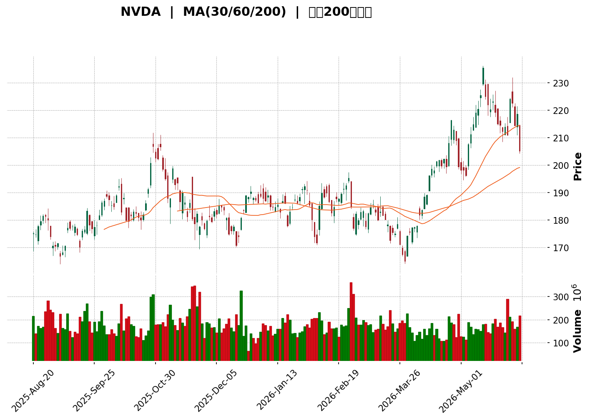
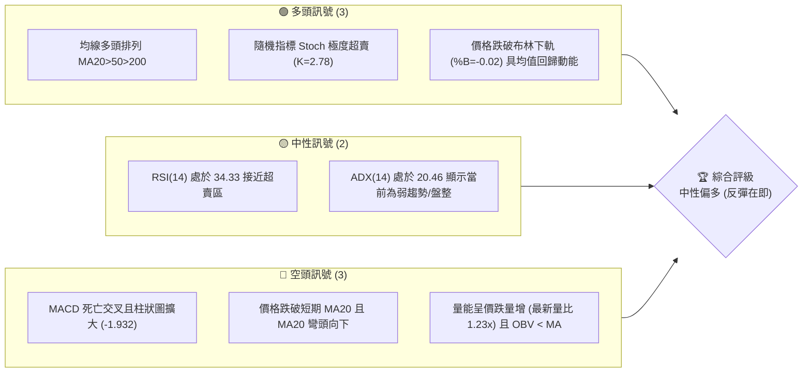
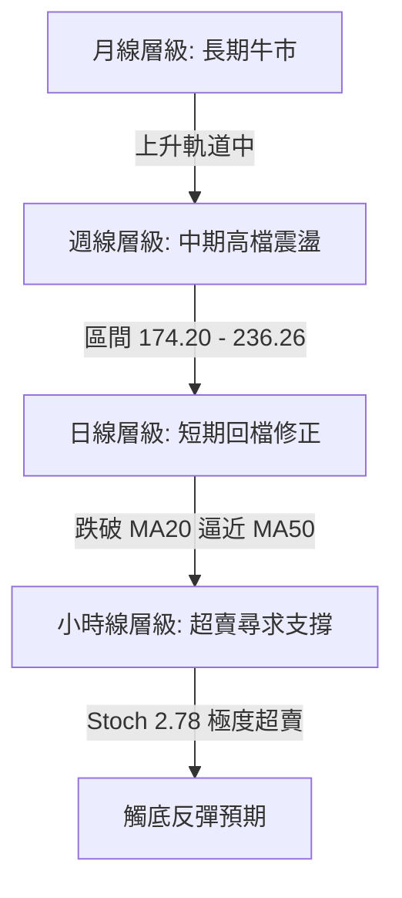
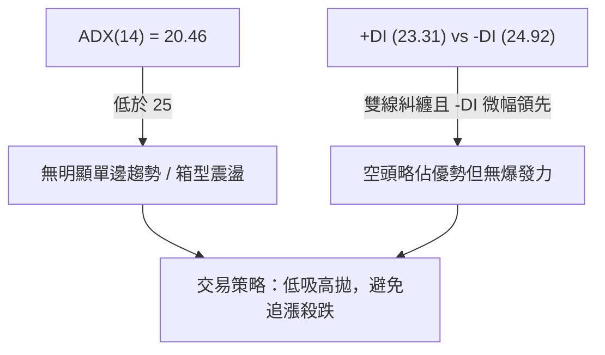
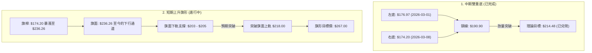
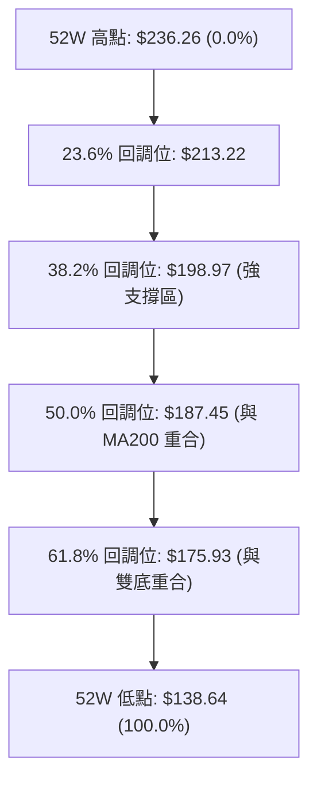

<details>
<summary>📊 靜態圖表 (點擊展開)</summary>

</details>

<html>
<head><meta charset="utf-8" /></head>
<body>
    <div style="height:500px; width:100%;">                        <script>window.PlotlyConfig = {MathJaxConfig: 'local'};</script>
        <script charset="utf-8" src="https://cdn.plot.ly/plotly-3.6.0.min.js" integrity="sha256-QaOVwtVY0T02VaHrr6pnoHLCwayMJp4O5n4YyaE3rJk=" crossorigin="anonymous"></script>                <div id="candlestick-chart" class="plotly-graph-div" style="height:100%; width:100%;"></div>            <script>                window.PLOTLYENV=window.PLOTLYENV || {};                                if (document.getElementById("candlestick-chart")) {                    Plotly.newPlot(                        "candlestick-chart",                        [{"close":{"dtype":"f8","bdata":"AAAAoFXlZUAAAABg6ddlQAAAAKAaOGZAAAAAQERyZkAAAABA57BmQAAAAIB4q2ZAAAAAYMV9ZkAAAACAWL5lQAAAAOCwUWVAAAAA4JNMZUAAAABA0G1lQAAAAACI2WRAAAAAoMECZUAAAABADVFlQAAAAEADI2ZAAAAA4DceZkAAAADg\u002fTJmQAAAAEDBMGZAAAAAQAjVZUAAAACgVkJlQAAAACB\u002fAGZAAAAAAD0OZkAAAABACexmQAAAAKB8RmZAAAAAgNMXZkAAAABA1i5mQAAAACDRPmZAAAAAoMmzZkAAAABg9EpnQAAAAGAMYGdAAAAA4MeUZ0AAAABAMWxnQAAAAIC3KWdAAAAA4LwZZ0AAAADAz5tnQAAAAABkCmhAAAAAgKfdZkAAAABgkIJnQAAAACCfeWZAAAAA4DpzZkAAAABAgrJmQAAAAECS32ZAAAAAAAnNZkAAAABgvJ1mQAAAAKCcgWZAAAAA4LG9ZkAAAAAgukBnQAAAAODf52dAAAAAAMQYaUAAAABA19hpQAAAAMA1VGlAAAAAIG1HaUAAAAAgutNpQAAAACD7zWhAAAAAgMNeaEAAAADg5HpnQAAAAGAhfWdAAAAAoHzZaEAAAAAgPx1oQAAAAGCzMWhAAAAAQOdTZ0AAAAAgsL1nQAAAACCYS2dAAAAAoCCkZkAAAACACUlnQAAAAOAdjWZAAAAAYN5UZkAAAADAKMpmQAAAAOD9MmZAAAAA4PiAZkAAAAAAyRhmQAAAACAbdmZAAAAA4FKnZkAAAABAj2tmQAAAAAAD5WZAAAAAYALGZkAAAAAAXipnQAAAAGDUF2dAAAAAwMvxZkAAAADgtJZmQAAAAEDR2WVAAAAAYGgCZkAAAADAHDBmQAAAAKBqV2VAAAAAALG9ZUAAAADgn5hmQAAAAGDr7mZAAAAAIFifZ0AAAADgKoxnQAAAAGCIyWdAAAAA4LN\u002fZ0AAAAAg+GlnQAAAAOC6SGdAAAAAoNaTZ0AAAADAgXxnQAAAAKBhYGdAAAAA4CWcZ0AAAAAgERpnQAAAAEBQFGdAAAAA4N4WZ0AAAABArTJnQAAAACBX3WZAAAAAAE9aZ0AAAACgGUBnQAAAAGBMO2ZAAAAAIBjjZkAAAACgrBNnQAAAAMAfbmdAAAAAYMVHZ0AAAACASolnQAAAAKAs6WdAAAAAwNAIaEAAAACgtdxnQAAAAOBILGdAAAAAgNmDZkAAAAAgSr9lQAAAAKB1dWVAAAAAYOQlZ0AAAAAg37lnQAAAACDuiWdAAAAAADG6Z0AAAAAAy1ZnQAAAAEDL0mZAAAAAYNQXZ0AAAAAgCHhnQAAAAKB5dWdAAAAAQNeyZ0AAAAAgIupnQAAAAMCuE2hAAAAA4EtqaEAAAADARRVnQAAAAEAsH2ZAAAAAID\u002fIZkAAAADAlHpmQAAAAAAl2mZAAAAAoLvjZkAAAADgTjNmQAAAAACuzWZAAAAAAHARZ0AAAACgBzpnQAAAAGCo3WZAAAAAAEmBZkAAAAAAN+BmQAAAAID7tmZAAAAAYBSGZkAAAACgREtmQAAAAGD3j2VAAAAA4O\u002ftZUAAAACA399lQAAAAIAaT2ZAAAAAIE1hZUAAAABAZupkQAAAAIBJn2RAAAAAoE3GZUAAAAAAdPFlQAAAACDfJWZAAAAAwNwtZkAAAADAkDxmQAAAAADHu2ZAAAAA4ET2ZkAAAAAgIo1nQAAAACDeomdAAAAA4P+IaEAAAACAbtRoQAAAAKDPw2hAAAAAID8uaUAAAACAZDppQAAAAOC29GhAAAAA4HRIaUAAAAAAC+1oQAAAAKDhAGpAAAAAYHMLa0AAAADAf51qQAAAAIA0IGpAAAAAQM7qaEAAAADgAcdoQAAAAED3x2hAAAAAAK6IaEAAAABg0fJpQAAAAAAfaGpAAAAAIGLeakAAAADA52VrQAAAAEC8kGtAAAAAwCUybEAAAAAA5m5tQAAAAMDYIWxAAAAAYPXBa0AAAABATYtrQAAAACC35mtAAAAAgCRoa0AAAADgieJqQAAAACCE02pAAAAAwEeLakAAAADABMBqQAAAAGCdXGpAAAAAgCkDbEAAAACA8NFrQAAAAAAA0GpAAAAAwB5Va0AAAABAM6NpQA=="},"high":{"dtype":"f8","bdata":"+\u002fViVoL4ZUAvbu4TRRVmQNSsSzZHS2ZAuUgsnmC1ZkAtiIx+t8RmQJhWaa3px2ZA8p\u002f0JDAHZ0BLKGN9Nz1mQDbE2LDShGVA8i7cHsiFZUC9DhtyNHRlQEjdSvnDGWVADn9AoHFXZUDpb1MaFVhlQJE3BiWmYWZAF2InjJyBZkDSnkJ860tmQDC\u002fmQXpU2ZAPmGF6cMoZkCSXDoCV59lQAiUtUb7G2ZAAuk4CU07ZkDoQArxEwpnQBfMfx0BxmZADFc1raFxZkDaSWzO+IBmQMnyVANQcWZAOP2H8H\u002f4ZkBZZwA3kGNnQOko6rvPfGdAvJYMFtDZZ0AhXLPIwsNnQJwVXF26X2dAd7jpzTaaZ0BryALDeKtnQJUjFaOjYWhA+2lOu91raEAIBUVSxbtnQMYuhTkREmdAevKM6E0UZ0BkwvcofeFmQGxtERGy+2ZAU706ydkeZ0C0eMc91NFmQP9K7Waa5mZAx\u002fjiy3\u002fZZkA94mzfZWdnQHz0lW0s+GdAx3u54IRcaUDyEwdjbn1qQJMlxoC3vGlAF5\u002fXEJD2aUAvyU3VQ2JqQLLi6sa5dmlAymFETStVaUBvBrz0yKtoQOh201mQgmdANi+XNu71aEAGcL1qeWVoQOCHA9F+dGhA4DM51UbmZ0DMOvubiNhnQNRq59RLmGdAFG15OhESZ0BN7FDE3HNnQNU9cLcCeGhABJSYmmUKZ0DiBkM2hehmQJUntpPbPWZAUq7rGKrVZkD6Q5a6+GFmQMHw2ShAgmZA0imBbI0tZ0BbM\u002f+H9sZmQFkupn9yCWdAnjvD6+sNZ0CNMxvtq3hnQDtr+OPML2dAVaABKSEoZ0BFKJf7K6NmQPigxwgd02ZA5yF6HnxGZkApm+TwuEhmQKQA\u002flRL\u002fWVAEXXU0O79ZUCU9cuIU6dmQIcDRe\u002fw\u002fWZAgARw7S2jZ0CkVI+BwZVnQIwlyJGRDmhAIC1tHPaQZ0B7ILAnUJhnQIRjANx9ymdAmo+qKD0WaECiF\u002f7DnCxoQG69ge3y\u002fWdAZFMxMmHkZ0BkcLUeNqpnQAxz2JqdQ2dAfD6cnotcZ0B\u002fLjHsL3xnQGUchHOHB2dA0dcRTgGvZ0DtyF\u002f8p8ZnQIDjjtwMxWZA3e5oEe8kZ0BjHia6Lj5nQMDxPx3Pq2dA8nLurXecZ0A2+eXal7hnQG7hk7ezA2hAy5fsUdEnaEAeDRA4GUhoQHl7f5IuwmdAq5jn8WBBZ0DxYIY1j2tmQJ1Ry9JYE2ZAlYDJwbVYZ0A3k8ofki1oQJIXdU7bB2hAglgtN8kgaEBifm0Q+StoQLMU4fKwaGdAhGHCHoFdZ0A\u002fP\u002fgla8RnQO9LABZqhmdAs4QhCSTDZ0DDg9js1jZoQDuWsDEWMWhA8XCNt3SsaECx9iWxtEFoQJEJfhzDy2ZAqHBlmJHnZkDiiGdkv5VmQJOiJy8zD2dA0o6XsL76ZkDk7w7zMdFmQADYvWf91WZA\u002fbCn9c9GZ0C7qim22WxnQDYvnNUwF2dAgvItjvI7Z0D2qjPGH5VnQBnBaajkJWdA6vPONFTlZkCgLzi1p3hmQEwQwNmtQWZA+Nsa9zFFZkAt+bKleQBmQJQi5gZKoGZAbvxhnr4JZkAFw\u002f+4q1hlQFa0LG8WKGVAPBjqxlXNZUC29CCNOyVmQMYu12sRKWZAR9LMEagyZkDhMqRiuEBmQAqqrixrIWdA+8744LP7ZkAdhlwP7LhnQH9QgQkOrmdAAAAA4P+IaEBIGcuoVQVpQLYV3lHB82hAkkwpz+IuaUBKanGT6D1pQDeld4FyUGlAAAAA4HRIaUCyCriK93JpQBM08ZCKVmpA3n\u002fjhnsSa0DGToxfXM9qQHRBlqgdj2pAHUixC8RBakA1PvwbcFhpQHYdVkHYL2lAjS\u002f7dDgAaUCxb8mt4QBqQGGgR6BrvmpAhWWBlHwxa0BNl42ZUcFrQHLCGC2q72tA4hrrdGRybEAxgfbed4htQBKtnFBg52xARVHCom63bEBe2OJX\u002fwZsQC2AAYK8O2xA9NyhIVRkbECtsSU1FphrQFBrztahPWtAtjLfd9K8akA5QGaDnOhqQFStdopnM2tA3TLrgnYTbEDv2RGITgBtQOXT+4nw0WtAAAAAQDOza0AAAAAA19tqQA=="},"hovertemplate":"\u003cb\u003e%{x|%Y-%m-%d}\u003c\u002fb\u003e\u003cbr\u003e\u958b: $%{open:.2f}\u003cbr\u003e\u9ad8: $%{high:.2f}\u003cbr\u003e\u4f4e: $%{low:.2f}\u003cbr\u003e\u6536: $%{close:.2f}\u003cextra\u003e\u003c\u002fextra\u003e","low":{"dtype":"f8","bdata":"lPOIaWoSZUAYMtp\u002fhbJlQPFMEd0cX2VAQZu8jbkKZkBpWtEgT1JmQJBrkb2TW2ZA4dCqeJwFZkBUCEL5bZ1lQEuneCrs32RA58ad1fgUZUCYHmjE6CVlQJONw8RBe2RAtnS71RPkZEBN92dNldBkQKecEmSS52VAQN45kyoIZkB1cu8LNQdmQCN74+40yWVAmA+Xdw3FZUD6WTJeQQZlQLQcwJmrl2VAZfp\u002fbJ7eZUCQiOddmc9lQIx9P6qJ\u002f2VA15M1YqblZUBtWMFVGp1lQB61eySh1mVAnJQ41+OCZkBbSjdY9qdmQMFQ69lN9WZAUn0oKUF6Z0Ceap+fmiRnQMOhuk8W42ZAo979GYD4ZkDc\u002fnQRrUlnQOsH2MEh2mdAH0os9S26ZkDI+W3gIzdnQJ0ujzETb2ZAu9YuoQ0iZkAHi7zpT3FmQHuVGjascGZAxjf7vvOvZkCFiP5wRXJmQOL+tnodEWZAY8lEe\u002fNxZkCSp2sNhehmQGOTmy4UhmdAkB3QKkz1Z0C7zwP1nJBpQKiWihHpJGlAXaj54QA6aUDBVFlmiqlpQHq3TQ6xtWhA0Fjkt91MaEBTxQk9kERnQPASt8vTVWZAsOjKgmExaEBebLtozeFnQFPaVpxe3GdAqsq9yLTzZkC2jFDzMotmQBuvjSq6AmdA5lQQGHptZkBqbYWBG9NmQJRyYX7ec2ZAOWK69rWWZUDhCOKWKghmQA3JB02wKmVAbpcUNGpAZkByAa83zghmQF43nB2urmVAXI8hvKl4ZkBtAjoiOFxmQPV0DYG0d2ZA7IIoWBGWZkAjuS6PsMVmQALjPxcY42ZAtyg0\u002fS66ZkBq3S5j9AxmQBKF7l0IzWVABlvoEiPaZUBMVjBk+9VlQEaVfOlHQ2VA2Ewox4pzZUDBMgRoAQRmQDg\u002fV38XxGZA8mHDeKvVZkCYuqcom0tnQO1VdN+reGdAIH2Tbd81Z0CHq1oWeVZnQAhkiBlpSGdAAZVUI\u002fuAZ0ARKp0oiz1nQEyt9DD1UmdAVb23sqVKZ0Cn9ZYlj+9mQGCCRKBH7mZABY8paYHZZkC8ctOMpuVmQLCkczqNkmZADHhi70tDZ0AdbDNfTjtnQMO+QJeYLGZAKSf0eNhFZkBVBdr0lvZmQB+nihv1UmdAAbtECm44Z0AvMZIkKS9nQCkz88N6s2dA3\u002fLlvao6Z0AH4+Fwp6dnQBSp6Qj0FGdAxHhOZH0AZkCDMvwga3ZlQKbyrdtKWmVAysn+wWTMZUBqhmWmOvdmQNml+LCBfGdAkJodBkiRZ0BbE4aqDElnQIkroCzNq2ZAFzzFZ8ZeZkA0weMMClFnQK+jjPrhLWdAt4ok+NQ2Z0DM86uIK6tnQNiZF6N+ZWdAzjAAqrkxaEDHTTMQDgNnQBd\u002fUtVIBWZAwJqYHKzNZUAAEK78ihZmQMVIDp3memZAaWDM3Dk1ZkDjZdraWBNmQKNkIIET62VAnHz\u002fijm5ZkD0v29RhwdnQAs0cME6sWZAYLTUdGB3ZkCOzMHCXKZmQM87WOL9rmZA0q7fqteDZkCqvK4qu\u002fJlQF3\u002fkpikcGVA9AdoRM\u002fRZUAp75Xi4LhlQL6xrLOcFGZAkg8l1BpeZUDHCSodGdpkQHErK1WFgmRAMBQgM4DYZEDjMUmJfdFlQL0Fg6l0ZWVAboDnrcXxZUCRTeOXpq5lQNcMgznigmZAgiIfgByNZkDSmQ0LvAJnQNYfrcvCMGdA3s0onYjRZ0BeLkl5Y3BoQGRbOxmgcmhAgHDGezfhaEBikMR+grNoQP8tXESW2GhAOtGhQJbYaED8whJ0sZ9oQO6bpu558mhA3lEgRm\u002fkaUCO81vlpP5pQKKjA83T6mlAhhUNbP\u002fOaECj3vUuf5xoQOhh8epsUGhA53V7O6h5aEBDsYYNH8xoQNAv565OyGlASE58p4yUakClmtsNg7RqQMPcfQJv1WpA3DMZgPypa0A4xzHqDqFsQA51o6xT\u002f2tAngo0i7RDa0B5TrWfADVrQBtWzjLJh2tASm1cMaQ1a0AJq+ktmdFqQLP9M0YaeGpAd9oiri4RakCcz3flK19qQEBLZphLXGpARmM0Vl3uakDuoOhE9KJrQIFK8ilUyGpAAAAAQApfakAAAABgj4ppQA=="},"name":"\u50f9\u683c","open":{"dtype":"f8","bdata":"IouIAfzdZUCZM5\u002fqwdNlQO\u002fByj8sjGVAvn+M6JtDZkCRbf6BQXpmQPftCzydt2ZAn3fFKouSZkAQmvNM8DtmQKWHxp\u002fDOGVAkZKilKNaZUD2ZY\u002fg+kplQG\u002fxtN7O+WRALPrfB3jqZECSKlDSrhtlQJchnUT2DGZAZUD4jm9uZkAs2JTFZDFmQEtiOJRH7mVA1XAcIckYZkBJBDRacY1lQNSMFrVEuGVAObtNpHnxZUCB5+N1dOJlQOBxk2+ft2ZAUITo509xZkD9SlZfP8hlQAACcHUtPmZA5kxosWeGZkB3R1pVI7tmQKCycj4hIGdAHI5h13irZ0AXbxVeXp5nQGxZ1kpwKGdACjVP9cQ\u002fZ0BnOUehokpnQAbOTiyG\u002f2dAOwzOn24oaEAnuv7GYHdnQPqFqMkbEWdAkaCFQxESZ0DkIv997r9mQFsDYTlqfmZAuSoAA7LcZkC0eMc91NFmQEA5v8YYnWZA3H1E6BWGZkD\u002fyxvBYvNmQBfUJIfvt2dA3hl2JbsZaEClPgTx4fZpQBgu1QpwnGlAWWhaDfzFaUAnEUH6E\u002fppQEwtMqa5V2lASgqg2onQaEBbuCsab4VoQCRFDUpDFWdAC6W5PJFbaEA8b0dBKl1oQC7RIPcPb2hAPx8MB9DZZ0DCNWLoENRmQHYW7rJ1N2dAokTRa6\u002fkZkDk\u002fJJNvxFnQOQgBJ1pdmhAdziM30qgZkBfPTUuXWhmQKhh+X391WVAeQU8tMGsZkCuCJHmBVlmQFynezgy0WVA4LWjPumwZkCgb7TTLZtmQKzPSZDCrGZAY7fyuk\u002f1ZkA+NQ1KXM1mQPCTu7yvKmdAbIvkX9QXZ0BIx5qc7oFmQJB+dLl1nGZAn9e4yCQ3ZkCP8dXxcgFmQPd1oeFV\u002fGVAd1+f+yfKZUB\u002fWup8jQ5mQCLEazRF9mZAYb3oRejXZkDdtLHvwHZnQIt1YlYJtmdA38buFmdvZ0A6ALKjV4BnQIlYHL3ZqmdABErTvnqzZ0CN2SpN2PBnQN1lsaQ2yWdA+YeRo+OKZ0DUr70CJpxnQFmH7k1YG2dAzxk3yuXfZkAHGkzVyRhnQKNAM\u002fkNA2dAokUX3bpIZ0CcI99uMJtnQCxQ62a1tWZAMAFn3J5aZkDBi+tFzBBnQDnuTtKwaGdAJJY3\u002fdJdZ0Ax9yWGYWBnQLwVrh4v4WdAGcYCzWvjZ0Cbq50zRN9nQJ5nDUIaX2dASc6LfmtAZ0DQPBdouWdmQHMVl6\u002fw1mVAR6BaJjEPZkBYcW4OIwFnQAXwmyiz5GdA4\u002fyKzOUGaEDUfSJ6bxloQKJ4+0UNaGdAXywoQuqwZkAJGMZQpJBnQGK99MGgWmdAPbqvrvdKZ0BttDi\u002fVuVnQElNYTI36GdAZmDT09FGaEB6NzckEUFoQO8H0TvvoGZARYtha3\u002fZZUCRoo3RuEhmQJfkP9ILh2ZAAtfBp2CeZkCmijl33nNmQNcvl7SqE2ZAnZmqhrDFZkBnJfXEMTZnQP\u002f3YnK++mZANayfFo0WZ0CcjVNiOdhmQDAQeaYGG2dAaTYH6o\u002fIZkCwusY+sDlmQKoSgXReOWZA9lYDbbchZkDmJ1QHDNRlQEABVVGaHGZA+duFcK77ZUDjzzW5qjllQD7q2TKsEmVA2dK5+tHYZECHs62dcfllQIht8m9Yf2VAJYLgM4UeZkAxtC060PBlQC2oDowgCWdAfVCmHRu0ZkAYLafSDQNnQMPpsacHOmdA40lJUsXTZ0Azz0NY9YloQDcFJKZnpmhA5fW1WVr1aEBP\u002fST26PdoQLt6EGuhPGlA9o9iZjEYaUA60lybLUdpQNVaaWBF92hA3OQrYP0sakB5XwlY4CdqQDCHbPl5jmpAfwUKc\u002fA1akCbJQ9DdiFpQGDVuWWR6GhAXBvy6yziaECREpCYCPVoQAONxWIeA2pAJx+zMQaZakBIGqlfTrlqQOSrRGR1SWtAGqU6dWEVbEAJGXRLo7JsQDcricjCr2xASCgk4EazbEDFz\u002fmQqGtrQKQAAyRy3WtAYC0Cvf\u002fAa0AtgbIhkpRrQLOzlZo2CWtAzlMcAd27akAwSf3SFmFqQMNg7BGRympAaH33zFLvakDX5GPrS11sQE9ohsfHrmtAAAAAwB69akAAAADA9dBqQA=="},"x":["2025-08-20T00:00:00-04:00","2025-08-21T00:00:00-04:00","2025-08-22T00:00:00-04:00","2025-08-25T00:00:00-04:00","2025-08-26T00:00:00-04:00","2025-08-27T00:00:00-04:00","2025-08-28T00:00:00-04:00","2025-08-29T00:00:00-04:00","2025-09-02T00:00:00-04:00","2025-09-03T00:00:00-04:00","2025-09-04T00:00:00-04:00","2025-09-05T00:00:00-04:00","2025-09-08T00:00:00-04:00","2025-09-09T00:00:00-04:00","2025-09-10T00:00:00-04:00","2025-09-11T00:00:00-04:00","2025-09-12T00:00:00-04:00","2025-09-15T00:00:00-04:00","2025-09-16T00:00:00-04:00","2025-09-17T00:00:00-04:00","2025-09-18T00:00:00-04:00","2025-09-19T00:00:00-04:00","2025-09-22T00:00:00-04:00","2025-09-23T00:00:00-04:00","2025-09-24T00:00:00-04:00","2025-09-25T00:00:00-04:00","2025-09-26T00:00:00-04:00","2025-09-29T00:00:00-04:00","2025-09-30T00:00:00-04:00","2025-10-01T00:00:00-04:00","2025-10-02T00:00:00-04:00","2025-10-03T00:00:00-04:00","2025-10-06T00:00:00-04:00","2025-10-07T00:00:00-04:00","2025-10-08T00:00:00-04:00","2025-10-09T00:00:00-04:00","2025-10-10T00:00:00-04:00","2025-10-13T00:00:00-04:00","2025-10-14T00:00:00-04:00","2025-10-15T00:00:00-04:00","2025-10-16T00:00:00-04:00","2025-10-17T00:00:00-04:00","2025-10-20T00:00:00-04:00","2025-10-21T00:00:00-04:00","2025-10-22T00:00:00-04:00","2025-10-23T00:00:00-04:00","2025-10-24T00:00:00-04:00","2025-10-27T00:00:00-04:00","2025-10-28T00:00:00-04:00","2025-10-29T00:00:00-04:00","2025-10-30T00:00:00-04:00","2025-10-31T00:00:00-04:00","2025-11-03T00:00:00-05:00","2025-11-04T00:00:00-05:00","2025-11-05T00:00:00-05:00","2025-11-06T00:00:00-05:00","2025-11-07T00:00:00-05:00","2025-11-10T00:00:00-05:00","2025-11-11T00:00:00-05:00","2025-11-12T00:00:00-05:00","2025-11-13T00:00:00-05:00","2025-11-14T00:00:00-05:00","2025-11-17T00:00:00-05:00","2025-11-18T00:00:00-05:00","2025-11-19T00:00:00-05:00","2025-11-20T00:00:00-05:00","2025-11-21T00:00:00-05:00","2025-11-24T00:00:00-05:00","2025-11-25T00:00:00-05:00","2025-11-26T00:00:00-05:00","2025-11-28T00:00:00-05:00","2025-12-01T00:00:00-05:00","2025-12-02T00:00:00-05:00","2025-12-03T00:00:00-05:00","2025-12-04T00:00:00-05:00","2025-12-05T00:00:00-05:00","2025-12-08T00:00:00-05:00","2025-12-09T00:00:00-05:00","2025-12-10T00:00:00-05:00","2025-12-11T00:00:00-05:00","2025-12-12T00:00:00-05:00","2025-12-15T00:00:00-05:00","2025-12-16T00:00:00-05:00","2025-12-17T00:00:00-05:00","2025-12-18T00:00:00-05:00","2025-12-19T00:00:00-05:00","2025-12-22T00:00:00-05:00","2025-12-23T00:00:00-05:00","2025-12-24T00:00:00-05:00","2025-12-26T00:00:00-05:00","2025-12-29T00:00:00-05:00","2025-12-30T00:00:00-05:00","2025-12-31T00:00:00-05:00","2026-01-02T00:00:00-05:00","2026-01-05T00:00:00-05:00","2026-01-06T00:00:00-05:00","2026-01-07T00:00:00-05:00","2026-01-08T00:00:00-05:00","2026-01-09T00:00:00-05:00","2026-01-12T00:00:00-05:00","2026-01-13T00:00:00-05:00","2026-01-14T00:00:00-05:00","2026-01-15T00:00:00-05:00","2026-01-16T00:00:00-05:00","2026-01-20T00:00:00-05:00","2026-01-21T00:00:00-05:00","2026-01-22T00:00:00-05:00","2026-01-23T00:00:00-05:00","2026-01-26T00:00:00-05:00","2026-01-27T00:00:00-05:00","2026-01-28T00:00:00-05:00","2026-01-29T00:00:00-05:00","2026-01-30T00:00:00-05:00","2026-02-02T00:00:00-05:00","2026-02-03T00:00:00-05:00","2026-02-04T00:00:00-05:00","2026-02-05T00:00:00-05:00","2026-02-06T00:00:00-05:00","2026-02-09T00:00:00-05:00","2026-02-10T00:00:00-05:00","2026-02-11T00:00:00-05:00","2026-02-12T00:00:00-05:00","2026-02-13T00:00:00-05:00","2026-02-17T00:00:00-05:00","2026-02-18T00:00:00-05:00","2026-02-19T00:00:00-05:00","2026-02-20T00:00:00-05:00","2026-02-23T00:00:00-05:00","2026-02-24T00:00:00-05:00","2026-02-25T00:00:00-05:00","2026-02-26T00:00:00-05:00","2026-02-27T00:00:00-05:00","2026-03-02T00:00:00-05:00","2026-03-03T00:00:00-05:00","2026-03-04T00:00:00-05:00","2026-03-05T00:00:00-05:00","2026-03-06T00:00:00-05:00","2026-03-09T00:00:00-04:00","2026-03-10T00:00:00-04:00","2026-03-11T00:00:00-04:00","2026-03-12T00:00:00-04:00","2026-03-13T00:00:00-04:00","2026-03-16T00:00:00-04:00","2026-03-17T00:00:00-04:00","2026-03-18T00:00:00-04:00","2026-03-19T00:00:00-04:00","2026-03-20T00:00:00-04:00","2026-03-23T00:00:00-04:00","2026-03-24T00:00:00-04:00","2026-03-25T00:00:00-04:00","2026-03-26T00:00:00-04:00","2026-03-27T00:00:00-04:00","2026-03-30T00:00:00-04:00","2026-03-31T00:00:00-04:00","2026-04-01T00:00:00-04:00","2026-04-02T00:00:00-04:00","2026-04-06T00:00:00-04:00","2026-04-07T00:00:00-04:00","2026-04-08T00:00:00-04:00","2026-04-09T00:00:00-04:00","2026-04-10T00:00:00-04:00","2026-04-13T00:00:00-04:00","2026-04-14T00:00:00-04:00","2026-04-15T00:00:00-04:00","2026-04-16T00:00:00-04:00","2026-04-17T00:00:00-04:00","2026-04-20T00:00:00-04:00","2026-04-21T00:00:00-04:00","2026-04-22T00:00:00-04:00","2026-04-23T00:00:00-04:00","2026-04-24T00:00:00-04:00","2026-04-27T00:00:00-04:00","2026-04-28T00:00:00-04:00","2026-04-29T00:00:00-04:00","2026-04-30T00:00:00-04:00","2026-05-01T00:00:00-04:00","2026-05-04T00:00:00-04:00","2026-05-05T00:00:00-04:00","2026-05-06T00:00:00-04:00","2026-05-07T00:00:00-04:00","2026-05-08T00:00:00-04:00","2026-05-11T00:00:00-04:00","2026-05-12T00:00:00-04:00","2026-05-13T00:00:00-04:00","2026-05-14T00:00:00-04:00","2026-05-15T00:00:00-04:00","2026-05-18T00:00:00-04:00","2026-05-19T00:00:00-04:00","2026-05-20T00:00:00-04:00","2026-05-21T00:00:00-04:00","2026-05-22T00:00:00-04:00","2026-05-26T00:00:00-04:00","2026-05-27T00:00:00-04:00","2026-05-28T00:00:00-04:00","2026-05-29T00:00:00-04:00","2026-06-01T00:00:00-04:00","2026-06-02T00:00:00-04:00","2026-06-03T00:00:00-04:00","2026-06-04T00:00:00-04:00","2026-06-05T00:00:00-04:00"],"type":"candlestick"},{"hovertemplate":"MA30: $%{y:.2f}\u003cextra\u003e\u003c\u002fextra\u003e","line":{"color":"#2196F3","dash":"dash","width":2},"mode":"lines","name":"MA30","x":["2025-08-20T00:00:00-04:00","2025-08-21T00:00:00-04:00","2025-08-22T00:00:00-04:00","2025-08-25T00:00:00-04:00","2025-08-26T00:00:00-04:00","2025-08-27T00:00:00-04:00","2025-08-28T00:00:00-04:00","2025-08-29T00:00:00-04:00","2025-09-02T00:00:00-04:00","2025-09-03T00:00:00-04:00","2025-09-04T00:00:00-04:00","2025-09-05T00:00:00-04:00","2025-09-08T00:00:00-04:00","2025-09-09T00:00:00-04:00","2025-09-10T00:00:00-04:00","2025-09-11T00:00:00-04:00","2025-09-12T00:00:00-04:00","2025-09-15T00:00:00-04:00","2025-09-16T00:00:00-04:00","2025-09-17T00:00:00-04:00","2025-09-18T00:00:00-04:00","2025-09-19T00:00:00-04:00","2025-09-22T00:00:00-04:00","2025-09-23T00:00:00-04:00","2025-09-24T00:00:00-04:00","2025-09-25T00:00:00-04:00","2025-09-26T00:00:00-04:00","2025-09-29T00:00:00-04:00","2025-09-30T00:00:00-04:00","2025-10-01T00:00:00-04:00","2025-10-02T00:00:00-04:00","2025-10-03T00:00:00-04:00","2025-10-06T00:00:00-04:00","2025-10-07T00:00:00-04:00","2025-10-08T00:00:00-04:00","2025-10-09T00:00:00-04:00","2025-10-10T00:00:00-04:00","2025-10-13T00:00:00-04:00","2025-10-14T00:00:00-04:00","2025-10-15T00:00:00-04:00","2025-10-16T00:00:00-04:00","2025-10-17T00:00:00-04:00","2025-10-20T00:00:00-04:00","2025-10-21T00:00:00-04:00","2025-10-22T00:00:00-04:00","2025-10-23T00:00:00-04:00","2025-10-24T00:00:00-04:00","2025-10-27T00:00:00-04:00","2025-10-28T00:00:00-04:00","2025-10-29T00:00:00-04:00","2025-10-30T00:00:00-04:00","2025-10-31T00:00:00-04:00","2025-11-03T00:00:00-05:00","2025-11-04T00:00:00-05:00","2025-11-05T00:00:00-05:00","2025-11-06T00:00:00-05:00","2025-11-07T00:00:00-05:00","2025-11-10T00:00:00-05:00","2025-11-11T00:00:00-05:00","2025-11-12T00:00:00-05:00","2025-11-13T00:00:00-05:00","2025-11-14T00:00:00-05:00","2025-11-17T00:00:00-05:00","2025-11-18T00:00:00-05:00","2025-11-19T00:00:00-05:00","2025-11-20T00:00:00-05:00","2025-11-21T00:00:00-05:00","2025-11-24T00:00:00-05:00","2025-11-25T00:00:00-05:00","2025-11-26T00:00:00-05:00","2025-11-28T00:00:00-05:00","2025-12-01T00:00:00-05:00","2025-12-02T00:00:00-05:00","2025-12-03T00:00:00-05:00","2025-12-04T00:00:00-05:00","2025-12-05T00:00:00-05:00","2025-12-08T00:00:00-05:00","2025-12-09T00:00:00-05:00","2025-12-10T00:00:00-05:00","2025-12-11T00:00:00-05:00","2025-12-12T00:00:00-05:00","2025-12-15T00:00:00-05:00","2025-12-16T00:00:00-05:00","2025-12-17T00:00:00-05:00","2025-12-18T00:00:00-05:00","2025-12-19T00:00:00-05:00","2025-12-22T00:00:00-05:00","2025-12-23T00:00:00-05:00","2025-12-24T00:00:00-05:00","2025-12-26T00:00:00-05:00","2025-12-29T00:00:00-05:00","2025-12-30T00:00:00-05:00","2025-12-31T00:00:00-05:00","2026-01-02T00:00:00-05:00","2026-01-05T00:00:00-05:00","2026-01-06T00:00:00-05:00","2026-01-07T00:00:00-05:00","2026-01-08T00:00:00-05:00","2026-01-09T00:00:00-05:00","2026-01-12T00:00:00-05:00","2026-01-13T00:00:00-05:00","2026-01-14T00:00:00-05:00","2026-01-15T00:00:00-05:00","2026-01-16T00:00:00-05:00","2026-01-20T00:00:00-05:00","2026-01-21T00:00:00-05:00","2026-01-22T00:00:00-05:00","2026-01-23T00:00:00-05:00","2026-01-26T00:00:00-05:00","2026-01-27T00:00:00-05:00","2026-01-28T00:00:00-05:00","2026-01-29T00:00:00-05:00","2026-01-30T00:00:00-05:00","2026-02-02T00:00:00-05:00","2026-02-03T00:00:00-05:00","2026-02-04T00:00:00-05:00","2026-02-05T00:00:00-05:00","2026-02-06T00:00:00-05:00","2026-02-09T00:00:00-05:00","2026-02-10T00:00:00-05:00","2026-02-11T00:00:00-05:00","2026-02-12T00:00:00-05:00","2026-02-13T00:00:00-05:00","2026-02-17T00:00:00-05:00","2026-02-18T00:00:00-05:00","2026-02-19T00:00:00-05:00","2026-02-20T00:00:00-05:00","2026-02-23T00:00:00-05:00","2026-02-24T00:00:00-05:00","2026-02-25T00:00:00-05:00","2026-02-26T00:00:00-05:00","2026-02-27T00:00:00-05:00","2026-03-02T00:00:00-05:00","2026-03-03T00:00:00-05:00","2026-03-04T00:00:00-05:00","2026-03-05T00:00:00-05:00","2026-03-06T00:00:00-05:00","2026-03-09T00:00:00-04:00","2026-03-10T00:00:00-04:00","2026-03-11T00:00:00-04:00","2026-03-12T00:00:00-04:00","2026-03-13T00:00:00-04:00","2026-03-16T00:00:00-04:00","2026-03-17T00:00:00-04:00","2026-03-18T00:00:00-04:00","2026-03-19T00:00:00-04:00","2026-03-20T00:00:00-04:00","2026-03-23T00:00:00-04:00","2026-03-24T00:00:00-04:00","2026-03-25T00:00:00-04:00","2026-03-26T00:00:00-04:00","2026-03-27T00:00:00-04:00","2026-03-30T00:00:00-04:00","2026-03-31T00:00:00-04:00","2026-04-01T00:00:00-04:00","2026-04-02T00:00:00-04:00","2026-04-06T00:00:00-04:00","2026-04-07T00:00:00-04:00","2026-04-08T00:00:00-04:00","2026-04-09T00:00:00-04:00","2026-04-10T00:00:00-04:00","2026-04-13T00:00:00-04:00","2026-04-14T00:00:00-04:00","2026-04-15T00:00:00-04:00","2026-04-16T00:00:00-04:00","2026-04-17T00:00:00-04:00","2026-04-20T00:00:00-04:00","2026-04-21T00:00:00-04:00","2026-04-22T00:00:00-04:00","2026-04-23T00:00:00-04:00","2026-04-24T00:00:00-04:00","2026-04-27T00:00:00-04:00","2026-04-28T00:00:00-04:00","2026-04-29T00:00:00-04:00","2026-04-30T00:00:00-04:00","2026-05-01T00:00:00-04:00","2026-05-04T00:00:00-04:00","2026-05-05T00:00:00-04:00","2026-05-06T00:00:00-04:00","2026-05-07T00:00:00-04:00","2026-05-08T00:00:00-04:00","2026-05-11T00:00:00-04:00","2026-05-12T00:00:00-04:00","2026-05-13T00:00:00-04:00","2026-05-14T00:00:00-04:00","2026-05-15T00:00:00-04:00","2026-05-18T00:00:00-04:00","2026-05-19T00:00:00-04:00","2026-05-20T00:00:00-04:00","2026-05-21T00:00:00-04:00","2026-05-22T00:00:00-04:00","2026-05-26T00:00:00-04:00","2026-05-27T00:00:00-04:00","2026-05-28T00:00:00-04:00","2026-05-29T00:00:00-04:00","2026-06-01T00:00:00-04:00","2026-06-02T00:00:00-04:00","2026-06-03T00:00:00-04:00","2026-06-04T00:00:00-04:00","2026-06-05T00:00:00-04:00"],"y":{"dtype":"f8","bdata":"AAAAAAAA+H8AAAAAAAD4fwAAAAAAAPh\u002fAAAAAAAA+H8AAAAAAAD4fwAAAAAAAPh\u002fAAAAAAAA+H8AAAAAAAD4fwAAAAAAAPh\u002fAAAAAAAA+H8AAAAAAAD4fwAAAAAAAPh\u002fAAAAAAAA+H8AAAAAAAD4fwAAAAAAAPh\u002fAAAAAAAA+H8AAAAAAAD4fwAAAAAAAPh\u002fAAAAAAAA+H8AAAAAAAD4fwAAAAAAAPh\u002fAAAAAAAA+H8AAAAAAAD4fwAAAAAAAPh\u002fAAAAAAAA+H8AAAAAAAD4fwAAAAAAAPh\u002fAAAAAAAA+H8AAAAAAAD4f83MzOz6EWZAmpmZmVwgZkBmZmZ21i1mQJqZmTnkNWZAAAAAUHk7ZkDNzMzcTUNmQBEREWEAT2ZAVVVVlTJSZkAzMzODRWFmQJqZmckia2ZAd3d3J\u002fV0ZkAzMzPjx39mQO\u002fu7n4MkWZAREREJFOgZkC8u7sLaqtmQKuqqkqRrmZAiYiIKOKzZkBmZmbm37xmQN7d3Q2Dy2ZAVVVVpV7nZkARERERhQ5nQFVVVQXpKmdAAAAAoGpGZ0CamZnJNF9nQCIiIhLKdGdAiYiIeDiIZ0BmZmYGSpNnQM3MzEzmnWdAERERETmwZ0Dv7u6OO7dnQHd3d5c4vmdAiYiI+A68Z0BmZmZmxr5nQM3MzHznv2dAERER4fu7Z0CamZmJOblnQAAAAACErGdAMzMzw\u002fSnZ0DNzMwsz6FnQHd3d3d0n2dAvLu7u+mfZ0BVVVX1yZpnQM3MzPxFl2dA7+7uLgSWZ0AzMzMDWJRnQJqZmTmol2dAzczMLO+XZ0Dv7u5eMJdnQN7d3Q1BkGdAIiIicuN9Z0AAAACAFWJnQLy7u3tnRGdAzczM7IAoZ0BVVVUlcwlnQLy7u8vl62ZA7+7uPnbVZkCamZlp681mQBEREeEtyWZAIiIiMrW+ZkAAAAAw37lmQJqZmUlmtmZAq6qqCty3ZkBERESkEbVmQDMzMzP5tGZAvLu7u\u002fa8ZkARERHxrb5mQLy7u7u4xWZAREREhKHQZkBVVVVlS9NmQERERCTO2mZAZmZmRs3fZkAAAADAMulmQO\u002fu7q6j7GZAVVVVBZvyZkAzMzOzsPlmQKuqqnoI9GZAvLu7qwD1ZkBmZmYGP\u002fRmQHd3d2cf92ZA7+7uDv35ZkDNzMwcEwJnQJqZmTmnE2dAiYiI+O4kZ0BVVVVVODNnQHd3d1fZQmdAq6qqSnRJZ0AzMzOzNUJnQFVVVbWgNWdAERERUZQxZ0AzMzNTGjNnQFVVVZX7MGdAAAAAsO4yZ0DNzMwMSzJnQJqZmalcLmdAREREdDoqZ0BEREREFCpnQERERETIKmdAmpmZ6YkrZ0CamZlpeTJnQAAAAJD8OmdA7+7u\u002fkxGZ0BEREQUUkVnQBEREVH7PmdAvLu76xw6Z0DNzMxshzNnQJqZmenSOGdAzczMXNg4Z0BVVVXFXTFnQFVVVaUELGdAAAAAADUqZ0AzMzOjkCdnQERERNSlHmdAVVVVxZgRZ0BmZmYmLglnQLy7uytFBWdAMzMzM1gFZ0Dv7u6uAgpnQAAAAODkCmdAvLu7234AZ0AiIiISsvBmQM3MzIwz5mZARERE9CvSZkDe3d3tfb1mQGZmZla1qmZAzczMHHWfZkDNzMwscJJmQLy7u1tAh2ZAMzMzE0l6ZkDe3d1t92tmQFVVVcWAYGZAMzMzIxpUZkAzMzPzGFhmQHd3d0cFZWZAMzMzo\u002fpzZkDe3d1tCohmQKuqqupcmGZAVVVV1emrZkAzMzPjv8VmQM3MzAwe2GZAzczMnATrZkCamZm5hPlmQGZmZuZKFGdAvLu7Cwg7Z0Dv7u7e8FpnQO\u002fu7l4MeGdAd3d393iMZ0ARERHxqaFnQHd3d2chvWdAERER8VrTZ0DNzMy8HvZnQKuqqloWGWhAMzMzY+xHaEARERGBPX9oQAAAABB9umhAiYiIiEjxaEC8u7u7MjFpQGZmZpZDZGlAIiIiAt6TaUDv7u6OKMFpQBEREaFB7WlAvLu7ey8TakAAAADgoS9qQLy7u5vaSmpAMzMzI\u002f9bakAzMzMDYmxqQImIiHgCempAq6qqaiySakDv7u6uSqhqQERERHQiuGpAVVVVlZ\u002fJakDe3d39sc9qQA=="},"type":"scatter"},{"hovertemplate":"MA60: $%{y:.2f}\u003cextra\u003e\u003c\u002fextra\u003e","line":{"color":"#9C27B0","dash":"dash","width":2},"mode":"lines","name":"MA60","x":["2025-08-20T00:00:00-04:00","2025-08-21T00:00:00-04:00","2025-08-22T00:00:00-04:00","2025-08-25T00:00:00-04:00","2025-08-26T00:00:00-04:00","2025-08-27T00:00:00-04:00","2025-08-28T00:00:00-04:00","2025-08-29T00:00:00-04:00","2025-09-02T00:00:00-04:00","2025-09-03T00:00:00-04:00","2025-09-04T00:00:00-04:00","2025-09-05T00:00:00-04:00","2025-09-08T00:00:00-04:00","2025-09-09T00:00:00-04:00","2025-09-10T00:00:00-04:00","2025-09-11T00:00:00-04:00","2025-09-12T00:00:00-04:00","2025-09-15T00:00:00-04:00","2025-09-16T00:00:00-04:00","2025-09-17T00:00:00-04:00","2025-09-18T00:00:00-04:00","2025-09-19T00:00:00-04:00","2025-09-22T00:00:00-04:00","2025-09-23T00:00:00-04:00","2025-09-24T00:00:00-04:00","2025-09-25T00:00:00-04:00","2025-09-26T00:00:00-04:00","2025-09-29T00:00:00-04:00","2025-09-30T00:00:00-04:00","2025-10-01T00:00:00-04:00","2025-10-02T00:00:00-04:00","2025-10-03T00:00:00-04:00","2025-10-06T00:00:00-04:00","2025-10-07T00:00:00-04:00","2025-10-08T00:00:00-04:00","2025-10-09T00:00:00-04:00","2025-10-10T00:00:00-04:00","2025-10-13T00:00:00-04:00","2025-10-14T00:00:00-04:00","2025-10-15T00:00:00-04:00","2025-10-16T00:00:00-04:00","2025-10-17T00:00:00-04:00","2025-10-20T00:00:00-04:00","2025-10-21T00:00:00-04:00","2025-10-22T00:00:00-04:00","2025-10-23T00:00:00-04:00","2025-10-24T00:00:00-04:00","2025-10-27T00:00:00-04:00","2025-10-28T00:00:00-04:00","2025-10-29T00:00:00-04:00","2025-10-30T00:00:00-04:00","2025-10-31T00:00:00-04:00","2025-11-03T00:00:00-05:00","2025-11-04T00:00:00-05:00","2025-11-05T00:00:00-05:00","2025-11-06T00:00:00-05:00","2025-11-07T00:00:00-05:00","2025-11-10T00:00:00-05:00","2025-11-11T00:00:00-05:00","2025-11-12T00:00:00-05:00","2025-11-13T00:00:00-05:00","2025-11-14T00:00:00-05:00","2025-11-17T00:00:00-05:00","2025-11-18T00:00:00-05:00","2025-11-19T00:00:00-05:00","2025-11-20T00:00:00-05:00","2025-11-21T00:00:00-05:00","2025-11-24T00:00:00-05:00","2025-11-25T00:00:00-05:00","2025-11-26T00:00:00-05:00","2025-11-28T00:00:00-05:00","2025-12-01T00:00:00-05:00","2025-12-02T00:00:00-05:00","2025-12-03T00:00:00-05:00","2025-12-04T00:00:00-05:00","2025-12-05T00:00:00-05:00","2025-12-08T00:00:00-05:00","2025-12-09T00:00:00-05:00","2025-12-10T00:00:00-05:00","2025-12-11T00:00:00-05:00","2025-12-12T00:00:00-05:00","2025-12-15T00:00:00-05:00","2025-12-16T00:00:00-05:00","2025-12-17T00:00:00-05:00","2025-12-18T00:00:00-05:00","2025-12-19T00:00:00-05:00","2025-12-22T00:00:00-05:00","2025-12-23T00:00:00-05:00","2025-12-24T00:00:00-05:00","2025-12-26T00:00:00-05:00","2025-12-29T00:00:00-05:00","2025-12-30T00:00:00-05:00","2025-12-31T00:00:00-05:00","2026-01-02T00:00:00-05:00","2026-01-05T00:00:00-05:00","2026-01-06T00:00:00-05:00","2026-01-07T00:00:00-05:00","2026-01-08T00:00:00-05:00","2026-01-09T00:00:00-05:00","2026-01-12T00:00:00-05:00","2026-01-13T00:00:00-05:00","2026-01-14T00:00:00-05:00","2026-01-15T00:00:00-05:00","2026-01-16T00:00:00-05:00","2026-01-20T00:00:00-05:00","2026-01-21T00:00:00-05:00","2026-01-22T00:00:00-05:00","2026-01-23T00:00:00-05:00","2026-01-26T00:00:00-05:00","2026-01-27T00:00:00-05:00","2026-01-28T00:00:00-05:00","2026-01-29T00:00:00-05:00","2026-01-30T00:00:00-05:00","2026-02-02T00:00:00-05:00","2026-02-03T00:00:00-05:00","2026-02-04T00:00:00-05:00","2026-02-05T00:00:00-05:00","2026-02-06T00:00:00-05:00","2026-02-09T00:00:00-05:00","2026-02-10T00:00:00-05:00","2026-02-11T00:00:00-05:00","2026-02-12T00:00:00-05:00","2026-02-13T00:00:00-05:00","2026-02-17T00:00:00-05:00","2026-02-18T00:00:00-05:00","2026-02-19T00:00:00-05:00","2026-02-20T00:00:00-05:00","2026-02-23T00:00:00-05:00","2026-02-24T00:00:00-05:00","2026-02-25T00:00:00-05:00","2026-02-26T00:00:00-05:00","2026-02-27T00:00:00-05:00","2026-03-02T00:00:00-05:00","2026-03-03T00:00:00-05:00","2026-03-04T00:00:00-05:00","2026-03-05T00:00:00-05:00","2026-03-06T00:00:00-05:00","2026-03-09T00:00:00-04:00","2026-03-10T00:00:00-04:00","2026-03-11T00:00:00-04:00","2026-03-12T00:00:00-04:00","2026-03-13T00:00:00-04:00","2026-03-16T00:00:00-04:00","2026-03-17T00:00:00-04:00","2026-03-18T00:00:00-04:00","2026-03-19T00:00:00-04:00","2026-03-20T00:00:00-04:00","2026-03-23T00:00:00-04:00","2026-03-24T00:00:00-04:00","2026-03-25T00:00:00-04:00","2026-03-26T00:00:00-04:00","2026-03-27T00:00:00-04:00","2026-03-30T00:00:00-04:00","2026-03-31T00:00:00-04:00","2026-04-01T00:00:00-04:00","2026-04-02T00:00:00-04:00","2026-04-06T00:00:00-04:00","2026-04-07T00:00:00-04:00","2026-04-08T00:00:00-04:00","2026-04-09T00:00:00-04:00","2026-04-10T00:00:00-04:00","2026-04-13T00:00:00-04:00","2026-04-14T00:00:00-04:00","2026-04-15T00:00:00-04:00","2026-04-16T00:00:00-04:00","2026-04-17T00:00:00-04:00","2026-04-20T00:00:00-04:00","2026-04-21T00:00:00-04:00","2026-04-22T00:00:00-04:00","2026-04-23T00:00:00-04:00","2026-04-24T00:00:00-04:00","2026-04-27T00:00:00-04:00","2026-04-28T00:00:00-04:00","2026-04-29T00:00:00-04:00","2026-04-30T00:00:00-04:00","2026-05-01T00:00:00-04:00","2026-05-04T00:00:00-04:00","2026-05-05T00:00:00-04:00","2026-05-06T00:00:00-04:00","2026-05-07T00:00:00-04:00","2026-05-08T00:00:00-04:00","2026-05-11T00:00:00-04:00","2026-05-12T00:00:00-04:00","2026-05-13T00:00:00-04:00","2026-05-14T00:00:00-04:00","2026-05-15T00:00:00-04:00","2026-05-18T00:00:00-04:00","2026-05-19T00:00:00-04:00","2026-05-20T00:00:00-04:00","2026-05-21T00:00:00-04:00","2026-05-22T00:00:00-04:00","2026-05-26T00:00:00-04:00","2026-05-27T00:00:00-04:00","2026-05-28T00:00:00-04:00","2026-05-29T00:00:00-04:00","2026-06-01T00:00:00-04:00","2026-06-02T00:00:00-04:00","2026-06-03T00:00:00-04:00","2026-06-04T00:00:00-04:00","2026-06-05T00:00:00-04:00"],"y":{"dtype":"f8","bdata":"AAAAAAAA+H8AAAAAAAD4fwAAAAAAAPh\u002fAAAAAAAA+H8AAAAAAAD4fwAAAAAAAPh\u002fAAAAAAAA+H8AAAAAAAD4fwAAAAAAAPh\u002fAAAAAAAA+H8AAAAAAAD4fwAAAAAAAPh\u002fAAAAAAAA+H8AAAAAAAD4fwAAAAAAAPh\u002fAAAAAAAA+H8AAAAAAAD4fwAAAAAAAPh\u002fAAAAAAAA+H8AAAAAAAD4fwAAAAAAAPh\u002fAAAAAAAA+H8AAAAAAAD4fwAAAAAAAPh\u002fAAAAAAAA+H8AAAAAAAD4fwAAAAAAAPh\u002fAAAAAAAA+H8AAAAAAAD4fwAAAAAAAPh\u002fAAAAAAAA+H8AAAAAAAD4fwAAAAAAAPh\u002fAAAAAAAA+H8AAAAAAAD4fwAAAAAAAPh\u002fAAAAAAAA+H8AAAAAAAD4fwAAAAAAAPh\u002fAAAAAAAA+H8AAAAAAAD4fwAAAAAAAPh\u002fAAAAAAAA+H8AAAAAAAD4fwAAAAAAAPh\u002fAAAAAAAA+H8AAAAAAAD4fwAAAAAAAPh\u002fAAAAAAAA+H8AAAAAAAD4fwAAAAAAAPh\u002fAAAAAAAA+H8AAAAAAAD4fwAAAAAAAPh\u002fAAAAAAAA+H8AAAAAAAD4fwAAAAAAAPh\u002fAAAAAAAA+H8AAAAAAAD4fyIiIsIZ6GZAERERyTXuZkBmZmZuTvZmQDMzM9vl+mZAiYiImLr7ZkAzMzOzQ\u002f5mQImIiDDC\u002fWZARERErBP9ZkAAAABYigFnQImIiKBLBWdAmpmZcW8KZ0BERETsSA1nQN7d3T0pFGdAmpmZqSsbZ0B3d3cH4R9nQCIiIsIcI2dAq6qqquglZ0CrqqoiCCpnQN7d3Q3iLWdAvLu7C6EyZ0CJiIhITThnQImIiECoN2dAZmZmxnU3Z0B3d3f3UzRnQO\u002fu7u5XMGdAvLu7W9cuZ0AAAAC4mjBnQO\u002fu7haKM2dAmpmZIXc3Z0B3d3dfjThnQImIiHBPOmdAmpmZgfU5Z0BVVVUF7DlnQAAAAFhwOmdAZmZmTnk8Z0BVVVW98ztnQN7d3V0eOWdAvLu7I0s8Z0ARERFJjTpnQN7d3U0hPWdAERERgds\u002fZ0Crqqpa\u002fkFnQN7d3dX0QWdAIiIimk9EZ0AzMzNbBEdnQCIiIlrYRWdARERE7HdGZ0Crqqqyt0VnQKuqqjqwQ2dAiYiIQPA7Z0BmZmZOFDJnQKuqqloHLGdAq6qq8rcmZ0BVVVW9VR5nQJqZmZFfF2dAzczMRHUPZ0BmZmaOEAhnQDMzM0tn\u002f2ZAmpmZwST4ZkCamZnBfPZmQHd3d++w82ZAVVVVXWX1ZkCJiIhYrvNmQGZmZu6q8WZAAAAAmJjzZkCrqqoaYfRmQAAAAIBA+GZA7+7uthX+ZkB3d3dn4gJnQCIiIlrlCmdAq6qqIg0TZ0AiIiJqQhdnQAAAAIDPFWdAiYiI+FsWZ0AAAAAQnBZnQCIiIrJtFmdAREREhOwWZ0De3d1lzhJnQGZmZgaSEWdAd3d3BxkSZ0AAAADg0RRnQO\u002fu7oYmGWdA7+7u3kMbZ0De3d09Mx5nQJqZmUEPJGdA7+7uPmYnZ0ARERExHCZnQKuqqspCIGdAZmZmlgkZZ0Crqqoy5hFnQBEREZGXC2dAIiIiUo0CZ0BVVVV95PdmQAAAAACJ7GZAiYiIyNfkZkCJiIg4Qt5mQAAAAFAE2WZAZmZmfunSZkC8u7trOM9mQKuqqqq+zWZAERERkTPNZkC8u7uDtc5mQEREREwA0mZAd3d3xwvXZkBVVVXtyN1mQCIiIuqX6GZAERERGWHyZkBERETUjvtmQBEREVkRAmdAZmZmzpwKZ0BmZmauihBnQFVVVV14GWdAiYiIaFAmZ0CrqqqCDzJnQFVVVcWoPmdAVVVVlehIZ0AAAABQ1lVnQLy7uyMDZGdAZmZm5uxpZ0B3d3dnaHNnQLy7u\u002fOkf2dAvLu7KwyNZ0B3d3e3XZ5nQDMzMzOZsmdAq6qq0l7IZ0BERER00eFnQBEREfnB9WdAq6qqihMHaEBmZmb+jxZoQDMzMzPhJmhAd3d3z6QzaECamZlp3UNoQJqZmfHvV2hAMzMz4\u002fxnaECJiIg4NnpoQJqZmbEviWhAAAAAIAufaEARERFJBbdoQImIiEAgyGhAERERGVLaaEC8u7tbm+RoQA=="},"type":"scatter"},{"hovertemplate":"MA200: $%{y:.2f}\u003cextra\u003e\u003c\u002fextra\u003e","line":{"color":"#FF6F00","dash":"solid","width":2},"mode":"lines","name":"MA200","x":["2025-08-20T00:00:00-04:00","2025-08-21T00:00:00-04:00","2025-08-22T00:00:00-04:00","2025-08-25T00:00:00-04:00","2025-08-26T00:00:00-04:00","2025-08-27T00:00:00-04:00","2025-08-28T00:00:00-04:00","2025-08-29T00:00:00-04:00","2025-09-02T00:00:00-04:00","2025-09-03T00:00:00-04:00","2025-09-04T00:00:00-04:00","2025-09-05T00:00:00-04:00","2025-09-08T00:00:00-04:00","2025-09-09T00:00:00-04:00","2025-09-10T00:00:00-04:00","2025-09-11T00:00:00-04:00","2025-09-12T00:00:00-04:00","2025-09-15T00:00:00-04:00","2025-09-16T00:00:00-04:00","2025-09-17T00:00:00-04:00","2025-09-18T00:00:00-04:00","2025-09-19T00:00:00-04:00","2025-09-22T00:00:00-04:00","2025-09-23T00:00:00-04:00","2025-09-24T00:00:00-04:00","2025-09-25T00:00:00-04:00","2025-09-26T00:00:00-04:00","2025-09-29T00:00:00-04:00","2025-09-30T00:00:00-04:00","2025-10-01T00:00:00-04:00","2025-10-02T00:00:00-04:00","2025-10-03T00:00:00-04:00","2025-10-06T00:00:00-04:00","2025-10-07T00:00:00-04:00","2025-10-08T00:00:00-04:00","2025-10-09T00:00:00-04:00","2025-10-10T00:00:00-04:00","2025-10-13T00:00:00-04:00","2025-10-14T00:00:00-04:00","2025-10-15T00:00:00-04:00","2025-10-16T00:00:00-04:00","2025-10-17T00:00:00-04:00","2025-10-20T00:00:00-04:00","2025-10-21T00:00:00-04:00","2025-10-22T00:00:00-04:00","2025-10-23T00:00:00-04:00","2025-10-24T00:00:00-04:00","2025-10-27T00:00:00-04:00","2025-10-28T00:00:00-04:00","2025-10-29T00:00:00-04:00","2025-10-30T00:00:00-04:00","2025-10-31T00:00:00-04:00","2025-11-03T00:00:00-05:00","2025-11-04T00:00:00-05:00","2025-11-05T00:00:00-05:00","2025-11-06T00:00:00-05:00","2025-11-07T00:00:00-05:00","2025-11-10T00:00:00-05:00","2025-11-11T00:00:00-05:00","2025-11-12T00:00:00-05:00","2025-11-13T00:00:00-05:00","2025-11-14T00:00:00-05:00","2025-11-17T00:00:00-05:00","2025-11-18T00:00:00-05:00","2025-11-19T00:00:00-05:00","2025-11-20T00:00:00-05:00","2025-11-21T00:00:00-05:00","2025-11-24T00:00:00-05:00","2025-11-25T00:00:00-05:00","2025-11-26T00:00:00-05:00","2025-11-28T00:00:00-05:00","2025-12-01T00:00:00-05:00","2025-12-02T00:00:00-05:00","2025-12-03T00:00:00-05:00","2025-12-04T00:00:00-05:00","2025-12-05T00:00:00-05:00","2025-12-08T00:00:00-05:00","2025-12-09T00:00:00-05:00","2025-12-10T00:00:00-05:00","2025-12-11T00:00:00-05:00","2025-12-12T00:00:00-05:00","2025-12-15T00:00:00-05:00","2025-12-16T00:00:00-05:00","2025-12-17T00:00:00-05:00","2025-12-18T00:00:00-05:00","2025-12-19T00:00:00-05:00","2025-12-22T00:00:00-05:00","2025-12-23T00:00:00-05:00","2025-12-24T00:00:00-05:00","2025-12-26T00:00:00-05:00","2025-12-29T00:00:00-05:00","2025-12-30T00:00:00-05:00","2025-12-31T00:00:00-05:00","2026-01-02T00:00:00-05:00","2026-01-05T00:00:00-05:00","2026-01-06T00:00:00-05:00","2026-01-07T00:00:00-05:00","2026-01-08T00:00:00-05:00","2026-01-09T00:00:00-05:00","2026-01-12T00:00:00-05:00","2026-01-13T00:00:00-05:00","2026-01-14T00:00:00-05:00","2026-01-15T00:00:00-05:00","2026-01-16T00:00:00-05:00","2026-01-20T00:00:00-05:00","2026-01-21T00:00:00-05:00","2026-01-22T00:00:00-05:00","2026-01-23T00:00:00-05:00","2026-01-26T00:00:00-05:00","2026-01-27T00:00:00-05:00","2026-01-28T00:00:00-05:00","2026-01-29T00:00:00-05:00","2026-01-30T00:00:00-05:00","2026-02-02T00:00:00-05:00","2026-02-03T00:00:00-05:00","2026-02-04T00:00:00-05:00","2026-02-05T00:00:00-05:00","2026-02-06T00:00:00-05:00","2026-02-09T00:00:00-05:00","2026-02-10T00:00:00-05:00","2026-02-11T00:00:00-05:00","2026-02-12T00:00:00-05:00","2026-02-13T00:00:00-05:00","2026-02-17T00:00:00-05:00","2026-02-18T00:00:00-05:00","2026-02-19T00:00:00-05:00","2026-02-20T00:00:00-05:00","2026-02-23T00:00:00-05:00","2026-02-24T00:00:00-05:00","2026-02-25T00:00:00-05:00","2026-02-26T00:00:00-05:00","2026-02-27T00:00:00-05:00","2026-03-02T00:00:00-05:00","2026-03-03T00:00:00-05:00","2026-03-04T00:00:00-05:00","2026-03-05T00:00:00-05:00","2026-03-06T00:00:00-05:00","2026-03-09T00:00:00-04:00","2026-03-10T00:00:00-04:00","2026-03-11T00:00:00-04:00","2026-03-12T00:00:00-04:00","2026-03-13T00:00:00-04:00","2026-03-16T00:00:00-04:00","2026-03-17T00:00:00-04:00","2026-03-18T00:00:00-04:00","2026-03-19T00:00:00-04:00","2026-03-20T00:00:00-04:00","2026-03-23T00:00:00-04:00","2026-03-24T00:00:00-04:00","2026-03-25T00:00:00-04:00","2026-03-26T00:00:00-04:00","2026-03-27T00:00:00-04:00","2026-03-30T00:00:00-04:00","2026-03-31T00:00:00-04:00","2026-04-01T00:00:00-04:00","2026-04-02T00:00:00-04:00","2026-04-06T00:00:00-04:00","2026-04-07T00:00:00-04:00","2026-04-08T00:00:00-04:00","2026-04-09T00:00:00-04:00","2026-04-10T00:00:00-04:00","2026-04-13T00:00:00-04:00","2026-04-14T00:00:00-04:00","2026-04-15T00:00:00-04:00","2026-04-16T00:00:00-04:00","2026-04-17T00:00:00-04:00","2026-04-20T00:00:00-04:00","2026-04-21T00:00:00-04:00","2026-04-22T00:00:00-04:00","2026-04-23T00:00:00-04:00","2026-04-24T00:00:00-04:00","2026-04-27T00:00:00-04:00","2026-04-28T00:00:00-04:00","2026-04-29T00:00:00-04:00","2026-04-30T00:00:00-04:00","2026-05-01T00:00:00-04:00","2026-05-04T00:00:00-04:00","2026-05-05T00:00:00-04:00","2026-05-06T00:00:00-04:00","2026-05-07T00:00:00-04:00","2026-05-08T00:00:00-04:00","2026-05-11T00:00:00-04:00","2026-05-12T00:00:00-04:00","2026-05-13T00:00:00-04:00","2026-05-14T00:00:00-04:00","2026-05-15T00:00:00-04:00","2026-05-18T00:00:00-04:00","2026-05-19T00:00:00-04:00","2026-05-20T00:00:00-04:00","2026-05-21T00:00:00-04:00","2026-05-22T00:00:00-04:00","2026-05-26T00:00:00-04:00","2026-05-27T00:00:00-04:00","2026-05-28T00:00:00-04:00","2026-05-29T00:00:00-04:00","2026-06-01T00:00:00-04:00","2026-06-02T00:00:00-04:00","2026-06-03T00:00:00-04:00","2026-06-04T00:00:00-04:00","2026-06-05T00:00:00-04:00"],"y":{"dtype":"f8","bdata":"AAAAAAAA+H8AAAAAAAD4fwAAAAAAAPh\u002fAAAAAAAA+H8AAAAAAAD4fwAAAAAAAPh\u002fAAAAAAAA+H8AAAAAAAD4fwAAAAAAAPh\u002fAAAAAAAA+H8AAAAAAAD4fwAAAAAAAPh\u002fAAAAAAAA+H8AAAAAAAD4fwAAAAAAAPh\u002fAAAAAAAA+H8AAAAAAAD4fwAAAAAAAPh\u002fAAAAAAAA+H8AAAAAAAD4fwAAAAAAAPh\u002fAAAAAAAA+H8AAAAAAAD4fwAAAAAAAPh\u002fAAAAAAAA+H8AAAAAAAD4fwAAAAAAAPh\u002fAAAAAAAA+H8AAAAAAAD4fwAAAAAAAPh\u002fAAAAAAAA+H8AAAAAAAD4fwAAAAAAAPh\u002fAAAAAAAA+H8AAAAAAAD4fwAAAAAAAPh\u002fAAAAAAAA+H8AAAAAAAD4fwAAAAAAAPh\u002fAAAAAAAA+H8AAAAAAAD4fwAAAAAAAPh\u002fAAAAAAAA+H8AAAAAAAD4fwAAAAAAAPh\u002fAAAAAAAA+H8AAAAAAAD4fwAAAAAAAPh\u002fAAAAAAAA+H8AAAAAAAD4fwAAAAAAAPh\u002fAAAAAAAA+H8AAAAAAAD4fwAAAAAAAPh\u002fAAAAAAAA+H8AAAAAAAD4fwAAAAAAAPh\u002fAAAAAAAA+H8AAAAAAAD4fwAAAAAAAPh\u002fAAAAAAAA+H8AAAAAAAD4fwAAAAAAAPh\u002fAAAAAAAA+H8AAAAAAAD4fwAAAAAAAPh\u002fAAAAAAAA+H8AAAAAAAD4fwAAAAAAAPh\u002fAAAAAAAA+H8AAAAAAAD4fwAAAAAAAPh\u002fAAAAAAAA+H8AAAAAAAD4fwAAAAAAAPh\u002fAAAAAAAA+H8AAAAAAAD4fwAAAAAAAPh\u002fAAAAAAAA+H8AAAAAAAD4fwAAAAAAAPh\u002fAAAAAAAA+H8AAAAAAAD4fwAAAAAAAPh\u002fAAAAAAAA+H8AAAAAAAD4fwAAAAAAAPh\u002fAAAAAAAA+H8AAAAAAAD4fwAAAAAAAPh\u002fAAAAAAAA+H8AAAAAAAD4fwAAAAAAAPh\u002fAAAAAAAA+H8AAAAAAAD4fwAAAAAAAPh\u002fAAAAAAAA+H8AAAAAAAD4fwAAAAAAAPh\u002fAAAAAAAA+H8AAAAAAAD4fwAAAAAAAPh\u002fAAAAAAAA+H8AAAAAAAD4fwAAAAAAAPh\u002fAAAAAAAA+H8AAAAAAAD4fwAAAAAAAPh\u002fAAAAAAAA+H8AAAAAAAD4fwAAAAAAAPh\u002fAAAAAAAA+H8AAAAAAAD4fwAAAAAAAPh\u002fAAAAAAAA+H8AAAAAAAD4fwAAAAAAAPh\u002fAAAAAAAA+H8AAAAAAAD4fwAAAAAAAPh\u002fAAAAAAAA+H8AAAAAAAD4fwAAAAAAAPh\u002fAAAAAAAA+H8AAAAAAAD4fwAAAAAAAPh\u002fAAAAAAAA+H8AAAAAAAD4fwAAAAAAAPh\u002fAAAAAAAA+H8AAAAAAAD4fwAAAAAAAPh\u002fAAAAAAAA+H8AAAAAAAD4fwAAAAAAAPh\u002fAAAAAAAA+H8AAAAAAAD4fwAAAAAAAPh\u002fAAAAAAAA+H8AAAAAAAD4fwAAAAAAAPh\u002fAAAAAAAA+H8AAAAAAAD4fwAAAAAAAPh\u002fAAAAAAAA+H8AAAAAAAD4fwAAAAAAAPh\u002fAAAAAAAA+H8AAAAAAAD4fwAAAAAAAPh\u002fAAAAAAAA+H8AAAAAAAD4fwAAAAAAAPh\u002fAAAAAAAA+H8AAAAAAAD4fwAAAAAAAPh\u002fAAAAAAAA+H8AAAAAAAD4fwAAAAAAAPh\u002fAAAAAAAA+H8AAAAAAAD4fwAAAAAAAPh\u002fAAAAAAAA+H8AAAAAAAD4fwAAAAAAAPh\u002fAAAAAAAA+H8AAAAAAAD4fwAAAAAAAPh\u002fAAAAAAAA+H8AAAAAAAD4fwAAAAAAAPh\u002fAAAAAAAA+H8AAAAAAAD4fwAAAAAAAPh\u002fAAAAAAAA+H8AAAAAAAD4fwAAAAAAAPh\u002fAAAAAAAA+H8AAAAAAAD4fwAAAAAAAPh\u002fAAAAAAAA+H8AAAAAAAD4fwAAAAAAAPh\u002fAAAAAAAA+H8AAAAAAAD4fwAAAAAAAPh\u002fAAAAAAAA+H8AAAAAAAD4fwAAAAAAAPh\u002fAAAAAAAA+H8AAAAAAAD4fwAAAAAAAPh\u002fAAAAAAAA+H8AAAAAAAD4fwAAAAAAAPh\u002fAAAAAAAA+H8AAAAAAAD4fwAAAAAAAPh\u002fAAAAAAAA+H+F61EoB4tnQA=="},"type":"scatter"}],                        {"template":{"data":{"barpolar":[{"marker":{"line":{"color":"rgb(17,17,17)","width":0.5},"pattern":{"fillmode":"overlay","size":10,"solidity":0.2}},"type":"barpolar"}],"bar":[{"error_x":{"color":"#f2f5fa"},"error_y":{"color":"#f2f5fa"},"marker":{"line":{"color":"rgb(17,17,17)","width":0.5},"pattern":{"fillmode":"overlay","size":10,"solidity":0.2}},"type":"bar"}],"carpet":[{"aaxis":{"endlinecolor":"#A2B1C6","gridcolor":"#506784","linecolor":"#506784","minorgridcolor":"#506784","startlinecolor":"#A2B1C6"},"baxis":{"endlinecolor":"#A2B1C6","gridcolor":"#506784","linecolor":"#506784","minorgridcolor":"#506784","startlinecolor":"#A2B1C6"},"type":"carpet"}],"choropleth":[{"colorbar":{"outlinewidth":0,"ticks":""},"type":"choropleth"}],"contourcarpet":[{"colorbar":{"outlinewidth":0,"ticks":""},"type":"contourcarpet"}],"contour":[{"colorbar":{"outlinewidth":0,"ticks":""},"colorscale":[[0.0,"#0d0887"],[0.1111111111111111,"#46039f"],[0.2222222222222222,"#7201a8"],[0.3333333333333333,"#9c179e"],[0.4444444444444444,"#bd3786"],[0.5555555555555556,"#d8576b"],[0.6666666666666666,"#ed7953"],[0.7777777777777778,"#fb9f3a"],[0.8888888888888888,"#fdca26"],[1.0,"#f0f921"]],"type":"contour"}],"heatmap":[{"colorbar":{"outlinewidth":0,"ticks":""},"colorscale":[[0.0,"#0d0887"],[0.1111111111111111,"#46039f"],[0.2222222222222222,"#7201a8"],[0.3333333333333333,"#9c179e"],[0.4444444444444444,"#bd3786"],[0.5555555555555556,"#d8576b"],[0.6666666666666666,"#ed7953"],[0.7777777777777778,"#fb9f3a"],[0.8888888888888888,"#fdca26"],[1.0,"#f0f921"]],"type":"heatmap"}],"histogram2dcontour":[{"colorbar":{"outlinewidth":0,"ticks":""},"colorscale":[[0.0,"#0d0887"],[0.1111111111111111,"#46039f"],[0.2222222222222222,"#7201a8"],[0.3333333333333333,"#9c179e"],[0.4444444444444444,"#bd3786"],[0.5555555555555556,"#d8576b"],[0.6666666666666666,"#ed7953"],[0.7777777777777778,"#fb9f3a"],[0.8888888888888888,"#fdca26"],[1.0,"#f0f921"]],"type":"histogram2dcontour"}],"histogram2d":[{"colorbar":{"outlinewidth":0,"ticks":""},"colorscale":[[0.0,"#0d0887"],[0.1111111111111111,"#46039f"],[0.2222222222222222,"#7201a8"],[0.3333333333333333,"#9c179e"],[0.4444444444444444,"#bd3786"],[0.5555555555555556,"#d8576b"],[0.6666666666666666,"#ed7953"],[0.7777777777777778,"#fb9f3a"],[0.8888888888888888,"#fdca26"],[1.0,"#f0f921"]],"type":"histogram2d"}],"histogram":[{"marker":{"pattern":{"fillmode":"overlay","size":10,"solidity":0.2}},"type":"histogram"}],"mesh3d":[{"colorbar":{"outlinewidth":0,"ticks":""},"type":"mesh3d"}],"parcoords":[{"line":{"colorbar":{"outlinewidth":0,"ticks":""}},"type":"parcoords"}],"pie":[{"automargin":true,"type":"pie"}],"scatter3d":[{"line":{"colorbar":{"outlinewidth":0,"ticks":""}},"marker":{"colorbar":{"outlinewidth":0,"ticks":""}},"type":"scatter3d"}],"scattercarpet":[{"marker":{"colorbar":{"outlinewidth":0,"ticks":""}},"type":"scattercarpet"}],"scattergeo":[{"marker":{"colorbar":{"outlinewidth":0,"ticks":""}},"type":"scattergeo"}],"scattergl":[{"marker":{"line":{"color":"#283442"}},"type":"scattergl"}],"scattermapbox":[{"marker":{"colorbar":{"outlinewidth":0,"ticks":""}},"type":"scattermapbox"}],"scattermap":[{"marker":{"colorbar":{"outlinewidth":0,"ticks":""}},"type":"scattermap"}],"scatterpolargl":[{"marker":{"colorbar":{"outlinewidth":0,"ticks":""}},"type":"scatterpolargl"}],"scatterpolar":[{"marker":{"colorbar":{"outlinewidth":0,"ticks":""}},"type":"scatterpolar"}],"scatter":[{"marker":{"line":{"color":"#283442"}},"type":"scatter"}],"scatterternary":[{"marker":{"colorbar":{"outlinewidth":0,"ticks":""}},"type":"scatterternary"}],"surface":[{"colorbar":{"outlinewidth":0,"ticks":""},"colorscale":[[0.0,"#0d0887"],[0.1111111111111111,"#46039f"],[0.2222222222222222,"#7201a8"],[0.3333333333333333,"#9c179e"],[0.4444444444444444,"#bd3786"],[0.5555555555555556,"#d8576b"],[0.6666666666666666,"#ed7953"],[0.7777777777777778,"#fb9f3a"],[0.8888888888888888,"#fdca26"],[1.0,"#f0f921"]],"type":"surface"}],"table":[{"cells":{"fill":{"color":"#506784"},"line":{"color":"rgb(17,17,17)"}},"header":{"fill":{"color":"#2a3f5f"},"line":{"color":"rgb(17,17,17)"}},"type":"table"}]},"layout":{"annotationdefaults":{"arrowcolor":"#f2f5fa","arrowhead":0,"arrowwidth":1},"autotypenumbers":"strict","coloraxis":{"colorbar":{"outlinewidth":0,"ticks":""}},"colorscale":{"diverging":[[0,"#8e0152"],[0.1,"#c51b7d"],[0.2,"#de77ae"],[0.3,"#f1b6da"],[0.4,"#fde0ef"],[0.5,"#f7f7f7"],[0.6,"#e6f5d0"],[0.7,"#b8e186"],[0.8,"#7fbc41"],[0.9,"#4d9221"],[1,"#276419"]],"sequential":[[0.0,"#0d0887"],[0.1111111111111111,"#46039f"],[0.2222222222222222,"#7201a8"],[0.3333333333333333,"#9c179e"],[0.4444444444444444,"#bd3786"],[0.5555555555555556,"#d8576b"],[0.6666666666666666,"#ed7953"],[0.7777777777777778,"#fb9f3a"],[0.8888888888888888,"#fdca26"],[1.0,"#f0f921"]],"sequentialminus":[[0.0,"#0d0887"],[0.1111111111111111,"#46039f"],[0.2222222222222222,"#7201a8"],[0.3333333333333333,"#9c179e"],[0.4444444444444444,"#bd3786"],[0.5555555555555556,"#d8576b"],[0.6666666666666666,"#ed7953"],[0.7777777777777778,"#fb9f3a"],[0.8888888888888888,"#fdca26"],[1.0,"#f0f921"]]},"colorway":["#636efa","#EF553B","#00cc96","#ab63fa","#FFA15A","#19d3f3","#FF6692","#B6E880","#FF97FF","#FECB52"],"font":{"color":"#f2f5fa"},"geo":{"bgcolor":"rgb(17,17,17)","lakecolor":"rgb(17,17,17)","landcolor":"rgb(17,17,17)","showlakes":true,"showland":true,"subunitcolor":"#506784"},"hoverlabel":{"align":"left"},"hovermode":"closest","mapbox":{"style":"dark"},"paper_bgcolor":"rgb(17,17,17)","plot_bgcolor":"rgb(17,17,17)","polar":{"angularaxis":{"gridcolor":"#506784","linecolor":"#506784","ticks":""},"bgcolor":"rgb(17,17,17)","radialaxis":{"gridcolor":"#506784","linecolor":"#506784","ticks":""}},"scene":{"xaxis":{"backgroundcolor":"rgb(17,17,17)","gridcolor":"#506784","gridwidth":2,"linecolor":"#506784","showbackground":true,"ticks":"","zerolinecolor":"#C8D4E3"},"yaxis":{"backgroundcolor":"rgb(17,17,17)","gridcolor":"#506784","gridwidth":2,"linecolor":"#506784","showbackground":true,"ticks":"","zerolinecolor":"#C8D4E3"},"zaxis":{"backgroundcolor":"rgb(17,17,17)","gridcolor":"#506784","gridwidth":2,"linecolor":"#506784","showbackground":true,"ticks":"","zerolinecolor":"#C8D4E3"}},"shapedefaults":{"line":{"color":"#f2f5fa"}},"sliderdefaults":{"bgcolor":"#C8D4E3","bordercolor":"rgb(17,17,17)","borderwidth":1,"tickwidth":0},"ternary":{"aaxis":{"gridcolor":"#506784","linecolor":"#506784","ticks":""},"baxis":{"gridcolor":"#506784","linecolor":"#506784","ticks":""},"bgcolor":"rgb(17,17,17)","caxis":{"gridcolor":"#506784","linecolor":"#506784","ticks":""}},"title":{"x":0.05},"updatemenudefaults":{"bgcolor":"#506784","borderwidth":0},"xaxis":{"automargin":true,"gridcolor":"#283442","linecolor":"#506784","ticks":"","title":{"standoff":15},"zerolinecolor":"#283442","zerolinewidth":2},"yaxis":{"automargin":true,"gridcolor":"#283442","linecolor":"#506784","ticks":"","title":{"standoff":15},"zerolinecolor":"#283442","zerolinewidth":2}}},"xaxis":{"rangeslider":{"visible":false},"title":{"text":"\u65e5\u671f"}},"font":{"size":11},"title":{"text":"NVDA  |  MA(30\u002f60\u002f200)  |  \u6700\u8fd1200\u4ea4\u6613\u65e5"},"yaxis":{"title":{"text":"\u80a1\u50f9 (USD)"}},"hovermode":"x unified","height":500},                        {"responsive": true}                    )                };            </script>        </div>
</body>
</html>

# NVDA 技術分析報告

> **報告日期**：2026-06-08 ｜ **語言**：繁體中文 ｜ **數據來源**：Yahoo Finance ｜ **當前價格**：$205.10

---

## 目錄

| 章節 | 內容 |
|------|------|
| [1. 技術面概覽](#1-技術面概覽) | 訊號儀表板、核心指標、評分卡 |
| [2. 趨勢分析](#2-趨勢分析) | 多時框趨勢、長中短期走勢 |
| [3. 圖表形態分析](#3-圖表形態分析) | 形態識別、K線組合、目標價 |
| [4. 支撐與阻力](#4-支撐與阻力) | 關鍵價位、斐波那契回調 |
| [5. 技術指標深度解讀](#5-技術指標深度解讀) | MA/RSI/MACD/布林/成交量 |
| [6. 動能與波動率](#6-動能與波動率) | 動能評估、ATR、Beta |
| [7. 多時框架總結](#7-多時框架總結) | 時框架評分矩陣 |
| [8. 交易策略建議](#8-交易策略建議) | 多空策略、風險報酬比 |
| [9. 風險提示與監控](#9-風險提示與監控) | 監控指標、風險場景 |
| [10. 📋 報告總結](#📋-報告總結) | 核心結論與最優策略組合 |

---

## 1. 技術面概覽

### 🎯 技術訊號儀表板

NVDA 目前正處於中長線多頭架構下的**短期強烈修正波段**。價格跌破日線布林通道下軌並逼近 50 日均線（MA50），技術指標呈現極度超賣，暗示短期反彈一觸即發，但中期下行壓力仍未完全消散。



### 📊 核心指標速覽表

| 指標類別 | 指標名稱 | 當前數值 | 訊號 | 解讀 |
|----------|----------|----------|------|------|
| **價格** | 當前收盤價 | $205.10 | 🟡 中性 | 位於 52 週高低區間的 68.1%，短期呈修正走勢 |
| **均線** | MA20 | $218.87 | 🔴 空頭 | 價格在 MA20 下方，且 MA20 扣高向下，構成短期阻力 |
| **均線** | MA50 | $203.22 | 🟢 多頭 | 價格在 MA50 上方，MA50 扣低向上，為中期關鍵防線 |
| **均線** | MA200 | $188.34 | 🟢 多頭 | 價格遠在 MA200 上方，長期牛市基調未變 |
| **動能** | RSI(14) | 34.33 | 🟡 中性 | 接近 30 超賣邊界，未見底背離，下行空間受限 |
| **動能** | MACD | 2.332 | 🔴 空頭 | 雙線在零軸上方死叉，柱狀圖 -1.932 顯示空頭動能主導 |
| **動能** | Stoch %K / %D | 2.78 / 22.47 | 🟢 多頭 | 進入個位數極端超賣區，隨時有黃金交叉反彈需求 |
| **波動** | ATR(14) | $8.62 (4.20%)| 🟡 中性 | 波動率處於中高水平，單日震盪幅度大，需寬止損 |
| **成交量** | 最新成交量 | 218,529,000 | 🔴 空頭 | 量比 1.23x，下跌帶量，顯示短線恐慌盤流出 |

### 🏆 技術評分卡

╔══════════════════════════════════════════════════════════════╗
║              技術評分卡 — NVDA (2026-06-08)                  ║
╠══════════════════════════════════════════════════════════════╣
║ 趨勢強度      ██████████░░░░░░░░░░  50/100  🟡 中性          ║
║ 動能指標      ██████░░░░░░░░░░░░░░  30/100  🔴 弱勢          ║
║ 支撐穩定度    ██████████████░░░░░░  70/100  🟢 良好          ║
║ 成交量配合    ████████░░░░░░░░░░░░  40/100  🟡 欠佳          ║
║ 形態完整度    ████████████░░░░░░░░  60/100  🟡 中性          ║
║ 均線排列      ████████████████░░░░  80/100  🟢 強勁          ║
╠══════════════════════════════════════════════════════════════╣
║ 綜合評分      ████████████░░░░░░░░  60/100  ⚖️ 持有 / 逢低買入║
╚══════════════════════════════════════════════════════════════╝

---

## 2. 趨勢分析

### 🌐 多時框趨勢分析

分析 NVDA 的多個時間框架，可以清晰看到「長多、中整、短空」的結構特徵：



### 📈 長期趨勢 — 12個月走勢圖

以下為 NVDA 過去 12 個月（2025-07 至 2026-06）的收盤價走勢圖，清晰展示了股價從中段整理到爆發，再到高位震盪的過程。

```
NVDA 月線走勢圖（過去12個月）
價格軸 ($)
$215 ┤                                                 ● (2026-05: $210.89)
$205 ┤                                             ●   │  ● (現在: $205.10)
$195 ┤                                 ●           │  │
$185 ┤                     ●           │  ●  ●     │  │
$175 ┤  ● (2025-07)  ●     │  ● (176)  │  │  │  ●  │  │
$165 ┤  │            │     │  │        │  │  │  │  │  │
$155 ┤  │     ●      │     │  │        │  │  │  │  │  │
$145 ┤  │     │      │     │  │        │  │  │  │  │  │
$135 ┤  │     │      │     │  │        │  │  │  │  │  │
$125 ┤  │     │      │     │  │        │  │  │  │  │  │
$115 ┤  │     │      │     │  │        │  │  │  │  │  │
     └─┬─────┬──────┬─────┬─────┬─────┬──┬──┬──┬──┬──┬──┬──────
      07/25 08/25  09/25 10/25 11/25 12/25 01 02 03 04 05 06 (月份)
```

#### 走勢特徵分析表：

| 階段 | 時間區間 | 收盤價變動 | 走勢特徵 | 技術面解讀 |
|------|----------|------------|----------|------------|
| 1 | 2025-07 ~ 2025-10 | $177.63 → $202.23 | 震盪走高波段 | 順利突破 $200 心理關卡，多頭佔據絕對優勢。 |
| 2 | 2025-11 ~ 2026-03 | $176.77 → $174.20 | 高位箱型整理 | 多次測試 $174 - $176 區間不破，確立中期堅實底部（雙重底）。|
| 3 | 2026-04 ~ 2026-05 | $199.34 → $210.89 | 強勢突破波段 | 伴隨成交量放大，股價創下歷史新高（盤中高點 $236.26）。 |
| 4 | 2026-06 (至今) | $210.89 → $205.10 | 高檔獲利回吐 | 短期跌破 20 日均線，回踩 50 日均線尋求支撐。 |

### 📊 中期趨勢（週線分析）

從週線圖來看，NVDA 在過去 20 週內呈現一個寬幅的上升通道。近期在觸及 $236.26 的高點後，連續兩週收陰線，週線 RSI 從 62.5 回落至 34.3，顯示中期多頭動能有所放緩。然而，週線級別的 MA20（約在 $198-$200 附近）依然保持上行斜率，這與日線的 MA50（$203.22）及長期 MA200（$188.34）形成了多重支撐重合區。

### ⚡ 趨勢強度評估（ADX 解讀）

當前 ADX(14) 數值為 **20.46**。在技術分析中，ADX 低於 25 通常意味著市場處於**無趨勢的盤整行情**或**趨勢極度微弱的過渡期**。



#### ADX 趨勢強度對照表：

| ADX 區間 | 趨勢強度 | NVDA 當前狀態 (20.46) | 適用交易系統 |
|----------|----------|----------------------|--------------|
| < 20 | 極弱 / 盤整 | | 區間震盪指標（Stochastic, CCI） |
| **20 - 25** | **弱趨勢 / 尋找方向** | **✓ 當前所處位置** | **結合均值回歸與支撐位低吸** |
| 25 - 50 | 強趨勢 | | 趨勢跟隨系統（MA 交叉, MACD 突破） |
| > 50 | 極強趨勢 | | 極端動能突破系統 |

---

## 3. 圖表形態分析

### 🔍 形態識別系統

在日線及週線圖表上，NVDA 呈現出兩個非常經典的形態：
1. **中期雙重底 (Double Bottom)**：在 2026 年 3 月底（$167.32 - $174.20 附近）成型，隨後在 4 月份放量突破頸線 $190.90，完成了形態的理論最小漲幅（目標價約 $214.48，已於 5 月份達到）。
2. **短期上升旗形 (Bull Flag) 或矩形修正**：自 2026 年 5 月中旬創下高點後，價格沿著平行下行通道回落。目前正處於旗形整理的下軌邊界（約 $203 - $205 附近）。



### 🕯️ 重要 K 線形態分析

觀察最近幾週的日 K 線組合，可以發現高檔賣壓與低檔買盤的博弈過程：

| 日期/區間 | 收盤價 | K 線形態 | 技術解讀 | 訊號強度 |
|-----------|--------|----------|----------|----------|
| 2026-05-17 | $225.06 | **長上影線 (Shooting Star)** | 在創下 $236.26 高點後收出長上影線，顯示高檔獲利了結賣壓沉重。 | 🔴 強烈看空 |
| 2026-05-31 | $210.89 | **大陰線跌破 MA20** | 實體長陰線直接貫穿 20 日均線，確立了短期修正走勢的開始。 | 🔴 看空 |
| 2026-06-07 | $205.10 | **下影線錘子線 (Hammer)** | 股價盤中一度跌至 $202.10，隨後在買盤湧入下收復部分失地，收在 $205.10，留有明顯下影線，且極度逼近 MA50 ($203.22)。 | 🟢 看多 (止跌訊號) |

### 📉 ASCII 走勢形態示意圖

```
NVDA 日線上升旗形與支撐阻力示意圖
價格 ($)
$236.26 ┤        ● (旗桿頂點 / 52W 高點)
$225.00 ┤         \   \
$218.87 ┤──────────\───\─────── (MA20 / 旗面阻力線 R1)
$210.00 ┤           \   \
$205.10 ┤────────────●───\───── (當前價格 / 接近旗面支撐)
$203.22 ┤─────────────★───\──── (MA50 關鍵支撐 S1)
$188.34 ┤─────────────────★──── (MA200 長期鐵板支撐 S2)
        └──────────────────────────
         04-19  05-03  05-17  05-31  06-08 (時間)
```

### 🎯 形態目標價計算

根據**上升旗形 (Bull Flag)** 的量化計算公式：
*   **旗桿高度 (H)** = 旗桿頂點 ($236.26) - 旗桿起點 ($174.20) = **$62.06**
*   **旗面回撤低點 (L)** = 預期在 MA50 附近止跌，設定為 **$203.22**
*   **突破確認點 (B)** = 突破旗面阻力線（當前約在 **$218.00** 附近）
*   **第一目標價 (T1 - 滿足幅 50%)** = $218.00 + ($62.06 * 0.5) = **$249.03**
*   **第二目標價 (T2 - 滿足幅 100%)** = $218.00 + $62.06 = **$280.06**

---

## 4. 支撐與阻力

### 🗺️ 關鍵價位分布圖

透過成交量密集區（Volume Profile）與歷史波段高低點分析，NVDA 當前的價位結構分布如下：

```
NVDA 價位結構分布圖
═══════════════════════════════════════════════════
$236.26 ║████████████████████████║ 強阻力 R3 (52W高點 / 籌碼套牢區)
$218.87 ║████████████████████    ║ 阻力 R2 (MA20 / 布林中軌)
$210.89 ║████████████████████████║ 近期阻力 R1 (前波高點 / 密集籌碼區)
$205.10 ╠════════════════════════╣ ◄ 現價
$203.22 ║▓▓▓▓▓▓▓▓▓▓▓▓▓▓▓▓        ║ 近期支撐 S1 (MA50 / 密集均線支撐)
$188.34 ║████████████████████████║ 強支撐 S2 (MA200 / 長期趨勢防線)
$174.20 ║████████████████████████║ 鐵板支撐 S3 (歷史雙底 / 戰略買點)
═══════════════════════════════════════════════════
```

### 🚧 阻力位分析表

| 阻力級別 | 價位 | 形成原因 | 突破難度 | 重要性 |
|----------|------|----------|----------|--------|
| **R1 (近期阻力)** | **$210.89** | 5月份收盤價高點，同時是整數心理關卡。 | 🟡 中等 | 短期多空分水嶺，站穩此處方能宣告修正結束。 |
| **R2 (關鍵阻力)** | **$218.87** | 日線 MA20 與布林通道中軌重合區，具備強大均線反壓。 | 🔴 困難 | 中期趨勢強弱判定點，需放量（日均量 > 2.2億）方可突破。 |
| **R3 (強阻力)** | **$236.26** | 52 週歷史高點，套牢盤密集區。 | 🔴 極難 | 歷史天花板，需要極強的基本面催化劑（如財報超預期）配合。 |

### 🛡️ 支撐位分析表

| 支撐級別 | 價位 | 形成原因 | 守住機率 | 重要性 |
|----------|------|----------|----------|--------|
| **S1 (近期支撐)** | **$203.22** | 日線 MA50 支撐，且接近布林通道下軌（$205.73）。 | 🟢 高 | 決定短期修正是否會演變成中期趨勢反轉的關鍵防線。 |
| **S2 (強支撐)** | **$188.34** | 日線 MA200 支撐，為長期多頭牛市的「生命線」。 | 🟢 極高 | 長線投資人的戰略級建倉位置，極難被實體陰線跌破。 |
| **S3 (鐵板支撐)** | **$174.20** | 2026年3月份形成的雙重底頸線起漲點。 | 🟢 極高 | 終極防禦支撐，若跌破則意味著牛市結構遭到破壞。 |

### 📐 斐波那契回調位分析

以 52 週最低點 **$138.64** 至 52 週最高點 **$236.26** 作為一個完整上升波段進行斐波那契回調（Fibonacci Retracement）計算：



*   **23.6% 回調位 ($213.22)**：已被跌破，轉化為短期阻力。
*   **38.2% 回調位 ($198.97)**：極度接近 MA50 ($203.22) 和週線 MA20 ($198.00)。**$198.00 - $203.00 區間為黃金支撐共振區**。
*   **50.0% 回調位 ($187.45)**：與當前 MA200 ($188.34) 完美重合，構成極強的結構性支撐。

---

## 5. 技術指標深度解讀

### 🎛️ 指標訊號總覽

當前技術指標呈現「動態矛盾」：趨勢指標（MACD、MA20）偏空，但擺動指標（Stochastic、布林通道）展現極端超賣，這