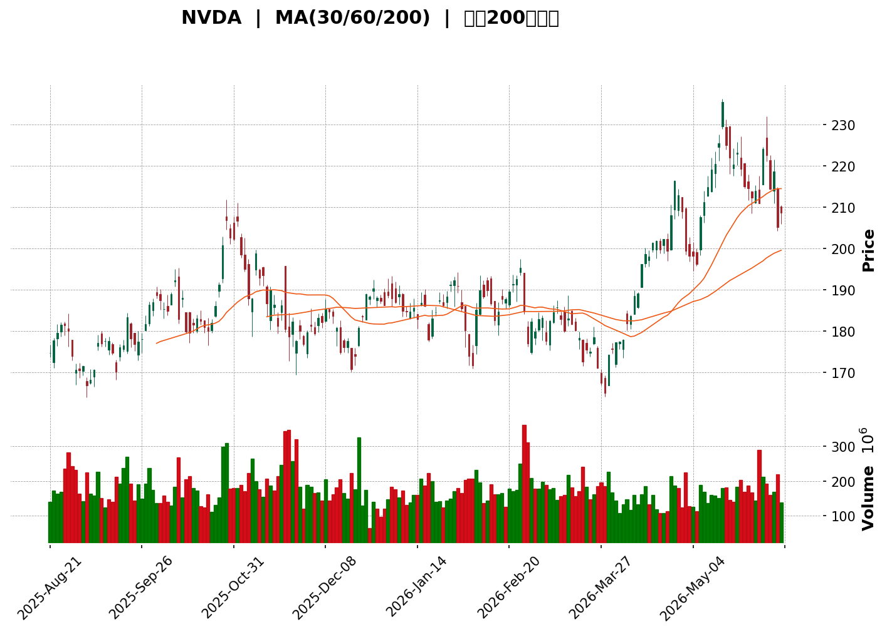
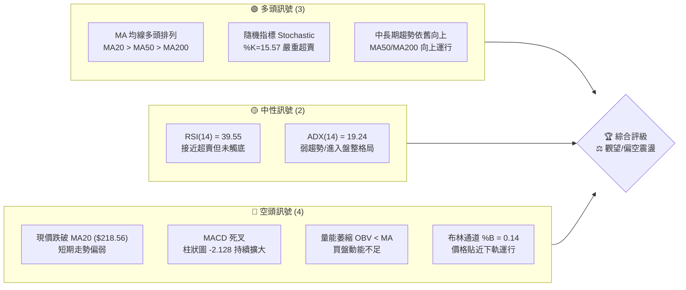
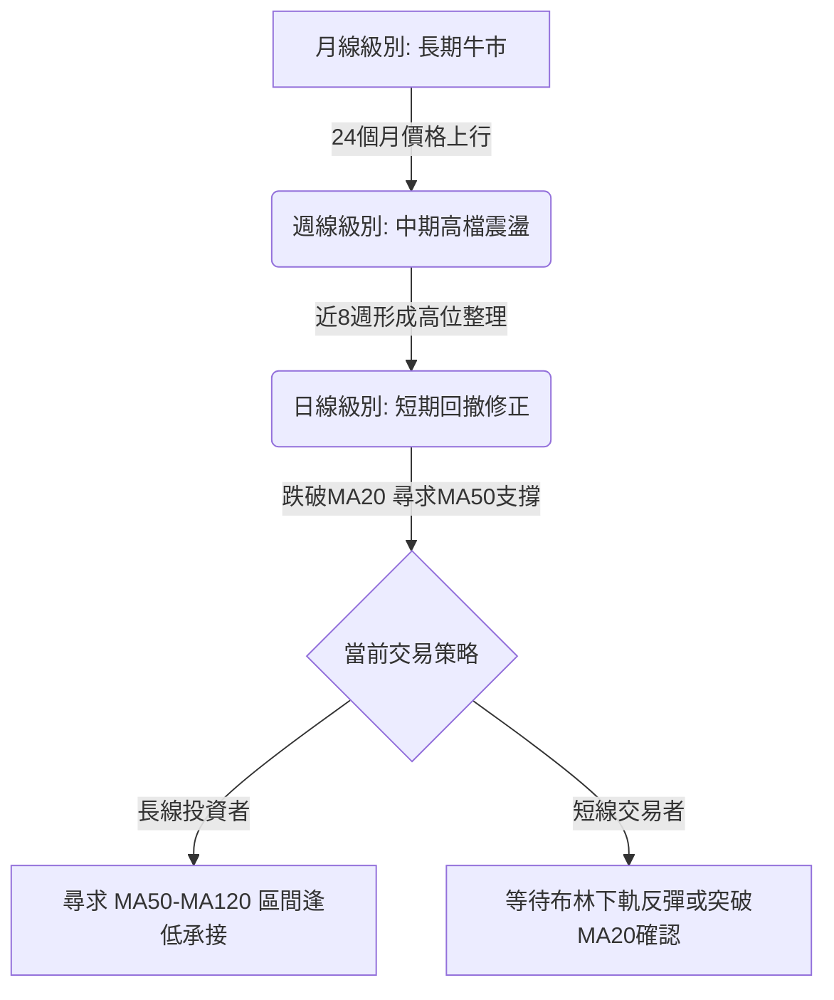
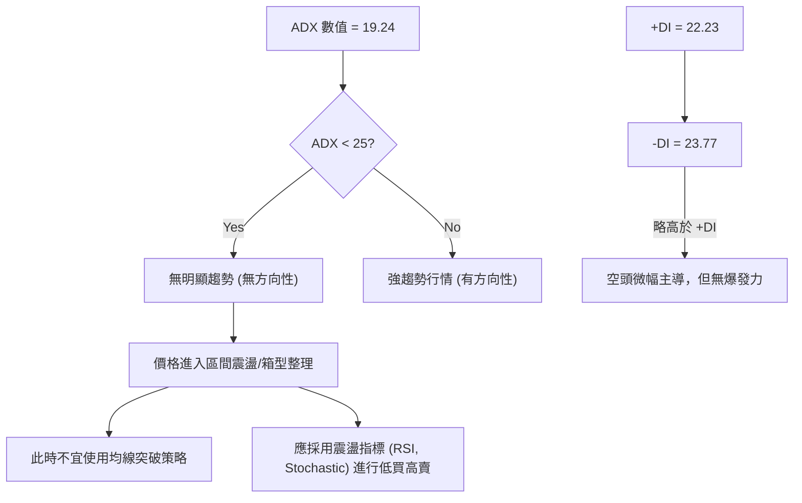
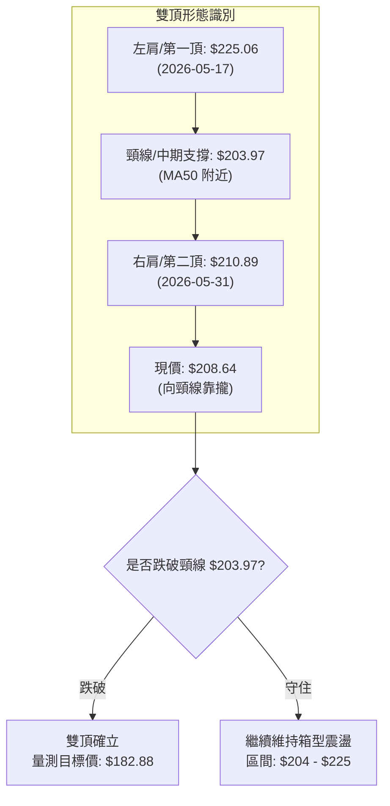

<details>
<summary>📊 靜態圖表 (點擊展開)</summary>

</details>

<html>
<head><meta charset="utf-8" /></head>
<body>
    <div style="height:500px; width:100%;">                        <script>window.PlotlyConfig = {MathJaxConfig: 'local'};</script>
        <script charset="utf-8" src="https://cdn.plot.ly/plotly-3.6.0.min.js" integrity="sha256-QaOVwtVY0T02VaHrr6pnoHLCwayMJp4O5n4YyaE3rJk=" crossorigin="anonymous"></script>                <div id="candlestick-chart" class="plotly-graph-div" style="height:100%; width:100%;"></div>            <script>                window.PLOTLYENV=window.PLOTLYENV || {};                                if (document.getElementById("candlestick-chart")) {                    Plotly.newPlot(                        "candlestick-chart",                        [{"close":{"dtype":"f8","bdata":"AAAAYOnXZUAAAADAGjhmQAAAAEBEcmZAAAAAQOewZkAAAACAeKtmQAAAAIDFfWZAAAAAgFi+ZUAAAADgsFFlQAAAAACUTGVAAAAAYNBtZUAAAAAgiNlkQAAAAIDBAmVAAAAAIA1RZUAAAAAgAyNmQAAAAAA4HmZAAAAA4P0yZkAAAABAwTBmQAAAACAI1WVAAAAAoFZCZUAAAAAgfwBmQAAAAAA9DmZAAAAAIAnsZkAAAACgfEZmQAAAAIDTF2ZAAAAAYNYuZkAAAAAg0T5mQAAAAMDJs2ZAAAAAYPRKZ0AAAABADGBnQAAAAODHlGdAAAAAQDFsZ0AAAACAtylnQAAAAMC8GWdAAAAAwM+bZ0AAAAAAZApoQAAAAICn3WZAAAAAYJCCZ0AAAAAAn3lmQAAAAOA6c2ZAAAAAYIKyZkAAAABgkt9mQAAAAAAJzWZAAAAAQLydZkAAAACAnIFmQAAAAOCxvWZAAAAAILpAZ0AAAADg3+dnQAAAACDEGGlAAAAAQNfYaUAAAADANVRpQAAAACBtR2lAAAAAILrTaUAAAAAg+81oQAAAAGDDXmhAAAAAwOR6Z0AAAACAIX1nQAAAAKB82WhAAAAAID8daEAAAABgszFoQAAAACDnU2dAAAAAILC9Z0AAAAAAmEtnQAAAAKAgpGZAAAAAgAlJZ0AAAADgHY1mQAAAAGDeVGZAAAAAwCjKZkAAAADg\u002fTJmQAAAAOD4gGZAAAAAAMkYZkAAAABAG3ZmQAAAAMBSp2ZAAAAAQI9rZkAAAAAAA+VmQAAAAGACxmZAAAAAAF4qZ0AAAABg1BdnQAAAAMDL8WZAAAAA4LSWZkAAAABA0dllQAAAAGBoAmZAAAAAwBwwZkAAAACgaldlQAAAAACxvWVAAAAA4J+YZkAAAABg6+5mQAAAACBYn2dAAAAA4CqMZ0AAAABgiMlnQAAAAOCzf2dAAAAAIPhpZ0AAAADgukhnQAAAAKDWk2dAAAAAwIF8Z0AAAACgYWBnQAAAAOAlnGdAAAAAIBEaZ0AAAABAUBRnQAAAAODeFmdAAAAAQK0yZ0AAAAAgV91mQAAAAABPWmdAAAAAoBlAZ0AAAABgTDtmQAAAACAY42ZAAAAAoKwTZ0AAAADAH25nQAAAAGDFR2dAAAAAgEqJZ0AAAACgLOlnQAAAAMDQCGhAAAAAoLXcZ0AAAADgSCxnQAAAAIDZg2ZAAAAAIEq\u002fZUAAAACgdXVlQAAAAGDkJWdAAAAAIN+5Z0AAAAAg7olnQAAAAAAxumdAAAAAAMtWZ0AAAABAy9JmQAAAAGDUF2dAAAAAIAh4Z0AAAACgeXVnQAAAAEDXsmdAAAAAICLqZ0AAAADArhNoQAAAAOBLamhAAAAAwEUVZ0AAAABALB9mQAAAACA\u002fyGZAAAAAwJR6ZkAAAAAAJdpmQAAAAKC742ZAAAAA4E4zZkAAAAAArs1mQAAAAABwEWdAAAAAoAc6Z0AAAABgqN1mQAAAAABJgWZAAAAAADfgZkAAAACA+7ZmQAAAAGAUhmZAAAAAoERLZkAAAABg949lQAAAAODv7WVAAAAAgN\u002ffZUAAAACAGk9mQAAAACBNYWVAAAAAQGbqZEAAAACASZ9kQAAAAKBNxmVAAAAAAHTxZUAAAAAg3yVmQAAAAMDcLWZAAAAAwJA8ZkAAAAAAx7tmQAAAAOBE9mZAAAAAICKNZ0AAAAAg3qJnQAAAAOD\u002fiGhAAAAAgG7UaEAAAACgz8NoQAAAACA\u002fLmlAAAAAgGQ6aUAAAADgtvRoQAAAAOB0SGlAAAAAAAvtaEAAAACg4QBqQAAAAGBzC2tAAAAAwH+dakAAAACANCBqQAAAAEDO6mhAAAAA4AHHaEAAAABA98doQAAAAACuiGhAAAAAYNHyaUAAAAAAH2hqQAAAACBi3mpAAAAAwOdla0AAAABAvJBrQAAAAMAlMmxAAAAAAOZubUAAAADA2CFsQAAAAGD1wWtAAAAAQE2La0AAAAAgt+ZrQAAAAIAkaGtAAAAA4IniakAAAAAghNNqQAAAAMBHi2pAAAAAwATAakAAAABgnVxqQAAAAIApA2xAAAAAgPDRa0AAAAAAANBqQAAAAMAeVWtAAAAAQDOjaUAAAADgehRqQA=="},"high":{"dtype":"f8","bdata":"L27uE0UVZkAsSmdWR0tmQLlILJ5gtWZALYiMfrfEZkCYVmmt6cdmQFcjuEUwB2dASyhjfTc9ZkA2xNiw0oRlQJcgMj\u002fIhWVAFJokkjR0ZUBbc60ZxBllQMuDv39xV2VAA+JI+hRYZUAvrKsEpmFmQAIvt6ycgWZA0p5CfOtLZkAwv5kF6VNmQGWmCsnDKGZAklw6AlefZUAIlLVG+xtmQALpOAlNO2ZAaVDg0BMKZ0AXzH8dAcZmQAxXNa2hcWZAsMXi7viAZkDJ8lQDUHFmQKHX6BCA+GZAWWcAN5BjZ0CryMKbz3xnQLyWDBbQ2WdAIVyzyMLDZ0CcFVxdul9nQLi\u002fN602mmdAa8gCw3irZ0CVIxWjo2FoQPtpTrvda2hACAVFUsW7Z0B1IawYERJnQHryjOhNFGdApf45SX3hZkAJxjgxsvtmQFO9OsnZHmdAjcN9HdTRZkB3s11GmuZmQMf44st\u002f2WZAPeJs32VnZ0B89JVtLPhnQKTfDwGFXGlA8hMHY259akCTJcaAt7xpQBef1xCQ9mlAL8lN1UNiakCy4urGuXZpQOvUACwrVWlAd4Ac08iraEDo3dp5kIJnQDYvlzbu9WhABnC9anllaEDghwPRfnRoQPlpcLRG5mdAzDr7m4jYZ0DiDX60S5hnQBRteToREmdATexQxNxzZ0DVPXC3AnhoQASUmJplCmdA4gZDNoXoZkCVJ7aT2z1mQFKu6xiq1WZA+kOWuvhhZkAZPutIQIJmQAaOw0uNLWdAWzP\u002fh\u002fbGZkBZLqZ\u002fcglnQJ47w+vrDWdAjTMb7at4Z0A7a\u002fjjzC9nQFWgASkhKGdARSiX+yujZkD4oMcIHdNmQOcheh58RmZAKZvk8LhIZkCkAP5US\u002f1lQBF11NDu\u002fWVAlPXLiFOnZkCHA0Xv8P1mQIAEcO0to2dApFSPgcGVZ0CMJciRkQ5oQCAtbRz2kGdAeyCwJ1CYZ0CEYwDcfcpnQJqPqig9FmhAohf+w5wsaEBuvYHt8v1nQGRTMTJh5GdAZHC1HjaqZ0AMc9ianUNnQHw+nJ6LXGdAfy4x7C98Z0BlHIRzhwdnQNHXEU4Br2dA7chf\u002fKfGZ0CA447cDMVmQN3uaBHvJGdAYx4mui4+Z0DA8T8dz6tnQPJy7q13nGdANvnl2pe4Z0Bu4ZO3swNoQMuX7FHRJ2hAHg0QOBlIaEB5e3+SLsJnQKuY5\u002fFgQWdA8WCGNY9rZkCdUcvSWBNmQJWAycG1WGdAN5PKH5ItaECSF3VO2wdoQIJYLTfJIGhAYn5tEPkraECzFOHysGhnQIRhwh6BXWdAPz\u002f4JWvEZ0DvSwAWaoZnQLOEIQkkw2dAw4PY7NY2aEA7lrAxFjFoQPFwjbd0rGhAsfYlsbRBaECRCX4cw8tmQKhwZZiR52ZA4ohnZL+VZkCToicvMw9nQNKOl7C++mZA5O8O8zHRZkAA2L1n\u002fdVmQP2wp\u002fXPRmdAu6opttlsZ0A2L5zVMBdnQILyLY7yO2dA9qozxh+VZ0AZwWmo5CVnQOrzzjRU5WZAoC84tad4ZkBMEMDZrUFmQPjbGvcxRWZALfmypXkAZkCUIuYGSqBmQG78YZ6+CWZABcP\u002fuKtYZUBWtCxvFihlQDwY6sZVzWVAtvQgjTslZkDGLtdrESlmQEfSzBGoMmZA4TKkYrhAZkAKqq4sayFnQPvO+OCz+2ZAHYZcD+y4Z0B\u002fUIEJDq5nQAAAAOD\u002fiGhASBnLqFUFaUC2Fd5RwfNoQJJMKc\u002fiLmlASmpxk+g9aUA3pXeBclBpQAAAAOB0SGlAsgq4ivdyaUATNPGQilZqQN5\u002f44Z7EmtAxk6MX1zPakB0QZaoHY9qQB1IsQvEQWpANT78G3BYaUB2HVZB2C9pQI0v+3Q4AGlAsW\u002fJreEAakBhoEega75qQIVlgZR8MWtATZeNmVHBa0Bywhgtqu9rQOIa63RkcmxAMYH23neIbUASrZxQYOdsQEVRwqJut2xAXtjiV\u002f8GbEAtgAGCvDtsQPTcoSFUZGxArbElNRaYa0BQa87WoT1rQLYy33fSvGpAOUBmg5zoakBUrXaKZzNrQN0y64J2E2xA79kRiE4AbUDl0\u002fuJ8NFrQAAAAEAzs2tAAAAAANfbakAAAABguE5qQA=="},"hovertemplate":"\u003cb\u003e%{x|%Y-%m-%d}\u003c\u002fb\u003e\u003cbr\u003e\u958b: $%{open:.2f}\u003cbr\u003e\u9ad8: $%{high:.2f}\u003cbr\u003e\u4f4e: $%{low:.2f}\u003cbr\u003e\u6536: $%{close:.2f}\u003cextra\u003e\u003c\u002fextra\u003e","low":{"dtype":"f8","bdata":"GDLaf4WyZUA\u002fytj7HF9lQEGbvI25CmZAaVrRIE9SZkCQa5G9k1tmQBrb\u002f5ecBWZAVAhC+W2dZUBLp3gq7N9kQA88SvX4FGVAlr784+glZUCM3DLkQXtkQEIu6rUT5GRA7tEoLpXQZECEiWhEkudlQLv2GbMqCGZAdXLvCzUHZkAje+PuNMllQJB7rlcNxWVA+lkyXkEGZUC0HMCZq5dlQGX6f2ye3mVASJ50P5nPZUCMfT+qif9lQNeTNWKm5WVA7x3vdBqdZUAetXskodZlQC2o8\u002fbjgmZAW0o3WPanZkAGcn26TfVmQFJ9KClBemdAnmqfn5okZ0DDobpPFuNmQGjpK\u002fp\u002f+GZA3P50Ea1JZ0DrB9jBIdpnQB9KLPUtumZAyPlt4CM3Z0DGMp4RE29mQLvWLqENImZAAKBgCVBxZkCLb39VrHBmQMY3+77zr2ZANwg8UUVyZkA18lZbHRFmQGPJRHvzcWZAkqdrDYXoZkBjk5suFIZnQHN5XElM9WdAu88D9ZyQaUColooR6SRpQF2o+eEAOmlAwVRZZoqpaUB6t00OsbVoQBDZ+5fdTGhA1dBTHZBEZ0BuxCTq01VmQLDoyoJhMWhAXmy7aM3hZ0BT2lacXtxnQDHAQam082ZAtoxQ8zKLZkB0x\u002fEKugJnQOZUEBh6bWZAam2FgRvTZkCUcmF+3nNmQDliuva1lmVA4QjilioIZkANyQdNsCplQG6XFDRqQGZAcgGvN84IZkC1GYA8rq5lQM54Y5ypeGZAbQI6IjhcZkD1dA2BtHdmQOyCKFgRlmZAI7kuj7DFZkAC4z8XGONmQLcoNP0uumZAat0uY\u002fQMZkAShe5dCM1lQAZb6BIj2mVATFYwZPvVZUBGlXzpR0NlQNhMKMeKc2VAwTIEaAEEZkA4P1d\u002fF8RmQPJhw3ir1WZAmLqnKJtLZ0DtVXTfq3hnQCB9k23fNWdAh6taFnlWZ0AIZIgZaUhnQAGVVCP7gGdAESqdKIs9Z0BMrfQw9VJnQFW9t7KlSmdAp\u002fWWJY\u002fvZkBggkSgR+5mQAWPKWmB2WZAvHLTjKblZkCwpHM6jZJmQAx4Yu9LQ2dAHWwzX047Z0DDvkCXmCxmQCkn9HjYRWZAVQXa9Jb2ZkAfp4ob9VJnQAG7RApuOGdALzGSJCkvZ0ApM\u002fPDerNnQN\u002fy5b2qOmdAB+PhcKenZ0AUqekI9BRnQMR4TmR9AGZAgzL8IGt2ZUCm8q3bSlplQMrJ\u002fsFkzGVAaoZlpjr3ZkDZpfiwgXxnQJCaHQZIkWdAWxOGqgxJZ0CJK6AszatmQBc8xWfGXmZANMHjDApRZ0Cvo4z64S1nQLeKJPjUNmdAzPOriCurZ0DYmRejfmVnQM4wAKq5MWhAx00zEA4DZ0AXf1LVSAVmQMCamByszWVAABCu\u002fIoWZkDFSA6d5npmQGlgzNw5NWZA42Xa2lgTZkCjZCCBE+tlQJx8\u002f4o5uWZA9L9vUYcHZ0ALNHDBOrFmQGC01HRgd2ZAjszBwlymZkDPO1ji\u002fa5mQNKu36rXg2ZAqryuKrvyZUBd\u002f5KYpHBlQPQHaETP0WVAKe+V4uC4ZUC+sayznBRmQJIPJdQaXmVAxwkqHRnaZEBxKytVhYJkQDAUIDOA2GRA4zFJiX3RZUC9BYOpdGVlQG6A563F8WVAkU3jl6auZUDXDIM54oJmQIIiH4AcjWZA0pkNC7wCZ0DWH63LwjBnQN7NKJ2I0WdAXi5JeWNwaEBkWzsZoHJoQIBwxns34WhAYpDEfoKzaED\u002fLVxElthoQDrRoUCW2GhA\u002fMISdLGfaEDum6buefJoQN5RIEZv5GlAjvNb5aT+aUCiowPN0+ppQIYVDWz\u002fzmhAo971Ln+caEDoYfHqbFBoQOd1ezuoeWhAQ7GGDR\u002fMaEDQL+euTshpQEhOfKeMlGpApZrbDYO0akDD3H0Cb9VqQNwzGYD8qWtAOMcx6g6hbEAOdaOsU\u002f9rQJ4KNIu0Q2tAeU61nwA1a0AbVs4yyYdrQEptXDGkNWtACavpLZnRakCz\u002fTNGGnhqQHfaIq4uEWpAnM935StfakBAS2aYS1xqQEZjNFZd7mpA7qDoRPSia0CBSvIpVMhqQAAAAEAKX2pAAAAAYI+KaUAAAAAAAMBpQA=="},"name":"\u50f9\u683c","open":{"dtype":"f8","bdata":"mTOf6sHTZUB8JNNeLIxlQL5\u002fjOibQ2ZAkW3+gUF6ZkD37Qs8nbdmQKIF40qLkmZAEJrzTPA7ZkClh8afwzhlQMyyt7SjWmVAl2FbAPtKZUA4e+b+zvlkQL\u002f3BOh36mRAS0igsq4bZUC+Ab0k9gxmQBJPbK9vbmZALNiUxWQxZkBLYjiUR+5lQPYhuQDJGGZASQQ0WnGNZUDUjBa1RLhlQDm7TaR58WVAbKpWV3TiZUDgcZNvn7dmQFCE6OdPcWZAgU3Cfj\u002fIZUAAAnB1LT5mQNlUKNFnhmZAd0daVSO7ZkBOM8oeISBnQByOYdd4q2dAF28VXl6eZ0BsWdZKcChnQCOGGtXEP2dAZzlHoaJKZ0AGzk4shv9nQDsMzp9uKGhAJ7r+xmB3Z0Ad1tCoGxFnQJGghUMREmdAgg8Snu6\u002fZkAoF9lYan5mQLkqAAOy3GZAjcN9HdTRZkAUJZimGJ1mQNx9ROgVhmZA\u002f8sbwWLzZkAX1CSH77dnQEXqMES7GWhApT4E8eH2aUAYLtUKcJxpQFloWg38xWlAJxFB+hP6aUBMLTKmuVdpQAmlCrqJ0GhAvHbA+G6FaEAWxH9pQxVnQAuluTyRW2hAPG9HQSpdaEAu0SD3D29oQFtuVObP2WdAwjVi6BDUZkDuvgmTdTdnQKJE0Wuv5GZA5PySTb8RZ0DkIASdaXZoQHc4jN9KoGZAXz01Ll1oZkCoYfl9\u002fdVlQHkFPLTBrGZArgiR5gVZZkA6tpBXMtFlQOIqlh7psGZAoG+00y2bZkCsz0mQwqxmQGO38rpP9WZAPjUNSlzNZkDwk7u8rypnQGyL5F\u002fUF2dASMeanO6BZkCQfnS5dZxmQJ\u002fXuMgkN2ZAj\u002fHV8XIBZkD3daHhVfxlQHdfn\u002fsnymVAf1rqfI0OZkAixGs0RfZmQGG96EXo12ZA3bSx78B2Z0CLdWJWCbZnQN\u002fG7hZnb2dAOgCyo1eAZ0CJWBy92apnQARK0756s2dAjdkqTdjwZ0DdZbGkNslnQPmHkaPjimdA1K+9AiacZ0BZh+5NWBtnQM8ZN8rl32ZABxpM1ckYZ0CjQDP5DQNnQKJFF926SGdAnCPfbjCbZ0AsUOtmtbVmQDABZ9yeWmZAwYvrRcwQZ0A57k7SsGhnQCSWN\u002f3SXWdAMfclhmFgZ0C8Fa4eL+FnQBnGAs1r42dAm6udM0TfZ0CeZw1CGl9nQEnOi35rQGdA0DwXaLlnZkBzFZev8NZlQEegWiYxD2ZAWHFuDiMBZ0AF8Jsos+RnQOP8iszlBmhA1H0iem8ZaECiePtFDWhnQF8sKELqsGZACRjGUKSQZ0BivfTBoFpnQD26r673SmdAbbQ4v1blZ0BJTWEyN+hnQGZg09PRRmhAejc3JBFBaEDvB9E776BmQEWLYWt\u002f2WVAkaKN0bhIZkCX5D\u002fSC4dmQALXwadgnmZApoo5d95zZkDXL5e0qhNmQJ2ZqoawxWZAZyX1xDE2Z0D\u002f92JyvvpmQDWsnxaNFmdAnI1TYjnYZkAwEHmmBhtnQGk2B+qPyGZAsLrGPrA5ZkCqEoF0XjlmQPZWA223IWZA5idUBwzUZUBAAVVRmhxmQPnbhXCu+2VA4881uao5ZUA+6tkyrBJlQNnSufrR2GRAh7OtnXH5ZUCIbfJvWH9lQCWC4DOFHmZAMbQtOtDwZUAtqA6MIAlnQH1Qph0btGZAGC2n0g0DZ0DD6bGnBzpnQONJSVLF02dAM89DWPWJaEA3BSSmZ6ZoQOX1tVla9WhAT\u002f0k9uj3aEC7ehBroTxpQPaPYmYxGGlAOtJcmy1HaUDVWmlgRfdoQNzkK2D9LGpAeV8JWOAnakAwh2z5eY5qQH8FCnPwNWpAmyUPQ3YhaUBg1bllkehoQFwb8uss4mhAkRKQmAj1aEADjcViHgNqQCcfszEGmWpASBqpX065akDkq0RkdUlrQBqlOnVhFWxACRl0S6OybEA3K4nIwq9sQEgoJOBGs2xAxc\u002f5kKhra0CkAAMkct1rQGAtAr3\u002fwGtALYGyIZKUa0Czs5WaNglrQM5THAHdu2pAMEn90hZhakDDYOwRkcpqQGh998xS72pA1+Rj60tdbEBPaIbHx65rQAAAAMAevWpAAAAAwPXQakAAAACAwkVqQA=="},"x":["2025-08-21T00:00:00-04:00","2025-08-22T00:00:00-04:00","2025-08-25T00:00:00-04:00","2025-08-26T00:00:00-04:00","2025-08-27T00:00:00-04:00","2025-08-28T00:00:00-04:00","2025-08-29T00:00:00-04:00","2025-09-02T00:00:00-04:00","2025-09-03T00:00:00-04:00","2025-09-04T00:00:00-04:00","2025-09-05T00:00:00-04:00","2025-09-08T00:00:00-04:00","2025-09-09T00:00:00-04:00","2025-09-10T00:00:00-04:00","2025-09-11T00:00:00-04:00","2025-09-12T00:00:00-04:00","2025-09-15T00:00:00-04:00","2025-09-16T00:00:00-04:00","2025-09-17T00:00:00-04:00","2025-09-18T00:00:00-04:00","2025-09-19T00:00:00-04:00","2025-09-22T00:00:00-04:00","2025-09-23T00:00:00-04:00","2025-09-24T00:00:00-04:00","2025-09-25T00:00:00-04:00","2025-09-26T00:00:00-04:00","2025-09-29T00:00:00-04:00","2025-09-30T00:00:00-04:00","2025-10-01T00:00:00-04:00","2025-10-02T00:00:00-04:00","2025-10-03T00:00:00-04:00","2025-10-06T00:00:00-04:00","2025-10-07T00:00:00-04:00","2025-10-08T00:00:00-04:00","2025-10-09T00:00:00-04:00","2025-10-10T00:00:00-04:00","2025-10-13T00:00:00-04:00","2025-10-14T00:00:00-04:00","2025-10-15T00:00:00-04:00","2025-10-16T00:00:00-04:00","2025-10-17T00:00:00-04:00","2025-10-20T00:00:00-04:00","2025-10-21T00:00:00-04:00","2025-10-22T00:00:00-04:00","2025-10-23T00:00:00-04:00","2025-10-24T00:00:00-04:00","2025-10-27T00:00:00-04:00","2025-10-28T00:00:00-04:00","2025-10-29T00:00:00-04:00","2025-10-30T00:00:00-04:00","2025-10-31T00:00:00-04:00","2025-11-03T00:00:00-05:00","2025-11-04T00:00:00-05:00","2025-11-05T00:00:00-05:00","2025-11-06T00:00:00-05:00","2025-11-07T00:00:00-05:00","2025-11-10T00:00:00-05:00","2025-11-11T00:00:00-05:00","2025-11-12T00:00:00-05:00","2025-11-13T00:00:00-05:00","2025-11-14T00:00:00-05:00","2025-11-17T00:00:00-05:00","2025-11-18T00:00:00-05:00","2025-11-19T00:00:00-05:00","2025-11-20T00:00:00-05:00","2025-11-21T00:00:00-05:00","2025-11-24T00:00:00-05:00","2025-11-25T00:00:00-05:00","2025-11-26T00:00:00-05:00","2025-11-28T00:00:00-05:00","2025-12-01T00:00:00-05:00","2025-12-02T00:00:00-05:00","2025-12-03T00:00:00-05:00","2025-12-04T00:00:00-05:00","2025-12-05T00:00:00-05:00","2025-12-08T00:00:00-05:00","2025-12-09T00:00:00-05:00","2025-12-10T00:00:00-05:00","2025-12-11T00:00:00-05:00","2025-12-12T00:00:00-05:00","2025-12-15T00:00:00-05:00","2025-12-16T00:00:00-05:00","2025-12-17T00:00:00-05:00","2025-12-18T00:00:00-05:00","2025-12-19T00:00:00-05:00","2025-12-22T00:00:00-05:00","2025-12-23T00:00:00-05:00","2025-12-24T00:00:00-05:00","2025-12-26T00:00:00-05:00","2025-12-29T00:00:00-05:00","2025-12-30T00:00:00-05:00","2025-12-31T00:00:00-05:00","2026-01-02T00:00:00-05:00","2026-01-05T00:00:00-05:00","2026-01-06T00:00:00-05:00","2026-01-07T00:00:00-05:00","2026-01-08T00:00:00-05:00","2026-01-09T00:00:00-05:00","2026-01-12T00:00:00-05:00","2026-01-13T00:00:00-05:00","2026-01-14T00:00:00-05:00","2026-01-15T00:00:00-05:00","2026-01-16T00:00:00-05:00","2026-01-20T00:00:00-05:00","2026-01-21T00:00:00-05:00","2026-01-22T00:00:00-05:00","2026-01-23T00:00:00-05:00","2026-01-26T00:00:00-05:00","2026-01-27T00:00:00-05:00","2026-01-28T00:00:00-05:00","2026-01-29T00:00:00-05:00","2026-01-30T00:00:00-05:00","2026-02-02T00:00:00-05:00","2026-02-03T00:00:00-05:00","2026-02-04T00:00:00-05:00","2026-02-05T00:00:00-05:00","2026-02-06T00:00:00-05:00","2026-02-09T00:00:00-05:00","2026-02-10T00:00:00-05:00","2026-02-11T00:00:00-05:00","2026-02-12T00:00:00-05:00","2026-02-13T00:00:00-05:00","2026-02-17T00:00:00-05:00","2026-02-18T00:00:00-05:00","2026-02-19T00:00:00-05:00","2026-02-20T00:00:00-05:00","2026-02-23T00:00:00-05:00","2026-02-24T00:00:00-05:00","2026-02-25T00:00:00-05:00","2026-02-26T00:00:00-05:00","2026-02-27T00:00:00-05:00","2026-03-02T00:00:00-05:00","2026-03-03T00:00:00-05:00","2026-03-04T00:00:00-05:00","2026-03-05T00:00:00-05:00","2026-03-06T00:00:00-05:00","2026-03-09T00:00:00-04:00","2026-03-10T00:00:00-04:00","2026-03-11T00:00:00-04:00","2026-03-12T00:00:00-04:00","2026-03-13T00:00:00-04:00","2026-03-16T00:00:00-04:00","2026-03-17T00:00:00-04:00","2026-03-18T00:00:00-04:00","2026-03-19T00:00:00-04:00","2026-03-20T00:00:00-04:00","2026-03-23T00:00:00-04:00","2026-03-24T00:00:00-04:00","2026-03-25T00:00:00-04:00","2026-03-26T00:00:00-04:00","2026-03-27T00:00:00-04:00","2026-03-30T00:00:00-04:00","2026-03-31T00:00:00-04:00","2026-04-01T00:00:00-04:00","2026-04-02T00:00:00-04:00","2026-04-06T00:00:00-04:00","2026-04-07T00:00:00-04:00","2026-04-08T00:00:00-04:00","2026-04-09T00:00:00-04:00","2026-04-10T00:00:00-04:00","2026-04-13T00:00:00-04:00","2026-04-14T00:00:00-04:00","2026-04-15T00:00:00-04:00","2026-04-16T00:00:00-04:00","2026-04-17T00:00:00-04:00","2026-04-20T00:00:00-04:00","2026-04-21T00:00:00-04:00","2026-04-22T00:00:00-04:00","2026-04-23T00:00:00-04:00","2026-04-24T00:00:00-04:00","2026-04-27T00:00:00-04:00","2026-04-28T00:00:00-04:00","2026-04-29T00:00:00-04:00","2026-04-30T00:00:00-04:00","2026-05-01T00:00:00-04:00","2026-05-04T00:00:00-04:00","2026-05-05T00:00:00-04:00","2026-05-06T00:00:00-04:00","2026-05-07T00:00:00-04:00","2026-05-08T00:00:00-04:00","2026-05-11T00:00:00-04:00","2026-05-12T00:00:00-04:00","2026-05-13T00:00:00-04:00","2026-05-14T00:00:00-04:00","2026-05-15T00:00:00-04:00","2026-05-18T00:00:00-04:00","2026-05-19T00:00:00-04:00","2026-05-20T00:00:00-04:00","2026-05-21T00:00:00-04:00","2026-05-22T00:00:00-04:00","2026-05-26T00:00:00-04:00","2026-05-27T00:00:00-04:00","2026-05-28T00:00:00-04:00","2026-05-29T00:00:00-04:00","2026-06-01T00:00:00-04:00","2026-06-02T00:00:00-04:00","2026-06-03T00:00:00-04:00","2026-06-04T00:00:00-04:00","2026-06-05T00:00:00-04:00","2026-06-08T00:00:00-04:00"],"type":"candlestick"},{"hovertemplate":"MA30: $%{y:.2f}\u003cextra\u003e\u003c\u002fextra\u003e","line":{"color":"#2196F3","dash":"dash","width":2},"mode":"lines","name":"MA30","x":["2025-08-21T00:00:00-04:00","2025-08-22T00:00:00-04:00","2025-08-25T00:00:00-04:00","2025-08-26T00:00:00-04:00","2025-08-27T00:00:00-04:00","2025-08-28T00:00:00-04:00","2025-08-29T00:00:00-04:00","2025-09-02T00:00:00-04:00","2025-09-03T00:00:00-04:00","2025-09-04T00:00:00-04:00","2025-09-05T00:00:00-04:00","2025-09-08T00:00:00-04:00","2025-09-09T00:00:00-04:00","2025-09-10T00:00:00-04:00","2025-09-11T00:00:00-04:00","2025-09-12T00:00:00-04:00","2025-09-15T00:00:00-04:00","2025-09-16T00:00:00-04:00","2025-09-17T00:00:00-04:00","2025-09-18T00:00:00-04:00","2025-09-19T00:00:00-04:00","2025-09-22T00:00:00-04:00","2025-09-23T00:00:00-04:00","2025-09-24T00:00:00-04:00","2025-09-25T00:00:00-04:00","2025-09-26T00:00:00-04:00","2025-09-29T00:00:00-04:00","2025-09-30T00:00:00-04:00","2025-10-01T00:00:00-04:00","2025-10-02T00:00:00-04:00","2025-10-03T00:00:00-04:00","2025-10-06T00:00:00-04:00","2025-10-07T00:00:00-04:00","2025-10-08T00:00:00-04:00","2025-10-09T00:00:00-04:00","2025-10-10T00:00:00-04:00","2025-10-13T00:00:00-04:00","2025-10-14T00:00:00-04:00","2025-10-15T00:00:00-04:00","2025-10-16T00:00:00-04:00","2025-10-17T00:00:00-04:00","2025-10-20T00:00:00-04:00","2025-10-21T00:00:00-04:00","2025-10-22T00:00:00-04:00","2025-10-23T00:00:00-04:00","2025-10-24T00:00:00-04:00","2025-10-27T00:00:00-04:00","2025-10-28T00:00:00-04:00","2025-10-29T00:00:00-04:00","2025-10-30T00:00:00-04:00","2025-10-31T00:00:00-04:00","2025-11-03T00:00:00-05:00","2025-11-04T00:00:00-05:00","2025-11-05T00:00:00-05:00","2025-11-06T00:00:00-05:00","2025-11-07T00:00:00-05:00","2025-11-10T00:00:00-05:00","2025-11-11T00:00:00-05:00","2025-11-12T00:00:00-05:00","2025-11-13T00:00:00-05:00","2025-11-14T00:00:00-05:00","2025-11-17T00:00:00-05:00","2025-11-18T00:00:00-05:00","2025-11-19T00:00:00-05:00","2025-11-20T00:00:00-05:00","2025-11-21T00:00:00-05:00","2025-11-24T00:00:00-05:00","2025-11-25T00:00:00-05:00","2025-11-26T00:00:00-05:00","2025-11-28T00:00:00-05:00","2025-12-01T00:00:00-05:00","2025-12-02T00:00:00-05:00","2025-12-03T00:00:00-05:00","2025-12-04T00:00:00-05:00","2025-12-05T00:00:00-05:00","2025-12-08T00:00:00-05:00","2025-12-09T00:00:00-05:00","2025-12-10T00:00:00-05:00","2025-12-11T00:00:00-05:00","2025-12-12T00:00:00-05:00","2025-12-15T00:00:00-05:00","2025-12-16T00:00:00-05:00","2025-12-17T00:00:00-05:00","2025-12-18T00:00:00-05:00","2025-12-19T00:00:00-05:00","2025-12-22T00:00:00-05:00","2025-12-23T00:00:00-05:00","2025-12-24T00:00:00-05:00","2025-12-26T00:00:00-05:00","2025-12-29T00:00:00-05:00","2025-12-30T00:00:00-05:00","2025-12-31T00:00:00-05:00","2026-01-02T00:00:00-05:00","2026-01-05T00:00:00-05:00","2026-01-06T00:00:00-05:00","2026-01-07T00:00:00-05:00","2026-01-08T00:00:00-05:00","2026-01-09T00:00:00-05:00","2026-01-12T00:00:00-05:00","2026-01-13T00:00:00-05:00","2026-01-14T00:00:00-05:00","2026-01-15T00:00:00-05:00","2026-01-16T00:00:00-05:00","2026-01-20T00:00:00-05:00","2026-01-21T00:00:00-05:00","2026-01-22T00:00:00-05:00","2026-01-23T00:00:00-05:00","2026-01-26T00:00:00-05:00","2026-01-27T00:00:00-05:00","2026-01-28T00:00:00-05:00","2026-01-29T00:00:00-05:00","2026-01-30T00:00:00-05:00","2026-02-02T00:00:00-05:00","2026-02-03T00:00:00-05:00","2026-02-04T00:00:00-05:00","2026-02-05T00:00:00-05:00","2026-02-06T00:00:00-05:00","2026-02-09T00:00:00-05:00","2026-02-10T00:00:00-05:00","2026-02-11T00:00:00-05:00","2026-02-12T00:00:00-05:00","2026-02-13T00:00:00-05:00","2026-02-17T00:00:00-05:00","2026-02-18T00:00:00-05:00","2026-02-19T00:00:00-05:00","2026-02-20T00:00:00-05:00","2026-02-23T00:00:00-05:00","2026-02-24T00:00:00-05:00","2026-02-25T00:00:00-05:00","2026-02-26T00:00:00-05:00","2026-02-27T00:00:00-05:00","2026-03-02T00:00:00-05:00","2026-03-03T00:00:00-05:00","2026-03-04T00:00:00-05:00","2026-03-05T00:00:00-05:00","2026-03-06T00:00:00-05:00","2026-03-09T00:00:00-04:00","2026-03-10T00:00:00-04:00","2026-03-11T00:00:00-04:00","2026-03-12T00:00:00-04:00","2026-03-13T00:00:00-04:00","2026-03-16T00:00:00-04:00","2026-03-17T00:00:00-04:00","2026-03-18T00:00:00-04:00","2026-03-19T00:00:00-04:00","2026-03-20T00:00:00-04:00","2026-03-23T00:00:00-04:00","2026-03-24T00:00:00-04:00","2026-03-25T00:00:00-04:00","2026-03-26T00:00:00-04:00","2026-03-27T00:00:00-04:00","2026-03-30T00:00:00-04:00","2026-03-31T00:00:00-04:00","2026-04-01T00:00:00-04:00","2026-04-02T00:00:00-04:00","2026-04-06T00:00:00-04:00","2026-04-07T00:00:00-04:00","2026-04-08T00:00:00-04:00","2026-04-09T00:00:00-04:00","2026-04-10T00:00:00-04:00","2026-04-13T00:00:00-04:00","2026-04-14T00:00:00-04:00","2026-04-15T00:00:00-04:00","2026-04-16T00:00:00-04:00","2026-04-17T00:00:00-04:00","2026-04-20T00:00:00-04:00","2026-04-21T00:00:00-04:00","2026-04-22T00:00:00-04:00","2026-04-23T00:00:00-04:00","2026-04-24T00:00:00-04:00","2026-04-27T00:00:00-04:00","2026-04-28T00:00:00-04:00","2026-04-29T00:00:00-04:00","2026-04-30T00:00:00-04:00","2026-05-01T00:00:00-04:00","2026-05-04T00:00:00-04:00","2026-05-05T00:00:00-04:00","2026-05-06T00:00:00-04:00","2026-05-07T00:00:00-04:00","2026-05-08T00:00:00-04:00","2026-05-11T00:00:00-04:00","2026-05-12T00:00:00-04:00","2026-05-13T00:00:00-04:00","2026-05-14T00:00:00-04:00","2026-05-15T00:00:00-04:00","2026-05-18T00:00:00-04:00","2026-05-19T00:00:00-04:00","2026-05-20T00:00:00-04:00","2026-05-21T00:00:00-04:00","2026-05-22T00:00:00-04:00","2026-05-26T00:00:00-04:00","2026-05-27T00:00:00-04:00","2026-05-28T00:00:00-04:00","2026-05-29T00:00:00-04:00","2026-06-01T00:00:00-04:00","2026-06-02T00:00:00-04:00","2026-06-03T00:00:00-04:00","2026-06-04T00:00:00-04:00","2026-06-05T00:00:00-04:00","2026-06-08T00:00:00-04:00"],"y":{"dtype":"f8","bdata":"AAAAAAAA+H8AAAAAAAD4fwAAAAAAAPh\u002fAAAAAAAA+H8AAAAAAAD4fwAAAAAAAPh\u002fAAAAAAAA+H8AAAAAAAD4fwAAAAAAAPh\u002fAAAAAAAA+H8AAAAAAAD4fwAAAAAAAPh\u002fAAAAAAAA+H8AAAAAAAD4fwAAAAAAAPh\u002fAAAAAAAA+H8AAAAAAAD4fwAAAAAAAPh\u002fAAAAAAAA+H8AAAAAAAD4fwAAAAAAAPh\u002fAAAAAAAA+H8AAAAAAAD4fwAAAAAAAPh\u002fAAAAAAAA+H8AAAAAAAD4fwAAAAAAAPh\u002fAAAAAAAA+H8AAAAAAAD4f7y7u5tcIGZAiYiIeNYtZkCrqqo65DVmQAAAAFB5O2ZAzczM3E1DZkARERFhAE9mQERERJQyUmZAIiIigkVhZkB3d3fHImtmQERERCT1dGZAAAAA4Md\u002fZkC8u7t7DJFmQCIiIiJToGZAmpmZCWqrZkCJiIhIka5mQFVVVSXis2ZAMzMz49+8ZkCrqqoKg8tmQERERKRe52ZAAAAAEIUOZ0BEREQE6SpnQO\u002fu7p5qRmdAmpmZyTRfZ0AiIiISynRnQHd3d3c4iGdAMzMzA0qTZ0CrqqpK5p1nQN7d3Q05sGdAvLu7izu3Z0BVVVWVOL5nQFVVVfUOvGdAMzMzY8a+Z0CJiIh4579nQN7d3d37u2dAZmZmhjm5Z0DNzMz8g6xnQAAAAMD0p2dAmpmZKc+hZ0BVVVV1dJ9nQJqZmbnpn2dAIiIi8smaZ0CamZn5RZdnQKuqqioElmdAAAAAAFiUZ0B3d3c3qJdnQKuqqirvl2dAzczMXDCXZ0C8u7sLQZBnQO\u002fu7m7jfWdAzczMfBViZ0CJiIh4Z0RnQJqZmemAKGdAIiIiInMJZ0CJiIjI5etmQM3MzDx21WZAiYiIaOvNZkDv7u7eLclmQAAAADC1vmZA3t3dLd+5ZkB3d3dHZrZmQJqZmQnct2ZAMzMzoxG1ZkAzMzMz+bRmQLy7u7v2vGZAERER8a2+ZkC8u7u7uMVmQERERISh0GZAVVVVZUvTZkBEREQkztpmQGZmZkbN32ZAAAAAwDLpZkDe3d2to+xmQFVVVQWb8mZAMzMzs7D5ZkCrqqp6CPRmQLy7u6sA9WZAZmZmBj\u002f0ZkB3d3dnH\u002fdmQO\u002fu7g79+WZAzczMHBMCZ0CamZk5pxNnQImIiPjuJGdAVVVVVTgzZ0B3d3dX2UJnQKuqqkp0SWdAMzMzszVCZ0BVVVW1oDVnQBEREVGUMWdAMzMzUxozZ0BVVVWV+zBnQAAAALDuMmdAzczMDEsyZ0CamZmpXC5nQERERHQ6KmdARERERBQqZ0BEREREyCpnQJqZmemJK2dAmpmZaXkyZ0AAAACQ\u002fDpnQO\u002fu7v5MRmdAREREFFJFZ0ARERFR+z5nQLy7u+scOmdAzczMbIczZ0CamZnp0jhnQM3MzFzYOGdAVVVVxV0xZ0BVVVWlBCxnQAAAAAA1KmdAMzMzo5AnZ0BERETUpR5nQFVVVcWYEWdAZmZmJi4JZ0C8u7srRQVnQDMzMzNYBWdA7+7urgIKZ0AAAADg5ApnQLy7u9t+AGdAIiIiErLwZkDNzMyMM+ZmQERERPQr0mZA3t3d7X29ZkBmZmZWtapmQM3MzBx1n2ZAzczMLHCSZkC8u7tbQIdmQDMzMxNJemZA3t3dbfdrZkBVVVXFgGBmQDMzMyMaVGZAMzMz8xhYZkB3d3dHBWVmQDMzM6P6c2ZA3t3dbQqIZkCrqqrqXJhmQFVVVdXpq2ZAMzMz47\u002fFZkDNzMwMHthmQM3MzJwE62ZAmpmZuYT5ZkBmZmbmShRnQLy7uwsIO2dA7+7u3vBaZ0Dv7u5eDHhnQHd3d\u002fd4jGdAERER8amhZ0B3d3dnIb1nQBEREfFa02dAzczMvB72Z0CrqqpaFhloQDMzM2PsR2hAERERgT1\u002faEAAAAAQfbpoQImIiIhI8WhAvLu7uzIxaUBmZmaWQ2RpQCIiIgLek2lA7+7ujijBaUARERGhQe1pQLy7u3svE2pAAAAA4KEvakC8u7ub2kpqQDMzMyP\u002fW2pAMzMzA2JsakCJiIh4AnpqQKuqqmoskmpA7+7urkqoakBERER0IrhqQFVVVZWfyWpA3t3d\u002fbHPakC8u7s7WdBqQA=="},"type":"scatter"},{"hovertemplate":"MA60: $%{y:.2f}\u003cextra\u003e\u003c\u002fextra\u003e","line":{"color":"#9C27B0","dash":"dash","width":2},"mode":"lines","name":"MA60","x":["2025-08-21T00:00:00-04:00","2025-08-22T00:00:00-04:00","2025-08-25T00:00:00-04:00","2025-08-26T00:00:00-04:00","2025-08-27T00:00:00-04:00","2025-08-28T00:00:00-04:00","2025-08-29T00:00:00-04:00","2025-09-02T00:00:00-04:00","2025-09-03T00:00:00-04:00","2025-09-04T00:00:00-04:00","2025-09-05T00:00:00-04:00","2025-09-08T00:00:00-04:00","2025-09-09T00:00:00-04:00","2025-09-10T00:00:00-04:00","2025-09-11T00:00:00-04:00","2025-09-12T00:00:00-04:00","2025-09-15T00:00:00-04:00","2025-09-16T00:00:00-04:00","2025-09-17T00:00:00-04:00","2025-09-18T00:00:00-04:00","2025-09-19T00:00:00-04:00","2025-09-22T00:00:00-04:00","2025-09-23T00:00:00-04:00","2025-09-24T00:00:00-04:00","2025-09-25T00:00:00-04:00","2025-09-26T00:00:00-04:00","2025-09-29T00:00:00-04:00","2025-09-30T00:00:00-04:00","2025-10-01T00:00:00-04:00","2025-10-02T00:00:00-04:00","2025-10-03T00:00:00-04:00","2025-10-06T00:00:00-04:00","2025-10-07T00:00:00-04:00","2025-10-08T00:00:00-04:00","2025-10-09T00:00:00-04:00","2025-10-10T00:00:00-04:00","2025-10-13T00:00:00-04:00","2025-10-14T00:00:00-04:00","2025-10-15T00:00:00-04:00","2025-10-16T00:00:00-04:00","2025-10-17T00:00:00-04:00","2025-10-20T00:00:00-04:00","2025-10-21T00:00:00-04:00","2025-10-22T00:00:00-04:00","2025-10-23T00:00:00-04:00","2025-10-24T00:00:00-04:00","2025-10-27T00:00:00-04:00","2025-10-28T00:00:00-04:00","2025-10-29T00:00:00-04:00","2025-10-30T00:00:00-04:00","2025-10-31T00:00:00-04:00","2025-11-03T00:00:00-05:00","2025-11-04T00:00:00-05:00","2025-11-05T00:00:00-05:00","2025-11-06T00:00:00-05:00","2025-11-07T00:00:00-05:00","2025-11-10T00:00:00-05:00","2025-11-11T00:00:00-05:00","2025-11-12T00:00:00-05:00","2025-11-13T00:00:00-05:00","2025-11-14T00:00:00-05:00","2025-11-17T00:00:00-05:00","2025-11-18T00:00:00-05:00","2025-11-19T00:00:00-05:00","2025-11-20T00:00:00-05:00","2025-11-21T00:00:00-05:00","2025-11-24T00:00:00-05:00","2025-11-25T00:00:00-05:00","2025-11-26T00:00:00-05:00","2025-11-28T00:00:00-05:00","2025-12-01T00:00:00-05:00","2025-12-02T00:00:00-05:00","2025-12-03T00:00:00-05:00","2025-12-04T00:00:00-05:00","2025-12-05T00:00:00-05:00","2025-12-08T00:00:00-05:00","2025-12-09T00:00:00-05:00","2025-12-10T00:00:00-05:00","2025-12-11T00:00:00-05:00","2025-12-12T00:00:00-05:00","2025-12-15T00:00:00-05:00","2025-12-16T00:00:00-05:00","2025-12-17T00:00:00-05:00","2025-12-18T00:00:00-05:00","2025-12-19T00:00:00-05:00","2025-12-22T00:00:00-05:00","2025-12-23T00:00:00-05:00","2025-12-24T00:00:00-05:00","2025-12-26T00:00:00-05:00","2025-12-29T00:00:00-05:00","2025-12-30T00:00:00-05:00","2025-12-31T00:00:00-05:00","2026-01-02T00:00:00-05:00","2026-01-05T00:00:00-05:00","2026-01-06T00:00:00-05:00","2026-01-07T00:00:00-05:00","2026-01-08T00:00:00-05:00","2026-01-09T00:00:00-05:00","2026-01-12T00:00:00-05:00","2026-01-13T00:00:00-05:00","2026-01-14T00:00:00-05:00","2026-01-15T00:00:00-05:00","2026-01-16T00:00:00-05:00","2026-01-20T00:00:00-05:00","2026-01-21T00:00:00-05:00","2026-01-22T00:00:00-05:00","2026-01-23T00:00:00-05:00","2026-01-26T00:00:00-05:00","2026-01-27T00:00:00-05:00","2026-01-28T00:00:00-05:00","2026-01-29T00:00:00-05:00","2026-01-30T00:00:00-05:00","2026-02-02T00:00:00-05:00","2026-02-03T00:00:00-05:00","2026-02-04T00:00:00-05:00","2026-02-05T00:00:00-05:00","2026-02-06T00:00:00-05:00","2026-02-09T00:00:00-05:00","2026-02-10T00:00:00-05:00","2026-02-11T00:00:00-05:00","2026-02-12T00:00:00-05:00","2026-02-13T00:00:00-05:00","2026-02-17T00:00:00-05:00","2026-02-18T00:00:00-05:00","2026-02-19T00:00:00-05:00","2026-02-20T00:00:00-05:00","2026-02-23T00:00:00-05:00","2026-02-24T00:00:00-05:00","2026-02-25T00:00:00-05:00","2026-02-26T00:00:00-05:00","2026-02-27T00:00:00-05:00","2026-03-02T00:00:00-05:00","2026-03-03T00:00:00-05:00","2026-03-04T00:00:00-05:00","2026-03-05T00:00:00-05:00","2026-03-06T00:00:00-05:00","2026-03-09T00:00:00-04:00","2026-03-10T00:00:00-04:00","2026-03-11T00:00:00-04:00","2026-03-12T00:00:00-04:00","2026-03-13T00:00:00-04:00","2026-03-16T00:00:00-04:00","2026-03-17T00:00:00-04:00","2026-03-18T00:00:00-04:00","2026-03-19T00:00:00-04:00","2026-03-20T00:00:00-04:00","2026-03-23T00:00:00-04:00","2026-03-24T00:00:00-04:00","2026-03-25T00:00:00-04:00","2026-03-26T00:00:00-04:00","2026-03-27T00:00:00-04:00","2026-03-30T00:00:00-04:00","2026-03-31T00:00:00-04:00","2026-04-01T00:00:00-04:00","2026-04-02T00:00:00-04:00","2026-04-06T00:00:00-04:00","2026-04-07T00:00:00-04:00","2026-04-08T00:00:00-04:00","2026-04-09T00:00:00-04:00","2026-04-10T00:00:00-04:00","2026-04-13T00:00:00-04:00","2026-04-14T00:00:00-04:00","2026-04-15T00:00:00-04:00","2026-04-16T00:00:00-04:00","2026-04-17T00:00:00-04:00","2026-04-20T00:00:00-04:00","2026-04-21T00:00:00-04:00","2026-04-22T00:00:00-04:00","2026-04-23T00:00:00-04:00","2026-04-24T00:00:00-04:00","2026-04-27T00:00:00-04:00","2026-04-28T00:00:00-04:00","2026-04-29T00:00:00-04:00","2026-04-30T00:00:00-04:00","2026-05-01T00:00:00-04:00","2026-05-04T00:00:00-04:00","2026-05-05T00:00:00-04:00","2026-05-06T00:00:00-04:00","2026-05-07T00:00:00-04:00","2026-05-08T00:00:00-04:00","2026-05-11T00:00:00-04:00","2026-05-12T00:00:00-04:00","2026-05-13T00:00:00-04:00","2026-05-14T00:00:00-04:00","2026-05-15T00:00:00-04:00","2026-05-18T00:00:00-04:00","2026-05-19T00:00:00-04:00","2026-05-20T00:00:00-04:00","2026-05-21T00:00:00-04:00","2026-05-22T00:00:00-04:00","2026-05-26T00:00:00-04:00","2026-05-27T00:00:00-04:00","2026-05-28T00:00:00-04:00","2026-05-29T00:00:00-04:00","2026-06-01T00:00:00-04:00","2026-06-02T00:00:00-04:00","2026-06-03T00:00:00-04:00","2026-06-04T00:00:00-04:00","2026-06-05T00:00:00-04:00","2026-06-08T00:00:00-04:00"],"y":{"dtype":"f8","bdata":"AAAAAAAA+H8AAAAAAAD4fwAAAAAAAPh\u002fAAAAAAAA+H8AAAAAAAD4fwAAAAAAAPh\u002fAAAAAAAA+H8AAAAAAAD4fwAAAAAAAPh\u002fAAAAAAAA+H8AAAAAAAD4fwAAAAAAAPh\u002fAAAAAAAA+H8AAAAAAAD4fwAAAAAAAPh\u002fAAAAAAAA+H8AAAAAAAD4fwAAAAAAAPh\u002fAAAAAAAA+H8AAAAAAAD4fwAAAAAAAPh\u002fAAAAAAAA+H8AAAAAAAD4fwAAAAAAAPh\u002fAAAAAAAA+H8AAAAAAAD4fwAAAAAAAPh\u002fAAAAAAAA+H8AAAAAAAD4fwAAAAAAAPh\u002fAAAAAAAA+H8AAAAAAAD4fwAAAAAAAPh\u002fAAAAAAAA+H8AAAAAAAD4fwAAAAAAAPh\u002fAAAAAAAA+H8AAAAAAAD4fwAAAAAAAPh\u002fAAAAAAAA+H8AAAAAAAD4fwAAAAAAAPh\u002fAAAAAAAA+H8AAAAAAAD4fwAAAAAAAPh\u002fAAAAAAAA+H8AAAAAAAD4fwAAAAAAAPh\u002fAAAAAAAA+H8AAAAAAAD4fwAAAAAAAPh\u002fAAAAAAAA+H8AAAAAAAD4fwAAAAAAAPh\u002fAAAAAAAA+H8AAAAAAAD4fwAAAAAAAPh\u002fAAAAAAAA+H8AAAAAAAD4f4mIiMg17mZA3t3dbU72ZkCamZnZ5fpmQO\u002fu7pa6+2ZAmpmZsUP+ZkDv7u4uwv1mQCIiIqoT\u002fWZA3t3dVYoBZ0BmZmaeSwVnQO\u002fu7m5vCmdAERER6UgNZ0Crqqo6KRRnQGZmZqYrG2dAzczMBOEfZ0AAAADAHCNnQAAAAKjoJWdAAAAAIAgqZ0AzMzML4i1nQJqZmQmhMmdAZmZmRk04Z0BmZmY+qDdnQERERMR1N2dA3t3d9VM0Z0BVVVXtVzBnQCIiIlrXLmdA3t3dtZowZ0DNzMwUijNnQO\u002fu7h53N2dAzczMXI04Z0BmZmZuTzpnQHd3d3\u002f1OWdAMzMzA+w5Z0De3d1VcDpnQM3MzEx5PGdAvLu7u\u002fM7Z0BERERcHjlnQCIiIiJLPGdAd3d3R406Z0DNzMxMIT1nQAAAAIDbP2dAERERWf5BZ0C8u7vT9EFnQAAAAJhPRGdAmpmZWQRHZ0ARERFZ2EVnQDMzM+t3RmdAmpmZsbdFZ0CamZk5sENnQO\u002fu7j7wO2dAzczMTBQyZ0ARERFZByxnQBEREfG3JmdAvLu7u1UeZ0AAAACQXxdnQLy7u0N1D2dA3t3djRAIZ0AiIiJKZ\u002f9mQImIiMAk+GZAiYiIwHz2ZkBmZmbusPNmQM3MzFxl9WZAAAAAWK7zZkBmZmbuqvFmQAAAAJiY82ZAq6qqGmH0ZkAAAACAQPhmQO\u002fu7rYV\u002fmZAd3d3Z+ICZ0AiIiJa5QpnQKuqqiINE2dAIiIiakIXZ0B3d3d\u002fzxVnQImIiPhbFmdAAAAAEJwWZ0AiIiKybRZnQERERITsFmdA3t3dZc4SZ0BmZmYGkhFnQHd3dwcZEmdAAAAA4NEUZ0Dv7u6GJhlnQO\u002fu7t5DG2dA3t3dPTMeZ0CamZlBDyRnQO\u002fu7j5mJ2dAERERMRwmZ0CrqqrKQiBnQGZmZpYJGWdAq6qqMuYRZ0ARERGRlwtnQCIiIlKNAmdAVVVVfeT3ZkAAAAAAiexmQImIiMjX5GZAiYiIOELeZkAAAABQBNlmQGZmZn7p0mZAvLu7azjPZkCrqqqqvs1mQBEREZEzzWZAvLu7g7XOZkBERERMANJmQHd3d8cL12ZAVVVV7cjdZkAiIiLql+hmQBERERlh8mZARERE1I77ZkARERFZEQJnQGZmZs6cCmdAZmZmrooQZ0BVVVVdeBlnQImIiGhQJmdAq6qqgg8yZ0BVVVXFqD5nQFVVVZXoSGdAAAAAUNZVZ0C8u7sjA2RnQGZmZubsaWdAd3d3Z2hzZ0C8u7vzpH9nQLy7uysMjWdAd3d3t12eZ0AzMzMzmbJnQKuqqtJeyGdAREREdNHhZ0ARERH5wfVnQKuqqooTB2hAZmZm\u002fo8WaEAzMzMz4SZoQHd3d8+kM2hAmpmZad1DaECamZnx71doQDMzM+P8Z2hAiYiIODZ6aECamZmxL4loQAAAACALn2hAERERSQW3aECJiIhAIMhoQBERERlS2mhAvLu7W5vkaEARERERUvJoQA=="},"type":"scatter"},{"hovertemplate":"MA200: $%{y:.2f}\u003cextra\u003e\u003c\u002fextra\u003e","line":{"color":"#FF6F00","dash":"solid","width":2},"mode":"lines","name":"MA200","x":["2025-08-21T00:00:00-04:00","2025-08-22T00:00:00-04:00","2025-08-25T00:00:00-04:00","2025-08-26T00:00:00-04:00","2025-08-27T00:00:00-04:00","2025-08-28T00:00:00-04:00","2025-08-29T00:00:00-04:00","2025-09-02T00:00:00-04:00","2025-09-03T00:00:00-04:00","2025-09-04T00:00:00-04:00","2025-09-05T00:00:00-04:00","2025-09-08T00:00:00-04:00","2025-09-09T00:00:00-04:00","2025-09-10T00:00:00-04:00","2025-09-11T00:00:00-04:00","2025-09-12T00:00:00-04:00","2025-09-15T00:00:00-04:00","2025-09-16T00:00:00-04:00","2025-09-17T00:00:00-04:00","2025-09-18T00:00:00-04:00","2025-09-19T00:00:00-04:00","2025-09-22T00:00:00-04:00","2025-09-23T00:00:00-04:00","2025-09-24T00:00:00-04:00","2025-09-25T00:00:00-04:00","2025-09-26T00:00:00-04:00","2025-09-29T00:00:00-04:00","2025-09-30T00:00:00-04:00","2025-10-01T00:00:00-04:00","2025-10-02T00:00:00-04:00","2025-10-03T00:00:00-04:00","2025-10-06T00:00:00-04:00","2025-10-07T00:00:00-04:00","2025-10-08T00:00:00-04:00","2025-10-09T00:00:00-04:00","2025-10-10T00:00:00-04:00","2025-10-13T00:00:00-04:00","2025-10-14T00:00:00-04:00","2025-10-15T00:00:00-04:00","2025-10-16T00:00:00-04:00","2025-10-17T00:00:00-04:00","2025-10-20T00:00:00-04:00","2025-10-21T00:00:00-04:00","2025-10-22T00:00:00-04:00","2025-10-23T00:00:00-04:00","2025-10-24T00:00:00-04:00","2025-10-27T00:00:00-04:00","2025-10-28T00:00:00-04:00","2025-10-29T00:00:00-04:00","2025-10-30T00:00:00-04:00","2025-10-31T00:00:00-04:00","2025-11-03T00:00:00-05:00","2025-11-04T00:00:00-05:00","2025-11-05T00:00:00-05:00","2025-11-06T00:00:00-05:00","2025-11-07T00:00:00-05:00","2025-11-10T00:00:00-05:00","2025-11-11T00:00:00-05:00","2025-11-12T00:00:00-05:00","2025-11-13T00:00:00-05:00","2025-11-14T00:00:00-05:00","2025-11-17T00:00:00-05:00","2025-11-18T00:00:00-05:00","2025-11-19T00:00:00-05:00","2025-11-20T00:00:00-05:00","2025-11-21T00:00:00-05:00","2025-11-24T00:00:00-05:00","2025-11-25T00:00:00-05:00","2025-11-26T00:00:00-05:00","2025-11-28T00:00:00-05:00","2025-12-01T00:00:00-05:00","2025-12-02T00:00:00-05:00","2025-12-03T00:00:00-05:00","2025-12-04T00:00:00-05:00","2025-12-05T00:00:00-05:00","2025-12-08T00:00:00-05:00","2025-12-09T00:00:00-05:00","2025-12-10T00:00:00-05:00","2025-12-11T00:00:00-05:00","2025-12-12T00:00:00-05:00","2025-12-15T00:00:00-05:00","2025-12-16T00:00:00-05:00","2025-12-17T00:00:00-05:00","2025-12-18T00:00:00-05:00","2025-12-19T00:00:00-05:00","2025-12-22T00:00:00-05:00","2025-12-23T00:00:00-05:00","2025-12-24T00:00:00-05:00","2025-12-26T00:00:00-05:00","2025-12-29T00:00:00-05:00","2025-12-30T00:00:00-05:00","2025-12-31T00:00:00-05:00","2026-01-02T00:00:00-05:00","2026-01-05T00:00:00-05:00","2026-01-06T00:00:00-05:00","2026-01-07T00:00:00-05:00","2026-01-08T00:00:00-05:00","2026-01-09T00:00:00-05:00","2026-01-12T00:00:00-05:00","2026-01-13T00:00:00-05:00","2026-01-14T00:00:00-05:00","2026-01-15T00:00:00-05:00","2026-01-16T00:00:00-05:00","2026-01-20T00:00:00-05:00","2026-01-21T00:00:00-05:00","2026-01-22T00:00:00-05:00","2026-01-23T00:00:00-05:00","2026-01-26T00:00:00-05:00","2026-01-27T00:00:00-05:00","2026-01-28T00:00:00-05:00","2026-01-29T00:00:00-05:00","2026-01-30T00:00:00-05:00","2026-02-02T00:00:00-05:00","2026-02-03T00:00:00-05:00","2026-02-04T00:00:00-05:00","2026-02-05T00:00:00-05:00","2026-02-06T00:00:00-05:00","2026-02-09T00:00:00-05:00","2026-02-10T00:00:00-05:00","2026-02-11T00:00:00-05:00","2026-02-12T00:00:00-05:00","2026-02-13T00:00:00-05:00","2026-02-17T00:00:00-05:00","2026-02-18T00:00:00-05:00","2026-02-19T00:00:00-05:00","2026-02-20T00:00:00-05:00","2026-02-23T00:00:00-05:00","2026-02-24T00:00:00-05:00","2026-02-25T00:00:00-05:00","2026-02-26T00:00:00-05:00","2026-02-27T00:00:00-05:00","2026-03-02T00:00:00-05:00","2026-03-03T00:00:00-05:00","2026-03-04T00:00:00-05:00","2026-03-05T00:00:00-05:00","2026-03-06T00:00:00-05:00","2026-03-09T00:00:00-04:00","2026-03-10T00:00:00-04:00","2026-03-11T00:00:00-04:00","2026-03-12T00:00:00-04:00","2026-03-13T00:00:00-04:00","2026-03-16T00:00:00-04:00","2026-03-17T00:00:00-04:00","2026-03-18T00:00:00-04:00","2026-03-19T00:00:00-04:00","2026-03-20T00:00:00-04:00","2026-03-23T00:00:00-04:00","2026-03-24T00:00:00-04:00","2026-03-25T00:00:00-04:00","2026-03-26T00:00:00-04:00","2026-03-27T00:00:00-04:00","2026-03-30T00:00:00-04:00","2026-03-31T00:00:00-04:00","2026-04-01T00:00:00-04:00","2026-04-02T00:00:00-04:00","2026-04-06T00:00:00-04:00","2026-04-07T00:00:00-04:00","2026-04-08T00:00:00-04:00","2026-04-09T00:00:00-04:00","2026-04-10T00:00:00-04:00","2026-04-13T00:00:00-04:00","2026-04-14T00:00:00-04:00","2026-04-15T00:00:00-04:00","2026-04-16T00:00:00-04:00","2026-04-17T00:00:00-04:00","2026-04-20T00:00:00-04:00","2026-04-21T00:00:00-04:00","2026-04-22T00:00:00-04:00","2026-04-23T00:00:00-04:00","2026-04-24T00:00:00-04:00","2026-04-27T00:00:00-04:00","2026-04-28T00:00:00-04:00","2026-04-29T00:00:00-04:00","2026-04-30T00:00:00-04:00","2026-05-01T00:00:00-04:00","2026-05-04T00:00:00-04:00","2026-05-05T00:00:00-04:00","2026-05-06T00:00:00-04:00","2026-05-07T00:00:00-04:00","2026-05-08T00:00:00-04:00","2026-05-11T00:00:00-04:00","2026-05-12T00:00:00-04:00","2026-05-13T00:00:00-04:00","2026-05-14T00:00:00-04:00","2026-05-15T00:00:00-04:00","2026-05-18T00:00:00-04:00","2026-05-19T00:00:00-04:00","2026-05-20T00:00:00-04:00","2026-05-21T00:00:00-04:00","2026-05-22T00:00:00-04:00","2026-05-26T00:00:00-04:00","2026-05-27T00:00:00-04:00","2026-05-28T00:00:00-04:00","2026-05-29T00:00:00-04:00","2026-06-01T00:00:00-04:00","2026-06-02T00:00:00-04:00","2026-06-03T00:00:00-04:00","2026-06-04T00:00:00-04:00","2026-06-05T00:00:00-04:00","2026-06-08T00:00:00-04:00"],"y":{"dtype":"f8","bdata":"AAAAAAAA+H8AAAAAAAD4fwAAAAAAAPh\u002fAAAAAAAA+H8AAAAAAAD4fwAAAAAAAPh\u002fAAAAAAAA+H8AAAAAAAD4fwAAAAAAAPh\u002fAAAAAAAA+H8AAAAAAAD4fwAAAAAAAPh\u002fAAAAAAAA+H8AAAAAAAD4fwAAAAAAAPh\u002fAAAAAAAA+H8AAAAAAAD4fwAAAAAAAPh\u002fAAAAAAAA+H8AAAAAAAD4fwAAAAAAAPh\u002fAAAAAAAA+H8AAAAAAAD4fwAAAAAAAPh\u002fAAAAAAAA+H8AAAAAAAD4fwAAAAAAAPh\u002fAAAAAAAA+H8AAAAAAAD4fwAAAAAAAPh\u002fAAAAAAAA+H8AAAAAAAD4fwAAAAAAAPh\u002fAAAAAAAA+H8AAAAAAAD4fwAAAAAAAPh\u002fAAAAAAAA+H8AAAAAAAD4fwAAAAAAAPh\u002fAAAAAAAA+H8AAAAAAAD4fwAAAAAAAPh\u002fAAAAAAAA+H8AAAAAAAD4fwAAAAAAAPh\u002fAAAAAAAA+H8AAAAAAAD4fwAAAAAAAPh\u002fAAAAAAAA+H8AAAAAAAD4fwAAAAAAAPh\u002fAAAAAAAA+H8AAAAAAAD4fwAAAAAAAPh\u002fAAAAAAAA+H8AAAAAAAD4fwAAAAAAAPh\u002fAAAAAAAA+H8AAAAAAAD4fwAAAAAAAPh\u002fAAAAAAAA+H8AAAAAAAD4fwAAAAAAAPh\u002fAAAAAAAA+H8AAAAAAAD4fwAAAAAAAPh\u002fAAAAAAAA+H8AAAAAAAD4fwAAAAAAAPh\u002fAAAAAAAA+H8AAAAAAAD4fwAAAAAAAPh\u002fAAAAAAAA+H8AAAAAAAD4fwAAAAAAAPh\u002fAAAAAAAA+H8AAAAAAAD4fwAAAAAAAPh\u002fAAAAAAAA+H8AAAAAAAD4fwAAAAAAAPh\u002fAAAAAAAA+H8AAAAAAAD4fwAAAAAAAPh\u002fAAAAAAAA+H8AAAAAAAD4fwAAAAAAAPh\u002fAAAAAAAA+H8AAAAAAAD4fwAAAAAAAPh\u002fAAAAAAAA+H8AAAAAAAD4fwAAAAAAAPh\u002fAAAAAAAA+H8AAAAAAAD4fwAAAAAAAPh\u002fAAAAAAAA+H8AAAAAAAD4fwAAAAAAAPh\u002fAAAAAAAA+H8AAAAAAAD4fwAAAAAAAPh\u002fAAAAAAAA+H8AAAAAAAD4fwAAAAAAAPh\u002fAAAAAAAA+H8AAAAAAAD4fwAAAAAAAPh\u002fAAAAAAAA+H8AAAAAAAD4fwAAAAAAAPh\u002fAAAAAAAA+H8AAAAAAAD4fwAAAAAAAPh\u002fAAAAAAAA+H8AAAAAAAD4fwAAAAAAAPh\u002fAAAAAAAA+H8AAAAAAAD4fwAAAAAAAPh\u002fAAAAAAAA+H8AAAAAAAD4fwAAAAAAAPh\u002fAAAAAAAA+H8AAAAAAAD4fwAAAAAAAPh\u002fAAAAAAAA+H8AAAAAAAD4fwAAAAAAAPh\u002fAAAAAAAA+H8AAAAAAAD4fwAAAAAAAPh\u002fAAAAAAAA+H8AAAAAAAD4fwAAAAAAAPh\u002fAAAAAAAA+H8AAAAAAAD4fwAAAAAAAPh\u002fAAAAAAAA+H8AAAAAAAD4fwAAAAAAAPh\u002fAAAAAAAA+H8AAAAAAAD4fwAAAAAAAPh\u002fAAAAAAAA+H8AAAAAAAD4fwAAAAAAAPh\u002fAAAAAAAA+H8AAAAAAAD4fwAAAAAAAPh\u002fAAAAAAAA+H8AAAAAAAD4fwAAAAAAAPh\u002fAAAAAAAA+H8AAAAAAAD4fwAAAAAAAPh\u002fAAAAAAAA+H8AAAAAAAD4fwAAAAAAAPh\u002fAAAAAAAA+H8AAAAAAAD4fwAAAAAAAPh\u002fAAAAAAAA+H8AAAAAAAD4fwAAAAAAAPh\u002fAAAAAAAA+H8AAAAAAAD4fwAAAAAAAPh\u002fAAAAAAAA+H8AAAAAAAD4fwAAAAAAAPh\u002fAAAAAAAA+H8AAAAAAAD4fwAAAAAAAPh\u002fAAAAAAAA+H8AAAAAAAD4fwAAAAAAAPh\u002fAAAAAAAA+H8AAAAAAAD4fwAAAAAAAPh\u002fAAAAAAAA+H8AAAAAAAD4fwAAAAAAAPh\u002fAAAAAAAA+H8AAAAAAAD4fwAAAAAAAPh\u002fAAAAAAAA+H8AAAAAAAD4fwAAAAAAAPh\u002fAAAAAAAA+H8AAAAAAAD4fwAAAAAAAPh\u002fAAAAAAAA+H8AAAAAAAD4fwAAAAAAAPh\u002fAAAAAAAA+H8AAAAAAAD4fwAAAAAAAPh\u002fAAAAAAAA+H+PwvU4YpBnQA=="},"type":"scatter"}],                        {"template":{"data":{"barpolar":[{"marker":{"line":{"color":"rgb(17,17,17)","width":0.5},"pattern":{"fillmode":"overlay","size":10,"solidity":0.2}},"type":"barpolar"}],"bar":[{"error_x":{"color":"#f2f5fa"},"error_y":{"color":"#f2f5fa"},"marker":{"line":{"color":"rgb(17,17,17)","width":0.5},"pattern":{"fillmode":"overlay","size":10,"solidity":0.2}},"type":"bar"}],"carpet":[{"aaxis":{"endlinecolor":"#A2B1C6","gridcolor":"#506784","linecolor":"#506784","minorgridcolor":"#506784","startlinecolor":"#A2B1C6"},"baxis":{"endlinecolor":"#A2B1C6","gridcolor":"#506784","linecolor":"#506784","minorgridcolor":"#506784","startlinecolor":"#A2B1C6"},"type":"carpet"}],"choropleth":[{"colorbar":{"outlinewidth":0,"ticks":""},"type":"choropleth"}],"contourcarpet":[{"colorbar":{"outlinewidth":0,"ticks":""},"type":"contourcarpet"}],"contour":[{"colorbar":{"outlinewidth":0,"ticks":""},"colorscale":[[0.0,"#0d0887"],[0.1111111111111111,"#46039f"],[0.2222222222222222,"#7201a8"],[0.3333333333333333,"#9c179e"],[0.4444444444444444,"#bd3786"],[0.5555555555555556,"#d8576b"],[0.6666666666666666,"#ed7953"],[0.7777777777777778,"#fb9f3a"],[0.8888888888888888,"#fdca26"],[1.0,"#f0f921"]],"type":"contour"}],"heatmap":[{"colorbar":{"outlinewidth":0,"ticks":""},"colorscale":[[0.0,"#0d0887"],[0.1111111111111111,"#46039f"],[0.2222222222222222,"#7201a8"],[0.3333333333333333,"#9c179e"],[0.4444444444444444,"#bd3786"],[0.5555555555555556,"#d8576b"],[0.6666666666666666,"#ed7953"],[0.7777777777777778,"#fb9f3a"],[0.8888888888888888,"#fdca26"],[1.0,"#f0f921"]],"type":"heatmap"}],"histogram2dcontour":[{"colorbar":{"outlinewidth":0,"ticks":""},"colorscale":[[0.0,"#0d0887"],[0.1111111111111111,"#46039f"],[0.2222222222222222,"#7201a8"],[0.3333333333333333,"#9c179e"],[0.4444444444444444,"#bd3786"],[0.5555555555555556,"#d8576b"],[0.6666666666666666,"#ed7953"],[0.7777777777777778,"#fb9f3a"],[0.8888888888888888,"#fdca26"],[1.0,"#f0f921"]],"type":"histogram2dcontour"}],"histogram2d":[{"colorbar":{"outlinewidth":0,"ticks":""},"colorscale":[[0.0,"#0d0887"],[0.1111111111111111,"#46039f"],[0.2222222222222222,"#7201a8"],[0.3333333333333333,"#9c179e"],[0.4444444444444444,"#bd3786"],[0.5555555555555556,"#d8576b"],[0.6666666666666666,"#ed7953"],[0.7777777777777778,"#fb9f3a"],[0.8888888888888888,"#fdca26"],[1.0,"#f0f921"]],"type":"histogram2d"}],"histogram":[{"marker":{"pattern":{"fillmode":"overlay","size":10,"solidity":0.2}},"type":"histogram"}],"mesh3d":[{"colorbar":{"outlinewidth":0,"ticks":""},"type":"mesh3d"}],"parcoords":[{"line":{"colorbar":{"outlinewidth":0,"ticks":""}},"type":"parcoords"}],"pie":[{"automargin":true,"type":"pie"}],"scatter3d":[{"line":{"colorbar":{"outlinewidth":0,"ticks":""}},"marker":{"colorbar":{"outlinewidth":0,"ticks":""}},"type":"scatter3d"}],"scattercarpet":[{"marker":{"colorbar":{"outlinewidth":0,"ticks":""}},"type":"scattercarpet"}],"scattergeo":[{"marker":{"colorbar":{"outlinewidth":0,"ticks":""}},"type":"scattergeo"}],"scattergl":[{"marker":{"line":{"color":"#283442"}},"type":"scattergl"}],"scattermapbox":[{"marker":{"colorbar":{"outlinewidth":0,"ticks":""}},"type":"scattermapbox"}],"scattermap":[{"marker":{"colorbar":{"outlinewidth":0,"ticks":""}},"type":"scattermap"}],"scatterpolargl":[{"marker":{"colorbar":{"outlinewidth":0,"ticks":""}},"type":"scatterpolargl"}],"scatterpolar":[{"marker":{"colorbar":{"outlinewidth":0,"ticks":""}},"type":"scatterpolar"}],"scatter":[{"marker":{"line":{"color":"#283442"}},"type":"scatter"}],"scatterternary":[{"marker":{"colorbar":{"outlinewidth":0,"ticks":""}},"type":"scatterternary"}],"surface":[{"colorbar":{"outlinewidth":0,"ticks":""},"colorscale":[[0.0,"#0d0887"],[0.1111111111111111,"#46039f"],[0.2222222222222222,"#7201a8"],[0.3333333333333333,"#9c179e"],[0.4444444444444444,"#bd3786"],[0.5555555555555556,"#d8576b"],[0.6666666666666666,"#ed7953"],[0.7777777777777778,"#fb9f3a"],[0.8888888888888888,"#fdca26"],[1.0,"#f0f921"]],"type":"surface"}],"table":[{"cells":{"fill":{"color":"#506784"},"line":{"color":"rgb(17,17,17)"}},"header":{"fill":{"color":"#2a3f5f"},"line":{"color":"rgb(17,17,17)"}},"type":"table"}]},"layout":{"annotationdefaults":{"arrowcolor":"#f2f5fa","arrowhead":0,"arrowwidth":1},"autotypenumbers":"strict","coloraxis":{"colorbar":{"outlinewidth":0,"ticks":""}},"colorscale":{"diverging":[[0,"#8e0152"],[0.1,"#c51b7d"],[0.2,"#de77ae"],[0.3,"#f1b6da"],[0.4,"#fde0ef"],[0.5,"#f7f7f7"],[0.6,"#e6f5d0"],[0.7,"#b8e186"],[0.8,"#7fbc41"],[0.9,"#4d9221"],[1,"#276419"]],"sequential":[[0.0,"#0d0887"],[0.1111111111111111,"#46039f"],[0.2222222222222222,"#7201a8"],[0.3333333333333333,"#9c179e"],[0.4444444444444444,"#bd3786"],[0.5555555555555556,"#d8576b"],[0.6666666666666666,"#ed7953"],[0.7777777777777778,"#fb9f3a"],[0.8888888888888888,"#fdca26"],[1.0,"#f0f921"]],"sequentialminus":[[0.0,"#0d0887"],[0.1111111111111111,"#46039f"],[0.2222222222222222,"#7201a8"],[0.3333333333333333,"#9c179e"],[0.4444444444444444,"#bd3786"],[0.5555555555555556,"#d8576b"],[0.6666666666666666,"#ed7953"],[0.7777777777777778,"#fb9f3a"],[0.8888888888888888,"#fdca26"],[1.0,"#f0f921"]]},"colorway":["#636efa","#EF553B","#00cc96","#ab63fa","#FFA15A","#19d3f3","#FF6692","#B6E880","#FF97FF","#FECB52"],"font":{"color":"#f2f5fa"},"geo":{"bgcolor":"rgb(17,17,17)","lakecolor":"rgb(17,17,17)","landcolor":"rgb(17,17,17)","showlakes":true,"showland":true,"subunitcolor":"#506784"},"hoverlabel":{"align":"left"},"hovermode":"closest","mapbox":{"style":"dark"},"paper_bgcolor":"rgb(17,17,17)","plot_bgcolor":"rgb(17,17,17)","polar":{"angularaxis":{"gridcolor":"#506784","linecolor":"#506784","ticks":""},"bgcolor":"rgb(17,17,17)","radialaxis":{"gridcolor":"#506784","linecolor":"#506784","ticks":""}},"scene":{"xaxis":{"backgroundcolor":"rgb(17,17,17)","gridcolor":"#506784","gridwidth":2,"linecolor":"#506784","showbackground":true,"ticks":"","zerolinecolor":"#C8D4E3"},"yaxis":{"backgroundcolor":"rgb(17,17,17)","gridcolor":"#506784","gridwidth":2,"linecolor":"#506784","showbackground":true,"ticks":"","zerolinecolor":"#C8D4E3"},"zaxis":{"backgroundcolor":"rgb(17,17,17)","gridcolor":"#506784","gridwidth":2,"linecolor":"#506784","showbackground":true,"ticks":"","zerolinecolor":"#C8D4E3"}},"shapedefaults":{"line":{"color":"#f2f5fa"}},"sliderdefaults":{"bgcolor":"#C8D4E3","bordercolor":"rgb(17,17,17)","borderwidth":1,"tickwidth":0},"ternary":{"aaxis":{"gridcolor":"#506784","linecolor":"#506784","ticks":""},"baxis":{"gridcolor":"#506784","linecolor":"#506784","ticks":""},"bgcolor":"rgb(17,17,17)","caxis":{"gridcolor":"#506784","linecolor":"#506784","ticks":""}},"title":{"x":0.05},"updatemenudefaults":{"bgcolor":"#506784","borderwidth":0},"xaxis":{"automargin":true,"gridcolor":"#283442","linecolor":"#506784","ticks":"","title":{"standoff":15},"zerolinecolor":"#283442","zerolinewidth":2},"yaxis":{"automargin":true,"gridcolor":"#283442","linecolor":"#506784","ticks":"","title":{"standoff":15},"zerolinecolor":"#283442","zerolinewidth":2}}},"xaxis":{"rangeslider":{"visible":false},"title":{"text":"\u65e5\u671f"}},"font":{"size":11},"title":{"text":"NVDA  |  MA(30\u002f60\u002f200)  |  \u6700\u8fd1200\u4ea4\u6613\u65e5"},"yaxis":{"title":{"text":"\u80a1\u50f9 (USD)"}},"hovermode":"x unified","height":500},                        {"responsive": true}                    )                };            </script>        </div>
</body>
</html>

# NVDA 技術分析報告

> **報告日期**：2026-06-09 ｜ **語言**：繁體中文 ｜ **數據來源**：Yahoo Finance ｜ **當前價格**：$208.64

---

## 目錄

| 章節 | 內容 |
|------|------|
| [1. 技術面概覽](#1-技術面概覽) | 訊號儀表板、核心指標、評分卡 |
| [2. 趨勢分析](#2-趨勢分析) | 多時框趨勢、長中短期走勢 |
| [3. 圖表形態分析](#3-圖表形態分析) | 形態識別、K線組合、目標價 |
| [4. 支撐與阻力](#4-支撐與阻力) | 關鍵價位、斐波那契回調 |
| [5. 技術指標深度解讀](#5-技術指標深度解讀) | MA/RSI/MACD/布林/成交量 |
| [6. 動能與波動率](#6-動能與波動率) | 動能評估、ATR、Beta |
| [7. 多時框架總結](#7-多時框架總結) | 時框架評分矩陣 |
| [8. 交易策略建議](#8-交易策略建議) | 多空策略、風險報酬比 |
| [9. 風險提示與監控](#9-風險提示與監控) | 監控指標、風險場景 |
| [10. 報告總結](#10-報告總結) | 核心結論與最優策略組合 |

---

## 1. 技術面概覽

### 🎯 技術訊號儀表板

目前 NVDA 處於中長期多頭趨勢中的**短期回撤整理階段**。下方的 Mermaid 圖表展示了當前技術指標的多空訊號分佈：



### 📊 核心指標速覽表

| 指標類別 | 指標名稱 | 當前數值 | 訊號 | 解讀 |
|----------|----------|----------|------|------|
| **價格** | 當前價格 | $208.64 | 🟡 中性 | 位於 52W 區間 71.1% 處，短期面臨向下修正壓力 |
| **均線** | MA20 | $218.56 | 🔴 空頭 | 現價在 MA20 下方，且 MA20 扣高走平，短期阻力強勁 |
| **均線** | MA50 | $203.97 | 🟢 多頭 | 價格在 MA50 上方，MA50 扣低持續向上，提供中期支撐 |
| **均線** | MA200 | $188.51 | 🟢 多頭 | 價格遠高於 MA200，長期牛市格局未破，基底紮實 |
| **動能** | RSI(14) | 39.55 | 🟡 中性 | 偏向弱勢區間，尚未進入低於 30 的極端超賣區 |
| **動能** | MACD | 1.605 | 🔴 空頭 | MACD 跌破 Signal 線（3.732），柱狀圖為負，空頭主導 |
| **波動** | ATR(14) | $8.17 | 🟡 中性 | 佔股價 3.92%，波動度適中，適合進行波段佈局 |
| **量能** | OBV | 弱於均線 | 🔴 空頭 | 資金呈流出狀態，量價配合出現短期背離 |

### 🏆 技術評分卡

╔══════════════════════════════════════════════════════════════╗
║             技術評分卡 — NVDA (2026-06-09)                   ║
╠══════════════════════════════════════════════════════════════╣
║ 趨勢強度    ██████████░░░░░░░░░░  50/100 🟡 中性             ║
║ 動能指標    ████████░░░░░░░░░░░░  40/100 🔴 偏弱             ║
║ 支撐穩定度  ██══════════════════  75/100 🟢 良好             ║
║ 成交量配合  ██████░░░░░░░░░░░░░░  30/100 🔴 疲弱             ║
║ 形態完整度  ████████████░░░░░░░░  60/100 🟡 中性             ║
║ 均線排列    ████████████████░░░░  80/100 🟢 強勁             ║
╠══════════════════════════════════════════════════════════════╣
║ 綜合評分    ████████████░░░░░░░░  59/100 🟡 中性偏弱         ║
╚══════════════════════════════════════════════════════════════╝

---

## 2. 趨勢分析

### 🌐 多時框趨勢分析

技術分析必須從大到小進行多時框審視。以下 Mermaid 流程圖展示了 NVDA 從月線至日線的趨勢演變：



### 📈 長期趨勢 — 24個月走勢圖（Unicode）

以下為 NVDA 過去 24 個月的價格走勢圖，清晰展示了其從 $120 附近震盪，並在 2025 年中爆發，最高觸及 $236.26，目前回調至 $208.64 的完整歷程。

```
NVDA 24個月收盤價走勢圖
價格軸 ($)
240 ┤                                                 ● (52W高點 $236.26)
220 ┤                                              ●  
200 ┤                                    ●     ●      ● (現價 $208.64)
180 ┤                        ●  ●  ●  ●     ●     
160 ┤                  ●  ●                             
140 ┤            ●  ●                                   
120 ┤●  ●  ●  ●                                         
100 ┤               ●  ●                                
    └─┬──┬──┬──┬──┬──┬──┬──┬──┬──┬──┬──┬──┬──┬──┬──┬──┬──┬──┬──┬──┬──┬──┬──┤
     06 07 08 09 10 11 12 01 02 03 04 05 06 07 08 09 10 11 12 01 02 03 04 05 06 (月份)
     [─── 2024 年 ───] [───────── 2025 年 ─────────] [──── 2026 年 ────]
```

**走勢特徵分析表格**：

| 階段 | 時間區間 | 價格區間 | 漲跌幅 | 走勢特徵與量能配合 |
|------|----------|----------|--------|-------------------|
| **第一階段：築底蓄勢** | 2024-06 至 2025-01 | $116 - $138 | +12.3% | 價格在 $120 附近反覆築底，量能溫和，為長期牛市奠定基石。 |
| **第二階段：主升段爆發** | 2025-02 至 2025-10 | $108 - $202 | +87.0% | 突破 $138 頸線後展開主升段，伴隨成交量顯著放大，多頭動能極強。 |
| **第三階段：高檔箱型震盪**| 2025-11 至 2026-03 | $174 - $190 | -9.2% | 股價進入高位獲利回吐期，最低下探至 $174.20，形成中期的箱型下軌。 |
| **第四階段：末端衝高與回撤**| 2026-04 至 2026-06 | $199 - $208 | +4.5% | 4月再度衝高至 $210 以上，但5月未能突破前高，6月展開短期回撤。 |

### 📊 中期趨勢（週線分析）

從週線級別來看，近期 20 週的收盤價顯示，NVDA 在 2026 年 4 月中旬曾有一波強勁的拉升（RSI 曾高達 92.8），隨後在 5 月中旬見頂（$225.06），目前連續三週收陰線。

*   **高點漸低（Lower High）**：5月中旬高點 $225.06，5月底高點 $210.89，高點呈現下移趨勢。
*   **週線 MACD**：柱狀圖已連續三週呈現負值擴大（從 -0.870 擴大至 -2.128），中期修正尚未結束。

### ⚡ 趨勢強度評估（ADX 解讀）

目前 ADX 數值為 **19.24**，低於臨界值 25。這是一個非常關鍵的訊號：



**ADX 趨勢強度對照表**：

| ADX 區間 | 趨勢強度 | 適用交易系統 | NVDA 當前狀態 |
|----------|----------|--------------|---------------|
| **0 - 20** | **極弱/無趨勢** | **隨機指標、布林通道逆勢策略** | **✓ 19.24 (處於此區間)** |
| **20 - 25** | 溫和趨勢 | 觀望，等待趨勢確認 | |
| **25 - 50** | 強趨勢 | 均線系統、趨勢追蹤 (KD 鈍化) | |
| **50 - 100**| 極強趨勢 | 歷史級別單邊行情 | |

---

## 3. 圖表形態分析

### 🔍 形態識別系統

在日線與週線圖上，NVDA 正在構築一個明顯的**「雙重頂 (Double Top)」**或**「高檔箱型整理」**形態。



### 🕯️ 重要 K 線形態分析

觀察近期日線與週線的 K 線組合，可以發現空頭力量在逐步蠶食多頭：

| 日期/月份 | 收盤價 | K線形態 | 解讀 | 訊號 |
|-----------|--------|---------|------|------|
| **2026-05-17** | $225.06 | **長上影線小實體 (流星線)** | 股價衝高受阻，買盤在高檔力竭，主力獲利了結跡象明顯。 | 🔴 看空確認 |
| **2026-05-24** | $215.08 | **陰線吞噬 (Bearish Engulfing)** | 實體完全覆蓋前一週的部分漲幅，確認 $225 附近為中期大頂。 | 🔴 看空 |
| **2026-05-31** | $210.89 | **吊人線 (Hanging Man)** | 試圖反彈但收盤無力，反彈高點逐步降低，多頭動能衰退。 | 🟡 弱勢中性 |
| **2026-06-07** | $205.10 | **錘子線 (Hammer)** | 探底至 $205.10 後留長下影線，顯示下方 MA50 處有買盤支撐。| 🟢 短期止跌 |
| **2026-06-14** | $208.64 | **小陽星 (Spinning Top)** | 當前交易日呈現窄幅震盪，多空雙方在 $208 附近達成短暫平衡。| 🟡 觀望 |

### 📉 ASCII 走勢形態示意圖

以下為 NVDA 近期的雙頂形態與頸線支撐示意圖：

```
                    [第一頂 $225.06]
                         ▲
                        / \       [第二頂 $210.89]
                       /   \            ▲
                      /     \          / \
                     /       \        /   \
                    /         ▼      /     ▼
                   /        [回調]  /    [現價 $208.64]
                  /           └────/─────────●
                 /                           \
                /                             ▼
   ────────────┴──────────────────────────────┴─────────── [頸線/MA50 強支撐 $203.97]
                                               \
                                                ▼ [若跌破，量測目標 $182.88]
```

### 🎯 形態目標價計算

根據雙頂（或高檔箱型）形態的量測原理：
1. **頂部最高點**：$225.06
2. **頸線支撐位**：$203.97
3. **形態高度**：$225.06 - $203.97 = $21.09
4. **下行破位量測目標價**：
   $$\text{目標價} = \text{頸線} - \text{形態高度} = 203.97 - 21.09 = \$182.88$$
   *(註：此目標價 $182.88 與長期均線 MA200 的 $188.51 相當接近，若跌破頸線，該區間將是極強的買盤承接區)*

---

## 4. 支撐與阻力

### 🗺️ 關鍵價位分布圖（Unicode）

NVDA 目前的價格結構呈現出清晰的層級劃分。下圖展示了現價與上下方關鍵支撐、阻力位的關係：

```
NVDA 價位結構分布圖
═══════════════════════════════════════════════════
$236.26 ║████████████████████████║ 歷史高點 / 強阻力 R3
$225.06 ║████████████████████    ║ 5月前高 / 阻力 R2
$218.56 ║████████████████████████║ MA20 均線 / 關鍵阻力 R1
$208.64 ╠════════════════════════╣ ◄ 當前現價
$204.74 ║▓▓▓▓▓▓▓▓▓▓▓▓▓▓▓▓        ║ 布林下軌 / 近期支撐 S1
$203.97 ║▓▓▓▓▓▓▓▓▓▓▓▓▓▓▓▓▓▓▓▓    ║ MA50 均線 / 關鍵支撐 S2
$188.51 ║████████████████████████║ MA200 均線 / 強支撐 S3
═══════════════════════════════════════════════════
```

### 🚧 阻力位分析表

| 阻力級別 | 價位 | 形成原因 | 突破難度 | 重要性 |
|----------|------|----------|----------|--------|
| **R1 (關鍵阻力)** | **$218.56** | MA20 均線與布林通道中軌重合處，短期多空分水嶺。 | ▓▓▓▓▓░░░░░ 50% | **極高**。必須收復此線，短期空頭結構才能扭轉。 |
| **R2 (波段阻力)** | **$225.06** | 5月中旬反彈的波段高點，密集成交區頂部。 | ▓▓▓▓▓▓▓░░░ 70% | **高**。此處有大量套牢盤，需要放量才能突破。 |
| **R3 (強阻力)** | **$236.26** | 52週歷史高點，心理關卡。 | ▓▓▓▓▓▓▓▓▓░ 90% | **中**。長線多頭的終極目標。 |

### 🛡️ 支撐位分析表

| 支撐級別 | 價位 | 形成原因 | 守住機率 | 重要性 |
|----------|------|----------|----------|--------|
| **S1 (近期支撐)** | **$204.74** | 布林通道下軌，短期超賣反彈點。 | ▓▓▓▓▓▓░░░░ 60% | **中**。短線交易者的防守底線。 |
| **S2 (關鍵支撐)** | **$203.97** | MA50 均線。中期多頭的生命線。 | ▓▓▓▓▓▓▓▓░░ 80% | **極高**。跌破此處將引發中期趨勢轉空。 |
| **S3 (強支撐)** | **$188.51** | MA200 均線與 38.2% 斐波那契回調位重合。 | ▓▓▓▓▓▓▓▓▓▓ 95% | **極高**。長線價值投資者的黃金買點。 |

### 📐 斐波那契回調位分析

以 2025 年 3 月的低點 **$108.23** 至 52 週高點 **$236.26** 作為一個完整的多頭波段進行黃金分割計算：

*   **波段總高度**：$236.26 - $108.23 = $128.03
*   **23.6% 回調位**：$236.26 - ($128.03 \times 0.236) = **$206.04**
    *(現價 $208.64 正好落在 23.6% 回調位附近，這解釋了為何價格在此處出現買盤抵抗)*
*   **38.2% 回調位**：$236.26 - ($128.03 \times 0.382) = **$187.35**
    *(與 MA200 的 $188.51 完美重合，形成共振強支撐帶)*
*   **50.0% 回調位**：$236.26 - ($128.03 \times 0.500) = **$172.25**
    *(與 2026 年 3 月的箱型下軌低點 $174.20 呼應)*
*   **61.8% 回調位**：$236.26 - ($128.03 \times 0