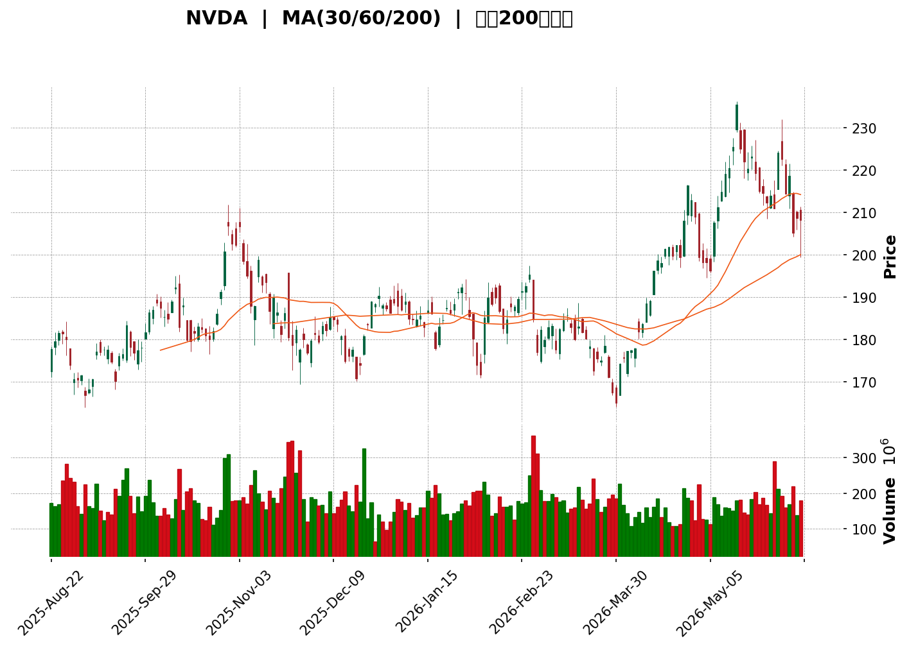
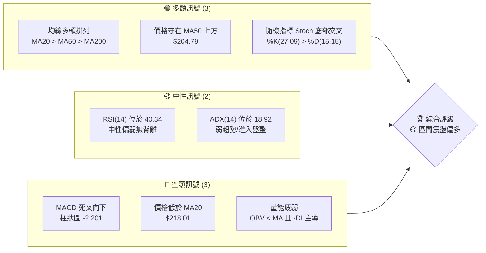
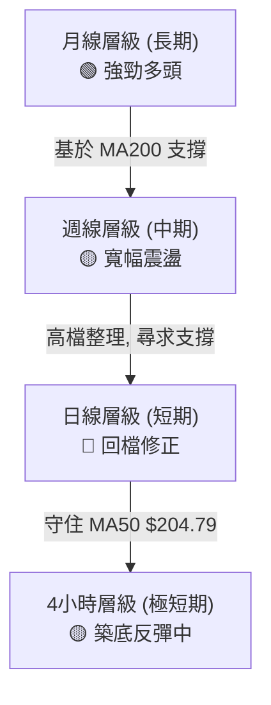
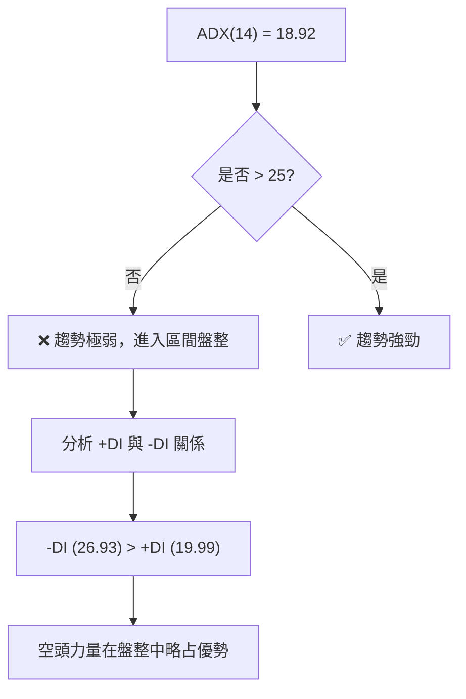
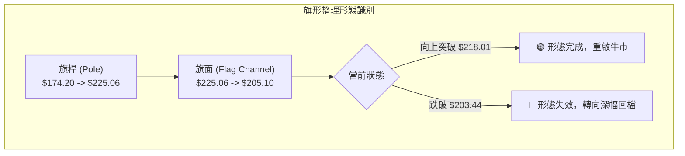
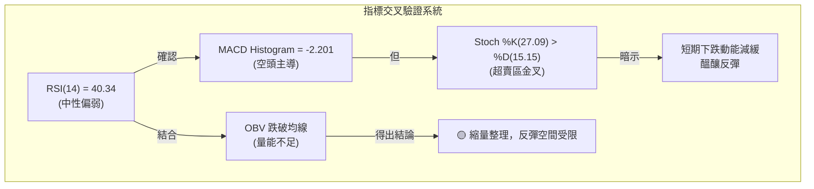

<details>
<summary>📊 靜態圖表 (點擊展開)</summary>

</details>

<html>
<head><meta charset="utf-8" /></head>
<body>
    <div style="height:500px; width:100%;">                        <script>window.PlotlyConfig = {MathJaxConfig: 'local'};</script>
        <script charset="utf-8" src="https://cdn.plot.ly/plotly-3.6.0.min.js" integrity="sha256-QaOVwtVY0T02VaHrr6pnoHLCwayMJp4O5n4YyaE3rJk=" crossorigin="anonymous"></script>                <div id="candlestick-chart" class="plotly-graph-div" style="height:100%; width:100%;"></div>            <script>                window.PLOTLYENV=window.PLOTLYENV || {};                                if (document.getElementById("candlestick-chart")) {                    Plotly.newPlot(                        "candlestick-chart",                        [{"close":{"dtype":"f8","bdata":"AAAAoBo4ZkAAAABARHJmQAAAAEDnsGZAAAAAgHirZkAAAABgxX1mQAAAAIBYvmVAAAAA4LBRZUAAAADgk0xlQAAAAGDQbWVAAAAAAIjZZEAAAACgwQJlQAAAAEANUWVAAAAAIAMjZkAAAADgNx5mQAAAAOD9MmZAAAAAQMEwZkAAAABACNVlQAAAAKBWQmVAAAAAIH8AZkAAAAAAPQ5mQAAAAEAJ7GZAAAAAoHxGZkAAAACA0xdmQAAAAEDWLmZAAAAAINE+ZkAAAACgybNmQAAAAGD0SmdAAAAAYAxgZ0AAAADgx5RnQAAAAEAxbGdAAAAAgLcpZ0AAAADgvBlnQAAAAMDPm2dAAAAAAGQKaEAAAACAp91mQAAAAGCQgmdAAAAAIJ95ZkAAAADgOnNmQAAAAECCsmZAAAAAQJLfZkAAAAAACc1mQAAAAGC8nWZAAAAAoJyBZkAAAADgsb1mQAAAACC6QGdAAAAA4N\u002fnZ0AAAAAAxBhpQAAAAEDX2GlAAAAAwDVUaUAAAAAgbUdpQAAAACC602lAAAAAIPvNaEAAAACAw15oQAAAAODkemdAAAAAYCF9Z0AAAACgfNloQAAAACA\u002fHWhAAAAAYLMxaEAAAABA51NnQAAAACCwvWdAAAAAIJhLZ0AAAACgIKRmQAAAAIAJSWdAAAAA4B2NZkAAAABg3lRmQAAAAMAoymZAAAAA4P0yZkAAAADg+IBmQAAAAADJGGZAAAAAIBt2ZkAAAADgUqdmQAAAAECPa2ZAAAAAAAPlZkAAAABgAsZmQAAAAABeKmdAAAAAYNQXZ0AAAADAy\u002fFmQAAAAOC0lmZAAAAAQNHZZUAAAABgaAJmQAAAAMAcMGZAAAAAoGpXZUAAAAAAsb1lQAAAAOCfmGZAAAAAYOvuZkAAAAAgWJ9nQAAAAOAqjGdAAAAAYIjJZ0AAAADgs39nQAAAACD4aWdAAAAA4LpIZ0AAAACg1pNnQAAAAMCBfGdAAAAAoGFgZ0AAAADgJZxnQAAAACARGmdAAAAAQFAUZ0AAAADg3hZnQAAAAECtMmdAAAAAIFfdZkAAAAAAT1pnQAAAAKAZQGdAAAAAYEw7ZkAAAAAgGONmQAAAAKCsE2dAAAAAwB9uZ0AAAABgxUdnQAAAAIBKiWdAAAAAoCzpZ0AAAADA0AhoQAAAAKC13GdAAAAA4EgsZ0AAAACA2YNmQAAAACBKv2VAAAAAoHV1ZUAAAABg5CVnQAAAACDfuWdAAAAAIO6JZ0AAAAAAMbpnQAAAAADLVmdAAAAAQMvSZkAAAABg1BdnQAAAACAIeGdAAAAAoHl1Z0AAAABA17JnQAAAACAi6mdAAAAAwK4TaEAAAADgS2poQAAAAMBFFWdAAAAAQCwfZkAAAAAgP8hmQAAAAMCUemZAAAAAACXaZkAAAACgu+NmQAAAAOBOM2ZAAAAAAK7NZkAAAAAAcBFnQAAAAKAHOmdAAAAAYKjdZkAAAAAASYFmQAAAAAA34GZAAAAAgPu2ZkAAAABgFIZmQAAAAKBES2ZAAAAAYPePZUAAAADg7+1lQAAAAIDf32VAAAAAgBpPZkAAAAAgTWFlQAAAAEBm6mRAAAAAgEmfZEAAAACgTcZlQAAAAAB08WVAAAAAIN8lZkAAAADA3C1mQAAAAMCQPGZAAAAAAMe7ZkAAAADgRPZmQAAAACAijWdAAAAAIN6iZ0AAAADg\u002f4hoQAAAAIBu1GhAAAAAoM\u002fDaEAAAAAgPy5pQAAAAIBkOmlAAAAA4Lb0aEAAAADgdEhpQAAAAAAL7WhAAAAAoOEAakAAAABgcwtrQAAAAMB\u002fnWpAAAAAgDQgakAAAABAzupoQAAAAOABx2hAAAAAQPfHaEAAAAAArohoQAAAAGDR8mlAAAAAAB9oakAAAAAgYt5qQAAAAMDnZWtAAAAAQLyQa0AAAADAJTJsQAAAAADmbm1AAAAAwNghbEAAAABg9cFrQAAAAEBNi2tAAAAAILfma0AAAACAJGhrQAAAAOCJ4mpAAAAAIITTakAAAADAR4tqQAAAAMAEwGpAAAAAYJ1cakAAAACAKQNsQAAAAIDw0WtAAAAAAADQakAAAADAHlVrQAAAAEAzo2lAAAAA4HoUakAAAACAFAZqQA=="},"high":{"dtype":"f8","bdata":"1KxLNkdLZkC5SCyeYLVmQC2IjH63xGZAmFZprenHZkDyn\u002fQkMAdnQEsoY303PWZANsTYsNKEZUDyLtweyIVlQBSaJJI0dGVASN1K+cMZZUAOf0CgcVdlQOlvUxoVWGVAL6yrBKZhZkAXYieMnIFmQNKeQnzrS2ZAML+ZBelTZkA+YYXpwyhmQJJcOgJXn2VACJS1RvsbZkAC6TgJTTtmQOhACvETCmdAF8x\u002fHQHGZkAMVzWtoXFmQNpJbM74gGZAyfJUA1BxZkA4\u002fYfwf\u002fhmQFlnADeQY2dA6Sjqu898Z0C8lgwW0NlnQCFcs8jCw2dAnBVcXbpfZ0B3uOnNNppnQGvIAsN4q2dAlSMVo6NhaED7aU673WtoQAgFRVLFu2dAxi6FORESZ0B68ozoTRRnQGTC9yh94WZAbG0REbL7ZkBTvTrJ2R5nQLR4xz3U0WZA\u002f0rtZprmZkDH+OLLf9lmQD3ibN9lZ2dAfPSVbSz4Z0DHe7nghFxpQPITB2NufWpAkyXGgLe8aUAXn9cQkPZpQC\u002fJTdVDYmpAsuLqxrl2aUDKYURNK1VpQG8GvPTIq2hA6HbTWZCCZ0A2L5c27vVoQAZwvWp5ZWhA4IcD0X50aEDgMznVRuZnQMw6+5uI2GdA1Grn1EuYZ0AUbXk6ERJnQE3sUMTcc2dA1T1wtwJ4aEAElJiaZQpnQOIGQzaF6GZAlSe2k9s9ZkBSrusYqtVmQPpDlrr4YWZAwfDZKECCZkDSKYFsjS1nQFsz\u002f4f2xmZAWS6mf3IJZ0CeO8Pr6w1nQI0zG+2reGdAO2v448wvZ0BVoAEpIShnQEUol\u002fsro2ZA+KDHCB3TZkDnIXoefEZmQCmb5PC4SGZApAD+VEv9ZUARddTQ7v1lQJT1y4hTp2ZAhwNF7\u002fD9ZkCABHDtLaNnQKRUj4HBlWdAjCXIkZEOaEAgLW0c9pBnQHsgsCdQmGdAhGMA3H3KZ0Caj6ooPRZoQKIX\u002fsOcLGhAbr2B7fL9Z0BkUzEyYeRnQGRwtR42qmdADHPYmp1DZ0B8Ppyei1xnQH8uMewvfGdAZRyEc4cHZ0DR1xFOAa9nQO3IX\u002fynxmdAgOOO3AzFZkDd7mgR7yRnQGMeJrouPmdAwPE\u002fHc+rZ0Dycu6td5xnQDb55dqXuGdAbuGTt7MDaEDLl+xR0SdoQB4NEDgZSGhAeXt\u002fki7CZ0CrmOfxYEFnQPFghjWPa2ZAnVHL0lgTZkCVgMnBtVhnQDeTyh+SLWhAkhd1TtsHaECCWC03ySBoQGJ+bRD5K2hAsxTh8rBoZ0CEYcIegV1nQD8\u002f+CVrxGdA70sAFmqGZ0CzhCEJJMNnQMOD2OzWNmhAO5awMRYxaEDxcI23dKxoQLH2JbG0QWhAkQl+HMPLZkCocGWYkedmQOKIZ2S\u002flWZAk6InLzMPZ0DSjpewvvpmQOTvDvMx0WZAANi9Z\u002f3VZkD9sKf1z0ZnQLuqKbbZbGdANi+c1TAXZ0CC8i2O8jtnQPaqM8YflWdAGcFpqOQlZ0Dq8840VOVmQKAvOLWneGZATBDA2a1BZkD42xr3MUVmQC35sqV5AGZAlCLmBkqgZkBu\u002fGGevglmQAXD\u002f7irWGVAVrQsbxYoZUA8GOrGVc1lQLb0II07JWZAxi7XaxEpZkBH0swRqDJmQOEypGK4QGZACqquLGshZ0D7zvjgs\u002ftmQB2GXA\u002fsuGdAf1CBCQ6uZ0AAAADg\u002f4hoQEgZy6hVBWlAthXeUcHzaECSTCnP4i5pQEpqcZPoPWlAN6V3gXJQaUAAAADgdEhpQLIKuIr3cmlAEzTxkIpWakDef+OGexJrQMZOjF9cz2pAdEGWqB2PakAdSLELxEFqQDU+\u002fBtwWGlAdh1WQdgvaUCNL\u002ft0OABpQLFvya3hAGpAYaBHoGu+akCFZYGUfDFrQE2XjZlRwWtAcsIYLarva0DiGut0ZHJsQDGB9t53iG1AEq2cUGDnbEBFUcKibrdsQF7Y4lf\u002fBmxALYABgrw7bED03KEhVGRsQK2xJTUWmGtAUGvO1qE9a0C2Mt930rxqQDlAZoOc6GpAVK12imcza0DdMuuCdhNsQO\u002fZEYhOAG1A5dP7ifDRa0AAAABAM7NrQAAAAADX22pAAAAAQApPakAAAADgemxqQA=="},"hovertemplate":"\u003cb\u003e%{x|%Y-%m-%d}\u003c\u002fb\u003e\u003cbr\u003e\u958b: $%{open:.2f}\u003cbr\u003e\u9ad8: $%{high:.2f}\u003cbr\u003e\u4f4e: $%{low:.2f}\u003cbr\u003e\u6536: $%{close:.2f}\u003cextra\u003e\u003c\u002fextra\u003e","low":{"dtype":"f8","bdata":"8UwR3RxfZUBBm7yNuQpmQGla0SBPUmZAkGuRvZNbZkDh0Kp4nAVmQFQIQvltnWVAS6d4KuzfZEDnxp3V+BRlQJa+\u002fOPoJWVAk43DxEF7ZEC2dLvVE+RkQE33Z02V0GRAhIloRJLnZUBA3jmTKghmQHVy7ws1B2ZAI3vj7jTJZUCYD5d3DcVlQPpZMl5BBmVAtBzAmauXZUBl+n9snt5lQJCI512Zz2VAjH0\u002fqon\u002fZUDXkzVipuVlQG1YwVUanWVAHrV7JKHWZUCclDjX44JmQFtKN1j2p2ZAwVDr2U31ZkBSfSgpQXpnQJ5qn5+aJGdAw6G6TxbjZkCj3v0ZgPhmQNz+dBGtSWdA6wfYwSHaZ0AfSiz1LbpmQMj5beAjN2dAnS6PMRNvZkC71i6hDSJmQAeLvOlPcWZAe5UaNqxwZkDGN\u002fu+869mQIWI\u002fnBFcmZA4v62eh0RZkBjyUR783FmQJKnaw2F6GZAY5ObLhSGZ0CQHdAqTPVnQLvPA\u002fWckGlAqJaKEekkaUBdqPnhADppQMFUWWaKqWlAerdNDrG1aEDQWOS33UxoQFPFCT2QRGdA8BK3y9NVZkCw6MqCYTFoQF5su2jN4WdAU9pWnF7cZ0Cqyr3ItPNmQLaMUPMyi2ZAG6+NKroCZ0DmVBAYem1mQGpthYEb02ZAlHJhft5zZkA5Yrr2tZZlQOEI4pYqCGZADckHTbAqZUBulxQ0akBmQHIBrzfOCGZAXjecHa6uZUBcjyG8qXhmQG0COiI4XGZA9XQNgbR3ZkDsgihYEZZmQCO5Lo+wxWZAAuM\u002fFxjjZkC3KDT9LrpmQGrdLmP0DGZAEoXuXQjNZUAGW+gSI9plQExWMGT71WVARpV86UdDZUDYTCjHinNlQMEyBGgBBGZAOD9XfxfEZkDyYcN4q9VmQJi6pyibS2dA7VV036t4Z0AgfZNt3zVnQIerWhZ5VmdACGSIGWlIZ0ABlVQj+4BnQBEqnSiLPWdATK30MPVSZ0BVvbeypUpnQKf1liWP72ZAYIJEoEfuZkAFjylpgdlmQLxy04ym5WZAsKRzOo2SZkAMeGLvS0NnQB1sM19OO2dAw75Al5gsZkApJ\u002fR42EVmQFUF2vSW9mZAH6eKG\u002fVSZ0ABu0QKbjhnQC8xkiQpL2dAKTPzw3qzZ0Df8uW9qjpnQAfj4XCnp2dAFKnpCPQUZ0DEeE5kfQBmQIMy\u002fCBrdmVApvKt20paZUDKyf7BZMxlQGqGZaY692ZA2aX4sIF8Z0CQmh0GSJFnQFsThqoMSWdAiSugLM2rZkAXPMVnxl5mQDTB4wwKUWdAr6OM+uEtZ0C3iiT41DZnQMzzq4grq2dA2JkXo35lZ0DOMACquTFoQMdNMxAOA2dAF39S1UgFZkDAmpgcrM1lQAAQrvyKFmZAxUgOneZ6ZkBpYMzcOTVmQONl2tpYE2ZAo2QggRPrZUCcfP+KOblmQPS\u002fb1GHB2dACzRwwTqxZkBgtNR0YHdmQI7MwcJcpmZAzztY4v2uZkDSrt+q14NmQKq8riq78mVAXf+SmKRwZUD0B2hEz9FlQCnvleLguGVAvrGss5wUZkCSDyXUGl5lQMcJKh0Z2mRAcSsrVYWCZEAwFCAzgNhkQOMxSYl90WVAvQWDqXRlZUBugOetxfFlQJFN45emrmVA1wyDOeKCZkCCIh+AHI1mQNKZDQu8AmdA1h+ty8IwZ0DezSidiNFnQF4uSXljcGhAZFs7GaByaECAcMZ7N+FoQGKQxH6Cs2hA\u002fy1cRJbYaEA60aFAlthoQPzCEnSxn2hA7pum7nnyaEDeUSBGb+RpQI7zW+Wk\u002fmlAoqMDzdPqaUCGFQ1s\u002f85oQKPe9S5\u002fnGhA6GHx6mxQaEDndXs7qHloQEOxhg0fzGhA0C\u002fnrk7IaUBITnynjJRqQKWa2w2DtGpAw9x9Am\u002fVakDcMxmA\u002fKlrQDjHMeoOoWxADnWjrFP\u002fa0CeCjSLtENrQHlOtZ8ANWtAG1bOMsmHa0BKbVwxpDVrQAmr6S2Z0WpAs\u002f0zRhp4akB32iKuLhFqQJzPd+UrX2pAQEtmmEtcakBGYzRWXe5qQO6g6ET0omtAgUryKVTIakAAAABACl9qQAAAAGCPimlAAAAAAADAaUAAAABA4epoQA=="},"name":"\u50f9\u683c","open":{"dtype":"f8","bdata":"78HKPyyMZUC+f4zom0NmQJFt\u002foFBemZA9+0LPJ23ZkCfd8Uqi5JmQBCa80zwO2ZApYfGn8M4ZUCRkqKUo1plQJdhWwD7SmVAb\u002fG03s75ZEAs+t8HeOpkQJIqUNKuG2VAvgG9JPYMZkBlQPiOb25mQCzYlMVkMWZAS2I4lEfuZUDVcBwhyRhmQEkENFpxjWVA1IwWtUS4ZUA5u02kefFlQIHn43V04mVA4HGTb5+3ZkBQhOjnT3FmQP1KVl8\u002fyGVAAAJwdS0+ZkDmTGixZ4ZmQHdHWlUju2ZAoLJyPiEgZ0AcjmHXeKtnQBdvFV5enmdAbFnWSnAoZ0AKNU\u002f1xD9nQGc5R6GiSmdABs5OLIb\u002fZ0A7DM6fbihoQCe6\u002fsZgd2dA+oWoyRsRZ0CRoIVDERJnQOQi\u002f33uv2ZAWwNhOWp+ZkC5KgADstxmQLR4xz3U0WZAQDm\u002fxhidZkDcfUToFYZmQP\u002fLG8Fi82ZAF9Qkh++3Z0DeGXYluxloQKU+BPHh9mlAGC7VCnCcaUBZaFoN\u002fMVpQCcRQfoT+mlATC0yprlXaUBKCqDaidBoQFu4KxpvhWhAJEUNSkMVZ0ALpbk8kVtoQDxvR0EqXWhALtEg9w9vaEA\u002fHwwH0NlnQMI1YugQ1GZAdhbusnU3Z0CiRNFrr+RmQOT8kk2\u002fEWdA5CAEnWl2aEB3OIzfSqBmQF89NS5daGZAqGH5ff3VZUB5BTy0waxmQK4IkeYFWWZAXKd7ODLRZUDgtaM+6bBmQKBvtNMtm2ZArM9JkMKsZkBjt\u002fK6T\u002fVmQD41DUpczWZA8JO7vK8qZ0Bsi+Rf1BdnQEjHmpzugWZAkH50uXWcZkCf17jIJDdmQI\u002fx1fFyAWZA93Wh4VX8ZUB3X5\u002f7J8plQH9a6nyNDmZAIsRrNEX2ZkBhvehF6NdmQN20se\u002fAdmdAi3ViVgm2Z0Dfxu4WZ29nQDoAsqNXgGdAiVgcvdmqZ0AEStO+erNnQI3ZKk3Y8GdA3WWxpDbJZ0D5h5Gj44pnQNSvvQImnGdAWYfuTVgbZ0DPGTfK5d9mQAcaTNXJGGdAo0Az+Q0DZ0CiRRfdukhnQJwj324wm2dALFDrZrW1ZkAwAWfcnlpmQMGL60XMEGdAOe5O0rBoZ0Akljf90l1nQDH3JYZhYGdAvBWuHi\u002fhZ0AZxgLNa+NnQJurnTNE32dAnmcNQhpfZ0BJzot+a0BnQNA8F2i5Z2ZAcxWXr\u002fDWZUBHoFomMQ9mQFhxbg4jAWdABfCbKLPkZ0Dj\u002fIrM5QZoQNR9InpvGWhAonj7RQ1oZ0BfLChC6rBmQAkYxlCkkGdAYr30waBaZ0A9uq+u90pnQG20OL9W5WdASU1hMjfoZ0BmYNPT0UZoQHo3NyQRQWhA7wfRO++gZkBFi2Frf9llQJGijdG4SGZAl+Q\u002f0guHZkAC18GnYJ5mQKaKOXfec2ZA1y+XtKoTZkCdmaqGsMVmQGcl9cQxNmdA\u002f\u002fdicr76ZkA1rJ8WjRZnQJyNU2I52GZAMBB5pgYbZ0BpNgfqj8hmQLC6xj6wOWZAqhKBdF45ZkD2VgNttyFmQOYnVAcM1GVAQAFVUZocZkD524VwrvtlQOPPNbmqOWVAPurZMqwSZUDZ0rn60dhkQIezrZ1x+WVAiG3yb1h\u002fZUAlguAzhR5mQDG0LTrQ8GVALagOjCAJZ0B9UKYdG7RmQBgtp9INA2dAw+mxpwc6Z0DjSUlSxdNnQDPPQ1j1iWhANwUkpmemaEDl9bVZWvVoQE\u002f9JPbo92hAu3oQa6E8aUD2j2JmMRhpQDrSXJstR2lA1VppYEX3aEDc5Ctg\u002fSxqQHlfCVjgJ2pAMIds+XmOakB\u002fBQpz8DVqQJslD0N2IWlAYNW5ZZHoaEBcG\u002fLrLOJoQJESkJgI9WhAA43FYh4DakAnH7MxBplqQEgaqV9OuWpA5KtEZHVJa0AapTp1YRVsQAkZdEujsmxANyuJyMKvbEBIKCTgRrNsQMXP+ZCoa2tApAADJHLda0BgLQK9\u002f8BrQC2BsiGSlGtAs7OVmjYJa0DOUxwB3btqQDBJ\u002fdIWYWpAw2DsEZHKakBofffMUu9qQNfkY+tLXWxAT2iGx8eua0AAAADAHr1qQAAAAMD10GpAAAAAgMJFakAAAAAgrlNqQA=="},"x":["2025-08-22T00:00:00-04:00","2025-08-25T00:00:00-04:00","2025-08-26T00:00:00-04:00","2025-08-27T00:00:00-04:00","2025-08-28T00:00:00-04:00","2025-08-29T00:00:00-04:00","2025-09-02T00:00:00-04:00","2025-09-03T00:00:00-04:00","2025-09-04T00:00:00-04:00","2025-09-05T00:00:00-04:00","2025-09-08T00:00:00-04:00","2025-09-09T00:00:00-04:00","2025-09-10T00:00:00-04:00","2025-09-11T00:00:00-04:00","2025-09-12T00:00:00-04:00","2025-09-15T00:00:00-04:00","2025-09-16T00:00:00-04:00","2025-09-17T00:00:00-04:00","2025-09-18T00:00:00-04:00","2025-09-19T00:00:00-04:00","2025-09-22T00:00:00-04:00","2025-09-23T00:00:00-04:00","2025-09-24T00:00:00-04:00","2025-09-25T00:00:00-04:00","2025-09-26T00:00:00-04:00","2025-09-29T00:00:00-04:00","2025-09-30T00:00:00-04:00","2025-10-01T00:00:00-04:00","2025-10-02T00:00:00-04:00","2025-10-03T00:00:00-04:00","2025-10-06T00:00:00-04:00","2025-10-07T00:00:00-04:00","2025-10-08T00:00:00-04:00","2025-10-09T00:00:00-04:00","2025-10-10T00:00:00-04:00","2025-10-13T00:00:00-04:00","2025-10-14T00:00:00-04:00","2025-10-15T00:00:00-04:00","2025-10-16T00:00:00-04:00","2025-10-17T00:00:00-04:00","2025-10-20T00:00:00-04:00","2025-10-21T00:00:00-04:00","2025-10-22T00:00:00-04:00","2025-10-23T00:00:00-04:00","2025-10-24T00:00:00-04:00","2025-10-27T00:00:00-04:00","2025-10-28T00:00:00-04:00","2025-10-29T00:00:00-04:00","2025-10-30T00:00:00-04:00","2025-10-31T00:00:00-04:00","2025-11-03T00:00:00-05:00","2025-11-04T00:00:00-05:00","2025-11-05T00:00:00-05:00","2025-11-06T00:00:00-05:00","2025-11-07T00:00:00-05:00","2025-11-10T00:00:00-05:00","2025-11-11T00:00:00-05:00","2025-11-12T00:00:00-05:00","2025-11-13T00:00:00-05:00","2025-11-14T00:00:00-05:00","2025-11-17T00:00:00-05:00","2025-11-18T00:00:00-05:00","2025-11-19T00:00:00-05:00","2025-11-20T00:00:00-05:00","2025-11-21T00:00:00-05:00","2025-11-24T00:00:00-05:00","2025-11-25T00:00:00-05:00","2025-11-26T00:00:00-05:00","2025-11-28T00:00:00-05:00","2025-12-01T00:00:00-05:00","2025-12-02T00:00:00-05:00","2025-12-03T00:00:00-05:00","2025-12-04T00:00:00-05:00","2025-12-05T00:00:00-05:00","2025-12-08T00:00:00-05:00","2025-12-09T00:00:00-05:00","2025-12-10T00:00:00-05:00","2025-12-11T00:00:00-05:00","2025-12-12T00:00:00-05:00","2025-12-15T00:00:00-05:00","2025-12-16T00:00:00-05:00","2025-12-17T00:00:00-05:00","2025-12-18T00:00:00-05:00","2025-12-19T00:00:00-05:00","2025-12-22T00:00:00-05:00","2025-12-23T00:00:00-05:00","2025-12-24T00:00:00-05:00","2025-12-26T00:00:00-05:00","2025-12-29T00:00:00-05:00","2025-12-30T00:00:00-05:00","2025-12-31T00:00:00-05:00","2026-01-02T00:00:00-05:00","2026-01-05T00:00:00-05:00","2026-01-06T00:00:00-05:00","2026-01-07T00:00:00-05:00","2026-01-08T00:00:00-05:00","2026-01-09T00:00:00-05:00","2026-01-12T00:00:00-05:00","2026-01-13T00:00:00-05:00","2026-01-14T00:00:00-05:00","2026-01-15T00:00:00-05:00","2026-01-16T00:00:00-05:00","2026-01-20T00:00:00-05:00","2026-01-21T00:00:00-05:00","2026-01-22T00:00:00-05:00","2026-01-23T00:00:00-05:00","2026-01-26T00:00:00-05:00","2026-01-27T00:00:00-05:00","2026-01-28T00:00:00-05:00","2026-01-29T00:00:00-05:00","2026-01-30T00:00:00-05:00","2026-02-02T00:00:00-05:00","2026-02-03T00:00:00-05:00","2026-02-04T00:00:00-05:00","2026-02-05T00:00:00-05:00","2026-02-06T00:00:00-05:00","2026-02-09T00:00:00-05:00","2026-02-10T00:00:00-05:00","2026-02-11T00:00:00-05:00","2026-02-12T00:00:00-05:00","2026-02-13T00:00:00-05:00","2026-02-17T00:00:00-05:00","2026-02-18T00:00:00-05:00","2026-02-19T00:00:00-05:00","2026-02-20T00:00:00-05:00","2026-02-23T00:00:00-05:00","2026-02-24T00:00:00-05:00","2026-02-25T00:00:00-05:00","2026-02-26T00:00:00-05:00","2026-02-27T00:00:00-05:00","2026-03-02T00:00:00-05:00","2026-03-03T00:00:00-05:00","2026-03-04T00:00:00-05:00","2026-03-05T00:00:00-05:00","2026-03-06T00:00:00-05:00","2026-03-09T00:00:00-04:00","2026-03-10T00:00:00-04:00","2026-03-11T00:00:00-04:00","2026-03-12T00:00:00-04:00","2026-03-13T00:00:00-04:00","2026-03-16T00:00:00-04:00","2026-03-17T00:00:00-04:00","2026-03-18T00:00:00-04:00","2026-03-19T00:00:00-04:00","2026-03-20T00:00:00-04:00","2026-03-23T00:00:00-04:00","2026-03-24T00:00:00-04:00","2026-03-25T00:00:00-04:00","2026-03-26T00:00:00-04:00","2026-03-27T00:00:00-04:00","2026-03-30T00:00:00-04:00","2026-03-31T00:00:00-04:00","2026-04-01T00:00:00-04:00","2026-04-02T00:00:00-04:00","2026-04-06T00:00:00-04:00","2026-04-07T00:00:00-04:00","2026-04-08T00:00:00-04:00","2026-04-09T00:00:00-04:00","2026-04-10T00:00:00-04:00","2026-04-13T00:00:00-04:00","2026-04-14T00:00:00-04:00","2026-04-15T00:00:00-04:00","2026-04-16T00:00:00-04:00","2026-04-17T00:00:00-04:00","2026-04-20T00:00:00-04:00","2026-04-21T00:00:00-04:00","2026-04-22T00:00:00-04:00","2026-04-23T00:00:00-04:00","2026-04-24T00:00:00-04:00","2026-04-27T00:00:00-04:00","2026-04-28T00:00:00-04:00","2026-04-29T00:00:00-04:00","2026-04-30T00:00:00-04:00","2026-05-01T00:00:00-04:00","2026-05-04T00:00:00-04:00","2026-05-05T00:00:00-04:00","2026-05-06T00:00:00-04:00","2026-05-07T00:00:00-04:00","2026-05-08T00:00:00-04:00","2026-05-11T00:00:00-04:00","2026-05-12T00:00:00-04:00","2026-05-13T00:00:00-04:00","2026-05-14T00:00:00-04:00","2026-05-15T00:00:00-04:00","2026-05-18T00:00:00-04:00","2026-05-19T00:00:00-04:00","2026-05-20T00:00:00-04:00","2026-05-21T00:00:00-04:00","2026-05-22T00:00:00-04:00","2026-05-26T00:00:00-04:00","2026-05-27T00:00:00-04:00","2026-05-28T00:00:00-04:00","2026-05-29T00:00:00-04:00","2026-06-01T00:00:00-04:00","2026-06-02T00:00:00-04:00","2026-06-03T00:00:00-04:00","2026-06-04T00:00:00-04:00","2026-06-05T00:00:00-04:00","2026-06-08T00:00:00-04:00","2026-06-09T00:00:00-04:00"],"type":"candlestick"},{"hovertemplate":"MA30: $%{y:.2f}\u003cextra\u003e\u003c\u002fextra\u003e","line":{"color":"#2196F3","dash":"dash","width":2},"mode":"lines","name":"MA30","x":["2025-08-22T00:00:00-04:00","2025-08-25T00:00:00-04:00","2025-08-26T00:00:00-04:00","2025-08-27T00:00:00-04:00","2025-08-28T00:00:00-04:00","2025-08-29T00:00:00-04:00","2025-09-02T00:00:00-04:00","2025-09-03T00:00:00-04:00","2025-09-04T00:00:00-04:00","2025-09-05T00:00:00-04:00","2025-09-08T00:00:00-04:00","2025-09-09T00:00:00-04:00","2025-09-10T00:00:00-04:00","2025-09-11T00:00:00-04:00","2025-09-12T00:00:00-04:00","2025-09-15T00:00:00-04:00","2025-09-16T00:00:00-04:00","2025-09-17T00:00:00-04:00","2025-09-18T00:00:00-04:00","2025-09-19T00:00:00-04:00","2025-09-22T00:00:00-04:00","2025-09-23T00:00:00-04:00","2025-09-24T00:00:00-04:00","2025-09-25T00:00:00-04:00","2025-09-26T00:00:00-04:00","2025-09-29T00:00:00-04:00","2025-09-30T00:00:00-04:00","2025-10-01T00:00:00-04:00","2025-10-02T00:00:00-04:00","2025-10-03T00:00:00-04:00","2025-10-06T00:00:00-04:00","2025-10-07T00:00:00-04:00","2025-10-08T00:00:00-04:00","2025-10-09T00:00:00-04:00","2025-10-10T00:00:00-04:00","2025-10-13T00:00:00-04:00","2025-10-14T00:00:00-04:00","2025-10-15T00:00:00-04:00","2025-10-16T00:00:00-04:00","2025-10-17T00:00:00-04:00","2025-10-20T00:00:00-04:00","2025-10-21T00:00:00-04:00","2025-10-22T00:00:00-04:00","2025-10-23T00:00:00-04:00","2025-10-24T00:00:00-04:00","2025-10-27T00:00:00-04:00","2025-10-28T00:00:00-04:00","2025-10-29T00:00:00-04:00","2025-10-30T00:00:00-04:00","2025-10-31T00:00:00-04:00","2025-11-03T00:00:00-05:00","2025-11-04T00:00:00-05:00","2025-11-05T00:00:00-05:00","2025-11-06T00:00:00-05:00","2025-11-07T00:00:00-05:00","2025-11-10T00:00:00-05:00","2025-11-11T00:00:00-05:00","2025-11-12T00:00:00-05:00","2025-11-13T00:00:00-05:00","2025-11-14T00:00:00-05:00","2025-11-17T00:00:00-05:00","2025-11-18T00:00:00-05:00","2025-11-19T00:00:00-05:00","2025-11-20T00:00:00-05:00","2025-11-21T00:00:00-05:00","2025-11-24T00:00:00-05:00","2025-11-25T00:00:00-05:00","2025-11-26T00:00:00-05:00","2025-11-28T00:00:00-05:00","2025-12-01T00:00:00-05:00","2025-12-02T00:00:00-05:00","2025-12-03T00:00:00-05:00","2025-12-04T00:00:00-05:00","2025-12-05T00:00:00-05:00","2025-12-08T00:00:00-05:00","2025-12-09T00:00:00-05:00","2025-12-10T00:00:00-05:00","2025-12-11T00:00:00-05:00","2025-12-12T00:00:00-05:00","2025-12-15T00:00:00-05:00","2025-12-16T00:00:00-05:00","2025-12-17T00:00:00-05:00","2025-12-18T00:00:00-05:00","2025-12-19T00:00:00-05:00","2025-12-22T00:00:00-05:00","2025-12-23T00:00:00-05:00","2025-12-24T00:00:00-05:00","2025-12-26T00:00:00-05:00","2025-12-29T00:00:00-05:00","2025-12-30T00:00:00-05:00","2025-12-31T00:00:00-05:00","2026-01-02T00:00:00-05:00","2026-01-05T00:00:00-05:00","2026-01-06T00:00:00-05:00","2026-01-07T00:00:00-05:00","2026-01-08T00:00:00-05:00","2026-01-09T00:00:00-05:00","2026-01-12T00:00:00-05:00","2026-01-13T00:00:00-05:00","2026-01-14T00:00:00-05:00","2026-01-15T00:00:00-05:00","2026-01-16T00:00:00-05:00","2026-01-20T00:00:00-05:00","2026-01-21T00:00:00-05:00","2026-01-22T00:00:00-05:00","2026-01-23T00:00:00-05:00","2026-01-26T00:00:00-05:00","2026-01-27T00:00:00-05:00","2026-01-28T00:00:00-05:00","2026-01-29T00:00:00-05:00","2026-01-30T00:00:00-05:00","2026-02-02T00:00:00-05:00","2026-02-03T00:00:00-05:00","2026-02-04T00:00:00-05:00","2026-02-05T00:00:00-05:00","2026-02-06T00:00:00-05:00","2026-02-09T00:00:00-05:00","2026-02-10T00:00:00-05:00","2026-02-11T00:00:00-05:00","2026-02-12T00:00:00-05:00","2026-02-13T00:00:00-05:00","2026-02-17T00:00:00-05:00","2026-02-18T00:00:00-05:00","2026-02-19T00:00:00-05:00","2026-02-20T00:00:00-05:00","2026-02-23T00:00:00-05:00","2026-02-24T00:00:00-05:00","2026-02-25T00:00:00-05:00","2026-02-26T00:00:00-05:00","2026-02-27T00:00:00-05:00","2026-03-02T00:00:00-05:00","2026-03-03T00:00:00-05:00","2026-03-04T00:00:00-05:00","2026-03-05T00:00:00-05:00","2026-03-06T00:00:00-05:00","2026-03-09T00:00:00-04:00","2026-03-10T00:00:00-04:00","2026-03-11T00:00:00-04:00","2026-03-12T00:00:00-04:00","2026-03-13T00:00:00-04:00","2026-03-16T00:00:00-04:00","2026-03-17T00:00:00-04:00","2026-03-18T00:00:00-04:00","2026-03-19T00:00:00-04:00","2026-03-20T00:00:00-04:00","2026-03-23T00:00:00-04:00","2026-03-24T00:00:00-04:00","2026-03-25T00:00:00-04:00","2026-03-26T00:00:00-04:00","2026-03-27T00:00:00-04:00","2026-03-30T00:00:00-04:00","2026-03-31T00:00:00-04:00","2026-04-01T00:00:00-04:00","2026-04-02T00:00:00-04:00","2026-04-06T00:00:00-04:00","2026-04-07T00:00:00-04:00","2026-04-08T00:00:00-04:00","2026-04-09T00:00:00-04:00","2026-04-10T00:00:00-04:00","2026-04-13T00:00:00-04:00","2026-04-14T00:00:00-04:00","2026-04-15T00:00:00-04:00","2026-04-16T00:00:00-04:00","2026-04-17T00:00:00-04:00","2026-04-20T00:00:00-04:00","2026-04-21T00:00:00-04:00","2026-04-22T00:00:00-04:00","2026-04-23T00:00:00-04:00","2026-04-24T00:00:00-04:00","2026-04-27T00:00:00-04:00","2026-04-28T00:00:00-04:00","2026-04-29T00:00:00-04:00","2026-04-30T00:00:00-04:00","2026-05-01T00:00:00-04:00","2026-05-04T00:00:00-04:00","2026-05-05T00:00:00-04:00","2026-05-06T00:00:00-04:00","2026-05-07T00:00:00-04:00","2026-05-08T00:00:00-04:00","2026-05-11T00:00:00-04:00","2026-05-12T00:00:00-04:00","2026-05-13T00:00:00-04:00","2026-05-14T00:00:00-04:00","2026-05-15T00:00:00-04:00","2026-05-18T00:00:00-04:00","2026-05-19T00:00:00-04:00","2026-05-20T00:00:00-04:00","2026-05-21T00:00:00-04:00","2026-05-22T00:00:00-04:00","2026-05-26T00:00:00-04:00","2026-05-27T00:00:00-04:00","2026-05-28T00:00:00-04:00","2026-05-29T00:00:00-04:00","2026-06-01T00:00:00-04:00","2026-06-02T00:00:00-04:00","2026-06-03T00:00:00-04:00","2026-06-04T00:00:00-04:00","2026-06-05T00:00:00-04:00","2026-06-08T00:00:00-04:00","2026-06-09T00:00:00-04:00"],"y":{"dtype":"f8","bdata":"AAAAAAAA+H8AAAAAAAD4fwAAAAAAAPh\u002fAAAAAAAA+H8AAAAAAAD4fwAAAAAAAPh\u002fAAAAAAAA+H8AAAAAAAD4fwAAAAAAAPh\u002fAAAAAAAA+H8AAAAAAAD4fwAAAAAAAPh\u002fAAAAAAAA+H8AAAAAAAD4fwAAAAAAAPh\u002fAAAAAAAA+H8AAAAAAAD4fwAAAAAAAPh\u002fAAAAAAAA+H8AAAAAAAD4fwAAAAAAAPh\u002fAAAAAAAA+H8AAAAAAAD4fwAAAAAAAPh\u002fAAAAAAAA+H8AAAAAAAD4fwAAAAAAAPh\u002fAAAAAAAA+H8AAAAAAAD4f2ZmZnbWLWZAmpmZOeQ1ZkAAAABQeTtmQM3MzNxNQ2ZAERERYQBPZkBVVVWVMlJmQDMzM4NFYWZAmpmZySJrZkB3d3cn9XRmQCIiIuLHf2ZA3t3dfQyRZkAzMzMjU6BmQKuqqgpqq2ZAq6qqSpGuZkCJiIgo4rNmQGZmZubfvGZA3t3dDYPLZkBVVVWlXudmQBERERGFDmdAVVVVBekqZ0AAAACgakZnQJqZmck0X2dAIiIiEsp0Z0CJiIh4OIhnQGZmZgZKk2dAzczMTOadZ0ARERERObBnQO\u002fu7o47t2dAd3d3lzi+Z0CJiIj4DrxnQGZmZmbGvmdAzczMfOe\u002fZ0ARERHh+7tnQJqZmYk5uWdAAAAAAISsZ0AzMzPD9KdnQM3MzCzPoWdAd3d3d3SfZ0C8u7u76Z9nQFVVVfXJmmdAzczM\u002fEWXZ0Dv7u4uBJZnQDMzMwNYlGdAmpmZOaiXZ0DNzMws75dnQO\u002fu7l4wl2dA3t3dDUGQZ0AiIiJy431nQAAAAIAVYmdAvLu7e2dEZ0DNzMzsgChnQFVVVSVzCWdAvLu7y+XrZkDv7u4+dtVmQJqZmWnrzWZAERER4S3JZkAiIiIytb5mQAAAADDfuWZAmpmZSWa2ZkCrqqoK3LdmQERERKQRtWZAMzMzM\u002fm0ZkC8u7u79rxmQBEREfGtvmZAvLu7u7jFZkBERESEodBmQFVVVWVL02ZAREREJM7aZkBmZmZGzd9mQAAAAMAy6WZA7+7urqPsZkBVVVUFm\u002fJmQDMzM7Ow+WZAq6qqegj0ZkC8u7urAPVmQGZmZgY\u002f9GZAd3d3Zx\u002f3ZkDv7u4O\u002fflmQM3MzBwTAmdAmpmZOacTZ0CJiIj47iRnQFVVVVU4M2dAd3d3V9lCZ0CrqqpKdElnQDMzM7M1QmdAVVVVtaA1Z0ARERFRlDFnQDMzM1MaM2dAVVVVlfswZ0AAAACw7jJnQM3MzAxLMmdAmpmZqVwuZ0BERER0OipnQEREREQUKmdARERERMgqZ0CamZnpiStnQJqZmWl5MmdAAAAAkPw6Z0Dv7u7+TEZnQERERBRSRWdAERERUfs+Z0C8u7vrHDpnQM3MzGyHM2dAmpmZ6dI4Z0DNzMxc2DhnQFVVVcVdMWdAVVVVpQQsZ0AAAAAANSpnQDMzM6OQJ2dARERE1KUeZ0BVVVXFmBFnQGZmZiYuCWdAvLu7K0UFZ0AzMzMzWAVnQO\u002fu7q4CCmdAAAAA4OQKZ0C8u7vbfgBnQCIiIhKy8GZAzczMjDPmZkBERET0K9JmQN7d3e19vWZAZmZmVrWqZkDNzMwcdZ9mQM3MzCxwkmZAvLu7W0CHZkAzMzMTSXpmQN7d3W33a2ZAVVVVxYBgZkAzMzMjGlRmQDMzM\u002fMYWGZAd3d3RwVlZkAzMzOj+nNmQN7d3W0KiGZAq6qq6lyYZkBVVVXV6atmQDMzM+O\u002fxWZAzczMDB7YZkDNzMycBOtmQJqZmbmE+WZAZmZm5koUZ0C8u7sLCDtnQO\u002fu7t7wWmdA7+7uXgx4Z0B3d3f3eIxnQBEREfGpoWdAd3d3ZyG9Z0ARERHxWtNnQM3MzLwe9mdAq6qqWhYZaEAzMzNj7EdoQBEREYE9f2hAAAAAEH26aECJiIiISPFoQLy7u7syMWlAZmZmlkNkaUAiIiIC3pNpQO\u002fu7o4owWlAERERoUHtaUC8u7t7LxNqQAAAAOChL2pAvLu7m9pKakAzMzMj\u002f1tqQDMzMwNibGpAiYiIeAJ6akCrqqpqLJJqQO\u002fu7q5KqGpAREREdCK4akBVVVWVn8lqQN7d3f2xz2pAvLu7O1nQakDv7u7eosdqQA=="},"type":"scatter"},{"hovertemplate":"MA60: $%{y:.2f}\u003cextra\u003e\u003c\u002fextra\u003e","line":{"color":"#9C27B0","dash":"dash","width":2},"mode":"lines","name":"MA60","x":["2025-08-22T00:00:00-04:00","2025-08-25T00:00:00-04:00","2025-08-26T00:00:00-04:00","2025-08-27T00:00:00-04:00","2025-08-28T00:00:00-04:00","2025-08-29T00:00:00-04:00","2025-09-02T00:00:00-04:00","2025-09-03T00:00:00-04:00","2025-09-04T00:00:00-04:00","2025-09-05T00:00:00-04:00","2025-09-08T00:00:00-04:00","2025-09-09T00:00:00-04:00","2025-09-10T00:00:00-04:00","2025-09-11T00:00:00-04:00","2025-09-12T00:00:00-04:00","2025-09-15T00:00:00-04:00","2025-09-16T00:00:00-04:00","2025-09-17T00:00:00-04:00","2025-09-18T00:00:00-04:00","2025-09-19T00:00:00-04:00","2025-09-22T00:00:00-04:00","2025-09-23T00:00:00-04:00","2025-09-24T00:00:00-04:00","2025-09-25T00:00:00-04:00","2025-09-26T00:00:00-04:00","2025-09-29T00:00:00-04:00","2025-09-30T00:00:00-04:00","2025-10-01T00:00:00-04:00","2025-10-02T00:00:00-04:00","2025-10-03T00:00:00-04:00","2025-10-06T00:00:00-04:00","2025-10-07T00:00:00-04:00","2025-10-08T00:00:00-04:00","2025-10-09T00:00:00-04:00","2025-10-10T00:00:00-04:00","2025-10-13T00:00:00-04:00","2025-10-14T00:00:00-04:00","2025-10-15T00:00:00-04:00","2025-10-16T00:00:00-04:00","2025-10-17T00:00:00-04:00","2025-10-20T00:00:00-04:00","2025-10-21T00:00:00-04:00","2025-10-22T00:00:00-04:00","2025-10-23T00:00:00-04:00","2025-10-24T00:00:00-04:00","2025-10-27T00:00:00-04:00","2025-10-28T00:00:00-04:00","2025-10-29T00:00:00-04:00","2025-10-30T00:00:00-04:00","2025-10-31T00:00:00-04:00","2025-11-03T00:00:00-05:00","2025-11-04T00:00:00-05:00","2025-11-05T00:00:00-05:00","2025-11-06T00:00:00-05:00","2025-11-07T00:00:00-05:00","2025-11-10T00:00:00-05:00","2025-11-11T00:00:00-05:00","2025-11-12T00:00:00-05:00","2025-11-13T00:00:00-05:00","2025-11-14T00:00:00-05:00","2025-11-17T00:00:00-05:00","2025-11-18T00:00:00-05:00","2025-11-19T00:00:00-05:00","2025-11-20T00:00:00-05:00","2025-11-21T00:00:00-05:00","2025-11-24T00:00:00-05:00","2025-11-25T00:00:00-05:00","2025-11-26T00:00:00-05:00","2025-11-28T00:00:00-05:00","2025-12-01T00:00:00-05:00","2025-12-02T00:00:00-05:00","2025-12-03T00:00:00-05:00","2025-12-04T00:00:00-05:00","2025-12-05T00:00:00-05:00","2025-12-08T00:00:00-05:00","2025-12-09T00:00:00-05:00","2025-12-10T00:00:00-05:00","2025-12-11T00:00:00-05:00","2025-12-12T00:00:00-05:00","2025-12-15T00:00:00-05:00","2025-12-16T00:00:00-05:00","2025-12-17T00:00:00-05:00","2025-12-18T00:00:00-05:00","2025-12-19T00:00:00-05:00","2025-12-22T00:00:00-05:00","2025-12-23T00:00:00-05:00","2025-12-24T00:00:00-05:00","2025-12-26T00:00:00-05:00","2025-12-29T00:00:00-05:00","2025-12-30T00:00:00-05:00","2025-12-31T00:00:00-05:00","2026-01-02T00:00:00-05:00","2026-01-05T00:00:00-05:00","2026-01-06T00:00:00-05:00","2026-01-07T00:00:00-05:00","2026-01-08T00:00:00-05:00","2026-01-09T00:00:00-05:00","2026-01-12T00:00:00-05:00","2026-01-13T00:00:00-05:00","2026-01-14T00:00:00-05:00","2026-01-15T00:00:00-05:00","2026-01-16T00:00:00-05:00","2026-01-20T00:00:00-05:00","2026-01-21T00:00:00-05:00","2026-01-22T00:00:00-05:00","2026-01-23T00:00:00-05:00","2026-01-26T00:00:00-05:00","2026-01-27T00:00:00-05:00","2026-01-28T00:00:00-05:00","2026-01-29T00:00:00-05:00","2026-01-30T00:00:00-05:00","2026-02-02T00:00:00-05:00","2026-02-03T00:00:00-05:00","2026-02-04T00:00:00-05:00","2026-02-05T00:00:00-05:00","2026-02-06T00:00:00-05:00","2026-02-09T00:00:00-05:00","2026-02-10T00:00:00-05:00","2026-02-11T00:00:00-05:00","2026-02-12T00:00:00-05:00","2026-02-13T00:00:00-05:00","2026-02-17T00:00:00-05:00","2026-02-18T00:00:00-05:00","2026-02-19T00:00:00-05:00","2026-02-20T00:00:00-05:00","2026-02-23T00:00:00-05:00","2026-02-24T00:00:00-05:00","2026-02-25T00:00:00-05:00","2026-02-26T00:00:00-05:00","2026-02-27T00:00:00-05:00","2026-03-02T00:00:00-05:00","2026-03-03T00:00:00-05:00","2026-03-04T00:00:00-05:00","2026-03-05T00:00:00-05:00","2026-03-06T00:00:00-05:00","2026-03-09T00:00:00-04:00","2026-03-10T00:00:00-04:00","2026-03-11T00:00:00-04:00","2026-03-12T00:00:00-04:00","2026-03-13T00:00:00-04:00","2026-03-16T00:00:00-04:00","2026-03-17T00:00:00-04:00","2026-03-18T00:00:00-04:00","2026-03-19T00:00:00-04:00","2026-03-20T00:00:00-04:00","2026-03-23T00:00:00-04:00","2026-03-24T00:00:00-04:00","2026-03-25T00:00:00-04:00","2026-03-26T00:00:00-04:00","2026-03-27T00:00:00-04:00","2026-03-30T00:00:00-04:00","2026-03-31T00:00:00-04:00","2026-04-01T00:00:00-04:00","2026-04-02T00:00:00-04:00","2026-04-06T00:00:00-04:00","2026-04-07T00:00:00-04:00","2026-04-08T00:00:00-04:00","2026-04-09T00:00:00-04:00","2026-04-10T00:00:00-04:00","2026-04-13T00:00:00-04:00","2026-04-14T00:00:00-04:00","2026-04-15T00:00:00-04:00","2026-04-16T00:00:00-04:00","2026-04-17T00:00:00-04:00","2026-04-20T00:00:00-04:00","2026-04-21T00:00:00-04:00","2026-04-22T00:00:00-04:00","2026-04-23T00:00:00-04:00","2026-04-24T00:00:00-04:00","2026-04-27T00:00:00-04:00","2026-04-28T00:00:00-04:00","2026-04-29T00:00:00-04:00","2026-04-30T00:00:00-04:00","2026-05-01T00:00:00-04:00","2026-05-04T00:00:00-04:00","2026-05-05T00:00:00-04:00","2026-05-06T00:00:00-04:00","2026-05-07T00:00:00-04:00","2026-05-08T00:00:00-04:00","2026-05-11T00:00:00-04:00","2026-05-12T00:00:00-04:00","2026-05-13T00:00:00-04:00","2026-05-14T00:00:00-04:00","2026-05-15T00:00:00-04:00","2026-05-18T00:00:00-04:00","2026-05-19T00:00:00-04:00","2026-05-20T00:00:00-04:00","2026-05-21T00:00:00-04:00","2026-05-22T00:00:00-04:00","2026-05-26T00:00:00-04:00","2026-05-27T00:00:00-04:00","2026-05-28T00:00:00-04:00","2026-05-29T00:00:00-04:00","2026-06-01T00:00:00-04:00","2026-06-02T00:00:00-04:00","2026-06-03T00:00:00-04:00","2026-06-04T00:00:00-04:00","2026-06-05T00:00:00-04:00","2026-06-08T00:00:00-04:00","2026-06-09T00:00:00-04:00"],"y":{"dtype":"f8","bdata":"AAAAAAAA+H8AAAAAAAD4fwAAAAAAAPh\u002fAAAAAAAA+H8AAAAAAAD4fwAAAAAAAPh\u002fAAAAAAAA+H8AAAAAAAD4fwAAAAAAAPh\u002fAAAAAAAA+H8AAAAAAAD4fwAAAAAAAPh\u002fAAAAAAAA+H8AAAAAAAD4fwAAAAAAAPh\u002fAAAAAAAA+H8AAAAAAAD4fwAAAAAAAPh\u002fAAAAAAAA+H8AAAAAAAD4fwAAAAAAAPh\u002fAAAAAAAA+H8AAAAAAAD4fwAAAAAAAPh\u002fAAAAAAAA+H8AAAAAAAD4fwAAAAAAAPh\u002fAAAAAAAA+H8AAAAAAAD4fwAAAAAAAPh\u002fAAAAAAAA+H8AAAAAAAD4fwAAAAAAAPh\u002fAAAAAAAA+H8AAAAAAAD4fwAAAAAAAPh\u002fAAAAAAAA+H8AAAAAAAD4fwAAAAAAAPh\u002fAAAAAAAA+H8AAAAAAAD4fwAAAAAAAPh\u002fAAAAAAAA+H8AAAAAAAD4fwAAAAAAAPh\u002fAAAAAAAA+H8AAAAAAAD4fwAAAAAAAPh\u002fAAAAAAAA+H8AAAAAAAD4fwAAAAAAAPh\u002fAAAAAAAA+H8AAAAAAAD4fwAAAAAAAPh\u002fAAAAAAAA+H8AAAAAAAD4fwAAAAAAAPh\u002fAAAAAAAA+H8AAAAAAAD4f2ZmZm5O9mZAMzMz2+X6ZkCJiIiYuvtmQDMzM7ND\u002fmZAiYiIMML9ZkBERESsE\u002f1mQAAAAFiKAWdAiYiIoEsFZ0CamZlxbwpnQLy7u+tIDWdAVVVVPSkUZ0ARERGpKxtnQO\u002fu7gbhH2dAIiIiwhwjZ0Crqqqq6CVnQKuqqiIIKmdA3t3dDeItZ0C8u7sLoTJnQImIiEhNOGdAiYiIQKg3Z0BmZmbGdTdnQHd3d\u002fdTNGdA7+7u7lcwZ0C8u7tb1y5nQAAAALiaMGdA7+7uFoozZ0CamZkhdzdnQHd3d1+NOGdAiYiIcE86Z0CamZmB9TlnQFVVVQXsOWdAAAAAWHA6Z0BmZmZOeTxnQFVVVb3zO2dA3t3dXR45Z0C8u7sjSzxnQBEREUmNOmdA3t3dTSE9Z0ARERGB2z9nQKuqqlr+QWdA3t3d1fRBZ0AiIiKaT0RnQDMzM1sER2dAIiIiWthFZ0BERETsd0ZnQKuqqrK3RWdAq6qqOrBDZ0CJiIhA8DtnQGZmZk4UMmdAq6qqWgcsZ0CrqqrytyZnQFVVVb1VHmdAmpmZkV8XZ0DNzMxEdQ9nQGZmZo4QCGdAMzMzS2f\u002fZkCamZnBJPhmQJqZmcF89mZAd3d377DzZkBVVVVdZfVmQImIiFiu82ZAZmZm7qrxZkAAAACYmPNmQKuqqhph9GZAAAAAgED4ZkDv7u62Ff5mQHd3d2fiAmdAIiIiWuUKZ0CrqqoiDRNnQCIiImpCF2dAAAAAgM8VZ0CJiIj4WxZnQAAAABCcFmdAIiIism0WZ0BERESE7BZnQN7d3WXOEmdAZmZmBpIRZ0B3d3cHGRJnQAAAAODRFGdA7+7uhiYZZ0Dv7u7eQxtnQN7d3T0zHmdAmpmZQQ8kZ0Dv7u4+ZidnQBERETEcJmdAq6qqykIgZ0BmZmaWCRlnQKuqqjLmEWdAERERkZcLZ0AiIiJSjQJnQFVVVX3k92ZAAAAAAInsZkCJiIjI1+RmQImIiDhC3mZAAAAAUATZZkBmZmZ+6dJmQLy7u2s4z2ZAq6qqqr7NZkARERGRM81mQLy7u4O1zmZARERETADSZkB3d3fHC9dmQFVVVe3I3WZAIiIi6pfoZkAREREZYfJmQERERNSO+2ZAERERWRECZ0BmZmbOnApnQGZmZq6KEGdAVVVVXXgZZ0CJiIhoUCZnQKuqqoIPMmdAVVVVxag+Z0BVVVWV6EhnQAAAAFDWVWdAvLu7IwNkZ0BmZmbm7GlnQHd3d2doc2dAvLu786R\u002fZ0C8u7srDI1nQHd3d7ddnmdAMzMzM5myZ0CrqqrSXshnQERERHTR4WdAERER+cH1Z0CrqqqKEwdoQGZmZv6PFmhAMzMzM+EmaEB3d3fPpDNoQJqZmWndQ2hAmpmZ8e9XaEAzMzPj\u002fGdoQImIiDg2emhAmpmZsS+JaEAAAAAgC59oQBEREUkFt2hAiYiIQCDIaEAREREZUtpoQLy7u1ub5GhAEREREVLyaEBVVVV1VQFpQA=="},"type":"scatter"},{"hovertemplate":"MA200: $%{y:.2f}\u003cextra\u003e\u003c\u002fextra\u003e","line":{"color":"#FF6F00","dash":"solid","width":2},"mode":"lines","name":"MA200","x":["2025-08-22T00:00:00-04:00","2025-08-25T00:00:00-04:00","2025-08-26T00:00:00-04:00","2025-08-27T00:00:00-04:00","2025-08-28T00:00:00-04:00","2025-08-29T00:00:00-04:00","2025-09-02T00:00:00-04:00","2025-09-03T00:00:00-04:00","2025-09-04T00:00:00-04:00","2025-09-05T00:00:00-04:00","2025-09-08T00:00:00-04:00","2025-09-09T00:00:00-04:00","2025-09-10T00:00:00-04:00","2025-09-11T00:00:00-04:00","2025-09-12T00:00:00-04:00","2025-09-15T00:00:00-04:00","2025-09-16T00:00:00-04:00","2025-09-17T00:00:00-04:00","2025-09-18T00:00:00-04:00","2025-09-19T00:00:00-04:00","2025-09-22T00:00:00-04:00","2025-09-23T00:00:00-04:00","2025-09-24T00:00:00-04:00","2025-09-25T00:00:00-04:00","2025-09-26T00:00:00-04:00","2025-09-29T00:00:00-04:00","2025-09-30T00:00:00-04:00","2025-10-01T00:00:00-04:00","2025-10-02T00:00:00-04:00","2025-10-03T00:00:00-04:00","2025-10-06T00:00:00-04:00","2025-10-07T00:00:00-04:00","2025-10-08T00:00:00-04:00","2025-10-09T00:00:00-04:00","2025-10-10T00:00:00-04:00","2025-10-13T00:00:00-04:00","2025-10-14T00:00:00-04:00","2025-10-15T00:00:00-04:00","2025-10-16T00:00:00-04:00","2025-10-17T00:00:00-04:00","2025-10-20T00:00:00-04:00","2025-10-21T00:00:00-04:00","2025-10-22T00:00:00-04:00","2025-10-23T00:00:00-04:00","2025-10-24T00:00:00-04:00","2025-10-27T00:00:00-04:00","2025-10-28T00:00:00-04:00","2025-10-29T00:00:00-04:00","2025-10-30T00:00:00-04:00","2025-10-31T00:00:00-04:00","2025-11-03T00:00:00-05:00","2025-11-04T00:00:00-05:00","2025-11-05T00:00:00-05:00","2025-11-06T00:00:00-05:00","2025-11-07T00:00:00-05:00","2025-11-10T00:00:00-05:00","2025-11-11T00:00:00-05:00","2025-11-12T00:00:00-05:00","2025-11-13T00:00:00-05:00","2025-11-14T00:00:00-05:00","2025-11-17T00:00:00-05:00","2025-11-18T00:00:00-05:00","2025-11-19T00:00:00-05:00","2025-11-20T00:00:00-05:00","2025-11-21T00:00:00-05:00","2025-11-24T00:00:00-05:00","2025-11-25T00:00:00-05:00","2025-11-26T00:00:00-05:00","2025-11-28T00:00:00-05:00","2025-12-01T00:00:00-05:00","2025-12-02T00:00:00-05:00","2025-12-03T00:00:00-05:00","2025-12-04T00:00:00-05:00","2025-12-05T00:00:00-05:00","2025-12-08T00:00:00-05:00","2025-12-09T00:00:00-05:00","2025-12-10T00:00:00-05:00","2025-12-11T00:00:00-05:00","2025-12-12T00:00:00-05:00","2025-12-15T00:00:00-05:00","2025-12-16T00:00:00-05:00","2025-12-17T00:00:00-05:00","2025-12-18T00:00:00-05:00","2025-12-19T00:00:00-05:00","2025-12-22T00:00:00-05:00","2025-12-23T00:00:00-05:00","2025-12-24T00:00:00-05:00","2025-12-26T00:00:00-05:00","2025-12-29T00:00:00-05:00","2025-12-30T00:00:00-05:00","2025-12-31T00:00:00-05:00","2026-01-02T00:00:00-05:00","2026-01-05T00:00:00-05:00","2026-01-06T00:00:00-05:00","2026-01-07T00:00:00-05:00","2026-01-08T00:00:00-05:00","2026-01-09T00:00:00-05:00","2026-01-12T00:00:00-05:00","2026-01-13T00:00:00-05:00","2026-01-14T00:00:00-05:00","2026-01-15T00:00:00-05:00","2026-01-16T00:00:00-05:00","2026-01-20T00:00:00-05:00","2026-01-21T00:00:00-05:00","2026-01-22T00:00:00-05:00","2026-01-23T00:00:00-05:00","2026-01-26T00:00:00-05:00","2026-01-27T00:00:00-05:00","2026-01-28T00:00:00-05:00","2026-01-29T00:00:00-05:00","2026-01-30T00:00:00-05:00","2026-02-02T00:00:00-05:00","2026-02-03T00:00:00-05:00","2026-02-04T00:00:00-05:00","2026-02-05T00:00:00-05:00","2026-02-06T00:00:00-05:00","2026-02-09T00:00:00-05:00","2026-02-10T00:00:00-05:00","2026-02-11T00:00:00-05:00","2026-02-12T00:00:00-05:00","2026-02-13T00:00:00-05:00","2026-02-17T00:00:00-05:00","2026-02-18T00:00:00-05:00","2026-02-19T00:00:00-05:00","2026-02-20T00:00:00-05:00","2026-02-23T00:00:00-05:00","2026-02-24T00:00:00-05:00","2026-02-25T00:00:00-05:00","2026-02-26T00:00:00-05:00","2026-02-27T00:00:00-05:00","2026-03-02T00:00:00-05:00","2026-03-03T00:00:00-05:00","2026-03-04T00:00:00-05:00","2026-03-05T00:00:00-05:00","2026-03-06T00:00:00-05:00","2026-03-09T00:00:00-04:00","2026-03-10T00:00:00-04:00","2026-03-11T00:00:00-04:00","2026-03-12T00:00:00-04:00","2026-03-13T00:00:00-04:00","2026-03-16T00:00:00-04:00","2026-03-17T00:00:00-04:00","2026-03-18T00:00:00-04:00","2026-03-19T00:00:00-04:00","2026-03-20T00:00:00-04:00","2026-03-23T00:00:00-04:00","2026-03-24T00:00:00-04:00","2026-03-25T00:00:00-04:00","2026-03-26T00:00:00-04:00","2026-03-27T00:00:00-04:00","2026-03-30T00:00:00-04:00","2026-03-31T00:00:00-04:00","2026-04-01T00:00:00-04:00","2026-04-02T00:00:00-04:00","2026-04-06T00:00:00-04:00","2026-04-07T00:00:00-04:00","2026-04-08T00:00:00-04:00","2026-04-09T00:00:00-04:00","2026-04-10T00:00:00-04:00","2026-04-13T00:00:00-04:00","2026-04-14T00:00:00-04:00","2026-04-15T00:00:00-04:00","2026-04-16T00:00:00-04:00","2026-04-17T00:00:00-04:00","2026-04-20T00:00:00-04:00","2026-04-21T00:00:00-04:00","2026-04-22T00:00:00-04:00","2026-04-23T00:00:00-04:00","2026-04-24T00:00:00-04:00","2026-04-27T00:00:00-04:00","2026-04-28T00:00:00-04:00","2026-04-29T00:00:00-04:00","2026-04-30T00:00:00-04:00","2026-05-01T00:00:00-04:00","2026-05-04T00:00:00-04:00","2026-05-05T00:00:00-04:00","2026-05-06T00:00:00-04:00","2026-05-07T00:00:00-04:00","2026-05-08T00:00:00-04:00","2026-05-11T00:00:00-04:00","2026-05-12T00:00:00-04:00","2026-05-13T00:00:00-04:00","2026-05-14T00:00:00-04:00","2026-05-15T00:00:00-04:00","2026-05-18T00:00:00-04:00","2026-05-19T00:00:00-04:00","2026-05-20T00:00:00-04:00","2026-05-21T00:00:00-04:00","2026-05-22T00:00:00-04:00","2026-05-26T00:00:00-04:00","2026-05-27T00:00:00-04:00","2026-05-28T00:00:00-04:00","2026-05-29T00:00:00-04:00","2026-06-01T00:00:00-04:00","2026-06-02T00:00:00-04:00","2026-06-03T00:00:00-04:00","2026-06-04T00:00:00-04:00","2026-06-05T00:00:00-04:00","2026-06-08T00:00:00-04:00","2026-06-09T00:00:00-04:00"],"y":{"dtype":"f8","bdata":"AAAAAAAA+H8AAAAAAAD4fwAAAAAAAPh\u002fAAAAAAAA+H8AAAAAAAD4fwAAAAAAAPh\u002fAAAAAAAA+H8AAAAAAAD4fwAAAAAAAPh\u002fAAAAAAAA+H8AAAAAAAD4fwAAAAAAAPh\u002fAAAAAAAA+H8AAAAAAAD4fwAAAAAAAPh\u002fAAAAAAAA+H8AAAAAAAD4fwAAAAAAAPh\u002fAAAAAAAA+H8AAAAAAAD4fwAAAAAAAPh\u002fAAAAAAAA+H8AAAAAAAD4fwAAAAAAAPh\u002fAAAAAAAA+H8AAAAAAAD4fwAAAAAAAPh\u002fAAAAAAAA+H8AAAAAAAD4fwAAAAAAAPh\u002fAAAAAAAA+H8AAAAAAAD4fwAAAAAAAPh\u002fAAAAAAAA+H8AAAAAAAD4fwAAAAAAAPh\u002fAAAAAAAA+H8AAAAAAAD4fwAAAAAAAPh\u002fAAAAAAAA+H8AAAAAAAD4fwAAAAAAAPh\u002fAAAAAAAA+H8AAAAAAAD4fwAAAAAAAPh\u002fAAAAAAAA+H8AAAAAAAD4fwAAAAAAAPh\u002fAAAAAAAA+H8AAAAAAAD4fwAAAAAAAPh\u002fAAAAAAAA+H8AAAAAAAD4fwAAAAAAAPh\u002fAAAAAAAA+H8AAAAAAAD4fwAAAAAAAPh\u002fAAAAAAAA+H8AAAAAAAD4fwAAAAAAAPh\u002fAAAAAAAA+H8AAAAAAAD4fwAAAAAAAPh\u002fAAAAAAAA+H8AAAAAAAD4fwAAAAAAAPh\u002fAAAAAAAA+H8AAAAAAAD4fwAAAAAAAPh\u002fAAAAAAAA+H8AAAAAAAD4fwAAAAAAAPh\u002fAAAAAAAA+H8AAAAAAAD4fwAAAAAAAPh\u002fAAAAAAAA+H8AAAAAAAD4fwAAAAAAAPh\u002fAAAAAAAA+H8AAAAAAAD4fwAAAAAAAPh\u002fAAAAAAAA+H8AAAAAAAD4fwAAAAAAAPh\u002fAAAAAAAA+H8AAAAAAAD4fwAAAAAAAPh\u002fAAAAAAAA+H8AAAAAAAD4fwAAAAAAAPh\u002fAAAAAAAA+H8AAAAAAAD4fwAAAAAAAPh\u002fAAAAAAAA+H8AAAAAAAD4fwAAAAAAAPh\u002fAAAAAAAA+H8AAAAAAAD4fwAAAAAAAPh\u002fAAAAAAAA+H8AAAAAAAD4fwAAAAAAAPh\u002fAAAAAAAA+H8AAAAAAAD4fwAAAAAAAPh\u002fAAAAAAAA+H8AAAAAAAD4fwAAAAAAAPh\u002fAAAAAAAA+H8AAAAAAAD4fwAAAAAAAPh\u002fAAAAAAAA+H8AAAAAAAD4fwAAAAAAAPh\u002fAAAAAAAA+H8AAAAAAAD4fwAAAAAAAPh\u002fAAAAAAAA+H8AAAAAAAD4fwAAAAAAAPh\u002fAAAAAAAA+H8AAAAAAAD4fwAAAAAAAPh\u002fAAAAAAAA+H8AAAAAAAD4fwAAAAAAAPh\u002fAAAAAAAA+H8AAAAAAAD4fwAAAAAAAPh\u002fAAAAAAAA+H8AAAAAAAD4fwAAAAAAAPh\u002fAAAAAAAA+H8AAAAAAAD4fwAAAAAAAPh\u002fAAAAAAAA+H8AAAAAAAD4fwAAAAAAAPh\u002fAAAAAAAA+H8AAAAAAAD4fwAAAAAAAPh\u002fAAAAAAAA+H8AAAAAAAD4fwAAAAAAAPh\u002fAAAAAAAA+H8AAAAAAAD4fwAAAAAAAPh\u002fAAAAAAAA+H8AAAAAAAD4fwAAAAAAAPh\u002fAAAAAAAA+H8AAAAAAAD4fwAAAAAAAPh\u002fAAAAAAAA+H8AAAAAAAD4fwAAAAAAAPh\u002fAAAAAAAA+H8AAAAAAAD4fwAAAAAAAPh\u002fAAAAAAAA+H8AAAAAAAD4fwAAAAAAAPh\u002fAAAAAAAA+H8AAAAAAAD4fwAAAAAAAPh\u002fAAAAAAAA+H8AAAAAAAD4fwAAAAAAAPh\u002fAAAAAAAA+H8AAAAAAAD4fwAAAAAAAPh\u002fAAAAAAAA+H8AAAAAAAD4fwAAAAAAAPh\u002fAAAAAAAA+H8AAAAAAAD4fwAAAAAAAPh\u002fAAAAAAAA+H8AAAAAAAD4fwAAAAAAAPh\u002fAAAAAAAA+H8AAAAAAAD4fwAAAAAAAPh\u002fAAAAAAAA+H8AAAAAAAD4fwAAAAAAAPh\u002fAAAAAAAA+H8AAAAAAAD4fwAAAAAAAPh\u002fAAAAAAAA+H8AAAAAAAD4fwAAAAAAAPh\u002fAAAAAAAA+H8AAAAAAAD4fwAAAAAAAPh\u002fAAAAAAAA+H8AAAAAAAD4fwAAAAAAAPh\u002fAAAAAAAA+H\u002fhehQKvJVnQA=="},"type":"scatter"}],                        {"template":{"data":{"barpolar":[{"marker":{"line":{"color":"rgb(17,17,17)","width":0.5},"pattern":{"fillmode":"overlay","size":10,"solidity":0.2}},"type":"barpolar"}],"bar":[{"error_x":{"color":"#f2f5fa"},"error_y":{"color":"#f2f5fa"},"marker":{"line":{"color":"rgb(17,17,17)","width":0.5},"pattern":{"fillmode":"overlay","size":10,"solidity":0.2}},"type":"bar"}],"carpet":[{"aaxis":{"endlinecolor":"#A2B1C6","gridcolor":"#506784","linecolor":"#506784","minorgridcolor":"#506784","startlinecolor":"#A2B1C6"},"baxis":{"endlinecolor":"#A2B1C6","gridcolor":"#506784","linecolor":"#506784","minorgridcolor":"#506784","startlinecolor":"#A2B1C6"},"type":"carpet"}],"choropleth":[{"colorbar":{"outlinewidth":0,"ticks":""},"type":"choropleth"}],"contourcarpet":[{"colorbar":{"outlinewidth":0,"ticks":""},"type":"contourcarpet"}],"contour":[{"colorbar":{"outlinewidth":0,"ticks":""},"colorscale":[[0.0,"#0d0887"],[0.1111111111111111,"#46039f"],[0.2222222222222222,"#7201a8"],[0.3333333333333333,"#9c179e"],[0.4444444444444444,"#bd3786"],[0.5555555555555556,"#d8576b"],[0.6666666666666666,"#ed7953"],[0.7777777777777778,"#fb9f3a"],[0.8888888888888888,"#fdca26"],[1.0,"#f0f921"]],"type":"contour"}],"heatmap":[{"colorbar":{"outlinewidth":0,"ticks":""},"colorscale":[[0.0,"#0d0887"],[0.1111111111111111,"#46039f"],[0.2222222222222222,"#7201a8"],[0.3333333333333333,"#9c179e"],[0.4444444444444444,"#bd3786"],[0.5555555555555556,"#d8576b"],[0.6666666666666666,"#ed7953"],[0.7777777777777778,"#fb9f3a"],[0.8888888888888888,"#fdca26"],[1.0,"#f0f921"]],"type":"heatmap"}],"histogram2dcontour":[{"colorbar":{"outlinewidth":0,"ticks":""},"colorscale":[[0.0,"#0d0887"],[0.1111111111111111,"#46039f"],[0.2222222222222222,"#7201a8"],[0.3333333333333333,"#9c179e"],[0.4444444444444444,"#bd3786"],[0.5555555555555556,"#d8576b"],[0.6666666666666666,"#ed7953"],[0.7777777777777778,"#fb9f3a"],[0.8888888888888888,"#fdca26"],[1.0,"#f0f921"]],"type":"histogram2dcontour"}],"histogram2d":[{"colorbar":{"outlinewidth":0,"ticks":""},"colorscale":[[0.0,"#0d0887"],[0.1111111111111111,"#46039f"],[0.2222222222222222,"#7201a8"],[0.3333333333333333,"#9c179e"],[0.4444444444444444,"#bd3786"],[0.5555555555555556,"#d8576b"],[0.6666666666666666,"#ed7953"],[0.7777777777777778,"#fb9f3a"],[0.8888888888888888,"#fdca26"],[1.0,"#f0f921"]],"type":"histogram2d"}],"histogram":[{"marker":{"pattern":{"fillmode":"overlay","size":10,"solidity":0.2}},"type":"histogram"}],"mesh3d":[{"colorbar":{"outlinewidth":0,"ticks":""},"type":"mesh3d"}],"parcoords":[{"line":{"colorbar":{"outlinewidth":0,"ticks":""}},"type":"parcoords"}],"pie":[{"automargin":true,"type":"pie"}],"scatter3d":[{"line":{"colorbar":{"outlinewidth":0,"ticks":""}},"marker":{"colorbar":{"outlinewidth":0,"ticks":""}},"type":"scatter3d"}],"scattercarpet":[{"marker":{"colorbar":{"outlinewidth":0,"ticks":""}},"type":"scattercarpet"}],"scattergeo":[{"marker":{"colorbar":{"outlinewidth":0,"ticks":""}},"type":"scattergeo"}],"scattergl":[{"marker":{"line":{"color":"#283442"}},"type":"scattergl"}],"scattermapbox":[{"marker":{"colorbar":{"outlinewidth":0,"ticks":""}},"type":"scattermapbox"}],"scattermap":[{"marker":{"colorbar":{"outlinewidth":0,"ticks":""}},"type":"scattermap"}],"scatterpolargl":[{"marker":{"colorbar":{"outlinewidth":0,"ticks":""}},"type":"scatterpolargl"}],"scatterpolar":[{"marker":{"colorbar":{"outlinewidth":0,"ticks":""}},"type":"scatterpolar"}],"scatter":[{"marker":{"line":{"color":"#283442"}},"type":"scatter"}],"scatterternary":[{"marker":{"colorbar":{"outlinewidth":0,"ticks":""}},"type":"scatterternary"}],"surface":[{"colorbar":{"outlinewidth":0,"ticks":""},"colorscale":[[0.0,"#0d0887"],[0.1111111111111111,"#46039f"],[0.2222222222222222,"#7201a8"],[0.3333333333333333,"#9c179e"],[0.4444444444444444,"#bd3786"],[0.5555555555555556,"#d8576b"],[0.6666666666666666,"#ed7953"],[0.7777777777777778,"#fb9f3a"],[0.8888888888888888,"#fdca26"],[1.0,"#f0f921"]],"type":"surface"}],"table":[{"cells":{"fill":{"color":"#506784"},"line":{"color":"rgb(17,17,17)"}},"header":{"fill":{"color":"#2a3f5f"},"line":{"color":"rgb(17,17,17)"}},"type":"table"}]},"layout":{"annotationdefaults":{"arrowcolor":"#f2f5fa","arrowhead":0,"arrowwidth":1},"autotypenumbers":"strict","coloraxis":{"colorbar":{"outlinewidth":0,"ticks":""}},"colorscale":{"diverging":[[0,"#8e0152"],[0.1,"#c51b7d"],[0.2,"#de77ae"],[0.3,"#f1b6da"],[0.4,"#fde0ef"],[0.5,"#f7f7f7"],[0.6,"#e6f5d0"],[0.7,"#b8e186"],[0.8,"#7fbc41"],[0.9,"#4d9221"],[1,"#276419"]],"sequential":[[0.0,"#0d0887"],[0.1111111111111111,"#46039f"],[0.2222222222222222,"#7201a8"],[0.3333333333333333,"#9c179e"],[0.4444444444444444,"#bd3786"],[0.5555555555555556,"#d8576b"],[0.6666666666666666,"#ed7953"],[0.7777777777777778,"#fb9f3a"],[0.8888888888888888,"#fdca26"],[1.0,"#f0f921"]],"sequentialminus":[[0.0,"#0d0887"],[0.1111111111111111,"#46039f"],[0.2222222222222222,"#7201a8"],[0.3333333333333333,"#9c179e"],[0.4444444444444444,"#bd3786"],[0.5555555555555556,"#d8576b"],[0.6666666666666666,"#ed7953"],[0.7777777777777778,"#fb9f3a"],[0.8888888888888888,"#fdca26"],[1.0,"#f0f921"]]},"colorway":["#636efa","#EF553B","#00cc96","#ab63fa","#FFA15A","#19d3f3","#FF6692","#B6E880","#FF97FF","#FECB52"],"font":{"color":"#f2f5fa"},"geo":{"bgcolor":"rgb(17,17,17)","lakecolor":"rgb(17,17,17)","landcolor":"rgb(17,17,17)","showlakes":true,"showland":true,"subunitcolor":"#506784"},"hoverlabel":{"align":"left"},"hovermode":"closest","mapbox":{"style":"dark"},"paper_bgcolor":"rgb(17,17,17)","plot_bgcolor":"rgb(17,17,17)","polar":{"angularaxis":{"gridcolor":"#506784","linecolor":"#506784","ticks":""},"bgcolor":"rgb(17,17,17)","radialaxis":{"gridcolor":"#506784","linecolor":"#506784","ticks":""}},"scene":{"xaxis":{"backgroundcolor":"rgb(17,17,17)","gridcolor":"#506784","gridwidth":2,"linecolor":"#506784","showbackground":true,"ticks":"","zerolinecolor":"#C8D4E3"},"yaxis":{"backgroundcolor":"rgb(17,17,17)","gridcolor":"#506784","gridwidth":2,"linecolor":"#506784","showbackground":true,"ticks":"","zerolinecolor":"#C8D4E3"},"zaxis":{"backgroundcolor":"rgb(17,17,17)","gridcolor":"#506784","gridwidth":2,"linecolor":"#506784","showbackground":true,"ticks":"","zerolinecolor":"#C8D4E3"}},"shapedefaults":{"line":{"color":"#f2f5fa"}},"sliderdefaults":{"bgcolor":"#C8D4E3","bordercolor":"rgb(17,17,17)","borderwidth":1,"tickwidth":0},"ternary":{"aaxis":{"gridcolor":"#506784","linecolor":"#506784","ticks":""},"baxis":{"gridcolor":"#506784","linecolor":"#506784","ticks":""},"bgcolor":"rgb(17,17,17)","caxis":{"gridcolor":"#506784","linecolor":"#506784","ticks":""}},"title":{"x":0.05},"updatemenudefaults":{"bgcolor":"#506784","borderwidth":0},"xaxis":{"automargin":true,"gridcolor":"#283442","linecolor":"#506784","ticks":"","title":{"standoff":15},"zerolinecolor":"#283442","zerolinewidth":2},"yaxis":{"automargin":true,"gridcolor":"#283442","linecolor":"#506784","ticks":"","title":{"standoff":15},"zerolinecolor":"#283442","zerolinewidth":2}}},"xaxis":{"rangeslider":{"visible":false},"title":{"text":"\u65e5\u671f"}},"font":{"size":11},"title":{"text":"NVDA  |  MA(30\u002f60\u002f200)  |  \u6700\u8fd1200\u4ea4\u6613\u65e5"},"yaxis":{"title":{"text":"\u80a1\u50f9 (USD)"}},"hovermode":"x unified","height":500},                        {"responsive": true}                    )                };            </script>        </div>
</body>
</html>

# NVDA 技術分析報告

> **報告日期**：2026-06-10 ｜ **語言**：繁體中文 ｜ **數據來源**：Yahoo Finance ｜ **當前價格**：$208.19

---

## 目錄

| 章節 | 內容 |
|------|------|
| [1. 技術面概覽](#1-技術面概覽) | 訊號儀表板、核心指標、評分卡 |
| [2. 趨勢分析](#2-趨勢分析) | 多時框趨勢、長中短期走勢 |
| [3. 圖表形態分析](#3-圖表形態分析) | 形態識別、K線組合、目標價 |
| [4. 支撐與阻力](#4-支撐與阻力) | 關鍵價位、斐波那契回調 |
| [5. 技術指標深度解讀](#5-技術指標深度解讀) | MA/RSI/MACD/布林/成交量 |
| [6. 動能與波動率](#6-動能與波動率) | 動能評估、ATR、Beta |
| [7. 多時框架總結](#7-多時框架總結) | 時框架評分矩陣 |
| [8. 交易策略建議](#8-交易策略建議) | 多空策略、風險報酬比 |
| [9. 風險提示與監控](#9-風險提示與監控) | 監控指標、風險場景 |
| [10. 報告總結](#10-報告總結) | 核心結論與最優策略組合 |

---

## 1. 技術面概覽

### 🎯 技術訊號儀表板

NVDA 當前正處於中期的**上升通道回檔階段**。短期內，價格受到 MA20 壓制並跌破布林中軌，但下方受到強大的 MA50 支撐。多空力量在當前節點展開激烈爭奪。



### 📊 核心指標速覽表

| 指標類別 | 指標名稱 | 當前數值 | 訊號 | 解讀 |
|----------|----------|----------|------|------|
| **價格** | 當前價格 | $208.19 | 🟡 中性 | 位於 52W 高低區間的 70.6%，短期回檔中 |
| **均線** | MA20 | $218.01 | 🔴 空頭 | 價格在 MA20 下方，MA20 轉為短期阻力 |
| **均線** | MA50 | $204.79 | 🟢 多頭 | 價格高於 MA50，此線為中期多頭生命線 |
| **均線** | MA200 | $188.68 | 🟢 多頭 | 價格遠高於 MA200，長期牛市格局未變 |
| **動能** | RSI(14) | 40.34 | 🟡 中性 | 進入 30-50 弱勢區間，但尚未超賣 |
| **動能** | MACD | 0.981 | 🔴 空頭 | MACD（0.981）低於 Signal（3.182），死叉向下 |
| **波動** | ATR(14) | $8.56 | 🟡 中性 | 波動率佔股價 4.11%，提供合理的止損空間 |
| **量能** | OBV | 弱於均線 | 🔴 空頭 | 量能無法配合價格反彈，呈現量縮價跌 |

### 🏆 技術評分卡

╔══════════════════════════════════════════════════════════════╗
║                 技術評分卡 — NVDA (2026-06-10)               ║
╠══════════════════════════════════════════════════════════════╣
║ 趨勢強度     ██████████░░░░░░░░░░  50/100  🟡 中性           ║
║ 動能指標     ████████░░░░░░░░░░░░  40/100  🔴 偏弱           ║
║ 支撐穩定度   ██══════════════════  80/100  🟢 強勁           ║
║ 成交量配合   ████████░░░░░░░░░░░░  40/100  🔴 匱乏           ║
║ 形態完整度   ██████████████░░░░░░  70/100  🟢 良好           ║
║ 均線排列     ████████████████░░░░  80/100  🟢 多頭           ║
╠══════════════════════════════════════════════════════════════╣
║ 綜合評分     ████════════════════  60/100  🟡 觀望/逢低買入   ║
╚══════════════════════════════════════════════════════════════╝

---

## 2. 趨勢分析

### 🌐 多時框趨勢分析

技術分析必須由大到小，進行多時框架的相互驗證。以下為 NVDA 的多時框趨勢傳遞路徑：



### 📈 長期趨勢 — 12個月走勢圖（Unicode）

NVDA 過去 12 個月展現了強勁的牛市特徵。從 2025 年中旬的 $157.78 一路攀升至 2025 年 10 月的 $202.23 高點，隨後經歷健康回檔，並於 2026 年 5 月創下 $210.89 的收盤新高。目前正處於創高後的技術性回抽。

```
NVDA 月線走勢圖（過去12個月）
價格軸 ($)
$215 ┤                                                 ● (210.89)
$210 ┤                                             ●   │
$205 ┤                                  ● (202.23) │   ● (208.19) ← 現在
$200 ┤                              ●   │          │   │
$195 ┤                              │   │          ●   │
$190 ┤                      ●       │   │   ●      │   │
$185 ┤          ● (177.63)  │   ●   │   │   │      │   │
$180 ┤          │           │   │   │   │   │      │   │
$175 ┤      ●   │   ●       │   │   ●   │   │      │   │
$170 ┤      │   │   │       │   │   │   │   │      │   │
$165 ┤      │   │   │       │   │   │   │   │      │   │
$160 ┤  ●   │   │   │       │   │   │   │   │      │   │
$155 ┤  │   │   │   │       │   │   │   │   │      │   │
$150 ┤──●───●───●───●───────●───●───●───●───●──────●───●───
       06/25 07  08  09      10  11  12  01/26 02      05  06 (當前)
```

**走勢特徵分析表格**：

| 階段 | 時間區間 | 起始價 -> 終點價 | 漲跌幅 | 主要技術特徵 |
|------|----------|------------------|--------|--------------|
| **第一階段：主升段** | 2025-06 至 2025-10 | $157.78 -> $202.23 | +28.17% | 沿 MA5 陡峭爬升，量增價揚，多頭極度強勢。 |
| **第二階段：中期回檔** | 2025-10 至 2026-03 | $202.23 -> $174.20 | -13.86% | 價格跌破 MA20，在 $174 附近構築雙重底支撐。 |
| **第三階段：二次突破** | 2026-03 至 2026-05 | $174.20 -> $210.89 | +21.06% | 突破前高，創下歷史收盤新高，RSI 曾一度超買。 |
| **第四階段：現行回抽** | 2026-05 至 當前 | $210.89 -> $208.19 | -1.28% | 高檔震盪，日線出現死叉，回測下方 MA50 支撐。 |

### 📊 中期趨勢（週線分析）

從週線級別來看，NVDA 呈現出一個清晰的**上升楔形**或**上升通道**。近期週線收盤價在 2026-05-17 達到 $225.06 的高點後，連續三週收陰，最低回測至 $205.10（2026-06-07 當週），並在最新一週（2026-06-14）小幅反彈至 $208.19。

```
週線支撐與壓力結構示意圖：
       [壓力區] $225.06 - $236.26 (52W高點，高檔賣壓強勁)
       ┌──────────────────────────────────────────────┐
       │                                              │
       │         ▲ 阻力位 R1: $218.01 (MA20/週線中軌)  │
       │                                              │
       ├───────────────── [現價 $208.19] ──────────────┤
       │                                              │
       │         ▼ 支撐位 S1: $204.79 (MA50/日線強支撐) │
       │                                              │
       └──────────────────────────────────────────────┘
       [強支撐區] $188.68 - $192.45 (MA200 與 MA120 匯合處)
```

### ⚡ 趨勢強度評估（ADX 解讀）

ADX（平均趨向指標）是判斷市場是否具有趨勢以及趨勢強度的核心指標。



**ADX 強度對照與 NVDA 當前定位**：

| ADX 數值區間 | 趨勢強度 | 適用交易策略 | NVDA 當前狀態 |
|--------------|----------|--------------|---------------|
| 0 - 20 | 🔴 極弱/無趨勢 | 區間震盪、高拋低吸 | **✓ 18.92 (處於此區間)** |
| 20 - 25 | 🟡 溫和趨勢 | 觀察趨勢突破 | |
| 25 - 50 | 🟢 強勁趨勢 | 順勢交易、突破追單 | |
| > 50 | █ 極強趨勢 | 持股待漲、嚴格止損 | |

---

## 3. 圖表形態分析

### 🔍 形態識別系統

在日線圖上，NVDA 正在構築一個**「旗形整理（Bull Flag）」**或**「箱體震盪」**形態。這是一種典型的主升段後的中繼整理形態。



### 🕯️ 重要K線形態分析

觀察最近 4 週的日線與週線 K 線，可以發現明顯的底部買盤介入跡象：

| 日期/月份 | 收盤價 | K線形態 | 解讀 | 訊號 |
|-----------|--------|---------|------|------|
| **2026-05-17** | $225.06 | **流星線 (Shooting Star)** | 上影線極長，顯示高檔 $225-$236 區間賣壓極重，多頭力竭。 | 🔴 看空 |
| **2026-05-31** | $210.89 | **大陰線 (Marubozu Bearish)** | 實體較長且無下影線，空頭完全主導，價格跌破 MA20。 | 🔴 看空 |
| **2026-06-07** | $205.10 | **錘頭線 (Hammer)** | 探底至 $203.44 後強力拉回，下影線長，顯示 MA50 與布林下軌附近支撐極強。 | 🟢 看多 |
| **2026-06-14** | $208.19 | **孕線 (Harami)** | 波動範圍完全被前一週包覆，顯示下跌動能衰竭，多空進入平衡。 | 🟡 中性 |

### 📉 ASCII 走勢形態示意圖

以下為日線級別的**旗形整理通道**與**關鍵支撐阻力**示意圖：

```
       $225.06 (5月高點)
         *
          \  *  (下降通道上軌阻力：約 $218.00)
           \  \
            \  *  現價: $208.19
             \  \  *
              \  \  \  (下降通道下軌支撐：約 $203.50)
               \  *  *
                \     \
─────────────────*─────*─── MA50 支撐位 ($204.79) ──────────────────
                  \   /
                   \ /
                    * $203.44 (布林下軌/錘頭線低點)
```

### 🎯 形態目標價計算

若此旗形整理形態最終確認向上突破，我們可以使用標準的「旗桿等長測量法」來推算未來目標價：

*   **旗桿高度** = $225.06 (高點) - $174.20 (起漲低點) = **$50.86**
*   **旗面回檔低點** = **$205.10**
*   **突破確認點** = $218.01 (MA20 暨 通道上軌)
*   **形態理論目標價 (T1)** = 突破點 $218.01 + (旗桿高度 * 0.618) = $218.01 + $31.43 = **$249.44**
*   **形態理論目標價 (T2)** = 突破點 $218.01 + 旗桿高度 $50.86 = **$268.87**

---

## 4. 支撐與阻力

### 🗺️ 關鍵價位分布圖（Unicode）

透過成交量密集區、均線系統以及歷史高低點，我們繪製出以下 NVDA 的價位結構圖。這張圖清晰展示了現價所處的「上下夾擊」尷尬位置。

```
NVDA 價位結構分布圖
═══════════════════════════════════════════════════
$236.26 ║████████████████████████║ 強阻力 R3 (52W歷史高點，心理關卡)
$225.06 ║████████████████████    ║ 阻力 R2 (5月中旬收盤高點，套牢盤密集)
$218.01 ║████████████████████████║ 關鍵阻力 R1 (MA20 暨 布林中軌)
$208.19 ╠════════════════════════╣ ◄ 當前價格 (現價 $208.19)
$204.79 ║▓▓▓▓▓▓▓▓▓▓▓▓▓▓▓▓        ║ 近期支撐 S1 (MA50 暨 錘頭線低點)
$188.68 ║████████████████████████║ 強支撐 S2 (MA200 終極多空分水嶺)
$174.20 ║████████████████████████║ 強支撐 S3 (3月波段雙底低點)
═══════════════════════════════════════════════════
```

### 🚧 阻力位分析表

| 阻力級別 | 價位 | 形成原因 | 突破難度 | 重要性 |
|----------|------|----------|----------|--------|
| **R1 (關鍵)** | **$218.01** | MA20、MA10 與布林中軌三線匯合處，且為下降通道上軌。 | ▓▓▓▓▓▓░░░░ 60% | **極高**。突破此位代表日線級別重回多頭軌道。 |
| **R2 (強阻)** | **$225.06** | 5月中旬收盤高點，此處積累了大量短線套牢盤。 | ▓▓▓▓▓▓▓▓░░ 80% | **高**。需要成交量放大至 20 日均量的 1.5 倍以上才能有效突破。 |
| **R3 (極強)** | **$236.26** | 52W 歷史最高點，整數關卡與獲利了結賣壓交織。 | ▓▓▓▓▓▓▓▓▓░ 90% | **中**。屬於長期牛市的終極目標。 |

### 🛡️ 支撐位分析表

| 支撐級別 | 價位 | 形成原因 | 守住機率 | 重要性 |
|----------|------|----------|----------|--------|
| **S1 (關鍵)** | **$204.79** | MA50 支撐，且與布林下軌 ($203.44) 形成共振支撐帶。 | ▓▓▓▓▓▓▓░░░ 70% | **極高**。若失守此處，中期多頭趨勢將遭到破壞。 |
| **S2 (強支)** | **$188.68** | MA200（牛熊分水嶺）與 120日均線 ($192.45) 形成的密集支撐帶。 | ▓▓▓▓▓▓▓▓▓░ 90% | **極高**。長期投資者的終極防禦線，具有極高的安全邊際。 |
| **S3 (極強)** | **$174.20** | 2026 年 3 月的波段歷史最低點，雙底形態的頸線起點。 | ▓▓▓▓▓▓▓▓▓█ 95% | **低**。正常回檔不應觸及此位，若到此位代表基本面發生重大改變。 |

### 📐 斐波那契回調位分析

我們以 52W 最低點 **$140.66** 為起點，52W 最高點 **$236.26** 為終點，拉出斐波那契回調線：

```
$236.26 ────────────────────────────────────────── (0.0% 回調)
$213.70 ────────────────────────────────────────── (23.6% 回調) - 已跌破
$208.19 ◄───────────────── [ 當前現價 ] 
$199.74 ────────────────────────────────────────── (38.2% 回調) - 接近 MA60 ($200.04)
$188.46 ────────────────────────────────────────── (50.0% 回調) - 完美共振 MA200 ($188.68)
$177.18 ────────────────────────────────────────── (61.8% 回調) - 歷史強支撐區
```

*   **黃金交叉共振點**：斐波那契 50% 回調位 **$188.46** 與當前 MA200 **$188.68** 幾乎完全重合。這意味著，即使發生極端市場恐慌，**$188 區間也是鋼鐵般的強大支撐，是長線資金的絕佳買點**。

---

## 5. 技術指標深度解讀

### 🎛️ 指標訊號總覽

技術指標之間往往存在相互驗證或背離。我們不能單一指標論成敗，必須進行系統化整合。



### 📈 移動平均線